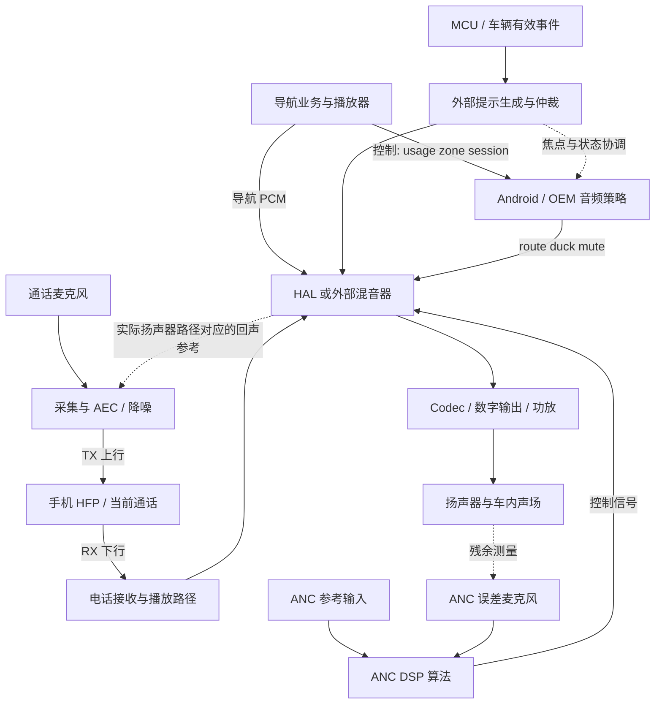
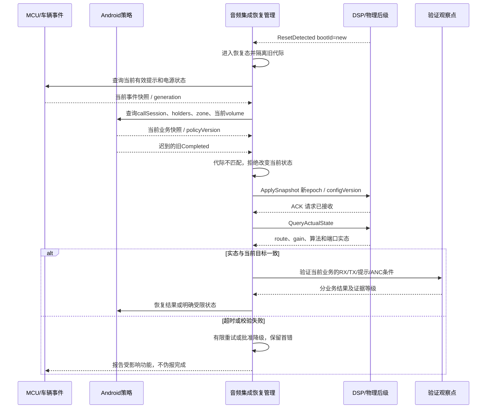

# Day 37 — Audio IV：ANC、电话、导航播报与提示音

日期：2026-09-26，星期六，Asia/Shanghai。课程序列：Week 11 / Audio 第四课。能力阶段：第二阶段“系统链路与问题分析”。预计深度：L3；恢复方案尝试 L4。

今天的目标：能把 ANC、电话上行/下行、导航和车辆提示放进同一张资源图；能根据证据区分“策略获准”“数据通过”“业务有效”；能设计 DSP 或 Android 复位后的安全恢复顺序。Day 34—36 材料已归档，但目前没有可核验的作答评审，继续标记待验证。

全课只抓两个概念：**不同业务共享音频硬件，但各自的完成条件不同；恢复必须按当前资源与会话重新对账。**下面的矩阵是工具箱，60 分钟先做主线，不要求把扩展项全部背完。

## 1. 今日资料与阅读边界

以下链接于 2026-09-26 读取核验；官方机制不等于本车型实现。

| 资料 | 建议读哪里 | 用来回答什么 |
| --- | --- | --- |
| [AOSP 汽车音频总览](https://source.android.com/docs/automotive/audio) | Android sounds、External streams | 哪些声音来自 Android，哪些可以在外部混音器生成？ |
| [AOSP Audio Control HAL](https://source.android.com/docs/automotive/audio/audio-control-hal) | Audio focus request from HAL、Car audio ducking | 外部声音怎样向 Android 报告焦点，duck 通知在哪个边界交接？ |
| [AOSP Volume management](https://source.android.com/docs/automotive/audio/volume-management) | Considerations when ducking、Safety critical sounds | 为什么短暂无 PCM 不等于导航整体结束，焦点为何不能保证关键提示独占输出？ |
| [AOSP 采集预处理](https://source.android.com/docs/core/audio/implement-pre-processing) | VOICE_COMMUNICATION、AEC | 电话采集路径的回声处理应在哪个实际处理点核验？ |
| [Bluetooth SIG HFP](https://www.bluetooth.com/specifications/specs/hands-free-profile-1-10/) | Profile overview；深入时查规范对应项目版本 | 手机控制连接与双向语音能力属于哪个配置文件？ |
| [TI ANC 麦克风设计](https://www.ti.com/solution/active-noise-cancellation-anc-microphone) | Overview、Design requirements | ANC 麦克风、DSP 与低延迟链路为何要一起看？ |

视频仅作为可选扩展：搜索“Android Automotive AudioControl HAL external focus ducking”或“automotive ANC reference microphone error microphone DSP”。选择能展示框图、测点和验证结果的官方技术内容；本次没有核验具体视频直链，不把搜索词当作已观看资料。

## 2. 20:00—21:00 学习安排与回顾

| 时间 | 操作 | 结束时留下什么 |
| --- | --- | --- |
| 20:00—20:10 | 回答下列四题，先不查正文 | 四条解释，圈出不确定处 |
| 20:10—20:30 | 读第 3—5 节，画四业务资源图 | 区分四种业务完成证据 |
| 20:30—20:50 | 精做第 8 节故障二，再看复位时序 | 假设、反证、第一异常点 |
| 20:50—21:00 | 填第 11 节一页模板 | V1 契约与待确认项 |

回顾题：

1. Day 36 中，focus 已释放、媒体 PCM 一直前进，为什么媒体还可能保持低音量？写出两个不同责任域的观察点。
2. 用户在 duck 期间调过音量，导航结束后应恢复“旧音量”还是“当前目标”？你需要哪条状态证据？
3. audioZoneId、volumeGroup、DSP 端口、功放通道和扬声器如何串起来？一个逻辑音区为什么不能证明物理隔离？
4. DSP 复位前的 Completed 延迟到达，你凭什么拒收它？仅看墙上时钟是否足够？

本课验收：画清电话 RX/TX；区分 ANC 与 AEC；给出导航结束与提示结束不同的判据；为一次复位恢复写出 Owner、epoch、超时、完成点和一条反证。

## 3. 核心概念一：共享资源，不共享完成条件

### 3.1 先把四种“声音业务”放到正确位置

ANC（Active Noise Cancellation，主动噪声控制）目标是在指定位置、频段和工况降低噪声。参考输入为算法提供噪声相关信息，误差麦克风用于观察残余；实际系统可能采用前馈、反馈或混合结构，输入也可能来自车辆状态或传感器。TI 的设计说明强调麦克风采集、DSP 和低延迟要求；本车型的传感器、拓扑和标定都仍待确认。[TI ANC](https://www.ti.com/solution/active-noise-cancellation-anc-microphone)

AEC（Acoustic Echo Cancellation，声学回声消除）用于降低扬声器声音重新进入通话麦克风后传给远端的回声。它不等同于 ANC。Android 的采集预处理资料说明了 VOICE_COMMUNICATION 与 AEC 的关系，但实际电话路径可能在 DSP、蓝牙器件或别处处理，不能仅凭 App 层开关判断。[AOSP 采集预处理](https://source.android.com/docs/core/audio/implement-pre-processing)

电话必须拆成两条链：**RX 下行**让车内人听到远端，**TX 上行**让远端听到车内人。HFP 描述手机与免提设备间的控制和语音连接；本课以传统蓝牙 HFP 免提为教学场景，TBox 电话、eCall、LE Audio 不直接套用此拓扑。[Bluetooth SIG](https://www.bluetooth.com/specifications/specs/hands-free-profile-1-10/)

导航是一组有业务生命周期的播报，不一定只有一个 player 或一段连续 PCM。AOSP 提醒，不宜仅因数据暂时停止就激进恢复媒体音量。[Volume management](https://source.android.com/docs/automotive/audio/volume-management)

车辆提示的触发与有效期来自车辆状态，部分关键声音可在 Android 外部生成。AOSP 明确区分 Android 娱乐声音与外部提示，最终混音和物理输出仍由车辆实现承担。[汽车音频总览](https://source.android.com/docs/automotive/audio)

### 3.2 用业务问题定义完成点

下表是架构练习用的验收定义，不是量产车型规范。所有声学阈值、延迟和优先级待项目确认。

| 业务 | 上游输入 | 共享/独立资源 | 本课要求的完成证据 | 不能代替它的证据 |
| --- | --- | --- | --- | --- |
| ANC | 参考、误差与车辆工况 | 麦克风/ADC、DSP、输出通道；实际复用待确认 | 对照相同工况下开/关结果，指定测点残余噪声达标且无不稳定输出 | DSP 任务存活、开关显示 ON |
| 电话 RX | 远端语音、当前 callSession | 语音承载、播放路由、功放 | 当前通话下行在目标座位可听、时延和失真符合批准值 | UI 显示已接通 |
| 电话 TX | 当前麦克风、回声参考、隐私策略 | 采集、AEC/降噪、编码与上行 | 当前会话的车内语音到远端且回声/噪声符合批准值 | 本机 MIC counter 增长 |
| 导航 | maneuver/session、播报队列、有效期 | focus、播放器、目标音区 | 有效提示及时可听；全部合法 holder 结束后恢复当前媒体目标 | 一个 player 停止、一个 focus 回调 |
| 车辆提示 | 当前有效车辆事件与等级 | 外部音源、混音器、功放或批准备用路径 | 当前告警在规定条件下可感知，或明确进入批准降级 | IPC ACK、Android 已获焦点 |

例如用户说“电话没问题，只有远端听不见”，不要先重启整个音频栈：RX 正常只能缩小范围，不能证明 TX 采集、处理和承载正常。反过来，远端听到自己的声音可能与 AEC 参考链、延迟、处理部署有关，不能把它直接命名为“ANC 故障”。

### 3.3 四种流与一张资源图

控制流决定谁申请、谁仲裁、谁设置路由；数据流承载 PCM、参考和误差信号；状态流记录会话、holder、配置与 ready；证据流提供计数、时间和测量结果。把这四种流混成一个“播放成功”日志，会丢失责任边界。

这是候选职责图，不主张所有 PCM 必经同一混音器，也不主张所有车型的 AEC 参考取自 MIX。图中参考点应按真实增益、延迟和扬声器路径核实。将“逻辑角色”落实到 Android、Yocto、DSP、MCU 或独立硬件，是项目确认工作。

## 4. 分层职责：谁能证明哪一段

| 层/Owner | 输入与职责 | 输出和最小证据 | 本课边界 |
| --- | --- | --- | --- |
| 业务/HMI | 导航、通话、提示触发及取消 | session、事件有效期、目标 zone | UI 成功不宣告物理完成 |
| Framework/车音频策略 | focus holder、usage、音区、OEM 策略 | 当前策略版本、duck/mute/route 目标 | 不能独自证明外部声音被播放 |
| HAL/跨 OS 代理 | 承接策略，映射实际设备 | 消息 ID、应用结果、实态查询 | 外部提示可经 AudioControl HAL 协调；消息不等于声学结果 |
| Kernel/Driver | PCM、DMA、时钟、接口和电源 | 读写指针、XRUN、clock、设备状态 | 日志计数必须属于当前启动代际 |
| DSP/Firmware | AEC/ANC、混音与增益，具体部署按项目 | firmware bootId、port、处理状态、系数版本 | 算法运行不等于目标功能达标 |
| MCU/外部域 | 车辆告警有效性、电源条件 | eventId、有效/清除状态、复位原因 | 避免用收到一次触发永久锁定提示 |
| 硬件/声学 | ADC、Codec、功放、MIC、扬声器与线束 | 波形、fault、声学对照测量 | 共用物理后级是共同故障域 |
| Hypervisor/虚拟后端 | 若资源跨 VM，维护队列与设备归属 | Guest generation、连接与 buffer 状态 | 无虚拟化音频路径时标不适用，不强行加一层 |

Bootloader 与安全固件是否参与早期提示、TEE 是否参与访问授权，都应从项目部署确认；不默认它们处理日常电话 PCM。集成 Owner 负责串起证据，各层只报告自己实际观察到的完成点。

## 5. 核心概念二：复位恢复是当前状态重建

教学场景：导航正压低媒体，电话进入，随后 DSP 复位。Android 仍持有旧 route；DSP 的 gain、端口和算法状态已经重建。此时“重放最后一条 unmute”可能恢复错误通话、错误音区或过期提示。

建议的候选恢复状态为：发现复位 → 限制受影响输出 → 读取新代际 → 查询当前业务与车辆状态 → 应用一致配置 → 校验路由/增益/算法 → 业务验证 → 返回运行。每一步必须有 Owner 和失败出口。

“限制输出”不能简单理解为全车静音。普通媒体与关键提示如何隔离、备用路径是否存在，需按批准架构处理；没有备用路径时必须报告不可用，不能写出虚假的成功。

这里的恢复管理是逻辑职责，不要求新增一个守护进程。ACK 只确认收件；Local Completed 只确认本地配置应用；业务完成按第 3 节分别验证。量产运行若只能观察到 DSP 端口，就记录“验证至 DSP”，声学完成必须由对应测量证据支持。

## 6. 关键通信契约与超时

下表全部为教学候选契约，非厂商真实 API 名。通道与字段需映射项目接口，T_*、N_*、TTL 和声学指标均待项目确认。公共关联字段：requestId、sourceId、zoneId、sessionId、bootId、epoch、sequenceId、configVersion。

| 发送→接收 / Owner | 触发、输入与通道候选 | ACK / Completed | 超时、重试、取消、复位 |
| --- | --- | --- | --- |
| 导航业务→音频策略 / 导航与Framework | maneuver 有效；Binder；Acquire/ReleaseHolder | ACK 收到；策略完成需 holder 集与目标增益；可听另验 | T_focus；同 request 幂等；取消后停止过期播报；所有合法 holder 退出才重算恢复 |
| 手机/HFP栈→电话路由 / 蓝牙与音频集成 | 当前 callSession；蓝牙控制/语音与本地 HAL | call 状态、音频承载、RX/TX 实态分别记录 | T_callRoute；断连显式失败；新会话不继承旧路由完成 |
| 采集/播放后端→AEC处理 / DSP与采集Owner | 当前 MIC、参考、采样格式和时间对应 | ACK 配置；局部完成为数据与配置匹配；远端回声另测 | 参考丢失/延迟越界时批准降级；勿无界重建采集；新epoch重对齐 |
| MCU提示控制→外部生成/仲裁 / 车辆提示Owner | 当前车辆事件；CAN/Ethernet/IPC 候选 | ACK 触发收到；输出状态；提示是否可感知需验证 | TTL/清除语义；重复触发不叠加；复位查询权威车辆事件，不盲重播旧事件 |
| 恢复管理→DSP/功放 / 系统音频集成 | 当前快照与允许电源态；IPC+器件控制 | ACK 接收；读回 route/gain/config；分业务验收 | T_rebuild 与 N_rebuild；有限重试；配置不一致停留受限态；旧bootId拒收 |
| ANC控制→算法/标定 / DSP与声学 | 参考/误差可用、系数匹配、工况满足 | ACK 开启；局部算法活动；目标测点降噪与稳定性另验 | 输入失效按批准策略退出；系数未校验不能恢复增益；恢复不得仅重置UI |

超时计时用可比较的单调时钟。跨域日志要有共同事件或映射及误差；Android 与 DSP 的单调计数不能直接相减。一次 RPC 超时只证明规定时间未观察到回复，不证明物理动作未执行，应先查实态再决定是否重试。

## 7. 架构师如何评审这个方案

先问用户体验：关键提示是否及时可辨，电话上下行是否同时成立，导航是否会误恢复媒体。再问资源：谁共享 MIC、DSP 算力、输出矩阵和功放，哪个故障会同时影响多业务。随后问状态：谁保存当前目标，复位后谁有权宣布恢复。最终问证据：哪条日志能区分配置已下发和真正生效。

| 方案 | 优点 | 代价与失效边界 | 适用性判据 |
| --- | --- | --- | --- |
| A：集中 DSP 承担多业务，Android 管策略协调 | 资源与算法可统一管理，状态集中 | DSP/时钟/后级成为共同故障域，复位影响多业务，验证矩阵较大 | 资源预算、故障隔离及恢复满足项目要求 |
| B：批准的关键提示路径与娱乐音频分离 | 可降低对 Android 或娱乐处理的依赖 | 增加硬件/接口/仲裁成本；共用功放时仍有共同故障域 | 明确独立范围，做故障注入证明隔离 |

不是所有项目都需要 B。先用需求、可用性、时延、成本和可维护性说明推荐理由。任何“独立路径”都要继续追到电源、时钟、功放和扬声器，不能只看两个软件进程不同。

## 8. 工程案例：三个故障的九步分析

这些是教学推演，日志符号和故障注入均为示例，没有冒充本项目实测。今天精做故障二，另外两个用于查阅。

### 故障一：电话已接通，车内听得到，远端听不到

1. **现象**：当前通话 RX 正常，TX 无语音；记录发生前是否有隐私切换、用户切换或休眠恢复。
2. **阶段**：MIC→ADC/采集→预处理→编码/语音承载→远端。
3. **假设**：隐私/静音策略；错误 MIC 或 route；采集无数据；处理配置错误；上行承载/远端异常。
4. **证据**：callSession、TX mute、MIC选择、采集与处理前后计数、语音承载事件及受控远端录音；有计数仍要核验内容是否是当前语音。
5. **定位**：用授权测试语音逐段比较最后正常点与首个缺失点；不要用 RX 证据替代 TX。
6. **根因门槛**：例如采集前有当前测试音、处理后固定静音，且唯一修改错误 TX mute 后恢复，才支持该处理点；不足则保留候选。
7. **临时恢复**：保留首错后重新建立当前 TX route；无法恢复时明确提示不可用并按产品策略处理，勿暗中解除隐私设置。
8. **永久修复**：会话切换时统一 TX 目标与实际状态，加入配置读回和失效清理。
9. **回归**：来去电、切手机/车机、双向说话、隐私开关、重连、休眠及Guest/DSP复位。

### 故障二：导航结束后媒体突然变响，但电话仍在进行

1. **现象**：通话仍有效，导航 UI 已退出，媒体被恢复到高于当前策略允许的增益。
2. **阶段**：导航 holder 退出→策略重算→HAL/DSP gain 应用。
3. **假设**：旧导航结束覆盖新电话；仅按一个 player stop 恢复；phone holder 未纳入；DSP复位后旧快照回写；音区混淆。
4. **证据**：当前 callSession、完整 holder 集、policyVersion、zone、targetGain/actualGain、epoch、请求序号、DSP复位记录和目标座位声学包络。
5. **定位**：找第一个与当前 holder 集不一致的目标值。若策略已发正确低增益而DSP高增益，继续查执行与复位；若策略直接要求高增益，先查策略输入。
6. **根因门槛**：旧session事件到达后引起错误目标，拒绝该事件后同场景不再出现，且没有掩盖合法电话结束，才能支持旧事件覆盖假设。
7. **临时恢复**：基于当前电话/导航/用户音量重算目标并读回；受控执行一次，不循环强设某个固定音量。
8. **永久修复**：按 holder 集合与当前目标恢复，使用会话/代际隔离、幂等应用、有限超时与实态对账。
9. **回归**：多段导航、取消、电话接入/退出、duck期间调音量、重复/乱序事件、多音区与DSP复位组合。

### 故障三：ANC 显示开启，车内噪声反而异常

1. **现象**：指定工况开启 ANC 后某测点噪声增大或出现不期望输出；先区分电话回声和车内残余噪声。
2. **阶段**：参考/误差采集→算法/系数→输出通道→声场闭环。
3. **假设**：MIC映射错误；输入延迟/采样条件改变；系数或车型版本不符；输出通道映射/极性错误；后级故障；工况超出批准范围。
4. **证据**：当前配置/系数hash、参考与误差同步采样、DSP bootId、延迟观测、通道测试、开关ANC的受控声学对照。
5. **定位**：先确认有效输入与映射，再验证系数/时序，最后看输出与声场；不能凭“重启好了”定位算法。
6. **根因门槛**：在相同工况、同一测量口径下，单一配置修正稳定改变结果，同时排除硬件/环境变化，才收敛责任。
7. **临时恢复**：依批准策略停用受影响 ANC，保留其他必要业务；不对未知不稳定环路盲目加增益。
8. **永久修复**：启动/恢复前核对输入、系数、路由和版本，失效时显式降级，并由声学与DSP共同验收。
9. **回归**：批准工况与边界、温度/电压条件、复位、缺失参考/误差输入、系数回退和与电话/提示并发。

## 9. 日志、DTC 与时间线

教学 Tag：`[AUDIO][business][domain][event][sessionId][zoneId][bootId][epoch][sequenceId][policyVersion][configVersion][targetGain][actualGain][state][reason][monotonicTime][evidenceId]`。不是要求每条日志都打印全部字段，而是保证关键状态转换可以关联。

一次故障二的证据骨架：t0 电话 holder 加入；t1 导航结束；t2 当前集合仍包含电话；t3 发出的目标增益；t4 DSP 实际增益；t5 声学包络。若 t3 已错误，先检策略；若 t3 正确而 t4 错误，检执行与配置；若 t4 正确而 t5 错误，核对实际路由、后级与测量口径。所有 t 必须同域或经过有误差说明的映射，符号不代表实测毫秒。

故障快照记录首错、复位原因、会话、配置和实际状态。DTC 编号、去抖、清除和持久化策略由项目诊断字典确认，本课不编造编号。普通日志不存电话内容、联系人或PCM；只有授权调试、限定窗口的采样才用于语音与声学对照，并按项目保留规则处理。

## 10. 扩展：十二类可执行测试矩阵

通用前置 P：授权台架；记录真实拓扑、软件/固件/配置版本、时钟映射、基线；具备受控测试音和必要的声学测量。阈值全部待批准。本表可在复盘时选三项落地，无需今日全部执行。

| 类别/目标 | 前置与输入 | 步骤与观察点 | 预期与通过证据 | Tag |
| --- | --- | --- | --- | --- |
| 正常业务 | P；电话+导航+媒体 | 接通→播报→结束；采集holder、gain、RX/TX与声学 | 与批准策略一致，电话双向有效，恢复当前目标 | NORMAL |
| 重复操作 | P；同request重发 | 重发导航结束/提示触发，观察执行次数与事件集合 | 无重复音、累计增益或错误清除 | IDEMPOTENT |
| 状态遍历 | P；idle/active/duck/recover | 各态进入/退出/中断；查资源与会话 | 无悬挂holder和过期业务 | STATE |
| 边界条件 | P；批准源数/音区/音量边界 | 单变量改变并测量 | 合法范围达指标，非法项明确拒绝 | BOUNDARY |
| 通信异常 | P；可控代理 | 丢ACK、重包、乱序旧epoch；查实态与attempt | 不重复副作用，有限重试后完成或明确失败 | IPC |
| 软件异常 | P；可控非道路环境 | 分别重启策略/后端；查bootId与全量快照 | 不继承旧会话，当前业务按策略恢复 | SOFTWARE |
| 硬件异常 | P；批准夹具 | 单独断参考MIC或拉功放fault；查输入/输出 | 首断点可见，进入相应批准降级 | HARDWARE |
| 复位恢复 | P；电话+导航有效 | DSP复位→注入旧完成→新快照；查会话与gain | 旧完成不改新状态，分业务报告结果 | RESET |
| 组合场景 | P；多音区/提示 | 电话中导航、提示、用户调音量组合 | 不错区、不误恢复，提示按批准策略处理 | COMBO |
| 长稳 | P；批准循环次数 | 连续来电/播报/取消/休眠，趋势观察 | 无holder、buffer、资源累计与增益漂移 | LONGRUN |
| 可观测性 | P；人为首错+RTC跳变 | 导出日志重建单调时间线 | 能找到首错与反证，误差可解释且无敏感音频泄漏 | OBS |
| 相邻回归 | 修复版与同条件基线 | 比较媒体、电话RX/TX、ANC、提示 | 修复目标成立，相邻链未退化 | REGRESSION |

## 11. 当日产物：一页《音频并发与复位恢复契约 V1》

先填写自己的答案，空白就是待确认项。此模板属于教学资产，不是已批准量产接口。

| 必填项 | 你的填写区 |
| --- | --- |
| 场景、当前系统状态、车辆条件 | 待填写 |
| 四业务与运行域、共享硬件、Owner | 待填写 |
| 电话 RX 与 TX 路径、ANC/AEC 区别 | 待填写 |
| 当前 session/holder/zone/config/epoch | 待填写 |
| 请求、ACK、局部完成、分业务完成证据 | 待填写 |
| 复位后快照来源与应用顺序 | 待填写 |
| 超时、有限重试、取消、旧消息、降级 | 待填写 |
| 第一异常点、两个假设与对应反证 | 待填写 |
| 一条正常时间线、一条故障时间线 | 待填写 |
| 三项测试及通过口径、待项目确认参数 | 待填写 |

至少画一张时序图并填写电话RX/TX、导航和提示；ANC标出资源与恢复前置即可。后续汇入《智能座舱域控制器入门架构方案》的音频、接口、诊断、异常恢复和验证章节，沿用原档案章节映射时核对版本，不能凭本课自评直接进入正式基线。

## 12. 六道综合题：提交后再批改

1. **完整链路（20分）**：画电话RX与TX，标明实际候选域、AEC参考和各自完成证据。说明“已接通”不能证明什么。
2. **职责边界（15分）**：比较ANC与AEC的目标、输入、输出和失效证据；给出一个把二者混淆会造成错误定责的例子。
3. **用户场景（15分）**：电话中导航取消，用户刚修改媒体音量。如何确定当前合法holder和恢复目标？
4. **故障推理（20分）**：为故障二提出两个不同责任域的假设，各写一条可以否定它的证据，指出缺证据时结论边界。
5. **时序设计（15分）**：DSP在提示播放期间复位，画出旧epoch拒收、当前车辆事件查询、配置读回、有限重试和分业务结果。
6. **验证设计（15分）**：从第10节选正常、复位、通信异常三类，填实际操作、测点与通过口径；未知参数不得编数。

提交到本学习聊天即可。评分只在收到你的回答后进行，分别给出通过/需补答/未通过，不提前宣称100分或掌握。

## 13. 学习状态台账

| 项目 | 本次记录 |
| --- | --- |
| 发布进度 | Day37课程材料已准备；是否线上发布以提交与部署记录为准 |
| 学习状态 | 待作答，L3能力待验证 |
| 之前状态 | Day34—36无可核验批改，不新增已掌握 |
| 待验证点 | ANC/AEC区别、电话双向证据、holder集合、旧epoch、关键提示共同故障域 |
| 错题 | 无用户答案，不编造错题 |
| 产物 | 教练版图表与空白V1模板已提供；学习者版待提交 |
| 下一任务 | Week11音频综合复盘，串联Day34—37，不增加新专题 |
| 项目待确认 | 实际OS/DSP/蓝牙路径、策略表、MIC/扬声器映射、AEC参考点、ANC输入与系数、T/N阈值、关键提示降级 |

课程覆盖检查仅用于检查材料是否包含资料、分层、正常/异常、时序、通信、证据、验证和产物；它不是学习者考试结果，也不是项目认证。

## 14. 今天需要记住的五条结论

1. ANC与AEC服务于不同目标，先问业务和证据，再选排查链。
2. 电话必须分别验证RX与TX；UI和焦点都不是完整通话证据。
3. 导航结束应依据当前holder与业务状态，恢复当前目标，不能重放旧音量。
4. DSP或Guest复位后，配置、会话、代际与真实资源必须重新对账。
5. 每个模块的成功只证明它的观察范围；可听、降噪或远端可懂要有相应测量。

**今天的架构师思维：看到“都返回成功”，继续追问它们是否属于同一会话、同一代际，以及是否共同证明当前业务目标。**

明天建议：Day34—37音频综合复盘，用“电话中导航结束恰遇DSP复位”检验链路、状态、证据和恢复设计。
