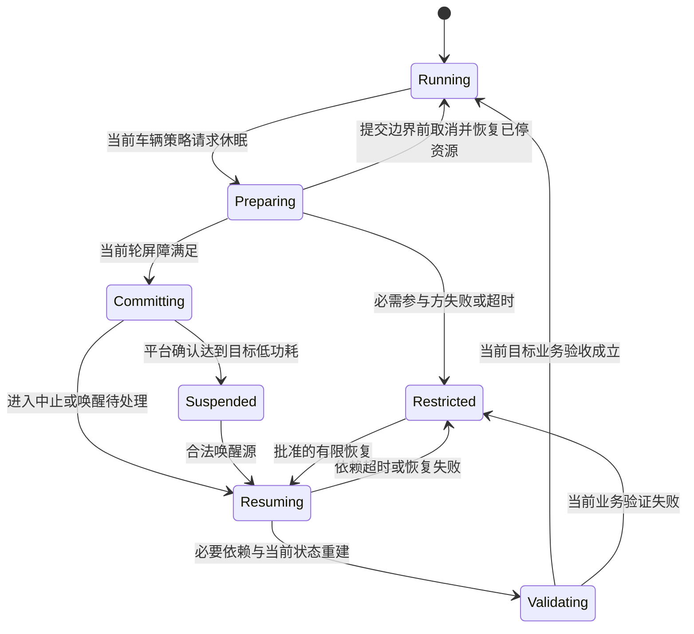
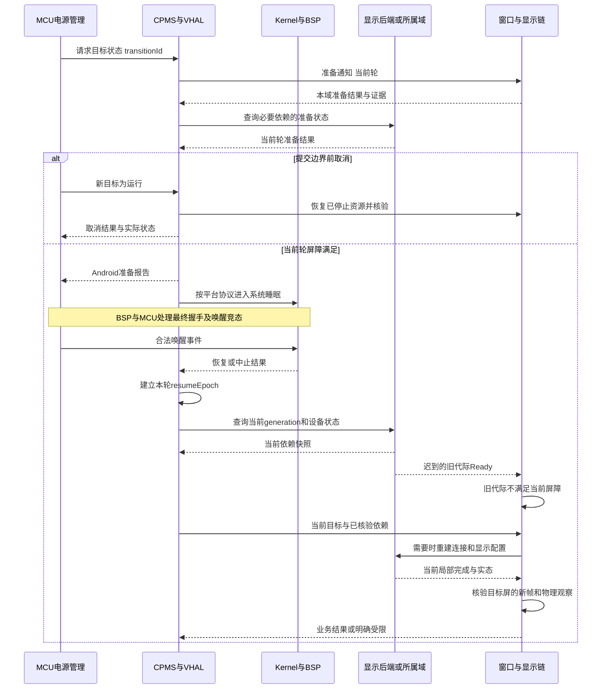

# Day 38 — STR / Resume I：状态边界、跨域屏障与显示恢复

学习日期：2026-09-29，星期二，Asia/Shanghai。课程序列：Week 12，STR / Resume 与 Display 第一课。能力阶段：第二阶段“系统链路与问题分析”。目标深度：L3，恢复合同尝试 L4。实际补充日期为 2026-09-29；9 月 28 日对应 Day 37，本课不代替昨日音频课。

今天的目标：能分清熄屏、系统休眠和业务可用；能画出 MCU、Android、内核与显示后端的准备和恢复边界；能用证据定位一次唤醒黑屏的第一异常点。Day 34—37 尚无可核验答卷，本课可以继续阅读，掌握程度仍待验证。

本课只抓两个概念：**系统休眠是一组有条件的状态转换；恢复完成是一组属于当前代际、当前目标的证据。**由 Day 37 的 DSP 复位延伸到整机电源，延续“当前状态重建”的方法，不重复 Day 7—8 的电源管理概览。

## 1. 资料、版本与阅读边界

以下官方资料于 2026-09-29 读取核验。只提取机制；具体车型、Android 分支、内核版本、MCU 协议、显示拓扑与超时均待项目确认。后文所有 epoch、屏障、状态名、案例日志与参数 T/N 均为教学设计，不是厂商现成接口，也不构成实车根因结论。

| 资料 | 优先阅读 | 帮助核验什么 |
| --- | --- | --- |
| [AOSP 车辆电源管理](https://source.android.com/docs/automotive/power/power) | System design、VHAL responsibility | CPMS/VHAL/MCU 的协作与电源状态请求、报告 |
| [Linux 系统睡眠状态](https://docs.kernel.org/admin-guide/pm/sleep-states.html) | Suspend-to-RAM、sysfs interfaces | STR 与 s2idle 的区别；mem 的实际选择 |
| [Linux 设备电源管理](https://docs.kernel.org/driver-api/pm/devices.html) | System Sleep、回调阶段 | 驱动准备、低功耗与恢复依赖 |
| [Linux 休眠与中断](https://docs.kernel.org/power/suspend-and-interrupts.html) | Wakeup Interrupts | 普通中断处理与唤醒能力的边界 |
| [AOSP SurfaceFlinger 与 WindowManager](https://source.android.com/docs/core/graphics/surfaceflinger-windowmanager) | SurfaceFlinger、WindowManager | 图层、buffer 与显示合成的职责 |
| [AOSP 同步框架](https://source.android.com/docs/core/graphics/sync) | Fence 的用途 | 为什么队列提交与异步执行完成要分开 |
| [Linux clock_gettime 手册](https://man7.org/linux/man-pages/man2/clock_gettime.2.html) | CLOCK_MONOTONIC、CLOCK_BOOTTIME | 计时是否包含休眠时段 |

阅读顺序：先看前两份，剩余资料用于查证。视频可选搜索“Android Automotive power management suspend resume”及“Linux device suspend resume”；本次没有核验视频直链，不将搜索词视为已读来源。

## 2. 一小时主线与回顾

| 时间 | 学习动作 | 留下的结果 |
| --- | --- | --- |
| 20:00—20:10 | 独立回答下面四题 | 四条解释和不确定项 |
| 20:10—20:30 | 阅读第 3—5 节 | 一张状态图及三个完成点 |
| 20:30—20:50 | 推演第 7 节黑屏案例 | 第一异常点、假设与反证 |
| 20:50—21:00 | 填第 10 节契约 | 一页 V1，至少三项测试 |

可在任意时段完成这四段，不要求在补发当晚一次学完两课。第 6、8、9 节是查阅工具箱。

1. Day 37 中 DSP 重启后，为什么旧 Completed 不能证明当前音频配置完成？把这个问题换成显示后端会怎样？
2. Day 7—8 中，屏幕已经熄灭，能否说明 AP 已进入 STR？还缺哪两类证据？
3. Day 24—25 中，应用产生 buffer、SurfaceFlinger 合成、物理屏幕出图分别由谁观察？
4. MCU 与 Android 的日志时间相差很大，怎样避免把日志打印顺序误当成因果顺序？

本课验收：能解释一次准备取消和一次恢复失败；能把 ACK、局部完成、业务完成分开；能提出至少两个不同责任域的黑屏假设并设计反证。

## 3. 核心概念一：电源状态不是一个布尔值

STR（Suspend-to-RAM）依赖内存内容保留；外设上下文是否保留要逐项确认。熄屏只是显示相关状态；runtime PM 是设备运行期电源管理；系统睡眠涉及整机协调。不能从“黑屏”直接推出 STR，也不能把一次冷启动写成成功恢复。[Linux 睡眠状态](https://docs.kernel.org/admin-guide/pm/sleep-states.html)、[设备电源管理](https://docs.kernel.org/driver-api/pm/devices.html)。

Linux 的 `/sys/power/state` 中出现 `mem`，还要结合 `/sys/power/mem_sleep` 的当前选择；支持列表与方括号选择有不同含义。接口存在或请求返回，不能单独证明平台达到预期低功耗。[Linux sysfs 说明](https://docs.kernel.org/admin-guide/pm/sleep-states.html)。

AAOS 由 CPMS 协调 Android 电源转换，VHAL 连接车辆侧请求与报告；`AP_POWER_STATE_REQ`、`AP_POWER_STATE_REPORT` 是两个方向。Android 的电源状态、内核 PM 阶段与 MCU 电源轨状态要分别记录。[AOSP 电源管理](https://source.android.com/docs/automotive/power/power)。

### 3.1 术语与教学状态

| 术语/状态 | 本课含义 | 不能据此宣告什么 |
| --- | --- | --- |
| Prepare | 关闭新增工作入口，排空或取消受影响任务，收集准备结果 | 不表示 AP 已休眠 |
| Quiesce / 静止点 | 合同范围内的在途工作已处理，资源可进入下一阶段 | 不表示所有域都完成 |
| Barrier / 跨域屏障 | 必需参与方对同一 transitionId/epoch 满足前置条件 | 不接受另一轮的迟到成功凑数 |
| CommitBoundary / 提交边界 | 项目约定的电源切换阶段，之后不能按普通用户态取消处理 | 不是所有平台都存在同一个绝对不可逆瞬间 |
| ResumeEpoch | 本次恢复的关联代际，由项目定义和传播 | 不等同于系统 bootId；一次正常 STR 可不改变 bootId |
| LocalReady | 当前模块在声明范围内已恢复 | 不表示目标显示器有当前业务画面 |
| BusinessReady | 当前策略允许的业务在目标屏上达到定义的验收点 | 不以“服务进程活着”替代 |

“不可逆阶段”在这里指恢复路径改变：用户态冻结、设备不可访问或电源控制已移交后，普通取消请求不一定还能执行；应使用平台认可的中止、回滚或唤醒流程。内核仍可能因待处理唤醒事件中止休眠，因此不能宣称“收到 FINISHED 后绝不可能取消”。具体判据由 BSP 与 MCU 共同给出。

图中 Restricted 只表达受限状态；后续保持唤醒、重试、关机或其他动作必须由车辆策略决定。它不是允许无限阻止整车休眠的兜底状态。

### 3.2 分层职责和上下游

| 层/Owner | 控制、数据与状态职责 | 最小证据 |
| --- | --- | --- |
| MCU / 车辆电源管理 | 接收车辆状态，决定允许的电源目标，管理相关唤醒与电源条件 | 请求序号、目标、实际电源状态、唤醒原因 |
| Android CPMS / VHAL | 协调 Android 的准备、报告与车辆侧会话 | 状态转换、请求/报告、未完成参与方与原因 |
| Framework / 应用 | 按目标停发或恢复任务，维护当前用户/屏/业务 | 业务目标、displayId、当前窗口与新帧标识 |
| Kernel / 驱动 / BSP | 处理设备依赖、时钟、电源、复位与 PM 阶段 | 回调首错、资源读回、设备实例、唤醒事件 |
| SOS / Hypervisor / 虚拟显示后端（若存在） | 协调设备所属域与 Guest 生命周期，重建失效通道 | backendGeneration、连接、队列与设备所有权 |
| SurfaceFlinger / HWC / 显示驱动 | 图层合成与送显，按真实拓扑交接 | 当前屏的图层、buffer/frameId、fence 和提交结果 |
| 链路 / 面板 / 背光（若存在） | 接收显示信号，形成可见画面 | 锁定/错误状态、面板状态、光学观察 |
| 集成 Owner | 汇总各域证据并声明观察范围 | 依赖图、首异常、当前业务验收与限制 |

控制流是“允许哪个电源和显示目标”，数据流是“哪一帧经过哪条通道”，状态流是“设备、连接与画面到底处于什么状态”。控制成功不自动证明数据新鲜或物理输出成功。OLED 等屏幕不能照搬 LCD 背光检查；没有虚拟化路径时明确标注不适用。TEE/固件只在项目确实涉及授权或电源切换时纳入，不预设其承担所有恢复工作。

## 4. 核心概念二：恢复按依赖和当前目标验收

SurfaceFlinger 处理图层与 buffer，并与 HWC 配合合成和送显；WindowManager 管理窗口及其显示属性。[AOSP 图形职责](https://source.android.com/docs/core/graphics/surfaceflinger-windowmanager)。异步图形操作用 fence 表达相应工作进度，具体信号语义须对应接口版本。[AOSP 同步框架](https://source.android.com/docs/core/graphics/sync)。

由此可以建立以下**教学验收分层**：

| 完成点 | 示例 | 证据边界 |
| --- | --- | --- |
| ACK | 恢复请求被接收并关联 requestId | 只能证明收件 |
| Local Completed | 显示驱动恢复回调完成，或后端当前连接就绪 | 仅覆盖该模块承诺的范围 |
| Pipeline Ready | 当前屏的帧进入有效链路，相关异步结果符合接口合同 | 不能单靠一个 fence 推断用户已看到正确画面 |
| Business Ready | 当前车辆/用户策略允许的界面，在目标屏显示当前内容并达到要求 | 需定义画面身份、新鲜度和物理观察；交互可用另验 |

候选恢复条件可以写成：当前电源目标有效 ∧ 必要依赖就绪 ∧ 代际一致 ∧ 当前屏配置一致 ∧ 验收证据满足。这里只规定依赖关系，不要求所有模块串行启动。独立模块可以并行，但使用它们的模块必须等待相应条件。

可执行的评审问题：显示后端位于哪个域？谁能复位它？如果 Android 的对象还活着，而后端已经重建，这个对象保存的句柄、队列、配置还有效吗？答案应来自接口合同和实际状态，不能从“RAM 保留”推定所有外设和连接都保留。

## 5. 正常链、取消链与恢复时序

以下是跨域教学协议，不是对 AOSP 内部回调逐行复刻。实际准备回调的允许阶段、异步完成方式与超时要按目标 Android 分支核对；不得在任何回调中任意阻塞等待其他域。

正常链必须保留从准备、进入、唤醒到当前业务的关联。取消链还要检查已暂停的生产者、已改变的显示策略是否恢复，不能只清除一个“正在休眠”标志。若已经进入无法接收普通 IPC 的阶段，则交给批准的唤醒/中止路径，不能无限等待取消 ACK。

## 6. 接口合同、超时与异常出口

所有名称是候选逻辑动作；通道须映射实际 Binder、VHAL、跨 OS IPC 或硬件信号。T_prepare、T_dependency、T_firstFrame、N_retry 均待项目确认，并写清计时起点和包含的阶段。

| 交接 / Owner | 输入和关联 | ACK / 完成 | 异常要求 |
| --- | --- | --- | --- |
| MCU→VHAL/CPMS / 电源集成 | transitionId、当前车辆目标、允许延期条件 | 请求收到 / 当前阶段报告 | 去重；新目标取代旧目标须有规则；不得无限延期 |
| 协调方→参与方 / 各模块 | 当前轮、准备范围、截止时间 | 收到 / 该范围工作已静止 | 同 request 幂等；列出未完成原因；取消后恢复已停资源 |
| BSP↔MCU / 平台电源 | 平台协议阶段、实际电源条件 | 协议信号 / 实际进入或中止证据 | 最终握手竞态由平台机制保证，不能由固定 sleep 猜测 |
| 显示链→后端 / 显示集成 | resumeEpoch、backendGeneration、displayId、配置版本 | 收件 / 当前连接与配置实态 | 超时后先查实态；有限重试；后端复位使旧完成失效 |
| 显示链→验收 / 功能 Owner | 目标策略、frameId、新鲜度、目标屏 | 请求观察 / 满足定义的业务证据 | 屏幕按策略保持关闭时不误报黑屏故障；证据不足不得报成功 |

一个教学故障分支：后端没有在 T_dependency 内提供当前代际就绪 → 保存首错及前后状态 → 查询后端是否已完成但回复丢失 → 按批准范围重建连接，最多 N_retry 次 → 成功则重新验证当前画面，失败则报告具体屏与功能受限。不能把所有故障统一处理成重启整机。

复位后以权威当前状态重建；旧消息即使序号很大，也不能跨 generation 使用。对于执行结果不明的请求，幂等键和实态查询配合使用；单纯重复发送可能重复开关设备或覆盖新目标。

## 7. 工程案例：唤醒后主屏黑，但音频与触摸事件存在

### 7.1 教学输入

车辆条件允许主屏点亮；本轮系统恢复后媒体可听，触摸服务有输入事件，但主屏无可见画面。副屏是否正常、屏幕类型、背光状态与实际拓扑均需先采集。以下为合成日志，无实车测量含义；表格按关联整理，不表示不同域的原始时钟可以直接比较。

| 观察点 | 教学证据 | 此时能说什么 |
| --- | --- | --- |
| MCU | 当前目标 RUN，唤醒原因已记录 | 车辆侧期望运行 |
| Kernel | 本轮恢复路径返回，bootId 未变 | 不能从这里推出显示已可用 |
| 显示后端 | 当前 backendGeneration=G8 | 需要核对前端是否仍使用 G7 |
| 前端回调 | 收到 Ready，消息携带 G7 | 该消息不满足 G8 的恢复条件 |
| 应用 | 当前目标屏提交 frame=F201 | 尚缺合成、后端、物理输出证据 |
| 后端 | 需要查询是否接受 F201、配置属于哪一代 | 日志缺失不能直接等同于操作未执行 |
| 物理观察 | 目标屏未出现测试图案 | 业务失败已观察到，根因仍需收敛 |

这是一个**示范分析案例**，用于展示证据方法；第 11 节独立题不提供参考作答。

### 7.2 九步分析

1. **现象与范围**：明确哪个屏、当前应显示什么、发生概率及恢复前动作。音频和触摸存在只说明各自链路部分可用，不能说明显示链无故障。
2. **划分阶段**：车辆目标→Android 策略→应用/窗口→合成→显示后端→驱动/链路→面板。电源与时钟作为横向依赖，不能只画一条软件调用链。
3. **提出假设**：H1 前端误用旧代际完成，跳过当前连接重建；H2 后端配置正常但物理链路未恢复；H3 当前图层或显示策略错误，产生的是黑画面或送错屏。
4. **补齐证据**：采集前端期待的 generation、回调处理决定、后端有效连接、同一 frame 的接收/呈现结果、displayId、窗口和图层可见性、面板实态及测试图案观察。
5. **找第一异常点**：若发现前端在期望 G8 时接受 G7，并据此跳过必要恢复，这就是已证实的状态合同违例。它是否导致黑屏仍要检验，不能立即宣告唯一根因。
6. **反证与定责门槛**：如果前端实际拒绝 G7，H1 的这一机制被否定；若 G8 当前连接、配置及帧传递均成立，应向物理链路或图层内容继续查。固定其余条件，单独纠正代际处理后，当前帧稳定恢复且合法同代际路径无退化，才支持 H1 的因果解释。
7. **临时恢复**：保留首错后，按批准流程查询当前后端并重建受影响连接，再验证目标屏。不能凭重启后变好就定位根因；重启会同时改变多个变量。
8. **永久修复候选**：把 readiness 从无条件布尔值改为与代际、displayId、配置绑定的条件；失败时有期限和出口；后端变化使旧 readiness 失效。若证据支持 H2/H3，修复点应随证据调整。
9. **回归闭环**：正常 STR、准备取消、进入时立即唤醒、后端复位、旧消息乱序、ACK 丢失、多屏及连续循环；同时检查功耗、其他屏、音频与倒车显示是否退化。

### 7.3 两种候选恢复策略

| 方案 | 好处 | 代价与失效边界 | 选择需要的证据 |
| --- | --- | --- | --- |
| A：相关资源每次都重建 | 状态路径更统一，减少对保留状态的依赖 | 增加时延与资源操作；共享设备重建可能影响其他域 | 实测恢复预算、共享关系、幂等性与回归 |
| B：先核验保留状态，仅重建失效部分 | 可降低恢复开销，保留未受影响业务 | 状态核验复杂，错误的保留判断会留下旧资源 | 可验证的保留合同、代际传播与异常覆盖 |

选择取决于资源所有权、可观测性、时延与故障隔离要求。固定等待一段时间只能暂时改变竞态概率，不能证明依赖已经就绪。

## 8. 日志和时间线：能对齐才能判断先后

候选关键字段：`transitionId / resumeEpoch / bootId / backendGeneration / domain / phase / requestId / displayId / configVersion / frameId / targetState / actualState / result / reason / clockId / timestamp`。无需每行打印全部字段，但跨域交接必须能关联。

同域间隔也要选对时钟：Linux `CLOCK_MONOTONIC` 不包含系统休眠时间，`CLOCK_BOOTTIME` 包含；墙上时间可能调整。分别定义“整段停留时间”和“恢复执行耗时”，不要混减两类时间戳。[Linux 时钟说明](https://man7.org/linux/man-pages/man2/clock_gettime.2.html)。

跨域先用同一请求、硬件触发或已知同步事件建立映射，并保留误差范围；当两事件相差小于映射误差时，不能只按时间数值判因果。域复位后还要重建时钟映射。唤醒事件与普通中断执行也不是同一个观察点，具体处理依赖 PM 阶段。[Linux 中断说明](https://docs.kernel.org/power/suspend-and-interrupts.html)。

取证顺序建议：触发条件和当前目标→本轮 PM 首错→设备依赖→当前连接与帧→物理输出。所用日志、trace、计数器和示波器测点必须记录采集条件；没有抓到某条日志，只能标记证据缺口。DTC 的编号、去抖和清除规则查项目诊断字典，不在课程中编造。

## 9. 可执行测试工具箱

通用前置 P：经批准的台架、可恢复基线、实际软硬件版本及拓扑、明确屏幕应亮条件、可识别的新帧测试图案、时间映射和资源测点。所有数值阈值与循环次数由项目确定。今日至少落地正常、取消、旧消息三项。

| 类别 | 前置与操作 | 观察点 | 通过证据 |
| --- | --- | --- | --- |
| 正常链 | P；完成一次目标 STR，再用允许的源唤醒 | PM阶段、电源实态、当前屏新帧 | 进入目标状态且当前业务在预算内恢复 |
| 准备取消 | P；在不同准备阶段改变车辆目标 | 取消响应、已停止资源的恢复 | 不残留冻结生产者或错误熄屏，最终实态符合新目标 |
| 边界竞态 | P；在提交边界附近注入合法唤醒 | 平台中止/唤醒证据与本轮标识 | 不丢事件、不假报进入，不无界等待普通IPC |
| 依赖超时 | P；受控延迟必要后端就绪 | 缺失依赖、期限、恢复次数 | 有限处理并报告具体受限范围，不假报成功 |
| 通信异常 | P；分别丢ACK、重复请求、乱序结果 | 幂等键、执行次数、实态查询 | 结果不明时不盲重做，最终状态可解释 |
| 旧代际 | P；后端G8恢复期间注入G7完成 | 期望/消息generation与状态变化 | G7不满足G8屏障，合法G8结果仍可生效 |
| 软件复位 | P；仅重启显示后端或Guest | 资源所有权、连接和配置重建 | 旧资源失效可见，按当前目标恢复 |
| 硬件故障 | P；批准夹具模拟链路未锁定或面板未就绪 | 最后正常点、硬件状态、物理图案 | 将故障限制到实际范围，不以应用成功覆盖硬件失败 |
| 多屏组合 | P；一个屏应亮、另一个按策略保持关闭 | 每屏策略、displayId、帧路由 | 不错屏、不把合法关闭判为失败 |
| 时间与可观测性 | P；插入休眠间隔或调整墙上时间 | clockId、跨域关联、计时结果 | 预算口径正确，映射误差明确，首错可追溯 |
| 长稳与边界 | P；按批准次数循环，覆盖配置边界 | 句柄/内存/队列趋势、失败率、时延分布 | 无累积泄漏或持续退化，失败样本可回溯 |
| 相邻回归 | 修复版与基线同条件比较 | 音频、触摸、其他屏、倒车显示、电源 | 目标修复成立，相邻业务与功耗无未解释退化 |

测试记录须包含实际输入、操作时间、期望、实测、证据链接及结果。只有表格不等于测试已执行；本课没有任何实机测试结论。

## 10. 当日产物：《STR 与显示恢复契约 V1》

| 必填项 | 你的填写区 |
| --- | --- |
| 车型/台架版本、实际拓扑与屏幕类型 | 待填写 |
| 当前车辆目标、应显示内容、目标屏 | 待填写 |
| 参与方、Owner、资源依赖与所有权 | 待填写 |
| 准备屏障、可取消范围、提交边界证据 | 待填写 |
| transitionId、resumeEpoch、bootId、backendGeneration 的来源与传播 | 待填写 |
| ACK、局部完成、业务完成及观察范围 | 待填写 |
| 超时起点/时钟、幂等键、有限重试与失败出口 | 待填写 |
| 正常时序和一条异常时序 | 待填写 |
| 第一异常点、两个假设与各自反证 | 待填写 |
| 三项测试、通过口径、待项目确认参数 | 待填写 |

这份学习者产物后续并入《智能座舱域控制器入门架构方案》的电源、显示、跨域接口、可观测性和恢复章节。空白项保持待确认，不填假参数。

## 11. 六道独立练习：提交后再评审

1. **状态边界（15分）**：系统已熄屏但某后台任务仍在运行。画出还可能处于的阶段，列出确认进入目标 STR 所需的证据。
2. **分层职责（15分）**：选择一个有 MCU、Android、显示后端的候选拓扑，分别画控制、数据、状态流，标出三个不同完成点。
3. **取消设计（20分）**：屏幕已关闭，后端正在静止，在提交边界前收到新的运行目标。设计取消流程；再说明越过边界后哪些前提改变。
4. **故障推理（20分）**：副屏正常，主屏亮但一直显示唤醒前画面。提出两个不同责任域假设，每个写出支持证据、反证和下一测点，不预设唯一根因。
5. **协议设计（15分）**：恢复请求超时，后端可能已经完成；随后旧一轮成功到达。说明怎样查询、重试、拒绝过期结果，以及何时报告受限。
6. **验证设计（15分）**：从第9节选三类测试填入V1；明确计时口径、实际操作、通过条件及未知参数。

使用页面末尾“上传／提交答卷”提交文字和图，也可先在学习聊天中讨论。练习不附标准答案；收到真实答卷后按正确部分、不严谨处、缺失层级与证据、工程风险、修订建议以及通过/需补答/未通过逐项反馈。

## 12. 学习状态与下一课

| 项目 | 当前记录 |
| --- | --- |
| 材料 | Day38 内容于2026-09-29补充；线上状态以提交与部署核验为准 |
| 安排 | Week12，星期二；承接9月28日正式安排的Day37 |
| 作答与能力 | 待作答、待验证；不新增掌握证据 |
| 待验证点 | 取消边界、当前代际屏障、业务完成、黑屏/旧帧证据、计时口径 |
| 已知错题 | 未收到答案，不编造个人薄弱点 |
| 下一任务 | 2026-09-30 星期三，Day39：STR / Resume II——跨域恢复依赖、竞态与超时预算 |

今天记住：**先确认应达到的状态，再核对当前代际的依赖，最后用目标业务证据宣布恢复。**
