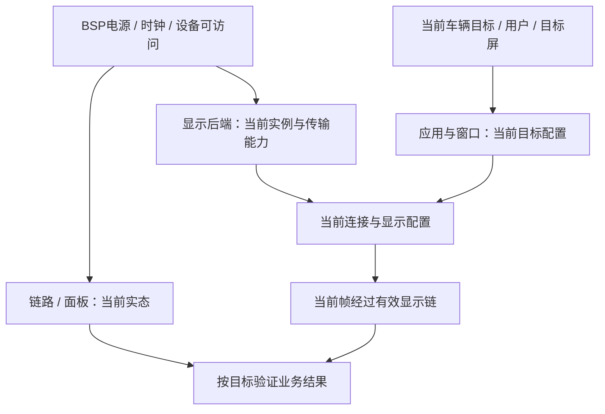
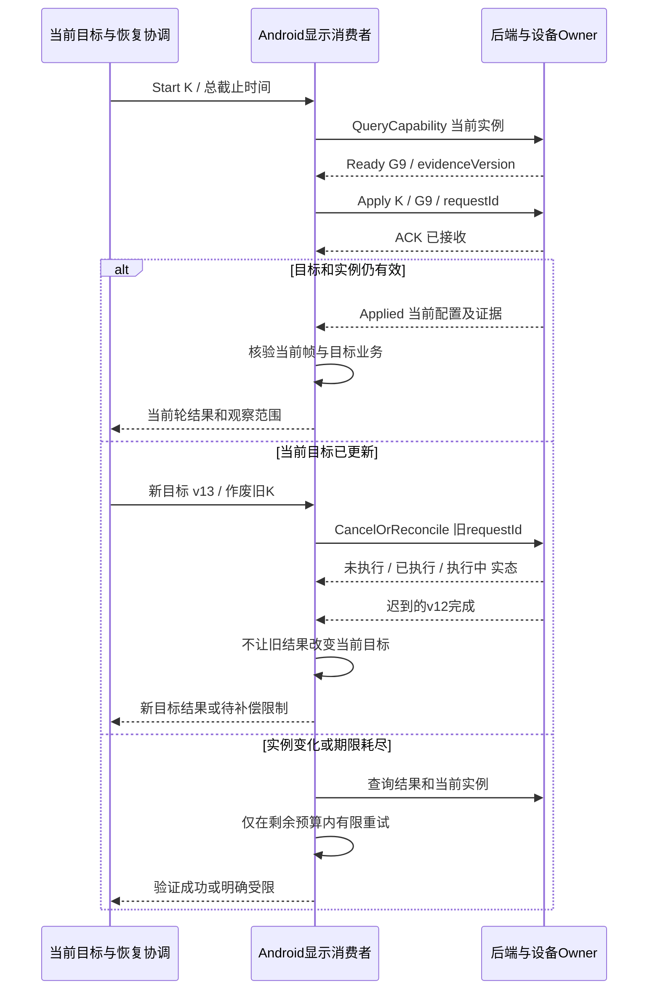

# Day 39 — STR / Resume II：跨域恢复依赖、竞态与超时预算

学习日期：2026-10-01，星期四，Asia/Shanghai。课程序列：Week 12，STR / Resume 与 Display 第二课。能力阶段：第二阶段“系统链路与问题分析”。目标深度：L3，依赖与超时合同尝试 L4。

本次实际唤醒已跨过北京时间午夜，按 10 月 1 日记录。远端最新课程为 Day 38，原定 9 月 30 日的 Day 39 尚未发布，因此今天顺序推进 Day 39，不跳到 Day 40，不补造昨日发布或学习记录。今天晚间再次执行时仍先扫描答卷，但不重复安排另一普通课。前置：[Day 38](https://qiantao18817568425-art.github.io/Architecture_Learning-/lessons/day-38.html)。

今天只抓两个概念：**恢复按可验证的依赖推进，不能靠固定等待猜就绪；每轮恢复必须同时管理目标版本和总截止时间。**Day 38 解决“在哪里划状态边界”，本课解决“多方如何并行、何时准许消费、怎样终止过期工作”。发布前完整扫描未见新答卷，Day 34—38 的个人掌握仍待验证。

## 1. 资料与一小时安排

官方机制核验日期：2026-10-01。下面的依赖图、逻辑接口、代际元组、超时公式及合成日志均为教学设计；请映射实际 Android 分支、内核、MCU、SOS/Hypervisor 和显示拓扑。项目 T/N、物理阈值、业务优先级及故障降级策略均待确认。

| 资料 | 核验范围 |
| --- | --- |
| [AOSP 车辆电源管理](https://source.android.com/docs/automotive/power/power) | CPMS/VHAL 的协作；特定准备阶段与异步完成条件 |
| [Linux 设备电源管理](https://docs.kernel.org/driver-api/pm/devices.html) | 设备层次的休眠/恢复次序、PM阶段与回调环境 |
| [Linux Device links](https://docs.kernel.org/driver-api/device_link.html) | 父子树之外的 supplier/consumer 依赖及边界 |
| [Linux 时钟接口](https://man7.org/linux/man-pages/man2/clock_gettime.2.html) | MONOTONIC 与 BOOTTIME 对休眠时间的不同口径 |

标准时段为 20:00—21:00，可从实际开始时间顺延：10 分钟回顾，20 分钟读第 3—5 节，20 分钟精做第 6 节案例与第 9 节练习，10 分钟形成第 10 节一页产物。第 7—8 节供查阅，不要求一小时完成整张测试矩阵。午夜发布不要求你立即学习。

## 2. 四道回顾题

1. Day 38 中内核恢复回调成功为什么不能证明目标屏恢复？请各给一条局部证据和业务证据。
2. bootId 未变、后端 generation 已变时，哪些对象可能仍活着但已经失效？
3. 一次恢复请求超时，怎样区分“未执行”和“已执行但回复丢失”？
4. 显示应保持关闭时，怎样避免把没有首帧误判为恢复失败？

先独立写，再查旧课程。本课验收：能画依赖与等待关系，发现环；能描述检查后依赖失效的处理；能为正常、取消、重复和超时给出同一轮可解释的结果。

## 3. 核心概念一：从启动顺序表变成依赖图

Linux PM 按设备层次安排次序：通常子设备先休眠、父设备先恢复；Device links 可表达父子树之外的设备依赖。这些机制有适用范围，不能自动管理另一台 MCU 或另一个 Guest 的应用握手。[设备 PM](https://docs.kernel.org/driver-api/pm/devices.html)、[Device links](https://docs.kernel.org/driver-api/device_link.html)。

因此集成评审还要画**跨域逻辑依赖**。箭头 A→B 表示“B 使用资源前需要 A 的某个条件”，不是“A进程启动过”。每条边都填写条件、Owner、对象身份、失效方式和证据。

### 3.1 候选职责与三条流

| Owner | 输入、输出及职责 | 该层的完成边界 |
| --- | --- | --- |
| MCU / 电源集成 | 当前车辆目标与允许的电源条件，经VHAL/平台通道协调 | 当前目标及平台侧状态，不能代报显示成功 |
| BSP / 驱动 | 电源、时钟、设备可访问性和控制器上下文 | 指定设备在允许阶段可用 |
| 显示后端 / SOS或设备所属域 | 当前设备实例、端口、连接与队列 | 当前generation的资源与配置 |
| Android窗口/显示链 | 当前用户、目标屏、业务配置和当前帧 | 当前displayId的配置与数据交接 |
| 恢复协调职责 | 关联依赖、目标版本、期限与失败出口 | 按证据等级汇总结果，不能扩大单模块证据范围 |

控制流携带当前目标与恢复/取消请求；数据流携带 buffer、frameId 与相关异步结果；状态流反馈当前依赖、实例和配置。不能把“IPC可收件”当成数据面已恢复，也不能把“准备完成”回调当成硬件能力永久有效。没有独立显示后端或虚拟化路径时合并相应角色，不强行增设组件。

图为候选依赖，不是量产上电序列。P→B和T→A可在允许条件下并行；C必须等待各自必要条件。共享资源可能使看似独立的两分支发生竞争，须通过驱动合同和测量确认，不能只凭图上的分叉假设无干扰。

### 3.2 每条边到底在等什么

候选就绪证据记录为：

`{resourceId, resumeEpoch, producerGeneration, targetVersion, capability, evidenceVersion}`

不是要求每个设备接口都新增这些字段，而是要求有等价关联方法。准备等待前先读当前实态；收到变化通知后再复核条件，避免“状态已变但通知订阅太晚”的丢失唤醒。把旧Ready存成永久布尔值，会隐藏复位和目标切换。

依赖满足只是某一时刻的判断。若在检查后、真正使用资源前后端发生复位，消费者仍可能使用旧句柄。设计须覆盖“检查—使用”窗口：请求带身份，服务端在应用配置的边界核对当前实例与目标；实例变化则拒绝旧请求或按合同清理，消费者重新评估。不能仅在协调者收到Ready时检查一次。

### 3.3 依赖图与等待图要一起画

物理依赖可以无环，但执行器、锁和回调制造的等待图仍可能有环。例如：某准备回调占用唯一执行线程等待“后端完成”；后端的完成处理又排在同一线程后面。增加超时不能让被阻塞的处理自动运行。

AOSP 允许的异步准备取决于阶段和接口；当前文档特别区分可异步完成的特定阶段与 SHUTDOWN_PREPARE。须以项目分支API为准，不把所有回调都改成任意阻塞的远程等待。[AOSP 电源管理](https://source.android.com/docs/automotive/power/power)。

同理，内核PM回调具有阶段和执行环境约束，不能将用户态服务响应当作任意PM阶段都可等待的依赖。这里的跨域协调应部署在允许通信和调度的阶段。[Linux 设备 PM](https://docs.kernel.org/driver-api/pm/devices.html)。

## 4. 核心概念二：目标改变和时间耗尽都要结束旧工作

一次恢复候选身份为 `K=(transitionId,resumeEpoch,targetVersion)`。后端generation是依赖实例身份，不能与K互相替代：同一恢复轮内后端也可能再次复位。

假设目标v12是“主屏显示当前界面”，中途v13变成“主屏关闭”。旧v12的晚到成功只说明旧任务结果，不能把当前屏重新点亮。处理目标更新时应明确：

- 谁决定新目标、谁把v12标记为过期，是否允许撤销正在进行的动作；
- 提交前取消需清理哪些暂存资源；提交后撤销是否可行，还是需要独立补偿；
- 已共享给其他屏的资源不能因一个目标取消就全局释放；
- 消费者和后端都核对版本；不能只在UI忽略旧通知而让旧配置继续改硬件。

这是候选应用协议，不代表任何设备操作都可回滚。不能撤销时报告实际已执行状态，再按批准策略处理新目标；不能把“收到取消”谎报为“资源已恢复到目标”。

ACK证明收件，Applied证明合同范围的配置应用，BusinessReady证明当前目标对应的业务结果。任何一个结果缺少本轮身份或观察范围，都不足以宣布整机恢复。

## 5. 超时预算：截止时间不会随重试重新开始

先定义 `t0`：例如集成方观察到本轮合法唤醒、开始恢复计时的时刻。若产品需求从MCU唤醒边沿起算，而软件从更晚的服务回调起算，二者不是同一个指标，必须补上遗漏区间或明确范围。

总预算为 `T_total`，同一计时域内截止时间 `D=t0+T_total`，剩余预算 `R=D-now`。这些都是符号，不是已批准的项目数值。

对于上图的简化模型，设：
- B在P后恢复，分支预算为 `T_P+T_B`；
- A在目标T可用后准备，分支预算为 `T_target+T_A`；
- 链路/面板L在P后准备，预算为 `T_P+T_L`；
- C等待前两分支，F等待C，最终V还需要L。

则候选端到端预算上界模型为：

`T_plan = max(max(T_P+T_B, T_target+T_A)+T_C+T_F, T_P+T_L)+T_V+T_margin`

要求 `T_plan <= T_total`。该式以依赖关系正确、分支预算含排队/执行开销、并行资源约束已核验为前提。若实际还存在串行化或隐含依赖，应修改图和公式。不要相加所有模块耗时，也不要把各模块p99直接相加或取max当作端到端p99；最终要用同一次恢复的实测分布验证。

| 预算项 | 必须声明 | 不能遗漏 |
| --- | --- | --- |
| 总期限 | 起点、时钟、应完成业务、失败出口 | 早期恢复、排队、查询、验证开销 |
| 局部等待 | 等待条件、Owner、单次上限 | 依赖未满足期间实际已消耗的总时间 |
| 重试 | 最大次数N、幂等键、单次上限 | 退避、结果查询、资源清理和恢复余量 |
| 取消/补偿 | 谁确认停止副作用 | 取消ACK与实际动作终止的差别 |
| 结果迟到 | 在哪个边界拒绝 | 过期成功不能把受限状态自动改成当前成功 |

第k次操作可用时间不能超过剩余R，还应为后续必需步骤与失败处理保留预算；不足就结束本轮或进入批准降级，不能重新给它完整T_total。超时只表示期限内没有足够完成证据，执行结果可能不明；先查实态再决定是否安全重试。

Linux CLOCK_MONOTONIC不计系统休眠，CLOCK_BOOTTIME包含休眠。跨休眠总期限、恢复活动耗时和MCU物理时间应分别定义，不能混减时间戳。[Linux 时钟接口](https://man7.org/linux/man-pages/man2/clock_gettime.2.html)。跨域不要直接传裸D并假设时钟起点相同：可由协调者持有总期限并使用本域局部计时，或用已验证映射和误差；新域启动后映射需要复核。冻结期间没有执行超时回调，也不代表期限没有经过。

## 6. 完整示范案例：每个模块都“没超时”，用户却等太久

**场景**：批准台架上，主屏策略应亮，恢复偶发超出业务预算。最终有图；延长某个模块超时后仍偶发。以下日志是教学构造，时间只用先后与符号，不代表实机采样。

| 证据 | 合成记录 | 当前边界 |
| --- | --- | --- |
| E1 | 协调者在t0启动本轮K，给出总截止D | 有总目标，尚需查各模块是否沿用 |
| E2 | 后端G9本地已具备连接能力，但等待前端Attach之后才发Ready | Ready定义可能包含消费者动作 |
| E3 | 前端等待Ready之后才发Attach | 与E2形成候选相互等待 |
| E4 | 局部超时触发降级分支并发出Attach，之后Ready到达 | 可以解释偶发长等待，但还不能排除调度或硬件慢 |
| E5 | 前端重新开始完整局部计时，未记录总R | 缺少端到端预算约束证据 |
| E6 | 首帧验证晚于D，模块各自报告局部耗时未超限 | 局部成功不构成总预算满足 |

九步分析：

1. **定义现象**：确认计时起点、目标屏、应显示内容与总预算；“慢”必须落到同一口径。
2. **划分阶段**：供应能力就绪、连接建立、配置应用、帧传输、物理验证分别记录；不要只看进程启动时刻。
3. **竞争假设**：H1就绪语义包含消费者动作而形成环；H2重试重置计时导致总期限失守；H3硬件链路训练或调度排队本身慢。H1与H2可同时存在。
4. **补证**：收集双方实际等待条件、发送与接收记录、当前实例、执行器/锁、局部期限来源及首帧证据；日志缺失不能直接推断未执行。
5. **找违例**：若同轮同代际下确证“Ready依赖Attach、Attach依赖Ready”，可以确认等待合同有环；若重试后的局部期限超过剩余总预算，则可确认预算分配违例。
6. **因果验证**：固定同版本、负载与注入条件，只解除等待环，观察该停顿是否消失；再单独修正期限传播，观察总期限能否约束失败出口。若Ready早已到前端但线程迟迟未运行，转查H3中的调度路径。
7. **临时恢复**：保留首错后，仅在合同允许且能力已验证的条件下重建当前连接，受总期限约束；不能用无条件提前Attach替代依赖检查。
8. **永久修复候选**：区分“供应能力就绪”和“连接建立完成”，打断语义环；将局部操作置于同一总预算；目标/实例变化时清理旧等待。具体实现仍需Owner评审。
9. **回归**：覆盖正常并行、事件订阅早晚、慢供应者、丢回复、重复请求、取消、后端再复位和多屏共享；同时测恢复时延、失败范围、功耗和资源泄漏。

例子只示范方法。若实测不满足E2/E3，不应套用“等待环就是根因”。固定延迟消除了现象也可能只是改变竞态窗口，不能作为永久修复论据。

## 7. 日志与接口评审工具箱

关键交接记录：`K / domain / resourceId / producerGeneration / requestId / capability / waitFor / targetVersion / phase / clockId / t0 / deadline / remaining / attempt / result / evidenceId`。没有统一时钟时分别保存各域原始值及映射依据。

| 接口候选 | Owner与输入 | 收件/完成语义 | 异常与恢复 |
| --- | --- | --- | --- |
| QueryCapability | 消费者→供应者；资源和实例 | 收到查询/当前能力快照 | 通知只是变化线索；应用前仍核验实例 |
| ApplyCurrent | 当前K、实例、配置、幂等键 | ACK/当前配置实态 | 重复不叠加副作用；目标更新作废旧请求 |
| CancelOrReconcile | 旧请求及当前目标 | 收到取消/执行实态或清理完成 | 已执行不伪报未执行；共享资源按引用关系处理 |
| ReportOutcome | 本轮目标、期限与证据等级 | 局部结果/当前业务结果 | 过期结果留审计，不改变当前目标；失败明确范围 |

优先寻找“在等谁”与“为什么等”，再看时延。DTC编号和清除规则沿用项目字典；没有实测只标待取证。不要把所有组件超时同时调大，这可能延迟整车策略要求的失败处理。

两种候选方案：严格串行恢复容易看清责任，但可能浪费可并行时间；按依赖并行可缩短关键路径，但增加竞态与资源竞争的验证成本。选择前先确认依赖边、目标版本和可观测性，不以“线程多”衡量架构质量。

## 8. 可执行验证矩阵

前置P：授权台架、可恢复基线、实际版本与拓扑、明确应亮策略、受控新帧、可关联日志和时间口径。只在允许的测试环境注入，所有阈值与次数待项目批准。

| 测试 | 操作 | 观察点与通过判据 |
| --- | --- | --- |
| 正常并行 | P；同一目标下执行完整STR唤醒 | 必要依赖满足才消费；端到端及局部耗时均符合各自预算 |
| 慢供应者 | 只延迟一个依赖，不改变其他输入 | 能指出具体waitFor；耗尽总预算后明确受限，无无界等待 |
| 丢通知 | 分别在订阅前后改变能力，并按测试协议丢一次通知 | 实态查询与通知机制不遗漏合法状态；无永久等待 |
| 丢回复/重复 | 分别丢ACK与执行完成反馈，再重发相同请求 | 执行次数与实态一致；不会重复配置或刷新总期限 |
| 目标竞态 | 在Apply前、Apply中及结果返回前切换目标 | 旧结果不改变新目标；已执行动作有明确补偿或受限说明 |
| 实例竞态 | Ready后、消费前复位后端 | 旧实例请求被隔离，当前实例重新验证，合法请求不被误拒 |
| 预算边界 | 消耗接近剩余预算时触发重试 | 计入查询/退避/验证；不能给新一次完整总期限 |
| 回调等待 | 在批准测试实现中延迟回调调度 | 区分依赖未就绪与线程无法运行；无锁/执行器互等 |
| 多屏与长稳 | 两屏共享后端，反复取消其中一屏 | 不误释放另一屏资源；句柄、内存、队列和时延无未解释累积 |

每条测试记录前置、输入、注入点、预期、实测及证据链接；本表是设计，不是已通过的实机报告。至少完成正常、目标竞态、预算边界三条详细步骤。

## 9. 六道独立练习

1. **依赖建模（20分）**：按你声明的拓扑画恢复依赖图，给五条边写Owner、条件与失效事件；再画一处可能的执行器等待环。
2. **完成语义（15分）**：说明后端可收IPC、供应能力Ready、连接已建立、当前画面有效四个状态的差别和证据。
3. **竞态设计（20分）**：Ready之后后端复位，同时屏幕目标更新。给出两种事件先后下的处理和旧请求清理策略，不能只写“加锁”。
4. **预算设计（20分）**：为第3节图写总期限、关键路径与一次重试约束；说明共享资源串行化和休眠计时会怎样改变模型。未知数保留符号。
5. **故障推理（15分）**：另一故障中Ready已被接收，后端实例也未变，但Attach迟迟没有发送。提出两个不同责任域的假设，各给反证与下一测点；不套用示范结论。
6. **测试与取舍（10分）**：写正常、目标竞态、预算边界三条可执行测试，比较串行与按依赖并行的收益和验证代价。

练习不附参考答案；收到真实作答后按正确处、不严谨处、缺层与缺证、工程风险、修订建议及通过/需补答结论评审。不因术语齐全或课件生成就判掌握。

## 10. 当日产物与下一任务

一页《跨域恢复依赖与截止时间合同 V1》，附一张依赖图和一张异常时序图。

| 字段 | 你的填写区 |
| --- | --- |
| 拓扑、当前目标、共享资源与Owner | 待填 |
| 五条依赖边、条件、证据与失效规则 | 待填 |
| K与供应者实例的来源、传播和检查边界 | 待填 |
| 正常/取消/复位/重复结果如何结束 | 待填 |
| t0、时钟、总D、局部上限、N与失败余量 | 待填 |
| 关键路径、隐藏串行化和待测耗时 | 待填 |
| 第一异常点、两项假设、反证与三条测试 | 待填 |
| 待确认参数、确认Owner与补答题号 | 待填 |

从本课末尾“上传／提交答卷”提交文字、图或附件，编号 `day-39`。补交在原答卷下以 `[补交]` 开头，或编辑原答卷；公开材料按版本同步归档。

| 学习台账 | 记录 |
| --- | --- |
| 今日安排 | 10月1日周四，Week12，Day39 |
| 发布与作答 | 材料待部署核验；用户作答待提交，能力待验证 |
| 当前正式安排 | 至Day39；不将历史补充登记冒充当日学习 |
| 10月1日20:00再执行 | 先扫新答卷；同日已有Day39，不新增Day40 |
| 明日10月2日周五 | Week12总结，范围Day37—39，可引用已学前置 |
| 后续Day40 | 显示首帧与黑屏证据闭环，顺延至周末之后首个新课日，按最新台账复核 |

今天的架构师问题：**这一层到底在等谁、等哪个版本、还能等多久，过期以后谁负责停止旧工作？**
