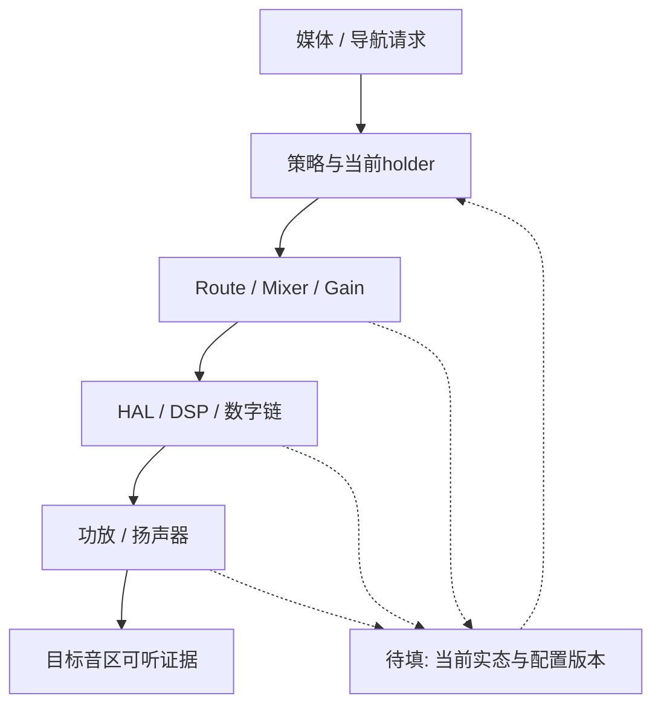

# Week 11 — 周六音频巩固与综合题

学习日期：2026-09-26，星期六，Asia/Shanghai。能力阶段：第二阶段“系统链路与问题分析”。预计深度：L3，恢复方案尝试 L4。

**今天按周六规则执行，不新增普通 Day 专题。**核心范围为本周实际归档的 Day 35（Codec、DSP、功放、Route、Mixer）和 Day 36（混音、音量、延迟、多音区），Day 34（音源与焦点）仅作前置回顾。Day 37 提前发布属于排期错误，现保留为 9 月 28 日周一预备材料，不纳入本次题目或验收。

本页提供复习索引、案例材料、题目、空白模板和评分标准；不提供新题的参考答案或预设根因，不代写个人反思。目前没有可核验的个人作答，不记录“已掌握”或个人错题。

## 1. 来源、范围和今日目标

本次不引入新的技术机制，直接复用 [Day 34](https://qiantao18817568425-art.github.io/Architecture_Learning-/#day-34)、[Day 35](https://qiantao18817568425-art.github.io/Architecture_Learning-/#day-35)、[Day 36](https://qiantao18817568425-art.github.io/Architecture_Learning-/#day-36) 已有内容。原归档的 Week 8、Week 9、Week 10 明确要求周五总结、周末巩固，且下一普通专题按周一至周四推进。

本周五总结未见独立归档，本页只如实注明，并先做本周范围收敛，不补造周五已经完成的记录。所有案例均为教学材料，版本、时间符号和编号用于关联，不代表实机日志；实际阈值、策略、设备映射和接口名称待项目确认。

验收目标：能把逻辑焦点、PCM推进、路由/增益、功放实态与可听证据分开；能画出两音区资源边界；能用当前会话与代际解释复位恢复；能为竞争假设设计有区分度的实验。

## 2. 一小时安排与四道回顾题

| 时间 | 任务 | 留下的产物 |
| --- | --- | --- |
| 20:00—20:10 | 闭卷回答四道回顾题 | 自己的判断与不确定处 |
| 20:10—20:25 | 压缩 Day 35—36，画端到端链 | 职责/证据表与链路图 |
| 20:25—20:45 | 独立分析两个案例，先事实后假设 | 两张分析表和关键实验 |
| 20:45—20:55 | 完成恢复方案与测试草稿 | 状态、时序和测试矩阵 |
| 20:55—21:00 | 个人反思与待补项 | 三个薄弱点、题号、下一步 |

1. 焦点获准、PCM写入、DSP计数增加、功放ready，分别能证明什么，不能证明什么？
2. Route、Mixer、Volume Group和物理功放通道各解决什么问题？哪个证据能验证它们的映射？
3. 导航结束时媒体应恢复哪个目标音量？还应检查哪些当前状态？
4. Android与DSP的时间戳能直接相减吗？恢复后怎样识别旧会话或旧配置？

本次题目可分批提交，一小时只要求形成主要草稿，不把阅读时长等同于能力通过。

## 3. 本周知识压缩与待完成图

| 已有知识 | 复盘角度 | 请你补充的内容 |
| --- | --- | --- |
| 音源/焦点 | 谁提出请求、谁授予资格 | 当前holder、usage、zone与策略版本 |
| Route/Mixer | 数据送往哪里、在哪里合成 | 实际OS/HAL/DSP分工与配置读回 |
| Codec/DSP/功放 | 处理、转换与后级输出 | 共享资源、电源/时钟/复位和测点 |
| duck/mute/restore | 当前目标与实际增益是否一致 | 用户调音量、会话结束与乱序的处理 |
| 多音区 | 用户到物理扬声器的映射 | user/occupant/zone/group/device/port/channel |
| 延迟与卡音 | 最早停顿在哪一段 | 单调时间、buffer/XRUN、clock与物理输出 |

下图只是作答框架。补上控制流、数据流、状态反馈、Owner与完成证据；不把它当标准答案。

## 4. 案例 A：导航结束后媒体不恢复

用户报告导航播报结束、UI已消失，媒体仍很轻。切歌不能稳定恢复，重建音频路径后暂时正常。

提供的教学材料：

| 记录 | 已观察到的内容 | 限制 |
| --- | --- | --- |
| A1 | 导航业务打印session结束 | 未附完整player和holder集合 |
| A2 | 媒体PCM消费计数持续增加 | 未证明当前增益或目标区声压 |
| A3 | 策略打印一次restore请求 | 未附DSP当前bootId与配置读回 |
| A4 | 用户在播报期间调过音量 | 尚未确认权威目标值及更新序号 |
| A5 | 故障窗口出现DSP复位记录 | Android与DSP时钟尚未对齐 |
| A6 | 重建路径后可听音量恢复 | 无单变量对照，不能直接证明根因 |

任务：把每行拆成“事实、未证明、补取证据”；至少提出三个不同层级的假设。设计一个能区分策略目标错误与执行状态错误的实验，并说明何时只能报告初步责任域。不要把A5直接当作答案。

## 5. 案例 B：后排声音出现在驾驶区

两名用户分别在前排与后排播放不同测试音。换用户后驾驶区偶尔听到后排内容；前排音量旋钮有时同时改变后排响度。

提供的教学材料：

| 记录 | 已观察到的内容 | 限制 |
| --- | --- | --- |
| B1 | HMI显示两个不同audioZoneId | 不是物理路由证据 |
| B2 | 两个播放器均处于active | 未确认实际device affinity |
| B3 | HAL报告配置请求已接收 | 未包含完整应用结果 |
| B4 | DSP端口持续输出 | 未做内容识别与逐通道对照 |
| B5 | 更换用户后更易复现 | 相关性不等于用户框架根因 |
| B6 | 线束与声学隔离尚未核对 | 不能排除物理映射与泄漏 |

任务：画出user/occupant→zone→group→device→DSP port→功放channel→speaker链路；提出至少两类软件假设与一类物理假设。选择可辨识测试音和单变量操作，说明每个观察结果会支持或排除什么。

## 6. 六道综合题与评分标准

1. **主链与Owner，20分**：选择案例A，画控制/PCM/状态三条流，标出每段输入、输出、Owner和完成证据。
2. **证据边界，15分**：给A1—A6逐条填写事实、推断、缺证，解释哪些时间先后目前不能成立。
3. **竞争假设，20分**：为两个案例各列三项假设，每项给一条反证和一个下一步实验，不仅罗列可能原因。
4. **恢复设计，20分**：DSP在duck期间复位；设计当前快照、bootId/epoch、幂等、取消、超时与有限重试的时序，并声明失败出口。
5. **测试闭环，15分**：从正常、乱序旧消息、复位、多音区、相邻回归中选三类，写可执行步骤与通过证据。
6. **方案取舍，10分**：比较单一权威状态管理与多组件各自恢复的优缺点，说明你的推荐及仍待确认的前提。

评分看链路是否完整、证据能否区分假设、恢复是否闭合、测试是否可执行；术语数量与篇幅不直接计分。无用户答案时不评分、不写批改结论。提交后逐题标注正确部分、不严谨处、缺层/缺证、风险和补答要求。

## 7. 空白产出模板

| 项目 | 独立填写 |
| --- | --- |
| 当前系统状态、用户动作与预期完成 | 待填 |
| 链路与Owner；当前会话、音区、代际 | 待填 |
| 最后正常证据与第一缺失证据 | 待填 |
| 假设1/2/3与各自反证 | 待填 |
| 单变量实验、测点与通过条件 | 待填 |
| 临时恢复、永久修复、失败降级 | 待填 |
| 当前目标/实际状态/配置版本对账 | 待填 |
| 测试前置、输入、步骤、观测、预期与Tag | 待填 |
| 未确认参数、确认Owner与方法 | 待填 |

今日交付为一页《音频状态—证据—恢复评审卡》，附一张链路图和一张复位时序图。扩展题可以稍后补交；未填写部分保持“待补”。

## 8. 个人反思与学习状态

请自己写：今天最容易跨级下结论的三个位置；一个仍无法解释的状态转换；明天准备补取哪项证据。不要用“都懂了”替代具体判断。

| 项目 | 状态 |
| --- | --- |
| 今日任务 | Week11周六巩固与综合题 |
| 本周核心范围 | Day35—36；Day34为前置回顾 |
| 最高材料编号 | Day37已提前发布，但尚未正式安排学习 |
| 正式安排进度 | 保持Day36，周末不推进Day |
| 用户作答/评分 | 待提交，暂不新增掌握或错题 |
| 明日（9月27日，周日） | 跨层证据、恢复方案与测试整合，仍不新增专题 |
| 周一（9月28日） | 正式安排预备的Day37，避免重复出课 |

今日需要保留的自检边界：局部成功与业务完成分开；时间线需要时钟依据；重启恢复不等于根因证明；逻辑音区与物理输出分别验证；实际作答与课程发布分别记账。
