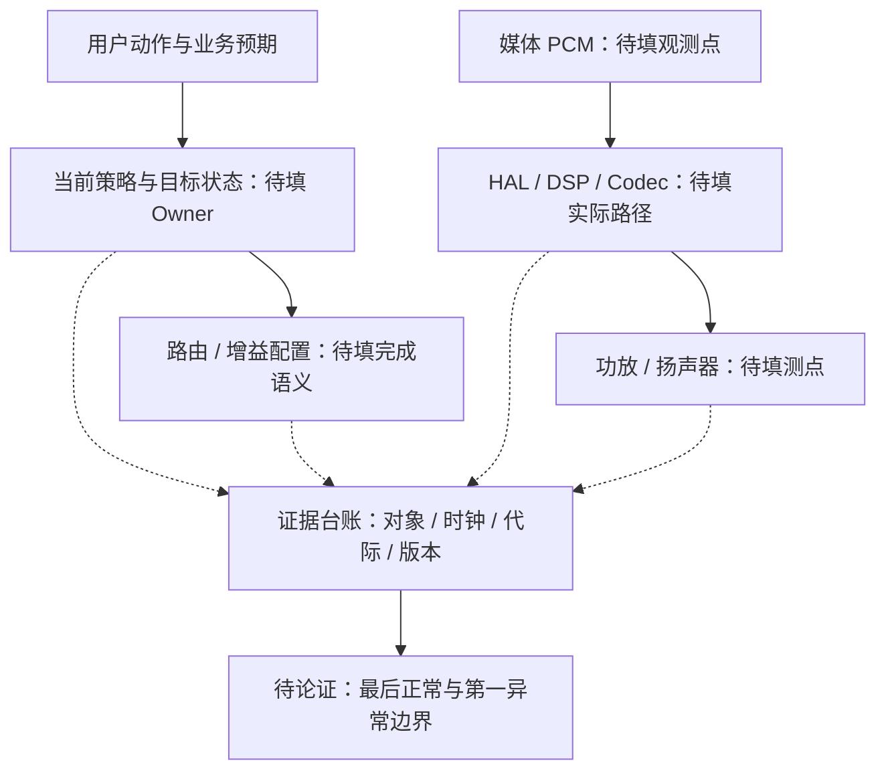

# Week 11 — 周日音频证据链、恢复方案与测试整合

学习日期：2026-09-27，星期日，Asia/Shanghai。能力阶段：第二阶段“系统链路与问题分析”。目标深度：L3 证据排障，尝试 L4 恢复方案评审。用时约 60 分钟。

今天执行周日整合，不新增普通 Day。核心范围仍为 Day 35—36，Day 34 仅作前置回顾；Day 37 为 9 月 28 日周一预备材料，不计入本周末范围。执行前已完整扫描 GitHub 所有状态的 Issue，目前没有答卷；本聊天也没有新增作答。因此以下是待完成训练，不是对你能力的评分，也不把可能的问题记成你的错题。

## 1. 今日目标与资料边界

把昨天的一页《音频状态—证据—恢复评审卡》整理成可交给开发、测试一起评审的闭环：同一问题的证据编号能够对应到假设、恢复动作、测试步骤和结论。如果昨天尚未作答，可以从下方案例开始形成第一版，不需要伪造旧答案。

复习入口：[Day 34 音源与焦点](https://qiantao18817568425-art.github.io/Architecture_Learning-/#day-34)、[Day 35 音频器件与链路](https://qiantao18817568425-art.github.io/Architecture_Learning-/#day-35)、[Day 36 混音、音量与多音区](https://qiantao18817568425-art.github.io/Architecture_Learning-/#day-36)、[周六巩固题](https://qiantao18817568425-art.github.io/Architecture_Learning-/lessons/week-11-saturday.html)。

官方资料核验日期：2026-09-27。本次只复核已学边界，不扩展到新版本特性：

- [AOSP Audio control HAL](https://source.android.com/docs/automotive/audio/audio-control-hal)：车载音频服务会向 HAL 传递 ducking 变化及相关设备、usage 信息；具体衰减斜率和实际策略需结合厂商实现。不能由通知本身推断已听到正确输出。
- [AOSP Volume management](https://source.android.com/docs/automotive/audio/volume-management)：音量组关联同一音区内的设备；groupId 不跨音区唯一。记录组号时需要保留音区上下文，并核对项目版本和配置。
- [AOSP Multi-zone audio routing](https://source.android.com/docs/automotive/audio/audio-multizone-routing)：供复查多音区路由职责与用户关联。不要将文档里的某一版本实现直接当作你的项目拓扑。

下方案例、事件号及代际标识均为教学构造，不是项目日志。接口名称、增益单位、功放测点、可听阈值、时钟同步误差和恢复超时均待项目确认。恢复方案是你需要论证的设计，不是官方规定的通用算法。

## 2. 一小时安排

| 时段 | 任务 | 本段输出 |
| --- | --- | --- |
| 0—10 分钟 | 闭卷回顾四题，标出不确定项 | 四条简答 |
| 10—30 分钟 | 复核两条已学边界，整理跨层证据 | 职责表、证据台账与时间线 |
| 30—50 分钟 | 推演案例、比较恢复方案并设计实验 | 假设表、恢复时序、三条测试 |
| 50—60 分钟 | 合并为一页评审单并提交 | 主文档及两张图 |

四道回顾题：

1. “通知已发送、请求已接收、目标配置已应用、业务已恢复”四种表述，分别需要什么证据？哪个环节目前不可观测？
2. 如何区分目标音量、duck/mute 状态和实际有效增益？谁维护各自的权威值？
3. 两个组件日志里同名的 sessionId 或 groupId，什么时候仍不足以关联同一个对象？
4. 昨天的临时重建路径操作使声音恢复，它留下了哪些尚未证明的因果关系？

先写自己的判断，再按需查阅旧课程。没有实机测量时，填写“待取证”，不要编造日志截图或通过结果。

## 3. 两条已学边界的整合

**边界一：请求、状态与最终输出分层。**复习时把控制流（请求与配置）、数据流（PCM及硬件输出）、状态流（当前实态与反馈）画成三种线。每一段填“谁负责、接收什么、实际改变什么、如何确认”，不要将某一条链的进展代替另一条链的证据。

**边界二：时间和对象身份必须能关联。**保留每个时钟域的原始时间、采样位置和误差依据；关联字段应说明来源与生命周期。bootId/epoch 用作此前练习中的代际标识示意，是否具备同等实机字段须核对。没有同步依据时保留各自局部先后，不强行拼成精确的跨域延迟。

请把下面的知识地图补全为本项目或你声明的教学拓扑。虚线表示待建立的证据关联，并非已经证实的因果关系。

## 4. 贯穿案例：恢复请求成功，音量仍异常

沿用周六案例 A：导航结束后媒体仍很轻，重建路径可以暂时恢复。本次增加的是取证材料与评审任务，不预设根因。

测试前提：媒体在前排播放，后排播放另一段可辨识的内容。当前用户、音区配置、目标音量、功放通道映射均须记录；车况、电源和测试声级遵守项目试验条件。没有实机时完成纸面设计。

| 证据号 | 教学观测 | 已知缺口 |
| --- | --- | --- |
| E1 | Android 记录导航会话 N7 结束，随后有 restore 请求 R88 | 请求携带的完整目标快照未保存 |
| E2 | Android 记录媒体 PCM 消费计数持续增长 | 没有目标输出口的内容和幅度测量 |
| E3 | HAL 记录 R88 已接收 | 未记录应用完成语义与配置读回 |
| E4 | DSP 日志包含 bootId 从 B4 变为 B5 的边界 | DSP 时钟在复位后重置，尚无跨域时钟锚点 |
| E5 | Android 收到标记 B4 的一条状态通知；采集时 DSP 报告 B5 | 缺少接收端如何处理该通知的记录 |
| E6 | 驾驶区媒体听感偏低，重建路径后改善 | 没有单变量对照和定量输出证据 |
| E7 | 用户在导航期间改过音量；后排内容仍可听 | 用户目标版本、音区映射及相邻通道测量不全 |

E5 是待调查线索，不代表它一定被执行或已经造成故障。E4 与 E6 也不能单独确定根因。请保留至少三个不同责任层的竞争假设，且允许最终结论为“证据不足”。

完整分析路径由你填写：复现前提 → 事实与未知 → 局部时间线 → 最后正常/第一异常边界 → 竞争假设与反证 → 下一项实验 → 临时恢复 → 永久修复候选 → 相邻回归。每个结论都引用证据号，避免只写“怀疑 DSP”。

| 假设编号 | 责任层与假设 | 支持证据 | 缺少或矛盾证据 | 最小实验 | 什么结果会推翻它 |
| --- | --- | --- | --- | --- | --- |
| H1 | 待填 | 待填 | 待填 | 待填 | 待填 |
| H2 | 待填 | 待填 | 待填 | 待填 | 待填 |
| H3 | 待填 | 待填 | 待填 | 待填 | 待填 |

## 5. 恢复方案评审：把失败出口也写出来

比较两种候选：由一个协调者汇总当前权威状态并恢复，或由各组件分别恢复后对账。这是待比较的候选，不预先推荐；请从一致性、恢复延迟、组件耦合、局部故障扩大范围和验证成本评审。

在你选择的方案中回答：

- 复位期间用户继续调音量，恢复使用哪个目标版本？旧会话取消与新请求怎样区分？
- 哪个条件允许发起恢复，哪个条件允许报告业务恢复？ACK 应出现在哪里，尚不能证明什么？
- 相同请求重复到达、旧代际通知晚到、对端再次复位时，状态如何转移？
- 超时后谁决定重试、次数与预算怎样配置、何时取消？重试耗尽怎样降级并留下证据？
- 前排恢复时，后排哪些资源共享、哪些应保持独立？怎样证明没有扩大故障影响？

请自行画恢复时序图或状态图，至少标出正常分支、旧消息分支、超时分支、复位重入及最终失败出口。阈值使用变量或“待项目确认”；不要随意给出固定毫秒数。

## 6. 测试闭环：将假设变成可执行验证

下面每行是测试要求，不是已执行记录。至少详细完成前三行；后两行作为扩展。填写操作顺序、测点、预期、超时判定和清理恢复步骤。用你在题目中声明的前提推导结果，不填笼统的“声音正常”。

| 测试 | 必须控制的条件 | 必须给出的判据 | 执行状态 |
| --- | --- | --- | --- |
| T1 正常结束导航并恢复 | 用户/音区/目标版本固定，确认复位未发生 | 正常链各段证据与目标输出一致性 | 待设计、未执行 |
| T2 复位窗口与用户调音量交错 | 只改变一个注入窗口，记录当前目标与代际 | 哪个目标应生效、如何验证、对照组为何可比 | 待设计、未执行 |
| T3 延迟旧状态通知 | 在可控测试环境注入，标明通知来源与身份 | 接收端动作、有效配置与业务输出的关联 | 待设计、未执行 |
| T4 应用结果丢失或持续超时 | 不混同请求丢失与反馈丢失 | 有限重试、可观测失败出口、下一次恢复条件 | 可选 |
| T5 多音区相邻回归 | 两区不同内容且逐通道核对 | 路由隔离、目标音量及共享资源影响 | 可选 |

没有可用注入手段时，明确记录限制及替代观测方法，不声称做过故障注入。不得在行驶中的车辆随意复位音频或播放试验声。

## 7. 六道提交题与评分维度

1. **证据与职责，20 分**：补全三条流和 Owner 表，逐项解释 E1—E7 能证明与不能证明什么。
2. **时间线，15 分**：画 Android 与 DSP 两条局部时间线，标出哪些顺序可确定、哪些不可确定，以及还需什么时钟依据。
3. **故障分析，20 分**：完成 H1—H3 与最小实验，给出当前能下的最强结论和仍不能下的结论。
4. **恢复方案，20 分**：比较两种候选，提交一张带正常和失败分支的时序/状态图及取舍理由。
5. **测试闭环，15 分**：详细写 T1—T3，让另一位测试人员能照步骤执行；建立“假设—实验—预期证据—结论”对应。
6. **评审单与反思，10 分**：将以上整理成一页主文档，自己写一个最不确定的边界和下一项补证动作。

不提供新题参考答案，不代写反思。收到真实答卷后逐题标注正确处、不严谨处、缺层与缺证、风险及修订建议。未完成题目请标明题号，允许分批补交；评分维度不是当前个人得分。

## 8. 一页主文档模板与提交

交付文件建议命名为“Week11-周日-音频恢复评审-v1”。主文档约一页，两张图与测试表可作附页。

| 主文档字段 | 你的内容 |
| --- | --- |
| 问题、范围、版本、复现前提与预期完成 | 待填 |
| 事实 E1—E7 与尚未确认的项目参数 | 待填 |
| 最后正常、第一异常与时钟限制 | 待填 |
| H1—H3、反证与优先实验 | 待填 |
| 恢复 Owner、目标/代际、完成语义与失败出口 | 待填 |
| 两种方案取舍与相邻音区风险 | 待填 |
| T1—T3 的证据映射、执行状态与遗留项 | 待填 |
| 个人反思、补答题号与下一动作 | 待填 |

在本页末尾点击“上传／提交答卷”，填写文字或添加图/PDF/Word，登录 GitHub 后提交。课程编号为 `week-11-sunday`。补交在同一答卷下以 `[补交]` 开头评论，或编辑原答卷；正文、附件链接与批改按版本归档。只上传可公开材料。

## 9. 学习台账与明日衔接

| 项目 | 本次状态 |
| --- | --- |
| 当日安排 | Week 11 周日证据链、恢复方案与测试整合 |
| 实际范围 | Day 35—36；Day 34 前置回顾 |
| 答卷扫描 | 无新答卷，不生成虚构批改或得分 |
| 当前作答/掌握 | 待提交、待验证 |
| 正式安排进度 | 仍为 Day 36，周末不推进 Day |
| 最高材料编号 | Day 37 已预备，不代表已正式学习 |
| 明日 2026-09-28 周一 | 先扫描批改，再正式安排已有 Day 37；不重复生成或跳到 Day 38 |

若明天收到今天或历史题的答卷，先评审再安排课程。课程材料完成不等于结业，后续仍以真实分析、设计方案和补答证据判断。
