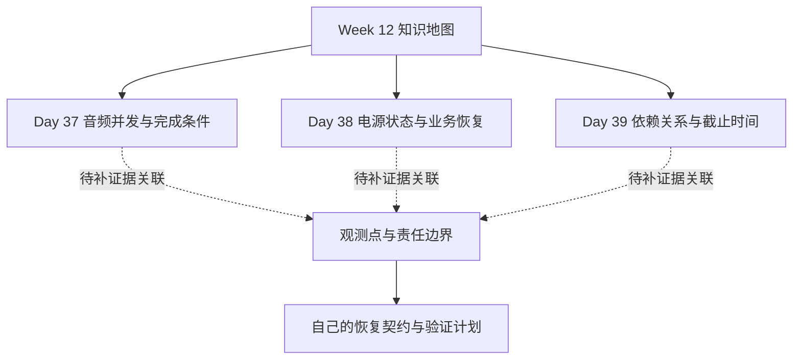

# Week 12 — 周五反思总结：音频并发与跨域恢复

学习日期：2026-10-02，星期五，Asia/Shanghai。能力阶段：第二阶段“系统链路与问题分析”。目标深度：L3 证据排障，尝试 L4 接口与恢复方案评审。用时约 60 分钟。

今天只总结本周实际安排的 Day 37—39，不推进普通 Day，不提前讲 Day 40。发布前已扫描全部状态的 GitHub Issue，本次没有新答卷；本聊天也没有新增真实作答。个人掌握、错题与薄弱点均待作答验证，下面不提供新题参考答案，也不代写个人反思。

## 1. 本周范围与资料

| 学习单元 | 本周安排 | 本次回顾边界 |
| --- | --- | --- |
| [Day 37：音频并发与复位恢复](https://qiantao18817568425-art.github.io/Architecture_Learning-/lessons/day-37.html) | 9 月 28 日任务，9 月 29 日补充登记；材料此前已预备发布 | ANC / AEC、电话 RX / TX、导航与提示音的完成条件；并发持有者和当前目标 |
| [Day 38：STR / Resume I](https://qiantao18817568425-art.github.io/Architecture_Learning-/lessons/day-38.html) | 9 月 29 日 | 电源状态与业务状态、跨域屏障、显示恢复职责、取消与旧回调 |
| [Day 39：STR / Resume II](https://qiantao18817568425-art.github.io/Architecture_Learning-/lessons/day-39.html) | 10 月 1 日，实际执行跨午夜后顺延 | 依赖与等待关系、代际和目标版本、竞态、端到端截止时间与时钟依据 |

9 月 30 日没有补造发布记录；本周复盘范围按正式安排确定。旧课未完成时可以边查原文边答，注明“查阅后修订”，不要填写不存在的学习经历。

官方资料核验日期：2026-10-02。只复核已学概念，不要求阅读全文或引入新特性：

- [AOSP Audio control HAL](https://source.android.com/docs/automotive/audio/audio-control-hal)：车载音频服务与音频控制 HAL 交换焦点、ducking、mute 等控制信息；项目版本与配置决定可用能力。通知的完成语义需要结合接口核对。
- [AOSP Power management](https://source.android.com/docs/automotive/power/power)：复核 CPMS、VHAL 与车辆电源控制之间的职责。平台电源状态不能替代项目业务的输出验收。
- [Linux Device links](https://docs.kernel.org/driver-api/device_link.html)：复核内核中 supplier / consumer 的设备依赖及电源管理顺序；跨操作系统服务的业务依赖仍需单独定义。
- [Linux clock_gettime](https://man7.org/linux/man-pages/man2/clock_gettime.2.html)：复核 MONOTONIC 与 BOOTTIME 对系统休眠时间的处理差异。预算用哪个时钟，必须与计时起止要求相符。

本文的事件、代际和名称均为教学构造，不是实机数据。接口命名、硬件拓扑、提示音安全等级、可听/可见验收阈值、截止时间及同步误差均待项目确认。以下方案由你论证，不是平台规定的唯一实现。

## 2. 一小时安排

| 时段 | 任务 | 输出 |
| --- | --- | --- |
| 0—10 分钟 | 闭卷四问，然后定位旧课依据 | 四条简答，各标“确定 / 待查证” |
| 10—30 分钟 | 梳理两条主线，补知识地图与职责边界 | 一张地图、一张简表 |
| 30—50 分钟 | 独立分析联合案例与架构题 | 证据假设表、异常时序与验证草案 |
| 50—60 分钟 | 整理一页复盘卡，写自己的反思并提交 | 主文档和图；未完成部分明确标记 |

四道回顾题：

1. 电话 RX 正常、TX 正常、导航可听、ANC 生效分别由什么观测证明？哪些资源共享，哪些完成条件必须分别验收？
2. 请求 ACK、局部 Ready、屏障满足和业务完成，各自证明什么？如果接口文档没有定义 Ready，你会向谁确认什么？
3. epoch、资源 generation 与 targetVersion 分别描述什么变化？收到同一请求号的迟到成功，需要核对哪些上下文？
4. 一次恢复包含并行分支、串行依赖、查询和重试。如何定义总截止时间？两个日志时钟没有映射依据时，哪些时间结论暂时不能写？

## 3. 两条复盘主线与知识地图

**主线一：共享资源与分层完成。**把 Day 37 的音频并发、Day 38 的电源与业务状态放在一起检查：谁提出目标、谁接收请求、谁改变资源、谁提供业务输出证据。控制流、数据流、状态流分别画线，避免把某层进度外推为整条业务完成。

**主线二：当前目标与有限时间。**把 Day 37 的复位重建、Day 38 的取消与屏障、Day 39 的依赖与预算放在一起检查：恢复动作针对哪个对象和目标，它何时失效，剩余时间不足时谁选择出口。对“可用”“已附着”“当前目标已应用”分别写可观察条件。

下面是分类骨架，虚线仅代表复盘关联，不代表已经证明的系统因果。请补上责任人、输入输出、证据编号，并在边上注明控制 / 数据 / 状态流。

用四行填写职责表；可按自己明确声明的教学拓扑合并角色，不能假定所有项目都由同一 OS 或 HAL 驱动硬件。

| 边界 | 上游目标与控制输入 | 下游资源 / 数据输出 | 状态反馈与证据 | 权威责任方 / 待确认项 |
| --- | --- | --- | --- | --- |
| 业务与音频策略 | 待填 | 待填 | 待填 | 待填 |
| 电源协调与平台执行 | 待填 | 待填 | 待填 | 待填 |
| 后端能力与前端附着 | 待填 | 待填 | 待填 | 待填 |
| 音频 / 显示最终输出 | 待填 | 待填 | 待填 | 待填 |

完整故障分析方法沿用 [Day 37 第 8 节](https://qiantao18817568425-art.github.io/Architecture_Learning-/lessons/day-37.html)、[Day 38 第 7 节](https://qiantao18817568425-art.github.io/Architecture_Learning-/lessons/day-38.html) 与 [Day 39 第 6 节](https://qiantao18817568425-art.github.io/Architecture_Learning-/lessons/day-39.html) 的已讲案例。选其中一个复述“现象→边界→证据→假设→反证→恢复→风险→验证→结论限制”；不要把旧例结论直接套到下面的新题。

## 4. 综合故障题：唤醒后声音与画面恢复不同步

测试人员在同一次休眠唤醒尝试中记录：“电话界面最终可见，通话双方都称有短暂声音异常；导航提示是否完整听到未记录。手工重建业务路径后体验恢复。”没有连续采集的声学或屏幕证据，也没有验证重建前后的目标配置一致。

已提供以下**独立日志摘录**。A、B、M 是三个时钟域；每个域内列表按本地时间递增，跨域尚无对时映射。业务请求号 r18 用于关联请求，不能直接证明各域对象身份相同。行顺序不是跨域时间线。

| 证据号 | 域内时刻 | 原始摘要 | 采集限制 |
| --- | --- | --- | --- |
| E1 | M:5000 | wake_request cycle=C12 | MCU 记录；与 A/B 的映射待提供 |
| E2 | A:104 | resume_begin cycle=C12 targetVersion=V8 | 目标配置正文未附 |
| E3 | A:120 | request r18 submitted；ACK received | ACK 的合同定义未附 |
| E4 | A:139 | target_update V9；navigation event received | 未附并发持有者和策略快照 |
| E5 | A:151 | callback r18 ready=1 generation=G6 | 未附 G6 生命周期与当前值 |
| E6 | A:175 | audio recovery timeout；display status=waiting | 两条路径计时起点与总 deadline 未附 |
| E7 | B:880 | backend generation=G6 state=ready | Ready 的适用资源范围未附 |
| E8 | B:902 | request r18 apply_done | 未附实际应用目标版本与输出测点 |
| E9 | A:210 | user-visible frame reported | 记录主体及画面内容验收依据未附 |

**不要预设 G6 就是旧代，也不要把 Ready 当成错误；先确定字段定义与缺失证据。**这不是给定根因的查错题，可以提出多个互斥或并存的假设。任何无法从输入得到的结论都写“待证”。

完成以下四项综合作业，每项先用短句，长矩阵可留待周六继续：

1. **事实与假设。**选出三个最影响结论的证据缺口，给出至少两个候选解释；分别写支持证据、反证条件和下一处采集点。明确目前能否定位第一异常点，区分“已观测异常”和“已证明根因”。
2. **依赖与异常时序。**画两张简图：一张资源 / 服务依赖图，一张时序图。在时序图中标 ACK、局部完成、业务验收、目标变化、超时、复位和迟到消息；对于未提供的事件使用“待采集”或明确标成实验注入。区分真实依赖、等待关系和设计建议，不把缺失的事件画成已发生。
3. **恢复方案评审。**比较两个你提出的恢复方案，写作用范围、前置条件、权威状态、对并发业务的影响、取消/幂等边界、失败出口与业务验收。说明参数尚未确定时如何表达总预算；如果重新发起操作，解释它与原 deadline 的关系。保留旧消息、目标改变和再次复位的处理约定。
4. **可执行验证。**从“正常恢复、迟到消息/复位、预算耗尽/取消”三类各写一条测试。每条必须包含准备状态、具体注入点、操作步骤、日志字段、输出测点和可判定的通过条件；阈值待确认时用命名参数，不编造测量值。最后给出至少一个能区分两种候选解释的实验。未运行的用例只标“待执行”。

时间有限时，优先把一条故障分析链写完整，剩余问题标“待补答”。没有实机也可以提交实验设计和预期判据，不能写成已经测试通过。

## 5. 一页可复用产物与个人反思

提交《Week 12 音频并发与跨域恢复复盘卡 V1》。可以直接复制以下空白结构，附两张图；正文控制一页，详细证据作为附件。

| 项目 | 你的填写 |
| --- | --- |
| 场景、范围与完成目标 | 待填 |
| 控制 / 数据 / 状态流及权威责任方 | 待填 |
| 对象身份、目标版本、资源代际 | 待填 |
| 依赖、等待与解除条件 | 待填 |
| 事实 / 假设 / 反证与证据编号 | 待填 |
| 总截止时间、时钟域、剩余预算与失败出口 | 待填 |
| 恢复方案比较与残留风险 | 待填 |
| 三条测试、业务验收与执行状态 | 待填 |
| 待项目确认的参数与下一步取证 | 待填 |

最后用自己的经历回答三句：本周哪一个判断从“凭模块状态”改成了“凭端到端证据”？哪一个地方仍讲不清楚，能否指出具体题号或字段？下次愿意先用哪一条实验验证它？没有学习或实验经历时如实说明尚未完成。

**薄弱点台账仍为空。**可以自报不确定项，但正式错题、掌握结论和补弱安排须等实际答卷批改后形成。本次不会因为材料已发布而提高个人能力评分。

## 6. 答卷提交与后续安排

本单元编号为 **week-12-friday**。点击正文末尾“上传／提交答卷”，按“回顾题—知识地图—综合作业 1—4—个人反思”标注题号，可填写文字并附图、PDF 或其他可读附件。点击 GitHub 的 Submit new issue 后才完成提交；需要补充时编辑原答卷或用 **[补交]** 开头评论。

[答卷中心](https://qiantao18817568425-art.github.io/Architecture_Learning-/answers/index.html)可查看历史课程入口与同步状态。每天先扫描新答卷和全部补交，发现新版本先逐题批改，再安排任务；附件不可读时会请求可读补交，不记为通过。原始正文、附件链接和批改版本同步公开 GitHub。

当前保持正式安排至 Day 39，Day 34—39 与本复盘均待作答评审。10 月 3 日周六仅巩固 Day 37—39 的综合案例、独立画图和证据链；10 月 4 日周日做跨层取证、恢复与测试整合。后续普通 Day 留到周一至周四按实际进度安排。
