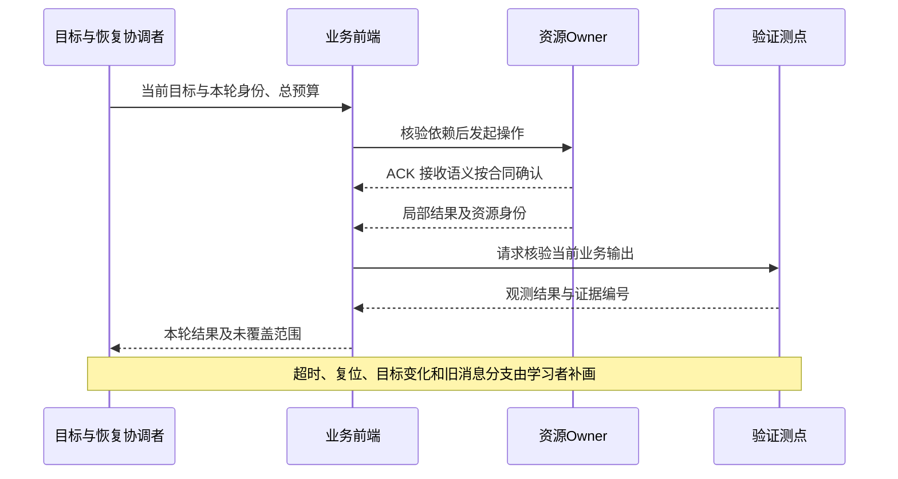

# Week 12 — 周日整合：跨层取证、恢复设计与测试闭环

学习日期：2026-10-04，星期日，Asia/Shanghai。能力阶段：第二阶段“系统链路与问题分析”。目标深度：L3 跨层证据排障，尝试 L4 恢复方案评审。用时约 60 分钟。

本次定时唤醒实际已到北京时间周日。最新远端只有周五复盘，未见 10 月 3 日周六任务发布记录；今天按周日规则完成整合，不补造周六课程或学习经历。核心范围仅本周实际安排的 Day 37—39，不推进普通 Day，不提前展开下一专题。

执行前已完整扫描全部状态的 GitHub Issue 及候选答卷评论，未发现新答卷；本聊天没有新增真实作答。下面是独立练习和空白产物，个人掌握与薄弱点仍待验证。若周五尚未作答，可以从今天的案例开始，不必虚构上一版文档。

## 1. 本周材料与核验范围

- [Day 37：音频并发与复位恢复](https://qiantao18817568425-art.github.io/Architecture_Learning-/lessons/day-37.html)：电话 RX / TX、导航与提示音、ANC / AEC 的业务边界；当前持有者与目标配置。
- [Day 38：STR / Resume 状态与恢复](https://qiantao18817568425-art.github.io/Architecture_Learning-/lessons/day-38.html)：平台电源状态、业务状态、跨域屏障与输出验收。
- [Day 39：依赖、竞态与超时预算](https://qiantao18817568425-art.github.io/Architecture_Learning-/lessons/day-39.html)：供应者和消费者、等待关系、代际与目标版本、总截止时间。
- [Week 12 周五复盘及 E1—E9 案例](https://qiantao18817568425-art.github.io/Architecture_Learning-/lessons/week-12-friday.html)：今天继续使用同一案例，周五原题与证据不变。

官方资料核验日期：2026-10-04，只复核已经讲过的边界：

| 资料 | 本次用途 |
| --- | --- |
| [AOSP Power management](https://source.android.com/docs/automotive/power/power) | 核对 CPMS 协调电源转换、VHAL 对接车辆电源控制、内核执行休眠的职责 |
| [AOSP Audio control HAL](https://source.android.com/docs/automotive/audio/audio-control-hal) | 核对焦点、ducking、mute 等音频控制交互；具体能力须匹配项目版本 |
| [Linux Device links](https://docs.kernel.org/driver-api/device_link.html) | 核对内核设备依赖及电源管理顺序，不把它当作跨 OS 业务恢复机制 |
| [Linux clock_gettime](https://man7.org/linux/man-pages/man2/clock_gettime.2.html) | 核对 MONOTONIC 不含休眠、BOOTTIME 包含休眠的计时区别 |

后面的恢复合同、证据字段和测试组织是基于旧课的工程练习，不是官方指定的唯一方案。项目拓扑、接口名、Owner、时钟映射误差、延迟与音量阈值、失败后的产品策略均待确认。没有实机数据时只写取证计划和预期判据。

## 2. 一小时安排与四道回顾题

| 时间 | 任务 | 最小输出 |
| --- | --- | --- |
| 0—10 分钟 | 回顾四问，标出仍不确定的术语 | 四条短答 |
| 10—30 分钟 | 整合“证据关联”和“恢复验收”两条主线 | 知识地图、证据台账各一份 |
| 30—50 分钟 | 独立完成故障分析与方案比较 | 一条完整分析链、一张恢复时序图、三条测试 |
| 50—60 分钟 | 合并一页评审单并上传 | 一页主文档，图表可作附件 |

1. 同一个 r18 出现在 Android 与后端日志，除了请求号还要确认什么，才能把它们当成同一轮、同一资源、同一目标的证据？
2. 电话两端声音正常、导航播报正确、画面可见能否互相代替？分别由谁观察，测到了什么才算当前业务完成？
3. 超时以后收到成功，哪些条件决定它能否改变当前状态？结果未知和已经失败有哪些不同的恢复风险？
4. 总预算从 MCU 唤醒事件起算，但只拿到 Android 本地时间时，可以直接算总恢复耗时吗？你会保留什么原始信息，补什么映射或观测？

先独立回答，再查原文；对查阅后修订的答案注明版本，不把自查当作正式批改。

## 3. 知识地图：把证据接到职责与验收

本周知识地图的主干为：**业务目标 → 权威状态与资源身份 → 依赖和等待 → 控制执行与数据输出 → 分层反馈 → 业务验收 → 超时/取消/复位后的恢复 → 回归证据**。请在这条主干上标出 Day 37、38、39 分别提供了哪些依据，并补两处你仍无法解释的连接。

**整合主线一：先证明能关联，再讨论因果。**保留日志原始时刻、时钟域、事件来源和对象生命周期。时间线上的空白代表尚未取到证据，不能自动解释为某个动作没有发生；人工拼图的先后也不能代替跨域同步依据。资源 generation 与业务 targetVersion 分开填写。

**整合主线二：把恢复动作接到当前目标的验收。**请求接收 ACK、配置应用、局部 Ready 与业务完成属于不同层次。每一个恢复动作都要写明前提、作用范围、完成证据和停止条件；正常链与超时/目标变化/再次复位的异常链使用同一套身份与预算约定。

以下时序只回顾 Day 38—39 的通用完成层次，不是周五案例的执行事实或解答。角色可按声明的项目拓扑拆分，具体消息与字段须由接口合同确认。

填写下表时，各边界至少覆盖一处“输入由谁提供、输出由谁负责”。在自己的图上区分控制流、数据流和状态流，不把策略通知画成实际声音或画面。

| 边界 | 输入 / 上游责任方 | 输出 / 下游责任方 | 接收与完成区别 | 原始证据及缺口 |
| --- | --- | --- | --- | --- |
| MCU—VHAL—电源协调 | 待填 | 待填 | 待填 | 待填 |
| 业务与音频策略—音频资源 | 待填 | 待填 | 待填 | 待填 |
| 前端—跨域后端 / 设备Owner | 待填 | 待填 | 待填 | 待填 |
| 资源状态—音频 / 显示输出测点 | 待填 | 待填 | 待填 | 待填 |

## 4. 综合故障分析：沿用周五案例，建立证据闭环

周五给定的现象是：同次唤醒中，电话界面最终可见，双方称有短暂声音异常，导航是否完整播报未记录；手工重建业务路径后体验恢复。A、B、M 三域没有对时依据；日志中有 r18 的 ACK、目标从 V8 更新到 V9、G6 Ready 和 apply_done、音频超时与稍后画面报告。

**上述信息没有给定根因。**请回到周五原文 E1—E9 使用原始字段。今天没有新增实测日志，也不把 G6 预先定义成旧代、把某一次 ACK 定义成成功，或把手工恢复当作因果证明。

### 作业 A：完整故障分析与跨层取证

用九行完成“现象与验收口径 → 分层职责 → 可关联证据 → 候选假设 → 第一异常点或暂不可定位 → 反证实验 → 恢复动作 → 风险与限制 → 回归验收”。至少保留两个可区分的候选解释，不要求现在就选定根因。

为每个关键判断填写下面的证据台账。可先完成三行：一行音频、一行电源/跨域、一行显示；表格不预填哪条日志支持哪个根因。

| 判断编号 | 使用的 E 编号及原始字段 | 证明范围 / 尚不能证明的内容 | 时钟与身份关联依据 | 缺失证据、采集Owner和采集点 |
| --- | --- | --- | --- | --- |
| C1 | 待填 | 待填 | 待填 | 待填 |
| C2 | 待填 | 待填 | 待填 | 待填 |
| C3 | 待填 | 待填 | 待填 | 待填 |

给每条假设补一个可能推翻它的观测。新计划使用 P1、P2 等编号，尚未执行的实验使用 T1、T2 等编号；不要将计划写成新的 E 实测证据。

需要回看完整分析示范时，查 [Day 39 第 6 节已讲案例](https://qiantao18817568425-art.github.io/Architecture_Learning-/lessons/day-39.html) 的九步分析。只复用分析结构，不把该例的等待环或计时问题搬作本题结论。

### 作业 B：架构题与恢复合同

提出两个可比较的候选方案。分别写清为什么选择这个恢复范围、先决条件、受影响业务、权威状态、资源重建/复用条件、验证成本与失败出口。比较必须针对你声明的约束，不能仅写“方案一快，方案二稳”。

补完上面的异常时序图，至少画出：正常完成、超时结果未知、目标变化、资源复位、迟到/重复结果。在每个分支旁标注“责任方—判断条件—副作用—证据”。这些分支属于**你的设计或注入计划**，不是声称周五日志已经发生过。

合同需要回答：

- ACK、Applied / Ready、业务可用分别由谁发出，覆盖哪些资源和目标？哪些结果不足以解锁下游？
- 重试怎样保持幂等；取消已被接收但原动作可能已执行时，怎样确认实态？
- epoch、generation 或 targetVersion 变化后，旧请求和等待对象如何结束？
- 总期限的起点与时钟是什么？查询、排队、重试、验证和失败处理分别如何受剩余预算约束？超时后的迟到成功如何处理？

全部数值都可先用命名参数表达，但必须给出含义、量纲、确认责任方和验收方式；不要为凑齐表格编造项目参数。

## 5. 三条可执行测试，把方案接回证据

从下表每类设计一条测试。表中是测试目标，不是本案例的预设根因或预期日志答案。没有台架时交测试设计，执行状态标“待执行”。

| 用例 | 要检验的问题 | 你必须补齐 |
| --- | --- | --- |
| T1 正常恢复基线 | 在已声明的并发音频与显示目标下，如何证明当前业务完成？ | 初始状态、业务组合、操作步骤、日志字段、输出测点、通过条件 |
| T2 目标或资源变化 | 在你选定的窗口注入变化后，如何检查旧结果及副作用？ | 精确注入点、注入内容、允许/禁止结果、观测责任方、清理步骤 |
| T3 超时与失败出口 | 在你选择的依赖上延迟或丢回复，怎样验证总期限与受限状态？ | 时钟依据、预算参数、查询/重试边界、判定窗口、失败证据 |

为三条用例建立 **假设 H → 恢复动作 R → 测试 T → 采集点 P → 判定 C** 的编号映射，指出其中哪一条能够区分作业 A 的两个候选解释。只有“重启后好了”不能填成根因验证通过。

逐条核对：能否由另一位测试工程师按步骤复现；是否同时观测控制/状态和最终输出；取消或再次复位后是否仍会遗留资源或错误状态；所谓“恢复成功”是否满足当前目标与预算。缺口保留在待办中，不要求一小时填满扩展矩阵。

## 6. 一页《Week 12 跨域恢复评审单 V1》

最后十分钟把上述内容缩成一页。若已有周五答卷，引用其版本并列出今天真实修改项；若没有，直接创建首版。

| 区域 | 必填内容 |
| --- | --- |
| 范围与目标 | 业务、角色、完成口径、资料版本与待确认参数 |
| 事实与判断 | E/C 编号、两个候选解释、第一异常点或不能定位的原因 |
| 架构与恢复 | 依赖图、恢复时序、两个方案的权衡、Owner和异常出口 |
| 时间与身份 | 时钟、总期限、资源代际、目标版本、旧消息处置 |
| 验证闭环 | T1—T3 与 H/R/P/C 映射、通过判据、待执行项 |
| 开放项 | 最优先取证项、负责人、下一步；自己的不确定项 |

个人反思只需两句，由你填写：“我目前最缺哪一层证据？”“什么观测会让我改变当前方案？”没有实际作答前，本课不记录你的错题、评分或已掌握能力。

## 7. 提交、批改与下一次安排

本单元编号 **week-12-sunday**。点击正文末尾“上传／提交答卷”，按“回顾 1—4、作业 A、作业 B、T1—T3、评审单”标注；图可用 Mermaid 文本、图片或可读文档附件。可先提交完成部分，将余项标为待补答；编辑原答卷或以 **[补交]** 开头评论会产生新版本。

[答卷中心](https://qiantao18817568425-art.github.io/Architecture_Learning-/answers/index.html)提供每个历史及新增单元的提交、查看和归档入口。正文、补交、附件链接与评审同步公开 GitHub；附件原件由 GitHub 附件服务保存。每天优先扫描全部新版本并批改，附件无法读取时请求可读补交，不判通过。

当前正式安排仍至 Day 39，掌握状态为待作答。10 月 5 日周一按最新台账安排后续普通专题；今天不生成该课。10 月 4 日晚如再次运行，仍先扫描答卷，再按同日规则避免重复发布本复盘。
