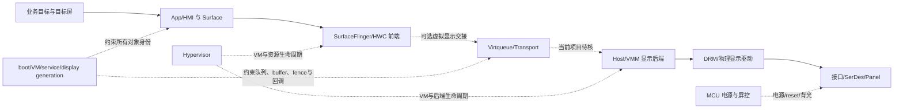

# Week 13 — 周五反思总结：显示首帧、VM Reset 与设备状态重建

学习日期：2026-10-09，星期五，Asia/Shanghai；Week 13。能力阶段：第二阶段“系统链路与问题分析”。今天只复盘本周实际安排的 Day 40—41，不推进 Day、不提前讲 Day 42。建议用时 60 分钟，扩展矩阵可后补。

执行前已完整扫描仓库全部状态的答卷 Issue 及评论，没有发现授权学习者的新答卷、编辑版本或 `[补交]` 评论；本聊天也没有新增真实作答。因此 Day 34—41 仍为待评审，本课只提供新的独立作业，不记录“已掌握”或虚构薄弱点。

## 1. 本周范围、资料与边界

| 本周单元 | 实际安排 | 今天复盘的能力 |
| --- | --- | --- |
| [Day 40：显示首帧与黑屏证据闭环](https://qiantao18817568425-art.github.io/Architecture_Learning-/lessons/day-40.html) | 10 月 6 日，星期二 | 把“显示成功”拆成请求、buffer、合成/提交、呈现和物理可见；寻找最早可证实断点 |
| [Day 41：Hypervisor / VM Reset I](https://qiantao18817568425-art.github.io/Architecture_Learning-/lessons/day-41.html) | 10 月 8 日，星期四 | 区分 App、Guest、VM、Host、SoC 故障域；用 generation、队列和设备重建证据验证恢复 |

10 月 5 日和 10 月 7 日没有远端课程记录，本次不补造课程或学习记录。本周知识范围只含 Day 40—41；Day 38—39 仅作为状态、代际、预算和恢复合同的已学前置。

官方资料复核日期：2026-10-09。以下只复核本周已经讲过的概念：

- [AOSP SurfaceFlinger 与 WindowManager](https://source.android.com/docs/core/graphics/surfaceflinger-windowmanager)：用于复核窗口元数据、layer 与合成职责。layer 存在并不等于目标内容已经在目标物理屏可见。
- [AOSP Synchronization framework](https://source.android.com/docs/core/graphics/sync)：acquire、release、present fence 分别约束不同交接；获得句柄与对应 fence 已按预期 signal 是两件事。
- [Linux DRM 用户接口](https://docs.kernel.org/gpu/drm-uapi.html)：TEST_ONLY 与真实提交不同，非阻塞返回也不等于硬件已完成显示。
- [AOSP AVF architecture](https://source.android.com/docs/core/virtualization/architecture)：用于复核 Hypervisor、VMM、Guest、vCPU 与虚拟设备后端的职责。AVF 只是参考，不代表本项目一定采用相同实现。
- [OASIS Virtio 1.3](https://docs.oasis-open.org/virtio/virtio/v1.3/virtio-v1.3.html)：设备 reset 后需要重新初始化；旧队列、在途 descriptor 与完成通知不能跨代际按旧假设继续使用。

当前没有车型、SoC、硬件阶段、Android/Yocto 构建号、Hypervisor/VMM、显示拓扑、VMID、设备分配方式、日志或实测结果。本文的架构和故障记录均为教学构造。屏幕、队列、fence、request、generation、时限、错误码和恢复策略都必须在真实项目中重新确认。

本次从 `F:/座舱日志分析/交付物/T12T诊断技能家族-优化版/` 读取并检查全部 21 项技能入口；深入使用通用三入口、显示、虚拟化/TEE、稳定性、跨域消息和 TPM 首轮分责参考。附录记录其余专项的适用性，不能把“未展开”当成实车排除结论。

## 2. 一小时安排

| 时间 | 任务 | 产出 |
| --- | --- | --- |
| 0—10 分钟 | 独立回答 5 道回顾题 | 一页短答，未知项明确标注 |
| 10—30 分钟 | 重画知识地图与两条状态链 | 控制/数据/状态/电源路径及 generation 边界 |
| 30—50 分钟 | 完成综合故障题 | 异常时序、证据账本、竞争假设与责任表 |
| 50—60 分钟 | 写个人反思和复用产物 | 《显示与 VM 恢复评审卡 V1》 |

回顾题不附参考答案：

1. API `accepted`、buffer 入队、present fence signal、DRM/后端完成和目标物理屏可见，各自是谁的局部完成？还缺什么才能称为业务完成？
2. VM 被重建后，为什么相同的 VMID、设备名或 requestId 不能自动证明仍是同一运行实例和同一事务？
3. 哪些证据能区分 App/Guest 进程重启、Android Guest 重启、单 VM 重建、Host 重启和 SoC 冷启动？
4. 旧 generation 的迟到完成回调到达新 generation 时，状态、资源与监测三个方面分别应怎样处理？
5. “重启后恢复正常”能支持恢复覆盖范围到哪里？为何它不能独立证明最初触发或最终责任？

## 3. 知识地图：从目标画面到运行实例

先把“目标内容可见”放到同一张跨层图里。实车中不存在的节点应删除，虚线关系需要当前项目资料或证据确认。

把证据分成五个层次，防止一个“成功”跨越多个接口：

| 层次 | 本层可接受的完成证据 | 仍不能推出 |
| --- | --- | --- |
| 请求与业务目标 | 当前目标、request、deadline 被接收，语义明确 | 已产出或已显示 |
| 内容与合成 | 当前 surface/frame 已提交并被正确 layer 采纳 | 后端与物理链已完成 |
| 虚拟设备事务 | 当前 generation 的 descriptor 被后端处理并在 used ring/回调闭环 | 目标内容已经物理可见 |
| 显示输出 | 当前 display/frame 的 commit、fence、flip/vblank 语义已核对 | panel、链路、背光和内容均正确 |
| 业务验收 | 当前物理屏、当前目标内容、当前代际在预算内可见 | 其他业务、输入和全车状态均恢复 |

### 3.1 两条状态链必须同时成立

**显示事务链：**目标确认 → 当前 surface/buffer → 合成与提交 → 当前显示输出 → 物理可见。

**运行实例链：**boot → VM generation → service/device generation → queue/resource generation → request/frame/fence。

任何跨代际事务都要回答：谁宣布旧实例失效、谁创建新实例、旧对象何时不可再用、在途事务如何终止、消费者怎样获得当前实态、迟到回调怎样隔离。只清空状态、不重新订阅/查询/验证，会形成“进程活着但业务状态仍旧”的恢复空洞。

### 3.2 ACK、局部完成和业务完成

| 术语 | 评审必须追问 |
| --- | --- |
| ACK | 是收到、校验、排队、开始处理，还是已经完成？是否带 generation 和目标身份？ |
| 局部完成 | 哪一层、哪个对象、哪个时钟、哪个 frame/descriptor 已完成？ |
| 业务完成 | 当前目标屏是否在总 deadline 内呈现正确内容？谁提供可追溯证据？ |
| 结果未知 | 超时后怎样查询实态？能否安全重试？旧操作可能仍有副作用吗？ |

## 4. 综合故障题：VM 重建后主屏一直黑

以下记录来自教学构造样本，顺序编号表示同一采集窗口中的逻辑关联；不同域的原始时钟尚未校准，不能直接相减。题目没有预设根因，请保留至少两个竞争假设。

### 4.1 现象与构造记录

- 同一次用户操作后，主屏应在总预算内显示页面 P；副屏继续显示时钟。
- 采集包含 Android Guest、Host/VMM、显示后端与 MCU 的部分日志，但缺当前硬件图、接口合同和外部录像。
- 最终现场动作是重建 Android VM，之后主屏在一次新操作中恢复。该动作只作为恢复事实。

| 编号 | 构造记录 | 你需要判断的边界 |
| --- | --- | --- |
| E1 | Guest 内应用收到 show(P)，记录 `accepted`，request 为 r81 | ACK 的准确语义；是否有当前目标屏和 generation |
| E2 | Guest 的 surface 记录一次 buffer queue，frame 为 f203 | 入队是否属于当前 surface/display 实例 |
| E3 | Host/VMM 记录一次虚拟设备相关 timeout，但缺 queue、descriptor 和 VM generation | 是否能关联 r81/f203；不能凭关键词跳层 |
| E4 | 显示后端持续输出另一个 display 的 vblank 计数 | 覆盖哪个 display；对主屏链路的反证能力有限 |
| E5 | MCU 记录主屏背光策略为 on；没有电压、reset、链路或像素测点 | 背光策略与实际硬件效果的差别 |
| E6 | 主屏 deadline 到达，没有目标 P 的物理可见证据 | 业务失败成立；具体断点仍需证据 |
| E7 | 现场重建 Android VM；新 boot/VM 证据不完整；新操作 r82 后页面 P 可见 | 恢复覆盖范围；不能反推 E1—E6 的唯一根因 |
| E8 | 没有对应时窗的 Host 重启、SoC 冷启动或副屏中断证据 | “未观测”与“已排除”要分开 |

### 4.2 作业要求

1. **边界与时间：**列出车型/版本/场景/目标屏/运行域/boot 与 VM generation/时钟类型/共同锚点中哪些已知、哪些缺失。不要制造 16 小时时差或固定 tick 单位。
2. **画异常时序：**至少包含业务、Guest 内容与显示前端、Hypervisor/VMM、虚拟设备后端、Host 显示、物理屏和 MCU。对每个箭头标明控制、数据、状态或电源，并写 ACK 与完成的区别。
3. **找断点：**对同一对象说明“最后一个已证实成功交接”和“下一个预期输出”。证据不足时写“首个未闭环点”，不要把缺日志写成失败。
4. **故障层级：**分别评估 App、Guest、VM、Host、SoC 五个层级，列支持、反证和缺失证据；不得用“VM 重建后恢复”直接替代层级判定。
5. **竞争假设：**至少提出两个能解释现象且可被证伪的假设。每个假设写一条所需证据和一个单变量区分实验，不预设哪个成立。
6. **旧消息与复位：**说明 r81、f203、旧 surface、旧 queue/descriptor/fence 在新 generation 中应怎样作废、查询、释放或隔离；解释为什么迟到成功不能覆盖 r82 的结果。
7. **恢复方案：**比较“只重绑当前显示资源”和“重建 Android VM”两种方案，写影响面、证据损失、预算、共享设备风险、失败出口及选择条件。
8. **测试闭环：**设计正常路径、早到请求、提交窗口复位、旧完成迟到、重复回调、主副屏共享资源、连续多轮恢复的测试。尚未执行就标待执行。
9. **TPM 分责：**区分首轮分析 Owner、触发方候选、直接失效修复方、接口/恢复策略方和验证方。最终人员与截止没有资料时写待确认。

### 4.3 必须提交的证据账本

| 编号 | 文件/行号 | 原始时钟与域 | boot/VM/service/display generation | request/frame/queue/descriptor/fence | 原始事实 | 证据类型 | 支持或反驳 | 覆盖边界 |
| --- | --- | --- | --- | --- | --- | --- | --- | --- |
| E1… |  |  |  |  |  | 直接/相关/反证/背景/缺失 |  |  |

证据账本之外，再交一张假设表：

| 假设 | 支持证据 | 反证 | 缺失证据 | 最小区分实验 | 通过/否定判据 |
| --- | --- | --- | --- | --- | --- |

## 5. 可复用产物：《显示与 VM 恢复评审卡 V1》

用一页正文加一张图完成以下项目：

1. **项目身份：**车型、SoC、硬件阶段、Android/Yocto/Hypervisor 版本、VM 与显示拓扑；未知项明确列出。
2. **目标与验收：**目标屏、目标内容、业务开始点、总 deadline、物理可见或等价验收证据。
3. **四条流：**控制流、数据流、状态流、电源路径；标出 Android Guest、Yocto Host、MCU、TBox、Hypervisor 边界和观测点。
4. **实例身份：**boot/VM/service/device/queue/display generation，以及 request、frame、buffer、descriptor、fence 的关联。
5. **完成合同：**ACK、局部完成、业务完成、结果未知、取消、重试、超时、旧消息和复位规则。
6. **故障分析：**最早可证实断点、直接失效、此前触发候选、加剧因素、后续清理、反证和证据缺口。
7. **恢复与权衡：**最小恢复、扩大恢复、失败出口、取证保护、共享资源影响与预算。
8. **验证矩阵：**步骤、观测点、预期结果、反例、安全回退、Owner、状态和关闭标准。

个人反思请由你本人填写，不要写“都懂了”或复述标题：

- 本周我最容易把哪一个局部成功误当成业务完成？
- 面对“重启后恢复”，我会先索取哪三份材料，分别为了排除什么？
- 如果只能新增三个埋点，我会放在哪里，如何关联同一事务和 generation？
- 哪一项结论目前只是待验证假设？下一次怎样把它变成证据？

## 6. 提交与下周安排

本课编号 **week-13-friday**。请提交：5 道回顾题、综合故障题、异常时序图、证据账本、竞争假设表、《显示与 VM 恢复评审卡 V1》和本人反思。新题不附标准答案；收到真实作答后再逐题批改。

使用页面末尾“上传／提交答卷”，或进入[答卷中心](https://qiantao18817568425-art.github.io/Architecture_Learning-/answers/index.html)。可提交文字、图片或 GitHub 支持的附件；仓库、答卷与批改均公开，请勿提交未脱敏项目日志、身份信息、密钥或不可公开材料。编辑原答卷或本人以 `[补交]` 开头评论会触发新版本评审。

周六只做 Day 40—41 的巩固、独立作答、画图和证据链训练；周日只做跨层取证、恢复设计、测试闭环与方案整合。Day 42 仍计划在 2026-10-12 星期一正式安排，不会在周末提前讲授。

## 附录：21 项 T12T 技能覆盖检查

以下判断只针对今天的构造复盘范围，不是实车诊断排除：

| 技能 | 判断 | 本次处理 |
| --- | --- | --- |
| t12t-cockpit-diagnosis | 适用，深入 | 路由故障域，先定义现象、版本、时间、运行域与证据边界 |
| t12t-log-analysis | 适用，深入 | 跨域时间、boot/VM generation、最早断点及证据分类 |
| t12t-platform-architecture | 适用，深入 | 分开控制、数据、状态、电源路径及 Guest/Host/MCU/TBox/Hypervisor 边界 |
| t12t-display-black-freeze | 适用，深入 | 目标屏映射、frame/fence、显示里程碑、物理可见与实验边界 |
| t12t-touch-input | 本题不适用 | 没有输入现象；触摸状态不能替代显示完成证据 |
| t12t-avm-camera-stream | 材料不足 | 没有相机源、GMSL/CSI 或 AVM 业务记录 |
| t12t-power-sleep-str | 材料不足 | 没有 STR/电源状态转换证据，不能把背光策略扩写为完整电源链 |
| t12t-audio-path | 本题不适用 | 没有音频业务或 DSP/功放链路 |
| t12t-stability-crash-reset | 适用，深入 | 区分 App、Guest、VM、Host、SoC 层级和重启直接机制 |
| t12t-performance-jank | 材料不足 | 没有调度、CPU、内存、I/O 或连续帧时延证据 |
| t12t-ethernet-sgmii | 本题不适用 | 没有以太网作为已确认控制或数据主链 |
| t12t-wireless-phone-link | 本题不适用 | 没有无线或手机互联现象 |
| t12t-cross-domain-msg | 适用，深入 | ACK、请求、状态新鲜度、sequence/generation 与旧消息隔离 |
| t12t-boot-hmi | 适用，接口复核 | 目标 HMI/首帧、ready、早到请求与 replay 边界 |
| t12t-log-storm | 材料不足 | 没有刷屏、覆盖、磁盘或日志采集退化证据 |
| t12t-usb-typec-storage | 本题不适用 | 没有 USB、枚举、块设备或文件系统现象 |
| t12t-virtualization-tee | 适用，深入 | Guest—transport—backend—physical device 事务与 VM 生命周期；没有 TEE 记录 |
| t12t-db-ke-forensics | 材料不足 | 没有 AEE/DB、KE、tombstone、panic dump 或匹配符号 |
| t12t-mcu | 材料不足 | 仅有构造背光策略，没有当前协议、复位码、状态机或物理测点 |
| t12t-tpm-triage | 适用，深入 | 区分首轮牵头、触发方、直接修复方、策略方与验证方 |
| t12t-tpm-5y8d | 暂不展开 | 根因与逃逸原因尚未证实，不强行编写 5Y/8D |

关键证据缺口：现车拓扑与版本、显示对象映射、VM/设备分配、全域时钟锚点、boot/VM/service/display generation、virtqueue/descriptor/fence 关联、主屏物理可见测点、真实重建调用方与原因。补齐前只允许形成“初步责任域 + 可证伪假设”。
