<!-- chapter-id: 05 -->

# 05 通信机制与内部异常诊断基础

## 2026-09-20 校订：协议层、通信角色和业务完成分开

最新资料明确区分本地 Binder、跨域 RpcBinder/VSOCK、FDBus 服务端点、vmnet 的 IP 通信。MT8668 Camera 与 Proxy-Wayland 使用 RpcBinder/VSOCK，但这不代表整帧像素必经 socket 复制。[S019 · MT8668_Hypervisor_Camera_User_Manual_CN_V1.0.pdf · PDF第6-8页](https://qiantao18817568425-art.github.io/Architecture_Learning-/architecture/source-SRC0002.html#page-6) [S028 · MT8668_Hypervisor_Multi_Display_Proxy-Wayland_User_Manual_CN_V1.0.pdf · PDF第5-7页](https://qiantao18817568425-art.github.io/Architecture_Learning-/architecture/source-SRC0012.html#page-5) [S282 · vmnet配置说明.pdf · PDF第4-5页](https://qiantao18817568425-art.github.io/Architecture_Learning-/architecture/source-SRC0027.html#page-4)

PVT Vsock API 的原生通道和 VSOCKX 使用不同 CID 映射；示例还含拼写与接收长度问题，不可作为直接运行代码。SOS 读写 Android 属性的案例证明的是一个具体属性桥接服务，不是全部系统属性的统一底层。[U038 · Vsock api 文档v2.0.pdf · PDF第9-13页](https://qiantao18817568425-art.github.io/Architecture_Learning-/architecture/source-SRC0019.html#page-9) [E007 · vsock使用案例.pdf · PDF第3-4页](https://qiantao18817568425-art.github.io/Architecture_Learning-/architecture/source-SRC0020.html#page-3)

诊断按“链路建立—服务发现—ready—请求接收—业务完成—结果新鲜”逐项取证。站点 Day 14—21 的 ACK/Completed、epoch、时间质量方法已归纳到 [20 章](https://qiantao18817568425-art.github.io/Architecture_Learning-/architecture/20.html)；建议字段尚未得到项目 IDL/实机证实。

---

## 5.1 证据边界与通用链路

本章把后续业务流程共用的通信链拆成可观测、可恢复、可归责的机制层。图 1～图 3
只确认协议标签、容器、模块位置和显式箭头。[可信度：架构图确认]
[证据：original-diagram-01] [证据：original-diagram-02] [证据：original-diagram-03]
服务发现、线程、队列、重连、订阅、帧字段和私有绑定，除非另有 MT8676 资料，分别
标为标准推断或待确认；method-reference case 不得写成当前平台 root cause。
任何候选 ID、timeout、retry、framing、队列或进程绑定不得写成 MT8676 当前私有合同；
只有版本化接口、配置、源码或运行 trace 可以把对应项从待确认升级。

统一链路是：

Source → Producer → Serialize → Channel → Transport → Router → Consumer → Feedback


每跳都要记录 timestamp、Sequence、Generation、Request ID、Topic、Buffer/Fence ID
或能等价关联的业务键；这些是诊断维度，不证明 MT8676 已实现同名字段。
[可信度：标准机制推断] 字段宽度、编码、代际和私有日志位置均
`[可信度：待 MT8676 确认]`。

## 5.2 五层状态：链路通不等于业务正确

Physical Link Alive ≠ RPC Session Alive ≠ Target Data Fresh ≠ Callback Delivered ≠ Business State Correct

| 层次 | 含义与成功判据 | 成功后仍可能失败 |
|---|---|---|
| Physical Link Alive | 成功证据：载波、字节、帧、IRQ/DMA 或虚拟队列计数前进 | 服务未注册 |
| RPC Session Alive | 成功证据：当前 Generation 的发现、连接、注册或最小请求/响应 | 源数据不更新 |
| Target Data Fresh | 成功证据：timestamp/Sequence 前进且属于当前代际 | callback 队列堵塞 |
| Callback Delivered | 成功证据：发布、传输与 consumer 入口可关联 | 状态机拒绝 |
| Business State Correct | 成功证据：源、缓存、显示/执行和回读一致 | 后续竞态覆盖 |

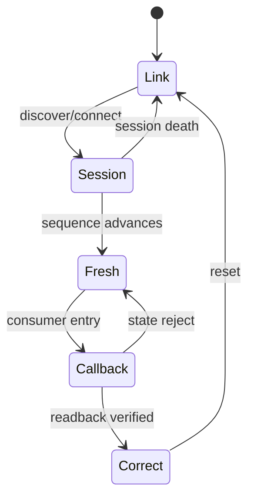

网卡 Up、SPI 有字节、Socket connected、Binder Proxy 非空、进程 Active 或 callback
日志出现，都不能单独证明最后一层。[可信度：标准机制推断] 恢复必须逐门验证，并提交
同一时间轴、两端 PID/Generation、计数器、配置、最早断点和恢复回读。
对受 systemd 管理的 SDK/UMDP 链还必须保持：systemd Active / New PID ≠ Service Ready ≠
Client Handle Valid ≠ Subscription Restored ≠ Business Cache Rebuilt。[可信度：标准机制推断]


## 5.3 Android IPC

### 5.3.1 适用域与模块

图 1 的 Android Framework/JAVA Services 和图 3 的 Binder、Client HAL Proxy、
Service HAL Proxy、Client Proxy、Service Stub 是直接标签。[可信度：架构图确认]
[证据：original-diagram-01] [证据：original-diagram-03]
标准模型包含 Binder Proxy/Stub、`ServiceManager`、Binder driver、server thread
pool、AIDL、HIDL、Handler/Looper/message queue、`BroadcastReceiver`、
`ContentProvider`、Unix/domain sockets、shared memory 与 Netlink。
[可信度：标准机制推断] 私有 descriptor、transaction code、服务名和线程数
`[可信度：待 MT8676 确认]`。

### 5.3.2 正常路径

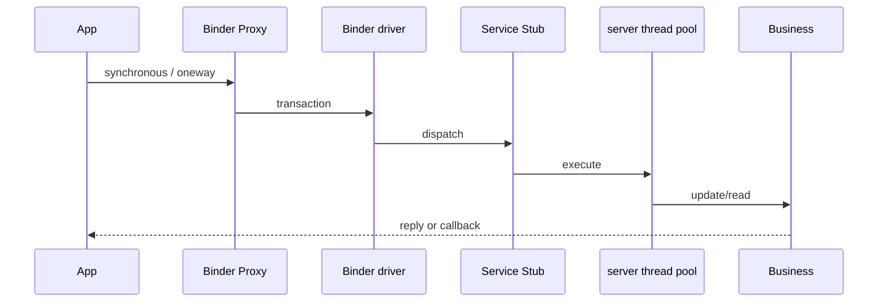

synchronous 占用调用方等待上下文；oneway 仅表示不等同步 reply，不表示服务已消费。
[可信度：标准机制推断]

#### Android 非 Binder IPC 诊断合同

下表是标准诊断模型，不代表 MT8676 已采用某个私有 endpoint、线程、权限或缓存策略。
每一行都把正常投递、异常、观测和恢复责任闭合到新鲜状态，而不是只列机制名。
[可信度：标准机制推断]

| 机制 | 适用与正常路径 | 异常边界 | 观测点 | 恢复、验证与责任 |
|---|---|---|---|---|
| Handler/Looper | 同进程异步切线程：post/enqueue → Looper dispatch → consumer | queue stall、blocked looper、stale message | queue latency/thread stack、enqueue/dispatch/consume 时间线 | 移除或 retire old Generation，解除阻塞后重投当前状态并由 consumer 回读；producer/Looper/consumer 分段负责 |
| `BroadcastReceiver` | 系统或应用事件：sender → `AMS/dispatcher` → receiver | 未注册、permission/user scope 不匹配、队列延迟、receiver timeout 或消费失败 | 注册状态、用户、权限、发送/调度/入口/完成时间 | re-register or resend current state，再验证 receiver 业务结果；sender、系统 dispatcher、receiver 分段负责 |
| `ContentProvider` | 结构化共享数据：resolver → Binder/provider → storage | provider 未发布或死亡、权限拒绝、cursor/observer freshness 失效 | provider 发布、Binder 调用、查询耗时、cursor 版本、observer 通知与存储版本 | 重新取得 provider，requery current state 并重建 observer；provider 前归 resolver/权限，之后归 provider/storage |
| Unix/domain sockets | 本机字节流或报文：bind/listen → connect/session → read/write | endpoint 缺失、peer death and buffer backpressure、半开 session | socket 状态、peer identity、send/receive/drop/queue、两端 PID/Generation | 关闭旧 FD，reconnect a new session，握手并做 request/readback；监听端、transport、client 各自负责 |
| shared memory | 大块数据：FD/handle transfer → mapping → producer/consumer | handle/映射泄露、ownership 冲突、fence/cache visibility 缺失、跨代际读写 | FD/map、buffer owner、fence、producer/consumer Sequence 与 Generation | 等待/校验 fence，unmap and retire old Generation，重新分配并以当前数据回读；分配者与当前 owner 负责 |
| Netlink | 内核事件：kernel producer → socket receive queue → userspace consumer | family/permission mismatch、receive queue drop/Sequence gap、用户线程不消费 | family/group、权限、socket drop、Sequence、内核发送与用户入口计数 | 重建订阅并 resync from authoritative state；内核 producer、socket owner、userspace consumer 分段负责 |

具体 receiver/provider 名、socket/Netlink family、shared-memory API、队列阈值和恢复所有者
`[可信度：待 MT8676 确认]`。

### 5.3.3 异常与恢复路径

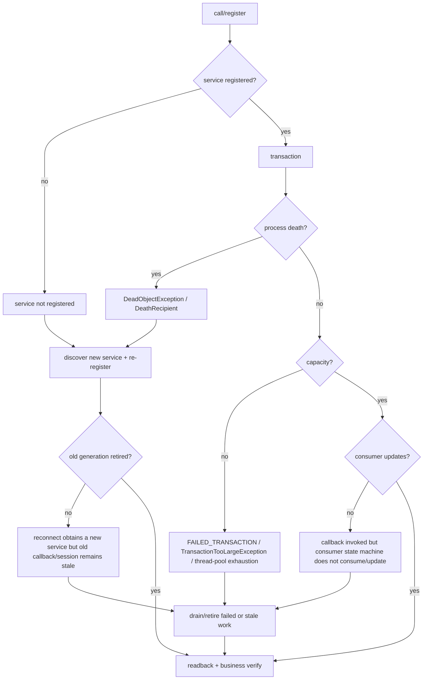

Required branches also include oneway backlog. `DeathRecipient` 只帮助感知死亡；恢复仍要
获取新 Proxy、重新注册 callback、废弃旧 Generation 并回读。[可信度：标准机制推断]
异常字符串、日志 tag 和自动恢复责任 `[可信度：待 MT8676 确认]`。

### 5.3.4 会话、就绪与新鲜度模型

Proxy 非空不等于 RPC 可用；transaction 成功不等于源新鲜；callback 到达不等于
Handler/Looper 和业务状态机已消费。AIDL/HIDL 只描述接口/version 边界。
[可信度：标准机制推断]

### 5.3.5 队列、背压与资源边界

观察 Binder buffer、oneway backlog、server thread pool、Handler/Looper queue 和
共享内存所有权。`FAILED_TRANSACTION`、`TransactionTooLargeException` 与
thread-pool exhaustion 是候选标准分支，不是 MT8676 已知根因。[可信度：标准机制推断]

### 5.3.6 故障症状与最早断点

找不到服务先查 `ServiceManager` 注册；死亡后持续失败查旧 Proxy；请求失败查 driver/
大小/线程池；callback 有而 UI 不变查 consumer；重连后旧事件查 Generation。

### 5.3.7 日志、命令、计数器与追踪

收集 `dumpsys`、`service list`、进程/线程栈、transaction 失败计数、ANR、message queue
延迟和 callback 入口计数。[可信度：标准机制推断] 具体节点与日志 tag 待确认。

### 5.3.8 责任边界与升级材料

注册归服务启动者；driver 前失败归 Client；Stub 后归 Server；callback 后归消费者。
升级包含接口版本、注册表、两端线程栈、transaction 统计、复现和恢复回读。

### 5.3.9 证据与可信度

原图只确认标签和位置。[可信度：架构图确认] [证据：original-diagram-03]
内部行为为标准模型。[可信度：标准机制推断] 私有 ID、阈值、自动重连和进程绑定
`[可信度：待 MT8676 确认]`。

## 5.4 FDBus

<!-- explanation-refresh:fdbus-detail -->
**资料核对后的架构解释（2026-09-20）**

FDBus 的名字服务、连接、接口方法与业务数据有效性是不同阶段。新 MBOS 图明确 mb.os 的服务端角色及 ivi/cmd/diagnostics/can 客户端关系；PVT vehicle 图还给出各域名字服务和跨域承载示例。原图 FDBus 框保留，解释时应先定位具体端点，再查注册/连接、会话与订阅、消息/属性到达，最后核实当前有效业务状态。文中 D-Bus 与 FDBus 仍是不同概念，不因注释“dbus数据”自动合并。[MBOS-20260920 · 盟博OS架构-用户提供-20260920.png](https://qiantao18817568425-art.github.io/Architecture_Learning-/architecture/source-SRC0022.html) [S281 · vehicle方案.pdf · PDF第2-3页](https://qiantao18817568425-art.github.io/Architecture_Learning-/architecture/source-SRC0024.html#page-2)
<!-- /explanation-refresh -->


### 5.4.1 适用域与模块

图 1 有 FDBUS；图 3 在 SOS、Android、TBox 分组画出 FDBus/name_server，但仅 SOS
分组显示 host_server。
[可信度：架构图确认] [证据：original-diagram-01] [证据：original-diagram-03]
name server、host server、service registration/discovery、endpoint、session、
request/reply、publish/subscribe、topic、callback、reconnect 和 generation 为标准
诊断模型。[可信度：标准机制推断] 私有地址、Topic ID 和绑定待确认。

### 5.4.2 正常路径

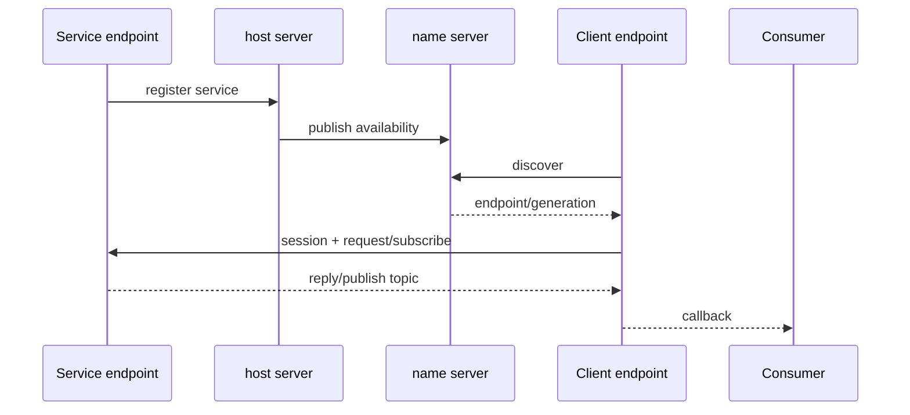

service registration/discovery 与 topic 行为是标准推断，不是原图的字段合同。
[可信度：标准机制推断]

### 5.4.3 异常与恢复路径

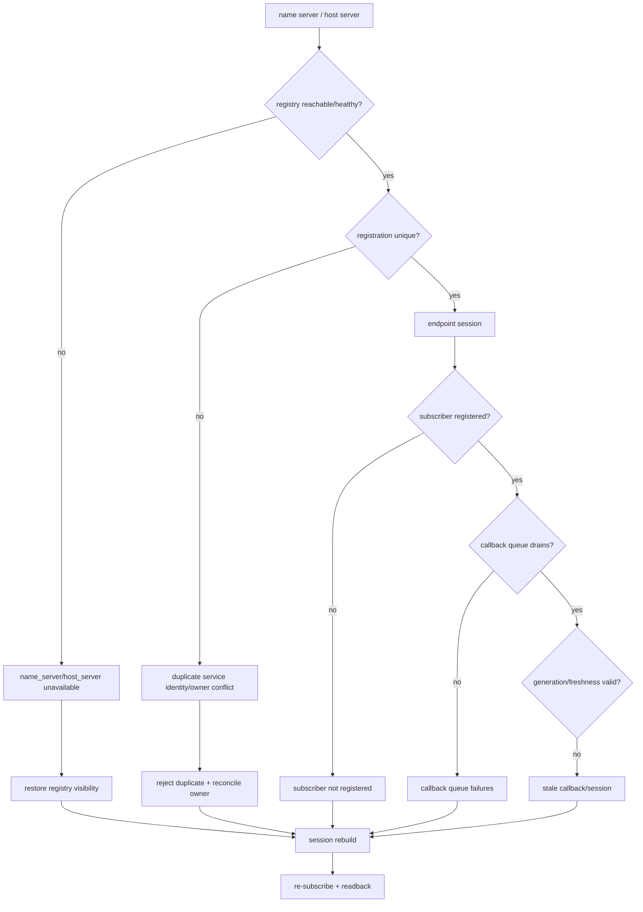

### 5.4.4 会话、就绪与新鲜度模型

注册存在不等于 session；session 不等于 subscriber 已注册；callback 不等于 topic 数据
新鲜。记录服务代际、session、topic、Sequence/timestamp 和 consumer version。

### 5.4.5 队列、背压与资源边界

观察 request、publish、transport、callback queue 的 enqueue/dequeue/drop/wait。
队列深度、丢弃和 reconnect 退避 `[可信度：待 MT8676 确认]`。

### 5.4.6 故障症状与最早断点

发现失败查 name/host；发现成功无 reply 查 endpoint；reply 正常无事件查订阅；接收
正常无更新查 callback queue/状态机；恢复后旧事件查 generation。

### 5.4.7 日志、命令、计数器与追踪

采集注册表、host/name 连接、endpoint/session、request/reply、topic subscribe/
publish、callback 和队列计数。具体命令、服务名和 endpoint 待确认。

### 5.4.8 责任边界与升级材料

注册归 Service/host；发现归 name server/config；session 归两端/transport；订阅归
Client；callback 后归 Consumer。升级包含注册表、Generation、session 时间线和回读。

### 5.4.9 证据与可信度

方框与显式箭头是图事实。[可信度：架构图确认] [证据：original-diagram-03]
discovery/topic/session 为标准推断。[可信度：标准机制推断] 私有端点、ID、payload、
重连 `[可信度：待 MT8676 确认]`。

## 5.5 SOME/IP 与 DoIP

### 5.5.1 适用域与模块

图 3 有 Routing Manager、Clients(SOME/IP)、Client/Service、Proxy/Stub、SomeIp 和
DoIP 标签。[可信度：架构图确认] [证据：original-diagram-03]
Offer/Find、instance/version、request/response、Event/EventGroup、subscribe/notify、
TCP/UDP、multicast、payload serialization 与 E2E 是标准模型。
[可信度：标准机制推断] 私有 ID、端口、版本和 payload 待确认。

DoIP is diagnostic-over-IP, not a generic SOME/IP service。DoIP 必须按诊断连接和 UDS
语义单独分析。[可信度：标准机制推断]
原图不证明 DoIP 必须经过 Routing Manager 或 CanService；具体路由、诊断会话与网关
绑定 `[可信度：待 MT8676 确认]`。

### 5.5.2 正常路径

#### SOME/IP 端到端正常链

标准数据方向是：Client business → Client Proxy → serialize request → transport/routing →
Service Stub → deserialize + dispatch → Service business → serialize response/event →
Client Proxy: transport response/notify → Client business: deserialize/E2E + callback。
[可信度：标准机制推断]

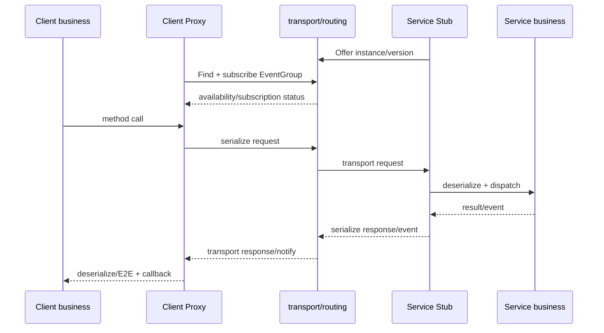

上图中的 transport/routing 是标准逻辑位置；数据面是否经过当前 Routing Manager、
Proxy/Stub 的实际宿主和 IDL `[可信度：待 MT8676 确认]`。

#### DoIP 独立正常链

DoIP 标准链独立表达为：Tester → IP/TCP → DoIP entity → routing activation/session →
diagnostic target/gateway → UDS request/response → Tester 校验；它不借用 SOME/IP 的
Offer/Find/EventGroup 语义。[可信度：标准机制推断]

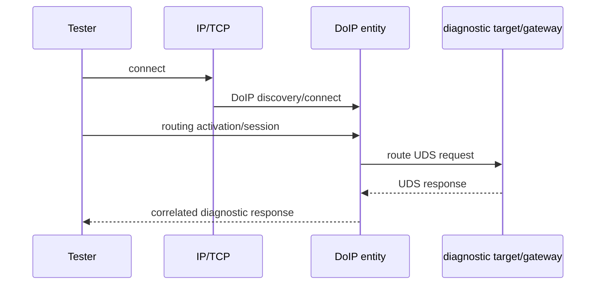

### 5.5.3 异常与恢复路径

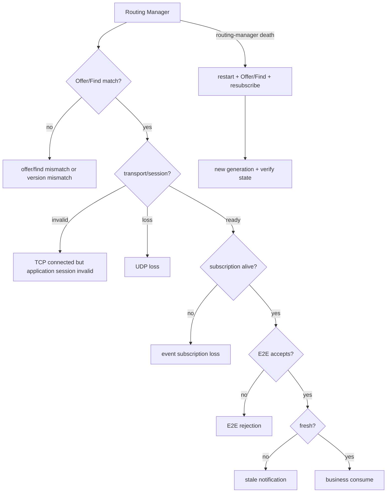

#### DoIP 独立异常与恢复链

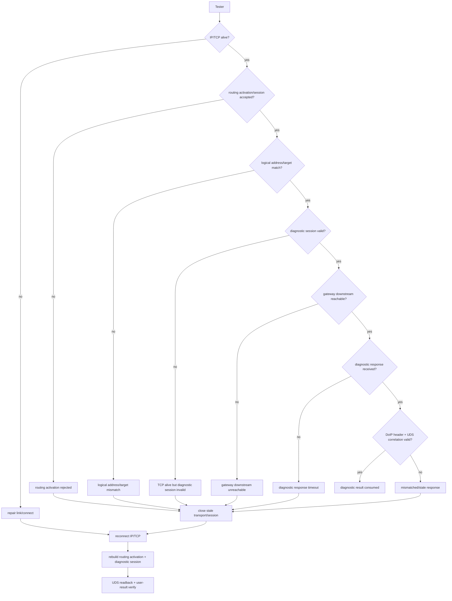

#### DoIP 独立观测与责任边界

按同一请求/响应时间线采集 pcap、TCP 状态、DoIP header、logical address、
routing-activation result、UDS correlation、网关下游和 Tester 结果。链路/连接归网络，
activation 与地址映射归 DoIP entity/config，目标不可达归网关/ECU，UDS 响应后归 Tester
consumer。具体实体、逻辑地址、超时、路由和命令 `[可信度：待 MT8676 确认]`；诊断链
不得强制绑定当前 Routing Manager 或 CanService。

### 5.5.4 会话、就绪与新鲜度模型

链路 Up、TCP connected、Offer visible、EventGroup subscribed、notify delivered 与业务
状态正确逐层不同；availability 不等于 event freshness。[可信度：标准机制推断]
DoIP 中 TCP connected、routing activation、diagnostic session、目标 ECU 可达、UDS
响应匹配与诊断结果正确也必须逐层证明。[可信度：标准机制推断]

### 5.5.5 队列、背压与资源边界

观察 Routing Manager、TCP/UDP buffer、反序列化和 callback queue 的 offer/find、
subscribe/ack、notify、drop 与 E2E reject；不写私有容量。

### 5.5.6 故障症状与最早断点

全不可用查链路/Router；单服务查 Offer/Find/version；request 正常无 event 查订阅；
报文有无数据查 serialization/E2E；callback 有状态旧查 consumer。

### 5.5.7 日志、命令、计数器与追踪

采集 link/socket、Routing Manager、Offer/Find、availability、request/response、
EventGroup、notify、TCP 重传、UDP drop、E2E accept/reject、Proxy/Stub callback。

### 5.5.8 责任边界与升级材料

链路归网络；发现/版本归服务配置与 Router；订阅归 Client；E2E 归两端 profile；
callback 后归 Consumer。升级包含配置版本、抓包、路由日志、订阅时间线和回读。

### 5.5.9 证据与可信度

标签和箭头为图事实。[可信度：架构图确认] [证据：original-diagram-03]
Offer/Find/EventGroup/TCP/UDP/multicast 为标准推断。[可信度：标准机制推断]
私有 ID、端口、timeout 和恢复 `[可信度：待 MT8676 确认]`。

## 5.6 SPI/IPCL

<!-- explanation-refresh:spi-detail -->
**资料核对后的架构解释（2026-09-20）**

物理 SPI 承载、IPCL 私有封装和上层车辆属性分属不同层。PVT vehicle 方案可用于说明 MCU→SOS 服务→Android VHAL 的交接，但未给出原图 IPCL 的完整帧头/CRC/重传规范。新增 EINT 资料要求区分 GPIO、EINT 与 virq；IRQ 到达只证明一次中断路径，不证明对应报文完整或属性新鲜。[S281 · vehicle方案.pdf · PDF第2-3页](https://qiantao18817568425-art.github.io/Architecture_Learning-/architecture/source-SRC0024.html#page-2) [E005 · EINT_IDH_Share.pdf · PDF第3-8页](https://qiantao18817568425-art.github.io/Architecture_Learning-/architecture/source-SRC0028.html#page-3)
<!-- /explanation-refresh -->


### 5.6.1 适用域与模块

图 2 有 MCU SPI，图 3 有 MCU IPCL、TBox/SOS CanService、Vehicle Interface 和
SPI/IPCL 显式路径。[可信度：架构图确认] [证据：original-diagram-02]
[证据：original-diagram-03]

### 5.6.2 正常路径

business message/state path：

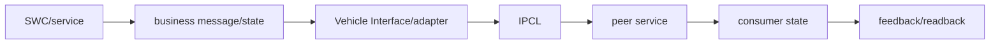

physical byte/frame path：


frame、header/payload、CRC、Sequence/Generation、queue、DMA/FIFO、IRQ、callback、
overflow、reassembly 和 retry 是标准/候选机制。[可信度：标准机制推断]
`IPCL private framing and channel IDs are not proven`；Topic、payload、ACK/retry
`[可信度：待 MT8676 确认]`。

### 5.6.3 异常与恢复路径

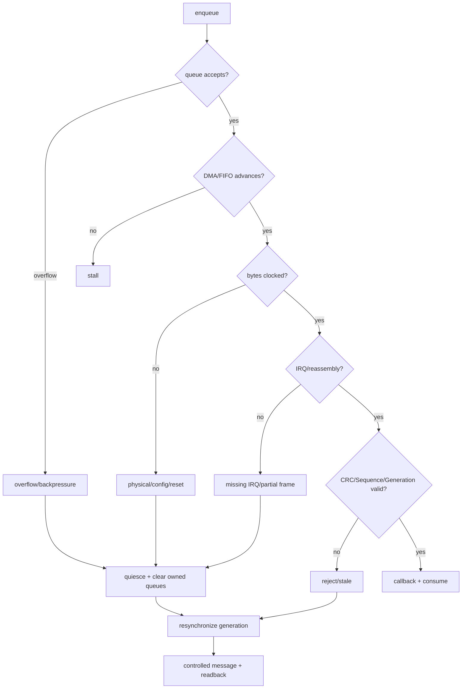

### 5.6.4 会话、就绪与新鲜度模型

有时钟/字节不等于帧有效；CRC 通过不等于 Sequence 新鲜；callback 不等于状态更新。
IPCL session/Ready/Generation 字段待确认。

### 5.6.5 队列、背压与资源边界

检查 Producer、IPCL、DMA descriptor、FIFO、对端接收和 callback queue；统计 enqueue/
dequeue、bytes/frames、overflow、CRC reject、gap、IRQ 与 consumer update。

### 5.6.6 故障症状与最早断点

无字节查 controller；有字节无帧查 reassembly；有帧 reject 查 CRC/Sequence；callback
无更新查状态机；恢复后旧状态查队列清理/Generation。

### 5.6.7 日志、命令、计数器与追踪

两端同时采业务键、frame Sequence、CRC、DMA/FIFO、IRQ、SPI bytes、reassembly、
callback。逻辑分析仪只证明波形，不证明业务。

### 5.6.8 责任边界与升级材料

未入队归 Producer；无 DMA 归本端驱动；线有字节无 IRQ 归物理/对端；reject 归帧合同；
callback 后归 Consumer。升级包含两端日志、控制器、帧计数和回读。

### 5.6.9 证据与可信度

SPI/IPCL 标签与边为图事实。[可信度：架构图确认] [证据：original-diagram-03]
帧/DMA/FIFO/IRQ 为标准推断。[可信度：标准机制推断] 私有 framing、ID、timeout、
retry 与 payload `[可信度：待 MT8676 确认]`。

## 5.7 AUTOSAR RTE/COM/E2E

### 5.7.1 适用域与模块

图 2 有 SWCs、RTE、BSW、MCAL、CAN/SPI；图 3 有 DI/IVI SWC、Com、Vehicle Interface。
[可信度：架构图确认] [证据：original-diagram-02] [证据：original-diagram-03]
SWC Runnable、RTE Port、COM signal/PDU、`PduR`、`CanIf`、CAN driver/controller/transceiver、E2E counter/CRC/data ID/freshness 为标准模型。
[可信度：标准机制推断] 图中 Com 与具体 AUTOSAR COM 配置的身份待确认。

### 5.7.2 正常路径

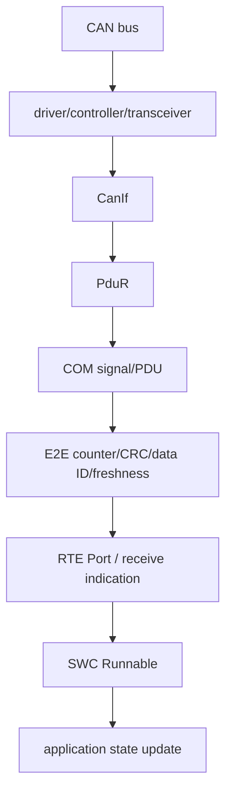

### 5.7.3 异常与恢复路径

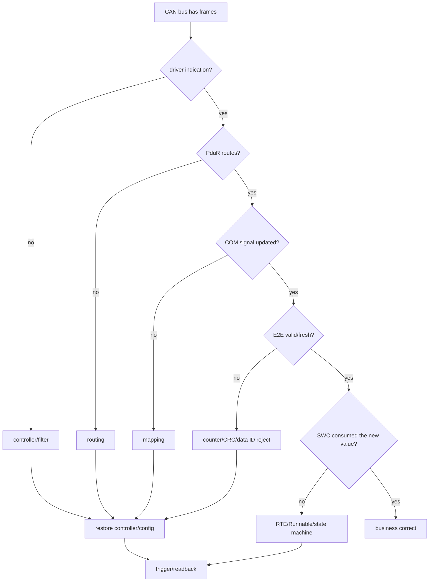

CAN 有帧 ≠ COM 更新 ≠ RTE 新鲜 ≠ SWC 消费；这些是不同证据。
timeout/substitution/invalidation 仅是标准候选；启用、替代值和合同
`[可信度：待 MT8676 确认]`。

### 5.7.4 会话、就绪与新鲜度模型

CAN 无 RPC session；就绪拆为 controller、PDU route、COM update、E2E accept、Runnable
consume。E2E 可检测部分重复/丢失/错配，业务 freshness 还需周期/age 合同。

### 5.7.5 队列、背压与资源边界

观察 mailbox/FIFO、driver、`PduR`、COM I-PDU buffer、RTE trigger、Runnable；不假定
buffer 数量和 timeout。

### 5.7.6 故障症状与最早断点

无帧查 ECU/物理；有帧无 indication 查 controller；有 indication 无 COM 查 `PduR`；
COM 更新被 reject 查 E2E；E2E 接受无业务查 RTE/SWC。

### 5.7.7 日志、命令、计数器与追踪

采 CAN 抓包、controller、receive indication、PDU route、COM update、E2E status、
RTE read、Runnable 和状态。DBC/ARXML、COM/E2E 配置是升级材料。

### 5.7.8 责任边界与升级材料

总线归网络/ECU；driver 归 MCAL；`CanIf`/`PduR`/COM 归 BSW；E2E 归两端 profile；RTE 后归
SWC。提交抓包、DBC/ARXML、映射、E2E 计数、任务 trace 与回读。

### 5.7.9 证据与可信度

分层和标签为图事实。[可信度：架构图确认] [证据：original-diagram-02]
AUTOSAR 行为为标准推断。[可信度：标准机制推断] PDU ID、profile、timeout、
substitution/invalidation `[可信度：待 MT8676 确认]`。

## 5.8 virtio 与虚拟设备

<!-- explanation-refresh:latest-ipc-ownership -->
**资料核对后的架构解释（2026-09-20）**

新版 Day 18 强化“通知—数据—队列—状态”四层分工：Mailbox/IPI 通知对端，共享内存保存载荷，Ring Buffer 管理条目，业务协议决定完成与恢复。核对本项目 virtio/IPCL 时只把它用作问题清单：缓存/内存序、序号、所有权、队列写满、对端复位后旧条目失效。不能把课程的 Mailbox/IPI 示意替换原有 MCU→SPI 通路，也不把示例 bootEpoch 字段宣称为当前 IDL。[最新站点 Day 18](http[本地资料库路径]
<!-- /explanation-refresh -->


<!-- explanation-refresh:virtio-vsock -->
**资料核对后的架构解释（2026-09-20）**

VSOCK 是基于 CID/port 的跨域 socket 接口，virtio-vsock 是相关承载的一种实现；它与 virtio-net/vmnet 的 IP 路由不是同一地址体系。PVT 文档的 VSOCKX 是谦川 Guest 间扩展，原生通道与扩展通道中的 CID=2 不应脱离地址族解释。连接建立后仍须自定义业务 ready、报文边界、请求关联和断线恢复；共享 descriptor 的完成也不自动等于消费者已使用数据。[U038 · Vsock api 文档v2.0.pdf · PDF第4-13页](<../培训材料/PVT技术分享文档/Vsock api 文档v2.0.pdf#page=4>) [S282 · vmnet配置说明.pdf · PDF第4-5页](https://qiantao18817568425-art.github.io/Architecture_Learning-/architecture/source-SRC0027.html#page-4)
<!-- /explanation-refresh -->


### 5.8.1 适用域与模块

本节 virtio 仅为标准模型，不证明原图中任何设备采用 virtio。图 2 只确认
Hypervisor、Host、Guest、Virtual conninfra，未逐设备标注 virtio。
[可信度：架构图确认] [证据：original-diagram-02]
frontend、Descriptor、Avail ring、Kick/doorbell、Host backend、Used ring、virtual IRQ、
callback、buffer ownership、memory ordering 为标准 virtio 模型。
[可信度：标准机制推断] 设备绑定、queue 和共享布局待确认。

### 5.8.2 正常路径

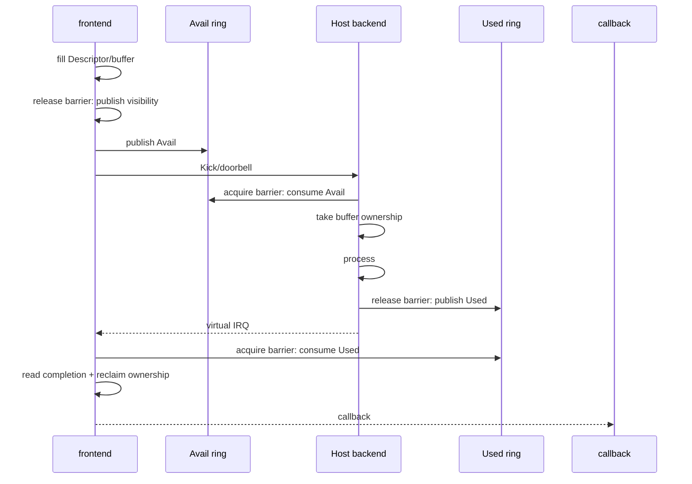

标准 ownership/visibility 合同如下；barrier 代表先后与可见性约束，不指定某个私有 API。
[可信度：标准机制推断]

| Ownership 状态 | 进入条件 | 可读写者与离开证据 |
|---|---|---|
| Frontend-owned | free descriptor/buffer 已分配 | frontend 填写；内容先可见，再发布 Avail |
| Backend-owned | backend acquire 后消费 Avail | backend 读取请求并写 completion；frontend 不得复用 |
| Frontend-reclaimable | backend 写入先可见，再发布 Used | frontend acquire 后才读 completion |
| Reclaimed | frontend 已读 completion 并回收 | 可进入新 Generation 的 Frontend-owned |

Avail 已前进且 Kick 已观察，但 backend 读取 payload 旧或不一致，优先检查 producer
release/consumer acquire 与 cache visibility；Kick 计数不前进属于 missing kick/IRQ 的通知侧断点。Used 已前进但
frontend completion 仍旧，优先检查 backend release/frontend acquire；Used 不前进更像
backend stall 或 ownership 未转移。[可信度：标准机制推断]
具体 barrier/API 名称、cache 一致性方式、ring layout 与 ownership 实现
`[可信度：待 MT8676 确认]`。

### 5.8.3 异常与恢复路径

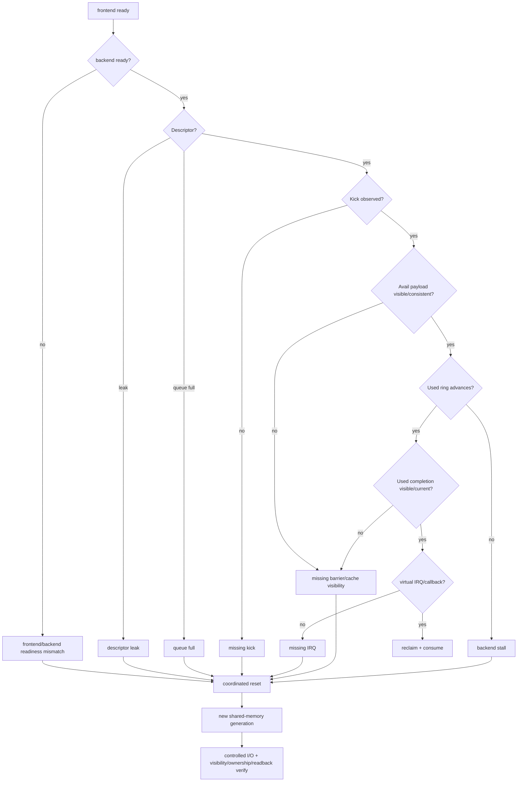

VM reset 后旧 Descriptor/callback 不得跨代际继续；stale shared-memory generation
必须隔离。[可信度：标准机制推断]

### 5.8.4 会话、就绪与新鲜度模型

VM 存活不等于两端 Ready；Kick 不等于完成；Used 前进不等于 IRQ 消费；callback 不等于
当前 generation 数据。freshness 结合 buffer metadata 与业务 Sequence。

### 5.8.5 队列、背压与资源边界

观察 free/outstanding、avail/used、kick、IRQ、reclaim、drop、共享 buffer 和 backend
queue；不写 MT8676 queue depth。

### 5.8.6 故障症状与最早断点

无 free 查 leak；Avail 前进 backend 不动查 Kick/Ready；backend 完成 Guest 不动查
Used/IRQ；callback 数据旧查 generation；VM reset 后异常查 reset 合同。

### 5.8.7 日志、命令、计数器与追踪

采 VM lifecycle、两端 Ready、queue index、Descriptor、ownership、kick、backend
complete、Used、IRQ、callback、reclaim 与 Hypervisor trace。

### 5.8.8 责任边界与升级材料

发布前归 frontend；Kick 后至 Used 归 backend；Used 后无 callback 归 IRQ；callback 后
归 consumer；reset 资源归两端合同。提交两端 queue dump、generation 和计数。

### 5.8.9 证据与可信度

Host/Guest 边界为图事实。[可信度：架构图确认] [证据：original-diagram-02]
virtqueue 行为为标准推断。[可信度：标准机制推断] 设备、ring、IRQ、reset/generation
`[可信度：待 MT8676 确认]`。

## 5.9 MT8676 SDK/UMDP

### 5.9.1 适用域与模块

图 3 确认 TBox modem_service/core communication/FDBus 标签，但不确认其与 UMDP
进程身份映射。[可信度：架构图确认] [证据：original-diagram-03]
指南确认 Client/Server、Socket、同步、超时、callback、GET/SET/REGISTER。
[可信度：MT8676 资料确认] [证据：sdk-mt8676-guide]
[证据：sdk-image-sdk-structural-diagram-png]
V1.0.166 SDK 示例与 V1.0.226 UMDP 集成头文件是不同版本快照；前者的调用示例与后者
的接口面不能互相升级为精确合同。[可信度：MT8676 资料确认]
[证据：sdk-mt8676-guide] [证据：umdp-files-umdp-include-fibo-sdk-fibo-type-h]

### 5.9.2 正常路径

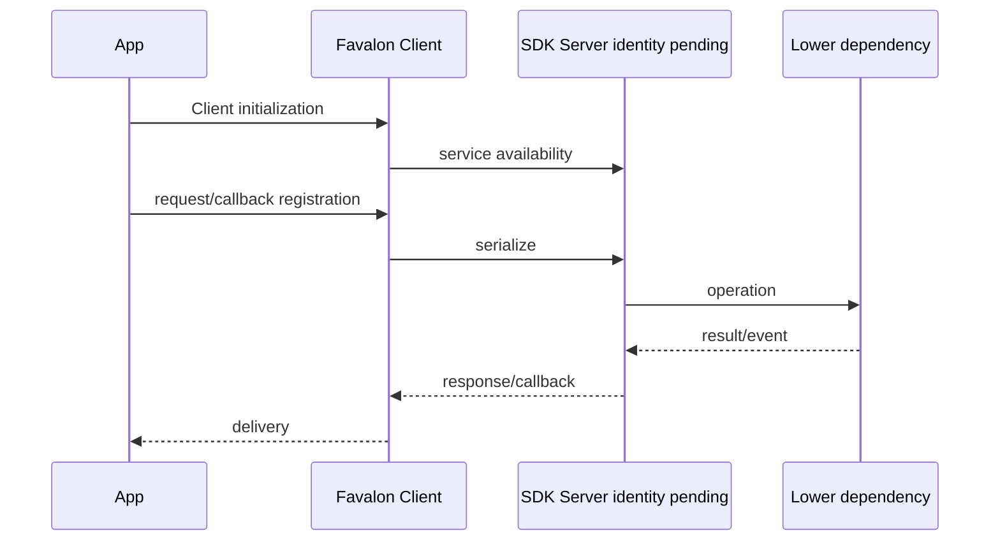

同步图确认请求/返回和 timeout 概念。[可信度：MT8676 资料确认]
[证据：sdk-image-sync-timing-diagram-png] timeout 值和 late response 策略待确认。

### 5.9.3 异常与恢复路径

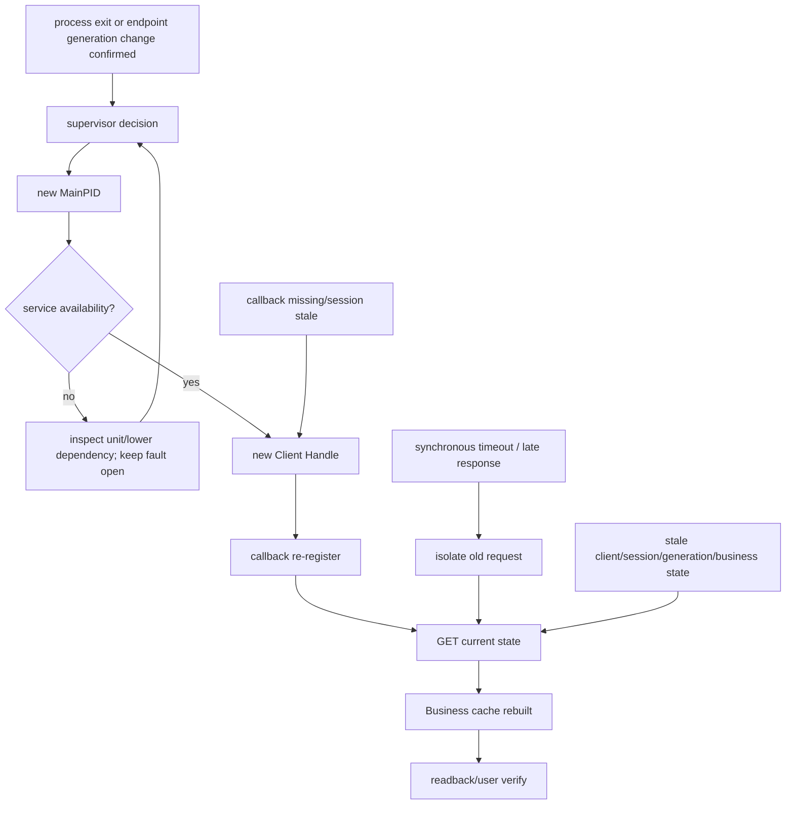

`Service DOWN` 只触发判定，不直接证明 process exit；service death/restart、supervisor
拉起、服务可见、Client 恢复和业务恢复是不同阶段。上图是稳健恢复模型；哪个 supervisor
执行、是否自动 reconnect/re-register `[可信度：待 MT8676 确认]`。

### 5.9.4 会话、就绪与新鲜度模型

Client initialization、service availability、Lower Ready、synchronous result、
callback registration/delivery 和 business state 必须分层。Data/Voice 示例确认 init
和 callback 用法。[可信度：MT8676 资料确认]
[证据：sdk-example-data-test-data-test-c] [证据：sdk-example-voice-test-voice-test-c]
callback thread、自动 reconnect/re-register、death cause `[可信度：待 MT8676 确认]`。
V1.0.166 示例与 V1.0.226 `fibo_type.h` 可确认 `Service UP/DOWN` 语义存在，但
`Service DOWN` 不等于进程 crash/restart，`Service UP` 不等于新 PID 已达到业务 Ready。
[可信度：MT8676 资料确认] [证据：sdk-mt8676-guide]
[证据：umdp-files-umdp-include-fibo-sdk-fibo-type-h]
V1.0.226 `fibo_error.h` 存在 `E_FIBO_UMDP_NOT_READY`，只证明该版本定义此错误语义，
不证明 V1.0.166 的精确值，也不揭示 Ready 判据。[可信度：MT8676 资料确认]
[证据：umdp-files-umdp-include-fibo-sdk-fibo-error-h]

#### Unit、supervisor 与 Ready 证据矩阵

| 证据面 | 直接确认 | 不等价边界与恢复用途 |
|---|---|---|
| 四个 systemd unit | `fb_modem.service`、`fb_audio.service`、`fb_powermgr.service`、`fb_logmgr.service` 均为 Type=simple、Restart=always | 只确认 unit 进程生命周期配置；不提供业务 Ready handshake，也不恢复 Client Handle/callback/cache |
| `umdpprocess.ini` | 仅 fb_logMgr、fb_modemServices、`fb_powerMgr` 三个 section 为 ready=false；不含 audio | 表示该配置不要求 ready signal，不是业务已 Ready；与 systemd 的实际分工待确认 |
| V1.0.226 headers | `fibo_type.h` 有 Service UP/DOWN；`fibo_error.h` 有 `E_FIBO_UMDP_NOT_READY` | 事件/错误存在不等于进程代际或 Ready 判据已知；不得与 V1.0.166 精确合同互换 |
| supervisor identity | unit 与进程配置文件在归档中同时存在 | 实际 supervisor/优先级/是否同时生效、谁决定 restart 和 MainPID `[可信度：待 MT8676 确认]` |

四个 unit 的 Type/simple 与 Restart 配置为直接资料事实。[可信度：MT8676 资料确认]
[证据：umdp-files-fb-modem-service] [证据：umdp-files-fb-audio-service]
[证据：umdp-files-fb-powermgr-service] [证据：umdp-files-fb-logmgr-service]
三段 ready 配置为直接资料事实。[可信度：MT8676 资料确认]
[证据：umdp-files-umdp-config-umdpprocess-ini]

必须保持以下非等价关系：[可信度：标准机制推断]

- Type=simple ≠ business Ready
- Restart=always ≠ Client recovery
- ready=false ≠ business Ready
- `E_FIBO_UMDP_NOT_READY` ≠ Ready criterion known

因此恢复证据必须按 process exit → supervisor decision → new MainPID → service
availability → new Client Handle → callback re-register → GET current state → Business cache
rebuilt → readback/user verify 逐门提交，不能用前一门代替后一门。


### 5.9.5 队列、背压与资源边界

观察 Client wait、Socket、Server worker、Lower dependency、callback queue 的
outstanding/response/timeout/late/callback。`fibo_data` reconnect 只直接支持数据呼叫
家族，不可推广为全部 SDK。[可信度：MT8676 资料确认]
[证据：umdp-files-umdp-include-fibo-sdk-fibo-data-h]

### 5.9.6 故障症状与最早断点

init 失败查 service/dependency；synchronous timeout 关联 request/Server/Lower/late；
callback 丢失查 registration/session；重启后 GET 正常无 event 查 re-register；callback
有状态旧查 Generation/consumer；日志无输出先查 mount/journald。

### 5.9.7 日志、命令、计数器与追踪

采 `systemctl status/show`、`journalctl -u`、进程树、Socket/FD、init/deinit、service
UP/DOWN、request/response、callback、timeout/late、依赖与回读。

`fb_modem.service` Requires `mtktelephonyservice.service`，但无 After，也不证明业务
Ready。[可信度：MT8676 资料确认] [证据：umdp-files-fb-modem-service]
上述命令是通用诊断方法；具体权限、unit 名、Socket/FD 路径和日志目录必须按目标版本
确认，不得据此反推私有合同。[可信度：标准机制推断]
这直接确认 modem dependency；audio/power 和 log manager 的依赖边界必须分别读取，
不能从 modem unit 推导彼此业务 Ready。[可信度：MT8676 资料确认]
`fb_audio.service` 仅 After modem 且 Requires `sound.target`，不证明 modem
availability/Ready。[可信度：MT8676 资料确认] [证据：umdp-files-fb-audio-service]
Power 才对 modem 同时 After + Requires，仍不证明业务 Ready。
[可信度：MT8676 资料确认] [证据：umdp-files-fb-powermgr-service]
Log 对 `/var/run /data /run` 使用 `RequiresMountsFor`，对 journald 使用 After + Requires；
不证明可写、持久化或业务 Ready。[可信度：MT8676 资料确认]
[证据：umdp-files-fb-logmgr-service]

### 5.9.8 责任边界与升级材料

Client/Handle/重注册归调用方；Server/worker 归实际服务；拉起归 supervisor；telephony、
sound、mount、journald 归依赖；callback 后归业务。提交版本、unit/config、两端
PID/Generation、请求/callback 时间线、依赖、core/exit 和 GET/readback。

flow-22、flow-26～flow-35、flow-40 的具体 SDK→进程/库链是 mixed hypothesis，不能
写成 MT8676 当前调用链；需 ELF、进程映射、注册和 trace。
[可信度：待 MT8676 确认]

### 5.9.9 证据与可信度

SDK 同步/超时/callback 与 UMDP unit/config 为资料事实。
[可信度：MT8676 资料确认] [证据：sdk-mt8676-guide]
[证据：umdp-library-service-listing]
`umdpprocess.ini` ready=false 仅确认 fb_logMgr、fb_modemServices、`fb_powerMgr` 三个
section，不含 fb_audio，也不等于业务 Ready；其中 `fb_powerMgr` 只是配置中的精确标识符。[可信度：MT8676 资料确认]
[证据：umdp-files-umdp-config-umdpprocess-ini]
恢复分层为标准推断。[可信度：标准机制推断] FIBO SDK Server 不得推定为具体 UMDP
process；timeout 值、late response、自动重连、callback thread 和库链
`[可信度：待 MT8676 确认]`。

## 5.10 跨机制交接与待补证据

统一步骤：先建立 Source→Feedback 时间轴，再逐层证明 Physical、Session、Fresh、
Callback、Business；在最早不前进处切责任，恢复后从新 Generation 回读。升级材料至少
含软件/配置版本、原始日志、抓包/trace、两端 PID/Generation、队列计数、最早断点、
恢复动作和用户结果。

待补：Binder 服务/接口；FDBus endpoint/topic/session；SOME/IP Offer/Find、
EventGroup/E2E；SPI/IPCL framing/channel/queue；AUTOSAR ARXML/DBC/COM/E2E；
virtio device/ring/reset；SDK/UMDP Server/库/进程、timeout/late、自动重连与 callback
thread。未取得这些证据前，不填写猜测的 ID、timeout、retry、queue depth、进程链或
payload。


---

[返回主题导航](README.md) · [本次来源索引](https://qiantao18817568425-art.github.io/Architecture_Learning-/architecture/22.html)


---

<!-- chapter-id: 06 -->

# 06 Android 内部机制、图形资源与稳定性

## 2026-09-20 校订：Android 异常必须连到跨域依赖

PVT 的 lmkd/system_server SWT 案例显示，AMS 的 updateOomAdjLocked 路径等待 lmkd socket，lmkd 高 CPU/epoll 异常会形成系统服务阻塞链。这个案例支持“从等待者追到持锁/服务端”的方法，不支持把所有 SWT 定性为 lmkd。[S261 · lmkd+引发的system_server+SWT.pdf · PDF第2-5页](https://qiantao18817568425-art.github.io/Architecture_Learning-/architecture/source-SRC0029.html#page-2)

内存排查先分用户堆、共享图形 buffer、内核页、缓存；page_owner 针对页分配线索，不能取代进程堆和 dma-buf 归属分析。[E003 · 使用page_owner定位内存泄露.pdf · PDF第3-8页](https://qiantao18817568425-art.github.io/Architecture_Learning-/architecture/source-SRC0030.html#page-3) 显示/媒体排查将 Surface/BufferQueue、codec、fence、SF/HWC、Weston/DRM 串起来，`pipelineFull` 和单次 wait fence 都不能独立确定根因。[U047 · 软件开发培训-音视频解码常见问题及分析.pdf · PDF第6-10页](https://qiantao18817568425-art.github.io/Architecture_Learning-/architecture/source-SRC0023.html#page-6)

多域性能对照使用同一负载、温度、频率和事件配置；Mtrace V1.0 的 Kdmips/Hyptrace 要求三设备在线。[U028 · Mtrace Tool 使用说明.docx](https://qiantao18817568425-art.github.io/Architecture_Learning-/architecture/source-SRC0031.html) 工程步骤与已发现的培训解释问题见 [23 章](https://qiantao18817568425-art.github.io/Architecture_Learning-/architecture/23.html)。

---

本章回答的不是“Android 有哪些服务”，而是四个更适合现场定位的问题：请求从哪里来、资源当前归谁、哪一个边界最先偏离契约、恢复后怎样证明业务真的回来。图 1 确认 MT8676 架构中存在 Application、Framework/Java Services、Native Services、System、Runtime、Libraries、HAL、Kernel 等层，并能确认 `Surface Flinger`、`Input Flinger`、Window Manager、Display HAL、DRM、MDP、Camera、Audio 等标签存在。[可信度：架构图确认] [证据：original-diagram-01]

但必须先锁定边界：**图中方框存在 ≠ 已证明运行时调用关系**。`ViewRootImpl`、`HWUI`、`BufferQueue`、`HWC` 等逐跳关系来自 AOSP 通用机制，不由图 1 的方框位置直接证明；`BLASTBufferQueue`、`SurfaceControl`、HWC AIDL/HIDL 与各类 `dumpsys` 字段还会随 Android 版本变化。[可信度：标准机制推断] MT8676 的 Android 版本、厂商修改、私有进程名、接口版本、阈值与日志关键字待 MT8676 确认。[可信度：待 MT8676 确认]

## 6.1 生命周期、窗口与输入

### 6.1.1 生命周期和窗口正常路径

先按下列顺序理解第一条主链；这些英文标签也作为后续图中的稳定对照点：

`launch request` → `AMS/ATMS` → `process attach` → `Activity lifecycle` → `Window/DecorView` → `WMS` → `ViewRootImpl` → `visible + focused`。

[可信度：标准机制推断] `AMS` 管进程与组件状态，`ATMS` 管任务、Activity 与显示区域，`WMS` 管窗口 token、层级、布局、可见性和输入焦点。它们在具体 Android 版本中可能同处系统服务进程，但逻辑职责仍要分开。Activity 的 `onResume` 只说明生命周期到达某状态，不等于窗口已经可见、有 Surface、获得焦点或已经成功出帧。

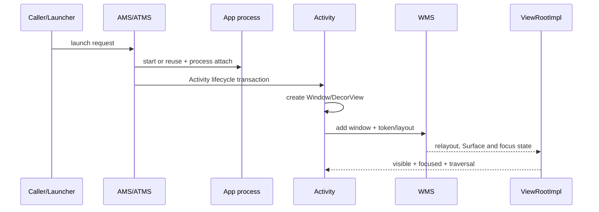

| 位置 | 输入 | 当前处理 | 输出 | 最早可证伪断点 | Owner 边界 |
|---|---|---|---|---|---|
| `AMS/ATMS` | 启动意图、用户与显示上下文 | 解析组件，选 Task，安排进程/生命周期 | 进程启动或生命周期事务 | 请求是否解析到目标组件/用户/显示 | Framework Activity/Task |
| App 进程 | attach 和 lifecycle transaction | 创建组件，执行主线程回调 | Activity/Window 请求 | 新进程是否完成 attach；主线程是否开始回调 | 应用进程 |
| `WMS` | token、布局、可见性、焦点请求 | 验证 token，维护 Window 树和焦点 | relayout/Surface/焦点状态 | Window 是否进入正确 Display 的可见树 | Framework Window |
| `ViewRootImpl` | DecorView、窗口与 Surface 状态 | traversal、测量、布局、绘制和输入桥接 | draw/Buffer 生产请求 | traversal 是否被调度并完成 | 应用 UI 根节点 |

### 6.1.2 输入事件正常路径

第二条主链的首个事件必须按顺序对齐：`input device/driver` → `EventHub` → `InputReader` → `InputDispatcher` → `focused Window/InputChannel` → `ViewRootImpl` → `View dispatch`。[可信度：标准机制推断] 图 1 能确认 Input Flinger、Input Manager 和 Window Manager 等模块标签，但不能单靠图示证明当前产品的进程拆分、线程名或版本实现。[可信度：架构图确认] [证据：original-diagram-01]

```mermaid
sequenceDiagram
  participant D as input device/driver
  participant E as EventHub
  participant R as InputReader
  participant I as InputDispatcher
  participant C as focused Window/InputChannel
  participant V as ViewRootImpl
  participant U as View dispatch
  D->>E: raw input event
  E->>R: read event batch
  R->>I: normalized event
  I->>C: dispatch to focused target
  C->>V: receive on app channel
  V->>U: deliver to hierarchy
  U-->>I: finish acknowledgement
```

`getevent` 能看到输入只说明内核输入层收到事件，**getevent ≠ app consumed**。还要继续证明 `InputReader` 产出了正确逻辑事件、`InputDispatcher` 选中了正确焦点窗口、目标 channel 可写、应用主线程真正消费并回传完成确认。[可信度：标准机制推断]

### 6.1.3 生命周期、窗口与输入异常传播/恢复路径

```mermaid
flowchart TD
  A[launch/input request] --> B{process and lifecycle valid?}
  B -- no --> B1[process death, stale token or lifecycle stall]
  B -- yes --> C{window visible and focus correct?}
  C -- no --> C1[focus mismatch / hidden window / wrong display]
  C -- yes --> D{InputChannel alive and writable?}
  D -- no --> D1[channel death or queue/backpressure]
  D -- yes --> E{consumer dispatch timely?}
  E -- no --> E1[blocked consumer or main-thread stall]
  E -- yes --> F{event accepted?}
  F -- no --> F1[permission/injection rejection]
  B1 --> R[retire old token and Generation]
  C1 --> R
  D1 --> R
  E1 --> R
  F1 --> R
  R --> S[recreate process/window/channel]
  S --> T[restore visible + focus]
  T --> U[inject real user action and readback verify]
```

异常链不能只写“点击无响应”。`focus mismatch` 的责任边界在窗口/显示选择；`blocked consumer` 在应用主线程或目标消费者；`channel death` 要区分服务端未清理旧 channel 与客户端进程死亡；`permission/injection rejection` 属于输入策略或调用权限；`queue/backpressure` 则要比较入队、派发、完成确认的累计差值。

最早可证伪断点是“原始输入是否被规范化为正确事件”，其后依次是目标焦点、channel 写入、应用接收和业务消费。Owner 边界以第一个偏离契约的位置为准。恢复后必须重新读取当前 Window/焦点/Display、确认 channel 属于新 `Generation`，再用真实操作完成 `readback verify`，不能把进程重启当成业务恢复。

## 6.2 Android 图像渲染

### 6.2.1 端到端正常路径

完整方向链固定为：`App UI` → `Choreographer/VSYNC` → `ViewRootImpl` → `HWUI/RenderThread` → `Skia/OpenGL ES/Vulkan` → `EGL` → `ANativeWindow/Surface` → `BufferQueue` → `SurfaceFlinger` → `HWC` → `Display HAL` → `DRM/KMS/MDP` → `physical display`。[可信度：标准机制推断]

```mermaid
flowchart TB
  A[App UI] --> B[Choreographer/VSYNC]
  B --> C[ViewRootImpl]
  C --> D[HWUI/RenderThread]
  D --> E[Skia/OpenGL ES/Vulkan]
  E --> F[EGL]
  F --> G[ANativeWindow/Surface]
  G --> H[BufferQueue]
  H --> I[SurfaceFlinger]
  I --> J[HWC]
  J --> K[Display HAL]
  K --> L[DRM/KMS/MDP]
  L --> M[physical display]
```

`UI thread` 负责业务状态、View 树和 traversal；硬件加速时，绘制命令可交给 `RenderThread`，由 Skia 经 GPU 接口生成内容。生产者提交 Buffer 和 `acquire fence`；消费者等待写入完成后使用 Buffer，合成/扫描输出完成后通过 `release fence` 允许生产者复用。Fence 是“某次内存/硬件工作是否完成”的同步所有权，不是普通业务锁。[可信度：标准机制推断]

图 1 确认 MT8676 分层中存在 Surface Flinger、Display HAL、DRM、MDP、OpenGL、Display 等标签。[可信度：架构图确认] [证据：original-diagram-01] 它不确认本产品究竟选用 GLES 还是 Vulkan、不确认每层直通或经过 Host 合成器，也不确认具体 HWC 接口代际。[可信度：待 MT8676 确认]

### 6.2.2 帧的资源与观察模型

| 阶段 | 输入/资源 | 核心处理 | 输出/交接 | 主要观测 | Owner 边界 |
|---|---|---|---|---|---|
| App/traversal | View 树、脏区、业务状态 | measure/layout/draw | DisplayList 或软件像素 | traversal、主线程栈、帧调度 | App UI |
| Render | 绘制命令、纹理、目标 Buffer | Skia/GPU 命令编码与执行 | 已写 Buffer + acquire fence | `frame timeline`、GPU 完成、fence | App graphics |
| Queue | slot 与 GraphicBuffer | dequeue/queue、所有权转移 | 可被消费者 acquire 的帧 | Buffer 状态、帧号、队列差值 | Producer/BufferQueue |
| Compose | Layer、事务、Buffer/Fence | latch、裁剪、变换、合成决策 | HWC layer 或合成目标 | Layer 状态、latch、present | SurfaceFlinger/HWC |
| Display | plane/mode/connector | atomic commit、scanout、vblank | 电气/像素输出 | commit、vblank、链路/背光 | HAL/Kernel/Panel |

### 6.2.3 渲染异常传播/恢复路径

```mermaid
flowchart TD
  A[UI state changed] --> B{traversal/draw produced?}
  B -- no --> B1[UI thread blocked or invalidation lost]
  B -- yes --> C{Buffer queued with signaled fence?}
  C -- no --> C1[dequeue blocked, render fail, fence unsignaled]
  C -- yes --> D{SF acquired and latched new frame?}
  D -- no --> D1[stale Layer, transaction, consumer or backlog]
  D -- yes --> E{HWC validate/present completed?}
  E -- no --> E1[composition resource or HAL failure]
  E -- yes --> F{DRM commit/vblank and panel output?}
  F -- no --> F1[driver, connector, bridge, panel or backlight]
  B1 --> R[quiesce + capture ownership snapshot]
  C1 --> R
  D1 --> R
  E1 --> R
  F1 --> R
  R --> S[release old resources and recreate new Generation]
  S --> T[produce unique test frame]
  T --> U[verify latch, present, vblank and visible result]
```

两个否定式必须牢记：`queueBuffer` 成功只证明生产者完成提交，**queue 成功 ≠ SF latch**；HWC/DRM 返回 present 或 commit 成功也不能单独证明面板像素与背光正常，**present 成功 ≠ 面板有图**。[可信度：标准机制推断]

最早可证伪断点是本次业务状态是否触发 traversal，之后按 queue、acquire/latch、validate/present、commit/vblank、panel/backlight 顺序查。Owner 边界分别为应用 UI、生产者/队列、SurfaceFlinger、HWC/HAL、Kernel/物理显示。恢复必须提交带可识别内容的新帧，并用同一 `Generation` 的 frame number、fence、present 与肉眼/摄像或屏幕采集结果闭环。

## 6.3 BufferQueue、SurfaceControl 与所有权

### 6.3.1 正常所有权闭环

一次完整循环固定为：`connect` → `dequeue` → `render` → `queue` → `acquire` → `fence wait` → `compose` → `release` → `producer reuse` → `disconnect`。[可信度：标准机制推断]

```mermaid
sequenceDiagram
  participant P as Producer
  participant Q as BufferQueue
  participant C as Consumer/SF
  P->>Q: connect
  P->>Q: dequeue slot
  P->>P: render into buffer
  P->>Q: queue + acquire fence
  C->>Q: acquire
  C->>C: fence wait
  C->>C: compose/present
  C->>Q: release + release fence
  Q-->>P: producer reuse
  P->>Q: disconnect
```

| 状态 | 谁拥有/可写 | 允许动作 | 禁止假设 | 离开条件 |
|---|---|---|---|---|
| Producer-owned | 生产者 | 写入、取消或 queue | 消费者此时不能读取新内容 | queue/cancel |
| Queued | 队列协调所有权 | 等待消费者 acquire | queue 返回不等于已经 latch | acquire |
| Consumer-owned | 消费者 | 等 fence、读取、compose | 生产者不能覆盖 | release |
| Released | 等待生产者回收 | 携 release fence 返回 slot | release fence 未完成不能复写 | producer reuse |
| Disconnected | 无有效会话 | 清理 slot、句柄与回调 | 旧对象不可跨 Generation 复用 | 新 connect |

`SurfaceControl.Transaction` 描述 Layer 的位置、裁剪、透明度、层级、显示归属、可见性或 Buffer 等原子变更；`apply` 只是把事务提交到合成系统，最终显示仍受 latch、合成、present 与物理链路约束。创建 `Layer` 必须有对称的 hide/detach、`remove`、Java/native 引用释放以及相关 Surface/Buffer 消费者退出。[可信度：标准机制推断]

### 6.3.2 正常释放对称性

```mermaid
flowchart TB
  A[create producer/consumer] --> B[connect + create Layer]
  B --> C[dequeue/queue/acquire/release loops]
  C --> D[stop new work]
  D --> E[drain or cancel outstanding buffers]
  E --> F[disconnect producer/consumer]
  F --> G[remove Layer + apply transaction]
  G --> H[close/release wrappers and callbacks]
  H --> I[verify create count − release count returns to baseline]
```

这里的 `normal release symmetry` 是“谁创建、谁安排释放；谁持有、谁在生命周期结束时放弃引用；谁消费、谁归还 Buffer”。关闭 Java wrapper 而 native consumer 仍存活、移除 Layer 但 producer 仍连续出帧、进程死亡但远端 Binder/图层仍残留，都不是完整对称。

### 6.3.3 异常传播与恢复

```mermaid
stateDiagram-v2
  [*] --> Connected
  Connected --> ProducerOwned: dequeue
  ProducerOwned --> Queued: queue
  Queued --> ConsumerOwned: acquire + fence ready
  ConsumerOwned --> Released: compose + release
  Released --> ProducerOwned: producer reuse
  ProducerOwned --> Stalled: fence timeout / no free slot
  Queued --> Stalled: consumer not acquiring
  ConsumerOwned --> Stalled: consumer not releasing
  Stalled --> Draining: stop producer + snapshot ownership
  Draining --> Disconnected: cancel/release/disconnect
  Disconnected --> Connected: recreate new Generation
  Connected --> Verified: unique frame + state readback
```

异常定位要同时记录生产者/消费者 connect 状态、slot 状态、frame number、Buffer handle、acquire/release fence、Layer/Display 和 `Generation`。最早可证伪断点是“本轮 dequeue 获得的 slot 是否在合法所有权状态”。Owner 边界为创建 Surface 的上层、BufferQueue 协调层、实际消费者和 Layer 所属 Window/Display。恢复时先阻止旧生产者继续写，确定 outstanding Buffer 的归属，再按释放对称性清理；重新创建后必须验证旧回调/旧 Layer 不再活动。

注意版本差异：`BLASTBufferQueue` 是否出现、`SurfaceControl` API 形态、HWC 是 AIDL 还是 HIDL、转储中的字段名称都不能写成 MT8676 固定合同。[可信度：待 MT8676 确认]

## 6.4 Surface 与图形资源泄漏

### 6.4.1 先定义“泄漏证据”

`single high-water snapshot ≠ leak`。某一时刻 Surface 数、GraphicBuffer、Gralloc/GPU 内存或 Binder 对象较高，可能只是正常缓存、三缓冲、场景复杂度或瞬时积压。合格的泄漏判断至少同时满足：

1. 在 `stable workload`、相同页面与相同采样阶段下重复创建/退出；
2. 覆盖 `multiple Generations`，区分旧实例与新实例；
3. `create count − release count grows monotonically`，且回到空闲态仍不收敛；
4. 找到 `ownership/reference evidence`，能说明谁仍持有对象、Buffer、Layer、回调或 Binder 引用；
5. 排除消费者暂时背压、Fence 未完成、正常缓存和采样时间不一致。

Surface 未 release、BufferQueue 积压、GraphicBuffer/Gralloc/GPU 增长、`WindowLeaked`、ImageReader 未 close、MediaCodec output Surface 残留、VirtualDisplay 未 release **互不等同**。它们可能相互影响，但必须分别证明对象、队列、内存和生命周期。[可信度：标准机制推断]

### 6.4.2 正常图：创建—使用—释放

```mermaid
flowchart TB
  A[Lifecycle owner creates resource] --> B[wrapper obtains native handle]
  B --> C[producer/consumer connects]
  C --> D[use buffers/layers/callbacks]
  D --> E[stop incoming work]
  E --> F[drain/cancel outstanding work]
  F --> G[disconnect/release/close]
  G --> H[remove Layer and unregister callback]
  H --> I[reference and counters return to baseline]
```

### 6.4.3 异常传播/恢复图

```mermaid
flowchart TD
  A[owner lifecycle ends] --> B{new work stopped?}
  B -- no --> B1[callback/task recreates references]
  B -- yes --> C{outstanding buffer/fence drained?}
  C -- no --> C1[queue backlog or consumer ownership]
  C -- yes --> D{consumer and Layer detached?}
  D -- no --> D1[native object/Layer survives wrapper]
  D -- yes --> E{all callbacks/Binder refs gone?}
  E -- no --> E1[remote death/stale callback/reference cycle]
  B1 --> F[snapshot creator-holder-consumer-releaser]
  C1 --> F
  D1 --> F
  E1 --> F
  F --> G[quiesce old Generation]
  G --> H[release in reverse dependency order]
  H --> I[repeat stable workload and verify convergence]
```

### 6.4.4 十二类泄漏矩阵

| 泄漏类 | 创建者 | 常见持有者 | 消费者 | 应释放者 | 正常释放 | 异常表现 | 证据/指标 | 最早断点 | Owner/恢复 |
|---|---|---|---|---|---|---|---|---|---|
| Activity/Window | Activity/WindowManager | Activity、DecorView、ViewRootImpl | WMS/Surface 合成链 | Activity/Window owner | destroy/removeView、断开根视图和 Surface | 页面退出后 Window/Layer/Context 仍在，可能伴随 `WindowLeaked` | Activity/Window/Layer 代际、引用链、创建/移除累计 | 生命周期结束后 Window 是否离开树 | App UI；停止回调、remove、销毁旧 Generation |
| Dialog/Popup | 页面或 UI controller | Dialog、PopupWindow、listener | WMS/Input/Surface | 创建它的 controller | dismiss 后释放 listener、Window 与 Context | 页面退出仍显示或持有旧 Activity | Window token、listener、引用链、Layer | dismiss 是否在 owner 销毁前发生 | App UI；幂等 dismiss 并回读窗口树 |
| SurfaceView | View/SurfaceHolder | ViewRootImpl、producer、native Surface | SurfaceFlinger/视频或相机 producer | View/holder 回调 owner | `surfaceDestroyed` 停产、断开 producer | Surface 重建后旧 producer 继续写、Layer/Buffer 残留 | holder callback、producer connect、Layer、Buffer slot | destroyed 后 producer 是否停止 | App/producer；停流、disconnect、重建 |
| TextureView/SurfaceTexture | TextureView 或应用 | listener、SurfaceTexture、GL texture | GL/Camera/Codec | 应用和 View 生命周期 owner | 停 producer，release Surface/SurfaceTexture | listener 返回策略错误或旧纹理仍被 producer 持有 | SurfaceTexture attach 状态、GL texture、引用链 | 销毁回调后 native consumer 是否仍连接 | App graphics；detach/release 并验证旧帧号停止 |
| ImageReader | Camera/图像业务 | reader、Image、listener、Handler | 应用图像算法 | 获取 Image 的消费者及 reader owner | 每个 Image close，reader close，注销 listener | 未 close 的 Image 占满可获取槽位，生产停滞 | acquired Image 数、队列、listener、Buffer handle | acquire 与 Image close 是否一一对应 | Image consumer；close outstanding Image 后重建 |
| VirtualDisplay | Display/投屏/录屏业务 | VirtualDisplay、Display token、Surface | DisplayManager/SurfaceFlinger | 创建 VirtualDisplay 的业务 | stop producer、release VirtualDisplay 和 Surface | 逻辑显示、Layer、BufferQueue 在会话结束后残留 | display ID/Generation、Layer、Surface、回调 | 会话结束后 Display 是否移除 | Display owner；release 并核对 display list |
| MediaCodec | 播放/解码业务 | codec、output Surface、Buffer | codec consumer/SurfaceFlinger | codec session owner | stop/flush 受控后 release codec 与 Surface | codec 已换代但旧 output Surface/Buffer 仍存活 | codec state、output Buffer、Surface Generation、fence | 新旧 codec 是否共用失效 Surface | Media owner；停输入、排空、release、重建 |
| Camera | 相机业务 | CameraDevice、Session、request target、Image | Camera HAL/Surface consumer | Camera session/device owner | `stopRepeating`、abort/close Session/Device/targets | Session 关闭不全、旧 request target 持有 Surface | device/session/request/target 代际、Buffer/Fence | close 后是否还有旧 request/Buffer | Camera owner/HAL；按 target→session→device 逆序释放 |
| OpenGL/EGL | Render owner | EGLDisplay/Context/Surface、texture/FBO | GPU/窗口 Surface | GL context owner | 停渲染，在正确 context 释放对象并销毁 EGL 资源 | Context/Surface/texture 跨页面累积或仍有 GPU 引用 | context/surface/texture 数、GPU/Gralloc、fence | 销毁是否发生在有效 context/thread | App graphics/driver；停线程、解绑、逆序销毁 |
| SurfaceControl/Layer | WMS/App transaction owner | SurfaceControl、Transaction、parent Layer | SurfaceFlinger/HWC | Layer owner | hide/detach、remove、apply、释放句柄 | 不可见旧 Layer 或 parent 引用长期残留 | Layer tree、parent/child、transaction、handle | owner 结束后 Layer 是否仍在树 | Window/Layer owner；remove+apply 并验证树 |
| Binder death | 跨进程服务/客户端 | death recipient、远端回调表、native proxy | 远端服务或客户端 | 双方会话 owner | unlink、注销回调、清理远端资源 | 客户端死亡后远端 Surface/回调/Session 不清理 | PID/Generation、death 通知、回调表、Layer | death 到达后 cleanup 是否执行 | IPC 两端；死亡清理并新会话重注册 |
| display hotplug/recreation race | Display/WMS/应用 | 旧 Display/Window/Surface、异步回调 | 新旧显示链 | Display 会话 owner | 序列化 remove/add，退休旧 Generation | 热插拔/旋转/重建竞态导致双 Layer、孤儿 Surface | hotplug 序列、Display/Layer Generation、事务顺序 | remove 完成前是否启动新 producer | Display owner；串行化、拒绝旧回调、全链回读 |

以上矩阵中的诊断命令与转储字段只能当通用方法；MT8676 当前是否支持、字段叫什么、数值基线是多少，需要设备版本实测。[可信度：待 MT8676 确认]

### 6.4.5 泄漏与积压如何区分

| 现象 | 更像泄漏的证据 | 更像积压/正常缓存的证据 | 下一步 |
|---|---|---|---|
| Surface/Layer 数增长 | 页面退出后旧 owner/Generation 仍可追溯 | 场景稳定后回落或对象属于当前窗口 | 查 Window/Layer owner 与 remove 事务 |
| BufferQueue slot 长期占用 | 消费者退出后仍无人 release | 消费者仍活但处理慢，完成后归还 | 对齐 dequeue/queue/acquire/release 累计 |
| GraphicBuffer/Gralloc 增长 | handle 属于已退休 producer/consumer | 活跃分辨率/缓存策略改变且可复用 | 按 handle/size/owner/Generation 聚类 |
| GPU 内存增长 | context/texture 跨代际仍被引用 | 驱动缓存可在压力下回收 | 关联 EGL context、texture、fence 和进程 |
| Java heap 增长 | Activity/listener/reference chain 保留 native wrapper | GC 后回落、native 资源无增长 | 同时查 Java 引用与 native owner |

最早可证伪断点是 owner 生命周期结束时“新工作是否停止”。Owner 边界由创建者、持有者、消费者、释放者四方共同决定，不能把所有图形增长都归给 SurfaceFlinger。恢复闭环要求旧 `Generation` 的 Layer/Buffer/回调停止增长，新会话可稳定重复进入退出，差值回到基线区间。

## 6.5 黑屏、冻屏、花屏、闪屏与卡顿

### 6.5.1 五层正常显示链

诊断顺序固定为：`content production` → `Buffer exchange` → `composition` → `display driver` → `physical link/panel`。

```mermaid
flowchart TB
  A[content production: App draw] --> B[Buffer exchange: dequeue/queue/acquire]
  B --> C[composition: latch/validate/present]
  C --> D[display driver: commit/vblank]
  D --> E[physical link/panel: bridge/backlight/pixels]
  E --> F[user sees new unique frame]
```

图 1 对 Surface Flinger、Display HAL、DRM、MDP 与 Display 模块存在性提供直接支持。[可信度：架构图确认] [证据：original-diagram-01] 逐帧的 HWC validate/present、DRM/KMS commit/vblank 与面板时序是标准诊断模型，具体实现路径待 MT8676 运行证据确认。[可信度：标准机制推断]

### 6.5.2 症状不能互换

| 症状 | 可见定义 | 常见首查层 | 关键区别 | 核心证据 |
|---|---|---|---|---|
| 黑屏 | 整屏或目标区域无有效可见内容 | Layer 可见性、合成输出、模式/背光 | 可能仍在稳定刷新黑色 Buffer | unique test frame、Layer visible、latch、present fence、backlight |
| 冻屏 | 停留在 `last good frame`，内容不再更新 | App draw、queue、latch | 面板仍显示旧帧，不等于无信号 | frame number、queue/latch/present 时间线是否停止 |
| 花屏 | 像素内容、格式、步幅、地址或同步异常 | Buffer 元数据、GPU/MDP、链路 | 往往仍有更新但内容损坏 | format/stride/crop、handle、fence、错误计数 |
| 闪屏 | 黑/亮/旧新帧或模式反复切换 | Window/Layer 事务、hotplug、mode/backlight | 是间歇状态切换，不是持续黑屏 | transaction、hotplug、mode、backlight 时间线 |
| 卡顿 | 帧仍更新但间隔异常或连续丢帧 | UI/Render、队列背压、合成/调度 | 吞吐或时延问题，不等于资源必然泄漏 | frame timeline、队列等待、CPU/GPU/fence 延迟 |

### 6.5.3 异常传播/恢复图

```mermaid
flowchart TD
  A[black/frozen/corrupt/flicker/jank] --> B{App draw counter advances?}
  B -- no --> B1[App state/UI thread/invalidation]
  B -- yes --> C{dequeue and queueBuffer advance?}
  C -- no --> C1[producer/BufferQueue/fence]
  C -- yes --> D{SF acquire + latch advances and Layer visible?}
  D -- no --> D1[Layer/transaction/consumer]
  D -- yes --> E{HWC validate/present + present fence advances?}
  E -- no --> E1[composition/HAL resource]
  E -- yes --> F{DRM/KMS commit + vblank advances?}
  F -- no --> F1[kernel mode/plane/connector]
  F -- yes --> G{physical link, panel, backlight valid?}
  G -- no --> G1[bridge/SerDes/panel/power]
  B1 --> R[capture first divergent timestamp/counter]
  C1 --> R
  D1 --> R
  E1 --> R
  F1 --> R
  G1 --> R
  R --> S[recover only failed owner boundary]
  S --> T[display unique pattern and verify every downstream counter]
```

最早可证伪断点从 App draw 计数开始；若推进，才看 `dequeue`/`queueBuffer`；再看 SF acquire/latch、`Layer visible`；然后 HWC validate/present 与 `present fence`；再看 DRM/KMS commit、`vblank`、`hotplug`；最后看物理链路、panel 和背光。Owner 边界严格对应 App、BufferQueue、SurfaceFlinger、HWC/Display HAL、Kernel、硬件显示。

正常日志中“底层无报错”不能排除上游没有新内容；反过来应用持续打印 draw 也不能证明帧已交给消费者。恢复后要用颜色/时间戳或帧号明确的测试图，同时验证上游内容、队列、latch、present、vblank 与实际可见结果属于同一代际。

## 6.6 Android 内部资源与稳定性

图 1 确认 MT8676 Android 分层包含 Camera Service、MediaServer、Audio Flinger、Audio Policy、Network Service、Storage Manager、USB Service 以及相应 HAL/Kernel 标签。[可信度：架构图确认] [证据：original-diagram-01] 以下九类链路按标准 Android 机制解释；模块存在不等于已确认具体进程、版本、参数或厂商实现。[可信度：标准机制推断]

### 6.6.1 Camera

<!-- explanation-refresh:android-camera -->
**资料核对后的架构解释（2026-09-20）**

MTK 文档解释了 Camera API 之下的跨域延伸：应用的 open/configure/capture 面向 Android 服务，硬件配置与请求执行依赖 Yocto Host；回到 Android 的 Result/buffer 仍需满足当前 stream/session 和 fence 条件。因而 Android 侧超时可能是 Host 未就绪、源端停帧、请求队列或消费者归还缓冲失败。保留本节原有 Android 对象关系，通过同一 cameraId/request/session 串联两域证据。[S145 · MT8676_Hypervisor_Camera_User_Manual_V1.1.pdf · PDF第6-8页](https://qiantao18817568425-art.github.io/Architecture_Learning-/architecture/source-SRC0006.html#page-6) [S019 · MT8668_Hypervisor_Camera_User_Manual_CN_V1.0.pdf · PDF第6-8页](https://qiantao18817568425-art.github.io/Architecture_Learning-/architecture/source-SRC0002.html#page-6)
<!-- /explanation-refresh -->


**正常路径。** App/AVM/RVC 发起 Camera 请求，经 Framework API、Camera service/provider、Camera HAL 和内核传感器/ISP，输出到预览 Surface、ImageReader 或编码器。图 1 确认 Camera Service、Camera HAL、Kernel Camera、AVM/RVC 标签存在。[可信度：架构图确认] [证据：original-diagram-01]

```mermaid
flowchart TB
  A[App/AVM/RVC request] --> B[Camera API/service]
  B --> C[provider + Camera HAL]
  C --> D[sensor/ISP/driver]
  D --> E[capture buffer + fence]
  E --> F[preview Surface/ImageReader/Codec]
  F --> G[visible frame or algorithm result]
```

**异常传播/恢复路径。**

```mermaid
flowchart TD
  A[open/configure/capture] --> B{device + Session valid?}
  B -- no --> B1[service/device death or stale Session]
  B -- yes --> C{request reaches HAL and sensor?}
  C -- no --> C1[configuration/permission/provider]
  C -- yes --> D{buffer and fence returned?}
  D -- no --> D1[ISP/driver/target backpressure]
  D -- yes --> E{consumer releases frames?}
  E -- no --> E1[Image not closed or Surface stalled]
  B1 --> R[stop old Generation]
  C1 --> R
  D1 --> R
  E1 --> R
  R --> S[close targets, Session, Device in reverse order]
  S --> T[reopen + unique frame + metadata readback]
```

**资源模型。** CameraDevice 拥有 Session；Session 拥有 request 与 target 集合；每个 Image/Buffer 在 HAL、队列和消费者之间迁移所有权。不能把“预览无图”直接等同于 sensor 未出帧。

**最早可证伪断点。** open/configure 是否成功并产生当前代际 Session；随后是 request、HAL result、Buffer/Fence 和 consumer acquire/release。**Owner 边界。** App/Camera Framework/HAL/Kernel/target consumer 分段负责。**回读验证。** 恢复后核对新 device/session/request Generation、连续 frame number、关键 metadata 和实际预览内容。

### 6.6.2 MediaCodec

<!-- explanation-refresh:android-codec -->
**资料核对后的架构解释（2026-09-20）**

PVT 编解码案例强调输入、硬解组件、输出 buffer、显示/音频消费者需合看。pipelineFull 可能只是管线积压提示，wait fence 说明对应同步点未推进，二者单独都不能锁定 Vcodec 根因。尤其日志中的媒体 timeUs 可能是播放位置，不能把 31583ms 直接算作“迟到31.583秒”；应核对该版本代码字段和播放锚点，再计算 lateness。[U047 · 软件开发培训-音视频解码常见问题及分析.pdf · PDF第6-10页](https://qiantao18817568425-art.github.io/Architecture_Learning-/architecture/source-SRC0023.html#page-6)
<!-- /explanation-refresh -->


**正常路径。** Extractor/业务输入压缩数据，Codec service/component 消费 input Buffer，硬件或软件解码，向 output Surface 或应用 output Buffer 输出。

```mermaid
flowchart LR
  A[compressed stream] --> B[extractor + timestamps]
  B --> C[MediaCodec input queue]
  C --> D[codec component]
  D --> E[decoded output + fence]
  E --> F[output Surface or app buffer]
  F --> G[render/consume + release]
```

**异常传播/恢复路径。**

```mermaid
flowchart TD
  A[configure/start] --> B{format and component accepted?}
  B -- no --> B1[unsupported/configuration/resource]
  B -- yes --> C{input timestamps advance?}
  C -- no --> C1[upstream starvation]
  C -- yes --> D{output and fence advance?}
  D -- no --> D1[codec stall/error/output backpressure]
  D -- yes --> E{Surface Generation valid?}
  E -- no --> E1[stale output Surface]
  B1 --> R[stop input and capture state]
  C1 --> R
  D1 --> R
  E1 --> R
  R --> S[flush/stop/release under valid state]
  S --> T[new codec + new Surface + timestamp readback]
```

**资源模型。** Codec 状态机、input/output Buffer、native component、output Surface 和 timestamp 必须属于同一会话。`flush`、`stop`、`release` 的合法顺序随状态而定，不应在错误状态无限重试。

**最早可证伪断点。** 首个输入 Buffer 是否携正确格式与时间戳被接受。**Owner 边界。** 上游 demux、Codec Framework/component、Surface consumer 各自负责。**回读验证。** 用新会话首帧时间戳、连续输出计数、Surface frame number 和声音/画面结果证明恢复。

### 6.6.3 Audio

**正常路径。** App/Media 创建 Track，Audio policy 选择策略、设备与路由，AudioFlinger 混音/线程处理，经 Audio HAL、内核 PCM/Codec 输出到功放和扬声器。图 1 确认 AudioService、AudioFlinger、AudioPolicy、Audio HAL、ALSA、Codec 等标签存在。[可信度：架构图确认] [证据：original-diagram-01]

```mermaid
flowchart LR
  A[App samples + usage] --> B[AudioTrack/Audio service]
  B --> C[Audio policy route]
  C --> D[AudioFlinger thread/mix]
  D --> E[Audio HAL]
  E --> F[ALSA/PCM/Codec]
  F --> G[amplifier/speaker]
```

**异常传播/恢复路径。**

```mermaid
flowchart TD
  A[start/write] --> B{Track accepted and advancing?}
  B -- no --> B1[client/session/state]
  B -- yes --> C{policy route/device correct?}
  C -- no --> C1[focus/route/device availability]
  C -- yes --> D{Flinger/HAL counters advance?}
  D -- no --> D1[thread stall/underrun/HAL error]
  D -- yes --> E{PCM and physical output valid?}
  E -- no --> E1[driver/codec/amp/mute]
  B1 --> R[stop old Track and route]
  C1 --> R
  D1 --> R
  E1 --> R
  R --> S[reselect route + recreate Track Generation]
  S --> T[play identifiable tone + route readback]
```

**资源模型。** Track、session、shared Buffer、mixer/output thread、route/device、volume/mute 和硬件时钟共同决定输出；write 成功不等于扬声器有声。

**最早可证伪断点。** Track frame position 是否推进。**Owner 边界。** App、Audio policy、AudioFlinger、HAL、Kernel/Codec/amp 分段。**回读验证。** 核对新 Track/session、route/device、frame position、HAL/PCM 计数并播放可识别音频。

### 6.6.4 内存与 LMKD

<!-- explanation-refresh:android-memory -->
**资料核对后的架构解释（2026-09-20）**

PVT 的 lmkd→system_server SWT 案例中，AMS updateOomAdjLocked 等待 lmkd socket，lmkd 高 CPU/epoll 路径异常形成系统阻塞。解释架构责任时应沿等待链找到首个不推进的服务，不能以最终 watchdog 对象为根因。若伴随内存增长，先分用户堆、图形共享 buffer 与内核页；page_owner 提供页分配栈，不能替代所有进程堆与 dma-buf 归属分析。[S261 · lmkd+引发的system_server+SWT.pdf · PDF第2-5页](https://qiantao18817568425-art.github.io/Architecture_Learning-/architecture/source-SRC0029.html#page-2) [E003 · 使用page_owner定位内存泄露.pdf · PDF第3-8页](https://qiantao18817568425-art.github.io/Architecture_Learning-/architecture/source-SRC0030.html#page-3)
<!-- /explanation-refresh -->


**正常路径。** 进程申请 Java/native/共享/图形内存，内核负责页与回收，系统按压力评估进程重要性，必要时由低内存策略释放缓存或终止候选进程。[可信度：标准机制推断]

```mermaid
flowchart TB
  A[allocation request] --> B[Java/native/graphics allocator]
  B --> C[process mappings + shared buffers]
  C --> D[kernel pages/reclaim]
  D --> E[memory pressure accounting]
  E --> F[trim/reclaim or LMKD decision]
  F --> G[stable process or lifecycle restart]
```

**异常传播/恢复路径。**

```mermaid
flowchart TD
  A[memory grows] --> B{workload-scaled and releasable?}
  B -- yes --> B1[cache/high-water behavior]
  B -- no --> C{owner/reference identified?}
  C -- no --> C1[collect heap/native/graphics ownership]
  C -- yes --> D{pressure causes reclaim or kill?}
  D -- kill --> D1[LMKD/process death symptoms]
  D -- stall --> D2[reclaim thrash/latency/ANR risk]
  B1 --> R[return idle and resample]
  C1 --> R
  D1 --> R
  D2 --> R
  R --> S[release leak owner + retire Generation]
  S --> T[repeat workload + verify convergence]
```

**资源模型。** 必须拆分 Java heap、native heap、mmap/shared、GraphicBuffer/Gralloc、GPU、内核与文件缓存；进程 RSS/PSS 的单值不能替代所有权分析。

**最早可证伪断点。** 稳定负载结束后分配—释放差值是否收敛。**Owner 边界。** 分配调用者、native/graphics consumer、系统内存策略和内核回收分别负责。**回读验证。** 重复同一场景，比较多个 Generation 的曲线、owner 数量、回收/kill 时间线和业务恢复。

### 6.6.5 ANR

**正常路径。** 主线程 Looper 持续取消息、执行短任务、处理输入/生命周期/广播，Binder 工作线程按时返回，Watchdog/系统超时监督不触发。

```mermaid
flowchart LR
  A[event or lifecycle request] --> B[enqueue message]
  B --> C[main Looper dispatch]
  C --> D[bounded work or async handoff]
  D --> E[finish/acknowledge]
  E --> F[next message]
```

**异常传播/恢复路径。**

```mermaid
flowchart TD
  A[response deadline missed] --> B[capture ANR traces]
  B --> C{main thread state?}
  C -- lock --> C1[lock inversion/deadlock]
  C -- binder --> C2[synchronous remote wait]
  C -- IO/CPU --> C3[blocking IO or heavy compute]
  C -- idle --> C4[event not delivered/state mismatch]
  C1 --> R[remove blocking dependency]
  C2 --> R
  C3 --> R
  C4 --> R
  R --> S[restart only if state cannot recover]
  S --> T[replay event + latency/readback verification]
```

**资源模型。** 主线程时间、锁、Binder 同步等待、CPU、I/O 与消息队列是关键资源。ANR 是症状分类，不直接等同于 CPU 高、死锁或 Binder 故障。

**最早可证伪断点。** 触发事件是否入队，以及主线程从何时不再完成消息。**Owner 边界。** 事件发送方、App 主线程、锁 owner、远端服务和系统调度分别判断。**回读验证。** 修复后重复同一交互，验证消息延迟、完成确认和业务状态，而非仅看 ANR 弹窗消失。

### 6.6.6 WakeLock

**正常路径。** 业务在确需保持执行/设备唤醒时 acquire，工作完成或取消后在所有出口 release，电源管理重新允许休眠。

```mermaid
flowchart LR
  A[bounded work starts] --> B[acquire WakeLock with owner tag]
  B --> C[CPU/device remains available]
  C --> D[work completes/cancels/errors]
  D --> E[release on every path]
  E --> F[power state readback]
```

**异常传播/恢复路径。**

```mermaid
flowchart TD
  A[unexpected awake/power drain] --> B{active owner still has work?}
  B -- yes --> B1[long operation or downstream stall]
  B -- no --> C{acquire/release balanced?}
  C -- no --> C1[missing release/reference]
  C -- yes --> D{different owner/tag active?}
  D -- yes --> D1[misattributed WakeLock]
  B1 --> R[cancel/complete downstream work]
  C1 --> R
  D1 --> R
  R --> S[release old token + prevent stale callback reacquire]
  S --> T[screen-off/suspend and business readback]
```

**资源模型。** token、owner/tag、acquire/release 计数、超时策略、持有时段和关联业务共同构成证据；“设备未休眠”不等于某一个 WakeLock 泄漏。

**最早可证伪断点。** 业务结束事件后 token 是否仍由原 owner 持有。**Owner 边界。** 申请方负责对称释放，Power Manager 负责状态，阻塞的下游负责解释工作未结束。**回读验证。** 确认旧 token 不活跃、功耗状态可转换，唤醒后目标业务仍正确。

### 6.6.7 网络

**正常路径。** App 请求网络，经 Connectivity/Network service 选择能力与默认/绑定网络，socket 通过 Netd/策略、内核协议栈、网卡驱动到外部端点。

```mermaid
flowchart LR
  A[App request/socket] --> B[Connectivity selection]
  B --> C[policy/DNS/Netd]
  C --> D[kernel socket + TCP/UDP]
  D --> E[interface/driver/link]
  E --> F[peer service]
  F --> G[response + app state]
```

**异常传播/恢复路径。**

```mermaid
flowchart TD
  A[request fails/stale] --> B{network selected and validated?}
  B -- no --> B1[capability/default/binding]
  B -- yes --> C{DNS/route/policy valid?}
  C -- no --> C1[name/route/firewall]
  C -- yes --> D{socket handshake/session alive?}
  D -- no --> D1[link/peer/session]
  D -- yes --> E{response consumed and fresh?}
  E -- no --> E1[queue/callback/business state]
  B1 --> R[retire old Network/session]
  C1 --> R
  D1 --> R
  E1 --> R
  R --> S[reselect + reconnect + resubscribe]
  S --> T[authoritative query + business readback]
```

**资源模型。** Network handle、interface、route、DNS、socket、session、subscription 和业务 cache 有不同生命周期；link up 不等于 RPC 会话或数据新鲜。

**最早可证伪断点。** 请求实际绑定的是哪一个 Network/interface。**Owner 边界。** App、Connectivity/Netd、Kernel/driver、外部服务、业务状态机。**回读验证。** 新 Network 与 socket Generation 下重新查询权威状态并验证用户结果。

### 6.6.8 USB

**正常路径。** 物理插入触发控制器/PHY 枚举，内核建立 device/interface/endpoint，Framework USB service 处理权限与角色，目标应用或协议服务打开 endpoint 交换数据。图 1 确认 USB Service、USB HAL 和 Kernel USB 标签存在。[可信度：架构图确认] [证据：original-diagram-01]

```mermaid
flowchart TB
  A[attach + power] --> B[PHY/controller enumeration]
  B --> C[kernel device/interface/endpoint]
  C --> D[USB service permission/role]
  D --> E[app/protocol opens endpoint]
  E --> F[transfer + completion]
  F --> G[business consume]
```

**异常传播/恢复路径。**

```mermaid
flowchart TD
  A[device unavailable/data fail] --> B{attach/enumeration completed?}
  B -- no --> B1[power/cable/PHY/controller]
  B -- yes --> C{role/configuration/permission valid?}
  C -- no --> C1[Framework policy]
  C -- yes --> D{endpoint transfer completes?}
  D -- no --> D1[driver/device/queue]
  D -- yes --> E{consumer parses and applies?}
  E -- no --> E1[protocol/business state]
  B1 --> R[close old descriptors]
  C1 --> R
  D1 --> R
  E1 --> R
  R --> S[detach/re-enumerate new Generation]
  S --> T[permission + transfer + content readback]
```

**资源模型。** device address、configuration、interface claim、endpoint/file descriptor、permission 与 attach Generation 必须一致；旧 descriptor 不能跨重枚举复用。

**最早可证伪断点。** attach 后是否完成枚举并得到当前 device identity。**Owner 边界。** 物理/控制器、Kernel、USB service、应用协议。**回读验证。** 核对新 identity、角色/权限、双向 transfer completion 和实际内容。

### 6.6.9 存储

**正常路径。** 块设备/闪存经驱动、文件系统和挂载进入 Vold/Storage 管理，应用通过 VFS/Framework API 打开、读写、同步和关闭。

```mermaid
flowchart LR
  A[flash/block device] --> B[driver + block IO]
  B --> C[filesystem check/mount]
  C --> D[Vold/Storage policy]
  D --> E[VFS/file API]
  E --> F[read/write/fsync/close]
  F --> G[durable data + app readback]
```

**异常传播/恢复路径。**

```mermaid
flowchart TD
  A[IO error/missing/stale data] --> B{device and mount present?}
  B -- no --> B1[media/driver/mount]
  B -- yes --> C{path/permission/quota valid?}
  C -- no --> C1[policy/user/storage scope]
  C -- yes --> D{write and fsync completed?}
  D -- no --> D1[space/IO/filesystem]
  D -- yes --> E{reader reopened current data?}
  E -- no --> E1[cache/version/atomicity]
  B1 --> R[quiesce writers + preserve evidence]
  C1 --> R
  D1 --> R
  E1 --> R
  R --> S[repair/remount or atomic rewrite]
  S --> T[reopen + checksum/content readback]
```

**资源模型。** mount namespace、user/storage scope、path、file descriptor、page cache、dirty data、filesystem transaction 和介质共同决定持久性；write 返回不等于断电后一定持久。

**最早可证伪断点。** 当前进程看到的 mount/path 是否对应目标存储。**Owner 边界。** App、Storage/Vold、filesystem/VFS、block driver、介质。**回读验证。** close/reopen 后校验内容、版本或校验值，并在要求的掉电语义下复核。

## 6.7 Android 内部通信异常

### 6.7.1 正常状态链

Android 内部调用至少要分成：服务发现/handle、传输调用、服务执行、回调投递、消费者状态应用和用户结果。核心不变量是：`transport success ≠ callback delivered ≠ business state applied`。[可信度：标准机制推断]

```mermaid
sequenceDiagram
  participant C as Client state machine
  participant P as Binder Proxy
  participant D as Binder driver
  participant S as Service Stub/worker
  participant B as Service business
  C->>P: request with Request ID + Generation
  P->>D: transaction
  D->>S: dispatch
  S->>B: execute and update authoritative state
  B-->>S: result/current version
  S-->>C: reply or callback
  C->>C: validate Generation + apply state
  C->>B: authoritative state readback
```

### 6.7.2 异常传播与恢复

```mermaid
flowchart TD
  A[request issued] --> B{Binder call accepted?}
  B -- no --> B1[Binder call failure]
  B -- blocked --> B2[Binder call blocked / thread-pool starvation]
  B -- yes --> C{service Generation alive?}
  C -- no --> C1[service death]
  C -- yes --> D{reply/callback delivered?}
  D -- no --> D1[callback loss or queue backlog]
  D -- yes --> E{Generation and version current?}
  E -- no --> E1[Generation mismatch / stale callback]
  E -- yes --> F{consumer applied state?}
  F -- no --> F1[state divergence]
  B1 --> R[capture transaction result and identities]
  B2 --> R
  C1 --> R
  D1 --> R
  E1 --> R
  F1 --> R
  R --> S[timeout policy stops indefinite wait]
  S --> T[reconnect new handle/session]
  T --> U[re-register callback/subscription]
  U --> V[authoritative state readback]
  V --> W[user-result verify]
```

### 6.7.3 八类异常与首个断点

| 异常 | 不能据此推出 | 最早可证伪断点 | 关键证据 | Owner 边界 | 恢复 |
|---|---|---|---|---|---|
| `Binder call failure` | 服务一定崩溃 | 驱动是否接受 transaction | 返回码、handle、PID/Generation、payload size | Client/driver/service | 重新发现服务，分类错误后决定重试 |
| `Binder call blocked` | 只是网络慢 | 客户端卡在哪次同步调用 | 双端线程栈、队列、锁、transaction 时间线 | 调用方/服务线程池/锁 owner | 中止无限等待，去同步依赖或限流 |
| `service death` | Client 自动恢复 | death 通知后清理是否执行 | death、旧 handle、服务新 PID/Generation | 服务与 Client 会话 owner | reconnect、重注册、重建 cache |
| `callback loss` | 服务未执行 | 服务是否发出、驱动是否投递 | callback sequence、队列、线程状态 | 服务发送/IPC/Client consumer | 补拉权威状态而非盲等回调 |
| `state divergence` | IPC 一定失败 | Client 收到后是否应用当前版本 | authoritative/consumer version、状态机 | Client business consumer | 重建 cache 并验证 UI/业务 |
| `queue backlog` | 对象一定泄漏 | 入队—完成累计差是否持续扩大 | enqueue/dequeue/complete、等待时间 | producer/queue/consumer | 背压、丢弃过期代际、恢复消费 |
| `Generation mismatch` | 新旧事件都可安全应用 | 回调/session 是否属于当前 Generation | handle、sequence、version、owner | 会话状态机 | 拒绝 old callback/session，重新订阅 |
| `timeout` | 下层绝对未执行或可安全重试 | 服务端是否已经开始/提交副作用 | Request ID、服务执行、权威状态 | Client policy/service business | 先查状态，再按幂等合同决定动作 |

内部通信异常经常表现为“调用成功但界面没变”。此时要继续查回调是否到达、是否排在旧消息之后、消费者是否因代际或版本拒绝、状态机是否应用、UI 是否 invalidated。`old callback/session` 必须在重连时退休，否则新服务 handle 也可能继续使用旧 cache。

最早可证伪断点是调用方拿到的 handle/session 是否仍属于当前服务 `Generation`，其次才是 transaction、执行、reply/callback 与业务消费。Owner 边界按 Client、Binder、Service worker、Service business、callback queue、Client state machine 分开。恢复闭环必须执行 `authoritative state readback` 并验证用户结果，单纯 `reconnect` 成功不算完成。

## 6.8 现场使用方法与证据边界

### 6.8.1 一张统一排查表

| 问题 | 第一份证据 | 第二份证据 | 最早断点 | 升级 Owner 前必须携带 |
|---|---|---|---|---|
| 点击无响应 | 原始输入与时间戳 | 焦点/channel/App dispatch | EventHub→InputReader 首处不前进 | 事件、焦点、窗口、线程、业务状态时间线 |
| 黑屏/冻屏 | unique frame 与 App draw | queue/latch/present/vblank | 第一处计数或时间戳不前进 | Layer、Buffer/Fence、显示提交、物理状态 |
| Surface 疑似泄漏 | 多代际创建/释放差值 | owner/reference/Layer/Buffer | owner 结束后仍产生新工作 | 重现场景、曲线、对象 owner、释放路径 |
| 相机无图 | Session/request/result | Buffer/Fence/consumer | 当前 Session 是否接受 request | device/session/target 代际和逐帧时间线 |
| 音频无声 | Track frame position | route/HAL/PCM/amp | Track 是否推进 | session、route、计数、mute/amp 状态 |
| 内部通信异常 | handle/Request ID/Generation | 双端执行与 callback/状态版本 | handle 是否当前且 transaction 被接受 | 双端日志、线程栈、队列、权威回读 |

### 6.8.2 本章不能直接证明什么

- 图 1 只能确认模块/分层标签，不证明 `ViewRootImpl`、`HWUI`、`BufferQueue`、HWC 版本的完整逐跳链。[可信度：架构图确认] [证据：original-diagram-01]
- AOSP 标准机制可以用于建立诊断假设，但不能自动证明 MT8676 的线程、进程、接口版本、Buffer 数量、超时或恢复策略。[可信度：标准机制推断]
- 来自 MT8678 对比资料、T29-8678 或其他项目的排障笔记，以及非 MT8676 的 Camera 文档，只能作为 method-reference；不得升级为 MT8676 事实。[可信度：待 MT8676 确认]
- 命令输出和日志字段存在版本差异；应先确认命令可用、字段语义和采样时刻，再把它们用于断点证明。[可信度：待 MT8676 确认]

术语与图标签也必须分开：图 1 直接出现 `AudioService` 与 `MediaServer` 标签，只能证明对应 occurrence 存在；正文对其 Android 标准职责的解释属于标准机制，不证明 MT8676 的类、进程拆分或服务版本。[可信度：架构图确认] [证据：original-diagram-01] `WMS` 是本文对标准 Window Manager Service 的缩写；图 1 的原始标签是 Window Manager，并未直接写出 `WMS`。两者的语义映射属于标准机制，具体实现仍待当前 build 证据确认。[可信度：标准机制推断]

因此 terminology 中这些标准解释保持 method-reference 且不绑定 MT8676 图证据；图中 occurrence 的 Direct 事实由模块清单和相邻的 `original-diagram-01` 引用承载。

### 6.8.3 最小闭环

```mermaid
flowchart TB
  A[freeze scenario + Generation] --> B[collect synchronized evidence]
  B --> C[find earliest divergent boundary]
  C --> D[identify creator/holder/consumer/releaser]
  D --> E[recover only failed ownership chain]
  E --> F[authoritative readback]
  F --> G[user-visible verification]
  G --> H{repeatable and convergent?}
  H -- no --> B
  H -- yes --> I[close with evidence package]
```

## 6.9 证据预审门禁与非等价关系

本节把容易越级推断的结论集中锁定。它不是重复前文，而是现场复核时的拒绝条件：只要有人用左侧某个“成功”直接证明右侧全部成功，就应回到逐层证据。

### 6.9.1 生命周期到物理显示的状态不等式

```text
Activity Resumed ≠ Window Visible/Focused ≠ Surface Valid
≠ Producer dequeueBuffer Succeeds
≠ Producer queueBuffer Succeeds
≠ SurfaceFlinger Acquires/Latches the Buffer
≠ HWC validate/present Succeeds
≠ DRM Commit/VBlank Advances
≠ Physical Panel Shows the Intended Pixels
```

`onDestroy() is not guaranteed on process kill`：系统直接结束进程时，应用不能假设销毁回调一定有机会执行。因此必须区分并分别观察：

`Activity finish ≠ Activity onDestroy ≠ Window remove ≠ View detach ≠ Surface invalid ≠ producer disconnect ≠ Layer remove ≠ GraphicBuffer release`。

Activity/Task 是任务和组件状态；process 是执行容器；Window 是 WMS 管理对象；ViewRootImpl 是应用 View 树与窗口/输入/绘制的桥；Surface 是 producer handle/连接；BufferQueue 是所有权协调；Layer 是合成端对象；display 是输出目标。任何一层结束都不能自动作为其他层清理完成的证据。[可信度：标准机制推断]

### 6.9.2 输入事件不等式

标准诊断链应包含 `evdev → EventHub → InputReader → InputDispatcher → target Window/InputChannel → ViewRootImpl → View/business handler`。[可信度：标准机制推断]

```text
getevent Has Events ≠ EventHub/InputReader Parsed Them
≠ InputDispatcher Selected the Intended Window
≠ InputChannel Delivered Them
≠ ViewRootImpl/View Consumed Them
≠ Business State Changed
```

因此输入问题必须携带同一事件的设备、event time、display、target Window/channel、dispatch/finish 和业务状态变化。只有 `getevent` 输出时，Owner 仍可能在解析、目标选择、应用线程或业务状态机。

### 6.9.3 三类 Fence 不能互换

`acquire fence ≠ release fence ≠ present fence`。

| Fence | 谁产生/交给谁 | 它证明什么 | 它不证明什么 |
|---|---|---|---|
| acquire fence | producer 随 queued Buffer 交给 consumer | producer 对该 Buffer 的写依赖完成后可安全读取 | consumer 已 latch、compose 或上屏 |
| release fence | consumer 释放 Buffer 时交回 producer | consumer 的旧读/显示依赖完成后可复用 | 新内容已产生或用户已看到 |
| present fence | 合成/显示提交侧报告呈现时序 | 当前显示提交到某个标准定义的完成阶段 | DRM/vblank、链路、panel/backlight 与光学内容必然正确 |

Fence 长期未 signal 是故障证据，但仍需关联 fence owner、提交工作和时间线；单条超时日志不能直接命名 GPU 为根因。

### 6.9.4 Window、Surface、Layer、Buffer 与内存不等价

```text
WindowLeaked Warning ≠ Java Surface Leak
≠ SurfaceControl/Remote Layer Leak
≠ BufferQueue Backlog
≠ GraphicBuffer/Gralloc Leak
≠ GPU Driver Memory Leak
```

`WindowLeaked` 首先说明 Activity/Window 生命周期错误；它可能间接延长 Surface/Layer，但必须补取 producer connection、Layer tree、Buffer holder 才能升级结论。Surface 正常持有时也会因消费者变慢出现队列背压；反之 Surface wrapper 泄漏并不要求队列无限增长。Gralloc 共享 Buffer、GPU 驱动对象、dma-buf 和 RSS/PSS 也是不同口径。

### 6.9.5 SurfaceControl 本地句柄与远端 Layer

`SurfaceControl.release releases a local reference ≠ remote Layer removed`。标准 API 语义是释放客户端对服务端 surface 的本地引用；当 parent tree 或其他引用仍存在时，远端 Layer 可能继续存活或显示。要证明删除，必须观察 reparent/remove Transaction 已提交、parent/child tree 不再包含目标 Layer、Buffer attachment 停止，并在稳定期复核。[可信度：标准机制推断]

所以清理顺序应按“停止新事务/新帧 → detach/reparent/remove → apply → 观察服务端 Layer tree → 释放本地 handle”。只记录 Java `release()` 返回不能越级证明服务端对象立即消失。

### 6.9.6 ImageReader 三态和 `maxImages`

| 状态 | 含义 | holder | 正常转移 | 错误结论 |
|---|---|---|---|---|
| `queued-not-acquired` | producer 已交付、客户端尚未 acquire | reader queue | acquire 或按策略丢弃 | 有待取图就等于忘记 close |
| `acquired-not-closed` | 客户端已取得 Image | 客户端 Image 引用 | `Image.close()` 后归还 | 所有队列停顿都由 HAL 导致 |
| `free cache` | 可复用 Buffer 暂留以减少分配 | reader/allocator cache | 后续复用或销毁时释放 | 缓存数量就是泄漏数量 |

`maxImages stall` 是“已 acquire 且未 close 的数量触达接口约束，后续 acquire/producer 可能受阻”的诊断分支；要用 Image identity、acquire/close 累计和 producer wait 证明，不能只看队列里存在图像。[可信度：标准机制推断]

### 6.9.7 MediaCodec 五个独立资源面

`codec buffers ≠ input Surface ≠ output Surface`，还要进一步区分 codec instance/state 和上层 View/ImageReader consumer。

| 资源 | 创建/持有 | 终止动作 | 不能推定 |
|---|---|---|---|
| codec instance/state | Media 业务创建，Codec Framework/component 持有 | 合法状态下 flush/stop/release | stop 已等同 release |
| input Buffer | codec 与上游共享 slot/ownership | queue/cancel/EOS/flush | callback 到达等于已编码/解码 |
| input Surface | encoder 场景由调用者获得 producer Surface | 停 producer、断开并由调用者 release | codec release 自动释放调用者持有 Surface |
| output Buffer | codec 产生并交应用或 render | releaseOutputBuffer/render/drop | release(render) 等于最终可见 |
| output Surface | 调用者提供，consumer 属于显示/Reader | 解绑/换代、停止 consumer、调用者 release | `setOutputSurface` 自动清理旧 owner |

`setOutputSurface`、输出丢帧/阻塞语义和可用 API 随版本变化；当前 Android 版本未确认前只把它们作为标准候选机制。[可信度：待 MT8676 确认]

### 6.9.8 VirtualDisplay、Surface 与 MediaProjection

`VirtualDisplay.release ≠ caller-held Surface.release ≠ MediaProjection.stop`。三者相关但不能互相代替：VirtualDisplay 管逻辑显示生命周期；调用者提供并可能继续持有 Surface wrapper/producer handle；MediaProjection 管授权投影会话与 callback。[可信度：标准机制推断]

正常结束需要停止新帧、按版本支持情况 detach/setSurface(null)、release VirtualDisplay、释放调用者仍持有的 Surface、停止或响应 MediaProjection 会话，并分别核对 display token、Surface reference/connection、projection callback 都属于已结束代际。官方“销毁 underlying display surface”语义不等于任意 caller-held Surface 与投影会话自动清理。

### 6.9.9 九类资源的 creator—holder—consumer—releaser 合同

| 主题 | creator | holder | consumer | releaser | 回读验证 |
|---|---|---|---|---|---|
| Camera | Camera 业务 | Device/Session/request/target | HAL、Surface/ImageReader/Codec | session owner + target consumer | 新代际 frame/result/画面 |
| MediaCodec | Media 业务 | codec/component、input/output | Surface 或应用 | codec owner 与 Surface caller 各自释放 | timestamp、frame、可见/可听结果 |
| Audio | App/Media | Track/session/route/thread | HAL/PCM/Codec/amp | Track owner、policy/HAL 生命周期 | frame position、route、可识别音 |
| Memory/LMKD | 分配调用者 | heap/map/Buffer/driver | 线程、GPU、Kernel | owner/consumer 或进程生命周期 | 同负载曲线收敛、业务重建 |
| ANR | 事件/任务 producer | queue、main thread、lock/remote wait | App handler/business | task/lock/service owner | 消息时延、完成确认、状态结果 |
| WakeLock | 有界业务任务 | token/Power Manager/kernel blocker | CPU/device work | 申请方所有出口 | token 清零、休眠/唤醒、业务正确 |
| Network | App/session | Network/socket/subscription/cache | peer 与业务 consumer | session owner | 新 Network 查询权威状态 |
| USB | attach/协议业务 | device/interface/endpoint/fd | driver/device/app | endpoint/fd owner | 新 identity 双向传输与内容 |
| Storage | writer/app | fd/cache/fs transaction/media | reader/app | fd/writer/filesystem | reopen + content/version/checksum |

### 6.9.10 Binder 服务与业务结果不等式

```text
Service Process Alive ≠ Binder Endpoint Ready
≠ Session/Callback Current
≠ Queue Drained
≠ Business State Fresh
≠ Frame/User Result Correct
```

DeathRecipient 是死亡通知入口，不是自动恢复器。新服务进程出现后，Client 仍需重新发现 endpoint、建立新 session、重注册 callback/subscription、拒绝旧 Generation、读取权威状态并更新业务/UI。

### 6.9.11 Android 版本和命令边界

必须先采集 build fingerprint、API level、framework/vendor revision、debuggable/SELinux 和 Composer/Gralloc 信息，再选择命令与字段。`command/dump fields depend on Android version, permission, SELinux and vendor implementation`。`dumpsys`、Perfetto、Winscope、DRM debugfs、dma-buf 或 GPU counter 均只是通用观测建议，不保证当前 MT8676 build 可用。[可信度：待 MT8676 确认]

版本差异至少包括 Window/BLAST 提交路径、HWC legacy/HWC2/HIDL/AIDL、Gralloc allocator/mapper、HWUI/RenderEngine 的 GLES/Vulkan 后端、ImageReader API、MediaCodec Surface API、VirtualDisplay/MediaProjection 权限与 InputDispatcher/多显示焦点。缺少当前设备证据时，不得填入固定 Buffer 数、队列深度、超时、内存阈值、HAL 版本或私有服务名。


---

[返回主题导航](README.md) · [本次来源索引](https://qiantao18817568425-art.github.io/Architecture_Learning-/architecture/22.html)


---

<!-- chapter-id: 07 -->

# 07 SOS/Yocto 内部机制

## 2026-09-20 校订：SOS 的硬件、显示、时间和安全职责

MT8668 Camera 将控制 HW/driver 的部分放在 Yocto Host，由 LocalService 服务本地应用、RpcService 服务 Android；不要把 Camera Host 与全部业务 Host 混成一个进程。[S019 · MT8668_Hypervisor_Camera_User_Manual_CN_V1.0.pdf · PDF第6-8页](https://qiantao18817568425-art.github.io/Architecture_Learning-/architecture/source-SRC0002.html#page-6) Proxy-Wayland 把 Android HWC 请求转成 Linux 侧 Wayland-client 调用，需同时查 RPC、buffer/fence 和 Weston 层级。[S028 · MT8668_Hypervisor_Multi_Display_Proxy-Wayland_User_Manual_CN_V1.0.pdf · PDF第5-7页](https://qiantao18817568425-art.github.io/Architecture_Learning-/architecture/source-SRC0012.html#page-5)

最新 Weston 材料提供 surface/layer/screen、IVI-shell 配置和重启依赖。进程存活不能证明输出可见；定位时保存 scene、buffer、DRM/GPU 和 client 断线证据。[U039 · weston介绍和应用.pdf · PDF第9-18页](https://qiantao18817568425-art.github.io/Architecture_Learning-/architecture/source-SRC0021.html#page-9)

新增三 OS 校时材料显示 SOS 接收 Android 时间后，经事件/udev/属性回调传给 TBox；联网 TBox 还可使用 NTP，主时间源和仲裁需另行确认。[U002 · 3OS time synchronization.pdf · PDF第1-2页](https://qiantao18817568425-art.github.io/Architecture_Learning-/architecture/source-SRC0016.html#page-1) SELinux 与 OP-TEE 分别关注访问控制和可信执行域，详见 [E002 · Yocto SELinux Introduction(8676).pdf · PDF第4-9页](<assets/培训解包/Yocto SELinux Introduction(8676).pdf#page=4>) [E008 · MTK86系列平台基于虚拟化op-tee使用手册.pdf · PDF第3-6页](https://qiantao18817568425-art.github.io/Architecture_Learning-/architecture/source-SRC0033.html#page-3) 与 [23 章](https://qiantao18817568425-art.github.io/Architecture_Learning-/architecture/23.html)。

---

本章只解释 SOS/Yocto 域内的启动、显示、相机、音频和车辆服务机制，不写业务流程卡。
图 2 确认 `Host(SOS YOCTO)` 的容器与其中标签；方框存在不证明私有进程、调用边、启动顺序或恢复策略。
[可信度：架构图确认] [证据：original-diagram-02]

Linux、systemd、Wayland、DRM/KMS、V4L2、GStreamer 与 ALSA 的下述行为是诊断模型。
[可信度：标准机制推断] standard mechanism has no MT8676 evidence ID；method reference ≠ MT8676 implementation fact。

## 7.1 启动与生命周期

### 正常路径、状态与方向

标准诊断顺序是 `Bootloader boundary` → `Kernel boundary` → `userspace boundary` →
`systemd unit` → `lifecycle manager` → `service readiness` → `business readiness`。
这是检查顺序，不是已证明的 MT8676 私有启动图。[可信度：标准机制推断]

```mermaid
%% Yocto boot normal
flowchart LR
  BL["Bootloader boundary"] --> K["Kernel boundary"] --> U["userspace boundary"]
  U --> SD["systemd unit"] --> LM["lifecycle manager"] --> SR["service readiness"] --> BR["business readiness"]
```

`After=` ordering ≠ `Requires=` requirement；`After=` 只表达排序，`Requires=` 表达需求关系，二者都不证明业务可用。
process alive ≠ service published ≠ client session ready ≠ callback registered ≠ fresh data ≠ business state correct。
代际规则是：服务或依赖重建产生新 Generation，旧 client、旧 callback、旧 cache 必须隔离。

```mermaid
%% Yocto boot abnormal recovery
flowchart TB
  T["unit failure / watchdog / shutdown"] --> E["earliest failed unit or readiness gate"]
  E --> D["dependents unavailable"] --> S["user symptom"] --> O["unit state + journal + resource counters"]
  O --> C["stop admission; release resources"] --> R["restart dependency order"] --> G["new Generation"] --> V["readback + fresh result"]
```

### 异常/恢复、观察与责任

看门狗超时、restart storm、依赖环、启动后假 Ready、旧 client 继续写入和关机逆序错误必须分开。
恢复先停止新请求，再逆序撤销发布、断开 client、释放 FD/thread/queue，最后按新 Generation 重建并回读。
观察 systemd unit 状态、依赖图、journal 时间线、重启计数、进程 FD/线程/队列趋势；日志缺失不证明阶段未发生。
initial Owner 是首个状态转移或资源释放失败模块；escalation artifacts 包含 unit、启动日志、代际、依赖图和回读结果。

## 7.2 Weston/Wayland 显示

<!-- explanation-refresh:yocto-weston -->
**资料核对后的架构解释（2026-09-20）**

PVT 的 IVI-shell 资料使本节资源关系可以落到可观察对象：检查 surface 的 pid、帧计数、source/destination region、visibility、opacity、所属 layer；再查 layer 的 render order 和 screen/connector。客户端 commit、合成完成、DRM flip 和物理屏可见是四个观测位置。其工程的 gpu_server 初始化会依赖 Weston 的 EGL 环境，Weston 断线后还须处理 client 重建；不能只恢复守护进程而沿用旧 surface 身份。[U039 · weston介绍和应用.pdf · PDF第9-18页](https://qiantao18817568425-art.github.io/Architecture_Learning-/architecture/source-SRC0021.html#page-9)
<!-- /explanation-refresh -->


### 正常路径与资源边界

正常诊断链按 `client surface/buffer` → `Wayland protocol` → `Weston compositor` →
`DRM/KMS atomic state` → `framebuffer` → `plane` → `CRTC` → `connector` →
`display driver` → `physical output`。图 2 只确认 `Weston` 与 `Display` 位于 SOS/Yocto；逐跳链为标准机制。
[可信度：架构图确认] [证据：original-diagram-02]

```mermaid
%% Wayland normal
flowchart TB
  C["client surface/buffer"] --> W["Wayland protocol"] --> WC["Weston compositor"]
  WC --> A["DRM/KMS atomic state"] --> FB["framebuffer"] --> P["plane"] --> R["CRTC"] --> N["connector"] --> D["display driver"] --> O["physical output"]
  O -. "vblank/present observation" .-> C
```

queue ≠ atomic commit ≠ vblank ≠ panel output。Fence signal 只证明对应同步点完成；present/vblank 也不能单独证明背光或面板出图。

```mermaid
%% Wayland abnormal recovery
flowchart TB
  T["stale buffer / fence wait / modeset reject"] --> B["first failed queue, commit or vblank"]
  B --> W["Weston/DRM path stalls"] --> U["black/frozen output"] --> O["Wayland debug + DRM state + fence timeline"]
  O --> C["drop stale Generation; release framebuffer/surface"] --> R["recreate output state"] --> V["new frame + vblank + visible check"]
```

观察点包括 client commit、buffer acquire/release、atomic commit 返回、vblank/page-flip、connector 状态和外部画面；每个命令字段依内核与权限而变。
Owner 边界从最早失败输出划分：client、Weston、DRM/display driver 或物理输出；不可由“黑屏”直接归因。

## 7.3 Camera

<!-- explanation-refresh:yocto-camera -->
**资料核对后的架构解释（2026-09-20）**

MT8668 手册明确 Host 持有 Camera 硬件驱动/控制能力，LocalService 处理本地业务、RpcService 接收 Android 跨域调用；MT8676 手册给出 Host 在 Guest Camera 访问前就绪的要求。该顺序针对 Camera 依赖，不是全系统每个服务的绝对串行启动要求。原框内的 Camera/GStreamer/ISP 职责保留；如 AVM/DVR 共用输入，要另外核对是否共享物理输出 buffer、消费者读取次数和 P2/MML 竞争。[S019 · MT8668_Hypervisor_Camera_User_Manual_CN_V1.0.pdf · PDF第6-8页](https://qiantao18817568425-art.github.io/Architecture_Learning-/architecture/source-SRC0002.html#page-6) [S145 · MT8676_Hypervisor_Camera_User_Manual_V1.1.pdf · PDF第8页](https://qiantao18817568425-art.github.io/Architecture_Learning-/architecture/source-SRC0006.html#page-8) [S296 · MT8668_Camera架构与DDR计算_最终可追溯版.md](https://qiantao18817568425-art.github.io/Architecture_Learning-/architecture/source-SRC0004.html)
<!-- /explanation-refresh -->


### 正常路径、所有权与新鲜度

图 2 确认 `Camera`、`Gstreamer` 与图像处理标签和容器；sensor/SerDes、实际 source、设备节点及拓扑待确认。
[可信度：架构图确认] [证据：original-diagram-02]

诊断链是 `source boundary` → `ISP` → `V4L2 buffer` → `Camera service` →
`GStreamer elements/pads` → `surface consumer` → `display`。[可信度：标准机制推断]

```mermaid
%% Camera normal
flowchart LR
  S["source boundary"] --> I["ISP"] --> V["V4L2 buffer"] --> CS["Camera service"]
  CS --> G["GStreamer elements/pads"] --> Q["surface consumer"] --> D["display"]
  D -. "frame timestamp/freshness" .-> CS
```

V4L2 queue 的 creator/holder/consumer/releaser 分别由申请方、当前入队/出队方、处理方和 stream-off/close 路径确定；DMA、Fence 和 Surface 所有权不能靠地址猜测。
GStreamer 的 element state、pad negotiation、bus message 与“画面新鲜”也是不同状态。

```mermaid
%% Camera abnormal recovery
flowchart TB
  T["source loss / queue backpressure / stale timestamp"] --> E["first missing frame or dequeue"]
  E --> F["ISP/V4L2/service/pad direct failure"] --> U["no preview / frozen frame"] --> O["sequence + timestamp + queue + bus + fence"]
  O --> C["stop; flush; stream-off; release DMA/surface"] --> R["restart new Generation"] --> V["fresh frame reaches display"]
```

stop/flush/restart 必须保证旧 buffer 不跨代际回流。队列高水位可能是 backpressure，不等于 leak；只有稳定负载下 creator−releaser 差值持续增长且能定位 holder，才支持泄漏判断。
观察限制：无错误日志不排除 silent stall；单帧时间戳不能证明连续新鲜。Owner 从 source、ISP/driver、Camera service、GStreamer 或 surface/display 的最早断点划分。

## 7.4 Audio

<!-- explanation-refresh:yocto-audio -->
**资料核对后的架构解释（2026-09-20）**

ALSA/AFE 层解释应落实到 FE/BE、MEMIF、DAI、采样时钟和 slot，不能只看声音业务名。8676/8668 培训中的 ADSP 上下行差异改变录音算法与回采参考部署，但不改变本章 AudioMgr→音频执行层的抽象边界。通话时 TBox Guest 的控制/语音路径还可能经 Host 虚拟后端和 CCCI，应与媒体 PCM 流分别取证。[S049 · MT8668_Audio_HW_Interface_User_Guide_V1.1.pdf · PDF第4-7页](https://qiantao18817568425-art.github.io/Architecture_Learning-/architecture/source-SRC0014.html#page-4) [S045 · Audio模块 8676 vs 8668.pdf · PDF第2-4页](https://qiantao18817568425-art.github.io/Architecture_Learning-/architecture/source-SRC0013.html#page-2) [S263 · MT8676 TBOX子系统架构设计.pdf · PDF第1-5页](https://qiantao18817568425-art.github.io/Architecture_Learning-/architecture/source-SRC0015.html#page-1)
<!-- /explanation-refresh -->


### 正常路径与控制/数据分离

图 2 确认 `AudioMgr` 和 `Audio` 标签位于 SOS/Yocto；没有直接证明 DSP、A2B、codec 或 amplifier 拓扑。
[可信度：架构图确认] [证据：original-diagram-02]

控制链和 PCM 数据链必须对齐：`AudioMgr control` → `route/focus/mute/gain` →
`ALSA PCM` → `period/buffer` → `DSP/A2B boundary` → `amplifier/physical output boundary`。
后两级的 MT8676 连接方式待原理图、route 配置和运行 trace 确认。[可信度：标准机制推断]

```mermaid
%% Audio normal
flowchart LR
  M["AudioMgr control"] --> R["route/focus/mute/gain"] --> A["ALSA PCM"] --> P["period/buffer"]
  P --> D["DSP/A2B boundary"] --> O["amplifier/physical output boundary"]
  O -. "route/readback/audible feedback" .-> M
```

```mermaid
%% Audio abnormal recovery
flowchart TB
  T["route race / XRUN / clock drift"] --> E["first control or PCM discontinuity"] --> F["AudioMgr/ALSA/downstream boundary"]
  F --> U["mute/noise/dropout"] --> O["route state + PCM status + XRUN + clock"]
  O --> C["mute; drain/drop; close period/buffer owner"] --> R["reopen and restore route"] --> V["readback + continuous audible output"]
```

startup 先建立 route 与 buffer，再放音；shutdown 先静音/停止生产，再 drain/drop 和 close。XRUN 是供需失配证据，不自动等于驱动根因；clock/drift 需关联生产与消费时钟。
Owner 边界为 AudioMgr 策略、ALSA/driver、DSP/A2B boundary 或 amplifier/physical output boundary；具体值和 policy 待确认。

## 7.5 CanService/VehicleIF

<!-- explanation-refresh:yocto-vehicle -->
**资料核对后的架构解释（2026-09-20）**

PVT 示例支持 MCU SPI/GPIO→mcu_ipc_service→property_service/FDBus→Android VHAL 的角色解释。它不证明原图 CanService/VehicleIF 与示例两个进程为同一部署实体。保留聚合架构后，具体实现表至少写明原始信号来源、解码者、缓存者、发布者、消费者、有效性与时间戳；重连后的首次事件不能自动认作完整当前状态。[S281 · vehicle方案.pdf · PDF第2-3页](https://qiantao18817568425-art.github.io/Architecture_Learning-/architecture/source-SRC0024.html#page-2)
<!-- /explanation-refresh -->


### 状态正常链与命令反馈链

图 2 确认车辆服务与各消费者标签的位置，不证明它们共享进程或具体 topic。
[可信度：架构图确认] [证据：original-diagram-02]

状态链按 `CAN bus frame` → `decoded value` → `fresh cache` → `CanService` →
`FDBus/SOME-IP` → `Cluster/ADAS/RVC consumer` → `consumed state` 检查。
bus frame ≠ decoded value ≠ fresh cache ≠ published event ≠ consumed state。

```mermaid
%% Vehicle state normal
flowchart LR
  F["CAN bus frame"] --> D["decoded value"] --> C["fresh cache"] --> V["CanService"]
  V --> M["FDBus/SOME-IP"] --> U["Cluster/ADAS/RVC consumer"] --> S["consumed state"]
```

| Claim ID | Claim | Confidence | Evidence | Support type |
|---|---|---|---|---|
| Y7-VEH-CHAIN | Vehicle normal and feedback chains are diagnostic ordering, not proven private MT8676 call edges | 标准机制推断 | — | standard mechanism |


反向控制只表示诊断方向：consumer command → `FDBus/SOME-IP` → `VehicleIF/CanService` → encoded command → `CAN` output boundary；私有编码、端点和执行器反馈待 DBC/IDL/抓包确认。

```mermaid
%% Vehicle reverse feedback
flowchart RL
  C["consumer command"] --> M["FDBus/SOME-IP"] --> V["VehicleIF/CanService"] --> E["encoded command"] --> B["CAN output boundary"]
  B -. "bus/actuator feedback" .-> V
  V -. "fresh published state" .-> C
```

异常观察按 raw frame/周期、decode validity、cache timestamp/Generation、publish counters、consumer apply 和反馈逐层取证。恢复必须清理旧订阅和缓存，建立新会话，再以新鲜回读和 consumer state 验证。

```mermaid
%% Vehicle abnormal recovery
flowchart TB
  VT["frame/session/cache fault trigger"] --> VE["earliest raw/decode/freshness/publish break"] --> DF["direct decoder/CanService/VehicleIF failure"]
  DF --> DP["downstream stale/absent state"] --> US["vehicle-state symptom"] --> OB["capture + validity + timestamp + counters"]
  OB --> CL["clear stale cache/subscription"] --> RV["new session + fresh readback"] --> OW["vehicle-data Owner validates consumed state"]
```

| Claim ID | Claim | Confidence | Evidence | Support type |
|---|---|---|---|---|
| Y7-VEH-ABNORMAL | Vehicle fault isolation and recovery sequence is a standard diagnostic model | 标准机制推断 | — | standard mechanism |

## 7.6 资源故障与恢复纪律

```mermaid
%% Yocto resource abnormal
flowchart TB
  T["FD/socket/DMA/surface/buffer/thread/queue growth"] --> E["first creator-releaser asymmetry"]
  E --> P["deadlock / backpressure / log saturation"] --> U["service stall or media symptom"] --> O["owner + trend + queue wait graph"]
```

```mermaid
%% Yocto resource recovery
flowchart LR
  O["stop admission"] --> Q["drain or cancel queue"] --> H["close holder"] --> R["release creator resources"]
  R --> G["new Generation"] --> V["stable trend + functional readback"]
```

资源故障包括 FD/socket/DMA/surface/buffer/thread/queue leak、deadlock、restart storm、dependency cycle 和 log saturation。
清理由创建者定义、当前 holder 执行或由生命周期 owner 接管；强杀仅终止进程，不证明远端/内核资源已释放。

## 7.7 资源所有权

| Resource | Creator | Holder | Consumer | Releaser |
|---|---|---|---|---|
| FD/socket | 打开设备或连接的一方 | 当前进程/连接代际 | I/O 模块 | close、断连或进程清理 owner |
| DMA buffer | 分配/导入方 | 当前队列或映射方 | ISP/GPU/display/音频设备 | stream-off、unmap、close owner |
| surface/buffer | client/compositor 或媒体 producer | queued/acquired 一方 | compositor/media consumer | release/disconnect owner |
| thread/queue | 服务或 pipeline 创建方 | 调度器/队列实例 | callback/worker | stop、join、drain/cancel owner |

creator、holder、consumer、releaser 不必是同一模块；normal chain 与 reverse feedback/control chain 都要携带 lifecycle/readiness/freshness/Generation。
queue/backpressure/overflow 必须记录容量口径、等待方和丢弃/阻塞策略，但 exact timeout/retry/threshold 与 exact recovery policy 均待证据确认。

## 7.8 故障传播矩阵

| Trigger | Earliest breakpoint | Direct failed module | Downstream propagation | User symptom | Detector/evidence | Cleanup/recovery | Post-recovery validation | Owner |
|---|---|---|---|---|---|---|---|---|
| unit/start failure | 首个 inactive/failed 或 readiness gate | unit/lifecycle manager | 依赖服务不可用 | 功能未起 | unit state、journal、Generation | 停止接入、逆序释放、重启 | 新会话 GET/readback | lifecycle Owner |
| stale display buffer/fence | 首个未完成 queue/commit/vblank | client/Weston/DRM | 帧不再 present | 黑屏/冻屏 | buffer/fence/atomic/vblank trace | 丢旧帧、重建 output | 新帧且物理观察 | display Owner |
| camera source/queue fault | 首个缺帧/dequeue/pad 错误 | source/ISP/V4L2/service | pipeline backpressure | 无预览/旧帧 | timestamp、queue、bus、fence | stop/flush/release/restart | 新 Generation 鲜帧 | camera Owner |
| audio route/XRUN/drift | 首个 route 或 PCM 断点 | AudioMgr/ALSA/boundary | period 连续性破坏 | 无声/爆音 | route、PCM、XRUN、clock | 静音、drain/drop、重开 | route 回读与连续输出 | audio Owner |
| CAN decode/cache/session fault | raw/decoded/cache/publish 首个差异 | decoder/CanService/VehicleIF | consumer 收到旧值或无事件 | 车辆状态错误 | 抓包、validity、timestamp、counter | 清缓存、重连、重订阅 | fresh readback + consumed state | vehicle-data Owner |

earliest observable breakpoint 依 commands/logs/counters/traces 交叉确定；observation limit 必须随证据记录。
initial Owner 接收最小复现，escalation artifacts 至少含时间线、Generation、资源 owner、最后正确输出和首个错误输入。

## 7.9 模块映射

下表每个图 2 SOS occurrence 仅映射一次；容器行不被当作运行时节点。全部映射只证明图中归属。
[可信度：架构图确认] [证据：original-diagram-02]

| Occurrence | 图中标签 | Canonical landing | Related references |
|---|---|---|---|
| d02-028 | Host(SOS YOCTO) | §7.1 domain boundary | none |
| d02-029 | Application | §7.2 consumer boundary | §7.3; §7.5 |
| d02-030 | AVM | §7.3 Camera consumer | none |
| d02-031 | Cluster | §7.5 vehicle consumer | none |
| d02-032 | DMS | §7.3 source/consumer pending | none |
| d02-033 | RVC | §7.3 Camera consumer | §7.5 |
| d02-034 | ADAS | §7.5 vehicle consumer | none |
| d02-035 | OS Runtime | §7.1 runtime container | none |
| d02-036 | Weston | §7.2 compositor | none |
| d02-037 | Camera | §7.3 service | none |
| d02-038 | Gstreamer | §7.3 pipeline | none |
| d02-039 | Infrastructure | §7.1 container | §7.5 |
| d02-040 | Lifecycle | §7.1 lifecycle manager | none |
| d02-041 | SOA/IPC | §7.5 middleware boundary | none |
| d02-042 | CanService | §7.5 vehicle data | none |
| d02-043 | VehicleIF | §7.5 command/decode boundary | none |
| d02-044 | AudioMgr | §7.4 control | none |
| d02-045 | LogMgr | §7.6 observation/log saturation | none |
| d02-046 | Drivers | §7.2 driver boundary | §7.3; §7.4; §7.5 |
| d02-047 | ISP | §7.3 image processing | none |
| d02-048 | Display | §7.2 physical-output boundary | none |
| d02-049 | Audio | §7.4 driver/output boundary | none |
| d02-050 | Ethernet | §7.5 transport boundary | none |

## 7.10 证据、观察、责任与待确认

图 2 的 SOS 模块、容器和归属是直接证据；标准链不继承该图证据。运行时命令只观察当前快照，必须保存时间戳、版本、权限和失败返回。
本章不采信 general problem-analysis documents 的产品断言；其他平台材料只能是方法参考。

待补工件包括 unit 与依赖图、启动/关机时间线、Wayland/DRM state、V4L2/GStreamer pipeline、ALSA route/PCM、CAN DBC/抓包、FDBus/SOME-IP 配置和资源追踪。
private process identity、private framing/channel `IDs`、exact timeout/retry/threshold、exact hardware topology、exact recovery policy 均待 MT8676 确认。


---

[返回主题导航](README.md) · [本次来源索引](https://qiantao18817568425-art.github.io/Architecture_Learning-/architecture/22.html)


---

<!-- chapter-id: 08 -->

# 08 MCU 内部机制

## 2026-09-20 校订：MCU 信号、中断与电源不是同一编号体系

PVT vehicle 图给出的参考链为 MCU 经 SPI/GPIO 到 SOS mcu_ipc_service，再由 FDBus/property_service 到 Android VHAL/CarService。它支持本方案的链路角色，不提供完整 DBC、信号缩放、超时和逐条属性映射。[S281 · vehicle方案.pdf · PDF第2-3页](https://qiantao18817568425-art.github.io/Architecture_Learning-/architecture/source-SRC0024.html#page-2)

新增 EINT 包提醒分别核对 GPIO pin、EINT 号、Linux virq、极性、debounce 与 wakeup。FAQ13938 属于 Android KK/L 的历史 API 变化，仅作为编号语义案例，不能直接当作 8668 内核配置。[E005 · EINT_IDH_Share.pdf · PDF第3-8页](https://qiantao18817568425-art.github.io/Architecture_Learning-/architecture/source-SRC0028.html#page-3) [E006 · FAQ13938.pdf · PDF第1-2页](https://qiantao18817568425-art.github.io/Architecture_Learning-/architecture/source-SRC0034.html#page-1)

休眠/唤醒图中 GPIO 号是板级示例：8676 和 8668 材料并不相同；以原理图/DTS/固件版本建立实际映射。MCU 发出事件、AP 接收事件、OS 完成状态切换分别验收。[S265 · MT8676_Hypervisor_Suspend_Resume_Common_Flow.pdf · PDF第4-6页](https://qiantao18817568425-art.github.io/Architecture_Learning-/architecture/source-SRC0035.html#page-4) [S037 · MT8668_Hypervisor_Suspend_Resume_User_Manual_CN_V1.0.pdf · PDF第4-10页](https://qiantao18817568425-art.github.io/Architecture_Learning-/architecture/source-SRC0036.html#page-4)

---

图 2/3 确认 MCU 域的容器、标签和显式连线；不确认私有 Runnable、周期、优先级、ASIL、帧格式或精确启动序列。
[可信度：架构图确认] [证据：original-diagram-02] [证据：original-diagram-03]
AUTOSAR、CAN、UDS 与实时调度的说明是标准诊断模型。[可信度：标准机制推断]
standard mechanism has no MT8676 evidence ID；method reference ≠ MT8676 implementation fact。

## 8.1 启动栈

架构学习顺序为 `FBL` → `MCAL` → `BSW` → `OS` → `RTE` → `SWC`；architecture placement ≠ proven exact MT8676 startup order。
FBL 交接、驱动初始化、基础服务、调度器、RTE 连接和 SWC 激活各是独立 gate。

```mermaid
%% MCU boot normal
flowchart LR
 F[FBL] --> M[MCAL] --> B[BSW] --> O[OS] --> R[RTE] --> S[SWC]
 S -. "health/readback" .-> R
```

```mermaid
%% MCU boot abnormal recovery
flowchart TB
 T["reset/brownout/init reject"] --> E["earliest incomplete gate"] --> F["direct startup layer"] --> D["dependent Runnable unavailable"]
 D --> O["reset reason + init status"] --> C["quiesce outputs; cleanup"] --> R["controlled reset/new Generation"] --> V["health + state readback"]
```

异常必须区分 brownout、watchdog reset、启动失败和不完整 cleanup。观察 reset reason、各层 init 状态、任务激活和安全输出；Owner 是首个未完成初始化或交接的层。

| Claim ID | Claim | Confidence | Evidence | Support type |
|---|---|---|---|---|
| M8-BOOT-NORMAL | FBL-to-SWC is a normal diagnostic ordering model, not exact MT8676 startup order | 标准机制推断 | — | standard mechanism |
| M8-BOOT-ABNORMAL | Startup fault isolation and controlled recovery are standard diagnostic steps | 标准机制推断 | — | standard mechanism |

## 8.2 调度

调度链按 `ISR` → `OS Task` → `Runnable`，触发来自 event/alarm；priority、deadline、jitter、stack/CPU budget、lock/critical section 与 watchdog 相互影响但不等价。

```mermaid
%% Scheduling normal
flowchart LR
 I[ISR] --> E["event/alarm"] --> T["OS Task"] --> R[Runnable] --> O["RTE/COM output"]
 O -. "deadline/health counter" .-> T
```

```mermaid
%% Scheduling abnormal recovery
flowchart TB
 T["interrupt storm/loss or long critical section"] --> E["first missed ISR/event/deadline"] --> F["ISR/Task/Runnable"]
 F --> D["starvation/stale output"] --> O["trace + runtime + stack watermark"] --> C["bound admission; release lock"] --> R["safe/degraded or reset"] --> V["deadline and state validation"]
```

stack overflow、CPU 饥饿、priority inversion、deadlock 和 watchdog kick 缺失需用调度 trace、运行时间、stack watermark 和锁等待图区分。具体 task identity、period 和预算待配置/trace 确认。

| Claim ID | Claim | Confidence | Evidence | Support type |
|---|---|---|---|---|
| M8-SCHED-NORMAL | ISR-to-Runnable ordering is a standard scheduling diagnostic model | 标准机制推断 | — | standard mechanism |
| M8-SCHED-ABNORMAL | Missed-event isolation and safe recovery are standard diagnostic steps | 标准机制推断 | — | standard mechanism |

## 8.3 CAN 收发

接收链是 `transceiver/controller/driver` → `CanIf` → `PduR` → `COM` → `RTE Port` → `SWC Runnable`。

```mermaid
%% CAN RX normal
flowchart LR
 P["transceiver/controller/driver"] --> I[CanIf] --> D[PduR] --> C[COM] --> R["RTE Port"] --> S["SWC Runnable"]
```

反向控制/反馈链为 SWC Runnable → `RTE Port` → `COM` → `PduR` → `CanIf` → transceiver/controller/driver；发送成功不证明对端执行，必须等待 bus/actuator feedback。

```mermaid
%% CAN TX feedback
flowchart RL
 S["SWC Runnable"] --> R["RTE Port"] --> C[COM] --> P[PduR] --> I[CanIf] --> D["transceiver/controller/driver"]
 D -. "bus/actuator feedback" .-> S
```

```mermaid
%% CAN abnormal recovery
flowchart TB
 T["bus loss/overflow/stale frame"] --> E["first driver/PDU/signal freshness break"] --> F["CanIf/PduR/COM/RTE/SWC"]
 F --> U["stale or absent vehicle state"] --> O["bus trace + PDU counters + RTE validity"] --> C["discard invalid; reset queue"] --> V["fresh feedback"]
```

物理 frame、PDU 路由、signal unpack、RTE update 和 Runnable apply 分层取证；DBC、PDU ID、signal mapping、周期与队列策略待 MT8676 配置确认。

| Claim ID | Claim | Confidence | Evidence | Support type |
|---|---|---|---|---|
| M8-CAN-NORMAL | CAN receive and transmit stacks are standard AUTOSAR diagnostic models | 标准机制推断 | — | standard mechanism |
| M8-CAN-ABNORMAL | CAN fault isolation and queue recovery are standard diagnostic steps | 标准机制推断 | — | standard mechanism |

## 8.4 E2E

标准 E2E 检查包含 Data ID、CRC、Sequence/Alive Counter、timeout/freshness、duplicate、jump；策略随后决定 invalid、substitution 与 degradation。
CRC accepted ≠ data fresh ≠ business valid。

```mermaid
%% E2E normal
flowchart LR
 D["Data ID"] --> C[CRC] --> S["Sequence/Alive Counter"] --> F["timeout/freshness"] --> V["validity to consumer"]
```

```mermaid
%% E2E abnormal recovery
flowchart TB
 T["CRC mismatch/duplicate/jump/timeout"] --> E["first E2E check rejection"] --> I[invalid] --> S[substitution] --> D[degradation]
 D --> O["counter + freshness evidence"] --> R["accept only coherent new sequence"] --> V["consumer readback"]
```

Data ID 值、CRC profile、counter width、超时、替代值和降级策略均待 ECU 配置确认，不从标准机制反推产品合同。

| Claim ID | Claim | Confidence | Evidence | Support type |
|---|---|---|---|---|
| M8-E2E-NORMAL | CRC counter and freshness checks are a standard E2E diagnostic model | 标准机制推断 | — | standard mechanism |
| M8-E2E-ABNORMAL | Rejection substitution and degradation are standard diagnostic branches | 标准机制推断 | — | standard mechanism |

## 8.5 SPI/IPCL

<!-- explanation-refresh:mcu-spi -->
**资料核对后的架构解释（2026-09-20）**

按 PVT vehicle 方案理解，SPI/GPIO 在 MCU 与 SOS 之间传送/通知，SOS 服务再把车辆数据转成跨域属性消息。中断、一次传输完成、报文校验通过、属性发布是不同完成层级。EINT 资料同时说明管脚号、EINT 与 Linux 中断号的区别；附带 Android KK/L debounce FAQ 只作历史编号案例，不将旧函数直接套到 MT8668 内核。[S281 · vehicle方案.pdf · PDF第2-3页](https://qiantao18817568425-art.github.io/Architecture_Learning-/architecture/source-SRC0024.html#page-2) [E005 · EINT_IDH_Share.pdf · PDF第3-8页](https://qiantao18817568425-art.github.io/Architecture_Learning-/architecture/source-SRC0028.html#page-3) [E006 · FAQ13938.pdf · PDF第1-2页](https://qiantao18817568425-art.github.io/Architecture_Learning-/architecture/source-SRC0034.html#page-1)
<!-- /explanation-refresh -->


物理链按 `physical byte` → `frame boundary` → `DMA/FIFO` → `IRQ` → `reassembly` → `business message` → `business state` 检查。
physical byte/frame/DMA/FIFO/IRQ/reassembly ≠ business message/state。

```mermaid
%% SPI physical normal
flowchart LR
 B["physical byte"] --> F["frame boundary"] --> D["DMA/FIFO"] --> I[IRQ] --> R[reassembly] --> M["business message"] --> S["business state"]
```

```mermaid
%% SPI business feedback
flowchart RL
 S["business command/state"] --> M["serialize pending framing"] --> Q["TX queue"] --> P["SPI physical transfer"]
 P -. "peer response/new sequence" .-> S
```

```mermaid
%% SPI abnormal recovery
flowchart TB
 T["FIFO overflow/IRQ loss/partial frame"] --> E["first byte/frame/sequence gap"] --> F["driver/IPCL reassembly"]
 F --> D["message loss/stale state"] --> O["DMA/FIFO/IRQ/sequence counters"] --> C["flush partial Generation"] --> R["resync"] --> V["fresh business readback"]
```

private framing/channel `IDs`、端点、校验与重同步策略待接口/源码/抓包确认；不得从 flow inventory 的候选链升级为事实。

| Claim ID | Claim | Confidence | Evidence | Support type |
|---|---|---|---|---|
| M8-SPI-NORMAL | Physical-byte to business-state layers are a diagnostic decomposition | 标准机制推断 | — | standard mechanism |
| M8-SPI-ABNORMAL | Partial-frame isolation flush and resynchronization are standard diagnostic steps | 标准机制推断 | — | standard mechanism |

## 8.6 电源与安全

<!-- explanation-refresh:mcu-power -->
**资料核对后的架构解释（2026-09-20）**

Host/Guest STR 图帮助解释 MCU 电源协同：MCU/外部信号触发的请求不等于 SoC 已安全进入低功耗，Host 需要等 Guest 完成相应阶段。记录请求来源、各域状态、设备动作和最终进入/退出证据；原图 MCU 电源职责不移动，GPIO 号码则只按本项目原理图/DTS/固件解释，不能从另一平台参考图继承。[S265 · MT8676_Hypervisor_Suspend_Resume_Common_Flow.pdf · PDF第4-6页](https://qiantao18817568425-art.github.io/Architecture_Learning-/architecture/source-SRC0035.html#page-4) [S037 · MT8668_Hypervisor_Suspend_Resume_User_Manual_CN_V1.0.pdf · PDF第4-10页](https://qiantao18817568425-art.github.io/Architecture_Learning-/architecture/source-SRC0036.html#page-4)
<!-- /explanation-refresh -->

正常路径与异常/恢复如下。


状态模型包含 ignition/ACC/STR、wakeup、run、sleep request、quiesce、sleep、resume；实际转换条件和 wiring 待确认。
独立 MCU 可承担电源输入采样、输出保护、watchdog、reset reason、safe/degraded state 与 functional safety monitor，但不据此发明 ASIL 或 timing contract。

```mermaid
%% Power normal
stateDiagram-v2
 [*] --> Wakeup
 Wakeup --> Run
 Run --> Quiesce: sleep request
 Quiesce --> Sleep
 Sleep --> Wakeup: ignition/ACC/STR or approved wake
```

```mermaid
%% Power abnormal recovery
flowchart TB
 T["brownout/watchdog/wake conflict"] --> E["first power-state or health mismatch"] --> F["power/safety monitor"]
 F --> D["safe/degraded state"] --> O["reset reason + input/output snapshot"] --> C["quiesce hazardous output"] --> R["controlled reset"] --> V["state and output readback"]
```

诊断 ownership 与功能安全 monitoring ownership 要分开；安全 monitor 报警不自动证明被监控 SWC 是根因。

| Claim ID | Claim | Confidence | Evidence | Support type |
|---|---|---|---|---|
| M8-POWER-NORMAL | Wake run quiesce and sleep states are a generic diagnostic state model | 标准机制推断 | — | standard mechanism |
| M8-POWER-ABNORMAL | Power mismatch isolation and controlled reset are standard diagnostic steps | 标准机制推断 | — | standard mechanism |

## 8.7 诊断
正常路径与异常/恢复如下。


DTC 生成/存储链与 tester 会话链是两个独立合同；前者不借 DoIP/UDS 证明，后者也不把一次响应等同于 DTC 已生成。

```mermaid
%% DTC generation storage
flowchart LR
  FM["fault monitor"] --> FQ["debounce/qualification"] --> DR["DTC record"] --> FF["freeze frame"] --> DS["diagnostic storage"]
```

tester 请求/响应按 tester ↔ DoIP gateway boundary ↔ UDS service ↔ diagnostic storage 双向检查；DoIP 只承载诊断消息，不等同于 UDS 业务。

```mermaid
%% Diagnostic request response
flowchart LR
  TE[tester] --> DG["DoIP gateway boundary"] --> US["UDS service"] --> DS["diagnostic storage"]
  DS --> US --> DG --> TE
```

```mermaid
%% Diagnostics abnormal recovery
flowchart TB
  T["DTC storage or UDS transport failure"] --> E["first monitor/store/service/gateway break"] --> U["tester symptom"]
  U --> O["DTC status + freeze frame + UDS trace"] --> C["clear request if authorized"] --> R["repair/re-evaluate"] --> V["fault inactive + operation validated"]
```

DTC stored ≠ fault active ≠ clear accepted ≠ recovery validated。清除记录不是修复；freeze frame 与当前状态要分别保存。UDS service、security policy、DTC 编号和 DoIP gateway topology 待确认。

| Claim ID | Claim | Confidence | Evidence | Support type |
|---|---|---|---|---|
| M8-DIAG-NORMAL | DTC generation/storage and tester request/response are separate standard diagnostic contracts | 标准机制推断 | — | standard mechanism |
| M8-DIAG-ABNORMAL | Storage and transport breakpoints must remain non-conflated during recovery | 标准机制推断 | — | standard mechanism |

## 8.8 资源所有权

| Resource | Creator | Holder | Consumer | Releaser |
|---|---|---|---|---|
| ISR/Task stack | OS/configuration | 当前 ISR/Task | Runnable/handler | OS reset/termination owner |
| CAN PDU/buffer | driver/COM configuration | controller/CanIf/PduR/COM queue | RTE/SWC | completion/drop/reset owner |
| SPI DMA/FIFO | driver/IPCL | DMA/FIFO/reassembly Generation | message decoder | transfer completion/flush owner |
| diagnostic record | monitor/DEM-like owner | diagnostic storage | UDS/service tool | authorized clear/storage owner |

normal chain 与 reverse feedback/control chain 都要记录 lifecycle/readiness/freshness/Generation。
queue/backpressure/overflow、stack/buffer overflow、starvation、deadlock、interrupt storm/loss、不完整 cleanup 均以 creator/holder/consumer/releaser 归责。

## 8.9 故障传播矩阵

| Trigger | Earliest breakpoint | Direct failed module | Downstream propagation | User symptom | Detector/evidence | Cleanup/recovery | Post-recovery validation | Owner |
|---|---|---|---|---|---|---|---|---|
| boot/reset/brownout | 首个 init/交接 gate | FBL/MCAL/BSW/OS/RTE/SWC | Runnable 不可用 | 车辆功能缺失 | reset reason、init trace | quiesce、controlled reset | health/state readback | startup Owner |
| scheduling overload/deadlock | 首个 ISR/event/deadline miss | ISR/Task/Runnable/lock owner | stale output/watchdog | 响应迟滞或复位 | trace、runtime、stack watermark | 限流、释放锁、安全态 | deadline 与输出验证 | scheduling Owner |
| CAN queue/PDU fault | 首个 frame/PDU/signal gap | driver/CanIf/PduR/COM | RTE/SWC 旧值 | 状态或控制错误 | bus/PDU/RTE counters | 丢无效、清队列、恢复 | fresh feedback | communication Owner |
| E2E rejection | 首个 CRC/counter/freshness reject | E2E checker/config | invalid/substitution/degradation | 功能降级 | Data ID/counter/freshness | 等待连贯新序列 | consumer readback | E2E/data Owner |
| SPI partial/IRQ loss | 首个 byte/frame/IRQ gap | driver/IPCL | message/state 缺失 | 跨域功能异常 | DMA/FIFO/IRQ/sequence | flush/resync Generation | fresh state | SPI/IPCL Owner |
| diagnostic storage/service fault | 首个 monitor/store/UDS break | diagnostic module/gateway | DTC/response 缺失 | 诊断不可用 | DTC、freeze frame、trace | 修复存储/会话 | re-read + operation | diagnostics Owner |

earliest observable breakpoint 由 commands/logs/counters/traces 共同定位；observation limit 包含 trace 开销、counter rollover 与复位丢失。
initial Owner 提供 escalation artifacts：reset reason、调度 trace、bus 抓包、PDU/E2E 状态、Generation 和验证结果。

## 8.10 模块映射

图 2/3 MCU occurrence 按行唯一映射；legend/container 不当作运行时调用节点。
[可信度：架构图确认] [证据：original-diagram-02] [证据：original-diagram-03]

| Occurrence | 图中标签 | Canonical landing | Related references |
|---|---|---|---|
| d02-001 | MCU | §8.1 domain boundary | none |
| d02-002 | SWCs | §8.1 container | §8.2 |
| d02-003 | 仪表应用 | §8.2 SWC/Runnable | none |
| d02-004 | 行车电脑 | §8.2 SWC/Runnable | none |
| d02-005 | 电源管理 | §8.6 | none |
| d02-006 | 警示灯控制 | §8.2 scheduling | §8.3 |
| d02-007 | ADAS应用 | §8.2 scheduling | §8.3 |
| d02-008 | DSP控制 | §8.2 interface pending | none |
| d02-009 | 功能安全 | §8.6 monitor | none |
| d02-010 | 功能诊断 | §8.7 | none |
| d02-011 | RTE | §8.1 startup layer | §8.3 |
| d02-012 | E2E | §8.4 | none |
| d02-013 | OS | §8.1 startup layer | §8.2 |
| d02-014 | BSW | §8.1 startup layer | §8.3 |
| d02-015 | MCAL | §8.1 startup layer | §8.3 |
| d02-016 | CAN | §8.3 | none |
| d02-017 | SPI | §8.5 | none |
| d02-018 | FBL | §8.1 | none |
| d03-036 | MCU | §8.1 domain boundary | none |
| d03-037 | DI | §8.3 interface pending | §8.5 |
| d03-038 | SWC | §8.1 container | §8.2; §8.3 |
| d03-039 | IVI | §8.3 logical container | none |
| d03-040 | SWC (Network) | §8.3 | none |
| d03-041 | SWC | §8.3 | none |
| d03-042 | Com | §8.3 COM | none |
| d03-043 | Vehicle Interface | §8.3 | §8.5 |
| d03-044 | feature1 | §8.10 pending semantics | none |
| d03-045 | feature2 | §8.10 pending semantics | none |
| d03-046 | IPCL | §8.5 | none |
| d03-047 | SPI | §8.5 | none |

## 8.11 证据、观察、责任与待确认

图中标签/容器/显式箭头是架构图事实；标准 AUTOSAR 链、调度与 UDS 机制不继承图证据。
method documents 仅作方法参考。private process identity、private framing/channel `IDs`、exact timeout/retry/threshold、exact hardware topology、exact recovery policy 均待确认。

需补取 linker/map 与启动 trace、OS/RTE/COM/CanIf/PduR 配置、DBC、E2E profile、SPI/IPCL 接口与抓包、电源状态表、watchdog/reset reason、DTC/UDS/DoIP 配置。


---

[返回主题导航](README.md) · [本次来源索引](https://qiantao18817568425-art.github.io/Architecture_Learning-/architecture/22.html)


---

<!-- chapter-id: 09 -->

# 09 TBox/通信模组内部机制

## 2026-09-20 校订：TBox 域、Modem 与 SDK 状态分层

LLA 中 TBox 是独立 Yocto UOS 角色，蜂窝 Modem、Guest 服务和 Android 网络消费者不能合并成单一“TBox 进程”。PVT TBox 设计包含 Guest FE、Host BE 与 CCCI/语音链路；排查电话需同时考虑控制和音频数据。[S263 · MT8676 TBOX子系统架构设计.pdf · PDF第1-5页](https://qiantao18817568425-art.github.io/Architecture_Learning-/architecture/source-SRC0015.html#page-1)

8668 TBox API 使用首先确认 modem ready；除 ML_GetModemStat 外，其他接口依赖该状态。[S075 · MT8668_Yocto_T-Box_User_Manual_CN_V1.0.pdf · PDF第5-7页](https://qiantao18817568425-art.github.io/Architecture_Learning-/architecture/source-SRC0018.html#page-5) 无网络按 SIM→注册→数据会话→IP/路由→DNS→业务服务检查，ESM 错误不能直接等同欠费。[S304 · modem log常见分析方法.pdf · PDF第1-3页](https://qiantao18817568425-art.github.io/Architecture_Learning-/architecture/source-SRC0037.html#page-1)

GNSS/网络时间还可能参与多域校时，新增 PVT 文档明确 TBox 联网时可由 systemd-timesyncd 校时；不能无条件指定 Android 为唯一主时钟。[U002 · 3OS time synchronization.pdf · PDF第2页](https://qiantao18817568425-art.github.io/Architecture_Learning-/architecture/source-SRC0016.html#page-2) 时间和服务恢复见 [20 章](https://qiantao18817568425-art.github.io/Architecture_Learning-/architecture/20.html)。

---

本章解释 TBox 域内部机制族和边界，不创建端到端业务流程卡。图 2/3 只确认可见方框、容器和显式箭头。
[可信度：架构图确认] [证据：original-diagram-02] [证据：original-diagram-03]

## 9.1 部署边界

图中明确出现 `UOS(TBox)`、`TBOX-APP`、`communication (MCU)`、`core communication`、
`FDBus name_server`、`CanService (DK CAN)`、`CCCI Driver`、`Virtual CLK`、`Virtual cominfra`、`GPS` 和 `Telephony Service`。
[可信度：架构图确认] [证据：original-diagram-02] [证据：original-diagram-03]

这些标签只说明部署/通信视图中的位置。`TBOX-APP` 是容器；`modem_service` 标签不自动等于 UMDP 的任何具体二进制或 SDK Server。

```mermaid
%% TBox deployment boundary
flowchart TB
  subgraph D["diagram 2/3 visible deployment labels"]
    U["UOS(TBox)"]
    A["TBOX-APP"]
    M["communication (MCU) / core communication"]
    F["FDBus name_server / CanService (DK CAN)"]
    K["CCCI Driver / Virtual CLK / Virtual cominfra"]
    G["GPS / Telephony Service"]
  end
```

## 9.2 Favalon SDK 与 UMDP

Favalon SDK V1.0.166 是 Client API、示例与说明资料的基线。[可信度：MT8676 资料确认] [证据：sdk-readme]
UMDP V1.0.226 是 recipe、unit、配置、头文件与库清单的独立基线。[可信度：MT8676 资料确认] [证据：umdp-readme-v1-0-226-txt]

两版本号不可拼成单一软件版本；headers/examples 证明接口形状或示例行为，configs/recipes/unit files 证明文件直接内容。
file presence ≠ concrete process/library call chain。SDK Server、UMDP service、图中 `modem_service` 和 TBOX-APP wrapper 的映射待进程树、链接关系与调用 trace 确认。

```mermaid
%% SDK UMDP layering
flowchart LR
  A["TBOX-APP caller"] --> S["Favalon SDK V1.0.166 interface"] --> B["service boundary pending"] --> U["UMDP V1.0.226 integration artifacts"]
  U -. "no inferred concrete call chain" .-> A
```

standard mechanism has no MT8676 evidence ID；method reference ≠ MT8676 implementation fact。

## 9.3 Supervisor 与 readiness

`fibo_error.h` 定义 `E_FIBO_UMDP_NOT_READY`；它只证明该错误符号存在，不证明全部服务采用同一 readiness 状态机。[可信度：MT8676 资料确认] [证据：umdp-files-umdp-include-fibo-sdk-fibo-error-h]
`umdpprocess.ini` has exactly three sections with `ready=false` (`fb_logMgr`、`fb_modemServices`、`fb_powerMgr`) and excludes audio；这只表示这些 section 不要求 ready signal。[可信度：MT8676 资料确认] [证据：umdp-files-umdp-config-umdpprocess-ini]
unit 中可见的 `Type=simple`、`Restart=always` 只说明 supervisor 配置语义。[可信度：MT8676 资料确认] [证据：umdp-files-fb-modem-service]

| Claim ID | Claim | Confidence | Evidence | Support type |
|---|---|---|---|---|
| T9-SUP-NOTREADY | fibo_error.h defines E_FIBO_UMDP_NOT_READY | MT8676 资料确认 | umdp-files-umdp-include-fibo-sdk-fibo-error-h | header |
| T9-SUP-READYFALSE | umdpprocess.ini has exactly three sections with ready=false and excludes audio | MT8676 资料确认 | umdp-files-umdp-config-umdpprocess-ini | config |
| T9-SUP-UNIT | fb_modem.service declares Type=simple and Restart=always | MT8676 资料确认 | umdp-files-fb-modem-service | unit |

正常恢复链是 `supervisor/process` → `service UP` → `new client Handle` →
`callback re-registration` → `GET/readback` → `fresh cache` → `business state validation`。

```mermaid
%% TBox supervisor normal
flowchart LR
  P["supervisor/process"] --> U["service UP"] --> H["new client Handle"] --> C["callback re-registration"]
  C --> G["GET/readback"] --> F["fresh cache"] --> B["business state validation"]
```

```mermaid
%% TBox supervisor abnormal recovery
flowchart TB
  T["service DOWN / ready=false / process restart"] --> E["first supervisor/service/session break"]
  E --> S["stale Handle/callback/cache"] --> U["business symptom"] --> O["unit + service event + API return + Generation"]
  O --> C["close old Handle; unregister callback"] --> R["wait service UP; new Handle/register"] --> V["GET/readback + business validation"]
```

unit active ≠ dependency available ≠ service UP ≠ client Handle valid ≠ callback registered ≠ fresh GET/readback ≠ business state correct。
每次服务或 client 重建产生新 Generation；service DOWN 后旧回调即使到达也不得覆盖新状态。

## 9.4 Modem 与 Telephony

<!-- explanation-refresh:tbox-modem -->
**资料核对后的架构解释（2026-09-20）**

将 Modem ready、SIM 可用、注册成功、PDP/数据会话、IP/路由、DNS 和 TSP 登录分成层级。MT8668 API 手册的 ready 前置要求能解释“服务已起来但接口失败”，PVT 无网案例又表明证书/TSP 失败可以发生在蜂窝链路已经正常之后。ESM_FAILURE 与信号强弱只是线索，不能只凭一个码定为欠费或硬件故障。[S075 · MT8668_Yocto_T-Box_User_Manual_CN_V1.0.pdf · PDF第5-7页](https://qiantao18817568425-art.github.io/Architecture_Learning-/architecture/source-SRC0018.html#page-5) [S279 · tbox整车无网络案例分享.pdf · PDF第2页](https://qiantao18817568425-art.github.io/Architecture_Learning-/architecture/source-SRC0038.html#page-2) [S304 · modem log常见分析方法.pdf · PDF第1-3页](https://qiantao18817568425-art.github.io/Architecture_Learning-/architecture/source-SRC0037.html#page-1)
<!-- /explanation-refresh -->


recipe/unit 集成中出现 `mtktelephonyservice.service`；对它的 `After=` 与 `Requires=` 必须按原字段分别解释。
[可信度：MT8676 资料确认] [证据：umdp-fibo-umdp-bb]
`After=` ≠ `Requires=` ≠ Modem ready ≠ Telephony ready ≠ business ready。process alive 也不等于业务 ready。

```mermaid
%% Telephony dependency
flowchart LR
  O["ordering: After="] --> U["unit activation"]
  R["requirement: Requires="] --> U
  U --> M["Modem readiness"] --> T["Telephony readiness"] --> B["business readiness"]
```

```mermaid
%% Telephony abnormal recovery
flowchart TB
  T["modem reset/unit restart/session loss"] --> E["first unit/service/Handle break"] --> F["telephony family unavailable"]
  F --> O["unit state + service event + call/network state"] --> C["release call/audio/client resources"] --> R["new Generation + readback"] --> V["registered/call state validation"]
```

Modem 与 Telephony 的进程边界、IPC、RIL/CCCI 路径、设备节点和恢复策略待运行证据确认；不得把 unit 排序当作 Modem 已注册网络。

## 9.5 机制族

下表是域内机制族，不是 Task 8 业务 flow。冻结头文件仅证明 API family/类型存在，示例不证明量产循环、超时或重试策略。

| 机制族 | 输入/处理/输出 | 生命周期、异常与回读 | 证据边界 |
|---|---|---|---|
| Data call | profile/request → data service → bearer state | init/deinit、service event、GET state | header/example direct；policy pending |
| Network registration/abnormal indication | radio/network indication → cache/callback | service UP/DOWN、fresh registration readback | SDK guide direct；modem cause pending |
| SIM | SIM state/request → service → status | Handle/callback/GET；card change invalidates cache | header direct |
| SMS | message/request → service/store/network | send/receive/store events and readback | header direct |
| AT | command/request → modem boundary → response/URC | serialize session; reject stale URC | header direct；channel pending |
| Voice/eCall | call intent/event → voice service → call state | call/audio resources released before reconnect | voice API direct；eCall binding pending |
| Audio | route/gain/mute → audio service → device boundary | route readback and audible validation | UMDP unit/header direct |
| DM | device query/control → DM service → result | service event plus authoritative GET | SDK/headers direct |
| GNSS | start/config → location/`gnss_server` → fixes | timestamp/freshness; stop/deinit | location header direct；GPS wiring pending |
| IMU | start/config → sample indication | sequence/timestamp; stop/release | IMU header direct |
| Power | power request/state → power service | suspend/resume Generation and readback | power header/unit direct |
| WakeLock/Wakeup | acquire/release or wake registration | owner symmetry; stale registration rejected | headers direct；wiring/policy pending |
| Log | producer → log manager/journald/storage | queue/backpressure/mount/write/persistence separated | config/unit direct |
| remote control | remote request → business validation → command | authorization/result readback pending | diagram family boundary only |
| health monitor | service/resource health → degradation/recovery | detector and recovery Owner separated | diagram label only |
| update | package/control → validation/staging/activation | rollback/verification policy pending | diagram label only |
| xcall | emergency/assistance intent → call family | call/audio/location feedback pending | diagram label only |

| Group | Families | Earliest breakpoint | Observation limits | Cleanup owner | Escalation artifact | Post-recovery validation | Claim ID |
|---|---|---|---|---|---|---|---|
| data/network | data call; registration; abnormal indication | first API return or registration-state freshness break | callback loss and modem-side causes need synchronized trace | data/network client session owner | API return; registration event; bearer readback; Generation | new Handle plus fresh registration and bearer readback | T9-FAM-DATA |
| SIM/SMS/AT | SIM; SMS; AT response and URC | first card-state message-store or response-sequence break | private AT channel and modem cause are not visible in headers | family client that created Handle and callback | request/response; URC sequence; SIM state; SMS store result | new session plus authoritative SIM/SMS/AT readback | T9-FAM-SIM |
| voice/eCall/audio | voice; emergency call; route/gain/mute | first call-state or audio-route discontinuity | eCall binding and physical audio topology need runtime evidence | call owner releases call/audio/client resources | call events; audio route; Handle; service Generation | registered call state plus route readback and audible check | T9-FAM-VOICE |
| GNSS/IMU | location fixes; inertial samples | first missing sequence timestamp or stale sample | GPS wiring sensor mounting and fusion policy are outside header evidence | location or sensor subscription owner | callback sequence; timestamp; fix/sample state | new subscription plus monotonically fresh fix/sample | T9-FAM-GNSS |
| power/wake | power state; WakeLock; wake registration | first Generation wake-reason or owner-symmetry mismatch | exact wake wiring priority and hold policy need power trace | acquiring client and power lifecycle owner | wake reason; token owner; suspend/resume Generation | old token rejected plus state readback in new Generation | T9-FAM-POWER |
| log | log producer; log manager; journal/storage | first enqueue write flush or persistence failure | saturation can hide the earliest event and clocks may be unsynchronized | producer bounds queue; log/storage owner restores target | queue rate; mount/write result; journal timeline | bounded queue plus write/read persistence probe | T9-FAM-LOG |
| remote/update/health | remote control; update; health monitor; DM; xcall | first authorization staging health or result-readback break | exact private policy process and rollback topology need requested artifacts | initiating business owner and affected service owner | request/result; package metadata; health event; rollback trace | authoritative result readback plus health and rollback verification | T9-FAM-REMOTE |

| Claim ID | Claim | Confidence | Evidence | Support type |
|---|---|---|---|---|
| T9-FAM-DATA | fibo_data.h declares the data API family | MT8676 资料确认 | umdp-files-umdp-include-fibo-sdk-fibo-data-h | header |
| T9-FAM-NW | fibo_nw.h declares the network API family | MT8676 资料确认 | umdp-files-umdp-include-fibo-sdk-fibo-nw-h | header |
| T9-FAM-SIM | fibo_sim.h declares the SIM API family | MT8676 资料确认 | umdp-files-umdp-include-fibo-sdk-fibo-sim-h | header |
| T9-FAM-SMS | fibo_sms.h declares the SMS API family | MT8676 资料确认 | umdp-files-umdp-include-fibo-sdk-fibo-sms-h | header |
| T9-FAM-AT | fibo_at.h declares the AT API family | MT8676 资料确认 | umdp-files-umdp-include-fibo-sdk-fibo-at-h | header |
| T9-FAM-VOICE | fibo_voice.h declares the voice API family | MT8676 资料确认 | umdp-files-umdp-include-fibo-sdk-fibo-voice-h | header |
| T9-FAM-AUDIO | fibo_audio.h declares the audio API family | MT8676 资料确认 | umdp-files-umdp-include-fibo-sdk-fibo-audio-h | header |
| T9-FAM-DM | fibo_dm.h declares the device-management API family | MT8676 资料确认 | umdp-files-umdp-include-fibo-sdk-fibo-dm-h | header |
| T9-FAM-GNSS | fibo_location.h declares the location API family | MT8676 资料确认 | umdp-files-umdp-include-fibo-sdk-fibo-location-h | header |
| T9-FAM-IMU | fibo_imu.h declares the IMU API family | MT8676 资料确认 | umdp-files-umdp-include-fibo-sdk-fibo-imu-h | header |
| T9-FAM-POWER | fibo_power.h declares the power API family | MT8676 资料确认 | umdp-files-umdp-include-fibo-sdk-fibo-power-h | header |
| T9-FAM-WAKELOCK | fibo_wakelock.h declares the WakeLock API family | MT8676 资料确认 | umdp-files-umdp-include-fibo-sdk-fibo-wakelock-h | header |
| T9-FAM-WAKEUP | fibo_wakeup.h declares the wakeup API family | MT8676 资料确认 | umdp-files-umdp-include-fibo-sdk-fibo-wakeup-h | header |
| T9-FAM-LOG | fb_logmgr.service confirms the log-manager unit | MT8676 资料确认 | umdp-files-fb-logmgr-service | unit |
| T9-FAM-REMOTE | remote/update/health runtime contracts require process policy and trace artifacts | 待 MT8676 确认 | — | requested artifact |

上表把每个直接接口族绑定到精确 header/unit；remote/update/health 的具体运行合同保留为待补工件，不继承 SDK guide 的宽泛证据。

```mermaid
%% TBox family normal
flowchart LR
  R["family request/source"] --> H["valid Handle/session"] --> S["service/API family"] --> C["callback or GET"] --> B["fresh business cache"]
  B -. "readback/result" .-> R
```

```mermaid
%% TBox family abnormal recovery
flowchart TB
  T["service/session/resource fault"] --> E["earliest family breakpoint"] --> U["family unavailable/stale"] --> O["API return + event + state"]
  O --> C["release owner resources"] --> R["new session/register/readback"] --> V["business validation"]
```

## 9.6 RTC、唤醒与 suspend/resume

<!-- explanation-refresh:tbox-time -->
**资料核对后的架构解释（2026-09-20）**

PVT 时间同步文档中 TBox 接收 SOS 发来的带时间属性并设置系统时间；联网时还可用 systemd-timesyncd/NTP。此处应解释为日历时钟的同步来源，而不是自动证明 RTC 精度或跨域单调时钟共源。STR、单域重启与网络恢复后分别检查源选择、是否发生时间跳变、映射是否失效，以及依赖时间的业务状态。[U002 · 3OS time synchronization.pdf · PDF第1-2页](https://qiantao18817568425-art.github.io/Architecture_Learning-/architecture/source-SRC0016.html#page-1)
<!-- /explanation-refresh -->


RTC、Modem 和 independent wake source 是不同边界；exact wake wiring/policy、优先级和保持时间待原理图、电源配置和 trace 确认。

```mermaid
%% Suspend resume generation
stateDiagram-v2
 [*] --> Active
 Active --> Quiesce: suspend request
 Quiesce --> Suspended
 Suspended --> Resume: RTC/Modem/independent wake
 Resume --> Active: new Generation + state readback
 Resume --> Degraded: service/session restore failure
```

old session alive ≠ current Generation valid。resume 后必须重新判定 unit、service、Handle、callback、fresh GET 与 business state，不能复用 suspend 前缓存作为 Ready 证据。

## 9.7 Log manager、mount 与 journald

<!-- explanation-refresh:tbox-log -->
**资料核对后的架构解释（2026-09-20）**

日志职责覆盖采集、缓存、落盘与跨域导出。PVT 给出的 modemlogger 路径/模式受镜像和客户配置影响；Host 读取 UOS pstore 与 shutdown 写块路径又解决不同生命周期窗口的取证。不能把某个目录不存在解释成没有故障，也不能假定 DRAM 中的 ramoops 在完全断电后仍存在。[S305 · Tbox_Telephony_MD and mdlog SOP.pdf · PDF第2-4页](https://qiantao18817568425-art.github.io/Architecture_Learning-/architecture/source-SRC0039.html#page-2) [S272 · MTK_Log_SOS_dump_uos_pstore.pdf · PDF第3页](https://qiantao18817568425-art.github.io/Architecture_Learning-/architecture/source-SRC0025.html#page-3) [S273 · MTK_Log_SOS_shutdown_pstore_dump_to_BLK.pdf · PDF第3页](https://qiantao18817568425-art.github.io/Architecture_Learning-/architecture/source-SRC0026.html#page-3)
<!-- /explanation-refresh -->


`fb_logmgr.service` 和 log manager 配置是冻结 UMDP 内容。[可信度：MT8676 资料确认] [证据：umdp-files-fb-logmgr-service]
mount dependency present ≠ writable storage ≠ persistent log ≠ business readiness。

```mermaid
%% Log storage abnormal recovery
flowchart TB
  T["mount late/read-only/full or journal backlog"] --> E["first write/flush/persist failure"] --> Q["log/storage queue"]
  Q --> U["missing/saturated evidence"] --> O["mount + write result + journal rate"] --> C["bound queue/rotate safely"] --> R["restore writable target"] --> V["write/read persistence probe"]
```

日志饱和可能反向拖慢业务线程；恢复应保留关键 fault timeline，不以无限重试扩大队列。挂载存在、可写、落盘、重启后持久和业务可用要逐级验证。

## 9.8 跨边界路径

图 3 直接确认部署视图中可见 `TBOX-APP`、`communication (MCU)`、`CanService (DK CAN)`、`SPI` 与 `MCU` 标签；下图实线只表达这些标签属于同一可见部署视图，不表达逐跳调用。[可信度：架构图确认] [证据：original-diagram-03]

```mermaid
%% TBox MCU visible deployment
flowchart TB
  D["diagram 3 visible deployment"] --> B["TBOX-APP"]
  D --> C["communication (MCU)"]
  D --> S["CanService (DK CAN)"]
  D --> I["SPI"]
  D --> M["MCU"]
```

TBox↔MCU 的业务 → communication → CanService → SPI/IPCL → MCU 及回程仅是待核候选，不能继承上述图证据；每条候选边均等待接口配置、路由表与双向抓包确认。[可信度：待 MT8676 确认]

```mermaid
%% TBox MCU boundary candidate
flowchart TB
  B["TBOX-APP business"] -. "[可信度：待 MT8676 确认]" .-> C["communication (MCU)"]
  C -. "[可信度：待 MT8676 确认]" .-> S["CanService (DK CAN)"]
  S -. "[可信度：待 MT8676 确认]" .-> I["SPI/IPCL boundary"]
  I -. "[可信度：待 MT8676 确认]" .-> M[MCU]
  M -. "[可信度：待 MT8676 确认]" .-> B
```

| Claim ID | Claim | Confidence | Evidence | Support type |
|---|---|---|---|---|
| T9-MCU-VISIBLE | diagram 3 visibly places the five named labels in its deployment view | 架构图确认 | original-diagram-03 | containment |
| T9-MCU-CAND | the ordered TBox business-to-MCU request and feedback chain needs runtime confirmation | 待 MT8676 确认 | — | requested artifact |

TBox↔SoC 只在图/配置支持处讨论 SOME/IP、FDBus、Ethernet 或 virtio；下图逐跳关系是待核候选，当前证据不允许补造 endpoint、private ID 或固定拓扑。[可信度：待 MT8676 确认]

```mermaid
%% TBox SoC boundary candidate
flowchart TB
  B["TBOX-APP business"] -. "[可信度：待 MT8676 确认]" .-> C["core communication"] -. "[可信度：待 MT8676 确认]" .-> N["FDBus name_server / FDBus / SOME/IP boundary"] -. "[可信度：待 MT8676 确认]" .-> S["SoC consumer"]
  S -. "[可信度：待 MT8676 确认]" .-> B
  V["Ethernet/virtio applicability pending"] -. "[可信度：待 MT8676 确认]" .-> N
```

物理 traffic ≠ decoded transport ≠ middleware delivery ≠ consumer update ≠ rendered/user-visible state ≠ feedback。

## 9.9 资源所有权

| Resource | Creator | Holder | Consumer | Releaser |
|---|---|---|---|---|
| client Handle/session | SDK client init/connect | 当前 Generation client | API family caller | deinit/disconnect/death cleanup owner |
| callback registration | client registration call | client/service subscription state | business event consumer | unregister/deinit/service-death owner |
| WakeLock | requesting client/service | power manager record + caller token | protected operation | matching release/death cleanup owner |
| log/storage queue | logger/log manager | memory queue/journal/storage writer | diagnostics/collector | flush/drop/rotate/unmount owner |

normal chain 与 reverse feedback/control chain 必须携带 lifecycle/readiness/freshness/Generation。
queue/backpressure/overflow 需记录 producer、holder、drop/block 与 cleanup；exact timeout/retry/threshold、exact recovery policy 均待确认。

## 9.10 故障传播矩阵

| Trigger | Earliest breakpoint | Direct failed module | Downstream propagation | User symptom | Detector/evidence | Cleanup/recovery | Post-recovery validation | Owner |
|---|---|---|---|---|---|---|---|---|
| supervisor/service DOWN | 首个 unit/service event | supervisor/service | Handle/callback/cache stale | 通信功能不可用 | unit、service event、API return | close/unregister/new Generation | GET/readback/business validation | service Owner |
| Modem/Telephony not ready | 首个 modem/telephony readiness gate | modem/telephony boundary | data/call/SMS family blocked | 无网/无呼叫 | state/event/registration/call trace | release sessions/resources | fresh network/call readback | modem/telephony Owner |
| suspend/resume stale session | 首个 Generation mismatch | lifecycle/client owner | callback updates wrong cache | 恢复后状态错误 | wake reason、Generation、Handle | reject old; recreate/register | fresh GET + result | power/lifecycle Owner |
| log mount/write/backpressure | 首个 write/flush failure | log manager/storage | evidence loss or thread stall | 日志缺失/业务卡顿 | mount/write/journal/queue | bound queue、restore target | persistence probe | log/storage Owner |
| SPI/IPCL or middleware fault | 首个 physical/decoded/delivery gap | communication/core communication | consumer old/no state | 远程/车辆功能异常 | capture、sequence、routing、callback | flush/reconnect/resubscribe | fresh feedback | boundary Owner |

earliest observable breakpoint 用 commands/logs/counters/traces 确定；observation limit 包括日志丢失、时钟未同步和采样盲区。
initial Owner 保留 escalation artifacts：unit/config/version、service event、Generation、API return、跨边界抓包、资源 owner 和回读结果。

## 9.11 模块映射

图 2/3 TBox occurrence 唯一映射如下；容器与 runtime 标签不混淆。
[可信度：架构图确认] [证据：original-diagram-02] [证据：original-diagram-03]

| Occurrence | 图中标签 | Canonical landing | Related references |
|---|---|---|---|
| d02-019 | Guest(UOS Tbox) | §9.1 domain container | none |
| d02-020 | Application | §9.1 application container | none |
| d02-021 | Tbox | §9.1 multi-role label | none |
| d02-022 | GPS | §9.5 GNSS boundary | none |
| d02-023 | Telephony Service | §9.4 | none |
| d02-024 | Virtual cominfra | §9.1 visible deployment | §9.8 |
| d02-025 | Virtual CLK | §9.1 visible deployment | §9.6 |
| d02-026 | Kernel& Drivers | §9.1 driver container | none |
| d02-027 | CCCI Driver | §9.1 visible deployment | §9.4 |
| d03-048 | UOS(TBox) | §9.1 domain container | none |
| d03-049 | TBOX-APP | §9.1 application container | none |
| d03-050 | update | §9.5 remote/update/health group | none |
| d03-051 | xcall | §9.5 voice/eCall/audio group | none |
| d03-052 | health_monitor | §9.5 remote/update/health group | none |
| d03-053 | modem_service | §9.4 process mapping pending | §9.1 |
| d03-054 | syslog | §9.7 | none |
| d03-055 | dynamic | §9.5 semantics pending | none |
| d03-056 | business | §9.5 semantics pending | none |
| d03-057 | gnss_server | §9.5 GNSS/IMU group | none |
| d03-058 | communication (MCU) | §9.8 visible label | none |
| d03-059 | core communication | §9.8 SoC boundary | none |
| d03-060 | CanService (DK CAN) | §9.8 visible label | none |
| d03-061 | FDBus | §9.8 SoC boundary | none |
| d03-062 | FDBus name_server | §9.1 visible deployment | §9.8 |
| d03-063 | SPI | §9.8 visible label | none |

## 9.12 证据、观察、责任与待确认

SDK/UMDP 文件只证明直接内容，不证明 concrete runtime call chain；图只证明 occurrence 与显式连线。
general problem-analysis documents 是方法参考。private process identity、private framing/channel `IDs`、exact timeout/retry/threshold、exact wake wiring/policy、exact hardware topology、exact recovery policy 均待 MT8676 确认。

待补工件：TBox 进程树/二进制哈希/链接关系、unit 完整依赖、服务注册与 UP/DOWN trace、Handle/callback/GET 日志、Modem/Telephony 状态、CCCI/设备节点、SPI/IPCL/FDBus/SOME-IP 配置与抓包、电源 wake trace、mount/journald/storage evidence。


---

[返回主题导航](README.md) · [本次来源索引](https://qiantao18817568425-art.github.io/Architecture_Learning-/architecture/22.html)


---

<!-- chapter-id: 10 -->
# 第 10 章　车辆、仪表、指示灯与诊断业务流程

## 2026-09-20 校订：车辆属性链与 MBOS 诊断退役

PVT vehicle 参考图中的车辆信号路径是 MCU→SPI/GPIO→SOS mcu_ipc_service→FDBus→property_service→Android VHAL→AIDL→CarService→App；图中还有 TBox 服务及跨域名字服务。此链不自动证明所有量产属性均采用同一协议，也不证明与 MBOS 私有端点一一相同。[S281 · vehicle方案.pdf · PDF第2-3页](https://qiantao18817568425-art.github.io/Architecture_Learning-/architecture/source-SRC0024.html#page-2)

新 MBOS 图明确 MBOSDiagnosticManager 的 os 层已弃用、DiagnosticService 对应服务已去掉，MonitorQnx 仍连接 mb.diagnostics；所以只修正这两个节点的在用状态，不删除 UDS/DoIP/DTC 或 CarDiagnosticService 概念。完整服务表见 [18 章](https://qiantao18817568425-art.github.io/Architecture_Learning-/architecture/18.html)。

结合站点 Day 14—16/26，车控验收需区分请求被接收、执行被接受、ECU 实际状态反馈和 UI 更新。建议用 requestId/session、属性值/时间戳/状态、超时与故障来源形成闭环；未见 IDL/DBC 前不填写猜测的信号 ID 或时间阈值。

---

本章把前三张架构图中的“模块”连接成可诊断的业务链。链路库存来自 `flow-inventory.json`，属于**受控业务假设**：原图可以直接证明模块、容器、接口标签和少量显式箭头；信号名称、周期、超时、线程、进程、属性号以及车型配置仍须由本车软件清单、接口控制文档和运行日志确认。因此，图中的实线表示本章用于分析的正常方向，不自动等同于已经确认的 MT8676 私有部署合同。

跨流程必须先守住五组不等式：

1. CAN traffic ≠ decoded signal ≠ fresh cache ≠ subscriber delivery ≠ consumer state。
2. SET accepted ≠ ECU executed ≠ status readback matched ≠ interface rendered。
3. Key down ≠ complete key sequence ≠ correct focus route ≠ target app consumed。
4. Heartbeat bytes ≠ valid E2E ≠ current Generation ≠ healthy peer ≠ safe business state。
5. DoIP socket/routing availability ≠ UDS session/security accepted ≠ DTC operation completed ≠ response correlated。

重启、重连、重新订阅只能说明“恢复动作发生”，不能直接说明根因或业务已经恢复。恢复验收至少要看新一代会话、状态回读、业务可见结果以及旧会话隔离。

<!-- flow-id: flow-01 -->
## 业务流程 FLOW-01

### 仪表指示灯

### 触发、目标与边界

触发源可能是车身、动力、安全、充电或诊断 ECU 发布的车辆状态，也可能是 MCU 本地检测结果。目标不是“收到一帧 CAN”就结束，而是让驾驶员在仪表物理屏上看到与当前车辆状态一致、优先级正确、闪烁节奏正确的指示灯，并能区分无信号、无效值、陈旧值、业务抑制和渲染故障。

[置信度：mixed] 原图 02、03 直接确认 MCU、CAN、RTE、SWC、SPI、IPCL、CanService、Cluster 等模块或标签；原图 01 说明 Android 图形栈存在 SurfaceFlinger，原图 02 说明 SOS/Yocto 侧存在 Weston 和 Cluster。具体车型的仪表最终走 Weston 还是 SurfaceFlinger、Cluster.CanClient 还是 VehicleHAL，仍需部署清单确认。下文的斜杠表示候选分支，不表示两个组件必然串行经过。

### 正常链

<!-- flow-chain: FLOW-01|normal|CAN-signal-source>CAN-receive/decode>MCU-COM/RTE/SWC>SPI/IPCL>CanService/FDBus>Cluster/VehicleHAL>indicator-state-machine>Weston/SurfaceFlinger>physical-display -->
<!-- flow-diagram: FLOW-01|physical -->
```mermaid
flowchart LR
  S["传感器或车辆 ECU"] --> C["CAN 总线"]
  C --> M["MCU 接收与解码"]
  M --> X["SPI / IPCL 跨域"]
  X --> V["SoC 车辆信号服务"]
  V --> B["仪表业务状态机"]
  B --> R["Weston 或 SurfaceFlinger"]
  R --> P["物理仪表屏"]
```

正常链应逐层回答：总线上有没有目标报文；MCU 是否按正确网络、报文和位定义解码；COM/RTE 是否把同一代数据交给目标 SWC；SPI/IPCL 是否完整传递负载、序号和有效性；CanService/FDBus 是否发布新鲜样本；Cluster 或 VehicleHAL 是否消费本次更新；状态机是否正确处理优先级、闪烁、互斥和抑制；合成器是否提交新帧；物理屏是否真的呈现。
这条链必须持续满足：CAN traffic ≠ decoded signal ≠ fresh cache ≠ subscriber delivery ≠ consumer state。该不等式要求每一层都留下自己的成功证据，禁止从“总线上有流量”直接跳到“驾驶员看到正确图标”。


### 分层子链与方向

<!-- flow-diagram: FLOW-01|mcu-software -->
```mermaid
flowchart LR
  D["CAN Driver"] --> I["CAN Interface"]
  I --> P["PDU Router / COM"]
  P --> R["RTE"]
  R --> S["指示灯相关 SWC"]
  S --> A["序号、有效性与输出适配"]
  A --> X["SPI / IPCL"]
```

MCU 子链处理的是“报文到业务量”的转换：接收驱动提供帧，通信栈依据配置完成路由和解包，RTE 把信号送给 SWC，SWC 执行范围、枚举、去抖或状态组合，再由跨域适配层携带值、时间、新鲜度和 `Sequence`。看到接收中断不能证明 COM 已更新；看到 RTE runnable 执行也不能证明输出使用了本次输入。

<!-- flow-diagram: FLOW-01|cross-domain -->
```mermaid
flowchart LR
  M["MCU 本代样本"] --> E["编码与 E2E 元数据"]
  E --> T["SPI 传输"]
  T --> I["IPCL 接收"]
  I --> C["CanService"]
  C --> F["FDBus 发布或本地客户"]
  F --> U["Cluster / VehicleHAL"]
```

跨域链重点检查值、`Validity`、source age、序号和 Generation 是否属于同一代。SPI 有字节不等于 IPCL 成功组包；CanService 进程存活不等于新 Topic 已发布；订阅回调到达不等于业务线程已消费。

<!-- flow-diagram: FLOW-01|business-state -->
```mermaid
stateDiagram-v2
  [*] --> Unknown
  Unknown --> Off: valid off
  Unknown --> Invalid: invalid or stale
  Off --> On: valid active
  On --> Flashing: flash condition
  Flashing --> On: steady condition
  On --> Suppressed: higher priority / mutual exclusion
  Suppressed --> On: suppression removed
  Invalid --> Degraded: invalid policy
  Degraded --> Off: fresh valid off
  Degraded --> On: fresh valid active
```

业务状态机不能把 `Invalid` 简化成 Off。默认图标、灰态、隐藏、常亮或降级提示属于产品策略；本章只要求策略显式、可观察且恢复时重新验证。优先级解决多个告警同时存在时谁覆盖谁，互斥解决不可同时呈现的组合，闪烁需要区分业务节奏生成与渲染掉帧。

<!-- flow-diagram: FLOW-01|rendering -->
```mermaid
flowchart LR
  U["业务模型更新"] --> Q["UI 线程或渲染调度"]
  Q --> L["图标 Layer / Surface"]
  L --> C["合成器 latch / compose"]
  C --> H["显示提交"]
  H --> P["面板扫描与背光"]
```

渲染子链与第 6 章的图形诊断一致：模型更新 ≠ 应用完成绘制 ≠ buffer queue 成功 ≠ 合成器 latch ≠ display present ≠ 面板有可见图像。SOS/Yocto Cluster 候选分支以 Weston 为合成边界，Android 仪表候选分支以 SurfaceFlinger 为合成边界；未取得部署证据前不把两者写成同一串行链。

<!-- flow-diagram: FLOW-01|timing -->
```mermaid
sequenceDiagram
  participant ECU as Vehicle ECU
  participant MCU as MCU COM/RTE/SWC
  participant Transport as SPI/IPCL
  participant CS as CanService
  participant CL as Cluster
  participant DISP as Display
  ECU->>MCU: vehicle state + counter
  MCU->>Transport: decoded value + validity + generation
  Transport->>CS: received sample
  CS->>CL: publish / callback
  CL->>CL: priority + flash + mutual exclusion
  CL->>DISP: render and present
  Note over MCU,DISP: compare source, receive, consume and present timestamps
```

时序分析要把源时间、MCU 接收时间、跨域发送/接收时间、服务发布时间、业务消费时间和首帧呈现时间放在同一时间轴。若时钟基准不同，先做时钟对齐并保留误差范围，不能直接用两台处理器的墙钟相减。

### 反馈闭环

<!-- flow-chain: FLOW-01|feedback|physical-display>render-observation>indicator-state-machine>source-validity/readback -->
反馈链不是把屏幕像素写回 ECU，而是从物理呈现、合成器帧统计、业务状态机最终状态以及源信号有效性建立证据闭环。屏幕截图可以证明最终结果，却不能定位上游；业务日志可以证明状态机决定，却不能证明物理屏呈现。二者需与源信号回读配对。

### 异常分支

<!-- flow-diagram: FLOW-01|failure -->
```mermaid
flowchart TD
  F["指示灯错误或缺失"] --> A{"CAN 有目标报文?"}
  A -- 否 --> A1["查源 ECU / 网络"]
  A -- 是 --> B{"MCU 解码值与有效性正确?"}
  B -- 否 --> B1["查数据库、COM/RTE/SWC"]
  B -- 是 --> C{"SPI/IPCL 同代到达?"}
  C -- 否 --> C1["查序号、CRC、队列与会话"]
  C -- 是 --> D{"服务缓存新鲜且已投递?"}
  D -- 否 --> D1["查 CanService/FDBus/订阅"]
  D -- 是 --> E{"状态机最终状态正确?"}
  E -- 否 --> E1["查优先级、闪烁、互斥、抑制"]
  E -- 是 --> G{"合成与物理呈现正确?"}
  G -- 否 --> G1["查应用绘制、合成、显示和面板"]
```

最早断点原则：从源到屏逐层比较同一事件，第一处“输入正确、输出错误或缺失”的边界才是首要责任边界。恢复动作包括重新建立跨域会话、重新订阅、重建业务模型或渲染资源；恢复后验证必须确认新 Generation 的新鲜信号驱动正确最终状态，旧回调未覆盖新状态，物理屏结果与源状态一致。

### 日志与诊断

| 观察层 | 成功证据 | 失败证据 | 证据限制 | 初始责任方 |
|---|---|---|---|---|
| CAN 源 | 目标报文、计数和值持续变化 | 报文缺失、值不合定义、计数停滞 | 抓包不证明解码配置正确 | 源 ECU/网络 |
| MCU 软件 | 解码值、有效位、RTE 输入输出同代 | bit/enum 错、runnable 未输出 | runnable 日志不证明跨域发送 | MCU 通信/业务 |
| SPI/IPCL | 同一 Generation 的发送接收与序号连续 | CRC、序号、组包或会话异常 | 有字节不证明业务值正确 | 跨域通信 |
| 服务与订阅 | 新缓存、发布、回调、消费时间可关联 | stale cache、Topic 缺失、回调积压 | 服务存活不证明 Ready | 车辆服务 |
| 状态机 | 最终状态、优先级和抑制原因明确 | Invalid 被当 Off、互斥错误 | 决策正确不证明已显示 | Cluster/HMI |
| 渲染与屏 | 新帧 latch/present，屏幕可见 | 不绘制、未 latch、显示提交或面板异常 | screenshot 不定位上游 | 图形/显示 |

可使用 CAN 抓包、MCU 结构化 trace、SPI/IPCL 序号日志、服务缓存 dump、订阅回调时间、Cluster 最终状态、合成器帧信息和物理屏录像。具体日志 tag、命令参数、信号 ID、周期和阈值必须由项目配置确认。

### 责任域

升级材料至少包括：统一事件时间窗、车型和软件版本、源报文原始值及定义、MCU 解码值与 `Validity`、跨域序号/Generation、服务缓存时间、订阅与消费时间、状态机最终值和原因、渲染帧时间、屏幕照片或录像。首包只报告最早断点及其上下游对照，不用“重启后好了”代替证据。

### 证据与置信度

<!-- flow-evidence: FLOW-01|original-diagram-02,original-diagram-03|mixed|flow-inventory-hypothesis -->
[置信度：mixed] 模块和接口标签由原图 02、03 支撑；完整业务顺序、状态机、渲染分支和异常恢复是标准机制与库存假设组合。最终部署、信号映射、图标规则和定时合同待项目证据确认。

<!-- flow-id: flow-02 -->
## 业务流程 FLOW-02

### 车速、发动机转速、里程和行车电脑

### 触发、目标与边界

触发源是传感器或车辆 ECU 产生的车速、发动机转速、累计里程、瞬时/平均能耗等数据。目标是让 Cluster 或行车电脑显示正确单位、量程和新鲜度，并对累计量保持一致的里程持久化。本流程不假设某个具体信号 ID、采样周期或滤波参数。

[置信度：mixed] MCU、CAN、RTE、SWC、SPI/IPCL、CanService 和 Cluster 来自原图 02、03；插值、单位换算、里程持久化和显示模型是通用业务机制，具体归属待软件设计确认。

### 正常链

<!-- flow-chain: FLOW-02|normal|sensor/ECU>CAN>MCU-RTE/SWC>SPI/IPCL>CanService>Cluster/trip-computer>display -->
<!-- flow-diagram: FLOW-02|normal -->
```mermaid
flowchart LR
  S["传感器 / ECU"] --> C["CAN"] --> M["MCU RTE / SWC"]
  M --> X["SPI / IPCL"] --> V["CanService"]
  V --> T["Cluster / 行车电脑模型"] --> D["显示"]
```

动态量先完成物理量解码、范围和有效性检查，再进行必要的滤波或插值；显示层做单位换算与格式化。累计里程还需要区分源 ECU 的权威累计值、SoC 缓存值和本地持久化副本，不能把任一副本单独当作唯一真值。

### 分层子链与方向


<!-- explanation-refresh:flow-2 -->
**资料核对后的架构解释（2026-09-20）**

PVT vehicle 图解释了本流程里“MCU 数据到座舱属性”的实现角色：SPI/GPIO 接入 SOS mcu_ipc_service，经 property_service/FDBus 到 Android VHAL/CarService。原流程仍保留原节点，具体服务名仅作为该 PVT 方案的对照；车速/转速/里程的缩放、单位、超时有效性和累计规则须由 DBC/接口合同确认。缓存值可读与新报文已更新分别取证。[S281 · vehicle方案.pdf · PDF第2-3页](https://qiantao18817568425-art.github.io/Architecture_Learning-/architecture/source-SRC0024.html#page-2)
<!-- /explanation-refresh -->

读取方向为源 ECU 到显示；配置方向仅在项目明确支持单位或页面设置时由 HMI 指向显示模型，不应反向修改车辆权威车速。车速和转速的平滑策略要保留原始值、处理值和呈现值三层，避免“指针平滑”被误诊为总线延迟。里程链需记录写入前值、写入后值、启动恢复值和源回读值。
对车速和发动机转速，还应区分源采样、跨域样本、显示刷新与人眼观察四种频率；它们不必相同，但每次转换都应有明确的保持或插值规则。对平均能耗等行车电脑量，要保存计算窗口、输入缺失策略与清零事件；对累计里程，要区分正常写入、掉电边界、存储恢复和权威源重新同步。这样才能判断“短暂不动”是显示保持策略、输入陈旧，还是业务线程没有推进。


同一画面若同时展示数字、指针和趋势值，还要分别记录各控件绑定的模型字段与最后刷新时间；一个控件更新不能证明其他控件已消费同一代样本。

### 反馈闭环

<!-- flow-chain: FLOW-02|feedback|display>model-timestamp>odometer-persistence/readback>source-age-validation -->
反馈从显示值和模型时间戳返回到持久化/源回读，再验证 source age。动态量以同一事件窗口对比原始物理量、处理量和显示量；累计量以单调性、掉电前后连续性和权威源一致性构成闭环。

### 异常分支

<!-- flow-diagram: FLOW-02|abnormal -->
```mermaid
flowchart TD
  A["数值错误、跳变或不更新"] --> B{"源报文新鲜?"}
  B -- 否 --> B1["网络或源 ECU"]
  B -- 是 --> C{"解码、比例和单位正确?"}
  C -- 否 --> C1["数据库 / MCU 转换"]
  C -- 是 --> D{"跨域与缓存同代?"}
  D -- 否 --> D1["SPI/IPCL / 服务缓存"]
  D -- 是 --> E{"滤波、插值和持久化正确?"}
  E -- 否 --> E1["业务模型"]
  E -- 是 --> F["渲染与显示链"]
```

常见分支包括字节序或比例错误、单位重复换算、陈旧缓存被重复显示、插值跨越无效区间、里程写入失败、掉电恢复使用旧副本以及 UI 卡住。恢复后验证要使用新输入跨越多个值域，确认模型时间戳推进、单位一致、累计量不倒退且旧缓存未回灌。

### 日志与诊断

| 观察层 | 成功证据 | 失败证据 | 证据限制 | 初始责任方 |
|---|---|---|---|---|
| 源与 CAN | 原始值、计数、有效性连续 | 缺帧、异常值、计数停滞 | 原始值不含显示换算 | 源 ECU/网络 |
| MCU 转换 | 物理量和原始位可互算 | 比例、偏移、字节序错误 | 正确解码不证明跨域成功 | MCU 通信 |
| 跨域与服务 | Generation、source age 连续 | 丢样、旧缓存、乱序 | 服务日志不证明 UI 消费 | 跨域/车辆服务 |
| 业务模型 | 滤波、插值、单位换算可解释 | 跳变、冻结、重复换算 | 平滑会隐藏短时输入 | Cluster 业务 |
| 持久化 | 写入、读回、启动恢复一致 | 倒退、回滚、损坏 | 本地副本不一定是权威源 | 存储/业务 |
| 显示 | 模型值与画面一致 | 模型更新但画面不变 | 视频不证明源数据正确 | 图形/显示 |

最早断点是首个无法保持“原始值—物理量—模型值—显示值”可逆或可解释关系的层。具体滤波常数、写入策略和磨损均衡实现没有项目证据时不得固化。

### 责任域

升级材料包括原始报文、数据库版本、解码前后值、单位设置、跨域 Generation、服务 source age、模型处理前后值、持久化读写记录、启动前后里程和同步屏幕录像。恢复后验证报告必须说明动态量是否恢复、累计量是否保持连续以及旧副本是否被隔离。

### 证据与置信度

<!-- flow-evidence: FLOW-02|original-diagram-02,original-diagram-03|mixed|flow-inventory-hypothesis -->
[置信度：mixed] 原图支持域与模块连接边界，具体数据加工和持久化顺序属于受控假设；车型数据库和运行 trace 是最终裁决证据。

<!-- flow-id: flow-03 -->
## 业务流程 FLOW-03

### 挡位、车门、灯光、安全带

### 触发、目标与边界

本流程处理车身 ECU 发布的离散状态。它们看似只是枚举，实际还包含有效位、未知态、组合态、去抖、优先级和互斥。例如车门开关可能和车速条件组合成告警，安全带状态可能与座椅占用组合，挡位显示必须防止旧值在跨域重连后回灌。

[置信度：mixed] 原图确认车身状态可经 MCU、IPCL、Vehicle Property 或 Cluster 边界进入 HMI；具体枚举编码、去抖窗口和告警规则待车型定义确认。

### 正常链

<!-- flow-chain: FLOW-03|normal|body-ECU>CAN>MCU-SWC>SPI/IPCL>Vehicle-Property/Cluster>HMI -->
<!-- flow-diagram: FLOW-03|normal -->
```mermaid
flowchart LR
  B["车身 ECU"] --> C["CAN"] --> M["MCU SWC"]
  M --> X["SPI / IPCL"] --> V["Vehicle Property / Cluster"]
  V --> H["HMI 最终状态"]
```

正常链保持原始枚举、标准化枚举、有效位、源时间和 Generation 的关联。业务层只在输入有效且新鲜时改变最终状态；未知枚举要进入明确的 Unknown/Invalid 分支，不应默认映射成“关闭”或“正常”。

### 分层子链与方向


<!-- explanation-refresh:flow-3 -->
**资料核对后的架构解释（2026-09-20）**

挡位、车门、灯光、安全带虽可共用属性链路，其有效性和消费者完成条件不同。结合 PVT vehicle 架构，应追踪 MCU 原始值、SOS 解码/缓存、跨域发布、VHAL 更新和 UI/倒车策略消费的同一事件，而非只看到一端日志就宣告整链成功。MBOS 新图的 mb.can 提供 CAN 客户端角色线索，但不能直接当作本流程所有属性的唯一承载。[S281 · vehicle方案.pdf · PDF第2-3页](https://qiantao18817568425-art.github.io/Architecture_Learning-/architecture/source-SRC0024.html#page-2) [MBOS-20260920 · 盟博OS架构-用户提供-20260920.png](https://qiantao18817568425-art.github.io/Architecture_Learning-/architecture/source-SRC0022.html)
<!-- /explanation-refresh -->

读取方向由车身 ECU 到界面。若 HMI 支持灯光或门锁控制，则控制请求属于另一条命令链，必须有 ECU 状态回读才能闭环，不能用本流程的显示缓存冒充执行结果。去抖可发生在 ECU、MCU 或业务层，排障时要先确认唯一责任层，避免多层去抖造成响应过慢。
对挡位要额外核对“原始挡位、有效挡位、过渡态和最终显示挡位”，防止换挡瞬间的过渡码被错误显示。对车门要保存每个门的独立位与车辆汇总状态，避免汇总正确掩盖单门映射错误。对灯光要区分驾驶员开关请求、车身 ECU 执行状态与仪表提示；对安全带要区分锁扣、座椅占用、告警条件和告警输出。四类业务虽共享链路，但各自的权威源和组合条件不同。

诊断时应构造最小状态转换矩阵：初始状态、单一输入变化、预期标准化枚举、预期伴随告警、最终 HMI 资源和恢复状态。矩阵能揭示“单值正确、组合错误”与“组合正确、资源错误”的不同责任边界。
矩阵执行时还需保留反向转换，确认打开与关闭、系上与解开、进入与退出挡位不会共享错误的单向缓存。


### 反馈闭环

<!-- flow-chain: FLOW-03|feedback|HMI>final-enum/validity-readback>Vehicle-Property/Cluster>body-state-validation -->
界面最终枚举与有效性回读后，再和 Vehicle Property/Cluster 缓存及车身源状态对比。闭环要验证显示值、颜色、图标和伴随告警是否来自同一 Generation，而不是只比对一个布尔值。

### 异常分支

<!-- flow-diagram: FLOW-03|abnormal -->
```mermaid
flowchart TD
  A["离散状态错误"] --> B{"原始枚举与有效位正确?"}
  B -- 否 --> B1["源 ECU / 数据库"]
  B -- 是 --> C{"去抖后状态正确?"}
  C -- 否 --> C1["MCU 或业务去抖责任层"]
  C -- 是 --> D{"跨域 Generation 新鲜?"}
  D -- 否 --> D1["会话、缓存、乱序"]
  D -- 是 --> E{"互斥和组合规则正确?"}
  E -- 否 --> E1["HMI 状态机"]
  E -- 是 --> F["渲染链"]
```

异常包括枚举表错位、有效位未传播、Invalid 被当作关闭、去抖层叠、互斥规则错误、旧挡位覆盖新挡位以及状态正确但图标错误。恢复后验证需跨越至少一个状态切换，确认新 Generation 生效、旧回调被拒绝、组合告警与最终图标一致。

### 日志与诊断

| 观察层 | 成功证据 | 失败证据 | 证据限制 | 初始责任方 |
|---|---|---|---|---|
| 车身源 | 枚举和值域符合定义 | 未知值、有效位异常 | 抓包不说明 HMI 映射 | 车身 ECU |
| MCU SWC | 去抖前后状态与原因可见 | 多层去抖、映射错误 | 输出正确不证明传输 | MCU 业务 |
| 跨域 | 值、有效性、Generation 同代 | 乱序、陈旧、旧会话回灌 | 通道通不等于值正确 | 跨域通信 |
| 属性/Cluster | 最终枚举和 source age 正确 | 缓存未刷新、组合错误 | 缓存正确不证明界面消费 | 车辆服务 |
| HMI | 图标、文本、颜色和伴随告警一致 | 互斥、优先级或资源映射错 | screenshot 不含上游原因 | HMI/图形 |

最早断点要以同一个离散状态转换为锚点，保存转换前后值和时间。没有项目规则时不能推定 Unknown 的默认表现，也不能把一次抖动直接归因于物理开关。

### 责任域

升级材料包括原始枚举和值域定义、有效位、MCU 去抖前后 trace、跨域 Generation、属性缓存、最终状态机原因、资源 ID 对照和屏幕证据。恢复后验证应覆盖按下/释放或开/关两个方向，并说明旧状态隔离结果。

### 证据与置信度

<!-- flow-evidence: FLOW-03|original-diagram-02,original-diagram-03|mixed|flow-inventory-hypothesis -->
[置信度：mixed] 模块边界有图示依据；枚举、去抖、互斥和组合业务规则属于标准诊断模型，须由车型信号和 HMI 规格确认。

<!-- flow-id: flow-04 -->
## 业务流程 FLOW-04

### 空调读取与控制

### 触发、目标与边界

空调业务必须分成读取方向、控制方向和状态回读三条链。用户看到当前温度或风量是读取；用户点击设置是控制请求；空调 ECU 随后发布的实际状态才是执行反馈。UI 本地立即变化只是一种交互策略，不能作为 ECU 已执行的证据。

[置信度：mixed] AcSettings、CarService、VehicleHAL、CanService、IPCL、MCU 等模块由原图 01、03 支撑；命令属性、仲裁、超时和空调 ECU 反馈合同待项目接口定义确认。

### 正常链

<!-- flow-chain: FLOW-04|normal|AcSettings/HMI>CarService/VehicleHAL>CanService>SPI/IPCL>MCU/HVAC-ECU>status-readback -->
<!-- flow-diagram: FLOW-04|normal -->
```mermaid
flowchart LR
  U["AcSettings / HMI 请求"] --> C["CarService / VehicleHAL"]
  C --> S["CanService"] --> X["SPI / IPCL"]
  X --> M["MCU"] --> E["空调 ECU"]
  E --> R["状态回读"] --> U
```

### 分层子链与方向


<!-- explanation-refresh:flow-4 -->
**资料核对后的架构解释（2026-09-20）**

空调控制的“SET 成功”应按实际接口合同解释：命令进入服务、送到 MCU/ECU、执行完成、状态回读和 UI 更新是不同阶段。PVT 车辆架构可定位物理通道与属性桥接层，却未给出本车的空调方法/属性 ID 或超时。本节原正向控制和反向反馈拓扑保留，解释上增加请求会话、目标值、反馈值、有效性与时间戳对应，避免旧回调覆盖新请求。[S281 · vehicle方案.pdf · PDF第2-3页](https://qiantao18817568425-art.github.io/Architecture_Learning-/architecture/source-SRC0024.html#page-2)
<!-- /explanation-refresh -->

控制方向：界面生成带请求身份和目标值的命令，经 CarService/VehicleHAL、CanService、跨域链和 MCU 发送到空调 ECU。读取方向：空调 ECU 的当前状态经相反数据方向进入缓存和订阅，界面从缓存初始化并通过回调更新。两条链可以共用服务和跨域通道，但请求成功、报文发送、ECU 执行和状态回读是不同状态。

<!-- flow-diagram: FLOW-04|feedback -->
```mermaid
sequenceDiagram
  participant UI as AcSettings
  participant VS as Vehicle Service
  participant MCU as MCU / bus
  participant ECU as HVAC ECU
  UI->>VS: SET target value + request token
  VS->>MCU: command accepted for transport
  MCU->>ECU: bus command
  ECU-->>MCU: authoritative status
  MCU-->>VS: status + generation
  VS-->>UI: callback / GET readback
  Note over UI,ECU: accepted, executed, matched and rendered are separate states
```

### 反馈闭环

<!-- flow-chain: FLOW-04|feedback|HVAC-ECU-status>SPI/IPCL>CanService>VehicleHAL/CarService>AcSettings/HMI -->
SET accepted ≠ ECU executed ≠ status readback matched ≠ interface rendered。闭环使用请求目标、ECU 权威回读、同代缓存和界面最终呈现四个证据。若 ECU 因车辆条件拒绝命令，界面需要回退到权威回读并呈现可解释状态，而不是永久保留乐观值。

### 异常分支

<!-- flow-diagram: FLOW-04|abnormal -->
```mermaid
flowchart TD
  A["控制无效或显示不一致"] --> B{"请求到达车辆服务?"}
  B -- 否 --> B1["HMI / Binder / 权限"]
  B -- 是 --> C{"命令跨域并上总线?"}
  C -- 否 --> C1["CanService / SPI / IPCL / MCU"]
  C -- 是 --> D{"ECU 接受并改变状态?"}
  D -- 否 --> D1["ECU 条件、仲裁或负反馈"]
  D -- 是 --> E{"状态回读匹配本次请求?"}
  E -- 否 --> E1["回读、Generation、缓存"]
  E -- 是 --> F["界面消费与渲染"]
```

异常包括服务拒绝、权限失败、跨域会话失效、命令丢失、ECU 条件不满足、后来的请求覆盖、旧状态回灌和 UI 乐观值未回退。恢复后验证要发起新请求，确认新请求身份、ECU 回读、缓存 Generation 和界面值一致；不得用进程重启成功替代业务闭环。

### 日志与诊断

| 观察层 | 成功证据 | 失败证据 | 证据限制 | 初始责任方 |
|---|---|---|---|---|
| HMI 请求 | 用户动作、目标值、请求身份 | 无事件、重复事件、旧请求 | UI 接收不证明服务接受 | 应用/HMI |
| 车辆服务 | 权限、参数、路由结果明确 | reject、无目标服务 | accepted 不证明 ECU 执行 | CarService/VehicleHAL |
| 跨域与 MCU | 命令同代发送并入总线 | 会话、队列、组包或发送错误 | 总线发送不证明 ECU 接受 | 通信/MCU |
| 空调 ECU | 权威状态发生预期变化 | 条件拒绝、状态不变 | 状态变化需关联请求 | 空调 ECU |
| 回读缓存 | 新状态、新 Generation、新鲜 | 旧缓存、乱序、回调积压 | cache 正确不证明 UI 渲染 | 车辆服务 |
| 界面 | 最终值与权威回读一致 | 乐观值残留、渲染未更新 | screenshot 不证明请求路径 | HMI/图形 |

最早断点按请求身份沿控制链定位，再沿状态身份沿读取链返回。具体属性号、命令编码和超时没有项目证据时只作为待确认项。

### 责任域

升级材料包括用户动作录像、请求目标和身份、车辆服务返回、跨域发送记录、总线命令、ECU 状态回读、缓存 Generation、订阅回调和最终界面。恢复后验证必须包含一次新控制和一次独立 GET 回读，说明旧请求是否已隔离。

### 证据与置信度

<!-- flow-evidence: FLOW-04|original-diagram-01,original-diagram-03|mixed|flow-inventory-hypothesis -->
[置信度：mixed] 架构模块由原图支撑；完整控制与回读闭环是标准车辆属性机制模型，私有属性和车型仲裁待确认。

<!-- flow-id: flow-05 -->
## 业务流程 FLOW-05

### 方向盘按键、旋钮和硬按键

### 触发、目标与边界

触发源可能是 GPIO、矩阵键、旋钮编码器或车身网络输入。目标是把物理动作转换成完整按键序列，经过 MCU、SPI/IPCL、Input Service 或 CarInput 路由到具有正确焦点的目标应用，再按业务需要产生声音、灯或屏幕反馈。

[置信度：mixed] MCU、IPCL、Input Service、CarInput Service 和应用层由原图 01、03 支撑；具体硬件接线、按键码、焦点策略和反馈设备待项目配置确认。

### 正常链

<!-- flow-chain: FLOW-05|normal|hardware-input>MCU-input>SPI/IPCL>Input/CarInput>target-app>feedback -->
<!-- flow-diagram: FLOW-05|normal -->
```mermaid
flowchart LR
  H["硬件按键 / 旋钮"] --> M["MCU 输入与去抖"]
  M --> X["SPI / IPCL"] --> I["Input / CarInput"]
  I --> F["焦点与策略路由"] --> A["目标应用"]
  A --> R["声音 / 灯 / 屏幕反馈"]
```

### 分层子链与方向

输入方向依次处理电平或网络事件、去抖、按下、释放、长按、重复和旋钮增量，再进入跨域消息与输入策略。焦点决定事件路由对象，系统策略还可能拦截电源、音量等全局键。反馈方向是目标应用或系统策略发起反馈请求，再由显示、音频或 MCU 输出到物理设备。

Key down ≠ complete key sequence ≠ correct focus route ≠ target app consumed。只有 down 没有 up 会形成“卡键”；完整序列进入系统但焦点错误，会被另一个窗口消费；应用收到事件但业务线程阻塞，也不会产生功能结果。
输入链还要区分事件时间与处理时间。物理边沿时间用于判断硬件与去抖，MCU 事件时间用于判断状态机，跨域接收时间用于判断链路，系统分发和应用消费时间用于判断焦点与线程阻塞。如果只看应用日志，早期重复或丢失会被误认为应用逻辑错误。

旋钮不是简单的按键重复：需要保留方向、步数、加速策略和累计增量。一次快速旋转若在 MCU 合并、跨域队列或应用节流中丢步，应通过各层累计计数定位，而不是只比较首尾界面值。


### 反馈闭环

<!-- flow-chain: FLOW-05|feedback|target-app-consumed>feedback-request>MCU-output>physical-feedback -->
闭环应把物理动作编号、MCU 事件、跨域序号、输入事件时间、焦点窗口、应用消费结果和物理反馈关联。声音或屏幕变化只能证明反馈链某部分完成，不能反推输入链每一层都正确。

### 异常分支

<!-- flow-diagram: FLOW-05|abnormal -->
```mermaid
flowchart TD
  A["按键无效、重复或卡住"] --> B{"物理边沿完整?"}
  B -- 否 --> B1["硬件 / 去抖"]
  B -- 是 --> C{"按下释放长按序列正确?"}
  C -- 否 --> C1["MCU 输入状态机"]
  C -- 是 --> D{"跨域事件同代且无重复?"}
  D -- 否 --> D1["SPI/IPCL 会话与序号"]
  D -- 是 --> E{"焦点与策略路由正确?"}
  E -- 否 --> E1["Input / CarInput / Window"]
  E -- 是 --> F{"目标应用已消费?"}
  F -- 否 --> F1["应用线程与业务状态"]
  F -- 是 --> G["反馈输出链"]
```

异常包括硬件抖动、释放丢失、长按计时重复、重连后旧事件重放、焦点漂移、系统策略拦截、应用无响应和反馈设备异常。恢复后验证需完成新的 down/up 序列，确认新 Generation、正确焦点、一次且仅一次消费和正确物理反馈。

### 日志与诊断

| 观察层 | 成功证据 | 失败证据 | 证据限制 | 初始责任方 |
|---|---|---|---|---|
| 硬件 | 电平/网络边沿与动作一致 | 抖动、缺边沿、常按 | 电平正常不证明解码正确 | 硬件/MCU |
| MCU 输入 | down/up/long/repeat 状态完整 | 卡键、重复、去抖错误 | MCU 事件不证明跨域 | MCU 输入 |
| SPI/IPCL | 事件序号与 Generation 连续 | 丢失、重复、旧会话重放 | 通道正常不证明焦点 | 跨域通信 |
| 输入策略 | key code、焦点、拦截原因明确 | 路由错、策略拦截异常 | dispatch 不证明消费 | Input/CarInput |
| 应用 | 消费时间与业务动作可关联 | 主线程阻塞、状态拒绝 | 回调进入不等于功能完成 | 目标应用 |
| 反馈 | 声/光/屏结果符合动作 | 输出未发或设备无响应 | 反馈成功不证明输入全链 | 输出模块 |

最早断点要从同一物理动作的首个边沿开始，避免把不同次按键混在一起。按键码、去抖时间和长按门限必须由项目配置确认。

### 责任域

升级材料包括动作视频、硬件采样、MCU 输入状态、跨域序号、系统输入事件、焦点窗口、策略拦截原因、应用消费日志和反馈证据。恢复后验证应至少覆盖短按、释放和长按中的相关类型。

### 证据与置信度

<!-- flow-evidence: FLOW-05|original-diagram-01,original-diagram-03|mixed|flow-inventory-hypothesis -->
[置信度：mixed] 输入与车辆输入模块有图示依据；完整事件语义和焦点策略是标准机制，项目按键映射仍待确认。

<!-- flow-id: flow-06 -->
## 业务流程 FLOW-06

### Vehicle Property 缓存、订阅和新鲜度

### 触发、目标与边界

本流程解释车辆属性从 CanService/VehicleHAL 进入缓存、由 CarService 管理并通过 Binder 回调送到应用的过程。核心不是“有值”，而是值、状态、时间、source age、Generation 和订阅生命周期一致。

[置信度：mixed] VehicleHAL、CarService、CanService、Binder 与应用边界由原图 01、03 支撑；缓存层级、回调线程和私有属性合同待项目实现确认。

### 正常链

<!-- flow-chain: FLOW-06|normal|VehicleHAL/CanService>property-cache>CarService>Binder-callback>app-state -->
<!-- flow-diagram: FLOW-06|normal -->
```mermaid
flowchart LR
  V["VehicleHAL / CanService"] --> C["Property Cache"]
  C --> S["CarService"] --> B["Binder Callback"]
  B --> A["Application State"]
```

初始化通常先注册服务、建立订阅，再用 `GET` 获得基线值；持续阶段由 `SUBSCRIBE` 更新。先收到回调还是先完成 GET 可能存在竞争，因此应用要按 Generation、源时间或明确策略去重，不能让较旧的初始化结果覆盖较新的事件。

### 分层子链与方向

写入方向若存在 SET，仍需走 FLOW-04 的命令—回读闭环；本流程聚焦读取。服务可用、属性可用、缓存有值、值新鲜、订阅存活、回调已投递、应用已消费是七个不同条件。Binder 成功返回只证明一次事务，不能证明后续 callback backlog 为零。

<!-- flow-diagram: FLOW-06|freshness -->
```mermaid
stateDiagram-v2
  [*] --> Unavailable
  Unavailable --> Baseline: service up + GET
  Baseline --> Fresh: valid sample
  Fresh --> Stale: source age exceeded policy
  Stale --> Fresh: newer generation
  Fresh --> Disconnected: binder/service loss
  Disconnected --> Baseline: new handle + re-subscribe
  Baseline --> Fresh: readback validated
```

### 反馈闭环

<!-- flow-chain: FLOW-06|feedback|app-state>GET-readback>CarService-cache>generation/source-age-validation -->
应用状态通过独立 GET 回读，与 CarService 缓存、Generation 和 source age 对照。缓存命中不代表源端仍在更新；回调到达不代表 UI 已应用；UI 有值也可能只是旧缓存。闭环必须指明值的新鲜度来源和当前会话身份。

### 异常分支

<!-- flow-diagram: FLOW-06|abnormal -->
```mermaid
flowchart TD
  A["属性不更新或回退"] --> B{"服务和属性可用?"}
  B -- 否 --> B1["服务发现 / HAL / CanService"]
  B -- 是 --> C{"缓存样本新鲜?"}
  C -- 否 --> C1["源更新 / source age"]
  C -- 是 --> D{"订阅仍绑定当前 Generation?"}
  D -- 否 --> D1["新 Handle / re-subscribe"]
  D -- 是 --> E{"回调队列正常?"}
  E -- 否 --> E1["callback backlog / Binder"]
  E -- 是 --> F{"应用消费和去重正确?"}
  F -- 否 --> F1["线程、生命周期、旧值覆盖"]
```

异常包括服务进程存在但属性未 Ready、源停止更新、缓存永不失效、订阅丢失、Binder death、callback backlog、应用生命周期重建后重复订阅和旧 GET 覆盖新回调。恢复链为新服务句柄、新 Generation、重新订阅、GET 基线、缓存恢复、业务状态恢复和独立回读；各步不能合并成“重连成功”。

### 日志与诊断

| 观察层 | 成功证据 | 失败证据 | 证据限制 | 初始责任方 |
|---|---|---|---|---|
| 源/HAL | 属性状态和值持续更新 | unavailable、时间不推进 | HAL 有值不证明 CarService 新鲜 | HAL/CanService |
| 缓存 | 值、源时间、接收时间、Generation 一致 | stale、旧代覆盖 | cache hit 不证明源健康 | CarService |
| 订阅 | 当前句柄注册成功并有事件 | 订阅丢失、旧句柄 | 注册成功不证明持续回调 | CarService/Binder |
| 回调 | 入队、出队和队列年龄可见 | callback backlog、阻塞 | 出队不证明业务应用 | Binder/应用 |
| 应用 | 生命周期、去重、最终状态正确 | 重复注册、旧值覆盖 | UI 正确一次不证明持续健康 | 应用 |

最早断点按“源样本—缓存—订阅—回调—消费”顺序定位。具体缓存失效阈值和回调线程模型在无源码与运行证据时保持待确认。

### 责任域

升级材料包括服务与属性可用状态、源/接收时间、Generation、缓存 dump、订阅句柄、Binder death、回调入出队时间、应用生命周期和独立 GET 回读。恢复后验证必须证明旧句柄事件被隔离且新值持续推进。

### 证据与置信度

<!-- flow-evidence: FLOW-06|original-diagram-01,original-diagram-03|mixed|flow-inventory-hypothesis -->
[置信度：mixed] 服务边界有原图依据；缓存、订阅和新鲜度的详细状态机是标准机制，私有实现待确认。

<!-- flow-id: flow-07 -->
## 业务流程 FLOW-07

### MCU/SoC 心跳

### 触发、目标与边界

心跳用于判断通信对端和关键任务是否持续推进。触发源是 MCU 周期任务或 SoC 监控任务产生的存活信息；目标是验证有效的 E2E、当前 Generation 和业务健康条件，在故障时进入可控降级或复位策略。

[置信度：mixed] MCU、E2E、SPI/IPCL、SoC 和监控/诊断模块由原图 02、03 支撑；心跳负载、周期、门限、谁复位谁以及安全策略没有图示合同，必须由项目设计确认。

### 正常链

<!-- flow-chain: FLOW-07|normal|MCU-task>E2E>SPI/IPCL>SoC-monitor>degrade/reset -->
<!-- flow-diagram: FLOW-07|normal -->
```mermaid
flowchart LR
  T["MCU 关键任务"] --> E["E2E: Alive Counter + CRC"]
  E --> X["SPI / IPCL"] --> M["SoC Monitor"]
  M --> H["Healthy State"]
  H --> P["持续监控 / 策略输出"]
```

### 分层子链与方向

发送侧应在关键任务真正推进后更新 Alive Counter，并对本代负载计算 CRC；传输侧保持帧和会话身份；接收侧检查 CRC、计数推进、最后接收时间、Generation 和业务依赖。仅由通信线程自动发包，可能掩盖业务任务已死的问题，因此“谁更新计数”必须明确。

Heartbeat bytes ≠ valid E2E ≠ current Generation ≠ healthy peer ≠ safe business state。收到字节可能校验失败；校验通过可能来自旧会话；对端活着也可能关键业务未 Ready；业务健康也不自动等同于整车处于安全状态。
健康判定还应区分通信健康、进程健康、关键任务健康和业务健康。通信线程持续发出合法心跳时，关键业务任务仍可能阻塞；对端进程重启后，通信恢复也可能早于车辆属性、音频或显示业务 Ready。因此健康状态最好携带可解释的子状态，而不是只有一个布尔值。

若降级策略包含限制功能、切换默认值或请求复位，应分别记录检测者、动作执行者、受影响业务和退出条件，从而避免多方同时复位形成循环。


### 反馈闭环

<!-- flow-chain: FLOW-07|feedback|SoC-monitor>last-receive/sequence>peer-generation-validation>healthy/degraded-state -->
监控器将最后接收时间、序号推进和 peer Generation 与健康/降级状态关联。若系统有反向心跳，两方向必须独立评估，不能用 MCU→SoC 正常推导 SoC→MCU 正常。

### 异常分支

<!-- flow-diagram: FLOW-07|abnormal -->
```mermaid
flowchart TD
  A["心跳异常"] --> B{"有新字节?"}
  B -- 否 --> B1["链路、调度或对端掉电"]
  B -- 是 --> C{"CRC 与长度有效?"}
  C -- 否 --> C1["损坏或合同不一致"]
  C -- 是 --> D{"Alive Counter 推进?"}
  D -- 否 --> D1["旧包重放或任务冻结"]
  D -- 是 --> E{"Generation 当前且业务 Ready?"}
  E -- 否 --> E1["旧会话或部分启动"]
  E -- 是 --> F["健康策略 / 误报码检查"]
  B1 --> R["降级或复位策略"]
  C1 --> R
  D1 --> R
  E1 --> R
```

异常包括无包、CRC 错、Alive Counter 不推进、旧 Generation 重放、调度饥饿、对端重启、监控器自身阻塞和复位风暴。恢复后验证要观察新 Generation 的多个连续有效样本、关键业务 Ready、旧代包被拒绝以及健康状态从降级按策略退出。

### 日志与诊断

| 观察层 | 成功证据 | 失败证据 | 证据限制 | 初始责任方 |
|---|---|---|---|---|
| 发送任务 | 关键任务推进并更新计数 | 线程活但计数不动 | 发包日志不证明上链 | MCU/SoC 任务 |
| E2E | 长度、CRC、Alive Counter 有效 | 校验错、重复、跳变 | E2E 正确不证明当前会话 | E2E/通信 |
| SPI/IPCL | 本代发送接收和队列正常 | 链路断、积压、旧包 | 有字节不证明 peer 健康 | 跨域通信 |
| 监控器 | 最后接收时间和 Generation 推进 | 误超时、监控线程阻塞 | monitor healthy 不证明业务 Ready | 系统监控 |
| 业务策略 | 降级、复位、恢复有原因和边界 | 复位风暴、过早恢复 | 动作发生不证明根因 | 系统/安全策略 |

最早断点是第一个不满足“新字节—有效 E2E—计数推进—当前会话—业务 Ready”的层。周期、超时、连续次数和复位权限属于安全合同，本章不提供私有数值。

### 责任域

升级材料包括双端单调时钟、任务调度、原始心跳负载、CRC 结果、Alive Counter、最后接收时间、Generation、链路状态、健康状态转换、降级/复位原因和启动 Ready 时间。恢复后验证要证明新会话稳定且无复位循环。

### 证据与置信度

<!-- flow-evidence: FLOW-07|original-diagram-02,original-diagram-03|mixed|flow-inventory-hypothesis -->
[置信度：mixed] 域、E2E 与跨域边界有图示依据；心跳协议和安全动作是受控假设，需安全设计与运行 trace 共同确认。

<!-- flow-id: flow-08 -->
## 业务流程 FLOW-08

### DTC、UDS、DoIP

### 触发、目标与边界

触发源是诊断测试仪或车内诊断主端发起的诊断请求。目标是通过 DoIP 路由到 UDS 服务或目标 ECU，执行 DTC 读取、清除或其他诊断操作，并把正响应或负响应与原始请求相关联。本流程明确把 DoIP 作为“基于 IP 的诊断承载”，不把它等同于通用 SOME/IP 业务通信。

[置信度：mixed] 原图 03 直接显示 DoIP Master、RoutingManager、Clients(SOME/IP)、CanService、MCU 诊断等标签及部分箭头；DoIP 到具体 UDS 服务、诊断存储和 ECU 的完整路由是库存假设，需路由表、诊断规范和抓包确认。

### 正常链

<!-- flow-chain: FLOW-08|normal|tester>DoIP-routing>UDS-service>diagnostic-storage/ECU>correlated-response -->
<!-- flow-diagram: FLOW-08|normal -->
```mermaid
sequenceDiagram
  participant T as Tester / DoIP Master
  participant R as DoIP Routing
  participant U as UDS Service
  participant D as Diagnostic Storage / ECU
  T->>R: connect and routing activation
  R->>U: diagnostic request + correlation
  U->>D: execute DTC operation
  D-->>U: operation result
  U-->>R: positive or negative response
  R-->>T: correlated response
```

### 分层子链与方向

网络层确认地址、连接和 DoIP 头；路由层完成路由激活和目标选择；UDS 层确认诊断会话、安全访问、服务参数和响应码；执行层访问诊断存储或通过 CAN 到目标 ECU；返回方向保留请求身份，区分正响应、负响应、响应等待和传输失败。

DoIP socket/routing availability ≠ UDS session/security accepted ≠ DTC operation completed ≠ response correlated。端口可连接不代表路由激活；路由激活不代表诊断会话和安全访问满足；服务被接受不代表存储操作成功；收到响应不代表它属于本次请求。

### 反馈闭环

<!-- flow-chain: FLOW-08|feedback|diagnostic-storage/ECU>UDS-response>DoIP-routing>tester-request-correlation -->
反馈链从诊断存储或 ECU 的执行结果开始，经 UDS 响应、DoIP 路由返回测试仪。读取 DTC 时闭环是响应内容和目标 ECU/存储状态一致；清除 DTC 时还需重新读取验证，不以一次正响应单独证明记录已消失。

### 异常分支

<!-- flow-diagram: FLOW-08|abnormal -->
```mermaid
flowchart TD
  A["诊断失败或无响应"] --> B{"网络与 DoIP 头有效?"}
  B -- 否 --> B1["链路 / 地址 / 连接"]
  B -- 是 --> C{"路由激活与目标正确?"}
  C -- 否 --> C1["DoIP routing"]
  C -- 是 --> D{"诊断会话和安全访问满足?"}
  D -- 否 --> D1["UDS 负响应与前置条件"]
  D -- 是 --> E{"服务参数与执行成功?"}
  E -- 否 --> E1["UDS 服务 / 存储 / 目标 ECU"]
  E -- 是 --> F{"响应与请求相关?"}
  F -- 否 --> F1["并发请求、旧会话、超时后响应"]
```

异常包括连接失败、头部长度或类型错误、路由激活拒绝、目标不可达、会话不匹配、安全访问不满足、服务参数错误、存储失败、CAN 侧超时、负响应、晚到响应和旧会话响应污染。恢复后验证要建立新会话、重新满足前置条件、使用新请求身份、执行目标操作并通过独立读回确认；旧连接响应必须隔离。

### 日志与诊断

| 观察层 | 成功证据 | 失败证据 | 证据限制 | 初始责任方 |
|---|---|---|---|---|
| 以太网/连接 | 双向报文、连接状态和时序完整 | 无包、重传、断连 | 连接成功不证明 DoIP 语义 | 网络/BSP |
| DoIP | 头部、路由激活、目标和响应关联正确 | 激活拒绝、目标不可达、格式错 | DoIP 正常不证明 UDS 前置条件 | DoIP 路由 |
| UDS | 会话、安全访问、服务和响应码明确 | 负响应、参数或前置条件失败 | 正响应不自动证明持久化结果 | 诊断服务 |
| 存储/ECU | DTC 操作和读回一致 | 写读失败、目标 ECU 无响应 | 本地日志可能不是目标权威值 | 诊断存储/ECU |
| 请求关联 | 请求身份、响应和时间窗唯一 | 晚到、串包、旧会话污染 | 时间相近不等于同一请求 | 诊断客户端/路由 |

可以使用接口抓包、DoIP 头字段、路由状态、UDS 请求/响应字节、诊断会话、安全访问状态、目标 ECU 报文和 DTC 存储日志。具体网络接口、地址、端口、服务标识和安全算法没有项目证据时使用占位参数，不写成 MT8676 固定事实。

最早断点从网络双向性开始，依次到 DoIP、UDS 前置条件、服务执行和请求关联。看到 SOME/IP RoutingManager 标签不能证明 DoIP 必然通过同一实现；需用进程、配置和实际抓包补证。

### 责任域

升级材料包括测试仪版本、请求原文、单调时间、连接与路由激活结果、目标地址、UDS 会话和安全状态、正响应/负响应、目标 ECU 或存储执行日志、返回原文和请求关联标识。恢复后验证至少包含新会话中的操作与独立读回。

### 证据与置信度

<!-- flow-evidence: FLOW-08|original-diagram-03|mixed|flow-inventory-hypothesis -->
[置信度：mixed] 图 03 支撑诊断相关模块与可见边界；完整 DoIP—UDS—DTC 业务链为受控假设。标准协议语义不能替代本车路由表、诊断数据库和部署证据。


---

[返回主题导航](README.md) · [本次来源索引](https://qiantao18817568425-art.github.io/Architecture_Learning-/architecture/22.html)


---

<!-- chapter-id: 11 -->
# 第 11 章　显示、相机与驾驶辅助业务流程

## 2026-09-20 校订：显示、Camera 与算法资源分别建模

8676 Display V1.3 与 8668 Display 的层数、输出与 MML 组织不同：不能把 8676 的 16 OVL/3 pipe、DP 约束直接作为 8668 配置。8668 Proxy-Wayland 还需核对 Android HWC 到 Linux Wayland 的 RPC 和 buffer/fence 边界。[S147 · MT8676_Hypervisor_Display_User_Manual_V1.3.pdf · PDF第5-10页](https://qiantao18817568425-art.github.io/Architecture_Learning-/architecture/source-SRC0010.html#page-5) [S021 · MT8668_Hypervisor_Display_User_Manual_CN_V1.0.pdf · PDF第5-7页](https://qiantao18817568425-art.github.io/Architecture_Learning-/architecture/source-SRC0011.html#page-5) [S028 · MT8668_Hypervisor_Multi_Display_Proxy-Wayland_User_Manual_CN_V1.0.pdf · PDF第5-7页](https://qiantao18817568425-art.github.io/Architecture_Learning-/architecture/source-SRC0012.html#page-5)

Camera 的硬件拥有者与 Android API 调用者分离。MT8668 Host 管理硬件，Guest 通过 RpcBinder/VSOCK 调用；8676 手册有 Host 先就绪的依赖。[S019 · MT8668_Hypervisor_Camera_User_Manual_CN_V1.0.pdf · PDF第6-8页](https://qiantao18817568425-art.github.io/Architecture_Learning-/architecture/source-SRC0002.html#page-6) [S145 · MT8676_Hypervisor_Camera_User_Manual_V1.1.pdf · PDF第8页](https://qiantao18817568425-art.github.io/Architecture_Learning-/architecture/source-SRC0006.html#page-8) 新增 [19 章](https://qiantao18817568425-art.github.io/Architecture_Learning-/architecture/19.html) 展开物理复合输入、ROI、P1/P2、DDR 读写和消费者。

本次 Camera 项目模型按 1920×1536、YUV422、25/30fps 重算：25fps 单方向一次读/写 147.456MB/s，7 物理输出的生产侧 2.211840GB/s；加消费者读取后 3.244032GB/s。它们是指定路径预算，不是整机带宽实测。源图 2+4 与正文 3+3 的 PQDIP 分配不一致，已显式列为待配置确认。[S296 · MT8668_Camera架构与DDR计算_最终可追溯版.md](https://qiantao18817568425-art.github.io/Architecture_Learning-/architecture/source-SRC0004.html) [S297 · MT8668最终Camera架构与DDR解读.md](https://qiantao18817568425-art.github.io/Architecture_Learning-/architecture/source-SRC0005.html)

黑屏/冻帧按源帧、buffer/fence、合成可见性、物理显示逐段定位。Weston 的 surface/layer/screen 和 Android Window/Surface/Display 是不同对象集合，需保留映射表。[U039 · weston介绍和应用.pdf · PDF第9-14页](https://qiantao18817568425-art.github.io/Architecture_Learning-/architecture/source-SRC0021.html#page-9)

---

本章覆盖 FLOW-09～17，从 Cluster、RVC、AVM、DMS、ADAS、记录仪到 Android/Weston/跨域显示。核心原则是把触发、源帧、Buffer 传输、合成、present、物理可见和 release 分开证明。

所有流程都同时画正常方向和异常恢复方向，并用独立资源表记录 creator、holder、consumer 和 releaser。图中实线是诊断骨架，不是未经证据确认的私有调用拓扑。

<!-- flow-id: flow-09 -->
## 业务流程 FLOW-09

### Cluster 启动、取数、合成和上屏

### 触发、目标与边界

Lifecycle 宣布 Cluster 所需依赖达到可用条件，或系统进入仪表冷启动/重建场景。目标是把进程启动、依赖可用、车辆数据首个有效快照、告警状态机资源加载、首帧合成和物理上屏拆成可单独证明的阶段。本卡使用库存流程作为诊断骨架，不把相邻模块、标准协议行为或候选进程关系提升为 MT8676 私有事实。

[置信度：mixed] 原图或 MT8676 资料只直接支撑所列模块、标签、局部箭头和明确资料内容；完整端到端顺序、Buffer/音频资源合同和恢复步骤由标准机制与受控业务假设补充。具体设备、属性、流 ID、周期、线程、进程和阈值仍需项目配置及运行证据确认。

### 正常链

<!-- flow-chain: FLOW-09|normal|Lifecycle>Cluster-process>CanClient/Client>initial-snapshot>warning-state-machine>Weston>DRM/KMS>physical-display -->
<!-- flow-diagram: FLOW-09|normal -->
```mermaid
flowchart LR
  N0["Lifecycle"]
  N1["Cluster-process"]
  N0 --> N1
  N2["CanClient/Client"]
  N1 --> N2
  N3["initial-snapshot"]
  N2 --> N3
  N4["warning-state-machine"]
  N3 --> N4
  N5["Weston"]
  N4 --> N5
  N6["DRM/KMS"]
  N5 --> N6
  N7["physical-display"]
  N6 --> N7
```

正常链要求每一跳都能回答输入是什么、处理是否推进、输出是否属于当前 Generation/Session，以及下游是否真正消费。Lifecycle 启动成功不等于依赖 Ready；订阅成功不等于首帧数据有效；Cluster 生成模型不等于 Weston 已接收；PageFlip 完成也仍需物理屏观察。首帧必须关联数据 Generation、资源版本和显示提交。

### 分层子链与方向

控制平面负责触发、模式、焦点、路由或会话命令；数据平面负责 frame、buffer、PCM 或算法事件；策略平面负责状态机、优先级、合成或 focus/route 决策；物理输出平面负责屏、麦克风、DSP、功放或扬声器；反馈平面负责回读、callback、fence、首帧、最终状态或用户可见/可听结果。五个平面可以共享服务，但不能用其中一个平面的成功替代其他平面。

对于显示类流程，trigger valid ≠ source frame available ≠ buffer transported ≠ composed ≠ presented ≠ physically visible。对于音频类流程，control accepted ≠ audio data flowing ≠ focus granted ≠ route active ≠ DSP/amplifier output audible。排障必须标明当前分析的是哪一个平面以及数据方向，避免把控制返回当作物理结果。

### 资源生命周期

创建成功 ≠ 已交给消费者 ≠ 消费完成 ≠ 已释放。资源表中的创建者负责初始有效性，持有者负责引用和代际，消费者负责完成信号，释放者负责对称清理；服务重启时还要确认旧持有者不能访问新资源。

| 资源 | 创建者 | 持有者 | 消费者 | 释放者 |
|---|---|---|---|---|
| Cluster data Session | Lifecycle/Cluster | Cluster | warning state machine | Cluster shutdown |
| Wayland Surface | Cluster | Cluster/Weston | Weston | Cluster disconnect |
| DRM frame | Weston | display stack | scanout | pageflip release |

资源诊断要记录资源身份、创建/连接时间、当前 holder、入队/出队或 track 状态、fence/callback、关闭顺序与未释放计数。Camera、GStreamer、Surface、MediaCodec、AudioTrack、AudioRecord、AEC、DSP route 和 call Session 不是可互换的“媒体资源”，每类都有自己的创建和释放边界。

### 反馈闭环

<!-- flow-chain: FLOW-09|feedback|physical-display>PageFlip/vblank>Weston-frame-callback>Cluster-first-frame>Lifecycle-ready-observation -->
反馈必须与原触发或请求相关，而不是只看时间接近。显示链优先使用首帧、frame callback、PageFlip/present fence 与物理观察；音频链使用 track/route、DSP/功放状态和物理有声；控制链使用权威回读或最终状态。反馈缺失时保留最后一个正确输出和第一个缺失输入。

### 异常分支

<!-- flow-diagram: FLOW-09|abnormal -->
```mermaid
flowchart TD
  A["Cluster 启动、取数、合成和上屏异常"] --> B{"触发与源状态有效?"}
  B -- 否 --> B1["依赖服务未 Ready"]
  B -- 是 --> C{"数据/Buffer/音频流推进?"}
  C -- 否 --> C1["首个订阅或快照缺失"]
  C -- 是 --> D{"策略、合成或路由正确?"}
  D -- 否 --> D1["状态机或资源加载失败"]
  D -- 是 --> E{"物理输出与反馈闭环?"}
  E -- 否 --> E1["Weston/PageFlip 不推进"]
  B1 --> R["新 Generation/Session 恢复"]
  C1 --> R
  D1 --> R
  E1 --> R
```

本流程的主要异常分支为：依赖服务未 Ready；首个订阅或快照缺失；状态机或资源加载失败；Weston/PageFlip 不推进。最早断点是同一事件中第一处“上游输入正确且属于当前代、下游输出错误或缺失”的边界，不能用最后报警的模块代替。重启、重绑或重建资源只是恢复动作，不证明根因。

恢复路径：取得新服务句柄并重新订阅，获得本代初始快照，重建显示资源并等待新 PageFlip；旧回调和旧帧不得覆盖新状态。恢复后验证必须覆盖新 Generation/Session、资源重新创建、关键 callback/fence/readback、物理结果以及旧会话隔离。只看到进程存活、API 返回或日志停止报错均不足以宣布业务恢复。

### 日志与诊断

| 观察层 | 成功证据 | 失败证据 | 证据限制 | 初始责任方 |
|---|---|---|---|---|
| 触发/源 | 当前 Generation 的触发、源状态与时间推进 | 依赖服务未 Ready | 源正确不证明下游消费 | 源/触发所有者 |
| 数据或 Buffer | sequence、timestamp、buffer/track 状态连续 | 首个订阅或快照缺失 | 有数据不证明策略或合成正确 | Cluster-process |
| 策略/合成/路由 | 最终决策、目标层或 route 与事件一致 | 状态机或资源加载失败 | 软件状态不证明物理输出 | Weston |
| 物理输出 | present、有声、可见或可回放结果可观察 | Weston/PageFlip 不推进 | 截图/录音不能定位上游 | DRM/KMS |
| 反馈/释放 | 回调、回读、fence 或最终状态与请求相关 | 旧回调、资源未归还、代际污染 | 恢复动作不证明根因 | 会话/资源所有者 |

日志采集应使用同一事件窗口并保留单调时间、墙钟、Sequence、Generation、Request/Buffer/Session 身份。命令和日志名称只作为通用采集方法；在没有 MT8676 运行清单时，不把通用 tag、设备节点或接口参数写成平台固定值。

### 责任域

责任划分以最早断点为准：触发/源所有者证明输入；资源生产者证明创建和发布；中间服务证明当前代传输与策略；合成/音频策略证明最终决策；驱动与硬件证明物理输出；业务应用证明用户状态。跨团队升级材料至少包含软件版本、统一时间窗、触发/请求原文、各层输入输出、资源身份和 holder、回调/fence/readback、恢复动作及恢复后物理证据。

### 证据与置信度

<!-- flow-evidence: FLOW-09|original-diagram-02,original-diagram-03|mixed|flow-inventory-hypothesis -->
[置信度：mixed] 证据 ID 为 `original-diagram-02,original-diagram-03`。它们支撑可见架构元素或明确资料内容；本卡的完整诊断链和异常树属于受控组合。若接口描述、部署清单、状态机规格或运行 trace 与本卡不同，以项目证据为准并更新库存。

<!-- flow-id: flow-10 -->
## 业务流程 FLOW-10

### RVC 倒车影像

### 触发、目标与边界

倒挡触发或项目定义的 RVC 安全触发达到有效、新鲜且属于当前车辆状态。目标是在安全时限语义下区分倒挡状态、Camera 出帧、ISP 处理、RVC 管线、合成可见性、物理显示以及退出倒挡后的资源释放。本卡使用库存流程作为诊断骨架，不把相邻模块、标准协议行为或候选进程关系提升为 MT8676 私有事实。

[置信度：mixed] 原图或 MT8676 资料只直接支撑所列模块、标签、局部箭头和明确资料内容；完整端到端顺序、Buffer/音频资源合同和恢复步骤由标准机制与受控业务假设补充。具体设备、属性、流 ID、周期、线程、进程和阈值仍需项目配置及运行证据确认。

### 正常链

<!-- flow-chain: FLOW-10|normal|reverse-trigger>Camera/ISP>RVC-pipeline>GStreamer>display-Surface>Weston>DRM/KMS>physical-display -->
<!-- flow-diagram: FLOW-10|normal -->
```mermaid
flowchart LR
  N0["reverse-trigger"]
  N1["Camera/ISP"]
  N0 --> N1
  N2["RVC-pipeline"]
  N1 --> N2
  N3["GStreamer"]
  N2 --> N3
  N4["display-Surface"]
  N3 --> N4
  N5["Weston"]
  N4 --> N5
  N6["DRM/KMS"]
  N5 --> N6
  N7["physical-display"]
  N6 --> N7
```

正常链要求每一跳都能回答输入是什么、处理是否推进、输出是否属于当前 Generation/Session，以及下游是否真正消费。倒挡 Topic 新鲜不等于 Camera 已出帧；Camera streaming 不等于 GStreamer pipeline 正在推进；source-no-frame、pipeline stop、层被遮挡和屏输出失败是四类不同断点。退出后必须验证资源释放。

### 分层子链与方向


<!-- explanation-refresh:flow-10 -->
**资料核对后的架构解释（2026-09-20）**

倒车请求通路与 Camera 像素通路在本流程汇合，但不要求先后完全串行。MT8676 手册的 Camera Host ready 是源侧前置，Android/Yocto 消费者再建立当前会话与 buffer；MT8668 手册则明确 RpcBinder/VSOCK 请求入口。首帧验收要定义最终输出点，应用收到 Result 不等于物理屏出现新鲜画面。各并行阶段按关键路径合成，不能把平均耗时简单相加。[S145 · MT8676_Hypervisor_Camera_User_Manual_V1.1.pdf · PDF第8页](https://qiantao18817568425-art.github.io/Architecture_Learning-/architecture/source-SRC0006.html#page-8) [S019 · MT8668_Hypervisor_Camera_User_Manual_CN_V1.0.pdf · PDF第6-8页](https://qiantao18817568425-art.github.io/Architecture_Learning-/architecture/source-SRC0002.html#page-6)
<!-- /explanation-refresh -->

控制平面负责触发、模式、焦点、路由或会话命令；数据平面负责 frame、buffer、PCM 或算法事件；策略平面负责状态机、优先级、合成或 focus/route 决策；物理输出平面负责屏、麦克风、DSP、功放或扬声器；反馈平面负责回读、callback、fence、首帧、最终状态或用户可见/可听结果。五个平面可以共享服务，但不能用其中一个平面的成功替代其他平面。

对于显示类流程，trigger valid ≠ source frame available ≠ buffer transported ≠ composed ≠ presented ≠ physically visible。对于音频类流程，control accepted ≠ audio data flowing ≠ focus granted ≠ route active ≠ DSP/amplifier output audible。排障必须标明当前分析的是哪一个平面以及数据方向，避免把控制返回当作物理结果。

### 资源生命周期

创建成功 ≠ 已交给消费者 ≠ 消费完成 ≠ 已释放。资源表中的创建者负责初始有效性，持有者负责引用和代际，消费者负责完成信号，释放者负责对称清理；服务重启时还要确认旧持有者不能访问新资源。

| 资源 | 创建者 | 持有者 | 消费者 | 释放者 |
|---|---|---|---|---|
| Camera device | RVC service | camera service/ISP | RVC pipeline | RVC service |
| GStreamer pipeline | RVC service | pipeline elements | RVC renderer | RVC service |
| display Surface | RVC renderer | renderer/Weston | Weston | RVC renderer |

资源诊断要记录资源身份、创建/连接时间、当前 holder、入队/出队或 track 状态、fence/callback、关闭顺序与未释放计数。Camera、GStreamer、Surface、MediaCodec、AudioTrack、AudioRecord、AEC、DSP route 和 call Session 不是可互换的“媒体资源”，每类都有自己的创建和释放边界。

### 反馈闭环

<!-- flow-chain: FLOW-10|feedback|physical-display>present-observation>RVC-visible-state>camera-frame-timestamp>reverse-state-readback -->
反馈必须与原触发或请求相关，而不是只看时间接近。显示链优先使用首帧、frame callback、PageFlip/present fence 与物理观察；音频链使用 track/route、DSP/功放状态和物理有声；控制链使用权威回读或最终状态。反馈缺失时保留最后一个正确输出和第一个缺失输入。

### 异常分支

<!-- flow-diagram: FLOW-10|abnormal -->
```mermaid
flowchart TD
  A["RVC 倒车影像异常"] --> B{"触发与源状态有效?"}
  B -- 否 --> B1["倒挡状态陈旧"]
  B -- 是 --> C{"数据/Buffer/音频流推进?"}
  C -- 否 --> C1["Camera/ISP source-no-frame"]
  C -- 是 --> D{"策略、合成或路由正确?"}
  D -- 否 --> D1["GStreamer pipeline stop"]
  D -- 是 --> E{"物理输出与反馈闭环?"}
  E -- 否 --> E1["显示层不可见或资源未释放"]
  B1 --> R["新 Generation/Session 恢复"]
  C1 --> R
  D1 --> R
  E1 --> R
```

本流程的主要异常分支为：倒挡状态陈旧；Camera/ISP source-no-frame；GStreamer pipeline stop；显示层不可见或资源未释放。最早断点是同一事件中第一处“上游输入正确且属于当前代、下游输出错误或缺失”的边界，不能用最后报警的模块代替。重启、重绑或重建资源只是恢复动作，不证明根因。

恢复路径：使用当前倒挡 Generation 重建 Camera 与 GStreamer，会话产生新帧并完成物理呈现；退出倒挡后释放 Surface、buffer 和设备占用。恢复后验证必须覆盖新 Generation/Session、资源重新创建、关键 callback/fence/readback、物理结果以及旧会话隔离。只看到进程存活、API 返回或日志停止报错均不足以宣布业务恢复。

### 日志与诊断

| 观察层 | 成功证据 | 失败证据 | 证据限制 | 初始责任方 |
|---|---|---|---|---|
| 触发/源 | 当前 Generation 的触发、源状态与时间推进 | 倒挡状态陈旧 | 源正确不证明下游消费 | 源/触发所有者 |
| 数据或 Buffer | sequence、timestamp、buffer/track 状态连续 | Camera/ISP source-no-frame | 有数据不证明策略或合成正确 | Camera/ISP |
| 策略/合成/路由 | 最终决策、目标层或 route 与事件一致 | GStreamer pipeline stop | 软件状态不证明物理输出 | Weston |
| 物理输出 | present、有声、可见或可回放结果可观察 | 显示层不可见或资源未释放 | 截图/录音不能定位上游 | DRM/KMS |
| 反馈/释放 | 回调、回读、fence 或最终状态与请求相关 | 旧回调、资源未归还、代际污染 | 恢复动作不证明根因 | 会话/资源所有者 |

日志采集应使用同一事件窗口并保留单调时间、墙钟、Sequence、Generation、Request/Buffer/Session 身份。命令和日志名称只作为通用采集方法；在没有 MT8676 运行清单时，不把通用 tag、设备节点或接口参数写成平台固定值。

### 责任域

责任划分以最早断点为准：触发/源所有者证明输入；资源生产者证明创建和发布；中间服务证明当前代传输与策略；合成/音频策略证明最终决策；驱动与硬件证明物理输出；业务应用证明用户状态。跨团队升级材料至少包含软件版本、统一时间窗、触发/请求原文、各层输入输出、资源身份和 holder、回调/fence/readback、恢复动作及恢复后物理证据。

### 证据与置信度

<!-- flow-evidence: FLOW-10|original-diagram-01,original-diagram-02|mixed|flow-inventory-hypothesis -->
[置信度：mixed] 证据 ID 为 `original-diagram-01,original-diagram-02`。它们支撑可见架构元素或明确资料内容；本卡的完整诊断链和异常树属于受控组合。若接口描述、部署清单、状态机规格或运行 trace 与本卡不同，以项目证据为准并更新库存。

<!-- flow-id: flow-11 -->
## 业务流程 FLOW-11

### AVM 环视

### 触发、目标与边界

低速环视按键、泊车/转向条件或自动策略触发当前 AVM 模式。目标是跟踪多路相机、同步、标定、拼接、GPU 合成和显示，避免用任一路有帧推断整个环视结果有效。本卡使用库存流程作为诊断骨架，不把相邻模块、标准协议行为或候选进程关系提升为 MT8676 私有事实。

[置信度：mixed] 原图或 MT8676 资料只直接支撑所列模块、标签、局部箭头和明确资料内容；完整端到端顺序、Buffer/音频资源合同和恢复步骤由标准机制与受控业务假设补充。具体设备、属性、流 ID、周期、线程、进程和阈值仍需项目配置及运行证据确认。

### 正常链

<!-- flow-chain: FLOW-11|normal|vehicle-trigger>multi-Camera/ISP>frame-synchronizer>calibration>AVM-stitch>GPU/compositor>DRM/KMS>physical-display -->
<!-- flow-diagram: FLOW-11|normal -->
```mermaid
flowchart LR
  N0["vehicle-trigger"]
  N1["multi-Camera/ISP"]
  N0 --> N1
  N2["frame-synchronizer"]
  N1 --> N2
  N3["calibration"]
  N2 --> N3
  N4["AVM-stitch"]
  N3 --> N4
  N5["GPU/compositor"]
  N4 --> N5
  N6["DRM/KMS"]
  N5 --> N6
  N7["physical-display"]
  N6 --> N7
```

正常链要求每一跳都能回答输入是什么、处理是否推进、输出是否属于当前 Generation/Session，以及下游是否真正消费。camera streaming ≠ every camera synchronized ≠ calibrated stitch valid ≠ AVM frame presented。多路相机必须分别核对 sequence、timestamp、曝光/ISP 状态；标定版本和拼接输出需与本车配置匹配。

### 分层子链与方向


<!-- explanation-refresh:latest-camera-calibration -->
**资料核对后的架构解释（2026-09-20）**

新版 Day 33 为本流程补上“画面已到、标定集合有效、几何正确、用户可用”的不同判据。内参/畸变、车体外参、四摄拼接与色彩一致性各有验收对象；重投影误差只是局部证据，不能单独证明实车距离准确。更换摄像头、维修或 OTA 后，应核对相机身份、安装位置、算法/映射版本、标定文件哈希与当前激活集合。教学 CalGen/manifest 表可作为工程合同建议，但 MTK Camera/PVT 图尚未证实本项目已有这些精确字段或标定服务。[最新站点 Day 33](http[本地资料库路径] [S019 · MT8668_Hypervisor_Camera_User_Manual_CN_V1.0.pdf · PDF第6-8页](<../8668/MTK参考资料/MTK参考资料/Android/MT8668_Hypervisor_Camera_User_Manual_CN_V1.0.pdf#page=6>)
<!-- /explanation-refresh -->

<!-- explanation-refresh:flow-11 -->
**资料核对后的架构解释（2026-09-20）**

环视需把物理相机数量、复合输入数量、P2 输出路数和消费者数分开。项目 Camera 材料的两路 3840×1536 复合输入可对应四个 1920×1536 方向；AVM 与 DVR 的需求不必产生七份独立物理 buffer。按 25fps/YUV422/无 padding，单方向一次 DDR 读或写为147.456MB/s；共享输出能减少写入，却不会自动取消各消费者读取。资料的 PQDIP 3+3 与 2+4 实例分配不一致，因此本流程不把任何一个调度图升级成冻结架构。[S296 · MT8668_Camera架构与DDR计算_最终可追溯版.md](https://qiantao18817568425-art.github.io/Architecture_Learning-/architecture/source-SRC0004.html) [S297 · MT8668最终Camera架构与DDR解读.md](https://qiantao18817568425-art.github.io/Architecture_Learning-/architecture/source-SRC0005.html)
<!-- /explanation-refresh -->

控制平面负责触发、模式、焦点、路由或会话命令；数据平面负责 frame、buffer、PCM 或算法事件；策略平面负责状态机、优先级、合成或 focus/route 决策；物理输出平面负责屏、麦克风、DSP、功放或扬声器；反馈平面负责回读、callback、fence、首帧、最终状态或用户可见/可听结果。五个平面可以共享服务，但不能用其中一个平面的成功替代其他平面。

对于显示类流程，trigger valid ≠ source frame available ≠ buffer transported ≠ composed ≠ presented ≠ physically visible。对于音频类流程，control accepted ≠ audio data flowing ≠ focus granted ≠ route active ≠ DSP/amplifier output audible。排障必须标明当前分析的是哪一个平面以及数据方向，避免把控制返回当作物理结果。

### 资源生命周期

创建成功 ≠ 已交给消费者 ≠ 消费完成 ≠ 已释放。资源表中的创建者负责初始有效性，持有者负责引用和代际，消费者负责完成信号，释放者负责对称清理；服务重启时还要确认旧持有者不能访问新资源。

| 资源 | 创建者 | 持有者 | 消费者 | 释放者 |
|---|---|---|---|---|
| multi Camera buffers | camera service | ISP/synchronizer | AVM stitch | camera service |
| calibration set | configuration owner | AVM algorithm | stitch engine | AVM shutdown |
| stitched Surface | AVM renderer | GPU/compositor | display | AVM renderer |

资源诊断要记录资源身份、创建/连接时间、当前 holder、入队/出队或 track 状态、fence/callback、关闭顺序与未释放计数。Camera、GStreamer、Surface、MediaCodec、AudioTrack、AudioRecord、AEC、DSP route 和 call Session 不是可互换的“媒体资源”，每类都有自己的创建和释放边界。

### 反馈闭环

<!-- flow-chain: FLOW-11|feedback|physical-display>stitched-frame-observation>AVM-mode-state>per-camera-sequence>vehicle-trigger-readback -->
反馈必须与原触发或请求相关，而不是只看时间接近。显示链优先使用首帧、frame callback、PageFlip/present fence 与物理观察；音频链使用 track/route、DSP/功放状态和物理有声；控制链使用权威回读或最终状态。反馈缺失时保留最后一个正确输出和第一个缺失输入。

### 异常分支

<!-- flow-diagram: FLOW-11|abnormal -->
```mermaid
flowchart TD
  A["AVM 环视异常"] --> B{"触发与源状态有效?"}
  B -- 否 --> B1["单路相机丢帧"]
  B -- 是 --> C{"数据/Buffer/音频流推进?"}
  C -- 否 --> C1["多路同步窗口失配"]
  C -- 是 --> D{"策略、合成或路由正确?"}
  D -- 否 --> D1["标定或拼接异常"]
  D -- 是 --> E{"物理输出与反馈闭环?"}
  E -- 否 --> E1["GPU/Fence 或显示提交不推进"]
  B1 --> R["新 Generation/Session 恢复"]
  C1 --> R
  D1 --> R
  E1 --> R
```

本流程的主要异常分支为：单路相机丢帧；多路同步窗口失配；标定或拼接异常；GPU/Fence 或显示提交不推进。最早断点是同一事件中第一处“上游输入正确且属于当前代、下游输出错误或缺失”的边界，不能用最后报警的模块代替。重启、重绑或重建资源只是恢复动作，不证明根因。

恢复路径：按本代模式重开缺失流，等待多路稳定同步，重新加载受控标定并产生新拼接帧；旧帧和旧标定缓存必须隔离。恢复后验证必须覆盖新 Generation/Session、资源重新创建、关键 callback/fence/readback、物理结果以及旧会话隔离。只看到进程存活、API 返回或日志停止报错均不足以宣布业务恢复。

### 日志与诊断

| 观察层 | 成功证据 | 失败证据 | 证据限制 | 初始责任方 |
|---|---|---|---|---|
| 触发/源 | 当前 Generation 的触发、源状态与时间推进 | 单路相机丢帧 | 源正确不证明下游消费 | 源/触发所有者 |
| 数据或 Buffer | sequence、timestamp、buffer/track 状态连续 | 多路同步窗口失配 | 有数据不证明策略或合成正确 | multi-Camera/ISP |
| 策略/合成/路由 | 最终决策、目标层或 route 与事件一致 | 标定或拼接异常 | 软件状态不证明物理输出 | GPU/compositor |
| 物理输出 | present、有声、可见或可回放结果可观察 | GPU/Fence 或显示提交不推进 | 截图/录音不能定位上游 | DRM/KMS |
| 反馈/释放 | 回调、回读、fence 或最终状态与请求相关 | 旧回调、资源未归还、代际污染 | 恢复动作不证明根因 | 会话/资源所有者 |

日志采集应使用同一事件窗口并保留单调时间、墙钟、Sequence、Generation、Request/Buffer/Session 身份。命令和日志名称只作为通用采集方法；在没有 MT8676 运行清单时，不把通用 tag、设备节点或接口参数写成平台固定值。

### 责任域

责任划分以最早断点为准：触发/源所有者证明输入；资源生产者证明创建和发布；中间服务证明当前代传输与策略；合成/音频策略证明最终决策；驱动与硬件证明物理输出；业务应用证明用户状态。跨团队升级材料至少包含软件版本、统一时间窗、触发/请求原文、各层输入输出、资源身份和 holder、回调/fence/readback、恢复动作及恢复后物理证据。

### 证据与置信度

<!-- flow-evidence: FLOW-11|original-diagram-01,original-diagram-02|mixed|flow-inventory-hypothesis -->
[置信度：mixed] 证据 ID 为 `original-diagram-01,original-diagram-02`。它们支撑可见架构元素或明确资料内容；本卡的完整诊断链和异常树属于受控组合。若接口描述、部署清单、状态机规格或运行 trace 与本卡不同，以项目证据为准并更新库存。

<!-- flow-id: flow-12 -->
## 业务流程 FLOW-12

### DMS 驾驶员监控

### 触发、目标与边界

DMS Camera/ISP 持续出帧且驾驶员监测策略在当前车辆条件下启用。目标是分离红外/驾驶员相机帧、算法推理、置信度与质量门限、告警策略、视觉/听觉反馈以及告警消退。本卡使用库存流程作为诊断骨架，不把相邻模块、标准协议行为或候选进程关系提升为 MT8676 私有事实。

[置信度：mixed] 原图或 MT8676 资料只直接支撑所列模块、标签、局部箭头和明确资料内容；完整端到端顺序、Buffer/音频资源合同和恢复步骤由标准机制与受控业务假设补充。具体设备、属性、流 ID、周期、线程、进程和阈值仍需项目配置及运行证据确认。

### 正常链

<!-- flow-chain: FLOW-12|normal|DMS-Camera/ISP>frame-preprocess>DMS-algorithm>confidence/quality>warning-policy>Cluster/HMI>driver-feedback -->
<!-- flow-diagram: FLOW-12|normal -->
```mermaid
flowchart LR
  N0["DMS-Camera/ISP"]
  N1["frame-preprocess"]
  N0 --> N1
  N2["DMS-algorithm"]
  N1 --> N2
  N3["confidence/quality"]
  N2 --> N3
  N4["warning-policy"]
  N3 --> N4
  N5["Cluster/HMI"]
  N4 --> N5
  N6["driver-feedback"]
  N5 --> N6
```

正常链要求每一跳都能回答输入是什么、处理是否推进、输出是否属于当前 Generation/Session，以及下游是否真正消费。DMS 算法输出不等于告警策略接受；告警状态不等于 Cluster 已渲染；视觉告警出现不等于听觉提示已输出。置信度、输入质量、车辆条件和抑制原因必须同代记录。

### 分层子链与方向


<!-- explanation-refresh:flow-12 -->
**资料核对后的架构解释（2026-09-20）**

DMS 框继续表示舱内感知消费者，不把所有 Camera Host 的硬件能力视为其独占资源。解释时分别记录传感器/ISP 产帧、图像可消费、算法处理、告警发布与 HMI 呈现；帧率正常但反复消费旧 buffer 仍可形成冻帧。MTK Host/Guest 手册可确认服务边界，DMS 实际部署域、模型和 NPU/GPU 路径仍须项目工程证据。[S019 · MT8668_Hypervisor_Camera_User_Manual_CN_V1.0.pdf · PDF第6-8页](https://qiantao18817568425-art.github.io/Architecture_Learning-/architecture/source-SRC0002.html#page-6)
<!-- /explanation-refresh -->

控制平面负责触发、模式、焦点、路由或会话命令；数据平面负责 frame、buffer、PCM 或算法事件；策略平面负责状态机、优先级、合成或 focus/route 决策；物理输出平面负责屏、麦克风、DSP、功放或扬声器；反馈平面负责回读、callback、fence、首帧、最终状态或用户可见/可听结果。五个平面可以共享服务，但不能用其中一个平面的成功替代其他平面。

对于显示类流程，trigger valid ≠ source frame available ≠ buffer transported ≠ composed ≠ presented ≠ physically visible。对于音频类流程，control accepted ≠ audio data flowing ≠ focus granted ≠ route active ≠ DSP/amplifier output audible。排障必须标明当前分析的是哪一个平面以及数据方向，避免把控制返回当作物理结果。

### 资源生命周期

创建成功 ≠ 已交给消费者 ≠ 消费完成 ≠ 已释放。资源表中的创建者负责初始有效性，持有者负责引用和代际，消费者负责完成信号，释放者负责对称清理；服务重启时还要确认旧持有者不能访问新资源。

| 资源 | 创建者 | 持有者 | 消费者 | 释放者 |
|---|---|---|---|---|
| DMS Camera buffer | camera service | ISP/DMS | DMS algorithm | camera service |
| algorithm Session | DMS service | inference runtime | warning policy | DMS service |
| warning resource | warning policy | Cluster/HMI | driver | policy clear |

资源诊断要记录资源身份、创建/连接时间、当前 holder、入队/出队或 track 状态、fence/callback、关闭顺序与未释放计数。Camera、GStreamer、Surface、MediaCodec、AudioTrack、AudioRecord、AEC、DSP route 和 call Session 不是可互换的“媒体资源”，每类都有自己的创建和释放边界。

### 反馈闭环

<!-- flow-chain: FLOW-12|feedback|driver-feedback>warning-render/audio-observation>policy-final-state>algorithm-sequence>camera-frame-health -->
反馈必须与原触发或请求相关，而不是只看时间接近。显示链优先使用首帧、frame callback、PageFlip/present fence 与物理观察；音频链使用 track/route、DSP/功放状态和物理有声；控制链使用权威回读或最终状态。反馈缺失时保留最后一个正确输出和第一个缺失输入。

### 异常分支

<!-- flow-diagram: FLOW-12|abnormal -->
```mermaid
flowchart TD
  A["DMS 驾驶员监控异常"] --> B{"触发与源状态有效?"}
  B -- 否 --> B1["DMS Camera 无帧"]
  B -- 是 --> C{"数据/Buffer/音频流推进?"}
  C -- 否 --> C1["算法超时或质量不足"]
  C -- 是 --> D{"策略、合成或路由正确?"}
  D -- 否 --> D1["告警 IPC/状态投递失败"]
  D -- 是 --> E{"物理输出与反馈闭环?"}
  E -- 否 --> E1["策略抑制或 HMI 输出错误"]
  B1 --> R["新 Generation/Session 恢复"]
  C1 --> R
  D1 --> R
  E1 --> R
```

本流程的主要异常分支为：DMS Camera 无帧；算法超时或质量不足；告警 IPC/状态投递失败；策略抑制或 HMI 输出错误。最早断点是同一事件中第一处“上游输入正确且属于当前代、下游输出错误或缺失”的边界，不能用最后报警的模块代替。重启、重绑或重建资源只是恢复动作，不证明根因。

恢复路径：恢复新鲜相机帧和算法 Session，确认新推理序号、策略接受原因、视觉/听觉输出和消退条件，拒绝旧推理回调。恢复后验证必须覆盖新 Generation/Session、资源重新创建、关键 callback/fence/readback、物理结果以及旧会话隔离。只看到进程存活、API 返回或日志停止报错均不足以宣布业务恢复。

### 日志与诊断

| 观察层 | 成功证据 | 失败证据 | 证据限制 | 初始责任方 |
|---|---|---|---|---|
| 触发/源 | 当前 Generation 的触发、源状态与时间推进 | DMS Camera 无帧 | 源正确不证明下游消费 | 源/触发所有者 |
| 数据或 Buffer | sequence、timestamp、buffer/track 状态连续 | 算法超时或质量不足 | 有数据不证明策略或合成正确 | frame-preprocess |
| 策略/合成/路由 | 最终决策、目标层或 route 与事件一致 | 告警 IPC/状态投递失败 | 软件状态不证明物理输出 | warning-policy |
| 物理输出 | present、有声、可见或可回放结果可观察 | 策略抑制或 HMI 输出错误 | 截图/录音不能定位上游 | Cluster/HMI |
| 反馈/释放 | 回调、回读、fence 或最终状态与请求相关 | 旧回调、资源未归还、代际污染 | 恢复动作不证明根因 | 会话/资源所有者 |

日志采集应使用同一事件窗口并保留单调时间、墙钟、Sequence、Generation、Request/Buffer/Session 身份。命令和日志名称只作为通用采集方法；在没有 MT8676 运行清单时，不把通用 tag、设备节点或接口参数写成平台固定值。

### 责任域

责任划分以最早断点为准：触发/源所有者证明输入；资源生产者证明创建和发布；中间服务证明当前代传输与策略；合成/音频策略证明最终决策；驱动与硬件证明物理输出；业务应用证明用户状态。跨团队升级材料至少包含软件版本、统一时间窗、触发/请求原文、各层输入输出、资源身份和 holder、回调/fence/readback、恢复动作及恢复后物理证据。

### 证据与置信度

<!-- flow-evidence: FLOW-12|original-diagram-02|mixed|flow-inventory-hypothesis -->
[置信度：mixed] 证据 ID 为 `original-diagram-02`。它们支撑可见架构元素或明确资料内容；本卡的完整诊断链和异常树属于受控组合。若接口描述、部署清单、状态机规格或运行 trace 与本卡不同，以项目证据为准并更新库存。

<!-- flow-id: flow-13 -->
## 业务流程 FLOW-13

### ADAS 告警

### 触发、目标与边界

ADAS ECU 或 SWC 发布碰撞、车道或辅助驾驶告警，并携带有效 E2E 与当前车辆代际。目标是把车辆告警源、CAN/E2E、跨域服务、优先级/抑制状态机、视觉图标、听觉提示和告警消退连成双输出闭环。本卡使用库存流程作为诊断骨架，不把相邻模块、标准协议行为或候选进程关系提升为 MT8676 私有事实。

[置信度：mixed] 原图或 MT8676 资料只直接支撑所列模块、标签、局部箭头和明确资料内容；完整端到端顺序、Buffer/音频资源合同和恢复步骤由标准机制与受控业务假设补充。具体设备、属性、流 ID、周期、线程、进程和阈值仍需项目配置及运行证据确认。

### 正常链

<!-- flow-chain: FLOW-13|normal|ADAS-ECU/SWC>CAN/E2E>MCU/CanService>warning-state-machine>visual-warning>audio-warning>driver-observation -->
<!-- flow-diagram: FLOW-13|normal -->
```mermaid
flowchart LR
  N0["ADAS-ECU/SWC"]
  N1["CAN/E2E"]
  N0 --> N1
  N2["MCU/CanService"]
  N1 --> N2
  N3["warning-state-machine"]
  N2 --> N3
  N4["visual-warning"]
  N3 --> N4
  N5["audio-warning"]
  N4 --> N5
  N6["driver-observation"]
  N5 --> N6
```

正常链要求每一跳都能回答输入是什么、处理是否推进、输出是否属于当前 Generation/Session，以及下游是否真正消费。ADAS 报文有效不等于告警状态机接受；算法输出 ≠ warning policy accepted ≠ visual warning rendered ≠ audible warning heard。视觉告警和听觉告警必须共享事件身份却分别验证输出。

### 分层子链与方向

控制平面负责触发、模式、焦点、路由或会话命令；数据平面负责 frame、buffer、PCM 或算法事件；策略平面负责状态机、优先级、合成或 focus/route 决策；物理输出平面负责屏、麦克风、DSP、功放或扬声器；反馈平面负责回读、callback、fence、首帧、最终状态或用户可见/可听结果。五个平面可以共享服务，但不能用其中一个平面的成功替代其他平面。

对于显示类流程，trigger valid ≠ source frame available ≠ buffer transported ≠ composed ≠ presented ≠ physically visible。对于音频类流程，control accepted ≠ audio data flowing ≠ focus granted ≠ route active ≠ DSP/amplifier output audible。排障必须标明当前分析的是哪一个平面以及数据方向，避免把控制返回当作物理结果。

### 资源生命周期

创建成功 ≠ 已交给消费者 ≠ 消费完成 ≠ 已释放。资源表中的创建者负责初始有效性，持有者负责引用和代际，消费者负责完成信号，释放者负责对称清理；服务重启时还要确认旧持有者不能访问新资源。

| 资源 | 创建者 | 持有者 | 消费者 | 释放者 |
|---|---|---|---|---|
| warning event | ADAS ECU/SWC | MCU/CanService | warning state machine | event expiry |
| visual warning Surface | Cluster | compositor | display | Cluster |
| warning AudioTrack | warning policy | audio system | DSP/speaker | warning policy |

资源诊断要记录资源身份、创建/连接时间、当前 holder、入队/出队或 track 状态、fence/callback、关闭顺序与未释放计数。Camera、GStreamer、Surface、MediaCodec、AudioTrack、AudioRecord、AEC、DSP route 和 call Session 不是可互换的“媒体资源”，每类都有自己的创建和释放边界。

### 反馈闭环

<!-- flow-chain: FLOW-13|feedback|driver-observation>visual/audio-output-state>warning-final-state>CanService-source-age>ADAS-source-validation -->
反馈必须与原触发或请求相关，而不是只看时间接近。显示链优先使用首帧、frame callback、PageFlip/present fence 与物理观察；音频链使用 track/route、DSP/功放状态和物理有声；控制链使用权威回读或最终状态。反馈缺失时保留最后一个正确输出和第一个缺失输入。

### 异常分支

<!-- flow-diagram: FLOW-13|abnormal -->
```mermaid
flowchart TD
  A["ADAS 告警异常"] --> B{"触发与源状态有效?"}
  B -- 否 --> B1["CAN/E2E 无效或陈旧"]
  B -- 是 --> C{"数据/Buffer/音频流推进?"}
  C -- 否 --> C1["跨域 Topic/缓存过期"]
  C -- 是 --> D{"策略、合成或路由正确?"}
  D -- 否 --> D1["优先级或抑制状态错误"]
  D -- 是 --> E{"物理输出与反馈闭环?"}
  E -- 否 --> E1["音画输出不同步或物理输出失败"]
  B1 --> R["新 Generation/Session 恢复"]
  C1 --> R
  D1 --> R
  E1 --> R
```

本流程的主要异常分支为：CAN/E2E 无效或陈旧；跨域 Topic/缓存过期；优先级或抑制状态错误；音画输出不同步或物理输出失败。最早断点是同一事件中第一处“上游输入正确且属于当前代、下游输出错误或缺失”的边界，不能用最后报警的模块代替。重启、重绑或重建资源只是恢复动作，不证明根因。

恢复路径：接收新 Generation 的有效告警，重新计算优先级并分别验证图标和提示音；告警消退后确认两条输出均按策略退出。恢复后验证必须覆盖新 Generation/Session、资源重新创建、关键 callback/fence/readback、物理结果以及旧会话隔离。只看到进程存活、API 返回或日志停止报错均不足以宣布业务恢复。

### 日志与诊断

| 观察层 | 成功证据 | 失败证据 | 证据限制 | 初始责任方 |
|---|---|---|---|---|
| 触发/源 | 当前 Generation 的触发、源状态与时间推进 | CAN/E2E 无效或陈旧 | 源正确不证明下游消费 | 源/触发所有者 |
| 数据或 Buffer | sequence、timestamp、buffer/track 状态连续 | 跨域 Topic/缓存过期 | 有数据不证明策略或合成正确 | CAN/E2E |
| 策略/合成/路由 | 最终决策、目标层或 route 与事件一致 | 优先级或抑制状态错误 | 软件状态不证明物理输出 | visual-warning |
| 物理输出 | present、有声、可见或可回放结果可观察 | 音画输出不同步或物理输出失败 | 截图/录音不能定位上游 | audio-warning |
| 反馈/释放 | 回调、回读、fence 或最终状态与请求相关 | 旧回调、资源未归还、代际污染 | 恢复动作不证明根因 | 会话/资源所有者 |

日志采集应使用同一事件窗口并保留单调时间、墙钟、Sequence、Generation、Request/Buffer/Session 身份。命令和日志名称只作为通用采集方法；在没有 MT8676 运行清单时，不把通用 tag、设备节点或接口参数写成平台固定值。

### 责任域

责任划分以最早断点为准：触发/源所有者证明输入；资源生产者证明创建和发布；中间服务证明当前代传输与策略；合成/音频策略证明最终决策；驱动与硬件证明物理输出；业务应用证明用户状态。跨团队升级材料至少包含软件版本、统一时间窗、触发/请求原文、各层输入输出、资源身份和 holder、回调/fence/readback、恢复动作及恢复后物理证据。

### 证据与置信度

<!-- flow-evidence: FLOW-13|original-diagram-01,original-diagram-02|mixed|flow-inventory-hypothesis -->
[置信度：mixed] 证据 ID 为 `original-diagram-01,original-diagram-02`。它们支撑可见架构元素或明确资料内容；本卡的完整诊断链和异常树属于受控组合。若接口描述、部署清单、状态机规格或运行 trace 与本卡不同，以项目证据为准并更新库存。

<!-- flow-id: flow-14 -->
## 业务流程 FLOW-14

### 行车记录仪与哨兵模式

### 触发、目标与边界

点火、碰撞、哨兵事件或用户录制操作请求 Camera 采集并保存可检索媒体。目标是验证 Camera 到编码、封装、存储、索引和回放的持久化链，并明确循环录制、事件保护和退出释放的不同状态。本卡使用库存流程作为诊断骨架，不把相邻模块、标准协议行为或候选进程关系提升为 MT8676 私有事实。

[置信度：mixed] 原图或 MT8676 资料只直接支撑所列模块、标签、局部箭头和明确资料内容；完整端到端顺序、Buffer/音频资源合同和恢复步骤由标准机制与受控业务假设补充。具体设备、属性、流 ID、周期、线程、进程和阈值仍需项目配置及运行证据确认。

### 正常链

<!-- flow-chain: FLOW-14|normal|Camera>Camera-Service>ImageReader/Surface>MediaCodec>container-writer>storage>media-index>playback/thumbnail -->
<!-- flow-diagram: FLOW-14|normal -->
```mermaid
flowchart LR
  N0["Camera"]
  N1["Camera-Service"]
  N0 --> N1
  N2["ImageReader/Surface"]
  N1 --> N2
  N3["MediaCodec"]
  N2 --> N3
  N4["container-writer"]
  N3 --> N4
  N5["storage"]
  N4 --> N5
  N6["media-index"]
  N5 --> N6
  N7["playback/thumbnail"]
  N6 --> N7
```

正常链要求每一跳都能回答输入是什么、处理是否推进、输出是否属于当前 Generation/Session，以及下游是否真正消费。Camera 有帧不等于 MediaCodec 正常编码；编码输出不等于文件已封装；文件存在不等于存储完整；索引可见不等于内容可回放。ImageReader buffer、MediaCodec output 和存储写入要独立观察。

### 分层子链与方向


<!-- explanation-refresh:flow-14 -->
**资料核对后的架构解释（2026-09-20）**

DVR/哨兵同时依赖 Camera 源、编码消费者、存储与电源状态。PVT 编解码材料中的队列/fence/编码实例可用于解释“源仍在出帧而文件不增长”的情况：中间可能是消费者阻塞、编码未回收或存储写入失败。项目模型中 AVM 4 次与 DVR 3 次读取应分别计入 DDR；共享输入/输出不等于零带宽。原业务流保留，实际帧率、编码码率和哨兵电源策略不由培训示例决定。[U047 · 软件开发培训-音视频解码常见问题及分析.pdf · PDF第6-10页](https://qiantao18817568425-art.github.io/Architecture_Learning-/architecture/source-SRC0023.html#page-6) [S296 · MT8668_Camera架构与DDR计算_最终可追溯版.md](https://qiantao18817568425-art.github.io/Architecture_Learning-/architecture/source-SRC0004.html)
<!-- /explanation-refresh -->

控制平面负责触发、模式、焦点、路由或会话命令；数据平面负责 frame、buffer、PCM 或算法事件；策略平面负责状态机、优先级、合成或 focus/route 决策；物理输出平面负责屏、麦克风、DSP、功放或扬声器；反馈平面负责回读、callback、fence、首帧、最终状态或用户可见/可听结果。五个平面可以共享服务，但不能用其中一个平面的成功替代其他平面。

对于显示类流程，trigger valid ≠ source frame available ≠ buffer transported ≠ composed ≠ presented ≠ physically visible。对于音频类流程，control accepted ≠ audio data flowing ≠ focus granted ≠ route active ≠ DSP/amplifier output audible。排障必须标明当前分析的是哪一个平面以及数据方向，避免把控制返回当作物理结果。

### 资源生命周期

创建成功 ≠ 已交给消费者 ≠ 消费完成 ≠ 已释放。资源表中的创建者负责初始有效性，持有者负责引用和代际，消费者负责完成信号，释放者负责对称清理；服务重启时还要确认旧持有者不能访问新资源。

| 资源 | 创建者 | 持有者 | 消费者 | 释放者 |
|---|---|---|---|---|
| Camera buffer | camera service | ImageReader | MediaCodec | ImageReader/camera |
| MediaCodec Session | recorder | codec service | container writer | recorder |
| media file | container writer | storage | index/playback | retention policy |

资源诊断要记录资源身份、创建/连接时间、当前 holder、入队/出队或 track 状态、fence/callback、关闭顺序与未释放计数。Camera、GStreamer、Surface、MediaCodec、AudioTrack、AudioRecord、AEC、DSP route 和 call Session 不是可互换的“媒体资源”，每类都有自己的创建和释放边界。

### 反馈闭环

<!-- flow-chain: FLOW-14|feedback|playback/thumbnail>media-index-query>file-integrity>encoder-finalization>camera-frame-sequence -->
反馈必须与原触发或请求相关，而不是只看时间接近。显示链优先使用首帧、frame callback、PageFlip/present fence 与物理观察；音频链使用 track/route、DSP/功放状态和物理有声；控制链使用权威回读或最终状态。反馈缺失时保留最后一个正确输出和第一个缺失输入。

### 异常分支

<!-- flow-diagram: FLOW-14|abnormal -->
```mermaid
flowchart TD
  A["行车记录仪与哨兵模式异常"] --> B{"触发与源状态有效?"}
  B -- 否 --> B1["Camera/ImageReader buffer 不归还"]
  B -- 是 --> C{"数据/Buffer/音频流推进?"}
  C -- 否 --> C1["MediaCodec 堵塞或输出 Surface 失效"]
  C -- 是 --> D{"策略、合成或路由正确?"}
  D -- 否 --> D1["存储空间/写入失败"]
  D -- 是 --> E{"物理输出与反馈闭环?"}
  E -- 否 --> E1["索引缺失或回放损坏"]
  B1 --> R["新 Generation/Session 恢复"]
  C1 --> R
  D1 --> R
  E1 --> R
```

本流程的主要异常分支为：Camera/ImageReader buffer 不归还；MediaCodec 堵塞或输出 Surface 失效；存储空间/写入失败；索引缺失或回放损坏。最早断点是同一事件中第一处“上游输入正确且属于当前代、下游输出错误或缺失”的边界，不能用最后报警的模块代替。重启、重绑或重建资源只是恢复动作，不证明根因。

恢复路径：重建 Camera 与 MediaCodec 资源，写入新文件并完成封装/同步，触发索引后进行独立回放；损坏文件不得冒充成功恢复。恢复后验证必须覆盖新 Generation/Session、资源重新创建、关键 callback/fence/readback、物理结果以及旧会话隔离。只看到进程存活、API 返回或日志停止报错均不足以宣布业务恢复。

### 日志与诊断

| 观察层 | 成功证据 | 失败证据 | 证据限制 | 初始责任方 |
|---|---|---|---|---|
| 触发/源 | 当前 Generation 的触发、源状态与时间推进 | Camera/ImageReader buffer 不归还 | 源正确不证明下游消费 | 源/触发所有者 |
| 数据或 Buffer | sequence、timestamp、buffer/track 状态连续 | MediaCodec 堵塞或输出 Surface 失效 | 有数据不证明策略或合成正确 | Camera-Service |
| 策略/合成/路由 | 最终决策、目标层或 route 与事件一致 | 存储空间/写入失败 | 软件状态不证明物理输出 | storage |
| 物理输出 | present、有声、可见或可回放结果可观察 | 索引缺失或回放损坏 | 截图/录音不能定位上游 | media-index |
| 反馈/释放 | 回调、回读、fence 或最终状态与请求相关 | 旧回调、资源未归还、代际污染 | 恢复动作不证明根因 | 会话/资源所有者 |

日志采集应使用同一事件窗口并保留单调时间、墙钟、Sequence、Generation、Request/Buffer/Session 身份。命令和日志名称只作为通用采集方法；在没有 MT8676 运行清单时，不把通用 tag、设备节点或接口参数写成平台固定值。

### 责任域

责任划分以最早断点为准：触发/源所有者证明输入；资源生产者证明创建和发布；中间服务证明当前代传输与策略；合成/音频策略证明最终决策；驱动与硬件证明物理输出；业务应用证明用户状态。跨团队升级材料至少包含软件版本、统一时间窗、触发/请求原文、各层输入输出、资源身份和 holder、回调/fence/readback、恢复动作及恢复后物理证据。

### 证据与置信度

<!-- flow-evidence: FLOW-14|original-diagram-01,original-diagram-02|mixed|flow-inventory-hypothesis -->
[置信度：mixed] 证据 ID 为 `original-diagram-01,original-diagram-02`。它们支撑可见架构元素或明确资料内容；本卡的完整诊断链和异常树属于受控组合。若接口描述、部署清单、状态机规格或运行 trace 与本卡不同，以项目证据为准并更新库存。

<!-- flow-id: flow-15 -->
## 业务流程 FLOW-15

### Android 渲染链

### 触发、目标与边界

VSYNC 到达且 View invalidation 或 Surface transaction 产生待显示内容。目标是从应用调度、绘制、buffer 生产、合成、硬件合成、显示提交到物理面板逐层确认，同时跟踪 fence 和 buffer 所有权。本卡使用库存流程作为诊断骨架，不把相邻模块、标准协议行为或候选进程关系提升为 MT8676 私有事实。

[置信度：mixed] 原图或 MT8676 资料只直接支撑所列模块、标签、局部箭头和明确资料内容；完整端到端顺序、Buffer/音频资源合同和恢复步骤由标准机制与受控业务假设补充。具体设备、属性、流 ID、周期、线程、进程和阈值仍需项目配置及运行证据确认。

### 正常链

<!-- flow-chain: FLOW-15|normal|App/View>ViewRootImpl/Choreographer>RenderThread/HWUI>Surface/BufferQueue>SurfaceFlinger>HWC>Display-HAL>DRM/MDP>physical-display -->
<!-- flow-diagram: FLOW-15|normal -->
```mermaid
flowchart LR
  N0["App/View"]
  N1["ViewRootImpl/Choreographer"]
  N0 --> N1
  N2["RenderThread/HWUI"]
  N1 --> N2
  N3["Surface/BufferQueue"]
  N2 --> N3
  N4["SurfaceFlinger"]
  N3 --> N4
  N5["HWC"]
  N4 --> N5
  N6["Display-HAL"]
  N5 --> N6
  N7["DRM/MDP"]
  N6 --> N7
  N8["physical-display"]
  N7 --> N8
```

正常链要求每一跳都能回答输入是什么、处理是否推进、输出是否属于当前 Generation/Session，以及下游是否真正消费。buffer queued ≠ consumer acquired ≠ present fence signaled ≠ panel visible ≠ buffer released。BufferQueue 有可用 buffer 不等于 SurfaceFlinger 已 latch，HWC present 返回也不自动证明背光与面板可见。

### 分层子链与方向


<!-- explanation-refresh:flow-15 -->
**资料核对后的架构解释（2026-09-20）**

Android 渲染链中的 Window、Surface、BufferQueue、SF/HWC 和物理显示应保持不同身份。PVT 提醒 screenrecord、禁用硬件合成或 PQ bypass 会改变被测路径，它们只能作为对照实验；“截图正常”不能单独锁定 HWC 根因。关联同一帧的生产、queue/acquire、fence、present 与下游输出证据，再判断最早断点。[S285 · 显示问题common+sop.pdf · PDF第2-5页](https://qiantao18817568425-art.github.io/Architecture_Learning-/architecture/source-SRC0040.html#page-2) [U047 · 软件开发培训-音视频解码常见问题及分析.pdf · PDF第11页](https://qiantao18817568425-art.github.io/Architecture_Learning-/architecture/source-SRC0023.html#page-11)
<!-- /explanation-refresh -->

控制平面负责触发、模式、焦点、路由或会话命令；数据平面负责 frame、buffer、PCM 或算法事件；策略平面负责状态机、优先级、合成或 focus/route 决策；物理输出平面负责屏、麦克风、DSP、功放或扬声器；反馈平面负责回读、callback、fence、首帧、最终状态或用户可见/可听结果。五个平面可以共享服务，但不能用其中一个平面的成功替代其他平面。

对于显示类流程，trigger valid ≠ source frame available ≠ buffer transported ≠ composed ≠ presented ≠ physically visible。对于音频类流程，control accepted ≠ audio data flowing ≠ focus granted ≠ route active ≠ DSP/amplifier output audible。排障必须标明当前分析的是哪一个平面以及数据方向，避免把控制返回当作物理结果。

### 资源生命周期

创建成功 ≠ 已交给消费者 ≠ 消费完成 ≠ 已释放。资源表中的创建者负责初始有效性，持有者负责引用和代际，消费者负责完成信号，释放者负责对称清理；服务重启时还要确认旧持有者不能访问新资源。

| 资源 | 创建者 | 持有者 | 消费者 | 释放者 |
|---|---|---|---|---|
| Surface | App/Window | App/SurfaceFlinger | compositor | App/Window |
| BufferQueue/GraphicBuffer | producer/allocator | producer/consumer | SurfaceFlinger/HWC | queue owners |
| present fence | HWC/display | framework/kernel | producer/recycler | fence close owner |

资源诊断要记录资源身份、创建/连接时间、当前 holder、入队/出队或 track 状态、fence/callback、关闭顺序与未释放计数。Camera、GStreamer、Surface、MediaCodec、AudioTrack、AudioRecord、AEC、DSP route 和 call Session 不是可互换的“媒体资源”，每类都有自己的创建和释放边界。

### 反馈闭环

<!-- flow-chain: FLOW-15|feedback|physical-display>present-fence>HWC/SurfaceFlinger>release-fence>BufferQueue>App-frame-timeline -->
反馈必须与原触发或请求相关，而不是只看时间接近。显示链优先使用首帧、frame callback、PageFlip/present fence 与物理观察；音频链使用 track/route、DSP/功放状态和物理有声；控制链使用权威回读或最终状态。反馈缺失时保留最后一个正确输出和第一个缺失输入。

### 异常分支

<!-- flow-diagram: FLOW-15|abnormal -->
```mermaid
flowchart TD
  A["Android 渲染链异常"] --> B{"触发与源状态有效?"}
  B -- 否 --> B1["UI/RenderThread 不推进"]
  B -- 是 --> C{"数据/Buffer/音频流推进?"}
  C -- 否 --> C1["BufferQueue dequeue/queue 堵塞"]
  C -- 是 --> D{"策略、合成或路由正确?"}
  D -- 否 --> D1["Surface/GraphicBuffer 泄漏"]
  D -- 是 --> E{"物理输出与反馈闭环?"}
  E -- 否 --> E1["HWC/DRM present fence 不推进"]
  B1 --> R["新 Generation/Session 恢复"]
  C1 --> R
  D1 --> R
  E1 --> R
```

本流程的主要异常分支为：UI/RenderThread 不推进；BufferQueue dequeue/queue 堵塞；Surface/GraphicBuffer 泄漏；HWC/DRM present fence 不推进。最早断点是同一事件中第一处“上游输入正确且属于当前代、下游输出错误或缺失”的边界，不能用最后报警的模块代替。重启、重绑或重建资源只是恢复动作，不证明根因。

恢复路径：重建本代 Surface/Layer 和 buffer 队列，产生新帧并看到 acquire/present/release fence 闭环，再用物理观察确认；旧 Layer 不得继续占用。恢复后验证必须覆盖新 Generation/Session、资源重新创建、关键 callback/fence/readback、物理结果以及旧会话隔离。只看到进程存活、API 返回或日志停止报错均不足以宣布业务恢复。

### 日志与诊断

| 观察层 | 成功证据 | 失败证据 | 证据限制 | 初始责任方 |
|---|---|---|---|---|
| 触发/源 | 当前 Generation 的触发、源状态与时间推进 | UI/RenderThread 不推进 | 源正确不证明下游消费 | 源/触发所有者 |
| 数据或 Buffer | sequence、timestamp、buffer/track 状态连续 | BufferQueue dequeue/queue 堵塞 | 有数据不证明策略或合成正确 | ViewRootImpl/Choreographer |
| 策略/合成/路由 | 最终决策、目标层或 route 与事件一致 | Surface/GraphicBuffer 泄漏 | 软件状态不证明物理输出 | Display-HAL |
| 物理输出 | present、有声、可见或可回放结果可观察 | HWC/DRM present fence 不推进 | 截图/录音不能定位上游 | DRM/MDP |
| 反馈/释放 | 回调、回读、fence 或最终状态与请求相关 | 旧回调、资源未归还、代际污染 | 恢复动作不证明根因 | 会话/资源所有者 |

日志采集应使用同一事件窗口并保留单调时间、墙钟、Sequence、Generation、Request/Buffer/Session 身份。命令和日志名称只作为通用采集方法；在没有 MT8676 运行清单时，不把通用 tag、设备节点或接口参数写成平台固定值。

### 责任域

责任划分以最早断点为准：触发/源所有者证明输入；资源生产者证明创建和发布；中间服务证明当前代传输与策略；合成/音频策略证明最终决策；驱动与硬件证明物理输出；业务应用证明用户状态。跨团队升级材料至少包含软件版本、统一时间窗、触发/请求原文、各层输入输出、资源身份和 holder、回调/fence/readback、恢复动作及恢复后物理证据。

### 证据与置信度

<!-- flow-evidence: FLOW-15|original-diagram-01|mixed|flow-inventory-hypothesis -->
[置信度：mixed] 证据 ID 为 `original-diagram-01`。它们支撑可见架构元素或明确资料内容；本卡的完整诊断链和异常树属于受控组合。若接口描述、部署清单、状态机规格或运行 trace 与本卡不同，以项目证据为准并更新库存。

<!-- flow-id: flow-16 -->
## 业务流程 FLOW-16

### Yocto Weston 显示链

### 触发、目标与边界

SOS 客户端创建 Wayland Surface、提交新 buffer 并请求 frame callback。目标是把 Wayland 客户端提交、Weston 合成、DRM/KMS 原子提交、PageFlip/vblank 和 frame callback 分开观察。本卡使用库存流程作为诊断骨架，不把相邻模块、标准协议行为或候选进程关系提升为 MT8676 私有事实。

[置信度：mixed] 原图或 MT8676 资料只直接支撑所列模块、标签、局部箭头和明确资料内容；完整端到端顺序、Buffer/音频资源合同和恢复步骤由标准机制与受控业务假设补充。具体设备、属性、流 ID、周期、线程、进程和阈值仍需项目配置及运行证据确认。

### 正常链

<!-- flow-chain: FLOW-16|normal|SOS-App>Wayland-Surface>buffer-commit>Weston>Display-Driver>DRM/KMS>PageFlip/vblank>physical-display -->
<!-- flow-diagram: FLOW-16|normal -->
```mermaid
flowchart LR
  N0["SOS-App"]
  N1["Wayland-Surface"]
  N0 --> N1
  N2["buffer-commit"]
  N1 --> N2
  N3["Weston"]
  N2 --> N3
  N4["Display-Driver"]
  N3 --> N4
  N5["DRM/KMS"]
  N4 --> N5
  N6["PageFlip/vblank"]
  N5 --> N6
  N7["physical-display"]
  N6 --> N7
```

正常链要求每一跳都能回答输入是什么、处理是否推进、输出是否属于当前 Generation/Session，以及下游是否真正消费。Wayland commit 不等于 Weston 已合成；Weston 合成不等于 DRM/KMS 提交成功；PageFlip 不等于面板和背光一定可见；frame callback 也不等于旧 DMA-BUF 已由所有消费者释放。

### 分层子链与方向


<!-- explanation-refresh:flow-16 -->
**资料核对后的架构解释（2026-09-20）**

PVT IVI-shell 说明 surface→layer→screen 的显示组织。黑屏可以来自未绑定正确 layer、visibility/opacity、裁剪矩形或 render order，也可以来自后续 GPU/DRM；因此先保存场景映射，再检查合成输出与物理链路。Weston 重启后 client 必须重新建立有效对象关系，不能以进程 PID 恢复就判定本流程完成。相关依赖按其工程 unit 和 client 实现验证。[U039 · weston介绍和应用.pdf · PDF第9-18页](https://qiantao18817568425-art.github.io/Architecture_Learning-/architecture/source-SRC0021.html#page-9)
<!-- /explanation-refresh -->

控制平面负责触发、模式、焦点、路由或会话命令；数据平面负责 frame、buffer、PCM 或算法事件；策略平面负责状态机、优先级、合成或 focus/route 决策；物理输出平面负责屏、麦克风、DSP、功放或扬声器；反馈平面负责回读、callback、fence、首帧、最终状态或用户可见/可听结果。五个平面可以共享服务，但不能用其中一个平面的成功替代其他平面。

对于显示类流程，trigger valid ≠ source frame available ≠ buffer transported ≠ composed ≠ presented ≠ physically visible。对于音频类流程，control accepted ≠ audio data flowing ≠ focus granted ≠ route active ≠ DSP/amplifier output audible。排障必须标明当前分析的是哪一个平面以及数据方向，避免把控制返回当作物理结果。

### 资源生命周期

创建成功 ≠ 已交给消费者 ≠ 消费完成 ≠ 已释放。资源表中的创建者负责初始有效性，持有者负责引用和代际，消费者负责完成信号，释放者负责对称清理；服务重启时还要确认旧持有者不能访问新资源。

| 资源 | 创建者 | 持有者 | 消费者 | 释放者 |
|---|---|---|---|---|
| Wayland Surface | SOS App | client/Weston | Weston | SOS App |
| DMA-BUF | client/allocator | client/Weston/DRM | scanout | last holder |
| DRM framebuffer | Weston/DRM | kernel display | scanout | DRM owner |

资源诊断要记录资源身份、创建/连接时间、当前 holder、入队/出队或 track 状态、fence/callback、关闭顺序与未释放计数。Camera、GStreamer、Surface、MediaCodec、AudioTrack、AudioRecord、AEC、DSP route 和 call Session 不是可互换的“媒体资源”，每类都有自己的创建和释放边界。

### 反馈闭环

<!-- flow-chain: FLOW-16|feedback|physical-display>PageFlip/vblank>Weston-frame-callback>Wayland-client>next-buffer-commit -->
反馈必须与原触发或请求相关，而不是只看时间接近。显示链优先使用首帧、frame callback、PageFlip/present fence 与物理观察；音频链使用 track/route、DSP/功放状态和物理有声；控制链使用权威回读或最终状态。反馈缺失时保留最后一个正确输出和第一个缺失输入。

### 异常分支

<!-- flow-diagram: FLOW-16|abnormal -->
```mermaid
flowchart TD
  A["Yocto Weston 显示链异常"] --> B{"触发与源状态有效?"}
  B -- 否 --> B1["Wayland client 未 commit"]
  B -- 是 --> C{"数据/Buffer/音频流推进?"}
  C -- 否 --> C1["DMA-BUF/Fence 未就绪"]
  C -- 是 --> D{"策略、合成或路由正确?"}
  D -- 否 --> D1["Weston compositor 不推进"]
  D -- 是 --> E{"物理输出与反馈闭环?"}
  E -- 否 --> E1["DRM modeset/PageFlip 失败"]
  B1 --> R["新 Generation/Session 恢复"]
  C1 --> R
  D1 --> R
  E1 --> R
```

本流程的主要异常分支为：Wayland client 未 commit；DMA-BUF/Fence 未就绪；Weston compositor 不推进；DRM modeset/PageFlip 失败。最早断点是同一事件中第一处“上游输入正确且属于当前代、下游输出错误或缺失”的边界，不能用最后报警的模块代替。重启、重绑或重建资源只是恢复动作，不证明根因。

恢复路径：客户端使用新 Surface generation 提交新 buffer，Weston 完成合成并取得新 frame callback，DRM PageFlip 推进且物理显示验证通过。恢复后验证必须覆盖新 Generation/Session、资源重新创建、关键 callback/fence/readback、物理结果以及旧会话隔离。只看到进程存活、API 返回或日志停止报错均不足以宣布业务恢复。

### 日志与诊断

| 观察层 | 成功证据 | 失败证据 | 证据限制 | 初始责任方 |
|---|---|---|---|---|
| 触发/源 | 当前 Generation 的触发、源状态与时间推进 | Wayland client 未 commit | 源正确不证明下游消费 | 源/触发所有者 |
| 数据或 Buffer | sequence、timestamp、buffer/track 状态连续 | DMA-BUF/Fence 未就绪 | 有数据不证明策略或合成正确 | Wayland-Surface |
| 策略/合成/路由 | 最终决策、目标层或 route 与事件一致 | Weston compositor 不推进 | 软件状态不证明物理输出 | DRM/KMS |
| 物理输出 | present、有声、可见或可回放结果可观察 | DRM modeset/PageFlip 失败 | 截图/录音不能定位上游 | PageFlip/vblank |
| 反馈/释放 | 回调、回读、fence 或最终状态与请求相关 | 旧回调、资源未归还、代际污染 | 恢复动作不证明根因 | 会话/资源所有者 |

日志采集应使用同一事件窗口并保留单调时间、墙钟、Sequence、Generation、Request/Buffer/Session 身份。命令和日志名称只作为通用采集方法；在没有 MT8676 运行清单时，不把通用 tag、设备节点或接口参数写成平台固定值。

### 责任域

责任划分以最早断点为准：触发/源所有者证明输入；资源生产者证明创建和发布；中间服务证明当前代传输与策略；合成/音频策略证明最终决策；驱动与硬件证明物理输出；业务应用证明用户状态。跨团队升级材料至少包含软件版本、统一时间窗、触发/请求原文、各层输入输出、资源身份和 holder、回调/fence/readback、恢复动作及恢复后物理证据。

### 证据与置信度

<!-- flow-evidence: FLOW-16|original-diagram-02|mixed|flow-inventory-hypothesis -->
[置信度：mixed] 证据 ID 为 `original-diagram-02`。它们支撑可见架构元素或明确资料内容；本卡的完整诊断链和异常树属于受控组合。若接口描述、部署清单、状态机规格或运行 trace 与本卡不同，以项目证据为准并更新库存。

<!-- flow-id: flow-17 -->
## 业务流程 FLOW-17

### Android/SOS 跨域显示

### 触发、目标与边界

Android Guest 创建跨域 Surface 或 VirtualDisplay，并向虚拟显示前端提交本代 buffer。目标是连接 Guest producer、virtio 描述符、共享内存、Hypervisor 边界、Host Backend、Host 合成和显示，并验证 release 回传。本卡使用库存流程作为诊断骨架，不把相邻模块、标准协议行为或候选进程关系提升为 MT8676 私有事实。

[置信度：mixed] 原图或 MT8676 资料只直接支撑所列模块、标签、局部箭头和明确资料内容；完整端到端顺序、Buffer/音频资源合同和恢复步骤由标准机制与受控业务假设补充。具体设备、属性、流 ID、周期、线程、进程和阈值仍需项目配置及运行证据确认。

### 正常链

<!-- flow-chain: FLOW-17|normal|Guest-Surface/Buffer>virtual-display-frontend>virtio-descriptor>shared-memory>Hypervisor>Host-Backend>host-compositor>DRM/KMS>physical-display -->
<!-- flow-diagram: FLOW-17|normal -->
```mermaid
flowchart LR
  N0["Guest-Surface/Buffer"]
  N1["virtual-display-frontend"]
  N0 --> N1
  N2["virtio-descriptor"]
  N1 --> N2
  N3["shared-memory"]
  N2 --> N3
  N4["Hypervisor"]
  N3 --> N4
  N5["Host-Backend"]
  N4 --> N5
  N6["host-compositor"]
  N5 --> N6
  N7["DRM/KMS"]
  N6 --> N7
  N8["physical-display"]
  N7 --> N8
```

正常链要求每一跳都能回答输入是什么、处理是否推进、输出是否属于当前 Generation/Session，以及下游是否真正消费。Guest queue 成功不等于 Host Backend 已 acquire；共享内存映射存在不等于 cache 可见性正确；Host present 不等于 Guest 已收到 release。VM 重建后 old Generation 描述符必须隔离。

### 分层子链与方向


<!-- explanation-refresh:flow-17 -->
**资料核对后的架构解释（2026-09-20）**

MT8668 Proxy-Wayland 手册把此类跨域链细化为 Android HWC→RpcBinder/VSOCK→Linux service→Wayland-client 接口。原流程仍作为抽象边界保留；本条是 MT8668 文档映射，不反推 MT8676 采用完全相同 ABI。跨域提交请求、导入 buffer、等待 fence、合成/扫描输出各自有生命周期，Guest 重启后旧显示/缓冲对象应按实现清理并重新绑定。[S028 · MT8668_Hypervisor_Multi_Display_Proxy-Wayland_User_Manual_CN_V1.0.pdf · PDF第5-7页](https://qiantao18817568425-art.github.io/Architecture_Learning-/architecture/source-SRC0012.html#page-5)
<!-- /explanation-refresh -->

控制平面负责触发、模式、焦点、路由或会话命令；数据平面负责 frame、buffer、PCM 或算法事件；策略平面负责状态机、优先级、合成或 focus/route 决策；物理输出平面负责屏、麦克风、DSP、功放或扬声器；反馈平面负责回读、callback、fence、首帧、最终状态或用户可见/可听结果。五个平面可以共享服务，但不能用其中一个平面的成功替代其他平面。

对于显示类流程，trigger valid ≠ source frame available ≠ buffer transported ≠ composed ≠ presented ≠ physically visible。对于音频类流程，control accepted ≠ audio data flowing ≠ focus granted ≠ route active ≠ DSP/amplifier output audible。排障必须标明当前分析的是哪一个平面以及数据方向，避免把控制返回当作物理结果。

### 资源生命周期

创建成功 ≠ 已交给消费者 ≠ 消费完成 ≠ 已释放。资源表中的创建者负责初始有效性，持有者负责引用和代际，消费者负责完成信号，释放者负责对称清理；服务重启时还要确认旧持有者不能访问新资源。

| 资源 | 创建者 | 持有者 | 消费者 | 释放者 |
|---|---|---|---|---|
| Guest Surface | Android producer | Guest graphics | virtual frontend | Android producer |
| virtio descriptor/shared memory | Guest frontend | Guest/Hypervisor/Host | Host Backend | both endpoints |
| host display buffer | Host Backend | host compositor | DRM | Host Backend |

资源诊断要记录资源身份、创建/连接时间、当前 holder、入队/出队或 track 状态、fence/callback、关闭顺序与未释放计数。Camera、GStreamer、Surface、MediaCodec、AudioTrack、AudioRecord、AEC、DSP route 和 call Session 不是可互换的“媒体资源”，每类都有自己的创建和释放边界。

### 反馈闭环

<!-- flow-chain: FLOW-17|feedback|physical-display>host-present>Host-Backend-release>virtio-used/IRQ>Guest-release-fence>Guest-buffer-reuse -->
反馈必须与原触发或请求相关，而不是只看时间接近。显示链优先使用首帧、frame callback、PageFlip/present fence 与物理观察；音频链使用 track/route、DSP/功放状态和物理有声；控制链使用权威回读或最终状态。反馈缺失时保留最后一个正确输出和第一个缺失输入。

### 异常分支

<!-- flow-diagram: FLOW-17|abnormal -->
```mermaid
flowchart TD
  A["Android/SOS 跨域显示异常"] --> B{"触发与源状态有效?"}
  B -- 否 --> B1["Guest descriptor 枯竭"]
  B -- 是 --> C{"数据/Buffer/音频流推进?"}
  C -- 否 --> C1["共享内存映射/可见性异常"]
  C -- 是 --> D{"策略、合成或路由正确?"}
  D -- 否 --> D1["跨域 Fence 或 IRQ 丢失"]
  D -- 是 --> E{"物理输出与反馈闭环?"}
  E -- 否 --> E1["VM 重建后 Backend 未重绑"]
  B1 --> R["新 Generation/Session 恢复"]
  C1 --> R
  D1 --> R
  E1 --> R
```

本流程的主要异常分支为：Guest descriptor 枯竭；共享内存映射/可见性异常；跨域 Fence 或 IRQ 丢失；VM 重建后 Backend 未重绑。最早断点是同一事件中第一处“上游输入正确且属于当前代、下游输出错误或缺失”的边界，不能用最后报警的模块代替。重启、重绑或重建资源只是恢复动作，不证明根因。

恢复路径：建立新 frontend/backend Generation，重新映射共享内存并发布新描述符，Host 呈现后回传 release；确认旧 Generation 不再消费或释放新资源。恢复后验证必须覆盖新 Generation/Session、资源重新创建、关键 callback/fence/readback、物理结果以及旧会话隔离。只看到进程存活、API 返回或日志停止报错均不足以宣布业务恢复。

### 日志与诊断

| 观察层 | 成功证据 | 失败证据 | 证据限制 | 初始责任方 |
|---|---|---|---|---|
| 触发/源 | 当前 Generation 的触发、源状态与时间推进 | Guest descriptor 枯竭 | 源正确不证明下游消费 | 源/触发所有者 |
| 数据或 Buffer | sequence、timestamp、buffer/track 状态连续 | 共享内存映射/可见性异常 | 有数据不证明策略或合成正确 | virtual-display-frontend |
| 策略/合成/路由 | 最终决策、目标层或 route 与事件一致 | 跨域 Fence 或 IRQ 丢失 | 软件状态不证明物理输出 | host-compositor |
| 物理输出 | present、有声、可见或可回放结果可观察 | VM 重建后 Backend 未重绑 | 截图/录音不能定位上游 | DRM/KMS |
| 反馈/释放 | 回调、回读、fence 或最终状态与请求相关 | 旧回调、资源未归还、代际污染 | 恢复动作不证明根因 | 会话/资源所有者 |

日志采集应使用同一事件窗口并保留单调时间、墙钟、Sequence、Generation、Request/Buffer/Session 身份。命令和日志名称只作为通用采集方法；在没有 MT8676 运行清单时，不把通用 tag、设备节点或接口参数写成平台固定值。

### 责任域

责任划分以最早断点为准：触发/源所有者证明输入；资源生产者证明创建和发布；中间服务证明当前代传输与策略；合成/音频策略证明最终决策；驱动与硬件证明物理输出；业务应用证明用户状态。跨团队升级材料至少包含软件版本、统一时间窗、触发/请求原文、各层输入输出、资源身份和 holder、回调/fence/readback、恢复动作及恢复后物理证据。

### 证据与置信度

<!-- flow-evidence: FLOW-17|original-diagram-02|mixed|flow-inventory-hypothesis -->
[置信度：mixed] 证据 ID 为 `original-diagram-02`。它们支撑可见架构元素或明确资料内容；本卡的完整诊断链和异常树属于受控组合。若接口描述、部署清单、状态机规格或运行 trace 与本卡不同，以项目证据为准并更新库存。


---

[返回主题导航](README.md) · [本次来源索引](https://qiantao18817568425-art.github.io/Architecture_Learning-/architecture/22.html)


---

<!-- chapter-id: 12 -->
# 第 12 章　音频与语音业务流程

## 2026-09-20 校订：8676/8668 音频硬件路径差异

对比培训第 2 页显示：8676 ADSP A 核输出、B 核输入有 8/16 通道与倍频设计；8668 图为下行 32 通道且不需同样倍频，上行 AFE→HAL 绕过内部 ADSP，内部 loopback 也不同。第 3—4 页的上层架构相似不等于硬件路由兼容。[S045 · Audio模块 8676 vs 8668.pdf · PDF第2-4页](https://qiantao18817568425-art.github.io/Architecture_Learning-/architecture/source-SRC0013.html#page-2)

AFE 总接口数与特定 TDM 路径不是同一统计口径：8668 Hardware Interface 的总输出 36/输入 48 与上述 32 通道不能简单相减或互相替换。移植时核对 audio_device.xml、FE/BE、MEMIF、TDM slot、采样率/位宽/BCK 和算法部署。[S049 · MT8668_Audio_HW_Interface_User_Guide_V1.1.pdf · PDF第4-7页](https://qiantao18817568425-art.github.io/Architecture_Learning-/architecture/source-SRC0014.html#page-4)

公版规划图只作场景索引，具体 busId、外部 DSP/A2B 与量产引脚仍需项目配置。媒体、导航、语音、HFP、TBox 通话/eCall 分别记录控制链、PCM 链、回声参考和抢占恢复。[S052 · MT8668_Public_domain_audio_planning-202601-to-PVT.pdf · PDF第1页](https://qiantao18817568425-art.github.io/Architecture_Learning-/architecture/source-SRC0041.html#page-1) [S263 · MT8676 TBOX子系统架构设计.pdf · PDF第1-5页](https://qiantao18817568425-art.github.io/Architecture_Learning-/architecture/source-SRC0015.html#page-1) Audio 时间戳与多域日志对齐见 [20 章](https://qiantao18817568425-art.github.io/Architecture_Learning-/architecture/20.html)，编解码阻塞取证见 [23 章](https://qiantao18817568425-art.github.io/Architecture_Learning-/architecture/23.html)。

---

本章覆盖 FLOW-18～25，从媒体、导航播报、语音车控、蓝牙/模组呼叫、广播收音、KTV 到 DSP/功放/扬声器。核心原则是分离控制、音频数据、焦点/路由、DSP/功放和物理听感。

所有流程都同时画正常方向和异常恢复方向，并用独立资源表记录 creator、holder、consumer 和 releaser。图中实线是诊断骨架，不是未经证据确认的私有调用拓扑。

<!-- flow-id: flow-18 -->
## 业务流程 FLOW-18

### 本地与在线视频

### 触发、目标与边界

用户选择本地文件或在线 URL，媒体源和播放会话达到可准备状态。目标是分离控制命令、网络/文件数据、解复用与解码、视频 Surface、AudioTrack、音视频时钟、物理输出和停止释放。本卡使用库存流程作为诊断骨架，不把相邻模块、标准协议行为或候选进程关系提升为 MT8676 私有事实。

[置信度：mixed] 原图或 MT8676 资料只直接支撑所列模块、标签、局部箭头和明确资料内容；完整端到端顺序、Buffer/音频资源合同和恢复步骤由标准机制与受控业务假设补充。具体设备、属性、流 ID、周期、线程、进程和阈值仍需项目配置及运行证据确认。

### 正常链

<!-- flow-chain: FLOW-18|normal|Media-App>source/demux>MediaCodec>video-Surface+AudioTrack>SurfaceFlinger+AudioFlinger>display+DSP/amplifier>user-observation -->
<!-- flow-diagram: FLOW-18|normal -->
```mermaid
flowchart LR
  N0["Media-App"]
  N1["source/demux"]
  N0 --> N1
  N2["MediaCodec"]
  N1 --> N2
  N3["video-Surface+AudioTrack"]
  N2 --> N3
  N4["SurfaceFlinger+AudioFlinger"]
  N3 --> N4
  N5["display+DSP/amplifier"]
  N4 --> N5
  N6["user-observation"]
  N5 --> N6
```

正常链要求每一跳都能回答输入是什么、处理是否推进、输出是否属于当前 Generation/Session，以及下游是否真正消费。media prepared ≠ first frame/audio ≠ clocks advancing ≠ EOS/stop completed。本地可读或网络缓冲可用不等于 MediaCodec 有输出；视频首帧不等于 AudioTrack 有声。

### 分层子链与方向


<!-- explanation-refresh:flow-18 -->
**资料核对后的架构解释（2026-09-20）**

视频播放出现积压时，沿码流输入→解码组件→输出 buffer→显示/音频消费者→归还链观察。PVT 的 pipelineFull 与 wait fence 日志提示管线或同步等待，不足以单独指向 Vcodec；音频下行或播放锚点也可能造成视频等待/丢帧。日志媒体 timeUs 应先判明字段语义，不能直接当作延迟差。[U047 · 软件开发培训-音视频解码常见问题及分析.pdf · PDF第6-10页](https://qiantao18817568425-art.github.io/Architecture_Learning-/architecture/source-SRC0023.html#page-6)
<!-- /explanation-refresh -->

控制平面负责触发、模式、焦点、路由或会话命令；数据平面负责 frame、buffer、PCM 或算法事件；策略平面负责状态机、优先级、合成或 focus/route 决策；物理输出平面负责屏、麦克风、DSP、功放或扬声器；反馈平面负责回读、callback、fence、首帧、最终状态或用户可见/可听结果。五个平面可以共享服务，但不能用其中一个平面的成功替代其他平面。

对于显示类流程，trigger valid ≠ source frame available ≠ buffer transported ≠ composed ≠ presented ≠ physically visible。对于音频类流程，control accepted ≠ audio data flowing ≠ focus granted ≠ route active ≠ DSP/amplifier output audible。排障必须标明当前分析的是哪一个平面以及数据方向，避免把控制返回当作物理结果。

### 资源生命周期

创建成功 ≠ 已交给消费者 ≠ 消费完成 ≠ 已释放。资源表中的创建者负责初始有效性，持有者负责引用和代际，消费者负责完成信号，释放者负责对称清理；服务重启时还要确认旧持有者不能访问新资源。

| 资源 | 创建者 | 持有者 | 消费者 | 释放者 |
|---|---|---|---|---|
| MediaCodec Session | Media App | codec service | Surface/AudioTrack | Media App |
| video Surface | player | player/SurfaceFlinger | display | player |
| AudioTrack | player | AudioFlinger | DSP route | player |

资源诊断要记录资源身份、创建/连接时间、当前 holder、入队/出队或 track 状态、fence/callback、关闭顺序与未释放计数。Camera、GStreamer、Surface、MediaCodec、AudioTrack、AudioRecord、AEC、DSP route 和 call Session 不是可互换的“媒体资源”，每类都有自己的创建和释放边界。

### 反馈闭环

<!-- flow-chain: FLOW-18|feedback|user-observation>first-frame/audio-clock>playback-position>EOS/stop>resource-release -->
反馈必须与原触发或请求相关，而不是只看时间接近。显示链优先使用首帧、frame callback、PageFlip/present fence 与物理观察；音频链使用 track/route、DSP/功放状态和物理有声；控制链使用权威回读或最终状态。反馈缺失时保留最后一个正确输出和第一个缺失输入。

### 异常分支

<!-- flow-diagram: FLOW-18|abnormal -->
```mermaid
flowchart TD
  A["本地与在线视频异常"] --> B{"触发与源状态有效?"}
  B -- 否 --> B1["网络/文件读取停滞"]
  B -- 是 --> C{"数据/Buffer/音频流推进?"}
  C -- 否 --> C1["demux/MediaCodec 错误"]
  C -- 是 --> D{"策略、合成或路由正确?"}
  D -- 否 --> D1["输出 Surface 失效"]
  D -- 是 --> E{"物理输出与反馈闭环?"}
  E -- 否 --> E1["AudioTrack underrun 或停止不完整"]
  B1 --> R["新 Generation/Session 恢复"]
  C1 --> R
  D1 --> R
  E1 --> R
```

本流程的主要异常分支为：网络/文件读取停滞；demux/MediaCodec 错误；输出 Surface 失效；AudioTrack underrun 或停止不完整。最早断点是同一事件中第一处“上游输入正确且属于当前代、下游输出错误或缺失”的边界，不能用最后报警的模块代替。重启、重绑或重建资源只是恢复动作，不证明根因。

恢复路径：创建新播放 Session，重新准备源和 codec，验证新首帧、音视频时钟推进、物理声画以及 EOS/stop 后资源释放，拒绝旧回调。恢复后验证必须覆盖新 Generation/Session、资源重新创建、关键 callback/fence/readback、物理结果以及旧会话隔离。只看到进程存活、API 返回或日志停止报错均不足以宣布业务恢复。

### 日志与诊断

| 观察层 | 成功证据 | 失败证据 | 证据限制 | 初始责任方 |
|---|---|---|---|---|
| 触发/源 | 当前 Generation 的触发、源状态与时间推进 | 网络/文件读取停滞 | 源正确不证明下游消费 | 源/触发所有者 |
| 数据或 Buffer | sequence、timestamp、buffer/track 状态连续 | demux/MediaCodec 错误 | 有数据不证明策略或合成正确 | source/demux |
| 策略/合成/路由 | 最终决策、目标层或 route 与事件一致 | 输出 Surface 失效 | 软件状态不证明物理输出 | SurfaceFlinger+AudioFlinger |
| 物理输出 | present、有声、可见或可回放结果可观察 | AudioTrack underrun 或停止不完整 | 截图/录音不能定位上游 | display+DSP/amplifier |
| 反馈/释放 | 回调、回读、fence 或最终状态与请求相关 | 旧回调、资源未归还、代际污染 | 恢复动作不证明根因 | 会话/资源所有者 |

日志采集应使用同一事件窗口并保留单调时间、墙钟、Sequence、Generation、Request/Buffer/Session 身份。命令和日志名称只作为通用采集方法；在没有 MT8676 运行清单时，不把通用 tag、设备节点或接口参数写成平台固定值。

### 责任域

责任划分以最早断点为准：触发/源所有者证明输入；资源生产者证明创建和发布；中间服务证明当前代传输与策略；合成/音频策略证明最终决策；驱动与硬件证明物理输出；业务应用证明用户状态。跨团队升级材料至少包含软件版本、统一时间窗、触发/请求原文、各层输入输出、资源身份和 holder、回调/fence/readback、恢复动作及恢复后物理证据。

### 证据与置信度

<!-- flow-evidence: FLOW-18|original-diagram-01|mixed|flow-inventory-hypothesis -->
[置信度：mixed] 证据 ID 为 `original-diagram-01`。它们支撑可见架构元素或明确资料内容；本卡的完整诊断链和异常树属于受控组合。若接口描述、部署清单、状态机规格或运行 trace 与本卡不同，以项目证据为准并更新库存。

<!-- flow-id: flow-19 -->
## 业务流程 FLOW-19

### 导航播报与 Duck/Mute

### 触发、目标与边界

地图导航发布提示音/TTS 请求并申请瞬态音频焦点。目标是把焦点控制平面、提示音数据平面、duck/mute 策略、硬件 route、提示音物理输出和原音源恢复分开。本卡使用库存流程作为诊断骨架，不把相邻模块、标准协议行为或候选进程关系提升为 MT8676 私有事实。

[置信度：mixed] 原图或 MT8676 资料只直接支撑所列模块、标签、局部箭头和明确资料内容；完整端到端顺序、Buffer/音频资源合同和恢复步骤由标准机制与受控业务假设补充。具体设备、属性、流 ID、周期、线程、进程和阈值仍需项目配置及运行证据确认。

### 正常链

<!-- flow-chain: FLOW-19|normal|Navigation>AudioFocus-request>AudioPolicy>duck/mute-decision>AudioTrack>AudioFlinger>DSP/amplifier>speaker -->
<!-- flow-diagram: FLOW-19|normal -->
```mermaid
flowchart LR
  N0["Navigation"]
  N1["AudioFocus-request"]
  N0 --> N1
  N2["AudioPolicy"]
  N1 --> N2
  N3["duck/mute-decision"]
  N2 --> N3
  N4["AudioTrack"]
  N3 --> N4
  N5["AudioFlinger"]
  N4 --> N5
  N6["DSP/amplifier"]
  N5 --> N6
  N7["speaker"]
  N6 --> N7
```

正常链要求每一跳都能回答输入是什么、处理是否推进、输出是否属于当前 Generation/Session，以及下游是否真正消费。`AudioFocus` granted 不等于提示音数据已流动；duck 生效不等于目标 route 有声；prompt complete 不等于 abandon 已完成；原音源恢复还需验证 mute 与增益状态。

### 分层子链与方向


<!-- explanation-refresh:latest-audio-focus -->
**资料核对后的架构解释（2026-09-20）**

新版 Day 34 说明导航 duck 和恢复必须绑定当前 session、音区及策略状态。获得音频焦点只是逻辑资格，随后还需验证当前 PCM、route、增益、后级 ready 与目标音区输出。导航结束后先确认是否已被通话/告警或新会话接管，再恢复媒体；旧结束回调不能把当前更高优先业务下的媒体抬高。PVT/MTK 资料负责确认真实 AFE/ADSP/总线路径，教学策略示例不替代车型批准的优先级矩阵。[最新站点 Day 34](http[本地资料库路径] [S045 · Audio模块 8676 vs 8668.pdf · PDF第2-4页](<../8668/MTK参考资料/MTK参考资料/Audio模块 8676 vs 8668.pdf#page=2>) [S049 · MT8668_Audio_HW_Interface_User_Guide_V1.1.pdf · PDF第4-7页](https://qiantao18817568425-art.github.io/Architecture_Learning-/architecture/source-SRC0014.html#page-4)
<!-- /explanation-refresh -->

控制平面负责触发、模式、焦点、路由或会话命令；数据平面负责 frame、buffer、PCM 或算法事件；策略平面负责状态机、优先级、合成或 focus/route 决策；物理输出平面负责屏、麦克风、DSP、功放或扬声器；反馈平面负责回读、callback、fence、首帧、最终状态或用户可见/可听结果。五个平面可以共享服务，但不能用其中一个平面的成功替代其他平面。

对于显示类流程，trigger valid ≠ source frame available ≠ buffer transported ≠ composed ≠ presented ≠ physically visible。对于音频类流程，control accepted ≠ audio data flowing ≠ focus granted ≠ route active ≠ DSP/amplifier output audible。排障必须标明当前分析的是哪一个平面以及数据方向，避免把控制返回当作物理结果。

### 资源生命周期

创建成功 ≠ 已交给消费者 ≠ 消费完成 ≠ 已释放。资源表中的创建者负责初始有效性，持有者负责引用和代际，消费者负责完成信号，释放者负责对称清理；服务重启时还要确认旧持有者不能访问新资源。

| 资源 | 创建者 | 持有者 | 消费者 | 释放者 |
|---|---|---|---|---|
| focus Session | Navigation | AudioPolicy | all audio clients | Navigation/AudioPolicy |
| AudioTrack | Navigation | AudioFlinger | DSP route | Navigation |
| DSP route | AudioPolicy/HAL | HAL/DSP | amplifier/speaker | AudioPolicy/HAL |

资源诊断要记录资源身份、创建/连接时间、当前 holder、入队/出队或 track 状态、fence/callback、关闭顺序与未释放计数。Camera、GStreamer、Surface、MediaCodec、AudioTrack、AudioRecord、AEC、DSP route 和 call Session 不是可互换的“媒体资源”，每类都有自己的创建和释放边界。

### 反馈闭环

<!-- flow-chain: FLOW-19|feedback|speaker-observation>route/track-state>AudioFocus-callback>prompt-complete>focus-abandon+source-restore -->
反馈必须与原触发或请求相关，而不是只看时间接近。显示链优先使用首帧、frame callback、PageFlip/present fence 与物理观察；音频链使用 track/route、DSP/功放状态和物理有声；控制链使用权威回读或最终状态。反馈缺失时保留最后一个正确输出和第一个缺失输入。

### 异常分支

<!-- flow-diagram: FLOW-19|abnormal -->
```mermaid
flowchart TD
  A["导航播报与 Duck/Mute异常"] --> B{"触发与源状态有效?"}
  B -- 否 --> B1["AudioFocus 拒绝或回调丢失"]
  B -- 是 --> C{"数据/Buffer/音频流推进?"}
  C -- 否 --> C1["duck/mute 策略错误"]
  C -- 是 --> D{"策略、合成或路由正确?"}
  D -- 否 --> D1["AudioTrack 无数据或 underrun"]
  D -- 是 --> E{"物理输出与反馈闭环?"}
  E -- 否 --> E1["DSP route/功放无物理输出"]
  B1 --> R["新 Generation/Session 恢复"]
  C1 --> R
  D1 --> R
  E1 --> R
```

本流程的主要异常分支为：AudioFocus 拒绝或回调丢失；duck/mute 策略错误；AudioTrack 无数据或 underrun；DSP route/功放无物理输出。最早断点是同一事件中第一处“上游输入正确且属于当前代、下游输出错误或缺失”的边界，不能用最后报警的模块代替。重启、重绑或重建资源只是恢复动作，不证明根因。

恢复路径：用新焦点请求和新 AudioTrack 播放提示，验证扬声器有声；结束后 abandon 并确认原音源、route、mute 和增益恢复。恢复后验证必须覆盖新 Generation/Session、资源重新创建、关键 callback/fence/readback、物理结果以及旧会话隔离。只看到进程存活、API 返回或日志停止报错均不足以宣布业务恢复。

### 日志与诊断

| 观察层 | 成功证据 | 失败证据 | 证据限制 | 初始责任方 |
|---|---|---|---|---|
| 触发/源 | 当前 Generation 的触发、源状态与时间推进 | AudioFocus 拒绝或回调丢失 | 源正确不证明下游消费 | 源/触发所有者 |
| 数据或 Buffer | sequence、timestamp、buffer/track 状态连续 | duck/mute 策略错误 | 有数据不证明策略或合成正确 | AudioFocus-request |
| 策略/合成/路由 | 最终决策、目标层或 route 与事件一致 | AudioTrack 无数据或 underrun | 软件状态不证明物理输出 | AudioFlinger |
| 物理输出 | present、有声、可见或可回放结果可观察 | DSP route/功放无物理输出 | 截图/录音不能定位上游 | DSP/amplifier |
| 反馈/释放 | 回调、回读、fence 或最终状态与请求相关 | 旧回调、资源未归还、代际污染 | 恢复动作不证明根因 | 会话/资源所有者 |

日志采集应使用同一事件窗口并保留单调时间、墙钟、Sequence、Generation、Request/Buffer/Session 身份。命令和日志名称只作为通用采集方法；在没有 MT8676 运行清单时，不把通用 tag、设备节点或接口参数写成平台固定值。

### 责任域

责任划分以最早断点为准：触发/源所有者证明输入；资源生产者证明创建和发布；中间服务证明当前代传输与策略；合成/音频策略证明最终决策；驱动与硬件证明物理输出；业务应用证明用户状态。跨团队升级材料至少包含软件版本、统一时间窗、触发/请求原文、各层输入输出、资源身份和 holder、回调/fence/readback、恢复动作及恢复后物理证据。

### 证据与置信度

<!-- flow-evidence: FLOW-19|original-diagram-01,original-diagram-02|mixed|flow-inventory-hypothesis -->
[置信度：mixed] 证据 ID 为 `original-diagram-01,original-diagram-02`。它们支撑可见架构元素或明确资料内容；本卡的完整诊断链和异常树属于受控组合。若接口描述、部署清单、状态机规格或运行 trace 与本卡不同，以项目证据为准并更新库存。

<!-- flow-id: flow-20 -->
## 业务流程 FLOW-20

### 语音识别与语音车控

### 触发、目标与边界

唤醒词命中或方向盘语音键发起本代采音、识别和语义会话。目标是分离麦克风采音、AudioRecord、AEC、ASR 文本、语义映射、车辆控制、ECU 回读和播报/界面确认。本卡使用库存流程作为诊断骨架，不把相邻模块、标准协议行为或候选进程关系提升为 MT8676 私有事实。

[置信度：mixed] 原图或 MT8676 资料只直接支撑所列模块、标签、局部箭头和明确资料内容；完整端到端顺序、Buffer/音频资源合同和恢复步骤由标准机制与受控业务假设补充。具体设备、属性、流 ID、周期、线程、进程和阈值仍需项目配置及运行证据确认。

### 正常链

<!-- flow-chain: FLOW-20|normal|microphone>AudioRecord>AEC>ASR>SpeechAgent>semantic-intent>CarService/VehicleHAL>MCU/ECU>readback>spoken/visual-feedback -->
<!-- flow-diagram: FLOW-20|normal -->
```mermaid
flowchart LR
  N0["microphone"]
  N1["AudioRecord"]
  N0 --> N1
  N2["AEC"]
  N1 --> N2
  N3["ASR"]
  N2 --> N3
  N4["SpeechAgent"]
  N3 --> N4
  N5["semantic-intent"]
  N4 --> N5
  N6["CarService/VehicleHAL"]
  N5 --> N6
  N7["MCU/ECU"]
  N6 --> N7
  N8["readback"]
  N7 --> N8
  N9["spoken/visual-feedback"]
  N8 --> N9
```

正常链要求每一跳都能回答输入是什么、处理是否推进、输出是否属于当前 Generation/Session，以及下游是否真正消费。ASR text ≠ semantic intent ≠ vehicle SET accepted ≠ ECU executed ≠ readback matched ≠ spoken/visual confirmation。AEC reference 缺失、识别错、意图错和车控失败必须分别定位。

### 分层子链与方向


<!-- explanation-refresh:flow-20 -->
**资料核对后的架构解释（2026-09-20）**

语音车控包含麦克风采集、ASR/意图、车辆命令和状态反馈多个完成点。8676/8668 Audio 对比说明新平台输入可绕过内部 ADSP，原语音架构层次可保留，但采集处理/回声参考在何处执行必须重新核对，不能假定继续由8676 ADSP B核承担。车辆反馈沿对应属性链验证，识别成功或发送成功不等于 ECU 执行成功。[S045 · Audio模块 8676 vs 8668.pdf · PDF第2-4页](https://qiantao18817568425-art.github.io/Architecture_Learning-/architecture/source-SRC0013.html#page-2) [S281 · vehicle方案.pdf · PDF第2-3页](https://qiantao18817568425-art.github.io/Architecture_Learning-/architecture/source-SRC0024.html#page-2)
<!-- /explanation-refresh -->

控制平面负责触发、模式、焦点、路由或会话命令；数据平面负责 frame、buffer、PCM 或算法事件；策略平面负责状态机、优先级、合成或 focus/route 决策；物理输出平面负责屏、麦克风、DSP、功放或扬声器；反馈平面负责回读、callback、fence、首帧、最终状态或用户可见/可听结果。五个平面可以共享服务，但不能用其中一个平面的成功替代其他平面。

对于显示类流程，trigger valid ≠ source frame available ≠ buffer transported ≠ composed ≠ presented ≠ physically visible。对于音频类流程，control accepted ≠ audio data flowing ≠ focus granted ≠ route active ≠ DSP/amplifier output audible。排障必须标明当前分析的是哪一个平面以及数据方向，避免把控制返回当作物理结果。

### 资源生命周期

创建成功 ≠ 已交给消费者 ≠ 消费完成 ≠ 已释放。资源表中的创建者负责初始有效性，持有者负责引用和代际，消费者负责完成信号，释放者负责对称清理；服务重启时还要确认旧持有者不能访问新资源。

| 资源 | 创建者 | 持有者 | 消费者 | 释放者 |
|---|---|---|---|---|
| AudioRecord | SpeechAgent | audio service | AEC/ASR | SpeechAgent |
| AEC Session | voice pipeline | AEC engine | ASR | voice pipeline |
| vehicle Request | SpeechAgent | CarService/VehicleHAL | MCU/ECU | request owner |

资源诊断要记录资源身份、创建/连接时间、当前 holder、入队/出队或 track 状态、fence/callback、关闭顺序与未释放计数。Camera、GStreamer、Surface、MediaCodec、AudioTrack、AudioRecord、AEC、DSP route 和 call Session 不是可互换的“媒体资源”，每类都有自己的创建和释放边界。

### 反馈闭环

<!-- flow-chain: FLOW-20|feedback|spoken/visual-feedback>ECU-readback>vehicle-request>semantic-intent>ASR-session>capture-health -->
反馈必须与原触发或请求相关，而不是只看时间接近。显示链优先使用首帧、frame callback、PageFlip/present fence 与物理观察；音频链使用 track/route、DSP/功放状态和物理有声；控制链使用权威回读或最终状态。反馈缺失时保留最后一个正确输出和第一个缺失输入。

### 异常分支

<!-- flow-diagram: FLOW-20|abnormal -->
```mermaid
flowchart TD
  A["语音识别与语音车控异常"] --> B{"触发与源状态有效?"}
  B -- 否 --> B1["麦克风/AudioRecord 不推进"]
  B -- 是 --> C{"数据/Buffer/音频流推进?"}
  C -- 否 --> C1["AEC reference 或回声处理异常"]
  C -- 是 --> D{"策略、合成或路由正确?"}
  D -- 否 --> D1["ASR Session 超时/回调丢失"]
  D -- 是 --> E{"物理输出与反馈闭环?"}
  E -- 否 --> E1["语义或车辆控制/ECU 回读不匹配"]
  B1 --> R["新 Generation/Session 恢复"]
  C1 --> R
  D1 --> R
  E1 --> R
```

本流程的主要异常分支为：麦克风/AudioRecord 不推进；AEC reference 或回声处理异常；ASR Session 超时/回调丢失；语义或车辆控制/ECU 回读不匹配。最早断点是同一事件中第一处“上游输入正确且属于当前代、下游输出错误或缺失”的边界，不能用最后报警的模块代替。重启、重绑或重建资源只是恢复动作，不证明根因。

恢复路径：重建采音、AEC 和 ASR Session，以新请求执行语义和车控，取得 ECU 权威回读并完成播报/显示；旧识别回调不得触发新车控。恢复后验证必须覆盖新 Generation/Session、资源重新创建、关键 callback/fence/readback、物理结果以及旧会话隔离。只看到进程存活、API 返回或日志停止报错均不足以宣布业务恢复。

### 日志与诊断

| 观察层 | 成功证据 | 失败证据 | 证据限制 | 初始责任方 |
|---|---|---|---|---|
| 触发/源 | 当前 Generation 的触发、源状态与时间推进 | 麦克风/AudioRecord 不推进 | 源正确不证明下游消费 | 源/触发所有者 |
| 数据或 Buffer | sequence、timestamp、buffer/track 状态连续 | AEC reference 或回声处理异常 | 有数据不证明策略或合成正确 | AudioRecord |
| 策略/合成/路由 | 最终决策、目标层或 route 与事件一致 | ASR Session 超时/回调丢失 | 软件状态不证明物理输出 | MCU/ECU |
| 物理输出 | present、有声、可见或可回放结果可观察 | 语义或车辆控制/ECU 回读不匹配 | 截图/录音不能定位上游 | readback |
| 反馈/释放 | 回调、回读、fence 或最终状态与请求相关 | 旧回调、资源未归还、代际污染 | 恢复动作不证明根因 | 会话/资源所有者 |

日志采集应使用同一事件窗口并保留单调时间、墙钟、Sequence、Generation、Request/Buffer/Session 身份。命令和日志名称只作为通用采集方法；在没有 MT8676 运行清单时，不把通用 tag、设备节点或接口参数写成平台固定值。

### 责任域

责任划分以最早断点为准：触发/源所有者证明输入；资源生产者证明创建和发布；中间服务证明当前代传输与策略；合成/音频策略证明最终决策；驱动与硬件证明物理输出；业务应用证明用户状态。跨团队升级材料至少包含软件版本、统一时间窗、触发/请求原文、各层输入输出、资源身份和 holder、回调/fence/readback、恢复动作及恢复后物理证据。

### 证据与置信度

<!-- flow-evidence: FLOW-20|original-diagram-01,original-diagram-02|mixed|flow-inventory-hypothesis -->
[置信度：mixed] 证据 ID 为 `original-diagram-01,original-diagram-02`。它们支撑可见架构元素或明确资料内容；本卡的完整诊断链和异常树属于受控组合。若接口描述、部署清单、状态机规格或运行 trace 与本卡不同，以项目证据为准并更新库存。

<!-- flow-id: flow-21 -->
## 业务流程 FLOW-21

### 蓝牙电话

### 触发、目标与边界

HFP 来电、拨号、接听或挂断事件进入当前蓝牙电话 Session。目标是分离蓝牙 Profile/呼叫状态、`HFP` 控制、`SCO` 音频承载、焦点、路由以及物理麦克风和扬声器。本卡使用库存流程作为诊断骨架，不把相邻模块、标准协议行为或候选进程关系提升为 MT8676 私有事实。

[置信度：mixed] 原图或 MT8676 资料只直接支撑所列模块、标签、局部箭头和明确资料内容；完整端到端顺序、Buffer/音频资源合同和恢复步骤由标准机制与受控业务假设补充。具体设备、属性、流 ID、周期、线程、进程和阈值仍需项目配置及运行证据确认。

### 正常链

<!-- flow-chain: FLOW-21|normal|Bluetooth-HFP>BtPhone>Telephony/BT-Service>call-state>AudioFocus>Bluetooth-SCO>AudioPolicy/AudioFlinger>DSP>microphone+speaker -->
<!-- flow-diagram: FLOW-21|normal -->
```mermaid
flowchart LR
  N0["Bluetooth-HFP"]
  N1["BtPhone"]
  N0 --> N1
  N2["Telephony/BT-Service"]
  N1 --> N2
  N3["call-state"]
  N2 --> N3
  N4["AudioFocus"]
  N3 --> N4
  N5["Bluetooth-SCO"]
  N4 --> N5
  N6["AudioPolicy/AudioFlinger"]
  N5 --> N6
  N7["DSP"]
  N6 --> N7
  N8["microphone+speaker"]
  N7 --> N8
```

正常链要求每一跳都能回答输入是什么、处理是否推进、输出是否属于当前 Generation/Session，以及下游是否真正消费。call state ≠ voice bearer ≠ SCO/modem audio route ≠ physical microphone/speaker path。Profile connected 不等于当前呼叫 SCO 已建立；焦点正确也不证明上下行语音均可用。

### 分层子链与方向

控制平面负责触发、模式、焦点、路由或会话命令；数据平面负责 frame、buffer、PCM 或算法事件；策略平面负责状态机、优先级、合成或 focus/route 决策；物理输出平面负责屏、麦克风、DSP、功放或扬声器；反馈平面负责回读、callback、fence、首帧、最终状态或用户可见/可听结果。五个平面可以共享服务，但不能用其中一个平面的成功替代其他平面。

对于显示类流程，trigger valid ≠ source frame available ≠ buffer transported ≠ composed ≠ presented ≠ physically visible。对于音频类流程，control accepted ≠ audio data flowing ≠ focus granted ≠ route active ≠ DSP/amplifier output audible。排障必须标明当前分析的是哪一个平面以及数据方向，避免把控制返回当作物理结果。

### 资源生命周期

创建成功 ≠ 已交给消费者 ≠ 消费完成 ≠ 已释放。资源表中的创建者负责初始有效性，持有者负责引用和代际，消费者负责完成信号，释放者负责对称清理；服务重启时还要确认旧持有者不能访问新资源。

| 资源 | 创建者 | 持有者 | 消费者 | 释放者 |
|---|---|---|---|---|
| call Session | BtPhone/peer | BT/Telephony | call UI/audio | hangup owner |
| SCO route | BT Service | BT/audio stack | AudioFlinger/DSP | BT Service |
| AudioRecord/Track | call audio | audio system | microphone/speaker | call audio |

资源诊断要记录资源身份、创建/连接时间、当前 holder、入队/出队或 track 状态、fence/callback、关闭顺序与未释放计数。Camera、GStreamer、Surface、MediaCodec、AudioTrack、AudioRecord、AEC、DSP route 和 call Session 不是可互换的“媒体资源”，每类都有自己的创建和释放边界。

### 反馈闭环

<!-- flow-chain: FLOW-21|feedback|microphone+speaker>physical-route-observation>SCO-state>call-state>Bluetooth-HFP-peer-state -->
反馈必须与原触发或请求相关，而不是只看时间接近。显示链优先使用首帧、frame callback、PageFlip/present fence 与物理观察；音频链使用 track/route、DSP/功放状态和物理有声；控制链使用权威回读或最终状态。反馈缺失时保留最后一个正确输出和第一个缺失输入。

### 异常分支

<!-- flow-diagram: FLOW-21|abnormal -->
```mermaid
flowchart TD
  A["蓝牙电话异常"] --> B{"触发与源状态有效?"}
  B -- 否 --> B1["HFP Profile/AT 状态异常"]
  B -- 是 --> C{"数据/Buffer/音频流推进?"}
  C -- 否 --> C1["SCO 建链或包流异常"]
  C -- 是 --> D{"策略、合成或路由正确?"}
  D -- 否 --> D1["焦点/route 冲突"]
  D -- 是 --> E{"物理输出与反馈闭环?"}
  E -- 否 --> E1["物理麦克风或扬声器单向无声"]
  B1 --> R["新 Generation/Session 恢复"]
  C1 --> R
  D1 --> R
  E1 --> R
```

本流程的主要异常分支为：HFP Profile/AT 状态异常；SCO 建链或包流异常；焦点/route 冲突；物理麦克风或扬声器单向无声。最早断点是同一事件中第一处“上游输入正确且属于当前代、下游输出错误或缺失”的边界，不能用最后报警的模块代替。重启、重绑或重建资源只是恢复动作，不证明根因。

恢复路径：建立新 call Session 和 SCO route，分别验证上行、下行、焦点和物理输出；挂断后释放路由并隔离旧 Session 事件。恢复后验证必须覆盖新 Generation/Session、资源重新创建、关键 callback/fence/readback、物理结果以及旧会话隔离。只看到进程存活、API 返回或日志停止报错均不足以宣布业务恢复。

### 日志与诊断

| 观察层 | 成功证据 | 失败证据 | 证据限制 | 初始责任方 |
|---|---|---|---|---|
| 触发/源 | 当前 Generation 的触发、源状态与时间推进 | HFP Profile/AT 状态异常 | 源正确不证明下游消费 | 源/触发所有者 |
| 数据或 Buffer | sequence、timestamp、buffer/track 状态连续 | SCO 建链或包流异常 | 有数据不证明策略或合成正确 | BtPhone |
| 策略/合成/路由 | 最终决策、目标层或 route 与事件一致 | 焦点/route 冲突 | 软件状态不证明物理输出 | AudioPolicy/AudioFlinger |
| 物理输出 | present、有声、可见或可回放结果可观察 | 物理麦克风或扬声器单向无声 | 截图/录音不能定位上游 | DSP |
| 反馈/释放 | 回调、回读、fence 或最终状态与请求相关 | 旧回调、资源未归还、代际污染 | 恢复动作不证明根因 | 会话/资源所有者 |

日志采集应使用同一事件窗口并保留单调时间、墙钟、Sequence、Generation、Request/Buffer/Session 身份。命令和日志名称只作为通用采集方法；在没有 MT8676 运行清单时，不把通用 tag、设备节点或接口参数写成平台固定值。

### 责任域

责任划分以最早断点为准：触发/源所有者证明输入；资源生产者证明创建和发布；中间服务证明当前代传输与策略；合成/音频策略证明最终决策；驱动与硬件证明物理输出；业务应用证明用户状态。跨团队升级材料至少包含软件版本、统一时间窗、触发/请求原文、各层输入输出、资源身份和 holder、回调/fence/readback、恢复动作及恢复后物理证据。

### 证据与置信度

<!-- flow-evidence: FLOW-21|original-diagram-01|mixed|flow-inventory-hypothesis -->
[置信度：mixed] 证据 ID 为 `original-diagram-01`。它们支撑可见架构元素或明确资料内容；本卡的完整诊断链和异常树属于受控组合。若接口描述、部署清单、状态机规格或运行 trace 与本卡不同，以项目证据为准并更新库存。

<!-- flow-id: flow-22 -->
## 业务流程 FLOW-22

### Voice/eCall/xCall

### 触发、目标与边界

紧急呼叫、xCall 命令或用户拨号发起 Voice Client 调用。目标是跟踪 SDK Client、UMDP/服务、Telephony/Modem、Audio Service、物理语音通路和呼叫回调，且不把图示组件强绑定成未证实的单进程链。本卡使用库存流程作为诊断骨架，不把相邻模块、标准协议行为或候选进程关系提升为 MT8676 私有事实。

[置信度：mixed] 原图或 MT8676 资料只直接支撑所列模块、标签、局部箭头和明确资料内容；完整端到端顺序、Buffer/音频资源合同和恢复步骤由标准机制与受控业务假设补充。具体设备、属性、流 ID、周期、线程、进程和阈值仍需项目配置及运行证据确认。

### 正常链

<!-- flow-chain: FLOW-22|normal|application/xCall>Favalon-Voice-Client>fb_modemServices>Telephony/Modem>Audio-Service>DSP-route>call-event-callback -->
<!-- flow-diagram: FLOW-22|normal -->
```mermaid
flowchart LR
  N0["application/xCall"]
  N1["Favalon-Voice-Client"]
  N0 --> N1
  N2["fb_modemServices"]
  N1 --> N2
  N3["Telephony/Modem"]
  N2 --> N3
  N4["Audio-Service"]
  N3 --> N4
  N5["DSP-route"]
  N4 --> N5
  N6["call-event-callback"]
  N5 --> N6
```

正常链要求每一跳都能回答输入是什么、处理是否推进、输出是否属于当前 Generation/Session，以及下游是否真正消费。同步调用返回不等于呼叫已建立；`callId` 存在不等于 voice bearer 和音频 route Ready；hangup 请求返回不等于最终状态。FLOW-22 的 SDK 图片证据与标准恢复推断保持分离。

### 分层子链与方向


<!-- explanation-refresh:flow-22 -->
**资料核对后的架构解释（2026-09-20）**

PVT TBox 设计中的 Guest 虚拟音频前端、Host 后端、CCCI/Modem 语音通路，解释了本流程跨越通信控制和音频数据的原因。建立呼叫、PCM 通路准备、上行采集、下行播放是不同状态；仅有通话 UI/注册事件不能证明双向声音。保存 Host/TBox/Modem 的同会话证据，并按项目音频配置确认 route/采样/端口，不能从公版图继承量产 busId。[S263 · MT8676 TBOX子系统架构设计.pdf · PDF第1-5页](https://qiantao18817568425-art.github.io/Architecture_Learning-/architecture/source-SRC0015.html#page-1) [S052 · MT8668_Public_domain_audio_planning-202601-to-PVT.pdf · PDF第1页](https://qiantao18817568425-art.github.io/Architecture_Learning-/architecture/source-SRC0041.html#page-1)
<!-- /explanation-refresh -->

控制平面负责触发、模式、焦点、路由或会话命令；数据平面负责 frame、buffer、PCM 或算法事件；策略平面负责状态机、优先级、合成或 focus/route 决策；物理输出平面负责屏、麦克风、DSP、功放或扬声器；反馈平面负责回读、callback、fence、首帧、最终状态或用户可见/可听结果。五个平面可以共享服务，但不能用其中一个平面的成功替代其他平面。

对于显示类流程，trigger valid ≠ source frame available ≠ buffer transported ≠ composed ≠ presented ≠ physically visible。对于音频类流程，control accepted ≠ audio data flowing ≠ focus granted ≠ route active ≠ DSP/amplifier output audible。排障必须标明当前分析的是哪一个平面以及数据方向，避免把控制返回当作物理结果。

### 资源生命周期

创建成功 ≠ 已交给消费者 ≠ 消费完成 ≠ 已释放。资源表中的创建者负责初始有效性，持有者负责引用和代际，消费者负责完成信号，释放者负责对称清理；服务重启时还要确认旧持有者不能访问新资源。

| 资源 | 创建者 | 持有者 | 消费者 | 释放者 |
|---|---|---|---|---|
| call Session | application/Voice Client | SDK/Telephony | call state/audio | hangup/finalizer |
| modem voice Session | Telephony | Modem/Telephony | voice bearer | Telephony |
| DSP route | Audio Service | Audio HAL/DSP | microphone/speaker | Audio Service |

资源诊断要记录资源身份、创建/连接时间、当前 holder、入队/出队或 track 状态、fence/callback、关闭顺序与未释放计数。Camera、GStreamer、Surface、MediaCodec、AudioTrack、AudioRecord、AEC、DSP route 和 call Session 不是可互换的“媒体资源”，每类都有自己的创建和释放边界。

### 反馈闭环

<!-- flow-chain: FLOW-22|feedback|call-event-callback>callId/state>voice-bearer+audio-route>final-hangup-state>application/xCall -->
反馈必须与原触发或请求相关，而不是只看时间接近。显示链优先使用首帧、frame callback、PageFlip/present fence 与物理观察；音频链使用 track/route、DSP/功放状态和物理有声；控制链使用权威回读或最终状态。反馈缺失时保留最后一个正确输出和第一个缺失输入。

### 异常分支

<!-- flow-diagram: FLOW-22|abnormal -->
```mermaid
flowchart TD
  A["Voice/eCall/xCall异常"] --> B{"触发与源状态有效?"}
  B -- 否 --> B1["SDK Client 未初始化或服务 DOWN"]
  B -- 是 --> C{"数据/Buffer/音频流推进?"}
  C -- 否 --> C1["fb_modemServices/Telephony 未 Ready"]
  C -- 是 --> D{"策略、合成或路由正确?"}
  D -- 否 --> D1["呼叫回调丢失或旧 Session"]
  D -- 是 --> E{"物理输出与反馈闭环?"}
  E -- 否 --> E1["Audio route 未建立或物理通路无声"]
  B1 --> R["新 Generation/Session 恢复"]
  C1 --> R
  D1 --> R
  E1 --> R
```

本流程的主要异常分支为：SDK Client 未初始化或服务 DOWN；fb_modemServices/Telephony 未 Ready；呼叫回调丢失或旧 Session；Audio route 未建立或物理通路无声。最早断点是同一事件中第一处“上游输入正确且属于当前代、下游输出错误或缺失”的边界，不能用最后报警的模块代替。重启、重绑或重建资源只是恢复动作，不证明根因。

恢复路径：获取新 Client Handle 和 call Session，重新注册回调并发起新呼叫，验证 Telephony、Audio route、物理通话和最终挂断状态；旧 callId 事件不得污染。恢复后验证必须覆盖新 Generation/Session、资源重新创建、关键 callback/fence/readback、物理结果以及旧会话隔离。只看到进程存活、API 返回或日志停止报错均不足以宣布业务恢复。

### 日志与诊断

| 观察层 | 成功证据 | 失败证据 | 证据限制 | 初始责任方 |
|---|---|---|---|---|
| 触发/源 | 当前 Generation 的触发、源状态与时间推进 | SDK Client 未初始化或服务 DOWN | 源正确不证明下游消费 | 源/触发所有者 |
| 数据或 Buffer | sequence、timestamp、buffer/track 状态连续 | fb_modemServices/Telephony 未 Ready | 有数据不证明策略或合成正确 | Favalon-Voice-Client |
| 策略/合成/路由 | 最终决策、目标层或 route 与事件一致 | 呼叫回调丢失或旧 Session | 软件状态不证明物理输出 | Audio-Service |
| 物理输出 | present、有声、可见或可回放结果可观察 | Audio route 未建立或物理通路无声 | 截图/录音不能定位上游 | DSP-route |
| 反馈/释放 | 回调、回读、fence 或最终状态与请求相关 | 旧回调、资源未归还、代际污染 | 恢复动作不证明根因 | 会话/资源所有者 |

日志采集应使用同一事件窗口并保留单调时间、墙钟、Sequence、Generation、Request/Buffer/Session 身份。命令和日志名称只作为通用采集方法；在没有 MT8676 运行清单时，不把通用 tag、设备节点或接口参数写成平台固定值。

### 责任域

责任划分以最早断点为准：触发/源所有者证明输入；资源生产者证明创建和发布；中间服务证明当前代传输与策略；合成/音频策略证明最终决策；驱动与硬件证明物理输出；业务应用证明用户状态。跨团队升级材料至少包含软件版本、统一时间窗、触发/请求原文、各层输入输出、资源身份和 holder、回调/fence/readback、恢复动作及恢复后物理证据。

### 证据与置信度

<!-- flow-evidence: FLOW-22|original-diagram-03,sdk-image-mtk8676-voice-sequence-png|mixed|flow-inventory-hypothesis -->
[置信度：mixed] 证据 ID 为 `original-diagram-03,sdk-image-mtk8676-voice-sequence-png`。它们支撑可见架构元素或明确资料内容；本卡的完整诊断链和异常树属于受控组合。若接口描述、部署清单、状态机规格或运行 trace 与本卡不同，以项目证据为准并更新库存。

<!-- flow-id: flow-23 -->
## 业务流程 FLOW-23

### BroadcastRadio

### 触发、目标与边界

用户选台、搜台或系统恢复上次频点，产生新的调谐请求。目标是把控制调谐、射频锁定、metadata、音频数据、焦点/路由、DSP/功放和扬声器有声状态拆开。本卡使用库存流程作为诊断骨架，不把相邻模块、标准协议行为或候选进程关系提升为 MT8676 私有事实。

[置信度：mixed] 原图或 MT8676 资料只直接支撑所列模块、标签、局部箭头和明确资料内容；完整端到端顺序、Buffer/音频资源合同和恢复步骤由标准机制与受控业务假设补充。具体设备、属性、流 ID、周期、线程、进程和阈值仍需项目配置及运行证据确认。

### 正常链

<!-- flow-chain: FLOW-23|normal|Radio-App>BroadcastRadio-Service/HAL>radio-driver>tuner>metadata>AudioPolicy/AudioFlinger>DSP/amplifier>speaker -->
<!-- flow-diagram: FLOW-23|normal -->
```mermaid
flowchart LR
  N0["Radio-App"]
  N1["BroadcastRadio-Service/HAL"]
  N0 --> N1
  N2["radio-driver"]
  N1 --> N2
  N3["tuner"]
  N2 --> N3
  N4["metadata"]
  N3 --> N4
  N5["AudioPolicy/AudioFlinger"]
  N4 --> N5
  N6["DSP/amplifier"]
  N5 --> N6
  N7["speaker"]
  N6 --> N7
```

正常链要求每一跳都能回答输入是什么、处理是否推进、输出是否属于当前 Generation/Session，以及下游是否真正消费。调谐请求 accepted 不等于 tuner locked；tuned 回调不等于 audio data flowing；metadata 正确不等于扬声器有声。BroadcastRadio 状态必须与当前请求和区域配置关联。

### 分层子链与方向

控制平面负责触发、模式、焦点、路由或会话命令；数据平面负责 frame、buffer、PCM 或算法事件；策略平面负责状态机、优先级、合成或 focus/route 决策；物理输出平面负责屏、麦克风、DSP、功放或扬声器；反馈平面负责回读、callback、fence、首帧、最终状态或用户可见/可听结果。五个平面可以共享服务，但不能用其中一个平面的成功替代其他平面。

对于显示类流程，trigger valid ≠ source frame available ≠ buffer transported ≠ composed ≠ presented ≠ physically visible。对于音频类流程，control accepted ≠ audio data flowing ≠ focus granted ≠ route active ≠ DSP/amplifier output audible。排障必须标明当前分析的是哪一个平面以及数据方向，避免把控制返回当作物理结果。

### 资源生命周期

创建成功 ≠ 已交给消费者 ≠ 消费完成 ≠ 已释放。资源表中的创建者负责初始有效性，持有者负责引用和代际，消费者负责完成信号，释放者负责对称清理；服务重启时还要确认旧持有者不能访问新资源。

| 资源 | 创建者 | 持有者 | 消费者 | 释放者 |
|---|---|---|---|---|
| tuner Session | Radio App/HAL | HAL/driver | tuner | Radio HAL |
| radio AudioTrack | Radio Service | AudioFlinger | DSP route | Radio Service |
| DSP route | AudioPolicy | HAL/DSP | amplifier/speaker | AudioPolicy |

资源诊断要记录资源身份、创建/连接时间、当前 holder、入队/出队或 track 状态、fence/callback、关闭顺序与未释放计数。Camera、GStreamer、Surface、MediaCodec、AudioTrack、AudioRecord、AEC、DSP route 和 call Session 不是可互换的“媒体资源”，每类都有自己的创建和释放边界。

### 反馈闭环

<!-- flow-chain: FLOW-23|feedback|speaker-observation>audio-route>tuned+metadata>HAL-callback>Radio-App-state -->
反馈必须与原触发或请求相关，而不是只看时间接近。显示链优先使用首帧、frame callback、PageFlip/present fence 与物理观察；音频链使用 track/route、DSP/功放状态和物理有声；控制链使用权威回读或最终状态。反馈缺失时保留最后一个正确输出和第一个缺失输入。

### 异常分支

<!-- flow-diagram: FLOW-23|abnormal -->
```mermaid
flowchart TD
  A["BroadcastRadio异常"] --> B{"触发与源状态有效?"}
  B -- 否 --> B1["天线/调谐器异常"]
  B -- 是 --> C{"数据/Buffer/音频流推进?"}
  C -- 否 --> C1["Radio HAL 回调缺失"]
  C -- 是 --> D{"策略、合成或路由正确?"}
  D -- 否 --> D1["频点/区域配置不匹配"]
  D -- 是 --> E{"物理输出与反馈闭环?"}
  E -- 否 --> E1["Audio route 静音或物理输出失败"]
  B1 --> R["新 Generation/Session 恢复"]
  C1 --> R
  D1 --> R
  E1 --> R
```

本流程的主要异常分支为：天线/调谐器异常；Radio HAL 回调缺失；频点/区域配置不匹配；Audio route 静音或物理输出失败。最早断点是同一事件中第一处“上游输入正确且属于当前代、下游输出错误或缺失”的边界，不能用最后报警的模块代替。重启、重绑或重建资源只是恢复动作，不证明根因。

恢复路径：发起新调谐 Session，验证 tuner lock、tuned/metadata 回调、音频 route 和扬声器有声；旧频点回调不得覆盖新选择。恢复后验证必须覆盖新 Generation/Session、资源重新创建、关键 callback/fence/readback、物理结果以及旧会话隔离。只看到进程存活、API 返回或日志停止报错均不足以宣布业务恢复。

### 日志与诊断

| 观察层 | 成功证据 | 失败证据 | 证据限制 | 初始责任方 |
|---|---|---|---|---|
| 触发/源 | 当前 Generation 的触发、源状态与时间推进 | 天线/调谐器异常 | 源正确不证明下游消费 | 源/触发所有者 |
| 数据或 Buffer | sequence、timestamp、buffer/track 状态连续 | Radio HAL 回调缺失 | 有数据不证明策略或合成正确 | BroadcastRadio-Service/HAL |
| 策略/合成/路由 | 最终决策、目标层或 route 与事件一致 | 频点/区域配置不匹配 | 软件状态不证明物理输出 | AudioPolicy/AudioFlinger |
| 物理输出 | present、有声、可见或可回放结果可观察 | Audio route 静音或物理输出失败 | 截图/录音不能定位上游 | DSP/amplifier |
| 反馈/释放 | 回调、回读、fence 或最终状态与请求相关 | 旧回调、资源未归还、代际污染 | 恢复动作不证明根因 | 会话/资源所有者 |

日志采集应使用同一事件窗口并保留单调时间、墙钟、Sequence、Generation、Request/Buffer/Session 身份。命令和日志名称只作为通用采集方法；在没有 MT8676 运行清单时，不把通用 tag、设备节点或接口参数写成平台固定值。

### 责任域

责任划分以最早断点为准：触发/源所有者证明输入；资源生产者证明创建和发布；中间服务证明当前代传输与策略；合成/音频策略证明最终决策；驱动与硬件证明物理输出；业务应用证明用户状态。跨团队升级材料至少包含软件版本、统一时间窗、触发/请求原文、各层输入输出、资源身份和 holder、回调/fence/readback、恢复动作及恢复后物理证据。

### 证据与置信度

<!-- flow-evidence: FLOW-23|original-diagram-01|mixed|flow-inventory-hypothesis -->
[置信度：mixed] 证据 ID 为 `original-diagram-01`。它们支撑可见架构元素或明确资料内容；本卡的完整诊断链和异常树属于受控组合。若接口描述、部署清单、状态机规格或运行 trace 与本卡不同，以项目证据为准并更新库存。

<!-- flow-id: flow-24 -->
## 业务流程 FLOW-24

### KTV、麦克风、AEC、ASR

### 触发、目标与边界

用户进入 KTV/点歌并授权麦克风，创建采音、AEC、混音和播放会话。目标是同时跟踪麦克风采集、AEC reference、伴奏与人声混音、ASR、AudioTrack、DSP route 和物理声学回路。本卡使用库存流程作为诊断骨架，不把相邻模块、标准协议行为或候选进程关系提升为 MT8676 私有事实。

[置信度：mixed] 原图或 MT8676 资料只直接支撑所列模块、标签、局部箭头和明确资料内容；完整端到端顺序、Buffer/音频资源合同和恢复步骤由标准机制与受控业务假设补充。具体设备、属性、流 ID、周期、线程、进程和阈值仍需项目配置及运行证据确认。

### 正常链

<!-- flow-chain: FLOW-24|normal|microphone>AudioRecord>AEC-reference>AEC/mix>KTV/ASR>AudioTrack>AudioFlinger>DSP/amplifier>speaker -->
<!-- flow-diagram: FLOW-24|normal -->
```mermaid
flowchart LR
  N0["microphone"]
  N1["AudioRecord"]
  N0 --> N1
  N2["AEC-reference"]
  N1 --> N2
  N3["AEC/mix"]
  N2 --> N3
  N4["KTV/ASR"]
  N3 --> N4
  N5["AudioTrack"]
  N4 --> N5
  N6["AudioFlinger"]
  N5 --> N6
  N7["DSP/amplifier"]
  N6 --> N7
  N8["speaker"]
  N7 --> N8
```

正常链要求每一跳都能回答输入是什么、处理是否推进、输出是否属于当前 Generation/Session，以及下游是否真正消费。`KTV` 页面可用不等于麦克风已占用；AudioRecord 有数据不等于 AEC reference 正确；AEC 收敛不等于混音同步；ASR 状态也不证明扬声器输出。时钟漂移需从采集、伴奏和播放三端对齐。

### 分层子链与方向


<!-- explanation-refresh:flow-24 -->
**资料核对后的架构解释（2026-09-20）**

KTV/AEC/ASR 同时消费采集流和参考流，关键是相同时间语义下的路由与时延对齐。平台比较资料显示上行 ADSP 处理位置不同，AFE 通道总量与单条 TDM 通路能力也不可混算；原算法框保留，实际输入算法、回声参考、采样率/位宽与时钟由新平台音频方案确认。没有对应测试就不填写统一时延阈值。[S045 · Audio模块 8676 vs 8668.pdf · PDF第2-4页](https://qiantao18817568425-art.github.io/Architecture_Learning-/architecture/source-SRC0013.html#page-2) [S049 · MT8668_Audio_HW_Interface_User_Guide_V1.1.pdf · PDF第4-7页](https://qiantao18817568425-art.github.io/Architecture_Learning-/architecture/source-SRC0014.html#page-4)
<!-- /explanation-refresh -->

控制平面负责触发、模式、焦点、路由或会话命令；数据平面负责 frame、buffer、PCM 或算法事件；策略平面负责状态机、优先级、合成或 focus/route 决策；物理输出平面负责屏、麦克风、DSP、功放或扬声器；反馈平面负责回读、callback、fence、首帧、最终状态或用户可见/可听结果。五个平面可以共享服务，但不能用其中一个平面的成功替代其他平面。

对于显示类流程，trigger valid ≠ source frame available ≠ buffer transported ≠ composed ≠ presented ≠ physically visible。对于音频类流程，control accepted ≠ audio data flowing ≠ focus granted ≠ route active ≠ DSP/amplifier output audible。排障必须标明当前分析的是哪一个平面以及数据方向，避免把控制返回当作物理结果。

### 资源生命周期

创建成功 ≠ 已交给消费者 ≠ 消费完成 ≠ 已释放。资源表中的创建者负责初始有效性，持有者负责引用和代际，消费者负责完成信号，释放者负责对称清理；服务重启时还要确认旧持有者不能访问新资源。

| 资源 | 创建者 | 持有者 | 消费者 | 释放者 |
|---|---|---|---|---|
| AudioRecord | KTV app | audio service | AEC/mixer | KTV app |
| AEC reference/Session | audio pipeline | AEC engine | mixer/ASR | audio pipeline |
| AudioTrack | mixer | AudioFlinger | DSP route | KTV app |

资源诊断要记录资源身份、创建/连接时间、当前 holder、入队/出队或 track 状态、fence/callback、关闭顺序与未释放计数。Camera、GStreamer、Surface、MediaCodec、AudioTrack、AudioRecord、AEC、DSP route 和 call Session 不是可互换的“媒体资源”，每类都有自己的创建和释放边界。

### 反馈闭环

<!-- flow-chain: FLOW-24|feedback|speaker-observation>mix-clock+latency>AEC-metrics>ASR-state>AudioRecord-capture-health -->
反馈必须与原触发或请求相关，而不是只看时间接近。显示链优先使用首帧、frame callback、PageFlip/present fence 与物理观察；音频链使用 track/route、DSP/功放状态和物理有声；控制链使用权威回读或最终状态。反馈缺失时保留最后一个正确输出和第一个缺失输入。

### 异常分支

<!-- flow-diagram: FLOW-24|abnormal -->
```mermaid
flowchart TD
  A["KTV、麦克风、AEC、ASR异常"] --> B{"触发与源状态有效?"}
  B -- 否 --> B1["麦克风权限/设备占用"]
  B -- 是 --> C{"数据/Buffer/音频流推进?"}
  C -- 否 --> C1["AEC reference 缺失"]
  C -- 是 --> D{"策略、合成或路由正确?"}
  D -- 否 --> D1["采样率或时钟漂移导致混音异常"]
  D -- 是 --> E{"物理输出与反馈闭环?"}
  E -- 否 --> E1["AudioTrack underrun 或 DSP route 无声"]
  B1 --> R["新 Generation/Session 恢复"]
  C1 --> R
  D1 --> R
  E1 --> R
```

本流程的主要异常分支为：麦克风权限/设备占用；AEC reference 缺失；采样率或时钟漂移导致混音异常；AudioTrack underrun 或 DSP route 无声。最早断点是同一事件中第一处“上游输入正确且属于当前代、下游输出错误或缺失”的边界，不能用最后报警的模块代替。重启、重绑或重建资源只是恢复动作，不证明根因。

恢复路径：重建 AudioRecord、AEC、混音和 AudioTrack，以新 Session 验证回声指标、录放同步、ASR 状态和物理有声；释放旧设备和旧回调。恢复后验证必须覆盖新 Generation/Session、资源重新创建、关键 callback/fence/readback、物理结果以及旧会话隔离。只看到进程存活、API 返回或日志停止报错均不足以宣布业务恢复。

### 日志与诊断

| 观察层 | 成功证据 | 失败证据 | 证据限制 | 初始责任方 |
|---|---|---|---|---|
| 触发/源 | 当前 Generation 的触发、源状态与时间推进 | 麦克风权限/设备占用 | 源正确不证明下游消费 | 源/触发所有者 |
| 数据或 Buffer | sequence、timestamp、buffer/track 状态连续 | AEC reference 缺失 | 有数据不证明策略或合成正确 | AudioRecord |
| 策略/合成/路由 | 最终决策、目标层或 route 与事件一致 | 采样率或时钟漂移导致混音异常 | 软件状态不证明物理输出 | AudioFlinger |
| 物理输出 | present、有声、可见或可回放结果可观察 | AudioTrack underrun 或 DSP route 无声 | 截图/录音不能定位上游 | DSP/amplifier |
| 反馈/释放 | 回调、回读、fence 或最终状态与请求相关 | 旧回调、资源未归还、代际污染 | 恢复动作不证明根因 | 会话/资源所有者 |

日志采集应使用同一事件窗口并保留单调时间、墙钟、Sequence、Generation、Request/Buffer/Session 身份。命令和日志名称只作为通用采集方法；在没有 MT8676 运行清单时，不把通用 tag、设备节点或接口参数写成平台固定值。

### 责任域

责任划分以最早断点为准：触发/源所有者证明输入；资源生产者证明创建和发布；中间服务证明当前代传输与策略；合成/音频策略证明最终决策；驱动与硬件证明物理输出；业务应用证明用户状态。跨团队升级材料至少包含软件版本、统一时间窗、触发/请求原文、各层输入输出、资源身份和 holder、回调/fence/readback、恢复动作及恢复后物理证据。

### 证据与置信度

<!-- flow-evidence: FLOW-24|original-diagram-01|mixed|flow-inventory-hypothesis -->
[置信度：mixed] 证据 ID 为 `original-diagram-01`。它们支撑可见架构元素或明确资料内容；本卡的完整诊断链和异常树属于受控组合。若接口描述、部署清单、状态机规格或运行 trace 与本卡不同，以项目证据为准并更新库存。

<!-- flow-id: flow-25 -->
## 业务流程 FLOW-25

### DSP、功放与扬声器

### 触发、目标与边界

音频策略选定输出设备并启动 PCM stream，要求形成可听物理输出。目标是把应用/策略、AudioFlinger、HAL、ALSA、DSP/Codec、功放上电/静音、扬声器与声学输出逐层确认。本卡使用库存流程作为诊断骨架，不把相邻模块、标准协议行为或候选进程关系提升为 MT8676 私有事实。

[置信度：mixed] 原图或 MT8676 资料只直接支撑所列模块、标签、局部箭头和明确资料内容；完整端到端顺序、Buffer/音频资源合同和恢复步骤由标准机制与受控业务假设补充。具体设备、属性、流 ID、周期、线程、进程和阈值仍需项目配置及运行证据确认。

### 正常链

<!-- flow-chain: FLOW-25|normal|Audio-App/policy>AudioFlinger>Audio-HAL>ALSA>DSP/Codec>amplifier>speaker>acoustic-output -->
<!-- flow-diagram: FLOW-25|normal -->
```mermaid
flowchart LR
  N0["Audio-App/policy"]
  N1["AudioFlinger"]
  N0 --> N1
  N2["Audio-HAL"]
  N1 --> N2
  N3["ALSA"]
  N2 --> N3
  N4["DSP/Codec"]
  N3 --> N4
  N5["amplifier"]
  N4 --> N5
  N6["speaker"]
  N5 --> N6
  N7["acoustic-output"]
  N6 --> N7
```

正常链要求每一跳都能回答输入是什么、处理是否推进、输出是否属于当前 Generation/Session，以及下游是否真正消费。control accepted ≠ audio data flowing ≠ focus granted ≠ route active ≠ DSP/amplifier output audible。ALSA stream running 不等于 DSP route 正确；DSP 有数据不等于功放退出保护；功放正常不等于扬声器声学输出正常。

### 分层子链与方向


<!-- explanation-refresh:flow-25 -->
**资料核对后的架构解释（2026-09-20）**

DSP、Codec/功放、扬声器的控制状态与 PCM 连续性应分开解释。AFE Guide 的 MEMIF/DAI、FE/BE 与 TDM/时钟约束有助于定位路由哪一层完成；32通道路径不等于全部AFE资源总数。验证无声时依次核对有效PCM、route/slot、物理接口、功放状态和最终输出；原架构不改变，但具体外部DSP/A2B型号与引脚继续按项目设计。[S049 · MT8668_Audio_HW_Interface_User_Guide_V1.1.pdf · PDF第4-7页](https://qiantao18817568425-art.github.io/Architecture_Learning-/architecture/source-SRC0014.html#page-4) [S052 · MT8668_Public_domain_audio_planning-202601-to-PVT.pdf · PDF第1页](https://qiantao18817568425-art.github.io/Architecture_Learning-/architecture/source-SRC0041.html#page-1)
<!-- /explanation-refresh -->

控制平面负责触发、模式、焦点、路由或会话命令；数据平面负责 frame、buffer、PCM 或算法事件；策略平面负责状态机、优先级、合成或 focus/route 决策；物理输出平面负责屏、麦克风、DSP、功放或扬声器；反馈平面负责回读、callback、fence、首帧、最终状态或用户可见/可听结果。五个平面可以共享服务，但不能用其中一个平面的成功替代其他平面。

对于显示类流程，trigger valid ≠ source frame available ≠ buffer transported ≠ composed ≠ presented ≠ physically visible。对于音频类流程，control accepted ≠ audio data flowing ≠ focus granted ≠ route active ≠ DSP/amplifier output audible。排障必须标明当前分析的是哪一个平面以及数据方向，避免把控制返回当作物理结果。

### 资源生命周期

创建成功 ≠ 已交给消费者 ≠ 消费完成 ≠ 已释放。资源表中的创建者负责初始有效性，持有者负责引用和代际，消费者负责完成信号，释放者负责对称清理；服务重启时还要确认旧持有者不能访问新资源。

| 资源 | 创建者 | 持有者 | 消费者 | 释放者 |
|---|---|---|---|---|
| AudioTrack/PCM stream | Audio App | AudioFlinger/ALSA | DSP | Audio App/HAL |
| DSP route | AudioPolicy/HAL | DSP/Codec | amplifier | AudioPolicy/HAL |
| amplifier state | power/audio control | amplifier | speaker | power/audio control |

资源诊断要记录资源身份、创建/连接时间、当前 holder、入队/出队或 track 状态、fence/callback、关闭顺序与未释放计数。Camera、GStreamer、Surface、MediaCodec、AudioTrack、AudioRecord、AEC、DSP route 和 call Session 不是可互换的“媒体资源”，每类都有自己的创建和释放边界。

### 反馈闭环

<!-- flow-chain: FLOW-25|feedback|acoustic-output>amplifier-fault/mute>DSP-route-state>ALSA-stream-state>AudioFlinger-track -->
反馈必须与原触发或请求相关，而不是只看时间接近。显示链优先使用首帧、frame callback、PageFlip/present fence 与物理观察；音频链使用 track/route、DSP/功放状态和物理有声；控制链使用权威回读或最终状态。反馈缺失时保留最后一个正确输出和第一个缺失输入。

### 异常分支

<!-- flow-diagram: FLOW-25|abnormal -->
```mermaid
flowchart TD
  A["DSP、功放与扬声器异常"] --> B{"触发与源状态有效?"}
  B -- 否 --> B1["Audio HAL open/route 失败"]
  B -- 是 --> C{"数据/Buffer/音频流推进?"}
  C -- 否 --> C1["ALSA XRUN 或 stream 不推进"]
  C -- 是 --> D{"策略、合成或路由正确?"}
  D -- 否 --> D1["DSP 固件/通路/Codec 异常"]
  D -- 是 --> E{"物理输出与反馈闭环?"}
  E -- 否 --> E1["功放保护、mute 或扬声器故障"]
  B1 --> R["新 Generation/Session 恢复"]
  C1 --> R
  D1 --> R
  E1 --> R
```

本流程的主要异常分支为：Audio HAL open/route 失败；ALSA XRUN 或 stream 不推进；DSP 固件/通路/Codec 异常；功放保护、mute 或扬声器故障。最早断点是同一事件中第一处“上游输入正确且属于当前代、下游输出错误或缺失”的边界，不能用最后报警的模块代替。重启、重绑或重建资源只是恢复动作，不证明根因。

恢复路径：用新 stream 与 DSP route 重建数据面，验证 ALSA 推进、DSP 状态、功放上电/退出 mute 和物理声学输出；旧 route 不得继续占用。恢复后验证必须覆盖新 Generation/Session、资源重新创建、关键 callback/fence/readback、物理结果以及旧会话隔离。只看到进程存活、API 返回或日志停止报错均不足以宣布业务恢复。

### 日志与诊断

| 观察层 | 成功证据 | 失败证据 | 证据限制 | 初始责任方 |
|---|---|---|---|---|
| 触发/源 | 当前 Generation 的触发、源状态与时间推进 | Audio HAL open/route 失败 | 源正确不证明下游消费 | 源/触发所有者 |
| 数据或 Buffer | sequence、timestamp、buffer/track 状态连续 | ALSA XRUN 或 stream 不推进 | 有数据不证明策略或合成正确 | AudioFlinger |
| 策略/合成/路由 | 最终决策、目标层或 route 与事件一致 | DSP 固件/通路/Codec 异常 | 软件状态不证明物理输出 | amplifier |
| 物理输出 | present、有声、可见或可回放结果可观察 | 功放保护、mute 或扬声器故障 | 截图/录音不能定位上游 | speaker |
| 反馈/释放 | 回调、回读、fence 或最终状态与请求相关 | 旧回调、资源未归还、代际污染 | 恢复动作不证明根因 | 会话/资源所有者 |

日志采集应使用同一事件窗口并保留单调时间、墙钟、Sequence、Generation、Request/Buffer/Session 身份。命令和日志名称只作为通用采集方法；在没有 MT8676 运行清单时，不把通用 tag、设备节点或接口参数写成平台固定值。

### 责任域

责任划分以最早断点为准：触发/源所有者证明输入；资源生产者证明创建和发布；中间服务证明当前代传输与策略；合成/音频策略证明最终决策；驱动与硬件证明物理输出；业务应用证明用户状态。跨团队升级材料至少包含软件版本、统一时间窗、触发/请求原文、各层输入输出、资源身份和 holder、回调/fence/readback、恢复动作及恢复后物理证据。

### 证据与置信度

<!-- flow-evidence: FLOW-25|original-diagram-01,original-diagram-02|mixed|flow-inventory-hypothesis -->
[置信度：mixed] 证据 ID 为 `original-diagram-01,original-diagram-02`。它们支撑可见架构元素或明确资料内容；本卡的完整诊断链和异常树属于受控组合。若接口描述、部署清单、状态机规格或运行 trace 与本卡不同，以项目证据为准并更新库存。


---

[返回主题导航](README.md) · [本次来源索引](https://qiantao18817568425-art.github.io/Architecture_Learning-/architecture/22.html)


---

<!-- chapter-id: 13 -->
# 13 MT8676 通信模块业务流程

## 2026-09-20 校订：内部通信、外网与云业务三层分界

vmnet 解决虚拟以太网/IP 路由与转发；VSOCK 按 CID/端口连接跨域服务，VSOCKX 是该交付的扩展。三者不能因为都叫“虚拟网络”而混用地址表与排查命令。[S282 · vmnet配置说明.pdf · PDF第4-5页](https://qiantao18817568425-art.github.io/Architecture_Learning-/architecture/source-SRC0027.html#page-4) [U038 · Vsock api 文档v2.0.pdf · PDF第4-13页](https://qiantao18817568425-art.github.io/Architecture_Learning-/architecture/source-SRC0019.html#page-4)

TBox/Android 无网先标注故障发生层：SIM、注册、数据会话、Host/Guest 接口、转发/路由、DNS、TLS/业务登录。TSP 未登录与整车无网络不是同一结论。Modem logger 路径、开关、默认模式须按版本和客户配置核对；保留 Host/TBox/Modem 同一时间窗日志。[S279 · tbox整车无网络案例分享.pdf](https://qiantao18817568425-art.github.io/Architecture_Learning-/architecture/source-SRC0038.html) [S280 · TBOX未登录TSP.pdf](https://qiantao18817568425-art.github.io/Architecture_Learning-/architecture/source-SRC0042.html) [S304 · modem log常见分析方法.pdf · PDF第1-3页](https://qiantao18817568425-art.github.io/Architecture_Learning-/architecture/source-SRC0037.html#page-1) [S305 · Tbox_Telephony_MD and mdlog SOP.pdf · PDF第2-4页](https://qiantao18817568425-art.github.io/Architecture_Learning-/architecture/source-SRC0039.html#page-2)

MBOS 的 mb.os、mb.qnx.ivi_service、mb.qnxcmd_service 是用户新图中的 FDBus 服务角色，不能仅凭名字并入 UMDP 的接口表。服务端点和旧回调失效规则见 [18 章](https://qiantao18817568425-art.github.io/Architecture_Learning-/architecture/18.html)、[20 章](https://qiantao18817568425-art.github.io/Architecture_Learning-/architecture/20.html)。

---

本章覆盖 SDK/UMDP 的 Data Call、网络、SIM、SMS、AT、GNSS、IMU、设备管理、Power、Log、远控，以及 USB、系统入口、手机互联、Wi-Fi/SOME/IP 和跨域时间日志。

本章每张卡都从触发沿控制面和数据面追踪到最终消费，再沿反馈方向回到请求方；箭头表示诊断顺序，不声明原图未给出的物理直连。正常与异常图均是可执行的排查骨架，证据等级见每卡末尾。

<!-- flow-id: flow-26 -->
## 业务流程 FLOW-26

### SDK Data Call

### 触发、目标与边界

触发条件：应用调用 Data init/set APN/start data call。目标是从“请求或事件产生”一直追踪到最终业务消费、反馈回读和资源释放，而不是在某个 API 返回、进程启动或链路 up 时提前宣布成功。APN 配置进入 PDP/Data Call 请求，成功证据必须包括当前 Session 的 IP 地址、路由和 data callback；同步返回成功不等于承载已经可用。

[置信度：mixed] 证据直接确认的模块、接口、配置、图片序列或局部箭头，与标准机制推导的会话、异常恢复和观察方法严格分开。本卡不声明未见于证据的 MT8676 私有超时、重试次数、线程、属性、端口或 ID；具体部署与数值合同需要运行时配置、日志和抓包补证。

### 正常链

<!-- flow-chain: FLOW-26|normal|上层应用>Favalon Data Client>Client Library>fb_modemServices/UMDP>Platform Adapter>Telephony/Modem>结果/回调 -->
<!-- flow-diagram: FLOW-26|normal -->
```mermaid
flowchart LR
  N0["上层应用"]
  N1["Favalon Data Client"]
  N0 --> N1
  N2["Client Library"]
  N1 --> N2
  N3["fb_modemServices/UMDP"]
  N2 --> N3
  N4["Platform Adapter"]
  N3 --> N4
  N5["Telephony/Modem"]
  N4 --> N5
  N6["结果/回调"]
  N5 --> N6
```

正常链按当前 Generation 顺序推进：上层应用>Favalon Data Client>Client Library>fb_modemServices/UMDP>Platform Adapter>Telephony/Modem>结果/回调。每一跳都要保留输入时间、序号或请求身份，并在下游形成可归因的输出；“上游有日志”只能证明上游执行，不能替代下游接收、应用和最终业务结果。

### 分层子链与方向


<!-- explanation-refresh:flow-26 -->
**资料核对后的架构解释（2026-09-20）**

数据呼叫先满足服务/Modem ready，再区分注册、数据会话建立、IP获得、Host/Guest路由和应用业务。MT8668 API手册的ready约束只用于解释新平台，不能直接替换本节Favalon函数。vmnet配置影响虚拟以太网转发；VSOCK连通不证明IP网络正常，TSP证书或登录失败也不等同PDP失败。[S075 · MT8668_Yocto_T-Box_User_Manual_CN_V1.0.pdf · PDF第5-7页](https://qiantao18817568425-art.github.io/Architecture_Learning-/architecture/source-SRC0018.html#page-5) [S282 · vmnet配置说明.pdf · PDF第4-5页](https://qiantao18817568425-art.github.io/Architecture_Learning-/architecture/source-SRC0027.html#page-4) [S279 · tbox整车无网络案例分享.pdf · PDF第2页](https://qiantao18817568425-art.github.io/Architecture_Learning-/architecture/source-SRC0038.html#page-2)
<!-- /explanation-refresh -->

| 子链 | 方向 | 输入 | 处理 | 输出 | 不等价边界 |
|---|---|---|---|---|---|
| 触发控制链 | 业务源 → Client/API | 条件、命令、配置 | 校验新鲜度、权限和会话 | 当前请求 | 触发有效 ≠ API accepted |
| Client/IPC 链 | Client → Proxy/transport → Service | 请求 ID、参数 | 序列化、路由、反序列化 | 服务端调用 | IPC 成功 ≠ 服务依赖 Ready |
| 服务/承载链 | Service → Platform Adapter/HAL/driver | 服务端请求 | 状态机、硬件或网络操作 | 数据、命令或资源 | 服务返回 ≠ 硬件/网络完成 |
| 消费链 | 承载 → 最终消费者 | 数据、事件、文件或帧 | 业务状态机与呈现 | 可观察业务结果 | 软件状态 ≠ 物理/云端结果 |
| 反馈链 | 最终状态 → Service → Client | 回读、事件或 final callback | 关联请求与 Generation | 最终业务状态 | callback 到达 ≠ 状态属于当前会话 |

本组 SDK/UMDP 业务统一采用五段会话合同：初始化 → 回调注册 → 同步请求/响应或超时 → 异步事件 → 反初始化。同步响应、异步事件和最终业务状态通过 Session、requestId、对象 ID 与 Generation 关联；超时后的 late response 只能记录或丢弃，不能覆盖新请求。old Session 的回调在新句柄建立后必须被隔离。

服务级恢复链为：服务死亡 → 自动重启 → 新 Client Handle → 重新注册 → GET/查询 → 业务恢复。Service UP/DOWN ≠ process alive/dead ≠ business Ready/not Ready：UP 只说明 SDK 观察到的可用性事件，进程存活不证明依赖已就绪，Ready 也不证明订阅、缓存和业务状态已经恢复。恢复验收必须重新读回权威状态，并确认旧 Handle、旧回调、旧缓存和旧资源不再参与。

### 会话与资源生命周期

| 资源/状态 | 创建或权威方 | 持有/传递方 | 消费者 | 释放或失效条件 | 关键风险 |
|---|---|---|---|---|---|
| 业务 Generation | 上层应用 | fb_modemServices/UMDP | 结果/回调 | 新触发取代或业务退出 | 新旧事件混用 |
| Client/Service Session | 请求方 | SDK、IPC 或服务端 | fb_modemServices/UMDP | deinit、服务死亡或重建 | 旧 Handle 与旧回调 |
| 请求与回调关联 | 请求创建者 | 传输与服务 | 最终业务消费者 | final state 或超时后隔离 | late response 覆盖新状态 |
| 缓存/初始快照 | 权威源 | 服务缓存 | App/HMI/控制策略 | 新 GET、订阅或代际切换 | 恢复后继续使用 last-good |
| 底层承载资源 | 驱动/Modem/Hypervisor/硬件 | HAL、Platform Adapter 或后端 | 业务服务 | stop、disconnect、VM destroy | 引用、描述符或路由泄漏 |

资源审计必须同时记录创建、转移、消费与释放。异常退出时先阻止新请求，再取消回调/订阅、停止数据面、释放底层资源，最后销毁 Client；恢复时按相反依赖方向创建新一代资源。只清理 Java/C++ 对象而不释放远端会话、Modem 承载、文件句柄、WakeLock、虚拟设备或驱动资源，会留下“表面恢复、后台仍占用”的隐患。

### 反馈闭环

库存定义的反馈是：Favalon 同步结果与 data service callback 确认 PDP/接口/IP 地址可用。反馈闭环至少包含请求身份、服务端处理结果、最终消费者状态和一次权威查询/回读。若只有单向 event，则以事件 sequence、source age 和后续 GET/查询共同证明；若存在物理或云端执行，则还需该端可观察结果。恢复后验证不能只看错误消失，而要确认新请求成功、旧请求不再影响、资源计数稳定且状态能再次变化。

### 异常分支

<!-- flow-chain: FLOW-26|abnormal|trigger>source-check>client-service-check>data-progress>business-feedback>new-generation-recovery -->
<!-- flow-diagram: FLOW-26|abnormal -->
```mermaid
flowchart TD
  T["业务触发"] --> S{"源数据新鲜且属于当前 Generation?"}
  S -- 否 --> F0["Client 未初始化"]
  S -- 是 --> C{"Client/Service 会话 Ready?"}
  C -- 否 --> F1["fb_modemServices 未 Ready"]
  C -- 是 --> D{"数据、命令或资源持续推进?"}
  D -- 否 --> F2["APN/注册失败"]
  D -- 是 --> B{"业务反馈与最终状态一致?"}
  B -- 否 --> F3["callback 丢失或旧 generation"]
  F0 --> R["新 Generation/Session 恢复"]
  F1 --> R
  F2 --> R
  F3 --> R
  R --> V["重新查询、回读并验证资源释放"]
```

主要故障候选为：Client 未初始化；fb_modemServices 未 Ready；APN/注册失败；callback 丢失或旧 generation。诊断从最早断点开始：先找最后一个仍属于当前 Generation 的正确输入，再找第一个缺失、陈旧、重复或无法关联的输出。异常传播可能使下游报 timeout、not ready、无数据或 UI 不更新，但这些检测点不是自动的初始原因。restart、重连或重试成功只证明恢复路径有效，不能单独证明最初故障位于被重启模块。

### 日志与诊断

库存建议日志：data_test；Favalon request/timeout；fb_modemServices journal；mtktelephonyservice；ip addr/route。

| 观察层 | 成功证据 | 失败证据 | 证据限制 | 初始责任方 |
|---|---|---|---|---|
| 源与触发 | 当前 Generation、时间戳、有效位和触发条件一致 | Client 未初始化 | 源正确不证明下游已消费 | 源数据/触发所有者 |
| Client/API | 初始化、Handle、请求 ID 与回调注册属于当前会话 | fb_modemServices 未 Ready | API accepted 不证明服务和硬件完成 | App/SDK Client |
| 服务与承载 | 服务端收到请求，数据/命令/序号持续推进 | APN/注册失败 | 服务日志不证明传输另一端已应用 | Service/Platform Adapter |
| 业务消费 | 最终状态机、界面、文件、网络或车辆执行结果改变 | callback 丢失或旧 generation | 软件状态不等于物理或云端结果 | 最终消费者 |
| 反馈与释放 | 回读、final callback、查询结果和资源计数闭合 | 旧回调、重复事件或资源不归还 | restart 只证明恢复动作，不证明最初原因 | 会话和资源所有者 |

- 最早断点：把源、Client、Service、承载、消费者和反馈的同一请求按关联 ID、Sequence、Generation、单调时间对齐，标出最后正常输出与第一个缺失输入。
- 恢复后验证：用新 Client Handle 或新 Session 重新查询/订阅，验证最终业务结果、回读和释放计数；至少再触发一次状态变化，避免 last-good 缓存冒充恢复。
- 升级材料：保留触发前后日志、进程/服务状态、当前句柄与订阅、抓包或驱动状态、资源计数、时间换算依据，以及可复现步骤。没有跨层关联信息时，不越级指定单一责任模块。

### 责任域

初始协同责任域：Favalon Data Client、fb_modemServices、Telephony/Modem。源所有者证明输入是否产生；Client/SDK 团队证明调用和回调身份；Service/Platform Adapter 团队证明处理与下游调用；传输、驱动、Hypervisor、Modem 或硬件团队证明承载推进；最终消费者证明业务应用和反馈。责任切分依据“最早断点”，不是依据最后一个报警模块。

### 证据与置信度

<!-- flow-evidence: FLOW-26|sdk-image-mtk8676-data-call-flow-png,sdk-example-data-test-data-test-c|mixed|flow-inventory-hypothesis -->

- 直接证据：`sdk-image-mtk8676-data-call-flow-png, sdk-example-data-test-data-test-c` 支撑库存中列出的流程名称、相关资料、局部模块或配置。
- 标准机制：Client/Service 生命周期、异步回调、状态查询、Generation 隔离、资源所有权和分层诊断用于解释常见实现，不自动成为项目私有实现事实。
- 待确认：确切进程、线程、API 到服务绑定、私有超时/重试、缓存大小、网络参数、硬件通道与责任人，需结合目标软件版本及现场证据。


<!-- flow-id: flow-27 -->
## 业务流程 FLOW-27

### Network 注册、信号和异常检测

### 触发、目标与边界

触发条件：Network Client 初始化/注册回调或周期查询信号。目标是从“请求或事件产生”一直追踪到最终业务消费、反馈回读和资源释放，而不是在某个 API 返回、进程启动或链路 up 时提前宣布成功。PLMN、信号强度、注册域和异常检测要使用同一时间基准；频繁切网需要区分网络侧变化、Modem 重选、回调积压和 UI 消费滞后。

[置信度：mixed] 证据直接确认的模块、接口、配置、图片序列或局部箭头，与标准机制推导的会话、异常恢复和观察方法严格分开。本卡不声明未见于证据的 MT8676 私有超时、重试次数、线程、属性、端口或 ID；具体部署与数值合同需要运行时配置、日志和抓包补证。

### 正常链

<!-- flow-chain: FLOW-27|normal|上层应用>Favalon Network Client>fb_modemServices>mtktelephonyservice/Modem>状态回调/异常检测 -->
<!-- flow-diagram: FLOW-27|normal -->
```mermaid
flowchart LR
  N0["上层应用"]
  N1["Favalon Network Client"]
  N0 --> N1
  N2["fb_modemServices"]
  N1 --> N2
  N3["mtktelephonyservice/Modem"]
  N2 --> N3
  N4["状态回调/异常检测"]
  N3 --> N4
```

正常链按当前 Generation 顺序推进：上层应用>Favalon Network Client>fb_modemServices>mtktelephonyservice/Modem>状态回调/异常检测。每一跳都要保留输入时间、序号或请求身份，并在下游形成可归因的输出；“上游有日志”只能证明上游执行，不能替代下游接收、应用和最终业务结果。

### 分层子链与方向


<!-- explanation-refresh:flow-27 -->
**资料核对后的架构解释（2026-09-20）**

网络注册、信号质量、数据链路和云端业务分别取证。PVT Modem分析材料涉及校准、PLMN、注册和小区/RSRP线索；同一ESM错误可能需要结合拒绝原因与运营商/配置进一步判断，不能单独宣称用户欠费。以第一个失败阶段分配排查责任，后续重试和TSP未上线可能只是传播结果。[S304 · modem log常见分析方法.pdf · PDF第1-3页](https://qiantao18817568425-art.github.io/Architecture_Learning-/architecture/source-SRC0037.html#page-1) [S279 · tbox整车无网络案例分享.pdf · PDF第2页](https://qiantao18817568425-art.github.io/Architecture_Learning-/architecture/source-SRC0038.html#page-2)
<!-- /explanation-refresh -->

| 子链 | 方向 | 输入 | 处理 | 输出 | 不等价边界 |
|---|---|---|---|---|---|
| 触发控制链 | 业务源 → Client/API | 条件、命令、配置 | 校验新鲜度、权限和会话 | 当前请求 | 触发有效 ≠ API accepted |
| Client/IPC 链 | Client → Proxy/transport → Service | 请求 ID、参数 | 序列化、路由、反序列化 | 服务端调用 | IPC 成功 ≠ 服务依赖 Ready |
| 服务/承载链 | Service → Platform Adapter/HAL/driver | 服务端请求 | 状态机、硬件或网络操作 | 数据、命令或资源 | 服务返回 ≠ 硬件/网络完成 |
| 消费链 | 承载 → 最终消费者 | 数据、事件、文件或帧 | 业务状态机与呈现 | 可观察业务结果 | 软件状态 ≠ 物理/云端结果 |
| 反馈链 | 最终状态 → Service → Client | 回读、事件或 final callback | 关联请求与 Generation | 最终业务状态 | callback 到达 ≠ 状态属于当前会话 |

本组 SDK/UMDP 业务统一采用五段会话合同：初始化 → 回调注册 → 同步请求/响应或超时 → 异步事件 → 反初始化。同步响应、异步事件和最终业务状态通过 Session、requestId、对象 ID 与 Generation 关联；超时后的 late response 只能记录或丢弃，不能覆盖新请求。old Session 的回调在新句柄建立后必须被隔离。

服务级恢复链为：服务死亡 → 自动重启 → 新 Client Handle → 重新注册 → GET/查询 → 业务恢复。Service UP/DOWN ≠ process alive/dead ≠ business Ready/not Ready：UP 只说明 SDK 观察到的可用性事件，进程存活不证明依赖已就绪，Ready 也不证明订阅、缓存和业务状态已经恢复。恢复验收必须重新读回权威状态，并确认旧 Handle、旧回调、旧缓存和旧资源不再参与。

### 会话与资源生命周期

| 资源/状态 | 创建或权威方 | 持有/传递方 | 消费者 | 释放或失效条件 | 关键风险 |
|---|---|---|---|---|---|
| 业务 Generation | 上层应用 | fb_modemServices | 状态回调/异常检测 | 新触发取代或业务退出 | 新旧事件混用 |
| Client/Service Session | 请求方 | SDK、IPC 或服务端 | fb_modemServices | deinit、服务死亡或重建 | 旧 Handle 与旧回调 |
| 请求与回调关联 | 请求创建者 | 传输与服务 | 最终业务消费者 | final state 或超时后隔离 | late response 覆盖新状态 |
| 缓存/初始快照 | 权威源 | 服务缓存 | App/HMI/控制策略 | 新 GET、订阅或代际切换 | 恢复后继续使用 last-good |
| 底层承载资源 | 驱动/Modem/Hypervisor/硬件 | HAL、Platform Adapter 或后端 | 业务服务 | stop、disconnect、VM destroy | 引用、描述符或路由泄漏 |

资源审计必须同时记录创建、转移、消费与释放。异常退出时先阻止新请求，再取消回调/订阅、停止数据面、释放底层资源，最后销毁 Client；恢复时按相反依赖方向创建新一代资源。只清理 Java/C++ 对象而不释放远端会话、Modem 承载、文件句柄、WakeLock、虚拟设备或驱动资源，会留下“表面恢复、后台仍占用”的隐患。

### 反馈闭环

库存定义的反馈是：注册制式/PLMN/信号 callback 与 Modem 当前状态一致确认。反馈闭环至少包含请求身份、服务端处理结果、最终消费者状态和一次权威查询/回读。若只有单向 event，则以事件 sequence、source age 和后续 GET/查询共同证明；若存在物理或云端执行，则还需该端可观察结果。恢复后验证不能只看错误消失，而要确认新请求成功、旧请求不再影响、资源计数稳定且状态能再次变化。

### 异常分支

<!-- flow-chain: FLOW-27|abnormal|trigger>source-check>client-service-check>data-progress>business-feedback>new-generation-recovery -->
<!-- flow-diagram: FLOW-27|abnormal -->
```mermaid
flowchart TD
  T["业务触发"] --> S{"源数据新鲜且属于当前 Generation?"}
  S -- 否 --> F0["SIM/天线异常"]
  S -- 是 --> C{"Client/Service 会话 Ready?"}
  C -- 否 --> F1["网络注册超时"]
  C -- 是 --> D{"数据、命令或资源持续推进?"}
  D -- 否 --> F2["频繁切网"]
  D -- 是 --> B{"业务反馈与最终状态一致?"}
  B -- 否 --> F3["callback session 失效"]
  F0 --> R["新 Generation/Session 恢复"]
  F1 --> R
  F2 --> R
  F3 --> R
  R --> V["重新查询、回读并验证资源释放"]
```

主要故障候选为：SIM/天线异常；网络注册超时；频繁切网；callback session 失效。诊断从最早断点开始：先找最后一个仍属于当前 Generation 的正确输入，再找第一个缺失、陈旧、重复或无法关联的输出。异常传播可能使下游报 timeout、not ready、无数据或 UI 不更新，但这些检测点不是自动的初始原因。restart、重连或重试成功只证明恢复路径有效，不能单独证明最初故障位于被重启模块。

### 日志与诊断

库存建议日志：nw_test；Favalon network callback；fb_modemServices；mtktelephonyservice；abnormal detection。

| 观察层 | 成功证据 | 失败证据 | 证据限制 | 初始责任方 |
|---|---|---|---|---|
| 源与触发 | 当前 Generation、时间戳、有效位和触发条件一致 | SIM/天线异常 | 源正确不证明下游已消费 | 源数据/触发所有者 |
| Client/API | 初始化、Handle、请求 ID 与回调注册属于当前会话 | 网络注册超时 | API accepted 不证明服务和硬件完成 | App/SDK Client |
| 服务与承载 | 服务端收到请求，数据/命令/序号持续推进 | 频繁切网 | 服务日志不证明传输另一端已应用 | Service/Platform Adapter |
| 业务消费 | 最终状态机、界面、文件、网络或车辆执行结果改变 | callback session 失效 | 软件状态不等于物理或云端结果 | 最终消费者 |
| 反馈与释放 | 回读、final callback、查询结果和资源计数闭合 | 旧回调、重复事件或资源不归还 | restart 只证明恢复动作，不证明最初原因 | 会话和资源所有者 |

- 最早断点：把源、Client、Service、承载、消费者和反馈的同一请求按关联 ID、Sequence、Generation、单调时间对齐，标出最后正常输出与第一个缺失输入。
- 恢复后验证：用新 Client Handle 或新 Session 重新查询/订阅，验证最终业务结果、回读和释放计数；至少再触发一次状态变化，避免 last-good 缓存冒充恢复。
- 升级材料：保留触发前后日志、进程/服务状态、当前句柄与订阅、抓包或驱动状态、资源计数、时间换算依据，以及可复现步骤。没有跨层关联信息时，不越级指定单一责任模块。

### 责任域

初始协同责任域：Favalon Network Client、fb_modemServices、Modem/运营商网络。源所有者证明输入是否产生；Client/SDK 团队证明调用和回调身份；Service/Platform Adapter 团队证明处理与下游调用；传输、驱动、Hypervisor、Modem 或硬件团队证明承载推进；最终消费者证明业务应用和反馈。责任切分依据“最早断点”，不是依据最后一个报警模块。

### 证据与置信度

<!-- flow-evidence: FLOW-27|sdk-image-mtk8676-nw-seq-png,sdk-image-mt8676-abnormal-nw-seq-png|mixed|flow-inventory-hypothesis -->

- 直接证据：`sdk-image-mtk8676-nw-seq-png, sdk-image-mt8676-abnormal-nw-seq-png` 支撑库存中列出的流程名称、相关资料、局部模块或配置。
- 标准机制：Client/Service 生命周期、异步回调、状态查询、Generation 隔离、资源所有权和分层诊断用于解释常见实现，不自动成为项目私有实现事实。
- 待确认：确切进程、线程、API 到服务绑定、私有超时/重试、缓存大小、网络参数、硬件通道与责任人，需结合目标软件版本及现场证据。


<!-- flow-id: flow-28 -->
## 业务流程 FLOW-28

### SIM 初始化和卡状态

### 触发、目标与边界

触发条件：TBOX 启动或 SIM 插拔/PIN 状态变化。目标是从“请求或事件产生”一直追踪到最终业务消费、反馈回读和资源释放，而不是在某个 API 返回、进程启动或链路 up 时提前宣布成功。PIN/PUK、DDS、SIM 插拔和状态查询属于不同状态面；卡已检测不等于已解锁，已解锁不等于已注册。

[置信度：mixed] 证据直接确认的模块、接口、配置、图片序列或局部箭头，与标准机制推导的会话、异常恢复和观察方法严格分开。本卡不声明未见于证据的 MT8676 私有超时、重试次数、线程、属性、端口或 ID；具体部署与数值合同需要运行时配置、日志和抓包补证。

### 正常链

<!-- flow-chain: FLOW-28|normal|应用>Favalon SIM Client>fb_modemServices>Telephony/Modem>SIM 状态回调 -->
<!-- flow-diagram: FLOW-28|normal -->
```mermaid
flowchart LR
  N0["应用"]
  N1["Favalon SIM Client"]
  N0 --> N1
  N2["fb_modemServices"]
  N1 --> N2
  N3["Telephony/Modem"]
  N2 --> N3
  N4["SIM 状态回调"]
  N3 --> N4
```

正常链按当前 Generation 顺序推进：应用>Favalon SIM Client>fb_modemServices>Telephony/Modem>SIM 状态回调。每一跳都要保留输入时间、序号或请求身份，并在下游形成可归因的输出；“上游有日志”只能证明上游执行，不能替代下游接收、应用和最终业务结果。

### 分层子链与方向

| 子链 | 方向 | 输入 | 处理 | 输出 | 不等价边界 |
|---|---|---|---|---|---|
| 触发控制链 | 业务源 → Client/API | 条件、命令、配置 | 校验新鲜度、权限和会话 | 当前请求 | 触发有效 ≠ API accepted |
| Client/IPC 链 | Client → Proxy/transport → Service | 请求 ID、参数 | 序列化、路由、反序列化 | 服务端调用 | IPC 成功 ≠ 服务依赖 Ready |
| 服务/承载链 | Service → Platform Adapter/HAL/driver | 服务端请求 | 状态机、硬件或网络操作 | 数据、命令或资源 | 服务返回 ≠ 硬件/网络完成 |
| 消费链 | 承载 → 最终消费者 | 数据、事件、文件或帧 | 业务状态机与呈现 | 可观察业务结果 | 软件状态 ≠ 物理/云端结果 |
| 反馈链 | 最终状态 → Service → Client | 回读、事件或 final callback | 关联请求与 Generation | 最终业务状态 | callback 到达 ≠ 状态属于当前会话 |

本组 SDK/UMDP 业务统一采用五段会话合同：初始化 → 回调注册 → 同步请求/响应或超时 → 异步事件 → 反初始化。同步响应、异步事件和最终业务状态通过 Session、requestId、对象 ID 与 Generation 关联；超时后的 late response 只能记录或丢弃，不能覆盖新请求。old Session 的回调在新句柄建立后必须被隔离。

服务级恢复链为：服务死亡 → 自动重启 → 新 Client Handle → 重新注册 → GET/查询 → 业务恢复。Service UP/DOWN ≠ process alive/dead ≠ business Ready/not Ready：UP 只说明 SDK 观察到的可用性事件，进程存活不证明依赖已就绪，Ready 也不证明订阅、缓存和业务状态已经恢复。恢复验收必须重新读回权威状态，并确认旧 Handle、旧回调、旧缓存和旧资源不再参与。

### 会话与资源生命周期

| 资源/状态 | 创建或权威方 | 持有/传递方 | 消费者 | 释放或失效条件 | 关键风险 |
|---|---|---|---|---|---|
| 业务 Generation | 应用 | fb_modemServices | SIM 状态回调 | 新触发取代或业务退出 | 新旧事件混用 |
| Client/Service Session | 请求方 | SDK、IPC 或服务端 | fb_modemServices | deinit、服务死亡或重建 | 旧 Handle 与旧回调 |
| 请求与回调关联 | 请求创建者 | 传输与服务 | 最终业务消费者 | final state 或超时后隔离 | late response 覆盖新状态 |
| 缓存/初始快照 | 权威源 | 服务缓存 | App/HMI/控制策略 | 新 GET、订阅或代际切换 | 恢复后继续使用 last-good |
| 底层承载资源 | 驱动/Modem/Hypervisor/硬件 | HAL、Platform Adapter 或后端 | 业务服务 | stop、disconnect、VM destroy | 引用、描述符或路由泄漏 |

资源审计必须同时记录创建、转移、消费与释放。异常退出时先阻止新请求，再取消回调/订阅、停止数据面、释放底层资源，最后销毁 Client；恢复时按相反依赖方向创建新一代资源。只清理 Java/C++ 对象而不释放远端会话、Modem 承载、文件句柄、WakeLock、虚拟设备或驱动资源，会留下“表面恢复、后台仍占用”的隐患。

### 反馈闭环

库存定义的反馈是：SIM Client 收到 card/PIN/DDS 回调并通过查询确认当前状态。反馈闭环至少包含请求身份、服务端处理结果、最终消费者状态和一次权威查询/回读。若只有单向 event，则以事件 sequence、source age 和后续 GET/查询共同证明；若存在物理或云端执行，则还需该端可观察结果。恢复后验证不能只看错误消失，而要确认新请求成功、旧请求不再影响、资源计数稳定且状态能再次变化。

### 异常分支

<!-- flow-chain: FLOW-28|abnormal|trigger>source-check>client-service-check>data-progress>business-feedback>new-generation-recovery -->
<!-- flow-diagram: FLOW-28|abnormal -->
```mermaid
flowchart TD
  T["业务触发"] --> S{"源数据新鲜且属于当前 Generation?"}
  S -- 否 --> F0["SIM 物理不可见"]
  S -- 是 --> C{"Client/Service 会话 Ready?"}
  C -- 否 --> F1["PIN/PUK 状态错误"]
  C -- 是 --> D{"数据、命令或资源持续推进?"}
  D -- 否 --> F2["fb_modemServices 未 Ready"]
  D -- 是 --> B{"业务反馈与最终状态一致?"}
  B -- 否 --> F3["回调注册丢失"]
  F0 --> R["新 Generation/Session 恢复"]
  F1 --> R
  F2 --> R
  F3 --> R
  R --> V["重新查询、回读并验证资源释放"]
```

主要故障候选为：SIM 物理不可见；PIN/PUK 状态错误；fb_modemServices 未 Ready；回调注册丢失。诊断从最早断点开始：先找最后一个仍属于当前 Generation 的正确输入，再找第一个缺失、陈旧、重复或无法关联的输出。异常传播可能使下游报 timeout、not ready、无数据或 UI 不更新，但这些检测点不是自动的初始原因。restart、重连或重试成功只证明恢复路径有效，不能单独证明最初故障位于被重启模块。

### 日志与诊断

库存建议日志：sim_test；Favalon SIM callback；fb_modemServices journal；mtktelephonyservice SIM；CCCI。

| 观察层 | 成功证据 | 失败证据 | 证据限制 | 初始责任方 |
|---|---|---|---|---|
| 源与触发 | 当前 Generation、时间戳、有效位和触发条件一致 | SIM 物理不可见 | 源正确不证明下游已消费 | 源数据/触发所有者 |
| Client/API | 初始化、Handle、请求 ID 与回调注册属于当前会话 | PIN/PUK 状态错误 | API accepted 不证明服务和硬件完成 | App/SDK Client |
| 服务与承载 | 服务端收到请求，数据/命令/序号持续推进 | fb_modemServices 未 Ready | 服务日志不证明传输另一端已应用 | Service/Platform Adapter |
| 业务消费 | 最终状态机、界面、文件、网络或车辆执行结果改变 | 回调注册丢失 | 软件状态不等于物理或云端结果 | 最终消费者 |
| 反馈与释放 | 回读、final callback、查询结果和资源计数闭合 | 旧回调、重复事件或资源不归还 | restart 只证明恢复动作，不证明最初原因 | 会话和资源所有者 |

- 最早断点：把源、Client、Service、承载、消费者和反馈的同一请求按关联 ID、Sequence、Generation、单调时间对齐，标出最后正常输出与第一个缺失输入。
- 恢复后验证：用新 Client Handle 或新 Session 重新查询/订阅，验证最终业务结果、回读和释放计数；至少再触发一次状态变化，避免 last-good 缓存冒充恢复。
- 升级材料：保留触发前后日志、进程/服务状态、当前句柄与订阅、抓包或驱动状态、资源计数、时间换算依据，以及可复现步骤。没有跨层关联信息时，不越级指定单一责任模块。

### 责任域

初始协同责任域：Favalon SIM Client、fb_modemServices、Telephony/Modem/SIM。源所有者证明输入是否产生；Client/SDK 团队证明调用和回调身份；Service/Platform Adapter 团队证明处理与下游调用；传输、驱动、Hypervisor、Modem 或硬件团队证明承载推进；最终消费者证明业务应用和反馈。责任切分依据“最早断点”，不是依据最后一个报警模块。

### 证据与置信度

<!-- flow-evidence: FLOW-28|sdk-image-mtk8676-sim-seq-png,sdk-example-sim-test-sim-test-c|mixed|flow-inventory-hypothesis -->

- 直接证据：`sdk-image-mtk8676-sim-seq-png, sdk-example-sim-test-sim-test-c` 支撑库存中列出的流程名称、相关资料、局部模块或配置。
- 标准机制：Client/Service 生命周期、异步回调、状态查询、Generation 隔离、资源所有权和分层诊断用于解释常见实现，不自动成为项目私有实现事实。
- 待确认：确切进程、线程、API 到服务绑定、私有超时/重试、缓存大小、网络参数、硬件通道与责任人，需结合目标软件版本及现场证据。


<!-- flow-id: flow-29 -->
## 业务流程 FLOW-29

### SMS 收发

### 触发、目标与边界

触发条件：应用发送 SMS 或网络下发短信 URC。目标是从“请求或事件产生”一直追踪到最终业务消费、反馈回读和资源释放，而不是在某个 API 返回、进程启动或链路 up 时提前宣布成功。发送侧关联 messageRef、PDU 与 SMSC，接收侧核对接收回调、去重和持久化；API 返回不等于对端已收到。

[置信度：mixed] 证据直接确认的模块、接口、配置、图片序列或局部箭头，与标准机制推导的会话、异常恢复和观察方法严格分开。本卡不声明未见于证据的 MT8676 私有超时、重试次数、线程、属性、端口或 ID；具体部署与数值合同需要运行时配置、日志和抓包补证。

### 正常链

<!-- flow-chain: FLOW-29|normal|应用>Favalon SMS Client>fb_modemServices>Telephony/Modem>网络>收发回调 -->
<!-- flow-diagram: FLOW-29|normal -->
```mermaid
flowchart LR
  N0["应用"]
  N1["Favalon SMS Client"]
  N0 --> N1
  N2["fb_modemServices"]
  N1 --> N2
  N3["Telephony/Modem"]
  N2 --> N3
  N4["网络"]
  N3 --> N4
  N5["收发回调"]
  N4 --> N5
```

正常链按当前 Generation 顺序推进：应用>Favalon SMS Client>fb_modemServices>Telephony/Modem>网络>收发回调。每一跳都要保留输入时间、序号或请求身份，并在下游形成可归因的输出；“上游有日志”只能证明上游执行，不能替代下游接收、应用和最终业务结果。

### 分层子链与方向

| 子链 | 方向 | 输入 | 处理 | 输出 | 不等价边界 |
|---|---|---|---|---|---|
| 触发控制链 | 业务源 → Client/API | 条件、命令、配置 | 校验新鲜度、权限和会话 | 当前请求 | 触发有效 ≠ API accepted |
| Client/IPC 链 | Client → Proxy/transport → Service | 请求 ID、参数 | 序列化、路由、反序列化 | 服务端调用 | IPC 成功 ≠ 服务依赖 Ready |
| 服务/承载链 | Service → Platform Adapter/HAL/driver | 服务端请求 | 状态机、硬件或网络操作 | 数据、命令或资源 | 服务返回 ≠ 硬件/网络完成 |
| 消费链 | 承载 → 最终消费者 | 数据、事件、文件或帧 | 业务状态机与呈现 | 可观察业务结果 | 软件状态 ≠ 物理/云端结果 |
| 反馈链 | 最终状态 → Service → Client | 回读、事件或 final callback | 关联请求与 Generation | 最终业务状态 | callback 到达 ≠ 状态属于当前会话 |

本组 SDK/UMDP 业务统一采用五段会话合同：初始化 → 回调注册 → 同步请求/响应或超时 → 异步事件 → 反初始化。同步响应、异步事件和最终业务状态通过 Session、requestId、对象 ID 与 Generation 关联；超时后的 late response 只能记录或丢弃，不能覆盖新请求。old Session 的回调在新句柄建立后必须被隔离。

服务级恢复链为：服务死亡 → 自动重启 → 新 Client Handle → 重新注册 → GET/查询 → 业务恢复。Service UP/DOWN ≠ process alive/dead ≠ business Ready/not Ready：UP 只说明 SDK 观察到的可用性事件，进程存活不证明依赖已就绪，Ready 也不证明订阅、缓存和业务状态已经恢复。恢复验收必须重新读回权威状态，并确认旧 Handle、旧回调、旧缓存和旧资源不再参与。

### 会话与资源生命周期

| 资源/状态 | 创建或权威方 | 持有/传递方 | 消费者 | 释放或失效条件 | 关键风险 |
|---|---|---|---|---|---|
| 业务 Generation | 应用 | Telephony/Modem | 收发回调 | 新触发取代或业务退出 | 新旧事件混用 |
| Client/Service Session | 请求方 | SDK、IPC 或服务端 | Telephony/Modem | deinit、服务死亡或重建 | 旧 Handle 与旧回调 |
| 请求与回调关联 | 请求创建者 | 传输与服务 | 最终业务消费者 | final state 或超时后隔离 | late response 覆盖新状态 |
| 缓存/初始快照 | 权威源 | 服务缓存 | App/HMI/控制策略 | 新 GET、订阅或代际切换 | 恢复后继续使用 last-good |
| 底层承载资源 | 驱动/Modem/Hypervisor/硬件 | HAL、Platform Adapter 或后端 | 业务服务 | stop、disconnect、VM destroy | 引用、描述符或路由泄漏 |

资源审计必须同时记录创建、转移、消费与释放。异常退出时先阻止新请求，再取消回调/订阅、停止数据面、释放底层资源，最后销毁 Client；恢复时按相反依赖方向创建新一代资源。只清理 Java/C++ 对象而不释放远端会话、Modem 承载、文件句柄、WakeLock、虚拟设备或驱动资源，会留下“表面恢复、后台仍占用”的隐患。

### 反馈闭环

库存定义的反馈是：发送结果 messageRef/错误码确认，接收回调可 read/list 并持久化。反馈闭环至少包含请求身份、服务端处理结果、最终消费者状态和一次权威查询/回读。若只有单向 event，则以事件 sequence、source age 和后续 GET/查询共同证明；若存在物理或云端执行，则还需该端可观察结果。恢复后验证不能只看错误消失，而要确认新请求成功、旧请求不再影响、资源计数稳定且状态能再次变化。

### 异常分支

<!-- flow-chain: FLOW-29|abnormal|trigger>source-check>client-service-check>data-progress>business-feedback>new-generation-recovery -->
<!-- flow-diagram: FLOW-29|abnormal -->
```mermaid
flowchart TD
  T["业务触发"] --> S{"源数据新鲜且属于当前 Generation?"}
  S -- 否 --> F0["SMSC/网络不可用"]
  S -- 是 --> C{"Client/Service 会话 Ready?"}
  C -- 否 --> F1["PDU 编码错误"]
  C -- 是 --> D{"数据、命令或资源持续推进?"}
  D -- 否 --> F2["存储满"]
  D -- 是 --> B{"业务反馈与最终状态一致?"}
  B -- 否 --> F3["接收 callback 未注册"]
  F0 --> R["新 Generation/Session 恢复"]
  F1 --> R
  F2 --> R
  F3 --> R
  R --> V["重新查询、回读并验证资源释放"]
```

主要故障候选为：SMSC/网络不可用；PDU 编码错误；存储满；接收 callback 未注册。诊断从最早断点开始：先找最后一个仍属于当前 Generation 的正确输入，再找第一个缺失、陈旧、重复或无法关联的输出。异常传播可能使下游报 timeout、not ready、无数据或 UI 不更新，但这些检测点不是自动的初始原因。restart、重连或重试成功只证明恢复路径有效，不能单独证明最初故障位于被重启模块。

### 日志与诊断

库存建议日志：sms_test；Favalon SMS request/callback；fb_modemServices；Telephony SMS/URC；存储列表。

| 观察层 | 成功证据 | 失败证据 | 证据限制 | 初始责任方 |
|---|---|---|---|---|
| 源与触发 | 当前 Generation、时间戳、有效位和触发条件一致 | SMSC/网络不可用 | 源正确不证明下游已消费 | 源数据/触发所有者 |
| Client/API | 初始化、Handle、请求 ID 与回调注册属于当前会话 | PDU 编码错误 | API accepted 不证明服务和硬件完成 | App/SDK Client |
| 服务与承载 | 服务端收到请求，数据/命令/序号持续推进 | 存储满 | 服务日志不证明传输另一端已应用 | Service/Platform Adapter |
| 业务消费 | 最终状态机、界面、文件、网络或车辆执行结果改变 | 接收 callback 未注册 | 软件状态不等于物理或云端结果 | 最终消费者 |
| 反馈与释放 | 回读、final callback、查询结果和资源计数闭合 | 旧回调、重复事件或资源不归还 | restart 只证明恢复动作，不证明最初原因 | 会话和资源所有者 |

- 最早断点：把源、Client、Service、承载、消费者和反馈的同一请求按关联 ID、Sequence、Generation、单调时间对齐，标出最后正常输出与第一个缺失输入。
- 恢复后验证：用新 Client Handle 或新 Session 重新查询/订阅，验证最终业务结果、回读和释放计数；至少再触发一次状态变化，避免 last-good 缓存冒充恢复。
- 升级材料：保留触发前后日志、进程/服务状态、当前句柄与订阅、抓包或驱动状态、资源计数、时间换算依据，以及可复现步骤。没有跨层关联信息时，不越级指定单一责任模块。

### 责任域

初始协同责任域：Favalon SMS Client、fb_modemServices、Modem/SMS 网络。源所有者证明输入是否产生；Client/SDK 团队证明调用和回调身份；Service/Platform Adapter 团队证明处理与下游调用；传输、驱动、Hypervisor、Modem 或硬件团队证明承载推进；最终消费者证明业务应用和反馈。责任切分依据“最早断点”，不是依据最后一个报警模块。

### 证据与置信度

<!-- flow-evidence: FLOW-29|sdk-image-mtk8676-sms-sequence-png,sdk-example-sms-test-sms-test-c|mixed|flow-inventory-hypothesis -->

- 直接证据：`sdk-image-mtk8676-sms-sequence-png, sdk-example-sms-test-sms-test-c` 支撑库存中列出的流程名称、相关资料、局部模块或配置。
- 标准机制：Client/Service 生命周期、异步回调、状态查询、Generation 隔离、资源所有权和分层诊断用于解释常见实现，不自动成为项目私有实现事实。
- 待确认：确切进程、线程、API 到服务绑定、私有超时/重试、缓存大小、网络参数、硬件通道与责任人，需结合目标软件版本及现场证据。


<!-- flow-id: flow-30 -->
## 业务流程 FLOW-30

### AT 通道

### 触发、目标与边界

触发条件：应用提交 AT 命令或订阅 URC。目标是从“请求或事件产生”一直追踪到最终业务消费、反馈回读和资源释放，而不是在某个 API 返回、进程启动或链路 up 时提前宣布成功。每个 AT channel 使用 requestId 关联响应，同时把 URC 作为异步事件单独处理；并发请求串扰和 late response 不能覆盖新请求。

[置信度：mixed] 证据直接确认的模块、接口、配置、图片序列或局部箭头，与标准机制推导的会话、异常恢复和观察方法严格分开。本卡不声明未见于证据的 MT8676 私有超时、重试次数、线程、属性、端口或 ID；具体部署与数值合同需要运行时配置、日志和抓包补证。

### 正常链

<!-- flow-chain: FLOW-30|normal|应用>Favalon AT Client>UMDP Modem Service>AT/URC 通道>Modem>响应/URC 回调 -->
<!-- flow-diagram: FLOW-30|normal -->
```mermaid
flowchart LR
  N0["应用"]
  N1["Favalon AT Client"]
  N0 --> N1
  N2["UMDP Modem Service"]
  N1 --> N2
  N3["AT/URC 通道"]
  N2 --> N3
  N4["Modem"]
  N3 --> N4
  N5["响应/URC 回调"]
  N4 --> N5
```

正常链按当前 Generation 顺序推进：应用>Favalon AT Client>UMDP Modem Service>AT/URC 通道>Modem>响应/URC 回调。每一跳都要保留输入时间、序号或请求身份，并在下游形成可归因的输出；“上游有日志”只能证明上游执行，不能替代下游接收、应用和最终业务结果。

### 分层子链与方向

| 子链 | 方向 | 输入 | 处理 | 输出 | 不等价边界 |
|---|---|---|---|---|---|
| 触发控制链 | 业务源 → Client/API | 条件、命令、配置 | 校验新鲜度、权限和会话 | 当前请求 | 触发有效 ≠ API accepted |
| Client/IPC 链 | Client → Proxy/transport → Service | 请求 ID、参数 | 序列化、路由、反序列化 | 服务端调用 | IPC 成功 ≠ 服务依赖 Ready |
| 服务/承载链 | Service → Platform Adapter/HAL/driver | 服务端请求 | 状态机、硬件或网络操作 | 数据、命令或资源 | 服务返回 ≠ 硬件/网络完成 |
| 消费链 | 承载 → 最终消费者 | 数据、事件、文件或帧 | 业务状态机与呈现 | 可观察业务结果 | 软件状态 ≠ 物理/云端结果 |
| 反馈链 | 最终状态 → Service → Client | 回读、事件或 final callback | 关联请求与 Generation | 最终业务状态 | callback 到达 ≠ 状态属于当前会话 |

本组 SDK/UMDP 业务统一采用五段会话合同：初始化 → 回调注册 → 同步请求/响应或超时 → 异步事件 → 反初始化。同步响应、异步事件和最终业务状态通过 Session、requestId、对象 ID 与 Generation 关联；超时后的 late response 只能记录或丢弃，不能覆盖新请求。old Session 的回调在新句柄建立后必须被隔离。

服务级恢复链为：服务死亡 → 自动重启 → 新 Client Handle → 重新注册 → GET/查询 → 业务恢复。Service UP/DOWN ≠ process alive/dead ≠ business Ready/not Ready：UP 只说明 SDK 观察到的可用性事件，进程存活不证明依赖已就绪，Ready 也不证明订阅、缓存和业务状态已经恢复。恢复验收必须重新读回权威状态，并确认旧 Handle、旧回调、旧缓存和旧资源不再参与。

### 会话与资源生命周期

| 资源/状态 | 创建或权威方 | 持有/传递方 | 消费者 | 释放或失效条件 | 关键风险 |
|---|---|---|---|---|---|
| 业务 Generation | 应用 | AT/URC 通道 | 响应/URC 回调 | 新触发取代或业务退出 | 新旧事件混用 |
| Client/Service Session | 请求方 | SDK、IPC 或服务端 | AT/URC 通道 | deinit、服务死亡或重建 | 旧 Handle 与旧回调 |
| 请求与回调关联 | 请求创建者 | 传输与服务 | 最终业务消费者 | final state 或超时后隔离 | late response 覆盖新状态 |
| 缓存/初始快照 | 权威源 | 服务缓存 | App/HMI/控制策略 | 新 GET、订阅或代际切换 | 恢复后继续使用 last-good |
| 底层承载资源 | 驱动/Modem/Hypervisor/硬件 | HAL、Platform Adapter 或后端 | 业务服务 | stop、disconnect、VM destroy | 引用、描述符或路由泄漏 |

资源审计必须同时记录创建、转移、消费与释放。异常退出时先阻止新请求，再取消回调/订阅、停止数据面、释放底层资源，最后销毁 Client；恢复时按相反依赖方向创建新一代资源。只清理 Java/C++ 对象而不释放远端会话、Modem 承载、文件句柄、WakeLock、虚拟设备或驱动资源，会留下“表面恢复、后台仍占用”的隐患。

### 反馈闭环

库存定义的反馈是：命令按 channel/requestId 返回最终 OK/ERROR，URC 交付注册 Client；目标消费者完成状态确认。反馈闭环至少包含请求身份、服务端处理结果、最终消费者状态和一次权威查询/回读。若只有单向 event，则以事件 sequence、source age 和后续 GET/查询共同证明；若存在物理或云端执行，则还需该端可观察结果。恢复后验证不能只看错误消失，而要确认新请求成功、旧请求不再影响、资源计数稳定且状态能再次变化。

### 异常分支

<!-- flow-chain: FLOW-30|abnormal|trigger>source-check>client-service-check>data-progress>business-feedback>new-generation-recovery -->
<!-- flow-diagram: FLOW-30|abnormal -->
```mermaid
flowchart TD
  T["业务触发"] --> S{"源数据新鲜且属于当前 Generation?"}
  S -- 否 --> F0["AT channel 未打开"]
  S -- 是 --> C{"Client/Service 会话 Ready?"}
  C -- 否 --> F1["命令超时"]
  C -- 是 --> D{"数据、命令或资源持续推进?"}
  D -- 否 --> F2["URC 解析/路由错误"]
  D -- 是 --> B{"业务反馈与最终状态一致?"}
  B -- 否 --> F3["并发请求串扰"]
  F0 --> R["新 Generation/Session 恢复"]
  F1 --> R
  F2 --> R
  F3 --> R
  R --> V["重新查询、回读并验证资源释放"]
```

主要故障候选为：AT channel 未打开；命令超时；URC 解析/路由错误；并发请求串扰。诊断从最早断点开始：先找最后一个仍属于当前 Generation 的正确输入，再找第一个缺失、陈旧、重复或无法关联的输出。异常传播可能使下游报 timeout、not ready、无数据或 UI 不更新，但这些检测点不是自动的初始原因。restart、重连或重试成功只证明恢复路径有效，不能单独证明最初故障位于被重启模块。

### 日志与诊断

库存建议日志：at_test；AT requestId/channel；fb_modemServices；CCCI/Modem URC。

| 观察层 | 成功证据 | 失败证据 | 证据限制 | 初始责任方 |
|---|---|---|---|---|
| 源与触发 | 当前 Generation、时间戳、有效位和触发条件一致 | AT channel 未打开 | 源正确不证明下游已消费 | 源数据/触发所有者 |
| Client/API | 初始化、Handle、请求 ID 与回调注册属于当前会话 | 命令超时 | API accepted 不证明服务和硬件完成 | App/SDK Client |
| 服务与承载 | 服务端收到请求，数据/命令/序号持续推进 | URC 解析/路由错误 | 服务日志不证明传输另一端已应用 | Service/Platform Adapter |
| 业务消费 | 最终状态机、界面、文件、网络或车辆执行结果改变 | 并发请求串扰 | 软件状态不等于物理或云端结果 | 最终消费者 |
| 反馈与释放 | 回读、final callback、查询结果和资源计数闭合 | 旧回调、重复事件或资源不归还 | restart 只证明恢复动作，不证明最初原因 | 会话和资源所有者 |

- 最早断点：把源、Client、Service、承载、消费者和反馈的同一请求按关联 ID、Sequence、Generation、单调时间对齐，标出最后正常输出与第一个缺失输入。
- 恢复后验证：用新 Client Handle 或新 Session 重新查询/订阅，验证最终业务结果、回读和释放计数；至少再触发一次状态变化，避免 last-good 缓存冒充恢复。
- 升级材料：保留触发前后日志、进程/服务状态、当前句柄与订阅、抓包或驱动状态、资源计数、时间换算依据，以及可复现步骤。没有跨层关联信息时，不越级指定单一责任模块。

### 责任域

初始协同责任域：Favalon AT Client、UMDP Modem Service、CCCI/Modem。源所有者证明输入是否产生；Client/SDK 团队证明调用和回调身份；Service/Platform Adapter 团队证明处理与下游调用；传输、驱动、Hypervisor、Modem 或硬件团队证明承载推进；最终消费者证明业务应用和反馈。责任切分依据“最早断点”，不是依据最后一个报警模块。

### 证据与置信度

<!-- flow-evidence: FLOW-30|umdp-files-umdp-include-fibo-sdk-fibo-at-h,sdk-example-at-test-at-test-c|mixed|flow-inventory-hypothesis -->

- 直接证据：`umdp-files-umdp-include-fibo-sdk-fibo-at-h, sdk-example-at-test-at-test-c` 支撑库存中列出的流程名称、相关资料、局部模块或配置。
- 标准机制：Client/Service 生命周期、异步回调、状态查询、Generation 隔离、资源所有权和分层诊断用于解释常见实现，不自动成为项目私有实现事实。
- 待确认：确切进程、线程、API 到服务绑定、私有超时/重试、缓存大小、网络参数、硬件通道与责任人，需结合目标软件版本及现场证据。


<!-- flow-id: flow-31 -->
## 业务流程 FLOW-31

### GNSS/Location

### 触发、目标与边界

触发条件：应用 start Location 或设置 NMEA/频率/定位源。目标是从“请求或事件产生”一直追踪到最终业务消费、反馈回读和资源释放，而不是在某个 API 返回、进程启动或链路 up 时提前宣布成功。GNSS 会话核对 NMEA、fix、timestamp 与精度状态；stop 后回调停止是释放完成的一部分，最后一个旧 fix 不得冒充新会话定位。

[置信度：mixed] 证据直接确认的模块、接口、配置、图片序列或局部箭头，与标准机制推导的会话、异常恢复和观察方法严格分开。本卡不声明未见于证据的 MT8676 私有超时、重试次数、线程、属性、端口或 ID；具体部署与数值合同需要运行时配置、日志和抓包补证。

### 正常链

<!-- flow-chain: FLOW-31|normal|应用>Favalon Location Client>UMDP Location/Adapter>GNSS/mbgnss>位置/NMEA 回调 -->
<!-- flow-diagram: FLOW-31|normal -->
```mermaid
flowchart LR
  N0["应用"]
  N1["Favalon Location Client"]
  N0 --> N1
  N2["UMDP Location/Adapter"]
  N1 --> N2
  N3["GNSS/mbgnss"]
  N2 --> N3
  N4["位置/NMEA 回调"]
  N3 --> N4
```

正常链按当前 Generation 顺序推进：应用>Favalon Location Client>UMDP Location/Adapter>GNSS/mbgnss>位置/NMEA 回调。每一跳都要保留输入时间、序号或请求身份，并在下游形成可归因的输出；“上游有日志”只能证明上游执行，不能替代下游接收、应用和最终业务结果。

### 分层子链与方向


<!-- explanation-refresh:flow-31 -->
**资料核对后的架构解释（2026-09-20）**

GNSS定位结果、GNSS授时、TBox系统日历时间、Android/SOS显示时间不是一个状态。PVT三OS文档描述的是日历时间/时区传播，尚不能证明GNSS已成为该项目权威时钟或给出帧同步精度。保留原定位链，解释时增加时钟来源、fix有效性、采样时刻/接收时刻与当前会话；不要把时区换算当成跨时钟域同步。[U002 · 3OS time synchronization.pdf · PDF第1-2页](https://qiantao18817568425-art.github.io/Architecture_Learning-/architecture/source-SRC0016.html#page-1)
<!-- /explanation-refresh -->

| 子链 | 方向 | 输入 | 处理 | 输出 | 不等价边界 |
|---|---|---|---|---|---|
| 触发控制链 | 业务源 → Client/API | 条件、命令、配置 | 校验新鲜度、权限和会话 | 当前请求 | 触发有效 ≠ API accepted |
| Client/IPC 链 | Client → Proxy/transport → Service | 请求 ID、参数 | 序列化、路由、反序列化 | 服务端调用 | IPC 成功 ≠ 服务依赖 Ready |
| 服务/承载链 | Service → Platform Adapter/HAL/driver | 服务端请求 | 状态机、硬件或网络操作 | 数据、命令或资源 | 服务返回 ≠ 硬件/网络完成 |
| 消费链 | 承载 → 最终消费者 | 数据、事件、文件或帧 | 业务状态机与呈现 | 可观察业务结果 | 软件状态 ≠ 物理/云端结果 |
| 反馈链 | 最终状态 → Service → Client | 回读、事件或 final callback | 关联请求与 Generation | 最终业务状态 | callback 到达 ≠ 状态属于当前会话 |

本组 SDK/UMDP 业务统一采用五段会话合同：初始化 → 回调注册 → 同步请求/响应或超时 → 异步事件 → 反初始化。同步响应、异步事件和最终业务状态通过 Session、requestId、对象 ID 与 Generation 关联；超时后的 late response 只能记录或丢弃，不能覆盖新请求。old Session 的回调在新句柄建立后必须被隔离。

服务级恢复链为：服务死亡 → 自动重启 → 新 Client Handle → 重新注册 → GET/查询 → 业务恢复。Service UP/DOWN ≠ process alive/dead ≠ business Ready/not Ready：UP 只说明 SDK 观察到的可用性事件，进程存活不证明依赖已就绪，Ready 也不证明订阅、缓存和业务状态已经恢复。恢复验收必须重新读回权威状态，并确认旧 Handle、旧回调、旧缓存和旧资源不再参与。

### 会话与资源生命周期

| 资源/状态 | 创建或权威方 | 持有/传递方 | 消费者 | 释放或失效条件 | 关键风险 |
|---|---|---|---|---|---|
| 业务 Generation | 应用 | UMDP Location/Adapter | 位置/NMEA 回调 | 新触发取代或业务退出 | 新旧事件混用 |
| Client/Service Session | 请求方 | SDK、IPC 或服务端 | UMDP Location/Adapter | deinit、服务死亡或重建 | 旧 Handle 与旧回调 |
| 请求与回调关联 | 请求创建者 | 传输与服务 | 最终业务消费者 | final state 或超时后隔离 | late response 覆盖新状态 |
| 缓存/初始快照 | 权威源 | 服务缓存 | App/HMI/控制策略 | 新 GET、订阅或代际切换 | 恢复后继续使用 last-good |
| 底层承载资源 | 驱动/Modem/Hypervisor/硬件 | HAL、Platform Adapter 或后端 | 业务服务 | stop、disconnect、VM destroy | 引用、描述符或路由泄漏 |

资源审计必须同时记录创建、转移、消费与释放。异常退出时先阻止新请求，再取消回调/订阅、停止数据面、释放底层资源，最后销毁 Client；恢复时按相反依赖方向创建新一代资源。只清理 Java/C++ 对象而不释放远端会话、Modem 承载、文件句柄、WakeLock、虚拟设备或驱动资源，会留下“表面恢复、后台仍占用”的隐患。

### 反馈闭环

库存定义的反馈是：Location callback 提供 timestamp/fix/status，stop 后确认回调停止。反馈闭环至少包含请求身份、服务端处理结果、最终消费者状态和一次权威查询/回读。若只有单向 event，则以事件 sequence、source age 和后续 GET/查询共同证明；若存在物理或云端执行，则还需该端可观察结果。恢复后验证不能只看错误消失，而要确认新请求成功、旧请求不再影响、资源计数稳定且状态能再次变化。

### 异常分支

<!-- flow-chain: FLOW-31|abnormal|trigger>source-check>client-service-check>data-progress>business-feedback>new-generation-recovery -->
<!-- flow-diagram: FLOW-31|abnormal -->
```mermaid
flowchart TD
  T["业务触发"] --> S{"源数据新鲜且属于当前 Generation?"}
  S -- 否 --> F0["GNSS 未定位"]
  S -- 是 --> C{"Client/Service 会话 Ready?"}
  C -- 否 --> F1["天线/EPO 异常"]
  C -- 是 --> D{"数据、命令或资源持续推进?"}
  D -- 否 --> F2["NMEA mask 错误"]
  D -- 是 --> B{"业务反馈与最终状态一致?"}
  B -- 否 --> F3["callback 线程/会话失效"]
  F0 --> R["新 Generation/Session 恢复"]
  F1 --> R
  F2 --> R
  F3 --> R
  R --> V["重新查询、回读并验证资源释放"]
```

主要故障候选为：GNSS 未定位；天线/EPO 异常；NMEA mask 错误；callback 线程/会话失效。诊断从最早断点开始：先找最后一个仍属于当前 Generation 的正确输入，再找第一个缺失、陈旧、重复或无法关联的输出。异常传播可能使下游报 timeout、not ready、无数据或 UI 不更新，但这些检测点不是自动的初始原因。restart、重连或重试成功只证明恢复路径有效，不能单独证明最初故障位于被重启模块。

### 日志与诊断

库存建议日志：gnss_test；Location callback/NMEA；UMDP location；mbgnss/kernel GNSS。

| 观察层 | 成功证据 | 失败证据 | 证据限制 | 初始责任方 |
|---|---|---|---|---|
| 源与触发 | 当前 Generation、时间戳、有效位和触发条件一致 | GNSS 未定位 | 源正确不证明下游已消费 | 源数据/触发所有者 |
| Client/API | 初始化、Handle、请求 ID 与回调注册属于当前会话 | 天线/EPO 异常 | API accepted 不证明服务和硬件完成 | App/SDK Client |
| 服务与承载 | 服务端收到请求，数据/命令/序号持续推进 | NMEA mask 错误 | 服务日志不证明传输另一端已应用 | Service/Platform Adapter |
| 业务消费 | 最终状态机、界面、文件、网络或车辆执行结果改变 | callback 线程/会话失效 | 软件状态不等于物理或云端结果 | 最终消费者 |
| 反馈与释放 | 回读、final callback、查询结果和资源计数闭合 | 旧回调、重复事件或资源不归还 | restart 只证明恢复动作，不证明最初原因 | 会话和资源所有者 |

- 最早断点：把源、Client、Service、承载、消费者和反馈的同一请求按关联 ID、Sequence、Generation、单调时间对齐，标出最后正常输出与第一个缺失输入。
- 恢复后验证：用新 Client Handle 或新 Session 重新查询/订阅，验证最终业务结果、回读和释放计数；至少再触发一次状态变化，避免 last-good 缓存冒充恢复。
- 升级材料：保留触发前后日志、进程/服务状态、当前句柄与订阅、抓包或驱动状态、资源计数、时间换算依据，以及可复现步骤。没有跨层关联信息时，不越级指定单一责任模块。

### 责任域

初始协同责任域：Favalon Location Client、UMDP Location Adapter、GNSS。源所有者证明输入是否产生；Client/SDK 团队证明调用和回调身份；Service/Platform Adapter 团队证明处理与下游调用；传输、驱动、Hypervisor、Modem 或硬件团队证明承载推进；最终消费者证明业务应用和反馈。责任切分依据“最早断点”，不是依据最后一个报警模块。

### 证据与置信度

<!-- flow-evidence: FLOW-31|sdk-image-mtk8676-location-sequence-png,sdk-example-gnss-test-gnss-test-c|mixed|flow-inventory-hypothesis -->

- 直接证据：`sdk-image-mtk8676-location-sequence-png, sdk-example-gnss-test-gnss-test-c` 支撑库存中列出的流程名称、相关资料、局部模块或配置。
- 标准机制：Client/Service 生命周期、异步回调、状态查询、Generation 隔离、资源所有权和分层诊断用于解释常见实现，不自动成为项目私有实现事实。
- 待确认：确切进程、线程、API 到服务绑定、私有超时/重试、缓存大小、网络参数、硬件通道与责任人，需结合目标软件版本及现场证据。


<!-- flow-id: flow-32 -->
## 业务流程 FLOW-32

### IMU

### 触发、目标与边界

触发条件：应用 start IMU 采样并配置频率。目标是从“请求或事件产生”一直追踪到最终业务消费、反馈回读和资源释放，而不是在某个 API 返回、进程启动或链路 up 时提前宣布成功。IMU 采样按采样 sequence 和时间戳观察，FIFO overrun 与消费者慢必须分开；stop 后资源释放后不应继续收到旧批次。

[置信度：mixed] 证据直接确认的模块、接口、配置、图片序列或局部箭头，与标准机制推导的会话、异常恢复和观察方法严格分开。本卡不声明未见于证据的 MT8676 私有超时、重试次数、线程、属性、端口或 ID；具体部署与数值合同需要运行时配置、日志和抓包补证。

### 正常链

<!-- flow-chain: FLOW-32|normal|应用>Favalon IMU Client>UMDP IMU/Adapter>Sensor/mbsensors>采样回调 -->
<!-- flow-diagram: FLOW-32|normal -->
```mermaid
flowchart LR
  N0["应用"]
  N1["Favalon IMU Client"]
  N0 --> N1
  N2["UMDP IMU/Adapter"]
  N1 --> N2
  N3["Sensor/mbsensors"]
  N2 --> N3
  N4["采样回调"]
  N3 --> N4
```

正常链按当前 Generation 顺序推进：应用>Favalon IMU Client>UMDP IMU/Adapter>Sensor/mbsensors>采样回调。每一跳都要保留输入时间、序号或请求身份，并在下游形成可归因的输出；“上游有日志”只能证明上游执行，不能替代下游接收、应用和最终业务结果。

### 分层子链与方向

| 子链 | 方向 | 输入 | 处理 | 输出 | 不等价边界 |
|---|---|---|---|---|---|
| 触发控制链 | 业务源 → Client/API | 条件、命令、配置 | 校验新鲜度、权限和会话 | 当前请求 | 触发有效 ≠ API accepted |
| Client/IPC 链 | Client → Proxy/transport → Service | 请求 ID、参数 | 序列化、路由、反序列化 | 服务端调用 | IPC 成功 ≠ 服务依赖 Ready |
| 服务/承载链 | Service → Platform Adapter/HAL/driver | 服务端请求 | 状态机、硬件或网络操作 | 数据、命令或资源 | 服务返回 ≠ 硬件/网络完成 |
| 消费链 | 承载 → 最终消费者 | 数据、事件、文件或帧 | 业务状态机与呈现 | 可观察业务结果 | 软件状态 ≠ 物理/云端结果 |
| 反馈链 | 最终状态 → Service → Client | 回读、事件或 final callback | 关联请求与 Generation | 最终业务状态 | callback 到达 ≠ 状态属于当前会话 |

本组 SDK/UMDP 业务统一采用五段会话合同：初始化 → 回调注册 → 同步请求/响应或超时 → 异步事件 → 反初始化。同步响应、异步事件和最终业务状态通过 Session、requestId、对象 ID 与 Generation 关联；超时后的 late response 只能记录或丢弃，不能覆盖新请求。old Session 的回调在新句柄建立后必须被隔离。

服务级恢复链为：服务死亡 → 自动重启 → 新 Client Handle → 重新注册 → GET/查询 → 业务恢复。Service UP/DOWN ≠ process alive/dead ≠ business Ready/not Ready：UP 只说明 SDK 观察到的可用性事件，进程存活不证明依赖已就绪，Ready 也不证明订阅、缓存和业务状态已经恢复。恢复验收必须重新读回权威状态，并确认旧 Handle、旧回调、旧缓存和旧资源不再参与。

### 会话与资源生命周期

| 资源/状态 | 创建或权威方 | 持有/传递方 | 消费者 | 释放或失效条件 | 关键风险 |
|---|---|---|---|---|---|
| 业务 Generation | 应用 | UMDP IMU/Adapter | 采样回调 | 新触发取代或业务退出 | 新旧事件混用 |
| Client/Service Session | 请求方 | SDK、IPC 或服务端 | UMDP IMU/Adapter | deinit、服务死亡或重建 | 旧 Handle 与旧回调 |
| 请求与回调关联 | 请求创建者 | 传输与服务 | 最终业务消费者 | final state 或超时后隔离 | late response 覆盖新状态 |
| 缓存/初始快照 | 权威源 | 服务缓存 | App/HMI/控制策略 | 新 GET、订阅或代际切换 | 恢复后继续使用 last-good |
| 底层承载资源 | 驱动/Modem/Hypervisor/硬件 | HAL、Platform Adapter 或后端 | 业务服务 | stop、disconnect、VM destroy | 引用、描述符或路由泄漏 |

资源审计必须同时记录创建、转移、消费与释放。异常退出时先阻止新请求，再取消回调/订阅、停止数据面、释放底层资源，最后销毁 Client；恢复时按相反依赖方向创建新一代资源。只清理 Java/C++ 对象而不释放远端会话、Modem 承载、文件句柄、WakeLock、虚拟设备或驱动资源，会留下“表面恢复、后台仍占用”的隐患。

### 反馈闭环

库存定义的反馈是：IMU callback sequence/timestamp 连续，stop 后确认资源释放。反馈闭环至少包含请求身份、服务端处理结果、最终消费者状态和一次权威查询/回读。若只有单向 event，则以事件 sequence、source age 和后续 GET/查询共同证明；若存在物理或云端执行，则还需该端可观察结果。恢复后验证不能只看错误消失，而要确认新请求成功、旧请求不再影响、资源计数稳定且状态能再次变化。

### 异常分支

<!-- flow-chain: FLOW-32|abnormal|trigger>source-check>client-service-check>data-progress>business-feedback>new-generation-recovery -->
<!-- flow-diagram: FLOW-32|abnormal -->
```mermaid
flowchart TD
  T["业务触发"] --> S{"源数据新鲜且属于当前 Generation?"}
  S -- 否 --> F0["Sensor HAL 无数据"]
  S -- 是 --> C{"Client/Service 会话 Ready?"}
  C -- 否 --> F1["采样频率错误"]
  C -- 是 --> D{"数据、命令或资源持续推进?"}
  D -- 否 --> F2["FIFO overrun"]
  D -- 是 --> B{"业务反馈与最终状态一致?"}
  B -- 否 --> F3["callback 丢失"]
  F0 --> R["新 Generation/Session 恢复"]
  F1 --> R
  F2 --> R
  F3 --> R
  R --> V["重新查询、回读并验证资源释放"]
```

主要故障候选为：Sensor HAL 无数据；采样频率错误；FIFO overrun；callback 丢失。诊断从最早断点开始：先找最后一个仍属于当前 Generation 的正确输入，再找第一个缺失、陈旧、重复或无法关联的输出。异常传播可能使下游报 timeout、not ready、无数据或 UI 不更新，但这些检测点不是自动的初始原因。restart、重连或重试成功只证明恢复路径有效，不能单独证明最初故障位于被重启模块。

### 日志与诊断

库存建议日志：imu_test；Favalon IMU callback；UMDP imu；mbsensors/Sensor HAL；FIFO stats。

| 观察层 | 成功证据 | 失败证据 | 证据限制 | 初始责任方 |
|---|---|---|---|---|
| 源与触发 | 当前 Generation、时间戳、有效位和触发条件一致 | Sensor HAL 无数据 | 源正确不证明下游已消费 | 源数据/触发所有者 |
| Client/API | 初始化、Handle、请求 ID 与回调注册属于当前会话 | 采样频率错误 | API accepted 不证明服务和硬件完成 | App/SDK Client |
| 服务与承载 | 服务端收到请求，数据/命令/序号持续推进 | FIFO overrun | 服务日志不证明传输另一端已应用 | Service/Platform Adapter |
| 业务消费 | 最终状态机、界面、文件、网络或车辆执行结果改变 | callback 丢失 | 软件状态不等于物理或云端结果 | 最终消费者 |
| 反馈与释放 | 回读、final callback、查询结果和资源计数闭合 | 旧回调、重复事件或资源不归还 | restart 只证明恢复动作，不证明最初原因 | 会话和资源所有者 |

- 最早断点：把源、Client、Service、承载、消费者和反馈的同一请求按关联 ID、Sequence、Generation、单调时间对齐，标出最后正常输出与第一个缺失输入。
- 恢复后验证：用新 Client Handle 或新 Session 重新查询/订阅，验证最终业务结果、回读和释放计数；至少再触发一次状态变化，避免 last-good 缓存冒充恢复。
- 升级材料：保留触发前后日志、进程/服务状态、当前句柄与订阅、抓包或驱动状态、资源计数、时间换算依据，以及可复现步骤。没有跨层关联信息时，不越级指定单一责任模块。

### 责任域

初始协同责任域：Favalon IMU Client、UMDP IMU Adapter、Sensor/IMU。源所有者证明输入是否产生；Client/SDK 团队证明调用和回调身份；Service/Platform Adapter 团队证明处理与下游调用；传输、驱动、Hypervisor、Modem 或硬件团队证明承载推进；最终消费者证明业务应用和反馈。责任切分依据“最早断点”，不是依据最后一个报警模块。

### 证据与置信度

<!-- flow-evidence: FLOW-32|sdk-image-mtk8676-imu-sequence-png,sdk-example-imu-test-imu-test-c|mixed|flow-inventory-hypothesis -->

- 直接证据：`sdk-image-mtk8676-imu-sequence-png, sdk-example-imu-test-imu-test-c` 支撑库存中列出的流程名称、相关资料、局部模块或配置。
- 标准机制：Client/Service 生命周期、异步回调、状态查询、Generation 隔离、资源所有权和分层诊断用于解释常见实现，不自动成为项目私有实现事实。
- 待确认：确切进程、线程、API 到服务绑定、私有超时/重试、缓存大小、网络参数、硬件通道与责任人，需结合目标软件版本及现场证据。


<!-- flow-id: flow-33 -->
## 业务流程 FLOW-33

### Device Management

### 触发、目标与边界

触发条件：应用查询版本/IMEI/SN 或切换 Operating Mode。目标是从“请求或事件产生”一直追踪到最终业务消费、反馈回读和资源释放，而不是在某个 API 返回、进程启动或链路 up 时提前宣布成功。Device Management 查询 IMEI、Operating Mode 等设备属性，经 Platform Adapter 到具体能力提供者；缓存值不等于 Modem 当前值。

[置信度：mixed] 证据直接确认的模块、接口、配置、图片序列或局部箭头，与标准机制推导的会话、异常恢复和观察方法严格分开。本卡不声明未见于证据的 MT8676 私有超时、重试次数、线程、属性、端口或 ID；具体部署与数值合同需要运行时配置、日志和抓包补证。

### 正常链

<!-- flow-chain: FLOW-33|normal|应用>Favalon DM Client>UMDP Device Service>Platform Adapter>设备信息/模式结果 -->
<!-- flow-diagram: FLOW-33|normal -->
```mermaid
flowchart LR
  N0["应用"]
  N1["Favalon DM Client"]
  N0 --> N1
  N2["UMDP Device Service"]
  N1 --> N2
  N3["Platform Adapter"]
  N2 --> N3
  N4["设备信息/模式结果"]
  N3 --> N4
```

正常链按当前 Generation 顺序推进：应用>Favalon DM Client>UMDP Device Service>Platform Adapter>设备信息/模式结果。每一跳都要保留输入时间、序号或请求身份，并在下游形成可归因的输出；“上游有日志”只能证明上游执行，不能替代下游接收、应用和最终业务结果。

### 分层子链与方向

| 子链 | 方向 | 输入 | 处理 | 输出 | 不等价边界 |
|---|---|---|---|---|---|
| 触发控制链 | 业务源 → Client/API | 条件、命令、配置 | 校验新鲜度、权限和会话 | 当前请求 | 触发有效 ≠ API accepted |
| Client/IPC 链 | Client → Proxy/transport → Service | 请求 ID、参数 | 序列化、路由、反序列化 | 服务端调用 | IPC 成功 ≠ 服务依赖 Ready |
| 服务/承载链 | Service → Platform Adapter/HAL/driver | 服务端请求 | 状态机、硬件或网络操作 | 数据、命令或资源 | 服务返回 ≠ 硬件/网络完成 |
| 消费链 | 承载 → 最终消费者 | 数据、事件、文件或帧 | 业务状态机与呈现 | 可观察业务结果 | 软件状态 ≠ 物理/云端结果 |
| 反馈链 | 最终状态 → Service → Client | 回读、事件或 final callback | 关联请求与 Generation | 最终业务状态 | callback 到达 ≠ 状态属于当前会话 |

本组 SDK/UMDP 业务统一采用五段会话合同：初始化 → 回调注册 → 同步请求/响应或超时 → 异步事件 → 反初始化。同步响应、异步事件和最终业务状态通过 Session、requestId、对象 ID 与 Generation 关联；超时后的 late response 只能记录或丢弃，不能覆盖新请求。old Session 的回调在新句柄建立后必须被隔离。

服务级恢复链为：服务死亡 → 自动重启 → 新 Client Handle → 重新注册 → GET/查询 → 业务恢复。Service UP/DOWN ≠ process alive/dead ≠ business Ready/not Ready：UP 只说明 SDK 观察到的可用性事件，进程存活不证明依赖已就绪，Ready 也不证明订阅、缓存和业务状态已经恢复。恢复验收必须重新读回权威状态，并确认旧 Handle、旧回调、旧缓存和旧资源不再参与。

### 会话与资源生命周期

| 资源/状态 | 创建或权威方 | 持有/传递方 | 消费者 | 释放或失效条件 | 关键风险 |
|---|---|---|---|---|---|
| 业务 Generation | 应用 | UMDP Device Service | 设备信息/模式结果 | 新触发取代或业务退出 | 新旧事件混用 |
| Client/Service Session | 请求方 | SDK、IPC 或服务端 | UMDP Device Service | deinit、服务死亡或重建 | 旧 Handle 与旧回调 |
| 请求与回调关联 | 请求创建者 | 传输与服务 | 最终业务消费者 | final state 或超时后隔离 | late response 覆盖新状态 |
| 缓存/初始快照 | 权威源 | 服务缓存 | App/HMI/控制策略 | 新 GET、订阅或代际切换 | 恢复后继续使用 last-good |
| 底层承载资源 | 驱动/Modem/Hypervisor/硬件 | HAL、Platform Adapter 或后端 | 业务服务 | stop、disconnect、VM destroy | 引用、描述符或路由泄漏 |

资源审计必须同时记录创建、转移、消费与释放。异常退出时先阻止新请求，再取消回调/订阅、停止数据面、释放底层资源，最后销毁 Client；恢复时按相反依赖方向创建新一代资源。只清理 Java/C++ 对象而不释放远端会话、Modem 承载、文件句柄、WakeLock、虚拟设备或驱动资源，会留下“表面恢复、后台仍占用”的隐患。

### 反馈闭环

库存定义的反馈是：DM 同步结果/回调与 Platform Adapter 实际设备状态一致。反馈闭环至少包含请求身份、服务端处理结果、最终消费者状态和一次权威查询/回读。若只有单向 event，则以事件 sequence、source age 和后续 GET/查询共同证明；若存在物理或云端执行，则还需该端可观察结果。恢复后验证不能只看错误消失，而要确认新请求成功、旧请求不再影响、资源计数稳定且状态能再次变化。

### 异常分支

<!-- flow-chain: FLOW-33|abnormal|trigger>source-check>client-service-check>data-progress>business-feedback>new-generation-recovery -->
<!-- flow-diagram: FLOW-33|abnormal -->
```mermaid
flowchart TD
  T["业务触发"] --> S{"源数据新鲜且属于当前 Generation?"}
  S -- 否 --> F0["fb_modemServices/DM 未 Ready"]
  S -- 是 --> C{"Client/Service 会话 Ready?"}
  C -- 否 --> F1["Platform Adapter 读取失败"]
  C -- 是 --> D{"数据、命令或资源持续推进?"}
  D -- 否 --> F2["权限/参数错误"]
  D -- 是 --> B{"业务反馈与最终状态一致?"}
  B -- 否 --> F3["同步超时"]
  F0 --> R["新 Generation/Session 恢复"]
  F1 --> R
  F2 --> R
  F3 --> R
  R --> V["重新查询、回读并验证资源释放"]
```

主要故障候选为：fb_modemServices/DM 未 Ready；Platform Adapter 读取失败；权限/参数错误；同步超时。诊断从最早断点开始：先找最后一个仍属于当前 Generation 的正确输入，再找第一个缺失、陈旧、重复或无法关联的输出。异常传播可能使下游报 timeout、not ready、无数据或 UI 不更新，但这些检测点不是自动的初始原因。restart、重连或重试成功只证明恢复路径有效，不能单独证明最初故障位于被重启模块。

### 日志与诊断

库存建议日志：dm_test；Favalon DM request；UMDP dev；系统版本/设备节点。

| 观察层 | 成功证据 | 失败证据 | 证据限制 | 初始责任方 |
|---|---|---|---|---|
| 源与触发 | 当前 Generation、时间戳、有效位和触发条件一致 | fb_modemServices/DM 未 Ready | 源正确不证明下游已消费 | 源数据/触发所有者 |
| Client/API | 初始化、Handle、请求 ID 与回调注册属于当前会话 | Platform Adapter 读取失败 | API accepted 不证明服务和硬件完成 | App/SDK Client |
| 服务与承载 | 服务端收到请求，数据/命令/序号持续推进 | 权限/参数错误 | 服务日志不证明传输另一端已应用 | Service/Platform Adapter |
| 业务消费 | 最终状态机、界面、文件、网络或车辆执行结果改变 | 同步超时 | 软件状态不等于物理或云端结果 | 最终消费者 |
| 反馈与释放 | 回读、final callback、查询结果和资源计数闭合 | 旧回调、重复事件或资源不归还 | restart 只证明恢复动作，不证明最初原因 | 会话和资源所有者 |

- 最早断点：把源、Client、Service、承载、消费者和反馈的同一请求按关联 ID、Sequence、Generation、单调时间对齐，标出最后正常输出与第一个缺失输入。
- 恢复后验证：用新 Client Handle 或新 Session 重新查询/订阅，验证最终业务结果、回读和释放计数；至少再触发一次状态变化，避免 last-good 缓存冒充恢复。
- 升级材料：保留触发前后日志、进程/服务状态、当前句柄与订阅、抓包或驱动状态、资源计数、时间换算依据，以及可复现步骤。没有跨层关联信息时，不越级指定单一责任模块。

### 责任域

初始协同责任域：Favalon DM Client、UMDP Device Service、Platform Adapter。源所有者证明输入是否产生；Client/SDK 团队证明调用和回调身份；Service/Platform Adapter 团队证明处理与下游调用；传输、驱动、Hypervisor、Modem 或硬件团队证明承载推进；最终消费者证明业务应用和反馈。责任切分依据“最早断点”，不是依据最后一个报警模块。

### 证据与置信度

<!-- flow-evidence: FLOW-33|sdk-image-mtk8676-dm-sequence-png,sdk-example-dm-test-dm-test-c|mixed|flow-inventory-hypothesis -->

- 直接证据：`sdk-image-mtk8676-dm-sequence-png, sdk-example-dm-test-dm-test-c` 支撑库存中列出的流程名称、相关资料、局部模块或配置。
- 标准机制：Client/Service 生命周期、异步回调、状态查询、Generation 隔离、资源所有权和分层诊断用于解释常见实现，不自动成为项目私有实现事实。
- 待确认：确切进程、线程、API 到服务绑定、私有超时/重试、缓存大小、网络参数、硬件通道与责任人，需结合目标软件版本及现场证据。


<!-- flow-id: flow-34 -->
## 业务流程 FLOW-34

### Power/WakeLock/Wakeup

### 触发、目标与边界

触发条件：ACC/RTC/Modem 唤醒或应用申请/释放 WakeLock。目标是从“请求或事件产生”一直追踪到最终业务消费、反馈回读和资源释放，而不是在某个 API 返回、进程启动或链路 up 时提前宣布成功。WakeLock 与 wakeup source 分别记录引用所有者；Suspend/Resume 需要核对申请、系统决策、硬件进入和恢复回调，引用泄漏会阻止休眠。

[置信度：mixed] 证据直接确认的模块、接口、配置、图片序列或局部箭头，与标准机制推导的会话、异常恢复和观察方法严格分开。本卡不声明未见于证据的 MT8676 私有超时、重试次数、线程、属性、端口或 ID；具体部署与数值合同需要运行时配置、日志和抓包补证。

### 正常链

<!-- flow-chain: FLOW-34|normal|应用/电源事件>Favalon Power/WakeLock/Wakeup Client>fb_powerMgr>Platform Adapter>系统电源/唤醒源>状态回调 -->
<!-- flow-diagram: FLOW-34|normal -->
```mermaid
flowchart LR
  N0["应用/电源事件"]
  N1["Favalon Power/WakeLock/Wakeup Client"]
  N0 --> N1
  N2["fb_powerMgr"]
  N1 --> N2
  N3["Platform Adapter"]
  N2 --> N3
  N4["系统电源/唤醒源"]
  N3 --> N4
  N5["状态回调"]
  N4 --> N5
```

正常链按当前 Generation 顺序推进：应用/电源事件>Favalon Power/WakeLock/Wakeup Client>fb_powerMgr>Platform Adapter>系统电源/唤醒源>状态回调。每一跳都要保留输入时间、序号或请求身份，并在下游形成可归因的输出；“上游有日志”只能证明上游执行，不能替代下游接收、应用和最终业务结果。

### 分层子链与方向


<!-- explanation-refresh:flow-34 -->
**资料核对后的架构解释（2026-09-20）**

某个Guest持有或释放WakeLock，只能解释该域/该服务的阻塞条件，不能直接推出整机是否进入STR。MTK总体流程是Host门控Guest完成后再进入深度休眠；PVT低功耗例子建议观察wakeup_sources和唤醒事件，但应按列名与增量分析，不能沿用另一内核截图的固定列号。[S265 · MT8676_Hypervisor_Suspend_Resume_Common_Flow.pdf · PDF第4-6页](https://qiantao18817568425-art.github.io/Architecture_Learning-/architecture/source-SRC0035.html#page-4) [S262 · Low_power_debug_sop_v1.4.pdf · PDF第3-4页](https://qiantao18817568425-art.github.io/Architecture_Learning-/architecture/source-SRC0043.html#page-3)
<!-- /explanation-refresh -->

| 子链 | 方向 | 输入 | 处理 | 输出 | 不等价边界 |
|---|---|---|---|---|---|
| 触发控制链 | 业务源 → Client/API | 条件、命令、配置 | 校验新鲜度、权限和会话 | 当前请求 | 触发有效 ≠ API accepted |
| Client/IPC 链 | Client → Proxy/transport → Service | 请求 ID、参数 | 序列化、路由、反序列化 | 服务端调用 | IPC 成功 ≠ 服务依赖 Ready |
| 服务/承载链 | Service → Platform Adapter/HAL/driver | 服务端请求 | 状态机、硬件或网络操作 | 数据、命令或资源 | 服务返回 ≠ 硬件/网络完成 |
| 消费链 | 承载 → 最终消费者 | 数据、事件、文件或帧 | 业务状态机与呈现 | 可观察业务结果 | 软件状态 ≠ 物理/云端结果 |
| 反馈链 | 最终状态 → Service → Client | 回读、事件或 final callback | 关联请求与 Generation | 最终业务状态 | callback 到达 ≠ 状态属于当前会话 |

本组 SDK/UMDP 业务统一采用五段会话合同：初始化 → 回调注册 → 同步请求/响应或超时 → 异步事件 → 反初始化。同步响应、异步事件和最终业务状态通过 Session、requestId、对象 ID 与 Generation 关联；超时后的 late response 只能记录或丢弃，不能覆盖新请求。old Session 的回调在新句柄建立后必须被隔离。

服务级恢复链为：服务死亡 → 自动重启 → 新 Client Handle → 重新注册 → GET/查询 → 业务恢复。Service UP/DOWN ≠ process alive/dead ≠ business Ready/not Ready：UP 只说明 SDK 观察到的可用性事件，进程存活不证明依赖已就绪，Ready 也不证明订阅、缓存和业务状态已经恢复。恢复验收必须重新读回权威状态，并确认旧 Handle、旧回调、旧缓存和旧资源不再参与。

### 会话与资源生命周期

| 资源/状态 | 创建或权威方 | 持有/传递方 | 消费者 | 释放或失效条件 | 关键风险 |
|---|---|---|---|---|---|
| 业务 Generation | 应用/电源事件 | Platform Adapter | 状态回调 | 新触发取代或业务退出 | 新旧事件混用 |
| Client/Service Session | 请求方 | SDK、IPC 或服务端 | Platform Adapter | deinit、服务死亡或重建 | 旧 Handle 与旧回调 |
| 请求与回调关联 | 请求创建者 | 传输与服务 | 最终业务消费者 | final state 或超时后隔离 | late response 覆盖新状态 |
| 缓存/初始快照 | 权威源 | 服务缓存 | App/HMI/控制策略 | 新 GET、订阅或代际切换 | 恢复后继续使用 last-good |
| 底层承载资源 | 驱动/Modem/Hypervisor/硬件 | HAL、Platform Adapter 或后端 | 业务服务 | stop、disconnect、VM destroy | 引用、描述符或路由泄漏 |

资源审计必须同时记录创建、转移、消费与释放。异常退出时先阻止新请求，再取消回调/订阅、停止数据面、释放底层资源，最后销毁 Client；恢复时按相反依赖方向创建新一代资源。只清理 Java/C++ 对象而不释放远端会话、Modem 承载、文件句柄、WakeLock、虚拟设备或驱动资源，会留下“表面恢复、后台仍占用”的隐患。

### 反馈闭环

库存定义的反馈是：fb_powerMgr 记录 wake source/WakeLock 引用，Suspend/Resume 后状态一致确认。反馈闭环至少包含请求身份、服务端处理结果、最终消费者状态和一次权威查询/回读。若只有单向 event，则以事件 sequence、source age 和后续 GET/查询共同证明；若存在物理或云端执行，则还需该端可观察结果。恢复后验证不能只看错误消失，而要确认新请求成功、旧请求不再影响、资源计数稳定且状态能再次变化。

### 异常分支

<!-- flow-chain: FLOW-34|abnormal|trigger>source-check>client-service-check>data-progress>business-feedback>new-generation-recovery -->
<!-- flow-diagram: FLOW-34|abnormal -->
```mermaid
flowchart TD
  T["业务触发"] --> S{"源数据新鲜且属于当前 Generation?"}
  S -- 否 --> F0["fb_modem 依赖未 Ready"]
  S -- 是 --> C{"Client/Service 会话 Ready?"}
  C -- 否 --> F1["WakeLock 泄漏"]
  C -- 是 --> D{"数据、命令或资源持续推进?"}
  D -- 否 --> F2["唤醒源未注册"]
  D -- 是 --> B{"业务反馈与最终状态一致?"}
  B -- 否 --> F3["Suspend 阶段超时"]
  F0 --> R["新 Generation/Session 恢复"]
  F1 --> R
  F2 --> R
  F3 --> R
  R --> V["重新查询、回读并验证资源释放"]
```

主要故障候选为：fb_modem 依赖未 Ready；WakeLock 泄漏；唤醒源未注册；Suspend 阶段超时。诊断从最早断点开始：先找最后一个仍属于当前 Generation 的正确输入，再找第一个缺失、陈旧、重复或无法关联的输出。异常传播可能使下游报 timeout、not ready、无数据或 UI 不更新，但这些检测点不是自动的初始原因。restart、重连或重试成功只证明恢复路径有效，不能单独证明最初故障位于被重启模块。

### 日志与诊断

库存建议日志：power_test/wakelock_test/wakeup_test；systemd fb_powerMgr；journalctl；wakeup_sources。

| 观察层 | 成功证据 | 失败证据 | 证据限制 | 初始责任方 |
|---|---|---|---|---|
| 源与触发 | 当前 Generation、时间戳、有效位和触发条件一致 | fb_modem 依赖未 Ready | 源正确不证明下游已消费 | 源数据/触发所有者 |
| Client/API | 初始化、Handle、请求 ID 与回调注册属于当前会话 | WakeLock 泄漏 | API accepted 不证明服务和硬件完成 | App/SDK Client |
| 服务与承载 | 服务端收到请求，数据/命令/序号持续推进 | 唤醒源未注册 | 服务日志不证明传输另一端已应用 | Service/Platform Adapter |
| 业务消费 | 最终状态机、界面、文件、网络或车辆执行结果改变 | Suspend 阶段超时 | 软件状态不等于物理或云端结果 | 最终消费者 |
| 反馈与释放 | 回读、final callback、查询结果和资源计数闭合 | 旧回调、重复事件或资源不归还 | restart 只证明恢复动作，不证明最初原因 | 会话和资源所有者 |

- 最早断点：把源、Client、Service、承载、消费者和反馈的同一请求按关联 ID、Sequence、Generation、单调时间对齐，标出最后正常输出与第一个缺失输入。
- 恢复后验证：用新 Client Handle 或新 Session 重新查询/订阅，验证最终业务结果、回读和释放计数；至少再触发一次状态变化，避免 last-good 缓存冒充恢复。
- 升级材料：保留触发前后日志、进程/服务状态、当前句柄与订阅、抓包或驱动状态、资源计数、时间换算依据，以及可复现步骤。没有跨层关联信息时，不越级指定单一责任模块。

### 责任域

初始协同责任域：应用/Favalon Power Client、fb_powerMgr、Kernel Power/MCU。源所有者证明输入是否产生；Client/SDK 团队证明调用和回调身份；Service/Platform Adapter 团队证明处理与下游调用；传输、驱动、Hypervisor、Modem 或硬件团队证明承载推进；最终消费者证明业务应用和反馈。责任切分依据“最早断点”，不是依据最后一个报警模块。

### 证据与置信度

<!-- flow-evidence: FLOW-34|umdp-files-fb-powermgr-service,sdk-example-wakeup-test-wakeup-test-c|mixed|flow-inventory-hypothesis -->

- 直接证据：`umdp-files-fb-powermgr-service, sdk-example-wakeup-test-wakeup-test-c` 支撑库存中列出的流程名称、相关资料、局部模块或配置。
- 标准机制：Client/Service 生命周期、异步回调、状态查询、Generation 隔离、资源所有权和分层诊断用于解释常见实现，不自动成为项目私有实现事实。
- 待确认：确切进程、线程、API 到服务绑定、私有超时/重试、缓存大小、网络参数、硬件通道与责任人，需结合目标软件版本及现场证据。


<!-- flow-id: flow-35 -->
## 业务流程 FLOW-35

### Log Manager

### 触发、目标与边界

触发条件：服务产生日志或触发抓取/级别配置。目标是从“请求或事件产生”一直追踪到最终业务消费、反馈回读和资源释放，而不是在某个 API 返回、进程启动或链路 up 时提前宣布成功。Log Manager 同时检查 journald、挂载、轮转和导出；服务启动不等于路径已挂载可写，文件存在也不等于轮转与持久化策略生效。

[置信度：mixed] 证据直接确认的模块、接口、配置、图片序列或局部箭头，与标准机制推导的会话、异常恢复和观察方法严格分开。本卡不声明未见于证据的 MT8676 私有超时、重试次数、线程、属性、端口或 ID；具体部署与数值合同需要运行时配置、日志和抓包补证。

### 正常链

<!-- flow-chain: FLOW-35|normal|应用/服务日志>Favalon Log Client>fb_logMgr>journald/挂载点>持久化/导出 -->
<!-- flow-diagram: FLOW-35|normal -->
```mermaid
flowchart LR
  N0["应用/服务日志"]
  N1["Favalon Log Client"]
  N0 --> N1
  N2["fb_logMgr"]
  N1 --> N2
  N3["journald/挂载点"]
  N2 --> N3
  N4["持久化/导出"]
  N3 --> N4
```

正常链按当前 Generation 顺序推进：应用/服务日志>Favalon Log Client>fb_logMgr>journald/挂载点>持久化/导出。每一跳都要保留输入时间、序号或请求身份，并在下游形成可归因的输出；“上游有日志”只能证明上游执行，不能替代下游接收、应用和最终业务结果。

### 分层子链与方向


<!-- explanation-refresh:flow-35 -->
**资料核对后的架构解释（2026-09-20）**

Log Manager需要覆盖常态记录、故障缓存和关闭阶段落盘。PVT资料补充Host读取UOS pstore，以及shutdown时移动日志服务退出后的块存储路径；Modem日志目录/模式依版本配置。把“日志服务结束”“最后一次写盘”“文件系统卸载”“完全断电”“下次导出”分别放入时间线，避免以文件缺失否定故障发生。[S272 · MTK_Log_SOS_dump_uos_pstore.pdf · PDF第3页](https://qiantao18817568425-art.github.io/Architecture_Learning-/architecture/source-SRC0025.html#page-3) [S273 · MTK_Log_SOS_shutdown_pstore_dump_to_BLK.pdf · PDF第3页](https://qiantao18817568425-art.github.io/Architecture_Learning-/architecture/source-SRC0026.html#page-3) [S305 · Tbox_Telephony_MD and mdlog SOP.pdf · PDF第2-4页](https://qiantao18817568425-art.github.io/Architecture_Learning-/architecture/source-SRC0039.html#page-2)
<!-- /explanation-refresh -->

| 子链 | 方向 | 输入 | 处理 | 输出 | 不等价边界 |
|---|---|---|---|---|---|
| 触发控制链 | 业务源 → Client/API | 条件、命令、配置 | 校验新鲜度、权限和会话 | 当前请求 | 触发有效 ≠ API accepted |
| Client/IPC 链 | Client → Proxy/transport → Service | 请求 ID、参数 | 序列化、路由、反序列化 | 服务端调用 | IPC 成功 ≠ 服务依赖 Ready |
| 服务/承载链 | Service → Platform Adapter/HAL/driver | 服务端请求 | 状态机、硬件或网络操作 | 数据、命令或资源 | 服务返回 ≠ 硬件/网络完成 |
| 消费链 | 承载 → 最终消费者 | 数据、事件、文件或帧 | 业务状态机与呈现 | 可观察业务结果 | 软件状态 ≠ 物理/云端结果 |
| 反馈链 | 最终状态 → Service → Client | 回读、事件或 final callback | 关联请求与 Generation | 最终业务状态 | callback 到达 ≠ 状态属于当前会话 |

本组 SDK/UMDP 业务统一采用五段会话合同：初始化 → 回调注册 → 同步请求/响应或超时 → 异步事件 → 反初始化。同步响应、异步事件和最终业务状态通过 Session、requestId、对象 ID 与 Generation 关联；超时后的 late response 只能记录或丢弃，不能覆盖新请求。old Session 的回调在新句柄建立后必须被隔离。

服务级恢复链为：服务死亡 → 自动重启 → 新 Client Handle → 重新注册 → GET/查询 → 业务恢复。Service UP/DOWN ≠ process alive/dead ≠ business Ready/not Ready：UP 只说明 SDK 观察到的可用性事件，进程存活不证明依赖已就绪，Ready 也不证明订阅、缓存和业务状态已经恢复。恢复验收必须重新读回权威状态，并确认旧 Handle、旧回调、旧缓存和旧资源不再参与。

### 会话与资源生命周期

| 资源/状态 | 创建或权威方 | 持有/传递方 | 消费者 | 释放或失效条件 | 关键风险 |
|---|---|---|---|---|---|
| 业务 Generation | 应用/服务日志 | fb_logMgr | 持久化/导出 | 新触发取代或业务退出 | 新旧事件混用 |
| Client/Service Session | 请求方 | SDK、IPC 或服务端 | fb_logMgr | deinit、服务死亡或重建 | 旧 Handle 与旧回调 |
| 请求与回调关联 | 请求创建者 | 传输与服务 | 最终业务消费者 | final state 或超时后隔离 | late response 覆盖新状态 |
| 缓存/初始快照 | 权威源 | 服务缓存 | App/HMI/控制策略 | 新 GET、订阅或代际切换 | 恢复后继续使用 last-good |
| 底层承载资源 | 驱动/Modem/Hypervisor/硬件 | HAL、Platform Adapter 或后端 | 业务服务 | stop、disconnect、VM destroy | 引用、描述符或路由泄漏 |

资源审计必须同时记录创建、转移、消费与释放。异常退出时先阻止新请求，再取消回调/订阅、停止数据面、释放底层资源，最后销毁 Client；恢复时按相反依赖方向创建新一代资源。只清理 Java/C++ 对象而不释放远端会话、Modem 承载、文件句柄、WakeLock、虚拟设备或驱动资源，会留下“表面恢复、后台仍占用”的隐患。

### 反馈闭环

库存定义的反馈是：fb_logMgr 确认 journald 输入、文件落盘/轮转和导出完成。反馈闭环至少包含请求身份、服务端处理结果、最终消费者状态和一次权威查询/回读。若只有单向 event，则以事件 sequence、source age 和后续 GET/查询共同证明；若存在物理或云端执行，则还需该端可观察结果。恢复后验证不能只看错误消失，而要确认新请求成功、旧请求不再影响、资源计数稳定且状态能再次变化。

### 异常分支

<!-- flow-chain: FLOW-35|abnormal|trigger>source-check>client-service-check>data-progress>business-feedback>new-generation-recovery -->
<!-- flow-diagram: FLOW-35|abnormal -->
```mermaid
flowchart TD
  T["业务触发"] --> S{"源数据新鲜且属于当前 Generation?"}
  S -- 否 --> F0["/data 等挂载未就绪"]
  S -- 是 --> C{"Client/Service 会话 Ready?"}
  C -- 否 --> F1["journald socket 不可用"]
  C -- 是 --> D{"数据、命令或资源持续推进?"}
  D -- 否 --> F2["磁盘满"]
  D -- 是 --> B{"业务反馈与最终状态一致?"}
  B -- 否 --> F3["轮转/权限错误"]
  F0 --> R["新 Generation/Session 恢复"]
  F1 --> R
  F2 --> R
  F3 --> R
  R --> V["重新查询、回读并验证资源释放"]
```

主要故障候选为：/data 等挂载未就绪；journald socket 不可用；磁盘满；轮转/权限错误。诊断从最早断点开始：先找最后一个仍属于当前 Generation 的正确输入，再找第一个缺失、陈旧、重复或无法关联的输出。异常传播可能使下游报 timeout、not ready、无数据或 UI 不更新，但这些检测点不是自动的初始原因。restart、重连或重试成功只证明恢复路径有效，不能单独证明最初故障位于被重启模块。

### 日志与诊断

库存建议日志：journalctl -u fb_logMgr；mount/df；logmanager.conf；umdploglevel.conf。

| 观察层 | 成功证据 | 失败证据 | 证据限制 | 初始责任方 |
|---|---|---|---|---|
| 源与触发 | 当前 Generation、时间戳、有效位和触发条件一致 | /data 等挂载未就绪 | 源正确不证明下游已消费 | 源数据/触发所有者 |
| Client/API | 初始化、Handle、请求 ID 与回调注册属于当前会话 | journald socket 不可用 | API accepted 不证明服务和硬件完成 | App/SDK Client |
| 服务与承载 | 服务端收到请求，数据/命令/序号持续推进 | 磁盘满 | 服务日志不证明传输另一端已应用 | Service/Platform Adapter |
| 业务消费 | 最终状态机、界面、文件、网络或车辆执行结果改变 | 轮转/权限错误 | 软件状态不等于物理或云端结果 | 最终消费者 |
| 反馈与释放 | 回读、final callback、查询结果和资源计数闭合 | 旧回调、重复事件或资源不归还 | restart 只证明恢复动作，不证明最初原因 | 会话和资源所有者 |

- 最早断点：把源、Client、Service、承载、消费者和反馈的同一请求按关联 ID、Sequence、Generation、单调时间对齐，标出最后正常输出与第一个缺失输入。
- 恢复后验证：用新 Client Handle 或新 Session 重新查询/订阅，验证最终业务结果、回读和释放计数；至少再触发一次状态变化，避免 last-good 缓存冒充恢复。
- 升级材料：保留触发前后日志、进程/服务状态、当前句柄与订阅、抓包或驱动状态、资源计数、时间换算依据，以及可复现步骤。没有跨层关联信息时，不越级指定单一责任模块。

### 责任域

初始协同责任域：业务服务、fb_logMgr/systemd-journald、Storage。源所有者证明输入是否产生；Client/SDK 团队证明调用和回调身份；Service/Platform Adapter 团队证明处理与下游调用；传输、驱动、Hypervisor、Modem 或硬件团队证明承载推进；最终消费者证明业务应用和反馈。责任切分依据“最早断点”，不是依据最后一个报警模块。

### 证据与置信度

<!-- flow-evidence: FLOW-35|umdp-files-fb-logmgr-service,umdp-files-logmanager-conf-logmanager-conf|mixed|flow-inventory-hypothesis -->

- 直接证据：`umdp-files-fb-logmgr-service, umdp-files-logmanager-conf-logmanager-conf` 支撑库存中列出的流程名称、相关资料、局部模块或配置。
- 标准机制：Client/Service 生命周期、异步回调、状态查询、Generation 隔离、资源所有权和分层诊断用于解释常见实现，不自动成为项目私有实现事实。
- 待确认：确切进程、线程、API 到服务绑定、私有超时/重试、缓存大小、网络参数、硬件通道与责任人，需结合目标软件版本及现场证据。


<!-- flow-id: flow-36 -->
## 业务流程 FLOW-36

### 蜂窝远程监控和远控

### 触发、目标与边界

触发条件：云端 TSP 下发远控或 TBox 周期上报。目标是从“请求或事件产生”一直追踪到最终业务消费、反馈回读和资源释放，而不是在某个 API 返回、进程启动或链路 up 时提前宣布成功。TSP 鉴权通过后才进入远控请求，远控必须等待车辆执行回读；云端 accepted、座舱转发和 ECU 执行是三个不同状态。

[置信度：mixed] 证据直接确认的模块、接口、配置、图片序列或局部箭头，与标准机制推导的会话、异常恢复和观察方法严格分开。本卡不声明未见于证据的 MT8676 私有超时、重试次数、线程、属性、端口或 ID；具体部署与数值合同需要运行时配置、日志和抓包补证。

### 正常链

<!-- flow-chain: FLOW-36|normal|云端/TSP>Modem/Data Call>TBOX-APP business/core communication>SOME/IP/FDBus/IPCL>CarService/MCU>执行反馈 -->
<!-- flow-diagram: FLOW-36|normal -->
```mermaid
flowchart LR
  N0["云端/TSP"]
  N1["Modem/Data Call"]
  N0 --> N1
  N2["TBOX-APP business/core communication"]
  N1 --> N2
  N3["SOME/IP/FDBus/IPCL"]
  N2 --> N3
  N4["CarService/MCU"]
  N3 --> N4
  N5["执行反馈"]
  N4 --> N5
```

正常链按当前 Generation 顺序推进：云端/TSP>Modem/Data Call>TBOX-APP business/core communication>SOME/IP/FDBus/IPCL>CarService/MCU>执行反馈。每一跳都要保留输入时间、序号或请求身份，并在下游形成可归因的输出；“上游有日志”只能证明上游执行，不能替代下游接收、应用和最终业务结果。

### 分层子链与方向


<!-- explanation-refresh:flow-36 -->
**资料核对后的架构解释（2026-09-20）**

远程监控/远控在蜂窝链路之外还依赖时间、证书、云环境和车辆执行反馈。PVT无网鱼骨图把证书下载/环境不匹配/私钥状态等列为仅影响相关TSP应用的分支，因此“远控失败”不能直接归于Modem。按连接、鉴权、请求接受、车辆执行、反馈回读分段保留证据；不要自动执行案例中的证书删除/重置操作。[S279 · tbox整车无网络案例分享.pdf · PDF第2页](https://qiantao18817568425-art.github.io/Architecture_Learning-/architecture/source-SRC0038.html#page-2)
<!-- /explanation-refresh -->

| 子链 | 方向 | 输入 | 处理 | 输出 | 不等价边界 |
|---|---|---|---|---|---|
| 触发控制链 | 业务源 → Client/API | 条件、命令、配置 | 校验新鲜度、权限和会话 | 当前请求 | 触发有效 ≠ API accepted |
| Client/IPC 链 | Client → Proxy/transport → Service | 请求 ID、参数 | 序列化、路由、反序列化 | 服务端调用 | IPC 成功 ≠ 服务依赖 Ready |
| 服务/承载链 | Service → Platform Adapter/HAL/driver | 服务端请求 | 状态机、硬件或网络操作 | 数据、命令或资源 | 服务返回 ≠ 硬件/网络完成 |
| 消费链 | 承载 → 最终消费者 | 数据、事件、文件或帧 | 业务状态机与呈现 | 可观察业务结果 | 软件状态 ≠ 物理/云端结果 |
| 反馈链 | 最终状态 → Service → Client | 回读、事件或 final callback | 关联请求与 Generation | 最终业务状态 | callback 到达 ≠ 状态属于当前会话 |

本组 SDK/UMDP 业务统一采用五段会话合同：初始化 → 回调注册 → 同步请求/响应或超时 → 异步事件 → 反初始化。同步响应、异步事件和最终业务状态通过 Session、requestId、对象 ID 与 Generation 关联；超时后的 late response 只能记录或丢弃，不能覆盖新请求。old Session 的回调在新句柄建立后必须被隔离。

服务级恢复链为：服务死亡 → 自动重启 → 新 Client Handle → 重新注册 → GET/查询 → 业务恢复。Service UP/DOWN ≠ process alive/dead ≠ business Ready/not Ready：UP 只说明 SDK 观察到的可用性事件，进程存活不证明依赖已就绪，Ready 也不证明订阅、缓存和业务状态已经恢复。恢复验收必须重新读回权威状态，并确认旧 Handle、旧回调、旧缓存和旧资源不再参与。

### 会话与资源生命周期

| 资源/状态 | 创建或权威方 | 持有/传递方 | 消费者 | 释放或失效条件 | 关键风险 |
|---|---|---|---|---|---|
| 业务 Generation | 云端/TSP | SOME/IP/FDBus/IPCL | 执行反馈 | 新触发取代或业务退出 | 新旧事件混用 |
| Client/Service Session | 请求方 | SDK、IPC 或服务端 | SOME/IP/FDBus/IPCL | deinit、服务死亡或重建 | 旧 Handle 与旧回调 |
| 请求与回调关联 | 请求创建者 | 传输与服务 | 最终业务消费者 | final state 或超时后隔离 | late response 覆盖新状态 |
| 缓存/初始快照 | 权威源 | 服务缓存 | App/HMI/控制策略 | 新 GET、订阅或代际切换 | 恢复后继续使用 last-good |
| 底层承载资源 | 驱动/Modem/Hypervisor/硬件 | HAL、Platform Adapter 或后端 | 业务服务 | stop、disconnect、VM destroy | 引用、描述符或路由泄漏 |

资源审计必须同时记录创建、转移、消费与释放。异常退出时先阻止新请求，再取消回调/订阅、停止数据面、释放底层资源，最后销毁 Client；恢复时按相反依赖方向创建新一代资源。只清理 Java/C++ 对象而不释放远端会话、Modem 承载、文件句柄、WakeLock、虚拟设备或驱动资源，会留下“表面恢复、后台仍占用”的隐患。

### 反馈闭环

库存定义的反馈是：TBOX business 校验云端响应，车辆执行状态经 MCU 回传并由云端确认。反馈闭环至少包含请求身份、服务端处理结果、最终消费者状态和一次权威查询/回读。若只有单向 event，则以事件 sequence、source age 和后续 GET/查询共同证明；若存在物理或云端执行，则还需该端可观察结果。恢复后验证不能只看错误消失，而要确认新请求成功、旧请求不再影响、资源计数稳定且状态能再次变化。

### 异常分支

<!-- flow-chain: FLOW-36|abnormal|trigger>source-check>client-service-check>data-progress>business-feedback>new-generation-recovery -->
<!-- flow-diagram: FLOW-36|abnormal -->
```mermaid
flowchart TD
  T["业务触发"] --> S{"源数据新鲜且属于当前 Generation?"}
  S -- 否 --> F0["Data Call 断开"]
  S -- 是 --> C{"Client/Service 会话 Ready?"}
  C -- 否 --> F1["鉴权/时钟失败"]
  C -- 是 --> D{"数据、命令或资源持续推进?"}
  D -- 否 --> F2["SOME/IP/IPCL 路由失败"]
  D -- 是 --> B{"业务反馈与最终状态一致?"}
  B -- 否 --> F3["ECU 拒绝/反馈超时"]
  F0 --> R["新 Generation/Session 恢复"]
  F1 --> R
  F2 --> R
  F3 --> R
  R --> V["重新查询、回读并验证资源释放"]
```

主要故障候选为：Data Call 断开；鉴权/时钟失败；SOME/IP/IPCL 路由失败；ECU 拒绝/反馈超时。诊断从最早断点开始：先找最后一个仍属于当前 Generation 的正确输入，再找第一个缺失、陈旧、重复或无法关联的输出。异常传播可能使下游报 timeout、not ready、无数据或 UI 不更新，但这些检测点不是自动的初始原因。restart、重连或重试成功只证明恢复路径有效，不能单独证明最初故障位于被重启模块。

### 日志与诊断

库存建议日志：Modem/Data Call；TBOX business/core communication；SOME/IP trace；IPCL sequence；CAN feedback。

| 观察层 | 成功证据 | 失败证据 | 证据限制 | 初始责任方 |
|---|---|---|---|---|
| 源与触发 | 当前 Generation、时间戳、有效位和触发条件一致 | Data Call 断开 | 源正确不证明下游已消费 | 源数据/触发所有者 |
| Client/API | 初始化、Handle、请求 ID 与回调注册属于当前会话 | 鉴权/时钟失败 | API accepted 不证明服务和硬件完成 | App/SDK Client |
| 服务与承载 | 服务端收到请求，数据/命令/序号持续推进 | SOME/IP/IPCL 路由失败 | 服务日志不证明传输另一端已应用 | Service/Platform Adapter |
| 业务消费 | 最终状态机、界面、文件、网络或车辆执行结果改变 | ECU 拒绝/反馈超时 | 软件状态不等于物理或云端结果 | 最终消费者 |
| 反馈与释放 | 回读、final callback、查询结果和资源计数闭合 | 旧回调、重复事件或资源不归还 | restart 只证明恢复动作，不证明最初原因 | 会话和资源所有者 |

- 最早断点：把源、Client、Service、承载、消费者和反馈的同一请求按关联 ID、Sequence、Generation、单调时间对齐，标出最后正常输出与第一个缺失输入。
- 恢复后验证：用新 Client Handle 或新 Session 重新查询/订阅，验证最终业务结果、回读和释放计数；至少再触发一次状态变化，避免 last-good 缓存冒充恢复。
- 升级材料：保留触发前后日志、进程/服务状态、当前句柄与订阅、抓包或驱动状态、资源计数、时间换算依据，以及可复现步骤。没有跨层关联信息时，不越级指定单一责任模块。

### 责任域

初始协同责任域：云端/TSP、TBOX-APP、SOS/MCU 执行域。源所有者证明输入是否产生；Client/SDK 团队证明调用和回调身份；Service/Platform Adapter 团队证明处理与下游调用；传输、驱动、Hypervisor、Modem 或硬件团队证明承载推进；最终消费者证明业务应用和反馈。责任切分依据“最早断点”，不是依据最后一个报警模块。

### 证据与置信度

<!-- flow-evidence: FLOW-36|original-diagram-02,original-diagram-03,sdk-image-mtk8676-data-call-flow-png|mixed|flow-inventory-hypothesis -->

- 直接证据：`original-diagram-02, original-diagram-03, sdk-image-mtk8676-data-call-flow-png` 支撑库存中列出的流程名称、相关资料、局部模块或配置。
- 标准机制：Client/Service 生命周期、异步回调、状态查询、Generation 隔离、资源所有权和分层诊断用于解释常见实现，不自动成为项目私有实现事实。
- 待确认：确切进程、线程、API 到服务绑定、私有超时/重试、缓存大小、网络参数、硬件通道与责任人，需结合目标软件版本及现场证据。


<!-- flow-id: supp-usb-u-vold-mediascanner-filemanager-c349a32 -->
## 业务流程 supp-usb-u-vold-mediascanner-filemanager-c349a32

### USB/U盘/vold/MediaScanner/FileManager

### 触发、目标与边界

触发条件：USB uevent 报告存储设备插入/拔出。目标是从“请求或事件产生”一直追踪到最终业务消费、反馈回读和资源释放，而不是在某个 API 返回、进程启动或链路 up 时提前宣布成功。USB U 盘插入后由内核枚举、vold 挂载、MediaScanner 建索引、FileManager 展示；拔出必须先终止访问并释放句柄，避免把残留索引误当在线文件。

[置信度：mixed] 证据直接确认的模块、接口、配置、图片序列或局部箭头，与标准机制推导的会话、异常恢复和观察方法严格分开。本卡不声明未见于证据的 MT8676 私有超时、重试次数、线程、属性、端口或 ID；具体部署与数值合同需要运行时配置、日志和抓包补证。

### 正常链

<!-- flow-chain: supp-usb-u-vold-mediascanner-filemanager-c349a32|normal|USB>Kernel/Storage HAL>vold>Media Scanner/Provider>FileManager -->
<!-- flow-diagram: supp-usb-u-vold-mediascanner-filemanager-c349a32|normal -->
```mermaid
flowchart LR
  N0["USB"]
  N1["Kernel/Storage HAL"]
  N0 --> N1
  N2["vold"]
  N1 --> N2
  N3["Media Scanner/Provider"]
  N2 --> N3
  N4["FileManager"]
  N3 --> N4
```

正常链按当前 Generation 顺序推进：USB>Kernel/Storage HAL>vold>Media Scanner/Provider>FileManager。每一跳都要保留输入时间、序号或请求身份，并在下游形成可归因的输出；“上游有日志”只能证明上游执行，不能替代下游接收、应用和最终业务结果。

### 分层子链与方向

| 子链 | 方向 | 输入 | 处理 | 输出 | 不等价边界 |
|---|---|---|---|---|---|
| 触发控制链 | 业务源 → Client/API | 条件、命令、配置 | 校验新鲜度、权限和会话 | 当前请求 | 触发有效 ≠ API accepted |
| Client/IPC 链 | Client → Proxy/transport → Service | 请求 ID、参数 | 序列化、路由、反序列化 | 服务端调用 | IPC 成功 ≠ 服务依赖 Ready |
| 服务/承载链 | Service → Platform Adapter/HAL/driver | 服务端请求 | 状态机、硬件或网络操作 | 数据、命令或资源 | 服务返回 ≠ 硬件/网络完成 |
| 消费链 | 承载 → 最终消费者 | 数据、事件、文件或帧 | 业务状态机与呈现 | 可观察业务结果 | 软件状态 ≠ 物理/云端结果 |
| 反馈链 | 最终状态 → Service → Client | 回读、事件或 final callback | 关联请求与 Generation | 最终业务状态 | callback 到达 ≠ 状态属于当前会话 |

补充业务同样使用 Generation/Session 隔离：链路或进程恢复只是起点，必须重新建立资源、查询权威状态、验证最终消费，并释放旧代句柄、缓存和硬件占用。连接状态、服务可用状态和业务 Ready 状态不得互相替代。

### 会话与资源生命周期

| 资源/状态 | 创建或权威方 | 持有/传递方 | 消费者 | 释放或失效条件 | 关键风险 |
|---|---|---|---|---|---|
| 业务 Generation | USB | vold | FileManager | 新触发取代或业务退出 | 新旧事件混用 |
| Client/Service Session | 请求方 | SDK、IPC 或服务端 | vold | deinit、服务死亡或重建 | 旧 Handle 与旧回调 |
| 请求与回调关联 | 请求创建者 | 传输与服务 | 最终业务消费者 | final state 或超时后隔离 | late response 覆盖新状态 |
| 缓存/初始快照 | 权威源 | 服务缓存 | App/HMI/控制策略 | 新 GET、订阅或代际切换 | 恢复后继续使用 last-good |
| 底层承载资源 | 驱动/Modem/Hypervisor/硬件 | HAL、Platform Adapter 或后端 | 业务服务 | stop、disconnect、VM destroy | 引用、描述符或路由泄漏 |

资源审计必须同时记录创建、转移、消费与释放。异常退出时先阻止新请求，再取消回调/订阅、停止数据面、释放底层资源，最后销毁 Client；恢复时按相反依赖方向创建新一代资源。只清理 Java/C++ 对象而不释放远端会话、Modem 承载、文件句柄、WakeLock、虚拟设备或驱动资源，会留下“表面恢复、后台仍占用”的隐患。

### 反馈闭环

库存定义的反馈是：vold 挂载状态确认，MediaScanner 完成扫描且 MediaProvider/FileManager 可查询文件。反馈闭环至少包含请求身份、服务端处理结果、最终消费者状态和一次权威查询/回读。若只有单向 event，则以事件 sequence、source age 和后续 GET/查询共同证明；若存在物理或云端执行，则还需该端可观察结果。恢复后验证不能只看错误消失，而要确认新请求成功、旧请求不再影响、资源计数稳定且状态能再次变化。

### 异常分支

<!-- flow-chain: supp-usb-u-vold-mediascanner-filemanager-c349a32|abnormal|trigger>source-check>client-service-check>data-progress>business-feedback>new-generation-recovery -->
<!-- flow-diagram: supp-usb-u-vold-mediascanner-filemanager-c349a32|abnormal -->
```mermaid
flowchart TD
  T["业务触发"] --> S{"源数据新鲜且属于当前 Generation?"}
  S -- 否 --> F0["USB 枚举失败"]
  S -- 是 --> C{"Client/Service 会话 Ready?"}
  C -- 否 --> F1["文件系统/exfat/ntfs 挂载失败"]
  C -- 是 --> D{"数据、命令或资源持续推进?"}
  D -- 否 --> F2["拔出时句柄未释放"]
  D -- 是 --> B{"业务反馈与最终状态一致?"}
  B -- 否 --> F3["MediaProvider 索引未更新"]
  F0 --> R["新 Generation/Session 恢复"]
  F1 --> R
  F2 --> R
  F3 --> R
  R --> V["重新查询、回读并验证资源释放"]
```

主要故障候选为：USB 枚举失败；文件系统/exfat/ntfs 挂载失败；拔出时句柄未释放；MediaProvider 索引未更新。诊断从最早断点开始：先找最后一个仍属于当前 Generation 的正确输入，再找第一个缺失、陈旧、重复或无法关联的输出。异常传播可能使下游报 timeout、not ready、无数据或 UI 不更新，但这些检测点不是自动的初始原因。restart、重连或重试成功只证明恢复路径有效，不能单独证明最初故障位于被重启模块。

### 日志与诊断

库存建议日志：kernel USB/uevent；vold log；mount/lsblk；MediaScanner；MediaProvider query。

| 观察层 | 成功证据 | 失败证据 | 证据限制 | 初始责任方 |
|---|---|---|---|---|
| 源与触发 | 当前 Generation、时间戳、有效位和触发条件一致 | USB 枚举失败 | 源正确不证明下游已消费 | 源数据/触发所有者 |
| Client/API | 初始化、Handle、请求 ID 与回调注册属于当前会话 | 文件系统/exfat/ntfs 挂载失败 | API accepted 不证明服务和硬件完成 | App/SDK Client |
| 服务与承载 | 服务端收到请求，数据/命令/序号持续推进 | 拔出时句柄未释放 | 服务日志不证明传输另一端已应用 | Service/Platform Adapter |
| 业务消费 | 最终状态机、界面、文件、网络或车辆执行结果改变 | MediaProvider 索引未更新 | 软件状态不等于物理或云端结果 | 最终消费者 |
| 反馈与释放 | 回读、final callback、查询结果和资源计数闭合 | 旧回调、重复事件或资源不归还 | restart 只证明恢复动作，不证明最初原因 | 会话和资源所有者 |

- 最早断点：把源、Client、Service、承载、消费者和反馈的同一请求按关联 ID、Sequence、Generation、单调时间对齐，标出最后正常输出与第一个缺失输入。
- 恢复后验证：用新 Client Handle 或新 Session 重新查询/订阅，验证最终业务结果、回读和释放计数；至少再触发一次状态变化，避免 last-good 缓存冒充恢复。
- 升级材料：保留触发前后日志、进程/服务状态、当前句柄与订阅、抓包或驱动状态、资源计数、时间换算依据，以及可复现步骤。没有跨层关联信息时，不越级指定单一责任模块。

### 责任域

初始协同责任域：USB/Kernel/Storage HAL、vold、MediaScanner/MediaProvider/FileManager。源所有者证明输入是否产生；Client/SDK 团队证明调用和回调身份；Service/Platform Adapter 团队证明处理与下游调用；传输、驱动、Hypervisor、Modem 或硬件团队证明承载推进；最终消费者证明业务应用和反馈。责任切分依据“最早断点”，不是依据最后一个报警模块。

### 证据与置信度

<!-- flow-evidence: supp-usb-u-vold-mediascanner-filemanager-c349a32|original-diagram-01|mixed|flow-inventory-hypothesis -->

- 直接证据：`original-diagram-01` 支撑库存中列出的流程名称、相关资料、局部模块或配置。
- 标准机制：Client/Service 生命周期、异步回调、状态查询、Generation 隔离、资源所有权和分层诊断用于解释常见实现，不自动成为项目私有实现事实。
- 待确认：确切进程、线程、API 到服务绑定、私有超时/重试、缓存大小、网络参数、硬件通道与责任人，需结合目标软件版本及现场证据。


<!-- flow-id: supp-launcher-systemui-notificationcenter-b5c6ca0 -->
## 业务流程 supp-launcher-systemui-notificationcenter-b5c6ca0

### Launcher/SystemUI/NotificationCenter

### 触发、目标与边界

触发条件：系统启动、Home 操作或应用发布 Notification。目标是从“请求或事件产生”一直追踪到最终业务消费、反馈回读和资源释放，而不是在某个 API 返回、进程启动或链路 up 时提前宣布成功。Launcher、SystemUI、NotificationCenter 与 Window focus 分属入口、系统装饰、通知聚合和窗口调度；界面可见不等于输入焦点已交付。

[置信度：mixed] 证据直接确认的模块、接口、配置、图片序列或局部箭头，与标准机制推导的会话、异常恢复和观察方法严格分开。本卡不声明未见于证据的 MT8676 私有超时、重试次数、线程、属性、端口或 ID；具体部署与数值合同需要运行时配置、日志和抓包补证。

### 正常链

<!-- flow-chain: supp-launcher-systemui-notificationcenter-b5c6ca0|normal|System Server>Launcher/SystemUI>Notification Manager>NotificationCenter>用户交互 -->
<!-- flow-diagram: supp-launcher-systemui-notificationcenter-b5c6ca0|normal -->
```mermaid
flowchart LR
  N0["System Server"]
  N1["Launcher/SystemUI"]
  N0 --> N1
  N2["Notification Manager"]
  N1 --> N2
  N3["NotificationCenter"]
  N2 --> N3
  N4["用户交互"]
  N3 --> N4
```

正常链按当前 Generation 顺序推进：System Server>Launcher/SystemUI>Notification Manager>NotificationCenter>用户交互。每一跳都要保留输入时间、序号或请求身份，并在下游形成可归因的输出；“上游有日志”只能证明上游执行，不能替代下游接收、应用和最终业务结果。

### 分层子链与方向

| 子链 | 方向 | 输入 | 处理 | 输出 | 不等价边界 |
|---|---|---|---|---|---|
| 触发控制链 | 业务源 → Client/API | 条件、命令、配置 | 校验新鲜度、权限和会话 | 当前请求 | 触发有效 ≠ API accepted |
| Client/IPC 链 | Client → Proxy/transport → Service | 请求 ID、参数 | 序列化、路由、反序列化 | 服务端调用 | IPC 成功 ≠ 服务依赖 Ready |
| 服务/承载链 | Service → Platform Adapter/HAL/driver | 服务端请求 | 状态机、硬件或网络操作 | 数据、命令或资源 | 服务返回 ≠ 硬件/网络完成 |
| 消费链 | 承载 → 最终消费者 | 数据、事件、文件或帧 | 业务状态机与呈现 | 可观察业务结果 | 软件状态 ≠ 物理/云端结果 |
| 反馈链 | 最终状态 → Service → Client | 回读、事件或 final callback | 关联请求与 Generation | 最终业务状态 | callback 到达 ≠ 状态属于当前会话 |

补充业务同样使用 Generation/Session 隔离：链路或进程恢复只是起点，必须重新建立资源、查询权威状态、验证最终消费，并释放旧代句柄、缓存和硬件占用。连接状态、服务可用状态和业务 Ready 状态不得互相替代。

### 会话与资源生命周期

| 资源/状态 | 创建或权威方 | 持有/传递方 | 消费者 | 释放或失效条件 | 关键风险 |
|---|---|---|---|---|---|
| 业务 Generation | System Server | Notification Manager | 用户交互 | 新触发取代或业务退出 | 新旧事件混用 |
| Client/Service Session | 请求方 | SDK、IPC 或服务端 | Notification Manager | deinit、服务死亡或重建 | 旧 Handle 与旧回调 |
| 请求与回调关联 | 请求创建者 | 传输与服务 | 最终业务消费者 | final state 或超时后隔离 | late response 覆盖新状态 |
| 缓存/初始快照 | 权威源 | 服务缓存 | App/HMI/控制策略 | 新 GET、订阅或代际切换 | 恢复后继续使用 last-good |
| 底层承载资源 | 驱动/Modem/Hypervisor/硬件 | HAL、Platform Adapter 或后端 | 业务服务 | stop、disconnect、VM destroy | 引用、描述符或路由泄漏 |

资源审计必须同时记录创建、转移、消费与释放。异常退出时先阻止新请求，再取消回调/订阅、停止数据面、释放底层资源，最后销毁 Client；恢复时按相反依赖方向创建新一代资源。只清理 Java/C++ 对象而不释放远端会话、Modem 承载、文件句柄、WakeLock、虚拟设备或驱动资源，会留下“表面恢复、后台仍占用”的隐患。

### 反馈闭环

库存定义的反馈是：Launcher/SystemUI 窗口可见，NotificationManager 入库并由 NotificationCenter 确认展示/清除。反馈闭环至少包含请求身份、服务端处理结果、最终消费者状态和一次权威查询/回读。若只有单向 event，则以事件 sequence、source age 和后续 GET/查询共同证明；若存在物理或云端执行，则还需该端可观察结果。恢复后验证不能只看错误消失，而要确认新请求成功、旧请求不再影响、资源计数稳定且状态能再次变化。

### 异常分支

<!-- flow-chain: supp-launcher-systemui-notificationcenter-b5c6ca0|abnormal|trigger>source-check>client-service-check>data-progress>business-feedback>new-generation-recovery -->
<!-- flow-diagram: supp-launcher-systemui-notificationcenter-b5c6ca0|abnormal -->
```mermaid
flowchart TD
  T["业务触发"] --> S{"源数据新鲜且属于当前 Generation?"}
  S -- 否 --> F0["SystemUI crash"]
  S -- 是 --> C{"Client/Service 会话 Ready?"}
  C -- 否 --> F1["Binder notification 失败"]
  C -- 是 --> D{"数据、命令或资源持续推进?"}
  D -- 否 --> F2["Window focus 错误"]
  D -- 是 --> B{"业务反馈与最终状态一致?"}
  B -- 否 --> F3["通知渠道/权限抑制"]
  F0 --> R["新 Generation/Session 恢复"]
  F1 --> R
  F2 --> R
  F3 --> R
  R --> V["重新查询、回读并验证资源释放"]
```

主要故障候选为：SystemUI crash；Binder notification 失败；Window focus 错误；通知渠道/权限抑制。诊断从最早断点开始：先找最后一个仍属于当前 Generation 的正确输入，再找第一个缺失、陈旧、重复或无法关联的输出。异常传播可能使下游报 timeout、not ready、无数据或 UI 不更新，但这些检测点不是自动的初始原因。restart、重连或重试成功只证明恢复路径有效，不能单独证明最初故障位于被重启模块。

### 日志与诊断

库存建议日志：logcat ActivityTaskManager/SystemUI；dumpsys window；dumpsys notification；Launcher state。

| 观察层 | 成功证据 | 失败证据 | 证据限制 | 初始责任方 |
|---|---|---|---|---|
| 源与触发 | 当前 Generation、时间戳、有效位和触发条件一致 | SystemUI crash | 源正确不证明下游已消费 | 源数据/触发所有者 |
| Client/API | 初始化、Handle、请求 ID 与回调注册属于当前会话 | Binder notification 失败 | API accepted 不证明服务和硬件完成 | App/SDK Client |
| 服务与承载 | 服务端收到请求，数据/命令/序号持续推进 | Window focus 错误 | 服务日志不证明传输另一端已应用 | Service/Platform Adapter |
| 业务消费 | 最终状态机、界面、文件、网络或车辆执行结果改变 | 通知渠道/权限抑制 | 软件状态不等于物理或云端结果 | 最终消费者 |
| 反馈与释放 | 回读、final callback、查询结果和资源计数闭合 | 旧回调、重复事件或资源不归还 | restart 只证明恢复动作，不证明最初原因 | 会话和资源所有者 |

- 最早断点：把源、Client、Service、承载、消费者和反馈的同一请求按关联 ID、Sequence、Generation、单调时间对齐，标出最后正常输出与第一个缺失输入。
- 恢复后验证：用新 Client Handle 或新 Session 重新查询/订阅，验证最终业务结果、回读和释放计数；至少再触发一次状态变化，避免 last-good 缓存冒充恢复。
- 升级材料：保留触发前后日志、进程/服务状态、当前句柄与订阅、抓包或驱动状态、资源计数、时间换算依据，以及可复现步骤。没有跨层关联信息时，不越级指定单一责任模块。

### 责任域

初始协同责任域：Launcher/SystemUI、Notification Manager/NotificationCenter、Window/Input。源所有者证明输入是否产生；Client/SDK 团队证明调用和回调身份；Service/Platform Adapter 团队证明处理与下游调用；传输、驱动、Hypervisor、Modem 或硬件团队证明承载推进；最终消费者证明业务应用和反馈。责任切分依据“最早断点”，不是依据最后一个报警模块。

### 证据与置信度

<!-- flow-evidence: supp-launcher-systemui-notificationcenter-b5c6ca0|original-diagram-01|mixed|flow-inventory-hypothesis -->

- 直接证据：`original-diagram-01` 支撑库存中列出的流程名称、相关资料、局部模块或配置。
- 标准机制：Client/Service 生命周期、异步回调、状态查询、Generation 隔离、资源所有权和分层诊断用于解释常见实现，不自动成为项目私有实现事实。
- 待确认：确切进程、线程、API 到服务绑定、私有超时/重试、缓存大小、网络参数、硬件通道与责任人，需结合目标软件版本及现场证据。


<!-- flow-id: supp-hicar-carplay-android-auto-529100d -->
## 业务流程 supp-hicar-carplay-android-auto-529100d

### HiCar/CarPlay/Android Auto

### 触发、目标与边界

触发条件：手机通过 USB/Wi-Fi 配对并请求投屏。目标是从“请求或事件产生”一直追踪到最终业务消费、反馈回读和资源释放，而不是在某个 API 返回、进程启动或链路 up 时提前宣布成功。HiCar、CarPlay 和 Android Auto 均需区分发现/认证、控制会话、音频路由与首个视频帧；连接图标不证明投屏内容已经可见。

[置信度：mixed] 证据直接确认的模块、接口、配置、图片序列或局部箭头，与标准机制推导的会话、异常恢复和观察方法严格分开。本卡不声明未见于证据的 MT8676 私有超时、重试次数、线程、属性、端口或 ID；具体部署与数值合同需要运行时配置、日志和抓包补证。

### 正常链

<!-- flow-chain: supp-hicar-carplay-android-auto-529100d|normal|手机/USB/无线链路>Projection Service>协议栈>Display/Audio/Input>手机反馈 -->
<!-- flow-diagram: supp-hicar-carplay-android-auto-529100d|normal -->
```mermaid
flowchart LR
  N0["手机/USB/无线链路"]
  N1["Projection Service"]
  N0 --> N1
  N2["协议栈"]
  N1 --> N2
  N3["Display/Audio/Input"]
  N2 --> N3
  N4["手机反馈"]
  N3 --> N4
```

正常链按当前 Generation 顺序推进：手机/USB/无线链路>Projection Service>协议栈>Display/Audio/Input>手机反馈。每一跳都要保留输入时间、序号或请求身份，并在下游形成可归因的输出；“上游有日志”只能证明上游执行，不能替代下游接收、应用和最终业务结果。

### 分层子链与方向

| 子链 | 方向 | 输入 | 处理 | 输出 | 不等价边界 |
|---|---|---|---|---|---|
| 触发控制链 | 业务源 → Client/API | 条件、命令、配置 | 校验新鲜度、权限和会话 | 当前请求 | 触发有效 ≠ API accepted |
| Client/IPC 链 | Client → Proxy/transport → Service | 请求 ID、参数 | 序列化、路由、反序列化 | 服务端调用 | IPC 成功 ≠ 服务依赖 Ready |
| 服务/承载链 | Service → Platform Adapter/HAL/driver | 服务端请求 | 状态机、硬件或网络操作 | 数据、命令或资源 | 服务返回 ≠ 硬件/网络完成 |
| 消费链 | 承载 → 最终消费者 | 数据、事件、文件或帧 | 业务状态机与呈现 | 可观察业务结果 | 软件状态 ≠ 物理/云端结果 |
| 反馈链 | 最终状态 → Service → Client | 回读、事件或 final callback | 关联请求与 Generation | 最终业务状态 | callback 到达 ≠ 状态属于当前会话 |

补充业务同样使用 Generation/Session 隔离：链路或进程恢复只是起点，必须重新建立资源、查询权威状态、验证最终消费，并释放旧代句柄、缓存和硬件占用。连接状态、服务可用状态和业务 Ready 状态不得互相替代。

### 会话与资源生命周期

| 资源/状态 | 创建或权威方 | 持有/传递方 | 消费者 | 释放或失效条件 | 关键风险 |
|---|---|---|---|---|---|
| 业务 Generation | 手机/USB/无线链路 | 协议栈 | 手机反馈 | 新触发取代或业务退出 | 新旧事件混用 |
| Client/Service Session | 请求方 | SDK、IPC 或服务端 | 协议栈 | deinit、服务死亡或重建 | 旧 Handle 与旧回调 |
| 请求与回调关联 | 请求创建者 | 传输与服务 | 最终业务消费者 | final state 或超时后隔离 | late response 覆盖新状态 |
| 缓存/初始快照 | 权威源 | 服务缓存 | App/HMI/控制策略 | 新 GET、订阅或代际切换 | 恢复后继续使用 last-good |
| 底层承载资源 | 驱动/Modem/Hypervisor/硬件 | HAL、Platform Adapter 或后端 | 业务服务 | stop、disconnect、VM destroy | 引用、描述符或路由泄漏 |

资源审计必须同时记录创建、转移、消费与释放。异常退出时先阻止新请求，再取消回调/订阅、停止数据面、释放底层资源，最后销毁 Client；恢复时按相反依赖方向创建新一代资源。只清理 Java/C++ 对象而不释放远端会话、Modem 承载、文件句柄、WakeLock、虚拟设备或驱动资源，会留下“表面恢复、后台仍占用”的隐患。

### 反馈闭环

库存定义的反馈是：Projection Service 确认 session、首个视频帧、音频路由和输入回传。反馈闭环至少包含请求身份、服务端处理结果、最终消费者状态和一次权威查询/回读。若只有单向 event，则以事件 sequence、source age 和后续 GET/查询共同证明；若存在物理或云端执行，则还需该端可观察结果。恢复后验证不能只看错误消失，而要确认新请求成功、旧请求不再影响、资源计数稳定且状态能再次变化。

### 异常分支

<!-- flow-chain: supp-hicar-carplay-android-auto-529100d|abnormal|trigger>source-check>client-service-check>data-progress>business-feedback>new-generation-recovery -->
<!-- flow-diagram: supp-hicar-carplay-android-auto-529100d|abnormal -->
```mermaid
flowchart TD
  T["业务触发"] --> S{"源数据新鲜且属于当前 Generation?"}
  S -- 否 --> F0["认证/iAP2/MFi 失败"]
  S -- 是 --> C{"Client/Service 会话 Ready?"}
  C -- 否 --> F1["USB/Wi-Fi 断链"]
  C -- 是 --> D{"数据、命令或资源持续推进?"}
  D -- 否 --> F2["解码/Surface 无帧"]
  D -- 是 --> B{"业务反馈与最终状态一致?"}
  B -- 否 --> F3["Audio/Input route 错误"]
  F0 --> R["新 Generation/Session 恢复"]
  F1 --> R
  F2 --> R
  F3 --> R
  R --> V["重新查询、回读并验证资源释放"]
```

主要故障候选为：认证/iAP2/MFi 失败；USB/Wi-Fi 断链；解码/Surface 无帧；Audio/Input route 错误。诊断从最早断点开始：先找最后一个仍属于当前 Generation 的正确输入，再找第一个缺失、陈旧、重复或无法关联的输出。异常传播可能使下游报 timeout、not ready、无数据或 UI 不更新，但这些检测点不是自动的初始原因。restart、重连或重试成功只证明恢复路径有效，不能单独证明最初故障位于被重启模块。

### 日志与诊断

库存建议日志：USB/Wi-Fi；CarPlay/iAP2/AndroidAuto service；MediaCodec/Surface；AudioPolicy；input event。

| 观察层 | 成功证据 | 失败证据 | 证据限制 | 初始责任方 |
|---|---|---|---|---|
| 源与触发 | 当前 Generation、时间戳、有效位和触发条件一致 | 认证/iAP2/MFi 失败 | 源正确不证明下游已消费 | 源数据/触发所有者 |
| Client/API | 初始化、Handle、请求 ID 与回调注册属于当前会话 | USB/Wi-Fi 断链 | API accepted 不证明服务和硬件完成 | App/SDK Client |
| 服务与承载 | 服务端收到请求，数据/命令/序号持续推进 | 解码/Surface 无帧 | 服务日志不证明传输另一端已应用 | Service/Platform Adapter |
| 业务消费 | 最终状态机、界面、文件、网络或车辆执行结果改变 | Audio/Input route 错误 | 软件状态不等于物理或云端结果 | 最终消费者 |
| 反馈与释放 | 回读、final callback、查询结果和资源计数闭合 | 旧回调、重复事件或资源不归还 | restart 只证明恢复动作，不证明最初原因 | 会话和资源所有者 |

- 最早断点：把源、Client、Service、承载、消费者和反馈的同一请求按关联 ID、Sequence、Generation、单调时间对齐，标出最后正常输出与第一个缺失输入。
- 恢复后验证：用新 Client Handle 或新 Session 重新查询/订阅，验证最终业务结果、回读和释放计数；至少再触发一次状态变化，避免 last-good 缓存冒充恢复。
- 升级材料：保留触发前后日志、进程/服务状态、当前句柄与订阅、抓包或驱动状态、资源计数、时间换算依据，以及可复现步骤。没有跨层关联信息时，不越级指定单一责任模块。

### 责任域

初始协同责任域：手机/协议栈、CarProjection/CarPlay/AndroidAuto Service、Display/Audio/Input。源所有者证明输入是否产生；Client/SDK 团队证明调用和回调身份；Service/Platform Adapter 团队证明处理与下游调用；传输、驱动、Hypervisor、Modem 或硬件团队证明承载推进；最终消费者证明业务应用和反馈。责任切分依据“最早断点”，不是依据最后一个报警模块。

### 证据与置信度

<!-- flow-evidence: supp-hicar-carplay-android-auto-529100d|original-diagram-01|mixed|flow-inventory-hypothesis -->

- 直接证据：`original-diagram-01` 支撑库存中列出的流程名称、相关资料、局部模块或配置。
- 标准机制：Client/Service 生命周期、异步回调、状态查询、Generation 隔离、资源所有权和分层诊断用于解释常见实现，不自动成为项目私有实现事实。
- 待确认：确切进程、线程、API 到服务绑定、私有超时/重试、缓存大小、网络参数、硬件通道与责任人，需结合目标软件版本及现场证据。


<!-- flow-id: supp-wi-fi-some-ip-0e27a82 -->
## 业务流程 supp-wi-fi-some-ip-0e27a82

### Wi-Fi/移动网络/虚拟以太网/SOME/IP

### 触发、目标与边界

触发条件：网络接口上线、IP 配置或 SOME/IP 服务发现触发。目标是从“请求或事件产生”一直追踪到最终业务消费、反馈回读和资源释放，而不是在某个 API 返回、进程启动或链路 up 时提前宣布成功。Wi-Fi 建链后还要验证虚拟 Ethernet、IP 配置、SOME/IP service discovery 和业务订阅；链路 up 不等于服务可发现。

[置信度：mixed] 证据直接确认的模块、接口、配置、图片序列或局部箭头，与标准机制推导的会话、异常恢复和观察方法严格分开。本卡不声明未见于证据的 MT8676 私有超时、重试次数、线程、属性、端口或 ID；具体部署与数值合同需要运行时配置、日志和抓包补证。

### 正常链

<!-- flow-chain: supp-wi-fi-some-ip-0e27a82|normal|网络硬件/Modem>驱动/HAL>Network Service/netd>虚拟 Ethernet>SOME/IP>应用 -->
<!-- flow-diagram: supp-wi-fi-some-ip-0e27a82|normal -->
```mermaid
flowchart LR
  N0["网络硬件/Modem"]
  N1["驱动/HAL"]
  N0 --> N1
  N2["Network Service/netd"]
  N1 --> N2
  N3["虚拟 Ethernet"]
  N2 --> N3
  N4["SOME/IP"]
  N3 --> N4
  N5["应用"]
  N4 --> N5
```

正常链按当前 Generation 顺序推进：网络硬件/Modem>驱动/HAL>Network Service/netd>虚拟 Ethernet>SOME/IP>应用。每一跳都要保留输入时间、序号或请求身份，并在下游形成可归因的输出；“上游有日志”只能证明上游执行，不能替代下游接收、应用和最终业务结果。

### 分层子链与方向

| 子链 | 方向 | 输入 | 处理 | 输出 | 不等价边界 |
|---|---|---|---|---|---|
| 触发控制链 | 业务源 → Client/API | 条件、命令、配置 | 校验新鲜度、权限和会话 | 当前请求 | 触发有效 ≠ API accepted |
| Client/IPC 链 | Client → Proxy/transport → Service | 请求 ID、参数 | 序列化、路由、反序列化 | 服务端调用 | IPC 成功 ≠ 服务依赖 Ready |
| 服务/承载链 | Service → Platform Adapter/HAL/driver | 服务端请求 | 状态机、硬件或网络操作 | 数据、命令或资源 | 服务返回 ≠ 硬件/网络完成 |
| 消费链 | 承载 → 最终消费者 | 数据、事件、文件或帧 | 业务状态机与呈现 | 可观察业务结果 | 软件状态 ≠ 物理/云端结果 |
| 反馈链 | 最终状态 → Service → Client | 回读、事件或 final callback | 关联请求与 Generation | 最终业务状态 | callback 到达 ≠ 状态属于当前会话 |

补充业务同样使用 Generation/Session 隔离：链路或进程恢复只是起点，必须重新建立资源、查询权威状态、验证最终消费，并释放旧代句柄、缓存和硬件占用。连接状态、服务可用状态和业务 Ready 状态不得互相替代。

### 会话与资源生命周期

| 资源/状态 | 创建或权威方 | 持有/传递方 | 消费者 | 释放或失效条件 | 关键风险 |
|---|---|---|---|---|---|
| 业务 Generation | 网络硬件/Modem | 虚拟 Ethernet | 应用 | 新触发取代或业务退出 | 新旧事件混用 |
| Client/Service Session | 请求方 | SDK、IPC 或服务端 | 虚拟 Ethernet | deinit、服务死亡或重建 | 旧 Handle 与旧回调 |
| 请求与回调关联 | 请求创建者 | 传输与服务 | 最终业务消费者 | final state 或超时后隔离 | late response 覆盖新状态 |
| 缓存/初始快照 | 权威源 | 服务缓存 | App/HMI/控制策略 | 新 GET、订阅或代际切换 | 恢复后继续使用 last-good |
| 底层承载资源 | 驱动/Modem/Hypervisor/硬件 | HAL、Platform Adapter 或后端 | 业务服务 | stop、disconnect、VM destroy | 引用、描述符或路由泄漏 |

资源审计必须同时记录创建、转移、消费与释放。异常退出时先阻止新请求，再取消回调/订阅、停止数据面、释放底层资源，最后销毁 Client；恢复时按相反依赖方向创建新一代资源。只清理 Java/C++ 对象而不释放远端会话、Modem 承载、文件句柄、WakeLock、虚拟设备或驱动资源，会留下“表面恢复、后台仍占用”的隐患。

### 反馈闭环

库存定义的反馈是：NetworkService/netd 确认路由/DNS，SOME/IP Client 确认 service/eventgroup 可用。反馈闭环至少包含请求身份、服务端处理结果、最终消费者状态和一次权威查询/回读。若只有单向 event，则以事件 sequence、source age 和后续 GET/查询共同证明；若存在物理或云端执行，则还需该端可观察结果。恢复后验证不能只看错误消失，而要确认新请求成功、旧请求不再影响、资源计数稳定且状态能再次变化。

### 异常分支

<!-- flow-chain: supp-wi-fi-some-ip-0e27a82|abnormal|trigger>source-check>client-service-check>data-progress>business-feedback>new-generation-recovery -->
<!-- flow-diagram: supp-wi-fi-some-ip-0e27a82|abnormal -->
```mermaid
flowchart TD
  T["业务触发"] --> S{"源数据新鲜且属于当前 Generation?"}
  S -- 否 --> F0["WPA/蜂窝注册失败"]
  S -- 是 --> C{"Client/Service 会话 Ready?"}
  C -- 否 --> F1["DHCP/路由错误"]
  C -- 是 --> D{"数据、命令或资源持续推进?"}
  D -- 否 --> F2["虚拟 Ethernet backend 未就绪"]
  D -- 是 --> B{"业务反馈与最终状态一致?"}
  B -- 否 --> F3["SOME/IP discovery/订阅失败"]
  F0 --> R["新 Generation/Session 恢复"]
  F1 --> R
  F2 --> R
  F3 --> R
  R --> V["重新查询、回读并验证资源释放"]
```

主要故障候选为：WPA/蜂窝注册失败；DHCP/路由错误；虚拟 Ethernet backend 未就绪；SOME/IP discovery/订阅失败。诊断从最早断点开始：先找最后一个仍属于当前 Generation 的正确输入，再找第一个缺失、陈旧、重复或无法关联的输出。异常传播可能使下游报 timeout、not ready、无数据或 UI 不更新，但这些检测点不是自动的初始原因。restart、重连或重试成功只证明恢复路径有效，不能单独证明最初故障位于被重启模块。

### 日志与诊断

库存建议日志：wpa_supplicant；ip addr/route；netd；tcpdump；vsomeip/RoutingManager。

| 观察层 | 成功证据 | 失败证据 | 证据限制 | 初始责任方 |
|---|---|---|---|---|
| 源与触发 | 当前 Generation、时间戳、有效位和触发条件一致 | WPA/蜂窝注册失败 | 源正确不证明下游已消费 | 源数据/触发所有者 |
| Client/API | 初始化、Handle、请求 ID 与回调注册属于当前会话 | DHCP/路由错误 | API accepted 不证明服务和硬件完成 | App/SDK Client |
| 服务与承载 | 服务端收到请求，数据/命令/序号持续推进 | 虚拟 Ethernet backend 未就绪 | 服务日志不证明传输另一端已应用 | Service/Platform Adapter |
| 业务消费 | 最终状态机、界面、文件、网络或车辆执行结果改变 | SOME/IP discovery/订阅失败 | 软件状态不等于物理或云端结果 | 最终消费者 |
| 反馈与释放 | 回读、final callback、查询结果和资源计数闭合 | 旧回调、重复事件或资源不归还 | restart 只证明恢复动作，不证明最初原因 | 会话和资源所有者 |

- 最早断点：把源、Client、Service、承载、消费者和反馈的同一请求按关联 ID、Sequence、Generation、单调时间对齐，标出最后正常输出与第一个缺失输入。
- 恢复后验证：用新 Client Handle 或新 Session 重新查询/订阅，验证最终业务结果、回读和释放计数；至少再触发一次状态变化，避免 last-good 缓存冒充恢复。
- 升级材料：保留触发前后日志、进程/服务状态、当前句柄与订阅、抓包或驱动状态、资源计数、时间换算依据，以及可复现步骤。没有跨层关联信息时，不越级指定单一责任模块。

### 责任域

初始协同责任域：WiFi/Modem 驱动、NetworkService/netd、Hypervisor Ethernet/SOME-IP。源所有者证明输入是否产生；Client/SDK 团队证明调用和回调身份；Service/Platform Adapter 团队证明处理与下游调用；传输、驱动、Hypervisor、Modem 或硬件团队证明承载推进；最终消费者证明业务应用和反馈。责任切分依据“最早断点”，不是依据最后一个报警模块。

### 证据与置信度

<!-- flow-evidence: supp-wi-fi-some-ip-0e27a82|original-diagram-01,original-diagram-02,original-diagram-03|mixed|flow-inventory-hypothesis -->

- 直接证据：`original-diagram-01, original-diagram-02, original-diagram-03` 支撑库存中列出的流程名称、相关资料、局部模块或配置。
- 标准机制：Client/Service 生命周期、异步回调、状态查询、Generation 隔离、资源所有权和分层诊断用于解释常见实现，不自动成为项目私有实现事实。
- 待确认：确切进程、线程、API 到服务绑定、私有超时/重试、缓存大小、网络参数、硬件通道与责任人，需结合目标软件版本及现场证据。


<!-- flow-id: supp-item-93a8258 -->
## 业务流程 supp-item-93a8258

<!-- explanation-refresh:cross-domain-time -->
**资料核对后的架构解释（2026-09-20）**

最新PVT资料已给出三OS日历时间的具体传播：Android RTC driver经virtio更新SOS；SOS通过event/udev与属性回调同步TBox；时区另经prop_watch和prop_set_only_uos传播。联网TBox还可能用NTP，文档未定义完整仲裁。保留本节原跨域日志链，解释时记录clockId、bootId、采样点和映射误差；不同OS单调时间不得直接相减，UTC+8仅是明确时区前提下的显示换算。[U002 · 3OS time synchronization.pdf · PDF第1-2页](https://qiantao18817568425-art.github.io/Architecture_Learning-/architecture/source-SRC0016.html#page-1) [U047 · 软件开发培训-音视频解码常见问题及分析.pdf · PDF第8页](https://qiantao18817568425-art.github.io/Architecture_Learning-/architecture/source-SRC0023.html#page-8)
<!-- /explanation-refresh -->


### 跨域日志和时间同步

### 触发、目标与边界

触发条件：各域启动、故障抓取或时间校准事件。目标是从“请求或事件产生”一直追踪到最终业务消费、反馈回读和资源释放，而不是在某个 API 返回、进程启动或链路 up 时提前宣布成功。跨域日志依赖时间同步、单调时钟和关联 ID；采集导出时保留原时间域及换算依据，不能只按墙上时间排序。

[置信度：mixed] 证据直接确认的模块、接口、配置、图片序列或局部箭头，与标准机制推导的会话、异常恢复和观察方法严格分开。本卡不声明未见于证据的 MT8676 私有超时、重试次数、线程、属性、端口或 ID；具体部署与数值合同需要运行时配置、日志和抓包补证。

### 正常链

<!-- flow-chain: supp-item-93a8258|normal|MCU/SOS/Android/TBox 日志源>LogMgr/MBLog/syslog>统一时间基线>关联 ID>采集导出 -->
<!-- flow-diagram: supp-item-93a8258|normal -->
```mermaid
flowchart LR
  N0["MCU/SOS/Android/TBox 日志源"]
  N1["LogMgr/MBLog/syslog"]
  N0 --> N1
  N2["统一时间基线"]
  N1 --> N2
  N3["关联 ID"]
  N2 --> N3
  N4["采集导出"]
  N3 --> N4
```

正常链按当前 Generation 顺序推进：MCU/SOS/Android/TBox 日志源>LogMgr/MBLog/syslog>统一时间基线>关联 ID>采集导出。每一跳都要保留输入时间、序号或请求身份，并在下游形成可归因的输出；“上游有日志”只能证明上游执行，不能替代下游接收、应用和最终业务结果。

### 分层子链与方向

| 子链 | 方向 | 输入 | 处理 | 输出 | 不等价边界 |
|---|---|---|---|---|---|
| 触发控制链 | 业务源 → Client/API | 条件、命令、配置 | 校验新鲜度、权限和会话 | 当前请求 | 触发有效 ≠ API accepted |
| Client/IPC 链 | Client → Proxy/transport → Service | 请求 ID、参数 | 序列化、路由、反序列化 | 服务端调用 | IPC 成功 ≠ 服务依赖 Ready |
| 服务/承载链 | Service → Platform Adapter/HAL/driver | 服务端请求 | 状态机、硬件或网络操作 | 数据、命令或资源 | 服务返回 ≠ 硬件/网络完成 |
| 消费链 | 承载 → 最终消费者 | 数据、事件、文件或帧 | 业务状态机与呈现 | 可观察业务结果 | 软件状态 ≠ 物理/云端结果 |
| 反馈链 | 最终状态 → Service → Client | 回读、事件或 final callback | 关联请求与 Generation | 最终业务状态 | callback 到达 ≠ 状态属于当前会话 |

补充业务同样使用 Generation/Session 隔离：链路或进程恢复只是起点，必须重新建立资源、查询权威状态、验证最终消费，并释放旧代句柄、缓存和硬件占用。连接状态、服务可用状态和业务 Ready 状态不得互相替代。

### 会话与资源生命周期

| 资源/状态 | 创建或权威方 | 持有/传递方 | 消费者 | 释放或失效条件 | 关键风险 |
|---|---|---|---|---|---|
| 业务 Generation | MCU/SOS/Android/TBox 日志源 | 统一时间基线 | 采集导出 | 新触发取代或业务退出 | 新旧事件混用 |
| Client/Service Session | 请求方 | SDK、IPC 或服务端 | 统一时间基线 | deinit、服务死亡或重建 | 旧 Handle 与旧回调 |
| 请求与回调关联 | 请求创建者 | 传输与服务 | 最终业务消费者 | final state 或超时后隔离 | late response 覆盖新状态 |
| 缓存/初始快照 | 权威源 | 服务缓存 | App/HMI/控制策略 | 新 GET、订阅或代际切换 | 恢复后继续使用 last-good |
| 底层承载资源 | 驱动/Modem/Hypervisor/硬件 | HAL、Platform Adapter 或后端 | 业务服务 | stop、disconnect、VM destroy | 引用、描述符或路由泄漏 |

资源审计必须同时记录创建、转移、消费与释放。异常退出时先阻止新请求，再取消回调/订阅、停止数据面、释放底层资源，最后销毁 Client；恢复时按相反依赖方向创建新一代资源。只清理 Java/C++ 对象而不释放远端会话、Modem 承载、文件句柄、WakeLock、虚拟设备或驱动资源，会留下“表面恢复、后台仍占用”的隐患。

### 反馈闭环

库存定义的反馈是：MCU/SOS/Android/TBox 时间偏差在阈值内，日志以同一 request/sequence 可关联确认。反馈闭环至少包含请求身份、服务端处理结果、最终消费者状态和一次权威查询/回读。若只有单向 event，则以事件 sequence、source age 和后续 GET/查询共同证明；若存在物理或云端执行，则还需该端可观察结果。恢复后验证不能只看错误消失，而要确认新请求成功、旧请求不再影响、资源计数稳定且状态能再次变化。

### 异常分支

<!-- flow-chain: supp-item-93a8258|abnormal|trigger>source-check>client-service-check>data-progress>business-feedback>new-generation-recovery -->
<!-- flow-diagram: supp-item-93a8258|abnormal -->
```mermaid
flowchart TD
  T["业务触发"] --> S{"源数据新鲜且属于当前 Generation?"}
  S -- 否 --> F0["RTC/NTP 源不同步"]
  S -- 是 --> C{"Client/Service 会话 Ready?"}
  C -- 否 --> F1["时区/单调时钟混用"]
  C -- 是 --> D{"数据、命令或资源持续推进?"}
  D -- 否 --> F2["日志丢包/轮转"]
  D -- 是 --> B{"业务反馈与最终状态一致?"}
  B -- 否 --> F3["关联 ID 未透传"]
  F0 --> R["新 Generation/Session 恢复"]
  F1 --> R
  F2 --> R
  F3 --> R
  R --> V["重新查询、回读并验证资源释放"]
```

主要故障候选为：RTC/NTP 源不同步；时区/单调时钟混用；日志丢包/轮转；关联 ID 未透传。诊断从最早断点开始：先找最后一个仍属于当前 Generation 的正确输入，再找第一个缺失、陈旧、重复或无法关联的输出。异常传播可能使下游报 timeout、not ready、无数据或 UI 不更新，但这些检测点不是自动的初始原因。restart、重连或重试成功只证明恢复路径有效，不能单独证明最初故障位于被重启模块。

### 日志与诊断

库存建议日志：RTC/NTP/chrony；MCU tick；logcat/journalctl/syslog；MBLog；requestId/sequence。

| 观察层 | 成功证据 | 失败证据 | 证据限制 | 初始责任方 |
|---|---|---|---|---|
| 源与触发 | 当前 Generation、时间戳、有效位和触发条件一致 | RTC/NTP 源不同步 | 源正确不证明下游已消费 | 源数据/触发所有者 |
| Client/API | 初始化、Handle、请求 ID 与回调注册属于当前会话 | 时区/单调时钟混用 | API accepted 不证明服务和硬件完成 | App/SDK Client |
| 服务与承载 | 服务端收到请求，数据/命令/序号持续推进 | 日志丢包/轮转 | 服务日志不证明传输另一端已应用 | Service/Platform Adapter |
| 业务消费 | 最终状态机、界面、文件、网络或车辆执行结果改变 | 关联 ID 未透传 | 软件状态不等于物理或云端结果 | 最终消费者 |
| 反馈与释放 | 回读、final callback、查询结果和资源计数闭合 | 旧回调、重复事件或资源不归还 | restart 只证明恢复动作，不证明最初原因 | 会话和资源所有者 |

- 最早断点：把源、Client、Service、承载、消费者和反馈的同一请求按关联 ID、Sequence、Generation、单调时间对齐，标出最后正常输出与第一个缺失输入。
- 恢复后验证：用新 Client Handle 或新 Session 重新查询/订阅，验证最终业务结果、回读和释放计数；至少再触发一次状态变化，避免 last-good 缓存冒充恢复。
- 升级材料：保留触发前后日志、进程/服务状态、当前句柄与订阅、抓包或驱动状态、资源计数、时间换算依据，以及可复现步骤。没有跨层关联信息时，不越级指定单一责任模块。

### 责任域

初始协同责任域：各域时间服务、LogMgr/MBLog/syslog、问题分析负责人。源所有者证明输入是否产生；Client/SDK 团队证明调用和回调身份；Service/Platform Adapter 团队证明处理与下游调用；传输、驱动、Hypervisor、Modem 或硬件团队证明承载推进；最终消费者证明业务应用和反馈。责任切分依据“最早断点”，不是依据最后一个报警模块。

### 证据与置信度

<!-- flow-evidence: supp-item-93a8258|original-diagram-01,original-diagram-02,original-diagram-03|mixed|flow-inventory-hypothesis -->

- 直接证据：`original-diagram-01, original-diagram-02, original-diagram-03` 支撑库存中列出的流程名称、相关资料、局部模块或配置。
- 标准机制：Client/Service 生命周期、异步回调、状态查询、Generation 隔离、资源所有权和分层诊断用于解释常见实现，不自动成为项目私有实现事实。
- 待确认：确切进程、线程、API 到服务绑定、私有超时/重试、缓存大小、网络参数、硬件通道与责任人，需结合目标软件版本及现场证据。


---

[返回主题导航](README.md) · [本次来源索引](https://qiantao18817568425-art.github.io/Architecture_Learning-/architecture/22.html)


---

<!-- chapter-id: 14 -->
# 14 MT8676 系统生命周期业务流程

## 2026-09-20 校订：多域门控、集中升级与断电证据

STR 按 Host 发起、Guest 完成、Host 再进入深度休眠的门控理解；息屏、Guest suspended 与整机低功耗是不同状态。GPIO/节点号码按平台/板级配置核实，不能照抄另一文档示例。[S265 · MT8676_Hypervisor_Suspend_Resume_Common_Flow.pdf · PDF第4-6页](https://qiantao18817568425-art.github.io/Architecture_Learning-/architecture/source-SRC0035.html#page-4) [S037 · MT8668_Hypervisor_Suspend_Resume_User_Manual_CN_V1.0.pdf · PDF第4-10页](https://qiantao18817568425-art.github.io/Architecture_Learning-/architecture/source-SRC0036.html#page-4)

MT8668 Hypervisor OTA LLA 文档描述集中升级：升级执行在 SOS，包构建合并 SOS、Yocto UOS、Android target files。该版本不支持 OS 单独升级、不支持 Android Virtual AB、不支持 OTA 更改分区布局；网络下载由 OEM 实现。因而新图中的多个 Update Client 不等于各 OS 可独立刷写。[S030 · MT8668_Hypervisor_OTA_LLA_User_Manual_CN_V1.0.pdf · PDF第8-10页](https://qiantao18817568425-art.github.io/Architecture_Learning-/architecture/source-SRC0044.html#page-8)

安全启动手册描述 BROM→LK2→后续镜像的校验，Hypervisor 校验 Guest LK2 的方法还依赖 Hypervisor 厂商；不能仅凭打开 TEE 判定整条信任链通过。[S035 · MT8668_Hypervisor_Secure_Boot_User_Manual_CN_V1.1.pdf · PDF第5-6页](https://qiantao18817568425-art.github.io/Architecture_Learning-/architecture/source-SRC0045.html#page-5) [E008 · MTK86系列平台基于虚拟化op-tee使用手册.pdf · PDF第3-6页](https://qiantao18817568425-art.github.io/Architecture_Learning-/architecture/source-SRC0033.html#page-3)

shutdown 时日志服务退出、DRAM pstore 丢失与块持久化要分别考虑。故障证据需覆盖关机前写入、卸载和下次启动读取，具体启用与容量按 BSP 验证。[S272 · MTK_Log_SOS_dump_uos_pstore.pdf · PDF第3页](https://qiantao18817568425-art.github.io/Architecture_Learning-/architecture/source-SRC0025.html#page-3) [S273 · MTK_Log_SOS_shutdown_pstore_dump_to_BLK.pdf · PDF第3页](https://qiantao18817568425-art.github.io/Architecture_Learning-/architecture/source-SRC0026.html#page-3) 生命周期恢复后还需重验时钟映射、服务会话和 buffer 新鲜度，见 [20 章](https://qiantao18817568425-art.github.io/Architecture_Learning-/architecture/20.html)。

---

本章覆盖冷启动、ACC/STR Suspend/Resume、OTA A/B、UMDP 服务恢复，以及 VM 销毁重建和 FactoryMode 诊断编排。核心目标是区分启动、可用、Ready 和业务恢复。

本章每张卡都从触发沿控制面和数据面追踪到最终消费，再沿反馈方向回到请求方；箭头表示诊断顺序，不声明原图未给出的物理直连。正常与异常图均是可执行的排查骨架，证据等级见每卡末尾。

<!-- flow-id: flow-37 -->
## 业务流程 FLOW-37

### 冷启动、Hypervisor、VM、HMI

### 触发、目标与边界

触发条件：上电/复位后 BootLoader 进入启动路径。目标是从“请求或事件产生”一直追踪到最终业务消费、反馈回读和资源释放，而不是在某个 API 返回、进程启动或链路 up 时提前宣布成功。冷启动按 BootLoader、Hypervisor、各 VM Ready 和 HMI 首帧分层；任一前级完成不自动证明后级已经恢复业务状态。

[置信度：mixed] 证据直接确认的模块、接口、配置、图片序列或局部箭头，与标准机制推导的会话、异常恢复和观察方法严格分开。本卡不声明未见于证据的 MT8676 私有超时、重试次数、线程、属性、端口或 ID；具体部署与数值合同需要运行时配置、日志和抓包补证。

### 正常链

<!-- flow-chain: FLOW-37|normal|BootLoader/FBL>Hypervisor/Micro Kernel>SOS/Android/TBox VM>Kernel/systemd/AOSP>服务依赖>Launcher/Cluster/HMI Ready -->
<!-- flow-diagram: FLOW-37|normal -->
```mermaid
flowchart LR
  N0["BootLoader/FBL"]
  N1["Hypervisor/Micro Kernel"]
  N0 --> N1
  N2["SOS/Android/TBox VM"]
  N1 --> N2
  N3["Kernel/systemd/AOSP"]
  N2 --> N3
  N4["服务依赖"]
  N3 --> N4
  N5["Launcher/Cluster/HMI Ready"]
  N4 --> N5
```

正常链按当前 Generation 顺序推进：BootLoader/FBL>Hypervisor/Micro Kernel>SOS/Android/TBox VM>Kernel/systemd/AOSP>服务依赖>Launcher/Cluster/HMI Ready。每一跳都要保留输入时间、序号或请求身份，并在下游形成可归因的输出；“上游有日志”只能证明上游执行，不能替代下游接收、应用和最终业务结果。

### 分层子链与方向


<!-- explanation-refresh:flow-37 -->
**资料核对后的架构解释（2026-09-20）**

保留原冷启动阶段图，用文档明确的局部依赖补解释：Camera Host需在Guest访问前就绪；Weston/client/GPU环境按其工程启动依赖检查；进程创建、服务发布、业务ready和真正首帧分别记录。MT8668 Secure Boot手册还将BROM、LK2和后续镜像校验区分，Hypervisor对Guest LK2的校验方法依厂商交付，不因系统能启动就自动完成全部信任链验收。[S145 · MT8676_Hypervisor_Camera_User_Manual_V1.1.pdf · PDF第8页](https://qiantao18817568425-art.github.io/Architecture_Learning-/architecture/source-SRC0006.html#page-8) [U039 · weston介绍和应用.pdf · PDF第17-18页](https://qiantao18817568425-art.github.io/Architecture_Learning-/architecture/source-SRC0021.html#page-17) [S035 · MT8668_Hypervisor_Secure_Boot_User_Manual_CN_V1.1.pdf · PDF第5-6页](https://qiantao18817568425-art.github.io/Architecture_Learning-/architecture/source-SRC0045.html#page-5)
<!-- /explanation-refresh -->

| 子链 | 方向 | 输入 | 处理 | 输出 | 不等价边界 |
|---|---|---|---|---|---|
| 触发控制链 | 业务源 → Client/API | 条件、命令、配置 | 校验新鲜度、权限和会话 | 当前请求 | 触发有效 ≠ API accepted |
| Client/IPC 链 | Client → Proxy/transport → Service | 请求 ID、参数 | 序列化、路由、反序列化 | 服务端调用 | IPC 成功 ≠ 服务依赖 Ready |
| 服务/承载链 | Service → Platform Adapter/HAL/driver | 服务端请求 | 状态机、硬件或网络操作 | 数据、命令或资源 | 服务返回 ≠ 硬件/网络完成 |
| 消费链 | 承载 → 最终消费者 | 数据、事件、文件或帧 | 业务状态机与呈现 | 可观察业务结果 | 软件状态 ≠ 物理/云端结果 |
| 反馈链 | 最终状态 → Service → Client | 回读、事件或 final callback | 关联请求与 Generation | 最终业务状态 | callback 到达 ≠ 状态属于当前会话 |

系统生命周期采用 Generation 隔离。dependency available ≠ service started ≠ service Ready ≠ business state restored：依赖可见、进程启动、服务可调用、句柄/订阅重建、初始快照刷新和 HMI/控制状态恢复必须分别证明。任何 restart、Resume、slot 切换或 VM recreate 都产生新 Generation，旧 callback、旧共享内存事件和旧缓存不能覆盖新代状态。

### 会话与资源生命周期

| 资源/状态 | 创建或权威方 | 持有/传递方 | 消费者 | 释放或失效条件 | 关键风险 |
|---|---|---|---|---|---|
| 业务 Generation | BootLoader/FBL | Kernel/systemd/AOSP | Launcher/Cluster/HMI Ready | 新触发取代或业务退出 | 新旧事件混用 |
| Client/Service Session | 请求方 | SDK、IPC 或服务端 | Kernel/systemd/AOSP | deinit、服务死亡或重建 | 旧 Handle 与旧回调 |
| 请求与回调关联 | 请求创建者 | 传输与服务 | 最终业务消费者 | final state 或超时后隔离 | late response 覆盖新状态 |
| 缓存/初始快照 | 权威源 | 服务缓存 | App/HMI/控制策略 | 新 GET、订阅或代际切换 | 恢复后继续使用 last-good |
| 底层承载资源 | 驱动/Modem/Hypervisor/硬件 | HAL、Platform Adapter 或后端 | 业务服务 | stop、disconnect、VM destroy | 引用、描述符或路由泄漏 |

资源审计必须同时记录创建、转移、消费与释放。异常退出时先阻止新请求，再取消回调/订阅、停止数据面、释放底层资源，最后销毁 Client；恢复时按相反依赖方向创建新一代资源。只清理 Java/C++ 对象而不释放远端会话、Modem 承载、文件句柄、WakeLock、虚拟设备或驱动资源，会留下“表面恢复、后台仍占用”的隐患。

### 反馈闭环

库存定义的反馈是：Hypervisor、各 VM、systemd/AOSP 服务和 HMI 分阶段发布 Ready，最终首帧确认。反馈闭环至少包含请求身份、服务端处理结果、最终消费者状态和一次权威查询/回读。若只有单向 event，则以事件 sequence、source age 和后续 GET/查询共同证明；若存在物理或云端执行，则还需该端可观察结果。恢复后验证不能只看错误消失，而要确认新请求成功、旧请求不再影响、资源计数稳定且状态能再次变化。

### 异常分支

<!-- flow-chain: FLOW-37|abnormal|trigger>source-check>client-service-check>data-progress>business-feedback>new-generation-recovery -->
<!-- flow-diagram: FLOW-37|abnormal -->
```mermaid
flowchart TD
  T["业务触发"] --> S{"源数据新鲜且属于当前 Generation?"}
  S -- 否 --> F0["Boot/镜像校验失败"]
  S -- 是 --> C{"Client/Service 会话 Ready?"}
  C -- 否 --> F1["VM 未创建"]
  C -- 是 --> D{"数据、命令或资源持续推进?"}
  D -- 否 --> F2["virtio 后端未就绪"]
  D -- 是 --> B{"业务反馈与最终状态一致?"}
  B -- 否 --> F3["关键服务依赖或 HMI 首帧超时"]
  F0 --> R["新 Generation/Session 恢复"]
  F1 --> R
  F2 --> R
  F3 --> R
  R --> V["重新查询、回读并验证资源释放"]
```

主要故障候选为：Boot/镜像校验失败；VM 未创建；virtio 后端未就绪；关键服务依赖或 HMI 首帧超时。诊断从最早断点开始：先找最后一个仍属于当前 Generation 的正确输入，再找第一个缺失、陈旧、重复或无法关联的输出。异常传播可能使下游报 timeout、not ready、无数据或 UI 不更新，但这些检测点不是自动的初始原因。restart、重连或重试成功只证明恢复路径有效，不能单独证明最初故障位于被重启模块。

### 日志与诊断

库存建议日志：bootloader/Hypervisor console；VM lifecycle；systemd-analyze；logcat boot；Cluster/Launcher first frame。

| 观察层 | 成功证据 | 失败证据 | 证据限制 | 初始责任方 |
|---|---|---|---|---|
| 源与触发 | 当前 Generation、时间戳、有效位和触发条件一致 | Boot/镜像校验失败 | 源正确不证明下游已消费 | 源数据/触发所有者 |
| Client/API | 初始化、Handle、请求 ID 与回调注册属于当前会话 | VM 未创建 | API accepted 不证明服务和硬件完成 | App/SDK Client |
| 服务与承载 | 服务端收到请求，数据/命令/序号持续推进 | virtio 后端未就绪 | 服务日志不证明传输另一端已应用 | Service/Platform Adapter |
| 业务消费 | 最终状态机、界面、文件、网络或车辆执行结果改变 | 关键服务依赖或 HMI 首帧超时 | 软件状态不等于物理或云端结果 | 最终消费者 |
| 反馈与释放 | 回读、final callback、查询结果和资源计数闭合 | 旧回调、重复事件或资源不归还 | restart 只证明恢复动作，不证明最初原因 | 会话和资源所有者 |

- 最早断点：把源、Client、Service、承载、消费者和反馈的同一请求按关联 ID、Sequence、Generation、单调时间对齐，标出最后正常输出与第一个缺失输入。
- 恢复后验证：用新 Client Handle 或新 Session 重新查询/订阅，验证最终业务结果、回读和释放计数；至少再触发一次状态变化，避免 last-good 缓存冒充恢复。
- 升级材料：保留触发前后日志、进程/服务状态、当前句柄与订阅、抓包或驱动状态、资源计数、时间换算依据，以及可复现步骤。没有跨层关联信息时，不越级指定单一责任模块。

### 责任域

初始协同责任域：Boot/Hypervisor、SOS/Android/TBox OS、HMI 应用。源所有者证明输入是否产生；Client/SDK 团队证明调用和回调身份；Service/Platform Adapter 团队证明处理与下游调用；传输、驱动、Hypervisor、Modem 或硬件团队证明承载推进；最终消费者证明业务应用和反馈。责任切分依据“最早断点”，不是依据最后一个报警模块。

### 证据与置信度

<!-- flow-evidence: FLOW-37|original-diagram-01,original-diagram-02|mixed|flow-inventory-hypothesis -->

- 直接证据：`original-diagram-01, original-diagram-02` 支撑库存中列出的流程名称、相关资料、局部模块或配置。
- 标准机制：Client/Service 生命周期、异步回调、状态查询、Generation 隔离、资源所有权和分层诊断用于解释常见实现，不自动成为项目私有实现事实。
- 待确认：确切进程、线程、API 到服务绑定、私有超时/重试、缓存大小、网络参数、硬件通道与责任人，需结合目标软件版本及现场证据。


<!-- flow-id: flow-38 -->
## 业务流程 FLOW-38

### ACC、STR、Suspend、Resume

### 触发、目标与边界

触发条件：ACC 状态变化或 STR 条件满足。目标是从“请求或事件产生”一直追踪到最终业务消费、反馈回读和资源释放，而不是在某个 API 返回、进程启动或链路 up 时提前宣布成功。ACC/STR 触发后先冻结新业务、等待 suspend ACK，再进入 Suspend；Resume 后重建句柄、订阅和初始快照，旧 callback 必须隔离。

[置信度：mixed] 证据直接确认的模块、接口、配置、图片序列或局部箭头，与标准机制推导的会话、异常恢复和观察方法严格分开。本卡不声明未见于证据的 MT8676 私有超时、重试次数、线程、属性、端口或 ID；具体部署与数值合同需要运行时配置、日志和抓包补证。

### 正常链

<!-- flow-chain: FLOW-38|normal|ACC/STR 信号>MCU 电源状态机>Hypervisor/VM Lifecycle>PowerManager/fb_powerMgr>Suspend/Resume>业务状态恢复 -->
<!-- flow-diagram: FLOW-38|normal -->
```mermaid
flowchart LR
  N0["ACC/STR 信号"]
  N1["MCU 电源状态机"]
  N0 --> N1
  N2["Hypervisor/VM Lifecycle"]
  N1 --> N2
  N3["PowerManager/fb_powerMgr"]
  N2 --> N3
  N4["Suspend/Resume"]
  N3 --> N4
  N5["业务状态恢复"]
  N4 --> N5
```

正常链按当前 Generation 顺序推进：ACC/STR 信号>MCU 电源状态机>Hypervisor/VM Lifecycle>PowerManager/fb_powerMgr>Suspend/Resume>业务状态恢复。每一跳都要保留输入时间、序号或请求身份，并在下游形成可归因的输出；“上游有日志”只能证明上游执行，不能替代下游接收、应用和最终业务结果。

### 分层子链与方向


<!-- explanation-refresh:flow-38 -->
**资料核对后的架构解释（2026-09-20）**

MTK STR文档为原流程提供总体门控：Host发起，Guest完成相应阶段之后Host再进入深度休眠。此处的“完成”应由各域状态与设备动作确认，不能用Android息屏替代。唤醒后重验当前连接、时间映射、订阅/属性和新buffer；GPIO号与电源客户端配置按板级/BSP核实，平台参考图只作对应版本示例。[S265 · MT8676_Hypervisor_Suspend_Resume_Common_Flow.pdf · PDF第4-6页](https://qiantao18817568425-art.github.io/Architecture_Learning-/architecture/source-SRC0035.html#page-4) [S037 · MT8668_Hypervisor_Suspend_Resume_User_Manual_CN_V1.0.pdf · PDF第4-10页](https://qiantao18817568425-art.github.io/Architecture_Learning-/architecture/source-SRC0036.html#page-4) [U002 · 3OS time synchronization.pdf · PDF第1-2页](https://qiantao18817568425-art.github.io/Architecture_Learning-/architecture/source-SRC0016.html#page-1)
<!-- /explanation-refresh -->

| 子链 | 方向 | 输入 | 处理 | 输出 | 不等价边界 |
|---|---|---|---|---|---|
| 触发控制链 | 业务源 → Client/API | 条件、命令、配置 | 校验新鲜度、权限和会话 | 当前请求 | 触发有效 ≠ API accepted |
| Client/IPC 链 | Client → Proxy/transport → Service | 请求 ID、参数 | 序列化、路由、反序列化 | 服务端调用 | IPC 成功 ≠ 服务依赖 Ready |
| 服务/承载链 | Service → Platform Adapter/HAL/driver | 服务端请求 | 状态机、硬件或网络操作 | 数据、命令或资源 | 服务返回 ≠ 硬件/网络完成 |
| 消费链 | 承载 → 最终消费者 | 数据、事件、文件或帧 | 业务状态机与呈现 | 可观察业务结果 | 软件状态 ≠ 物理/云端结果 |
| 反馈链 | 最终状态 → Service → Client | 回读、事件或 final callback | 关联请求与 Generation | 最终业务状态 | callback 到达 ≠ 状态属于当前会话 |

系统生命周期采用 Generation 隔离。dependency available ≠ service started ≠ service Ready ≠ business state restored：依赖可见、进程启动、服务可调用、句柄/订阅重建、初始快照刷新和 HMI/控制状态恢复必须分别证明。任何 restart、Resume、slot 切换或 VM recreate 都产生新 Generation，旧 callback、旧共享内存事件和旧缓存不能覆盖新代状态。

### 会话与资源生命周期

| 资源/状态 | 创建或权威方 | 持有/传递方 | 消费者 | 释放或失效条件 | 关键风险 |
|---|---|---|---|---|---|
| 业务 Generation | ACC/STR 信号 | PowerManager/fb_powerMgr | 业务状态恢复 | 新触发取代或业务退出 | 新旧事件混用 |
| Client/Service Session | 请求方 | SDK、IPC 或服务端 | PowerManager/fb_powerMgr | deinit、服务死亡或重建 | 旧 Handle 与旧回调 |
| 请求与回调关联 | 请求创建者 | 传输与服务 | 最终业务消费者 | final state 或超时后隔离 | late response 覆盖新状态 |
| 缓存/初始快照 | 权威源 | 服务缓存 | App/HMI/控制策略 | 新 GET、订阅或代际切换 | 恢复后继续使用 last-good |
| 底层承载资源 | 驱动/Modem/Hypervisor/硬件 | HAL、Platform Adapter 或后端 | 业务服务 | stop、disconnect、VM destroy | 引用、描述符或路由泄漏 |

资源审计必须同时记录创建、转移、消费与释放。异常退出时先阻止新请求，再取消回调/订阅、停止数据面、释放底层资源，最后销毁 Client；恢复时按相反依赖方向创建新一代资源。只清理 Java/C++ 对象而不释放远端会话、Modem 承载、文件句柄、WakeLock、虚拟设备或驱动资源，会留下“表面恢复、后台仍占用”的隐患。

### 反馈闭环

库存定义的反馈是：MCU/VM/Power 服务完成 suspend ACK，Resume 后 generation 更新且关键状态重订阅。反馈闭环至少包含请求身份、服务端处理结果、最终消费者状态和一次权威查询/回读。若只有单向 event，则以事件 sequence、source age 和后续 GET/查询共同证明；若存在物理或云端执行，则还需该端可观察结果。恢复后验证不能只看错误消失，而要确认新请求成功、旧请求不再影响、资源计数稳定且状态能再次变化。

### 异常分支

<!-- flow-chain: FLOW-38|abnormal|trigger>source-check>client-service-check>data-progress>business-feedback>new-generation-recovery -->
<!-- flow-diagram: FLOW-38|abnormal -->
```mermaid
flowchart TD
  T["业务触发"] --> S{"源数据新鲜且属于当前 Generation?"}
  S -- 否 --> F0["ACC debounce 错误"]
  S -- 是 --> C{"Client/Service 会话 Ready?"}
  C -- 否 --> F1["WakeLock 阻塞"]
  C -- 是 --> D{"数据、命令或资源持续推进?"}
  D -- 否 --> F2["VM suspend 超时"]
  D -- 是 --> B{"业务反馈与最终状态一致?"}
  B -- 否 --> F3["Resume 后旧 callback/资源未重绑"]
  F0 --> R["新 Generation/Session 恢复"]
  F1 --> R
  F2 --> R
  F3 --> R
  R --> V["重新查询、回读并验证资源释放"]
```

主要故障候选为：ACC debounce 错误；WakeLock 阻塞；VM suspend 超时；Resume 后旧 callback/资源未重绑。诊断从最早断点开始：先找最后一个仍属于当前 Generation 的正确输入，再找第一个缺失、陈旧、重复或无法关联的输出。异常传播可能使下游报 timeout、not ready、无数据或 UI 不更新，但这些检测点不是自动的初始原因。restart、重连或重试成功只证明恢复路径有效，不能单独证明最初故障位于被重启模块。

### 日志与诊断

库存建议日志：MCU power state；systemd suspend；dumpsys power；fb_powerMgr journal；VM generation。

| 观察层 | 成功证据 | 失败证据 | 证据限制 | 初始责任方 |
|---|---|---|---|---|
| 源与触发 | 当前 Generation、时间戳、有效位和触发条件一致 | ACC debounce 错误 | 源正确不证明下游已消费 | 源数据/触发所有者 |
| Client/API | 初始化、Handle、请求 ID 与回调注册属于当前会话 | WakeLock 阻塞 | API accepted 不证明服务和硬件完成 | App/SDK Client |
| 服务与承载 | 服务端收到请求，数据/命令/序号持续推进 | VM suspend 超时 | 服务日志不证明传输另一端已应用 | Service/Platform Adapter |
| 业务消费 | 最终状态机、界面、文件、网络或车辆执行结果改变 | Resume 后旧 callback/资源未重绑 | 软件状态不等于物理或云端结果 | 最终消费者 |
| 反馈与释放 | 回读、final callback、查询结果和资源计数闭合 | 旧回调、重复事件或资源不归还 | restart 只证明恢复动作，不证明最初原因 | 会话和资源所有者 |

- 最早断点：把源、Client、Service、承载、消费者和反馈的同一请求按关联 ID、Sequence、Generation、单调时间对齐，标出最后正常输出与第一个缺失输入。
- 恢复后验证：用新 Client Handle 或新 Session 重新查询/订阅，验证最终业务结果、回读和释放计数；至少再触发一次状态变化，避免 last-good 缓存冒充恢复。
- 升级材料：保留触发前后日志、进程/服务状态、当前句柄与订阅、抓包或驱动状态、资源计数、时间换算依据，以及可复现步骤。没有跨层关联信息时，不越级指定单一责任模块。

### 责任域

初始协同责任域：MCU 电源域、Hypervisor/VM Lifecycle、Android/UMDP Power。源所有者证明输入是否产生；Client/SDK 团队证明调用和回调身份；Service/Platform Adapter 团队证明处理与下游调用；传输、驱动、Hypervisor、Modem 或硬件团队证明承载推进；最终消费者证明业务应用和反馈。责任切分依据“最早断点”，不是依据最后一个报警模块。

### 证据与置信度

<!-- flow-evidence: FLOW-38|original-diagram-01,original-diagram-02,umdp-files-fb-powermgr-service|mixed|flow-inventory-hypothesis -->

- 直接证据：`original-diagram-01, original-diagram-02, umdp-files-fb-powermgr-service` 支撑库存中列出的流程名称、相关资料、局部模块或配置。
- 标准机制：Client/Service 生命周期、异步回调、状态查询、Generation 隔离、资源所有权和分层诊断用于解释常见实现，不自动成为项目私有实现事实。
- 待确认：确切进程、线程、API 到服务绑定、私有超时/重试、缓存大小、网络参数、硬件通道与责任人，需结合目标软件版本及现场证据。


<!-- flow-id: flow-39 -->
## 业务流程 FLOW-39

### OTA、A/B Slot、升级重启

### 触发、目标与边界

触发条件：OTA 包下载并通过签名/版本校验。目标是从“请求或事件产生”一直追踪到最终业务消费、反馈回读和资源释放，而不是在某个 API 返回、进程启动或链路 up 时提前宣布成功。OTA 按包签名校验、写入非活动 A/B Slot、切换启动目标、启动 health ACK 和必要时回滚闭环；写入完成不等于升级成功。

[置信度：mixed] 证据直接确认的模块、接口、配置、图片序列或局部箭头，与标准机制推导的会话、异常恢复和观察方法严格分开。本卡不声明未见于证据的 MT8676 私有超时、重试次数、线程、属性、端口或 ID；具体部署与数值合同需要运行时配置、日志和抓包补证。

### 正常链

<!-- flow-chain: FLOW-39|normal|OTA/Update Engine>包校验>BootCtrl/A-B Slot>刷写>重启/回滚>版本确认 -->
<!-- flow-diagram: FLOW-39|normal -->
```mermaid
flowchart LR
  N0["OTA/Update Engine"]
  N1["包校验"]
  N0 --> N1
  N2["BootCtrl/A-B Slot"]
  N1 --> N2
  N3["刷写"]
  N2 --> N3
  N4["重启/回滚"]
  N3 --> N4
  N5["版本确认"]
  N4 --> N5
```

正常链按当前 Generation 顺序推进：OTA/Update Engine>包校验>BootCtrl/A-B Slot>刷写>重启/回滚>版本确认。每一跳都要保留输入时间、序号或请求身份，并在下游形成可归因的输出；“上游有日志”只能证明上游执行，不能替代下游接收、应用和最终业务结果。

### 分层子链与方向


<!-- explanation-refresh:latest-ota-calibration -->
**资料核对后的架构解释（2026-09-20）**

结合新版 Day 33，标定/算法配置的版本绑定和激活状态应纳入升级解释，但不改变本节集中升级架构。升级包写入成功不等于标定集合匹配，更不等于环视几何质量通过；建议分别记录校验、持久化、激活、图像质量与故障回退证据。具体文件名、签名/回滚实现和诊断编号须项目确认，不能复制教学平台示例。[最新站点 Day 33](https://qiantao18817568425-art.github.io/Codex/) [S030 · MT8668_Hypervisor_OTA_LLA_User_Manual_CN_V1.0.pdf · PDF第8-10页](https://qiantao18817568425-art.github.io/Architecture_Learning-/architecture/source-SRC0044.html#page-8)
<!-- /explanation-refresh -->

<!-- explanation-refresh:flow-39 -->
**资料核对后的架构解释（2026-09-20）**

本流程的A/B与升级抽象保留，MT8668 OTA LLA的具体实现须单列：在SOS集中执行升级，合并SOS、Yocto UOS、Android target files形成包；该文档版本不支持OS单独升级、Android Virtual AB和OTA更改分区布局，下载由OEM实现。MBOS多个Update Client表示业务端角色，不证明各OS可分别刷写。验证应覆盖镜像一致性、写入校验、下一启动slot与回退/断电场景。[S030 · MT8668_Hypervisor_OTA_LLA_User_Manual_CN_V1.0.pdf · PDF第8-10页](https://qiantao18817568425-art.github.io/Architecture_Learning-/architecture/source-SRC0044.html#page-8) [MBOS-20260920 · 盟博OS架构-用户提供-20260920.png](https://qiantao18817568425-art.github.io/Architecture_Learning-/architecture/source-SRC0022.html)
<!-- /explanation-refresh -->

| 子链 | 方向 | 输入 | 处理 | 输出 | 不等价边界 |
|---|---|---|---|---|---|
| 触发控制链 | 业务源 → Client/API | 条件、命令、配置 | 校验新鲜度、权限和会话 | 当前请求 | 触发有效 ≠ API accepted |
| Client/IPC 链 | Client → Proxy/transport → Service | 请求 ID、参数 | 序列化、路由、反序列化 | 服务端调用 | IPC 成功 ≠ 服务依赖 Ready |
| 服务/承载链 | Service → Platform Adapter/HAL/driver | 服务端请求 | 状态机、硬件或网络操作 | 数据、命令或资源 | 服务返回 ≠ 硬件/网络完成 |
| 消费链 | 承载 → 最终消费者 | 数据、事件、文件或帧 | 业务状态机与呈现 | 可观察业务结果 | 软件状态 ≠ 物理/云端结果 |
| 反馈链 | 最终状态 → Service → Client | 回读、事件或 final callback | 关联请求与 Generation | 最终业务状态 | callback 到达 ≠ 状态属于当前会话 |

系统生命周期采用 Generation 隔离。dependency available ≠ service started ≠ service Ready ≠ business state restored：依赖可见、进程启动、服务可调用、句柄/订阅重建、初始快照刷新和 HMI/控制状态恢复必须分别证明。任何 restart、Resume、slot 切换或 VM recreate 都产生新 Generation，旧 callback、旧共享内存事件和旧缓存不能覆盖新代状态。

### 会话与资源生命周期

| 资源/状态 | 创建或权威方 | 持有/传递方 | 消费者 | 释放或失效条件 | 关键风险 |
|---|---|---|---|---|---|
| 业务 Generation | OTA/Update Engine | 刷写 | 版本确认 | 新触发取代或业务退出 | 新旧事件混用 |
| Client/Service Session | 请求方 | SDK、IPC 或服务端 | 刷写 | deinit、服务死亡或重建 | 旧 Handle 与旧回调 |
| 请求与回调关联 | 请求创建者 | 传输与服务 | 最终业务消费者 | final state 或超时后隔离 | late response 覆盖新状态 |
| 缓存/初始快照 | 权威源 | 服务缓存 | App/HMI/控制策略 | 新 GET、订阅或代际切换 | 恢复后继续使用 last-good |
| 底层承载资源 | 驱动/Modem/Hypervisor/硬件 | HAL、Platform Adapter 或后端 | 业务服务 | stop、disconnect、VM destroy | 引用、描述符或路由泄漏 |

资源审计必须同时记录创建、转移、消费与释放。异常退出时先阻止新请求，再取消回调/订阅、停止数据面、释放底层资源，最后销毁 Client；恢复时按相反依赖方向创建新一代资源。只清理 Java/C++ 对象而不释放远端会话、Modem 承载、文件句柄、WakeLock、虚拟设备或驱动资源，会留下“表面恢复、后台仍占用”的隐患。

### 反馈闭环

库存定义的反馈是：update_engine 标记目标 Slot，BootCtrl 重启进入新 Slot 并以版本/health ACK 确认，失败则回滚。反馈闭环至少包含请求身份、服务端处理结果、最终消费者状态和一次权威查询/回读。若只有单向 event，则以事件 sequence、source age 和后续 GET/查询共同证明；若存在物理或云端执行，则还需该端可观察结果。恢复后验证不能只看错误消失，而要确认新请求成功、旧请求不再影响、资源计数稳定且状态能再次变化。

### 异常分支

<!-- flow-chain: FLOW-39|abnormal|trigger>source-check>client-service-check>data-progress>business-feedback>new-generation-recovery -->
<!-- flow-diagram: FLOW-39|abnormal -->
```mermaid
flowchart TD
  T["业务触发"] --> S{"源数据新鲜且属于当前 Generation?"}
  S -- 否 --> F0["包校验/空间失败"]
  S -- 是 --> C{"Client/Service 会话 Ready?"}
  C -- 否 --> F1["写 Slot 中断"]
  C -- 是 --> D{"数据、命令或资源持续推进?"}
  D -- 否 --> F2["BootCtrl 标记失败"]
  D -- 是 --> B{"业务反馈与最终状态一致?"}
  B -- 否 --> F3["新 Slot 启动/health 失败触发回滚"]
  F0 --> R["新 Generation/Session 恢复"]
  F1 --> R
  F2 --> R
  F3 --> R
  R --> V["重新查询、回读并验证资源释放"]
```

主要故障候选为：包校验/空间失败；写 Slot 中断；BootCtrl 标记失败；新 Slot 启动/health 失败触发回滚。诊断从最早断点开始：先找最后一个仍属于当前 Generation 的正确输入，再找第一个缺失、陈旧、重复或无法关联的输出。异常传播可能使下游报 timeout、not ready、无数据或 UI 不更新，但这些检测点不是自动的初始原因。restart、重连或重试成功只证明恢复路径有效，不能单独证明最初故障位于被重启模块。

### 日志与诊断

库存建议日志：update_engine log；BootCtrl/boot_control HAL；Slot metadata；bootloader console；版本/回滚原因。

| 观察层 | 成功证据 | 失败证据 | 证据限制 | 初始责任方 |
|---|---|---|---|---|
| 源与触发 | 当前 Generation、时间戳、有效位和触发条件一致 | 包校验/空间失败 | 源正确不证明下游已消费 | 源数据/触发所有者 |
| Client/API | 初始化、Handle、请求 ID 与回调注册属于当前会话 | 写 Slot 中断 | API accepted 不证明服务和硬件完成 | App/SDK Client |
| 服务与承载 | 服务端收到请求，数据/命令/序号持续推进 | BootCtrl 标记失败 | 服务日志不证明传输另一端已应用 | Service/Platform Adapter |
| 业务消费 | 最终状态机、界面、文件、网络或车辆执行结果改变 | 新 Slot 启动/health 失败触发回滚 | 软件状态不等于物理或云端结果 | 最终消费者 |
| 反馈与释放 | 回读、final callback、查询结果和资源计数闭合 | 旧回调、重复事件或资源不归还 | restart 只证明恢复动作，不证明最初原因 | 会话和资源所有者 |

- 最早断点：把源、Client、Service、承载、消费者和反馈的同一请求按关联 ID、Sequence、Generation、单调时间对齐，标出最后正常输出与第一个缺失输入。
- 恢复后验证：用新 Client Handle 或新 Session 重新查询/订阅，验证最终业务结果、回读和释放计数；至少再触发一次状态变化，避免 last-good 缓存冒充恢复。
- 升级材料：保留触发前后日志、进程/服务状态、当前句柄与订阅、抓包或驱动状态、资源计数、时间换算依据，以及可复现步骤。没有跨层关联信息时，不越级指定单一责任模块。

### 责任域

初始协同责任域：OTA/Update Engine、BootCtrl/BootLoader、系统 health monitor。源所有者证明输入是否产生；Client/SDK 团队证明调用和回调身份；Service/Platform Adapter 团队证明处理与下游调用；传输、驱动、Hypervisor、Modem 或硬件团队证明承载推进；最终消费者证明业务应用和反馈。责任切分依据“最早断点”，不是依据最后一个报警模块。

### 证据与置信度

<!-- flow-evidence: FLOW-39|original-diagram-01|mixed|flow-inventory-hypothesis -->

- 直接证据：`original-diagram-01` 支撑库存中列出的流程名称、相关资料、局部模块或配置。
- 标准机制：Client/Service 生命周期、异步回调、状态查询、Generation 隔离、资源所有权和分层诊断用于解释常见实现，不自动成为项目私有实现事实。
- 待确认：确切进程、线程、API 到服务绑定、私有超时/重试、缓存大小、网络参数、硬件通道与责任人，需结合目标软件版本及现场证据。


<!-- flow-id: flow-40 -->
## 业务流程 FLOW-40

### UMDP 服务启动、死亡、自动重启和 Client 重连

### 触发、目标与边界

触发条件：systemd 启动 UMDP 或检测服务进程死亡。目标是从“请求或事件产生”一直追踪到最终业务消费、反馈回读和资源释放，而不是在某个 API 返回、进程启动或链路 up 时提前宣布成功。UMDP unit 的 Type=simple、Restart=always、ready=false 和 E_FIBO_UMDP_NOT_READY 分属不同证据；恢复必须创建新 Client Handle。

[置信度：mixed] 证据直接确认的模块、接口、配置、图片序列或局部箭头，与标准机制推导的会话、异常恢复和观察方法严格分开。本卡不声明未见于证据的 MT8676 私有超时、重试次数、线程、属性、端口或 ID；具体部署与数值合同需要运行时配置、日志和抓包补证。

### 正常链

<!-- flow-chain: FLOW-40|normal|systemd/umdpprocess.ini>UMDP 服务>Client Library>服务死亡检测>自动重启>Client 重连/重新订阅>状态恢复 -->
<!-- flow-diagram: FLOW-40|normal -->
```mermaid
flowchart LR
  N0["systemd/umdpprocess.ini"]
  N1["UMDP 服务"]
  N0 --> N1
  N2["Client Library"]
  N1 --> N2
  N3["服务死亡检测"]
  N2 --> N3
  N4["自动重启"]
  N3 --> N4
  N5["Client 重连/重新订阅"]
  N4 --> N5
  N6["状态恢复"]
  N5 --> N6
```

正常链按当前 Generation 顺序推进：systemd/umdpprocess.ini>UMDP 服务>Client Library>服务死亡检测>自动重启>Client 重连/重新订阅>状态恢复。每一跳都要保留输入时间、序号或请求身份，并在下游形成可归因的输出；“上游有日志”只能证明上游执行，不能替代下游接收、应用和最终业务结果。

### 分层子链与方向


<!-- explanation-refresh:flow-40 -->
**资料核对后的架构解释（2026-09-20）**

UMDP服务自动拉起仍按本章既有systemd/fb_procMgr基线解释，不把PVT另一个服务端示例等同UMDP实现。重连应重新确认Modem或对应业务ready、回调订阅、状态回读和当前会话；自动重启只恢复进程，不证明调用合同已经重新成立。跨域依赖还需重验VSOCK端点或Host服务是否可用。[S075 · MT8668_Yocto_T-Box_User_Manual_CN_V1.0.pdf · PDF第5-7页](https://qiantao18817568425-art.github.io/Architecture_Learning-/architecture/source-SRC0018.html#page-5) [U038 · Vsock api 文档v2.0.pdf · PDF第11-13页](https://qiantao18817568425-art.github.io/Architecture_Learning-/architecture/source-SRC0019.html#page-11)
<!-- /explanation-refresh -->

| 子链 | 方向 | 输入 | 处理 | 输出 | 不等价边界 |
|---|---|---|---|---|---|
| 触发控制链 | 业务源 → Client/API | 条件、命令、配置 | 校验新鲜度、权限和会话 | 当前请求 | 触发有效 ≠ API accepted |
| Client/IPC 链 | Client → Proxy/transport → Service | 请求 ID、参数 | 序列化、路由、反序列化 | 服务端调用 | IPC 成功 ≠ 服务依赖 Ready |
| 服务/承载链 | Service → Platform Adapter/HAL/driver | 服务端请求 | 状态机、硬件或网络操作 | 数据、命令或资源 | 服务返回 ≠ 硬件/网络完成 |
| 消费链 | 承载 → 最终消费者 | 数据、事件、文件或帧 | 业务状态机与呈现 | 可观察业务结果 | 软件状态 ≠ 物理/云端结果 |
| 反馈链 | 最终状态 → Service → Client | 回读、事件或 final callback | 关联请求与 Generation | 最终业务状态 | callback 到达 ≠ 状态属于当前会话 |

系统生命周期采用 Generation 隔离。dependency available ≠ service started ≠ service Ready ≠ business state restored：依赖可见、进程启动、服务可调用、句柄/订阅重建、初始快照刷新和 HMI/控制状态恢复必须分别证明。任何 restart、Resume、slot 切换或 VM recreate 都产生新 Generation，旧 callback、旧共享内存事件和旧缓存不能覆盖新代状态。

### 会话与资源生命周期

| 资源/状态 | 创建或权威方 | 持有/传递方 | 消费者 | 释放或失效条件 | 关键风险 |
|---|---|---|---|---|---|
| 业务 Generation | systemd/umdpprocess.ini | 服务死亡检测 | 状态恢复 | 新触发取代或业务退出 | 新旧事件混用 |
| Client/Service Session | 请求方 | SDK、IPC 或服务端 | 服务死亡检测 | deinit、服务死亡或重建 | 旧 Handle 与旧回调 |
| 请求与回调关联 | 请求创建者 | 传输与服务 | 最终业务消费者 | final state 或超时后隔离 | late response 覆盖新状态 |
| 缓存/初始快照 | 权威源 | 服务缓存 | App/HMI/控制策略 | 新 GET、订阅或代际切换 | 恢复后继续使用 last-good |
| 底层承载资源 | 驱动/Modem/Hypervisor/硬件 | HAL、Platform Adapter 或后端 | 业务服务 | stop、disconnect、VM destroy | 引用、描述符或路由泄漏 |

资源审计必须同时记录创建、转移、消费与释放。异常退出时先阻止新请求，再取消回调/订阅、停止数据面、释放底层资源，最后销毁 Client；恢复时按相反依赖方向创建新一代资源。只清理 Java/C++ 对象而不释放远端会话、Modem 承载、文件句柄、WakeLock、虚拟设备或驱动资源，会留下“表面恢复、后台仍占用”的隐患。

### 反馈闭环

库存定义的反馈是：systemd Restart 后 fb_modemServices 等重新 Ready，Client 以新 generation 重连/重注册 callback 并查询状态确认。反馈闭环至少包含请求身份、服务端处理结果、最终消费者状态和一次权威查询/回读。若只有单向 event，则以事件 sequence、source age 和后续 GET/查询共同证明；若存在物理或云端执行，则还需该端可观察结果。恢复后验证不能只看错误消失，而要确认新请求成功、旧请求不再影响、资源计数稳定且状态能再次变化。

### 异常分支

<!-- flow-chain: FLOW-40|abnormal|trigger>source-check>client-service-check>data-progress>business-feedback>new-generation-recovery -->
<!-- flow-diagram: FLOW-40|abnormal -->
```mermaid
flowchart TD
  T["业务触发"] --> S{"源数据新鲜且属于当前 Generation?"}
  S -- 否 --> F0["依赖 mtktelephonyservice/sound/mount 未 Ready"]
  S -- 是 --> C{"Client/Service 会话 Ready?"}
  C -- 否 --> F1["Restart storm/CPU limit"]
  C -- 是 --> D{"数据、命令或资源持续推进?"}
  D -- 否 --> F2["Client 保留旧 session"]
  D -- 是 --> B{"业务反馈与最终状态一致?"}
  B -- 否 --> F3["重新订阅或状态恢复缺失"]
  F0 --> R["新 Generation/Session 恢复"]
  F1 --> R
  F2 --> R
  F3 --> R
  R --> V["重新查询、回读并验证资源释放"]
```

主要故障候选为：依赖 mtktelephonyservice/sound/mount 未 Ready；Restart storm/CPU limit；Client 保留旧 session；重新订阅或状态恢复缺失。诊断从最早断点开始：先找最后一个仍属于当前 Generation 的正确输入，再找第一个缺失、陈旧、重复或无法关联的输出。异常传播可能使下游报 timeout、not ready、无数据或 UI 不更新，但这些检测点不是自动的初始原因。restart、重连或重试成功只证明恢复路径有效，不能单独证明最初故障位于被重启模块。

### 日志与诊断

库存建议日志：systemctl status；systemctl show Restart； journalctl -u fb_modemServices；umdpprocess.ini；Client reconnect/generation。

| 观察层 | 成功证据 | 失败证据 | 证据限制 | 初始责任方 |
|---|---|---|---|---|
| 源与触发 | 当前 Generation、时间戳、有效位和触发条件一致 | 依赖 mtktelephonyservice/sound/mount 未 Ready | 源正确不证明下游已消费 | 源数据/触发所有者 |
| Client/API | 初始化、Handle、请求 ID 与回调注册属于当前会话 | Restart storm/CPU limit | API accepted 不证明服务和硬件完成 | App/SDK Client |
| 服务与承载 | 服务端收到请求，数据/命令/序号持续推进 | Client 保留旧 session | 服务日志不证明传输另一端已应用 | Service/Platform Adapter |
| 业务消费 | 最终状态机、界面、文件、网络或车辆执行结果改变 | 重新订阅或状态恢复缺失 | 软件状态不等于物理或云端结果 | 最终消费者 |
| 反馈与释放 | 回读、final callback、查询结果和资源计数闭合 | 旧回调、重复事件或资源不归还 | restart 只证明恢复动作，不证明最初原因 | 会话和资源所有者 |

- 最早断点：把源、Client、Service、承载、消费者和反馈的同一请求按关联 ID、Sequence、Generation、单调时间对齐，标出最后正常输出与第一个缺失输入。
- 恢复后验证：用新 Client Handle 或新 Session 重新查询/订阅，验证最终业务结果、回读和释放计数；至少再触发一次状态变化，避免 last-good 缓存冒充恢复。
- 升级材料：保留触发前后日志、进程/服务状态、当前句柄与订阅、抓包或驱动状态、资源计数、时间换算依据，以及可复现步骤。没有跨层关联信息时，不越级指定单一责任模块。

### 责任域

初始协同责任域：systemd/fb_procMgr、fb_modemServices/fb_audioServices/fb_powerMgr/fb_logMgr、Favalon Client。源所有者证明输入是否产生；Client/SDK 团队证明调用和回调身份；Service/Platform Adapter 团队证明处理与下游调用；传输、驱动、Hypervisor、Modem 或硬件团队证明承载推进；最终消费者证明业务应用和反馈。责任切分依据“最早断点”，不是依据最后一个报警模块。

### 证据与置信度

<!-- flow-evidence: FLOW-40|umdp-files-umdp-config-umdpprocess-ini,umdp-files-fb-modem-service,umdp-files-fb-audio-service,umdp-files-fb-powermgr-service,umdp-files-fb-logmgr-service|mixed|flow-inventory-hypothesis -->

- 直接证据：`umdp-files-umdp-config-umdpprocess-ini, umdp-files-fb-modem-service, umdp-files-fb-audio-service, umdp-files-fb-powermgr-service, umdp-files-fb-logmgr-service` 支撑库存中列出的流程名称、相关资料、局部模块或配置。
- 标准机制：Client/Service 生命周期、异步回调、状态查询、Generation 隔离、资源所有权和分层诊断用于解释常见实现，不自动成为项目私有实现事实。
- 待确认：确切进程、线程、API 到服务绑定、私有超时/重试、缓存大小、网络参数、硬件通道与责任人，需结合目标软件版本及现场证据。


<!-- flow-id: supp-vm-kill-destroy-recreate-bfb45ac -->
## 业务流程 supp-vm-kill-destroy-recreate-bfb45ac

### VM kill/destroy/recreate

### 触发、目标与边界

触发条件：Hypervisor health monitor 判定 Guest 无响应或测试命令触发重建。目标是从“请求或事件产生”一直追踪到最终业务消费、反馈回读和资源释放，而不是在某个 API 返回、进程启动或链路 up 时提前宣布成功。VM kill、destroy、recreate 是三个阶段；新 VM 要完成虚拟资源重绑、服务 Ready 和业务恢复，旧 Generation 的中断与共享内存事件必须拒绝。

[置信度：mixed] 证据直接确认的模块、接口、配置、图片序列或局部箭头，与标准机制推导的会话、异常恢复和观察方法严格分开。本卡不声明未见于证据的 MT8676 私有超时、重试次数、线程、属性、端口或 ID；具体部署与数值合同需要运行时配置、日志和抓包补证。

### 正常链

<!-- flow-chain: supp-vm-kill-destroy-recreate-bfb45ac|normal|故障检测>Nebula OS/Hypervisor>VM kill/destroy>VM recreate>虚拟资源重绑>业务状态恢复 -->
<!-- flow-diagram: supp-vm-kill-destroy-recreate-bfb45ac|normal -->
```mermaid
flowchart LR
  N0["故障检测"]
  N1["Nebula OS/Hypervisor"]
  N0 --> N1
  N2["VM kill/destroy"]
  N1 --> N2
  N3["VM recreate"]
  N2 --> N3
  N4["虚拟资源重绑"]
  N3 --> N4
  N5["业务状态恢复"]
  N4 --> N5
```

正常链按当前 Generation 顺序推进：故障检测>Nebula OS/Hypervisor>VM kill/destroy>VM recreate>虚拟资源重绑>业务状态恢复。每一跳都要保留输入时间、序号或请求身份，并在下游形成可归因的输出；“上游有日志”只能证明上游执行，不能替代下游接收、应用和最终业务结果。

### 分层子链与方向

| 子链 | 方向 | 输入 | 处理 | 输出 | 不等价边界 |
|---|---|---|---|---|---|
| 触发控制链 | 业务源 → Client/API | 条件、命令、配置 | 校验新鲜度、权限和会话 | 当前请求 | 触发有效 ≠ API accepted |
| Client/IPC 链 | Client → Proxy/transport → Service | 请求 ID、参数 | 序列化、路由、反序列化 | 服务端调用 | IPC 成功 ≠ 服务依赖 Ready |
| 服务/承载链 | Service → Platform Adapter/HAL/driver | 服务端请求 | 状态机、硬件或网络操作 | 数据、命令或资源 | 服务返回 ≠ 硬件/网络完成 |
| 消费链 | 承载 → 最终消费者 | 数据、事件、文件或帧 | 业务状态机与呈现 | 可观察业务结果 | 软件状态 ≠ 物理/云端结果 |
| 反馈链 | 最终状态 → Service → Client | 回读、事件或 final callback | 关联请求与 Generation | 最终业务状态 | callback 到达 ≠ 状态属于当前会话 |

补充业务同样使用 Generation/Session 隔离：链路或进程恢复只是起点，必须重新建立资源、查询权威状态、验证最终消费，并释放旧代句柄、缓存和硬件占用。连接状态、服务可用状态和业务 Ready 状态不得互相替代。

### 会话与资源生命周期

| 资源/状态 | 创建或权威方 | 持有/传递方 | 消费者 | 释放或失效条件 | 关键风险 |
|---|---|---|---|---|---|
| 业务 Generation | 故障检测 | VM recreate | 业务状态恢复 | 新触发取代或业务退出 | 新旧事件混用 |
| Client/Service Session | 请求方 | SDK、IPC 或服务端 | VM recreate | deinit、服务死亡或重建 | 旧 Handle 与旧回调 |
| 请求与回调关联 | 请求创建者 | 传输与服务 | 最终业务消费者 | final state 或超时后隔离 | late response 覆盖新状态 |
| 缓存/初始快照 | 权威源 | 服务缓存 | App/HMI/控制策略 | 新 GET、订阅或代际切换 | 恢复后继续使用 last-good |
| 底层承载资源 | 驱动/Modem/Hypervisor/硬件 | HAL、Platform Adapter 或后端 | 业务服务 | stop、disconnect、VM destroy | 引用、描述符或路由泄漏 |

资源审计必须同时记录创建、转移、消费与释放。异常退出时先阻止新请求，再取消回调/订阅、停止数据面、释放底层资源，最后销毁 Client；恢复时按相反依赖方向创建新一代资源。只清理 Java/C++ 对象而不释放远端会话、Modem 承载、文件句柄、WakeLock、虚拟设备或驱动资源，会留下“表面恢复、后台仍占用”的隐患。

### 反馈闭环

库存定义的反馈是：旧 VM 资源全部回收，新 VM generation Ready，virtio/backend 和业务订阅重新绑定确认。反馈闭环至少包含请求身份、服务端处理结果、最终消费者状态和一次权威查询/回读。若只有单向 event，则以事件 sequence、source age 和后续 GET/查询共同证明；若存在物理或云端执行，则还需该端可观察结果。恢复后验证不能只看错误消失，而要确认新请求成功、旧请求不再影响、资源计数稳定且状态能再次变化。

### 异常分支

<!-- flow-chain: supp-vm-kill-destroy-recreate-bfb45ac|abnormal|trigger>source-check>client-service-check>data-progress>business-feedback>new-generation-recovery -->
<!-- flow-diagram: supp-vm-kill-destroy-recreate-bfb45ac|abnormal -->
```mermaid
flowchart TD
  T["业务触发"] --> S{"源数据新鲜且属于当前 Generation?"}
  S -- 否 --> F0["VM kill 未完成"]
  S -- 是 --> C{"Client/Service 会话 Ready?"}
  C -- 否 --> F1["共享内存/DMA Buffer 残留"]
  C -- 是 --> D{"数据、命令或资源持续推进?"}
  D -- 否 --> F2["virtio backend 旧 session"]
  D -- 是 --> B{"业务反馈与最终状态一致?"}
  B -- 否 --> F3["应用状态未恢复"]
  F0 --> R["新 Generation/Session 恢复"]
  F1 --> R
  F2 --> R
  F3 --> R
  R --> V["重新查询、回读并验证资源释放"]
```

主要故障候选为：VM kill 未完成；共享内存/DMA Buffer 残留；virtio backend 旧 session；应用状态未恢复。诊断从最早断点开始：先找最后一个仍属于当前 Generation 的正确输入，再找第一个缺失、陈旧、重复或无法关联的输出。异常传播可能使下游报 timeout、not ready、无数据或 UI 不更新，但这些检测点不是自动的初始原因。restart、重连或重试成功只证明恢复路径有效，不能单独证明最初故障位于被重启模块。

### 日志与诊断

库存建议日志：Hypervisor/VM lifecycle；memory/IOMMU；virtqueue/backend；Guest boot；generation/rebind。

| 观察层 | 成功证据 | 失败证据 | 证据限制 | 初始责任方 |
|---|---|---|---|---|
| 源与触发 | 当前 Generation、时间戳、有效位和触发条件一致 | VM kill 未完成 | 源正确不证明下游已消费 | 源数据/触发所有者 |
| Client/API | 初始化、Handle、请求 ID 与回调注册属于当前会话 | 共享内存/DMA Buffer 残留 | API accepted 不证明服务和硬件完成 | App/SDK Client |
| 服务与承载 | 服务端收到请求，数据/命令/序号持续推进 | virtio backend 旧 session | 服务日志不证明传输另一端已应用 | Service/Platform Adapter |
| 业务消费 | 最终状态机、界面、文件、网络或车辆执行结果改变 | 应用状态未恢复 | 软件状态不等于物理或云端结果 | 最终消费者 |
| 反馈与释放 | 回读、final callback、查询结果和资源计数闭合 | 旧回调、重复事件或资源不归还 | restart 只证明恢复动作，不证明最初原因 | 会话和资源所有者 |

- 最早断点：把源、Client、Service、承载、消费者和反馈的同一请求按关联 ID、Sequence、Generation、单调时间对齐，标出最后正常输出与第一个缺失输入。
- 恢复后验证：用新 Client Handle 或新 Session 重新查询/订阅，验证最终业务结果、回读和释放计数；至少再触发一次状态变化，避免 last-good 缓存冒充恢复。
- 升级材料：保留触发前后日志、进程/服务状态、当前句柄与订阅、抓包或驱动状态、资源计数、时间换算依据，以及可复现步骤。没有跨层关联信息时，不越级指定单一责任模块。

### 责任域

初始协同责任域：Nebula OS/Hypervisor、Host backend、Guest OS/业务服务。源所有者证明输入是否产生；Client/SDK 团队证明调用和回调身份；Service/Platform Adapter 团队证明处理与下游调用；传输、驱动、Hypervisor、Modem 或硬件团队证明承载推进；最终消费者证明业务应用和反馈。责任切分依据“最早断点”，不是依据最后一个报警模块。

### 证据与置信度

<!-- flow-evidence: supp-vm-kill-destroy-recreate-bfb45ac|original-diagram-02|mixed|flow-inventory-hypothesis -->

- 直接证据：`original-diagram-02` 支撑库存中列出的流程名称、相关资料、局部模块或配置。
- 标准机制：Client/Service 生命周期、异步回调、状态查询、Generation 隔离、资源所有权和分层诊断用于解释常见实现，不自动成为项目私有实现事实。
- 待确认：确切进程、线程、API 到服务绑定、私有超时/重试、缓存大小、网络参数、硬件通道与责任人，需结合目标软件版本及现场证据。


<!-- flow-id: supp-factorymode-315592c -->
## 业务流程 supp-factorymode-315592c

### FactoryMode 和硬件诊断

### 触发、目标与边界

触发条件：工厂模式进入或产线/售后发起硬件测试。目标是从“请求或事件产生”一直追踪到最终业务消费、反馈回读和资源释放，而不是在某个 API 返回、进程启动或链路 up 时提前宣布成功。FactoryMode 编排 DoIP/UDS 与硬件自检，区分测试命令、ECU 响应、座舱本地资源检查和测试报告持久化。

[置信度：mixed] 证据直接确认的模块、接口、配置、图片序列或局部箭头，与标准机制推导的会话、异常恢复和观察方法严格分开。本卡不声明未见于证据的 MT8676 私有超时、重试次数、线程、属性、端口或 ID；具体部署与数值合同需要运行时配置、日志和抓包补证。

### 正常链

<!-- flow-chain: supp-factorymode-315592c|normal|FactoryMode>诊断 API/DoIP/UDS>HAL/驱动>硬件自检>结果展示/记录 -->
<!-- flow-diagram: supp-factorymode-315592c|normal -->
```mermaid
flowchart LR
  N0["FactoryMode"]
  N1["诊断 API/DoIP/UDS"]
  N0 --> N1
  N2["HAL/驱动"]
  N1 --> N2
  N3["硬件自检"]
  N2 --> N3
  N4["结果展示/记录"]
  N3 --> N4
```

正常链按当前 Generation 顺序推进：FactoryMode>诊断 API/DoIP/UDS>HAL/驱动>硬件自检>结果展示/记录。每一跳都要保留输入时间、序号或请求身份，并在下游形成可归因的输出；“上游有日志”只能证明上游执行，不能替代下游接收、应用和最终业务结果。

### 分层子链与方向

| 子链 | 方向 | 输入 | 处理 | 输出 | 不等价边界 |
|---|---|---|---|---|---|
| 触发控制链 | 业务源 → Client/API | 条件、命令、配置 | 校验新鲜度、权限和会话 | 当前请求 | 触发有效 ≠ API accepted |
| Client/IPC 链 | Client → Proxy/transport → Service | 请求 ID、参数 | 序列化、路由、反序列化 | 服务端调用 | IPC 成功 ≠ 服务依赖 Ready |
| 服务/承载链 | Service → Platform Adapter/HAL/driver | 服务端请求 | 状态机、硬件或网络操作 | 数据、命令或资源 | 服务返回 ≠ 硬件/网络完成 |
| 消费链 | 承载 → 最终消费者 | 数据、事件、文件或帧 | 业务状态机与呈现 | 可观察业务结果 | 软件状态 ≠ 物理/云端结果 |
| 反馈链 | 最终状态 → Service → Client | 回读、事件或 final callback | 关联请求与 Generation | 最终业务状态 | callback 到达 ≠ 状态属于当前会话 |

补充业务同样使用 Generation/Session 隔离：链路或进程恢复只是起点，必须重新建立资源、查询权威状态、验证最终消费，并释放旧代句柄、缓存和硬件占用。连接状态、服务可用状态和业务 Ready 状态不得互相替代。

### 会话与资源生命周期

| 资源/状态 | 创建或权威方 | 持有/传递方 | 消费者 | 释放或失效条件 | 关键风险 |
|---|---|---|---|---|---|
| 业务 Generation | FactoryMode | HAL/驱动 | 结果展示/记录 | 新触发取代或业务退出 | 新旧事件混用 |
| Client/Service Session | 请求方 | SDK、IPC 或服务端 | HAL/驱动 | deinit、服务死亡或重建 | 旧 Handle 与旧回调 |
| 请求与回调关联 | 请求创建者 | 传输与服务 | 最终业务消费者 | final state 或超时后隔离 | late response 覆盖新状态 |
| 缓存/初始快照 | 权威源 | 服务缓存 | App/HMI/控制策略 | 新 GET、订阅或代际切换 | 恢复后继续使用 last-good |
| 底层承载资源 | 驱动/Modem/Hypervisor/硬件 | HAL、Platform Adapter 或后端 | 业务服务 | stop、disconnect、VM destroy | 引用、描述符或路由泄漏 |

资源审计必须同时记录创建、转移、消费与释放。异常退出时先阻止新请求，再取消回调/订阅、停止数据面、释放底层资源，最后销毁 Client；恢复时按相反依赖方向创建新一代资源。只清理 Java/C++ 对象而不释放远端会话、Modem 承载、文件句柄、WakeLock、虚拟设备或驱动资源，会留下“表面恢复、后台仍占用”的隐患。

### 反馈闭环

库存定义的反馈是：每个 HAL/设备测试返回可追溯结果，DTC/报告保存并由界面确认。反馈闭环至少包含请求身份、服务端处理结果、最终消费者状态和一次权威查询/回读。若只有单向 event，则以事件 sequence、source age 和后续 GET/查询共同证明；若存在物理或云端执行，则还需该端可观察结果。恢复后验证不能只看错误消失，而要确认新请求成功、旧请求不再影响、资源计数稳定且状态能再次变化。

### 异常分支

<!-- flow-chain: supp-factorymode-315592c|abnormal|trigger>source-check>client-service-check>data-progress>business-feedback>new-generation-recovery -->
<!-- flow-diagram: supp-factorymode-315592c|abnormal -->
```mermaid
flowchart TD
  T["业务触发"] --> S{"源数据新鲜且属于当前 Generation?"}
  S -- 否 --> F0["FactoryMode 权限/模式失败"]
  S -- 是 --> C{"Client/Service 会话 Ready?"}
  C -- 否 --> F1["HAL/驱动设备占用"]
  C -- 是 --> D{"数据、命令或资源持续推进?"}
  D -- 否 --> F2["UDS/DoIP 无响应"]
  D -- 是 --> B{"业务反馈与最终状态一致?"}
  B -- 否 --> F3["结果未持久化"]
  F0 --> R["新 Generation/Session 恢复"]
  F1 --> R
  F2 --> R
  F3 --> R
  R --> V["重新查询、回读并验证资源释放"]
```

主要故障候选为：FactoryMode 权限/模式失败；HAL/驱动设备占用；UDS/DoIP 无响应；结果未持久化。诊断从最早断点开始：先找最后一个仍属于当前 Generation 的正确输入，再找第一个缺失、陈旧、重复或无法关联的输出。异常传播可能使下游报 timeout、not ready、无数据或 UI 不更新，但这些检测点不是自动的初始原因。restart、重连或重试成功只证明恢复路径有效，不能单独证明最初故障位于被重启模块。

### 日志与诊断

库存建议日志：FactoryMode log；HAL/driver self-test；DoIP/UDS trace；DTC/readback；测试报告。

| 观察层 | 成功证据 | 失败证据 | 证据限制 | 初始责任方 |
|---|---|---|---|---|
| 源与触发 | 当前 Generation、时间戳、有效位和触发条件一致 | FactoryMode 权限/模式失败 | 源正确不证明下游已消费 | 源数据/触发所有者 |
| Client/API | 初始化、Handle、请求 ID 与回调注册属于当前会话 | HAL/驱动设备占用 | API accepted 不证明服务和硬件完成 | App/SDK Client |
| 服务与承载 | 服务端收到请求，数据/命令/序号持续推进 | UDS/DoIP 无响应 | 服务日志不证明传输另一端已应用 | Service/Platform Adapter |
| 业务消费 | 最终状态机、界面、文件、网络或车辆执行结果改变 | 结果未持久化 | 软件状态不等于物理或云端结果 | 最终消费者 |
| 反馈与释放 | 回读、final callback、查询结果和资源计数闭合 | 旧回调、重复事件或资源不归还 | restart 只证明恢复动作，不证明最初原因 | 会话和资源所有者 |

- 最早断点：把源、Client、Service、承载、消费者和反馈的同一请求按关联 ID、Sequence、Generation、单调时间对齐，标出最后正常输出与第一个缺失输入。
- 恢复后验证：用新 Client Handle 或新 Session 重新查询/订阅，验证最终业务结果、回读和释放计数；至少再触发一次状态变化，避免 last-good 缓存冒充恢复。
- 升级材料：保留触发前后日志、进程/服务状态、当前句柄与订阅、抓包或驱动状态、资源计数、时间换算依据，以及可复现步骤。没有跨层关联信息时，不越级指定单一责任模块。

### 责任域

初始协同责任域：FactoryMode、HAL/Kernel/MCU 诊断、产线/售后工具。源所有者证明输入是否产生；Client/SDK 团队证明调用和回调身份；Service/Platform Adapter 团队证明处理与下游调用；传输、驱动、Hypervisor、Modem 或硬件团队证明承载推进；最终消费者证明业务应用和反馈。责任切分依据“最早断点”，不是依据最后一个报警模块。

### 证据与置信度

<!-- flow-evidence: supp-factorymode-315592c|original-diagram-01,original-diagram-03|mixed|flow-inventory-hypothesis -->

- 直接证据：`original-diagram-01, original-diagram-03` 支撑库存中列出的流程名称、相关资料、局部模块或配置。
- 标准机制：Client/Service 生命周期、异步回调、状态查询、Generation 隔离、资源所有权和分层诊断用于解释常见实现，不自动成为项目私有实现事实。
- 待确认：确切进程、线程、API 到服务绑定、私有超时/重试、缓存大小、网络参数、硬件通道与责任人，需结合目标软件版本及现场证据。


---

[返回主题导航](README.md) · [本次来源索引](https://qiantao18817568425-art.github.io/Architecture_Learning-/architecture/22.html)


## 启动图补充：颜色与并行

用户于 2026-09-20 补充的启动图明确：**颜色表示启动阶段，多条执行线表示并行路径。** 同一条线变色不意味着新线程；标注用的竖向虚线也不自动构成独立执行路径。SOS 用户空间继续推进时，nbl_vm_srv、nbl_vmm 和 Android 分支可重叠运行，仍受模块完成属性及 userdata / virtiofsd 等条件约束。图无统一时间刻度，不能由线段长度推算耗时。

详见 [24 启动时序与并行依赖逐步解读](https://qiantao18817568425-art.github.io/Architecture_Learning-/architecture/24.html)。原架构图保持不变；新增说明以用户启动图为证据，精确依赖以对应版本 unit / init rc 和实测日志复核。


---

<!-- chapter-id: 15 -->
# 15 统一诊断手册

## 2026-09-20 校订：增加 PVT 症状入口与证据闭环

当前最小证据包：平台/硬件/镜像/配置哈希、复现步骤、正常/异常时间、时间域、影响范围、三域日志、相关 dump/trace、首次异常和恢复动作。先区分“文档描述、现场观测、推断、待证实”，再判断责任域。

| 问题 | 新增入口 |
|---|---|
| Camera 黑屏/冻帧/首帧慢/DDR | [19 章](https://qiantao18817568425-art.github.io/Architecture_Learning-/architecture/19.html) |
| MBOS 端点/配置/诊断节点 | [18 章](https://qiantao18817568425-art.github.io/Architecture_Learning-/architecture/18.html) |
| VSOCK/时间不一致/旧回调 | [20 章](https://qiantao18817568425-art.github.io/Architecture_Learning-/architecture/20.html) |
| Weston/GPU/Mtrace/codec/STR/内存 | [23 章](https://qiantao18817568425-art.github.io/Architecture_Learning-/architecture/23.html) |
| 平台差异/同名能力不一致 | [17 章](https://qiantao18817568425-art.github.io/Architecture_Learning-/architecture/17.html) |

PVT 案例不可机械复用根因：lmkd SWT 案例只证明该等待链；ESM_FAILURE 不足以判定欠费；`pipelineFull`、`wait fence` 或媒体 timeUs 不单独证明解码超载或延迟数值。[S261 · lmkd+引发的system_server+SWT.pdf · PDF第2-5页](https://qiantao18817568425-art.github.io/Architecture_Learning-/architecture/source-SRC0029.html#page-2) [S304 · modem log常见分析方法.pdf · PDF第1-3页](https://qiantao18817568425-art.github.io/Architecture_Learning-/architecture/source-SRC0037.html#page-1) [U047 · 软件开发培训-音视频解码常见问题及分析.pdf · PDF第6-10页](https://qiantao18817568425-art.github.io/Architecture_Learning-/architecture/source-SRC0023.html#page-6) 异常时优先保留现场，资料中 root/重启/改时/关闭安全策略命令并未在本次执行。

---

本章把前三张架构图、域内机制和 47 条业务流程统一成一套可重复使用的故障分析方法。它不依赖某一条私有命令，也不通过“经验上常见”替代证据；目标是找到最早断点、区分直接故障与传播结果、确定当前证据能支持到哪一层，并规定恢复后验证和升级材料。

## 15.1 诊断总原则：找最早断点

一次合格分析同时写出：用户现象、触发条件、预期最终状态、正向业务链、反向诊断链、时间范围、身份关联、资源所有权、最后一个正确输出、第一个错误或缺失输入。最早断点是“上游最后一次可证实的正确输出”与“紧邻下游首次缺失/错误输入”之间的最窄边界，并不自动等于最终责任方，但它决定下一批证据由谁提供。

诊断采用五个互不等价的问题：链路是否连通；会话是否存活；数据是否新鲜；回调是否到达；业务是否正确。发送成功 ≠ 对端接收 ≠ 解码成功 ≠ 路由成功 ≠ 业务应用。类似地，进程存在、服务注册、依赖可见、业务 Ready、初始状态恢复和用户结果正确必须分别证明。

```mermaid
flowchart LR
  S["用户现象"] --> T["确认触发与时间窗"] --> C["画完整双链"] --> I["统一身份与时钟"] --> B["找最后正确/第一错误"] --> O["核对资源所有权"] --> R["恢复后验证"] --> E["形成证据化结论"]
```

结论强度不超过证据强度。原图只证明模块、容器和显式边；冻结资料证明版本、接口或 unit 配置；标准机制解释常见工作方式；现场日志、抓包、配置和源码才能确认当前项目私有绑定。检测点只说明“这里发现了异常”，传播结果只说明“异常到达了这里”，两者都不能越级替代直接故障证据。

### 15.1.1 因果分类与结论模板

每条时间线把事件分为六类：触发条件说明业务为何开始；直接故障是某层在正确输入下首次产生错误、缺失或资源违约；传播结果是该错误继续影响后级；检测点是某层观察并报告异常的位置；清理动作是为了阻止污染、释放资源和隔离旧 Generation 而执行的停止、取消、close 或 deinit；恢复动作是新建资源、重注册、查询和重新进入业务的步骤。六类事件可以出现在不同模块，也可能相隔较长时间，报告中不得用检测点替代直接故障，不得用清理动作或恢复动作倒推最初原因。restart 不是根因证据。

标准结论写成：“在当前证据时间窗内，A 层输出仍正确；B 层首次缺少对应输入/产生错误输出，因此最早断点位于 A→B 边界。C、D 的报警属于传播结果，E 的 restart 属于恢复动作。若要把责任继续收敛到 B 内部，需要补取输入队列、执行线程、资源所有权和下游调用证据。”若证据只到检测点，则结论明确写“直接故障未确认”。

证据冲突时不按日志数量投票。先比较时钟可靠性、身份关联、采集完整性和证据是否接近源头；保留互斥假设，并列出能证伪每个假设的下一项工件。只要 Generation、Request ID 或时间换算存在断裂，就停止构造精确因果顺序，改为候选窗口和待补证清单。

### 15.1.2 最小采集包与现场保护

问题发生后优先保护易失证据：各域单调时间锚点、进程与服务状态、队列/资源快照、内核和驱动环形日志、双端传输计数、当前 Session/Generation 和权威业务状态。随后再进行截图、导出和复现。避免先重启再采集，因为重启会清除直接故障上下文并产生新的清理、恢复日志；若安全策略要求立即恢复，记录动作时间、操作者、影响域和动作前能取得的最小快照。

采集包必须能回答：发生了什么、何时开始、影响哪些业务、如何触发、最后一次正常是什么、最早错误是什么、当前资源由谁持有、做过哪些动作、恢复到哪一层、还缺什么证据。涉及隐私或敏感数据时按项目制度脱敏，但保留关联所需的稳定摘要和时间关系。
## 15.2 正向业务链与反向诊断链

标准正向链写作：source → cache → serialize → channel → transport → decode → router → consumer → state machine。它描述数据或命令如何从权威源进入缓存、编码、通道和物理/虚拟承载，再由对端解码、路由、消费并改变业务状态。

<!-- diagnostic-diagram: forward-chain -->
```mermaid
flowchart LR
  N0["source"]
  N1["cache"]
  N0 --> N1
  N2["serialize"]
  N1 --> N2
  N3["channel"]
  N2 --> N3
  N4["transport"]
  N3 --> N4
  N5["decode"]
  N4 --> N5
  N6["router"]
  N5 --> N6
  N7["consumer"]
  N6 --> N7
  N8["state machine"]
  N7 --> N8
```

反向诊断链写作：state machine → consumer → router → decode → transport → channel → serialize → cache → source。反向不是把请求方向倒过来发送，而是从用户可见错误向源头逐层索要证据：状态机为何不变、消费者最后收到什么、路由是否命中、解码是否成功、对端是否收到、发送队列是否提交、缓存是否已经陈旧、权威源是否真正变化。

<!-- diagnostic-diagram: reverse-chain -->
```mermaid
flowchart LR
  N0["state machine"]
  N1["consumer"]
  N0 --> N1
  N2["router"]
  N1 --> N2
  N3["decode"]
  N2 --> N3
  N4["transport"]
  N3 --> N4
  N5["channel"]
  N4 --> N5
  N6["serialize"]
  N5 --> N6
  N7["cache"]
  N6 --> N7
  N8["source"]
  N7 --> N8
```

对每一跳建立最小合同表：输入身份与新鲜度、处理开始/结束、输出身份、错误码、队列或资源变化、下游确认。命令链和反馈链必须分开画；命令 accepted 不等于执行，执行返回不等于权威状态改变，权威状态改变也不等于 HMI、扬声器、屏幕或云端已经观察。

## 15.3 通信异常分层定位

| 层 | 核心问题 | 成功证据 | 典型失败 | 不能推出 |
|---|---|---|---|---|
| source | 权威数据是否产生 | 值、Validity、Sequence 与 source age 推进 | 信号缺失、无效、冻结 | 下游已接收 |
| cache | 缓存是否更新 | write/read 版本与时间一致 | last-good 长期保留、first-stale 出现 | 传输已发生 |
| serialize | 是否按当前合同编码 | schema/长度/字段校验通过 | 版本错、字段丢失 | channel 已发送 |
| channel | 本端队列是否接收 | enqueue、队列计数、请求身份 | 满、关闭、旧 Session | 对端已接收 |
| transport | 物理/虚拟承载是否推进 | TX/RX、ACK、IRQ 或抓包双端对应 | 丢包、断链、映射错误 | 对端已正确解码 |
| decode | 对端是否成功解析 | 校验、版本和反序列化结果 | CRC/长度/schema 错 | router 已命中 |
| router | 是否找到正确端点 | 服务、Topic、Property 或 handler 命中 | 未注册、发现失败、路由错 | consumer 已应用 |
| consumer | 业务是否消费 | 回调执行、输入状态被接受 | 线程阻塞、Generation 拒绝 | 最终状态正确 |
| state machine | 最终决策是否正确 | 状态、抑制原因、输出动作 | 优先级/互斥/恢复错误 | 物理结果已出现 |

```mermaid
flowchart TD
  A["timeout/无更新"] --> B{"本端请求已入 channel?"}
  B -- 否 --> B1["Client/序列化/队列"]
  B -- 是 --> C{"双端 transport 证据成对?"}
  C -- 否 --> C1["承载/Hypervisor/driver"]
  C -- 是 --> D{"decode/router 命中?"}
  D -- 否 --> D1["版本/注册/发现/路由"]
  D -- 是 --> E{"consumer 与状态机应用?"}
  E -- 否 --> E1["线程/代际/策略/资源"]
```

不同机制使用不同底层证据，但合同相同。Binder 检查 Proxy/Stub、事务与死亡通知；FDBus 检查 registry、Session、Topic 与回调；SOME/IP 检查 service discovery、Proxy/Stub、EventGroup 与 transport；SPI/IPCL 检查双端序号、CRC、队列和物理传输；virtio 检查 descriptor、Avail/Used、Kick/IRQ、共享内存可见性和所有权。禁止只凭单端日志判断跨域链路。

## 15.4 时间、身份与代际关联

<!-- explanation-refresh:diag-time -->
**资料核对后的架构解释（2026-09-20）**

先确定日志使用的是UTC、本地时区、启动相对时间、媒体PTS还是VCP/sensor计数，再选择映射。PVT三OS材料只确认一条日历时间/时区传播链，没有给出精密同步误差；媒体培训的UTC+8示例不能覆盖所有时钟。跨域证据至少保存版本、domain、bootId、clockId、时间单位、关联请求/帧号及有效映射，不能把旧会话事件拼入本次故障。[U002 · 3OS time synchronization.pdf · PDF第1-2页](https://qiantao18817568425-art.github.io/Architecture_Learning-/architecture/source-SRC0016.html#page-1) [U047 · 软件开发培训-音视频解码常见问题及分析.pdf · PDF第8-9页](https://qiantao18817568425-art.github.io/Architecture_Learning-/architecture/source-SRC0023.html#page-8)
<!-- /explanation-refresh -->


跨域分析优先使用单调时钟，墙上时间只用于人类阅读。采集时记录每个域的单调时间、墙上时间、时间换算锚点、同步状态和不确定范围；排序时先在域内排序，再用明确的换算关系合并。时钟回拨、Suspend 和 VM recreate 都可能让墙上时间或进程相对时间误导因果。

| 关联键 | 回答的问题 | 必须记录 | 常见陷阱 |
|---|---|---|---|
| Sequence | 事件是否连续、新鲜 | source sequence、接收 sequence、丢失/重复 | 重启后从头计数被当作倒序 |
| Generation | 对象属于哪一代 | VM/进程/Service/Session 代际 | 旧 callback 覆盖新状态 |
| Request ID | 请求与响应如何配对 | 创建、发送、服务接收、final response | timeout 后 late response 被新请求消费 |
| Session | 句柄和订阅是否仍有效 | create/register/deinit/death | 进程重启后继续用旧 Handle |
| Buffer ID | 媒体资源由谁持有 | allocate/dequeue/queue/acquire/release | 地址复用被误认为同一帧 |
| Fence ID | producer/consumer 是否完成 | create/wait/signal/close | 只看 Buffer 数量忽略同步 |
| source age | 数据距权威产生有多久 | source timestamp、receive timestamp | last-good 看似合理但已经 first-stale |

```mermaid
sequenceDiagram
  participant S as Source
  participant C as Client
  participant V as Service
  participant U as Consumer
  S->>C: Generation G2 / Sequence 81
  C->>V: Request ID R7 / Session S2
  V-->>C: timeout
  V-->>C: late response R7
  C--xU: reject old/expired result
  C->>V: new Request ID R8
  V-->>U: current result G2/R8
```

## 15.5 资源与生命周期异常

<!-- explanation-refresh:diag-resource -->
**资料核对后的架构解释（2026-09-20）**

Mtrace V1.0把Kdmips、Hyptrace和Simpleperf作为不同采集入口，其Kdmips/Hyptrace要求三设备在线。先固定镜像、设备映射、负载、温度、频率和事件集合，再关联pCPU/vCPU与Guest线程等待。内存分析则先分类，page_owner观察内核页分配栈，不能独自解释用户堆、图形buffer和缓存全部增长。[U028 · Mtrace Tool 使用说明.docx](https://qiantao18817568425-art.github.io/Architecture_Learning-/architecture/source-SRC0031.html) [S278 · T-Hyper+CPU+调度说明.pdf · PDF第4-6页](https://qiantao18817568425-art.github.io/Architecture_Learning-/architecture/source-SRC0009.html#page-4) [E003 · 使用page_owner定位内存泄露.pdf · PDF第3-8页](https://qiantao18817568425-art.github.io/Architecture_Learning-/architecture/source-SRC0030.html#page-3)
<!-- /explanation-refresh -->


资源异常按“创建者、当前持有者、消费者、释放者”四方核对。Surface 对象未 release、BufferQueue backlog、GraphicBuffer/Gralloc 增长、GPU 资源增长、WindowLeaked、ImageReader 未 close、MediaCodec Surface 未释放和 VirtualDisplay 未释放都不是同一故障；音频的 AudioTrack、AudioRecord、DSP route、焦点和功放状态也必须分开。通信侧的 Client Handle、callback 注册、Socket、共享内存、descriptor、WakeLock、文件句柄和 Modem bearer 同样需要独立账本。

```mermaid
stateDiagram-v2
  [*] --> Created
  Created --> Owned: create/allocate
  Owned --> Transferred: queue/send/register
  Transferred --> Consumed: acquire/callback/apply
  Consumed --> Released: release/close/deinit
  Released --> [*]
  Transferred --> Orphaned: owner death/timeout
  Orphaned --> Reclaimed: death cleanup/new Generation
  Reclaimed --> [*]
```

生命周期恢复遵循“停新流量 → 取消订阅/回调 → 停数据面 → 释放底层资源 → 销毁句柄 → 建新 Generation → 建新句柄 → 重注册 → GET/初始快照 → 恢复业务”。顺序可因具体 API 调整，但每一步都要有所有者与可观察完成条件。只杀进程会触发清理，却不证明远端、硬件或 Hypervisor 资源都已释放。

## 15.6 症状到证据的诊断剧本

| 现象 | 最早检查层 | 正向主链 | 关闭条件 |
|---|---|---|---|
| 仪表指示灯不显示 | CAN/MCU 源与有效性 | 源信号 → MCU RTE/SWC → SPI/IPCL → CanService/FDBus → Cluster 状态机 → 合成 → 物理屏 | 新 Generation 下最终结果与资源释放均通过 |
| 黑屏/冻屏/闪屏 | App draw 与 BufferQueue | App/View → BufferQueue → SurfaceFlinger → HWC → DRM/KMS → 面板/背光 | 新 Generation 下最终结果与资源释放均通过 |
| 相机无画面 | Camera sensor/driver 出帧 | Sensor → Camera/ISP → Camera Service → Buffer/Surface → 算法或应用 → 合成 → 屏 | 新 Generation 下最终结果与资源释放均通过 |
| 无声/单向无声 | 音源数据与 route | AudioTrack/AudioRecord → AudioFlinger → HAL/ALSA → DSP/Codec → 功放 → 扬声器/麦克风 | 新 Generation 下最终结果与资源释放均通过 |
| 网络不可用 | SIM/注册/PDP 分层 | SIM → PLMN 注册 → APN/PDP → IP/路由/DNS → Socket → 业务服务器 | 新 Generation 下最终结果与资源释放均通过 |
| 远控失败 | TSP 请求身份与鉴权 | TSP → Data Call → TBox 业务 → 跨域服务 → MCU/ECU → 执行回读 → TSP | 新 Generation 下最终结果与资源释放均通过 |
| 内部通信超时 | Client 请求发送之前 | Client → serialize → channel → transport → decode → router → Service → callback | 新 Generation 下最终结果与资源释放均通过 |
| Surface/Buffer 泄漏 | 资源创建与首个未释放点 | Window/Surface 创建 → Buffer 分配 → producer queue → consumer acquire → release → destroy | 新 Generation 下最终结果与资源释放均通过 |
| 休眠失败 | ACC/STR 与 WakeLock | 车辆电源触发 → Power policy → 客户端 prepare → suspend ACK → driver suspend → 硬件低功耗 | 新 Generation 下最终结果与资源释放均通过 |
| 唤醒后状态不恢复 | 新 Generation 建立 | wakeup source → kernel Resume → service restart/resume → 新 Handle → re-register → GET → UI/业务恢复 | 新 Generation 下最终结果与资源释放均通过 |
| 服务反复重启 | 首次退出前的直接故障 | 触发 → 进程异常 → supervisor 检测 → restart → 依赖恢复 → 业务重建 | 新 Generation 下最终结果与资源释放均通过 |
| OTA 回滚 | 包验证与 Slot 写入 | 下载 → 签名校验 → 写非活动 Slot → 切换 → 启动 → health ACK → 提交或回滚 | 新 Generation 下最终结果与资源释放均通过 |

### 15.6.1 仪表指示灯不显示

**最早检查层：**CAN/MCU 源与有效性。业务正向链：源信号 → MCU RTE/SWC → SPI/IPCL → CanService/FDBus → Cluster 状态机 → 合成 → 物理屏。本剧本先确认触发是否真实、是否属于当前 Generation，再沿链检查每一跳的输入、处理和输出；只有下游明确收到且应用，才继续进入下一层。

**采集证据：**原始信号、E2E/Sequence、Topic 时间戳、告警状态、显示帧与物理观察。所有记录统一带单调时间、原时间域、Sequence/Request ID/Session 和 source age；无法贯通时保留时间窗口与业务键，禁止用“日志时间接近”直接宣布因果。

**异常分叉：**源无输出时回到源所有者；源有输出但下一层无输入时检查序列化、channel、transport 和跨域边界；输入存在但无输出时检查模块状态机、资源、线程和依赖；最终软件状态正确但用户结果错误时继续检查硬件、物理介质或云端。缓存 last-good 必须用 first-stale 与后续状态变化识别。

**恢复与关闭：**修复或重启后创建新 Generation，重新查询权威状态，触发至少一次新的变化，确认旧 Session 回调被拒绝、资源计数回落、最终结果可观察。restart 不是根因证据；若只在重启后恢复，结论只能是“恢复动作有效”，仍需首个异常前证据定位直接故障。

### 15.6.2 黑屏/冻屏/闪屏

**最早检查层：**App draw 与 BufferQueue。业务正向链：App/View → BufferQueue → SurfaceFlinger → HWC → DRM/KMS → 面板/背光。本剧本先确认触发是否真实、是否属于当前 Generation，再沿链检查每一跳的输入、处理和输出；只有下游明确收到且应用，才继续进入下一层。

**采集证据：**frame timeline、queue/acquire/latch、Fence、present、PageFlip 与面板状态。所有记录统一带单调时间、原时间域、Sequence/Request ID/Session 和 source age；无法贯通时保留时间窗口与业务键，禁止用“日志时间接近”直接宣布因果。

**异常分叉：**源无输出时回到源所有者；源有输出但下一层无输入时检查序列化、channel、transport 和跨域边界；输入存在但无输出时检查模块状态机、资源、线程和依赖；最终软件状态正确但用户结果错误时继续检查硬件、物理介质或云端。缓存 last-good 必须用 first-stale 与后续状态变化识别。

**恢复与关闭：**修复或重启后创建新 Generation，重新查询权威状态，触发至少一次新的变化，确认旧 Session 回调被拒绝、资源计数回落、最终结果可观察。restart 不是根因证据；若只在重启后恢复，结论只能是“恢复动作有效”，仍需首个异常前证据定位直接故障。

### 15.6.3 相机无画面

**最早检查层：**Camera sensor/driver 出帧。业务正向链：Sensor → Camera/ISP → Camera Service → Buffer/Surface → 算法或应用 → 合成 → 屏。本剧本先确认触发是否真实、是否属于当前 Generation，再沿链检查每一跳的输入、处理和输出；只有下游明确收到且应用，才继续进入下一层。

**采集证据：**帧 sequence/timestamp、stream 状态、Buffer 所有权、算法输出和 present。所有记录统一带单调时间、原时间域、Sequence/Request ID/Session 和 source age；无法贯通时保留时间窗口与业务键，禁止用“日志时间接近”直接宣布因果。

**异常分叉：**源无输出时回到源所有者；源有输出但下一层无输入时检查序列化、channel、transport 和跨域边界；输入存在但无输出时检查模块状态机、资源、线程和依赖；最终软件状态正确但用户结果错误时继续检查硬件、物理介质或云端。缓存 last-good 必须用 first-stale 与后续状态变化识别。

**恢复与关闭：**修复或重启后创建新 Generation，重新查询权威状态，触发至少一次新的变化，确认旧 Session 回调被拒绝、资源计数回落、最终结果可观察。restart 不是根因证据；若只在重启后恢复，结论只能是“恢复动作有效”，仍需首个异常前证据定位直接故障。

### 15.6.4 无声/单向无声

**最早检查层：**音源数据与 route。业务正向链：AudioTrack/AudioRecord → AudioFlinger → HAL/ALSA → DSP/Codec → 功放 → 扬声器/麦克风。本剧本先确认触发是否真实、是否属于当前 Generation，再沿链检查每一跳的输入、处理和输出；只有下游明确收到且应用，才继续进入下一层。

**采集证据：**focus、track、PCM、XRUN、route、mute、功放保护和声学观察。所有记录统一带单调时间、原时间域、Sequence/Request ID/Session 和 source age；无法贯通时保留时间窗口与业务键，禁止用“日志时间接近”直接宣布因果。

**异常分叉：**源无输出时回到源所有者；源有输出但下一层无输入时检查序列化、channel、transport 和跨域边界；输入存在但无输出时检查模块状态机、资源、线程和依赖；最终软件状态正确但用户结果错误时继续检查硬件、物理介质或云端。缓存 last-good 必须用 first-stale 与后续状态变化识别。

**恢复与关闭：**修复或重启后创建新 Generation，重新查询权威状态，触发至少一次新的变化，确认旧 Session 回调被拒绝、资源计数回落、最终结果可观察。restart 不是根因证据；若只在重启后恢复，结论只能是“恢复动作有效”，仍需首个异常前证据定位直接故障。

### 15.6.5 网络不可用

**最早检查层：**SIM/注册/PDP 分层。业务正向链：SIM → PLMN 注册 → APN/PDP → IP/路由/DNS → Socket → 业务服务器。本剧本先确认触发是否真实、是否属于当前 Generation，再沿链检查每一跳的输入、处理和输出；只有下游明确收到且应用，才继续进入下一层。

**采集证据：**卡状态、注册域、承载、地址路由、传输握手和业务响应。所有记录统一带单调时间、原时间域、Sequence/Request ID/Session 和 source age；无法贯通时保留时间窗口与业务键，禁止用“日志时间接近”直接宣布因果。

**异常分叉：**源无输出时回到源所有者；源有输出但下一层无输入时检查序列化、channel、transport 和跨域边界；输入存在但无输出时检查模块状态机、资源、线程和依赖；最终软件状态正确但用户结果错误时继续检查硬件、物理介质或云端。缓存 last-good 必须用 first-stale 与后续状态变化识别。

**恢复与关闭：**修复或重启后创建新 Generation，重新查询权威状态，触发至少一次新的变化，确认旧 Session 回调被拒绝、资源计数回落、最终结果可观察。restart 不是根因证据；若只在重启后恢复，结论只能是“恢复动作有效”，仍需首个异常前证据定位直接故障。

### 15.6.6 远控失败

**最早检查层：**TSP 请求身份与鉴权。业务正向链：TSP → Data Call → TBox 业务 → 跨域服务 → MCU/ECU → 执行回读 → TSP。本剧本先确认触发是否真实、是否属于当前 Generation，再沿链检查每一跳的输入、处理和输出；只有下游明确收到且应用，才继续进入下一层。

**采集证据：**鉴权结果、Request ID、跨域序号、ECU 应答、权威状态回读。所有记录统一带单调时间、原时间域、Sequence/Request ID/Session 和 source age；无法贯通时保留时间窗口与业务键，禁止用“日志时间接近”直接宣布因果。

**异常分叉：**源无输出时回到源所有者；源有输出但下一层无输入时检查序列化、channel、transport 和跨域边界；输入存在但无输出时检查模块状态机、资源、线程和依赖；最终软件状态正确但用户结果错误时继续检查硬件、物理介质或云端。缓存 last-good 必须用 first-stale 与后续状态变化识别。

**恢复与关闭：**修复或重启后创建新 Generation，重新查询权威状态，触发至少一次新的变化，确认旧 Session 回调被拒绝、资源计数回落、最终结果可观察。restart 不是根因证据；若只在重启后恢复，结论只能是“恢复动作有效”，仍需首个异常前证据定位直接故障。

### 15.6.7 内部通信超时

**最早检查层：**Client 请求发送之前。业务正向链：Client → serialize → channel → transport → decode → router → Service → callback。本剧本先确认触发是否真实、是否属于当前 Generation，再沿链检查每一跳的输入、处理和输出；只有下游明确收到且应用，才继续进入下一层。

**采集证据：**Request ID、队列、发送/接收计数、反序列化、路由、服务执行与 late response。所有记录统一带单调时间、原时间域、Sequence/Request ID/Session 和 source age；无法贯通时保留时间窗口与业务键，禁止用“日志时间接近”直接宣布因果。

**异常分叉：**源无输出时回到源所有者；源有输出但下一层无输入时检查序列化、channel、transport 和跨域边界；输入存在但无输出时检查模块状态机、资源、线程和依赖；最终软件状态正确但用户结果错误时继续检查硬件、物理介质或云端。缓存 last-good 必须用 first-stale 与后续状态变化识别。

**恢复与关闭：**修复或重启后创建新 Generation，重新查询权威状态，触发至少一次新的变化，确认旧 Session 回调被拒绝、资源计数回落、最终结果可观察。restart 不是根因证据；若只在重启后恢复，结论只能是“恢复动作有效”，仍需首个异常前证据定位直接故障。

### 15.6.8 Surface/Buffer 泄漏

**最早检查层：**资源创建与首个未释放点。业务正向链：Window/Surface 创建 → Buffer 分配 → producer queue → consumer acquire → release → destroy。本剧本先确认触发是否真实、是否属于当前 Generation，再沿链检查每一跳的输入、处理和输出；只有下游明确收到且应用，才继续进入下一层。

**采集证据：**对象引用、BufferQueue 状态、GraphicBuffer/Gralloc、Fence、Layer 与远端持有者。所有记录统一带单调时间、原时间域、Sequence/Request ID/Session 和 source age；无法贯通时保留时间窗口与业务键，禁止用“日志时间接近”直接宣布因果。

**异常分叉：**源无输出时回到源所有者；源有输出但下一层无输入时检查序列化、channel、transport 和跨域边界；输入存在但无输出时检查模块状态机、资源、线程和依赖；最终软件状态正确但用户结果错误时继续检查硬件、物理介质或云端。缓存 last-good 必须用 first-stale 与后续状态变化识别。

**恢复与关闭：**修复或重启后创建新 Generation，重新查询权威状态，触发至少一次新的变化，确认旧 Session 回调被拒绝、资源计数回落、最终结果可观察。restart 不是根因证据；若只在重启后恢复，结论只能是“恢复动作有效”，仍需首个异常前证据定位直接故障。

### 15.6.9 休眠失败

**最早检查层：**ACC/STR 与 WakeLock。业务正向链：车辆电源触发 → Power policy → 客户端 prepare → suspend ACK → driver suspend → 硬件低功耗。本剧本先确认触发是否真实、是否属于当前 Generation，再沿链检查每一跳的输入、处理和输出；只有下游明确收到且应用，才继续进入下一层。

**采集证据：**wakeup source、WakeLock 引用、阻塞任务、ACK、driver suspend 和硬件状态。所有记录统一带单调时间、原时间域、Sequence/Request ID/Session 和 source age；无法贯通时保留时间窗口与业务键，禁止用“日志时间接近”直接宣布因果。

**异常分叉：**源无输出时回到源所有者；源有输出但下一层无输入时检查序列化、channel、transport 和跨域边界；输入存在但无输出时检查模块状态机、资源、线程和依赖；最终软件状态正确但用户结果错误时继续检查硬件、物理介质或云端。缓存 last-good 必须用 first-stale 与后续状态变化识别。

**恢复与关闭：**修复或重启后创建新 Generation，重新查询权威状态，触发至少一次新的变化，确认旧 Session 回调被拒绝、资源计数回落、最终结果可观察。restart 不是根因证据；若只在重启后恢复，结论只能是“恢复动作有效”，仍需首个异常前证据定位直接故障。

### 15.6.10 唤醒后状态不恢复

**最早检查层：**新 Generation 建立。业务正向链：wakeup source → kernel Resume → service restart/resume → 新 Handle → re-register → GET → UI/业务恢复。本剧本先确认触发是否真实、是否属于当前 Generation，再沿链检查每一跳的输入、处理和输出；只有下游明确收到且应用，才继续进入下一层。

**采集证据：**Resume 时间线、MainPID、Service UP/DOWN、句柄、订阅、初始快照和状态变化。所有记录统一带单调时间、原时间域、Sequence/Request ID/Session 和 source age；无法贯通时保留时间窗口与业务键，禁止用“日志时间接近”直接宣布因果。

**异常分叉：**源无输出时回到源所有者；源有输出但下一层无输入时检查序列化、channel、transport 和跨域边界；输入存在但无输出时检查模块状态机、资源、线程和依赖；最终软件状态正确但用户结果错误时继续检查硬件、物理介质或云端。缓存 last-good 必须用 first-stale 与后续状态变化识别。

**恢复与关闭：**修复或重启后创建新 Generation，重新查询权威状态，触发至少一次新的变化，确认旧 Session 回调被拒绝、资源计数回落、最终结果可观察。restart 不是根因证据；若只在重启后恢复，结论只能是“恢复动作有效”，仍需首个异常前证据定位直接故障。

### 15.6.11 服务反复重启

**最早检查层：**首次退出前的直接故障。业务正向链：触发 → 进程异常 → supervisor 检测 → restart → 依赖恢复 → 业务重建。本剧本先确认触发是否真实、是否属于当前 Generation，再沿链检查每一跳的输入、处理和输出；只有下游明确收到且应用，才继续进入下一层。

**采集证据：**退出码、崩溃/资源证据、监督者动作、Generation、Ready 与业务恢复。所有记录统一带单调时间、原时间域、Sequence/Request ID/Session 和 source age；无法贯通时保留时间窗口与业务键，禁止用“日志时间接近”直接宣布因果。

**异常分叉：**源无输出时回到源所有者；源有输出但下一层无输入时检查序列化、channel、transport 和跨域边界；输入存在但无输出时检查模块状态机、资源、线程和依赖；最终软件状态正确但用户结果错误时继续检查硬件、物理介质或云端。缓存 last-good 必须用 first-stale 与后续状态变化识别。

**恢复与关闭：**修复或重启后创建新 Generation，重新查询权威状态，触发至少一次新的变化，确认旧 Session 回调被拒绝、资源计数回落、最终结果可观察。restart 不是根因证据；若只在重启后恢复，结论只能是“恢复动作有效”，仍需首个异常前证据定位直接故障。

### 15.6.12 OTA 回滚

**最早检查层：**包验证与 Slot 写入。业务正向链：下载 → 签名校验 → 写非活动 Slot → 切换 → 启动 → health ACK → 提交或回滚。本剧本先确认触发是否真实、是否属于当前 Generation，再沿链检查每一跳的输入、处理和输出；只有下游明确收到且应用，才继续进入下一层。

**采集证据：**包哈希/签名、写入结果、BootCtrl 状态、启动日志、health ACK 和回滚原因。所有记录统一带单调时间、原时间域、Sequence/Request ID/Session 和 source age；无法贯通时保留时间窗口与业务键，禁止用“日志时间接近”直接宣布因果。

**异常分叉：**源无输出时回到源所有者；源有输出但下一层无输入时检查序列化、channel、transport 和跨域边界；输入存在但无输出时检查模块状态机、资源、线程和依赖；最终软件状态正确但用户结果错误时继续检查硬件、物理介质或云端。缓存 last-good 必须用 first-stale 与后续状态变化识别。

**恢复与关闭：**修复或重启后创建新 Generation，重新查询权威状态，触发至少一次新的变化，确认旧 Session 回调被拒绝、资源计数回落、最终结果可观察。restart 不是根因证据；若只在重启后恢复，结论只能是“恢复动作有效”，仍需首个异常前证据定位直接故障。


```mermaid
flowchart LR
  X["现象复现"] --> C["最小证据集"] --> B["定位最早断点"] --> H["提出可证伪假设"] --> P["补取相邻两层证据"] --> F["确认直接故障"] --> R["恢复与回归"]
```

## 15.7 责任域矩阵

责任域不是“看到错误就背锅”的列表，而是规定每层必须提供哪一种证明。上游输出正确而下游输入缺失时，两方共同提供边界证据；接口、承载和消费证据齐全后才收敛责任。

| 责任域 | 输入证明 | 处理证明 | 输出证明 | 释放证明 | 升级材料 |
|---|---|---|---|---|---|
| App | 用户触发、参数、Session | 主线程/业务状态机执行 | API 调用、Surface/Audio 数据 | callback/对象/窗口释放 | 复现步骤、应用日志、资源快照 |
| Framework | Binder/系统事件输入 | 调度、策略、服务状态 | HAL/系统服务调用 | token、Layer、Track 清理 | dumpsys、事务与状态时间线 |
| HAL | Framework 请求与参数 | 适配和设备选择 | driver 调用/回调 | device/stream close | HAL 日志、接口版本、route |
| SDK Client | 初始化、Handle、请求参数 | serialize、timeout、回调分发 | 服务请求与业务 callback | unregister/deinit | Request ID、Service UP/DOWN、错误码 |
| UMDP Service | Client 请求、依赖状态 | Platform Adapter/业务处理 | response/event/下游调用 | Session 与底层能力释放 | unit、MainPID、ready 状态、服务日志 |
| Yocto Service | IPC/车辆/媒体输入 | systemd 服务和状态机 | FDBus/SOME/IP/driver/Weston 输出 | Socket、Surface、pipeline 释放 | journal、服务状态、协议和驱动日志 |
| Driver | ioctl/队列/descriptor 输入 | IRQ、DMA、调度与硬件交互 | completion、frame、PCM、packet | map/buffer/device 释放 | kernel log、计数器、设备状态 |
| Hypervisor | Guest 请求和虚拟设备状态 | 隔离、映射、转发 | Host Backend/Guest IRQ | 共享内存和虚拟资源回收 | VM Generation、映射、frontend/backend 日志 |
| MCU | CAN/SPI/电源输入 | RTE/SWC/E2E/安全状态机 | IPCL/SPI/CAN/执行命令 | 会话和故障状态清理 | 原始信号、E2E、SWC 状态、DTC |
| Transport | 本端 channel 输出 | 传输、重试和顺序维护 | 对端接收或 ACK | connection/queue 释放 | 双端抓包、TX/RX、Sequence |
| Hardware | driver 命令、电源与时钟 | 传感、显示、音频、网络或执行 | 物理状态/故障反馈 | 低功耗或复位状态 | 寄存器、故障脚、外部测量 |
| Cloud/Modem | 鉴权、注册、承载或业务请求 | 网络和远端业务处理 | response/event/执行结果 | bearer/远端 Session 关闭 | 网络侧日志、Modem 状态、关联 ID |

```mermaid
flowchart TB
  APP["App/SDK Client"] --> SVC["Framework/UMDP/Yocto Service"] --> HAL["HAL/Platform Adapter"] --> DRV["Driver/Transport"] --> HW["Hardware/Cloud/Modem"]
  HW -. "readback/event" .-> DRV -.-> HAL -.-> SVC -.-> APP
```

## 15.8 恢复后验证与升级材料

<!-- explanation-refresh:latest-week10 -->
**资料核对后的架构解释（2026-09-20）**

新版 Week 10 把 Camera 与 Audio 合成同一验证方法：请求合法、策略/资源准备、数据持续推进、局部完成、用户结果及新代际恢复。Camera 增加几何/标定质量，Audio 增加目标音区可听与媒体增益恢复；运行时若只检测到某个中间端点，应报告“验证至该端点”，不能把它包装成物理屏/扬声器已测。课程正文完整和格式12/12仅代表归档结构，不代表学习者掌握或项目测试通过。[最新站点 Week 10 周五总结](http[本地资料库路径]
<!-- /explanation-refresh -->


<!-- explanation-refresh:diag-recovery -->
**资料核对后的架构解释（2026-09-20）**

恢复后的判据应来自被修复链路：Camera需要新会话的新鲜帧到达正确消费者；Weston需要当前surface/layer/screen映射与物理显示推进；TBox需要Modem/数据业务状态；STR需要各域与设备状态闭环。重启、关闭安全策略或dump开关会改变现场，本次只整理原材料，不执行其中实验命令。[S019 · MT8668_Hypervisor_Camera_User_Manual_CN_V1.0.pdf · PDF第6-8页](<../8668/MTK参考资料/MTK参考资料/Android/MT8668_Hypervisor_Camera_User_Manual_CN_V1.0.pdf#page=6>) [U039 · weston介绍和应用.pdf · PDF第15-18页](https://qiantao18817568425-art.github.io/Architecture_Learning-/architecture/source-SRC0021.html#page-15) [S075 · MT8668_Yocto_T-Box_User_Manual_CN_V1.0.pdf · PDF第5-7页](https://qiantao18817568425-art.github.io/Architecture_Learning-/architecture/source-SRC0018.html#page-5) [S265 · MT8676_Hypervisor_Suspend_Resume_Common_Flow.pdf · PDF第4-6页](https://qiantao18817568425-art.github.io/Architecture_Learning-/architecture/source-SRC0035.html#page-4)
<!-- /explanation-refresh -->


恢复关闭需要五个条件：同一复现步骤在新 Generation 成功；权威状态与最终业务结果一致；旧 Session/late response 不再改变状态；资源计数、队列和引用回到稳定范围；再次触发状态变化仍成功。仅错误日志消失、进程重启或 UI 暂时恢复不满足关闭条件。

升级包至少包括：问题摘要与影响、软件/硬件版本、触发与时间窗、正向链和反向链、时间换算、所有关联 ID、最后正确/第一错误证据、各层原始日志或抓包、资源快照、已做动作及结果、可证伪的候选原因、缺失证据和明确请求。日志必须保留原文件、时区/时钟说明和采集工具版本；截图只能说明现象，不能替代底层证据。复核人应能从升级包独立重建时间线，并明确哪些结论为直接证据、哪些为标准机制推断、哪些仍待确认。跨团队移交时保留原始数据和计算过程，不只提供二次整理的表格；任何过滤、裁剪、时间修正或脱敏都记录规则，使下一方能够判断证据缺口和误差边界，并能复算。

```mermaid
flowchart TD
  A["收集原始证据"] --> B["按单调时间与 ID 对齐"] --> C["标注最后正确/第一错误"] --> D["区分直接故障/传播/检测"] --> E["验证资源和代际"] --> F["执行最小恢复"] --> G["权威回读+再触发"] --> H["关闭或升级"]
```

[可信度：标准机制推断] 本章是通用诊断方法；具体命令、日志标签、私有 ID、超时和责任人必须由目标版本配置与现场资料确认。本章不改变前述模块和流程卡的证据等级。


---

[返回主题导航](README.md) · [本次来源索引](https://qiantao18817568425-art.github.io/Architecture_Learning-/architecture/22.html)
