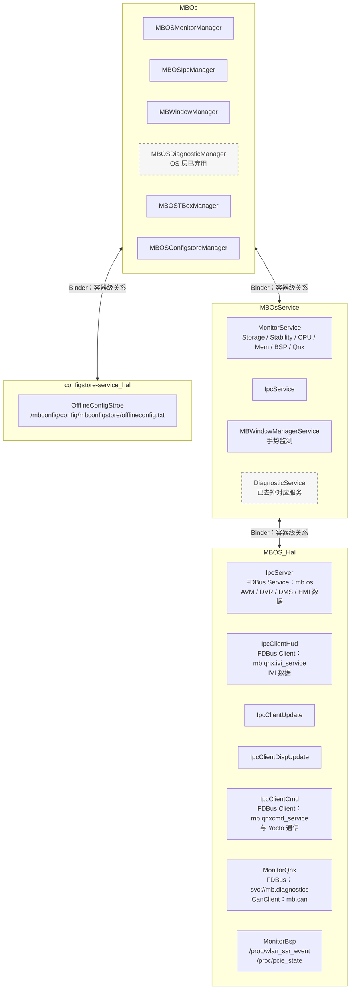
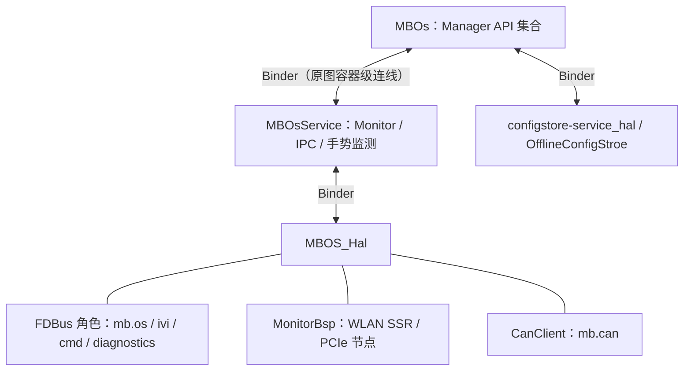
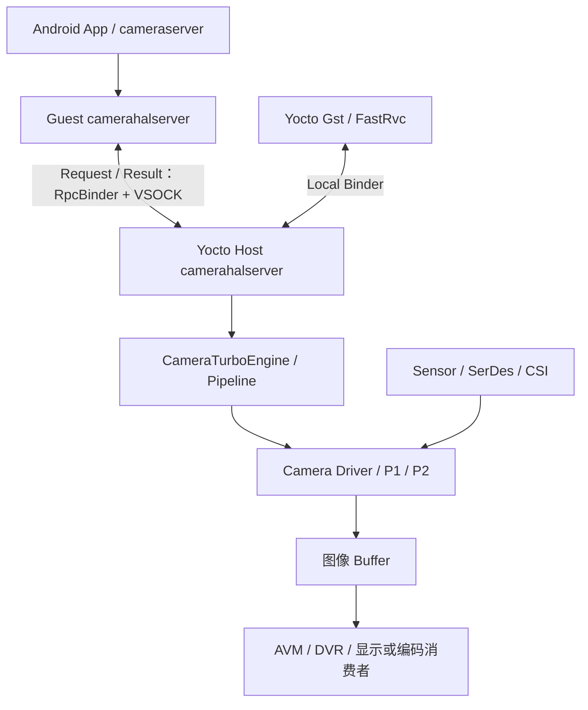
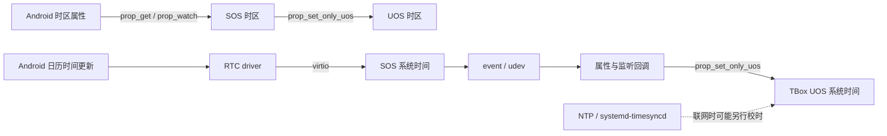

<!-- chapter-id: 16 -->
# 16 全量附录与索引

## 2026-09-20 校订：索引扩展与来源追溯

本章保留 MT8676 原三图模块 ID 和旧证据 ID。新增主题通过 [README](README.md) 进入；新增来源统一见 [22 章](https://qiantao18817568425-art.github.io/Architecture_Learning-/architecture/22.html)，逐条保留路径、哈希、页数、重复关系和实际使用页。

| 新章节 | 内容 |
|---|---|
| [17 平台差异](https://qiantao18817568425-art.github.io/Architecture_Learning-/architecture/17.html) | 8676/8668 比较、版本与冲突 |
| [18 盟博 OS](https://qiantao18817568425-art.github.io/Architecture_Learning-/architecture/18.html) | 新图、模块、端点、退役状态 |
| [19 Camera/DDR](https://qiantao18817568425-art.github.io/Architecture_Learning-/architecture/19.html) | 物理/跨域/资源、计算模型 |
| [20 通信与时间](https://qiantao18817568425-art.github.io/Architecture_Learning-/architecture/20.html) | VSOCK、三 OS 校时、状态恢复 |
| [21 站点分类](https://qiantao18817568425-art.github.io/Architecture_Learning-/architecture/21.html) | 九主题、32 Day 映射、站点调整清单 |
| [22 来源索引](https://qiantao18817568425-art.github.io/Architecture_Learning-/architecture/22.html) | 清单、增量、未读/空文件边界 |
| [23 PVT 实战](https://qiantao18817568425-art.github.io/Architecture_Learning-/architecture/23.html) | Weston/GPU/性能/codec/低功耗/安全 |

旧证据索引在 [evidence/旧版证据索引.json](https://qiantao18817568425-art.github.io/Architecture_Learning-/architecture/source-SRC0001.html)，新索引在 [evidence/来源清单.json](https://qiantao18817568425-art.github.io/Architecture_Learning-/architecture/source-SRC0046.html)。文件曾在其他磁盘或目录存放不改变其平台归属；同一文件的多个副本不重复当成独立论据。

---

本章由规范库存确定性生成，用于从名称、ID、证据或章节反向定位正文。索引记录不增加新的调用关系；模块的上下游、流程阶段和术语分类仍以对应库存及正文为准。

- 模块总数：265
- 流程总数：47
- 术语总数：190
- 证据总数：165

## 16.0 章节快速导航

| 锚点 | 内容 |
|---|---|
| chapter-00 | 第 00 章：前言与证据 |
| chapter-01 | 第 01 章：读图方法 |
| chapter-02 | 第 02 章：整机架构 |
| chapter-03 | 第 03 章：SDK/UMDP |
| chapter-04 | 第 04 章：模块字典 |
| chapter-05 | 第 05 章：通信机制 |
| chapter-06 | 第 06 章：Android 内部 |
| chapter-07 | 第 07 章：Yocto 内部 |
| chapter-08 | 第 08 章：MCU 内部 |
| chapter-09 | 第 09 章：TBox 内部 |
| chapter-10 | 第 10 章：车辆流程 |
| chapter-11 | 第 11 章：显示相机流程 |
| chapter-12 | 第 12 章：音频语音流程 |
| chapter-13 | 第 13 章：通信模组流程 |
| chapter-14 | 第 14 章：生命周期流程 |
| chapter-15 | 第 15 章：统一诊断 |
| chapter-16 | 第 16 章：附录索引 |

## 16.1 模块索引

<!-- explanation-refresh:index-explanation -->
**资料核对后的架构解释（2026-09-20）**

本次解释校订按原章节和模块/流程定位，原module-inventory、flow-inventory、occurrence及图像保持不变。新证据引用使用S/U/E来源ID和PDF物理页；用户MBOS图独立标为项目补图。原图事实、MTK版本实现、PVT参考方案、站点教学方法与待验证工程项分开使用；不能把一种来源的标签批量升级为另一种可信度。
<!-- /explanation-refresh -->

| ID | 模块 | 域 | 层 | 类型 | 作用摘要 | 上游 | 下游 | 协议/机制 | 可信度 | 证据 |
|---|---|---|---|---|---|---|---|---|---|---|
<!-- module-index: mod-application-b291beb -->
| `mod-application-b291beb` | `Application` | UOS/Android、TBox、SOS/Yocto | Application、Guest(UOS Tbox)、Host(SOS YOCTO)/Application、Guest(UOS Android)/Application | container | Application 是架构容器/分组，不是运行时处理节点。 | 父级包含关系见 containment_occurrences | 直接子项见 containment_occurrences | 不适用（架构容器） | diagram-confirmed | original-diagram-01、original-diagram-02 |
<!-- module-index: mod-launcher-2aeb566 -->
| `mod-launcher-2aeb566` | `Launcher` | UOS/Android | Application | runtime | 图中出现的组件；所属域为 UOS/Android，层级为 Application。 | 图中未明确；不得从方框排列顺序推断 upstream | 图中未明确；将在相关业务流程中解析 downstream | 图中未标注；待接口、配置或日志证据确认 | diagram-confirmed | original-diagram-01 |
<!-- module-index: mod-systemui-20ddbc7 -->
| `mod-systemui-20ddbc7` | `SystemUI` | UOS/Android、Cross-domain | Application、Framework/JAVA Services | runtime | Android 系统栏、系统级窗口与状态提示组件；图中同时出现应用和 Framework 位置。 | Notification Manager、Window Manager、Power Manager | Surface Flinger、Input Manager、系统设置/服务 | Binder、Window API、Notification API | diagram-confirmed | original-diagram-01 |
<!-- module-index: mod-notificationcenter-890b965 -->
| `mod-notificationcenter-890b965` | `NotificationCenter` | UOS/Android | Application | runtime | 图中出现的组件；所属域为 UOS/Android，层级为 Application。 | 图中未明确；不得从方框排列顺序推断 upstream | 图中未明确；将在相关业务流程中解析 downstream | 图中未标注；待接口、配置或日志证据确认 | diagram-confirmed | original-diagram-01 |
<!-- module-index: mod-mediacenter-0583aa9 -->
| `mod-mediacenter-0583aa9` | `MediaCenter` | UOS/Android | Application | runtime | 图中出现的组件；所属域为 UOS/Android，层级为 Application。 | 图中未明确；不得从方框排列顺序推断 upstream | 图中未明确；将在相关业务流程中解析 downstream | 图中未标注；待接口、配置或日志证据确认 | diagram-confirmed | original-diagram-01 |
<!-- module-index: mod-filemanager-c48f55f -->
| `mod-filemanager-c48f55f` | `FileManager` | UOS/Android | Application | runtime | 图中出现的组件；所属域为 UOS/Android，层级为 Application。 | 图中未明确；不得从方框排列顺序推断 upstream | 图中未明确；将在相关业务流程中解析 downstream | 图中未标注；待接口、配置或日志证据确认 | diagram-confirmed | original-diagram-01 |
<!-- module-index: mod-taskcube-f54ab9d -->
| `mod-taskcube-f54ab9d` | `TaskCube` | UOS/Android | Application | runtime | 图中出现的组件；所属域为 UOS/Android，层级为 Application。 | 图中未明确；不得从方框排列顺序推断 upstream | 图中未明确；将在相关业务流程中解析 downstream | 图中未标注；待接口、配置或日志证据确认 | diagram-confirmed | original-diagram-01 |
<!-- module-index: mod-e-manual-60269ef -->
| `mod-e-manual-60269ef` | `E-Manual` | UOS/Android | Application | runtime | 图中出现的组件；所属域为 UOS/Android，层级为 Application。 | 图中未明确；不得从方框排列顺序推断 upstream | 图中未明确；将在相关业务流程中解析 downstream | 图中未标注；待接口、配置或日志证据确认 | diagram-confirmed | original-diagram-01 |
<!-- module-index: mod-online-video-5a69a97 -->
| `mod-online-video-5a69a97` | `Online Video` | UOS/Android | Application | runtime | 图中出现的组件；所属域为 UOS/Android，层级为 Application。 | 图中未明确；不得从方框排列顺序推断 upstream | 图中未明确；将在相关业务流程中解析 downstream | 图中未标注；待接口、配置或日志证据确认 | diagram-confirmed | original-diagram-01 |
<!-- module-index: mod-scenemode-cbaa160 -->
| `mod-scenemode-cbaa160` | `SceneMode` | UOS/Android | Application | runtime | 图中出现的组件；所属域为 UOS/Android，层级为 Application。 | 图中未明确；不得从方框排列顺序推断 upstream | 图中未明确；将在相关业务流程中解析 downstream | 图中未标注；待接口、配置或日志证据确认 | diagram-confirmed | original-diagram-01 |
<!-- module-index: mod-carsettings-67e8e47 -->
| `mod-carsettings-67e8e47` | `CarSettings` | UOS/Android | Application | runtime | 图中出现的组件；所属域为 UOS/Android，层级为 Application。 | 图中未明确；不得从方框排列顺序推断 upstream | 图中未明确；将在相关业务流程中解析 downstream | 图中未标注；待接口、配置或日志证据确认 | diagram-confirmed | original-diagram-01 |
<!-- module-index: mod-factorymode-99f0e9b -->
| `mod-factorymode-99f0e9b` | `FactoryMode` | UOS/Android | Application | runtime | 图中出现的组件；所属域为 UOS/Android，层级为 Application。 | 图中未明确；不得从方框排列顺序推断 upstream | 图中未明确；将在相关业务流程中解析 downstream | 图中未标注；待接口、配置或日志证据确认 | diagram-confirmed | original-diagram-01 |
<!-- module-index: mod-hicar-131c64a -->
| `mod-hicar-131c64a` | `Hicar` | UOS/Android | Application | runtime | 图中出现的组件；所属域为 UOS/Android，层级为 Application。 | 图中未明确；不得从方框排列顺序推断 upstream | 图中未明确；将在相关业务流程中解析 downstream | 图中未标注；待接口、配置或日志证据确认 | diagram-confirmed | original-diagram-01 |
<!-- module-index: mod-calendar-adab509 -->
| `mod-calendar-adab509` | `Calendar` | UOS/Android | Application | runtime | 图中出现的组件；所属域为 UOS/Android，层级为 Application。 | 图中未明确；不得从方框排列顺序推断 upstream | 图中未明确；将在相关业务流程中解析 downstream | 图中未标注；待接口、配置或日志证据确认 | diagram-confirmed | original-diagram-01 |
<!-- module-index: mod-acsettings-e27f4bb -->
| `mod-acsettings-e27f4bb` | `AcSettings` | UOS/Android | Application | runtime | 图中出现的组件；所属域为 UOS/Android，层级为 Application。 | 图中未明确；不得从方框排列顺序推断 upstream | 图中未明确；将在相关业务流程中解析 downstream | 图中未标注；待接口、配置或日志证据确认 | diagram-confirmed | original-diagram-01 |
<!-- module-index: mod-speechagent-36a9bb2 -->
| `mod-speechagent-36a9bb2` | `SpeechAgent` | UOS/Android | Application | runtime | 图中出现的组件；所属域为 UOS/Android，层级为 Application。 | 图中未明确；不得从方框排列顺序推断 upstream | 图中未明确；将在相关业务流程中解析 downstream | 图中未标注；待接口、配置或日志证据确认 | diagram-confirmed | original-diagram-01 |
<!-- module-index: mod-usercenter-cc190ee -->
| `mod-usercenter-cc190ee` | `UserCenter` | UOS/Android | Application | runtime | 图中出现的组件；所属域为 UOS/Android，层级为 Application。 | 图中未明确；不得从方框排列顺序推断 upstream | 图中未明确；将在相关业务流程中解析 downstream | 图中未标注；待接口、配置或日志证据确认 | diagram-confirmed | original-diagram-01 |
<!-- module-index: mod-gaodemap-6f5f749 -->
| `mod-gaodemap-6f5f749` | `GaoDeMap` | UOS/Android | Application | runtime | 图中出现的组件；所属域为 UOS/Android，层级为 Application。 | 图中未明确；不得从方框排列顺序推断 upstream | 图中未明确；将在相关业务流程中解析 downstream | 图中未标注；待接口、配置或日志证据确认 | diagram-confirmed | original-diagram-01 |
<!-- module-index: mod-themestore-297d869 -->
| `mod-themestore-297d869` | `ThemeStore` | UOS/Android | Application | runtime | 图中出现的组件；所属域为 UOS/Android，层级为 Application。 | 图中未明确；不得从方框排列顺序推断 upstream | 图中未明确；将在相关业务流程中解析 downstream | 图中未标注；待接口、配置或日志证据确认 | diagram-confirmed | original-diagram-01 |
<!-- module-index: mod-coreservice-c5a1ef9 -->
| `mod-coreservice-c5a1ef9` | `CoreService` | UOS/Android | Application | runtime | 图中出现的组件；所属域为 UOS/Android，层级为 Application。 | 图中未明确；不得从方框排列顺序推断 upstream | 图中未明确；将在相关业务流程中解析 downstream | 图中未标注；待接口、配置或日志证据确认 | diagram-confirmed | original-diagram-01 |
<!-- module-index: mod-ota-825d0cf -->
| `mod-ota-825d0cf` | `OTA` | UOS/Android | Application | runtime | 图中出现的组件；所属域为 UOS/Android，层级为 Application。 | 图中未明确；不得从方框排列顺序推断 upstream | 图中未明确；将在相关业务流程中解析 downstream | 图中未标注；待接口、配置或日志证据确认 | diagram-confirmed | original-diagram-01 |
<!-- module-index: mod-smartscene-107ca1f -->
| `mod-smartscene-107ca1f` | `SmartScene` | UOS/Android | Application | runtime | 图中出现的组件；所属域为 UOS/Android，层级为 Application。 | 图中未明确；不得从方框排列顺序推断 upstream | 图中未明确；将在相关业务流程中解析 downstream | 图中未标注；待接口、配置或日志证据确认 | diagram-confirmed | original-diagram-01 |
<!-- module-index: mod-btphone-ae3380b -->
| `mod-btphone-ae3380b` | `BtPhone` | UOS/Android | Application | runtime | 图中出现的组件；所属域为 UOS/Android，层级为 Application。 | 图中未明确；不得从方框排列顺序推断 upstream | 图中未明确；将在相关业务流程中解析 downstream | 图中未标注；待接口、配置或日志证据确认 | diagram-confirmed | original-diagram-01 |
<!-- module-index: mod-sentrymode-3f154e1 -->
| `mod-sentrymode-3f154e1` | `SentryMode` | UOS/Android | Application | runtime | 图中出现的组件；所属域为 UOS/Android，层级为 Application。 | 图中未明确；不得从方框排列顺序推断 upstream | 图中未明确；将在相关业务流程中解析 downstream | 图中未标注；待接口、配置或日志证据确认 | diagram-confirmed | original-diagram-01 |
<!-- module-index: mod-crosscountry-9b27666 -->
| `mod-crosscountry-9b27666` | `CrossCountry` | UOS/Android | Application | runtime | 图中出现的组件；所属域为 UOS/Android，层级为 Application。 | 图中未明确；不得从方框排列顺序推断 upstream | 图中未明确；将在相关业务流程中解析 downstream | 图中未标注；待接口、配置或日志证据确认 | diagram-confirmed | original-diagram-01 |
<!-- module-index: mod-mojiweather-4481960 -->
| `mod-mojiweather-4481960` | `MojiWeather` | UOS/Android | Application | runtime | 图中出现的组件；所属域为 UOS/Android，层级为 Application。 | 图中未明确；不得从方框排列顺序推断 upstream | 图中未明确；将在相关业务流程中解析 downstream | 图中未标注；待接口、配置或日志证据确认 | diagram-confirmed | original-diagram-01 |
<!-- module-index: mod-changbaktv-4402495 -->
| `mod-changbaktv-4402495` | `ChangBaKTV` | UOS/Android | Application | runtime | 图中出现的组件；所属域为 UOS/Android，层级为 Application。 | 图中未明确；不得从方框排列顺序推断 upstream | 图中未明确；将在相关业务流程中解析 downstream | 图中未标注；待接口、配置或日志证据确认 | diagram-confirmed | original-diagram-01 |
<!-- module-index: mod-voice-recognition-5cdde82 -->
| `mod-voice-recognition-5cdde82` | `Voice Recognition` | UOS/Android | Voice Recognition | container | Voice Recognition 是架构容器/分组，不是运行时处理节点。 | 父级包含关系见 containment_occurrences | 直接子项见 containment_occurrences | 不适用（架构容器） | diagram-confirmed | original-diagram-01 |
<!-- module-index: mod-iflytek-06d4a81 -->
| `mod-iflytek-06d4a81` | `Iflytek` | UOS/Android | Voice Recognition | runtime | 图中出现的组件；所属域为 UOS/Android，层级为 Voice Recognition。 | 图中未明确；不得从方框排列顺序推断 upstream | 图中未明确；将在相关业务流程中解析 downstream | 图中未标注；待接口、配置或日志证据确认 | diagram-confirmed | original-diagram-01 |
<!-- module-index: mod-framework-fb001b2 -->
| `mod-framework-fb001b2` | `Framework` | UOS/Android | Framework | container | Framework 是架构容器/分组，不是运行时处理节点。 | 父级包含关系见 containment_occurrences | 直接子项见 containment_occurrences | 不适用（架构容器） | diagram-confirmed | original-diagram-01 |
<!-- module-index: mod-java-services-5cc44f3 -->
| `mod-java-services-5cc44f3` | `JAVA Services` | Cross-domain | Framework/JAVA Services | container | JAVA Services 是架构容器/分组，不是运行时处理节点。 | 父级包含关系见 containment_occurrences | 直接子项见 containment_occurrences | 不适用（架构容器） | diagram-confirmed | original-diagram-01 |
<!-- module-index: mod-activity-manager-47ba02a -->
| `mod-activity-manager-47ba02a` | `Activity Manager` | Cross-domain | Framework/JAVA Services | runtime | Android Activity/Task 与应用进程生命周期管理服务。 | Launcher/app、Package Manager | 应用进程、Window Manager | Binder、Activity/Task API | diagram-confirmed | original-diagram-01 |
<!-- module-index: mod-notification-manager-d4f5ee0 -->
| `mod-notification-manager-d4f5ee0` | `Notification Manager` | Cross-domain | Framework/JAVA Services | runtime | 图中出现的组件；所属域为 Cross-domain，层级为 Framework/JAVA Services。 | 图中未明确；不得从方框排列顺序推断 upstream | 图中未明确；将在相关业务流程中解析 downstream | 图中未标注；待接口、配置或日志证据确认 | diagram-confirmed | original-diagram-01 |
<!-- module-index: mod-inputmethod-service-9e9806d -->
| `mod-inputmethod-service-9e9806d` | `InputMethod Service` | Cross-domain | Framework/JAVA Services | runtime | 图中出现的组件；所属域为 Cross-domain，层级为 Framework/JAVA Services。 | 图中未明确；不得从方框排列顺序推断 upstream | 图中未明确；将在相关业务流程中解析 downstream | 图中未标注；待接口、配置或日志证据确认 | diagram-confirmed | original-diagram-01 |
<!-- module-index: mod-media-0c77aee -->
| `mod-media-0c77aee` | `Media` | Cross-domain、UOS/Android | Framework/JAVA Services、Framework/Media、HAL | multi-role | 图中出现的组件；所属域为 Cross-domain / UOS/Android，层级为 Framework/JAVA Services / Framework/Media / HAL。 | 图中未明确；不得从方框排列顺序推断 upstream | 图中未明确；将在相关业务流程中解析 downstream | 图中未标注；待接口、配置或日志证据确认 | diagram-confirmed | original-diagram-01 |
<!-- module-index: mod-wifiservice-f80b168 -->
| `mod-wifiservice-f80b168` | `WifiService` | Cross-domain | Framework/JAVA Services | runtime | 图中出现的组件；所属域为 Cross-domain，层级为 Framework/JAVA Services。 | 图中未明确；不得从方框排列顺序推断 upstream | 图中未明确；将在相关业务流程中解析 downstream | 图中未标注；待接口、配置或日志证据确认 | diagram-confirmed | original-diagram-01 |
<!-- module-index: mod-resource-manager-3e669f4 -->
| `mod-resource-manager-3e669f4` | `Resource Manager` | Cross-domain | Framework/JAVA Services | runtime | 图中出现的组件；所属域为 Cross-domain，层级为 Framework/JAVA Services。 | 图中未明确；不得从方框排列顺序推断 upstream | 图中未明确；将在相关业务流程中解析 downstream | 图中未标注；待接口、配置或日志证据确认 | diagram-confirmed | original-diagram-01 |
<!-- module-index: mod-input-manager-da67aeb -->
| `mod-input-manager-da67aeb` | `Input Manager` | Cross-domain | Framework/JAVA Services | runtime | 图中出现的组件；所属域为 Cross-domain，层级为 Framework/JAVA Services。 | 图中未明确；不得从方框排列顺序推断 upstream | 图中未明确；将在相关业务流程中解析 downstream | 图中未标注；待接口、配置或日志证据确认 | diagram-confirmed | original-diagram-01 |
<!-- module-index: mod-window-manager-a35e3f1 -->
| `mod-window-manager-a35e3f1` | `Window Manager` | Cross-domain | Framework/JAVA Services | runtime | Android Window、焦点、层级和 SurfaceControl 事务管理服务。 | Activity Manager、app/SystemUI、Input Manager | Surface Flinger、Input Flinger、Display | Binder、Window API、SurfaceControl | diagram-confirmed | original-diagram-01 |
<!-- module-index: mod-usb-service-c479a2a -->
| `mod-usb-service-c479a2a` | `USB Service` | Cross-domain | Framework/JAVA Services | runtime | 图中出现的组件；所属域为 Cross-domain，层级为 Framework/JAVA Services。 | 图中未明确；不得从方框排列顺序推断 upstream | 图中未明确；将在相关业务流程中解析 downstream | 图中未标注；待接口、配置或日志证据确认 | diagram-confirmed | original-diagram-01 |
<!-- module-index: mod-location-service-be1de74 -->
| `mod-location-service-be1de74` | `Location Service` | Cross-domain | Framework/JAVA Services | runtime | 图中出现的组件；所属域为 Cross-domain，层级为 Framework/JAVA Services。 | 图中未明确；不得从方框排列顺序推断 upstream | 图中未明确；将在相关业务流程中解析 downstream | 图中未标注；待接口、配置或日志证据确认 | diagram-confirmed | original-diagram-01 |
<!-- module-index: mod-broadcastradio-1c44ba3 -->
| `mod-broadcastradio-1c44ba3` | `BroadcastRadio` | Cross-domain、UOS/Android | Framework/JAVA Services、HAL | runtime | 图中出现的组件；所属域为 Cross-domain / UOS/Android，层级为 Framework/JAVA Services / HAL。 | 图中未明确；不得从方框排列顺序推断 upstream | 图中未明确；将在相关业务流程中解析 downstream | 图中未标注；待接口、配置或日志证据确认 | diagram-confirmed | original-diagram-01 |
<!-- module-index: mod-power-manager-dbb635f -->
| `mod-power-manager-dbb635f` | `Power Manager` | Cross-domain | Framework/JAVA Services | runtime | 图中出现的组件；所属域为 Cross-domain，层级为 Framework/JAVA Services。 | 图中未明确；不得从方框排列顺序推断 upstream | 图中未明确；将在相关业务流程中解析 downstream | 图中未标注；待接口、配置或日志证据确认 | diagram-confirmed | original-diagram-01 |
<!-- module-index: mod-network-service-ac6737c -->
| `mod-network-service-ac6737c` | `Network Service` | Cross-domain | Framework/JAVA Services | runtime | 图中出现的组件；所属域为 Cross-domain，层级为 Framework/JAVA Services。 | 图中未明确；不得从方框排列顺序推断 upstream | 图中未明确；将在相关业务流程中解析 downstream | 图中未标注；待接口、配置或日志证据确认 | diagram-confirmed | original-diagram-01 |
<!-- module-index: mod-telephony-491886e -->
| `mod-telephony-491886e` | `Telephony` | Cross-domain | Framework/JAVA Services | runtime | 图中出现的组件；所属域为 Cross-domain，层级为 Framework/JAVA Services。 | 图中未明确；不得从方框排列顺序推断 upstream | 图中未明确；将在相关业务流程中解析 downstream | 图中未标注；待接口、配置或日志证据确认 | diagram-confirmed | original-diagram-01 |
<!-- module-index: mod-audioservice-d3b01ad -->
| `mod-audioservice-d3b01ad` | `AudioService` | Cross-domain | Framework/JAVA Services | runtime | 图中出现的组件；所属域为 Cross-domain，层级为 Framework/JAVA Services。 | 图中未明确；不得从方框排列顺序推断 upstream | 图中未明确；将在相关业务流程中解析 downstream | 图中未标注；待接口、配置或日志证据确认 | diagram-confirmed | original-diagram-01 |
<!-- module-index: mod-bluetooth-c3b4148 -->
| `mod-bluetooth-c3b4148` | `Bluetooth` | Cross-domain、UOS/Android | Framework/JAVA Services、HAL | runtime | 图中出现的组件；所属域为 Cross-domain / UOS/Android，层级为 Framework/JAVA Services / HAL。 | 图中未明确；不得从方框排列顺序推断 upstream | 图中未明确；将在相关业务流程中解析 downstream | 图中未标注；待接口、配置或日志证据确认 | diagram-confirmed | original-diagram-01 |
<!-- module-index: mod-package-manager-d71e541 -->
| `mod-package-manager-d71e541` | `Package Manager` | Cross-domain | Framework/JAVA Services | runtime | 图中出现的组件；所属域为 Cross-domain，层级为 Framework/JAVA Services。 | 图中未明确；不得从方框排列顺序推断 upstream | 图中未明确；将在相关业务流程中解析 downstream | 图中未标注；待接口、配置或日志证据确认 | diagram-confirmed | original-diagram-01 |
<!-- module-index: mod-content-provider-0d39688 -->
| `mod-content-provider-0d39688` | `Content Provider` | Cross-domain | Framework/JAVA Services | runtime | 图中出现的组件；所属域为 Cross-domain，层级为 Framework/JAVA Services。 | 图中未明确；不得从方框排列顺序推断 upstream | 图中未明确；将在相关业务流程中解析 downstream | 图中未标注；待接口、配置或日志证据确认 | diagram-confirmed | original-diagram-01 |
<!-- module-index: mod-connectivity-service-d5090eb -->
| `mod-connectivity-service-d5090eb` | `Connectivity Service` | Cross-domain | Framework/JAVA Services | runtime | 图中出现的组件；所属域为 Cross-domain，层级为 Framework/JAVA Services。 | 图中未明确；不得从方框排列顺序推断 upstream | 图中未明确；将在相关业务流程中解析 downstream | 图中未标注；待接口、配置或日志证据确认 | diagram-confirmed | original-diagram-01 |
<!-- module-index: mod-bluetooth-bt-profiles-3f31043 -->
| `mod-bluetooth-bt-profiles-3f31043` | `Bluetooth &BT Profiles` | Cross-domain | Framework/JAVA Services | runtime | 图中出现的组件；所属域为 Cross-domain，层级为 Framework/JAVA Services。 | 图中未明确；不得从方框排列顺序推断 upstream | 图中未明确；将在相关业务流程中解析 downstream | 图中未标注；待接口、配置或日志证据确认 | diagram-confirmed | original-diagram-01 |
<!-- module-index: mod-storage-manager-5d8d1cf -->
| `mod-storage-manager-5d8d1cf` | `Storage Manager` | Cross-domain | Framework/JAVA Services | runtime | 图中出现的组件；所属域为 Cross-domain，层级为 Framework/JAVA Services。 | 图中未明确；不得从方框排列顺序推断 upstream | 图中未明确；将在相关业务流程中解析 downstream | 图中未标注；待接口、配置或日志证据确认 | diagram-confirmed | original-diagram-01 |
<!-- module-index: mod-mbos-manager-31d43ea -->
| `mod-mbos-manager-31d43ea` | `MBOS Manager` | Cross-domain | Framework/JAVA Services | runtime | 图中出现的组件；所属域为 Cross-domain，层级为 Framework/JAVA Services。 | 图中未明确；不得从方框排列顺序推断 upstream | 图中未明确；将在相关业务流程中解析 downstream | 图中未标注；待接口、配置或日志证据确认 | diagram-confirmed | original-diagram-01 |
<!-- module-index: mod-media-scanner-a3ed010 -->
| `mod-media-scanner-a3ed010` | `Media Scanner` | Cross-domain | Framework/Media | runtime | 图中出现的组件；所属域为 Cross-domain，层级为 Framework/Media。 | 图中未明确；不得从方框排列顺序推断 upstream | 图中未明确；将在相关业务流程中解析 downstream | 图中未标注；待接口、配置或日志证据确认 | diagram-confirmed | original-diagram-01 |
<!-- module-index: mod-media-provider-3e0a9e8 -->
| `mod-media-provider-3e0a9e8` | `Media Provider` | Cross-domain | Framework/Media | runtime | 图中出现的组件；所属域为 Cross-domain，层级为 Framework/Media。 | 图中未明确；不得从方框排列顺序推断 upstream | 图中未明确；将在相关业务流程中解析 downstream | 图中未标注；待接口、配置或日志证据确认 | diagram-confirmed | original-diagram-01 |
<!-- module-index: mod-media-player-2acd9f3 -->
| `mod-media-player-2acd9f3` | `Media Player` | Cross-domain | Framework/Media | runtime | 图中出现的组件；所属域为 Cross-domain，层级为 Framework/Media。 | 图中未明确；不得从方框排列顺序推断 upstream | 图中未明确；将在相关业务流程中解析 downstream | 图中未标注；待接口、配置或日志证据确认 | diagram-confirmed | original-diagram-01 |
<!-- module-index: mod-car-services-3ac07fc -->
| `mod-car-services-3ac07fc` | `Car Services` | Cross-domain | Framework/Car Services | container | Car Services 是架构容器/分组，不是运行时处理节点。 | 父级包含关系见 containment_occurrences | 直接子项见 containment_occurrences | 不适用（架构容器） | diagram-confirmed | original-diagram-01 |
<!-- module-index: mod-car-lib-85f228e -->
| `mod-car-lib-85f228e` | `Car Lib` | Cross-domain | Framework/Car Services | runtime | 图中出现的组件；所属域为 Cross-domain，层级为 Framework/Car Services。 | 图中未明确；不得从方框排列顺序推断 upstream | 图中未明确；将在相关业务流程中解析 downstream | 图中未标注；待接口、配置或日志证据确认 | diagram-confirmed | original-diagram-01 |
<!-- module-index: mod-carservice-dcf52ad -->
| `mod-carservice-dcf52ad` | `CarService` | Cross-domain、UOS/Android | Framework/Car Services、Guest(UOS Android)/Platform、UOS(Android)/Vehicle | runtime | 图中出现的组件；所属域为 Cross-domain / UOS/Android，层级为 Framework/Car Services / Guest(UOS Android)/Platform / UOS(Android)/Vehicle。 | 图中未明确；不得从方框排列顺序推断 upstream | 图中未明确；将在相关业务流程中解析 downstream | 图中未标注；待接口、配置或日志证据确认 | diagram-confirmed | original-diagram-01、original-diagram-02、original-diagram-03 |
<!-- module-index: mod-carbluetooth-service-9fc3943 -->
| `mod-carbluetooth-service-9fc3943` | `CarBluetooth Service` | Cross-domain | Framework/Car Services | runtime | 图中出现的组件；所属域为 Cross-domain，层级为 Framework/Car Services。 | 图中未明确；不得从方框排列顺序推断 upstream | 图中未明确；将在相关业务流程中解析 downstream | 图中未标注；待接口、配置或日志证据确认 | diagram-confirmed | original-diagram-01 |
<!-- module-index: mod-carbluetooth-userservice-20b1c98 -->
| `mod-carbluetooth-userservice-20b1c98` | `CarBluetooth UserService` | Cross-domain | Framework/Car Services | runtime | 图中出现的组件；所属域为 Cross-domain，层级为 Framework/Car Services。 | 图中未明确；不得从方框排列顺序推断 upstream | 图中未明确；将在相关业务流程中解析 downstream | 图中未标注；待接口、配置或日志证据确认 | diagram-confirmed | original-diagram-01 |
<!-- module-index: mod-carconfigurationservice-1b8e22e -->
| `mod-carconfigurationservice-1b8e22e` | `CarConfigurationService` | Cross-domain | Framework/Car Services | runtime | 图中出现的组件；所属域为 Cross-domain，层级为 Framework/Car Services。 | 图中未明确；不得从方框排列顺序推断 upstream | 图中未明确；将在相关业务流程中解析 downstream | 图中未标注；待接口、配置或日志证据确认 | diagram-confirmed | original-diagram-01 |
<!-- module-index: mod-carinput-service-df5ca9b -->
| `mod-carinput-service-df5ca9b` | `CarInput Service` | Cross-domain | Framework/Car Services | runtime | 图中出现的组件；所属域为 Cross-domain，层级为 Framework/Car Services。 | 图中未明确；不得从方框排列顺序推断 upstream | 图中未明确；将在相关业务流程中解析 downstream | 图中未标注；待接口、配置或日志证据确认 | diagram-confirmed | original-diagram-01 |
<!-- module-index: mod-radioservice-14d42f6 -->
| `mod-radioservice-14d42f6` | `RadioService` | Cross-domain | Framework/Car Services | runtime | 图中出现的组件；所属域为 Cross-domain，层级为 Framework/Car Services。 | 图中未明确；不得从方框排列顺序推断 upstream | 图中未明确；将在相关业务流程中解析 downstream | 图中未标注；待接口、配置或日志证据确认 | diagram-confirmed | original-diagram-01 |
<!-- module-index: mod-carlocation-service-903e699 -->
| `mod-carlocation-service-903e699` | `CarLocation Service` | Cross-domain | Framework/Car Services | runtime | 图中出现的组件；所属域为 Cross-domain，层级为 Framework/Car Services。 | 图中未明确；不得从方框排列顺序推断 upstream | 图中未明确；将在相关业务流程中解析 downstream | 图中未标注；待接口、配置或日志证据确认 | diagram-confirmed | original-diagram-01 |
<!-- module-index: mod-carpower-service-5720a7a -->
| `mod-carpower-service-5720a7a` | `CarPower Service` | Cross-domain | Framework/Car Services | runtime | 图中出现的组件；所属域为 Cross-domain，层级为 Framework/Car Services。 | 图中未明确；不得从方框排列顺序推断 upstream | 图中未明确；将在相关业务流程中解析 downstream | 图中未标注；待接口、配置或日志证据确认 | diagram-confirmed | original-diagram-01 |
<!-- module-index: mod-carmedia-service-57875a1 -->
| `mod-carmedia-service-57875a1` | `CarMedia Service` | Cross-domain | Framework/Car Services | runtime | 图中出现的组件；所属域为 Cross-domain，层级为 Framework/Car Services。 | 图中未明确；不得从方框排列顺序推断 upstream | 图中未明确；将在相关业务流程中解析 downstream | 图中未标注；待接口、配置或日志证据确认 | diagram-confirmed | original-diagram-01 |
<!-- module-index: mod-carproperty-service-67a55bf -->
| `mod-carproperty-service-67a55bf` | `CarProperty Service` | Cross-domain | Framework/Car Services | runtime | 图中出现的组件；所属域为 Cross-domain，层级为 Framework/Car Services。 | 图中未明确；不得从方框排列顺序推断 upstream | 图中未明确；将在相关业务流程中解析 downstream | 图中未标注；待接口、配置或日志证据确认 | diagram-confirmed | original-diagram-01 |
<!-- module-index: mod-tboxservice-7fb1cc0 -->
| `mod-tboxservice-7fb1cc0` | `TboxService` | Cross-domain | Framework/Car Services、Framework/System | runtime | 图中出现的组件；所属域为 Cross-domain，层级为 Framework/Car Services / Framework/System。 | 图中未明确；不得从方框排列顺序推断 upstream | 图中未明确；将在相关业务流程中解析 downstream | 图中未标注；待接口、配置或日志证据确认 | diagram-confirmed | original-diagram-01 |
<!-- module-index: mod-cardiagnosticservice-c179a14 -->
| `mod-cardiagnosticservice-c179a14` | `CarDiagnosticService` | Cross-domain | Framework/Car Services | runtime | 图中出现的组件；所属域为 Cross-domain，层级为 Framework/Car Services。 | 图中未明确；不得从方框排列顺序推断 upstream | 图中未明确；将在相关业务流程中解析 downstream | 图中未标注；待接口、配置或日志证据确认 | diagram-confirmed | original-diagram-01 |
<!-- module-index: mod-carinfo-service-d3457fd -->
| `mod-carinfo-service-d3457fd` | `CarInfo Service` | Cross-domain | Framework/Car Services | runtime | 图中出现的组件；所属域为 Cross-domain，层级为 Framework/Car Services。 | 图中未明确；不得从方框排列顺序推断 upstream | 图中未明确；将在相关业务流程中解析 downstream | 图中未标注；待接口、配置或日志证据确认 | diagram-confirmed | original-diagram-01 |
<!-- module-index: mod-cardrivingstateservice-fd8e8b7 -->
| `mod-cardrivingstateservice-fd8e8b7` | `CarDrivingStateService` | Cross-domain | Framework/Car Services | runtime | 图中出现的组件；所属域为 Cross-domain，层级为 Framework/Car Services。 | 图中未明确；不得从方框排列顺序推断 upstream | 图中未明确；将在相关业务流程中解析 downstream | 图中未标注；待接口、配置或日志证据确认 | diagram-confirmed | original-diagram-01 |
<!-- module-index: mod-carnight-service-c3f3441 -->
| `mod-carnight-service-c3f3441` | `CarNight Service` | Cross-domain | Framework/Car Services | runtime | 图中出现的组件；所属域为 Cross-domain，层级为 Framework/Car Services。 | 图中未明确；不得从方框排列顺序推断 upstream | 图中未明确；将在相关业务流程中解析 downstream | 图中未标注；待接口、配置或日志证据确认 | diagram-confirmed | original-diagram-01 |
<!-- module-index: mod-carprojection-service-b031954 -->
| `mod-carprojection-service-b031954` | `CarProjection Service` | Cross-domain | Framework/Car Services | runtime | 图中出现的组件；所属域为 Cross-domain，层级为 Framework/Car Services。 | 图中未明确；不得从方框排列顺序推断 upstream | 图中未明确；将在相关业务流程中解析 downstream | 图中未标注；待接口、配置或日志证据确认 | diagram-confirmed | original-diagram-01 |
<!-- module-index: mod-carpowermanagementservice-6684dc9 -->
| `mod-carpowermanagementservice-6684dc9` | `CarPowermanagementService` | Cross-domain | Framework/Car Services | runtime | 图中出现的组件；所属域为 Cross-domain，层级为 Framework/Car Services。 | 图中未明确；不得从方框排列顺序推断 upstream | 图中未明确；将在相关业务流程中解析 downstream | 图中未标注；待接口、配置或日志证据确认 | diagram-confirmed | original-diagram-01 |
<!-- module-index: mod-native-services-382b5e8 -->
| `mod-native-services-382b5e8` | `Native Services` | Cross-domain | Framework/Native Services | container | Native Services 是架构容器/分组，不是运行时处理节点。 | 父级包含关系见 containment_occurrences | 直接子项见 containment_occurrences | 不适用（架构容器） | diagram-confirmed | original-diagram-01 |
<!-- module-index: mod-surface-flinger-04f3047 -->
| `mod-surface-flinger-04f3047` | `Surface Flinger` | Cross-domain | Framework/Native Services | runtime | 图中出现的组件；所属域为 Cross-domain，层级为 Framework/Native Services。 | 图中未明确；不得从方框排列顺序推断 upstream | 图中未明确；将在相关业务流程中解析 downstream | 图中未标注；待接口、配置或日志证据确认 | diagram-confirmed | original-diagram-01 |
<!-- module-index: mod-input-flinger-b2ee0a7 -->
| `mod-input-flinger-b2ee0a7` | `Input Flinger` | Cross-domain | Framework/Native Services | runtime | 图中出现的组件；所属域为 Cross-domain，层级为 Framework/Native Services。 | 图中未明确；不得从方框排列顺序推断 upstream | 图中未明确；将在相关业务流程中解析 downstream | 图中未标注；待接口、配置或日志证据确认 | diagram-confirmed | original-diagram-01 |
<!-- module-index: mod-mediaserver-cc66649 -->
| `mod-mediaserver-cc66649` | `MediaServer` | Cross-domain | Framework/Native Services | runtime | 图中出现的组件；所属域为 Cross-domain，层级为 Framework/Native Services。 | 图中未明确；不得从方框排列顺序推断 upstream | 图中未明确；将在相关业务流程中解析 downstream | 图中未标注；待接口、配置或日志证据确认 | diagram-confirmed | original-diagram-01 |
<!-- module-index: mod-camera-service-a5f4b30 -->
| `mod-camera-service-a5f4b30` | `Camera Service` | Cross-domain | Framework/Native Services | runtime | 图中出现的组件；所属域为 Cross-domain，层级为 Framework/Native Services。 | 图中未明确；不得从方框排列顺序推断 upstream | 图中未明确；将在相关业务流程中解析 downstream | 图中未标注；待接口、配置或日志证据确认 | diagram-confirmed | original-diagram-01 |
<!-- module-index: mod-boot-animation-b98643d -->
| `mod-boot-animation-b98643d` | `Boot Animation` | Cross-domain | Framework/Native Services | runtime | 图中出现的组件；所属域为 Cross-domain，层级为 Framework/Native Services。 | 图中未明确；不得从方框排列顺序推断 upstream | 图中未明确；将在相关业务流程中解析 downstream | 图中未标注；待接口、配置或日志证据确认 | diagram-confirmed | original-diagram-01 |
<!-- module-index: mod-audio-flinger-96df5c1 -->
| `mod-audio-flinger-96df5c1` | `Audio Flinger` | Cross-domain | Framework/Native Services | runtime | 图中出现的组件；所属域为 Cross-domain，层级为 Framework/Native Services。 | 图中未明确；不得从方框排列顺序推断 upstream | 图中未明确；将在相关业务流程中解析 downstream | 图中未标注；待接口、配置或日志证据确认 | diagram-confirmed | original-diagram-01 |
<!-- module-index: mod-audio-policy-2d90656 -->
| `mod-audio-policy-2d90656` | `Audio Policy` | Cross-domain | Framework/Native Services | runtime | 图中出现的组件；所属域为 Cross-domain，层级为 Framework/Native Services。 | 图中未明确；不得从方框排列顺序推断 upstream | 图中未明确；将在相关业务流程中解析 downstream | 图中未标注；待接口、配置或日志证据确认 | diagram-confirmed | original-diagram-01 |
<!-- module-index: mod-androidauto-service-09eba60 -->
| `mod-androidauto-service-09eba60` | `AndroidAuto Service` | Cross-domain | Framework/Native Services | runtime | 图中出现的组件；所属域为 Cross-domain，层级为 Framework/Native Services。 | 图中未明确；不得从方框排列顺序推断 upstream | 图中未明确；将在相关业务流程中解析 downstream | 图中未标注；待接口、配置或日志证据确认 | diagram-confirmed | original-diagram-01 |
<!-- module-index: mod-carplay-service-844da6e -->
| `mod-carplay-service-844da6e` | `CarPlay Service` | Cross-domain | Framework/Native Services | runtime | 图中出现的组件；所属域为 Cross-domain，层级为 Framework/Native Services。 | 图中未明确；不得从方框排列顺序推断 upstream | 图中未明确；将在相关业务流程中解析 downstream | 图中未标注；待接口、配置或日志证据确认 | diagram-confirmed | original-diagram-01 |
<!-- module-index: mod-bt-service-9febf5a -->
| `mod-bt-service-9febf5a` | `BT Service` | Cross-domain | Framework/Native Services | runtime | 图中出现的组件；所属域为 Cross-domain，层级为 Framework/Native Services。 | 图中未明确；不得从方框排列顺序推断 upstream | 图中未明确；将在相关业务流程中解析 downstream | 图中未标注；待接口、配置或日志证据确认 | diagram-confirmed | original-diagram-01 |
<!-- module-index: mod-broadcastradio-service-97be8b7 -->
| `mod-broadcastradio-service-97be8b7` | `BroadcastRadio Service` | Cross-domain | Framework/Native Services | runtime | 图中出现的组件；所属域为 Cross-domain，层级为 Framework/Native Services。 | 图中未明确；不得从方框排列顺序推断 upstream | 图中未明确；将在相关业务流程中解析 downstream | 图中未标注；待接口、配置或日志证据确认 | diagram-confirmed | original-diagram-01 |
<!-- module-index: mod-mbos-service-5a35713 -->
| `mod-mbos-service-5a35713` | `MBOS Service` | Cross-domain | Framework/Native Services | runtime | 图中出现的组件；所属域为 Cross-domain，层级为 Framework/Native Services。 | 图中未明确；不得从方框排列顺序推断 upstream | 图中未明确；将在相关业务流程中解析 downstream | 图中未标注；待接口、配置或日志证据确认 | diagram-confirmed | original-diagram-01 |
<!-- module-index: mod-system-bc0792d -->
| `mod-system-bc0792d` | `System` | Cross-domain | Framework/System | container | System 是架构容器/分组，不是运行时处理节点。 | 父级包含关系见 containment_occurrences | 直接子项见 containment_occurrences | 不适用（架构容器） | diagram-confirmed | original-diagram-01 |
<!-- module-index: mod-update-engine-9c3a1ab -->
| `mod-update-engine-9c3a1ab` | `Update Engine` | Cross-domain | Framework/System | runtime | 图中出现的组件；所属域为 Cross-domain，层级为 Framework/System。 | 图中未明确；不得从方框排列顺序推断 upstream | 图中未明确；将在相关业务流程中解析 downstream | 图中未标注；待接口、配置或日志证据确认 | diagram-confirmed | original-diagram-01 |
<!-- module-index: mod-avm-75bc0b9 -->
| `mod-avm-75bc0b9` | `AVM` | Cross-domain、SOS/Yocto | Framework/System、Host(SOS YOCTO)/Application | runtime | 图中出现的组件；所属域为 Cross-domain / SOS/Yocto，层级为 Framework/System / Host(SOS YOCTO)/Application。 | 图中未明确；不得从方框排列顺序推断 upstream | 图中未明确；将在相关业务流程中解析 downstream | 图中未标注；待接口、配置或日志证据确认 | diagram-confirmed | original-diagram-01、original-diagram-02 |
<!-- module-index: mod-rvc-199fba4 -->
| `mod-rvc-199fba4` | `RVC` | Cross-domain、SOS/Yocto | Framework/System、Host(SOS YOCTO)/Application | runtime | 图中出现的组件；所属域为 Cross-domain / SOS/Yocto，层级为 Framework/System / Host(SOS YOCTO)/Application。 | 图中未明确；不得从方框排列顺序推断 upstream | 图中未明确；将在相关业务流程中解析 downstream | 图中未标注；待接口、配置或日志证据确认 | diagram-confirmed | original-diagram-01、original-diagram-02 |
<!-- module-index: mod-vold-00d021f -->
| `mod-vold-00d021f` | `vold` | Cross-domain | Framework/System | runtime | 图中出现的组件；所属域为 Cross-domain，层级为 Framework/System。 | 图中未明确；不得从方框排列顺序推断 upstream | 图中未明确；将在相关业务流程中解析 downstream | 图中未标注；待接口、配置或日志证据确认 | diagram-confirmed | original-diagram-01 |
<!-- module-index: mod-netd-c31208c -->
| `mod-netd-c31208c` | `netd` | Cross-domain | Framework/System | runtime | 图中出现的组件；所属域为 Cross-domain，层级为 Framework/System。 | 图中未明确；不得从方框排列顺序推断 upstream | 图中未明确；将在相关业务流程中解析 downstream | 图中未标注；待接口、配置或日志证据确认 | diagram-confirmed | original-diagram-01 |
<!-- module-index: mod-lmkd-b87d14a -->
| `mod-lmkd-b87d14a` | `lmkd` | Cross-domain | Framework/System | runtime | 图中出现的组件；所属域为 Cross-domain，层级为 Framework/System。 | 图中未明确；不得从方框排列顺序推断 upstream | 图中未明确；将在相关业务流程中解析 downstream | 图中未标注；待接口、配置或日志证据确认 | diagram-confirmed | original-diagram-01 |
<!-- module-index: mod-adas-service-b7d4bef -->
| `mod-adas-service-b7d4bef` | `ADAS Service` | Cross-domain | Framework/System | runtime | 图中出现的组件；所属域为 Cross-domain，层级为 Framework/System。 | 图中未明确；不得从方框排列顺序推断 upstream | 图中未明确；将在相关业务流程中解析 downstream | 图中未标注；待接口、配置或日志证据确认 | diagram-confirmed | original-diagram-01 |
<!-- module-index: mod-mblog-95eca7d -->
| `mod-mblog-95eca7d` | `MBLog` | Cross-domain | Framework/System | runtime | 图中出现的组件；所属域为 Cross-domain，层级为 Framework/System。 | 图中未明确；不得从方框排列顺序推断 upstream | 图中未明确；将在相关业务流程中解析 downstream | 图中未标注；待接口、配置或日志证据确认 | diagram-confirmed | original-diagram-01 |
<!-- module-index: mod-fcm-service-e761bea -->
| `mod-fcm-service-e761bea` | `FCM Service` | Cross-domain | Framework/System | runtime | 图中出现的组件；所属域为 Cross-domain，层级为 Framework/System。 | 图中未明确；不得从方框排列顺序推断 upstream | 图中未明确；将在相关业务流程中解析 downstream | 图中未标注；待接口、配置或日志证据确认 | pending | original-diagram-01 |
<!-- module-index: mod-android-runtime-07eedda -->
| `mod-android-runtime-07eedda` | `Android Runtime` | UOS/Android | Android Runtime | container | Android Runtime 是架构容器/分组，不是运行时处理节点。 | 父级包含关系见 containment_occurrences | 直接子项见 containment_occurrences | 不适用（架构容器） | diagram-confirmed | original-diagram-01 |
<!-- module-index: mod-art-abfe09c -->
| `mod-art-abfe09c` | `ART` | UOS/Android | Android Runtime | runtime | 图中出现的组件；所属域为 UOS/Android，层级为 Android Runtime。 | 图中未明确；不得从方框排列顺序推断 upstream | 图中未明确；将在相关业务流程中解析 downstream | 图中未标注；待接口、配置或日志证据确认 | diagram-confirmed | original-diagram-01 |
<!-- module-index: mod-core-libraries-28c6bdf -->
| `mod-core-libraries-28c6bdf` | `Core Libraries` | UOS/Android | Android Runtime | runtime | 图中出现的组件；所属域为 UOS/Android，层级为 Android Runtime。 | 图中未明确；不得从方框排列顺序推断 upstream | 图中未明确；将在相关业务流程中解析 downstream | 图中未标注；待接口、配置或日志证据确认 | diagram-confirmed | original-diagram-01 |
<!-- module-index: mod-infra-541cc9b -->
| `mod-infra-541cc9b` | `Infra` | UOS/Android | Infra | container | Infra 是架构容器/分组，不是运行时处理节点。 | 父级包含关系见 containment_occurrences | 直接子项见 containment_occurrences | 不适用（架构容器） | diagram-confirmed | original-diagram-01 |
<!-- module-index: mod-fdbus-f41d7c4 -->
| `mod-fdbus-f41d7c4` | `FDBus` | UOS/Android、Cross-domain、SOS/Yocto、TBox | Infra、Legend、SOS(Yocto)/Communication、UOS(Android)/Communication、UOS(TBox)/Communication | multi-role | 跨进程/跨域服务与主题消息总线；多个 occurrence 内含命名服务。 | FDBus Client/Producer、FDBus Service/Provider | FDBus name_server、FDBus host_server、订阅者/服务消费者 | FDBus、Socket/IPC（具体传输待配置确认） | diagram-confirmed | original-diagram-01、original-diagram-03 |
<!-- module-index: mod-canservice-24db020 -->
| `mod-canservice-24db020` | `CanService` | UOS/Android、SOS/Yocto | Infra、Host(SOS YOCTO)/Infrastructure、SOS(Yocto)/Communication | runtime | SOS 车辆数据服务，连接 MCU/IPCL 数据与 FDBus/SOME-IP/客户端。 | MCU Vehicle Interface、IPCL、VehicleIF | CanClient、Clients(SOME/IP)、Cluster、VehicleHAL（关系待项目确认） | CAN、IPCL、FDBus、SOME/IP | diagram-confirmed | original-diagram-01、original-diagram-02、original-diagram-03 |
<!-- module-index: mod-boost-f7d80df -->
| `mod-boost-f7d80df` | `boost` | UOS/Android | Infra | runtime | 图中出现的组件；所属域为 UOS/Android，层级为 Infra。 | 图中未明确；不得从方框排列顺序推断 upstream | 图中未明确；将在相关业务流程中解析 downstream | 图中未标注；待接口、配置或日志证据确认 | diagram-confirmed | original-diagram-01 |
<!-- module-index: mod-mb-ipc-86598dd -->
| `mod-mb-ipc-86598dd` | `MB_ipc` | UOS/Android | Infra | runtime | 图中出现的组件；所属域为 UOS/Android，层级为 Infra。 | 图中未明确；不得从方框排列顺序推断 upstream | 图中未明确；将在相关业务流程中解析 downstream | 图中未标注；待接口、配置或日志证据确认 | diagram-confirmed | original-diagram-01 |
<!-- module-index: mod-protobuf-9d3fdc4 -->
| `mod-protobuf-9d3fdc4` | `protobuf` | UOS/Android | Infra | runtime | 图中出现的组件；所属域为 UOS/Android，层级为 Infra。 | 图中未明确；不得从方框排列顺序推断 upstream | 图中未明确；将在相关业务流程中解析 downstream | 图中未标注；待接口、配置或日志证据确认 | diagram-confirmed | original-diagram-01 |
<!-- module-index: mod-update-server-60b9399 -->
| `mod-update-server-60b9399` | `Update_server` | UOS/Android | Infra | runtime | 图中出现的组件；所属域为 UOS/Android，层级为 Infra。 | 图中未明确；不得从方框排列顺序推断 upstream | 图中未明确；将在相关业务流程中解析 downstream | 图中未标注；待接口、配置或日志证据确认 | diagram-confirmed | original-diagram-01 |
<!-- module-index: mod-vsomeip-176195d -->
| `mod-vsomeip-176195d` | `vsomeip` | UOS/Android | Infra | runtime | 图中出现的组件；所属域为 UOS/Android，层级为 Infra。 | 图中未明确；不得从方框排列顺序推断 upstream | 图中未明确；将在相关业务流程中解析 downstream | 图中未标注；待接口、配置或日志证据确认 | diagram-confirmed | original-diagram-01 |
<!-- module-index: mod-libraries-27c968e -->
| `mod-libraries-27c968e` | `Libraries` | UOS/Android | Libraries | container | Libraries 是架构容器/分组，不是运行时处理节点。 | 父级包含关系见 containment_occurrences | 直接子项见 containment_occurrences | 不适用（架构容器） | diagram-confirmed | original-diagram-01 |
<!-- module-index: mod-webkit-d4dc348 -->
| `mod-webkit-d4dc348` | `Webkit` | UOS/Android | Libraries | runtime | 图中出现的组件；所属域为 UOS/Android，层级为 Libraries。 | 图中未明确；不得从方框排列顺序推断 upstream | 图中未明确；将在相关业务流程中解析 downstream | 图中未标注；待接口、配置或日志证据确认 | diagram-confirmed | original-diagram-01 |
<!-- module-index: mod-openmax-04da84a -->
| `mod-openmax-04da84a` | `OpenMax` | UOS/Android | Libraries | runtime | 图中出现的组件；所属域为 UOS/Android，层级为 Libraries。 | 图中未明确；不得从方框排列顺序推断 upstream | 图中未明确；将在相关业务流程中解析 downstream | 图中未标注；待接口、配置或日志证据确认 | diagram-confirmed | original-diagram-01 |
<!-- module-index: mod-bionic-e134f0b -->
| `mod-bionic-e134f0b` | `Bionic` | UOS/Android | Libraries | runtime | 图中出现的组件；所属域为 UOS/Android，层级为 Libraries。 | 图中未明确；不得从方框排列顺序推断 upstream | 图中未明确；将在相关业务流程中解析 downstream | 图中未标注；待接口、配置或日志证据确认 | diagram-confirmed | original-diagram-01 |
<!-- module-index: mod-carplay-plug-in-acd0a4f -->
| `mod-carplay-plug-in-acd0a4f` | `CarPlay plug-in` | UOS/Android | Libraries | runtime | 图中出现的组件；所属域为 UOS/Android，层级为 Libraries。 | 图中未明确；不得从方框排列顺序推断 upstream | 图中未明确；将在相关业务流程中解析 downstream | 图中未标注；待接口、配置或日志证据确认 | diagram-confirmed | original-diagram-01 |
<!-- module-index: mod-opengles-889a244 -->
| `mod-opengles-889a244` | `OpenGLES` | UOS/Android | Libraries | runtime | 图中出现的组件；所属域为 UOS/Android，层级为 Libraries。 | 图中未明确；不得从方框排列顺序推断 upstream | 图中未明确；将在相关业务流程中解析 downstream | 图中未标注；待接口、配置或日志证据确认 | diagram-confirmed | original-diagram-01 |
<!-- module-index: mod-sqlite-9f09ccb -->
| `mod-sqlite-9f09ccb` | `SQLite` | UOS/Android | Libraries | runtime | 图中出现的组件；所属域为 UOS/Android，层级为 Libraries。 | 图中未明确；不得从方框排列顺序推断 upstream | 图中未明确；将在相关业务流程中解析 downstream | 图中未标注；待接口、配置或日志证据确认 | diagram-confirmed | original-diagram-01 |
<!-- module-index: mod-chromium-32166e8 -->
| `mod-chromium-32166e8` | `Chromium` | UOS/Android | Libraries | runtime | 图中出现的组件；所属域为 UOS/Android，层级为 Libraries。 | 图中未明确；不得从方框排列顺序推断 upstream | 图中未明确；将在相关业务流程中解析 downstream | 图中未标注；待接口、配置或日志证据确认 | diagram-confirmed | original-diagram-01 |
<!-- module-index: mod-iap2-cb26e3d -->
| `mod-iap2-cb26e3d` | `iAP2` | UOS/Android | Libraries | runtime | 图中出现的组件；所属域为 UOS/Android，层级为 Libraries。 | 图中未明确；不得从方框排列顺序推断 upstream | 图中未明确；将在相关业务流程中解析 downstream | 图中未标注；待接口、配置或日志证据确认 | diagram-confirmed | original-diagram-01 |
<!-- module-index: mod-stagefright-plug-3594245 -->
| `mod-stagefright-plug-3594245` | `StageFright plug` | UOS/Android | Libraries | runtime | 图中出现的组件；所属域为 UOS/Android，层级为 Libraries。 | 图中未明确；不得从方框排列顺序推断 upstream | 图中未明确；将在相关业务流程中解析 downstream | 图中未标注；待接口、配置或日志证据确认 | diagram-confirmed | original-diagram-01 |
<!-- module-index: mod-bluetooth-stack-1573223 -->
| `mod-bluetooth-stack-1573223` | `Bluetooth Stack` | UOS/Android | Libraries | runtime | 图中出现的组件；所属域为 UOS/Android，层级为 Libraries。 | 图中未明确；不得从方框排列顺序推断 upstream | 图中未明确；将在相关业务流程中解析 downstream | 图中未标注；待接口、配置或日志证据确认 | diagram-confirmed | original-diagram-01 |
<!-- module-index: mod-external-8d10c69 -->
| `mod-external-8d10c69` | `External` | UOS/Android | External | container | External 是架构容器/分组，不是运行时处理节点。 | 父级包含关系见 containment_occurrences | 直接子项见 containment_occurrences | 不适用（架构容器） | diagram-confirmed | original-diagram-01 |
<!-- module-index: mod-exfat-tool-e5e2d51 -->
| `mod-exfat-tool-e5e2d51` | `exfat tool` | UOS/Android | External | runtime | 图中出现的组件；所属域为 UOS/Android，层级为 External。 | 图中未明确；不得从方框排列顺序推断 upstream | 图中未明确；将在相关业务流程中解析 downstream | 图中未标注；待接口、配置或日志证据确认 | diagram-confirmed | original-diagram-01 |
<!-- module-index: mod-wpa-supplicant-8-24dce0f -->
| `mod-wpa-supplicant-8-24dce0f` | `wpa_supplicant_8` | UOS/Android | External | runtime | 图中出现的组件；所属域为 UOS/Android，层级为 External。 | 图中未明确；不得从方框排列顺序推断 upstream | 图中未明确；将在相关业务流程中解析 downstream | 图中未标注；待接口、配置或日志证据确认 | diagram-confirmed | original-diagram-01 |
<!-- module-index: mod-ntfs-tool-2042e3c -->
| `mod-ntfs-tool-2042e3c` | `ntfs_tool` | UOS/Android | External | runtime | 图中出现的组件；所属域为 UOS/Android，层级为 External。 | 图中未明确；不得从方框排列顺序推断 upstream | 图中未明确；将在相关业务流程中解析 downstream | 图中未标注；待接口、配置或日志证据确认 | diagram-confirmed | original-diagram-01 |
<!-- module-index: mod-tf-hot-plug-0c48548 -->
| `mod-tf-hot-plug-0c48548` | `tf_hot_plug` | UOS/Android | External | runtime | 图中出现的组件；所属域为 UOS/Android，层级为 External。 | 图中未明确；不得从方框排列顺序推断 upstream | 图中未明确；将在相关业务流程中解析 downstream | 图中未标注；待接口、配置或日志证据确认 | diagram-confirmed | original-diagram-01 |
<!-- module-index: mod-e2fs-rpgs-3a29c7b -->
| `mod-e2fs-rpgs-3a29c7b` | `e2fs/rpgs` | UOS/Android | External | runtime | 图中出现的组件；所属域为 UOS/Android，层级为 External。 | 图中未明确；不得从方框排列顺序推断 upstream | 图中未明确；将在相关业务流程中解析 downstream | 图中未标注；待接口、配置或日志证据确认 | diagram-confirmed | original-diagram-01 |
<!-- module-index: mod-logd-a9b0688 -->
| `mod-logd-a9b0688` | `logd` | UOS/Android | External | runtime | 图中出现的组件；所属域为 UOS/Android，层级为 External。 | 图中未明确；不得从方框排列顺序推断 upstream | 图中未明确；将在相关业务流程中解析 downstream | 图中未标注；待接口、配置或日志证据确认 | diagram-confirmed | original-diagram-01 |
<!-- module-index: mod-hal-3c5b432 -->
| `mod-hal-3c5b432` | `HAL` | UOS/Android | HAL、Guest(UOS Android)/Platform | multi-role | 图中出现的组件；所属域为 UOS/Android，层级为 HAL / Guest(UOS Android)/Platform。 | 图中未明确；不得从方框排列顺序推断 upstream | 图中未明确；将在相关业务流程中解析 downstream | 图中未标注；待接口、配置或日志证据确认 | diagram-confirmed | original-diagram-01、original-diagram-02 |
<!-- module-index: mod-audio-acdac20 -->
| `mod-audio-acdac20` | `Audio` | UOS/Android、SOS/Yocto | HAL、Host(SOS YOCTO)/Drivers | runtime | 图中出现的组件；所属域为 UOS/Android / SOS/Yocto，层级为 HAL / Host(SOS YOCTO)/Drivers。 | 图中未明确；不得从方框排列顺序推断 upstream | 图中未明确；将在相关业务流程中解析 downstream | 图中未标注；待接口、配置或日志证据确认 | diagram-confirmed | original-diagram-01、original-diagram-02 |
<!-- module-index: mod-display-574ff9b -->
| `mod-display-574ff9b` | `Display` | UOS/Android、SOS/Yocto | HAL、Host(SOS YOCTO)/Drivers | runtime | 图中出现的组件；所属域为 UOS/Android / SOS/Yocto，层级为 HAL / Host(SOS YOCTO)/Drivers。 | 图中未明确；不得从方框排列顺序推断 upstream | 图中未明确；将在相关业务流程中解析 downstream | 图中未标注；待接口、配置或日志证据确认 | diagram-confirmed | original-diagram-01、original-diagram-02 |
<!-- module-index: mod-power-7548ab5 -->
| `mod-power-7548ab5` | `Power` | UOS/Android | HAL | runtime | 图中出现的组件；所属域为 UOS/Android，层级为 HAL。 | 图中未明确；不得从方框排列顺序推断 upstream | 图中未明确；将在相关业务流程中解析 downstream | 图中未标注；待接口、配置或日志证据确认 | diagram-confirmed | original-diagram-01 |
<!-- module-index: mod-usb-09716c4 -->
| `mod-usb-09716c4` | `USB` | UOS/Android | HAL、Kernel | runtime | 图中出现的组件；所属域为 UOS/Android，层级为 HAL / Kernel。 | 图中未明确；不得从方框排列顺序推断 upstream | 图中未明确；将在相关业务流程中解析 downstream | 图中未标注；待接口、配置或日志证据确认 | diagram-confirmed | original-diagram-01 |
<!-- module-index: mod-ril-edc8d82 -->
| `mod-ril-edc8d82` | `RIL` | UOS/Android | HAL | runtime | 图中出现的组件；所属域为 UOS/Android，层级为 HAL。 | 图中未明确；不得从方框排列顺序推断 upstream | 图中未明确；将在相关业务流程中解析 downstream | 图中未标注；待接口、配置或日志证据确认 | diagram-confirmed | original-diagram-01 |
<!-- module-index: mod-drm-efc0f9e -->
| `mod-drm-efc0f9e` | `DRM` | UOS/Android | HAL、Kernel | runtime | 图中出现的组件；所属域为 UOS/Android，层级为 HAL / Kernel。 | 图中未明确；不得从方框排列顺序推断 upstream | 图中未明确；将在相关业务流程中解析 downstream | 图中未标注；待接口、配置或日志证据确认 | diagram-confirmed | original-diagram-01 |
<!-- module-index: mod-camera-4da9c9a -->
| `mod-camera-4da9c9a` | `Camera` | UOS/Android、SOS/Yocto | HAL、Kernel、Host(SOS YOCTO)/OS Runtime | multi-role | 跨 HAL/Kernel/SOS occurrence 的相机采集能力；各 occurrence 角色分开记录。 | Camera Service 或 SOS Camera Client、ISP | Gstreamer/RVC/AVM/DMS、应用 Surface | Camera HAL、V4L2、DMA-BUF/Fence | diagram-confirmed | original-diagram-01、original-diagram-02 |
<!-- module-index: mod-sensors-711bf35 -->
| `mod-sensors-711bf35` | `Sensors` | UOS/Android | HAL | runtime | 图中出现的组件；所属域为 UOS/Android，层级为 HAL。 | 图中未明确；不得从方框排列顺序推断 upstream | 图中未明确；将在相关业务流程中解析 downstream | 图中未标注；待接口、配置或日志证据确认 | diagram-confirmed | original-diagram-01 |
<!-- module-index: mod-wifi-f35a5a2 -->
| `mod-wifi-f35a5a2` | `WIFI` | UOS/Android | HAL | runtime | 图中出现的组件；所属域为 UOS/Android，层级为 HAL。 | 图中未明确；不得从方框排列顺序推断 upstream | 图中未明确；将在相关业务流程中解析 downstream | 图中未标注；待接口、配置或日志证据确认 | diagram-confirmed | original-diagram-01 |
<!-- module-index: mod-lights-646a059 -->
| `mod-lights-646a059` | `Lights` | UOS/Android | HAL | runtime | 图中出现的组件；所属域为 UOS/Android，层级为 HAL。 | 图中未明确；不得从方框排列顺序推断 upstream | 图中未明确；将在相关业务流程中解析 downstream | 图中未标注；待接口、配置或日志证据确认 | diagram-confirmed | original-diagram-01 |
<!-- module-index: mod-location-d219c68 -->
| `mod-location-d219c68` | `Location` | UOS/Android | HAL | runtime | 图中出现的组件；所属域为 UOS/Android，层级为 HAL。 | 图中未明确；不得从方框排列顺序推断 upstream | 图中未明确；将在相关业务流程中解析 downstream | 图中未标注；待接口、配置或日志证据确认 | diagram-confirmed | original-diagram-01 |
<!-- module-index: mod-bootctrl-4bc3e0b -->
| `mod-bootctrl-4bc3e0b` | `BootCtrl` | UOS/Android | HAL | runtime | 图中出现的组件；所属域为 UOS/Android，层级为 HAL。 | 图中未明确；不得从方框排列顺序推断 upstream | 图中未明确；将在相关业务流程中解析 downstream | 图中未标注；待接口、配置或日志证据确认 | diagram-confirmed | original-diagram-01 |
<!-- module-index: mod-audiocontrol-e44e0ae -->
| `mod-audiocontrol-e44e0ae` | `AudioControl` | UOS/Android | HAL | runtime | 图中出现的组件；所属域为 UOS/Android，层级为 HAL。 | 图中未明确；不得从方框排列顺序推断 upstream | 图中未明确；将在相关业务流程中解析 downstream | 图中未标注；待接口、配置或日志证据确认 | diagram-confirmed | original-diagram-01 |
<!-- module-index: mod-radio-d432c35 -->
| `mod-radio-d432c35` | `radio` | UOS/Android | HAL | runtime | 图中出现的组件；所属域为 UOS/Android，层级为 HAL。 | 图中未明确；不得从方框排列顺序推断 upstream | 图中未明确；将在相关业务流程中解析 downstream | 图中未标注；待接口、配置或日志证据确认 | diagram-confirmed | original-diagram-01 |
<!-- module-index: mod-vehiclehal-4b9388c -->
| `mod-vehiclehal-4b9388c` | `VehicleHAL` | UOS/Android | HAL、UOS(Android)/Vehicle | runtime | Android Vehicle HAL 边界，连接 CarService 与车辆属性提供端。 | CarService | CanService/FDBus/IPCL 适配端（具体项目映射待确认） | AIDL/HIDL Vehicle HAL、Vehicle Property API | diagram-confirmed | original-diagram-01、original-diagram-03 |
<!-- module-index: mod-tbox-41f3772 -->
| `mod-tbox-41f3772` | `Tbox` | UOS/Android、TBox | HAL、Guest(UOS Tbox) | multi-role | 同名方框在 Android HAL 与 Guest(UOS Tbox) Application 中承担不同角色。 | 图中未给出统一 upstream | 图中未给出统一 downstream | Android HAL API / TBox Application API（按 occurrence） | diagram-confirmed | original-diagram-01、original-diagram-02 |
<!-- module-index: mod-configstorehal-3af9666 -->
| `mod-configstorehal-3af9666` | `configstoreHAL` | UOS/Android | HAL | runtime | 图中出现的组件；所属域为 UOS/Android，层级为 HAL。 | 图中未明确；不得从方框排列顺序推断 upstream | 图中未明确；将在相关业务流程中解析 downstream | 图中未标注；待接口、配置或日志证据确认 | diagram-confirmed | original-diagram-01 |
<!-- module-index: mod-mbgnss-d6e0f37 -->
| `mod-mbgnss-d6e0f37` | `mbgnss` | UOS/Android | HAL | runtime | 图中出现的组件；所属域为 UOS/Android，层级为 HAL。 | 图中未明确；不得从方框排列顺序推断 upstream | 图中未明确；将在相关业务流程中解析 downstream | 图中未标注；待接口、配置或日志证据确认 | diagram-confirmed | original-diagram-01 |
<!-- module-index: mod-mbsensors-c2a4f47 -->
| `mod-mbsensors-c2a4f47` | `mbsensors` | UOS/Android | HAL | runtime | 图中出现的组件；所属域为 UOS/Android，层级为 HAL。 | 图中未明确；不得从方框排列顺序推断 upstream | 图中未明确；将在相关业务流程中解析 downstream | 图中未标注；待接口、配置或日志证据确认 | diagram-confirmed | original-diagram-01 |
<!-- module-index: mod-mbos-hal-2cf3361 -->
| `mod-mbos-hal-2cf3361` | `MBOS HAL` | UOS/Android | HAL、UOS(Android)/Vehicle | runtime | 图中 MBOS 私有 HAL 边界，内部职责尚无直接 MT8676 资料。 | app、CarService（可能关系，待确认） | MBOS/跨域服务（pending） | 项目私有 API（pending） | diagram-confirmed | original-diagram-01、original-diagram-03 |
<!-- module-index: mod-mblogd-c9ac784 -->
| `mod-mblogd-c9ac784` | `mblogd` | UOS/Android | HAL | runtime | 图中出现的组件；所属域为 UOS/Android，层级为 HAL。 | 图中未明确；不得从方框排列顺序推断 upstream | 图中未明确；将在相关业务流程中解析 downstream | 图中未标注；待接口、配置或日志证据确认 | diagram-confirmed | original-diagram-01 |
<!-- module-index: mod-kernel-74808d3 -->
| `mod-kernel-74808d3` | `Kernel` | UOS/Android | Kernel | container | 图中出现的组件；所属域为 UOS/Android，层级为 Kernel。 | 图中未明确；不得从方框排列顺序推断 upstream | 图中未明确；将在相关业务流程中解析 downstream | 图中未标注；待接口、配置或日志证据确认 | diagram-confirmed | original-diagram-01 |
<!-- module-index: mod-iap2-mfi-34f0115 -->
| `mod-iap2-mfi-34f0115` | `iAP2/MFI` | UOS/Android | Kernel | runtime | 图中出现的组件；所属域为 UOS/Android，层级为 Kernel。 | 图中未明确；不得从方框排列顺序推断 upstream | 图中未明确；将在相关业务流程中解析 downstream | 图中未标注；待接口、配置或日志证据确认 | diagram-confirmed | original-diagram-01 |
<!-- module-index: mod-scheduler-cdcb4d8 -->
| `mod-scheduler-cdcb4d8` | `Scheduler` | UOS/Android | Kernel | runtime | 图中出现的组件；所属域为 UOS/Android，层级为 Kernel。 | 图中未明确；不得从方框排列顺序推断 upstream | 图中未明确；将在相关业务流程中解析 downstream | 图中未标注；待接口、配置或日志证据确认 | diagram-confirmed | original-diagram-01 |
<!-- module-index: mod-alsa-8f216ba -->
| `mod-alsa-8f216ba` | `ALSA` | UOS/Android | Kernel | runtime | 图中出现的组件；所属域为 UOS/Android，层级为 Kernel。 | 图中未明确；不得从方框排列顺序推断 upstream | 图中未明确；将在相关业务流程中解析 downstream | 图中未标注；待接口、配置或日志证据确认 | diagram-confirmed | original-diagram-01 |
<!-- module-index: mod-codec-a336769 -->
| `mod-codec-a336769` | `Codec` | UOS/Android | Kernel | runtime | 图中出现的组件；所属域为 UOS/Android，层级为 Kernel。 | 图中未明确；不得从方框排列顺序推断 upstream | 图中未明确；将在相关业务流程中解析 downstream | 图中未标注；待接口、配置或日志证据确认 | diagram-confirmed | original-diagram-01 |
<!-- module-index: mod-opengl-64772f9 -->
| `mod-opengl-64772f9` | `OpenGL` | UOS/Android | Kernel | runtime | 图中出现的组件；所属域为 UOS/Android，层级为 Kernel。 | 图中未明确；不得从方框排列顺序推断 upstream | 图中未明确；将在相关业务流程中解析 downstream | 图中未标注；待接口、配置或日志证据确认 | diagram-confirmed | original-diagram-01 |
<!-- module-index: mod-emmc-ufs-sd-cac7f94 -->
| `mod-emmc-ufs-sd-cac7f94` | `eMMC/UFS/SD` | UOS/Android | Kernel | runtime | 图中出现的组件；所属域为 UOS/Android，层级为 Kernel。 | 图中未明确；不得从方框排列顺序推断 upstream | 图中未明确；将在相关业务流程中解析 downstream | 图中未标注；待接口、配置或日志证据确认 | diagram-confirmed | original-diagram-01 |
<!-- module-index: mod-rtc-4eac074 -->
| `mod-rtc-4eac074` | `RTC` | UOS/Android | Kernel | runtime | 图中出现的组件；所属域为 UOS/Android，层级为 Kernel。 | 图中未明确；不得从方框排列顺序推断 upstream | 图中未明确；将在相关业务流程中解析 downstream | 图中未标注；待接口、配置或日志证据确认 | diagram-confirmed | original-diagram-01 |
<!-- module-index: mod-mdp-c7d6801 -->
| `mod-mdp-c7d6801` | `MDP` | UOS/Android | Kernel | runtime | 图中出现的组件；所属域为 UOS/Android，层级为 Kernel。 | 图中未明确；不得从方框排列顺序推断 upstream | 图中未明确；将在相关业务流程中解析 downstream | 图中未标注；待接口、配置或日志证据确认 | diagram-confirmed | original-diagram-01 |
<!-- module-index: mod-network-53ebc57 -->
| `mod-network-53ebc57` | `Network` | UOS/Android | Kernel | runtime | 图中出现的组件；所属域为 UOS/Android，层级为 Kernel。 | 图中未明确；不得从方框排列顺序推断 upstream | 图中未明确；将在相关业务流程中解析 downstream | 图中未标注；待接口、配置或日志证据确认 | diagram-confirmed | original-diagram-01 |
<!-- module-index: mod-memory-89c8a28 -->
| `mod-memory-89c8a28` | `Memory` | UOS/Android | Kernel | runtime | 图中出现的组件；所属域为 UOS/Android，层级为 Kernel。 | 图中未明确；不得从方框排列顺序推断 upstream | 图中未明确；将在相关业务流程中解析 downstream | 图中未标注；待接口、配置或日志证据确认 | diagram-confirmed | original-diagram-01 |
<!-- module-index: mod-vfs-9913e8a -->
| `mod-vfs-9913e8a` | `VFS` | UOS/Android | Kernel | runtime | 图中出现的组件；所属域为 UOS/Android，层级为 Kernel。 | 图中未明确；不得从方框排列顺序推断 upstream | 图中未明确；将在相关业务流程中解析 downstream | 图中未标注；待接口、配置或日志证据确认 | diagram-confirmed | original-diagram-01 |
<!-- module-index: mod-sensor-9101fc1 -->
| `mod-sensor-9101fc1` | `Sensor` | UOS/Android | Kernel | runtime | 图中出现的组件；所属域为 UOS/Android，层级为 Kernel。 | 图中未明确；不得从方框排列顺序推断 upstream | 图中未明确；将在相关业务流程中解析 downstream | 图中未标注；待接口、配置或日志证据确认 | diagram-confirmed | original-diagram-01 |
<!-- module-index: mod-mt66xx-a4ad0c0 -->
| `mod-mt66xx-a4ad0c0` | `MT66XX` | UOS/Android | Kernel | runtime | 图中出现的组件；所属域为 UOS/Android，层级为 Kernel。 | 图中未明确；不得从方框排列顺序推断 upstream | 图中未明确；将在相关业务流程中解析 downstream | 图中未标注；待接口、配置或日志证据确认 | diagram-confirmed | original-diagram-01 |
<!-- module-index: mod-ccci-7afb523 -->
| `mod-ccci-7afb523` | `CCCI` | UOS/Android | Kernel | runtime | MediaTek AP 与 Modem 之间的跨核通信内核通道。 | RIL/Telephony/UMDP Platform Adapter | Modem firmware/baseband | CCCI、Shared Memory/Interrupt（标准机制） | diagram-confirmed | original-diagram-01 |
<!-- module-index: mod-ethernet-23946c7 -->
| `mod-ethernet-23946c7` | `Ethernet` | UOS/Android、SOS/Yocto | Kernel、Host(SOS YOCTO)/Drivers、Guest(UOS Android)/Platform | runtime | 图中出现的组件；所属域为 UOS/Android / SOS/Yocto，层级为 Kernel / Host(SOS YOCTO)/Drivers / Guest(UOS Android)/Platform。 | 图中未明确；不得从方框排列顺序推断 upstream | 图中未明确；将在相关业务流程中解析 downstream | 图中未标注；待接口、配置或日志证据确认 | diagram-confirmed | original-diagram-01、original-diagram-02 |
<!-- module-index: mod-peripheral-uart-spi-gpio-adc-18f46a9 -->
| `mod-peripheral-uart-spi-gpio-adc-18f46a9` | `Peripheral(UART SPI GPIO ADC...)` | UOS/Android | Kernel | runtime | 图中出现的组件；所属域为 UOS/Android，层级为 Kernel。 | 图中未明确；不得从方框排列顺序推断 upstream | 图中未明确；将在相关业务流程中解析 downstream | 图中未标注；待接口、配置或日志证据确认 | diagram-confirmed | original-diagram-01 |
<!-- module-index: mod-bootloader-8b92f48 -->
| `mod-bootloader-8b92f48` | `BootLoader` | UOS/Android | Kernel | runtime | 图中出现的组件；所属域为 UOS/Android，层级为 Kernel。 | 图中未明确；不得从方框排列顺序推断 upstream | 图中未明确；将在相关业务流程中解析 downstream | 图中未标注；待接口、配置或日志证据确认 | diagram-confirmed | original-diagram-01 |
<!-- module-index: mod-3rd-party-d973780 -->
| `mod-3rd-party-d973780` | `3rd Party` | Cross-domain | Legend | legend | 非运行时图例或连线标注。 | 所连接发送端（图中具体箭头） | 所连接接收端（图中具体箭头） | 3rd Party | diagram-confirmed | original-diagram-01 |
<!-- module-index: mod-mcu-98bb0d0 -->
| `mod-mcu-98bb0d0` | `MCU` | MCU、SoC/Virtualization | MCU/SWCs、Virtualization/Hardware、MCU | multi-role | 图中出现的组件；所属域为 MCU / SoC/Virtualization，层级为 MCU/SWCs / Virtualization/Hardware / MCU。 | 图中未明确；不得从方框排列顺序推断 upstream | 图中未明确；将在相关业务流程中解析 downstream | 图中未标注；待接口、配置或日志证据确认 | diagram-confirmed | original-diagram-02、original-diagram-03 |
<!-- module-index: mod-swcs-1a1c498 -->
| `mod-swcs-1a1c498` | `SWCs` | MCU | MCU/SWCs | container | SWCs 是架构容器/分组，不是运行时处理节点。 | 父级包含关系见 containment_occurrences | 直接子项见 containment_occurrences | 不适用（架构容器） | diagram-confirmed | original-diagram-02 |
<!-- module-index: mod-item-f20b335 -->
| `mod-item-f20b335` | `仪表应用` | MCU | MCU/SWCs | runtime | 图中出现的组件；所属域为 MCU，层级为 MCU/SWCs。 | 图中未明确；不得从方框排列顺序推断 upstream | 图中未明确；将在相关业务流程中解析 downstream | 图中未标注；待接口、配置或日志证据确认 | diagram-confirmed | original-diagram-02 |
<!-- module-index: mod-item-ba91a6f -->
| `mod-item-ba91a6f` | `行车电脑` | MCU | MCU/SWCs | runtime | 图中出现的组件；所属域为 MCU，层级为 MCU/SWCs。 | 图中未明确；不得从方框排列顺序推断 upstream | 图中未明确；将在相关业务流程中解析 downstream | 图中未标注；待接口、配置或日志证据确认 | diagram-confirmed | original-diagram-02 |
<!-- module-index: mod-item-226c25e -->
| `mod-item-226c25e` | `电源管理` | MCU | MCU/SWCs | runtime | 图中出现的组件；所属域为 MCU，层级为 MCU/SWCs。 | 图中未明确；不得从方框排列顺序推断 upstream | 图中未明确；将在相关业务流程中解析 downstream | 图中未标注；待接口、配置或日志证据确认 | diagram-confirmed | original-diagram-02 |
<!-- module-index: mod-item-abe38e8 -->
| `mod-item-abe38e8` | `警示灯控制` | MCU | MCU/SWCs | runtime | 图中出现的组件；所属域为 MCU，层级为 MCU/SWCs。 | 图中未明确；不得从方框排列顺序推断 upstream | 图中未明确；将在相关业务流程中解析 downstream | 图中未标注；待接口、配置或日志证据确认 | diagram-confirmed | original-diagram-02 |
<!-- module-index: mod-adas-475098f -->
| `mod-adas-475098f` | `ADAS应用` | MCU | MCU/SWCs | runtime | 图中出现的组件；所属域为 MCU，层级为 MCU/SWCs。 | 图中未明确；不得从方框排列顺序推断 upstream | 图中未明确；将在相关业务流程中解析 downstream | 图中未标注；待接口、配置或日志证据确认 | diagram-confirmed | original-diagram-02 |
<!-- module-index: mod-dsp-e7758dd -->
| `mod-dsp-e7758dd` | `DSP控制` | MCU | MCU/SWCs | runtime | 图中出现的组件；所属域为 MCU，层级为 MCU/SWCs。 | 图中未明确；不得从方框排列顺序推断 upstream | 图中未明确；将在相关业务流程中解析 downstream | 图中未标注；待接口、配置或日志证据确认 | diagram-confirmed | original-diagram-02 |
<!-- module-index: mod-item-b1f62c2 -->
| `mod-item-b1f62c2` | `功能安全` | MCU | MCU/SWCs | runtime | 图中出现的组件；所属域为 MCU，层级为 MCU/SWCs。 | 图中未明确；不得从方框排列顺序推断 upstream | 图中未明确；将在相关业务流程中解析 downstream | 图中未标注；待接口、配置或日志证据确认 | diagram-confirmed | original-diagram-02 |
<!-- module-index: mod-item-daeb7bd -->
| `mod-item-daeb7bd` | `功能诊断` | MCU | MCU/SWCs | runtime | 图中出现的组件；所属域为 MCU，层级为 MCU/SWCs。 | 图中未明确；不得从方框排列顺序推断 upstream | 图中未明确；将在相关业务流程中解析 downstream | 图中未标注；待接口、配置或日志证据确认 | diagram-confirmed | original-diagram-02 |
<!-- module-index: mod-rte-40e8bc6 -->
| `mod-rte-40e8bc6` | `RTE` | MCU、Cross-domain | MCU/RTE、Legend | multi-role | 图中出现的组件；所属域为 MCU / Cross-domain，层级为 MCU/RTE / Legend。 | 图中未明确；不得从方框排列顺序推断 upstream | 图中未明确；将在相关业务流程中解析 downstream | 图中未标注；待接口、配置或日志证据确认 | diagram-confirmed | original-diagram-02、original-diagram-03 |
<!-- module-index: mod-e2e-16f7613 -->
| `mod-e2e-16f7613` | `E2E` | MCU | MCU/RTE | runtime | 图中出现的组件；所属域为 MCU，层级为 MCU/RTE。 | 图中未明确；不得从方框排列顺序推断 upstream | 图中未明确；将在相关业务流程中解析 downstream | 图中未标注；待接口、配置或日志证据确认 | diagram-confirmed | original-diagram-02 |
<!-- module-index: mod-os-de8aa86 -->
| `mod-os-de8aa86` | `OS` | MCU | MCU/Platform | runtime | 图中出现的组件；所属域为 MCU，层级为 MCU/Platform。 | 图中未明确；不得从方框排列顺序推断 upstream | 图中未明确；将在相关业务流程中解析 downstream | 图中未标注；待接口、配置或日志证据确认 | diagram-confirmed | original-diagram-02 |
<!-- module-index: mod-bsw-aa26638 -->
| `mod-bsw-aa26638` | `BSW` | MCU | MCU/Platform | runtime | 图中出现的组件；所属域为 MCU，层级为 MCU/Platform。 | 图中未明确；不得从方框排列顺序推断 upstream | 图中未明确；将在相关业务流程中解析 downstream | 图中未标注；待接口、配置或日志证据确认 | diagram-confirmed | original-diagram-02 |
<!-- module-index: mod-mcal-96dcb02 -->
| `mod-mcal-96dcb02` | `MCAL` | MCU | MCU/Platform | container | 图中出现的组件；所属域为 MCU，层级为 MCU/Platform。 | 图中未明确；不得从方框排列顺序推断 upstream | 图中未明确；将在相关业务流程中解析 downstream | 图中未标注；待接口、配置或日志证据确认 | diagram-confirmed | original-diagram-02 |
<!-- module-index: mod-can-aa884ac -->
| `mod-can-aa884ac` | `CAN` | MCU | MCU/Platform | runtime | 图中出现的组件；所属域为 MCU，层级为 MCU/Platform。 | 图中未明确；不得从方框排列顺序推断 upstream | 图中未明确；将在相关业务流程中解析 downstream | 图中未标注；待接口、配置或日志证据确认 | diagram-confirmed | original-diagram-02 |
<!-- module-index: mod-spi-576bfa9 -->
| `mod-spi-576bfa9` | `SPI` | MCU、Cross-domain、TBox | MCU/Platform、Legend、MCU、UOS(TBox)/Communication | multi-role | 图中出现的组件；所属域为 MCU / Cross-domain / TBox，层级为 MCU/Platform / Legend / MCU / UOS(TBox)/Communication。 | 图中未明确；不得从方框排列顺序推断 upstream | 图中未明确；将在相关业务流程中解析 downstream | 图中未标注；待接口、配置或日志证据确认 | diagram-confirmed | original-diagram-02、original-diagram-03 |
<!-- module-index: mod-fbl-a9bf6a9 -->
| `mod-fbl-a9bf6a9` | `FBL` | MCU | MCU/Platform | runtime | 图中出现的组件；所属域为 MCU，层级为 MCU/Platform。 | 图中未明确；不得从方框排列顺序推断 upstream | 图中未明确；将在相关业务流程中解析 downstream | 图中未标注；待接口、配置或日志证据确认 | diagram-confirmed | original-diagram-02 |
<!-- module-index: mod-guest-uos-tbox-e2b3c90 -->
| `mod-guest-uos-tbox-e2b3c90` | `Guest(UOS Tbox)` | TBox | Guest(UOS Tbox) | container | Guest(UOS Tbox) 是架构容器/分组，不是运行时处理节点。 | 父级包含关系见 containment_occurrences | 直接子项见 containment_occurrences | 不适用（架构容器） | diagram-confirmed | original-diagram-02 |
<!-- module-index: mod-gps-1776fa3 -->
| `mod-gps-1776fa3` | `GPS` | TBox | Guest(UOS Tbox) | runtime | 图中出现的组件；所属域为 TBox，层级为 Guest(UOS Tbox)。 | 图中未明确；不得从方框排列顺序推断 upstream | 图中未明确；将在相关业务流程中解析 downstream | 图中未标注；待接口、配置或日志证据确认 | diagram-confirmed | original-diagram-02 |
<!-- module-index: mod-telephony-service-2a343ef -->
| `mod-telephony-service-2a343ef` | `Telephony Service` | TBox | Guest(UOS Tbox) | runtime | 图中出现的组件；所属域为 TBox，层级为 Guest(UOS Tbox)。 | 图中未明确；不得从方框排列顺序推断 upstream | 图中未明确；将在相关业务流程中解析 downstream | 图中未标注；待接口、配置或日志证据确认 | diagram-confirmed | original-diagram-02 |
<!-- module-index: mod-virtual-cominfra-6901da3 -->
| `mod-virtual-cominfra-6901da3` | `Virtual cominfra` | TBox | Guest(UOS Tbox) | runtime | 图中出现的组件；所属域为 TBox，层级为 Guest(UOS Tbox)。 | 图中未明确；不得从方框排列顺序推断 upstream | 图中未明确；将在相关业务流程中解析 downstream | 图中未标注；待接口、配置或日志证据确认 | diagram-confirmed | original-diagram-02 |
<!-- module-index: mod-virtual-clk-3e5d962 -->
| `mod-virtual-clk-3e5d962` | `Virtual CLK` | TBox | Guest(UOS Tbox) | runtime | 图中出现的组件；所属域为 TBox，层级为 Guest(UOS Tbox)。 | 图中未明确；不得从方框排列顺序推断 upstream | 图中未明确；将在相关业务流程中解析 downstream | 图中未标注；待接口、配置或日志证据确认 | diagram-confirmed | original-diagram-02 |
<!-- module-index: mod-kernel-drivers-49f75a9 -->
| `mod-kernel-drivers-49f75a9` | `Kernel& Drivers` | TBox、UOS/Android | Guest(UOS Tbox)、Guest(UOS Android)/Platform | multi-role | Guest(UOS TBox/Android) 内核与驱动层的合并架构方框。 | Guest HAL/Runtime、Tbox/Telephony Service | Hypervisor/Host backend、CCCI Driver、Ethernet backend | Linux Driver API、virtio、CCCI/Ethernet | diagram-confirmed | original-diagram-02 |
<!-- module-index: mod-ccci-driver-09ef2e7 -->
| `mod-ccci-driver-09ef2e7` | `CCCI Driver` | TBox | Guest(UOS Tbox) | runtime | 图中出现的组件；所属域为 TBox，层级为 Guest(UOS Tbox)。 | 图中未明确；不得从方框排列顺序推断 upstream | 图中未明确；将在相关业务流程中解析 downstream | 图中未标注；待接口、配置或日志证据确认 | diagram-confirmed | original-diagram-02 |
<!-- module-index: mod-host-sos-yocto-037600d -->
| `mod-host-sos-yocto-037600d` | `Host(SOS YOCTO)` | SOS/Yocto | Host(SOS YOCTO)/Application | container | Host(SOS YOCTO) 是架构容器/分组，不是运行时处理节点。 | 父级包含关系见 containment_occurrences | 直接子项见 containment_occurrences | 不适用（架构容器） | diagram-confirmed | original-diagram-02 |
<!-- module-index: mod-cluster-d75dc68 -->
| `mod-cluster-d75dc68` | `Cluster` | SOS/Yocto | Host(SOS YOCTO)/Application、SOS(Yocto)/Cluster | multi-role | SOS/Yocto 仪表应用，消费车辆状态并形成仪表图形与告警输出。 | CanClient、Client、CanService（经图示 API/FDBus/SOME-IP 链） | Weston、Display/DRM、诊断日志消费者 | API、FDBus 或 SOME/IP（依图示子链）、Wayland | diagram-confirmed | original-diagram-02、original-diagram-03 |
<!-- module-index: mod-dms-477e565 -->
| `mod-dms-477e565` | `DMS` | SOS/Yocto | Host(SOS YOCTO)/Application | runtime | 图中出现的组件；所属域为 SOS/Yocto，层级为 Host(SOS YOCTO)/Application。 | 图中未明确；不得从方框排列顺序推断 upstream | 图中未明确；将在相关业务流程中解析 downstream | 图中未标注；待接口、配置或日志证据确认 | diagram-confirmed | original-diagram-02 |
<!-- module-index: mod-adas-3e3c94a -->
| `mod-adas-3e3c94a` | `ADAS` | SOS/Yocto | Host(SOS YOCTO)/Application | runtime | 图中出现的组件；所属域为 SOS/Yocto，层级为 Host(SOS YOCTO)/Application。 | 图中未明确；不得从方框排列顺序推断 upstream | 图中未明确；将在相关业务流程中解析 downstream | 图中未标注；待接口、配置或日志证据确认 | diagram-confirmed | original-diagram-02 |
<!-- module-index: mod-os-runtime-7dbe70e -->
| `mod-os-runtime-7dbe70e` | `OS Runtime` | SOS/Yocto | Host(SOS YOCTO)/OS Runtime | container | OS Runtime 是架构容器/分组，不是运行时处理节点。 | 父级包含关系见 containment_occurrences | 直接子项见 containment_occurrences | 不适用（架构容器） | diagram-confirmed | original-diagram-02 |
<!-- module-index: mod-weston-11378f3 -->
| `mod-weston-11378f3` | `Weston` | SOS/Yocto | Host(SOS YOCTO)/OS Runtime | runtime | SOS/Yocto Wayland 合成器。 | Cluster、RVC、AVM、Gstreamer | Display、DRM/KMS | Wayland、DRM/KMS、DMA-BUF/Fence（标准机制） | diagram-confirmed | original-diagram-02 |
<!-- module-index: mod-gstreamer-237cba2 -->
| `mod-gstreamer-237cba2` | `Gstreamer` | SOS/Yocto | Host(SOS YOCTO)/OS Runtime | runtime | SOS 媒体 pipeline 框架，用于 Camera/Codec/显示数据流。 | Camera、ISP、媒体 Source | RVC/AVM/Weston、Codec/Sink | GStreamer pipeline、V4L2、DMA-BUF | diagram-confirmed | original-diagram-02 |
<!-- module-index: mod-infrastructure-951d9aa -->
| `mod-infrastructure-951d9aa` | `Infrastructure` | SOS/Yocto、UOS/Android | Host(SOS YOCTO)/Infrastructure、Guest(UOS Android)/Platform | multi-role | 图中出现的组件；所属域为 SOS/Yocto / UOS/Android，层级为 Host(SOS YOCTO)/Infrastructure / Guest(UOS Android)/Platform。 | 图中未明确；不得从方框排列顺序推断 upstream | 图中未明确；将在相关业务流程中解析 downstream | 图中未标注；待接口、配置或日志证据确认 | diagram-confirmed | original-diagram-02 |
<!-- module-index: mod-lifecycle-033df3d -->
| `mod-lifecycle-033df3d` | `Lifecycle` | SOS/Yocto | Host(SOS YOCTO)/Infrastructure | runtime | 图中出现的组件；所属域为 SOS/Yocto，层级为 Host(SOS YOCTO)/Infrastructure。 | 图中未明确；不得从方框排列顺序推断 upstream | 图中未明确；将在相关业务流程中解析 downstream | 图中未标注；待接口、配置或日志证据确认 | diagram-confirmed | original-diagram-02 |
<!-- module-index: mod-soa-ipc-89a47d9 -->
| `mod-soa-ipc-89a47d9` | `SOA/IPC` | SOS/Yocto | Host(SOS YOCTO)/Infrastructure | runtime | 图中出现的组件；所属域为 SOS/Yocto，层级为 Host(SOS YOCTO)/Infrastructure。 | 图中未明确；不得从方框排列顺序推断 upstream | 图中未明确；将在相关业务流程中解析 downstream | 图中未标注；待接口、配置或日志证据确认 | diagram-confirmed | original-diagram-02 |
<!-- module-index: mod-vehicleif-6b34661 -->
| `mod-vehicleif-6b34661` | `VehicleIF` | SOS/Yocto | Host(SOS YOCTO)/Infrastructure | runtime | 图中出现的组件；所属域为 SOS/Yocto，层级为 Host(SOS YOCTO)/Infrastructure。 | 图中未明确；不得从方框排列顺序推断 upstream | 图中未明确；将在相关业务流程中解析 downstream | 图中未标注；待接口、配置或日志证据确认 | diagram-confirmed | original-diagram-02 |
<!-- module-index: mod-audiomgr-b835d85 -->
| `mod-audiomgr-b835d85` | `AudioMgr` | SOS/Yocto | Host(SOS YOCTO)/Infrastructure | runtime | SOS 音频路由与策略管理组件。 | SOS Application、Lifecycle、车辆场景 | Audio Driver、ALSA、DSP/Codec | Audio API、ALSA、Mixer/DSP control | diagram-confirmed | original-diagram-02 |
<!-- module-index: mod-logmgr-28d0e52 -->
| `mod-logmgr-28d0e52` | `LogMgr` | SOS/Yocto | Host(SOS YOCTO)/Infrastructure | runtime | 图中出现的组件；所属域为 SOS/Yocto，层级为 Host(SOS YOCTO)/Infrastructure。 | 图中未明确；不得从方框排列顺序推断 upstream | 图中未明确；将在相关业务流程中解析 downstream | 图中未标注；待接口、配置或日志证据确认 | diagram-confirmed | original-diagram-02 |
<!-- module-index: mod-drivers-a40ad45 -->
| `mod-drivers-a40ad45` | `Drivers` | SOS/Yocto | Host(SOS YOCTO)/Drivers | container | Drivers 是架构容器/分组，不是运行时处理节点。 | 父级包含关系见 containment_occurrences | 直接子项见 containment_occurrences | 不适用（架构容器） | diagram-confirmed | original-diagram-02 |
<!-- module-index: mod-isp-7fcd9ed -->
| `mod-isp-7fcd9ed` | `ISP` | SOS/Yocto | Host(SOS YOCTO)/Drivers | runtime | 图中出现的组件；所属域为 SOS/Yocto，层级为 Host(SOS YOCTO)/Drivers。 | 图中未明确；不得从方框排列顺序推断 upstream | 图中未明确；将在相关业务流程中解析 downstream | 图中未标注；待接口、配置或日志证据确认 | diagram-confirmed | original-diagram-02 |
<!-- module-index: mod-guest-uos-android-0a38e26 -->
| `mod-guest-uos-android-0a38e26` | `Guest(UOS Android)` | UOS/Android | Guest(UOS Android)/Application | container | Guest(UOS Android) 是架构容器/分组，不是运行时处理节点。 | 父级包含关系见 containment_occurrences | 直接子项见 containment_occurrences | 不适用（架构容器） | diagram-confirmed | original-diagram-02 |
<!-- module-index: mod-item-1eb005c -->
| `mod-item-1eb005c` | `车载应用` | UOS/Android | Guest(UOS Android)/Application | runtime | 图中出现的组件；所属域为 UOS/Android，层级为 Guest(UOS Android)/Application。 | 图中未明确；不得从方框排列顺序推断 upstream | 图中未明确；将在相关业务流程中解析 downstream | 图中未标注；待接口、配置或日志证据确认 | diagram-confirmed | original-diagram-02 |
<!-- module-index: mod-item-411f8eb -->
| `mod-item-411f8eb` | `生态应用` | UOS/Android | Guest(UOS Android)/Application | runtime | 图中出现的组件；所属域为 UOS/Android，层级为 Guest(UOS Android)/Application。 | 图中未明确；不得从方框排列顺序推断 upstream | 图中未明确；将在相关业务流程中解析 downstream | 图中未标注；待接口、配置或日志证据确认 | diagram-confirmed | original-diagram-02 |
<!-- module-index: mod-item-8726257 -->
| `mod-item-8726257` | `行车记录仪` | UOS/Android | Guest(UOS Android)/Application | runtime | 图中出现的组件；所属域为 UOS/Android，层级为 Guest(UOS Android)/Application。 | 图中未明确；不得从方框排列顺序推断 upstream | 图中未明确；将在相关业务流程中解析 downstream | 图中未标注；待接口、配置或日志证据确认 | diagram-confirmed | original-diagram-02 |
<!-- module-index: mod-item-f815834 -->
| `mod-item-f815834` | `地图导航` | UOS/Android | Guest(UOS Android)/Application | runtime | 图中出现的组件；所属域为 UOS/Android，层级为 Guest(UOS Android)/Application。 | 图中未明确；不得从方框排列顺序推断 upstream | 图中未明确；将在相关业务流程中解析 downstream | 图中未标注；待接口、配置或日志证据确认 | diagram-confirmed | original-diagram-02 |
<!-- module-index: mod-item-df3dd6a -->
| `mod-item-df3dd6a` | `语音识别` | UOS/Android | Guest(UOS Android)/Application | runtime | 图中出现的组件；所属域为 UOS/Android，层级为 Guest(UOS Android)/Application。 | 图中未明确；不得从方框排列顺序推断 upstream | 图中未明确；将在相关业务流程中解析 downstream | 图中未标注；待接口、配置或日志证据确认 | diagram-confirmed | original-diagram-02 |
<!-- module-index: mod-item-d040128 -->
| `mod-item-d040128` | `远程监控` | UOS/Android | Guest(UOS Android)/Application | runtime | 图中出现的组件；所属域为 UOS/Android，层级为 Guest(UOS Android)/Application。 | 图中未明确；不得从方框排列顺序推断 upstream | 图中未明确；将在相关业务流程中解析 downstream | 图中未标注；待接口、配置或日志证据确认 | diagram-confirmed | original-diagram-02 |
<!-- module-index: mod-aosp-33e68d2 -->
| `mod-aosp-33e68d2` | `AOSP` | UOS/Android | Guest(UOS Android)/Platform | runtime | 图中出现的组件；所属域为 UOS/Android，层级为 Guest(UOS Android)/Platform。 | 图中未明确；不得从方框排列顺序推断 upstream | 图中未明确；将在相关业务流程中解析 downstream | 图中未标注；待接口、配置或日志证据确认 | diagram-confirmed | original-diagram-02 |
<!-- module-index: mod-mbos-88110a1 -->
| `mod-mbos-88110a1` | `MBOS` | UOS/Android | Guest(UOS Android)/Platform | runtime | 图中出现的组件；所属域为 UOS/Android，层级为 Guest(UOS Android)/Platform。 | 图中未明确；不得从方框排列顺序推断 upstream | 图中未明确；将在相关业务流程中解析 downstream | 图中未标注；待接口、配置或日志证据确认 | pending | original-diagram-02 |
<!-- module-index: mod-runtime-c4740e4 -->
| `mod-runtime-c4740e4` | `Runtime` | UOS/Android | Guest(UOS Android)/Platform | runtime | 图中出现的组件；所属域为 UOS/Android，层级为 Guest(UOS Android)/Platform。 | 图中未明确；不得从方框排列顺序推断 upstream | 图中未明确；将在相关业务流程中解析 downstream | 图中未标注；待接口、配置或日志证据确认 | diagram-confirmed | original-diagram-02 |
<!-- module-index: mod-nebula-os-743be1c -->
| `mod-nebula-os-743be1c` | `Nebula os` | Nebula OS | Nebula os | container | Nebula os 是架构容器/分组，不是运行时处理节点。 | 父级包含关系见 containment_occurrences | 直接子项见 containment_occurrences | 不适用（架构容器） | pending | original-diagram-02 |
<!-- module-index: mod-uos-vm-process-9c6130d -->
| `mod-uos-vm-process-9c6130d` | `UOS VM process` | Nebula OS | Nebula os | runtime | 图中出现的组件；所属域为 Nebula OS，层级为 Nebula os。 | 图中未明确；不得从方框排列顺序推断 upstream | 图中未明确；将在相关业务流程中解析 downstream | 图中未标注；待接口、配置或日志证据确认 | diagram-confirmed | original-diagram-02 |
<!-- module-index: mod-sos-vm-process-65b0918 -->
| `mod-sos-vm-process-65b0918` | `SOS VM process` | Nebula OS | Nebula os | runtime | 图中出现的组件；所属域为 Nebula OS，层级为 Nebula os。 | 图中未明确；不得从方框排列顺序推断 upstream | 图中未明确；将在相关业务流程中解析 downstream | 图中未标注；待接口、配置或日志证据确认 | diagram-confirmed | original-diagram-02 |
<!-- module-index: mod-micro-kernel-03bfe00 -->
| `mod-micro-kernel-03bfe00` | `Micro Kernel` | Nebula OS | Nebula os | runtime | 图中出现的组件；所属域为 Nebula OS，层级为 Nebula os。 | 图中未明确；不得从方框排列顺序推断 upstream | 图中未明确；将在相关业务流程中解析 downstream | 图中未标注；待接口、配置或日志证据确认 | diagram-confirmed | original-diagram-02 |
<!-- module-index: mod-hypervisor-803e245 -->
| `mod-hypervisor-803e245` | `Hypervisor` | SoC/Virtualization | Virtualization/Hardware | runtime | 图中出现的组件；所属域为 SoC/Virtualization，层级为 Virtualization/Hardware。 | 图中未明确；不得从方框排列顺序推断 upstream | 图中未明确；将在相关业务流程中解析 downstream | 图中未标注；待接口、配置或日志证据确认 | diagram-confirmed | original-diagram-02 |
<!-- module-index: mod-soc-f387eb7 -->
| `mod-soc-f387eb7` | `SOC` | SoC/Virtualization | Virtualization/Hardware | runtime | 图中出现的组件；所属域为 SoC/Virtualization，层级为 Virtualization/Hardware。 | 图中未明确；不得从方框排列顺序推断 upstream | 图中未明确；将在相关业务流程中解析 downstream | 图中未标注；待接口、配置或日志证据确认 | diagram-confirmed | original-diagram-02 |
<!-- module-index: mod-ipcl-d437f7b -->
| `mod-ipcl-d437f7b` | `IPCL` | Cross-domain、MCU | Legend、MCU | multi-role | 图中 MCU、SOS 与 TBox 间的跨处理器通信层；私有实现 pending。 | Vehicle Interface、CanService、CanService (DK CAN) | SPI 驱动、对端 IPCL Consumer | IPCL（pending）、SPI、Sequence/CRC（待确认） | pending | original-diagram-03 |
<!-- module-index: mod-binder-cf26f69 -->
| `mod-binder-cf26f69` | `Binder` | Cross-domain | Legend | legend | 图中出现的组件；所属域为 Cross-domain，层级为 Legend。 | 图中未明确；不得从方框排列顺序推断 upstream | 图中未明确；将在相关业务流程中解析 downstream | 图中未标注；待接口、配置或日志证据确认 | diagram-confirmed | original-diagram-03 |
<!-- module-index: mod-someip-ff7a8a3 -->
| `mod-someip-ff7a8a3` | `SomeIp` | Cross-domain、UOS/Android | Legend、UOS(Android)/Communication | multi-role | 图中出现的组件；所属域为 Cross-domain / UOS/Android，层级为 Legend / UOS(Android)/Communication。 | 图中未明确；不得从方框排列顺序推断 upstream | 图中未明确；将在相关业务流程中解析 downstream | 图中未标注；待接口、配置或日志证据确认 | diagram-confirmed | original-diagram-03 |
<!-- module-index: mod-attach-1afff01 -->
| `mod-attach-1afff01` | `Attach` | Cross-domain | Legend | legend | 非运行时图例或连线标注。 | 所连接发送端（图中具体箭头） | 所连接接收端（图中具体箭头） | Attach | diagram-confirmed | original-diagram-03 |
<!-- module-index: mod-api-d93d10f -->
| `mod-api-d93d10f` | `API` | Cross-domain | Legend | legend | 非运行时图例或连线标注。 | 所连接发送端（图中具体箭头） | 所连接接收端（图中具体箭头） | API | diagram-confirmed | original-diagram-03 |
<!-- module-index: mod-sos-yocto-15eb9a4 -->
| `mod-sos-yocto-15eb9a4` | `SOS(Yocto)` | SOS/Yocto | SOS(Yocto)/Cluster | container | SOS(Yocto) 是架构容器/分组，不是运行时处理节点。 | 父级包含关系见 containment_occurrences | 直接子项见 containment_occurrences | 不适用（架构容器） | diagram-confirmed | original-diagram-03 |
<!-- module-index: mod-client-1bdd79b -->
| `mod-client-1bdd79b` | `Client` | SOS/Yocto | SOS(Yocto)/Cluster | runtime | 图中出现的组件；所属域为 SOS/Yocto，层级为 SOS(Yocto)/Cluster。 | 图中未明确；不得从方框排列顺序推断 upstream | 图中未明确；将在相关业务流程中解析 downstream | 图中未标注；待接口、配置或日志证据确认 | diagram-confirmed | original-diagram-03 |
<!-- module-index: mod-canclient-092a07f -->
| `mod-canclient-092a07f` | `CanClient` | SOS/Yocto | SOS(Yocto)/Cluster | runtime | Cluster 内的车辆数据客户端。 | CanService | Cluster | API、FDBus/SOME-IP（依实际部署确认） | diagram-confirmed | original-diagram-03 |
<!-- module-index: mod-clients-some-ip-a337b3d -->
| `mod-clients-some-ip-a337b3d` | `Clients(SOME/IP)` | SOS/Yocto、UOS/Android | SOS(Yocto)/Communication、UOS(Android)/Communication | runtime | 图中 SOME/IP Client 集合，调用服务并订阅事件。 | RoutingManager (SOME/IP守护进程)、Service Stub | Client Proxy、业务 Client/Cluster | SOME/IP、SOME/IP-SD | diagram-confirmed | original-diagram-03 |
<!-- module-index: mod-doip-32bb927 -->
| `mod-doip-32bb927` | `DoIP` | SOS/Yocto、UOS/Android | SOS(Yocto)/Communication、UOS(Android)/Communication | runtime | Diagnostics over IP 节点；图中分别作为 Diagnostics 和 Master。 | DoIP Tester/Master、RoutingManager (SOME/IP守护进程) | 目标 ECU/CanService/诊断服务（具体映射待确认） | DoIP、TCP/IP、UDS | diagram-confirmed | original-diagram-03 |
<!-- module-index: mod-routingmanager-some-ip-8b378d6 -->
| `mod-routingmanager-some-ip-8b378d6` | `RoutingManager (SOME/IP守护进程)` | SOS/Yocto、UOS/Android | SOS(Yocto)/Communication、UOS(Android)/Communication | runtime | SOME/IP 服务发现、路由和 EventGroup 管理守护进程。 | SOME/IP Provider/Client、网络接口 | Clients(SOME/IP)、Service Stub/Client Proxy | SOME/IP-SD、SOME/IP、UDP/TCP/Multicast | diagram-confirmed | original-diagram-03 |
<!-- module-index: mod-fdbus-name-server-1a2ac42 -->
| `mod-fdbus-name-server-1a2ac42` | `FDBus name_server` | SOS/Yocto、UOS/Android、TBox | SOS(Yocto)/Communication、UOS(Android)/Communication、UOS(TBox)/Communication | runtime | FDBus 服务名到端点的注册与查询组件。 | FDBus Service、FDBus Client | FDBus 会话建立端 | FDBus naming protocol | diagram-confirmed | original-diagram-03 |
<!-- module-index: mod-fdbus-host-server-495a163 -->
| `mod-fdbus-host-server-495a163` | `FDBus host_server` | SOS/Yocto | SOS(Yocto)/Communication | runtime | FDBus Host 级端点/跨主机连接管理组件。 | FDBus name_server、远端 FDBus Host | FDBus Client/Service | FDBus host protocol、TCP/Unix Socket（待配置确认） | diagram-confirmed | original-diagram-03 |
<!-- module-index: mod-uos-android-59df117 -->
| `mod-uos-android-59df117` | `UOS(Android)` | UOS/Android | UOS(Android)/Application | container | UOS(Android) 是架构容器/分组，不是运行时处理节点。 | 父级包含关系见 containment_occurrences | 直接子项见 containment_occurrences | 不适用（架构容器） | diagram-confirmed | original-diagram-03 |
<!-- module-index: mod-app-7d10434 -->
| `mod-app-7d10434` | `app` | UOS/Android | UOS(Android)/Application | runtime | UOS/Android 上层应用容器，调用车载服务并提交 Android 窗口内容。 | Activity Manager、Input Manager、CarService/MBOSHAL | Window Manager、CarService、MBOS HAL | Binder、Activity/Window API、项目业务 API | diagram-confirmed | original-diagram-03 |
<!-- module-index: mod-mbos-6367700 -->
| `mod-mbos-6367700` | `mbos架构` | UOS/Android | UOS(Android)/Vehicle | legend | 非运行时图例或连线标注。 | 所连接发送端（图中具体箭头） | 所连接接收端（图中具体箭头） | mbos架构 | diagram-confirmed | original-diagram-03 |
<!-- module-index: mod-client-hal-proxy-543288a -->
| `mod-client-hal-proxy-543288a` | `Client HAL Proxy` | UOS/Android | UOS(Android)/Binder | runtime | Android Client 与跨域 Client Proxy 之间的 HAL/接口代理。 | app、CarService | Client Proxy | API、Attach（图例）、项目 HAL 接口 | diagram-confirmed | original-diagram-03 |
<!-- module-index: mod-service-hal-proxy-d446b69 -->
| `mod-service-hal-proxy-d446b69` | `Service HAL Proxy` | UOS/Android | UOS(Android)/Binder | runtime | Android Service 与跨域 Service Stub 之间的 HAL/接口代理。 | Service Stub | 本地 Service/MBOS HAL | API、Attach（图例）、项目 HAL 接口 | diagram-confirmed | original-diagram-03 |
<!-- module-index: mod-client-proxy-e159392 -->
| `mod-client-proxy-e159392` | `Client Proxy` | UOS/Android | UOS(Android)/Binder | runtime | 把上层 Client 调用转换为 SOME/IP 请求的代理。 | Client HAL Proxy、业务 Client | Clients(SOME/IP)、RoutingManager (SOME/IP守护进程) | Proxy API、SOME/IP | diagram-confirmed | original-diagram-03 |
<!-- module-index: mod-service-stub-4f0623e -->
| `mod-service-stub-4f0623e` | `Service Stub` | UOS/Android | UOS(Android)/Binder | runtime | 接收 SOME/IP 请求并分发到本地 Service 的 Stub。 | Clients(SOME/IP)、RoutingManager (SOME/IP守护进程) | Service HAL Proxy、本地 Service | Stub API、SOME/IP | diagram-confirmed | original-diagram-03 |
<!-- module-index: mod-di-83dc75e -->
| `mod-di-83dc75e` | `DI` | MCU | MCU | container | DI 是架构容器/分组，不是运行时处理节点。 | 父级包含关系见 containment_occurrences | 直接子项见 containment_occurrences | 不适用（架构容器） | diagram-confirmed | original-diagram-03 |
<!-- module-index: mod-swc-818632e -->
| `mod-swc-818632e` | `SWC` | MCU | MCU | runtime | 图中出现的组件；所属域为 MCU，层级为 MCU。 | 图中未明确；不得从方框排列顺序推断 upstream | 图中未明确；将在相关业务流程中解析 downstream | 图中未标注；待接口、配置或日志证据确认 | diagram-confirmed | original-diagram-03 |
<!-- module-index: mod-ivi-ae3827e -->
| `mod-ivi-ae3827e` | `IVI` | MCU | MCU | container | IVI 是架构容器/分组，不是运行时处理节点。 | 父级包含关系见 containment_occurrences | 直接子项见 containment_occurrences | 不适用（架构容器） | diagram-confirmed | original-diagram-03 |
<!-- module-index: mod-swc-network-acdf359 -->
| `mod-swc-network-acdf359` | `SWC (Network)` | MCU | MCU | runtime | 图中出现的组件；所属域为 MCU，层级为 MCU。 | 图中未明确；不得从方框排列顺序推断 upstream | 图中未明确；将在相关业务流程中解析 downstream | 图中未标注；待接口、配置或日志证据确认 | diagram-confirmed | original-diagram-03 |
<!-- module-index: mod-com-f33b74e -->
| `mod-com-f33b74e` | `Com` | MCU | MCU | runtime | 图中出现的组件；所属域为 MCU，层级为 MCU。 | 图中未明确；不得从方框排列顺序推断 upstream | 图中未明确；将在相关业务流程中解析 downstream | 图中未标注；待接口、配置或日志证据确认 | diagram-confirmed | original-diagram-03 |
<!-- module-index: mod-vehicle-interface-01da3eb -->
| `mod-vehicle-interface-01da3eb` | `Vehicle Interface` | MCU | MCU | runtime | MCU 内把 RTE/SWC 车辆数据映射到 IPCL 的接口组件。 | RTE、SWC、Com | IPCL | AUTOSAR RTE/COM、IPCL | diagram-confirmed | original-diagram-03 |
<!-- module-index: mod-feature1-a87fc2a -->
| `mod-feature1-a87fc2a` | `feature1` | MCU | MCU | legend | 非运行时图例或连线标注。 | 所连接发送端（图中具体箭头） | 所连接接收端（图中具体箭头） | feature1 | diagram-confirmed | original-diagram-03 |
<!-- module-index: mod-feature2-446ad0d -->
| `mod-feature2-446ad0d` | `feature2` | MCU | MCU | legend | 非运行时图例或连线标注。 | 所连接发送端（图中具体箭头） | 所连接接收端（图中具体箭头） | feature2 | diagram-confirmed | original-diagram-03 |
<!-- module-index: mod-uos-tbox-fa2aaf5 -->
| `mod-uos-tbox-fa2aaf5` | `UOS(TBox)` | TBox | UOS(TBox)/Application | container | UOS(TBox) 是架构容器/分组，不是运行时处理节点。 | 父级包含关系见 containment_occurrences | 直接子项见 containment_occurrences | 不适用（架构容器） | diagram-confirmed | original-diagram-03 |
<!-- module-index: mod-tbox-app-3fc1c6b -->
| `mod-tbox-app-3fc1c6b` | `TBOX-APP` | TBox | UOS(TBox)/Application | container | TBOX-APP 是架构容器/分组，不是运行时处理节点。 | 父级包含关系见 containment_occurrences | 直接子项见 containment_occurrences | 不适用（架构容器） | diagram-confirmed | original-diagram-03 |
<!-- module-index: mod-update-0a25ba5 -->
| `mod-update-0a25ba5` | `update` | TBox | UOS(TBox)/Application | runtime | 图中出现的组件；所属域为 TBox，层级为 UOS(TBox)/Application。 | 图中未明确；不得从方框排列顺序推断 upstream | 图中未明确；将在相关业务流程中解析 downstream | 图中未标注；待接口、配置或日志证据确认 | diagram-confirmed | original-diagram-03 |
<!-- module-index: mod-xcall-6e02dd5 -->
| `mod-xcall-6e02dd5` | `xcall` | TBox | UOS(TBox)/Application | runtime | 图中出现的组件；所属域为 TBox，层级为 UOS(TBox)/Application。 | 图中未明确；不得从方框排列顺序推断 upstream | 图中未明确；将在相关业务流程中解析 downstream | 图中未标注；待接口、配置或日志证据确认 | diagram-confirmed | original-diagram-03 |
<!-- module-index: mod-health-monitor-c6b1271 -->
| `mod-health-monitor-c6b1271` | `health_monitor` | TBox | UOS(TBox)/Application | runtime | 图中出现的组件；所属域为 TBox，层级为 UOS(TBox)/Application。 | 图中未明确；不得从方框排列顺序推断 upstream | 图中未明确；将在相关业务流程中解析 downstream | 图中未标注；待接口、配置或日志证据确认 | diagram-confirmed | original-diagram-03 |
<!-- module-index: mod-modem-service-290ee38 -->
| `mod-modem-service-290ee38` | `modem_service` | TBox | UOS(TBox)/Application | runtime | 图中 TBOX-APP 内的 modem_service 业务组件；不等同于 fb_modemServices。 | TBOX-APP business/core communication | 图中未明确；可能调用 UMDP/Favalon 服务，待调用链确认 | 图中未标注；候选为 Favalon SDK Client API（hypothesis/pending） | diagram-confirmed | original-diagram-03 |
<!-- module-index: mod-syslog-e0543ba -->
| `mod-syslog-e0543ba` | `syslog` | TBox | UOS(TBox)/Application | runtime | 图中出现的组件；所属域为 TBox，层级为 UOS(TBox)/Application。 | 图中未明确；不得从方框排列顺序推断 upstream | 图中未明确；将在相关业务流程中解析 downstream | 图中未标注；待接口、配置或日志证据确认 | diagram-confirmed | original-diagram-03 |
<!-- module-index: mod-dynamic-5452220 -->
| `mod-dynamic-5452220` | `dynamic` | TBox | UOS(TBox)/Application | runtime | 图中出现的组件；所属域为 TBox，层级为 UOS(TBox)/Application。 | 图中未明确；不得从方框排列顺序推断 upstream | 图中未明确；将在相关业务流程中解析 downstream | 图中未标注；待接口、配置或日志证据确认 | diagram-confirmed | original-diagram-03 |
<!-- module-index: mod-business-6a577a7 -->
| `mod-business-6a577a7` | `business` | TBox | UOS(TBox)/Application | runtime | 图中出现的组件；所属域为 TBox，层级为 UOS(TBox)/Application。 | 图中未明确；不得从方框排列顺序推断 upstream | 图中未明确；将在相关业务流程中解析 downstream | 图中未标注；待接口、配置或日志证据确认 | diagram-confirmed | original-diagram-03 |
<!-- module-index: mod-gnss-server-d46bd4e -->
| `mod-gnss-server-d46bd4e` | `gnss_server` | TBox | UOS(TBox)/Application | runtime | 图中出现的组件；所属域为 TBox，层级为 UOS(TBox)/Application。 | 图中未明确；不得从方框排列顺序推断 upstream | 图中未明确；将在相关业务流程中解析 downstream | 图中未标注；待接口、配置或日志证据确认 | diagram-confirmed | original-diagram-03 |
<!-- module-index: mod-communication-mcu-2bb2d5e -->
| `mod-communication-mcu-2bb2d5e` | `communication (MCU)` | TBox | UOS(TBox)/Application | runtime | TBOX-APP 内面向 MCU 的通信组件。 | TBOX-APP business/update/xcall | CanService (DK CAN)、MCU IPCL | SPI、IPCL（私有实现 pending） | diagram-confirmed | original-diagram-03 |
<!-- module-index: mod-core-communication-6e340d2 -->
| `mod-core-communication-6e340d2` | `core communication` | TBox | UOS(TBox)/Application | runtime | TBOX-APP 核心跨域通信组件，连接业务与 FDBus/SOME-IP 服务。 | TBOX-APP business、modem_service、gnss_server | FDBus、Clients(SOME/IP)、SOS/Android 服务端 | FDBus、SOME/IP | diagram-confirmed | original-diagram-03 |
<!-- module-index: mod-canservice-dk-can-91af543 -->
| `mod-canservice-dk-can-91af543` | `CanService (DK CAN)` | TBox | UOS(TBox)/Communication | runtime | 图中出现的组件；所属域为 TBox，层级为 UOS(TBox)/Communication。 | 图中未明确；不得从方框排列顺序推断 upstream | 图中未明确；将在相关业务流程中解析 downstream | 图中未标注；待接口、配置或日志证据确认 | diagram-confirmed | original-diagram-03 |

## 16.2 业务流程索引

| ID | 名称 | 类别 | 触发/源 | 主阶段 | 反馈 | 故障点 | 责任域 | 证据 | 可信度 |
|---|---|---|---|---|---|---|---|---|---|
<!-- flow-index: flow-01 -->
| `flow-01` | 仪表指示灯 | 车辆与仪表 | 点火后 CAN 告警位变化或 MCU 判定灯状态变化 | CAN 信号源、MCU MCAL/COM/RTE/SWC、SPI/IPCL、CanService/FDBus、Cluster.CanClient 或 VehicleHAL、告警状态机、Weston/SurfaceFlinger、物理屏 | Cluster 收到带 Sequence/Validity 的状态并确认告警状态机、图标和闪烁输出一致 | CAN 信号无效/超时、RTE-SWC 到 SPI/IPCL 序号或 CRC 断链、CanService Topic 旧值、Cluster 告警优先级/互斥错误 | 车身 ECU/MCU SWC、SOS CanService/Cluster、显示合成域 | original-diagram-02、original-diagram-03 | mixed: diagram-confirmed/MT8676-evidence/standard-mechanism |
<!-- flow-index: flow-02 -->
| `flow-02` | 车速、转速、里程和行车电脑 | 车辆与仪表 | 车轮/发动机信号周期更新或里程累计条件满足 | 传感器/ECU、CAN、MCU RTE/SWC、SPI/IPCL、CanService、Cluster/行车电脑、显示 | Cluster 对车速/转速新鲜度和里程累计结果做状态确认并刷新指针/数字 | CAN 周期丢失、里程累计持久化失败、IPCL Topic 延迟、Cluster 插值/单位换算错误 | 动力/车身 ECU、MCU 行车电脑 SWC、SOS Cluster | original-diagram-02、original-diagram-03 | mixed: diagram-confirmed/MT8676-evidence/standard-mechanism |
<!-- flow-index: flow-03 -->
| `flow-03` | 档位、车门、灯光、安全带 | 车辆与仪表 | 档位、门灯或安全带离散信号发生边沿变化 | 车身 ECU、CAN、MCU SWC、IPCL、Vehicle Property/Cluster、HMI | Vehicle Property/Cluster 回读最终枚举与有效位并确认 HMI 状态 | 枚举/Invalid 映射错误、CAN debounce 超时、Vehicle Property 缓存旧值、HMI 互斥规则错误 | 车身 ECU/MCU、CanService/VehicleHAL、Cluster/HMI | original-diagram-02、original-diagram-03 | mixed: diagram-confirmed/MT8676-evidence/standard-mechanism |
<!-- flow-index: flow-04 -->
| `flow-04` | 空调读取与控制 | 车辆与仪表 | 用户在 AcSettings 调整温度/风量/模式或空调 ECU 主动上报 | AcSettings/HMI、CarService/VehicleHAL、CanService、IPCL、MCU/空调 ECU、状态反馈 | SET 请求收到接受/拒绝 ACK，随后以 ECU 状态回读确认最终空调值 | Binder 权限/Service 未就绪、VehicleHAL SET 超时、CanService-IPCL 下发失败、ECU 拒绝或回读不一致 | Android AcSettings/CarService、SOS CanService、MCU/空调 ECU | original-diagram-01、original-diagram-03 | mixed: diagram-confirmed/MT8676-evidence/standard-mechanism |
<!-- flow-index: flow-05 -->
| `flow-05` | 方向盘按键、旋钮和硬按键 | 车辆与仪表 | GPIO/CAN 硬按键按下、释放、长按或旋转增量到达 | 硬件输入、MCU/输入驱动、IPCL、Input Service/CarInput Service、应用、反馈 | Input/CarInput 收到完整按键序列，目标应用消费并按需要回传灯/音反馈；目标消费者完成状态确认 | 按下/释放丢边沿、MCU debounce 错误、IPCL queue 堵塞、焦点路由到错误应用 | MCU 输入 SWC、Android Input/CarInput、前台应用 | original-diagram-01、original-diagram-03 | mixed: diagram-confirmed/MT8676-evidence/standard-mechanism |
<!-- flow-index: flow-06 -->
| `flow-06` | Vehicle Property 缓存、订阅和新鲜度 | 车辆与仪表 | 应用 GET/SUBSCRIBE 或 VehicleHAL 上报属性事件 | CanService/VehicleHAL、属性缓存、CarService、Binder 订阅、应用状态机 | CarService 记录 timestamp/status，订阅者收到同 generation 新值并可 GET 回读；目标消费者完成状态确认 | HAL event 丢失、property ID/area 错配、缓存时间戳不更新、Binder callback backlog | VehicleHAL/CarService、属性生产者、应用订阅者 | original-diagram-01、original-diagram-03 | mixed: diagram-confirmed/MT8676-evidence/standard-mechanism |
<!-- flow-index: flow-07 -->
| `flow-07` | MCU/SoC 心跳 | 车辆与仪表 | MCU 周期任务或 SoC watchdog 周期产生心跳帧 | MCU 周期任务、E2E/Sequence、SPI/IPCL、SoC 监控、超时降级/复位 | 双方更新最后接收时间和 sequence，并在连续周期内确认 Alive/恢复 | OS Task 未调度、E2E counter 跳变、SPI/IPCL 队列卡死、监控阈值或复位策略错误 | MCU 安全/电源域、IPCL 驱动、SoC health_monitor | original-diagram-02、original-diagram-03 | mixed: diagram-confirmed/MT8676-evidence/standard-mechanism |
<!-- flow-index: flow-08 -->
| `flow-08` | DTC、UDS、DoIP | 车辆与仪表 | 诊断仪建立 DoIP 路由激活并发送 UDS 请求 | 诊断仪/DoIP Master、RoutingManager、DoIP Diagnostics、CanService/MCU、DTC 服务、诊断响应 | DoIP/UDS 返回与 request SID 对应的正/负响应，DTC 状态在 ECU 侧确认 | DoIP discovery/routing 激活失败、SOME/IP/Socket 断链、UDS session/security 不满足、CAN ECU 无响应 | 诊断工具/DoIP Master、SOS Routing/DoIP、目标 ECU/MCU 诊断 | original-diagram-03 | mixed: diagram-confirmed/MT8676-evidence/standard-mechanism |
<!-- flow-index: flow-09 -->
| `flow-09` | Cluster 启动、取数、合成和上屏 | 显示与驾驶辅助 | Lifecycle 宣告 Cluster 依赖 Ready 或 HMI 冷启动 | Lifecycle、Cluster、CanClient/Client、状态机、Weston/显示驱动、物理屏 | Cluster Client/CanClient 完成订阅、首帧数据有效并由 Weston PageFlip 确认上屏 | 依赖服务未 Ready、首次订阅/快照缺失、状态机资源加载失败、Weston/DRM PageFlip 超时 | SOS Lifecycle、Cluster、CanService、Weston/Display | original-diagram-02、original-diagram-03 | mixed: diagram-confirmed/MT8676-evidence/standard-mechanism |
<!-- flow-index: flow-10 -->
| `flow-10` | RVC | 显示与驾驶辅助 | 倒挡信号有效或 RVC 安全触发到达 | 倒挡触发、Camera/ISP、RVC 服务、合成器、Display、状态反馈 | RVC 确认 Camera 首帧、持续帧时间戳和显示层可见，退出倒挡后释放资源 | 倒挡 Topic 不新鲜、Camera/ISP 无帧、GStreamer pipeline error、显示层被遮挡/未释放 | MCU/CanService、Camera/ISP/RVC、Weston/Display | original-diagram-01、original-diagram-02 | mixed: diagram-confirmed/MT8676-evidence/standard-mechanism |
<!-- flow-index: flow-11 -->
| `flow-11` | AVM | 显示与驾驶辅助 | 低速环视按键、转向/泊车条件或自动触发满足 | 车辆触发、多路 Camera/ISP、AVM 拼接、合成器、Display | AVM 校验多路相机同步和拼接帧，显示层呈现并回报模式状态 | 单路 Camera 丢帧、标定/时间同步异常、拼接 GPU 超时、Weston layer/Fence 卡住 | Camera/ISP、AVM 算法、Weston/Display | original-diagram-01、original-diagram-02 | mixed: diagram-confirmed/MT8676-evidence/standard-mechanism |
<!-- flow-index: flow-12 -->
| `flow-12` | DMS | 显示与驾驶辅助 | DMS 相机出帧且驾驶员监测策略启用 | DMS Camera/ISP、DMS 算法、告警状态、Cluster/HMI、驾驶员反馈 | 算法输出置信度/告警状态被 Cluster 接收并确认提示呈现 | IR Camera 无帧、模型/算法超时、告警 IPC 丢失、Cluster 抑制条件错误 | DMS Camera/算法、SOS IPC、Cluster/告警策略 | original-diagram-02 | mixed: diagram-confirmed/MT8676-evidence/standard-mechanism |
<!-- flow-index: flow-13 -->
| `flow-13` | ADAS 告警 | 显示与驾驶辅助 | ADAS ECU/SWC 发布碰撞、车道或辅助驾驶告警 | ADAS ECU/SWC、CAN/E2E、MCU/CanService、Cluster 状态机、图标/声音输出 | Cluster/音频端确认告警等级、图标和提示音一致并记录消退 | CAN/E2E invalid、IPCL Topic 过期、优先级/抑制状态错误、音画输出不同步 | ADAS ECU/MCU、CanService、Cluster/Audio | original-diagram-01、original-diagram-02 | mixed: diagram-confirmed/MT8676-evidence/standard-mechanism |
<!-- flow-index: flow-14 -->
| `flow-14` | 行车记录仪和哨兵模式 | 显示与驾驶辅助 | 点火/碰撞/哨兵事件或用户录像操作触发 | Camera、Camera Service、编码器/存储、行车记录仪或 SentryMode、文件索引/回放 | 录像文件封装完成、索引可查询并通过回放/缩略图确认 | Camera/ImageReader Buffer 泄漏、编码器堵塞、存储空间/写入失败、MediaProvider 未索引 | Camera/MediaCodec、行车记录仪/SentryMode、Storage/MediaProvider | original-diagram-01、original-diagram-02 | mixed: diagram-confirmed/MT8676-evidence/standard-mechanism |
<!-- flow-index: flow-15 -->
| `flow-15` | Android 渲染链 | 显示与驾驶辅助 | VSYNC 到达且 View invalidation/Surface transaction 产生新 Frame | App/View、ViewRootImpl/Choreographer、RenderThread/HWUI、Surface/BufferQueue、SurfaceFlinger、HWC/Display HAL、DRM/MDP、物理屏 | Frame 经 BufferQueue acquire/release Fence 后由 SurfaceFlinger Present Fence 确认显示 | UI/RenderThread 超时、BufferQueue dequeue 卡住、GraphicBuffer/Surface 泄漏、HWC/DRM Present Fence 超时 | Android App/HWUI、SurfaceFlinger/HWC、Display HAL/DRM | original-diagram-01 | mixed: diagram-confirmed/MT8676-evidence/standard-mechanism |
<!-- flow-index: flow-16 -->
| `flow-16` | Yocto Weston 显示链 | 显示与驾驶辅助 | SOS 客户端提交 Wayland Surface commit | SOS App、Wayland Surface、Weston、Display Driver、DRM/KMS、物理屏 | Weston 收到 Buffer commit，DRM PageFlip/vblank 完成并反馈 frame callback | Wayland client 未 commit、DMA-BUF/Fence 未就绪、Weston compositor 卡住、DRM modeset/pageflip 失败 | SOS App、Weston、Display/DRM | original-diagram-02 | mixed: diagram-confirmed/MT8676-evidence/standard-mechanism |
<!-- flow-index: flow-17 -->
| `flow-17` | Android/SOS 跨域显示 | 显示与驾驶辅助 | Android Guest 创建跨域 Surface/VirtualDisplay 并提交 Buffer | Guest Surface/Buffer、虚拟显示前端、Hypervisor/共享内存、Host Backend、Weston/SurfaceFlinger、物理屏 | Host backend 消费同一 Buffer/Fence generation，SOS 合成器完成显示并回传 release | Guest frontend descriptor 枯竭、共享内存映射失败、Fence 跨域丢失、VM 重建后 backend 未重绑 | Android Guest、Hypervisor/虚拟显示、SOS Host backend | original-diagram-02 | mixed: diagram-confirmed/MT8676-evidence/standard-mechanism |
<!-- flow-index: flow-18 -->
| `flow-18` | 本地和在线视频 | 音频与语音 | 用户播放本地文件/网络 URL 且媒体资源 Ready | Media App、MediaPlayer/StageFright、Codec、Audio/Surface、AudioFlinger/SurfaceFlinger、硬件输出 | MediaPlayer 收到 prepared/first-frame，Audio/Video 时钟持续推进并确认 EOS/停止 | 网络缓冲不足、Demux/Codec 错误、Output Surface 无效、AudioTrack underrun | Media App、MediaServer/Codec、SurfaceFlinger/AudioFlinger | original-diagram-01 | mixed: diagram-confirmed/MT8676-evidence/standard-mechanism |
<!-- flow-index: flow-19 -->
| `flow-19` | 导航播报与 Duck/Mute | 音频与语音 | 地图导航发布 TTS/提示音并申请瞬态 AudioFocus | 地图导航、AudioManager/AudioPolicy、AudioFlinger、DSP/功放、扬声器、焦点反馈 | AudioPolicy 确认 duck/mute 路由，播报结束后原音源恢复 | AudioFocus 拒绝、duck 策略错误、Audio HAL 路由失败、焦点 abandon 丢失 | 地图导航、Audio Policy/AudioFlinger、DSP/功放 | original-diagram-01、original-diagram-02 | mixed: diagram-confirmed/MT8676-evidence/standard-mechanism |
<!-- flow-index: flow-20 -->
| `flow-20` | 语音识别和语音车控 | 音频与语音 | 唤醒词命中或方向盘语音键触发采音 | 麦克风、Audio HAL/AEC、Iflytek/ASR、SpeechAgent、CarService/VehicleHAL、MCU/ECU、结果反馈 | ASR 返回语义结果，车控 SET 获得 ECU 回读并由 SpeechAgent 播报确认 | 麦克风/AEC 异常、Iflytek ASR 超时、语义映射错误、CarService/VehicleHAL 控制失败 | Audio/Iflytek、SpeechAgent、CarService/MCU ECU | original-diagram-01、original-diagram-02 | mixed: diagram-confirmed/MT8676-evidence/standard-mechanism |
<!-- flow-index: flow-21 -->
| `flow-21` | 蓝牙电话 | 音频与语音 | HFP 来电/拨号事件或用户接听挂断 | Bluetooth Stack/Profile、BtPhone、Telephony/BT Service、AudioPolicy/AudioFlinger、DSP/扬声器 | BT HFP call state、Audio route 和 Modem/手机状态一致确认 | Profile 未连接、HFP AT 超时、SCO 建链失败、AudioFocus/route 冲突 | Bluetooth Stack/BT Service、BtPhone、Audio 系统 | original-diagram-01 | mixed: diagram-confirmed/MT8676-evidence/standard-mechanism |
<!-- flow-index: flow-22 -->
| `flow-22` | Voice/eCall/xCall | 音频与语音 | 紧急呼叫、xcall 命令或用户拨号触发 | 应用/xcall、Favalon Voice Client、fb_modemServices、Telephony/Modem、Audio Service、呼叫事件回调 | Favalon Voice callback 返回 callId/state，语音通路建立并确认 hangup final state | SDK 未初始化、fb_modemServices/Telephony 未 Ready、呼叫同步超时、Audio route 未建立 | TBOX-APP/xcall、fb_modemServices、Telephony/Audio | original-diagram-03、sdk-image-mtk8676-voice-sequence-png | mixed: diagram-confirmed/MT8676-evidence/standard-mechanism |
<!-- flow-index: flow-23 -->
| `flow-23` | BroadcastRadio | 音频与语音 | 用户选台/搜台或车辆恢复上次频点 | Radio App、BroadcastRadio Service/HAL、radio 驱动、调谐器、AudioFlinger、扬声器 | RadioService/HAL 回报 tuned/metadata，Audio 路由有声并确认焦点 | 天线/调谐器异常、Radio HAL 超时、频点/区域配置错误、Audio route 静音 | Radio App/Service、BroadcastRadio HAL/radio、Audio | original-diagram-01 | mixed: diagram-confirmed/MT8676-evidence/standard-mechanism |
<!-- flow-index: flow-24 -->
| `flow-24` | KTV、麦克风、AEC、ASR | 音频与语音 | 用户进入 KTV/点歌并开启麦克风 | 麦克风、Audio HAL、AEC/混音、ChangBaKTV/ASR、AudioFlinger、DSP/扬声器 | AEC 后话筒与伴奏同步混音，录放延迟/回声指标和 ASR 状态确认 | Mic permission/device busy、AEC reference 缺失、采样率/时钟漂移、AudioTrack underrun | ChangBaKTV、Audio/AEC、DSP/功放 | original-diagram-01 | mixed: diagram-confirmed/MT8676-evidence/standard-mechanism |
<!-- flow-index: flow-25 -->
| `flow-25` | DSP、功放和扬声器 | 音频与语音 | 音频策略选择设备并启动 PCM Stream | Audio App/策略、AudioFlinger、Audio HAL/ALSA、DSP/Codec、功放、扬声器 | ALSA/DSP 路由生效、功放上电且扬声器输出状态确认 | Audio HAL open 失败、ALSA XRUN、DSP 固件/通路异常、功放保护/静音 | AudioFlinger/HAL、ALSA/DSP、功放/扬声器 | original-diagram-01、original-diagram-02 | mixed: diagram-confirmed/MT8676-evidence/standard-mechanism |
<!-- flow-index: flow-26 -->
| `flow-26` | SDK Data Call | MT8676 通信模组 | 应用调用 Data init/set APN/start data call | 上层应用、Favalon Data Client、Client Library、fb_modemServices/UMDP、Platform Adapter、Telephony/Modem、结果/回调 | Favalon 同步结果与 data service callback 确认 PDP/接口/IP 地址可用 | Client 未初始化、fb_modemServices 未 Ready、APN/注册失败、callback 丢失或旧 generation | Favalon Data Client、fb_modemServices、Telephony/Modem | sdk-image-mtk8676-data-call-flow-png、sdk-example-data-test-data-test-c | mixed: diagram-confirmed/MT8676-evidence/standard-mechanism |
<!-- flow-index: flow-27 -->
| `flow-27` | Network 注册、信号和异常检测 | MT8676 通信模组 | Network Client 初始化/注册回调或周期查询信号 | 上层应用、Favalon Network Client、fb_modemServices、mtktelephonyservice/Modem、状态回调/异常检测 | 注册制式/PLMN/信号 callback 与 Modem 当前状态一致确认 | SIM/天线异常、网络注册超时、频繁切网、callback session 失效 | Favalon Network Client、fb_modemServices、Modem/运营商网络 | sdk-image-mtk8676-nw-seq-png、sdk-image-mt8676-abnormal-nw-seq-png | mixed: diagram-confirmed/MT8676-evidence/standard-mechanism |
<!-- flow-index: flow-28 -->
| `flow-28` | SIM 初始化和卡状态 | MT8676 通信模组 | TBOX 启动或 SIM 插拔/PIN 状态变化 | 应用、Favalon SIM Client、fb_modemServices、Telephony/Modem、SIM 状态回调 | SIM Client 收到 card/PIN/DDS 回调并通过查询确认当前状态 | SIM 物理不可见、PIN/PUK 状态错误、fb_modemServices 未 Ready、回调注册丢失 | Favalon SIM Client、fb_modemServices、Telephony/Modem/SIM | sdk-image-mtk8676-sim-seq-png、sdk-example-sim-test-sim-test-c | mixed: diagram-confirmed/MT8676-evidence/standard-mechanism |
<!-- flow-index: flow-29 -->
| `flow-29` | SMS 收发 | MT8676 通信模组 | 应用发送 SMS 或网络下发短信 URC | 应用、Favalon SMS Client、fb_modemServices、Telephony/Modem、网络、收发回调 | 发送结果 messageRef/错误码确认，接收回调可 read/list 并持久化 | SMSC/网络不可用、PDU 编码错误、存储满、接收 callback 未注册 | Favalon SMS Client、fb_modemServices、Modem/SMS 网络 | sdk-image-mtk8676-sms-sequence-png、sdk-example-sms-test-sms-test-c | mixed: diagram-confirmed/MT8676-evidence/standard-mechanism |
<!-- flow-index: flow-30 -->
| `flow-30` | AT 通道 | MT8676 通信模组 | 应用提交 AT 命令或订阅 URC | 应用、Favalon AT Client、UMDP Modem Service、AT/URC 通道、Modem、响应/URC 回调 | 命令按 channel/requestId 返回最终 OK/ERROR，URC 交付注册 Client；目标消费者完成状态确认 | AT channel 未打开、命令超时、URC 解析/路由错误、并发请求串扰 | Favalon AT Client、UMDP Modem Service、CCCI/Modem | umdp-files-umdp-include-fibo-sdk-fibo-at-h、sdk-example-at-test-at-test-c | mixed: diagram-confirmed/MT8676-evidence/standard-mechanism |
<!-- flow-index: flow-31 -->
| `flow-31` | GNSS/Location | MT8676 通信模组 | 应用 start Location 或设置 NMEA/频率/定位源 | 应用、Favalon Location Client、UMDP Location/Adapter、GNSS/mbgnss、位置/NMEA 回调 | Location callback 提供 timestamp/fix/status，stop 后确认回调停止 | GNSS 未定位、天线/EPO 异常、NMEA mask 错误、callback 线程/会话失效 | Favalon Location Client、UMDP Location Adapter、GNSS | sdk-image-mtk8676-location-sequence-png、sdk-example-gnss-test-gnss-test-c | mixed: diagram-confirmed/MT8676-evidence/standard-mechanism |
<!-- flow-index: flow-32 -->
| `flow-32` | IMU | MT8676 通信模组 | 应用 start IMU 采样并配置频率 | 应用、Favalon IMU Client、UMDP IMU/Adapter、Sensor/mbsensors、采样回调 | IMU callback sequence/timestamp 连续，stop 后确认资源释放 | Sensor HAL 无数据、采样频率错误、FIFO overrun、callback 丢失 | Favalon IMU Client、UMDP IMU Adapter、Sensor/IMU | sdk-image-mtk8676-imu-sequence-png、sdk-example-imu-test-imu-test-c | mixed: diagram-confirmed/MT8676-evidence/standard-mechanism |
<!-- flow-index: flow-33 -->
| `flow-33` | Device Management | MT8676 通信模组 | 应用查询版本/IMEI/SN 或切换 Operating Mode | 应用、Favalon DM Client、UMDP Device Service、Platform Adapter、设备信息/模式结果 | DM 同步结果/回调与 Platform Adapter 实际设备状态一致 | fb_modemServices/DM 未 Ready、Platform Adapter 读取失败、权限/参数错误、同步超时 | Favalon DM Client、UMDP Device Service、Platform Adapter | sdk-image-mtk8676-dm-sequence-png、sdk-example-dm-test-dm-test-c | mixed: diagram-confirmed/MT8676-evidence/standard-mechanism |
<!-- flow-index: flow-34 -->
| `flow-34` | Power/WakeLock/Wakeup | MT8676 通信模组 | ACC/RTC/Modem 唤醒或应用申请/释放 WakeLock | 应用/电源事件、Favalon Power/WakeLock/Wakeup Client、fb_powerMgr、Platform Adapter、系统电源/唤醒源、状态回调 | fb_powerMgr 记录 wake source/WakeLock 引用，Suspend/Resume 后状态一致确认 | fb_modem 依赖未 Ready、WakeLock 泄漏、唤醒源未注册、Suspend 阶段超时 | 应用/Favalon Power Client、fb_powerMgr、Kernel Power/MCU | umdp-files-fb-powermgr-service、sdk-example-wakeup-test-wakeup-test-c | mixed: diagram-confirmed/MT8676-evidence/standard-mechanism |
<!-- flow-index: flow-35 -->
| `flow-35` | Log Manager | MT8676 通信模组 | 服务产生日志或触发抓取/级别配置 | 应用/服务日志、Favalon Log Client、fb_logMgr、journald/挂载点、持久化/导出 | fb_logMgr 确认 journald 输入、文件落盘/轮转和导出完成 | /data 等挂载未就绪、journald socket 不可用、磁盘满、轮转/权限错误 | 业务服务、fb_logMgr/systemd-journald、Storage | umdp-files-fb-logmgr-service、umdp-files-logmanager-conf-logmanager-conf | mixed: diagram-confirmed/MT8676-evidence/standard-mechanism |
<!-- flow-index: flow-36 -->
| `flow-36` | 蜂窝远程监控和远控 | MT8676 通信模组 | 云端 TSP 下发远控或 TBox 周期上报 | 云端/TSP、Modem/Data Call、TBOX-APP business/core communication、SOME/IP/FDBus/IPCL、CarService/MCU、执行反馈 | TBOX business 校验云端响应，车辆执行状态经 MCU 回传并由云端确认 | Data Call 断开、鉴权/时钟失败、SOME/IP/IPCL 路由失败、ECU 拒绝/反馈超时 | 云端/TSP、TBOX-APP、SOS/MCU 执行域 | original-diagram-02、original-diagram-03、sdk-image-mtk8676-data-call-flow-png | mixed: diagram-confirmed/MT8676-evidence/standard-mechanism |
<!-- flow-index: flow-37 -->
| `flow-37` | 冷启动、Hypervisor、VM、HMI | 系统生命周期 | 上电/复位后 BootLoader 进入启动路径 | BootLoader/FBL、Hypervisor/Micro Kernel、SOS/Android/TBox VM、Kernel/systemd/AOSP、服务依赖、Launcher/Cluster/HMI Ready | Hypervisor、各 VM、systemd/AOSP 服务和 HMI 分阶段发布 Ready，最终首帧确认 | Boot/镜像校验失败、VM 未创建、virtio 后端未就绪、关键服务依赖或 HMI 首帧超时 | Boot/Hypervisor、SOS/Android/TBox OS、HMI 应用 | original-diagram-01、original-diagram-02 | mixed: diagram-confirmed/MT8676-evidence/standard-mechanism |
<!-- flow-index: flow-38 -->
| `flow-38` | ACC、STR、Suspend、Resume | 系统生命周期 | ACC 状态变化或 STR 条件满足 | ACC/STR 信号、MCU 电源状态机、Hypervisor/VM Lifecycle、PowerManager/fb_powerMgr、Suspend/Resume、业务状态恢复 | MCU/VM/Power 服务完成 suspend ACK，Resume 后 generation 更新且关键状态重订阅 | ACC debounce 错误、WakeLock 阻塞、VM suspend 超时、Resume 后旧 callback/资源未重绑 | MCU 电源域、Hypervisor/VM Lifecycle、Android/UMDP Power | original-diagram-01、original-diagram-02、umdp-files-fb-powermgr-service | mixed: diagram-confirmed/MT8676-evidence/standard-mechanism |
<!-- flow-index: flow-39 -->
| `flow-39` | OTA、A/B Slot、升级重启 | 系统生命周期 | OTA 包下载并通过签名/版本校验 | OTA/Update Engine、包校验、BootCtrl/A-B Slot、刷写、重启/回滚、版本确认 | update_engine 标记目标 Slot，BootCtrl 重启进入新 Slot 并以版本/health ACK 确认，失败则回滚 | 包校验/空间失败、写 Slot 中断、BootCtrl 标记失败、新 Slot 启动/health 失败触发回滚 | OTA/Update Engine、BootCtrl/BootLoader、系统 health monitor | original-diagram-01 | mixed: diagram-confirmed/MT8676-evidence/standard-mechanism |
<!-- flow-index: flow-40 -->
| `flow-40` | UMDP 服务启动、死亡、自动重启和 Client 重连 | 系统生命周期 | systemd 启动 UMDP 或检测服务进程死亡 | systemd/umdpprocess.ini、UMDP 服务、Client Library、服务死亡检测、自动重启、Client 重连/重新订阅、状态恢复 | systemd Restart 后 fb_modemServices 等重新 Ready，Client 以新 generation 重连/重注册 callback 并查询状态确认 | 依赖 mtktelephonyservice/sound/mount 未 Ready、Restart storm/CPU limit、Client 保留旧 session、重新订阅或状态恢复缺失 | systemd/fb_procMgr、fb_modemServices/fb_audioServices/fb_powerMgr/fb_logMgr、Favalon Client | umdp-files-umdp-config-umdpprocess-ini、umdp-files-fb-modem-service、umdp-files-fb-audio-service、umdp-files-fb-powermgr-service、umdp-files-fb-logmgr-service | mixed: diagram-confirmed/MT8676-evidence/standard-mechanism |
<!-- flow-index: supp-usb-u-vold-mediascanner-filemanager-c349a32 -->
| `supp-usb-u-vold-mediascanner-filemanager-c349a32` | USB/U盘/vold/MediaScanner/FileManager | 公共附加流程 | USB uevent 报告存储设备插入/拔出 | USB、Kernel/Storage HAL、vold、Media Scanner/Provider、FileManager | vold 挂载状态确认，MediaScanner 完成扫描且 MediaProvider/FileManager 可查询文件 | USB 枚举失败、文件系统/exfat/ntfs 挂载失败、拔出时句柄未释放、MediaProvider 索引未更新 | USB/Kernel/Storage HAL、vold、MediaScanner/MediaProvider/FileManager | original-diagram-01 | mixed: diagram-confirmed/MT8676-evidence/standard-mechanism |
<!-- flow-index: supp-launcher-systemui-notificationcenter-b5c6ca0 -->
| `supp-launcher-systemui-notificationcenter-b5c6ca0` | Launcher/SystemUI/NotificationCenter | 公共附加流程 | 系统启动、Home 操作或应用发布 Notification | System Server、Launcher/SystemUI、Notification Manager、NotificationCenter、用户交互 | Launcher/SystemUI 窗口可见，NotificationManager 入库并由 NotificationCenter 确认展示/清除 | SystemUI crash、Binder notification 失败、Window focus 错误、通知渠道/权限抑制 | Launcher/SystemUI、Notification Manager/NotificationCenter、Window/Input | original-diagram-01 | mixed: diagram-confirmed/MT8676-evidence/standard-mechanism |
<!-- flow-index: supp-hicar-carplay-android-auto-529100d -->
| `supp-hicar-carplay-android-auto-529100d` | HiCar/CarPlay/Android Auto | 公共附加流程 | 手机通过 USB/Wi-Fi 配对并请求投屏 | 手机/USB/无线链路、Projection Service、协议栈、Display/Audio/Input、手机反馈 | Projection Service 确认 session、首个视频帧、音频路由和输入回传 | 认证/iAP2/MFi 失败、USB/Wi-Fi 断链、解码/Surface 无帧、Audio/Input route 错误 | 手机/协议栈、CarProjection/CarPlay/AndroidAuto Service、Display/Audio/Input | original-diagram-01 | mixed: diagram-confirmed/MT8676-evidence/standard-mechanism |
<!-- flow-index: supp-wi-fi-some-ip-0e27a82 -->
| `supp-wi-fi-some-ip-0e27a82` | Wi-Fi/移动网络/虚拟以太网/SOME/IP | 公共附加流程 | 网络接口上线、IP 配置或 SOME/IP 服务发现触发 | 网络硬件/Modem、驱动/HAL、Network Service/netd、虚拟 Ethernet、SOME/IP、应用 | NetworkService/netd 确认路由/DNS，SOME/IP Client 确认 service/eventgroup 可用 | WPA/蜂窝注册失败、DHCP/路由错误、虚拟 Ethernet backend 未就绪、SOME/IP discovery/订阅失败 | WiFi/Modem 驱动、NetworkService/netd、Hypervisor Ethernet/SOME-IP | original-diagram-01、original-diagram-02、original-diagram-03 | mixed: diagram-confirmed/MT8676-evidence/standard-mechanism |
<!-- flow-index: supp-item-93a8258 -->
| `supp-item-93a8258` | 跨域日志和时间同步 | 公共附加流程 | 各域启动、故障抓取或时间校准事件 | MCU/SOS/Android/TBox 日志源、LogMgr/MBLog/syslog、统一时间基线、关联 ID、采集导出 | MCU/SOS/Android/TBox 时间偏差在阈值内，日志以同一 request/sequence 可关联确认 | RTC/NTP 源不同步、时区/单调时钟混用、日志丢包/轮转、关联 ID 未透传 | 各域时间服务、LogMgr/MBLog/syslog、问题分析负责人 | original-diagram-01、original-diagram-02、original-diagram-03 | mixed: diagram-confirmed/MT8676-evidence/standard-mechanism |
<!-- flow-index: supp-vm-kill-destroy-recreate-bfb45ac -->
| `supp-vm-kill-destroy-recreate-bfb45ac` | VM kill/destroy/recreate | 公共附加流程 | Hypervisor health monitor 判定 Guest 无响应或测试命令触发重建 | 故障检测、Nebula OS/Hypervisor、VM kill/destroy、VM recreate、虚拟资源重绑、业务状态恢复 | 旧 VM 资源全部回收，新 VM generation Ready，virtio/backend 和业务订阅重新绑定确认 | VM kill 未完成、共享内存/DMA Buffer 残留、virtio backend 旧 session、应用状态未恢复 | Nebula OS/Hypervisor、Host backend、Guest OS/业务服务 | original-diagram-02 | mixed: diagram-confirmed/MT8676-evidence/standard-mechanism |
<!-- flow-index: supp-factorymode-315592c -->
| `supp-factorymode-315592c` | FactoryMode 和硬件诊断 | 公共附加流程 | 工厂模式进入或产线/售后发起硬件测试 | FactoryMode、诊断 API/DoIP/UDS、HAL/驱动、硬件自检、结果展示/记录 | 每个 HAL/设备测试返回可追溯结果，DTC/报告保存并由界面确认 | FactoryMode 权限/模式失败、HAL/驱动设备占用、UDS/DoIP 无响应、结果未持久化 | FactoryMode、HAL/Kernel/MCU 诊断、产线/售后工具 | original-diagram-01、original-diagram-03 | mixed: diagram-confirmed/MT8676-evidence/standard-mechanism |

## 16.3 术语索引

| ID | 术语 | 英文全称/规范名 | 中文解释 | 分类 | 证据 | 常见混淆 |
|---|---|---|---|---|---|---|
<!-- term-index: term-api-d93d10f -->
| `term-api-d93d10f` | API | Application Programming Interface | 软件能力的调用合同 | method_reference | — | 术语定义用于统一阅读，不自动证明 MT8676 项目私有接口、参数或进程绑定。 |
<!-- term-index: term-os-de8aa86 -->
| `term-os-de8aa86` | OS | Operating System | 管理硬件、进程和基础服务的软件层 | method_reference | — | 术语定义用于统一阅读，不自动证明 MT8676 项目私有接口、参数或进程绑定。 |
<!-- term-index: term-i-o-4dfe11a -->
| `term-i-o-4dfe11a` | I/O | Input/Output | 数据进入或离开处理单元的统称 | method_reference | — | 术语定义用于统一阅读，不自动证明 MT8676 项目私有接口、参数或进程绑定。 |
<!-- term-index: term-id-89f89c0 -->
| `term-id-89f89c0` | ID | Identifier | 用于区分对象、请求、缓冲区或会话的值 | method_reference | — | 术语定义用于统一阅读，不自动证明 MT8676 项目私有接口、参数或进程绑定。 |
<!-- term-index: term-ui-9d57875 -->
| `term-ui-9d57875` | UI | User Interface | 用户查看信息和发出操作的交互层 | method_reference | — | 术语定义用于统一阅读，不自动证明 MT8676 项目私有接口、参数或进程绑定。 |
<!-- term-index: term-ipc-f4aa7e6 -->
| `term-ipc-f4aa7e6` | IPC | Inter-Process Communication | 不同进程交换请求、响应或事件的机制 | method_reference | — | 术语定义用于统一阅读，不自动证明 MT8676 项目私有接口、参数或进程绑定。 |
<!-- term-index: term-ip-ea424d3 -->
| `term-ip-ea424d3` | IP | Internet Protocol | 分组网络的基础寻址与传输层协议 | method_reference | — | 术语定义用于统一阅读，不自动证明 MT8676 项目私有接口、参数或进程绑定。 |
<!-- term-index: term-abi-441d954 -->
| `term-abi-441d954` | ABI | Application Binary Interface | 二进制之间的调用、布局和符号合同 | method_reference | — | 术语定义用于统一阅读，不自动证明 MT8676 项目私有接口、参数或进程绑定。 |
<!-- term-index: term-elf-9df4d63 -->
| `term-elf-9df4d63` | ELF | Executable and Linkable Format | Linux 可执行文件和共享库格式 | method_reference | — | 术语定义用于统一阅读，不自动证明 MT8676 项目私有接口、参数或进程绑定。 |
<!-- term-index: term-pid-dde57e8 -->
| `term-pid-dde57e8` | PID | Process Identifier | 操作系统为进程分配的标识 | method_reference | — | 术语定义用于统一阅读，不自动证明 MT8676 项目私有接口、参数或进程绑定。 |
<!-- term-index: term-fd-280c808 -->
| `term-fd-280c808` | FD | File Descriptor | Linux 进程引用文件、Socket 或设备的句柄 | method_reference | — | 术语定义用于统一阅读，不自动证明 MT8676 项目私有接口、参数或进程绑定。 |
<!-- term-index: term-cpu-ff221d4 -->
| `term-cpu-ff221d4` | CPU | Central Processing Unit | 执行指令和调度计算的处理单元 | method_reference | — | 术语定义用于统一阅读，不自动证明 MT8676 项目私有接口、参数或进程绑定。 |
<!-- term-index: term-irq-6dcf089 -->
| `term-irq-6dcf089` | IRQ | Interrupt Request | 设备向处理器请求中断处理的信号 | method_reference | — | 术语定义用于统一阅读，不自动证明 MT8676 项目私有接口、参数或进程绑定。 |
<!-- term-index: term-isr-05f5ff0 -->
| `term-isr-05f5ff0` | ISR | Interrupt Service Routine | 响应硬件中断的执行逻辑 | method_reference | — | 术语定义用于统一阅读，不自动证明 MT8676 项目私有接口、参数或进程绑定。 |
<!-- term-index: term-dma-1ba7997 -->
| `term-dma-1ba7997` | DMA | Direct Memory Access | 设备绕过 CPU 逐字节搬运的数据传输机制 | method_reference | — | 术语定义用于统一阅读，不自动证明 MT8676 项目私有接口、参数或进程绑定。 |
<!-- term-index: term-iommu-a60e59f -->
| `term-iommu-a60e59f` | IOMMU | Input-Output Memory Management Unit | 设备地址转换与访问隔离单元 | method_reference | — | 术语定义用于统一阅读，不自动证明 MT8676 项目私有接口、参数或进程绑定。 |
<!-- term-index: term-fifo-07c257b -->
| `term-fifo-07c257b` | FIFO | First In, First Out | 按进入顺序读取的数据队列 | method_reference | — | 术语定义用于统一阅读，不自动证明 MT8676 项目私有接口、参数或进程绑定。 |
<!-- term-index: term-mcu-98bb0d0 -->
| `term-mcu-98bb0d0` | MCU | Microcontroller Unit | 承载实时车辆软件和外设控制的控制器 | method_reference | — | 术语定义用于统一阅读，不自动证明 MT8676 项目私有接口、参数或进程绑定。 |
<!-- term-index: term-soc-5631442 -->
| `term-soc-5631442` | SoC | System on Chip | 集成处理器、内存和多种外设控制器的芯片 | method_reference | — | 术语定义用于统一阅读，不自动证明 MT8676 项目私有接口、参数或进程绑定。 |
<!-- term-index: term-asil-237fc97 -->
| `term-asil-237fc97` | ASIL | Automotive Safety Integrity Level | 汽车功能安全标准中表达安全完整性目标的等级概念；本手册不据此推定 MT8676 分配 | method_reference | — | 术语定义用于统一阅读，不自动证明 MT8676 项目私有接口、参数或进程绑定。 |
<!-- term-index: term-vm-494e539 -->
| `term-vm-494e539` | VM | Virtual Machine | 由虚拟化层隔离出的运行域 | method_reference | — | 术语定义用于统一阅读，不自动证明 MT8676 项目私有接口、参数或进程绑定。 |
<!-- term-index: term-sdk-2c059aa -->
| `term-sdk-2c059aa` | SDK | Software Development Kit | 接口、库、示例和集成资料的集合 | method_reference | — | 术语定义用于统一阅读，不自动证明 MT8676 项目私有接口、参数或进程绑定。 |
<!-- term-index: term-aaos-ddd585b -->
| `term-aaos-ddd585b` | AAOS | Android Automotive Operating System | 面向汽车场景的 Android 系统形态 | method_reference | — | 术语定义用于统一阅读，不自动证明 MT8676 项目私有接口、参数或进程绑定。 |
<!-- term-index: term-aosp-33e68d2 -->
| `term-aosp-33e68d2` | AOSP | Android Open Source Project | Android 开源平台基础框架和运行环境。 | diagram_confirmed | original-diagram-02 | AOSP 不包含项目私有 CarService/MBOS 实现。 |
<!-- term-index: term-autosar-e2a7ef8 -->
| `term-autosar-e2a7ef8` | AUTOSAR | Automotive Open System Architecture | 汽车电子软件分层与接口标准体系 | method_reference | — | 术语定义用于统一阅读，不自动证明 MT8676 项目私有接口、参数或进程绑定。 |
<!-- term-index: term-fbl-a9bf6a9 -->
| `term-fbl-a9bf6a9` | FBL | Flash Bootloader | MCU 侧负责启动和刷写相关能力的引导层 | method_reference | — | 术语定义用于统一阅读，不自动证明 MT8676 项目私有接口、参数或进程绑定。 |
<!-- term-index: term-mcal-96dcb02 -->
| `term-mcal-96dcb02` | MCAL | Microcontroller Abstraction Layer | AUTOSAR 基础软件中面向 MCU 外设的抽象层。 | diagram_confirmed | original-diagram-02 | MCAL 不包含上层 SWC 业务状态机。 |
<!-- term-index: term-bsw-aa26638 -->
| `term-bsw-aa26638` | BSW | Basic Software | AUTOSAR 基础软件服务、ECU 抽象和驱动集合。 | diagram_confirmed | original-diagram-02 | BSW 与应用 SWC 分层不同。 |
<!-- term-index: term-rte-40e8bc6 -->
| `term-rte-40e8bc6` | RTE | Runtime Environment | AUTOSAR SWC 与基础软件之间的运行时接口层。 | diagram_confirmed | original-diagram-02、original-diagram-03 | RTE 端口状态正常不代表底层总线新鲜。 |
<!-- term-index: term-swc-818632e -->
| `term-swc-818632e` | SWC | Software Component | AUTOSAR 应用软件组件，通过 RTE 端口交互。 | diagram_confirmed | original-diagram-02、original-diagram-03 | SWC Runnable 与 OS Task 不是同一概念。 |
<!-- term-index: term-pdu-318d716 -->
| `term-pdu-318d716` | PDU | Protocol Data Unit | 某一协议层处理和传输的数据单元 | method_reference | — | 术语定义用于统一阅读，不自动证明 MT8676 项目私有接口、参数或进程绑定。 |
<!-- term-index: term-com-682bd8e -->
| `term-com-682bd8e` | COM | AUTOSAR Communication | 把应用信号组织为 I-PDU，并与下层 PDU 路径衔接的 AUTOSAR 基础软件模块 | method_reference | — | 术语定义用于统一阅读，不自动证明 MT8676 项目私有接口、参数或进程绑定。 |
<!-- term-index: term-crc-3841eea -->
| `term-crc-3841eea` | CRC | Cyclic Redundancy Check | 检测传输或存储数据差错的校验值 | method_reference | — | 术语定义用于统一阅读，不自动证明 MT8676 项目私有接口、参数或进程绑定。 |
<!-- term-index: term-e2e-16f7613 -->
| `term-e2e-16f7613` | E2E | End-to-End Protection | 使用计数器、CRC、Data ID 等检测重复、丢失和篡改。 | diagram_confirmed | original-diagram-02 | E2E 保护数据完整性，不保证业务语义正确。 |
<!-- term-index: term-hal-3c5b432 -->
| `term-hal-3c5b432` | HAL | Hardware Abstraction Layer | 向上层隐藏硬件和驱动差异的接口层。 | diagram_confirmed | original-diagram-01、original-diagram-02 | 同名 HAL 在 Android 和项目私有栈中职责可能不同。 |
<!-- term-index: term-rpc-c3282cb -->
| `term-rpc-c3282cb` | RPC | Remote Procedure Call | 跨进程或跨节点请求服务并接收结果的调用抽象，不等同于物理链路已通 | method_reference | — | 术语定义用于统一阅读，不自动证明 MT8676 项目私有接口、参数或进程绑定。 |
<!-- term-index: term-binder-cf26f69 -->
| `term-binder-cf26f69` | Binder | Android Binder IPC | Android 域内面向对象 IPC/RPC 机制。 | method_reference | original-diagram-03 | Binder 存活不等于业务回调已执行。 |
<!-- term-index: term-aidl-762ec61 -->
| `term-aidl-762ec61` | AIDL | Android Interface Definition Language | Android Binder 接口定义语言，可生成代理和存根。 | method_reference | original-diagram-03 | AIDL 是接口描述，不等同 Binder 驱动本身。 |
<!-- term-index: term-hidl-ea4c6cc -->
| `term-hidl-ea4c6cc` | HIDL | HAL Interface Definition Language | 旧版 Android HAL 接口描述和跨进程机制。 | method_reference | original-diagram-01 | HIDL 与新式稳定 AIDL HAL 不应混写。 |
<!-- term-index: term-spi-576bfa9 -->
| `term-spi-576bfa9` | SPI | Serial Peripheral Interface | MCU 与 SoC/TBox 间可用的同步串行物理接口。 | diagram_confirmed | original-diagram-02、original-diagram-03 | SPI 是物理承载，不等于其上的 IPCL 会话。 |
<!-- term-index: term-can-aa884ac -->
| `term-can-aa884ac` | CAN | Controller Area Network | 车辆控制器之间常用的总线通信协议 | method_reference | — | 术语定义用于统一阅读，不自动证明 MT8676 项目私有接口、参数或进程绑定。 |
<!-- term-index: term-dbc-f20e2bc -->
| `term-dbc-f20e2bc` | DBC | CAN Database file format | 描述 CAN 报文、信号和缩放关系的文件 | method_reference | — | 术语定义用于统一阅读，不自动证明 MT8676 项目私有接口、参数或进程绑定。 |
<!-- term-index: term-some-ip-dd8388f -->
| `term-some-ip-dd8388f` | SOME/IP | Scalable Service-Oriented Middleware over IP | 车载以太网上的服务发现、方法调用和事件发布机制。 | diagram_confirmed | original-diagram-03 | SOME/IP 服务发现与业务 EventGroup 订阅是不同阶段。 |
<!-- term-index: term-eventgroup-ec5e9e4 -->
| `term-eventgroup-ec5e9e4` | EventGroup | SOME/IP Event Group | SOME/IP 中用于组织和订阅事件的逻辑集合 | method_reference | — | 术语定义用于统一阅读，不自动证明 MT8676 项目私有接口、参数或进程绑定。 |
<!-- term-index: term-fdbus-f41d7c4 -->
| `term-fdbus-f41d7c4` | FDBus | Fast Distributed Bus | 图中用于进程/域间服务、主题和命名管理的消息总线。 | diagram_confirmed | original-diagram-01、original-diagram-03 | 连接存活不代表 Topic 数据新鲜。 |
<!-- term-index: term-fdbus-2403d4a -->
| `term-fdbus-2403d4a` | FDBUS | FDBus diagram label | 与图中原始大小写保持一致的 FDBus 标签 | method_reference | — | 术语定义用于统一阅读，不自动证明 MT8676 项目私有接口、参数或进程绑定。 |
<!-- term-index: term-idl-2d2784b -->
| `term-idl-2d2784b` | IDL | Interface Definition Language | 描述跨进程或跨域接口合同的语言 | method_reference | — | 术语定义用于统一阅读，不自动证明 MT8676 项目私有接口、参数或进程绑定。 |
<!-- term-index: term-ipcl-d437f7b -->
| `term-ipcl-d437f7b` | IPCL | Inter-Processor Communication Layer（项目命名） | 图中 MCU 与 SoC/TBox 间的跨处理器通信抽象。 | pending | original-diagram-03 | 私有帧格式、队列和重连细节尚无 MT8676 直接证据。 |
<!-- term-index: term-ap-bc5af77 -->
| `term-ap-bc5af77` | AP | Application Processor | 运行高层操作系统和应用的处理器域 | method_reference | — | 术语定义用于统一阅读，不自动证明 MT8676 项目私有接口、参数或进程绑定。 |
<!-- term-index: term-ccci-7afb523 -->
| `term-ccci-7afb523` | CCCI | Cross Core Communication Interface | MediaTek AP 与 Modem 之间的跨核通信接口。 | diagram_confirmed | original-diagram-01、original-diagram-02 | CCCI 正常不等于 Telephony/UMDP 服务 Ready。 |
<!-- term-index: term-soa-15db305 -->
| `term-soa-15db305` | SOA | Service-Oriented Architecture | 以服务接口组织能力和交互的架构方式 | method_reference | — | 术语定义用于统一阅读，不自动证明 MT8676 项目私有接口、参数或进程绑定。 |
<!-- term-index: term-pa-39a0f31 -->
| `term-pa-39a0f31` | PA | Platform Adapter | 把上层接口映射到下层平台能力的适配层 | method_reference | — | 术语定义用于统一阅读，不自动证明 MT8676 项目私有接口、参数或进程绑定。 |
<!-- term-index: term-umdp-189f863 -->
| `term-umdp-189f863` | UMDP | Unified Middleware Development Platform（资料命名） | MT8676 上承载 Modem、Audio、Power、Log 等服务及平台适配的中间件。 | mt8676_primary | umdp-readme-v1-0-226-txt、umdp-fibo-umdp-bb | UMDP 服务重启后 Client 仍需重连和重新订阅。 |
<!-- term-index: term-tbox-d4573ef -->
| `term-tbox-d4573ef` | TBox | Telematics Box | 承载蜂窝通信、定位和远程业务的域 | method_reference | — | 术语定义用于统一阅读，不自动证明 MT8676 项目私有接口、参数或进程绑定。 |
<!-- term-index: term-dm-05a3b9f -->
| `term-dm-05a3b9f` | DM | Device Management | SDK 中的设备管理业务族 | mt8676_primary | sdk-example-dm-test-dm-test-c | 术语定义用于统一阅读，不自动证明 MT8676 项目私有接口、参数或进程绑定。 |
<!-- term-index: term-up-11a6685 -->
| `term-up-11a6685` | UP | UMDP service-up state label | 冻结头文件中的服务上线事件状态 | mt8676_primary | umdp-files-umdp-include-fibo-sdk-fibo-type-h | 术语定义用于统一阅读，不自动证明 MT8676 项目私有接口、参数或进程绑定。 |
<!-- term-index: term-down-30e504c -->
| `term-down-30e504c` | DOWN | UMDP service-down state label | 冻结头文件中的服务下线事件状态 | mt8676_primary | umdp-files-umdp-include-fibo-sdk-fibo-type-h | 术语定义用于统一阅读，不自动证明 MT8676 项目私有接口、参数或进程绑定。 |
<!-- term-index: term-di-83dc75e -->
| `term-di-83dc75e` | DI | diagram-original module label | DI 英文全称待 MT8676 配置或接口资料确认；仅确认原图 MCU 模块标签。 | pending | original-diagram-03 | 术语定义用于统一阅读，不自动证明 MT8676 项目私有接口、参数或进程绑定。 |
<!-- term-index: term-fcm-37bd4b4 -->
| `term-fcm-37bd4b4` | FCM | service label from original diagram | FCM 英文全称和进程身份待 MT8676 启动与接口资料确认；仅确认原图 Service 标签。 | pending | original-diagram-01 | 术语定义用于统一阅读，不自动证明 MT8676 项目私有接口、参数或进程绑定。 |
<!-- term-index: term-gnss-cfe04f5 -->
| `term-gnss-cfe04f5` | GNSS | Global Navigation Satellite System | 卫星定位系统的统称 | method_reference | — | 术语定义用于统一阅读，不自动证明 MT8676 项目私有接口、参数或进程绑定。 |
<!-- term-index: term-gps-1776fa3 -->
| `term-gps-1776fa3` | GPS | Global Positioning System | GNSS 的一种具体卫星定位系统 | method_reference | — | 术语定义用于统一阅读，不自动证明 MT8676 项目私有接口、参数或进程绑定。 |
<!-- term-index: term-sim-9563e74 -->
| `term-sim-9563e74` | SIM | Subscriber Identity Module | 蜂窝网络用户身份与鉴权载体 | method_reference | — | 术语定义用于统一阅读，不自动证明 MT8676 项目私有接口、参数或进程绑定。 |
<!-- term-index: term-sms-9e10d45 -->
| `term-sms-9e10d45` | SMS | Short Message Service | 蜂窝网络短消息能力 | method_reference | — | 术语定义用于统一阅读，不自动证明 MT8676 项目私有接口、参数或进程绑定。 |
<!-- term-index: term-at-031fd11 -->
| `term-at-031fd11` | AT | Attention Command | 用于控制 Modem 的命令接口族 | method_reference | — | 术语定义用于统一阅读，不自动证明 MT8676 项目私有接口、参数或进程绑定。 |
<!-- term-index: term-urc-c83f58f -->
| `term-urc-c83f58f` | URC | Unsolicited Result Code | Modem/AT 语境中由服务端异步上报的结果或状态通知 | method_reference | — | 术语定义用于统一阅读，不自动证明 MT8676 项目私有接口、参数或进程绑定。 |
<!-- term-index: term-asr-0501b43 -->
| `term-asr-0501b43` | ASR | Automatic Speech Recognition | 把语音转换为文本或意图的能力 | method_reference | — | 术语定义用于统一阅读，不自动证明 MT8676 项目私有接口、参数或进程绑定。 |
<!-- term-index: term-rvc-199fba4 -->
| `term-rvc-199fba4` | RVC | Rear View Camera | 倒车时提供后方图像的业务 | method_reference | — | 术语定义用于统一阅读，不自动证明 MT8676 项目私有接口、参数或进程绑定。 |
<!-- term-index: term-avm-75bc0b9 -->
| `term-avm-75bc0b9` | AVM | Around View Monitor | 融合多路摄像头生成环视画面的业务 | method_reference | — | 术语定义用于统一阅读，不自动证明 MT8676 项目私有接口、参数或进程绑定。 |
<!-- term-index: term-dms-477e565 -->
| `term-dms-477e565` | DMS | Driver Monitoring System | 监测驾驶员状态的业务 | method_reference | — | 术语定义用于统一阅读，不自动证明 MT8676 项目私有接口、参数或进程绑定。 |
<!-- term-index: term-adas-3e3c94a -->
| `term-adas-3e3c94a` | ADAS | Advanced Driver Assistance System | 感知并辅助驾驶决策的系统 | method_reference | — | 术语定义用于统一阅读，不自动证明 MT8676 项目私有接口、参数或进程绑定。 |
<!-- term-index: term-dsp-d3d45f1 -->
| `term-dsp-d3d45f1` | DSP | Digital Signal Processor | 执行音频等实时信号算法的处理单元 | method_reference | — | 术语定义用于统一阅读，不自动证明 MT8676 项目私有接口、参数或进程绑定。 |
<!-- term-index: term-ecu-9db34b4 -->
| `term-ecu-9db34b4` | ECU | Electronic Control Unit | 车辆中的独立控制器 | method_reference | — | 术语定义用于统一阅读，不自动证明 MT8676 项目私有接口、参数或进程绑定。 |
<!-- term-index: term-ivi-ae3827e -->
| `term-ivi-ae3827e` | IVI | In-Vehicle Infotainment | 座舱媒体、导航和交互业务域 | method_reference | — | 术语定义用于统一阅读，不自动证明 MT8676 项目私有接口、参数或进程绑定。 |
<!-- term-index: term-imu-35e8627 -->
| `term-imu-35e8627` | IMU | Inertial Measurement Unit | 测量加速度和角速度的传感器组件 | method_reference | — | 术语定义用于统一阅读，不自动证明 MT8676 项目私有接口、参数或进程绑定。 |
<!-- term-index: term-isp-7fcd9ed -->
| `term-isp-7fcd9ed` | ISP | Image Signal Processor | 处理摄像头原始图像的硬件或模块 | method_reference | — | 术语定义用于统一阅读，不自动证明 MT8676 项目私有接口、参数或进程绑定。 |
<!-- term-index: term-nic-088b04b -->
| `term-nic-088b04b` | NIC | Network Interface Controller | 连接网络介质的控制器 | method_reference | — | 术语定义用于统一阅读，不自动证明 MT8676 项目私有接口、参数或进程绑定。 |
<!-- term-index: term-anr-977e8a9 -->
| `term-anr-977e8a9` | ANR | Application Not Responding | Android 判定应用主线程长期无响应的故障 | method_reference | — | 术语定义用于统一阅读，不自动证明 MT8676 项目私有接口、参数或进程绑定。 |
<!-- term-index: term-surface-cda05ca -->
| `term-surface-cda05ca` | Surface | Android Surface | 生产者向 BufferQueue 提交图形缓冲的绘制目标/句柄。 | method_reference | original-diagram-01 | Java Surface、ANativeWindow、Layer 和 Buffer 不是同一对象。 |
<!-- term-index: term-bufferqueue-e48cb9e -->
| `term-bufferqueue-e48cb9e` | BufferQueue | Android BufferQueue | 连接图形 Buffer 生产者和消费者的队列。 | method_reference | original-diagram-01 | 队列残留与单个 GraphicBuffer 泄漏需分别判断。 |
<!-- term-index: term-graphicbuffer-38a66a1 -->
| `term-graphicbuffer-38a66a1` | GraphicBuffer | Android Graphic Buffer | 由 Gralloc 分配、可跨进程共享的图形缓冲对象。 | method_reference | original-diagram-01 | Java 堆正常不代表 DMA/Graphic 内存未增长。 |
<!-- term-index: term-gralloc-3364fcf -->
| `term-gralloc-3364fcf` | Gralloc | Graphics Memory Allocator | Android 图形缓冲分配和映射接口。 | method_reference | original-diagram-01 | Gralloc 分配通常不完全计入 Java Heap。 |
<!-- term-index: term-surfaceflinger-5cf4abb -->
| `term-surfaceflinger-5cf4abb` | SurfaceFlinger | Android SurfaceFlinger | Android 系统级图层合成服务。 | diagram_confirmed | original-diagram-01 | SurfaceFlinger 正常不代表应用已持续提交新 Buffer。 |
<!-- term-index: term-sf-320144d -->
| `term-sf-320144d` | SF | SurfaceFlinger shorthand | 日志或图表中的 SurfaceFlinger 简称 | method_reference | — | 术语定义用于统一阅读，不自动证明 MT8676 项目私有接口、参数或进程绑定。 |
<!-- term-index: term-hwc-7f1a02e -->
| `term-hwc-7f1a02e` | HWC | Hardware Composer | 把 SurfaceFlinger 图层映射到显示硬件合成平面。 | method_reference | original-diagram-01 | HWC 是合成接口，不等同 DRM/KMS 驱动。 |
<!-- term-index: term-hwui-5b03c52 -->
| `term-hwui-5b03c52` | HWUI | Android Hardware-Accelerated UI | Android UI 硬件加速渲染管线 | method_reference | — | 术语定义用于统一阅读，不自动证明 MT8676 项目私有接口、参数或进程绑定。 |
<!-- term-index: term-drm-efc0f9e -->
| `term-drm-efc0f9e` | DRM | Direct Rendering Manager | Linux 内核显示资源管理框架 | method_reference | — | 术语定义用于统一阅读，不自动证明 MT8676 项目私有接口、参数或进程绑定。 |
<!-- term-index: term-drm-kms-032117f -->
| `term-drm-kms-032117f` | DRM/KMS | Direct Rendering Manager / Kernel Mode Setting | Linux 内核显示资源和模式设置框架。 | method_reference | original-diagram-01 | DRM/KMS 与内容版权 DRM 是不同概念。 |
<!-- term-index: term-opengl-64772f9 -->
| `term-opengl-64772f9` | OpenGL | Open Graphics Library | 跨平台图形渲染接口 | method_reference | — | 术语定义用于统一阅读，不自动证明 MT8676 项目私有接口、参数或进程绑定。 |
<!-- term-index: term-v4l2-a1ea482 -->
| `term-v4l2-a1ea482` | V4L2 | Video4Linux2 | Linux 摄像头和视频设备接口 | method_reference | — | 术语定义用于统一阅读，不自动证明 MT8676 项目私有接口、参数或进程绑定。 |
<!-- term-index: term-a2b-ede7b05 -->
| `term-a2b-ede7b05` | A2B | Automotive Audio Bus | 车载音频传输机制；本手册仅把它作为待核验的标准边界 | method_reference | — | 术语定义用于统一阅读，不自动证明 MT8676 项目私有接口、参数或进程绑定。 |
<!-- term-index: term-alsa-8f216ba -->
| `term-alsa-8f216ba` | ALSA | Advanced Linux Sound Architecture | Linux 音频驱动和用户接口体系 | method_reference | — | 术语定义用于统一阅读，不自动证明 MT8676 项目私有接口、参数或进程绑定。 |
<!-- term-index: term-pcm-865c26a -->
| `term-pcm-865c26a` | PCM | Pulse-Code Modulation | 数字音频采样数据表示方式 | method_reference | — | 术语定义用于统一阅读，不自动证明 MT8676 项目私有接口、参数或进程绑定。 |
<!-- term-index: term-mdp-c7d6801 -->
| `term-mdp-c7d6801` | MDP | Media/Data Path（平台显示模块命名） | 图中内核显示数据路径/硬件处理模块。 | diagram_confirmed | original-diagram-01 | 具体硬件能力和管线配置需以 MT8676 驱动为准。 |
<!-- term-index: term-virtio-0e9f514 -->
| `term-virtio-0e9f514` | virtio | Virtual I/O | 虚机前端、virtqueue 与 Host 后端之间的标准虚拟 I/O 模型。 | method_reference | original-diagram-02 | virtio 链路存活不等于 Guest 业务资源已重绑定。 |
<!-- term-index: term-favalon-sdk-486a0e1 -->
| `term-favalon-sdk-486a0e1` | Favalon SDK | Favalon Software Development Kit | MT8676 中间件 Client/Server API，提供同步请求、超时和异步回调。 | mt8676_primary | sdk-mt8676-guide、sdk-image-sdk-architecture-diagram-png | SDK Demo 行为不等于量产策略。 |
<!-- term-index: term-doip-32bb927 -->
| `term-doip-32bb927` | DoIP | Diagnostics over Internet Protocol | 在 IP 网络上传输 UDS 诊断消息。 | diagram_confirmed | original-diagram-03 | DoIP 是承载，UDS 是诊断服务语义。 |
<!-- term-index: term-ril-edc8d82 -->
| `term-ril-edc8d82` | RIL | Radio Interface Layer | Android Telephony 与无线 Modem 能力之间的接口层。 | diagram_confirmed | original-diagram-01 | RIL 与 MT8676 Favalon SDK/UMDP 是不同层级。 |
<!-- term-index: term-uds-74d5943 -->
| `term-uds-74d5943` | UDS | Unified Diagnostic Services | 车辆 ECU 诊断服务集合。 | method_reference | original-diagram-03 | UDS 可承载在 CAN/DoIP 上，不能与承载协议混同。 |
<!-- term-index: term-dtc-8c7836e -->
| `term-dtc-8c7836e` | DTC | Diagnostic Trouble Code | 由诊断逻辑记录和报告的故障码。 | method_reference | original-diagram-03 | DTC 是结果记录，不等同日志中的单次错误。 |
<!-- term-index: term-clk-796e23c -->
| `term-clk-796e23c` | CLK | Clock | 图中虚拟时钟能力的缩写 | method_reference | — | 术语定义用于统一阅读，不自动证明 MT8676 项目私有接口、参数或进程绑定。 |
<!-- term-index: term-adc-c219348 -->
| `term-adc-c219348` | ADC | Analog-to-Digital Converter | 把模拟量转换为数字采样值的硬件或接口 | method_reference | original-diagram-01 | 术语定义用于统一阅读，不自动证明 MT8676 项目私有接口、参数或进程绑定。 |
<!-- term-index: term-dk-7b3ebc3 -->
| `term-dk-7b3ebc3` | DK | diagram-original qualifier; full expansion pending MT8676 evidence | DK 英文全称待 MT8676 接口或配置资料确认；仅确认原图 CanService 限定标签。 | pending | original-diagram-03 | 术语定义用于统一阅读，不自动证明 MT8676 项目私有接口、参数或进程绑定。 |
<!-- term-index: term-dns-3ddc21b -->
| `term-dns-3ddc21b` | DNS | Domain Name System | 把域名解析为网络地址的系统 | method_reference | — | 术语定义用于统一阅读，不自动证明 MT8676 项目私有接口、参数或进程绑定。 |
<!-- term-index: term-gpio-4eefe16 -->
| `term-gpio-4eefe16` | GPIO | General-Purpose Input/Output | 软件控制或采样离散电平的通用管脚接口 | method_reference | original-diagram-01 | 术语定义用于统一阅读，不自动证明 MT8676 项目私有接口、参数或进程绑定。 |
<!-- term-index: term-hci-c8ae5a9 -->
| `term-hci-c8ae5a9` | HCI | Host Controller Interface | 主机协议栈与蓝牙控制器之间的标准接口 | method_reference | — | 术语定义用于统一阅读，不自动证明 MT8676 项目私有接口、参数或进程绑定。 |
<!-- term-index: term-nmea-3126ab1 -->
| `term-nmea-3126ab1` | NMEA | National Marine Electronics Association | GNSS 接收器常见的定位文本报文格式 | method_reference | — | 术语定义用于统一阅读，不自动证明 MT8676 项目私有接口、参数或进程绑定。 |
<!-- term-index: term-rss-fcae0f0 -->
| `term-rss-fcae0f0` | RSS | Resident Set Size | 进程当前驻留在物理内存中的页面规模 | method_reference | — | 术语定义用于统一阅读，不自动证明 MT8676 项目私有接口、参数或进程绑定。 |
<!-- term-index: term-rtc-4eac074 -->
| `term-rtc-4eac074` | RTC | Real-Time Clock | 断电或低功耗状态下维持日历时间的时钟设备 | method_reference | original-diagram-01 | 术语定义用于统一阅读，不自动证明 MT8676 项目私有接口、参数或进程绑定。 |
<!-- term-index: term-tcp-f544fb3 -->
| `term-tcp-f544fb3` | TCP | Transmission Control Protocol | 面向连接、可靠、有序的传输层协议 | method_reference | — | 术语定义用于统一阅读，不自动证明 MT8676 项目私有接口、参数或进程绑定。 |
<!-- term-index: term-udp-e9a6f62 -->
| `term-udp-e9a6f62` | UDP | User Datagram Protocol | 无连接的数据报传输协议，不提供端到端可靠、有序交付保证 | method_reference | — | 术语定义用于统一阅读，不自动证明 MT8676 项目私有接口、参数或进程绑定。 |
<!-- term-index: term-uart-3c85ca6 -->
| `term-uart-3c85ca6` | UART | Universal Asynchronous Receiver/Transmitter | 异步串行通信控制器或接口 | method_reference | original-diagram-01 | 术语定义用于统一阅读，不自动证明 MT8676 项目私有接口、参数或进程绑定。 |
<!-- term-index: term-uid-d946adf -->
| `term-uid-d946adf` | UID | User Identifier | Linux/Android 用于身份和权限判定的数值标识 | method_reference | — | 术语定义用于统一阅读，不自动证明 MT8676 项目私有接口、参数或进程绑定。 |
<!-- term-index: term-usb-09716c4 -->
| `term-usb-09716c4` | USB | Universal Serial Bus | 主机与外设之间的标准串行总线 | method_reference | original-diagram-01 | 术语定义用于统一阅读，不自动证明 MT8676 项目私有接口、参数或进程绑定。 |
<!-- term-index: term-vfs-9913e8a -->
| `term-vfs-9913e8a` | VFS | Virtual File System | Linux 为不同文件系统提供统一路径、文件和挂载操作的抽象层 | method_reference | original-diagram-01 | 术语定义用于统一阅读，不自动证明 MT8676 项目私有接口、参数或进程绑定。 |
<!-- term-index: term-xrun-fee9f87 -->
| `term-xrun-fee9f87` | XRUN | ALSA overrun/underrun condition | 音频应用未能按时生产或消费 PCM 帧的故障状态 | method_reference | — | 术语定义用于统一阅读，不自动证明 MT8676 项目私有接口、参数或进程绑定。 |
<!-- term-index: term-art-abfe09c -->
| `term-art-abfe09c` | ART | Android Runtime | 执行 Android 应用字节码、类加载、垃圾回收和运行时编译的环境 | method_reference | original-diagram-01 | 术语定义用于统一阅读，不自动证明 MT8676 项目私有接口、参数或进程绑定。 |
<!-- term-index: term-carplay-651eb86 -->
| `term-carplay-651eb86` | CarPlay | Apple CarPlay | iPhone 与车载系统集成导航、通信和媒体能力的平台 | method_reference | original-diagram-01 | 术语定义用于统一阅读，不自动证明 MT8676 项目私有接口、参数或进程绑定。 |
<!-- term-index: term-opengles-889a244 -->
| `term-opengles-889a244` | OpenGLES | OpenGL for Embedded Systems | 面向嵌入式设备的 OpenGL 图形渲染接口 | method_reference | original-diagram-01 | 术语定义用于统一阅读，不自动证明 MT8676 项目私有接口、参数或进程绑定。 |
<!-- term-index: term-openmax-04da84a -->
| `term-openmax-04da84a` | OpenMax | Open Media Acceleration | 面向媒体编解码和处理组件的标准接口体系 | method_reference | original-diagram-01 | 术语定义用于统一阅读，不自动证明 MT8676 项目私有接口、参数或进程绑定。 |
<!-- term-index: term-sqlite-9f09ccb -->
| `term-sqlite-9f09ccb` | SQLite | SQLite database engine | 进程内嵌的关系型数据库引擎 | method_reference | original-diagram-01 | 术语定义用于统一阅读，不自动证明 MT8676 项目私有接口、参数或进程绑定。 |
<!-- term-index: term-someip-ff7a8a3 -->
| `term-someip-ff7a8a3` | SomeIp | 原图 SOME/IP 标签变体 | 原图对 SOME/IP 通信机制使用的精确标签写法 | method_reference | original-diagram-03 | 术语定义用于统一阅读，不自动证明 MT8676 项目私有接口、参数或进程绑定。 |
<!-- term-index: term-stagefright-0c1416d -->
| `term-stagefright-0c1416d` | StageFright | Android Stagefright media framework | Android 原生媒体播放、解复用和编解码框架 | method_reference | original-diagram-01 | 术语定义用于统一阅读，不自动证明 MT8676 项目私有接口、参数或进程绑定。 |
<!-- term-index: term-uri-cb371c9 -->
| `term-uri-cb371c9` | URI | Uniform Resource Identifier | 标识内容、资源或接口目标的字符串 | method_reference | — | 术语定义用于统一阅读，不自动证明 MT8676 项目私有接口、参数或进程绑定。 |
<!-- term-index: term-iap2-cb26e3d -->
| `term-iap2-cb26e3d` | iAP2 | iPod Accessory Protocol 2 | Apple 设备与附件之间的会话和数据通信协议 | method_reference | original-diagram-01 | 术语定义用于统一阅读，不自动证明 MT8676 项目私有接口、参数或进程绑定。 |
<!-- term-index: term-audioservice-d3b01ad -->
| `term-audioservice-d3b01ad` | AudioService | Android Audio Service | Android Framework 中协调音频控制与系统级状态的服务概念 | method_reference | — | 术语定义用于统一阅读，不自动证明 MT8676 项目私有接口、参数或进程绑定。 |
<!-- term-index: term-cameradevice-b55848d -->
| `term-cameradevice-b55848d` | CameraDevice | Android CameraDevice API | 表示已打开相机设备连接及其会话入口的标准 API 类型 | method_reference | — | 术语定义用于统一阅读，不自动证明 MT8676 项目私有接口、参数或进程绑定。 |
<!-- term-index: term-deathrecipient-d6e50b1 -->
| `term-deathrecipient-d6e50b1` | DeathRecipient | Binder DeathRecipient callback | Binder 远端对象死亡时通知客户端的回调接口 | method_reference | — | 术语定义用于统一阅读，不自动证明 MT8676 项目私有接口、参数或进程绑定。 |
<!-- term-index: term-decorview-68f5d97 -->
| `term-decorview-68f5d97` | DecorView | Android Window decor view | Android Window 中承载内容和系统装饰的顶层 View | method_reference | — | 术语定义用于统一阅读，不自动证明 MT8676 项目私有接口、参数或进程绑定。 |
<!-- term-index: term-displaylist-4fd39b2 -->
| `term-displaylist-4fd39b2` | DisplayList | Display List | 记录可供渲染线程重放的绘制操作集合 | method_reference | — | 术语定义用于统一阅读，不自动证明 MT8676 项目私有接口、参数或进程绑定。 |
<!-- term-index: term-egl-125e270 -->
| `term-egl-125e270` | EGL | Khronos EGL graphics platform interface | 图形 API 与原生窗口、显示和上下文之间的平台接口 | method_reference | — | 术语定义用于统一阅读，不自动证明 MT8676 项目私有接口、参数或进程绑定。 |
<!-- term-index: term-eventhub-928efca -->
| `term-eventhub-928efca` | EventHub | Android Input EventHub | Android 输入系统读取并汇聚 Linux 输入设备事件的组件 | method_reference | — | 术语定义用于统一阅读，不自动证明 MT8676 项目私有接口、参数或进程绑定。 |
<!-- term-index: term-gc-99a3e18 -->
| `term-gc-99a3e18` | GC | Garbage Collection | 运行时识别并回收不可达托管对象的机制 | method_reference | — | 术语定义用于统一阅读，不自动证明 MT8676 项目私有接口、参数或进程绑定。 |
<!-- term-index: term-gl-2ec9953 -->
| `term-gl-2ec9953` | GL | Graphics Library | OpenGL 语境中图形接口或资源的常用简称 | method_reference | — | 术语定义用于统一阅读，不自动证明 MT8676 项目私有接口、参数或进程绑定。 |
<!-- term-index: term-gles-fa18b10 -->
| `term-gles-fa18b10` | GLES | OpenGL for Embedded Systems | OpenGLES 的常用简称 | method_reference | — | 术语定义用于统一阅读，不自动证明 MT8676 项目私有接口、参数或进程绑定。 |
<!-- term-index: term-gpu-a6a6318 -->
| `term-gpu-a6a6318` | GPU | Graphics Processing Unit | 执行图形、并行计算和部分合成工作的处理单元 | method_reference | — | 术语定义用于统一阅读，不自动证明 MT8676 项目私有接口、参数或进程绑定。 |
<!-- term-index: term-imagereader-f906495 -->
| `term-imagereader-f906495` | ImageReader | Android ImageReader API | 以 Surface 为输入并允许应用获取图像 Buffer 的标准组件 | method_reference | — | 术语定义用于统一阅读，不自动证明 MT8676 项目私有接口、参数或进程绑定。 |
<!-- term-index: term-lmkd-f487191 -->
| `term-lmkd-f487191` | LMKD | Low Memory Killer Daemon | Android 在内存压力下参与选择和终止候选进程的守护进程 | method_reference | — | 术语定义用于统一阅读，不自动证明 MT8676 项目私有接口、参数或进程绑定。 |
<!-- term-index: term-mediacodec-80ba2f8 -->
| `term-mediacodec-80ba2f8` | MediaCodec | Android MediaCodec API | Android 访问媒体编解码组件与 Buffer/Surface 的标准接口 | method_reference | — | 术语定义用于统一阅读，不自动证明 MT8676 项目私有接口、参数或进程绑定。 |
<!-- term-index: term-mediaprojection-1a04cca -->
| `term-mediaprojection-1a04cca` | MediaProjection | Android MediaProjection API | Android 授权屏幕内容捕获与投影会话的标准接口 | method_reference | — | 术语定义用于统一阅读，不自动证明 MT8676 项目私有接口、参数或进程绑定。 |
<!-- term-index: term-mediaserver-cc66649 -->
| `term-mediaserver-cc66649` | MediaServer | Android media native services grouping | Android 原生媒体服务或相关服务分组的架构标签 | method_reference | — | 术语定义用于统一阅读，不自动证明 MT8676 项目私有接口、参数或进程绑定。 |
<!-- term-index: term-popupwindow-4c6f6d5 -->
| `term-popupwindow-4c6f6d5` | PopupWindow | Android PopupWindow API | 在既有 Window 上方展示临时内容的标准 UI 组件 | method_reference | — | 术语定义用于统一阅读，不自动证明 MT8676 项目私有接口、参数或进程绑定。 |
<!-- term-index: term-surfacetexture-a6392eb -->
| `term-surfacetexture-a6392eb` | SurfaceTexture | Android SurfaceTexture | 把 Surface producer 的 Buffer 作为图形纹理供消费者使用的组件 | method_reference | — | 术语定义用于统一阅读，不自动证明 MT8676 项目私有接口、参数或进程绑定。 |
<!-- term-index: term-surfaceview-4341cb6 -->
| `term-surfaceview-4341cb6` | SurfaceView | Android SurfaceView | 在 View 层级中管理独立 Surface 内容的标准组件 | method_reference | — | 术语定义用于统一阅读，不自动证明 MT8676 项目私有接口、参数或进程绑定。 |
<!-- term-index: term-textureview-6fbcedd -->
| `term-textureview-6fbcedd` | TextureView | Android TextureView | 在普通 View 合成语义中显示 SurfaceTexture 内容的组件 | method_reference | — | 术语定义用于统一阅读，不自动证明 MT8676 项目私有接口、参数或进程绑定。 |
<!-- term-index: term-viewrootimpl-c0b24ae -->
| `term-viewrootimpl-c0b24ae` | ViewRootImpl | Android ViewRootImpl | 连接 View 树、Window 会话、输入和绘制调度的应用侧实现组件 | method_reference | — | 术语定义用于统一阅读，不自动证明 MT8676 项目私有接口、参数或进程绑定。 |
<!-- term-index: term-virtualdisplay-cc6e4b8 -->
| `term-virtualdisplay-cc6e4b8` | VirtualDisplay | Android VirtualDisplay API | 把显示内容输出到调用者提供 Surface 的逻辑显示对象 | method_reference | — | 术语定义用于统一阅读，不自动证明 MT8676 项目私有接口、参数或进程绑定。 |
<!-- term-index: term-wms-89aa6e8 -->
| `term-wms-89aa6e8` | WMS | Window Manager Service | 管理窗口 token、层级、布局、可见性、显示归属和输入焦点的系统服务 | method_reference | — | 术语定义用于统一阅读，不自动证明 MT8676 项目私有接口、参数或进程绑定。 |
<!-- term-index: term-aec-e1315a1 -->
| `term-aec-e1315a1` | AEC | Acoustic Echo Cancellation | 使用参考信号抑制扬声器回声进入麦克风采集的音频处理机制 | method_reference | — | 术语定义用于统一阅读，不自动证明 MT8676 项目私有接口、参数或进程绑定。 |
<!-- term-index: term-audiofocus-1c7b65b -->
| `term-audiofocus-1c7b65b` | AudioFocus | Android Audio Focus | 多个音频客户端协调播放优先级、duck、暂停和恢复的策略机制 | method_reference | — | 术语定义用于统一阅读，不自动证明 MT8676 项目私有接口、参数或进程绑定。 |
<!-- term-index: term-audiorecord-f39a8d9 -->
| `term-audiorecord-f39a8d9` | AudioRecord | Android AudioRecord API | Android 应用从音频输入设备采集 PCM 数据的标准接口 | method_reference | — | 术语定义用于统一阅读，不自动证明 MT8676 项目私有接口、参数或进程绑定。 |
<!-- term-index: term-bt-95355e8 -->
| `term-bt-95355e8` | BT | Bluetooth | 短距离无线通信技术在座舱蓝牙业务中的常用缩写 | method_reference | — | 术语定义用于统一阅读，不自动证明 MT8676 项目私有接口、参数或进程绑定。 |
<!-- term-index: term-btphone-ae3380b -->
| `term-btphone-ae3380b` | BtPhone | original-diagram application label | 原图 01 中的蓝牙电话应用标签；包名、进程和接口待项目证据确认 | diagram_confirmed | original-diagram-01 | 术语定义用于统一阅读，不自动证明 MT8676 项目私有接口、参数或进程绑定。 |
<!-- term-index: term-hfp-80612a8 -->
| `term-hfp-80612a8` | HFP | Hands-Free Profile | 蓝牙电话控制与免提通话相关的标准 Profile | method_reference | — | 术语定义用于统一阅读，不自动证明 MT8676 项目私有接口、参数或进程绑定。 |
<!-- term-index: term-ktv-239842f -->
| `term-ktv-239842f` | KTV | Karaoke Television | 座舱点歌、麦克风采集、混音和播放业务的常用名称 | method_reference | — | 术语定义用于统一阅读，不自动证明 MT8676 项目私有接口、参数或进程绑定。 |
<!-- term-index: term-sco-923b4c3 -->
| `term-sco-923b4c3` | SCO | Synchronous Connection-Oriented link | 蓝牙语音传输使用的同步链路类别 | method_reference | — | 术语定义用于统一阅读，不自动证明 MT8676 项目私有接口、参数或进程绑定。 |
<!-- term-index: term-speechagent-36a9bb2 -->
| `term-speechagent-36a9bb2` | SpeechAgent | original-diagram application label | 原图 01 中的语音代理应用标签；私有接口和进程身份待项目证据确认 | diagram_confirmed | original-diagram-01 | 术语定义用于统一阅读，不自动证明 MT8676 项目私有接口、参数或进程绑定。 |
<!-- term-index: term-url-0e2d9b0 -->
| `term-url-0e2d9b0` | URL | Uniform Resource Locator | 标识在线媒体或网络资源位置的标准字符串 | method_reference | — | 术语定义用于统一阅读，不自动证明 MT8676 项目私有接口、参数或进程绑定。 |
<!-- term-index: term-vsync-9f691db -->
| `term-vsync-9f691db` | VSYNC | Vertical Synchronization | 显示刷新节奏与帧调度相关的同步事件 | method_reference | — | 术语定义用于统一阅读，不自动证明 MT8676 项目私有接口、参数或进程绑定。 |
<!-- term-index: term-callid-27804c8 -->
| `term-callid-27804c8` | callId | Favalon Voice call identifier | Favalon Voice 资料中用于关联呼叫及状态回调的呼叫标识 | mt8676_primary | sdk-image-mtk8676-voice-sequence-png | 术语定义用于统一阅读，不自动证明 MT8676 项目私有接口、参数或进程绑定。 |
<!-- term-index: term-xcall-40c1251 -->
| `term-xcall-40c1251` | xCall | original-diagram application label | 原图 03 TBOX-APP 中的呼叫相关标签；具体业务展开和绑定待证据确认 | diagram_confirmed | original-diagram-03 | 术语定义用于统一阅读，不自动证明 MT8676 项目私有接口、参数或进程绑定。 |
<!-- term-index: term-acsettings-e27f4bb -->
| `term-acsettings-e27f4bb` | AcSettings | Air-conditioning Settings | 原图 01 中的空调设置应用标签；具体属性、进程与车型控制合同待 MT8676 项目证据确认 | diagram_confirmed | original-diagram-01 | 术语定义用于统一阅读，不自动证明 MT8676 项目私有接口、参数或进程绑定。 |
<!-- term-index: term-hmi-860a908 -->
| `term-hmi-860a908` | HMI | Human-Machine Interface | 驾驶员或乘员与座舱功能交互的显示、输入和反馈边界 | method_reference | — | 术语定义用于统一阅读，不自动证明 MT8676 项目私有接口、参数或进程绑定。 |
<!-- term-index: term-anativewindow-75985af -->
| `term-anativewindow-75985af` | ANativeWindow | Android Native Window | 原生图形生产者连接 Surface/BufferQueue 的标准窗口接口概念 | method_reference | — | 术语定义用于统一阅读，不自动证明 MT8676 项目私有接口、参数或进程绑定。 |
<!-- term-index: term-changbaktv-4402495 -->
| `term-changbaktv-4402495` | ChangBaKTV | original-diagram application label | 原图 01 中的 KTV 应用标签；包名和资源合同待项目证据确认 | diagram_confirmed | original-diagram-01 | 术语定义用于统一阅读，不自动证明 MT8676 项目私有接口、参数或进程绑定。 |
<!-- term-index: term-mediaplayer-6876f06 -->
| `term-mediaplayer-6876f06` | MediaPlayer | Android Media Player | Android 播放媒体源并管理准备、播放和停止状态的标准组件概念 | method_reference | — | 术语定义用于统一阅读，不自动证明 MT8676 项目私有接口、参数或进程绑定。 |
<!-- term-index: term-sentrymode-3f154e1 -->
| `term-sentrymode-3f154e1` | SentryMode | original-diagram application label | 原图 01 中的哨兵模式应用标签；触发和录像策略待项目证据确认 | diagram_confirmed | original-diagram-01 | 术语定义用于统一阅读，不自动证明 MT8676 项目私有接口、参数或进程绑定。 |
<!-- term-index: term-windowleaked-cea1903 -->
| `term-windowleaked-cea1903` | WindowLeaked | Android WindowLeaked exception | Android 检测到组件退出后仍持有窗口时报告的异常类别；不等同于 Surface Buffer 泄漏 | method_reference | — | 术语定义用于统一阅读，不自动证明 MT8676 项目私有接口、参数或进程绑定。 |
<!-- term-index: term-ir-8d784db -->
| `term-ir-8d784db` | IR | Infrared | 不可见红外光谱及相关 Camera/照明能力的常用缩写 | method_reference | — | 术语定义用于统一阅读，不自动证明 MT8676 项目私有接口、参数或进程绑定。 |
<!-- term-index: term-sid-9c4876c -->
| `term-sid-9c4876c` | SID | UDS Service Identifier | UDS 请求和响应中用于标识诊断服务类别的字段 | method_reference | — | 术语定义用于统一阅读，不自动证明 MT8676 项目私有接口、参数或进程绑定。 |
<!-- term-index: term-acc-7fd8c7d -->
| `term-acc-7fd8c7d` | ACC | Accessory/ignition power state | 车辆电源状态机中用于触发座舱上电、休眠或唤醒决策的输入概念 | method_reference | — | 术语定义用于统一阅读，不自动证明 MT8676 项目私有接口、参数或进程绑定。 |
<!-- term-index: term-ack-6b1cf8a -->
| `term-ack-6b1cf8a` | ACK | Acknowledgement | 接收方确认某请求、状态或阶段已处理的响应语义 | method_reference | — | 术语定义用于统一阅读，不自动证明 MT8676 项目私有接口、参数或进程绑定。 |
<!-- term-index: term-apn-4a7de9b -->
| `term-apn-4a7de9b` | APN | Access Point Name | 蜂窝数据业务选择分组数据网络和接入配置的名称 | method_reference | — | 术语定义用于统一阅读，不自动证明 MT8676 项目私有接口、参数或进程绑定。 |
<!-- term-index: term-dds-0c68227 -->
| `term-dds-0c68227` | DDS | Default Data Subscription | 多 SIM 场景中承担默认蜂窝数据业务的订阅选择 | method_reference | — | 术语定义用于统一阅读，不自动证明 MT8676 项目私有接口、参数或进程绑定。 |
<!-- term-index: term-factorymode-99f0e9b -->
| `term-factorymode-99f0e9b` | FactoryMode | original-diagram application label | 原图 01 中用于产线、硬件自检或工厂诊断的应用标签；具体命令合同待项目证据确认 | diagram_confirmed | original-diagram-01 | 术语定义用于统一阅读，不自动证明 MT8676 项目私有接口、参数或进程绑定。 |
<!-- term-index: term-filemanager-c48f55f -->
| `term-filemanager-c48f55f` | FileManager | original-diagram application label | 原图 01 中负责浏览和操作文件资源的应用标签 | diagram_confirmed | original-diagram-01 | 术语定义用于统一阅读，不自动证明 MT8676 项目私有接口、参数或进程绑定。 |
<!-- term-index: term-hicar-a7fd7f0 -->
| `term-hicar-a7fd7f0` | HiCar | Huawei HiCar | 手机与车载系统建立认证、控制、音频和投屏会话的互联方案 | diagram_confirmed | original-diagram-01 | 术语定义用于统一阅读，不自动证明 MT8676 项目私有接口、参数或进程绑定。 |
<!-- term-index: term-imei-6af7a1a -->
| `term-imei-6af7a1a` | IMEI | International Mobile Equipment Identity | 蜂窝终端设备身份标识；读取权限与使用范围受产品策略约束 | method_reference | — | 术语定义用于统一阅读，不自动证明 MT8676 项目私有接口、参数或进程绑定。 |
<!-- term-index: term-mblog-95eca7d -->
| `term-mblog-95eca7d` | MBLog | original-diagram system label | 原图 01 中的日志相关系统标签；内部实现和持久化路径待项目证据确认 | diagram_confirmed | original-diagram-01 | 术语定义用于统一阅读，不自动证明 MT8676 项目私有接口、参数或进程绑定。 |
<!-- term-index: term-mediaprovider-fb2396d -->
| `term-mediaprovider-fb2396d` | MediaProvider | Android Media Provider | Android 维护媒体元数据、索引并向应用提供内容查询的组件 | diagram_confirmed | original-diagram-01 | 术语定义用于统一阅读，不自动证明 MT8676 项目私有接口、参数或进程绑定。 |
<!-- term-index: term-mediascanner-c015884 -->
| `term-mediascanner-c015884` | MediaScanner | Android Media Scanner | 扫描存储媒体文件并更新媒体索引的机制或组件 | diagram_confirmed | original-diagram-01 | 术语定义用于统一阅读，不自动证明 MT8676 项目私有接口、参数或进程绑定。 |
<!-- term-index: term-notificationcenter-890b965 -->
| `term-notificationcenter-890b965` | NotificationCenter | original-diagram application label | 原图 01 中聚合和展示通知的应用标签 | diagram_confirmed | original-diagram-01 | 术语定义用于统一阅读，不自动证明 MT8676 项目私有接口、参数或进程绑定。 |
<!-- term-index: term-notificationmanager-f1df9f0 -->
| `term-notificationmanager-f1df9f0` | NotificationManager | Android Notification Manager | Android 管理通知发布、通道和展示策略的系统服务概念 | diagram_confirmed | original-diagram-01 | 术语定义用于统一阅读，不自动证明 MT8676 项目私有接口、参数或进程绑定。 |
<!-- term-index: term-ota-825d0cf -->
| `term-ota-825d0cf` | OTA | Over-the-Air Update | 通过网络分发并安装软件更新、验证健康状态和必要时回滚的机制 | diagram_confirmed | original-diagram-01 | 术语定义用于统一阅读，不自动证明 MT8676 项目私有接口、参数或进程绑定。 |
<!-- term-index: term-plmn-cb98aee -->
| `term-plmn-cb98aee` | PLMN | Public Land Mobile Network | 由国家码和网络码等标识的蜂窝运营网络 | method_reference | — | 术语定义用于统一阅读，不自动证明 MT8676 项目私有接口、参数或进程绑定。 |
<!-- term-index: term-smsc-7a83337 -->
| `term-smsc-7a83337` | SMSC | Short Message Service Center | 存储、转发和投递 SMS 的网络侧服务中心 | method_reference | — | 术语定义用于统一阅读，不自动证明 MT8676 项目私有接口、参数或进程绑定。 |
<!-- term-index: term-str-5c0138f -->
| `term-str-5c0138f` | STR | Start/Starter power state | 车辆启动相关电源输入；精确电平、枚举和时序需项目配置确认 | method_reference | — | 术语定义用于统一阅读，不自动证明 MT8676 项目私有接口、参数或进程绑定。 |
<!-- term-index: term-tsp-0c0106c -->
| `term-tsp-0c0106c` | TSP | Telematics Service Provider | 向车辆提供鉴权、远控、数据和运营服务的云端业务平台 | method_reference | — | 术语定义用于统一阅读，不自动证明 MT8676 项目私有接口、参数或进程绑定。 |
<!-- term-index: term-fb-powermgr-7dbaea9 -->
| `term-fb-powermgr-7dbaea9` | fb_powerMgr | UMDP power manager service identifier | UMDP 资料中的电源管理服务标识；进程关系和业务 Ready 语义由 unit/config 与运行证据分别确认 | mt8676_primary | umdp-files-fb-powermgr-service | 术语定义用于统一阅读，不自动证明 MT8676 项目私有接口、参数或进程绑定。 |
<!-- term-index: term-messageref-aa1c373 -->
| `term-messageref-aa1c373` | messageRef | SMS message reference | SMS 发送流程中用于关联提交结果或状态报告的消息引用 | method_reference | — | 术语定义用于统一阅读，不自动证明 MT8676 项目私有接口、参数或进程绑定。 |
<!-- term-index: term-requestid-0402943 -->
| `term-requestid-0402943` | requestId | Request Identifier | 用于关联同步请求、响应、异步回调和超时后迟到响应的请求标识 | method_reference | — | 术语定义用于统一阅读，不自动证明 MT8676 项目私有接口、参数或进程绑定。 |

## 16.4 证据索引

| ID | 平台 | 版本 | 证据类别 | 允许用途 | 本地工件 | 说明 |
|---|---|---|---|---|---|---|
<!-- evidence-index: sdk-readme -->
| `sdk-readme` | MT8676 | V1.0.166 | primary | mt8676_fact | `docs/mt8676-architecture/sources/sdk/README.txt` | SDK baseline README. |
<!-- evidence-index: sdk-mt8676-guide -->
| `sdk-mt8676-guide` | MT8676 | V1.0.166 | primary | mt8676_fact | `docs/mt8676-architecture/sources/sdk/html/md_md_mt8676_01_Sdk_User_Guide.html` | MT8676 SDK user guide; 排除平台 pages are excluded. |
<!-- evidence-index: sdk-image-sdk-architecture-diagram-png -->
| `sdk-image-sdk-architecture-diagram-png` | MT8676 | V1.0.166 | primary | mt8676_fact | `docs/mt8676-architecture/assets/sdk/SDK_architecture_diagram.png` | MT8676 SDK architecture, timing, or sequence image. |
<!-- evidence-index: sdk-image-sdk-structural-diagram-png -->
| `sdk-image-sdk-structural-diagram-png` | MT8676 | V1.0.166 | primary | mt8676_fact | `docs/mt8676-architecture/assets/sdk/SDK_structural_diagram.png` | MT8676 SDK architecture, timing, or sequence image. |
<!-- evidence-index: sdk-image-sync-timing-diagram-png -->
| `sdk-image-sync-timing-diagram-png` | MT8676 | V1.0.166 | primary | mt8676_fact | `docs/mt8676-architecture/assets/sdk/sync_timing_diagram.png` | MT8676 SDK architecture, timing, or sequence image. |
<!-- evidence-index: sdk-image-mt8676-abnormal-nw-seq-png -->
| `sdk-image-mt8676-abnormal-nw-seq-png` | MT8676 | V1.0.166 | primary | mt8676_fact | `docs/mt8676-architecture/assets/sdk/mt8676_abnormal_nw_seq.png` | MT8676 SDK architecture, timing, or sequence image. |
<!-- evidence-index: sdk-image-mtk8676-abnormal-data-sequence-png -->
| `sdk-image-mtk8676-abnormal-data-sequence-png` | MT8676 | V1.0.166 | primary | mt8676_fact | `docs/mt8676-architecture/assets/sdk/mtk8676_abnormal_data_sequence.png` | MT8676 SDK architecture, timing, or sequence image. |
<!-- evidence-index: sdk-image-mtk8676-abnormal-dm-sequence-png -->
| `sdk-image-mtk8676-abnormal-dm-sequence-png` | MT8676 | V1.0.166 | primary | mt8676_fact | `docs/mt8676-architecture/assets/sdk/mtk8676_abnormal_dm_sequence.png` | MT8676 SDK architecture, timing, or sequence image. |
<!-- evidence-index: sdk-image-mtk8676-abnormal-sim-seq-png -->
| `sdk-image-mtk8676-abnormal-sim-seq-png` | MT8676 | V1.0.166 | primary | mt8676_fact | `docs/mt8676-architecture/assets/sdk/mtk8676_abnormal_sim_seq.png` | MT8676 SDK architecture, timing, or sequence image. |
<!-- evidence-index: sdk-image-mtk8676-abnormal-sms-seq-png -->
| `sdk-image-mtk8676-abnormal-sms-seq-png` | MT8676 | V1.0.166 | primary | mt8676_fact | `docs/mt8676-architecture/assets/sdk/mtk8676_abnormal_sms_seq.png` | MT8676 SDK architecture, timing, or sequence image. |
<!-- evidence-index: sdk-image-mtk8676-abnormal-voice-sequence-png -->
| `sdk-image-mtk8676-abnormal-voice-sequence-png` | MT8676 | V1.0.166 | primary | mt8676_fact | `docs/mt8676-architecture/assets/sdk/mtk8676_abnormal_voice_sequence.png` | MT8676 SDK architecture, timing, or sequence image. |
<!-- evidence-index: sdk-image-mtk8676-answer-call-png -->
| `sdk-image-mtk8676-answer-call-png` | MT8676 | V1.0.166 | primary | mt8676_fact | `docs/mt8676-architecture/assets/sdk/mtk8676_answer_call.png` | MT8676 SDK architecture, timing, or sequence image. |
<!-- evidence-index: sdk-image-mtk8676-async-start-call-png -->
| `sdk-image-mtk8676-async-start-call-png` | MT8676 | V1.0.166 | primary | mt8676_fact | `docs/mt8676-architecture/assets/sdk/mtk8676_async_start_call.png` | MT8676 SDK architecture, timing, or sequence image. |
<!-- evidence-index: sdk-image-mtk8676-async-stop-call-png -->
| `sdk-image-mtk8676-async-stop-call-png` | MT8676 | V1.0.166 | primary | mt8676_fact | `docs/mt8676-architecture/assets/sdk/mtk8676_async_stop_call.png` | MT8676 SDK architecture, timing, or sequence image. |
<!-- evidence-index: sdk-image-mtk8676-data-call-flow-png -->
| `sdk-image-mtk8676-data-call-flow-png` | MT8676 | V1.0.166 | primary | mt8676_fact | `docs/mt8676-architecture/assets/sdk/mtk8676_data_call_flow.png` | MT8676 SDK architecture, timing, or sequence image. |
<!-- evidence-index: sdk-image-mtk8676-data-deinit-png -->
| `sdk-image-mtk8676-data-deinit-png` | MT8676 | V1.0.166 | primary | mt8676_fact | `docs/mt8676-architecture/assets/sdk/mtk8676_data_deinit.png` | MT8676 SDK architecture, timing, or sequence image. |
<!-- evidence-index: sdk-image-mtk8676-data-init-png -->
| `sdk-image-mtk8676-data-init-png` | MT8676 | V1.0.166 | primary | mt8676_fact | `docs/mt8676-architecture/assets/sdk/mtk8676_data_init.png` | MT8676 SDK architecture, timing, or sequence image. |
<!-- evidence-index: sdk-image-mtk8676-data-sequence-png -->
| `sdk-image-mtk8676-data-sequence-png` | MT8676 | V1.0.166 | primary | mt8676_fact | `docs/mt8676-architecture/assets/sdk/mtk8676_data_sequence.png` | MT8676 SDK architecture, timing, or sequence image. |
<!-- evidence-index: sdk-image-mtk8676-data-set-service-event-cb-png -->
| `sdk-image-mtk8676-data-set-service-event-cb-png` | MT8676 | V1.0.166 | primary | mt8676_fact | `docs/mt8676-architecture/assets/sdk/mtk8676_data_set_service_event_cb.png` | MT8676 SDK architecture, timing, or sequence image. |
<!-- evidence-index: sdk-image-mtk8676-datafilter-set-active-png -->
| `sdk-image-mtk8676-datafilter-set-active-png` | MT8676 | V1.0.166 | primary | mt8676_fact | `docs/mt8676-architecture/assets/sdk/mtk8676_datafilter_set_active.png` | MT8676 SDK architecture, timing, or sequence image. |
<!-- evidence-index: sdk-image-mtk8676-dialing-call1-png -->
| `sdk-image-mtk8676-dialing-call1-png` | MT8676 | V1.0.166 | primary | mt8676_fact | `docs/mt8676-architecture/assets/sdk/mtk8676_dialing_call1.png` | MT8676 SDK architecture, timing, or sequence image. |
<!-- evidence-index: sdk-image-mtk8676-dialing-call2-png -->
| `sdk-image-mtk8676-dialing-call2-png` | MT8676 | V1.0.166 | primary | mt8676_fact | `docs/mt8676-architecture/assets/sdk/mtk8676_dialing_call2.png` | MT8676 SDK architecture, timing, or sequence image. |
<!-- evidence-index: sdk-image-mtk8676-dm-deinitialization-png -->
| `sdk-image-mtk8676-dm-deinitialization-png` | MT8676 | V1.0.166 | primary | mt8676_fact | `docs/mt8676-architecture/assets/sdk/mtk8676_dm_deinitialization.png` | MT8676 SDK architecture, timing, or sequence image. |
<!-- evidence-index: sdk-image-mtk8676-dm-get-ap-version-png -->
| `sdk-image-mtk8676-dm-get-ap-version-png` | MT8676 | V1.0.166 | primary | mt8676_fact | `docs/mt8676-architecture/assets/sdk/mtk8676_dm_get_ap_version.png` | MT8676 SDK architecture, timing, or sequence image. |
<!-- evidence-index: sdk-image-mtk8676-dm-get-imei-png -->
| `sdk-image-mtk8676-dm-get-imei-png` | MT8676 | V1.0.166 | primary | mt8676_fact | `docs/mt8676-architecture/assets/sdk/mtk8676_dm_get_imei.png` | MT8676 SDK architecture, timing, or sequence image. |
<!-- evidence-index: sdk-image-mtk8676-dm-get-modem-version-png -->
| `sdk-image-mtk8676-dm-get-modem-version-png` | MT8676 | V1.0.166 | primary | mt8676_fact | `docs/mt8676-architecture/assets/sdk/mtk8676_dm_get_modem_version.png` | MT8676 SDK architecture, timing, or sequence image. |
<!-- evidence-index: sdk-image-mtk8676-dm-get-sdk-version-png -->
| `sdk-image-mtk8676-dm-get-sdk-version-png` | MT8676 | V1.0.166 | primary | mt8676_fact | `docs/mt8676-architecture/assets/sdk/mtk8676_dm_get_sdk_version.png` | MT8676 SDK architecture, timing, or sequence image. |
<!-- evidence-index: sdk-image-mtk8676-dm-get-sn-png -->
| `sdk-image-mtk8676-dm-get-sn-png` | MT8676 | V1.0.166 | primary | mt8676_fact | `docs/mt8676-architecture/assets/sdk/mtk8676_dm_get_sn.png` | MT8676 SDK architecture, timing, or sequence image. |
<!-- evidence-index: sdk-image-mtk8676-dm-initialization-png -->
| `sdk-image-mtk8676-dm-initialization-png` | MT8676 | V1.0.166 | primary | mt8676_fact | `docs/mt8676-architecture/assets/sdk/mtk8676_dm_initialization.png` | MT8676 SDK architecture, timing, or sequence image. |
<!-- evidence-index: sdk-image-mtk8676-dm-sequence-png -->
| `sdk-image-mtk8676-dm-sequence-png` | MT8676 | V1.0.166 | primary | mt8676_fact | `docs/mt8676-architecture/assets/sdk/mtk8676_dm_sequence.png` | MT8676 SDK architecture, timing, or sequence image. |
<!-- evidence-index: sdk-image-mtk8676-dm-set-get-ims-png -->
| `sdk-image-mtk8676-dm-set-get-ims-png` | MT8676 | V1.0.166 | primary | mt8676_fact | `docs/mt8676-architecture/assets/sdk/mtk8676_dm_set_get_ims.png` | MT8676 SDK architecture, timing, or sequence image. |
<!-- evidence-index: sdk-image-mtk8676-dm-set-operating-mode-png -->
| `sdk-image-mtk8676-dm-set-operating-mode-png` | MT8676 | V1.0.166 | primary | mt8676_fact | `docs/mt8676-architecture/assets/sdk/mtk8676_dm_set_operating_mode.png` | MT8676 SDK architecture, timing, or sequence image. |
<!-- evidence-index: sdk-image-mtk8676-dm-set-service-event-cb-png -->
| `sdk-image-mtk8676-dm-set-service-event-cb-png` | MT8676 | V1.0.166 | primary | mt8676_fact | `docs/mt8676-architecture/assets/sdk/mtk8676_dm_set_service_event_cb.png` | MT8676 SDK architecture, timing, or sequence image. |
<!-- evidence-index: sdk-image-mtk8676-end-call1-png -->
| `sdk-image-mtk8676-end-call1-png` | MT8676 | V1.0.166 | primary | mt8676_fact | `docs/mt8676-architecture/assets/sdk/mtk8676_end_call1.png` | MT8676 SDK architecture, timing, or sequence image. |
<!-- evidence-index: sdk-image-mtk8676-imu-sequence-png -->
| `sdk-image-mtk8676-imu-sequence-png` | MT8676 | V1.0.166 | primary | mt8676_fact | `docs/mt8676-architecture/assets/sdk/mtk8676_imu_sequence.png` | MT8676 SDK architecture, timing, or sequence image. |
<!-- evidence-index: sdk-image-mtk8676-imu-start-png -->
| `sdk-image-mtk8676-imu-start-png` | MT8676 | V1.0.166 | primary | mt8676_fact | `docs/mt8676-architecture/assets/sdk/mtk8676_imu_start.png` | MT8676 SDK architecture, timing, or sequence image. |
<!-- evidence-index: sdk-image-mtk8676-imu-stop-png -->
| `sdk-image-mtk8676-imu-stop-png` | MT8676 | V1.0.166 | primary | mt8676_fact | `docs/mt8676-architecture/assets/sdk/mtk8676_imu_stop.png` | MT8676 SDK architecture, timing, or sequence image. |
<!-- evidence-index: sdk-image-mtk8676-location-client-deinit-png -->
| `sdk-image-mtk8676-location-client-deinit-png` | MT8676 | V1.0.166 | primary | mt8676_fact | `docs/mt8676-architecture/assets/sdk/mtk8676_location_client_deinit.PNG` | MT8676 SDK architecture, timing, or sequence image. |
<!-- evidence-index: sdk-image-mtk8676-location-delete-aiding-data-png -->
| `sdk-image-mtk8676-location-delete-aiding-data-png` | MT8676 | V1.0.166 | primary | mt8676_fact | `docs/mt8676-architecture/assets/sdk/mtk8676_location_delete_aiding_data.PNG` | MT8676 SDK architecture, timing, or sequence image. |
<!-- evidence-index: sdk-image-mtk8676-location-get-location-source-png -->
| `sdk-image-mtk8676-location-get-location-source-png` | MT8676 | V1.0.166 | primary | mt8676_fact | `docs/mt8676-architecture/assets/sdk/mtk8676_location_get_location_source.PNG` | MT8676 SDK architecture, timing, or sequence image. |
<!-- evidence-index: sdk-image-mtk8676-location-nmea-rmc-png -->
| `sdk-image-mtk8676-location-nmea-rmc-png` | MT8676 | V1.0.166 | primary | mt8676_fact | `docs/mt8676-architecture/assets/sdk/mtk8676_location_nmea_rmc.PNG` | MT8676 SDK architecture, timing, or sequence image. |
<!-- evidence-index: sdk-image-mtk8676-location-sequence-png -->
| `sdk-image-mtk8676-location-sequence-png` | MT8676 | V1.0.166 | primary | mt8676_fact | `docs/mt8676-architecture/assets/sdk/mtk8676_location_sequence.png` | MT8676 SDK architecture, timing, or sequence image. |
<!-- evidence-index: sdk-image-mtk8676-location-set-epo-status-png -->
| `sdk-image-mtk8676-location-set-epo-status-png` | MT8676 | V1.0.166 | primary | mt8676_fact | `docs/mt8676-architecture/assets/sdk/mtk8676_location_set_epo_status.PNG` | MT8676 SDK architecture, timing, or sequence image. |
<!-- evidence-index: sdk-image-mtk8676-location-set-gps-frequency-png -->
| `sdk-image-mtk8676-location-set-gps-frequency-png` | MT8676 | V1.0.166 | primary | mt8676_fact | `docs/mt8676-architecture/assets/sdk/mtk8676_location_set_gps_frequency.PNG` | MT8676 SDK architecture, timing, or sequence image. |
<!-- evidence-index: sdk-image-mtk8676-location-set-location-source-png -->
| `sdk-image-mtk8676-location-set-location-source-png` | MT8676 | V1.0.166 | primary | mt8676_fact | `docs/mt8676-architecture/assets/sdk/mtk8676_location_set_location_source.PNG` | MT8676 SDK architecture, timing, or sequence image. |
<!-- evidence-index: sdk-image-mtk8676-location-set-nmea-ind-mask-png -->
| `sdk-image-mtk8676-location-set-nmea-ind-mask-png` | MT8676 | V1.0.166 | primary | mt8676_fact | `docs/mt8676-architecture/assets/sdk/mtk8676_location_set_nmea_ind_mask.PNG` | MT8676 SDK architecture, timing, or sequence image. |
<!-- evidence-index: sdk-image-mtk8676-location-start-png -->
| `sdk-image-mtk8676-location-start-png` | MT8676 | V1.0.166 | primary | mt8676_fact | `docs/mt8676-architecture/assets/sdk/mtk8676_location_start.PNG` | MT8676 SDK architecture, timing, or sequence image. |
<!-- evidence-index: sdk-image-mtk8676-location-stop-png -->
| `sdk-image-mtk8676-location-stop-png` | MT8676 | V1.0.166 | primary | mt8676_fact | `docs/mt8676-architecture/assets/sdk/mtk8676_location_stop.PNG` | MT8676 SDK architecture, timing, or sequence image. |
<!-- evidence-index: sdk-image-mtk8676-multi-channel-scenario-png -->
| `sdk-image-mtk8676-multi-channel-scenario-png` | MT8676 | V1.0.166 | primary | mt8676_fact | `docs/mt8676-architecture/assets/sdk/mtk8676_multi_channel_scenario.png` | MT8676 SDK architecture, timing, or sequence image. |
<!-- evidence-index: sdk-image-mtk8676-nw-abnormaldetection-2g3gregisterabnormal-png -->
| `sdk-image-mtk8676-nw-abnormaldetection-2g3gregisterabnormal-png` | MT8676 | V1.0.166 | primary | mt8676_fact | `docs/mt8676-architecture/assets/sdk/mtk8676_nw_AbnormalDetection_2G3GRegisterAbnormal.png` | MT8676 SDK architecture, timing, or sequence image. |
<!-- evidence-index: sdk-image-mtk8676-nw-abnormaldetection-antennaabnormal-png -->
| `sdk-image-mtk8676-nw-abnormaldetection-antennaabnormal-png` | MT8676 | V1.0.166 | primary | mt8676_fact | `docs/mt8676-architecture/assets/sdk/mtk8676_nw_AbnormalDetection_AntennaAbnormal.png` | MT8676 SDK architecture, timing, or sequence image. |
<!-- evidence-index: sdk-image-mtk8676-nw-abnormaldetection-cfunabnormal-png -->
| `sdk-image-mtk8676-nw-abnormaldetection-cfunabnormal-png` | MT8676 | V1.0.166 | primary | mt8676_fact | `docs/mt8676-architecture/assets/sdk/mtk8676_nw_AbnormalDetection_cfunAbnormal.png` | MT8676 SDK architecture, timing, or sequence image. |
<!-- evidence-index: sdk-image-mtk8676-nw-abnormaldetection-csdomainabnormal-png -->
| `sdk-image-mtk8676-nw-abnormaldetection-csdomainabnormal-png` | MT8676 | V1.0.166 | primary | mt8676_fact | `docs/mt8676-architecture/assets/sdk/mtk8676_nw_AbnormalDetection_CSDomainAbnormal.png` | MT8676 SDK architecture, timing, or sequence image. |
<!-- evidence-index: sdk-image-mtk8676-nw-abnormaldetection-datacallabnormal-png -->
| `sdk-image-mtk8676-nw-abnormaldetection-datacallabnormal-png` | MT8676 | V1.0.166 | primary | mt8676_fact | `docs/mt8676-architecture/assets/sdk/mtk8676_nw_AbnormalDetection_DataCallAbnormal.png` | MT8676 SDK architecture, timing, or sequence image. |
<!-- evidence-index: sdk-image-mtk8676-nw-abnormaldetection-datacallserviceabnormal-png -->
| `sdk-image-mtk8676-nw-abnormaldetection-datacallserviceabnormal-png` | MT8676 | V1.0.166 | primary | mt8676_fact | `docs/mt8676-architecture/assets/sdk/mtk8676_nw_AbnormalDetection_DataCallServiceAbnormal.png` | MT8676 SDK architecture, timing, or sequence image. |
<!-- evidence-index: sdk-image-mtk8676-nw-abnormaldetection-frequentnetworkswitchabnormal-png -->
| `sdk-image-mtk8676-nw-abnormaldetection-frequentnetworkswitchabnormal-png` | MT8676 | V1.0.166 | primary | mt8676_fact | `docs/mt8676-architecture/assets/sdk/mtk8676_nw_AbnormalDetection_FrequentNetworkSwitchAbnormal.png` | MT8676 SDK architecture, timing, or sequence image. |
<!-- evidence-index: sdk-image-mtk8676-nw-abnormaldetection-networkregisterabnormal-png -->
| `sdk-image-mtk8676-nw-abnormaldetection-networkregisterabnormal-png` | MT8676 | V1.0.166 | primary | mt8676_fact | `docs/mt8676-architecture/assets/sdk/mtk8676_nw_AbnormalDetection_NetworkRegisterAbnormal.png` | MT8676 SDK architecture, timing, or sequence image. |
<!-- evidence-index: sdk-image-mtk8676-nw-abnormaldetection-simcardabnormal-png -->
| `sdk-image-mtk8676-nw-abnormaldetection-simcardabnormal-png` | MT8676 | V1.0.166 | primary | mt8676_fact | `docs/mt8676-architecture/assets/sdk/mtk8676_nw_AbnormalDetection_SIMCardAbnormal.png` | MT8676 SDK architecture, timing, or sequence image. |
<!-- evidence-index: sdk-image-mtk8676-nw-centric-png -->
| `sdk-image-mtk8676-nw-centric-png` | MT8676 | V1.0.166 | primary | mt8676_fact | `docs/mt8676-architecture/assets/sdk/mtk8676_nw_centric.png` | MT8676 SDK architecture, timing, or sequence image. |
<!-- evidence-index: sdk-image-mtk8676-nw-deinitialization-png -->
| `sdk-image-mtk8676-nw-deinitialization-png` | MT8676 | V1.0.166 | primary | mt8676_fact | `docs/mt8676-architecture/assets/sdk/mtk8676_nw_deinitialization.png` | MT8676 SDK architecture, timing, or sequence image. |
<!-- evidence-index: sdk-image-mtk8676-nw-initialization-png -->
| `sdk-image-mtk8676-nw-initialization-png` | MT8676 | V1.0.166 | primary | mt8676_fact | `docs/mt8676-architecture/assets/sdk/mtk8676_nw_initialization.png` | MT8676 SDK architecture, timing, or sequence image. |
<!-- evidence-index: sdk-image-mtk8676-nw-register-reporting-png -->
| `sdk-image-mtk8676-nw-register-reporting-png` | MT8676 | V1.0.166 | primary | mt8676_fact | `docs/mt8676-architecture/assets/sdk/mtk8676_nw_register_reporting.png` | MT8676 SDK architecture, timing, or sequence image. |
<!-- evidence-index: sdk-image-mtk8676-nw-seq-png -->
| `sdk-image-mtk8676-nw-seq-png` | MT8676 | V1.0.166 | primary | mt8676_fact | `docs/mt8676-architecture/assets/sdk/mtk8676_nw_seq.png` | MT8676 SDK architecture, timing, or sequence image. |
<!-- evidence-index: sdk-image-mtk8676-nwset-getnetwork-config-png -->
| `sdk-image-mtk8676-nwset-getnetwork-config-png` | MT8676 | V1.0.166 | primary | mt8676_fact | `docs/mt8676-architecture/assets/sdk/mtk8676_nwset_getnetwork_config.png` | MT8676 SDK architecture, timing, or sequence image. |
<!-- evidence-index: sdk-image-mtk8676-nwset-network-configuration-png -->
| `sdk-image-mtk8676-nwset-network-configuration-png` | MT8676 | V1.0.166 | primary | mt8676_fact | `docs/mt8676-architecture/assets/sdk/mtk8676_nwset_network_configuration.png` | MT8676 SDK architecture, timing, or sequence image. |
<!-- evidence-index: sdk-image-mtk8676-query-signal-strength-png -->
| `sdk-image-mtk8676-query-signal-strength-png` | MT8676 | V1.0.166 | primary | mt8676_fact | `docs/mt8676-architecture/assets/sdk/mtk8676_query_signal_strength.png` | MT8676 SDK architecture, timing, or sequence image. |
<!-- evidence-index: sdk-image-mtk8676-set-apn-png -->
| `sdk-image-mtk8676-set-apn-png` | MT8676 | V1.0.166 | primary | mt8676_fact | `docs/mt8676-architecture/assets/sdk/mtk8676_set_apn.png` | MT8676 SDK architecture, timing, or sequence image. |
<!-- evidence-index: sdk-image-mtk8676-sim-change-pin-png -->
| `sdk-image-mtk8676-sim-change-pin-png` | MT8676 | V1.0.166 | primary | mt8676_fact | `docs/mt8676-architecture/assets/sdk/mtk8676_sim_change_pin.png` | MT8676 SDK architecture, timing, or sequence image. |
<!-- evidence-index: sdk-image-mtk8676-sim-dds-png -->
| `sdk-image-mtk8676-sim-dds-png` | MT8676 | V1.0.166 | primary | mt8676_fact | `docs/mt8676-architecture/assets/sdk/mtk8676_sim_dds.png` | MT8676 SDK architecture, timing, or sequence image. |
<!-- evidence-index: sdk-image-mtk8676-sim-deinitialization-png -->
| `sdk-image-mtk8676-sim-deinitialization-png` | MT8676 | V1.0.166 | primary | mt8676_fact | `docs/mt8676-architecture/assets/sdk/mtk8676_sim_deinitialization.png` | MT8676 SDK architecture, timing, or sequence image. |
<!-- evidence-index: sdk-image-mtk8676-sim-enable-disable-pin-png -->
| `sdk-image-mtk8676-sim-enable-disable-pin-png` | MT8676 | V1.0.166 | primary | mt8676_fact | `docs/mt8676-architecture/assets/sdk/mtk8676_sim_enable_disable_pin.png` | MT8676 SDK architecture, timing, or sequence image. |
<!-- evidence-index: sdk-image-mtk8676-sim-get-function-png -->
| `sdk-image-mtk8676-sim-get-function-png` | MT8676 | V1.0.166 | primary | mt8676_fact | `docs/mt8676-architecture/assets/sdk/mtk8676_sim_get_function.png` | MT8676 SDK architecture, timing, or sequence image. |
<!-- evidence-index: sdk-image-mtk8676-sim-initialization-png -->
| `sdk-image-mtk8676-sim-initialization-png` | MT8676 | V1.0.166 | primary | mt8676_fact | `docs/mt8676-architecture/assets/sdk/mtk8676_sim_initialization.png` | MT8676 SDK architecture, timing, or sequence image. |
<!-- evidence-index: sdk-image-mtk8676-sim-seq-png -->
| `sdk-image-mtk8676-sim-seq-png` | MT8676 | V1.0.166 | primary | mt8676_fact | `docs/mt8676-architecture/assets/sdk/mtk8676_sim_seq.png` | MT8676 SDK architecture, timing, or sequence image. |
<!-- evidence-index: sdk-image-mtk8676-sim-set-service-event-cb-png -->
| `sdk-image-mtk8676-sim-set-service-event-cb-png` | MT8676 | V1.0.166 | primary | mt8676_fact | `docs/mt8676-architecture/assets/sdk/mtk8676_sim_set_service_event_cb.png` | MT8676 SDK architecture, timing, or sequence image. |
<!-- evidence-index: sdk-image-mtk8676-sim-unblock-pin-png -->
| `sdk-image-mtk8676-sim-unblock-pin-png` | MT8676 | V1.0.166 | primary | mt8676_fact | `docs/mt8676-architecture/assets/sdk/mtk8676_sim_unblock_pin.png` | MT8676 SDK architecture, timing, or sequence image. |
<!-- evidence-index: sdk-image-mtk8676-sim-verify-pin-png -->
| `sdk-image-mtk8676-sim-verify-pin-png` | MT8676 | V1.0.166 | primary | mt8676_fact | `docs/mt8676-architecture/assets/sdk/mtk8676_sim_verify_pin.png` | MT8676 SDK architecture, timing, or sequence image. |
<!-- evidence-index: sdk-image-mtk8676-single-channel-scenario-png -->
| `sdk-image-mtk8676-single-channel-scenario-png` | MT8676 | V1.0.166 | primary | mt8676_fact | `docs/mt8676-architecture/assets/sdk/mtk8676_single_channel_scenario.png` | MT8676 SDK architecture, timing, or sequence image. |
<!-- evidence-index: sdk-image-mtk8676-sms-deinitialization-png -->
| `sdk-image-mtk8676-sms-deinitialization-png` | MT8676 | V1.0.166 | primary | mt8676_fact | `docs/mt8676-architecture/assets/sdk/mtk8676_sms_deinitialization.png` | MT8676 SDK architecture, timing, or sequence image. |
<!-- evidence-index: sdk-image-mtk8676-sms-delete-sms-png -->
| `sdk-image-mtk8676-sms-delete-sms-png` | MT8676 | V1.0.166 | primary | mt8676_fact | `docs/mt8676-architecture/assets/sdk/mtk8676_sms_delete_sms.png` | MT8676 SDK architecture, timing, or sequence image. |
<!-- evidence-index: sdk-image-mtk8676-sms-get-max-store-size-png -->
| `sdk-image-mtk8676-sms-get-max-store-size-png` | MT8676 | V1.0.166 | primary | mt8676_fact | `docs/mt8676-architecture/assets/sdk/mtk8676_sms_get_max_store_size.png` | MT8676 SDK architecture, timing, or sequence image. |
<!-- evidence-index: sdk-image-mtk8676-sms-get-msg-list-png -->
| `sdk-image-mtk8676-sms-get-msg-list-png` | MT8676 | V1.0.166 | primary | mt8676_fact | `docs/mt8676-architecture/assets/sdk/mtk8676_sms_get_msg_list.png` | MT8676 SDK architecture, timing, or sequence image. |
<!-- evidence-index: sdk-image-mtk8676-sms-get-sms-center-png -->
| `sdk-image-mtk8676-sms-get-sms-center-png` | MT8676 | V1.0.166 | primary | mt8676_fact | `docs/mt8676-architecture/assets/sdk/mtk8676_sms_get_sms_center.png` | MT8676 SDK architecture, timing, or sequence image. |
<!-- evidence-index: sdk-image-mtk8676-sms-initialization-png -->
| `sdk-image-mtk8676-sms-initialization-png` | MT8676 | V1.0.166 | primary | mt8676_fact | `docs/mt8676-architecture/assets/sdk/mtk8676_sms_initialization.png` | MT8676 SDK architecture, timing, or sequence image. |
<!-- evidence-index: sdk-image-mtk8676-sms-read-sms-png -->
| `sdk-image-mtk8676-sms-read-sms-png` | MT8676 | V1.0.166 | primary | mt8676_fact | `docs/mt8676-architecture/assets/sdk/mtk8676_sms_read_sms.png` | MT8676 SDK architecture, timing, or sequence image. |
<!-- evidence-index: sdk-image-mtk8676-sms-receiving-sms-png -->
| `sdk-image-mtk8676-sms-receiving-sms-png` | MT8676 | V1.0.166 | primary | mt8676_fact | `docs/mt8676-architecture/assets/sdk/mtk8676_sms_receiving_sms.png` | MT8676 SDK architecture, timing, or sequence image. |
<!-- evidence-index: sdk-image-mtk8676-sms-register-reporting-png -->
| `sdk-image-mtk8676-sms-register-reporting-png` | MT8676 | V1.0.166 | primary | mt8676_fact | `docs/mt8676-architecture/assets/sdk/mtk8676_sms_register_reporting.png` | MT8676 SDK architecture, timing, or sequence image. |
<!-- evidence-index: sdk-image-mtk8676-sms-send-sms-png -->
| `sdk-image-mtk8676-sms-send-sms-png` | MT8676 | V1.0.166 | primary | mt8676_fact | `docs/mt8676-architecture/assets/sdk/mtk8676_sms_send_sms.png` | MT8676 SDK architecture, timing, or sequence image. |
<!-- evidence-index: sdk-image-mtk8676-sms-send-sms-async-png -->
| `sdk-image-mtk8676-sms-send-sms-async-png` | MT8676 | V1.0.166 | primary | mt8676_fact | `docs/mt8676-architecture/assets/sdk/mtk8676_sms_send_sms_async.png` | MT8676 SDK architecture, timing, or sequence image. |
<!-- evidence-index: sdk-image-mtk8676-sms-send-sms-pdu-png -->
| `sdk-image-mtk8676-sms-send-sms-pdu-png` | MT8676 | V1.0.166 | primary | mt8676_fact | `docs/mt8676-architecture/assets/sdk/mtk8676_sms_send_sms_pdu.png` | MT8676 SDK architecture, timing, or sequence image. |
<!-- evidence-index: sdk-image-mtk8676-sms-send-sms-pdu-async-png -->
| `sdk-image-mtk8676-sms-send-sms-pdu-async-png` | MT8676 | V1.0.166 | primary | mt8676_fact | `docs/mt8676-architecture/assets/sdk/mtk8676_sms_send_sms_pdu_async.png` | MT8676 SDK architecture, timing, or sequence image. |
<!-- evidence-index: sdk-image-mtk8676-sms-sequence-png -->
| `sdk-image-mtk8676-sms-sequence-png` | MT8676 | V1.0.166 | primary | mt8676_fact | `docs/mt8676-architecture/assets/sdk/mtk8676_sms_sequence.png` | MT8676 SDK architecture, timing, or sequence image. |
<!-- evidence-index: sdk-image-mtk8676-sms-set-service-event-cb-png -->
| `sdk-image-mtk8676-sms-set-service-event-cb-png` | MT8676 | V1.0.166 | primary | mt8676_fact | `docs/mt8676-architecture/assets/sdk/mtk8676_sms_set_service_event_cb.png` | MT8676 SDK architecture, timing, or sequence image. |
<!-- evidence-index: sdk-image-mtk8676-sms-set-sms-center-png -->
| `sdk-image-mtk8676-sms-set-sms-center-png` | MT8676 | V1.0.166 | primary | mt8676_fact | `docs/mt8676-architecture/assets/sdk/mtk8676_sms_set_sms_center.png` | MT8676 SDK architecture, timing, or sequence image. |
<!-- evidence-index: sdk-image-mtk8676-sms-structure-png -->
| `sdk-image-mtk8676-sms-structure-png` | MT8676 | V1.0.166 | primary | mt8676_fact | `docs/mt8676-architecture/assets/sdk/mtk8676_sms_structure.png` | MT8676 SDK architecture, timing, or sequence image. |
<!-- evidence-index: sdk-image-mtk8676-urc-set-clear-png -->
| `sdk-image-mtk8676-urc-set-clear-png` | MT8676 | V1.0.166 | primary | mt8676_fact | `docs/mt8676-architecture/assets/sdk/mtk8676_urc_set_clear.png` | MT8676 SDK architecture, timing, or sequence image. |
<!-- evidence-index: sdk-image-mtk8676-voice-init-png -->
| `sdk-image-mtk8676-voice-init-png` | MT8676 | V1.0.166 | primary | mt8676_fact | `docs/mt8676-architecture/assets/sdk/mtk8676_voice_init.png` | MT8676 SDK architecture, timing, or sequence image. |
<!-- evidence-index: sdk-image-mtk8676-voice-scheme-png -->
| `sdk-image-mtk8676-voice-scheme-png` | MT8676 | V1.0.166 | primary | mt8676_fact | `docs/mt8676-architecture/assets/sdk/mtk8676_voice_scheme.png` | MT8676 SDK architecture, timing, or sequence image. |
<!-- evidence-index: sdk-image-mtk8676-voice-sequence-png -->
| `sdk-image-mtk8676-voice-sequence-png` | MT8676 | V1.0.166 | primary | mt8676_fact | `docs/mt8676-architecture/assets/sdk/mtk8676_voice_sequence.png` | MT8676 SDK architecture, timing, or sequence image. |
<!-- evidence-index: sdk-image-mtk8676-voice-set-service-event-cb-png -->
| `sdk-image-mtk8676-voice-set-service-event-cb-png` | MT8676 | V1.0.166 | primary | mt8676_fact | `docs/mt8676-architecture/assets/sdk/mtk8676_voice_set_service_event_cb.png` | MT8676 SDK architecture, timing, or sequence image. |
<!-- evidence-index: sdk-image-mtk8676-voice-uninit-png -->
| `sdk-image-mtk8676-voice-uninit-png` | MT8676 | V1.0.166 | primary | mt8676_fact | `docs/mt8676-architecture/assets/sdk/mtk8676_voice_uninit.png` | MT8676 SDK architecture, timing, or sequence image. |
<!-- evidence-index: sdk-example-at-test-at-test-c -->
| `sdk-example-at-test-at-test-c` | MT8676 | V1.0.166 | primary | mt8676_fact | `docs/mt8676-architecture/sources/sdk/examples/at_test/at_test.c` | SDK sample source or Makefile. |
<!-- evidence-index: sdk-example-at-test-makefile -->
| `sdk-example-at-test-makefile` | MT8676 | V1.0.166 | primary | mt8676_fact | `docs/mt8676-architecture/sources/sdk/examples/at_test/Makefile` | SDK sample source or Makefile. |
<!-- evidence-index: sdk-example-audio-test-audio-test-c -->
| `sdk-example-audio-test-audio-test-c` | MT8676 | V1.0.166 | primary | mt8676_fact | `docs/mt8676-architecture/sources/sdk/examples/audio_test/audio_test.c` | SDK sample source or Makefile. |
<!-- evidence-index: sdk-example-audio-test-makefile -->
| `sdk-example-audio-test-makefile` | MT8676 | V1.0.166 | primary | mt8676_fact | `docs/mt8676-architecture/sources/sdk/examples/audio_test/Makefile` | SDK sample source or Makefile. |
<!-- evidence-index: sdk-example-data-test-data-test-c -->
| `sdk-example-data-test-data-test-c` | MT8676 | V1.0.166 | primary | mt8676_fact | `docs/mt8676-architecture/sources/sdk/examples/data_test/data_test.c` | SDK sample source or Makefile. |
<!-- evidence-index: sdk-example-data-test-makefile -->
| `sdk-example-data-test-makefile` | MT8676 | V1.0.166 | primary | mt8676_fact | `docs/mt8676-architecture/sources/sdk/examples/data_test/Makefile` | SDK sample source or Makefile. |
<!-- evidence-index: sdk-example-dm-test-dm-test-c -->
| `sdk-example-dm-test-dm-test-c` | MT8676 | V1.0.166 | primary | mt8676_fact | `docs/mt8676-architecture/sources/sdk/examples/dm_test/dm_test.c` | SDK sample source or Makefile. |
<!-- evidence-index: sdk-example-dm-test-makefile -->
| `sdk-example-dm-test-makefile` | MT8676 | V1.0.166 | primary | mt8676_fact | `docs/mt8676-architecture/sources/sdk/examples/dm_test/Makefile` | SDK sample source or Makefile. |
<!-- evidence-index: sdk-example-gnss-test-gnss-test-c -->
| `sdk-example-gnss-test-gnss-test-c` | MT8676 | V1.0.166 | primary | mt8676_fact | `docs/mt8676-architecture/sources/sdk/examples/gnss_test/gnss_test.c` | SDK sample source or Makefile. |
<!-- evidence-index: sdk-example-gnss-test-makefile -->
| `sdk-example-gnss-test-makefile` | MT8676 | V1.0.166 | primary | mt8676_fact | `docs/mt8676-architecture/sources/sdk/examples/gnss_test/Makefile` | SDK sample source or Makefile. |
<!-- evidence-index: sdk-example-imu-test-imu-test-c -->
| `sdk-example-imu-test-imu-test-c` | MT8676 | V1.0.166 | primary | mt8676_fact | `docs/mt8676-architecture/sources/sdk/examples/imu_test/imu_test.c` | SDK sample source or Makefile. |
<!-- evidence-index: sdk-example-imu-test-makefile -->
| `sdk-example-imu-test-makefile` | MT8676 | V1.0.166 | primary | mt8676_fact | `docs/mt8676-architecture/sources/sdk/examples/imu_test/Makefile` | SDK sample source or Makefile. |
<!-- evidence-index: sdk-example-log-test-log-test-c -->
| `sdk-example-log-test-log-test-c` | MT8676 | V1.0.166 | primary | mt8676_fact | `docs/mt8676-architecture/sources/sdk/examples/log_test/log_test.c` | SDK sample source or Makefile. |
<!-- evidence-index: sdk-example-log-test-makefile -->
| `sdk-example-log-test-makefile` | MT8676 | V1.0.166 | primary | mt8676_fact | `docs/mt8676-architecture/sources/sdk/examples/log_test/Makefile` | SDK sample source or Makefile. |
<!-- evidence-index: sdk-example-makefile -->
| `sdk-example-makefile` | MT8676 | V1.0.166 | primary | mt8676_fact | `docs/mt8676-architecture/sources/sdk/examples/Makefile` | SDK sample source or Makefile. |
<!-- evidence-index: sdk-example-nw-test-makefile -->
| `sdk-example-nw-test-makefile` | MT8676 | V1.0.166 | primary | mt8676_fact | `docs/mt8676-architecture/sources/sdk/examples/nw_test/Makefile` | SDK sample source or Makefile. |
<!-- evidence-index: sdk-example-nw-test-nw-test-c -->
| `sdk-example-nw-test-nw-test-c` | MT8676 | V1.0.166 | primary | mt8676_fact | `docs/mt8676-architecture/sources/sdk/examples/nw_test/nw_test.c` | SDK sample source or Makefile. |
<!-- evidence-index: sdk-example-power-test-makefile -->
| `sdk-example-power-test-makefile` | MT8676 | V1.0.166 | primary | mt8676_fact | `docs/mt8676-architecture/sources/sdk/examples/power_test/Makefile` | SDK sample source or Makefile. |
<!-- evidence-index: sdk-example-power-test-power-test-c -->
| `sdk-example-power-test-power-test-c` | MT8676 | V1.0.166 | primary | mt8676_fact | `docs/mt8676-architecture/sources/sdk/examples/power_test/power_test.c` | SDK sample source or Makefile. |
<!-- evidence-index: sdk-example-sim-test-makefile -->
| `sdk-example-sim-test-makefile` | MT8676 | V1.0.166 | primary | mt8676_fact | `docs/mt8676-architecture/sources/sdk/examples/sim_test/Makefile` | SDK sample source or Makefile. |
<!-- evidence-index: sdk-example-sim-test-sim-test-c -->
| `sdk-example-sim-test-sim-test-c` | MT8676 | V1.0.166 | primary | mt8676_fact | `docs/mt8676-architecture/sources/sdk/examples/sim_test/sim_test.c` | SDK sample source or Makefile. |
<!-- evidence-index: sdk-example-sms-test-makefile -->
| `sdk-example-sms-test-makefile` | MT8676 | V1.0.166 | primary | mt8676_fact | `docs/mt8676-architecture/sources/sdk/examples/sms_test/Makefile` | SDK sample source or Makefile. |
<!-- evidence-index: sdk-example-sms-test-sms-test-c -->
| `sdk-example-sms-test-sms-test-c` | MT8676 | V1.0.166 | primary | mt8676_fact | `docs/mt8676-architecture/sources/sdk/examples/sms_test/sms_test.c` | SDK sample source or Makefile. |
<!-- evidence-index: sdk-example-timer-test-makefile -->
| `sdk-example-timer-test-makefile` | MT8676 | V1.0.166 | primary | mt8676_fact | `docs/mt8676-architecture/sources/sdk/examples/timer_test/Makefile` | SDK sample source or Makefile. |
<!-- evidence-index: sdk-example-timer-test-timer-test-c -->
| `sdk-example-timer-test-timer-test-c` | MT8676 | V1.0.166 | primary | mt8676_fact | `docs/mt8676-architecture/sources/sdk/examples/timer_test/timer_test.c` | SDK sample source or Makefile. |
<!-- evidence-index: sdk-example-voice-test-makefile -->
| `sdk-example-voice-test-makefile` | MT8676 | V1.0.166 | primary | mt8676_fact | `docs/mt8676-architecture/sources/sdk/examples/voice_test/Makefile` | SDK sample source or Makefile. |
<!-- evidence-index: sdk-example-voice-test-voice-test-c -->
| `sdk-example-voice-test-voice-test-c` | MT8676 | V1.0.166 | primary | mt8676_fact | `docs/mt8676-architecture/sources/sdk/examples/voice_test/voice_test.c` | SDK sample source or Makefile. |
<!-- evidence-index: sdk-example-wakelock-test-makefile -->
| `sdk-example-wakelock-test-makefile` | MT8676 | V1.0.166 | primary | mt8676_fact | `docs/mt8676-architecture/sources/sdk/examples/wakelock_test/Makefile` | SDK sample source or Makefile. |
<!-- evidence-index: sdk-example-wakelock-test-wakelock-test-c -->
| `sdk-example-wakelock-test-wakelock-test-c` | MT8676 | V1.0.166 | primary | mt8676_fact | `docs/mt8676-architecture/sources/sdk/examples/wakelock_test/wakelock_test.c` | SDK sample source or Makefile. |
<!-- evidence-index: sdk-example-wakeup-test-makefile -->
| `sdk-example-wakeup-test-makefile` | MT8676 | V1.0.166 | primary | mt8676_fact | `docs/mt8676-architecture/sources/sdk/examples/wakeup_test/Makefile` | SDK sample source or Makefile. |
<!-- evidence-index: sdk-example-wakeup-test-wakeup-test-c -->
| `sdk-example-wakeup-test-wakeup-test-c` | MT8676 | V1.0.166 | primary | mt8676_fact | `docs/mt8676-architecture/sources/sdk/examples/wakeup_test/wakeup_test.c` | SDK sample source or Makefile. |
<!-- evidence-index: sdk-example-root-makefile -->
| `sdk-example-root-makefile` | MT8676 | V1.0.166 | primary | mt8676_fact | `docs/mt8676-architecture/sources/sdk/Makefile` | SDK sample source or Makefile. |
<!-- evidence-index: umdp-readme-v1-0-226-txt -->
| `umdp-readme-v1-0-226-txt` | MT8676 | V1.0.226 | primary | mt8676_fact | `docs/mt8676-architecture/sources/umdp/Readme - V1.0.226.txt` | UMDP baseline configuration, service, README, or SDK header. |
<!-- evidence-index: umdp-files-umdp-config-umdpprocess-ini -->
| `umdp-files-umdp-config-umdpprocess-ini` | MT8676 | V1.0.226 | primary | mt8676_fact | `docs/mt8676-architecture/sources/umdp/files/umdp/config/umdpprocess.ini` | UMDP baseline configuration, service, README, or SDK header. |
<!-- evidence-index: umdp-fibo-umdp-bb -->
| `umdp-fibo-umdp-bb` | MT8676 | V1.0.226 | primary | mt8676_fact | `docs/mt8676-architecture/sources/umdp/fibo-umdp.bb` | UMDP baseline configuration, service, README, or SDK header. |
<!-- evidence-index: umdp-files-umdp-config-sdk-version-cfg -->
| `umdp-files-umdp-config-sdk-version-cfg` | MT8676 | V1.0.226 | primary | mt8676_fact | `docs/mt8676-architecture/sources/umdp/files/umdp/config/sdk_version.cfg` | UMDP baseline configuration, service, README, or SDK header. |
<!-- evidence-index: umdp-files-logmanager-conf-logmanager-conf -->
| `umdp-files-logmanager-conf-logmanager-conf` | MT8676 | V1.0.226 | primary | mt8676_fact | `docs/mt8676-architecture/sources/umdp/files/logmanager_conf/logmanager.conf` | UMDP baseline configuration, service, README, or SDK header. |
<!-- evidence-index: umdp-files-umdp-config-umdploglevel-conf -->
| `umdp-files-umdp-config-umdploglevel-conf` | MT8676 | V1.0.226 | primary | mt8676_fact | `docs/mt8676-architecture/sources/umdp/files/umdp/config/umdploglevel.conf` | UMDP baseline configuration, service, README, or SDK header. |
<!-- evidence-index: umdp-files-fb-audio-service -->
| `umdp-files-fb-audio-service` | MT8676 | V1.0.226 | primary | mt8676_fact | `docs/mt8676-architecture/sources/umdp/files/fb_audio.service` | UMDP baseline configuration, service, README, or SDK header. |
<!-- evidence-index: umdp-files-fb-logmgr-service -->
| `umdp-files-fb-logmgr-service` | MT8676 | V1.0.226 | primary | mt8676_fact | `docs/mt8676-architecture/sources/umdp/files/fb_logmgr.service` | UMDP baseline configuration, service, README, or SDK header. |
<!-- evidence-index: umdp-files-fb-modem-service -->
| `umdp-files-fb-modem-service` | MT8676 | V1.0.226 | primary | mt8676_fact | `docs/mt8676-architecture/sources/umdp/files/fb_modem.service` | UMDP baseline configuration, service, README, or SDK header. |
<!-- evidence-index: umdp-files-fb-powermgr-service -->
| `umdp-files-fb-powermgr-service` | MT8676 | V1.0.226 | primary | mt8676_fact | `docs/mt8676-architecture/sources/umdp/files/fb_powermgr.service` | UMDP baseline configuration, service, README, or SDK header. |
<!-- evidence-index: umdp-files-umdp-include-fibo-sdk-fibo-at-h -->
| `umdp-files-umdp-include-fibo-sdk-fibo-at-h` | MT8676 | V1.0.226 | primary | mt8676_fact | `docs/mt8676-architecture/sources/umdp/files/umdp/include/fibo_sdk/fibo_at.h` | UMDP baseline configuration, service, README, or SDK header. |
<!-- evidence-index: umdp-files-umdp-include-fibo-sdk-fibo-audio-h -->
| `umdp-files-umdp-include-fibo-sdk-fibo-audio-h` | MT8676 | V1.0.226 | primary | mt8676_fact | `docs/mt8676-architecture/sources/umdp/files/umdp/include/fibo_sdk/fibo_audio.h` | UMDP baseline configuration, service, README, or SDK header. |
<!-- evidence-index: umdp-files-umdp-include-fibo-sdk-fibo-data-h -->
| `umdp-files-umdp-include-fibo-sdk-fibo-data-h` | MT8676 | V1.0.226 | primary | mt8676_fact | `docs/mt8676-architecture/sources/umdp/files/umdp/include/fibo_sdk/fibo_data.h` | UMDP baseline configuration, service, README, or SDK header. |
<!-- evidence-index: umdp-files-umdp-include-fibo-sdk-fibo-dm-h -->
| `umdp-files-umdp-include-fibo-sdk-fibo-dm-h` | MT8676 | V1.0.226 | primary | mt8676_fact | `docs/mt8676-architecture/sources/umdp/files/umdp/include/fibo_sdk/fibo_dm.h` | UMDP baseline configuration, service, README, or SDK header. |
<!-- evidence-index: umdp-files-umdp-include-fibo-sdk-fibo-error-h -->
| `umdp-files-umdp-include-fibo-sdk-fibo-error-h` | MT8676 | V1.0.226 | primary | mt8676_fact | `docs/mt8676-architecture/sources/umdp/files/umdp/include/fibo_sdk/fibo_error.h` | UMDP baseline configuration, service, README, or SDK header. |
<!-- evidence-index: umdp-files-umdp-include-fibo-sdk-fibo-imu-h -->
| `umdp-files-umdp-include-fibo-sdk-fibo-imu-h` | MT8676 | V1.0.226 | primary | mt8676_fact | `docs/mt8676-architecture/sources/umdp/files/umdp/include/fibo_sdk/fibo_imu.h` | UMDP baseline configuration, service, README, or SDK header. |
<!-- evidence-index: umdp-files-umdp-include-fibo-sdk-fibo-location-h -->
| `umdp-files-umdp-include-fibo-sdk-fibo-location-h` | MT8676 | V1.0.226 | primary | mt8676_fact | `docs/mt8676-architecture/sources/umdp/files/umdp/include/fibo_sdk/fibo_location.h` | UMDP baseline configuration, service, README, or SDK header. |
<!-- evidence-index: umdp-files-umdp-include-fibo-sdk-fibo-log-h -->
| `umdp-files-umdp-include-fibo-sdk-fibo-log-h` | MT8676 | V1.0.226 | primary | mt8676_fact | `docs/mt8676-architecture/sources/umdp/files/umdp/include/fibo_sdk/fibo_log.h` | UMDP baseline configuration, service, README, or SDK header. |
<!-- evidence-index: umdp-files-umdp-include-fibo-sdk-fibo-nw-h -->
| `umdp-files-umdp-include-fibo-sdk-fibo-nw-h` | MT8676 | V1.0.226 | primary | mt8676_fact | `docs/mt8676-architecture/sources/umdp/files/umdp/include/fibo_sdk/fibo_nw.h` | UMDP baseline configuration, service, README, or SDK header. |
<!-- evidence-index: umdp-files-umdp-include-fibo-sdk-fibo-oe-h -->
| `umdp-files-umdp-include-fibo-sdk-fibo-oe-h` | MT8676 | V1.0.226 | primary | mt8676_fact | `docs/mt8676-architecture/sources/umdp/files/umdp/include/fibo_sdk/fibo_oe.h` | UMDP baseline configuration, service, README, or SDK header. |
<!-- evidence-index: umdp-files-umdp-include-fibo-sdk-fibo-power-h -->
| `umdp-files-umdp-include-fibo-sdk-fibo-power-h` | MT8676 | V1.0.226 | primary | mt8676_fact | `docs/mt8676-architecture/sources/umdp/files/umdp/include/fibo_sdk/fibo_power.h` | UMDP baseline configuration, service, README, or SDK header. |
<!-- evidence-index: umdp-files-umdp-include-fibo-sdk-fibo-sim-h -->
| `umdp-files-umdp-include-fibo-sdk-fibo-sim-h` | MT8676 | V1.0.226 | primary | mt8676_fact | `docs/mt8676-architecture/sources/umdp/files/umdp/include/fibo_sdk/fibo_sim.h` | UMDP baseline configuration, service, README, or SDK header. |
<!-- evidence-index: umdp-files-umdp-include-fibo-sdk-fibo-sms-h -->
| `umdp-files-umdp-include-fibo-sdk-fibo-sms-h` | MT8676 | V1.0.226 | primary | mt8676_fact | `docs/mt8676-architecture/sources/umdp/files/umdp/include/fibo_sdk/fibo_sms.h` | UMDP baseline configuration, service, README, or SDK header. |
<!-- evidence-index: umdp-files-umdp-include-fibo-sdk-fibo-timer-h -->
| `umdp-files-umdp-include-fibo-sdk-fibo-timer-h` | MT8676 | V1.0.226 | primary | mt8676_fact | `docs/mt8676-architecture/sources/umdp/files/umdp/include/fibo_sdk/fibo_timer.h` | UMDP baseline configuration, service, README, or SDK header. |
<!-- evidence-index: umdp-files-umdp-include-fibo-sdk-fibo-type-h -->
| `umdp-files-umdp-include-fibo-sdk-fibo-type-h` | MT8676 | V1.0.226 | primary | mt8676_fact | `docs/mt8676-architecture/sources/umdp/files/umdp/include/fibo_sdk/fibo_type.h` | UMDP baseline configuration, service, README, or SDK header. |
<!-- evidence-index: umdp-files-umdp-include-fibo-sdk-fibo-voice-h -->
| `umdp-files-umdp-include-fibo-sdk-fibo-voice-h` | MT8676 | V1.0.226 | primary | mt8676_fact | `docs/mt8676-architecture/sources/umdp/files/umdp/include/fibo_sdk/fibo_voice.h` | UMDP baseline configuration, service, README, or SDK header. |
<!-- evidence-index: umdp-files-umdp-include-fibo-sdk-fibo-wakelock-h -->
| `umdp-files-umdp-include-fibo-sdk-fibo-wakelock-h` | MT8676 | V1.0.226 | primary | mt8676_fact | `docs/mt8676-architecture/sources/umdp/files/umdp/include/fibo_sdk/fibo_wakelock.h` | UMDP baseline configuration, service, README, or SDK header. |
<!-- evidence-index: umdp-files-umdp-include-fibo-sdk-fibo-wakeup-h -->
| `umdp-files-umdp-include-fibo-sdk-fibo-wakeup-h` | MT8676 | V1.0.226 | primary | mt8676_fact | `docs/mt8676-architecture/sources/umdp/files/umdp/include/fibo_sdk/fibo_wakeup.h` | UMDP baseline configuration, service, README, or SDK header. |
<!-- evidence-index: umdp-library-service-listing -->
| `umdp-library-service-listing` | MT8676 | V1.0.226 | primary | mt8676_fact | `docs/mt8676-architecture/sources/umdp/deterministic_archive_listing.txt` | Deterministic sorted listing of UMDP libraries and services. |
<!-- evidence-index: original-diagram-01 -->
| `original-diagram-01` | MT8676 | user-provided | diagram_confirmed | mt8676_fact | `docs/mt8676-architecture/assets/original/user_diagram_01.jpg` | User-provided original diagram copied without modification. |
<!-- evidence-index: original-diagram-02 -->
| `original-diagram-02` | MT8676 | user-provided | diagram_confirmed | mt8676_fact | `docs/mt8676-architecture/assets/original/user_diagram_02.jpg` | User-provided original diagram copied without modification. |
<!-- evidence-index: original-diagram-03 -->
| `original-diagram-03` | MT8676 | user-provided | diagram_confirmed | mt8676_fact | `docs/mt8676-architecture/assets/original/user_diagram_03.jpg` | User-provided original diagram copied without modification. |

## 16.5 待确认事项索引

待确认记录不是空白占位，而是证据请求。每一项写明需要补取的工件、可形成的结论、当前不能形成的结论和复核责任域。

| ID | 项目 | 需要补取的工件 | 可形成的结论 | 当前不能形成的结论 | 复核责任域 |
|---|---|---|---|---|---|
<!-- pending-index: term-ipcl-d437f7b -->
| `term-ipcl-d437f7b` | IPCL 的私有展开或绑定 | 当前版本 IDL、配置、启动清单、运行日志或源码 | 确认全称、进程/接口身份和使用边界 | 不能从图中标签推断私有实现、数值合同或责任模块 | 架构/对应域模块负责人 |
<!-- pending-index: term-di-83dc75e -->
| `term-di-83dc75e` | DI 的私有展开或绑定 | 当前版本 IDL、配置、启动清单、运行日志或源码 | 确认全称、进程/接口身份和使用边界 | 不能从图中标签推断私有实现、数值合同或责任模块 | 架构/对应域模块负责人 |
<!-- pending-index: term-fcm-37bd4b4 -->
| `term-fcm-37bd4b4` | FCM 的私有展开或绑定 | 当前版本 IDL、配置、启动清单、运行日志或源码 | 确认全称、进程/接口身份和使用边界 | 不能从图中标签推断私有实现、数值合同或责任模块 | 架构/对应域模块负责人 |
<!-- pending-index: term-dk-7b3ebc3 -->
| `term-dk-7b3ebc3` | DK 的私有展开或绑定 | 当前版本 IDL、配置、启动清单、运行日志或源码 | 确认全称、进程/接口身份和使用边界 | 不能从图中标签推断私有实现、数值合同或责任模块 | 架构/对应域模块负责人 |
<!-- pending-index: mod-fcm-service-e761bea -->
| `mod-fcm-service-e761bea` | FCM Service 的实现关系 | 当前版本接口、配置、进程树、双端日志或抓包 | 确认 occurrence 对应、上下游与资源所有权 | 不能从方框相邻或同名自动合并运行实例 | Cross-domain |
<!-- pending-index: mod-mbos-88110a1 -->
| `mod-mbos-88110a1` | MBOS 的实现关系 | 当前版本接口、配置、进程树、双端日志或抓包 | 确认 occurrence 对应、上下游与资源所有权 | 不能从方框相邻或同名自动合并运行实例 | UOS/Android |
<!-- pending-index: mod-nebula-os-743be1c -->
| `mod-nebula-os-743be1c` | Nebula os 的实现关系 | 当前版本接口、配置、进程树、双端日志或抓包 | 确认 occurrence 对应、上下游与资源所有权 | 不能从方框相邻或同名自动合并运行实例 | Nebula OS |
<!-- pending-index: mod-ipcl-d437f7b -->
| `mod-ipcl-d437f7b` | IPCL 的实现关系 | 当前版本接口、配置、进程树、双端日志或抓包 | 确认 occurrence 对应、上下游与资源所有权 | 不能从方框相邻或同名自动合并运行实例 | Cross-domain、MCU |

## 16.6 索引使用与维护规则

1. 修改正文前先确认对应库存 ID；新增模块、流程或术语必须先更新规范库存，再重新生成本章。
2. 证据 ID 必须能在 manifest 解析；路径只用于定位冻结工件，不把目录名或其他平台内容升级为目标平台事实。
3. 模块索引中的上下游是库存中的证据化关系或明确推断，不因表格同一行而形成额外调用边。
4. 待确认项关闭时应附证据 ID、适用版本和复核人，并同步更新正文置信度。
5. 发布前执行全量测试、确定性双构建、00–16 装配、标准与严格校验及术语扫描。

---

[返回主题导航](README.md) · [本次来源索引](https://qiantao18817568425-art.github.io/Architecture_Learning-/architecture/22.html)

---

# 17 MT8676 与 MT8668 平台差异及迁移边界

> 修订日期：2026-09-20。本文比较本地资料版本，不代表所有芯片 SKU、SDK 分支或量产配置。页码统一采用 PDF 物理页序（从封面算第 1 页）。

## 17.1 先冻结版本，再讨论能力

原 00—16 章来自 MT8676 架构图、Favalon SDK V1.0.166 与 UMDP V1.0.226。它们仍可用于理解该资料基线，但不能自动证明 MT8668 接口兼容。MT8668 General Introduction V1.1 给出的软件组合为 Android B（Android 16）、Yocto 5.0、Kernel 6.12；这是该文档的参考组合，项目实际版本仍须以镜像指纹、manifest、内核和 BSP 配置核实。[S023 · MT8668_Hypervisor_General_Introduction_CN_V1.1.pdf · PDF第4-6页](https://qiantao18817568425-art.github.io/Architecture_Learning-/architecture/source-SRC0017.html#page-4)

MT8668 System LLA V1.1 描述 Yocto SOS、Yocto UOS、Android 和 Thyp SDK，且给出三 OS 构建方式；Camera 手册的“两系统”视图只展开 Yocto Camera Host 与 Android Camera Guest，不能据此删除整机 TBox Guest。[S038 · MT8668_Hypervisor_System_LLA_User_Manual_CN_V1.1.pdf · PDF第5-9页](https://qiantao18817568425-art.github.io/Architecture_Learning-/architecture/source-SRC0003.html#page-5) [S019 · MT8668_Hypervisor_Camera_User_Manual_CN_V1.0.pdf · PDF第6-8页](https://qiantao18817568425-art.github.io/Architecture_Learning-/architecture/source-SRC0002.html#page-6)

每个项目基线至少记录：`SoC/SKU、核心板型号、PCB版本、BSP/SDK tag、Android build fingerprint、Yocto image、Kernel、Hypervisor、固件、配置哈希、实测日期`。以下表中“可复用”指分析方法可复用，不表示二进制、配置和引脚直接兼容。

## 17.2 平台比较矩阵

| 领域 | MT8676 资料基线 | MT8668 资料基线 | 迁移时必须检查 |
|---|---|---|---|
| 多 OS 部署 | PVT 描述 SOS Yocto + TBox Yocto + Android 的 L+L+A | System LLA 仍有 L+L+A；Camera 章节只画参与相机业务的两个域 | VM 清单、Host/Guest、设备归属，不能由文件所在目录推断 |
| Camera | Host/Guest 各有 camerahalserver，MW/sensor/driver 位于 Yocto；Host 先就绪 | 明确 RpcBinder + VSOCK，Android Adaptor、Feature 层以及 Host LocalService/RpcService | IPC/ABI、provider、request/result、buffer 导入与恢复 |
| Display | V1.3 文档描述 3 条 10-bit pipe，16 个 OVL layer，DSI/DP 配置与约束 | Display 手册描述 MML + DISP、10 个硬件层（含 2 个专用安全检测层）、2 个 DSI 输出 | layer/plane 分配、DSI/SerDes、MML 竞争，不能沿用 8676 层数 |
| 跨域显示 | 保留本版 Hypervisor Display 路径和工程配置 | Proxy-Wayland：Android HWC → RpcBinder/VSOCK → Linux service → Wayland | buffer handle 转换、fence、display identity、跨 VM 生命周期 |
| Audio 上下行 | 对比培训图中 ADSP A 核输出、B 核输入有 8/16 ch 与倍频设计 | 对比图为下行 32 ch、不需同样倍频；上行 AFE→HAL、绕过内部 ADSP | `audio_device.xml`、录音算法位置、回采参考、TDM slot/clock |
| 音频硬件总数 | 按对应 8676 AFE/ADSP 资料核对 | AFE Guide 另列总输出 36 ch、总输入 48 ch 及引脚复用约束 | “32 ch TDM 通路”不等于“全部 AFE 接口总数” |
| TBox | SDK/UMDP 和 PVT TBox 分层，Modem ready 是关键前置条件 | T-Box Manual 列 ML API；除 ML_GetModemStat 外，API 正常工作依赖 modem ready | API 签名、slot、服务版本、枚举，不能按同名认定兼容 |
| Suspend/Resume | Host 发起，Guest 完成后 Host 才进入深度休眠 | 8668 手册沿用此总体门控，具体 GPIO/节点以该分支为准 | wake source、power client、CPMS、各 VM 状态及退出证据 |
| OTA/安全启动 | 沿用 8676 专属资料及交付镜像 | 有独立 OTA LLA、Secure Boot、OP-TEE 文档 | 多域镜像一致性、签名链、slot、断电恢复及回滚判据 |

来源：Camera [S145 · MT8676_Hypervisor_Camera_User_Manual_V1.1.pdf · PDF第4-8页](https://qiantao18817568425-art.github.io/Architecture_Learning-/architecture/source-SRC0006.html#page-4) [S019 · MT8668_Hypervisor_Camera_User_Manual_CN_V1.0.pdf · PDF第6-8页](https://qiantao18817568425-art.github.io/Architecture_Learning-/architecture/source-SRC0002.html#page-6)；Display [S147 · MT8676_Hypervisor_Display_User_Manual_V1.3.pdf · PDF第5-10页](https://qiantao18817568425-art.github.io/Architecture_Learning-/architecture/source-SRC0010.html#page-5) [S021 · MT8668_Hypervisor_Display_User_Manual_CN_V1.0.pdf · PDF第5-7页](https://qiantao18817568425-art.github.io/Architecture_Learning-/architecture/source-SRC0011.html#page-5) [S028 · MT8668_Hypervisor_Multi_Display_Proxy-Wayland_User_Manual_CN_V1.0.pdf · PDF第5-7页](https://qiantao18817568425-art.github.io/Architecture_Learning-/architecture/source-SRC0012.html#page-5)；Audio [S045 · Audio模块 8676 vs 8668.pdf · PDF第2-4页](https://qiantao18817568425-art.github.io/Architecture_Learning-/architecture/source-SRC0013.html#page-2) [S049 · MT8668_Audio_HW_Interface_User_Guide_V1.1.pdf · PDF第6-7页](https://qiantao18817568425-art.github.io/Architecture_Learning-/architecture/source-SRC0014.html#page-6)；TBox [S075 · MT8668_Yocto_T-Box_User_Manual_CN_V1.0.pdf · PDF第5-7页](https://qiantao18817568425-art.github.io/Architecture_Learning-/architecture/source-SRC0018.html#page-5)；电源 [S265 · MT8676_Hypervisor_Suspend_Resume_Common_Flow.pdf · PDF第4-6页](https://qiantao18817568425-art.github.io/Architecture_Learning-/architecture/source-SRC0035.html#page-4) [S037 · MT8668_Hypervisor_Suspend_Resume_User_Manual_CN_V1.0.pdf · PDF第4-10页](https://qiantao18817568425-art.github.io/Architecture_Learning-/architecture/source-SRC0036.html#page-4)；安全与升级 [S030 · MT8668_Hypervisor_OTA_LLA_User_Manual_CN_V1.0.pdf · PDF第8-10页](https://qiantao18817568425-art.github.io/Architecture_Learning-/architecture/source-SRC0044.html#page-8) [S035 · MT8668_Hypervisor_Secure_Boot_User_Manual_CN_V1.1.pdf · PDF第5-6页](https://qiantao18817568425-art.github.io/Architecture_Learning-/architecture/source-SRC0045.html#page-5)。

## 17.3 Audio 迁移不是复制配置文件

`Audio模块 8676 vs 8668` 的第 2 页强调物理通道和 ADSP 上行路径差异；第 3—4 页强调走 ADSP / bypass ADSP 的软件组织以及 AAOS 上层架构可延续。两者并不冲突：上层功能抽象相似，不代表硬件 routing、DSP 任务和输入算法部署相同。[S045 · Audio模块 8676 vs 8668.pdf · PDF第2-4页](https://qiantao18817568425-art.github.io/Architecture_Learning-/architecture/source-SRC0013.html#page-2)

建议按场景逐项核对：媒体、导航、提示音、语音采集、蓝牙 HFP、TBox 电话、eCall、KTV、外部 DSP/A2B。每个场景写清“源→处理→路由→物理端口→消费者”，并独立记录控制消息与 PCM 数据。PVT 公版音频规划图中的 bus 编号、外设型号和引脚只证明该图方案，不能直接替代项目接口表。[S052 · MT8668_Public_domain_audio_planning-202601-to-PVT.pdf · PDF第1页](https://qiantao18817568425-art.github.io/Architecture_Learning-/architecture/source-SRC0041.html#page-1)

迁移验收至少包含：单场景出声/采集，多场景抢占与混音，主副驾隔离，通话回声参考，采样率/位宽/TDM slot 对齐，DSP/Guest 复位后的恢复。未拿到新平台录音算法方案时，不能把 8676 ADSP B 核处理链原样放入 8668 图中。

## 17.4 文档间冲突必须显式保留

| 冲突或混淆 | 当前证据 | 本版处理 |
|---|---|---|
| P5B 文件名 v2.0，修订页有 V2.1 | PDF 第 2 页记录 2026-06-29 V2.1；文件名仍 v2.0 | 同时保留文件名、内部版本和哈希，不改名掩盖差异 |
| MT8668 通用简介与 P5B 模组的 BT/GPU 数字不同 | General Introduction 的规格表与 P5B 产品规格表不同 | 标记为不同文档/产品配置口径，不选择较高数字充当项目承诺 |
| 8668 目录含 8676 文档 | DSI、Panel、Audio 倍频等文件标题明确写 MT8676 | 按文档标题/内文定平台，目录只记来源位置 |
| “Camera 双系统”与“整机三系统” | 分别来自子系统手册与 System LLA | 视图范围不同，不视作硬件冲突 |
| PVT TBox 概述前/后端用词易混 | 概述对物理驱动与 FE/BE 的写法不统一 | 以实际物理拥有者、Guest FE、Host BE 分开描述；不全文照搬术语 |
| Camera PQDIP 实例分配不一致 | 项目总结图一处画 2+4 路，计算正文按每实例 3 路 | 本版仅使用明确标注的 3+3 计算场景，实际调度待配置确认 |

来源：[S076 · P5B系列车规级模组产品规格书_v2.0_20260629.pdf · PDF第2-5页](https://qiantao18817568425-art.github.io/Architecture_Learning-/architecture/source-SRC0047.html#page-2) [S023 · MT8668_Hypervisor_General_Introduction_CN_V1.1.pdf · PDF第6页](https://qiantao18817568425-art.github.io/Architecture_Learning-/architecture/source-SRC0017.html#page-6) [S259 · Hypervisor Tbox(L+L+A)架构.pdf · PDF第1-2页](<../8676/PVT技术分享文档/Hypervisor Tbox(L+L+A)架构.pdf#page=1>)；Camera 项目总结见 [S296 · MT8668_Camera架构与DDR计算_最终可追溯版.md](https://qiantao18817568425-art.github.io/Architecture_Learning-/architecture/source-SRC0004.html) [S297 · MT8668最终Camera架构与DDR解读.md](https://qiantao18817568425-art.github.io/Architecture_Learning-/architecture/source-SRC0005.html)。

## 17.5 建议的迁移评审清单

1. 冻结版本与硬件 SKU：芯片能力、核心板引出能力、项目实际启用能力分别记录。
2. 建立设备资源表：物理驱动所在域、虚拟化/直通方式、IRQ、共享内存、DMA/IOMMU 映射和恢复 Owner。
3. 建立接口差异表：进程名、服务端点、IDL/API、配置格式、消息版本、ready 条件、错误返回与回调。
4. 重算资源：Camera P1/P2、MML、GPU、Vcodec、DDR、音频采样/时钟、CPU 与热预算。
5. 回归生命周期：冷启动、STR、Guest/Host 服务重启、升级失败/断电、旧数据回收。
6. 用新镜像完成日志链验证；“功能偶尔可用”不能替代跨域一致性和恢复验证。

这六项是本版归纳的工程评审方法，不是 MTK/PVT 已签核的交付要求。

## 17.6 OTA 迁移的明确限制

MT8668 OTA LLA 文档第 8—10 页限定集中升级由 SOS 执行，三个 OS 的 target files 合并构建一个包；该版本不支持 OS 单独升级、Android Virtual AB、通过 OTA 改变分区布局，网络下载由 OEM 自行实现。因此 MBOS 的多 Update Client 只证明多个业务入口，不能据此认定各 OS 独立升级已经支持。[S030 · MT8668_Hypervisor_OTA_LLA_User_Manual_CN_V1.0.pdf · PDF第8-10页](https://qiantao18817568425-art.github.io/Architecture_Learning-/architecture/source-SRC0044.html#page-8)

---

[返回主题导航](README.md) · [来源与覆盖说明](https://qiantao18817568425-art.github.io/Architecture_Learning-/architecture/22.html)

---

# 18 盟博 OS 架构与服务边界

> 证据：用户于 2026-09-20 提供的盟博 OS 架构图（MBOS-20260920）。图未提供代码版本或明确 SoC 标签；本章属于项目补充视图，不自动归属 MT8676 或 MT8668 的所有版本。

盟博 OS 服务展开（依据源图重绘）

逐项依据用户 MBOS 原图。原图只连容器，未画 Manager 到 Service 的逐项配对，因此不新增一对一调用箭头。退役项保留作原图对照并明确标记，不能当作当前必经链路。Update 注释对应 Android、Yocto、display 三个独立 IpcClient，图中框数与注释差异保留，不补造名称。

[原图对照](https://qiantao18817568425-art.github.io/Architecture_Learning-/architecture/assets/07.png)

## 18.1 这张图补充了什么

原三张总图解释整机部署、Android 分层和跨域通信；新增图把 `MBOs`、`MBOsService`、`MBOS_Hal` 与 `configstore-service_hal` 展开。它证明框内组件、显式 Binder 连线及右侧注释，不证明每个方框都是一个进程，也不证明类名含 Qnx 就运行 QNX。

原图绿色双向箭头的图例是 Binder，连接的是容器边界；框内具体 Manager 与 Service 的一一绑定仍需 AIDL/源码。右侧 FDBus 端点说明的是 HAL 内部客户端/服务端的通信角色，不能把绿色 Binder 箭头改写成跨 VM Binder 直通。

## 18.2 模块字典与当前状态

| 层/容器 | 图中模块 | 图中能确认的职责或状态 | 仍需版本证据的部分 |
|---|---|---|---|
| MBOs | MBOSMonitorManager | 监控管理入口名称 | API、调用权限、采样及上报策略 |
| MBOs | MBOSIpcManager | IPC 管理入口名称 | 消息 ID、线程/队列、超时重试 |
| MBOs | MBWindowManager | 窗口管理入口名称 | 与 Android WMS 的调用关系 |
| MBOs | MBOSTBoxManager | TBox 管理入口名称 | 与 UMDP、Telephony、TBox Service 的绑定 |
| MBOs | MBOSConfigstoreManager | 配置管理入口；MBOs 与 configstore 容器有 Binder 连线 | 文件读取、缓存失效、更新权限和失败回退 |
| MBOs | MBOSDiagnosticManager | 注释写“os层已弃用” | 被何接口替代、兼容壳是否保留 |
| MBOsService | MonitorService | 含 Storage、Stability、Cpu、Mem、Bsp、Qnx 监控 | 采样周期、阈值、上报和恢复策略 |
| MBOsService | IpcService | IPC 服务名称 | 进程布局、AIDL 与 HAL 绑定 |
| MBOsService | MBWindowManagerService | 注释写“主要包含三指手势监测” | 不据此认定其负责所有系统窗口管理 |
| MBOsService | DiagnosticService | 注释写“已去掉对应服务” | 不再按本图把它画成在用诊断必经节点 |
| configstore-service_hal | OfflineConfigStroe | 原图拼写；读取离线配置的相关节点 | 类名应否纠正、解析格式、schema、热更新 |
| MBOS_Hal | IpcServer / 多个 IpcClient / MonitorQnx / MonitorBsp | 见下表 | 实际进程名、运行系统和各端点所有者 |

`OfflineConfigStroe` 保留原图拼写以便检索；正文可解释为 OfflineConfigStore，但不能未经源码确认直接“修正”接口名。`MBOSDiagnosticManager/DiagnosticService` 的退役也不等于整机取消诊断；`MonitorQnx` 仍列出 `mb.diagnostics` 连接。

## 18.3 HAL 端点与配置核对表

| 组件 | 原图端点/路径 | 原图说明 | 使用边界 |
|---|---|---|---|
| IpcServer | `mb.os` | FdbusService，处理 AVM、DVR、DMS、HMI 数据 | “数据”未说明为原始像素，不能据此画整帧视频经 FDBus 复制 |
| IpcClientHud | `mb.qnx.ivi_service` | FdbusClient，处理 IVI 数据 | qnx 是名称组成，实际部署域需查注册/启动配置 |
| IpcClientCmd | `mb.qnxcmd_service` | FdbusClient，与 Yocto 通信 | 命令种类、权限、超时、幂等性未给出 |
| IpcClientUpdate / IpcClientDispUpdate | 注释说 android、yocto、display 三个独立 IpcClient | 用于升级 | 框图只显式画出两个 Update 名称；第三个精确类名和三者映射待确认 |
| MonitorQnx | `sv[本地资料库路径]` | 作为 FdbusClient 接收注释所称“dbus数据” | 此处措辞不能证明 FDBus 等同 D-Bus，载荷协议仍待 IDL |
| MonitorQnx / CanClient | `mb.can` | 接收 CAN 数据，如 MCU 主板温度、功放温度 | 信号缩放、单位、采样新鲜度与 DBC 待确认 |
| MonitorBsp | `/proc/wlan_ssr_event` | SSR_PATH 监听入口 | 节点语义、消费方式和异常恢复不能由路径推断 |
| MonitorBsp | `/proc/pcie_state` | PCIE_PATH 监听入口 | PCIe link 状态与业务恢复分开验收 |
| OfflineConfigStroe | `/mbconfig/config/mbconfigstore/offlineconfig.txt` | OFFLINE_CONFIG_FILE | 图示路径，不保证所有量产版本存在 |

## 18.4 建议的职责视图

图中无向线仅归纳 HAL 的能力集合；不增加原图未证明的调用顺序。已退役诊断节点不纳入在用主链。

## 18.5 四条排障链

| 现象 | 建议先收集的证据 | 下一步判断 | 避免的误判 |
|---|---|---|---|
| Manager 调用无返回 | 调用方线程栈、Binder transaction、Service 存活及 HAL 返回 | 卡在 Binder 等待、HAL 服务未 ready，还是 FDBus 请求未完成 | 把所有 IPC 问题都归给跨 VM 网络 |
| AVM/DVR/DMS 状态不刷新 | mb.os 注册、订阅/重连、消息序号、业务时间戳 | 控制/状态消息是否新鲜，实际图像链是否独立异常 | 服务在线就认定画面已恢复 |
| 温度监控冻结 | mb.can 数据时间、信号原值、MonitorQnx 消费/缓存 | 上游未更新还是消费者持旧状态 | 数值“正常”就忽略过期 |
| 配置不生效 | 文件版本/哈希、解析日志、Manager 缓存、使用方快照 | 读取失败、schema 不符还是缓存未失效 | 文件已写入就认定所有进程已应用 |

这些是由图归纳的取证方法，具体日志 Tag、采样周期、恢复动作尚未获源码证实。

## 18.6 需要补齐的五份工件

1. 当前分支 AIDL/IDL、接口版本与访问权限表。
2. init/systemd 清单、进程树和 FDBus 注册快照。
3. Manager→Service→HAL→远端的调用映射及线程模型。
4. 升级三个客户端的精确名称、目标域、状态机和回滚关系。
5. 退役接口替代关系，以及离线配置 schema/更新生效流程。

本版已经将“图中确认”提升为可引用的结构事实；以上工件未齐全前，不把结构事实扩展成量产时序、恢复责任或精确超时。

---

[返回主题导航](README.md) · [来源与覆盖说明](https://qiantao18817568425-art.github.io/Architecture_Learning-/architecture/22.html)

---

# 19 Camera 跨域架构与 DDR 资源预算

> 平台机制分别引用 MT8676/MT8668 原始手册；3840×1536 是本地 Camera 项目总结的输入基线，不能推广成芯片固定规格。计算采用十进制 MB/GB，明确区分理论负载与实测结果。

## 19.1 三个视图不能合并成一条未经验证的箭头

| 视图 | 回答的问题 | 主要证据 |
|---|---|---|
| 物理采集 | Camera、SerDes、CSI 接在哪，VC/DT/lane 如何分配 | 本地物理拓扑图及项目总结 [S290 · camera-physical-topology-confirmed.jpg](https://qiantao18817568425-art.github.io/Architecture_Learning-/architecture/source-SRC0049.html) [S296 · MT8668_Camera架构与DDR计算_最终可追溯版.md](https://qiantao18817568425-art.github.io/Architecture_Learning-/architecture/source-SRC0004.html) |
| 软件与跨域 | 谁拥有硬件，Request/Result 由谁传，谁管理会话 | MT8668 Camera 手册 [S019 · MT8668_Hypervisor_Camera_User_Manual_CN_V1.0.pdf · PDF第6-8页](https://qiantao18817568425-art.github.io/Architecture_Learning-/architecture/source-SRC0002.html#page-6)，MT8676 [S145 · MT8676_Hypervisor_Camera_User_Manual_V1.1.pdf · PDF第4-8页](https://qiantao18817568425-art.github.io/Architecture_Learning-/architecture/source-SRC0006.html#page-4) |
| 资源与呈现 | P1/P2/MML 读写多少，buffer 谁持有，哪一帧到屏 | 项目预算 [S296 · MT8668_Camera架构与DDR计算_最终可追溯版.md](https://qiantao18817568425-art.github.io/Architecture_Learning-/architecture/source-SRC0004.html)、Display/Proxy-Wayland [S021 · MT8668_Hypervisor_Display_User_Manual_CN_V1.0.pdf · PDF第5-7页](https://qiantao18817568425-art.github.io/Architecture_Learning-/architecture/source-SRC0011.html#page-5) [S028 · MT8668_Hypervisor_Multi_Display_Proxy-Wayland_User_Manual_CN_V1.0.pdf · PDF第5-7页](https://qiantao18817568425-art.github.io/Architecture_Learning-/architecture/source-SRC0012.html#page-5)；站点 Day 29/32 方法 |

本地两份 Camera 总结是项目二次资料。其“最终/已确认”措辞不替代原理图签核、会议信息和板端测量。本版沿用其中明确的场景参数，同时保留假设和内部冲突。

## 19.2 MT8668 已有原始手册支持的跨域链

Android 的 APK→Java Framework→cameraserver→camerahalserver，其中 Guest camerahalserver 经 RpcBinder + VSOCK 将 Request 交给 Yocto Host。Host 管理 Camera HW、Driver 和软件控制，填写图像 buffer 后返回 Result。Host LocalService 服务 Yocto 本地 Gst/FastRvc，RpcService 服务 Android 远端；CameraTurboEngine 组织管线。[S019 · MT8668_Hypervisor_Camera_User_Manual_CN_V1.0.pdf · PDF第6-8页](https://qiantao18817568425-art.github.io/Architecture_Learning-/architecture/source-SRC0002.html#page-6)

这是职责摘要，不把控制调用视为像素经过 CPU 的逐级搬运。RPC 可达、Result 返回、buffer 写完、fence 可消费和物理屏可见是不同完成点。“共享 buffer / 零拷贝”是需要配置与生命周期证据支持的资源方案；仅凭跨域机制名称不能断言整条链零拷贝。

MT8676 V1.1 已明确 Host/Guest 各有 camerahalserver，Host 先启动，底层 MW/sensor/driver 在 Yocto。不要把这条依赖关系误写成 MT8676 所有子系统都必须串行启动；也不要把 MT8668 的 RpcBinder 实现反向认定为全部 8676 分支实现。[S145 · MT8676_Hypervisor_Camera_User_Manual_V1.1.pdf · PDF第8页](https://qiantao18817568425-art.github.io/Architecture_Learning-/architecture/source-SRC0006.html#page-8)

## 19.3 本项目 Composite 输入基线

本地项目材料描述：四方向相机→域控 MAX96712→两颗 MAX96717，分别形成前+右、后+左 GMSL2 组合流，下游 MAX96712/CSI 接收。每个方向 1920×1536，每个横向组合帧 3840×1536。图纸中的域控本地旁路和下游接收域名称应以原理图为准。[S290 · camera-physical-topology-confirmed.jpg](https://qiantao18817568425-art.github.io/Architecture_Learning-/architecture/source-SRC0049.html) [S296 · MT8668_Camera架构与DDR计算_最终可追溯版.md](https://qiantao18817568425-art.github.io/Architecture_Learning-/architecture/source-SRC0004.html) [S297 · MT8668最终Camera架构与DDR解读.md](https://qiantao18817568425-art.github.io/Architecture_Learning-/architecture/source-SRC0005.html)

逻辑 ROI 在“无额外边界像素，名称顺序等于内存顺序”的假设下为：

| 输入 | 左半图 | 右半图 |
|---|---|---|
| Composite 0 | 前：x=0, y=0, w=1920, h=1536 | 右：x=1920, y=0, w=1920, h=1536 |
| Composite 1 | 后：x=0, y=0, w=1920, h=1536 | 左：x=1920, y=0, w=1920, h=1536 |

正式接口必须核对 pixel order、UYVY/YUYV、stride、sizeimage、VC/DT、帧同步、SOF/曝光时刻及左右半帧是否同一时刻。文件名“最终”不能替代这些接口实值。

## 19.4 五种资源量的计算口径

| 量 | 公式 | 单位 | 解释 |
|---|---|---|---|
| 像素吞吐 | W×H×fps×处理次数 | Mpixel/s | 用于与同口径 P2 实例能力比较 |
| 图像有效载荷 | W×H×fps×bits_per_pixel | bit/s | 不含链路编码、包头、blanking 等 |
| DDR 流量 | Σ(sizeimage×fps×读写次数) | MB/s、GB/s | 每次实际 DDR 读和写分别计数 |
| 常驻 Buffer | Σ(sizeimage×buffer_count) | MB、MiB | 不能用带宽数代替内存容量 |
| 算法/编码负载 | 实测 job、耗时、cycles、硬件计数器 | 依处理单元定义 | 不由“相机路数”单独决定 |

UYVY/YUYV packed YUV422 的本次场景按 2 byte/pixel，无 padding。实际计算优先使用驱动/HAL 返回的 `sizeimage`；多 plane 格式应累加各 plane 的实际大小。以下计算已用独立算式复核。[S296 · MT8668_Camera架构与DDR计算_最终可追溯版.md](https://qiantao18817568425-art.github.io/Architecture_Learning-/architecture/source-SRC0004.html)

## 19.5 可复核数值

设单方向一次 DDR 读或写为 S，两路 Composite 一次读或写为 P=4S。

| 指标 | 25 fps | 30 fps |
|---|---:|---:|
| 单方向像素率 | 73.728 Mpixel/s | 88.4736 Mpixel/s |
| 单方向帧大小 | 5.89824 MB / 5.625 MiB | 同左 |
| 单方向一次读或写 S | 147.456 MB/s | 176.9472 MB/s |
| 两路 Composite 一次读或写 P | 589.824 MB/s | 707.7888 MB/s |
| 单 Composite 有效链路载荷 | 2.359296 Gbit/s | 2.8311552 Gbit/s |
| PQDIP 单实例三路输出 | 221.184 Mpixel/s | 265.4208 Mpixel/s |
| 相对会议口径 250 Mpixel/s | 88.4736% | 106.16832% |

`250 Mpixel/s` 来自项目总结转述的会议口径，本次未发现可直接签核的 MTK capacity 保证。因此只能说明：**若该口径成立且每实例均分三路，25 fps 在算术上低于边界，30 fps 高于边界**；不能宣称 25 fps 已通过性能验证。

## 19.6 DDR 场景拆账

| 场景及假设 | 算式 | 25 fps | 30 fps |
|---|---|---:|---:|
| 两个 Composite 先写 DDR、P2 各读一次、写 7 个独立方向输出 | P + P + 7S = 15S | 2.211840 GB/s | 2.654208 GB/s |
| 上述生产侧再加 7 个消费者各读一次 | 15S + 7S = 22S | 3.244032 GB/s | 3.8928384 GB/s |
| 输出去重，仅写四个物理方向 buffer | P + P + 4S = 12S | 1.769472 GB/s | 2.1233664 GB/s |
| 四物理输出但 AVM 4 次、DVR 3 次各自读取 | 12S + 7S = 19S | 2.801664 GB/s | 3.3619968 GB/s |

共享输出相对 7 物理输出减少 3S 写流量，25 fps 为 442.368 MB/s。**共享 buffer 不代表消费者的读取也消失**。若 P2 为不同输出重复读取输入，需增加实际读放大；若发生格式转换、CPU memcpy、编码参考帧访问、AVM 拼接、GPU 合成、扫描输出或缓存回写，也要追加对应流量。

这些值是所列路径的理想 payload 预算，不是整机 DDR 上限，也不是已经确认的 DDR 实测下界。Composite 是否先落 DDR、各硬件是否读一次、输出物理 buffer 是否去重，均会改变模型。

## 19.7 本次发现并纠正的实例分配冲突

一份 Camera 总结图把 PQDIP0 画成右视 AVM/DVR 两路，PQDIP1 画成后/左 AVM/DVR 四路；同组正文和另一份计算采用每实例三路。按同样分辨率和 25 fps，四路实例需 294.912 Mpixel/s，已经超过“250”假设；这与 3+3 的 221.184 结论不同。[S297 · MT8668最终Camera架构与DDR解读.md](https://qiantao18817568425-art.github.io/Architecture_Learning-/architecture/source-SRC0005.html) [S296 · MT8668_Camera架构与DDR计算_最终可追溯版.md](https://qiantao18817568425-art.github.io/Architecture_Learning-/architecture/source-SRC0004.html)

因此本版不把任一图当作已冻结调度。建议在评审中提交：`stream→HW instance→输入buffer→ROI→输出buffer→fps→消费者` 的真实配置表。MML 也不能因为 Display 文档写有两套硬件，就推导 Camera 可独占两套：必须核对与显示的共享和仲裁。[S021 · MT8668_Hypervisor_Display_User_Manual_CN_V1.0.pdf · PDF第6-7页](https://qiantao18817568425-art.github.io/Architecture_Learning-/architecture/source-SRC0011.html#page-6)

## 19.8 诊断入口与验收

| 现象 | 第一分叉 | 最小证据集 |
|---|---|---|
| 黑屏 | 无源帧 / 有帧但不可消费 / 已消费但不可见 | 同一 cameraId、requestId、generation 的源帧、P1、Result、buffer/fence、layer/display、物理屏证据 |
| 冻帧 | 源 sequence 停止 / 中间处理停滞 / 重复展示旧帧 | frameId + 内容新鲜度 + timestamp + 当前持有者，不能只看平均 FPS |
| 首帧慢 | 仲裁、资源准备、源启流、处理、送显哪段超时 | 同一时钟映射下各里程碑和尾部时延；并行阶段按关键路径核算 |
| 带宽不足 | 总流量升高 / 单实例吞吐受限 / DDR 仲裁或降频 | P2 实例负载、MML/GPU/Vcodec 并发、DDR counter、频率、温度、丢帧和队列深度 |

方法来自站点 Day 28—32，具体 MT8668 链路以本章原始手册替换通用示意。验收应包含 AVM+DVR+UI 并发、冷/热启动、STR、单流故障、Guest 重建及长稳。每次恢复以新 generation 的新鲜帧到达正确屏幕/编码消费者为准，不能只看进程重新启动。

---

[返回主题导航](README.md) · [来源与覆盖说明](https://qiantao18817568425-art.github.io/Architecture_Learning-/architecture/22.html)

## 19.9 最新 Day 33：标定有效性与恢复

最新 [Day 33](http[本地资料库路径] 把标定配置作为与图像采集并行的解释维度：相机内参/畸变、车体外参、四路投影/拼接与光度一致性分别有质量证据。帧已到达和物理可见不保证几何正确，低重投影误差也不单独证明实车距离准确。

保持现有 Camera/PQDIP/MML 架构不变，评审时补一张配置绑定表：相机身份、安装位置、算法/映射版本、标定文件哈希、当前激活集合、兼容性检查与恢复代际。维修更换、OTA、文件损坏、单摄断开恢复后，分别验证当前集合有效、画面新鲜/正确、降级提示与几何质量。CalGen/manifest 是教学示例，本地资料尚未确认对应量产字段、阈值或独立服务。

---

# 20 跨域通信、时间同步与状态一致性

> 2026-09-20 更新；同时吸收最新 PVT 三系统时间同步、Vsock API/案例和站点 Day 19—21 的方法。文档确认的实现与本版建议的合同字段分开标注。

## 20.1 先区分四种“通”

链路连通、服务可调用、业务已完成、结果仍有效，是四个不同的判据。`connect` 成功不能证明 Modem ready；请求 ACK 不能证明 MCU 执行动作；收到 buffer handle 不能证明 fence 已完成；收到回调也不能证明它属于重启后的当前会话。

| 机制 | 本资料库中支持的角色 | 不能从名称直接推出 |
|---|---|---|
| Android Binder | Android 进程间调用；MBOS 图中的层间箭头 | 所有跨 OS 调用都使用同一个内核 Binder |
| RpcBinder + VSOCK | MT8668 Camera、Proxy-Wayland 的跨域请求/结果 | 像素内容一定逐帧经 socket 复制 |
| FDBus | 项目服务发现/消息总线；MBOS 和 vehicle 方案的服务端点 | 名称相似的两个服务一定是同一实例；FDBus 等于 D-Bus |
| AF_VSOCK | 文档中按 CID、port 标识跨 VM 对端的 socket | 自带业务鉴权、请求去重、时序一致性或超时恢复 |
| VSOCKX | 谦川文档中的 Guest 间扩展 | 标准 Linux AF_VSOCK 的通用特性；其他 BSP 必然支持 |
| vmnet / TCP/IP | 虚拟网卡与 IP 路由、网络转发 | 与 VSOCK 的 CID/port 可互换 |

来源：[S019 · MT8668_Hypervisor_Camera_User_Manual_CN_V1.0.pdf · PDF第6-8页](https://qiantao18817568425-art.github.io/Architecture_Learning-/architecture/source-SRC0002.html#page-6) [S028 · MT8668_Hypervisor_Multi_Display_Proxy-Wayland_User_Manual_CN_V1.0.pdf · PDF第5-7页](https://qiantao18817568425-art.github.io/Architecture_Learning-/architecture/source-SRC0012.html#page-5) [U038 · Vsock api 文档v2.0.pdf · PDF第4-13页](https://qiantao18817568425-art.github.io/Architecture_Learning-/architecture/source-SRC0019.html#page-4) [S282 · vmnet配置说明.pdf · PDF第4-5页](https://qiantao18817568425-art.github.io/Architecture_Learning-/architecture/source-SRC0027.html#page-4)；MBOS 具体端点见 [18 章](https://qiantao18817568425-art.github.io/Architecture_Learning-/architecture/18.html)。

## 20.2 最新 Vsock 材料应如何使用

《Vsock api 文档 v2.0》按其交付说明列出原生通道 SOS CID=2、Android=3、TBox=4；VSOCKX 示例的 Android CID 又使用 2。两张映射表对应不同通信实现，不能把一个 CID 表抄到另一通道。项目应维护“地址族/驱动版本—本域 CID—对端 CID—端口—服务—启动顺序”的表，以实际配置和运行时检查为准。[U038 · Vsock api 文档v2.0.pdf · PDF第11-13页](https://qiantao18817568425-art.github.io/Architecture_Learning-/architecture/source-SRC0019.html#page-11)

文档的 C/C++ 示例不能直接当生产代码：第 9 页可见 `svm_prot`、`peer_ddr_size` 等拼写不一致，以及 `char buf[54]` 配合长度 64 的接收调用；第 10 页也有变量与调用格式问题。本版不收录这些片段作为可直接执行示例。真正的样例还需覆盖部分收发、消息边界、长度校验、超时、断线、资源释放及权限。[U038 · Vsock api 文档v2.0.pdf · PDF第9-10页](https://qiantao18817568425-art.github.io/Architecture_Learning-/architecture/source-SRC0019.html#page-9)

《vsock 使用案例》支持的具体事实是：SOS 客户端连接 Android 服务端，Android 调用 `android::base::SetProperty/GetProperty`，返回属性/设置值或失败；案例只支持单属性操作。案例中“双方 vsockid 一致”应理解为双方对**目标服务端地址**的约定一致，而非两个 VM 的本地 CID 必须相等。该机制可以解释属性桥接，但不能证明本项目所有属性都由此转发。[E007 · vsock使用案例.pdf · PDF第3-4页](https://qiantao18817568425-art.github.io/Architecture_Learning-/architecture/source-SRC0020.html#page-3)

建议为属性桥接定义允许操作的属性集合、读取/设置权限、值域、错误码、请求关联 ID 和重连策略；这些是工程补充项，并非从案例中确认已经实现。

## 20.3 三系统时间同步：本次新增的实现证据

PVT《3OS time synchronization》描述了两个不同路径，适用范围是该材料的三 OS 方案：

时区从 Android 属性经 SOS 监听同步到 UOS；日历时间则由 Android RTC driver 经 virtio 到 SOS，SOS 发出事件，由 udev 和属性回调再传到 TBox UOS。文档特别说明前述验证是在 SOS/TBox 未联网条件下；联网后 TBox 默认还可使用 systemd-timesyncd 的 NTP。[U002 · 3OS time synchronization.pdf · PDF第1-2页](https://qiantao18817568425-art.github.io/Architecture_Learning-/architecture/source-SRC0016.html#page-1)

因此不能把“Android 是唯一时间源”写成无条件结论。实际部署要确认 Android、SOS、TBox 的校时服务是否同时运行，谁拥有设时权，网络时间与上游时间冲突时如何裁决，重启/休眠后谁重新发布。材料没有给出完整仲裁算法，也没有给出跨域同步误差上限。

## 20.4 日历时间、时区、单调时钟、相机时间戳分开管理

| 对象 | 用途 | 验证重点 |
|---|---|---|
| UTC / 日历时间 | 日志、证书/业务时间、用户显示 | 时间源、是否跳变、同步状态 |
| 时区 | 同一时刻的本地显示转换 | 属性传播；时区一致不能证明 UTC 一致 |
| 单调时间 | 超时、持续时间、性能测量 | 时钟 ID、休眠语义、bootId；不同 OS 的数值不能直接相减 |
| Camera sensor/ISP 时间戳 | 曝光、帧顺序、跨相机同步 | 打点位置、时钟源、帧号、映射版本、误差界 |
| 媒体 PTS | 播放顺序和音视频同步 | 媒体时间基、播放锚点、速率与 discontinuity |

站点 Day 20—21 对时间源选择、同步/保持状态、offset/drift/uncertainty 和重启后映射失效的讨论，适合作为补充设计方法。[学习站点](http[本地资料库路径] 不是当前项目已部署精密时钟服务的证据。

建议的跨域事件结构为：`domain、bootId、clockId、timestamp、unit、sequence、mappingVersion、uncertainty、capturePoint`。映射需保留一组同时观察的本地/参考时刻及有效期；超出误差或有效期时应标记不可比。字段名是本版建议，尚无 IDL/代码证实已经实现。

尤其不能把培训日志中的“UTC+8”用作任意两个日志的通用对齐公式。只有确定其中一个时间戳是 UTC、另一个是 UTC+8 显示且基准一致时才做时区转换；时间源偏差、启动相对时间和 VCP tick 需要额外映射。[U047 · 软件开发培训-音视频解码常见问题及分析.pdf · PDF第8页](<../培训材料/PVT技术分享文档/软件开发培训-音视频解码常见问题及分析.pdf#page=8>)

## 20.5 生命周期与恢复合同

建议把跨域操作分为 `Requested → Accepted → Running → Completed / Failed / TimedOut`。站点对 ACK 与 Completed 的区分可用于车辆控制、升级和 Camera 开流。请求应携带能够识别本次会话的 epoch/bootId，旧回调与旧 buffer 在 Guest/服务重启后不得被当作新结果接纳。

| 场景 | 需要观察 | 建议的恢复要求 |
|---|---|---|
| 服务端先启动/后启动 | 发现、connect、ready 的独立时间点 | 有界重试，ready 前不发送依赖请求 |
| SOS/Android/TBox 单域重启 | CID/端口、连接断开、bootId 变化 | 清理旧请求，重新发现，重建当前完整状态 |
| STR 进入/退出 | 各域电源状态、未完成请求、时间源状态 | 按 Host/Guest 门控退出；重验映射与新鲜度 |
| 属性同步失败 | 原值、目标值、回执、实际读取结果 | 设置回执与业务生效分开判断 |
| 相机重连 | stream/session、frameId、buffer/fence | 丢弃旧会话结果，验证真正的新帧 |

Host/Guest 电源门控来自 [S265 · MT8676_Hypervisor_Suspend_Resume_Common_Flow.pdf · PDF第4-6页](https://qiantao18817568425-art.github.io/Architecture_Learning-/architecture/source-SRC0035.html#page-4)，Camera Host 启动依赖来自 [S145 · MT8676_Hypervisor_Camera_User_Manual_V1.1.pdf · PDF第8页](https://qiantao18817568425-art.github.io/Architecture_Learning-/architecture/source-SRC0006.html#page-8)；表内合同和验证步骤是本版归纳，尚需项目配置和实机证据闭环。

## 20.6 可复用的验证记录

每轮记录三域版本和时钟源；在未联网、联网、网络恢复、Android 手动改时区、单域重启、STR 后分别采样。同步验证同时保存 UTC 表示和本地显示，记录采样先后间隔，不能把人工先后执行三次 `date` 的差值直接当同步精度。对精密帧同步另做硬件/驱动时间戳与误差测试。

本次只整理材料，未对车机执行设时、重启、属性写入或网络配置。资料中的实验操作保留在原始来源中，不作为自动执行指令。

---

[返回主题导航](README.md) · [来源与覆盖说明](https://qiantao18817568425-art.github.io/Architecture_Learning-/architecture/22.html)

---

# 21 最新学习站点分类评估与知识库映射

> 核对日期：2026-09-20。当前基准已切换为用户指定的 [GitHub Pages 站点](http[本地资料库路径] chatgpt.site V14 的记录只保留为历史，不再代表当前教材。

## 21.1 最新内容核对

直接读取线上 HTML 成功（HTTP 200），并与 GitHub `main` 最新提交 `a4fe4eaa70ff44aeb9e27068c71514f050f0ba06` 下的 `docs/index.html` 比较 Git blob 哈希，结果一致。提交时间为 **2026-09-19 07:50:42（北京时间）**。因此本次不仅依据旧站点版本号判断内容。

目前共 **50 条可展开档案：Day 1—34 共 34 条，Week 复盘 16 条**，均带“全文”标记。该标记表示站点的展示状态，不代表全部链接、课程正确性和学习者掌握程度已独立验证。正文与仓库快照见 [最新站点核对记录](evidence/最新站点核对记录.json)。

| 与上轮采用的旧站点相比 | 最新事实 | 本次修订 |
|---|---|---|
| Day 1 / Day 2 | 已按 Day18 模板补建正文；日期写历史课程待确认 | 撤销“原文缺失/待补全文”的当前判断；保留“补建”来源属性 |
| Day 18 | 最新提交更新其归档/渲染及模板结构 | 强化通知、共享数据、队列、状态与复位边界的解释 |
| Day 33 | 新增 Camera 标定、诊断与故障恢复 | 加入标定绑定、配置激活、几何质量、维修/OTA 后验证 |
| Day 34 | 新增 Audio I 总体架构、音源与焦点 | 加入音源/音区、focus 与物理声音、duck/restore 会话约束 |
| Week 10 周五 | 汇总 Day 32—34；Audio II 仅为下一专题 | 纳入 Camera/Audio 分层完成与新代际恢复方法，不把 Audio II 当已交付 |
| 课程格式 | 多条正文采用 Day18 格式检查和补齐内容 | “12/12”是格式检查，不当作学习验收或项目测试通过 |

当前读取和比对的是实际发布 HTML，未对浏览器折叠操作、Mermaid 渲染与全部外链做交互验收。该记录描述本地资料修订时的核对；本网页已在此基础上同步解释正文、主题入口和课程定位。

## 21.2 分类判断：学习顺序合理，工程检索应再加主题入口

当前页面以连续 Day/Week 可展开档案为主。它保留从系统边界→通信/时间→Android/Camera→Audio 的递进，适合连续学习。Week 10 同时包含 Camera 收口和 Audio 起步，是教学衔接，不必为了分类一致而重新编号。

但查询“Camera 恢复”“音频无声”“跨域接口”时，所需信息跨多个 Day。建议保留 Day/Week 和既有课程内容，用主题标签建立另一入口；同一教材只维护一份。此处调整的是文档/检索分类，**不改变本项目架构图、模块分层或设备归属**。

| 主题 | 站点入口 | 对应本地章节 | 分类建议 |
|---|---|---|---|
| A 系统与平台基线 | Day 1—6、19 | 00、01、02、03、17 | 把平台、OS、SDK/版本作为检索标签 |
| B 接口、MBOS 与车辆服务 | Day 9—19、26 | 04、05、08、10、18、20 | 补项目 MBOS 映射，但不据教材增加原图节点 |
| C Android、HMI 与显示 | Day 5、22—25 | 06、07、11、23 | Window/Surface/SF/HWC/Weston 按对象边界关联 |
| D Camera、环视与舱内感知 | Day 28—33 | 11、19 | Day 33 属主类 D，同时关联升级、安全、诊断 |
| E 音频与语音 | Day 21、23、34 | 12、17、20、23 | 已有 Audio I，后续继续衔接 Audio II，不再称缺少独立音频课 |
| F TBox 与外部连接 | Day 9、20 的相关内容 | 09、13 | 补 Modem/网络/TSP 实例，保持教学与平台证据分层 |
| G 生命周期、升级与安全 | Day 7—8、14、16、19、33 | 14、23 | 启动/STR/OTA/配置激活互相关联 |
| H 时间、性能与资源 | Day 18—21、25、29、32 | 06、19、20、23 | 时钟、队列、DDR、CPU、尾部时延单独可查 |
| I 诊断与证据 | Day 27、32—34、周复盘 | 15、16、22、23 | 明确局部完成、最终体验、首错快照与恢复验证 |

MTK/PVT 是来源类型，8676/8668 是平台维度；不宜与功能主题混成同一层目录。保留原资料目录，并用链接与标签实现交叉检索。

## 21.3 Day 1—34 与章节映射

| Day | 课程主题（简写） | 主类/交叉类 | 本地章节 |
|---|---|---|---|
| 1 | 智能座舱全景与系统边界；新版已补建全文 | A | 00、02 |
| 2 | 电子电气架构与域协同；新版已补建全文 | A/B | 02、08、10 |
| 3 | 座舱域控制器 | A | 02、17 |
| 4 | SoC/MCU/GPU/NPU/DSP | A/H | 02、08、17、23 |
| 5 | 一芯多屏与 HMI | C/A | 11、17 |
| 6 | QNX/Linux/Android | A/C | 02、06、07、18 |
| 7 | 上下电与启动 | G | 14 |
| 8 | 休眠唤醒与低功耗 | G/I | 14、23 |
| 9 | CAN/LIN/以太网 | B/F | 08、10、13 |
| 10 | SOA 架构 | B | 05、10 |
| 11 | AUTOSAR 与中间件 | B/A | 02、05、10 |
| 12 | SOME/IP 方法/事件/字段 | B | 05、10 |
| 13 | SOME/IP 服务发现 | B/G | 05、20 |
| 14 | 版本兼容与异常处理 | B/G | 03、05、20 |
| 15 | SOA 服务边界 | B | 05、10、18 |
| 16 | 权限、安全、降级 | G/B | 14、18、23 |
| 17 | OS 内通信 | B | 05、18、20 |
| 18 | 核间通信 | B/H | 05、08、20 |
| 19 | 虚拟化与 Guest 生命周期 | A/B/G | 02、14、17、20 |
| 20 | RTC/GNSS/TBox/网络时间 | H/F | 09、20 |
| 21 | Camera/Audio/日志时间对齐 | H/D/E | 19、20、23 |
| 22 | Activity/Window/Task/Focus | C | 06、11 |
| 23 | 多屏多用户 HMI | C/E | 06、11、12 |
| 24 | Surface/SF/HWC/BufferQueue | C | 06、11、23 |
| 25 | VSYNC/合成/送显/屏端 | C/H | 11、20、23 |
| 26 | VHAL/system_server/系统服务 | B/C | 06、10、18 |
| 27 | ANR/Watchdog/Crash/启动 | I/C | 06、15、23 |
| 28 | Sensor/SerDes/CSI/ISP | D | 11、19 |
| 29 | Buffer/DMA/IOMMU/显示 | D/H/C | 19、20 |
| 30 | 倒车影像/360 环视 | D | 11、19 |
| 31 | DMS/OMS | D | 11、19 |
| 32 | 黑屏/冻帧/首帧延迟 | I/D/H | 15、19、20、23 |
| 33 | Camera 标定、诊断和故障恢复 | D/G/I | 11、14、15、19 |
| 34 | Audio I：总体架构、音源和焦点 | E/C/I | 12、15、17 |

Week 10 周五总结映射到 D/E/G/I，复盘的是 Day 32—34，不代表 Day 35 或 Audio II 已发布。其他周复盘继承其所覆盖课程的主题标签，不重复复制正文。

## 21.4 最新课程如何落到现有架构解释

**Day 1/2：角色与责任。** 对既有 MCU、SoC、Host/Guest、HMI 与外部 ECU，解释功能入口、服务、物理执行者、权威状态与消费者各自能确认什么。它完善原图阅读方式，不创建新的硬件或 ECU。

**Day 18：通信分工。** 用通知、载荷、队列、状态的分工解释原有 virtio/IPCL 等通信边界；缓存和内存序、队列容量、对端重启后旧数据失效作为核对项。课程 Mailbox/IPI 示意不替换项目 MCU 的 SPI 通路。

**Day 33：Camera 配置与质量。** 画面新鲜/可见与标定集合匹配、几何质量分别验收。相机更换、安装位置、算法/映射版本、文件哈希、当前激活集合需要能关联；CalGen、manifest 等是教学合同，尚未由本地 MTK/PVT 证实为本项目精确实现。落到 11 章 AVM、14 章 OTA、15 章诊断和 19 章 Camera。

**Day 34：音频策略与声音。** 逻辑焦点、PCM/route、后级 ready、目标音区实际声音不是同一个完成点；导航结束的恢复要受当前通话/告警/会话约束。真实 AFE/ADSP/TDM 路径仍以 MTK/PVT 版本材料解释，课程中的音源优先级不直接当量产策略。落到 12 章导航/音源流程和 15 章恢复验证。

**Week 10：证据等级。** Camera 加入几何质量，Audio 加入可听和增益恢复；若运行时仅有中间端点计数，应报告实际可观察范围，不假称已测到物理屏/扬声器。教材存在、格式齐全、学习掌握、实机验收分别记录。

## 21.5 站点维护建议

1. 首页保留 Day/Week 列表，增加上述主题入口及平台/来源标签。
2. 为每个档案提供稳定章节链接。目前 lesson details 没有独立 id，定位某个 Day 的分享与本地引用不够直接。
3. 保留“补建/补齐”说明，避免把 Day 1/2 补建内容写成已找回原始历史正文；日期与学习状态单列。
4. 将课程内引用的相对 Markdown 文件与 GitHub Pages 实际资源对齐。现有仓库树主要是单页 docs/index.html，文内提到的源 Markdown 路径不等于已发布资源；逐项检查并改为有效档案定位。
5. 区分课程进度和最后发布修改：最新内容到 Day 34，但最新提交主要更新 Day 18 归档/渲染，二者不能共用“最新课程”字段。

以上为分类评估；本轮已落实九主题入口、稳定课程定位及知识库网页。完整原始页面与课程清单存入 evidence；其中的学习安排、命令示例和操作要求仅作为文献内容，不是本任务执行指令。

[返回知识库首页](README.md)

---

# 22 来源索引与覆盖说明

> 2026-09-20。来源 ID 只用于本次追溯，不改变原文件名或厂商的版本编号。PDF 页码为物理页序；DOCX/PPTX 的文本抽取不能替代版面和全部图片审阅。

本轮另增 [正文引用记录](https://qiantao18817568425-art.github.io/Architecture_Learning-/architecture/source-SRC0051.html)，逐条定位两目录原 17 章中的新引用；下列初轮“已引用”列作为初轮选读记录保留，不代表本轮引用总数。站点使用 [最新核对记录](https://qiantao18817568425-art.github.io/Architecture_Learning-/architecture/source-SRC0050.html)。

## 22.1 覆盖范围与阅读深度

本次清点 8668、8676、培训材料、Camera架构及资料库根目录的直接文件；没有把整个“问题分析”目录误当作原始架构材料。另从培训压缩包提取 PDF，并保留来源包信息；压缩包内工具、程序、代码附件未执行。

清单共 369 条（含 8 份解包 PDF 和 1 张用户 MBOS 图）；其中 333 条带 PDF 页数，6495 为含重复副本的 PDF 页数总计。正文直接引用 48 个来源 ID，另目视核对 MBOS 图。这个数字表示来源使用范围，不表示逐页阅读完所有 PDF。

机器状态统计：`empty` 2；`image_pending_review` 4；`image_visually_reviewed` 1；`inventory_only` 24；`text_available` 3；`text_extracted` 333；`xml_text_extracted` 2。

选读方式：围绕平台基线、Camera/Display/Audio、跨域通信、时间、TBox、生命周期与 PVT 案例定位原始页；对关键图片补做目视检查。纯图/水印页可能未被普通“短文本页”规则识别，故不以提取成功率冒充语义覆盖率。完整逐条信息见 [来源清单](https://qiantao18817568425-art.github.io/Architecture_Learning-/architecture/source-SRC0046.html)。

## 22.2 最新 PVT 目录增量

用户提示更新后重新扫描 `培训材料/PVT技术分享文档`。本次相比初次清点新增记录 47 条；大量为已在其他培训位置存在的相同内容副本，不能说是 47 份全新知识。新增路径中重点补读了三 OS 时间、Vsock、Weston、GPU、Mtrace、软件培训计划和编解码材料，以及 EINT/Vsock/安全启动压缩包的 PDF。哈希相同的文档在清单中互相标注。

| ID | 当前文件 | 初次比对结果 |
|---|---|---|
| U001 | [2、MTK平台网络配置.pdf](https://qiantao18817568425-art.github.io/Architecture_Learning-/architecture/source-SRC0052.html) | 与 S274 内容相同 |
| U002 | [3OS time synchronization.pdf](https://qiantao18817568425-art.github.io/Architecture_Learning-/architecture/source-SRC0016.html) | 新增路径/待按完整哈希组判断是否独立内容 |
| U003 | [8676平台Audio通路参考设计.drawio.pdf](https://qiantao18817568425-art.github.io/Architecture_Learning-/architecture/source-SRC0053.html) | 与 S251 内容相同 |
| U004 | [8676快速开发手册-V1.1.pdf](https://qiantao18817568425-art.github.io/Architecture_Learning-/architecture/source-SRC0054.html) | 与 S252 内容相同 |
| U005 | [android系统起不来分析.pdf](https://qiantao18817568425-art.github.io/Architecture_Learning-/architecture/source-SRC0055.html) | 与 S253 内容相同 |
| U006 | [Auto Adsp Task Config Guide.pdf](https://qiantao18817568425-art.github.io/Architecture_Learning-/architecture/source-SRC0056.html) | 与 S254 内容相同 |
| U007 | [DVR分享.pdf](https://qiantao18817568425-art.github.io/Architecture_Learning-/architecture/source-SRC0057.html) | 与 S255 内容相同 |
| U008 | [eCall_Overview_V1.2.pdf](https://qiantao18817568425-art.github.io/Architecture_Learning-/architecture/source-SRC0058.html) | 与 S256 内容相同 |
| U009 | [EINT培训.rar](https://qiantao18817568425-art.github.io/Architecture_Learning-/architecture/source-SRC0059.html) | 新增路径/待按完整哈希组判断是否独立内容 |
| U010 | [EVS软件开发培训1223.pdf](https://qiantao18817568425-art.github.io/Architecture_Learning-/architecture/source-SRC0060.html) | 与 S257 内容相同 |
| U011 | [GWM+KE__VM-1.pdf](https://qiantao18817568425-art.github.io/Architecture_Learning-/architecture/source-SRC0061.html) | 与 S258 内容相同 |
| U012 | [Hypervisor Tbox(L+L+A)架构.pdf](<../培训材料/PVT技术分享文档/Hypervisor Tbox(L+L+A)架构.pdf>) | 与 S259 内容相同 |
| U013 | [LK Audio初始化.pdf](https://qiantao18817568425-art.github.io/Architecture_Learning-/architecture/source-SRC0062.html) | 与 S260 内容相同 |
| U014 | [lmkd+引发的system_server+SWT.pdf](https://qiantao18817568425-art.github.io/Architecture_Learning-/architecture/source-SRC0029.html) | 与 S261 内容相同 |
| U015 | [Low_power_debug_sop_v1.4.pdf](https://qiantao18817568425-art.github.io/Architecture_Learning-/architecture/source-SRC0043.html) | 与 S262 内容相同 |
| U016 | [MT8676 TBOX子系统架构设计.pdf](https://qiantao18817568425-art.github.io/Architecture_Learning-/architecture/source-SRC0015.html) | 与 S263 内容相同 |
| U017 | [MT8676_Hypervisor_Display_User_Manual_V1.3.pdf](https://qiantao18817568425-art.github.io/Architecture_Learning-/architecture/source-SRC0063.html) | 与 S264 内容相同 |
| U018 | [MT8676_Hypervisor_Suspend_Resume_Common_Flow.pdf](https://qiantao18817568425-art.github.io/Architecture_Learning-/architecture/source-SRC0035.html) | 与 S300 内容相同 |
| U019 | [MT8676_Hypervisor_Suspend_Resume_sample(1).pdf](<../培训材料/PVT技术分享文档/MT8676_Hypervisor_Suspend_Resume_sample(1).pdf>) | 与 S266 内容相同 |
| U020 | [MT8676_Hypervisor_Suspend_Resume_V1.2.pdf](https://qiantao18817568425-art.github.io/Architecture_Learning-/architecture/source-SRC0065.html) | 与 S301 内容相同 |
| U021 | [MT8676_Yocto_AEE_User_Manual_V1.0.pdf](https://qiantao18817568425-art.github.io/Architecture_Learning-/architecture/source-SRC0066.html) | 与 S268 内容相同 |
| U022 | [MT86xx+Workshop+Tbox.pdf](https://qiantao18817568425-art.github.io/Architecture_Learning-/architecture/source-SRC0067.html) | 与 S269 内容相同 |
| U023 | [MTK+Audio+技术培训材料.pdf](https://qiantao18817568425-art.github.io/Architecture_Learning-/architecture/source-SRC0068.html) | 与 S270 内容相同 |
| U024 | [MTK86系列平台安全启动详细设计说明资料.zip](https://qiantao18817568425-art.github.io/Architecture_Learning-/architecture/source-SRC0069.html) | 新增路径/待按完整哈希组判断是否独立内容 |
| U025 | [MTK_Log_SOS_dump_uos_pstore.pdf](https://qiantao18817568425-art.github.io/Architecture_Learning-/architecture/source-SRC0025.html) | 与 S272 内容相同 |
| U026 | [MTK_Log_SOS_shutdown_pstore_dump_to_BLK.pdf](https://qiantao18817568425-art.github.io/Architecture_Learning-/architecture/source-SRC0026.html) | 与 S273 内容相同 |
| U027 | [MTK平台网络配置.pdf](https://qiantao18817568425-art.github.io/Architecture_Learning-/architecture/source-SRC0052.html) | 与 S274 内容相同 |
| U028 | [Mtrace Tool 使用说明.docx](https://qiantao18817568425-art.github.io/Architecture_Learning-/architecture/source-SRC0031.html) | 新增路径/待按完整哈希组判断是否独立内容 |
| U029 | [PCIE DEBUG GUIDE.pdf](https://qiantao18817568425-art.github.io/Architecture_Learning-/architecture/source-SRC0072.html) | 与 S275 内容相同 |
| U030 | [PVT经验教训记录表.pdf](https://qiantao18817568425-art.github.io/Architecture_Learning-/architecture/source-SRC0073.html) | 与 S276 内容相同 |
| U031 | [SF_debug方法.pdf](https://qiantao18817568425-art.github.io/Architecture_Learning-/architecture/source-SRC0074.html) | 与 S277 内容相同 |
| U032 | [T-Hyper+CPU+调度说明.pdf](https://qiantao18817568425-art.github.io/Architecture_Learning-/architecture/source-SRC0009.html) | 与 S278 内容相同 |
| U033 | [tbox整车无网络案例分享.pdf](https://qiantao18817568425-art.github.io/Architecture_Learning-/architecture/source-SRC0038.html) | 与 S279 内容相同 |
| U034 | [TBOX未登录TSP.pdf](https://qiantao18817568425-art.github.io/Architecture_Learning-/architecture/source-SRC0042.html) | 与 S280 内容相同 |
| U035 | [vehicle方案.pdf](https://qiantao18817568425-art.github.io/Architecture_Learning-/architecture/source-SRC0024.html) | 与 S281 内容相同 |
| U036 | [vmnet配置说明.pdf](https://qiantao18817568425-art.github.io/Architecture_Learning-/architecture/source-SRC0027.html) | 与 S282 内容相同 |
| U037 | [vosck使用案例.rar](https://qiantao18817568425-art.github.io/Architecture_Learning-/architecture/source-SRC0075.html) | 新增路径/待按完整哈希组判断是否独立内容 |
| U038 | [Vsock api 文档v2.0.pdf](https://qiantao18817568425-art.github.io/Architecture_Learning-/architecture/source-SRC0019.html) | 新增路径/待按完整哈希组判断是否独立内容 |
| U039 | [weston介绍和应用.pdf](https://qiantao18817568425-art.github.io/Architecture_Learning-/architecture/source-SRC0021.html) | 新增路径/待按完整哈希组判断是否独立内容 |
| U040 | [Yocto SELinux Introduction(8676).pdf](<../培训材料/PVT技术分享文档/Yocto SELinux Introduction(8676).pdf>) | 新增路径/待按完整哈希组判断是否独立内容 |
| U041 | [低速总线虚拟化配置.pdf](https://qiantao18817568425-art.github.io/Architecture_Learning-/architecture/source-SRC0007.html) | 与 S283 内容相同 |
| U042 | [全虚拟化和半虚拟化GPU差异.pdf](https://qiantao18817568425-art.github.io/Architecture_Learning-/architecture/source-SRC0008.html) | 新增路径/待按完整哈希组判断是否独立内容 |
| U043 | [刷机后无网络.pdf](https://qiantao18817568425-art.github.io/Architecture_Learning-/architecture/source-SRC0076.html) | 与 S284 内容相同 |
| U044 | [常用日志说明.url](https://qiantao18817568425-art.github.io/Architecture_Learning-/architecture/source-SRC0077.html) | 新增路径/待按完整哈希组判断是否独立内容 |
| U045 | [汇报材料--软件开发培训-音视频解码常见问题及分析.pdf](https://qiantao18817568425-art.github.io/Architecture_Learning-/architecture/source-SRC0078.html) | 与 S286 内容相同 |
| U046 | [汇报材料--软件开发培训.pptx](https://qiantao18817568425-art.github.io/Architecture_Learning-/architecture/source-SRC0079.html) | 新增路径/待按完整哈希组判断是否独立内容 |
| U047 | [软件开发培训-音视频解码常见问题及分析.pdf](https://qiantao18817568425-art.github.io/Architecture_Learning-/architecture/source-SRC0023.html) | 新增路径/待按完整哈希组判断是否独立内容 |

## 22.3 不应掩盖的边界

- 更新目录中的 `蓝牙架构.pdf`、`显示问题common+sop.pdf` 仍为 0 字节；本版引用其他位置的非空材料，不把空文件计作已读取正文。
- 安全启动包的旧 `.doc` 详细设计、压缩包代码/程序、URL 快捷方式等仅清点或列包，未完整解析/运行；`.pptx`/`.docx` 采用 XML 文本读取，未逐张视觉检查全部嵌图。
- Camera 计算来自项目二次归纳，250 Mpixel/s 等会议口径与实际 PQDIP 分配尚待原始签核/工程配置；没有实机带宽和容量验收数据。
- MBOS 图未注明 SoC/软件版本，第三个 Update Client 名称、AIDL/进程绑定和部分协议注释待核实。
- P5B 与 MT8668 通用简介的规格及文件名/内文版本存在不同口径，保留来源差异，不人为挑选较大参数。
- 当前站点基准已切换为 GitHub Pages，Day 1/2 已补建全文，内容到 Day 34，共 50 条；此前 chatgpt.site 的正文缺失与覆盖入口仅为历史状态。最新页面已与仓库 blob 核对，未做浏览器交互验收。

## 22.4 原版 SDK 与三图证据

原有证据仍在相邻“架构资料——原版”目录。本次将其 manifest 的 `local_path` 改为可从本库定位的相对路径，并保留 historical_local_path/source_path。当前存在性与哈希比较见 [旧版证据核对](https://qiantao18817568425-art.github.io/Architecture_Learning-/architecture/source-SRC0080.html)，没有用历史绝对盘符冒充当前可读路径。

## 22.5 全部来源目录

“已引用”表示本次指定页或文本已用于归纳；“清点/提取”不表示全文审阅。表内平台标签只是文件名检索候选，跨平台或通用内容以正文限定为准。大文件、空文件、重复副本均保留索引，不移动原件。

### 8668

| ID | 文件 | 页数/状态 | 本次引用/同内容副本 |
|---|---|---|---|
| S001 | [MT8668_Android_AI_User_Manual_CN_V1.0.pdf](https://qiantao18817568425-art.github.io/Architecture_Learning-/architecture/source-SRC0081.html) | 10 / text_extracted | 清点/提取 |
| S002 | [MT8668_Android_Audio_User_Manual_CN_V1.0.pdf](https://qiantao18817568425-art.github.io/Architecture_Learning-/architecture/source-SRC0082.html) | 46 / text_extracted | 清点/提取 |
| S003 | [MT8668_Android_BT_User_Manual_CN_V1.0.pdf](https://qiantao18817568425-art.github.io/Architecture_Learning-/architecture/source-SRC0083.html) | 13 / text_extracted | 清点/提取 |
| S004 | [MT8668_Android_Camera_Turbo_User_Manual_CN_V1.0.pdf](https://qiantao18817568425-art.github.io/Architecture_Learning-/architecture/source-SRC0084.html) | 8 / text_extracted | 清点/提取 |
| S005 | [MT8668_Android_DVR_User_Manual_CN_V1.0.pdf](https://qiantao18817568425-art.github.io/Architecture_Learning-/architecture/source-SRC0085.html) | 15 / text_extracted | 清点/提取 |
| S006 | [MT8668_Android_FBE_Debug_SOP_CN_V1.0.pdf](https://qiantao18817568425-art.github.io/Architecture_Learning-/architecture/source-SRC0086.html) | 18 / text_extracted | 清点/提取 |
| S007 | [MT8668_Android_GPU_User_Manual_CN_V1.0.pdf](https://qiantao18817568425-art.github.io/Architecture_Learning-/architecture/source-SRC0087.html) | 11 / text_extracted | 清点/提取 |
| S008 | [MT8668_Android_IPO_User_Manual_CN_V1.0.pdf](https://qiantao18817568425-art.github.io/Architecture_Learning-/architecture/source-SRC0088.html) | 20 / text_extracted | 清点/提取 |
| S009 | [MT8668_Android_SDCard_User_Manual_CN_V1.0.pdf](https://qiantao18817568425-art.github.io/Architecture_Learning-/architecture/source-SRC0089.html) | 9 / text_extracted | 清点/提取 |
| S010 | [MT8668_Android_SDK_User_Manual_CN_V1.0.pdf](https://qiantao18817568425-art.github.io/Architecture_Learning-/architecture/source-SRC0090.html) | 60 / text_extracted | 清点/提取 |
| S011 | [MT8668_Android_Sensor_lssue_Debug_SOP_CN_V1.0.pdf](https://qiantao18817568425-art.github.io/Architecture_Learning-/architecture/source-SRC0091.html) | 27 / text_extracted | 清点/提取 |
| S012 | [MT8668_Android_Thermal_User_Manual_CN_V1.0.pdf](https://qiantao18817568425-art.github.io/Architecture_Learning-/architecture/source-SRC0092.html) | 10 / text_extracted | 清点/提取 |
| S013 | [MT8668_Android_USB_User_Manual_CN_V1.0.pdf](https://qiantao18817568425-art.github.io/Architecture_Learning-/architecture/source-SRC0093.html) | 15 / text_extracted | 清点/提取 |
| S014 | [MT8668_Android_Wifi_User_Manual_CN_V1.0.pdf](https://qiantao18817568425-art.github.io/Architecture_Learning-/architecture/source-SRC0094.html) | 16 / text_extracted | 清点/提取 |
| S015 | [MT8668_Camera_Sensor_Driver_Bringup_SOP_CN_V1.0.pdf](https://qiantao18817568425-art.github.io/Architecture_Learning-/architecture/source-SRC0095.html) | 14 / text_extracted | 清点/提取 |
| S016 | [MT8668_DSI_Bringup_SOP_CN_V1.0.pdf](https://qiantao18817568425-art.github.io/Architecture_Learning-/architecture/source-SRC0096.html) | 98 / text_extracted | 清点/提取 |
| S017 | [MT8668_GNSS_Specification_V1.0.pdf](https://qiantao18817568425-art.github.io/Architecture_Learning-/architecture/source-SRC0097.html) | 16 / text_extracted | 清点/提取 |
| S018 | [MT8668_Hypervisor_AI_User_Manual_CN_V1.0.pdf](https://qiantao18817568425-art.github.io/Architecture_Learning-/architecture/source-SRC0098.html) | 10 / text_extracted | 清点/提取 |
| S019 | [MT8668_Hypervisor_Camera_User_Manual_CN_V1.0.pdf](https://qiantao18817568425-art.github.io/Architecture_Learning-/architecture/source-SRC0002.html) | 16 / text_extracted | 01章 p6-8；02章 p6-8；04章 p7-8；05章 p6-8；07章 p6-8；11章 p6-8；17章 p6-8；19章 p6-8；20章 p6-8 |
| S020 | [MT8668_Hypervisor_Clock_User_Manual_CN_V1.0.pdf](https://qiantao18817568425-art.github.io/Architecture_Learning-/architecture/source-SRC0099.html) | 10 / text_extracted | 清点/提取 |
| S021 | [MT8668_Hypervisor_Display_User_Manual_CN_V1.0.pdf](https://qiantao18817568425-art.github.io/Architecture_Learning-/architecture/source-SRC0011.html) | 16 / text_extracted | 11章 p5-7；17章 p5-7；19章 p5-7；19章 p6-7 |
| S022 | [MT8668_Hypervisor_DMA_Buffer_Debug_User_Manual_V1.0.pdf](https://qiantao18817568425-art.github.io/Architecture_Learning-/architecture/source-SRC0100.html) | 16 / text_extracted | 清点/提取 |
| S023 | [MT8668_Hypervisor_General_Introduction_CN_V1.1.pdf](https://qiantao18817568425-art.github.io/Architecture_Learning-/architecture/source-SRC0017.html) | 7 / text_extracted | 03章 p4-6；17章 p4-6；17章 p6 |
| S024 | [MT8668_Hypervisor_GNSS_User_Manual_CN_V1.0.pdf](https://qiantao18817568425-art.github.io/Architecture_Learning-/architecture/source-SRC0101.html) | 12 / text_extracted | 清点/提取 |
| S025 | [MT8668_Hypervisor_GPIO_User_Manual_CN_V1.0.pdf](https://qiantao18817568425-art.github.io/Architecture_Learning-/architecture/source-SRC0102.html) | 9 / text_extracted | 清点/提取 |
| S026 | [MT8668_Hypervisor_GPU_User_Manual_CN_V1.0.pdf](https://qiantao18817568425-art.github.io/Architecture_Learning-/architecture/source-SRC0103.html) | 11 / text_extracted | 清点/提取 |
| S027 | [MT8668_Hypervisor_I2C_User_Manual_CN_V1.0.pdf](https://qiantao18817568425-art.github.io/Architecture_Learning-/architecture/source-SRC0104.html) | 12 / text_extracted | 清点/提取 |
| S028 | [MT8668_Hypervisor_Multi_Display_Proxy-Wayland_User_Manual_CN_V1.0.pdf](https://qiantao18817568425-art.github.io/Architecture_Learning-/architecture/source-SRC0012.html) | 16 / text_extracted | 05章 p5-7；07章 p5-7；11章 p5-7；17章 p5-7；19章 p5-7；20章 p5-7 |
| S029 | [MT8668_Hypervisor_OP-TEE_User_Manual_CN_V1.0.pdf](https://qiantao18817568425-art.github.io/Architecture_Learning-/architecture/source-SRC0105.html) | 39 / text_extracted | 清点/提取 |
| S030 | [MT8668_Hypervisor_OTA_LLA_User_Manual_CN_V1.0.pdf](https://qiantao18817568425-art.github.io/Architecture_Learning-/architecture/source-SRC0044.html) | 37 / text_extracted | 14章 p8-10；17章 p8-10 |
| S031 | [MT8668_Hypervisor_Performance_User_Manual_CN_V1.1.pdf](https://qiantao18817568425-art.github.io/Architecture_Learning-/architecture/source-SRC0106.html) | 18 / text_extracted | 清点/提取 |
| S032 | [MT8668_Hypervisor_Reserved_Memory_User_Manual_CN_V1.0.pdf](https://qiantao18817568425-art.github.io/Architecture_Learning-/architecture/source-SRC0107.html) | 10 / text_extracted | 清点/提取 |
| S033 | [MT8668_Hypervisor_SDCard_User_Manual_CN_V1.0.pdf](https://qiantao18817568425-art.github.io/Architecture_Learning-/architecture/source-SRC0108.html) | 13 / text_extracted | 清点/提取 |
| S034 | [MT8668_Hypervisor_Secure_Boot_Remote_Signature_SOP_V0.1.pdf](https://qiantao18817568425-art.github.io/Architecture_Learning-/architecture/source-SRC0109.html) | 19 / text_extracted | 清点/提取 |
| S035 | [MT8668_Hypervisor_Secure_Boot_User_Manual_CN_V1.1.pdf](https://qiantao18817568425-art.github.io/Architecture_Learning-/architecture/source-SRC0045.html) | 15 / text_extracted | 14章 p5-6；17章 p5-6 |
| S036 | [MT8668_Hypervisor_SPI_User_Manual_CN_V1.0.pdf](https://qiantao18817568425-art.github.io/Architecture_Learning-/architecture/source-SRC0110.html) | 16 / text_extracted | 清点/提取 |
| S037 | [MT8668_Hypervisor_Suspend_Resume_User_Manual_CN_V1.0.pdf](https://qiantao18817568425-art.github.io/Architecture_Learning-/architecture/source-SRC0036.html) | 12 / text_extracted | 08章 p4-10；14章 p4-10；17章 p4-10 |
| S038 | [MT8668_Hypervisor_System_LLA_User_Manual_CN_V1.1.pdf](https://qiantao18817568425-art.github.io/Architecture_Learning-/architecture/source-SRC0003.html) | 26 / text_extracted | 01章 p5-9；02章 p5-9；17章 p5-9 |
| S039 | [MT8668_Hypervisor_Touch_User_Manual_CN_V1.0.pdf](https://qiantao18817568425-art.github.io/Architecture_Learning-/architecture/source-SRC0111.html) | 14 / text_extracted | 清点/提取 |
| S040 | [MT8668_Hypervisor_UART_User_Manual_CN_V1.0.pdf](https://qiantao18817568425-art.github.io/Architecture_Learning-/architecture/source-SRC0112.html) | 11 / text_extracted | 清点/提取 |
| S041 | [MT8668_Hypervisor_USB_LLA_User_Manual_CN_V1.1.pdf](https://qiantao18817568425-art.github.io/Architecture_Learning-/architecture/source-SRC0113.html) | 17 / text_extracted | 清点/提取 |
| S042 | [MT8668_Hypervisor_Vcodec_User_Manual_CN_V1.0.pdf](https://qiantao18817568425-art.github.io/Architecture_Learning-/architecture/source-SRC0114.html) | 15 / text_extracted | 清点/提取 |
| S043 | [MT8668_SCP_User_Manual_CN_V1.0.pdf](https://qiantao18817568425-art.github.io/Architecture_Learning-/architecture/source-SRC0115.html) | 74 / text_extracted | 清点/提取 |
| S044 | [MT8668_USB_Customer_Support_SOP_CN_V1.0.pdf](https://qiantao18817568425-art.github.io/Architecture_Learning-/architecture/source-SRC0116.html) | 14 / text_extracted | 清点/提取 |
| S045 | [Audio模块 8676 vs 8668.pdf](https://qiantao18817568425-art.github.io/Architecture_Learning-/architecture/source-SRC0013.html) | 4 / text_extracted | 12章 p2-4；17章 p2-4 |
| S046 | [Auto_Camera_ISP8S_CDPHY_Eye_Scan_User_Guide_V1.0.pdf](https://qiantao18817568425-art.github.io/Architecture_Learning-/architecture/source-SRC0117.html) | 15 / text_extracted | 清点/提取 |
| S047 | [GPU_PARAVIRT_Codebase_DIFF_Introduction_Audio.pdf](https://qiantao18817568425-art.github.io/Architecture_Learning-/architecture/source-SRC0118.html) | 25 / text_extracted | 清点/提取 |
| S048 | [MT8668_Application_Processor_Technical_Brief_V0.1.pdf](https://qiantao18817568425-art.github.io/Architecture_Learning-/architecture/source-SRC0119.html) | 129 / text_extracted | 清点/提取 |
| S049 | [MT8668_Audio_HW_Interface_User_Guide_V1.1.pdf](https://qiantao18817568425-art.github.io/Architecture_Learning-/architecture/source-SRC0014.html) | 13 / text_extracted | 12章 p4-7；17章 p6-7 |
| S050 | [MT8668_DSI_Bringup_SOP_CN_V1.0.pdf](https://qiantao18817568425-art.github.io/Architecture_Learning-/architecture/source-SRC0120.html) | 98 / text_extracted | 清点/提取 |
| S051 | [MT8668_Hypervisor_Display_User_Manual_CN_V1.0.pdf](https://qiantao18817568425-art.github.io/Architecture_Learning-/architecture/source-SRC0121.html) | 16 / text_extracted | 清点/提取 |
| S052 | [MT8668_Public_domain_audio_planning-202601-to-PVT.pdf](https://qiantao18817568425-art.github.io/Architecture_Learning-/architecture/source-SRC0041.html) | 1 / text_extracted | 12章 p1；17章 p1 |
| S053 | [MT8676_Audio_倍频介绍.pdf](https://qiantao18817568425-art.github.io/Architecture_Learning-/architecture/source-SRC0122.html) | 6 / text_extracted | 清点/提取；同哈希 S183 |
| S054 | [MT8676_Bringup_SOP_DSI_CN_V1.0.pdf](https://qiantao18817568425-art.github.io/Architecture_Learning-/architecture/source-SRC0123.html) | 103 / text_extracted | 清点/提取 |
| S055 | [MT8676_Display_Panel_Issue_Debug_SOP_V1.0.pdf](https://qiantao18817568425-art.github.io/Architecture_Learning-/architecture/source-SRC0124.html) | 46 / text_extracted | 清点/提取；同哈希 S184 |
| S056 | [MT8676_Yocto_DSI_Panel_User_Manual_V1.0.pdf](https://qiantao18817568425-art.github.io/Architecture_Learning-/architecture/source-SRC0125.html) | 37 / text_extracted | 清点/提取 |
| S057 | [MT8668_Yocto_AI_User_Manual_CN_V1.0.pdf](https://qiantao18817568425-art.github.io/Architecture_Learning-/architecture/source-SRC0126.html) | 10 / text_extracted | 清点/提取 |
| S058 | [MT8668_Yocto_Audio_User_Manual_CN_V1.0.pdf](https://qiantao18817568425-art.github.io/Architecture_Learning-/architecture/source-SRC0127.html) | 21 / text_extracted | 清点/提取 |
| S059 | [MT8668_Yocto_AVM_User_Manual_CN_V1.0.pdf](https://qiantao18817568425-art.github.io/Architecture_Learning-/architecture/source-SRC0128.html) | 233 / text_extracted | 清点/提取 |
| S060 | [MT8668_Yocto_Camera_Driver_User_Manual_CN_V1.0.pdf](https://qiantao18817568425-art.github.io/Architecture_Learning-/architecture/source-SRC0129.html) | 24 / text_extracted | 清点/提取 |
| S061 | [MT8668_Yocto_DDR_User_Manual_CN_V1.0.pdf](https://qiantao18817568425-art.github.io/Architecture_Learning-/architecture/source-SRC0130.html) | 11 / text_extracted | 清点/提取 |
| S062 | [MT8668_Yocto_eCall_User_Manual_CN_V1.0.pdf](https://qiantao18817568425-art.github.io/Architecture_Learning-/architecture/source-SRC0131.html) | 18 / text_extracted | 清点/提取 |
| S063 | [MT8668_Yocto_FastRVC_User_Manual_CN_V1.0.pdf](https://qiantao18817568425-art.github.io/Architecture_Learning-/architecture/source-SRC0132.html) | 7 / text_extracted | 清点/提取 |
| S064 | [MT8668_Yocto_GPU_User_Manual_CN_V1.0.pdf](https://qiantao18817568425-art.github.io/Architecture_Learning-/architecture/source-SRC0133.html) | 10 / text_extracted | 清点/提取 |
| S065 | [MT8668_Yocto_Panel_User_Manual_CN_V1.0.pdf](https://qiantao18817568425-art.github.io/Architecture_Learning-/architecture/source-SRC0134.html) | 38 / text_extracted | 清点/提取 |
| S066 | [MT8668_Yocto_Property_User_Manual_CN_V1.0.pdf](https://qiantao18817568425-art.github.io/Architecture_Learning-/architecture/source-SRC0135.html) | 11 / text_extracted | 清点/提取 |
| S067 | [MT8668_Yocto_SDCard_User_Manual_CN_V1.0.pdf](https://qiantao18817568425-art.github.io/Architecture_Learning-/architecture/source-SRC0136.html) | 9 / text_extracted | 清点/提取 |
| S068 | [MT8668_Yocto_Secure_Boot_User_Manual_CN_V1.0.pdf](https://qiantao18817568425-art.github.io/Architecture_Learning-/architecture/source-SRC0137.html) | 12 / text_extracted | 清点/提取 |
| S069 | [MT8668_Yocto_Sentry_Mode_User_Manual_CN_V1.0.pdf](https://qiantao18817568425-art.github.io/Architecture_Learning-/architecture/source-SRC0138.html) | 12 / text_extracted | 清点/提取 |
| S070 | [MT8668_Yocto_SPI_User_Manual_CN_V1.0.pdf](https://qiantao18817568425-art.github.io/Architecture_Learning-/architecture/source-SRC0139.html) | 16 / text_extracted | 清点/提取 |
| S071 | [MT8668_Yocto_System_User_Manual_CN_V1.0.pdf](https://qiantao18817568425-art.github.io/Architecture_Learning-/architecture/source-SRC0140.html) | 38 / text_extracted | 清点/提取 |
| S072 | [MT8668_Yocto_Thermal_User_Manual_CN_V1.0.pdf](https://qiantao18817568425-art.github.io/Architecture_Learning-/architecture/source-SRC0141.html) | 8 / text_extracted | 清点/提取 |
| S073 | [MT8668_Yocto_UART_User_Manual_CN_V1.0.pdf](https://qiantao18817568425-art.github.io/Architecture_Learning-/architecture/source-SRC0142.html) | 10 / text_extracted | 清点/提取 |
| S074 | [MT8668_Yocto_USB_User_Manual_CN_V1.0.pdf](https://qiantao18817568425-art.github.io/Architecture_Learning-/architecture/source-SRC0143.html) | 15 / text_extracted | 清点/提取 |
| S075 | [MT8668_Yocto_T-Box_User_Manual_CN_V1.0.pdf](https://qiantao18817568425-art.github.io/Architecture_Learning-/architecture/source-SRC0018.html) | 38 / text_extracted | 03章 p5-7；09章 p5-7；17章 p5-7 |
| S076 | [P5B系列车规级模组产品规格书_v2.0_20260629.pdf](https://qiantao18817568425-art.github.io/Architecture_Learning-/architecture/source-SRC0047.html) | 33 / text_extracted | 17章 p2-5；同哈希 S302 |

### 8676 8678 debug SOP.pdf

| ID | 文件 | 页数/状态 | 本次引用/同内容副本 |
|---|---|---|---|
| S077 | [8676 8678 debug SOP.pdf](https://qiantao18817568425-art.github.io/Architecture_Learning-/architecture/source-SRC0144.html) | 19 / text_extracted | 清点/提取 |

### 8676

| ID | 文件 | 页数/状态 | 本次引用/同内容副本 |
|---|---|---|---|
| S078 | [MT8676_Android_AEE_User_Manual_V1.0.pdf](https://qiantao18817568425-art.github.io/Architecture_Learning-/architecture/source-SRC0145.html) | 11 / text_extracted | 清点/提取 |
| S079 | [MT8676_Android_AI_User_Manual_V1.0.pdf](https://qiantao18817568425-art.github.io/Architecture_Learning-/architecture/source-SRC0146.html) | 11 / text_extracted | 清点/提取 |
| S080 | [MT8676_Android_Audio_User_Manual_V1.1.pdf](https://qiantao18817568425-art.github.io/Architecture_Learning-/architecture/source-SRC0147.html) | 44 / text_extracted | 清点/提取 |
| S081 | [MT8676_Android_BT_User_Manual_V1.0.pdf](https://qiantao18817568425-art.github.io/Architecture_Learning-/architecture/source-SRC0148.html) | 12 / text_extracted | 清点/提取 |
| S082 | [MT8676_Android_Camera_Driver_JSON_Arch_User_Manual_V1.0.pdf](https://qiantao18817568425-art.github.io/Architecture_Learning-/architecture/source-SRC0149.html) | 29 / text_extracted | 清点/提取 |
| S083 | [MT8676_Android_Camera_Driver_User_Manual_V1.2.pdf](https://qiantao18817568425-art.github.io/Architecture_Learning-/architecture/source-SRC0150.html) | 25 / text_extracted | 清点/提取 |
| S084 | [MT8676_Android_Camera_Turbo_User_Manual_V1.1.pdf](https://qiantao18817568425-art.github.io/Architecture_Learning-/architecture/source-SRC0151.html) | 11 / text_extracted | 清点/提取 |
| S085 | [MT8676_Android_DDR_User_Manual_V1.0.pdf](https://qiantao18817568425-art.github.io/Architecture_Learning-/architecture/source-SRC0152.html) | 12 / text_extracted | 清点/提取 |
| S086 | [MT8676_Android_DebugLoggerUI_User_Manual_V1.1.pdf](https://qiantao18817568425-art.github.io/Architecture_Learning-/architecture/source-SRC0153.html) | 17 / text_extracted | 清点/提取 |
| S087 | [MT8676_Android_Display_User_Manual_V1.0.pdf](https://qiantao18817568425-art.github.io/Architecture_Learning-/architecture/source-SRC0154.html) | 13 / text_extracted | 清点/提取 |
| S088 | [MT8676_Android_DSI_Panel_User_Manual_V1.0.pdf](https://qiantao18817568425-art.github.io/Architecture_Learning-/architecture/source-SRC0155.html) | 40 / text_extracted | 清点/提取 |
| S089 | [MT8676_Android_DVR_User_Manual_V1.0.pdf](https://qiantao18817568425-art.github.io/Architecture_Learning-/architecture/source-SRC0156.html) | 16 / text_extracted | 清点/提取 |
| S090 | [MT8676_Android_FastRVC_User_Manual_V1.0.pdf](https://qiantao18817568425-art.github.io/Architecture_Learning-/architecture/source-SRC0157.html) | 7 / text_extracted | 清点/提取 |
| S091 | [MT8676_Android_FBE_Debug_SOP_V1.0.pdf](https://qiantao18817568425-art.github.io/Architecture_Learning-/architecture/source-SRC0158.html) | 18 / text_extracted | 清点/提取 |
| S092 | [MT8676_Android_General_Introduction_V1.1.pdf](https://qiantao18817568425-art.github.io/Architecture_Learning-/architecture/source-SRC0159.html) | 7 / text_extracted | 清点/提取 |
| S093 | [MT8676_Android_GPS_User_Manual_V1.0.pdf](https://qiantao18817568425-art.github.io/Architecture_Learning-/architecture/source-SRC0160.html) | 10 / text_extracted | 清点/提取 |
| S094 | [MT8676_Android_GPU_User_Manual_V1.0.pdf](https://qiantao18817568425-art.github.io/Architecture_Learning-/architecture/source-SRC0161.html) | 12 / text_extracted | 清点/提取 |
| S095 | [MT8676_Android_I2C_User_Manual_V1.0.pdf](https://qiantao18817568425-art.github.io/Architecture_Learning-/architecture/source-SRC0162.html) | 10 / text_extracted | 清点/提取 |
| S096 | [MT8676_Android_IPO_User_Manual_V1.0.pdf](https://qiantao18817568425-art.github.io/Architecture_Learning-/architecture/source-SRC0163.html) | 20 / text_extracted | 清点/提取 |
| S097 | [MT8676_Android_OTA_User_Manual_V1.0.pdf](https://qiantao18817568425-art.github.io/Architecture_Learning-/architecture/source-SRC0164.html) | 21 / text_extracted | 清点/提取 |
| S098 | [MT8676_Android_SDCard_User_Manual_V1.0.pdf](https://qiantao18817568425-art.github.io/Architecture_Learning-/architecture/source-SRC0165.html) | 10 / text_extracted | 清点/提取 |
| S099 | [MT8676_Android_SDK_User_Manual_V1.0.pdf](https://qiantao18817568425-art.github.io/Architecture_Learning-/architecture/source-SRC0166.html) | 60 / text_extracted | 清点/提取 |
| S100 | [MT8676_Android_Secure_Boot_User_Manual_V1.0.pdf](https://qiantao18817568425-art.github.io/Architecture_Learning-/architecture/source-SRC0167.html) | 13 / text_extracted | 清点/提取 |
| S101 | [MT8676_Android_Sensor_lssue_Debug_SOP_V1.0.pdf](https://qiantao18817568425-art.github.io/Architecture_Learning-/architecture/source-SRC0168.html) | 26 / text_extracted | 清点/提取 |
| S102 | [MT8676_Android_SPI_User_Manual_V1.1.pdf](https://qiantao18817568425-art.github.io/Architecture_Learning-/architecture/source-SRC0169.html) | 17 / text_extracted | 清点/提取 |
| S103 | [MT8676_Android_Suspend_Resume_User_Manual_V1.0.pdf](https://qiantao18817568425-art.github.io/Architecture_Learning-/architecture/source-SRC0170.html) | 11 / text_extracted | 清点/提取 |
| S104 | [MT8676_Android_System_User_Manual_V1.0.pdf](https://qiantao18817568425-art.github.io/Architecture_Learning-/architecture/source-SRC0171.html) | 37 / text_extracted | 清点/提取 |
| S105 | [MT8676_Android_Thermal_User_Manual_V1.0.pdf](https://qiantao18817568425-art.github.io/Architecture_Learning-/architecture/source-SRC0172.html) | 11 / text_extracted | 清点/提取 |
| S106 | [MT8676_Android_UART_User_Manual_V1.1.pdf](https://qiantao18817568425-art.github.io/Architecture_Learning-/architecture/source-SRC0173.html) | 10 / text_extracted | 清点/提取 |
| S107 | [MT8676_Android_USB_User_Manual_V1.0.pdf](https://qiantao18817568425-art.github.io/Architecture_Learning-/architecture/source-SRC0174.html) | 22 / text_extracted | 清点/提取 |
| S108 | [MT8676_Android_WiFi_User_Manual_V1.0.pdf](https://qiantao18817568425-art.github.io/Architecture_Learning-/architecture/source-SRC0175.html) | 16 / text_extracted | 清点/提取 |
| S109 | [MT8676_SCP_User_Manual_V1.0.pdf](https://qiantao18817568425-art.github.io/Architecture_Learning-/architecture/source-SRC0176.html) | 70 / text_extracted | 清点/提取 |
| S110 | [Thumbs.db](https://qiantao18817568425-art.github.io/Architecture_Learning-/architecture/source-SRC0177.html) | — / inventory_only | 清点/提取 |
| S111 | [MT8676_Android_AEE_User_Manual_V1.0.pdf](https://qiantao18817568425-art.github.io/Architecture_Learning-/architecture/source-SRC0178.html) | 10 / text_extracted | 清点/提取 |
| S112 | [MT8676_Android_AI_User_Manual_V1.0.pdf](https://qiantao18817568425-art.github.io/Architecture_Learning-/architecture/source-SRC0179.html) | 10 / text_extracted | 清点/提取 |
| S113 | [MT8676_Android_Audio_User_Manual_ V1.0.pdf](https://qiantao18817568425-art.github.io/Architecture_Learning-/architecture/source-SRC0180.html) | 32 / text_extracted | 清点/提取 |
| S114 | [MT8676_Android_BT_User_Manual_V1.0.pdf](https://qiantao18817568425-art.github.io/Architecture_Learning-/architecture/source-SRC0181.html) | 12 / text_extracted | 清点/提取 |
| S115 | [MT8676_Android_Camera_Driver_JSON_Arch_User_Manual_V1.0.pdf](https://qiantao18817568425-art.github.io/Architecture_Learning-/architecture/source-SRC0182.html) | 30 / text_extracted | 清点/提取 |
| S116 | [MT8676_Android_Camera_Driver_User_Manual_V1.2.pdf](https://qiantao18817568425-art.github.io/Architecture_Learning-/architecture/source-SRC0183.html) | 24 / text_extracted | 清点/提取 |
| S117 | [MT8676_Android_Camera_Turbo_User_Manual_V1.1.pdf](https://qiantao18817568425-art.github.io/Architecture_Learning-/architecture/source-SRC0184.html) | 11 / text_extracted | 清点/提取 |
| S118 | [MT8676_Android_DDR_User_Manual_ V1.0.pdf](https://qiantao18817568425-art.github.io/Architecture_Learning-/architecture/source-SRC0185.html) | 11 / text_extracted | 清点/提取 |
| S119 | [MT8676_Android_DebugLoggerUI_User_Manual_V1.0.pdf](https://qiantao18817568425-art.github.io/Architecture_Learning-/architecture/source-SRC0186.html) | 15 / text_extracted | 清点/提取 |
| S120 | [MT8676_Android_Display_User_Manual_ V1.0.pdf](https://qiantao18817568425-art.github.io/Architecture_Learning-/architecture/source-SRC0187.html) | 12 / text_extracted | 清点/提取 |
| S121 | [MT8676_Android_DSI_Panel_User_Manual_ V1.0.pdf](https://qiantao18817568425-art.github.io/Architecture_Learning-/architecture/source-SRC0188.html) | 44 / text_extracted | 清点/提取 |
| S122 | [MT8676_Android_DVR_User_Manual_V1.0.pdf](https://qiantao18817568425-art.github.io/Architecture_Learning-/architecture/source-SRC0189.html) | 14 / text_extracted | 清点/提取 |
| S123 | [MT8676_Android_FastRVC_User_Manual_ V1.0.pdf](https://qiantao18817568425-art.github.io/Architecture_Learning-/architecture/source-SRC0190.html) | 7 / text_extracted | 清点/提取 |
| S124 | [MT8676_Android_General_Introduction_V1.1.pdf](https://qiantao18817568425-art.github.io/Architecture_Learning-/architecture/source-SRC0191.html) | 7 / text_extracted | 清点/提取 |
| S125 | [MT8676_Android_GPS_User_Manual_V1.0.pdf](https://qiantao18817568425-art.github.io/Architecture_Learning-/architecture/source-SRC0192.html) | 10 / text_extracted | 清点/提取 |
| S126 | [MT8676_Android_GPU_User_Manual_V1.0.pdf](https://qiantao18817568425-art.github.io/Architecture_Learning-/architecture/source-SRC0193.html) | 12 / text_extracted | 清点/提取 |
| S127 | [MT8676_Android_I2C_User_Manual_V1.0.pdf](https://qiantao18817568425-art.github.io/Architecture_Learning-/architecture/source-SRC0194.html) | 9 / text_extracted | 清点/提取 |
| S128 | [MT8676_Android_IPO_User_Manual_ V1.0.pdf](https://qiantao18817568425-art.github.io/Architecture_Learning-/architecture/source-SRC0195.html) | 18 / text_extracted | 清点/提取 |
| S129 | [MT8676_Android_OTA_User_Manual_V1.0.pdf](https://qiantao18817568425-art.github.io/Architecture_Learning-/architecture/source-SRC0196.html) | 20 / text_extracted | 清点/提取 |
| S130 | [MT8676_Android_SDCard_User_Manual_ V1.0.pdf](https://qiantao18817568425-art.github.io/Architecture_Learning-/architecture/source-SRC0197.html) | 8 / text_extracted | 清点/提取 |
| S131 | [MT8676_Android_SDK_User_Manual_ V1.0.pdf](https://qiantao18817568425-art.github.io/Architecture_Learning-/architecture/source-SRC0198.html) | 52 / text_extracted | 清点/提取 |
| S132 | [MT8676_Android_Secure_Boot_User_Manual_V1.0.pdf](https://qiantao18817568425-art.github.io/Architecture_Learning-/architecture/source-SRC0199.html) | 12 / text_extracted | 清点/提取 |
| S133 | [MT8676_Android_SPI_User_Manual_V1.1.pdf](https://qiantao18817568425-art.github.io/Architecture_Learning-/architecture/source-SRC0200.html) | 14 / text_extracted | 清点/提取 |
| S134 | [MT8676_Android_Suspend_Resume_User_Manual_ V1.0.pdf](https://qiantao18817568425-art.github.io/Architecture_Learning-/architecture/source-SRC0201.html) | 11 / text_extracted | 清点/提取 |
| S135 | [MT8676_Android_System_User_Manual_ V1.0.pdf](https://qiantao18817568425-art.github.io/Architecture_Learning-/architecture/source-SRC0202.html) | 35 / text_extracted | 清点/提取 |
| S136 | [MT8676_Android_Thermal_User_Manual_ V1.0.pdf](https://qiantao18817568425-art.github.io/Architecture_Learning-/architecture/source-SRC0203.html) | 10 / text_extracted | 清点/提取 |
| S137 | [MT8676_Android_UART_User_Manual_V1.1.pdf](https://qiantao18817568425-art.github.io/Architecture_Learning-/architecture/source-SRC0204.html) | 10 / text_extracted | 清点/提取 |
| S138 | [MT8676_Android_USB_User_Manual_ V1.0.pdf](https://qiantao18817568425-art.github.io/Architecture_Learning-/architecture/source-SRC0205.html) | 20 / text_extracted | 清点/提取 |
| S139 | [MT8676_Android_WiFi_User_Manual_V1.0.pdf](https://qiantao18817568425-art.github.io/Architecture_Learning-/architecture/source-SRC0206.html) | 15 / text_extracted | 清点/提取 |
| S140 | [MT8676_SCP_User_Manual_V1.0.pdf](https://qiantao18817568425-art.github.io/Architecture_Learning-/architecture/source-SRC0207.html) | 73 / text_extracted | 清点/提取 |
| S141 | [MT8676_DMA_Buffer_Debug_User_Manual_V1.0.pdf](https://qiantao18817568425-art.github.io/Architecture_Learning-/architecture/source-SRC0208.html) | 16 / text_extracted | 清点/提取 |
| S142 | [MT8676_Hypervisor_AI_User_Manual_V1.0.pdf](https://qiantao18817568425-art.github.io/Architecture_Learning-/architecture/source-SRC0209.html) | 11 / text_extracted | 清点/提取 |
| S143 | [MT8676_Hypervisor_Camera_ISP_Driver_Introduction_V1.0.pdf](https://qiantao18817568425-art.github.io/Architecture_Learning-/architecture/source-SRC0210.html) | 21 / text_extracted | 清点/提取 |
| S144 | [MT8676_Hypervisor_Camera_MW_Introduction_V1.0.pdf](https://qiantao18817568425-art.github.io/Architecture_Learning-/architecture/source-SRC0211.html) | 13 / text_extracted | 清点/提取 |
| S145 | [MT8676_Hypervisor_Camera_User_Manual_V1.1.pdf](https://qiantao18817568425-art.github.io/Architecture_Learning-/architecture/source-SRC0006.html) | 10 / text_extracted | 11章 p8；17章 p4-8；19章 p4-8；19章 p8；20章 p8 |
| S146 | [MT8676_Hypervisor_Clock_User_Manual_V1.1.pdf](https://qiantao18817568425-art.github.io/Architecture_Learning-/architecture/source-SRC0212.html) | 9 / text_extracted | 清点/提取 |
| S147 | [MT8676_Hypervisor_Display_User_Manual_V1.3.pdf](https://qiantao18817568425-art.github.io/Architecture_Learning-/architecture/source-SRC0010.html) | 24 / text_extracted | 11章 p5-10；17章 p5-10 |
| S148 | [MT8676_Hypervisor_GNSS_User_Manual_V1.0.pdf](https://qiantao18817568425-art.github.io/Architecture_Learning-/architecture/source-SRC0213.html) | 12 / text_extracted | 清点/提取 |
| S149 | [MT8676_Hypervisor_GPIO_User_Manual_V1.0.pdf](https://qiantao18817568425-art.github.io/Architecture_Learning-/architecture/source-SRC0214.html) | 9 / text_extracted | 清点/提取 |
| S150 | [MT8676_Hypervisor_GPU_User_Manual_V1.1.pdf](https://qiantao18817568425-art.github.io/Architecture_Learning-/architecture/source-SRC0215.html) | 12 / text_extracted | 清点/提取 |
| S151 | [MT8676_Hypervisor_I2C_User_Manual_V1.2.pdf](https://qiantao18817568425-art.github.io/Architecture_Learning-/architecture/source-SRC0216.html) | 12 / text_extracted | 清点/提取 |
| S152 | [MT8676_Hypervisor_Log_Introduction_V1.0.pdf](https://qiantao18817568425-art.github.io/Architecture_Learning-/architecture/source-SRC0217.html) | 6 / text_extracted | 清点/提取 |
| S153 | [MT8676_Hypervisor_OP-TEE_User_Manual_V1.0.pdf](https://qiantao18817568425-art.github.io/Architecture_Learning-/architecture/source-SRC0218.html) | 34 / text_extracted | 清点/提取 |
| S154 | [MT8676_Hypervisor_OTA_User_Manual_V1.0.pdf](https://qiantao18817568425-art.github.io/Architecture_Learning-/architecture/source-SRC0219.html) | 59 / text_extracted | 清点/提取 |
| S155 | [MT8676_Hypervisor_Reserved_Memory_User_Manual_V1.1.pdf](https://qiantao18817568425-art.github.io/Architecture_Learning-/architecture/source-SRC0220.html) | 10 / text_extracted | 清点/提取 |
| S156 | [MT8676_Hypervisor_SDCard_User_Manual_V1.1.pdf](https://qiantao18817568425-art.github.io/Architecture_Learning-/architecture/source-SRC0221.html) | 13 / text_extracted | 清点/提取 |
| S157 | [MT8676_Hypervisor_Secure_Boot_User_Manual_V1.0.pdf](https://qiantao18817568425-art.github.io/Architecture_Learning-/architecture/source-SRC0222.html) | 15 / text_extracted | 清点/提取 |
| S158 | [MT8676_Hypervisor_Suspend_Resume_User_Manual_V1.3.pdf](https://qiantao18817568425-art.github.io/Architecture_Learning-/architecture/source-SRC0223.html) | 13 / text_extracted | 清点/提取 |
| S159 | [MT8676_Hypervisor_System_User_Manual_V1.2.pdf](https://qiantao18817568425-art.github.io/Architecture_Learning-/architecture/source-SRC0224.html) | 25 / text_extracted | 清点/提取 |
| S160 | [MT8676_Hypervisor_T-Box_User_Manual_V1.1.pdf](https://qiantao18817568425-art.github.io/Architecture_Learning-/architecture/source-SRC0225.html) | 30 / text_extracted | 清点/提取 |
| S161 | [MT8676_Hypervisor_Touch_User_Manual_V1.1.pdf](https://qiantao18817568425-art.github.io/Architecture_Learning-/architecture/source-SRC0226.html) | 10 / text_extracted | 清点/提取 |
| S162 | [MT8676_Hypervisor_UART_User_Manual_V1.0.pdf](https://qiantao18817568425-art.github.io/Architecture_Learning-/architecture/source-SRC0227.html) | 13 / text_extracted | 清点/提取 |
| S163 | [MT8676_Hypervisor_Vcodec_User_Manual_V1.2.pdf](https://qiantao18817568425-art.github.io/Architecture_Learning-/architecture/source-SRC0228.html) | 15 / text_extracted | 清点/提取 |
| S164 | [MT8676_Hypervisor_AI_User_Manual_V1.0.pdf](https://qiantao18817568425-art.github.io/Architecture_Learning-/architecture/source-SRC0229.html) | 10 / text_extracted | 清点/提取 |
| S165 | [MT8676_Hypervisor_Camera_User_Manual_V1.1.pdf](https://qiantao18817568425-art.github.io/Architecture_Learning-/architecture/source-SRC0230.html) | 10 / text_extracted | 清点/提取 |
| S166 | [MT8676_Hypervisor_Clock_User_Manual_V1.1.pdf](https://qiantao18817568425-art.github.io/Architecture_Learning-/architecture/source-SRC0231.html) | 9 / text_extracted | 清点/提取 |
| S167 | [MT8676_Hypervisor_Display_User_Manual_V1.1.pdf](https://qiantao18817568425-art.github.io/Architecture_Learning-/architecture/source-SRC0232.html) | 14 / text_extracted | 清点/提取 |
| S168 | [MT8676_Hypervisor_GNSS_User_Manual_V1.0.pdf](https://qiantao18817568425-art.github.io/Architecture_Learning-/architecture/source-SRC0233.html) | 11 / text_extracted | 清点/提取 |
| S169 | [MT8676_Hypervisor_GPIO_User_Manual_V1.0.pdf](https://qiantao18817568425-art.github.io/Architecture_Learning-/architecture/source-SRC0234.html) | 8 / text_extracted | 清点/提取 |
| S170 | [MT8676_Hypervisor_GPU_User_Manual_V1.1.pdf](https://qiantao18817568425-art.github.io/Architecture_Learning-/architecture/source-SRC0235.html) | 11 / text_extracted | 清点/提取 |
| S171 | [MT8676_Hypervisor_I2C_User_Manual_V1.2.pdf](https://qiantao18817568425-art.github.io/Architecture_Learning-/architecture/source-SRC0236.html) | 11 / text_extracted | 清点/提取 |
| S172 | [MT8676_Hypervisor_OP-TEE_User_Manual_V1.0.pdf](https://qiantao18817568425-art.github.io/Architecture_Learning-/architecture/source-SRC0237.html) | 34 / text_extracted | 清点/提取 |
| S173 | [MT8676_Hypervisor_OTA_User_Manual_V1.0.pdf](https://qiantao18817568425-art.github.io/Architecture_Learning-/architecture/source-SRC0238.html) | 55 / text_extracted | 清点/提取 |
| S174 | [MT8676_Hypervisor_Reserved_Memory_User_Manual_V1.1.pdf](https://qiantao18817568425-art.github.io/Architecture_Learning-/architecture/source-SRC0239.html) | 9 / text_extracted | 清点/提取 |
| S175 | [MT8676_Hypervisor_SDCard_User_Manual_V1.1.pdf](https://qiantao18817568425-art.github.io/Architecture_Learning-/architecture/source-SRC0240.html) | 11 / text_extracted | 清点/提取 |
| S176 | [MT8676_Hypervisor_Secure_Boot_User_Manual_V1.0.pdf](https://qiantao18817568425-art.github.io/Architecture_Learning-/architecture/source-SRC0241.html) | 13 / text_extracted | 清点/提取 |
| S177 | [MT8676_Hypervisor_Suspend_Resume_V1.1.pdf](https://qiantao18817568425-art.github.io/Architecture_Learning-/architecture/source-SRC0242.html) | 12 / text_extracted | 清点/提取 |
| S178 | [MT8676_Hypervisor_System_User_Manual_V1.1.pdf](https://qiantao18817568425-art.github.io/Architecture_Learning-/architecture/source-SRC0243.html) | 20 / text_extracted | 清点/提取 |
| S179 | [MT8676_Hypervisor_T-Box_User_Manual_V1.1.pdf](https://qiantao18817568425-art.github.io/Architecture_Learning-/architecture/source-SRC0244.html) | 29 / text_extracted | 清点/提取 |
| S180 | [MT8676_Hypervisor_Touch_User_Manual_V1.1.pdf](https://qiantao18817568425-art.github.io/Architecture_Learning-/architecture/source-SRC0245.html) | 10 / text_extracted | 清点/提取 |
| S181 | [MT8676_Hypervisor_UART_User_Manual_V1.0.pdf](https://qiantao18817568425-art.github.io/Architecture_Learning-/architecture/source-SRC0246.html) | 11 / text_extracted | 清点/提取 |
| S182 | [MT8676_Hypervisor_Vcodec_User_Manual_V1.2.pdf](https://qiantao18817568425-art.github.io/Architecture_Learning-/architecture/source-SRC0247.html) | 14 / text_extracted | 清点/提取 |
| S183 | [MT8676_Audio_倍频介绍.pdf](https://qiantao18817568425-art.github.io/Architecture_Learning-/architecture/source-SRC0122.html) | 6 / text_extracted | 清点/提取；同哈希 S053 |
| S184 | [MT8676_Display_Panel_Issue_Debug_SOP_V1.0.pdf](https://qiantao18817568425-art.github.io/Architecture_Learning-/architecture/source-SRC0124.html) | 46 / text_extracted | 清点/提取；同哈希 S055 |
| S185 | [MT8676_Yocto_AEE_User_Manual_V1.0.pdf](https://qiantao18817568425-art.github.io/Architecture_Learning-/architecture/source-SRC0248.html) | 10 / text_extracted | 清点/提取 |
| S186 | [MT8676_Yocto_AI_User_Manual_V1.0.pdf](https://qiantao18817568425-art.github.io/Architecture_Learning-/architecture/source-SRC0249.html) | 11 / text_extracted | 清点/提取 |
| S187 | [MT8676_Yocto_Audio_User_Manual_V1.0.pdf](https://qiantao18817568425-art.github.io/Architecture_Learning-/architecture/source-SRC0250.html) | 18 / text_extracted | 清点/提取 |
| S188 | [MT8676_Yocto_Camera_Driver_JSON_Arch_User_Manual_V1.0.pdf](https://qiantao18817568425-art.github.io/Architecture_Learning-/architecture/source-SRC0251.html) | 28 / text_extracted | 清点/提取 |
| S189 | [MT8676_Yocto_Camera_Driver_User_Manual_V1.1.pdf](https://qiantao18817568425-art.github.io/Architecture_Learning-/architecture/source-SRC0252.html) | 23 / text_extracted | 清点/提取 |
| S190 | [MT8676_Yocto_Camera_Turbo_User_Manual_V1.0.pdf](https://qiantao18817568425-art.github.io/Architecture_Learning-/architecture/source-SRC0253.html) | 8 / text_extracted | 清点/提取 |
| S191 | [MT8676_Yocto_Display_User_Manual_V1.0.pdf](https://qiantao18817568425-art.github.io/Architecture_Learning-/architecture/source-SRC0254.html) | 13 / text_extracted | 清点/提取 |
| S192 | [MT8676_Yocto_DSI_Panel_User_Manual_V1.0.pdf](https://qiantao18817568425-art.github.io/Architecture_Learning-/architecture/source-SRC0255.html) | 37 / text_extracted | 清点/提取 |
| S193 | [MT8676_Yocto_eCall_User_Manual_V1.0.pdf](https://qiantao18817568425-art.github.io/Architecture_Learning-/architecture/source-SRC0256.html) | 17 / text_extracted | 清点/提取 |
| S194 | [MT8676_Yocto_FastRVC_User_Manual_V1.0.pdf](https://qiantao18817568425-art.github.io/Architecture_Learning-/architecture/source-SRC0257.html) | 7 / text_extracted | 清点/提取 |
| S195 | [MT8676_Yocto_General_Introduction_V1.0.pdf](https://qiantao18817568425-art.github.io/Architecture_Learning-/architecture/source-SRC0258.html) | 7 / text_extracted | 清点/提取 |
| S196 | [MT8676_Yocto_GPS_User_Manual_V1.0.pdf](https://qiantao18817568425-art.github.io/Architecture_Learning-/architecture/source-SRC0259.html) | 9 / text_extracted | 清点/提取 |
| S197 | [MT8676_Yocto_GPU_User_Manual_V1.0.pdf](https://qiantao18817568425-art.github.io/Architecture_Learning-/architecture/source-SRC0260.html) | 10 / text_extracted | 清点/提取 |
| S198 | [MT8676_Yocto_Log_Tool_Introduction_V1.0.pdf](https://qiantao18817568425-art.github.io/Architecture_Learning-/architecture/source-SRC0261.html) | 10 / text_extracted | 清点/提取 |
| S199 | [MT8676_Yocto_Log_User_Manual_V1.0.pdf](https://qiantao18817568425-art.github.io/Architecture_Learning-/architecture/source-SRC0262.html) | 10 / text_extracted | 清点/提取 |
| S200 | [MT8676_Yocto_OTA_User_Manual_V1.0.pdf](https://qiantao18817568425-art.github.io/Architecture_Learning-/architecture/source-SRC0263.html) | 14 / text_extracted | 清点/提取 |
| S201 | [MT8676_Yocto_Property_User_Manual_V1.0.pdf](https://qiantao18817568425-art.github.io/Architecture_Learning-/architecture/source-SRC0264.html) | 10 / text_extracted | 清点/提取 |
| S202 | [MT8676_YOCTO_SCP_User_Manual_zh_V1.01.pdf](https://qiantao18817568425-art.github.io/Architecture_Learning-/architecture/source-SRC0265.html) | 67 / text_extracted | 清点/提取 |
| S203 | [MT8676_Yocto_SDCard_User_Manual_V1.0.pdf](https://qiantao18817568425-art.github.io/Architecture_Learning-/architecture/source-SRC0266.html) | 9 / text_extracted | 清点/提取 |
| S204 | [MT8676_Yocto_Secure_Boot_User_Manual_V1.0.pdf](https://qiantao18817568425-art.github.io/Architecture_Learning-/architecture/source-SRC0267.html) | 12 / text_extracted | 清点/提取 |
| S205 | [MT8676_Yocto_Sentry_Mode_User_Manual_V1.0.pdf](https://qiantao18817568425-art.github.io/Architecture_Learning-/architecture/source-SRC0268.html) | 12 / text_extracted | 清点/提取 |
| S206 | [MT8676_Yocto_SPI_User_Manual_V1.1.pdf](https://qiantao18817568425-art.github.io/Architecture_Learning-/architecture/source-SRC0269.html) | 16 / text_extracted | 清点/提取 |
| S207 | [MT8676_Yocto_Suspend_Resume_User_Manual_V1.0.pdf](https://qiantao18817568425-art.github.io/Architecture_Learning-/architecture/source-SRC0270.html) | 11 / text_extracted | 清点/提取 |
| S208 | [MT8676_Yocto_System_User_Manual_V1.0.pdf](https://qiantao18817568425-art.github.io/Architecture_Learning-/architecture/source-SRC0271.html) | 39 / text_extracted | 清点/提取 |
| S209 | [MT8676_Yocto_T-Box_User_Manual_V1.0.pdf](https://qiantao18817568425-art.github.io/Architecture_Learning-/architecture/source-SRC0272.html) | 20 / text_extracted | 清点/提取 |
| S210 | [MT8676_Yocto_Thermal_User_Manual_V1.0.pdf](https://qiantao18817568425-art.github.io/Architecture_Learning-/architecture/source-SRC0273.html) | 9 / text_extracted | 清点/提取 |
| S211 | [MT8676_Yocto_UART_User_Manual_V1.1.pdf](https://qiantao18817568425-art.github.io/Architecture_Learning-/architecture/source-SRC0274.html) | 10 / text_extracted | 清点/提取 |
| S212 | [MT8676_Yocto_USB_User_Manual_V1.0.pdf](https://qiantao18817568425-art.github.io/Architecture_Learning-/architecture/source-SRC0275.html) | 22 / text_extracted | 清点/提取 |
| S213 | [MT8676_Yocto_AEE_User_Manual_V1.0.pdf](https://qiantao18817568425-art.github.io/Architecture_Learning-/architecture/source-SRC0276.html) | 9 / text_extracted | 清点/提取 |
| S214 | [MT8676_Yocto_AI_User_Manual_V1.0.pdf](https://qiantao18817568425-art.github.io/Architecture_Learning-/architecture/source-SRC0277.html) | 10 / text_extracted | 清点/提取 |
| S215 | [MT8676_Yocto_Audio_User_Manual_V1.0.pdf](https://qiantao18817568425-art.github.io/Architecture_Learning-/architecture/source-SRC0278.html) | 17 / text_extracted | 清点/提取 |
| S216 | [MT8676_Yocto_Camera_Driver_JSON_Arch_User_Manual_V1.0.pdf](https://qiantao18817568425-art.github.io/Architecture_Learning-/architecture/source-SRC0279.html) | 28 / text_extracted | 清点/提取 |
| S217 | [MT8676_Yocto_Camera_Driver_User_Manual_V1.1.pdf](https://qiantao18817568425-art.github.io/Architecture_Learning-/architecture/source-SRC0280.html) | 23 / text_extracted | 清点/提取 |
| S218 | [MT8676_Yocto_Camera_Turbo_User_Manual_V1.0.pdf](https://qiantao18817568425-art.github.io/Architecture_Learning-/architecture/source-SRC0281.html) | 8 / text_extracted | 清点/提取 |
| S219 | [MT8676_Yocto_Display_User_Manual_V1.0.pdf](https://qiantao18817568425-art.github.io/Architecture_Learning-/architecture/source-SRC0282.html) | 12 / text_extracted | 清点/提取 |
| S220 | [MT8676_Yocto_DSI_Panel_User_Manual_V1.0.pdf](https://qiantao18817568425-art.github.io/Architecture_Learning-/architecture/source-SRC0283.html) | 44 / text_extracted | 清点/提取 |
| S221 | [MT8676_Yocto_eCall_User_Manual_V1.0.pdf](https://qiantao18817568425-art.github.io/Architecture_Learning-/architecture/source-SRC0284.html) | 17 / text_extracted | 清点/提取 |
| S222 | [MT8676_Yocto_FastRVC_User_Manual_V1.0.pdf](https://qiantao18817568425-art.github.io/Architecture_Learning-/architecture/source-SRC0285.html) | 7 / text_extracted | 清点/提取 |
| S223 | [MT8676_Yocto_General_Introduction_V1.0.pdf](https://qiantao18817568425-art.github.io/Architecture_Learning-/architecture/source-SRC0286.html) | 7 / text_extracted | 清点/提取 |
| S224 | [MT8676_Yocto_GPS_User_Manual_V1.0.pdf](https://qiantao18817568425-art.github.io/Architecture_Learning-/architecture/source-SRC0287.html) | 9 / text_extracted | 清点/提取 |
| S225 | [MT8676_Yocto_GPU_User_Manual_V1.0.pdf](https://qiantao18817568425-art.github.io/Architecture_Learning-/architecture/source-SRC0288.html) | 10 / text_extracted | 清点/提取 |
| S226 | [MT8676_Yocto_Log_User_Manual_V1.0.pdf](https://qiantao18817568425-art.github.io/Architecture_Learning-/architecture/source-SRC0289.html) | 9 / text_extracted | 清点/提取 |
| S227 | [MT8676_Yocto_OTA_User_Manual_V1.0.pdf](https://qiantao18817568425-art.github.io/Architecture_Learning-/architecture/source-SRC0290.html) | 13 / text_extracted | 清点/提取 |
| S228 | [MT8676_Yocto_Property_User_Manual_V1.0.pdf](https://qiantao18817568425-art.github.io/Architecture_Learning-/architecture/source-SRC0291.html) | 10 / text_extracted | 清点/提取 |
| S229 | [MT8676_Yocto_SDCard_User_Manual_V1.0.pdf](https://qiantao18817568425-art.github.io/Architecture_Learning-/architecture/source-SRC0292.html) | 9 / text_extracted | 清点/提取 |
| S230 | [MT8676_Yocto_Secure_Boot_User_Manual_V1.0.pdf](https://qiantao18817568425-art.github.io/Architecture_Learning-/architecture/source-SRC0293.html) | 11 / text_extracted | 清点/提取 |
| S231 | [MT8676_Yocto_Sentry_Mode_User_Manual_V1.0.pdf](https://qiantao18817568425-art.github.io/Architecture_Learning-/architecture/source-SRC0294.html) | 10 / text_extracted | 清点/提取 |
| S232 | [MT8676_Yocto_SPI_User_Manual_V1.1.pdf](https://qiantao18817568425-art.github.io/Architecture_Learning-/architecture/source-SRC0295.html) | 14 / text_extracted | 清点/提取 |
| S233 | [MT8676_Yocto_Suspend_Resume_User_Manual_V1.0.pdf](https://qiantao18817568425-art.github.io/Architecture_Learning-/architecture/source-SRC0296.html) | 11 / text_extracted | 清点/提取 |
| S234 | [MT8676_Yocto_System_User_Manual_V1.0.pdf](https://qiantao18817568425-art.github.io/Architecture_Learning-/architecture/source-SRC0297.html) | 35 / text_extracted | 清点/提取 |
| S235 | [MT8676_Yocto_T-Box_User_Manual_V1.0.pdf](https://qiantao18817568425-art.github.io/Architecture_Learning-/architecture/source-SRC0298.html) | 18 / text_extracted | 清点/提取 |
| S236 | [MT8676_Yocto_Thermal_User_Manual_V1.0.pdf](https://qiantao18817568425-art.github.io/Architecture_Learning-/architecture/source-SRC0299.html) | 8 / text_extracted | 清点/提取 |
| S237 | [MT8676_Yocto_UART_User_Manual_V1.1.pdf](https://qiantao18817568425-art.github.io/Architecture_Learning-/architecture/source-SRC0300.html) | 10 / text_extracted | 清点/提取 |
| S238 | [MT8676_Yocto_USB_User_Manual_V1.0.pdf](https://qiantao18817568425-art.github.io/Architecture_Learning-/architecture/source-SRC0301.html) | 20 / text_extracted | 清点/提取 |
| S239 | [Aurisys_exe_V1.2620.01.rar](https://qiantao18817568425-art.github.io/Architecture_Learning-/architecture/source-SRC0302.html) | — / inventory_only | 清点/提取 |
| S240 | [0007-000001-957 MT6685_DCXO_DataSheet_V1.4.pdf](https://qiantao18817568425-art.github.io/Architecture_Learning-/architecture/source-SRC0324.html) | 43 / text_extracted | 清点/提取 |
| S241 | [CSI.rar](https://qiantao18817568425-art.github.io/Architecture_Learning-/architecture/source-SRC0325.html) | — / inventory_only | 清点/提取 |
| S242 | [DPTX.rar](https://qiantao18817568425-art.github.io/Architecture_Learning-/architecture/source-SRC0326.html) | — / inventory_only | 清点/提取 |
| S243 | [DSI.rar](https://qiantao18817568425-art.github.io/Architecture_Learning-/architecture/source-SRC0327.html) | — / inventory_only | 清点/提取 |
| S244 | [MT6197_ibis.rar](https://qiantao18817568425-art.github.io/Architecture_Learning-/architecture/source-SRC0328.html) | — / inventory_only | 清点/提取 |
| S245 | [PCIE.rar](https://qiantao18817568425-art.github.io/Architecture_Learning-/architecture/source-SRC0330.html) | — / inventory_only | 清点/提取 |
| S246 | [SSUSB.rar](https://qiantao18817568425-art.github.io/Architecture_Learning-/architecture/source-SRC0331.html) | — / inventory_only | 清点/提取 |
| S247 | [U2.rar](https://qiantao18817568425-art.github.io/Architecture_Learning-/architecture/source-SRC0332.html) | — / inventory_only | 清点/提取 |
| S248 | [MT6363_Design_Notice_for_MT8676_V01.pdf](https://qiantao18817568425-art.github.io/Architecture_Learning-/architecture/source-SRC0333.html) | 85 / text_extracted | 清点/提取 |
| S249 | [MT6686_Datasheet_V1.4.pdf](https://qiantao18817568425-art.github.io/Architecture_Learning-/architecture/source-SRC0334.html) | 30 / text_extracted | 清点/提取 |
| S250 | [P39.A03.H5_V2.1QR对外资料1023.zip](https://qiantao18817568425-art.github.io/Architecture_Learning-/architecture/source-SRC0335.html) | — / inventory_only | 清点/提取 |
| S251 | [8676平台Audio通路参考设计.drawio.pdf](https://qiantao18817568425-art.github.io/Architecture_Learning-/architecture/source-SRC0053.html) | 1 / text_extracted | 清点/提取；同哈希 U003 |
| S252 | [8676快速开发手册-V1.1.pdf](https://qiantao18817568425-art.github.io/Architecture_Learning-/architecture/source-SRC0054.html) | 214 / text_extracted | 清点/提取；同哈希 U004 |
| S253 | [android系统起不来分析.pdf](https://qiantao18817568425-art.github.io/Architecture_Learning-/architecture/source-SRC0055.html) | 7 / text_extracted | 清点/提取；同哈希 U005 |
| S254 | [Auto Adsp Task Config Guide.pdf](https://qiantao18817568425-art.github.io/Architecture_Learning-/architecture/source-SRC0056.html) | 4 / text_extracted | 清点/提取；同哈希 U006 |
| S255 | [DVR分享.pdf](https://qiantao18817568425-art.github.io/Architecture_Learning-/architecture/source-SRC0057.html) | 21 / text_extracted | 清点/提取；同哈希 U007 |
| S256 | [eCall_Overview_V1.2.pdf](https://qiantao18817568425-art.github.io/Architecture_Learning-/architecture/source-SRC0058.html) | 22 / text_extracted | 清点/提取；同哈希 U008 |
| S257 | [EVS软件开发培训1223.pdf](https://qiantao18817568425-art.github.io/Architecture_Learning-/architecture/source-SRC0060.html) | 11 / text_extracted | 清点/提取；同哈希 U010 |
| S258 | [GWM+KE__VM-1.pdf](https://qiantao18817568425-art.github.io/Architecture_Learning-/architecture/source-SRC0061.html) | 9 / text_extracted | 清点/提取；同哈希 U011 |
| S259 | [Hypervisor Tbox(L+L+A)架构.pdf](<../8676/PVT技术分享文档/Hypervisor Tbox(L+L+A)架构.pdf>) | 3 / text_extracted | 17章 p1-2；同哈希 U012 |
| S260 | [LK Audio初始化.pdf](https://qiantao18817568425-art.github.io/Architecture_Learning-/architecture/source-SRC0062.html) | 3 / text_extracted | 清点/提取；同哈希 U013 |
| S261 | [lmkd+引发的system_server+SWT.pdf](https://qiantao18817568425-art.github.io/Architecture_Learning-/architecture/source-SRC0029.html) | 5 / text_extracted | 06章 p2-5；15章 p2-5；23章 p2-5；同哈希 U014 |
| S262 | [Low_power_debug_sop_v1.4.pdf](https://qiantao18817568425-art.github.io/Architecture_Learning-/architecture/source-SRC0043.html) | 16 / text_extracted | 23章 p3-4；同哈希 U015 |
| S263 | [MT8676 TBOX子系统架构设计.pdf](https://qiantao18817568425-art.github.io/Architecture_Learning-/architecture/source-SRC0015.html) | 6 / text_extracted | 09章 p1-5；12章 p1-5；同哈希 U016 |
| S264 | [MT8676_Hypervisor_Display_User_Manual_V1.3.pdf](https://qiantao18817568425-art.github.io/Architecture_Learning-/architecture/source-SRC0063.html) | 24 / text_extracted | 清点/提取；同哈希 U017 |
| S265 | [MT8676_Hypervisor_Suspend_Resume_Common_Flow.pdf](https://qiantao18817568425-art.github.io/Architecture_Learning-/architecture/source-SRC0035.html) | 16 / text_extracted | 08章 p4-6；14章 p4-6；17章 p4-6；20章 p4-6；23章 p4-6；同哈希 S300,U018 |
| S266 | [MT8676_Hypervisor_Suspend_Resume_sample(1).pdf](<../8676/PVT技术分享文档/MT8676_Hypervisor_Suspend_Resume_sample(1).pdf>) | 16 / text_extracted | 清点/提取；同哈希 U019 |
| S267 | [MT8676_Hypervisor_Suspend_Resume_V1.2.pdf](https://qiantao18817568425-art.github.io/Architecture_Learning-/architecture/source-SRC0065.html) | 12 / text_extracted | 清点/提取；同哈希 S301,U020 |
| S268 | [MT8676_Yocto_AEE_User_Manual_V1.0.pdf](https://qiantao18817568425-art.github.io/Architecture_Learning-/architecture/source-SRC0066.html) | 9 / text_extracted | 清点/提取；同哈希 U021 |
| S269 | [MT86xx+Workshop+Tbox.pdf](https://qiantao18817568425-art.github.io/Architecture_Learning-/architecture/source-SRC0067.html) | 7 / text_extracted | 清点/提取；同哈希 U022 |
| S270 | [MTK+Audio+技术培训材料.pdf](https://qiantao18817568425-art.github.io/Architecture_Learning-/architecture/source-SRC0068.html) | 26 / text_extracted | 清点/提取；同哈希 U023 |
| S271 | [MTK86系列平台安全启动详细设计说明资料.zip](https://qiantao18817568425-art.github.io/Architecture_Learning-/architecture/source-SRC0069.html) | — / inventory_only | 清点/提取；同哈希 U024 |
| S272 | [MTK_Log_SOS_dump_uos_pstore.pdf](https://qiantao18817568425-art.github.io/Architecture_Learning-/architecture/source-SRC0025.html) | 11 / text_extracted | 14章 p3；23章 p3；同哈希 U025 |
| S273 | [MTK_Log_SOS_shutdown_pstore_dump_to_BLK.pdf](https://qiantao18817568425-art.github.io/Architecture_Learning-/architecture/source-SRC0026.html) | 10 / text_extracted | 14章 p3；23章 p3；同哈希 U026 |
| S274 | [MTK平台网络配置.pdf](https://qiantao18817568425-art.github.io/Architecture_Learning-/architecture/source-SRC0052.html) | 6 / text_extracted | 清点/提取；同哈希 U001,U027 |
| S275 | [PCIE DEBUG GUIDE.pdf](https://qiantao18817568425-art.github.io/Architecture_Learning-/architecture/source-SRC0072.html) | 12 / text_extracted | 清点/提取；同哈希 U029 |
| S276 | [PVT经验教训记录表.pdf](https://qiantao18817568425-art.github.io/Architecture_Learning-/architecture/source-SRC0073.html) | 3 / text_extracted | 清点/提取；同哈希 U030 |
| S277 | [SF_debug方法.pdf](https://qiantao18817568425-art.github.io/Architecture_Learning-/architecture/source-SRC0074.html) | 11 / text_extracted | 清点/提取；同哈希 U031 |
| S278 | [T-Hyper+CPU+调度说明.pdf](https://qiantao18817568425-art.github.io/Architecture_Learning-/architecture/source-SRC0009.html) | 6 / text_extracted | 02章 p4-6；23章文本/图示；同哈希 U032 |
| S279 | [tbox整车无网络案例分享.pdf](https://qiantao18817568425-art.github.io/Architecture_Learning-/architecture/source-SRC0038.html) | 12 / text_extracted | 13章文本/图示；同哈希 U033 |
| S280 | [TBOX未登录TSP.pdf](https://qiantao18817568425-art.github.io/Architecture_Learning-/architecture/source-SRC0042.html) | 15 / text_extracted | 13章文本/图示；同哈希 U034 |
| S281 | [vehicle方案.pdf](https://qiantao18817568425-art.github.io/Architecture_Learning-/architecture/source-SRC0024.html) | 6 / text_extracted | 08章 p2-3；10章 p2-3；同哈希 U035 |
| S282 | [vmnet配置说明.pdf](https://qiantao18817568425-art.github.io/Architecture_Learning-/architecture/source-SRC0027.html) | 8 / text_extracted | 05章 p4-5；13章 p4-5；20章 p4-5；同哈希 U036 |
| S283 | [低速总线虚拟化配置.pdf](https://qiantao18817568425-art.github.io/Architecture_Learning-/architecture/source-SRC0007.html) | 12 / text_extracted | 02章 p4-5；同哈希 U041 |
| S284 | [刷机后无网络.pdf](https://qiantao18817568425-art.github.io/Architecture_Learning-/architecture/source-SRC0076.html) | 12 / text_extracted | 清点/提取；同哈希 U043 |
| S285 | [显示问题common+sop.pdf](https://qiantao18817568425-art.github.io/Architecture_Learning-/architecture/source-SRC0040.html) | 6 / text_extracted | 23章 p2-5 |
| S286 | [汇报材料--软件开发培训-音视频解码常见问题及分析.pdf](https://qiantao18817568425-art.github.io/Architecture_Learning-/architecture/source-SRC0078.html) | 13 / text_extracted | 清点/提取；同哈希 U045 |
| S287 | [蓝牙架构.pdf](https://qiantao18817568425-art.github.io/Architecture_Learning-/architecture/source-SRC0349.html) | 11 / text_extracted | 清点/提取 |

### Camera架构

| ID | 文件 | 页数/状态 | 本次引用/同内容副本 |
|---|---|---|---|
| S288 | [artifact.json](https://qiantao18817568425-art.github.io/Architecture_Learning-/architecture/source-SRC0350.html) | — / inventory_only | 清点/提取 |
| S289 | [artifact_final.json](https://qiantao18817568425-art.github.io/Architecture_Learning-/architecture/source-SRC0351.html) | — / inventory_only | 清点/提取 |
| S290 | [camera-physical-topology-confirmed.jpg](https://qiantao18817568425-art.github.io/Architecture_Learning-/architecture/source-SRC0049.html) | — / image_pending_review | 19章文本/图示 |
| S291 | [camera_ddr_calculation.py](https://qiantao18817568425-art.github.io/Architecture_Learning-/architecture/source-SRC0352.html) | — / inventory_only | 清点/提取 |
| S292 | [camera_ddr_calculation.sql](https://qiantao18817568425-art.github.io/Architecture_Learning-/architecture/source-SRC0353.html) | — / inventory_only | 清点/提取 |
| S293 | [camera_history_lineage.sql](https://qiantao18817568425-art.github.io/Architecture_Learning-/architecture/source-SRC0354.html) | — / inventory_only | 清点/提取 |
| S294 | [Camera对话合并追溯.md](https://qiantao18817568425-art.github.io/Architecture_Learning-/architecture/source-SRC0355.html) | — / text_available | 清点/提取 |
| S295 | [MT8668_Camera架构与DDR计算_最终可追溯版.html](https://qiantao18817568425-art.github.io/Architecture_Learning-/architecture/source-SRC0356.html) | — / inventory_only | 清点/提取 |
| S296 | [MT8668_Camera架构与DDR计算_最终可追溯版.md](https://qiantao18817568425-art.github.io/Architecture_Learning-/architecture/source-SRC0004.html) | — / text_available | 01章文本/图示；11章文本/图示；17章文本/图示；19章文本/图示 |
| S297 | [MT8668最终Camera架构与DDR解读.md](https://qiantao18817568425-art.github.io/Architecture_Learning-/architecture/source-SRC0005.html) | — / text_available | 01章文本/图示；11章文本/图示；17章文本/图示；19章文本/图示 |

### MT8668_Application_Processor_Technical_Brief_V0.1.pdf

| ID | 文件 | 页数/状态 | 本次引用/同内容副本 |
|---|---|---|---|
| S298 | [MT8668_Application_Processor_Technical_Brief_V0.1.pdf](https://qiantao18817568425-art.github.io/Architecture_Learning-/architecture/source-SRC0357.html) | 129 / text_extracted | 清点/提取 |

### MT8676_Camera_Virtualization 1.pdf

| ID | 文件 | 页数/状态 | 本次引用/同内容副本 |
|---|---|---|---|
| S299 | [MT8676_Camera_Virtualization 1.pdf](https://qiantao18817568425-art.github.io/Architecture_Learning-/architecture/source-SRC0358.html) | 4 / text_extracted | 清点/提取 |

### MT8676_Hypervisor_Suspend_Resume_Common_Flow.pdf

| ID | 文件 | 页数/状态 | 本次引用/同内容副本 |
|---|---|---|---|
| S300 | [MT8676_Hypervisor_Suspend_Resume_Common_Flow.pdf](https://qiantao18817568425-art.github.io/Architecture_Learning-/architecture/source-SRC0035.html) | 16 / text_extracted | 清点/提取；同哈希 S265,U018 |

### MT8676_Hypervisor_Suspend_Resume_V1.2.pdf

| ID | 文件 | 页数/状态 | 本次引用/同内容副本 |
|---|---|---|---|
| S301 | [MT8676_Hypervisor_Suspend_Resume_V1.2.pdf](https://qiantao18817568425-art.github.io/Architecture_Learning-/architecture/source-SRC0065.html) | 12 / text_extracted | 清点/提取；同哈希 S267,U020 |

### P5B系列车规级模组产品规格书_v2.0_20260629.pdf

| ID | 文件 | 页数/状态 | 本次引用/同内容副本 |
|---|---|---|---|
| S302 | [P5B系列车规级模组产品规格书_v2.0_20260629.pdf](https://qiantao18817568425-art.github.io/Architecture_Learning-/architecture/source-SRC0047.html) | 33 / text_extracted | 清点/提取；同哈希 S076 |

### SWA资料介绍(6_14).pdf

| ID | 文件 | 页数/状态 | 本次引用/同内容副本 |
|---|---|---|---|
| S303 | [SWA资料介绍(6_14).pdf](<../SWA资料介绍(6_14).pdf>) | 5 / text_extracted | 清点/提取 |

### 培训材料

| ID | 文件 | 页数/状态 | 本次引用/同内容副本 |
|---|---|---|---|
| S304 | [modem log常见分析方法.pdf](https://qiantao18817568425-art.github.io/Architecture_Learning-/architecture/source-SRC0037.html) | 14 / text_extracted | 09章 p1-3；13章 p1-3；15章 p1-3；23章 p1-3 |
| S305 | [Tbox_Telephony_MD and mdlog SOP.pdf](https://qiantao18817568425-art.github.io/Architecture_Learning-/architecture/source-SRC0039.html) | 14 / text_extracted | 13章 p2-4 |
| S306 | [使用page_owner定位内存泄露.rar](https://qiantao18817568425-art.github.io/Architecture_Learning-/architecture/source-SRC0360.html) | — / inventory_only | 清点/提取 |
| S307 | [奇瑞项目Yocto SELinux 介绍 资料.zip](https://qiantao18817568425-art.github.io/Architecture_Learning-/architecture/source-SRC0361.html) | — / inventory_only | 清点/提取 |
| S308 | [显示问题common+sop.pdf](https://qiantao18817568425-art.github.io/Architecture_Learning-/architecture/source-SRC0362.html) | — / empty | 清点/提取；同哈希 S310 |
| S309 | [系统稳定性资料分享.rar](https://qiantao18817568425-art.github.io/Architecture_Learning-/architecture/source-SRC0363.html) | — / inventory_only | 清点/提取 |
| S310 | [蓝牙架构.pdf](https://qiantao18817568425-art.github.io/Architecture_Learning-/architecture/source-SRC0362.html) | — / empty | 清点/提取；同哈希 S308 |
| U001 | [2、MTK平台网络配置.pdf](https://qiantao18817568425-art.github.io/Architecture_Learning-/architecture/source-SRC0052.html) | 6 / text_extracted | 清点/提取；同哈希 S274,U027 |
| U002 | [3OS time synchronization.pdf](https://qiantao18817568425-art.github.io/Architecture_Learning-/architecture/source-SRC0016.html) | 2 / text_extracted | 07章 p1-2；09章 p2；20章 p1-2 |
| U003 | [8676平台Audio通路参考设计.drawio.pdf](https://qiantao18817568425-art.github.io/Architecture_Learning-/architecture/source-SRC0053.html) | 1 / text_extracted | 清点/提取；同哈希 S251 |
| U004 | [8676快速开发手册-V1.1.pdf](https://qiantao18817568425-art.github.io/Architecture_Learning-/architecture/source-SRC0054.html) | 214 / text_extracted | 清点/提取；同哈希 S252 |
| U005 | [android系统起不来分析.pdf](https://qiantao18817568425-art.github.io/Architecture_Learning-/architecture/source-SRC0055.html) | 7 / text_extracted | 清点/提取；同哈希 S253 |
| U006 | [Auto Adsp Task Config Guide.pdf](https://qiantao18817568425-art.github.io/Architecture_Learning-/architecture/source-SRC0056.html) | 4 / text_extracted | 清点/提取；同哈希 S254 |
| U007 | [DVR分享.pdf](https://qiantao18817568425-art.github.io/Architecture_Learning-/architecture/source-SRC0057.html) | 21 / text_extracted | 清点/提取；同哈希 S255 |
| U008 | [eCall_Overview_V1.2.pdf](https://qiantao18817568425-art.github.io/Architecture_Learning-/architecture/source-SRC0058.html) | 22 / text_extracted | 清点/提取；同哈希 S256 |
| U009 | [EINT培训.rar](https://qiantao18817568425-art.github.io/Architecture_Learning-/architecture/source-SRC0059.html) | — / inventory_only | 清点/提取 |
| U010 | [EVS软件开发培训1223.pdf](https://qiantao18817568425-art.github.io/Architecture_Learning-/architecture/source-SRC0060.html) | 11 / text_extracted | 清点/提取；同哈希 S257 |
| U011 | [GWM+KE__VM-1.pdf](https://qiantao18817568425-art.github.io/Architecture_Learning-/architecture/source-SRC0061.html) | 9 / text_extracted | 清点/提取；同哈希 S258 |
| U012 | [Hypervisor Tbox(L+L+A)架构.pdf](<../培训材料/PVT技术分享文档/Hypervisor Tbox(L+L+A)架构.pdf>) | 3 / text_extracted | 清点/提取；同哈希 S259 |
| U013 | [LK Audio初始化.pdf](https://qiantao18817568425-art.github.io/Architecture_Learning-/architecture/source-SRC0062.html) | 3 / text_extracted | 清点/提取；同哈希 S260 |
| U014 | [lmkd+引发的system_server+SWT.pdf](https://qiantao18817568425-art.github.io/Architecture_Learning-/architecture/source-SRC0029.html) | 5 / text_extracted | 清点/提取；同哈希 S261 |
| U015 | [Low_power_debug_sop_v1.4.pdf](https://qiantao18817568425-art.github.io/Architecture_Learning-/architecture/source-SRC0043.html) | 16 / text_extracted | 清点/提取；同哈希 S262 |
| U016 | [MT8676 TBOX子系统架构设计.pdf](https://qiantao18817568425-art.github.io/Architecture_Learning-/architecture/source-SRC0015.html) | 6 / text_extracted | 清点/提取；同哈希 S263 |
| U017 | [MT8676_Hypervisor_Display_User_Manual_V1.3.pdf](https://qiantao18817568425-art.github.io/Architecture_Learning-/architecture/source-SRC0063.html) | 24 / text_extracted | 清点/提取；同哈希 S264 |
| U018 | [MT8676_Hypervisor_Suspend_Resume_Common_Flow.pdf](https://qiantao18817568425-art.github.io/Architecture_Learning-/architecture/source-SRC0035.html) | 16 / text_extracted | 清点/提取；同哈希 S265,S300 |
| U019 | [MT8676_Hypervisor_Suspend_Resume_sample(1).pdf](<../培训材料/PVT技术分享文档/MT8676_Hypervisor_Suspend_Resume_sample(1).pdf>) | 16 / text_extracted | 清点/提取；同哈希 S266 |
| U020 | [MT8676_Hypervisor_Suspend_Resume_V1.2.pdf](https://qiantao18817568425-art.github.io/Architecture_Learning-/architecture/source-SRC0065.html) | 12 / text_extracted | 清点/提取；同哈希 S267,S301 |
| U021 | [MT8676_Yocto_AEE_User_Manual_V1.0.pdf](https://qiantao18817568425-art.github.io/Architecture_Learning-/architecture/source-SRC0066.html) | 9 / text_extracted | 清点/提取；同哈希 S268 |
| U022 | [MT86xx+Workshop+Tbox.pdf](https://qiantao18817568425-art.github.io/Architecture_Learning-/architecture/source-SRC0067.html) | 7 / text_extracted | 清点/提取；同哈希 S269 |
| U023 | [MTK+Audio+技术培训材料.pdf](https://qiantao18817568425-art.github.io/Architecture_Learning-/architecture/source-SRC0068.html) | 26 / text_extracted | 清点/提取；同哈希 S270 |
| U024 | [MTK86系列平台安全启动详细设计说明资料.zip](https://qiantao18817568425-art.github.io/Architecture_Learning-/architecture/source-SRC0069.html) | — / inventory_only | 清点/提取；同哈希 S271 |
| U025 | [MTK_Log_SOS_dump_uos_pstore.pdf](https://qiantao18817568425-art.github.io/Architecture_Learning-/architecture/source-SRC0025.html) | 11 / text_extracted | 清点/提取；同哈希 S272 |
| U026 | [MTK_Log_SOS_shutdown_pstore_dump_to_BLK.pdf](https://qiantao18817568425-art.github.io/Architecture_Learning-/architecture/source-SRC0026.html) | 10 / text_extracted | 清点/提取；同哈希 S273 |
| U027 | [MTK平台网络配置.pdf](https://qiantao18817568425-art.github.io/Architecture_Learning-/architecture/source-SRC0052.html) | 6 / text_extracted | 清点/提取；同哈希 S274,U001 |
| U028 | [Mtrace Tool 使用说明.docx](https://qiantao18817568425-art.github.io/Architecture_Learning-/architecture/source-SRC0031.html) | — / xml_text_extracted | 06章文本/图示；23章文本/图示 |
| U029 | [PCIE DEBUG GUIDE.pdf](https://qiantao18817568425-art.github.io/Architecture_Learning-/architecture/source-SRC0072.html) | 12 / text_extracted | 清点/提取；同哈希 S275 |
| U030 | [PVT经验教训记录表.pdf](https://qiantao18817568425-art.github.io/Architecture_Learning-/architecture/source-SRC0073.html) | 3 / text_extracted | 清点/提取；同哈希 S276 |
| U031 | [SF_debug方法.pdf](https://qiantao18817568425-art.github.io/Architecture_Learning-/architecture/source-SRC0074.html) | 11 / text_extracted | 清点/提取；同哈希 S277 |
| U032 | [T-Hyper+CPU+调度说明.pdf](https://qiantao18817568425-art.github.io/Architecture_Learning-/architecture/source-SRC0009.html) | 6 / text_extracted | 清点/提取；同哈希 S278 |
| U033 | [tbox整车无网络案例分享.pdf](https://qiantao18817568425-art.github.io/Architecture_Learning-/architecture/source-SRC0038.html) | 12 / text_extracted | 清点/提取；同哈希 S279 |
| U034 | [TBOX未登录TSP.pdf](https://qiantao18817568425-art.github.io/Architecture_Learning-/architecture/source-SRC0042.html) | 15 / text_extracted | 清点/提取；同哈希 S280 |
| U035 | [vehicle方案.pdf](https://qiantao18817568425-art.github.io/Architecture_Learning-/architecture/source-SRC0024.html) | 6 / text_extracted | 清点/提取；同哈希 S281 |
| U036 | [vmnet配置说明.pdf](https://qiantao18817568425-art.github.io/Architecture_Learning-/architecture/source-SRC0027.html) | 8 / text_extracted | 清点/提取；同哈希 S282 |
| U037 | [vosck使用案例.rar](https://qiantao18817568425-art.github.io/Architecture_Learning-/architecture/source-SRC0075.html) | — / inventory_only | 清点/提取 |
| U038 | [Vsock api 文档v2.0.pdf](https://qiantao18817568425-art.github.io/Architecture_Learning-/architecture/source-SRC0019.html) | 13 / text_extracted | 05章 p9-13；13章 p4-13；20章 p11-13；20章 p4-13；20章 p9-10 |
| U039 | [weston介绍和应用.pdf](https://qiantao18817568425-art.github.io/Architecture_Learning-/architecture/source-SRC0021.html) | 19 / text_extracted | 04章 p9-14；07章 p9-18；11章 p9-14；23章 p15-18；23章 p4-14 |
| U040 | [Yocto SELinux Introduction(8676).pdf](<../培训材料/PVT技术分享文档/Yocto SELinux Introduction(8676).pdf>) | 12 / text_extracted | 清点/提取；同哈希 E002 |
| U041 | [低速总线虚拟化配置.pdf](https://qiantao18817568425-art.github.io/Architecture_Learning-/architecture/source-SRC0007.html) | 12 / text_extracted | 清点/提取；同哈希 S283 |
| U042 | [全虚拟化和半虚拟化GPU差异.pdf](https://qiantao18817568425-art.github.io/Architecture_Learning-/architecture/source-SRC0008.html) | 4 / text_extracted | 02章 p4；23章 p1-4 |
| U043 | [刷机后无网络.pdf](https://qiantao18817568425-art.github.io/Architecture_Learning-/architecture/source-SRC0076.html) | 12 / text_extracted | 清点/提取；同哈希 S284 |
| U044 | [常用日志说明.url](https://qiantao18817568425-art.github.io/Architecture_Learning-/architecture/source-SRC0077.html) | — / inventory_only | 清点/提取 |
| U045 | [汇报材料--软件开发培训-音视频解码常见问题及分析.pdf](https://qiantao18817568425-art.github.io/Architecture_Learning-/architecture/source-SRC0078.html) | 13 / text_extracted | 清点/提取；同哈希 S286 |
| U046 | [汇报材料--软件开发培训.pptx](https://qiantao18817568425-art.github.io/Architecture_Learning-/architecture/source-SRC0079.html) | — / xml_text_extracted | 23章文本/图示 |
| U047 | [软件开发培训-音视频解码常见问题及分析.pdf](https://qiantao18817568425-art.github.io/Architecture_Learning-/architecture/source-SRC0023.html) | 13 / text_extracted | 06章 p6-10；15章 p6-10；20章 p8；23章 p6-10；23章 p6-11；23章 p9 |

### 安卓架构.jpg

| ID | 文件 | 页数/状态 | 本次引用/同内容副本 |
|---|---|---|---|
| S311 | [安卓架构.jpg](https://qiantao18817568425-art.github.io/Architecture_Learning-/architecture/source-SRC0366.html) | — / image_pending_review | 清点/提取 |

### 系统整体架构.jpg

| ID | 文件 | 页数/状态 | 本次引用/同内容副本 |
|---|---|---|---|
| S312 | [系统整体架构.jpg](https://qiantao18817568425-art.github.io/Architecture_Learning-/architecture/source-SRC0367.html) | — / image_pending_review | 清点/提取 |

### 系统通讯架构.jpg

| ID | 文件 | 页数/状态 | 本次引用/同内容副本 |
|---|---|---|---|
| S313 | [系统通讯架构.jpg](https://qiantao18817568425-art.github.io/Architecture_Learning-/architecture/source-SRC0368.html) | — / image_pending_review | 清点/提取 |

### 解包 PDF

| ID | 文件 | 页数/状态 | 本次引用/同内容副本 |
|---|---|---|---|
| E001 | [expdb.pdf](https://qiantao18817568425-art.github.io/Architecture_Learning-/architecture/source-SRC0364.html) | 3 / text_extracted | 23章 p1-3 |
| E002 | [Yocto SELinux Introduction(8676).pdf](<assets/培训解包/Yocto SELinux Introduction(8676).pdf>) | 12 / text_extracted | 07章 p4-9；23章 p4-9；同哈希 U040 |
| E003 | [使用page_owner定位内存泄露.pdf](https://qiantao18817568425-art.github.io/Architecture_Learning-/architecture/source-SRC0030.html) | 12 / text_extracted | 06章 p3-8；23章 p3-8 |
| E004 | [多系统稳定性分析讲解.pdf](https://qiantao18817568425-art.github.io/Architecture_Learning-/architecture/source-SRC0365.html) | 20 / text_extracted | 清点/提取 |
| E005 | [EINT_IDH_Share.pdf](https://qiantao18817568425-art.github.io/Architecture_Learning-/architecture/source-SRC0028.html) | 30 / text_extracted | 08章 p3-8；23章 p3-8 |
| E006 | [FAQ13938.pdf](https://qiantao18817568425-art.github.io/Architecture_Learning-/architecture/source-SRC0034.html) | 2 / text_extracted | 08章 p1-2；23章 p1-2 |
| E007 | [vsock使用案例.pdf](https://qiantao18817568425-art.github.io/Architecture_Learning-/architecture/source-SRC0020.html) | 5 / text_extracted | 05章 p3-4；20章 p3-4 |
| E008 | [MTK86系列平台基于虚拟化op-tee使用手册.pdf](https://qiantao18817568425-art.github.io/Architecture_Learning-/architecture/source-SRC0033.html) | 14 / text_extracted | 07章 p3-6；14章 p3-6；23章 p3-6 |

### 用户图

| ID | 文件 | 页数/状态 | 本次引用/同内容副本 |
|---|---|---|---|
| MBOS-20260920 | [盟博OS架构-用户提供-20260920.png](https://qiantao18817568425-art.github.io/Architecture_Learning-/architecture/source-SRC0022.html) | — / image_visually_reviewed | 图已目视核对 |

[返回主题导航](README.md)

---

# 23 PVT 实战诊断与工程验证

> 2026-09-20；覆盖本次更新的 PVT 技术分享目录。每个结论限定到对应案例/交付版本。本文归纳排查方法，不表示已经完成实机验证。

## 23.1 从现象到证据，不从一条日志直接跳到根因

统一记录 `平台/镜像、复现步骤、发生时间与时钟域、启动/休眠阶段、故障范围、首次异常、后续异常、恢复动作`。先保存现场，再选择最小改动的对照实验。Host、Android、TBox、Modem、MCU 日志必须用关联事件或时钟映射对齐。

| 现象 | 第一组证据 | 下一步分界 | 不能直接下的结论 |
|---|---|---|---|
| 黑屏/画面停滞 | Camera 帧号/时间、SF/Weston 层状态、buffer/fence、DRM flip | 无输入、未合成、未送显、物理链路分别排查 | 截图正常就一定是 HWC；屏录改变现象就已锁定根因 |
| system_server SWT | watchdog 堆栈、AMS 锁、lmkd socket、CPU/sched | 等锁、阻塞 I/O、服务端高负载 | SWT 一定由应用或内存不足直接造成 |
| TBox 无网络 | SIM/注册/PDP/IP/路由/DNS/TSP 分层日志 | 蜂窝接入、跨域转发、云业务 | TSP 未登录等于 Modem 无网；ESM_FAILURE 必然欠费 |
| 休眠失败/漏电 | 各 VM 电源状态、wakeup_sources 增量、IRQ、MCU 事件 | 未进入 STR、被唤醒、外设未降电 | Android 息屏等于整机休眠 |
| 编解码卡顿 | codec 实例、输入输出时间、fence、消费者、音频锚点 | 解码吞吐或下游阻塞、同步等待 | `pipelineFull` 单条日志就证明硬解码故障 |
| 内存增长 | 类别、PSS/RSS、dma-buf、内核 page、队列数量 | 用户态堆、共享 buffer、页分配、缓存 | 所有增长都可由 page_owner 定位 |

来源：[S285 · 显示问题common+sop.pdf · PDF第2-5页](https://qiantao18817568425-art.github.io/Architecture_Learning-/architecture/source-SRC0040.html#page-2) [S261 · lmkd+引发的system_server+SWT.pdf · PDF第2-5页](https://qiantao18817568425-art.github.io/Architecture_Learning-/architecture/source-SRC0029.html#page-2) [S304 · modem log常见分析方法.pdf · PDF第1-3页](https://qiantao18817568425-art.github.io/Architecture_Learning-/architecture/source-SRC0037.html#page-1) [U047 · 软件开发培训-音视频解码常见问题及分析.pdf · PDF第6-11页](https://qiantao18817568425-art.github.io/Architecture_Learning-/architecture/source-SRC0023.html#page-6) [E003 · 使用page_owner定位内存泄露.pdf · PDF第3-8页](https://qiantao18817568425-art.github.io/Architecture_Learning-/architecture/source-SRC0030.html#page-3)；时间对齐见 [20 章](https://qiantao18817568425-art.github.io/Architecture_Learning-/architecture/20.html)。

## 23.2 Weston：把可见性、合成和硬件输出分开

新增《weston介绍和应用》把 Wayland request/event、Weston renderer/backend/shell、IVI surface/layer/screen 分开介绍。对“进程活着但屏幕黑”的问题，应逐级确认：客户端提交了 buffer；surface 属于正确 layer；layer 属于正确 screen；source/destination region、visibility、opacity、render order 正确；合成/DRM 输出持续更新。[U039 · weston介绍和应用.pdf · PDF第4-14页](https://qiantao18817568425-art.github.io/Architecture_Learning-/architecture/source-SRC0021.html#page-4)

资料中的 `LayerManagerControl get surface/layer/screen` 可用于查看对象映射，但 ID、connector、配置路径均按当前工程核实。`surface_commit`、frame callback 与物理屏幕真正显示是不同观测点，不能把客户端回调自动等价为光学首帧。

| 证据层 | 建议保存 | 作用 |
|---|---|---|
| 服务 | Weston 服务状态、journal、启动参数、环境与 socket | 确认实例、协议、配置和启动失败 |
| 场景图 | screen/layer/surface 属性与对应 pid | 确认图层归属、遮挡、尺寸与可见性 |
| Buffer | 客户端/屏幕 dump、帧计数、fence | 比较输入内容与合成输出 |
| 硬件 | DRM active/flip、GPU 错误与恢复日志 | 判断下游是否推进 |
| 恢复 | client 断线、Weston/client 重建记录 | 检验恢复后对象与当前会话重新绑定 |

PVT FAQ 描述其工程中 gpu_server 初始化依赖 Weston，pvtsoft_layer_surface 是 Weston client，服务重启涉及相关 client。只能作为该工程依赖线索；是否被 systemd 自动拉起仍需 unit 文件验证。材料中的“Weston 通过 GPU 合成”也不能推导所有帧、所有 renderer/backend 均必经 GPU。[U039 · weston介绍和应用.pdf · PDF第15-18页](https://qiantao18817568425-art.github.io/Architecture_Learning-/architecture/source-SRC0021.html#page-15)

## 23.3 GPU 虚拟化不是只改一个开关

新增《全虚拟化和半虚拟化GPU差异》第 4 页明确比较**该 8676 方案**：全虚拟化配置下 SOS 与 Android 都可用 GPU；其半虚拟化配置下 SOS 不能用 GPU，依赖 GPU 的 SOS 应用需找替代路径或迁移。该结论不能改写成“所有半虚拟化系统都不允许 Host 使用 GPU”。[U042 · 全虚拟化和半虚拟化GPU差异.pdf · PDF第1-4页](https://qiantao18817568425-art.github.io/Architecture_Learning-/architecture/source-SRC0008.html#page-1)

迁移应列出实际消费者：Weston renderer、AVM 合成、DMS 算法、媒体后处理、HMI。确认每个消费者的域、API、驱动/库、共享资源、渲染输出及启动依赖，再验证 GPU reset、Guest 重启和并发负载。Display plane、Camera PQDIP/MML、GPU 是不同资源，不能统一按“有图形加速”计算容量。

## 23.4 Mtrace 与多域 CPU 分析

《Mtrace Tool 使用说明》V1.0（2026-06-18）将工具定位为 trace 抓取、转换、解析、归档的前端集成；Kdmips 侧重算力表格，Hyptrace 提供 atrace/ftrace/fulltrace 并可解析算力，Simpleperf 对应火焰图。该版本特别要求 Kdmips/Hyptrace 的三个设备在线，即使只关注一侧也不例外。此为工具版本约束，不是所有性能工具的通用限制。[U028 · Mtrace Tool 使用说明.docx](https://qiantao18817568425-art.github.io/Architecture_Learning-/architecture/source-SRC0031.html)

采样前先固定三域版本、ADB 连接与设备映射、负载场景、采样时长、CPU governor/频率、温度和 trace event 集合。对比时保留同样的事件配置和时间窗，并记录丢事件/缓冲区溢出情况。将 Hypervisor 的 vCPU 调度与 Guest 线程的运行/等待拆开，CPU 使用率下降也可能是等 I/O、等 fence 或没有获得 pCPU。

PVT 软件开发培训计划列出 `irq_count、pcpu_attr、vcpu_exec_accum、vcpu_exit_reason` 等观察项，但计划目录不是实现说明或验收记录；只能用于学习/采集清单。T-Hyper 调度材料才是进一步解释调度配置的来源。[U046 · 汇报材料--软件开发培训.pptx](https://qiantao18817568425-art.github.io/Architecture_Learning-/architecture/source-SRC0079.html) [S278 · T-Hyper+CPU+调度说明.pdf](https://qiantao18817568425-art.github.io/Architecture_Learning-/architecture/source-SRC0009.html)

建议对照结果使用：场景、版本、起止事件、各域负载、pCPU/vCPU 分配、主阻塞链、P50/P95/P99、丢帧/卡顿计数、温度、采样开销。数值阈值由项目要求确定，本次未凭文档给出性能达标结论。

## 23.5 编解码材料的正确吸收与纠错

新增音视频培训建议同时观察 codec 实例、输入/输出、SF/HWC/PQ、fence 和音频同步。沿“输入码流→解码→输出 buffer→消费者/显示→回收”的队列找最先停止推进的位置；不能只看某个队列后来积压。`pipelineFull`、`wait fence`、bufferpool 计数都是证据入口，需要频率、持续时间和上下游关联。[U047 · 软件开发培训-音视频解码常见问题及分析.pdf · PDF第6-10页](https://qiantao18817568425-art.github.io/Architecture_Learning-/architecture/source-SRC0023.html#page-6)

原材料存在需保留警惕的解释：`we're late dropping one timeUs 31583 ms after 13 frames` 被解释为“滞后 31.583 秒”。仅凭这行不能认定 timeUs 是迟到差值，它可能是媒体时间位置；应查看对应源码、字段语义及当前播放时钟计算真实 lateness。本版不继承该数值根因判断。[U047 · 软件开发培训-音视频解码常见问题及分析.pdf · PDF第9页](https://qiantao18817568425-art.github.io/Architecture_Learning-/architecture/source-SRC0023.html#page-9)

同样，材料中的 4K60/软解能力、固定 service call 编号、PQ bypass 属性、dump 路径和 `/proc` 节点，都需按平台和版本验证。开启 dump 会改变负载和存储；完整实验记录应包含开关、复现时间与恢复状态。本文只引用来源，不执行其中 root、setenforce、持久属性修改或脚本。

## 23.6 低功耗与日志持久化

PVT STR 图强调 Host 等待 Guest 完成，排查首先确定卡在请求、准备、设备 suspend 还是实际进入低功耗。`wakeup_sources` 应比较同一列名在相邻采样中的增量，不能按某个内核截图机械使用“第 5 列”。[S262 · Low_power_debug_sop_v1.4.pdf · PDF第3-4页](https://qiantao18817568425-art.github.io/Architecture_Learning-/architecture/source-SRC0043.html#page-3) [S265 · MT8676_Hypervisor_Suspend_Resume_Common_Flow.pdf · PDF第4-6页](https://qiantao18817568425-art.github.io/Architecture_Learning-/architecture/source-SRC0035.html#page-4)

《SOS dump uos pstore》补充了 UOS 自身日志无法及时落盘时的 Host 取证路径；《SOS shutdown pstore dump to BLK》指出 shutdown 阶段日志服务可能先退出，DRAM ramoops 又无法抵抗完全断电，因此需要核实 pstore/blk 的配置、写入时机和卸载顺序。不能把“启用了 pstore”当成“任意断电都不会丢日志”。[S272 · MTK_Log_SOS_dump_uos_pstore.pdf · PDF第3页](https://qiantao18817568425-art.github.io/Architecture_Learning-/architecture/source-SRC0025.html#page-3) [S273 · MTK_Log_SOS_shutdown_pstore_dump_to_BLK.pdf · PDF第3页](https://qiantao18817568425-art.github.io/Architecture_Learning-/architecture/source-SRC0026.html#page-3)

expdb 培训通过 scatter 核对分区地址和大小，再读回分析；原文解析脚本处仍有 TODO，不代表已经提供完整可运行解析链。本次未运行压缩包中的工具/可执行文件。[E001 · expdb.pdf · PDF第1-3页](https://qiantao18817568425-art.github.io/Architecture_Learning-/architecture/source-SRC0364.html#page-1)

## 23.7 内存、SELinux、TEE 与外部中断

**内存。** page_owner 需要相应内核配置和启动参数，定位页分配栈/生命周期，适用于内核页层面线索。它不自动解释所有用户态泄漏、dma-buf 归属或长期缓存，且会增加开销。先分类再选工具。[E003 · 使用page_owner定位内存泄露.pdf · PDF第3-8页](https://qiantao18817568425-art.github.io/Architecture_Learning-/architecture/source-SRC0030.html#page-3)

**SELinux。** Yocto 培训覆盖 meta-selinux、策略模块、标签和域切换。先检查进程域、文件标签、avc denial、实际需要的操作，再形成最小策略；不把关闭 enforcing 或直接照抄 audit2allow 输出当修复。其版本与构建配置说明不能无条件移植到另一 BSP。[E002 · Yocto SELinux Introduction(8676).pdf · PDF第4-9页](<assets/培训解包/Yocto SELinux Introduction(8676).pdf#page=4>)

**TEE。** 新安全启动压缩包中的 OP-TEE 手册描述 L+L+A 与对应 OP-TEE VM 的请求/返回域映射，Hypervisor 在创建 VM 时调用 `OPTEE_SMC_VM_CREATED`。因此安全架构应同时记录 REE VM、TEE 实例、安全内存、CA/TA 与 tee-supplicant 边界。OP-TEE 虚拟化隔离与启动镜像验签是不同主题，不能互相充当完成证据；手册中 8668 的 4.7.0 路径与其他版本也须按分支核对。[E008 · MTK86系列平台基于虚拟化op-tee使用手册.pdf · PDF第3-6页](https://qiantao18817568425-art.github.io/Architecture_Learning-/architecture/source-SRC0033.html#page-3) 安全包另有旧 `.doc` 详细设计，本次仅登记，未成功解析全文，不据此宣称完成全部 Secure Boot 细节校订。

**EINT。** 新包说明外部中断与 GPIO、irqdomain、GIC 的关系。实际排查分别核对管脚编号、EINT 号、Linux virq、极性/触发方式、debounce 和唤醒配置。附带 FAQ13938 讨论的是 Android KK→L 时参数从 eint_num 到 gpio_pin 的历史差异；本版把它用作“编号语义不能混淆”的例子，不把旧 API 当成 8668/Android16 的配置指南。[E005 · EINT_IDH_Share.pdf · PDF第3-8页](https://qiantao18817568425-art.github.io/Architecture_Learning-/architecture/source-SRC0028.html#page-3) [E006 · FAQ13938.pdf · PDF第1-2页](https://qiantao18817568425-art.github.io/Architecture_Learning-/architecture/source-SRC0034.html#page-1)

## 23.8 验证闭环模板

| 字段 | 填写内容 |
|---|---|
| 问题与基线 | 现象、预期、平台/硬件/镜像/配置哈希 |
| 跨域链路 | 物理拥有者、调用方、数据通路、状态/时间来源 |
| 证据 | 文件、页码或日志行、时间基、关联 ID、正常/异常对照 |
| 假设与反证 | 当前假设、可证伪实验、尚不能排除的分支 |
| 实验 | 单一改动、观测点、影响、恢复方法 |
| 结果 | 是否复现、延迟/丢帧/状态、关联证据 |
| 闭环 | 根因、改动、冷启动/STR/重启/并发回归、Owner |

“有文档”“有方案”“有实现”“有实测”分别记录。学习站点的案例和培训计划均可提供方法，但不能替代本项目日志、配置、源码与验证报告。

---

[返回主题导航](README.md) · [来源与覆盖说明](https://qiantao18817568425-art.github.io/Architecture_Learning-/architecture/22.html)

## 23.9 最新 Week 10：Camera 与 Audio 的共同验证边界

[最新站点](http[本地资料库路径] 的 Day 33、Day 34 与 Week 10 复盘补上两个检查：Camera 恢复后验证标定集合和几何质量；Audio 恢复后验证当前音源/音区的实际输出及导航结束后的媒体增益。Focus grant、PCM write、DSP counter、功放 ready 都只说明对应层。

结合 PVT 工具取证时，应记录最后可观察端点；若没有声学测量，不把驱动计数写成“扬声器可听已验证”。同理不能把 SF/Weston present 直接写成整机屏端几何质量通过。站点模板检查 12/12 表示课程结构，不代表实机验证或学习掌握。

---

# 24 启动时序：从上电到业务可用

这章以用户于 2026-09-20 补充的启动时序图为直接证据，补充第 14 章的启动解释。它描述图示项目的启动组织方式，不修改原有架构，也不把这些服务名、依赖或颜色推广为所有 MT8676 / MT8668 版本的标准配置。

## 先记住读图规则

**颜色表示不同启动阶段；分出的多条执行线才表示同时推进的执行路径。** 同一条线上颜色改变，是进入另一阶段，不能据此认定启动了另一个线程。多条线在时间上有重叠，表示并行路径；是否同一时刻在不同 CPU 核上真正执行，还需要调度轨迹证明。

图中的竖向虚线多用于把文字标注连接到里程碑，不应把每根虚线都当成独立执行线程。长箭头也不是固定时长承诺。这张图没有统一时间刻度、实测时间戳、CPU 编号或完整调度轨迹，不能从线段长度计算启动耗时。

启动阶段、并行路径与等待门槛（依据源图重绘）

```mermaid
flowchart LR
 subgraph entry["共同启动链：同一线变色表示阶段切换"]
 lk2["SOS LK2"] --> tfa["TF-A"] --> neb["nebula"] --> kernel["SOS kernel<br/>start_kernel"] --> init["initramfs / execve /init"] --> root["挂载 Yocto_system.img 到 /sysroot<br/>switch_root → systemd"]
 end
 subgraph host["SOS 用户空间主线"]
 boot["system.slice / bootop.service<br/>bootop.sh"] --> mod["systemd-modules-load.service<br/>10-kernel-modules.conf"] --> targets["local-fs / sysinit / multi-user targets"] --> cluster["Cluster 方向继续运行"]
 end
 root --> boot
 subgraph vm["虚拟机相关并行路径"]
 srv["nbl_vm_srv start"] --> srvrun["nbl_vm_srv Running"]
 vmm["nbl_vmm start"] --> vmmrun["nbl_vmm Running"]
 end
 boot --> srv
 srv --> vmm
 subgraph android["Android 启动路径"]
 alk2["Android LK2"] --> ak["Android kernel"] --> first["first stage init<br/>基础挂载 / 挂载 system / switch root"] --> second["execve /system/bin/init<br/>second stage init"] --> actions["early-init / init / late-init<br/>early-fs / fs / post-fs / late-fs"] --> post["post-fs-data<br/>wait_for_prop vendor.all.modules.ready 1"] --> shared["等待 virtiofsd<br/>挂载 /data/vendor/share/media"] --> late["early-boot / boot / nonencrypted"]
 end
 vmm --> alk2
 subgraph loader["模块加载并行路径"]
 start["modprobe Load_Module_START"] --> done["Load_Module_DONE"] --> ready["setprop vendor.all.modules.ready 1"]
 end
 second --> start
 ready -. "满足等待条件" .-> post
 subgraph share["Host 共享文件系统前置条件"]
 data["userdata 检查与挂载<br/>按 unit / mount 日志核实"] --> virt["virtiofsd init"]
 end
 mod -. "图示依赖" .-> data
 virt -. "后端就绪条件" .-> shared
 subgraph framework["Android 框架分支"]
 z["zygote-start"] --> ss["system_server start"] --> launcher["launcher start"]
 end
 shared --> z
 late --> log["mobile_log_d 日志服务"]
 classDef early fill:#dcecff,stroke:#2467bf,color:#102847
 classDef firmware fill:#f0dbff,stroke:#a51cd0,color:#40134e
 classDef sosKernel fill:#fff0d2,stroke:#d98200,color:#5c3500
 classDef hostStage fill:#f8ddff,stroke:#b100c0,color:#42004a
 classDef androidStage fill:#ffe2e2,stroke:#c52222,color:#650a0a
 classDef waiting fill:#f6f1be,stroke:#8a8000,color:#454000
 class lk2,ak,first early
 class tfa,neb firmware
 class kernel,init,root sosKernel
 class boot,mod,targets,cluster,srv,srvrun,vmm,vmmrun hostStage
 class second,actions,post,late,start,done,ready,z,ss,launcher,log androidStage
 class data,virt,shared waiting
```

颜色区分阶段，多条明确分支线表示并行推进；虚线文字表示依赖条件。此图按原图抽取主流程并拆分阅读，合并了同类函数/trigger，未表达精确耗时、CPU 调度或所有 unit 依赖。bootopCamera.service 原图依赖边不清，不新增它到首帧的连线。详细节点与限制见第 24 章和原图。

[原图对照](https://qiantao18817568425-art.github.io/Architecture_Learning-/architecture/assets/启动时序-用户提供-20260920.png)

原图完整保留。建议点击原图放大，先沿下方 SOS 主线读到 systemd，再回到分叉处看虚拟机和 Android。图中的拼写与目标机版本应以启动脚本、unit 文件和 init rc 核实；这里不默默修正成另一套项目命名。

## 第一步：辨认阶段与执行路径

| 观察对象 | 原图中可以确认的内容 | 新手应怎样理解 |
| --- | --- | --- |
| SOS LK2、TF-A、nebula | 启动链最左侧的连续阶段 | 先沿同一主线阅读；颜色变化本身不意味着并行 |
| SOS kernel 与 initramfs | 橙色为主的内核、早期用户空间工作 | 系统逐步建立运行环境并准备根文件系统 |
| SOS systemd 用户空间 | 紫色为主的服务组织，主线继续到 Cluster | 系统可以组织多个服务；进程运行与业务可用要分别判断 |
| nbl_vm_srv / nbl_vmm | 从主流程分出的持续运行线 | 与主线形成并行路径；不能把它们解释为主线停止后的串行步骤 |
| Android kernel / first stage init | Android LK2 后蓝色为主的阶段 | Guest 开始建立自己的内核与早期用户空间 |
| Android second stage init | 红色为主的 init action 与后续框架工作 | 按触发点推进，并在依赖处等待 |
| 黄色说明与连线 | userdata、virtiofsd、挂载及等待注释 | 它们强调前置条件，不是凭颜色定义出的第三套 OS |

颜色只结合本图局部图例和文字识别，不能建立“蓝色必然等于某个 OS”的全局规则。例如 SOS LK2 与 Android kernel 都出现蓝色，TF-A 与 SOS 用户空间也使用相近的紫色。

## 第二步：沿 SOS 主线理解基础环境

图示从 SOS LK2、TF-A、nebula 进入 SOS 内核。`start_kernel` 附近列出 `setup_arch()`、`parse_early_param()`、`trap_init()`、`mm_init()`、`sched_init()`、`console_init()`、`rest_init()` 等观察标签。这些标签帮助定位启动区段，图的排版不等于精确函数调用栈，也不是每个函数都在独立线程并行运行。

之后图中标出 `kernel_init()`、`populate_rootfs()`、`prepare_namespace()` 和 `execve("/init")`。新手可以把这一段理解为：内核建立基本执行环境，准备早期根文件系统，把控制交给早期用户空间。要分析某次实际启动卡在哪一步，需要在相同构建版本的内核日志中找到对应里程碑。

早期用户空间附近标有挂载 `/proc /sys /dev`、加载 predatamount 模块、将 `Yocto_system.img` 挂载到 `/sysroot`，以及 `switch_root /sysroot /lib/systemd/systemd`。原图给出的模块示例包含 `phy-mtk-ufs`、`optee`、`monitor_hang`、`mtk_wdt_hyper`、`aee_hangdet`、`aee_aed`、`mrdump`、`bootprof`。这是一份图示配置清单，不能直接当作另一项目必须加载的模块集合。

这一阶段的关键问题是：根文件系统是否准备好，预期模块是否加载完成，是否确实进入 systemd。单独出现 `init: Loaded module` 日志，只能说明对应模块加载点，不能替代所有设备和业务 ready 的判定。

## 第三步：理解 systemd 与虚拟机分支

进入 systemd 后，图中标出 `system.slice`、`bootop.service` / `bootop.sh`、`systemd-modules-load.service`，以及 `local-fs.target`、`sysinit.target`、`multi-user.target`。模块清单位置标为 `/etc/modules-load.d/10-kernel-modules.conf`。

target 是组织和同步启动单元的节点。图上先后位置给出阅读顺序，精确的强制依赖仍应检查对应版本 unit 的 `After=`、`Before=`、`Requires=`、`Wants=` 与实际日志。不能仅凭横向位置就新增一条源码中不存在的依赖。

原图从 SOS 启动流程分出 `nbl_vm_srv` 和 `nbl_vmm` 运行线，并连接到 Android LK2 / kernel 的启动。主线继续朝 Cluster 推进，而虚拟机相关路径也继续运行。这正是“多条线表示同时运行”的读法：**SOS 服务链和 Android 启动链可以重叠推进，遇到跨域依赖时再等待。**

图中还出现 `bootopNbl.service` 和 `bootopCamera.service`。其中 `bootopCamera.service` 没有足够清楚的完整依赖边，故这里只记录其出现，不编造它与 Android 首帧或 Cluster ready 之间的严格先后关系。

## 第四步：跟随 Android 的两阶段 init

Android 分支由 Android LK2 进入 kernel，随后图示 `execve("/init")`、first stage init、挂载基础文件系统、挂载 system、switch root，以及 `execve("/system/bin/init")` 进入 second stage init。

second stage 后图中标出 `early-init`、`init`、`late-init`、`early-fs`、`fs`、`post-fs`、`late-fs`、`post-fs-data`、`early-boot`、`boot`、`nonencrypted` 等触发点。这些是阅读 init action 的定位标签，不能把所有同名触发点都当成独立常驻进程。

`zygote-start`、`system_server start`、`launcher start` 连接到后续框架路径。理解时要分别回答：进程是否创建、系统服务是否完成初始化、桌面是否显示、目标业务是否具备依赖。Launcher 出现不等于 Camera、音频、车辆信号等全部 ready。

## 第五步：找到真正的等待门槛

### 模块完成属性

原图明确标出 `modprobe: Load_Module_START`、`Load_Module_DONE`、`setprop vendor.all.modules.ready 1`，以及 `post-fs-data` 附近的 `wait_for_prop vendor.all.modules.ready 1`。

解释这段时应区分生产者和消费者：模块加载路径完成后设置属性，等待方观察属性达到目标值后继续。属性写入成功只能按该项目对它的定义说明“这一批模块加载已完成”；设备探测成功、节点可用、服务 ready、首帧或首声仍要独立验证。

排查时至少收集：加载开始与结束、属性变化时间、等待方进入与退出等待的时间、对应 init rc 和模块清单。若属性已置位但业务仍不可用，继续向设备探测和服务状态查，不能反复归因于同一个等待点。

### userdata、virtiofsd 与共享媒体挂载

原图说明 userdata 挂载依赖相关模块加载完成，并将 `virtiofsd init` 与 userdata 挂载关联；Android 侧有等待 virtiofsd 启动以及挂载共享媒体到 `/data/vendor/share/media` 的标注。

新手应把它拆成三个可核查条件：Host 侧 userdata 是否可访问，virtiofsd 是否按正确配置提供后端，Guest 侧目标挂载是否成功且可访问所需内容。后端进程存在不能单独证明 Guest 挂载成功；目录存在也不能证明当前会话已经挂载了正确的共享内容。

图中的 unit 标签指向 `systemd-fsck@dev-disk-by\\x2dpartlabel-yocto\\x2duserdata.service`。不要把 fsck 服务名直接等同于所有挂载动作；实际 fsck、mount unit 和启动脚本之间的关系应以目标机 unit 文件为准。原图黄色文字表达的是这段 userdata 依赖，需要分别验证检查完成与挂载完成。

## 第六步：把启动完成拆成业务里程碑

| 里程碑 | 能证明什么 | 还不能证明什么 |
| --- | --- | --- |
| 内核进入用户空间 | 已推进到用户空间入口 | 所有模块、文件系统和外设已可用 |
| systemd unit active | unit 达到其定义的活动状态 | 业务服务对所有请求都 ready |
| nbl_vmm Running | 图示虚拟机管理路径运行 | Guest 系统和业务都已初始化 |
| vendor.all.modules.ready=1 | 项目定义的模块完成属性满足 | 相机已经产生有效的新帧 |
| 共享目录挂载完成 | 指定挂载操作成功 | 标定、权限、内容版本和消费者都正确 |
| Launcher 出现 | 桌面相关路径已有可见结果 | 首次倒车、首次导航播报都满足要求 |
| 业务首个有效结果 | 对该业务有直接完成证据 | 其他业务也已完成或恢复能力已验证 |

对于倒车影像，建议沿“挡位有效 → 请求被接受 → 所需设备/服务 ready → 首个新鲜 buffer → 合成/present → 用户可见且标定正确”记录里程碑。对于音频则沿“策略允许 → PCM 推进 → route 生效 → DSP/Codec/功放可用 → 实际首声”记录。这些是验证方法，具体阈值需要项目要求与实测数据。

## 实践：Android 停在 post-fs-data 时怎么分析

先写现象：哪次启动、哪个软件版本、Android 最后推进到哪里、SOS 是否继续推进、是否复现。不要一开始就写“并行启动导致卡死”。

1. 保存 SOS 与 Android 的启动日志，并记录各自时钟类型。未经映射的跨 OS 时间戳不直接相减。
2. 检查等待的是模块完成属性、文件系统、virtiofsd，还是其他 init action；确认准确条件与等待方。
3. 查生产者是否开始、是否完成、是否发布了消费者正在等待的状态，状态是否属于本次启动。
4. 若条件已经满足，检查消费者是否观察到状态变化以及后续失败点。把超时、失败和未采到日志分开。
5. 复核版本对应的 unit / rc / 模块清单；提出最小验证，不直接删除等待条件或强行置位 ready。
6. 用业务首个有效结果验收恢复；另行核查重启、休眠唤醒、异常恢复，避免只验证一次冷启动。

建议输出一张表：启动会话、域、时钟、事件、前置条件、证据位置、结论、待确认项。未知耗时写“缺少可比较时间戳”，不从原图估算毫秒数。

## 与已有材料一起阅读

- [14 启动、休眠与升级](https://qiantao18817568425-art.github.io/Architecture_Learning-/architecture/14.html)：生命周期职责和恢复方法。
- [07 SOS 与 Yocto](https://qiantao18817568425-art.github.io/Architecture_Learning-/architecture/07.html)：服务、显示与硬件相关职责；以站内目录中的同编号章节为准。
- [20 时间与跨域通信](https://qiantao18817568425-art.github.io/Architecture_Learning-/architecture/20.html)：跨域日志比较的时钟前提；以同编号章节为准。
- [22 来源与覆盖范围](https://qiantao18817568425-art.github.io/Architecture_Learning-/architecture/22.html)：逐页原文和版本追溯入口。

本章直接证据：用户提供的启动图及其明确读图规则。操作系统术语解释用于教学；图未给出的依赖、阈值、线程归属和平台覆盖范围均保留待验证。
