<!-- chapter-id: 00 -->

# MT8676 智能座舱平台架构学习与业务流程完整说明

> 本章于 2026-09-20 按原架构补充正文解释；原图、模块/流程 ID 和分层保持原样。新证据的版本限定随段落标注。[本轮更新说明](https://qiantao18817568425-art.github.io/Architecture_Learning-/architecture/source-SRC0369.html)。


## 0.0 本篇必备术语

本表位于章节导航和正文使用之前。受严格校验的术语统一采用
“缩写或术语（英文全称/规范名，必要时附中文解释）”的缩写在前形式；不采用
“英文全称（缩写）”作为首用定义。项目私有行为仍受后续可信度标记约束。

| 术语 | 本手册中的定义 |
|---|---|
| API（Application Programming Interface，应用程序编程接口） | 软件能力的调用合同 |
| OS（Operating System，操作系统） | 管理硬件、进程和基础服务的软件层 |
| I/O（Input/Output，输入/输出） | 数据进入或离开处理单元的统称 |
| ID（Identifier，标识符） | 用于区分对象、请求、缓冲区或会话的值 |
| UI（User Interface，用户界面） | 用户查看信息和发出操作的交互层 |
| IPC（Inter-Process Communication，进程间通信） | 不同进程交换请求、响应或事件的机制 |
| IP（Internet Protocol，网际协议） | 分组网络的基础寻址与传输层协议 |
| ABI（Application Binary Interface，应用二进制接口） | 二进制之间的调用、布局和符号合同 |
| ELF（Executable and Linkable Format，可执行与可链接格式） | Linux 可执行文件和共享库格式 |
| PID（Process Identifier，进程标识符） | 操作系统为进程分配的标识 |
| FD（File Descriptor，文件描述符） | Linux 进程引用文件、Socket 或设备的句柄 |
| CPU（Central Processing Unit，中央处理器） | 执行指令和调度计算的处理单元 |
| IRQ（Interrupt Request，中断请求） | 设备向处理器请求中断处理的信号 |
| ISR（Interrupt Service Routine，中断服务例程） | 响应硬件中断的执行逻辑 |
| DMA（Direct Memory Access，直接内存访问） | 设备绕过 CPU 逐字节搬运的数据传输机制 |
| IOMMU（Input-Output Memory Management Unit，输入输出内存管理单元） | 设备地址转换与访问隔离单元 |
| FIFO（First In, First Out，先进先出） | 按进入顺序读取的数据队列 |
| MCU（Microcontroller Unit，微控制器单元） | 承载实时车辆软件和外设控制的控制器 |
| SoC（System on Chip，片上系统） | 集成处理器、内存和多种外设控制器的芯片 |
| ASIL（Automotive Safety Integrity Level，汽车安全完整性等级） | 汽车功能安全标准中表达安全完整性目标的等级概念；本手册不据此推定 MT8676 分配 |
| VM（Virtual Machine，虚拟机） | 由虚拟化层隔离出的运行域 |
| SDK（Software Development Kit，软件开发套件） | 接口、库、示例和集成资料的集合 |
| AAOS（Android Automotive Operating System，安卓汽车操作系统） | 面向汽车场景的 Android 系统形态 |
| AOSP（Android Open Source Project，安卓开源项目） | Android 开源平台基础框架 |
| AUTOSAR（Automotive Open System Architecture，汽车开放系统架构） | 汽车电子软件分层与接口标准体系 |
| FBL（Flash Bootloader，刷写引导程序） | MCU 侧负责启动和刷写相关能力的引导层 |
| MCAL（Microcontroller Abstraction Layer，微控制器抽象层） | AUTOSAR 中面向 MCU 外设的抽象层 |
| BSW（Basic Software，基础软件） | AUTOSAR 基础服务、抽象和驱动集合 |
| RTE（Runtime Environment，运行时环境） | AUTOSAR 软件组件与基础软件间的接口层 |
| SWC（Software Component，软件组件） | AUTOSAR 应用软件组件 |
| PDU（Protocol Data Unit，协议数据单元） | 某一协议层处理和传输的数据单元 |
| COM（AUTOSAR Communication，AUTOSAR 通信服务） | 把应用信号组织为 I-PDU，并与下层 PDU 路径衔接的 AUTOSAR 基础软件模块 |
| CRC（Cyclic Redundancy Check，循环冗余校验） | 检测传输或存储数据差错的校验值 |
| E2E（End-to-End Protection，端到端保护） | 使用计数器、CRC 和 Data ID 等检测重复、丢失或篡改 |
| HAL（Hardware Abstraction Layer，硬件抽象层） | 向上层隐藏硬件和驱动差异的接口层 |
| RPC（Remote Procedure Call，远程过程调用） | 跨进程或跨节点请求服务并接收结果的调用抽象，不等同于物理链路已通 |
| Binder（Android Binder IPC） | Android 域内面向对象的 IPC/RPC 机制 |
| AIDL（Android Interface Definition Language，安卓接口定义语言） | Android Binder 接口的描述语言 |
| HIDL（HAL Interface Definition Language，硬件抽象层接口定义语言） | 较早 Android HAL 接口的描述语言 |
| SPI（Serial Peripheral Interface，串行外设接口） | 同步串行物理接口 |
| CAN（Controller Area Network，控制器局域网） | 车辆控制器之间常用的总线通信协议 |
| DBC（CAN Database file format，CAN 数据库文件格式） | 描述 CAN 报文、信号和缩放关系的文件 |
| SOME/IP（Scalable Service-Oriented Middleware over IP，可扩展面向服务的 IP 中间件） | 车载以太网服务通信机制 |
| EventGroup（SOME/IP Event Group，事件组） | SOME/IP 中用于组织和订阅事件的逻辑集合 |
| FDBus（Fast Distributed Bus，快速分布式总线） | 图中用于服务、主题和命名管理的消息总线 |
| FDBUS（FDBus diagram label，FDBus 图中大写标签） | 与图中原始大小写保持一致的 FDBus 标签 |
| IDL（Interface Definition Language，接口定义语言） | 描述跨进程或跨域接口合同的语言 |
| IPCL（Inter-Processor Communication Layer，处理器间通信层，项目命名） | 图中的跨处理器通信抽象 |
| AP（Application Processor，应用处理器） | 运行高层操作系统和应用的处理器域 |
| CCCI（Cross Core Communication Interface，跨核通信接口） | MediaTek 平台 AP 与 Modem 通信的标准机制名称 |
| SOA（Service-Oriented Architecture，面向服务架构） | 以服务接口组织能力和交互的架构方式 |
| PA（Platform Adapter，平台适配器） | 把上层接口映射到下层平台能力的适配层 |
| UMDP（Unified Middleware Development Platform，统一中间件开发平台，资料命名） | MT8676 中间件集成包 |
| TBox（Telematics Box，车载通信终端） | 承载蜂窝通信、定位和远程业务的域 |
| DM（Device Management，设备管理） | SDK 中的设备管理业务族 |
| UP（UMDP service-up state label，UMDP 服务上线状态标签） | 冻结头文件中的服务上线事件状态 |
| DOWN（UMDP service-down state label，UMDP 服务下线状态标签） | 冻结头文件中的服务下线事件状态 |
| DI（原图 MCU 模块标签；英文全称待 MT8676 资料确认） | 仅确认原图标签，不猜测展开 `[可信度：待 MT8676 确认]` |
| FCM（原图 Service 标签；英文全称和进程身份待 MT8676 资料确认） | 仅确认原图服务标签 `[可信度：待 MT8676 确认]` |
| GNSS（Global Navigation Satellite System，全球导航卫星系统） | 卫星定位系统的统称 |
| GPS（Global Positioning System，全球定位系统） | GNSS 的一种具体卫星定位系统 |
| SIM（Subscriber Identity Module，用户身份识别模块） | 蜂窝网络用户身份与鉴权载体 |
| SMS（Short Message Service，短消息服务） | 蜂窝网络短消息能力 |
| AT（Attention Command，调制解调器命令前缀） | 用于控制 Modem 的命令接口族 |
| URC（Unsolicited Result Code，主动上报结果码） | Modem/AT 语境中由服务端异步上报的结果或状态通知 |
| ASR（Automatic Speech Recognition，自动语音识别） | 把语音转换为文本或意图的能力 |
| RVC（Rear View Camera，后视摄像系统） | 倒车时提供后方图像的业务 |
| AVM（Around View Monitor，环视监控系统） | 融合多路摄像头生成环视画面的业务 |
| DMS（Driver Monitoring System，驾驶员监测系统） | 监测驾驶员状态的业务 |
| ADAS（Advanced Driver Assistance System，高级驾驶辅助系统） | 感知并辅助驾驶决策的系统 |
| DSP（Digital Signal Processor，数字信号处理器） | 执行音频等实时信号算法的处理单元 |
| ECU（Electronic Control Unit，电子控制单元） | 车辆中的独立控制器 |
| IVI（In-Vehicle Infotainment，车载信息娱乐） | 座舱媒体、导航和交互业务域 |
| IMU（Inertial Measurement Unit，惯性测量单元） | 测量加速度和角速度的传感器组件 |
| ISP（Image Signal Processor，图像信号处理器） | 处理摄像头原始图像的硬件或模块 |
| NIC（Network Interface Controller，网络接口控制器） | 连接网络介质的控制器 |
| ANR（Application Not Responding，应用无响应） | Android 判定应用主线程长期无响应的故障 |
| Surface（Android Surface） | Android 图形缓冲生产目标或句柄 |
| BufferQueue（Android BufferQueue） | 图形 Buffer 生产者与消费者之间的队列 |
| GraphicBuffer（Android Graphic Buffer） | 可跨进程共享的图形缓冲对象 |
| Gralloc（Graphics Memory Allocator，图形内存分配器） | Android 图形缓冲分配和映射接口 |
| SurfaceFlinger（Android SurfaceFlinger） | Android 系统级图层合成服务 |
| SF（SurfaceFlinger shorthand，SurfaceFlinger 简写） | 日志或图表中的 SurfaceFlinger 简称 |
| HWC（Hardware Composer，硬件合成器） | Android 硬件合成接口 |
| HWUI（Android Hardware-Accelerated UI，安卓硬件加速界面） | Android UI 硬件加速渲染管线 |
| DRM（Direct Rendering Manager，直接渲染管理器） | Linux 内核显示资源管理框架 |
| DRM/KMS（Direct Rendering Manager / Kernel Mode Setting，直接渲染管理/内核模式设置） | Linux 显示资源和模式设置框架 |
| OpenGL（Open Graphics Library，开放图形库） | 跨平台图形渲染接口 |
| V4L2（Video4Linux2，Linux 第二版视频接口） | Linux 摄像头和视频设备接口 |
| A2B（Automotive Audio Bus，汽车音频总线） | 车载音频传输机制；本手册仅把它作为待核验的标准边界 |
| ALSA（Advanced Linux Sound Architecture，高级 Linux 声音架构） | Linux 音频驱动和用户接口体系 |
| PCM（Pulse-Code Modulation，脉冲编码调制） | 数字音频采样数据表示方式 |
| MDP（Media/Data Path，平台显示模块命名） | 图中的显示数据路径或硬件处理模块 |
| virtio（Virtual I/O，虚拟输入输出） | Guest Frontend、virtqueue 与 Host Backend 的标准虚拟 I/O 模型 |
| Favalon SDK（Favalon Software Development Kit） | MT8676 的 Client/Server API 软件开发套件 |
| DoIP（Diagnostics over Internet Protocol，基于 IP 的诊断） | 在 IP 网络上传输诊断消息的机制 |
| RIL（Radio Interface Layer，无线接口层） | Android Telephony 与 Modem 能力之间的接口层 |
| UDS（Unified Diagnostic Services，统一诊断服务） | 车辆 ECU 诊断服务集合 |
| DTC（Diagnostic Trouble Code，诊断故障码） | 诊断逻辑记录和报告的故障代码 |
| CLK（Clock，时钟） | 图中虚拟时钟能力的缩写 |
| ADC（Analog-to-Digital Converter，模数转换器） | 把模拟量转换为数字采样值的硬件或接口 |
| DK（原图 CanService 限定标签；英文全称待 MT8676 资料确认） | 仅确认原图限定标签，不猜测展开 `[可信度：待 MT8676 确认]` |
| DNS（Domain Name System，域名系统） | 把域名解析为网络地址的系统 |
| GPIO（General-Purpose Input/Output，通用输入输出） | 软件控制或采样离散电平的通用管脚接口 |
| HCI（Host Controller Interface，主机控制器接口） | 主机协议栈与蓝牙控制器之间的标准接口 |
| NMEA（National Marine Electronics Association，国家海洋电子协会报文规范） | GNSS 接收器常见的定位文本报文格式 |
| RSS（Resident Set Size，常驻内存集大小） | 进程当前驻留在物理内存中的页面规模 |
| RTC（Real-Time Clock，实时时钟） | 断电或低功耗状态下维持日历时间的时钟设备 |
| TCP（Transmission Control Protocol，传输控制协议） | 面向连接、可靠、有序的传输层协议 |
| UDP（User Datagram Protocol，用户数据报协议） | 无连接的数据报传输协议，不提供端到端可靠、有序交付保证 |
| UART（Universal Asynchronous Receiver/Transmitter，通用异步收发器） | 异步串行通信控制器或接口 |
| UID（User Identifier，用户标识符） | Linux/Android 用于身份和权限判定的数值标识 |
| USB（Universal Serial Bus，通用串行总线） | 主机与外设之间的标准串行总线 |
| VFS（Virtual File System，虚拟文件系统） | Linux 为不同文件系统提供统一路径、文件和挂载操作的抽象层 |
| XRUN（ALSA overrun/underrun condition，ALSA 过载或欠载） | 音频应用未能按时生产或消费 PCM 帧的故障状态 |
| ART（Android Runtime，Android 运行时） | 执行 Android 应用字节码、类加载、垃圾回收和运行时编译的环境 |
| CarPlay（Apple CarPlay） | iPhone 与车载系统集成导航、通信和媒体能力的平台 |
| OpenGLES（OpenGL for Embedded Systems，嵌入式系统开放图形库） | 面向嵌入式设备的 OpenGL 图形渲染接口 |
| OpenMax（Open Media Acceleration，开放媒体加速） | 面向媒体编解码和处理组件的标准接口体系 |
| SQLite（SQLite database engine） | 进程内嵌的关系型数据库引擎 |
| SomeIp（原图 SOME/IP 标签变体） | 原图对 SOME/IP 通信机制使用的精确标签写法 |
| StageFright（Android Stagefright media framework） | Android 原生媒体播放、解复用和编解码框架 |
| URI（Uniform Resource Identifier，统一资源标识符） | 标识内容、资源或接口目标的字符串 |
| iAP2（iPod Accessory Protocol 2，iPod 附件协议第二版） | Apple 设备与附件之间的会话和数据通信协议 |
| AudioService（Android Audio Service） | Android Framework 中协调音频控制与系统级状态的服务概念 |
| CameraDevice（Android CameraDevice API） | 表示已打开相机设备连接及其会话入口的标准 API 类型 |
| DeathRecipient（Binder DeathRecipient callback） | Binder 远端对象死亡时通知客户端的回调接口 |
| DecorView（Android Window decor view） | Android Window 中承载内容和系统装饰的顶层 View |
| DisplayList（Display List，显示列表） | 记录可供渲染线程重放的绘制操作集合 |
| EGL（Khronos EGL graphics platform interface） | 图形 API 与原生窗口、显示和上下文之间的平台接口 |
| EventHub（Android Input EventHub） | Android 输入系统读取并汇聚 Linux 输入设备事件的组件 |
| GC（Garbage Collection，垃圾回收） | 运行时识别并回收不可达托管对象的机制 |
| GL（Graphics Library，图形库） | OpenGL 语境中图形接口或资源的常用简称 |
| GLES（OpenGL for Embedded Systems，嵌入式系统开放图形库） | OpenGLES 的常用简称 |
| GPU（Graphics Processing Unit，图形处理器） | 执行图形、并行计算和部分合成工作的处理单元 |
| ImageReader（Android ImageReader API） | 以 Surface 为输入并允许应用获取图像 Buffer 的标准组件 |
| LMKD（Low Memory Killer Daemon，低内存终止守护进程） | Android 在内存压力下参与选择和终止候选进程的守护进程 |
| MediaCodec（Android MediaCodec API） | Android 访问媒体编解码组件与 Buffer/Surface 的标准接口 |
| MediaProjection（Android MediaProjection API） | Android 授权屏幕内容捕获与投影会话的标准接口 |
| MediaServer（Android media native services grouping） | Android 原生媒体服务或相关服务分组的架构标签 |
| PopupWindow（Android PopupWindow API） | 在既有 Window 上方展示临时内容的标准 UI 组件 |
| SurfaceTexture（Android SurfaceTexture） | 把 Surface producer 的 Buffer 作为图形纹理供消费者使用的组件 |
| SurfaceView（Android SurfaceView） | 在 View 层级中管理独立 Surface 内容的标准组件 |
| TextureView（Android TextureView） | 在普通 View 合成语义中显示 SurfaceTexture 内容的组件 |
| ViewRootImpl（Android ViewRootImpl） | 连接 View 树、Window 会话、输入和绘制调度的应用侧实现组件 |
| VirtualDisplay（Android VirtualDisplay API） | 把显示内容输出到调用者提供 Surface 的逻辑显示对象 |
| WMS（Window Manager Service，窗口管理服务） | 管理窗口 token、层级、布局、可见性、显示归属和输入焦点的系统服务 |
| AEC（Acoustic Echo Cancellation，声学回声消除） | 使用参考信号抑制扬声器回声进入麦克风采集的音频处理机制 |
| AudioFocus（Android Audio Focus，Android 音频焦点） | 多个音频客户端协调播放优先级、duck、暂停和恢复的策略机制 |
| AudioRecord（Android AudioRecord API） | Android 应用从音频输入设备采集 PCM 数据的标准接口 |
| BT（Bluetooth，蓝牙） | 短距离无线通信技术在座舱蓝牙业务中的常用缩写 |
| BtPhone（original-diagram application label） | 原图 01 中的蓝牙电话应用标签；包名、进程和接口待项目证据确认 |
| HFP（Hands-Free Profile，免提配置文件） | 蓝牙电话控制与免提通话相关的标准 Profile |
| KTV（Karaoke Television，卡拉歌唱业务） | 座舱点歌、麦克风采集、混音和播放业务的常用名称 |
| SCO（Synchronous Connection-Oriented link，同步面向连接链路） | 蓝牙语音传输使用的同步链路类别 |
| SpeechAgent（original-diagram application label） | 原图 01 中的语音代理应用标签；私有接口和进程身份待项目证据确认 |
| URL（Uniform Resource Locator，统一资源定位符） | 标识在线媒体或网络资源位置的标准字符串 |
| VSYNC（Vertical Synchronization，垂直同步） | 显示刷新节奏与帧调度相关的同步事件 |
| callId（Favalon Voice call identifier） | Favalon Voice 资料中用于关联呼叫及状态回调的呼叫标识 |
| xCall（original-diagram application label） | 原图 03 TBOX-APP 中的呼叫相关标签；具体业务展开和绑定待证据确认 |
| AcSettings（Air-conditioning Settings，空调设置应用） | 原图 01 中的空调设置应用标签；具体属性、进程与车型控制合同待 MT8676 项目证据确认 |
| HMI（Human-Machine Interface，人机界面） | 驾驶员或乘员与座舱功能交互的显示、输入和反馈边界 |
| ANativeWindow（Android Native Window，Android 原生窗口接口） | 原生图形生产者连接 Surface/BufferQueue 的标准窗口接口概念 |
| ChangBaKTV（original-diagram application label，唱吧 KTV 应用标签） | 原图 01 中的 KTV 应用标签；包名和资源合同待项目证据确认 |
| MediaPlayer（Android Media Player，Android 媒体播放器） | Android 播放媒体源并管理准备、播放和停止状态的标准组件概念 |
| SentryMode（original-diagram application label，哨兵模式应用标签） | 原图 01 中的哨兵模式应用标签；触发和录像策略待项目证据确认 |
| WindowLeaked（Android WindowLeaked exception，窗口泄漏异常） | Android 检测到组件退出后仍持有窗口时报告的异常类别；不等同于 Surface Buffer 泄漏 |
| IR（Infrared，红外） | 不可见红外光谱及相关 Camera/照明能力的常用缩写 |
| SID（UDS Service Identifier，UDS 服务标识） | UDS 请求和响应中用于标识诊断服务类别的字段 |
| ACC（Accessory/ignition power state，附件/点火电源状态） | 车辆电源状态机中用于触发座舱上电、休眠或唤醒决策的输入概念 |
| ACK（Acknowledgement，确认应答） | 接收方确认某请求、状态或阶段已处理的响应语义 |
| APN（Access Point Name，接入点名称） | 蜂窝数据业务选择分组数据网络和接入配置的名称 |
| DDS（Default Data Subscription，默认数据订阅） | 多 SIM 场景中承担默认蜂窝数据业务的订阅选择 |
| FactoryMode（original-diagram application label，工厂模式应用标签） | 原图 01 中用于产线、硬件自检或工厂诊断的应用标签；具体命令合同待项目证据确认 |
| FileManager（original-diagram application label，文件管理应用标签） | 原图 01 中负责浏览和操作文件资源的应用标签 |
| HiCar（Huawei HiCar，华为手机车机互联） | 手机与车载系统建立认证、控制、音频和投屏会话的互联方案 |
| IMEI（International Mobile Equipment Identity，国际移动设备识别码） | 蜂窝终端设备身份标识；读取权限与使用范围受产品策略约束 |
| MBLog（original-diagram system label） | 原图 01 中的日志相关系统标签；内部实现和持久化路径待项目证据确认 |
| MediaProvider（Android Media Provider，媒体内容提供者） | Android 维护媒体元数据、索引并向应用提供内容查询的组件 |
| MediaScanner（Android Media Scanner，媒体扫描器） | 扫描存储媒体文件并更新媒体索引的机制或组件 |
| NotificationCenter（original-diagram application label，通知中心应用标签） | 原图 01 中聚合和展示通知的应用标签 |
| NotificationManager（Android Notification Manager，通知管理服务） | Android 管理通知发布、通道和展示策略的系统服务概念 |
| OTA（Over-the-Air Update，空中下载升级） | 通过网络分发并安装软件更新、验证健康状态和必要时回滚的机制 |
| PLMN（Public Land Mobile Network，公共陆地移动网络） | 由国家码和网络码等标识的蜂窝运营网络 |
| SMSC（Short Message Service Center，短消息服务中心） | 存储、转发和投递 SMS 的网络侧服务中心 |
| STR（Start/Starter power state，启动电源状态标签） | 车辆启动相关电源输入；精确电平、枚举和时序需项目配置确认 |
| TSP（Telematics Service Provider，车联网服务提供平台） | 向车辆提供鉴权、远控、数据和运营服务的云端业务平台 |
| fb_powerMgr（UMDP power manager service identifier） | UMDP 资料中的电源管理服务标识；进程关系和业务 Ready 语义由 unit/config 与运行证据分别确认 |
| messageRef（SMS message reference，短消息引用标识） | SMS 发送流程中用于关联提交结果或状态报告的消息引用 |
| requestId（Request Identifier，请求标识） | 用于关联同步请求、响应、异步回调和超时后迟到响应的请求标识 |

`terminology.json` 的 `first_use_scan` 是本表首用检查的权威候选规则和允许清单。
扫描覆盖组装后的 00–16 正文与表格，排除 fenced code、inline code、网页标记注释和
链接目标；非允许清单候选必须在 `terms` 中，并由 canonical validator 按本表的
缩写在前形式确认。IPCL 私有语义、设备分配和具体服务绑定仍为
`[可信度：待 MT8676 确认]`。

## 0.1 文档身份

<!-- explanation-refresh:identity -->
**资料核对后的架构解释（2026-09-20）**

本次更新的对象是现有架构的解释：保留原图分层、模块与流程 ID，用 MTK/PVT 文档解释每个框的职责、跨域边界和恢复条件。MT8668 作为平台对照，不将其硬件能力反向写入 MT8676 原图。用户新 MBOS 图提供组件展开和退役注释，但不证明具体量产分支；“有实现资料”与“本项目已启用”仍分别记录。
<!-- /explanation-refresh -->


- 目标平台：MT8676。
- 基线一：Favalon SDK V1.0.166。[可信度：MT8676 资料确认] [证据：sdk-mt8676-guide]
- 基线二：UMDP V1.0.226。[可信度：MT8676 资料确认] [证据：umdp-readme-v1-0-226-txt]
- 内容形态：面向架构学习、业务链路复盘和故障分析的工程手册。
- 维护原则：Markdown 是唯一内容源，图表、Word 和其他发布形式均由此生成。

`T29-8678` 仅是资料存储目录背景，不是本手册的目标平台、项目名称或芯片型号。
本手册标题、结论和责任边界均以 **MT8676** 为对象。对于检索到的其他平台资料，
只有在明确标为通用机制并经适用性复核后才可作为方法参考；明确标记为其他平台、
尤其是排除的 MT8678 页面，不得写成 MT8676 事实。

## 0.2 读者与目标

<!-- explanation-refresh:latest-system-context -->
**资料核对后的架构解释（2026-09-20）**

最新 GitHub Pages 的 Day 1/2 已按模板补建正文，适合用作本手册阅读前置：把功能入口、服务提供者、物理执行者、权威状态提供方和显示消费者分开。沿既有架构解释空调、倒车、导航播报等用户旅程时，给每个角色写清“拥有何种资源、确认哪一层完成、复位后向谁重新取状态”，不据教学示意重新划分当前项目的 ECU/OS。[最新站点 Day 1](http[本地资料库路径] [最新站点 Day 2](http[本地资料库路径]
<!-- /explanation-refresh -->


本手册服务三类读者：

1. 新工程师：建立从芯片、虚拟机、操作系统、中间件到应用的整体心智模型。
2. 架构评审人员：检查模块位置、资源所有者、上下游、依赖和恢复边界是否一致。
3. 故障分析人员：从用户现象反向定位到最早断点，区分业务错误、通信错误、
   资源错误、生命周期错误和底层硬件错误。

学习完成后，读者应能回答：

- 三张原始图分别在描述什么，为什么不能把方框的相邻关系当作调用关系；
- 微控制器（Microcontroller Unit，MCU）与片上系统（System on Chip，SoC）
  分别承担什么责任；
- SOS/Yocto Host、UOS Android Guest、UOS TBox Guest 与 Nebula OS
  在整机中如何分域；
- 一条命令、状态、事件或媒体缓冲区如何跨越生产者、序列化、通道、传输、
  路由和消费者；
- MT8676 Favalon SDK 与 UMDP 的 Client/Server、超时、回调、服务依赖和
  重启恢复如何分析；
- 为什么“链路连通”“会话存活”“数据新鲜”“回调到达”和“业务正确”
  是五个不同的判断。

## 0.3 证据优先级与防污染规则

证据采用以下优先级：

1. 三张用户原始架构图，只证明图中方框、分组和显式箭头。[可信度：架构图确认]
   [证据：original-diagram-01] [证据：original-diagram-02]
   [证据：original-diagram-03]
2. 冻结的 MT8676 SDK、UMDP、头文件、示例、recipe、systemd unit 和配置，
   用于证明具体版本事实。[可信度：MT8676 资料确认]
3. 经适用性复核的项目日志、接口表、DBC、IDL 或源码，用于证明项目私有行为。
4. Android、Linux、AUTOSAR 和虚拟化的标准机制，仅用于解释工作原理，
   不自动等同于本项目实现。
5. 缺少直接材料时，明确记录需要补取的工件，不以经验填空。

防污染要求：

- 不从其他车型或平台复制 Channel ID、Topic ID、超时值、重试次数或枚举值。
- 不因名称相似就合并进程、服务、库、HAL 或协议端点。
- 不从方框上下位置推导启动顺序、调用方向或资源所有权。
- 不把 SDK 示例程序的循环、等待、重试或错误处理当成量产策略。
- 不把历史案例的相关性写成当前平台根因。

## 0.4 五类可信度

| 标记 | 定义 | 可据此下的结论 |
|---|---|---|
| `[可信度：架构图确认]` | 三张图明确出现的名称、容器、层次或箭头 | “图中存在”“图中位于某域”“图中显示某种连接” |
| `[可信度：MT8676 资料确认]` | MT8676 SDK/UMDP 冻结资料直接支持 | “该版本提供某接口/文件/服务/依赖” |
| `[可信度：项目知识确认]` | 经适用性复核的项目日志、接口或源码支持 | “当前项目实际采用某私有实现” |
| `[可信度：标准机制推断]` | Android/Linux/AUTOSAR/虚拟化通用工作方式 | “若采用该标准实现，通常经过这些阶段” |
| `[可信度：待 MT8676 确认]` | 当前证据不足，需要指定工件确认 | 不形成确定的私有实现或责任结论 |

正文将可信度标记放在相关结论附近，而不是只在章节末统一声明。直接证据使用
“证据标记 + manifest-id”，其中 `manifest-id` 必须可在
[`evidence/manifest.json`](../evidence/manifest.json) 中解析。一个段落涉及多项材料时，
可并列多个证据 ID；标准机制推断若没有 MT8676 专属证据，不伪造证据 ID。

## 0.5 明确限制

本手册不猜测 MBOS、Nebula OS、FCM Service 和 IPCL 的项目私有内部实现；
不把演示程序等同于量产实现；不复制未经证据确认的通道号、主题号、超时值、
重试次数、进程名或资源所有权。凡需要这些值才能做出结论的地方，使用
`[可信度：待 MT8676 确认]`，并明确要求补取 IDL、DBC、服务配置、源码、
抓包或带版本日志。

“待确认”不是模糊占位，而是可执行的证据请求。例如：

- 要确认某 Vehicle Property 的来源，应补取当前版本 property 配置与 DBC 映射；
- 要确认 `modem_service` 与某 UMDP 进程的关系，应补取 TBox 启动清单、
  可执行文件哈希、服务注册名和运行时进程树；
- 要确认虚拟显示 Buffer 的所有者，应补取虚拟设备配置、Host Backend 日志、
  IOMMU 映射和缓冲区生命周期追踪。

## 0.6 章节导航

| 章 | 名称 | 主要问题 |
|---:|---|---|
| 00 | 前言、证据与可信度 | 本手册相信什么、不相信什么 |
| 01 | 三张图的阅读方法 | 三种视图如何对应、箭头如何解释 |
| 02 | 整机与虚拟化架构 | MCU、SoC、Host、Guest 与资源归属 |
| 03 | MT8676 SDK 与 UMDP | Client/Server、服务、依赖与恢复 |
| 04 | 三图模块字典 | 每个方框的输入、处理、输出和上下游 |
| 05 | 通信机制 | Binder、FDBus、SOME/IP、SPI、IPCL 等 |
| 06 | Android 内部、图形与稳定性 | 生命周期、输入、渲染、Surface/Buffer、泄漏与内部资源 |
| 07 | SOS/Yocto 内部机制 | systemd、Weston、Camera、Audio 与车辆服务 |
| 08 | MCU 内部机制 | AUTOSAR 启动、调度、CAN、E2E、电源与诊断 |
| 09 | TBox/通信模组内部机制 | UMDP、Modem、Telephony、GNSS、电源和跨域通信 |
| 10 | 车辆、仪表与诊断业务流程 | 指示灯、车速、车门、空调、输入、属性、心跳和诊断 |
| 11 | 显示、相机与驾驶辅助流程 | Cluster、RVC、AVM、DMS、ADAS、Android/Weston/跨域显示 |
| 12 | 音频与语音流程 | 媒体、导航、语音车控、电话、eCall、广播、KTV、DSP |
| 13 | 通信模组业务流程 | Data、Network、SIM、SMS 与远程业务 |
| 14 | 生命周期业务流程 | 启动、休眠、唤醒、关机、升级与恢复 |
| 15 | 统一诊断手册 | 最早断点、双链分析、责任矩阵与升级材料 |
| 16 | 附录 | 模块、流程、术语、证据与待确认索引 |

## 0.7 阅读约定

模块名以反引号表示；协议或机制首次出现时给出英文全称与中文解释。图中原文拼写
即使不规范也保持可追溯，并在术语表中给出规范名。`→` 表示本段讨论的主方向，
`↔` 表示双向交换；它们不是对私有接口的额外承诺。

后续章节遇到“上游/下游”时，必须先说明对象：命令链、状态链、媒体 Buffer 链或
反馈链。没有对象的“上游”是无意义的，因为同一个服务在命令链中可能是下游，
在状态回报链中又可能是上游。


---

<!-- chapter-id: 01 -->

# 01 三张架构图的阅读方法

> 本章于 2026-09-20 按原架构补充正文解释；原图、模块/流程 ID 和分层保持原样。新证据的版本限定随段落标注。[本轮更新说明](https://qiantao18817568425-art.github.io/Architecture_Learning-/architecture/source-SRC0369.html)。


## 1.1 先确定视图，再解释方框

<!-- explanation-refresh:diagram-reading -->
**资料核对后的架构解释（2026-09-20）**

阅读原图时把“在哪一层”与“怎样执行”分开。层级和已有箭头继续按原图；PVT/MTK 用于解释箭头两端实际交接的请求、状态、buffer 和完成条件。例如 Camera 的框仍在原位置，新增解释说明 Yocto 硬件服务和 Android 客户端角色；不因存在两个 camerahalserver 就在总图新增一个 OS。[S145 · MT8676_Hypervisor_Camera_User_Manual_V1.1.pdf · PDF第6-8页](https://qiantao18817568425-art.github.io/Architecture_Learning-/architecture/source-SRC0006.html#page-6) [S019 · MT8668_Hypervisor_Camera_User_Manual_CN_V1.0.pdf · PDF第6-8页](https://qiantao18817568425-art.github.io/Architecture_Learning-/architecture/source-SRC0002.html#page-6)
<!-- /explanation-refresh -->


三张图不是三套互相替代的架构，而是同一类座舱系统的三个观察角度：

- 图 1 是 **Android/AAOS Guest 内部分层视图**：从应用、Framework、
  Android Runtime、库、硬件抽象层（Hardware Abstraction Layer，HAL）
  一直下沉到 Kernel 和 BootLoader。[可信度：架构图确认]
  [证据：original-diagram-01]
- 图 2 是 **整机部署与资源归属视图**：把独立 MCU 与 SoC、Hypervisor、
  SOS/Yocto Host、UOS Android Guest、UOS TBox Guest 和 Nebula OS
  放在一张物理部署图中。[可信度：架构图确认] [证据：original-diagram-02]
- 图 3 是 **跨域通信与协议链路视图**：强调 Binder、FDBus、SOME/IP、
  SPI、IPCL、RTE、Attach 和 API 等连接方式，以及 Cluster、CanService、
  CarService、VehicleHAL 与 TBox 通信模块的关系。[可信度：架构图确认]
  [证据：original-diagram-03]

因此，读图顺序应是“这是什么视图”→“方框是什么种类”→“箭头代表什么数据”
→“证据允许下什么结论”，而不是看到相邻方框就直接画调用链。

## 1.2 原始图

### 图 1：Android/AAOS Guest 内部分层图


Android / AAOS Guest 分层（依据源图重绘）

```mermaid
%%{init: {"flowchart": {"nodeSpacing": 18, "rankSpacing": 8, "padding": 12}, "themeVariables": {"fontSize": "16px"}}}%%
flowchart TB
%% Invisible links and blank row containers control placement only; they are not calls or dependencies.
subgraph applications["Application"]
direction TB
subgraph layout_row_1[" "]
direction LR
subgraph layout_row_2[" "]
direction TB
a1["Launcher"]
a4["MediaCenter"]
a7["CarSettings"]
a10["Calendar"]
a13["CoreService"]
a16["BtPhone"]
a19["E-Manul"]
a22["UserCenter"]
a25["MojiWeather"]
a1 ~~~ a4 ~~~ a7 ~~~ a10 ~~~ a13 ~~~ a16 ~~~ a19 ~~~ a22 ~~~ a25
end
subgraph layout_row_3[" "]
direction TB
a2["SystemUI"]
a5["FileManager"]
a8["FactoryMode"]
a11["AcSettings"]
a14["OTA"]
a17["SentryMode"]
a20["Online Video"]
a23["GaoDeMap"]
a26["ChangBaKTV"]
a2 ~~~ a5 ~~~ a8 ~~~ a11 ~~~ a14 ~~~ a17 ~~~ a20 ~~~ a23 ~~~ a26
end
subgraph layout_row_4[" "]
direction TB
a3["NotificationCenter"]
a6["TaskCube"]
a9["Hicar"]
a12["SpeechAgent"]
a15["SmartSence"]
a18["CrossCountry"]
a21["SceneMode"]
a24["ThemeStore"]
a3 ~~~ a6 ~~~ a9 ~~~ a12 ~~~ a15 ~~~ a18 ~~~ a21 ~~~ a24
end
layout_row_2 ~~~ layout_row_3 ~~~ layout_row_4
end
subgraph voice["Voice Recognition"]
direction TB
subgraph layout_row_5[" "]
direction LR
a27["Iflytek"]
end
end
layout_row_1 ~~~ voice
end
subgraph framework["Framework"]
direction TB
subgraph java["JAVA Services"]
direction TB
subgraph layout_row_6[" "]
direction LR
subgraph layout_row_7[" "]
direction TB
a28["Activity Manager"]
a31["Media"]
a34["Resource Manager"]
a37["USB Service"]
a40["Power Manager"]
a43["WifiService"]
a46["Package Manager"]
a49["Bluetooth & BT Profiles"]
a28 ~~~ a31 ~~~ a34 ~~~ a37 ~~~ a40 ~~~ a43 ~~~ a46 ~~~ a49
end
subgraph layout_row_8[" "]
direction TB
a29["Notification Manager"]
a32["WifiService"]
a35["Input Manager"]
a38["Location Service"]
a41["Network Service"]
a44["AudioService"]
a47["Content Provider"]
a50["Storage Manager"]
a29 ~~~ a32 ~~~ a35 ~~~ a38 ~~~ a41 ~~~ a44 ~~~ a47 ~~~ a50
end
subgraph layout_row_9[" "]
direction TB
a30["InputMethod Service"]
a33["SystemUI"]
a36["Window Manager"]
a39["BroadCast Radio"]
a42["Telephony"]
a45["Bluetooth"]
a48["Connectivity Service"]
a51["MBOS Manager"]
a30 ~~~ a33 ~~~ a36 ~~~ a39 ~~~ a42 ~~~ a45 ~~~ a48 ~~~ a51
end
layout_row_7 ~~~ layout_row_8 ~~~ layout_row_9
end
end
subgraph media["JAVA Services / Media"]
direction TB
subgraph layout_row_10[" "]
direction LR
a52["Media Scanner"]
a53["Media Provider"]
a54["Media Player"]
a52 ~~~ a53 ~~~ a54
end
end
subgraph car["Car Services"]
direction TB
subgraph layout_row_11[" "]
direction LR
subgraph layout_row_12[" "]
direction TB
a55["Car Lib"]
a58["CarBluetooth UserService"]
a61["RadioService"]
a64["CarMedia Service"]
a67["CarDiagnosticService"]
a70["CarNight Service"]
a55 ~~~ a58 ~~~ a61 ~~~ a64 ~~~ a67 ~~~ a70
end
subgraph layout_row_13[" "]
direction TB
a56["Car Service"]
a59["CarConfigurationService"]
a62["CarLocation Service"]
a65["CarProperty Service"]
a68["CarInfo Service"]
a71["CarProjection Service"]
a56 ~~~ a59 ~~~ a62 ~~~ a65 ~~~ a68 ~~~ a71
end
subgraph layout_row_14[" "]
direction TB
a57["CarBluetooth Service"]
a60["CarInput Service"]
a63["CarPower Service"]
a66["TboxService"]
a69["CarDrivingStateService"]
a72["CarPowerManagementService"]
a57 ~~~ a60 ~~~ a63 ~~~ a66 ~~~ a69 ~~~ a72
end
layout_row_12 ~~~ layout_row_13 ~~~ layout_row_14
end
end
subgraph native["Native Services"]
direction TB
subgraph layout_row_15[" "]
direction LR
subgraph layout_row_16[" "]
direction TB
a73["Surface Flinger"]
a76["Camera Service"]
a79["Audio Policy"]
a82["BT Service"]
a73 ~~~ a76 ~~~ a79 ~~~ a82
end
subgraph layout_row_17[" "]
direction TB
a74["Input Flinger"]
a77["Boot Animation"]
a80["AndroidAuto Service"]
a83["BroadCast RadioService"]
a74 ~~~ a77 ~~~ a80 ~~~ a83
end
subgraph layout_row_18[" "]
direction TB
a75["MediaServer"]
a78["Audio Flinger"]
a81["CarPlay Service"]
a84["MBOS Service"]
a75 ~~~ a78 ~~~ a81 ~~~ a84
end
layout_row_16 ~~~ layout_row_17 ~~~ layout_row_18
end
end
subgraph system["System"]
direction TB
subgraph layout_row_19[" "]
direction LR
subgraph layout_row_20[" "]
direction TB
a85["Update Engine"]
a88["vold"]
a91["lmkd"]
a94["FCM Service"]
a85 ~~~ a88 ~~~ a91 ~~~ a94
end
subgraph layout_row_21[" "]
direction TB
a86["AVM"]
a89["Tbox Service"]
a92["ADAS Service"]
a86 ~~~ a89 ~~~ a92
end
subgraph layout_row_22[" "]
direction TB
a87["RVC"]
a90["netd"]
a93["MBLog"]
a87 ~~~ a90 ~~~ a93
end
layout_row_20 ~~~ layout_row_21 ~~~ layout_row_22
end
end
java ~~~ media ~~~ car ~~~ native ~~~ system
end
subgraph runtime["Android Runtime"]
direction TB
subgraph layout_row_23[" "]
direction LR
a95["ART"]
a96["Core Libraries"]
a95 ~~~ a96
end
end
subgraph infra["Infra"]
direction TB
subgraph layout_row_24[" "]
direction LR
subgraph layout_row_25[" "]
direction TB
a97["FDBUS"]
a100["MB_ipc"]
a103["vsomeip"]
a97 ~~~ a100 ~~~ a103
end
subgraph layout_row_26[" "]
direction TB
a98["canservice"]
a101["protobuf"]
a98 ~~~ a101
end
subgraph layout_row_27[" "]
direction TB
a99["boost"]
a102["Update_server"]
a99 ~~~ a102
end
layout_row_25 ~~~ layout_row_26 ~~~ layout_row_27
end
end
subgraph libs["Librays（原图拼写）"]
direction TB
subgraph layout_row_28[" "]
direction LR
subgraph layout_row_29[" "]
direction TB
a104["Webkit"]
a107["CarPlay plug-in"]
a110["Chromium"]
a113["Bluetooth Stack"]
a104 ~~~ a107 ~~~ a110 ~~~ a113
end
subgraph layout_row_30[" "]
direction TB
a105["OpenMax"]
a108["OpenGLES"]
a111["iAP2"]
a105 ~~~ a108 ~~~ a111
end
subgraph layout_row_31[" "]
direction TB
a106["Bionic"]
a109["SQLite"]
a112["StageFright plug"]
a106 ~~~ a109 ~~~ a112
end
layout_row_29 ~~~ layout_row_30 ~~~ layout_row_31
end
end
subgraph external["External"]
direction TB
subgraph layout_row_32[" "]
direction LR
subgraph layout_row_33[" "]
direction TB
a114["exfat tool"]
a117["tf_hot_plug"]
a114 ~~~ a117
end
subgraph layout_row_34[" "]
direction TB
a115["wpa_supplicant_8"]
a118["e2fs[ rpgs ]（原图标签待核）"]
a115 ~~~ a118
end
subgraph layout_row_35[" "]
direction TB
a116["ntfs_tool"]
a119["logd"]
a116 ~~~ a119
end
layout_row_33 ~~~ layout_row_34 ~~~ layout_row_35
end
end
subgraph hal["HAL"]
direction TB
subgraph layout_row_36[" "]
direction LR
subgraph layout_row_37[" "]
direction TB
a120["Audio"]
a123["Bluetooth"]
a126["RIL"]
a129["Camera"]
a132["Lights"]
a135["AudioControl"]
a138["tbox"]
a141["mbsensors"]
a120 ~~~ a123 ~~~ a126 ~~~ a129 ~~~ a132 ~~~ a135 ~~~ a138 ~~~ a141
end
subgraph layout_row_38[" "]
direction TB
a121["Media"]
a124["Power"]
a127["DRM"]
a130["Sensors"]
a133["Location"]
a136["radio"]
a139["configstoreHAL"]
a142["MBOS HAL"]
a121 ~~~ a124 ~~~ a127 ~~~ a130 ~~~ a133 ~~~ a136 ~~~ a139 ~~~ a142
end
subgraph layout_row_39[" "]
direction TB
a122["Display"]
a125["USB"]
a128["BroadCastRadio"]
a131["WIFI"]
a134["BootCtrl"]
a137["VehicleHAL"]
a140["mbgnss"]
a143["mblogd"]
a122 ~~~ a125 ~~~ a128 ~~~ a131 ~~~ a134 ~~~ a137 ~~~ a140 ~~~ a143
end
layout_row_37 ~~~ layout_row_38 ~~~ layout_row_39
end
end
subgraph kernel["Kernel"]
direction TB
subgraph layout_row_40[" "]
direction LR
subgraph layout_row_41[" "]
direction TB
a144["iAP2/MFI"]
a147["Codec"]
a150["RTC"]
a153["Network"]
a156["Sensor"]
a159["ethernet"]
a162["Peripheral(UART SPI GPIO ADC...)"]
a144 ~~~ a147 ~~~ a150 ~~~ a153 ~~~ a156 ~~~ a159 ~~~ a162
end
subgraph layout_row_42[" "]
direction TB
a145["Scheduler"]
a148["OpenGL"]
a151["DRM"]
a154["Memory"]
a157["MT66XX"]
a160["USB"]
a163["BootLoader"]
a145 ~~~ a148 ~~~ a151 ~~~ a154 ~~~ a157 ~~~ a160 ~~~ a163
end
subgraph layout_row_43[" "]
direction TB
a146["ALSA"]
a149["eMMC/UFS/SD"]
a152["MDP"]
a155["VFS"]
a158["CCCI"]
a161["Camera"]
a146 ~~~ a149 ~~~ a152 ~~~ a155 ~~~ a158 ~~~ a161
end
layout_row_41 ~~~ layout_row_42 ~~~ layout_row_43
end
end
applications ~~~ framework ~~~ runtime ~~~ infra ~~~ libs ~~~ external ~~~ hal ~~~ kernel
style layout_row_1 fill:transparent,stroke:transparent
style layout_row_2 fill:transparent,stroke:transparent
style layout_row_3 fill:transparent,stroke:transparent
style layout_row_4 fill:transparent,stroke:transparent
style layout_row_5 fill:transparent,stroke:transparent
style layout_row_6 fill:transparent,stroke:transparent
style layout_row_7 fill:transparent,stroke:transparent
style layout_row_8 fill:transparent,stroke:transparent
style layout_row_9 fill:transparent,stroke:transparent
style layout_row_10 fill:transparent,stroke:transparent
style layout_row_11 fill:transparent,stroke:transparent
style layout_row_12 fill:transparent,stroke:transparent
style layout_row_13 fill:transparent,stroke:transparent
style layout_row_14 fill:transparent,stroke:transparent
style layout_row_15 fill:transparent,stroke:transparent
style layout_row_16 fill:transparent,stroke:transparent
style layout_row_17 fill:transparent,stroke:transparent
style layout_row_18 fill:transparent,stroke:transparent
style layout_row_19 fill:transparent,stroke:transparent
style layout_row_20 fill:transparent,stroke:transparent
style layout_row_21 fill:transparent,stroke:transparent
style layout_row_22 fill:transparent,stroke:transparent
style layout_row_23 fill:transparent,stroke:transparent
style layout_row_24 fill:transparent,stroke:transparent
style layout_row_25 fill:transparent,stroke:transparent
style layout_row_26 fill:transparent,stroke:transparent
style layout_row_27 fill:transparent,stroke:transparent
style layout_row_28 fill:transparent,stroke:transparent
style layout_row_29 fill:transparent,stroke:transparent
style layout_row_30 fill:transparent,stroke:transparent
style layout_row_31 fill:transparent,stroke:transparent
style layout_row_32 fill:transparent,stroke:transparent
style layout_row_33 fill:transparent,stroke:transparent
style layout_row_34 fill:transparent,stroke:transparent
style layout_row_35 fill:transparent,stroke:transparent
style layout_row_36 fill:transparent,stroke:transparent
style layout_row_37 fill:transparent,stroke:transparent
style layout_row_38 fill:transparent,stroke:transparent
style layout_row_39 fill:transparent,stroke:transparent
style layout_row_40 fill:transparent,stroke:transparent
style layout_row_41 fill:transparent,stroke:transparent
style layout_row_42 fill:transparent,stroke:transparent
style layout_row_43 fill:transparent,stroke:transparent
```

按源图容器与标签重建。源图没有跨层调用箭头，重绘不添加调用关系。第三方金色块为原图标记；同名 WifiService 两次出现保留。e2fs 标签清晰度不足，明确待核。

[原图对照](https://qiantao18817568425-art.github.io/Architecture_Learning-/architecture/assets/08.jpg)


这张图回答“Android Guest 内部有哪些层和服务”。例如 Application 层出现
Launcher、SystemUI、CarSettings、MediaCenter 等应用；Framework 中既有 Java
Services，也有 Car Services、Native Services 和 System 组件；再往下是 Runtime、
Infra、Libraries、External、HAL 与 Kernel。[可信度：架构图确认]
[证据：original-diagram-01]

它**不直接回答**某应用一定调用哪个服务、哪个进程拥有某设备、Binder 接口名是什么，
也不说明每个方框都是独立进程。容器只证明“被归入该层/组”，不证明运行时拓扑。

### 图 2：整机部署与资源归属图


整机部署与资源归属（依据源图重绘）

```mermaid
%%{init: {"flowchart": {"nodeSpacing": 18, "rankSpacing": 8, "padding": 12}, "themeVariables": {"fontSize": "16px"}}}%%
flowchart TB
%% Invisible links and blank row containers control placement only; they are not calls or dependencies.
subgraph MCU["MCU 域"]
direction TB
subgraph swcs["SWCs"]
direction TB
subgraph layout_row_1[" "]
direction LR
subgraph layout_row_2[" "]
direction TB
m1["仪表应用"]
m4["警示灯控制"]
m7["功能安全"]
m1 ~~~ m4 ~~~ m7
end
subgraph layout_row_3[" "]
direction TB
m2["行车电脑"]
m5["ADAS应用"]
m8["功能诊断"]
m2 ~~~ m5 ~~~ m8
end
subgraph layout_row_4[" "]
direction TB
m3["电源管理"]
m6["DSP控制"]
m3 ~~~ m6
end
layout_row_2 ~~~ layout_row_3 ~~~ layout_row_4
end
end
subgraph rte["RTE"]
direction TB
subgraph layout_row_5[" "]
direction LR
e2e["E2E"]
end
end
subgraph layout_row_6[" "]
direction LR
mos["OS"]
bsw["BSW"]
mos ~~~ bsw
end
subgraph mcal["MCAL"]
direction TB
subgraph layout_row_7[" "]
direction LR
can["CAN"]
spi["SPI"]
can ~~~ spi
end
end
subgraph layout_row_8[" "]
direction LR
fbl["FBL"]
mhw["MCU 硬件"]
fbl ~~~ mhw
end
swcs ~~~ rte ~~~ layout_row_6 ~~~ mcal ~~~ layout_row_8
end
subgraph soc["SoC 部署视图"]
direction TB
subgraph domains["图示软件域"]
direction TB
subgraph tbox["Guest / UOS Tbox"]
direction TB
subgraph layout_row_9[" "]
direction LR
subgraph layout_row_10[" "]
direction TB
t["Application / Tbox"]
conn["Virtual conninfra"]
t ~~~ conn
end
subgraph layout_row_11[" "]
direction TB
gps["GPS"]
clk["Virtual CLK"]
gps ~~~ clk
end
subgraph layout_row_12[" "]
direction TB
tel["Telephony Service"]
ccci["Kernel & Drivers / ccci Driver"]
tel ~~~ ccci
end
layout_row_10 ~~~ layout_row_11 ~~~ layout_row_12
end
end
subgraph sos["Host / SOS YOCTO"]
direction TB
subgraph sapps["Application"]
direction TB
subgraph layout_row_13[" "]
direction LR
subgraph layout_row_14[" "]
direction TB
avm["AVM"]
rvc["RVC"]
avm ~~~ rvc
end
subgraph layout_row_15[" "]
direction TB
cluster["Cluster"]
adas["ADAS"]
cluster ~~~ adas
end
subgraph layout_row_16[" "]
direction TB
dms["DMS"]
end
layout_row_14 ~~~ layout_row_15 ~~~ layout_row_16
end
end
subgraph runtime["OS Runtime"]
direction TB
subgraph layout_row_17[" "]
direction LR
weston["Weston"]
camera["Camera"]
gst["Gstreamer"]
weston ~~~ camera ~~~ gst
end
end
subgraph infra["Infrastructure"]
direction TB
subgraph layout_row_18[" "]
direction LR
subgraph layout_row_19[" "]
direction TB
life["Lifecycle"]
vehicle["VehicleIF"]
life ~~~ vehicle
end
subgraph layout_row_20[" "]
direction TB
soa["SOA/IPC"]
audio["AudioMgr"]
soa ~~~ audio
end
subgraph layout_row_21[" "]
direction TB
cans["CanService"]
log["LogMgr"]
cans ~~~ log
end
layout_row_19 ~~~ layout_row_20 ~~~ layout_row_21
end
end
subgraph drivers["Drivers"]
direction TB
subgraph layout_row_22[" "]
direction LR
subgraph layout_row_23[" "]
direction TB
isp["ISP"]
eth["Ethernet"]
isp ~~~ eth
end
subgraph layout_row_24[" "]
direction TB
display["Display"]
end
subgraph layout_row_25[" "]
direction TB
aud["Audio"]
end
layout_row_23 ~~~ layout_row_24 ~~~ layout_row_25
end
end
sapps ~~~ runtime ~~~ infra ~~~ drivers
end
subgraph android["Guest / UOS Android"]
direction TB
subgraph aapp["Application"]
direction TB
subgraph layout_row_26[" "]
direction LR
subgraph layout_row_27[" "]
direction TB
a1["车载应用"]
a4["地图导航"]
a1 ~~~ a4
end
subgraph layout_row_28[" "]
direction TB
a2["生态应用"]
a5["语音识别"]
a2 ~~~ a5
end
subgraph layout_row_29[" "]
direction TB
a3["行车记录仪"]
a6["远程监控"]
a3 ~~~ a6
end
layout_row_27 ~~~ layout_row_28 ~~~ layout_row_29
end
end
subgraph layout_row_30[" "]
direction LR
subgraph layout_row_31[" "]
direction TB
aosp["AOSP"]
art["Runtime"]
adrivers["Kernel & Drivers / Ethernet"]
aosp ~~~ art ~~~ adrivers
end
subgraph layout_row_32[" "]
direction TB
cars["CarService"]
hal["HAL"]
cars ~~~ hal
end
subgraph layout_row_33[" "]
direction TB
mbos["MBOS"]
ainfra["Infrastructure"]
mbos ~~~ ainfra
end
layout_row_31 ~~~ layout_row_32 ~~~ layout_row_33
end
aapp ~~~ layout_row_30
end
subgraph nebula["Nebula os"]
direction TB
subgraph layout_row_34[" "]
direction LR
uvm["UOS VM process"]
svm["SOS VM process"]
micro["Micro Kernel"]
uvm ~~~ svm ~~~ micro
end
end
tbox ~~~ sos ~~~ android ~~~ nebula
end
subgraph layout_row_35[" "]
direction LR
hv["Hypervisor"]
hw["SOC 硬件"]
hv ~~~ hw
end
domains ~~~ layout_row_35
end
MCU ~~~ soc
style layout_row_1 fill:transparent,stroke:transparent
style layout_row_2 fill:transparent,stroke:transparent
style layout_row_3 fill:transparent,stroke:transparent
style layout_row_4 fill:transparent,stroke:transparent
style layout_row_5 fill:transparent,stroke:transparent
style layout_row_6 fill:transparent,stroke:transparent
style layout_row_7 fill:transparent,stroke:transparent
style layout_row_8 fill:transparent,stroke:transparent
style layout_row_9 fill:transparent,stroke:transparent
style layout_row_10 fill:transparent,stroke:transparent
style layout_row_11 fill:transparent,stroke:transparent
style layout_row_12 fill:transparent,stroke:transparent
style layout_row_13 fill:transparent,stroke:transparent
style layout_row_14 fill:transparent,stroke:transparent
style layout_row_15 fill:transparent,stroke:transparent
style layout_row_16 fill:transparent,stroke:transparent
style layout_row_17 fill:transparent,stroke:transparent
style layout_row_18 fill:transparent,stroke:transparent
style layout_row_19 fill:transparent,stroke:transparent
style layout_row_20 fill:transparent,stroke:transparent
style layout_row_21 fill:transparent,stroke:transparent
style layout_row_22 fill:transparent,stroke:transparent
style layout_row_23 fill:transparent,stroke:transparent
style layout_row_24 fill:transparent,stroke:transparent
style layout_row_25 fill:transparent,stroke:transparent
style layout_row_26 fill:transparent,stroke:transparent
style layout_row_27 fill:transparent,stroke:transparent
style layout_row_28 fill:transparent,stroke:transparent
style layout_row_29 fill:transparent,stroke:transparent
style layout_row_30 fill:transparent,stroke:transparent
style layout_row_31 fill:transparent,stroke:transparent
style layout_row_32 fill:transparent,stroke:transparent
style layout_row_33 fill:transparent,stroke:transparent
style layout_row_34 fill:transparent,stroke:transparent
style layout_row_35 fill:transparent,stroke:transparent
```

源图是分域与分层视图，没有画出设备调用连线。Mermaid 保留域、模块和 Hypervisor / SoC 标签，不把垂直位置转换成调用箭头。MCU 仍是独立硬件域。

[原图对照](https://qiantao18817568425-art.github.io/Architecture_Learning-/architecture/assets/09.jpg)


这张图把独立 MCU 与 SoC 分开；SoC 上方由 Hypervisor 承载多个域。SOS/Yocto
区域被标为 Host，Android 与 TBox 被标为 Guest，Nebula OS 区域出现 UOS VM
process、SOS VM process 和 Micro Kernel。[可信度：架构图确认]
[证据：original-diagram-02]

它适合回答“模块部署在哪个域”“物理驱动更接近 Host 还是 Guest”“故障可能被哪个
虚拟机边界隔离”。但图中纵向位置仍不能自动转换为私有启动顺序；例如先启动哪个 VM、
哪个服务发布 Ready，需要 Hypervisor 配置、systemd unit 和启动日志确认。

### 图 3：跨域通信与协议链路图


跨域通信与协议链路（依据源图重绘）

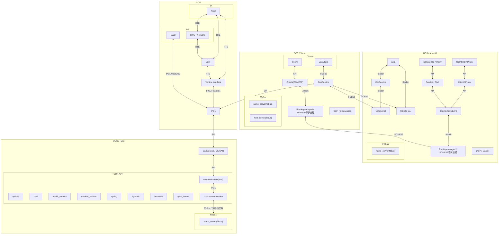

按原图明确协议连接重建；SOME/IP、FDBus、Binder、SPI、IPCL、RTE、Attach、API 使用文字标注。TBox 应用集合到通信层的汇聚箭头原图未区分单个应用，因此不推断每个应用都直连每个端点。DoIP 块原图没有完整诊断路由，不补画。

[原图对照](https://qiantao18817568425-art.github.io/Architecture_Learning-/architecture/assets/10.jpg)


这张图把协议作为图例放在顶部，并在域内画出 Client、Proxy、Stub、服务、守护进程
和命名服务。它适合回答“这一段看起来使用什么通信机制”“哪一个方框像生产者或
消费者”“跨域前后有哪些转换点”。[可信度：架构图确认] [证据：original-diagram-03]

它不证明图例中的协议覆盖箭头一定与某版本实现完全一致，也不证明同名 `CanService`
在各域就是同一个进程。协议图应与接口描述语言（Interface Definition Language，IDL）、
服务发现配置、进程树和抓包互证。[可信度：待 MT8676 确认]

## 1.3 六类方框与两类“不是模块”的元素

| 类型 | 如何识别 | 它通常回答什么 | 不应直接推导什么 |
|---|---|---|---|
| 容器/分组框 | 大框包围多个小框 | 归属域、层或逻辑分组 | 独立进程、调用方向 |
| 运行时模块 | 服务、应用、进程名 | 处理输入并产生输出 | 仅凭名称确定私有实现 |
| Library | `Lib`、`Libraries`、`.so` 语义 | 为进程提供可链接能力 | 自己主动运行或拥有线程 |
| Service | `Service`、Manager、Server | 长生命周期能力或共享状态 | 一定是单进程或 Binder 服务 |
| HAL | 位于 Framework/Driver 之间 | 稳定上层接口与硬件适配 | 一定直连物理设备 |
| Driver | Kernel/Drivers 或具体驱动 | 中断、DMA、寄存器、队列 | 上层业务策略 |
| 协议图例 | 顶部带颜色的双向箭头 | 解释某种连线语义 | 可执行模块 |
| 物理设备 | MCU、SoC、屏、Camera、Modem 等 | 数据最终来源或执行对象 | 等同于软件服务 |

协议本身不是进程；库本身也通常不是主动服务。一个服务可能链接多个库，一个 HAL
可能通过虚拟设备而不是物理寄存器工作，一个驱动也可能只是 Guest Frontend。

## 1.4 同名不等同：身份要靠运行时证据

同一标签可能在不同抽象层重复出现：

- 图 1 的 `CarService` 是 Android Car Services 分组中的平台能力；
- 图 2 的 `CarService` 是 Android Guest 的一个部署块；
- 图 3 的 `CarService` 位于 App 与 VehicleHAL 之间。

这些出现项可以表示同一逻辑能力的不同视角，但不能仅凭名字宣布“同一进程、同一
二进制、同一 Binder 对象”。身份确认需要多个相互独立的证据，例如包名/二进制名、
进程号、服务注册名、接口版本和启动配置。[可信度：标准机制推断]

同理，图 3 TBOX-APP 中的 `modem_service` 只是图中标签；冻结的 UMDP 包含
`fb_modemServices` 是另一个 MT8676 资料事实。两者当前只可列为“可能有关联、需核验”，
不能合并命名或断言等同。[可信度：架构图确认] [证据：original-diagram-03]
[可信度：MT8676 资料确认] [证据：umdp-files-fb-modem-service]

## 1.5 四种方向：命令、状态、Buffer 与反馈

### 命令方向

命令由意图发起方流向执行方。例如“空调设定 22 ℃”可能从 UI 向 CarService、
VehicleHAL、跨域车辆服务、MCU 和执行器传播。命令链中的上游是更接近用户意图的一端，
下游是更接近执行对象的一端。

### 状态/事件方向

状态通常从信号源或监测方流向显示/策略消费者。例如车速从传感器、CAN、MCU、
跨域服务向 Cluster 传播。此时 MCU 是上游，Cluster 是下游；方向恰好可能与控制命令相反。

### 媒体 Buffer 方向

Camera、视频和显示传递的是有所有权和生命周期的 Buffer，而不是简单数值。上游生产
Buffer，下游消费并归还；还需跟踪 Buffer ID、时间戳、Fence 和释放点。

### 反馈/确认方向

同步返回、异步完成事件、执行器回读和首帧上屏都属于反馈。收到“发送成功”只证明请求
进入某层，不一定证明硬件执行或用户结果出现。诊断必须明确所需的最后一级确认。

## 1.6 逻辑业务链与物理承载链

逻辑业务链描述“意义如何变化”：

```text
Source → Producer → Serialize → Channel → Transport
→ Router → Consumer → State Machine → User Result
```

物理承载链描述“比特或 Buffer 如何移动”：

```text
Sender Buffer → Driver/DMA/FIFO → Controller → Physical/Virtual Link
→ Peer Controller → Peer Driver → Receiver Buffer
```

逻辑链可能复用同一条以太网或 SPI 物理链；物理链通不等于某 Topic 新鲜，也不等于
订阅回调到达。反过来，业务状态错误也不一定是物理断链，可能是反序列化、路由、缓存、
代际或状态机问题。

## 1.7 统一链路模型

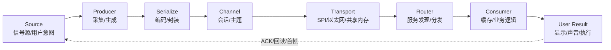

实线箭头表示本次业务数据的主方向；虚线箭头表示反馈闭环，不承诺具体反馈一定回到原始
物理源。`Serialize` 到 `Channel` 的箭头意味着数据进入协议语义，`Channel` 到
`Transport` 表示会话/主题依赖某种物理或虚拟承载；`Router` 到 `Consumer` 表示路由
成功后仍需消费与状态机处理。该模型是诊断框架，不是 MT8676 私有接口图。
[可信度：标准机制推断]

## 1.8 关联标识：怎样把各域日志串成一条链

| 标识 | 解决的问题 | 使用方法 | 常见陷阱 |
|---|---|---|---|
| Timestamp | 事件先后 | 同时保留单调时钟与墙上时间 | 域间时钟未同步 |
| Sequence | 是否丢包、乱序、重复 | 生产者递增，消费者记录最后值 | 重启后清零未标代际 |
| Generation | 属于哪次启动/会话 | VM、服务或 Client 重建时更新 | 旧回调覆盖新状态 |
| Request ID | 请求与响应如何配对 | 入口生成并跨层透传 | 中间层重建 ID |
| Topic/Property | 这是什么业务数据 | 记录名称、版本和订阅状态 | 只记录数字而无映射表 |
| Buffer ID | 哪个媒体缓冲区 | 生产、入队、出队、归还均记录 | 地址复用被误认为同一帧 |
| Fence ID | 生产/消费是否完成 | 跟踪 signal、wait 和超时 | 只看 Buffer 不看同步 |

本手册不发明私有 ID。若当前实现没有贯通的 Request ID，可先用“同一时间窗 +
业务键 + Sequence + Generation”建立候选关联，再以抓包或插桩验证。
[可信度：标准机制推断]

## 1.9 三图对应表

| 概念 | 图 1：Android 内部分层 | 图 2：部署/归属 | 图 3：通信/协议 | 阅读结论 |
|---|---|---|---|---|
| MCU | Kernel 外部未展开 | 独立 MCU、SWC/RTE/MCAL | DI、IVI、Vehicle Interface、IPCL | 安全/实时车辆域，与 SoC 分界 |
| Hypervisor | 未画 | SoC 上的虚拟化层 | 以各域边界间接体现 | 管理 VM 与虚拟资源 |
| SOS/Yocto | Native/System 只局部对应 | Host(SOS YOCTO) | SOS(Yocto) | Host 服务、驱动与车辆/显示能力 |
| Android | 完整应用至 Kernel 栈 | Guest(UOS Android) | UOS(Android) | 同一 Guest 的内部与外部视角 |
| TBox | `tbox` HAL/Tbox Service 等局部项 | Guest(UOS Tbox) | UOS(TBox)/TBOX-APP | 通信模组业务域 |
| Nebula OS | 未画 | Micro Kernel、VM process | 未单独展开 | 私有控制语义待证据确认 |
| CarService | Car Services | Android Guest 能力块 | App 与 VehicleHAL 之间 | 逻辑对应可读，进程身份待确认 |
| VehicleHAL | Android HAL | Android HAL 块内 | CarService 下游 | 车辆属性适配边界 |
| CanService | Infra/系统中有相关项 | SOS Infrastructure | SOS/MCU/TBox 路径均出现 | 同名多 occurrence，不自动合并 |
| FDBus | Infra 有 FDBUS | SOA/IPC 可能承载之一 | name_server、host_server 与服务 | 域内/跨进程消息总线视角 |
| SOME/IP | Infra 有 vsomeip | SOA/IPC | Client、RoutingManager | 面向服务的以太网通信 |
| SPI | Kernel Peripheral | MCU MCAL、跨 MCU/SoC | MCU↔SOS/TBox/IPCL | 物理串行承载 |
| IPCL | 图 1 未明确 | Virtual cominfra | MCU 底部和跨域箭头 | 私有细节待接口/源码确认 |

所有表格对应关系都受 occurrence 约束：它用于帮助导航，不是进程合并表。

## 1.10 系统上下文

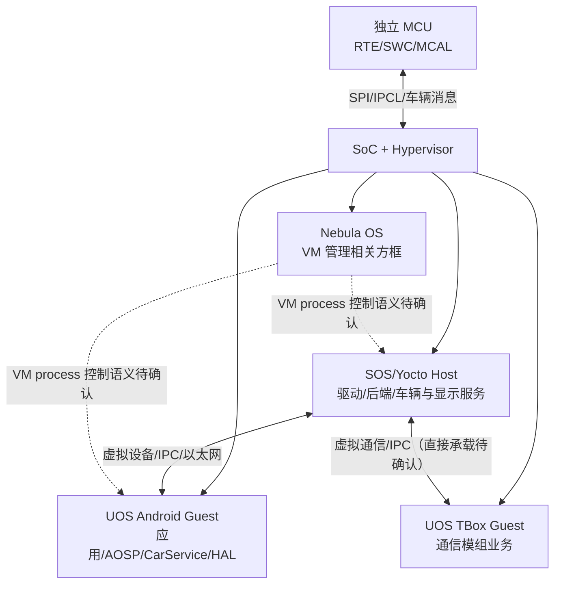

MCU 与 Hypervisor 之间的双向箭头表示图中可见的跨芯片/跨域车辆通信方向，不限定
具体 Topic。Hypervisor 指向各域的箭头表示“承载/隔离关系”，不是业务调用。SOS 与
Android 的双向箭头表示可能存在虚拟设备或 IPC 数据交换；SOS 与 TBox 之间只表示
概念上的虚拟通信需求，原图没有证明直接承载，需设备分配、Host Backend 或接口配置
确认。[可信度：待 MT8676 确认] 虚线表示 Nebula OS 与 VM process 的私有控制细节
没有被当前资料充分证明。[可信度：架构图确认]
[证据：original-diagram-02] [证据：original-diagram-03]

CCCI Driver 方框在图 2 中位于 TBox Guest 的 Kernel&Drivers 区域；这条结论
只描述图中的容器位置。[可信度：架构图确认] [证据：original-diagram-02]

CCCI（Cross Core Communication Interface，跨核通信接口）在 MediaTek 平台的标准
机制中通常用于应用处理器 AP 与 Modem 之间的通信；这是标准工作方式解释，不是图 2
直接画出的端点关系。[可信度：标准机制推断]

具体 MT8676 的 AP/Modem 端点、逻辑通道、消息格式以及是否存在 Host Backend 参与，
必须由驱动配置、设备节点、通道表和运行追踪确认。[可信度：待 MT8676 确认]
当前证据仍不把 CCCI 画成 SOS 与 TBox 的直接边。

## 1.11 一次正确读图的最小步骤

1. 写明用户可见结果和触发条件。
2. 选择图 2 找到部署域和可能的故障隔离边界。
3. 选择图 3 找到跨域协议、Proxy/Stub、路由和命名服务。
4. 选择图 1 下钻 Android 内部服务、HAL、驱动或渲染链。
5. 分别画逻辑链和物理承载链。
6. 为每一跳写输入、处理、输出、所有权和反馈。
7. 用 Timestamp、Sequence、Generation、Request ID 或 Buffer/Fence ID 关联日志。
8. 找到“最后一个正确输出”和“第一个错误/缺失输入”，再缩小到最小责任模块。
9. 对没有 IDL、配置或日志支持的私有关系标记 `[可信度：待 MT8676 确认]`。

## 1.12 阶段章节归属

为避免同一主题在相邻章节重复归属，后续学习按以下边界推进：

| 章 | 主域 | 本章负责 | 不重复承载 |
|---:|---|---|---|
| 06 | Android 内部、图形与资源稳定性 | 生命周期、输入、渲染、Surface/Buffer、泄漏、内部资源与通信异常 | 不把 Yocto、MCU、TBox 的内部实现写成 Android 机制 |
| 07 | SOS/Yocto 内部机制 | systemd 生命周期、Weston/Wayland、Camera、Audio 与车辆服务 | 不承载 MCU/TBox 内部实现或业务流程卡 |
| 08 | MCU 内部机制 | AUTOSAR 启动/调度、CAN/E2E、SPI/IPCL、电源安全与诊断 | 不把标准链写成已证明的产品启动顺序 |
| 09 | TBox/通信模组内部机制 | Favalon SDK/UMDP、Modem/Telephony、机制族、唤醒、日志与跨边界通信 | 不推断具体 SDK Server/UMDP 进程调用链 |
| 10 | 车辆、仪表与诊断业务流程 | 将前三图连接成八条可观测、可恢复、可升级的端到端业务链 | 不把库存假设、标准机制或候选渲染分支写成 MT8676 私有事实 |
| 11 | 显示、相机与驾驶辅助业务流程 | Cluster、RVC、AVM、DMS、ADAS、记录仪及三类显示链 | 不把标准图形/相机机制写成 MT8676 私有部署合同 |
| 12 | 音频与语音业务流程 | 媒体、导航播报、语音车控、电话、广播、KTV、DSP 与物理输出 | 不用控制返回替代音频数据、路由或物理有声 |
| 13 | MT8676 通信模组业务流程 | Data Call、Network、SIM、SMS、AT、GNSS、IMU、Power、Log 与远控 | 不把 API 返回、进程存活或链路 up 当作业务 Ready |
| 14 | 系统生命周期业务流程 | 冷启动、休眠/唤醒、OTA、服务重启、VM 重建与工厂诊断 | 不把 started、Ready、状态恢复和资源重建相互等同 |
| 15 | 统一诊断手册 | 双链、最早断点、时间/身份关联、资源、责任矩阵和升级材料 | 不用检测点、传播结果或 restart 替代直接故障证据 |
| 16 | 全量附录与索引 | 模块、流程、术语、证据和待确认事项的机器可追踪索引 | 不由索引相邻关系新增调用边 |

第 07、08、09 章分别拥有 SOS/Yocto、MCU、TBox 域内机制；第 10～14 章引用这些机制构造车辆、显示、相机、驾驶辅助、音频、语音、通信模组和系统生命周期业务流程，并为每条流程保留证据等级、最早断点、资源所有权和恢复后验证。


---

<!-- chapter-id: 02 -->

# 02 整机与虚拟化架构

> 本章于 2026-09-20 按原架构补充正文解释；原图、模块/流程 ID 和分层保持原样。新证据的版本限定随段落标注。[本轮更新说明](https://qiantao18817568425-art.github.io/Architecture_Learning-/architecture/source-SRC0369.html)。


## 2.1 两颗计算实体：独立 MCU 与 SoC

图 2 把 MCU 和 SoC 画成两个物理底座：MCU 上有 FBL、MCAL、BSW、OS、RTE
和 SWC；SoC 上有 Hypervisor，并承载 SOS/Yocto、Android、TBox 与 Nebula OS
相关区域。[可信度：架构图确认] [证据：original-diagram-02]

微控制器（Microcontroller Unit，MCU）侧出现仪表应用、行车电脑、电源管理、
警示灯控制、ADAS 应用、DSP 控制、功能安全和功能诊断。这说明图的设计意图是把
一部分强实时、车辆状态和安全相关功能放在 MCU 域。[可信度：架构图确认]
但哪些灯或控制量满足何种安全等级、具体周期和最坏响应时间，必须由安全概念、
Runnable 配置、DBC 和需求追踪确认。[可信度：待 MT8676 确认]

片上系统（System on Chip，SoC）侧承载图形、多媒体、摄像头、网络、Android
生态应用以及 TBox 通信业务。SoC 算力强、资源丰富，但虚拟化和复杂软件栈带来
更多启动依赖与恢复阶段。图中的职责划分不等于“MCU 永不显示、SoC 永不控制”，
最终责任仍取决于项目接口和安全分解。

## 2.2 安全、时延和故障隔离边界

可以用三个问题理解 MCU/SoC 边界：

1. **最坏时延是否可控**：MCU 的任务/RTE/SWC 路径通常更容易做确定性分析；
   SoC 路径可能跨 VM、服务和图形合成。[可信度：标准机制推断]
2. **故障是否应隔离**：Android 应用崩溃不应直接破坏 MCU 的基本车辆功能；
   VM、IOMMU 和资源分配共同形成隔离边界。[可信度：标准机制推断]
3. **降级时谁保底**：关键指示、倒车或电源状态的保底策略需要项目安全需求，
   当前三图只能确认模块分布，不能确认具体降级责任。[可信度：待 MT8676 确认]

## 2.3 Hypervisor、Host 与 Guest

<!-- explanation-refresh:vm-role -->
**资料核对后的架构解释（2026-09-20）**

在现有 Host/Guest 划分下，MT8668 LLA 手册进一步确认 SOS Yocto、TBox Yocto UOS、Android UOS 的整机视图。Camera 手册仅展开参与相机的 Host/Android 两域，这是子系统范围，不是整机拓扑改变。PVT 的 T-Hyper 文档给出共享 pCPU 的 period/budget 调度：Guest 内线程可运行不等于此时已获得物理 CPU，性能解释需同时观察两层调度。该资料尚不能把原图所有 Nebula OS 方框映射成已确认的生产进程。[S038 · MT8668_Hypervisor_System_LLA_User_Manual_CN_V1.1.pdf · PDF第5-9页](https://qiantao18817568425-art.github.io/Architecture_Learning-/architecture/source-SRC0003.html#page-5) [S278 · T-Hyper+CPU+调度说明.pdf · PDF第4-6页](https://qiantao18817568425-art.github.io/Architecture_Learning-/architecture/source-SRC0009.html#page-4)
<!-- /explanation-refresh -->


Hypervisor 是位于 SoC 硬件与多个操作系统域之间的虚拟化管理层。图 2 明确标出
Hypervisor，并将 SOS/Yocto 标为 Host、Android 与 TBox 标为 Guest。
[可信度：架构图确认] [证据：original-diagram-02]

- **Host**：通常拥有更多物理驱动或设备后端，为 Guest 提供虚拟设备。
- **Guest**：运行自己的 Kernel 和用户空间，通过虚拟前端访问分配的资源。
- **SOS/Yocto Host**：图中含 ISP、Display、Audio、Ethernet 驱动，以及 Weston、
  Camera、GStreamer、CanService、VehicleIF、AudioMgr 和 LogMgr。
- **UOS Android Guest**：图中含应用、AOSP、CarService、MBOS、Runtime、HAL、
  Infrastructure 和 Guest Kernel/Drivers。
- **UOS TBox Guest**：图中含 Tbox Application、GPS、Telephony Service、
  Virtual cominfra、Virtual CLK 和 CCCI Driver。
- **Nebula OS**：图中含 UOS VM process、SOS VM process 与 Micro Kernel。

“Nebula OS 是否就是 Hypervisor 的控制域、VM process 如何创建/销毁 VM”没有
私有文档支持，不能依据布局写成确定实现。[可信度：待 MT8676 确认]

## 2.4 启动所有权：只描述阶段，不猜私有顺序

从图中可以确认存在 BootLoader/FBL、Hypervisor、各 OS Kernel/Drivers、Runtime/
Infrastructure 和 Application 等层次；不能确认每一层的精确时间点、并行关系或
Ready 条件。[可信度：架构图确认] [证据：original-diagram-01]
[证据：original-diagram-02]

高层启动阶段可以这样理解：

1. 物理 Boot/FBL 建立最小硬件环境并装载后续镜像。
2. Hypervisor 建立内存、CPU、中断和设备分配。
3. Host Kernel 与关键 Backend 就绪。
4. Guest 被创建，Guest Kernel 与 Frontend 初始化。
5. 各域 init/systemd/AOSP 启动服务并发布 Ready。
6. 业务应用建立 Client、订阅状态、获取缓存并产生首个用户结果。

除第一张图的 BootLoader 和第二张图的分层外，以上依赖关系属于通用启动模型。
[可信度：标准机制推断]

## 2.5 物理设备、独占设备、共享设备和虚拟设备

<!-- explanation-refresh:device-assignment -->
**资料核对后的架构解释（2026-09-20）**

设备的“归属”至少有物理控制器、驱动、虚拟接口、业务调用权四层。PVT SPI 示例中，Guest 的 virtio 前端把操作交给 Host 后端；直通方案则要求对应驱动与 IRQ 归属配套改变。二者是同一架构边界下的不同交付配置，不能一边称直通、一边仍让 Host 普通驱动独占同一控制器。实际 IRQ/管脚和设备号继续由本项目配置确定。[S283 · 低速总线虚拟化配置.pdf · PDF第4-5页](https://qiantao18817568425-art.github.io/Architecture_Learning-/architecture/source-SRC0007.html#page-4)
<!-- /explanation-refresh -->


| 资源类型 | 定义 | 典型使用 | 主要恢复边界 |
|---|---|---|---|
| 物理设备 | 真实控制器或外设 | Display、Camera、Audio、Ethernet、SPI、Modem | 物理驱动/硬件复位 |
| 独占分配设备 | 仅一个域直接拥有 | 对低时延或隔离要求高的设备 | 该 Guest/Host 与设备 |
| 共享设备 | 多域需要同一资源 | Audio、Display、Ethernet | 仲裁服务/Host Backend |
| 虚拟设备 | 向 Guest 暴露的逻辑设备 | virtio-net、虚拟显示、虚拟串口 | Frontend、队列、Backend |

哪一个具体 MT8676 设备属于哪种分配方式，三图只提供提示，不能完整证明。需要
Hypervisor 设备树/配置、IOMMU 映射和 Host/Guest 驱动绑定日志确认。
[可信度：待 MT8676 确认]

## 2.6 标准虚拟 I/O 路径


实线是请求或 Buffer 的下行路径：Guest API 到 Frontend，Frontend 把描述符放入
virtqueue/共享内存，Backend 消费描述符并调用物理驱动。虚线是完成路径：设备产生
中断或 DMA 完成，Backend 更新完成状态并注入虚拟中断，Frontend 唤醒 Guest 消费者。
这是标准虚拟 I/O 机制示意，不证明 MT8676 每个设备都采用 virtio，也不证明私有
队列格式。[可信度：标准机制推断]

## 2.7 virtqueue、共享内存和 Buffer 所有权

virtqueue 可理解为 Guest 与 Host 之间的共享描述符队列。Descriptor 描述 Buffer
位置、长度和读写方向；Avail Ring 表示可供 Backend 处理的项，Used Ring 表示已经
处理的项。实现可能通过 Kick 通知 Backend，再通过虚拟中断通知 Guest。
[可信度：标准机制推断]

诊断时要区分三件事：

- **描述符所有权**：当前轮到 Frontend 还是 Backend 修改；
- **数据 Buffer 所有权**：生产者是否已经交出、消费者是否已经归还；
- **映射生命周期**：Guest 虚拟地址、物理页和 IOMMU 映射是否仍有效。

若 VM 重启但 Host Backend 仍保留旧代际 Descriptor，可能出现旧回调、无效地址、
Buffer 泄漏或队列永久等待。恢复不能只“重启应用”，还需按实现重建队列、映射和
订阅。[可信度：标准机制推断]

## 2.8 虚拟中断、DMA 与 IOMMU

直接内存访问（Direct Memory Access，DMA）允许设备在少量 CPU 参与下搬运数据；
输入输出内存管理单元（Input-Output Memory Management Unit，IOMMU）限制设备
可以访问的内存范围，并把设备地址映射到物理页。虚拟中断把 Host 检测到的完成事件
注入到 Guest。[可信度：标准机制推断]

典型故障现象：

- DMA 已完成但虚拟中断丢失：Backend 看见完成，Guest 仍阻塞；
- 虚拟中断到达但 Used Ring 未更新：Guest 被唤醒却找不到完成项；
- IOMMU 映射失效：驱动报 fault，媒体帧或网络包中断；
- Buffer 未归还：队列深度逐步耗尽，最终表现为卡顿、超时或黑屏；
- VM 重启后沿用旧映射：可能访问失败，不能把它归因于业务层。

## 2.9 设备实例

### Display

<!-- explanation-refresh:display-device -->
**资料核对后的架构解释（2026-09-20）**

MT8676 Display V1.3 描述显示 pipe/OVL 和 DSI/DP 的资源约束；MT8668 的 Display/MML、层数和 DSI 资源不同，平台比较不改变原图 Display 框的职责。MT8668 Proxy-Wayland 的职责分界是 Android HWC 提交显示请求，Linux 服务接收 RpcBinder/VSOCK 调用并使用 Wayland-client 接口。请求跨域、buffer 可导入、fence 完成、物理屏可见分别判断；不能把跨域 RPC 等价为逐帧像素经 socket 拷贝。[S147 · MT8676_Hypervisor_Display_User_Manual_V1.3.pdf · PDF第5-10页](https://qiantao18817568425-art.github.io/Architecture_Learning-/architecture/source-SRC0010.html#page-5) [S021 · MT8668_Hypervisor_Display_User_Manual_CN_V1.0.pdf · PDF第5-7页](https://qiantao18817568425-art.github.io/Architecture_Learning-/architecture/source-SRC0011.html#page-5) [S028 · MT8668_Hypervisor_Multi_Display_Proxy-Wayland_User_Manual_CN_V1.0.pdf · PDF第5-7页](https://qiantao18817568425-art.github.io/Architecture_Learning-/architecture/source-SRC0012.html#page-5)
<!-- /explanation-refresh -->


图 2 的 SOS Drivers 中有 Display，Android Guest 有 HAL/Kernel&Drivers；图 1
还出现 SurfaceFlinger、Display HAL、DRM、MDP 和 OpenGL。[可信度：架构图确认]
[证据：original-diagram-01] [证据：original-diagram-02]

可能的虚拟化模型是 Guest 产生图层或 Buffer，Host Backend/显示服务完成资源接收，
再由 Host Display Driver 上屏。[可信度：标准机制推断] 但 Android 是否直接拥有
显示控制器、是否跨域共享 Buffer、Weston 与 SurfaceFlinger 如何合成，需虚拟显示
配置和运行日志确认。[可信度：待 MT8676 确认]

### Camera/ISP

SOS/Yocto Host 区域同时出现 Camera、GStreamer、ISP 和 Camera Application，
提示物理摄像头与 ISP 更接近 Host。[可信度：架构图确认] [证据：original-diagram-02]
MT8676 Camera V1.1 文档确认 Yocto/Android camerahalserver 的分工，硬件相关 MW/sensor/driver 位于 Yocto；MT8668 文档进一步明确 RpcBinder/VSOCK 入口。相机框的位置不变，但解释由“可能跨域”收敛为上述版本明确的 Host 服务与 Guest 调用关系；具体 buffer 格式、fence、映射和恢复配置仍需项目接口证据。[S145 · MT8676_Hypervisor_Camera_User_Manual_V1.1.pdf · PDF第6-8页](https://qiantao18817568425-art.github.io/Architecture_Learning-/architecture/source-SRC0006.html#page-6) [S019 · MT8668_Hypervisor_Camera_User_Manual_CN_V1.0.pdf · PDF第6-8页](https://qiantao18817568425-art.github.io/Architecture_Learning-/architecture/source-SRC0002.html#page-6)

### Audio

<!-- explanation-refresh:audio-device -->
**资料核对后的架构解释（2026-09-20）**

现有 AudioMgr/Audio HAL/Audio Driver 分层可保留，解释需要区分控制与 PCM。8676/8668 对比培训显示：8668 下行 TDM 路径为 32 通道且不需 8676 图示的同样倍频，上行 AFE→HAL 绕过内部 ADSP；上层架构相近不代表 ADSP 输入任务、回采和 routing 直接兼容。AFE 总接口数与该 TDM 路径通道数也不是同一口径。[S045 · Audio模块 8676 vs 8668.pdf · PDF第2-4页](https://qiantao18817568425-art.github.io/Architecture_Learning-/architecture/source-SRC0013.html#page-2) [S049 · MT8668_Audio_HW_Interface_User_Guide_V1.1.pdf · PDF第4-7页](https://qiantao18817568425-art.github.io/Architecture_Learning-/architecture/source-SRC0014.html#page-4)
<!-- /explanation-refresh -->


SOS Host 有 Audio Driver 与 AudioMgr，Android 栈有 AudioFlinger、AudioPolicy、
Audio HAL/AudioControl 等，说明音频既有 Android 策略层又有 Host/物理执行层。
[可信度：架构图确认] [证据：original-diagram-01] [证据：original-diagram-02]
共享音频资源需要路由、焦点、优先级、采样率转换和硬件通路仲裁；哪个模块拥有最终
DSP/Codec 控制仍需项目 Audio 拓扑确认。

### Ethernet

SOS 与 Android Guest 均出现 Ethernet，可能分别代表物理驱动和 Guest 虚拟网卡。
[可信度：架构图确认] 虚拟网络通常经 Frontend、共享队列、Backend 和 Host 物理
网卡；链路 Up 只证明网卡状态，不证明 SOME/IP 服务发现、EventGroup 订阅或业务
Topic 新鲜。[可信度：标准机制推断]

### CCCI/Modem

<!-- explanation-refresh:modem-device -->
**资料核对后的架构解释（2026-09-20）**

PVT TBox 设计把 Guest 侧虚拟音频前端、Host NBL-VMM 后端、CCCI 与 Modem 语音链路分开。CCCI 框表示 AP/Modem 交接的一层，不承包 SIM、网络注册、应用登录和全部音频策略。排查应分别记录控制事件是否到达、语音/数据是否推进，以及 Host/TBox/Modem 是否属于同一次启动与通话会话。[S263 · MT8676 TBOX子系统架构设计.pdf · PDF第1-5页](https://qiantao18817568425-art.github.io/Architecture_Learning-/architecture/source-SRC0015.html#page-1)
<!-- /explanation-refresh -->


TBox Guest 的 Kernel&Drivers 中出现 CCCI Driver，图 1 Kernel 也出现 CCCI。
[可信度：架构图确认] [证据：original-diagram-01] [证据：original-diagram-02]
跨核通信接口（Cross-Core Communication Interface，CCCI）通常连接应用处理器侧
与 Modem 侧的控制/数据通道。[可信度：标准机制推断] 通道编号、消息格式与
`mtktelephonyservice` 的实际关系需 MT8676 Modem 文档和日志确认。

### CAN/SPI

MCU MCAL 中明确有 CAN 和 SPI，图 3 还显示 SPI/IPCL 跨域路径。
[可信度：架构图确认] [证据：original-diagram-02] [证据：original-diagram-03]
CAN 负责车辆网络信号，SPI 是芯片间物理串行承载；IPCL 的私有帧格式、CRC、
Sequence 与流控没有被当前三图定义。[可信度：待 MT8676 确认]

## 2.10 TBox Guest 的虚拟能力

<!-- explanation-refresh:virtual-clock -->
**资料核对后的架构解释（2026-09-20）**

新增三 OS 时间材料补充的是 Android→SOS→TBox 的日历时间/时区同步实现，不足以确认原图 Virtual CLK 的驱动类型或所有寄存器语义。时区经属性监听传播；时间先经 RTC driver/virtio 到 SOS，再经事件、udev 与属性回调到 TBox。联网 TBox 还可能通过 systemd-timesyncd 校时，源仲裁和同步精度须单独验证。[U002 · 3OS time synchronization.pdf · PDF第1-2页](https://qiantao18817568425-art.github.io/Architecture_Learning-/architecture/source-SRC0016.html#page-1)
<!-- /explanation-refresh -->


图 2 TBox Guest 中的 `Virtual CLK` 可理解为向 Guest 提供时间源的虚拟接口，
`Virtual cominfra` 可理解为通信基础设施抽象；GPS 和 Telephony Service 分别承接
定位与蜂窝电话/网络相关能力。[可信度：架构图确认] [证据：original-diagram-02]

“Virtual CLK 由谁校准”“Virtual cominfra 基于共享内存还是 socket”以及 GPS 是否
直接使用物理 GNSS，均需要设备配置和服务实现确认。[可信度：待 MT8676 确认]

## 2.11 Host/Guest 启动与依赖

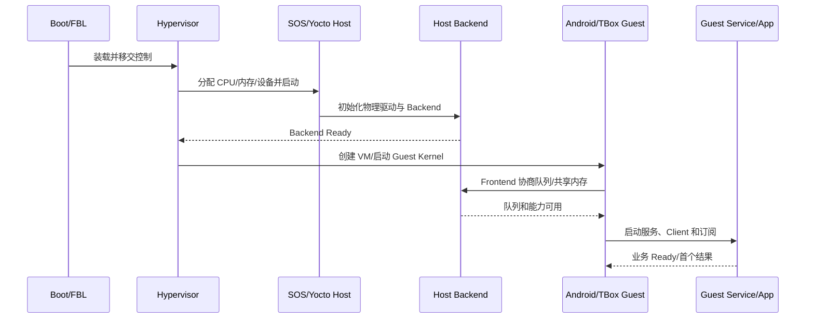

箭头表示一种依赖安全的通用顺序：Host Backend 在 Guest 访问虚拟设备前应可用；
Guest Frontend 建立后，上层服务才可可靠使用资源。实际启动可能并行，也可能由
重试/探测容忍 Backend 晚到；图中没有给出精确 Ready 信号和超时。
[可信度：标准机制推断]

## 2.12 资源归属表

下表是用于排查生产者、所有权、消费者和恢复边界的标准分析模型，不是 MT8676
设备归属配置。[可信度：标准机制推断] 各设备实际采用独占、共享或虚拟分配，以及
Host/Guest 的真实所有者，必须由 Hypervisor 配置、设备树、IOMMU 映射和运行日志
确认。[可信度：待 MT8676 确认]

| 资源/数据 | 生产者 | 分析模型中的主要所有者 | 消费者 | 可能通道 | 恢复边界 |
|---|---|---|---|---|---|
| 车辆 CAN 信号 | 传感器/ECU | MCU CAN/COM/RTE | MCU SWC、SoC 车辆服务 | CAN、SPI/IPCL | MCU 通道与跨域服务 |
| Cluster 图层 | Cluster 应用 | 产生图层的域 | Weston/显示后端 | Wayland/共享 Buffer | 应用、合成器、显示后端 |
| Android 图层 | Android App/HWUI | Android BufferQueue | SurfaceFlinger/HWC | Binder、Buffer/Fence | App、SF、虚拟显示 Backend |
| Camera 帧 | Camera/ISP | Host Camera/ISP 驱动 | AVM/RVC/DMS/Android | V4L2、共享 Buffer | 物理驱动、Pipeline、消费者 |
| 音频 PCM | Player/Call/ASR | Audio 服务/策略 | DSP/Codec/Speaker | 共享 Buffer/音频设备 | AudioMgr、HAL、物理音频 |
| Ethernet 包 | 应用/外部网络 | Host 网络栈/虚拟网卡 | Guest/远端服务 | virtqueue、物理 Ethernet | Frontend、Backend、NIC |
| Modem 控制/数据 | TBox/Modem | CCCI/Telephony 栈 | UMDP/上层应用 | CCCI、socket/API | Modem、Telephony、Client |
| SPI/IPCL 帧 | MCU 或 SoC | SPI 控制器/通信服务 | 对端 Vehicle Interface | SPI/IPCL | 两端驱动、队列、协议 |

“主要所有者”是分析入口，不是 MT8676 最终资源表。Camera/Display/Audio 的独占、
共享和虚拟化方式仍需 Hypervisor 配置与运行时证据确认。

## 2.13 故障边界与观测点

| 故障 | 直接表现 | 最小观测点 | 不应过早归因 |
|---|---|---|---|
| Host Backend 不可用 | Guest Frontend 探测失败/请求无完成 | Host 服务、Backend 注册、Guest probe | Guest 应用逻辑 |
| Guest Frontend 未 Ready | 上层设备/API 不可用 | Guest dmesg、设备节点、协商日志 | 物理设备 |
| 队列停滞 | Avail 增长、Used 不动或反之 | Descriptor、队列 index、kick/IRQ | 网络或业务本身 |
| 虚拟中断丢失 | Host 完成、Guest 超时 | Host IRQ、inject、Guest ISR | 请求未发送 |
| VM 重启 | Client/FD/Buffer 全部跨代失效 | VM Generation、重绑/重订阅 | 单个服务 |
| 物理驱动失败 | 所有共享消费者同时异常 | Host driver、DMA/IOMMU、硬件错误 | 某一个 Guest |
| IOMMU fault | DMA 失败、Buffer 不可访问 | IOMMU fault 地址与映射代际 | UI 状态机 |
| Buffer 泄漏 | 内存/队列占用持续增长 | 分配/入队/归还计数与 Fence | 瞬时丢帧 |

责任初判应落在“最后一个拥有正确输入、却没有产生预期输出”的最小模块；若物理设备
被多个 Guest 共享，多个域同时失败是 Host Backend 或物理资源异常的重要信号，
但仍需时间和代际证据确认。

## 2.14 当前图能确认与不能确认的边界

**能够确认：**

- 存在独立 MCU 与 SoC；SoC 上存在 Hypervisor 和多个系统域。
- SOS/Yocto 被画为 Host，Android/TBox 被画为 Guest。
- Host 更接近 ISP、Display、Audio、Ethernet 等驱动。
- TBox Guest 包含 GPS、Telephony、Virtual cominfra、Virtual CLK 和 CCCI Driver。
- Android Guest 内有 AOSP、CarService、HAL、Runtime 与 Kernel/Drivers。

**不能确认：**

- 私有 VM 的精确启动/停止顺序与超时；
- 每个设备是独占、共享还是虚拟；
- virtqueue 的数量、格式、深度和中断机制；
- Nebula OS、MBOS、FCM 的内部控制语义；
- IPCL 帧格式、Channel/Topic ID、CRC、重试和所有权；
- VM 重启后具体由谁重建 Client、回调、Buffer 与业务缓存。

这些不能确认项需要 Hypervisor 配置、设备树、IDL、服务 unit、进程树、驱动日志、
IOMMU/中断追踪以及带 Generation 的业务日志。[可信度：待 MT8676 确认]


---

<!-- chapter-id: 03 -->

# 03 MT8676 Favalon SDK 与 UMDP

> 本章于 2026-09-20 按原架构补充正文解释；原图、模块/流程 ID 和分层保持原样。新证据的版本限定随段落标注。[本轮更新说明](https://qiantao18817568425-art.github.io/Architecture_Learning-/architecture/source-SRC0369.html)。


## 3.1 版本和证据边界

本章的 Favalon 软件开发套件（Software Development Kit，SDK）基线为
**V1.0.166**，UMDP 基线为 **V1.0.226**。SDK 指南明确写出 SDK 运行在
Middleware 层、采用 Client/Server 架构，提供同步调用和回调两种方式，同步接口有
超时处理，接口语义通常分为 GET、SET、REGISTER。[可信度：MT8676 资料确认]
[证据：sdk-mt8676-guide]

UMDP README 明确 `project: mt8676`、版本 `V1.0.226`，并说明合入
`meta/poky/meta/recipes-core/fibo-umdp`；recipe、systemd unit、配置和归档清单
进一步证明包内的服务、库和安装方式。[可信度：MT8676 资料确认]
[证据：umdp-readme-v1-0-226-txt] [证据：umdp-fibo-umdp-bb]

必须把两个版本快照分开阅读：V1.0.166 示例证明该 SDK 归档中的业务家族和调用用法；
V1.0.226 UMDP 集成头文件证明 226 包的兼容性接口面。当前没有同版本头文件对照或
兼容性声明，不能把 226 头文件当作 166 的精确 API 合同；两者精确接口一致性
`[可信度：待 MT8676 确认]`，需版本化头文件、ABI/符号差异或供应商兼容性说明。

本章只说明架构与生命周期，不制作逐函数参考手册。示例代码可以证明“API 如何被
调用”，不能证明量产应用采用相同等待、重试、线程、错误处理或恢复策略。

## 3.2 Favalon SDK 在系统中的位置

SDK 指南把它定义为业务模块和上层应用之间的桥梁：上层调用 Client 侧 API，
Client 把请求发到 Server，Server 转换和封装业务请求，再调用下层业务接口。
[可信度：MT8676 资料确认] [证据：sdk-mt8676-guide]


SDK 软件架构（依据源图重绘）

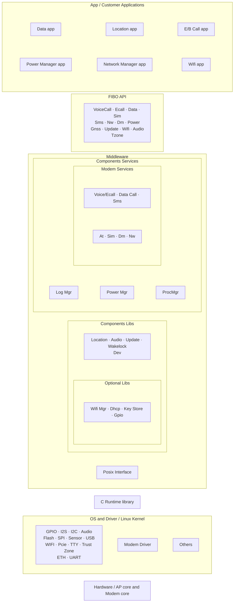

源图为分层和包含关系，没有显式调用箭头；相邻同层模块以同一分组保留全部标签，未凭位置添加依赖。

[原图对照](https://qiantao18817568425-art.github.io/Architecture_Learning-/architecture/assets/11.png)


原图能证明 Customer Application、FIBO SDK API、中间件、Common Services、
System Lib/Common Lib、Post Interface、OS/Driver 与 Hardware/AP/Modem core
处于分层关系。[可信度：MT8676 资料确认]
[证据：sdk-image-sdk-architecture-diagram-png]

原图不能证明每个彩色小框是独立进程，不能给出全部 `.so` 的加载关系，也不能证明
某个业务 API 最终调用哪个私有驱动。具体映射仍需二进制依赖、服务注册和运行日志。

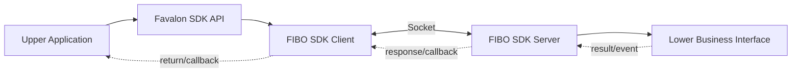

该图只重画 V1.0.166 SDK 指南确认的通用 Client/Server 结构：实线表示请求方向，
虚线表示返回或回调；Client 与 Server 间的 `Socket` 来自结构图。这里的
`FIBO SDK Server` 不与任何具体 `fb_*` 进程合并命名，也不声明某个 UMDP 库的加载
或调用关系。[可信度：MT8676 资料确认]
[证据：sdk-mt8676-guide] [证据：sdk-image-sdk-structural-diagram-png]

## 3.3 Client/Server 结构和库/服务边界


SDK Client / Server 结构（依据源图重绘）

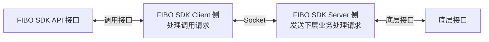

从源图三组双向接口重建。底层接口是边界端点，图中未指定其内部进程或具体实现。

[原图对照](https://qiantao18817568425-art.github.io/Architecture_Learning-/architecture/assets/12.png)


结构图明确给出：

- 左侧是 FIBO SDK API 入口；
- `FIBO SDK Client 侧`负责处理调用请求；
- Client 与 `FIBO SDK Server 侧`之间标注 `Socket`；
- Server 侧处理并发送下层业务请求；
- 右侧通过底层接口继续下行。

[可信度：MT8676 资料确认] [证据：sdk-image-sdk-structural-diagram-png]

这张图证明的是**结构边界**，不证明 Socket 类型、地址、协议字段、队列深度、线程数、
认证方式或服务发现机制。诊断时应把 Client 进程、Client Library、Socket 会话、
Server 进程和下层接口作为五个不同检查点。

## 3.4 API 家族：两个版本快照分列

V1.0.166 示例可证明归档中存在对应家族及调用用法；V1.0.226 UMDP 集成头文件只证明
226 包内兼容性接口面。表中的两列不可互相替代，精确签名、枚举、字段和超时的跨版本
一致性 `[可信度：待 MT8676 确认]`。

| 家族 | 处理对象（家族级） | V1.0.166 示例证据 | V1.0.226 UMDP 集成头文件 |
|---|---|---|---|
| AT | AT 命令 | [证据：sdk-example-at-test-at-test-c] | [证据：umdp-files-umdp-include-fibo-sdk-fibo-at-h] |
| Audio | 模组/通话音频 | [证据：sdk-example-audio-test-audio-test-c] | [证据：umdp-files-umdp-include-fibo-sdk-fibo-audio-h] |
| Data | 数据调用 | [证据：sdk-example-data-test-data-test-c] | [证据：umdp-files-umdp-include-fibo-sdk-fibo-data-h] |
| Device Management | 设备管理 | [证据：sdk-example-dm-test-dm-test-c] | [证据：umdp-files-umdp-include-fibo-sdk-fibo-dm-h] |
| IMU | 惯性传感器 | [证据：sdk-example-imu-test-imu-test-c] | [证据：umdp-files-umdp-include-fibo-sdk-fibo-imu-h] |
| Location/GNSS | 定位 | [证据：sdk-example-gnss-test-gnss-test-c] | [证据：umdp-files-umdp-include-fibo-sdk-fibo-location-h] |
| Log | 日志 | [证据：sdk-example-log-test-log-test-c] | [证据：umdp-files-umdp-include-fibo-sdk-fibo-log-h] |
| Network | 网络注册/状态 | [证据：sdk-example-nw-test-nw-test-c] | [证据：umdp-files-umdp-include-fibo-sdk-fibo-nw-h] |
| Power | 电源 | [证据：sdk-example-power-test-power-test-c] | [证据：umdp-files-umdp-include-fibo-sdk-fibo-power-h] |
| SIM | 卡状态与操作 | [证据：sdk-example-sim-test-sim-test-c] | [证据：umdp-files-umdp-include-fibo-sdk-fibo-sim-h] |
| SMS | 短信 | [证据：sdk-example-sms-test-sms-test-c] | [证据：umdp-files-umdp-include-fibo-sdk-fibo-sms-h] |
| Timer | 定时器 | [证据：sdk-example-timer-test-timer-test-c] | [证据：umdp-files-umdp-include-fibo-sdk-fibo-timer-h] |
| Voice/eCall | 语音/紧急呼叫 | [证据：sdk-example-voice-test-voice-test-c] | [证据：umdp-files-umdp-include-fibo-sdk-fibo-voice-h] |
| WakeLock | 唤醒锁 | [证据：sdk-example-wakelock-test-wakelock-test-c] | [证据：umdp-files-umdp-include-fibo-sdk-fibo-wakelock-h] |
| Wakeup | 唤醒 | [证据：sdk-example-wakeup-test-wakeup-test-c] | [证据：umdp-files-umdp-include-fibo-sdk-fibo-wakeup-h] |

家族名称和示例入口属于 V1.0.166 归档事实。[可信度：MT8676 资料确认] 226 头文件中的
具体函数、结构体、枚举和注释只能作为 UMDP V1.0.226 集成快照，不写成 166 合同。
服务归并和二进制绑定需版本化头文件、ABI 符号表、IDL、配置或运行追踪确认。
## 3.5 GET、SET、REGISTER 三种语义

<!-- explanation-refresh:api-readiness -->
**资料核对后的架构解释（2026-09-20）**

GET/SET/REGISTER 的调用语义要叠加具体服务的 ready 条件。作为新平台对照，MT8668 TBox 手册要求除 ML_GetModemStat 外的接口依赖 modem ready；这不能直接替换原 Favalon API 名称，但解释了“IPC 已连接，业务调用仍失败”的分层原因。SET 的返回只按该 API 合同解释，若它仅表示接收成功，应另取状态回读/回调验证业务生效。[S075 · MT8668_Yocto_T-Box_User_Manual_CN_V1.0.pdf · PDF第5-7页](https://qiantao18817568425-art.github.io/Architecture_Learning-/architecture/source-SRC0018.html#page-5)
<!-- /explanation-refresh -->


V1.0.166 指南直接确认接口服务通常分为 GET、SET、REGISTER，并确认设置、查询类接口
为同步调用。[可信度：MT8676 资料确认] [证据：sdk-mt8676-guide]

### GET

GET 在通用接口设计中表示查询状态或配置，调用方提交查询并接收结果。
[可信度：标准机制推断] 结果来自 Server 缓存、实时下层查询还是其他来源，以及返回值
的新鲜度保证，当前指南未定义；需 V1.0.166 版本化头文件、服务实现合同或带时间戳的
运行追踪确认。[可信度：待 MT8676 确认]

### SET

SET 在通用接口设计中表示请求修改配置或触发动作。[可信度：标准机制推断] 同步返回
成功究竟代表 Client 接收、Server 受理、下层完成还是硬件生效，不能从指南推出；
需当前接口合同、实现源码和执行回读确认。[可信度：待 MT8676 确认]

### REGISTER

REGISTER 通常用于建立事件订阅或回调关系；服务重启后旧 Session/Handle 和注册是否
继续有效属于实现合同。[可信度：标准机制推断] V1.0.166 的 Network、SIM、SMS、
Data、Voice 和 Device Management 示例能证明这些归档示例存在 Client 初始化、
服务事件回调或事件注册用法，不证明量产自动重连策略。
[可信度：MT8676 资料确认]
[证据：sdk-example-nw-test-nw-test-c] [证据：sdk-example-sim-test-sim-test-c]
[证据：sdk-example-sms-test-sms-test-c] [证据：sdk-example-data-test-data-test-c]
[证据：sdk-example-voice-test-voice-test-c] [证据：sdk-example-dm-test-dm-test-c]
## 3.6 Client 生命周期

不同家族的函数命名并不完全一致，但架构生命周期可归纳为：

1. 进程启动并加载 Client Library；
2. 调用模块初始化或创建 Client/Handle；
3. 必要时注册服务事件回调和业务事件回调；
4. 执行 GET/SET 或异步请求；
5. 消费返回值、响应和事件；
6. 取消订阅、停止活动业务；
7. deinit/release，使 Handle、回调和资源失效。

Voice 示例展示 `fibo_voice_client_init`、Handle 使用、服务事件回调和
`fibo_voice_client_deinit`；DM、Network、SMS、Data 等也采用类似结构。
[可信度：MT8676 资料确认] [证据：sdk-example-voice-test-voice-test-c]
[证据：sdk-example-dm-test-dm-test-c] [证据：sdk-example-nw-test-nw-test-c]

“类似结构”不代表所有家族共享同一个 Handle 或释放函数。调用方必须按当前头文件
管理每个家族资源，不能跨模块复用失效对象。

## 3.7 成功的同步调用


SDK 同步调用流程（依据源图重绘）

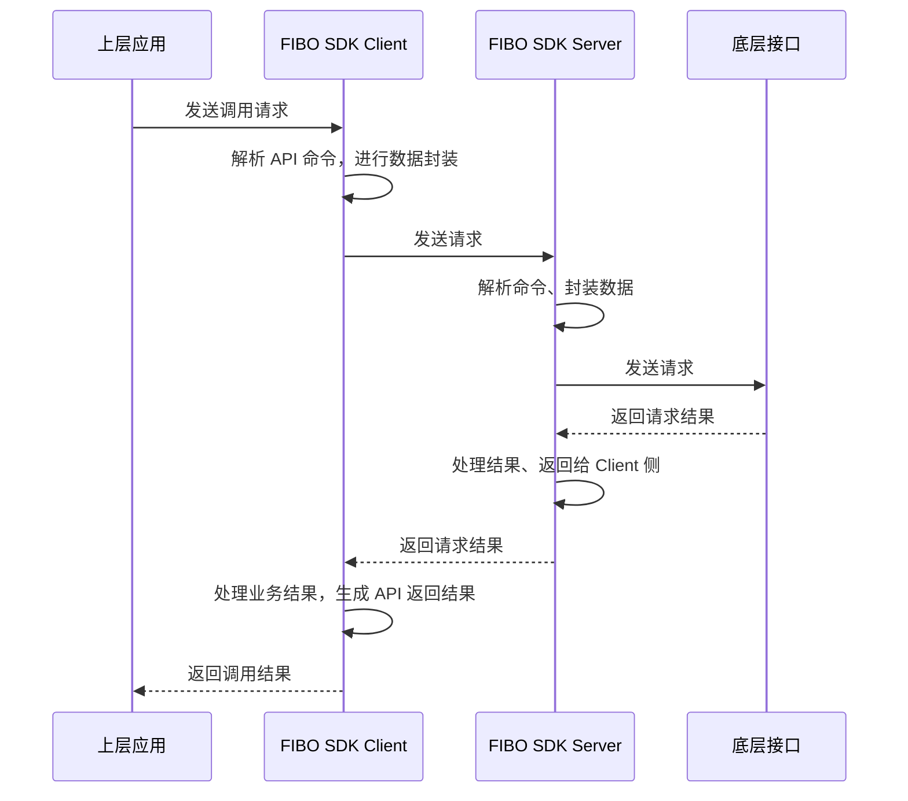

按源图保留四条生命线与请求/返回顺序。同步返回的业务含义仍由接口定义，不自动等于硬件动作完成。

[原图对照](https://qiantao18817568425-art.github.io/Architecture_Learning-/architecture/assets/13.png)


原图证明上层调用进入 Client，Client 组织请求发给 Server，Server 调用底层接口，
底层结果回到 Server，再经 Client 返回上层；图中还表现了同步等待和超时处理阶段。
[可信度：MT8676 资料确认] [证据：sdk-image-sync-timing-diagram-png]

它不证明所有接口使用同一个超时值，也不证明业务动作在返回时已经完成。具体接口的
返回语义必须查当前版本头文件。

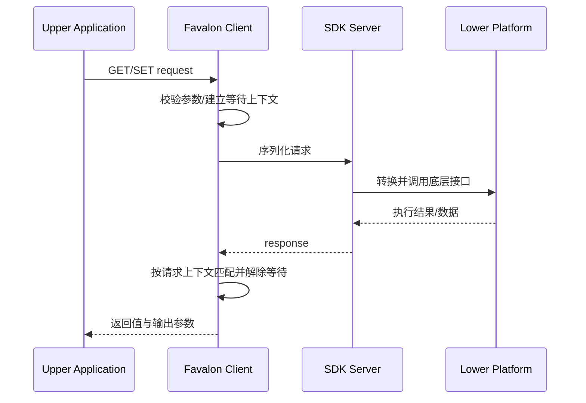

请求下行箭头表示同步链的调用方向，虚线返回表示结果回传。Client 内部的“等待上下文”
表示同步 API 需要配对响应，不代表已知其私有实现。成功条件至少包括请求发出、Server
处理、响应配对和上层得到有效返回。[可信度：MT8676 资料确认]
[证据：sdk-mt8676-guide]

## 3.8 超时、迟到响应和服务不可用

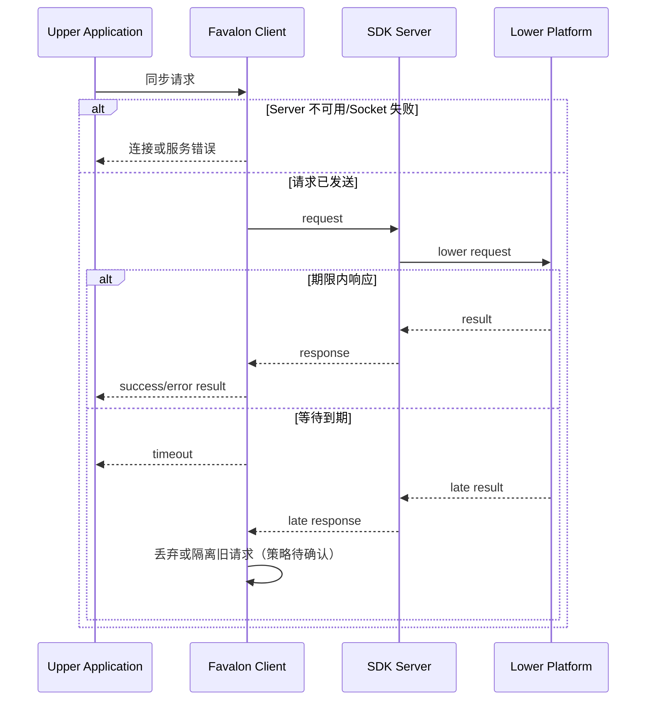

外层 `alt` 区分“根本没有可用 Server”与“请求已进入链路但未按期返回”。迟到响应是否
被 Client 丢弃、是否携带 Request ID、是否会触发其他回调，当前结构图没有说明，
需要 Client 实现或带关联 ID 的日志确认。[可信度：待 MT8676 确认]

同步超时只说明调用方没有在合同期限内得到匹配响应，不自动证明下层没有执行。对 SET
或拨号类动作，超时后盲目重试可能造成重复操作；应先查询状态或用幂等/请求标识确认。
[可信度：标准机制推断]

## 3.9 回调注册、事件和服务重启

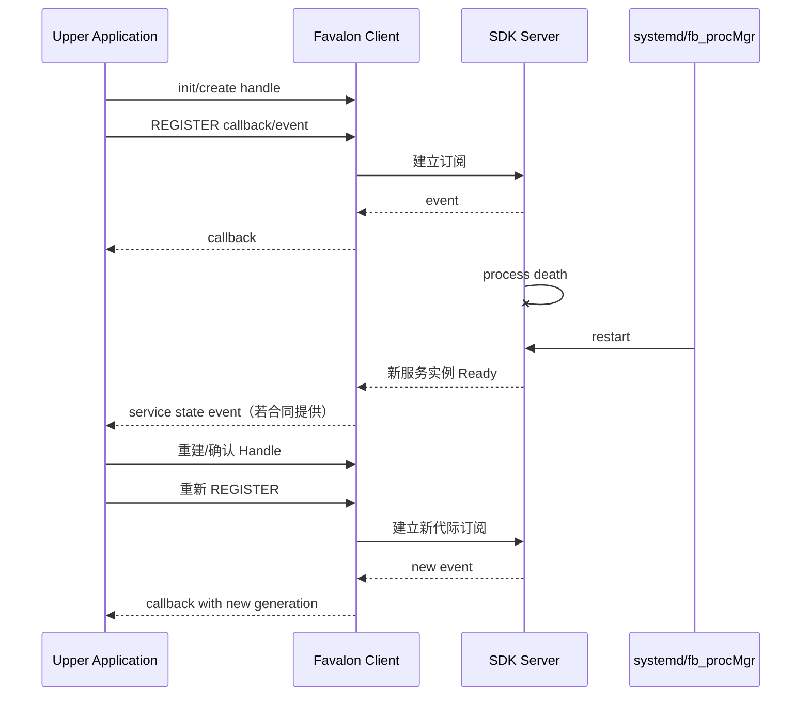

前四个箭头是正常注册与事件投递；进程死亡后，Supervisor 只负责拉起进程，不保证
Client 对象、Socket、回调注册和业务缓存自动恢复。后半段的重建/重注册是稳健恢复
模型，具体由 SDK 自动完成还是应用负责，需要版本合同和实测确认。
[可信度：标准机制推断]

## 3.10 回调异常的四个层次

1. **未注册**：Client 从未完成 REGISTER，Server 没有订阅关系。
2. **注册失效**：Server 或 Client 重启，旧 Session/Handle 已失效。
3. **回调未投递**：事件产生，但 IPC/队列/Client 线程未执行。
4. **回调已到、业务未执行**：上层线程阻塞、Generation 过滤错误或状态机拒绝。

诊断不能只搜“callback 关键字”，而要同时证明事件源产生、Server 发布、Client 收到、
应用回调入口和业务状态变化。服务事件回调的示例证明 API 用法，不证明量产一定自动
重连。[可信度：MT8676 资料确认] [证据：sdk-example-data-test-data-test-c]
[证据：sdk-example-voice-test-voice-test-c]

## 3.11 UMDP 的 Yocto 集成

UMDP recipe 的 `SUMMARY`/`DESCRIPTION` 标识 UMDP SDK，`SRC_URI` 包含 `umdp/`
以及四个 systemd unit；安装阶段把 `services/*`、`app/*` 放入 `/usr/bin`，
把 `lib/*` 放入库目录，把配置安装到 `/etc/umdp`，把头文件安装到
`include/fibo_sdk`，并为四个 unit 建立 `multi-user.target.wants` 链接。
[可信度：MT8676 资料确认] [证据：umdp-fibo-umdp-bb]

recipe 还声明 telephony AIDL interface、ALSA、audio mixer、gpshal 等包级构建/运行
依赖；这只能确认 UMDP 包的集成上下文，不能证明某个服务或库对这些依赖的逐跳调用。
[可信度：MT8676 资料确认] [证据：umdp-fibo-umdp-bb] 具体二进制绑定和调用关系
`[可信度：待 MT8676 确认]`。

## 3.12 UMDP 服务

| 服务程序 | 证据中的启动项/清单 | 直接可确认事实 | 当前不能确认 |
|---|---|---|---|
| `fb_modemServices` | `/usr/bin/fb_modemServices` | Modem unit 的 ExecStart | 对应哪些 SDK API |
| `fb_audioServices` | `/usr/bin/fb_audioServices` | Audio unit 的 ExecStart | 与 Android Audio 的调用边 |
| `fb_powerMgr` | `/usr/bin/fb_powerMgr` | Power unit 的 ExecStart | 私有电源状态机 |
| `fb_logMgr` | `/usr/bin/fb_logMgr` | Log unit 的 ExecStart | 私有日志策略 |
| `fb_procMgr` | 包内 services 清单 | 包中存在该程序 | 启动者、监督范围与配置加载 |

前四项由 unit 与归档清单共同证明，`fb_procMgr` 只由包内确定性清单证明。
[可信度：MT8676 资料确认] [证据：umdp-files-fb-modem-service]
[证据：umdp-files-fb-audio-service] [证据：umdp-files-fb-powermgr-service]
[证据：umdp-files-fb-logmgr-service] [证据：umdp-library-service-listing]

图 3 的 `modem_service` 与此处 `fb_modemServices` **身份未确认**。前者是通信图中的
TBOX-APP 标签，后者是 UMDP V1.0.226 的可执行进程。若要确认关系，需取得 TBox
进程树、启动配置、服务注册名、二进制哈希及调用日志。
[可信度：待 MT8676 确认] [证据：original-diagram-03]
[证据：umdp-files-fb-modem-service]

## 3.13 UMDP 包内组件存在清单与绑定边界

V1.0.226 归档清单直接确认以下文件存在：

- `libmt86mlclient.so`；
- `libumdp.so`、`libumdp_common.so`；
- `libumdp_dev.so`、`libumdp_imu.so`、`libumdp_location.so`、
  `libumdp_wakeup.so`；
- `libumdp_pa_audio.so`、`libumdp_pa_dev.so`、`libumdp_pa_imu.so`、
  `libumdp_pa_location.so`、`libumdp_pa_modem.so`、
  `libumdp_pa_wakeup.so`；
- `fb_modemServices`、`fb_audioServices`、`fb_powerMgr`、`fb_logMgr`、
  `fb_procMgr`。

[可信度：MT8676 资料确认] [证据：umdp-library-service-listing]

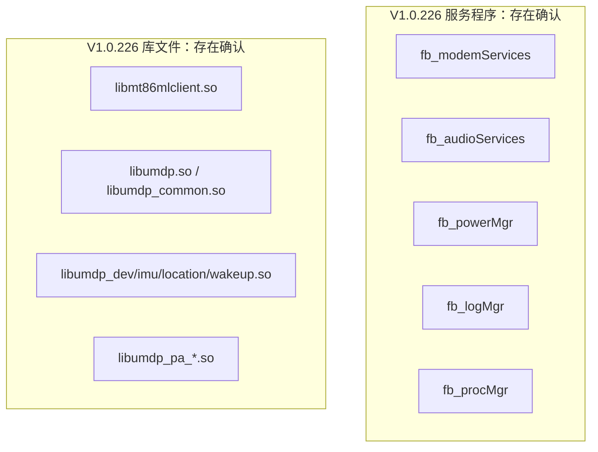

图中没有服务到库的箭头，表示 archive listing 只证明文件存在，不证明加载者、调用者
或调用顺序。[可信度：MT8676 资料确认] [证据：umdp-library-service-listing]

作为标准分层概念，可以用“Application → SDK Client → 具体服务端 → 领域能力/
平台适配 → Lower Platform”组织诊断检查点。[可信度：标准机制推断] 这不是已确认的
UMDP 二进制调用图；**具体服务端/库绑定待 MT8676 确认**，必须补取 ELF
`DT_NEEDED`、导入/导出符号、进程内存映射、IDL、服务配置和运行追踪。
[可信度：待 MT8676 确认]
## 3.14 systemd 依赖和行为

### `fb_modem.service`

- `Requires=mtktelephonyservice.service`：Modem 服务强依赖 Telephony 服务。
- `After=local-fs.target remote-fs.target`：在本地/远程文件系统目标之后排序。
- `Restart=always`：进程退出后由 systemd 重新拉起。
- `Nice=-15`：配置了较高的调度优先级倾向。

[可信度：MT8676 资料确认] [证据：umdp-files-fb-modem-service]

### `fb_audio.service`

- `After=fb_modem.service`：启动排序在 Modem unit 之后。
- `Requires=sound.target`：依赖声音目标。
- `Restart=always`、`Nice=-15`。

注意 `After=fb_modem.service` 是排序，不等同于 `Requires=fb_modem.service`；
本 unit 的强依赖项是 `sound.target`。[可信度：MT8676 资料确认]
[证据：umdp-files-fb-audio-service]

### `fb_powermgr.service`

- `After=fb_modem.service` 且 `Requires=fb_modem.service`；
- `Restart=always`、`Nice=-15`。

因此 Modem unit 的启动/停止会影响 Power Manager 的依赖链。
[可信度：MT8676 资料确认] [证据：umdp-files-fb-powermgr-service]

### `fb_logmgr.service`

- `RequiresMountsFor=/var/run /data /run`；
- `After=local-fs.target remote-fs.target systemd-journald.socket`；
- `Requires=systemd-journald.socket`；
- `Restart=always`、`Nice=-15`。

挂载或 journald 未满足时，Log Manager 的问题不能先归因于日志业务逻辑。
[可信度：MT8676 资料确认] [证据：umdp-files-fb-logmgr-service]

## 3.15 启动依赖图

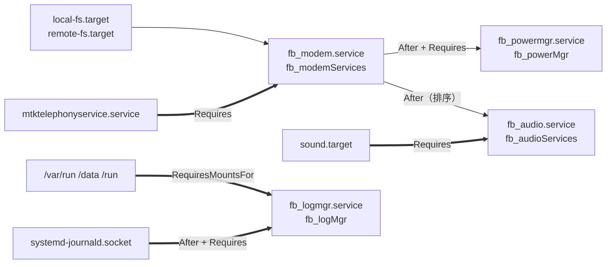

粗箭头表示 `Requires`/`RequiresMountsFor` 强依赖，普通箭头表示 `After` 排序。Audio
只对 `sound.target` 声明强依赖，对 Modem 声明排序；Power 同时对 Modem 声明排序
和强依赖。这些关系直接来自 unit，不应被改写成业务 Ready 保证。
[可信度：MT8676 资料确认] [证据：umdp-files-fb-modem-service]
[证据：umdp-files-fb-audio-service] [证据：umdp-files-fb-powermgr-service]
[证据：umdp-files-fb-logmgr-service]

## 3.16 `umdpprocess.ini` 语义

配置头部注释定义：

| 字段 | 配置语义 | 诊断问题 |
|---|---|---|
| `binary` | 可执行文件路径 | 路径、权限、哈希是否正确 |
| `argument` | 可执行文件参数 | 参数是否缺失或版本不匹配 |
| `type=restart` | 死亡后重启 | 是否形成重复重启 |
| `type=oneshot` | 只启动一次，退出后不再启动 | 是否错误期望它常驻 |
| `delay` | 延时启动秒数 | 依赖是否因延时尚未满足 |
| `required` | 等依赖程序启动后再启动 | 依赖名称和 Ready 是否正确 |
| `monitor` | 监控依赖，依赖死亡时停止并等待恢复 | 联动停止是否符合预期 |
| `cpulimit` | 限制进程最大 CPU 使用率 | 限制是否造成处理不及时 |
| `ready` | 是否要求服务返回 Ready 信号 | 进程存在是否等于 Ready |
| `priority` | 启动优先级，值越小越高 | 优先级竞争与顺序 |
| `enable` | 服务是否可用 | 被禁用时不应继续等业务回调 |

[可信度：MT8676 资料确认] [证据：umdp-files-umdp-config-umdpprocess-ini]

当前冻结配置实际列出 `fb_logMgr`、`fb_modemServices`、`fb_powerMgr` 三个 section，
均使用 `type=restart`、`delay=0`、`cpulimit=10`、`ready=false`、
`priority=1`、`enable=true`。[可信度：MT8676 资料确认]
[证据：umdp-files-umdp-config-umdpprocess-ini]

注释定义了 `argument`、`required`、`monitor` 等语义，不表示当前三个 section 已经
配置这些字段。`enabled` 出现在注释，而实际键为 `enable`，正文以实际键名为准。

## 3.17 systemd 与 `fb_procMgr` 的边界

四个 systemd unit 都有 `Restart=always`；`umdpprocess.ini` 又描述一套进程监督
语义，包内还包含 `fb_procMgr`。当前证据能确认这些组件同时存在，不能确认量产运行
时由 systemd、`fb_procMgr` 还是二者分层负责每个进程的唯一监督。
[可信度：待 MT8676 确认]

确认方法：

1. 查看 `fb_procMgr` 的实际启动者和命令行；
2. 对照它加载的配置路径；
3. 使用 `systemctl status/show` 查看 unit MainPID 与 Restart 计数；
4. 制造受控服务退出，观察谁先记录死亡、谁执行拉起；
5. 用新 PID/Generation 验证 Client 是否重连。

## 3.18 服务死亡到业务恢复

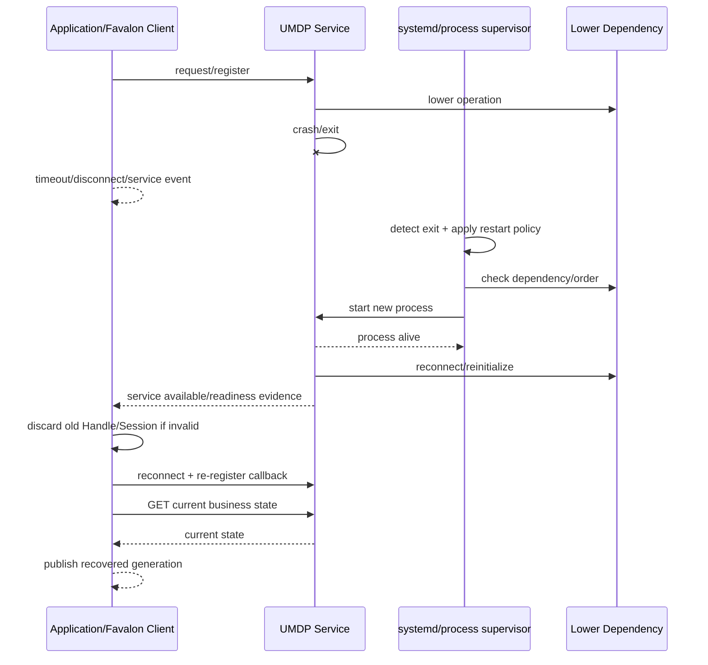

`detect exit` 到 `start new process` 是监督层恢复；`process alive` 不等于依赖、SDK
接口或业务 Ready。Client 必须区分旧 Handle/Session、回调注册与业务缓存，并通过
重新查询当前状态完成恢复闭环。哪些步骤由 SDK 自动执行仍需实现确认。
[可信度：标准机制推断]

## 3.19 四种“恢复”不能混为一谈

| 层次 | 恢复对象 | 成功证据 | 仍可能失败 |
|---|---|---|---|
| 进程恢复 | Server 新 PID 存活 | systemd Active、无持续退出 | 下层依赖未 Ready |
| Client 对象恢复 | 新连接/Handle 可调用 | init 成功、简单 GET 返回 | 旧回调仍失效 |
| 回调恢复 | 订阅已在新 Session 建立 | 注册成功、受控事件到达 | 业务缓存仍旧 |
| 业务状态恢复 | 当前状态与用户结果一致 | GET/事件/显示或执行回读闭环 | 后续代际竞争 |

“systemd 已重启”只覆盖第一行，不能作为整条业务恢复完成的证据。

## 3.20 失败模式与证据表

| 失败模式 | 链路位置 | 典型表现 | 需要的证据 | 首要责任边界 |
|---|---|---|---|---|
| 同步超时 | Client 等待响应 | API 返回 timeout | 请求/响应关联、Server/下层耗时 | 最早未按期产出者 |
| 迟到响应 | 超时后仍返回 | 旧结果污染新状态 | Request ID、Generation、丢弃日志 | Client 配对/隔离 |
| Callback 丢失 | Server→Client→App | 状态不更新 | 事件源、发布、投递、入口、状态机 | 最早缺失的一跳 |
| Service 死亡 | UMDP Server | 断连、请求失败 | core/exit、systemd、PID 代际 | 服务或依赖 |
| 依赖未 Ready | Telephony/Sound/Mount/Journal | 进程起不来或功能不可用 | unit 依赖状态、下层日志 | 依赖所有者 |
| 重复重启 | 监督层 | PID 反复变化 | Restart 计数、退出码、CPU/配置 | 首个退出原因 |
| 旧 Client/Session | 服务重启后 | 调用持续失败或旧回调 | Handle、Socket、Generation | Client 生命周期 |
| 注册未恢复 | 新服务已可用 | GET 正常、事件无回调 | REGISTER 结果、服务订阅表 | Client/Server 订阅 |
| 业务缓存未恢复 | IPC 已恢复 | UI/策略仍旧 | 恢复后 GET、缓存版本、用户结果 | 业务状态机 |
| Log 服务不可用 | 日志链 | 无日志或落盘失败 | Mount、journald socket、fb_logMgr | 日志依赖链 |

## 3.21 分层诊断步骤

### 第一步：确认进程与依赖

- `systemctl status`/`systemctl show` 检查 Active、MainPID、Restart 和依赖；
- `journalctl -u` 检查首次退出原因与拉起时间；
- Modem 路径先确认 `mtktelephonyservice.service`；
- Audio 路径确认 `sound.target` 和 Modem 排序状态；
- Log 路径确认挂载与 `systemd-journald.socket`。

命令是通用 Linux 诊断方式；具体权限、unit 名称和日志字段以目标系统为准。
[可信度：标准机制推断]

### 第二步：确认 Client/Server 会话

记录 Client PID、Server PID、连接建立/断开、新旧 Generation、Handle 创建与释放。
若 Server PID 已变化而 Client 仍使用旧 Handle，应优先检查重连与对象生命周期。

### 第三步：确认请求/响应或事件

同步链至少关联 API 名、Request ID/候选时间窗、发送、Server 接收、下层调用、
response 和返回值；异步链至少关联 REGISTER、事件源、Server 发布、Client 收到、
Callback 入口和业务消费。

### 第四步：确认业务状态

恢复后执行安全的 GET 或读取状态事件，检查缓存版本和用户结果。不要以“Socket 已连”
替代“状态正确”，也不要以“Callback 到达”替代“业务线程已处理”。

## 3.22 示例代码的正确用法

<!-- explanation-refresh:sample-code -->
**资料核对后的架构解释（2026-09-20）**

新增 Vsock API 示例只用于说明 server/client 角色：其中有 svm_prot 拼写、变量不一致和 54 字节 buffer 配合 64 字节接收等问题，不能作为可运行生产例程复制。Vsock 属性案例调用 Android SetProperty/GetProperty，属于独立属性桥接实例，不是 Favalon/UMDP API 的替代实现。比较例程时分别标注平台、地址族、CID、port、消息长度、失败返回与断线清理。[U038 · Vsock api 文档v2.0.pdf · PDF第9-13页](https://qiantao18817568425-art.github.io/Architecture_Learning-/architecture/source-SRC0019.html#page-9) [E007 · vsock使用案例.pdf · PDF第3-4页](https://qiantao18817568425-art.github.io/Architecture_Learning-/architecture/source-SRC0020.html#page-3)
<!-- /explanation-refresh -->


示例可用于回答：

- 初始化函数和 Handle 参数如何组织；
- 哪些家族提供服务事件回调；
- 同步、异步函数在调用侧的基本形态；
- deinit 或释放函数何时出现。

例如 Data 示例展示 Client 初始化、数据事件回调和异步调用入口；Network 示例展示
Client Handle、事件注册、异步扫描和服务事件回调；Timer 示例展示初始化、启动和
回调。[可信度：MT8676 资料确认] [证据：sdk-example-data-test-data-test-c]
[证据：sdk-example-nw-test-nw-test-c] [证据：sdk-example-timer-test-timer-test-c]

示例不能用于回答：

- 量产应用重试几次、退避多久；
- 服务重启后谁负责重连；
- 回调在哪个业务线程执行；
- 是否允许并发调用；
- 超时后是否安全重试；
- 业务 Ready 的最终判据。

这些问题需要量产 Client 源码、接口合同和故障注入结果。

## 3.23 本章可确认与待确认清单

**MT8676 资料已确认：**

- SDK V1.0.166 位于 Middleware，采用 Client/Server；
- Client/Server 结构图标注 Socket；
- 支持同步调用、超时处理、回调以及 GET/SET/REGISTER；
- V1.0.166 示例确认 15 个业务家族；V1.0.226 头文件仅确认 226 集成接口面；
- UMDP V1.0.226 的 Yocto recipe 位置、安装内容和主要依赖；
- 五个包内服务程序、主要 UMDP/PA 库；
- 四个 systemd unit 的依赖、排序、Restart 与 Nice；
- `umdpprocess.ini` 的字段语义和当前三个 section 的配置。

**待 MT8676 实现证据确认：**

- 每个 API 家族到具体 Server 进程、领域库和 PA 库的精确映射；
- Client/Server Socket 的协议、地址、认证、线程和队列；
- 超时后迟到响应的丢弃/隔离规则；
- Server 重启后 SDK 是否自动重连、Handle 是否自动更新；
- Callback 注册是否跨服务重启保存；
- systemd 与 `fb_procMgr` 的监督分工；
- TBOX-APP `modem_service` 与 `fb_modemServices` 的实际关系；
- 量产 Client 的重试、退避、幂等、状态重建与 Ready 判据。
