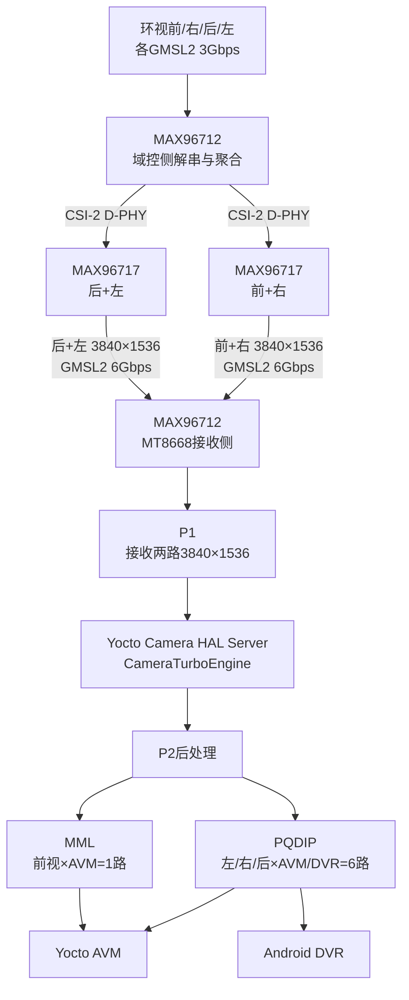
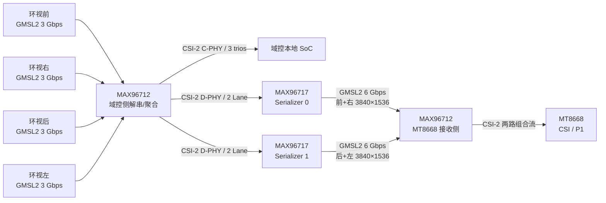
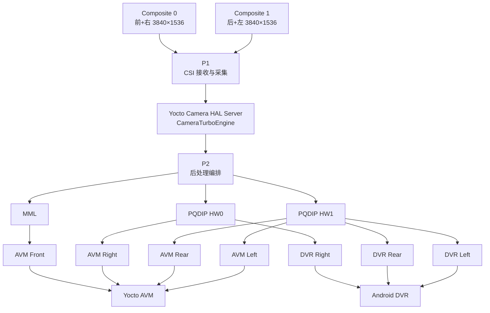
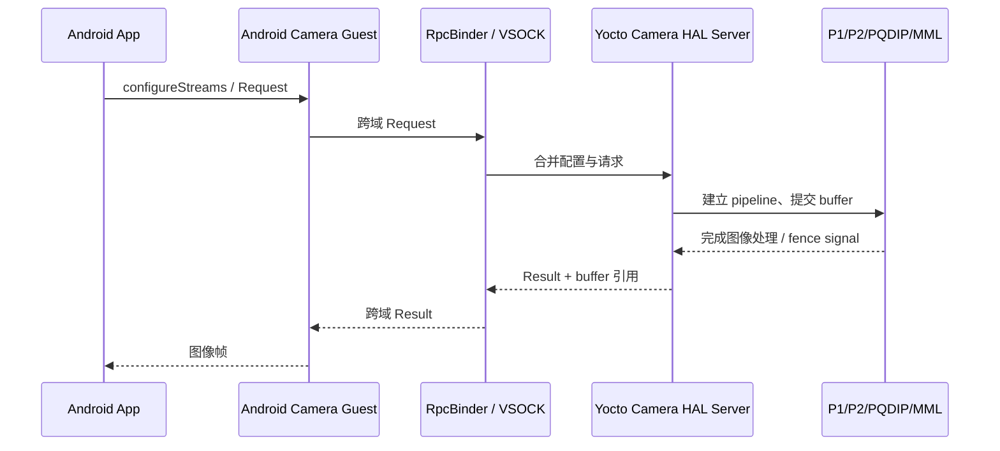

# SRC0001 旧版证据索引.json

来源：架构知识——中文版/evidence/旧版证据索引.json

SHA-256：f86b7497d644be72c84ef1a3ea7adbe0d49a6321871673315eff6e9497f2b815

范围：原材料可查阅；未逐页作项目结论验证

[站内原文与原件](https://qiantao18817568425-art.github.io/Architecture_Learning-/architecture/source-SRC0001.html)

## 全文 1

[
  {
    "id": "sdk-readme",
    "platform": "MT8676",
    "version": "V1.0.166",
    "source_path": "I:\\T29-8678\\软件资料\\MT8676资料\\fibo_sdk_260316\\fibo_sdk_mt8676_20260316_V1.0.166.tar.gz::fibo_sdk_mt8676_20260316_V1.0.166/README.txt",
    "local_path": "../架构资料——原版/mt8676-architecture/sources/sdk/README.txt",
    "sha256": "fbbade4a78dae2689ff6f64020f373fe82c234ec159331a7f79923aeedf09b3b",
    "evidence_class": "primary",
    "allowed_use": "mt8676_fact",
    "notes": "SDK baseline README.",
    "historical_local_path": "docs/mt8676-architecture/sources/sdk/README.txt",
    "current_absolute_path": "E:\\T12T问题分析\\T12T问题分析总结性材料\\T12T资料库\\架构资料——原版\\mt8676-architecture\\sources\\sdk\\README.txt",
    "current_relative_to_library": "../架构资料——原版/mt8676-architecture/sources/sdk/README.txt",
    "current_sha256": "fbbade4a78dae2689ff6f64020f373fe82c234ec159331a7f79923aeedf09b3b",
    "current_hash_matches_manifest": true
  },
  {
    "id": "sdk-mt8676-guide",
    "platform": "MT8676",
    "version": "V1.0.166",
    "source_path": "I:\\T29-8678\\软件资料\\MT8676资料\\fibo_sdk_260316\\fibo_sdk_mt8676_20260316_V1.0.166.tar.gz::fibo_sdk_mt8676_20260316_V1.0.166/document/html/md_md_mt8676_01_Sdk_User_Guide.html",
    "local_path": "../架构资料——原版/mt8676-architecture/sources/sdk/html/md_md_mt8676_01_Sdk_User_Guide.html",
    "sha256": "9038859eb321d883f59c4436d1e96090ec43e38907f3e47d7bcdca116ca6c01c",
    "evidence_class": "primary",
    "allowed_use": "mt8676_fact",
    "notes": "MT8676 SDK user guide; MT8678 pages are excluded.",
    "historical_local_path": "docs/mt8676-architecture/sources/sdk/html/md_md_mt8676_01_Sdk_User_Guide.html",
    "current_absolute_path": "E:\\T12T问题分析\\T12T问题分析总结性材料\\T12T资料库\\架构资料——原版\\mt8676-architecture\\sources\\sdk\\html\\md_md_mt8676_01_Sdk_User_Guide.html",
    "current_relative_to_library": "../架构资料——原版/mt8676-architecture/sources/sdk/html/md_md_mt8676_01_Sdk_User_Guide.html",
    "current_sha256": "9038859eb321d883f59c4436d1e96090ec43e38907f3e47d7bcdca116ca6c01c",
    "current_hash_matches_manifest": true
  },
  {
    "id": "sdk-image-sdk-architecture-diagram-png",
    "platform": "MT8676",
    "version": "V1.0.166",
    "source_path": "I:\\T29-8678\\软件资料\\MT8676资料\\fibo_sdk_260316\\fibo_sdk_mt8676_20260316_V1.0.166.tar.gz::fibo_sdk_mt8676_20260316_V1.0.166/document/html/SDK_architecture_diagram.png",
    "local_path": "../架构资料——原版/mt8676-architecture/assets/sdk/SDK_architecture_diagram.png",
    "sha256": "839244cb7a5cad6890a31cee0f73945fab58efecb9d0e674f63eabb1dc0756a3",
    "evidence_class": "primary",
    "allowed_use": "mt8676_fact",
    "notes": "MT8676 SDK architecture, timing, or sequence image.",
    "historical_local_path": "docs/mt8676-architecture/assets/sdk/SDK_architecture_diagram.png",
    "current_absolute_path": "E:\\T12T问题分析\\T12T问题分析总结性材料\\T12T资料库\\架构资料——原版\\mt8676-architecture\\assets\\sdk\\SDK_architecture_diagram.png",
    "current_relative_to_library": "../架构资料——原版/mt8676-architecture/assets/sdk/SDK_architecture_diagram.png",
    "current_sha256": "839244cb7a5cad6890a31cee0f73945fab58efecb9d0e674f63eabb1dc0756a3",
    "current_hash_matches_manifest": true
  },
  {
    "id": "sdk-image-sdk-structural-diagram-png",
    "platform": "MT8676",
    "version": "V1.0.166",
    "source_path": "I:\\T29-8678\\软件资料\\MT8676资料\\fibo_sdk_260316\\fibo_sdk_mt8676_20260316_V1.0.166.tar.gz::fibo_sdk_mt8676_20260316_V1.0.166/document/html/SDK_structural_diagram.png",
    "local_path": "../架构资料——原版/mt8676-architecture/assets/sdk/SDK_structural_diagram.png",
    "sha256": "d30794ccd698ba8ed058512984d29cbcdbff32a3310f067d5237fcac7e4f7211",
    "evidence_class": "primary",
    "allowed_use": "mt8676_fact",
    "notes": "MT8676 SDK architecture, timing, or sequence image.",
    "historical_local_path": "docs/mt8676-architecture/assets/sdk/SDK_structural_diagram.png",
    "current_absolute_path": "E:\\T12T问题分析\\T12T问题分析总结性材料\\T12T资料库\\架构资料——原版\\mt8676-architecture\\assets\\sdk\\SDK_structural_diagram.png",
    "current_relative_to_library": "../架构资料——原版/mt8676-architecture/assets/sdk/SDK_structural_diagram.png",
    "current_sha256": "d30794ccd698ba8ed058512984d29cbcdbff32a3310f067d5237fcac7e4f7211",
    "current_hash_matches_manifest": true
  },
  {
    "id": "sdk-image-sync-timing-diagram-png",
    "platform": "MT8676",
    "version": "V1.0.166",
    "source_path": "I:\\T29-8678\\软件资料\\MT8676资料\\fibo_sdk_260316\\fibo_sdk_mt8676_20260316_V1.0.166.tar.gz::fibo_sdk_mt8676_20260316_V1.0.166/document/html/sync_timing_diagram.png",
    "local_path": "../架构资料——原版/mt8676-architecture/assets/sdk/sync_timing_diagram.png",
    "sha256": "f96e301695f8dbfd903a64483193ba268ec07c7821c5960ab1a0edbc835f3681",
    "evidence_class": "primary",
    "allowed_use": "mt8676_fact",
    "notes": "MT8676 SDK architecture, timing, or sequence image.",
    "historical_local_path": "docs/mt8676-architecture/assets/sdk/sync_timing_diagram.png",
    "current_absolute_path": "E:\\T12T问题分析\\T12T问题分析总结性材料\\T12T资料库\\架构资料——原版\\mt8676-architecture\\assets\\sdk\\sync_timing_diagram.png",
    "current_relative_to_library": "../架构资料——原版/mt8676-architecture/assets/sdk/sync_timing_diagram.png",
    "current_sha256": "f96e301695f8dbfd903a64483193ba268ec07c7821c5960ab1a0edbc835f3681",
    "current_hash_matches_manifest": true
  },
  {
    "id": "sdk-image-mt8676-abnormal-nw-seq-png",
    "platform": "MT8676",
    "version": "V1.0.166",
    "source_path": "I:\\T29-8678\\软件资料\\MT8676资料\\fibo_sdk_260316\\fibo_sdk_mt8676_20260316_V1.0.166.tar.gz::fibo_sdk_mt8676_20260316_V1.0.166/document/html/mt8676_abnormal_nw_seq.png",
    "local_path": "../架构资料——原版/mt8676-architecture/assets/sdk/mt8676_abnormal_nw_seq.png",
    "sha256": "b917bb5bd72a98898a8feb7836b7b08cce4bf3aca0675f11e32e280724d986f1",
    "evidence_class": "primary",
    "allowed_use": "mt8676_fact",
    "notes": "MT8676 SDK architecture, timing, or sequence image.",
    "historical_local_path": "docs/mt8676-architecture/assets/sdk/mt8676_abnormal_nw_seq.png",
    "current_absolute_path": "E:\\T12T问题分析\\T12T问题分析总结性材料\\T12T资料库\\架构资料——原版\\mt8676-architecture\\assets\\sdk\\mt8676_abnormal_nw_seq.png",
    "current_relative_to_library": "../架构资料——原版/mt8676-architecture/assets/sdk/mt8676_abnormal_nw_seq.png",
    "current_sha256": "b917bb5bd72a98898a8feb7836b7b08cce4bf3aca0675f11e32e280724d986f1",
    "current_hash_matches_manifest": true
  },
  {
    "id": "sdk-image-mtk8676-abnormal-data-sequence-png",
    "platform": "MT8676",
    "version": "V1.0.166",
    "source_path": "I:\\T29-8678\\软件资料\\MT8676资料\\fibo_sdk_260316\\fibo_sdk_mt8676_20260316_V1.0.166.tar.gz::fibo_sdk_mt8676_20260316_V1.0.166/document/html/mtk8676_abnormal_data_sequence.png",
    "local_path": "../架构资料——原版/mt8676-architecture/assets/sdk/mtk8676_abnormal_data_sequence.png",
    "sha256": "d1ad9d283b57628f43d26d05761abf3b545caff4c69900fe1c813dc2a2d5897a",
    "evidence_class": "primary",
    "allowed_use": "mt8676_fact",
    "notes": "MT8676 SDK architecture, timing, or sequence image.",
    "historical_local_path": "docs/mt8676-architecture/assets/sdk/mtk8676_abnormal_data_sequence.png",
    "current_absolute_path": "E:\\T12T问题分析\\T12T问题分析总结性材料\\T12T资料库\\架构资料——原版\\mt8676-architecture\\assets\\sdk\\mtk8676_abnormal_data_sequence.png",
    "current_relative_to_library": "../架构资料——原版/mt8676-architecture/assets/sdk/mtk8676_abnormal_data_sequence.png",
    "current_sha256": "d1ad9d283b57628f43d26d05761abf3b545caff4c69900fe1c813dc2a2d5897a",
    "current_hash_matches_manifest": true
  },
  {
    "id": "sdk-image-mtk8676-abnormal-dm-sequence-png",
    "platform": "MT8676",
    "version": "V1.0.166",
    "source_path": "I:\\T29-8678\\软件资料\\MT8676资料\\fibo_sdk_260316\\fibo_sdk_mt8676_20260316_V1.0.166.tar.gz::fibo_sdk_mt8676_20260316_V1.0.166/document/html/mtk8676_abnormal_dm_sequence.png",
    "local_path": "../架构资料——原版/mt8676-architecture/assets/sdk/mtk8676_abnormal_dm_sequence.png",
    "sha256": "22398298e281a4bc6d7e50d1f09160acda8c5cf54436892dde9585d396cab433",
    "evidence_class": "primary",
    "allowed_use": "mt8676_fact",
    "notes": "MT8676 SDK architecture, timing, or sequence image.",
    "historical_local_path": "docs/mt8676-architecture/assets/sdk/mtk8676_abnormal_dm_sequence.png",
    "current_absolute_path": "E:\\T12T问题分析\\T12T问题分析总结性材料\\T12T资料库\\架构资料——原版\\mt8676-architecture\\assets\\sdk\\mtk8676_abnormal_dm_sequence.png",
    "current_relative_to_library": "../架构资料——原版/mt8676-architecture/assets/sdk/mtk8676_abnormal_dm_sequence.png",
    "current_sha256": "22398298e281a4bc6d7e50d1f09160acda8c5cf54436892dde9585d396cab433",
    "current_hash_matches_manifest": true
  },
  {
    "id": "sdk-image-mtk8676-abnormal-sim-seq-png",
    "platform": "MT8676",
    "version": "V1.0.166",
    "source_path": "I:\\T29-8678\\软件资料\\MT8676资料\\fibo_sdk_260316\\fibo_sdk_mt8676_20260316_V1.0.166.tar.gz::fibo_sdk_mt8676_20260316_V1.0.166/document/html/mtk8676_abnormal_sim_seq.png",
    "local_path": "../架构资料——原版/mt8676-architecture/assets/sdk/mtk8676_abnormal_sim_seq.png",
    "sha256": "323efda895e906530d8c821e2f024de04e8fa13e5c65f44723ca341ebbc1ce3a",
    "evidence_class": "primary",
    "allowed_use": "mt8676_fact",
    "notes": "MT8676 SDK architecture, timing, or sequence image.",
    "historical_local_path": "docs/mt8676-architecture/assets/sdk/mtk8676_abnormal_sim_seq.png",
    "current_absolute_path": "E:\\T12T问题分析\\T12T问题分析总结性材料\\T12T资料库\\架构资料——原版\\mt8676-architecture\\assets\\sdk\\mtk8676_abnormal_sim_seq.png",
    "current_relative_to_library": "../架构资料——原版/mt8676-architecture/assets/sdk/mtk8676_abnormal_sim_seq.png",
    "current_sha256": "323efda895e906530d8c821e2f024de04e8fa13e5c65f44723ca341ebbc1ce3a",
    "current_hash_matches_manifest": true
  },
  {
    "id": "sdk-image-mtk8676-abnormal-sms-seq-png",
    "platform": "MT8676",
    "version": "V1.0.166",
    "source_path": "I:\\T29-8678\\软件资料\\MT8676资料\\fibo_sdk_260316\\fibo_sdk_mt8676_20260316_V1.0.166.tar.gz::fibo_sdk_mt8676_20260316_V1.0.166/document/html/mtk8676_abnormal_sms_seq.png",
    "local_path": "../架构资料——原版/mt8676-architecture/assets/sdk/mtk8676_abnormal_sms_seq.png",
    "sha256": "eed8f09878c31e6f70b70ac0d823fcefc21557456aa2ac92d017a7b713b46888",
    "evidence_class": "primary",
    "allowed_use": "mt8676_fact",
    "notes": "MT8676 SDK architecture, timing, or sequence image.",
    "historical_local_path": "docs/mt8676-architecture/assets/sdk/mtk8676_abnormal_sms_seq.png",
    "current_absolute_path": "E:\\T12T问题分析\\T12T问题分析总结性材料\\T12T资料库\\架构资料——原版\\mt8676-architecture\\assets\\sdk\\mtk8676_abnormal_sms_seq.png",
    "current_relative_to_library": "../架构资料——原版/mt8676-architecture/assets/sdk/mtk8676_abnormal_sms_seq.png",
    "current_sha256": "eed8f09878c31e6f70b70ac0d823fcefc21557456aa2ac92d017a7b713b46888",
    "current_hash_matches_manifest": true
  },
  {
    "id": "sdk-image-mtk8676-abnormal-voice-sequence-png",
    "platform": "MT8676",
    "version": "V1.0.166",
    "source_path": "I:\\T29-8678\\软件资料\\MT8676资料\\fibo_sdk_260316\\fibo_sdk_mt8676_20260316_V1.0.166.tar.gz::fibo_sdk_mt8676_20260316_V1.0.166/document/html/mtk8676_abnormal_voice_sequence.png",
    "local_path": "../架构资料——原版/mt8676-architecture/assets/sdk/mtk8676_abnormal_voice_sequence.png",
    "sha256": "9e4d0a7f5014f331c8c247b32b8685922fe0869c33cd108bc67bfbd7ff9ebdf4",
    "evidence_class": "primary",
    "allowed_use": "mt8676_fact",
    "notes": "MT8676 SDK architecture, timing, or sequence image.",
    "historical_local_path": "docs/mt8676-architecture/assets/sdk/mtk8676_abnormal_voice_sequence.png",
    "current_absolute_path": "E:\\T12T问题分析\\T12T问题分析总结性材料\\T12T资料库\\架构资料——原版\\mt8676-architecture\\assets\\sdk\\mtk8676_abnormal_voice_sequence.png",
    "current_relative_to_library": "../架构资料——原版/mt8676-architecture/assets/sdk/mtk8676_abnormal_voice_sequence.png",
    "current_sha256": "9e4d0a7f5014f331c8c247b32b8685922fe0869c33cd108bc67bfbd7ff9ebdf4",
    "current_hash_matches_manifest": true
  },
  {
    "id": "sdk-image-mtk8676-answer-call-png",
    "platform": "MT8676",
    "version": "V1.0.166",
    "source_path": "I:\\T29-8678\\软件资料\\MT8676资料\\fibo_sdk_260316\\fibo_sdk_mt8676_20260316_V1.0.166.tar.gz::fibo_sdk_mt8676_20260316_V1.0.166/document/html/mtk8676_answer_call.png",
    "local_path": "../架构资料——原版/mt8676-architecture/assets/sdk/mtk8676_answer_call.png",
    "sha256": "cc469072f44241dcc1c2e0479a3aafcb430c610bec2617ad8ab39651760fe001",
    "evidence_class": "primary",
    "allowed_use": "mt8676_fact",
    "notes": "MT8676 SDK architecture, timing, or sequence image.",
    "historical_local_path": "docs/mt8676-architecture/assets/sdk/mtk8676_answer_call.png",
    "current_absolute_path": "E:\\T12T问题分析\\T12T问题分析总结性材料\\T12T资料库\\架构资料——原版\\mt8676-architecture\\assets\\sdk\\mtk8676_answer_call.png",
    "current_relative_to_library": "../架构资料——原版/mt8676-architecture/assets/sdk/mtk8676_answer_call.png",
    "current_sha256": "cc469072f44241dcc1c2e0479a3aafcb430c610bec2617ad8ab39651760fe001",
    "current_hash_matches_manifest": true
  },
  {
    "id": "sdk-image-mtk8676-async-start-call-png",
    "platform": "MT8676",
    "version": "V1.0.166",
    "source_path": "I:\\T29-8678\\软件资料\\MT8676资料\\fibo_sdk_260316\\fibo_sdk_mt8676_20260316_V1.0.166.tar.gz::fibo_sdk_mt8676_20260316_V1.0.166/document/html/mtk8676_async_start_call.png",
    "local_path": "../架构资料——原版/mt8676-architecture/assets/sdk/mtk8676_async_start_call.png",
    "sha256": "0e693782c76e0ccb5724820faa7739467bd694d736f4e338f6690a024d57bc5c",
    "evidence_class": "primary",
    "allowed_use": "mt8676_fact",
    "notes": "MT8676 SDK architecture, timing, or sequence image.",
    "historical_local_path": "docs/mt8676-architecture/assets/sdk/mtk8676_async_start_call.png",
    "current_absolute_path": "E:\\T12T问题分析\\T12T问题分析总结性材料\\T12T资料库\\架构资料——原版\\mt8676-architecture\\assets\\sdk\\mtk8676_async_start_call.png",
    "current_relative_to_library": "../架构资料——原版/mt8676-architecture/assets/sdk/mtk8676_async_start_call.png",
    "current_sha256": "0e693782c76e0ccb5724820faa7739467bd694d736f4e338f6690a024d57bc5c",
    "current_hash_matches_manifest": true
  },
  {
    "id": "sdk-image-mtk8676-async-stop-call-png",
    "platform": "MT8676",
    "version": "V1.0.166",
    "source_path": "I:\\T29-8678\\软件资料\\MT8676资料\\fibo_sdk_260316\\fibo_sdk_mt8676_20260316_V1.0.166.tar.gz::fibo_sdk_mt8676_20260316_V1.0.166/document/html/mtk8676_async_stop_call.png",
    "local_path": "../架构资料——原版/mt8676-architecture/assets/sdk/mtk8676_async_stop_call.png",
    "sha256": "a3be4efa55e91c07f490f1ca33cfc6628c1dd07878112d947793e23370ab4848",
    "evidence_class": "primary",
    "allowed_use": "mt8676_fact",
    "notes": "MT8676 SDK architecture, timing, or sequence image.",
    "historical_local_path": "docs/mt8676-architecture/assets/sdk/mtk8676_async_stop_call.png",
    "current_absolute_path": "E:\\T12T问题分析\\T12T问题分析总结性材料\\T12T资料库\\架构资料——原版\\mt8676-architecture\\assets\\sdk\\mtk8676_async_stop_call.png",
    "current_relative_to_library": "../架构资料——原版/mt8676-architecture/assets/sdk/mtk8676_async_stop_call.png",
    "current_sha256": "a3be4efa55e91c07f490f1ca33cfc6628c1dd07878112d947793e23370ab4848",
    "current_hash_matches_manifest": true
  },
  {
    "id": "sdk-image-mtk8676-data-call-flow-png",
    "platform": "MT8676",
    "version": "V1.0.166",
    "source_path": "I:\\T29-8678\\软件资料\\MT8676资料\\fibo_sdk_260316\\fibo_sdk_mt8676_20260316_V1.0.166.tar.gz::fibo_sdk_mt8676_20260316_V1.0.166/document/html/mtk8676_data_call_flow.png",
    "local_path": "../架构资料——原版/mt8676-architecture/assets/sdk/mtk8676_data_call_flow.png",
    "sha256": "0a5f2a12255b6d768be82992e39a0771707b211e6f2408472b8b3e5230fafe2a",
    "evidence_class": "primary",
    "allowed_use": "mt8676_fact",
    "notes": "MT8676 SDK architecture, timing, or sequence image.",
    "historical_local_path": "docs/mt8676-architecture/assets/sdk/mtk8676_data_call_flow.png",
    "current_absolute_path": "E:\\T12T问题分析\\T12T问题分析总结性材料\\T12T资料库\\架构资料——原版\\mt8676-architecture\\assets\\sdk\\mtk8676_data_call_flow.png",
    "current_relative_to_library": "../架构资料——原版/mt8676-architecture/assets/sdk/mtk8676_data_call_flow.png",
    "current_sha256": "0a5f2a12255b6d768be82992e39a0771707b211e6f2408472b8b3e5230fafe2a",
    "current_hash_matches_manifest": true
  },
  {
    "id": "sdk-image-mtk8676-data-deinit-png",
    "platform": "MT8676",
    "version": "V1.0.166",
    "source_path": "I:\\T29-8678\\软件资料\\MT8676资料\\fibo_sdk_260316\\fibo_sdk_mt8676_20260316_V1.0.166.tar.gz::fibo_sdk_mt8676_20260316_V1.0.166/document/html/mtk8676_data_deinit.png",
    "local_path": "../架构资料——原版/mt8676-architecture/assets/sdk/mtk8676_data_deinit.png",
    "sha256": "788706f56fc5db2f81f06a8bf7e8a2f495c6ec0dbd4807721ddebbfbcdd9f775",
    "evidence_class": "primary",
    "allowed_use": "mt8676_fact",
    "notes": "MT8676 SDK architecture, timing, or sequence image.",
    "historical_local_path": "docs/mt8676-architecture/assets/sdk/mtk8676_data_deinit.png",
    "current_absolute_path": "E:\\T12T问题分析\\T12T问题分析总结性材料\\T12T资料库\\架构资料——原版\\mt8676-architecture\\assets\\sdk\\mtk8676_data_deinit.png",
    "current_relative_to_library": "../架构资料——原版/mt8676-architecture/assets/sdk/mtk8676_data_deinit.png",
    "current_sha256": "788706f56fc5db2f81f06a8bf7e8a2f495c6ec0dbd4807721ddebbfbcdd9f775",
    "current_hash_matches_manifest": true
  },
  {
    "id": "sdk-image-mtk8676-data-init-png",
    "platform": "MT8676",
    "version": "V1.0.166",
    "source_path": "I:\\T29-8678\\软件资料\\MT8676资料\\fibo_sdk_260316\\fibo_sdk_mt8676_20260316_V1.0.166.tar.gz::fibo_sdk_mt8676_20260316_V1.0.166/document/html/mtk8676_data_init.png",
    "local_path": "../架构资料——原版/mt8676-architecture/assets/sdk/mtk8676_data_init.png",
    "sha256": "5fc709908aa60a4c14ae29105f317f68ad0985e1177303b4f120ef54e31fa540",
    "evidence_class": "primary",
    "allowed_use": "mt8676_fact",
    "notes": "MT8676 SDK architecture, timing, or sequence image.",
    "historical_local_path": "docs/mt8676-architecture/assets/sdk/mtk8676_data_init.png",
    "current_absolute_path": "E:\\T12T问题分析\\T12T问题分析总结性材料\\T12T资料库\\架构资料——原版\\mt8676-architecture\\assets\\sdk\\mtk8676_data_init.png",
    "current_relative_to_library": "../架构资料——原版/mt8676-architecture/assets/sdk/mtk8676_data_init.png",
    "current_sha256": "5fc709908aa60a4c14ae29105f317f68ad0985e1177303b4f120ef54e31fa540",
    "current_hash_matches_manifest": true
  },
  {
    "id": "sdk-image-mtk8676-data-sequence-png",
    "platform": "MT8676",
    "version": "V1.0.166",
    "source_path": "I:\\T29-8678\\软件资料\\MT8676资料\\fibo_sdk_260316\\fibo_sdk_mt8676_20260316_V1.0.166.tar.gz::fibo_sdk_mt8676_20260316_V1.0.166/document/html/mtk8676_data_sequence.png",
    "local_path": "../架构资料——原版/mt8676-architecture/assets/sdk/mtk8676_data_sequence.png",
    "sha256": "add970ec319eda083fd650239d0476b0e165bdd711a6a941c234c788d19f1f26",
    "evidence_class": "primary",
    "allowed_use": "mt8676_fact",
    "notes": "MT8676 SDK architecture, timing, or sequence image.",
    "historical_local_path": "docs/mt8676-architecture/assets/sdk/mtk8676_data_sequence.png",
    "current_absolute_path": "E:\\T12T问题分析\\T12T问题分析总结性材料\\T12T资料库\\架构资料——原版\\mt8676-architecture\\assets\\sdk\\mtk8676_data_sequence.png",
    "current_relative_to_library": "../架构资料——原版/mt8676-architecture/assets/sdk/mtk8676_data_sequence.png",
    "current_sha256": "add970ec319eda083fd650239d0476b0e165bdd711a6a941c234c788d19f1f26",
    "current_hash_matches_manifest": true
  },
  {
    "id": "sdk-image-mtk8676-data-set-service-event-cb-png",
    "platform": "MT8676",
    "version": "V1.0.166",
    "source_path": "I:\\T29-8678\\软件资料\\MT8676资料\\fibo_sdk_260316\\fibo_sdk_mt8676_20260316_V1.0.166.tar.gz::fibo_sdk_mt8676_20260316_V1.0.166/document/html/mtk8676_data_set_service_event_cb.png",
    "local_path": "../架构资料——原版/mt8676-architecture/assets/sdk/mtk8676_data_set_service_event_cb.png",
    "sha256": "0c56b984dad83d31ea24e62534088c2b5d3452c716d85f93966f828646ef9148",
    "evidence_class": "primary",
    "allowed_use": "mt8676_fact",
    "notes": "MT8676 SDK architecture, timing, or sequence image.",
    "historical_local_path": "docs/mt8676-architecture/assets/sdk/mtk8676_data_set_service_event_cb.png",
    "current_absolute_path": "E:\\T12T问题分析\\T12T问题分析总结性材料\\T12T资料库\\架构资料——原版\\mt8676-architecture\\assets\\sdk\\mtk8676_data_set_service_event_cb.png",
    "current_relative_to_library": "../架构资料——原版/mt8676-architecture/assets/sdk/mtk8676_data_set_service_event_cb.png",
    "current_sha256": "0c56b984dad83d31ea24e62534088c2b5d3452c716d85f93966f828646ef9148",
    "current_hash_matches_manifest": true
  },
  {
    "id": "sdk-image-mtk8676-datafilter-set-active-png",
    "platform": "MT8676",
    "version": "V1.0.166",
    "source_path": "I:\\T29-8678\\软件资料\\MT8676资料\\fibo_sdk_260316\\fibo_sdk_mt8676_20260316_V1.0.166.tar.gz::fibo_sdk_mt8676_20260316_V1.0.166/document/html/mtk8676_datafilter_set_active.png",
    "local_path": "../架构资料——原版/mt8676-architecture/assets/sdk/mtk8676_datafilter_set_active.png",
    "sha256": "5dfe381fc2afcec5a3c44398638562ed4100883a687a7ee09e2dc345be796277",
    "evidence_class": "primary",
    "allowed_use": "mt8676_fact",
    "notes": "MT8676 SDK architecture, timing, or sequence image.",
    "historical_local_path": "docs/mt8676-architecture/assets/sdk/mtk8676_datafilter_set_active.png",
    "current_absolute_path": "E:\\T12T问题分析\\T12T问题分析总结性材料\\T12T资料库\\架构资料——原版\\mt8676-architecture\\assets\\sdk\\mtk8676_datafilter_set_active.png",
    "current_relative_to_library": "../架构资料——原版/mt8676-architecture/assets/sdk/mtk8676_datafilter_set_active.png",
    "current_sha256": "5dfe381fc2afcec5a3c44398638562ed4100883a687a7ee09e2dc345be796277",
    "current_hash_matches_manifest": true
  },
  {
    "id": "sdk-image-mtk8676-dialing-call1-png",
    "platform": "MT8676",
    "version": "V1.0.166",
    "source_path": "I:\\T29-8678\\软件资料\\MT8676资料\\fibo_sdk_260316\\fibo_sdk_mt8676_20260316_V1.0.166.tar.gz::fibo_sdk_mt8676_20260316_V1.0.166/document/html/mtk8676_dialing_call1.png",
    "local_path": "../架构资料——原版/mt8676-architecture/assets/sdk/mtk8676_dialing_call1.png",
    "sha256": "587bb13c15d29ad402c7f2431e36422a993e75e3ef058a15a25fca5652f1562a",
    "evidence_class": "primary",
    "allowed_use": "mt8676_fact",
    "notes": "MT8676 SDK architecture, timing, or sequence image.",
    "historical_local_path": "docs/mt8676-architecture/assets/sdk/mtk8676_dialing_call1.png",
    "current_absolute_path": "E:\\T12T问题分析\\T12T问题分析总结性材料\\T12T资料库\\架构资料——原版\\mt8676-architecture\\assets\\sdk\\mtk8676_dialing_call1.png",
    "current_relative_to_library": "../架构资料——原版/mt8676-architecture/assets/sdk/mtk8676_dialing_call1.png",
    "current_sha256": "587bb13c15d29ad402c7f2431e36422a993e75e3ef058a15a25fca5652f1562a",
    "current_hash_matches_manifest": true
  },
  {
    "id": "sdk-image-mtk8676-dialing-call2-png",
    "platform": "MT8676",
    "version": "V1.0.166",
    "source_path": "I:\\T29-8678\\软件资料\\MT8676资料\\fibo_sdk_260316\\fibo_sdk_mt8676_20260316_V1.0.166.tar.gz::fibo_sdk_mt8676_20260316_V1.0.166/document/html/mtk8676_dialing_call2.png",
    "local_path": "../架构资料——原版/mt8676-architecture/assets/sdk/mtk8676_dialing_call2.png",
    "sha256": "0b264858b401191fabbc5b84852d5c02dd89658d7e49a12752d46ba71d1340ec",
    "evidence_class": "primary",
    "allowed_use": "mt8676_fact",
    "notes": "MT8676 SDK architecture, timing, or sequence image.",
    "historical_local_path": "docs/mt8676-architecture/assets/sdk/mtk8676_dialing_call2.png",
    "current_absolute_path": "E:\\T12T问题分析\\T12T问题分析总结性材料\\T12T资料库\\架构资料——原版\\mt8676-architecture\\assets\\sdk\\mtk8676_dialing_call2.png",
    "current_relative_to_library": "../架构资料——原版/mt8676-architecture/assets/sdk/mtk8676_dialing_call2.png",
    "current_sha256": "0b264858b401191fabbc5b84852d5c02dd89658d7e49a12752d46ba71d1340ec",
    "current_hash_matches_manifest": true
  },
  {
    "id": "sdk-image-mtk8676-dm-deinitialization-png",
    "platform": "MT8676",
    "version": "V1.0.166",
    "source_path": "I:\\T29-8678\\软件资料\\MT8676资料\\fibo_sdk_260316\\fibo_sdk_mt8676_20260316_V1.0.166.tar.gz::fibo_sdk_mt8676_20260316_V1.0.166/document/html/mtk8676_dm_deinitialization.png",
    "local_path": "../架构资料——原版/mt8676-architecture/assets/sdk/mtk8676_dm_deinitialization.png",
    "sha256": "ac5ff171faf31fd6da0b9415ac173e4b1e71b53d5f41766d9a1c965b29fb2a8a",
    "evidence_class": "primary",
    "allowed_use": "mt8676_fact",
    "notes": "MT8676 SDK architecture, timing, or sequence image.",
    "historical_local_path": "docs/mt8676-architecture/assets/sdk/mtk8676_dm_deinitialization.png",
    "current_absolute_path": "E:\\T12T问题分析\\T12T问题分析总结性材料\\T12T资料库\\架构资料——原版\\mt8676-architecture\\assets\\sdk\\mtk8676_dm_deinitialization.png",
    "current_relative_to_library": "../架构资料——原版/mt8676-architecture/assets/sdk/mtk8676_dm_deinitialization.png",
    "current_sha256": "ac5ff171faf31fd6da0b9415ac173e4b1e71b53d5f41766d9a1c965b29fb2a8a",
    "current_hash_matches_manifest": true
  },
  {
    "id": "sdk-image-mtk8676-dm-get-ap-version-png",
    "platform": "MT8676",
    "version": "V1.0.166",
    "source_path": "I:\\T29-8678\\软件资料\\MT8676资料\\fibo_sdk_260316\\fibo_sdk_mt8676_20260316_V1.0.166.tar.gz::fibo_sdk_mt8676_20260316_V1.0.166/document/html/mtk8676_dm_get_ap_version.png",
    "local_path": "../架构资料——原版/mt8676-architecture/assets/sdk/mtk8676_dm_get_ap_version.png",
    "sha256": "134c0440109ca44cf65e574e6caf679009fa76ddf33462bc5e38e3a6c160c965",
    "evidence_class": "primary",
    "allowed_use": "mt8676_fact",
    "notes": "MT8676 SDK architecture, timing, or sequence image.",
    "historical_local_path": "docs/mt8676-architecture/assets/sdk/mtk8676_dm_get_ap_version.png",
    "current_absolute_path": "E:\\T12T问题分析\\T12T问题分析总结性材料\\T12T资料库\\架构资料——原版\\mt8676-architecture\\assets\\sdk\\mtk8676_dm_get_ap_version.png",
    "current_relative_to_library": "../架构资料——原版/mt8676-architecture/assets/sdk/mtk8676_dm_get_ap_version.png",
    "current_sha256": "134c0440109ca44cf65e574e6caf679009fa76ddf33462bc5e38e3a6c160c965",
    "current_hash_matches_manifest": true
  },
  {
    "id": "sdk-image-mtk8676-dm-get-imei-png",
    "platform": "MT8676",
    "version": "V1.0.166",
    "source_path": "I:\\T29-8678\\软件资料\\MT8676资料\\fibo_sdk_260316\\fibo_sdk_mt8676_20260316_V1.0.166.tar.gz::fibo_sdk_mt8676_20260316_V1.0.166/document/html/mtk8676_dm_get_imei.png",
    "local_path": "../架构资料——原版/mt8676-architecture/assets/sdk/mtk8676_dm_get_imei.png",
    "sha256": "81d8f17e5e4856fa3c2872cf2d0c912072fe6abd65d9e4ba7234f75ca42e6e28",
    "evidence_class": "primary",
    "allowed_use": "mt8676_fact",
    "notes": "MT8676 SDK architecture, timing, or sequence image.",
    "historical_local_path": "docs/mt8676-architecture/assets/sdk/mtk8676_dm_get_imei.png",
    "current_absolute_path": "E:\\T12T问题分析\\T12T问题分析总结性材料\\T12T资料库\\架构资料——原版\\mt8676-architecture\\assets\\sdk\\mtk8676_dm_get_imei.png",
    "current_relative_to_library": "../架构资料——原版/mt8676-architecture/assets/sdk/mtk8676_dm_get_imei.png",
    "current_sha256": "81d8f17e5e4856fa3c2872cf2d0c912072fe6abd65d9e4ba7234f75ca42e6e28",
    "current_hash_matches_manifest": true
  },
  {
    "id": "sdk-image-mtk8676-dm-get-modem-version-png",
    "platform": "MT8676",
    "version": "V1.0.166",
    "source_path": "I:\\T29-8678\\软件资料\\MT8676资料\\fibo_sdk_260316\\fibo_sdk_mt8676_20260316_V1.0.166.tar.gz::fibo_sdk_mt8676_20260316_V1.0.166/document/html/mtk8676_dm_get_modem_version.png",
    "local_path": "../架构资料——原版/mt8676-architecture/assets/sdk/mtk8676_dm_get_modem_version.png",
    "sha256": "04f7faca8667d516867118bf9bf71a21a16c9c18d2f094638402c2bd5e247bf8",
    "evidence_class": "primary",
    "allowed_use": "mt8676_fact",
    "notes": "MT8676 SDK architecture, timing, or sequence image.",
    "historical_local_path": "docs/mt8676-architecture/assets/sdk/mtk8676_dm_get_modem_version.png",
    "current_absolute_path": "E:\\T12T问题分析\\T12T问题分析总结性材料\\T12T资料库\\架构资料——原版\\mt8676-architecture\\assets\\sdk\\mtk8676_dm_get_modem_version.png",
    "current_relative_to_library": "../架构资料——原版/mt8676-architecture/assets/sdk/mtk8676_dm_get_modem_version.png",
    "current_sha256": "04f7faca8667d516867118bf9bf71a21a16c9c18d2f094638402c2bd5e247bf8",
    "current_hash_matches_manifest": true
  },
  {
    "id": "sdk-image-mtk8676-dm-get-sdk-version-png",
    "platform": "MT8676",
    "version": "V1.0.166",
    "source_path": "I:\\T29-8678\\软件资料\\MT8676资料\\fibo_sdk_260316\\fibo_sdk_mt8676_20260316_V1.0.166.tar.gz::fibo_sdk_mt8676_20260316_V1.0.166/document/html/mtk8676_dm_get_sdk_version.png",
    "local_path": "../架构资料——原版/mt8676-architecture/assets/sdk/mtk8676_dm_get_sdk_version.png",
    "sha256": "1d208cce282ad1d3bc6bb08830c0663f5c2952c59910fbb0fa8ca13cfe6440af",
    "evidence_class": "primary",
    "allowed_use": "mt8676_fact",
    "notes": "MT8676 SDK architecture, timing, or sequence image.",
    "historical_local_path": "docs/mt8676-architecture/assets/sdk/mtk8676_dm_get_sdk_version.png",
    "current_absolute_path": "E:\\T12T问题分析\\T12T问题分析总结性材料\\T12T资料库\\架构资料——原版\\mt8676-architecture\\assets\\sdk\\mtk8676_dm_get_sdk_version.png",
    "current_relative_to_library": "../架构资料——原版/mt8676-architecture/assets/sdk/mtk8676_dm_get_sdk_version.png",
    "current_sha256": "1d208cce282ad1d3bc6bb08830c0663f5c2952c59910fbb0fa8ca13cfe6440af",
    "current_hash_matches_manifest": true
  },
  {
    "id": "sdk-image-mtk8676-dm-get-sn-png",
    "platform": "MT8676",
    "version": "V1.0.166",
    "source_path": "I:\\T29-8678\\软件资料\\MT8676资料\\fibo_sdk_260316\\fibo_sdk_mt8676_20260316_V1.0.166.tar.gz::fibo_sdk_mt8676_20260316_V1.0.166/document/html/mtk8676_dm_get_sn.png",
    "local_path": "../架构资料——原版/mt8676-architecture/assets/sdk/mtk8676_dm_get_sn.png",
    "sha256": "6dacc30e7278cd18b8d52c758cd7b1348743ff924a243f97d7069d76a5d1c686",
    "evidence_class": "primary",
    "allowed_use": "mt8676_fact",
    "notes": "MT8676 SDK architecture, timing, or sequence image.",
    "historical_local_path": "docs/mt8676-architecture/assets/sdk/mtk8676_dm_get_sn.png",
    "current_absolute_path": "E:\\T12T问题分析\\T12T问题分析总结性材料\\T12T资料库\\架构资料——原版\\mt8676-architecture\\assets\\sdk\\mtk8676_dm_get_sn.png",
    "current_relative_to_library": "../架构资料——原版/mt8676-architecture/assets/sdk/mtk8676_dm_get_sn.png",
    "current_sha256": "6dacc30e7278cd18b8d52c758cd7b1348743ff924a243f97d7069d76a5d1c686",
    "current_hash_matches_manifest": true
  },
  {
    "id": "sdk-image-mtk8676-dm-initialization-png",
    "platform": "MT8676",
    "version": "V1.0.166",
    "source_path": "I:\\T29-8678\\软件资料\\MT8676资料\\fibo_sdk_260316\\fibo_sdk_mt8676_20260316_V1.0.166.tar.gz::fibo_sdk_mt8676_20260316_V1.0.166/document/html/mtk8676_dm_initialization.png",
    "local_path": "../架构资料——原版/mt8676-architecture/assets/sdk/mtk8676_dm_initialization.png",
    "sha256": "c76e55a3b4f95a1faea582f66450804651f2c2b9fe69fcf95bead50aa3b004d9",
    "evidence_class": "primary",
    "allowed_use": "mt8676_fact",
    "notes": "MT8676 SDK architecture, timing, or sequence image.",
    "historical_local_path": "docs/mt8676-architecture/assets/sdk/mtk8676_dm_initialization.png",
    "current_absolute_path": "E:\\T12T问题分析\\T12T问题分析总结性材料\\T12T资料库\\架构资料——原版\\mt8676-architecture\\assets\\sdk\\mtk8676_dm_initialization.png",
    "current_relative_to_library": "../架构资料——原版/mt8676-architecture/assets/sdk/mtk8676_dm_initialization.png",
    "current_sha256": "c76e55a3b4f95a1faea582f66450804651f2c2b9fe69fcf95bead50aa3b004d9",
    "current_hash_matches_manifest": true
  },
  {
    "id": "sdk-image-mtk8676-dm-sequence-png",
    "platform": "MT8676",
    "version": "V1.0.166",
    "source_path": "I:\\T29-8678\\软件资料\\MT8676资料\\fibo_sdk_260316\\fibo_sdk_mt8676_20260316_V1.0.166.tar.gz::fibo_sdk_mt8676_20260316_V1.0.166/document/html/mtk8676_dm_sequence.png",
    "local_path": "../架构资料——原版/mt8676-architecture/assets/sdk/mtk8676_dm_sequence.png",
    "sha256": "9e35c42c54face2a9a7603f011f86da54f4f2e6e44ea2b8d817e6fe4cfc7a804",
    "evidence_class": "primary",
    "allowed_use": "mt8676_fact",
    "notes": "MT8676 SDK architecture, timing, or sequence image.",
    "historical_local_path": "docs/mt8676-architecture/assets/sdk/mtk8676_dm_sequence.png",
    "current_absolute_path": "E:\\T12T问题分析\\T12T问题分析总结性材料\\T12T资料库\\架构资料——原版\\mt8676-architecture\\assets\\sdk\\mtk8676_dm_sequence.png",
    "current_relative_to_library": "../架构资料——原版/mt8676-architecture/assets/sdk/mtk8676_dm_sequence.png",
    "current_sha256": "9e35c42c54face2a9a7603f011f86da54f4f2e6e44ea2b8d817e6fe4cfc7a804",
    "current_hash_matches_manifest": true
  },
  {
    "id": "sdk-image-mtk8676-dm-set-get-ims-png",
    "platform": "MT8676",
    "version": "V1.0.166",
    "source_path": "I:\\T29-8678\\软件资料\\MT8676资料\\fibo_sdk_260316\\fibo_sdk_mt8676_20260316_V1.0.166.tar.gz::fibo_sdk_mt8676_20260316_V1.0.166/document/html/mtk8676_dm_set_get_ims.png",
    "local_path": "../架构资料——原版/mt8676-architecture/assets/sdk/mtk8676_dm_set_get_ims.png",
    "sha256": "a1419b27b8bf6ab86e27001124620d99e2c0f81cbd8dcecd779214df5ea877dd",
    "evidence_class": "primary",
    "allowed_use": "mt8676_fact",
    "notes": "MT8676 SDK architecture, timing, or sequence image.",
    "historical_local_path": "docs/mt8676-architecture/assets/sdk/mtk8676_dm_set_get_ims.png",
    "current_absolute_path": "E:\\T12T问题分析\\T12T问题分析总结性材料\\T12T资料库\\架构资料——原版\\mt8676-architecture\\assets\\sdk\\mtk8676_dm_set_get_ims.png",
    "current_relative_to_library": "../架构资料——原版/mt8676-architecture/assets/sdk/mtk8676_dm_set_get_ims.png",
    "current_sha256": "a1419b27b8bf6ab86e27001124620d99e2c0f81cbd8dcecd779214df5ea877dd",
    "current_hash_matches_manifest": true
  },
  {
    "id": "sdk-image-mtk8676-dm-set-operating-mode-png",
    "platform": "MT8676",
    "version": "V1.0.166",
    "source_path": "I:\\T29-8678\\软件资料\\MT8676资料\\fibo_sdk_260316\\fibo_sdk_mt8676_20260316_V1.0.166.tar.gz::fibo_sdk_mt8676_20260316_V1.0.166/document/html/mtk8676_dm_set_operating_mode.png",
    "local_path": "../架构资料——原版/mt8676-architecture/assets/sdk/mtk8676_dm_set_operating_mode.png",
    "sha256": "9376b522f32403c4629303a0199eda7fd1b8e9cafc3847447681fd01b4e455a4",
    "evidence_class": "primary",
    "allowed_use": "mt8676_fact",
    "notes": "MT8676 SDK architecture, timing, or sequence image.",
    "historical_local_path": "docs/mt8676-architecture/assets/sdk/mtk8676_dm_set_operating_mode.png",
    "current_absolute_path": "E:\\T12T问题分析\\T12T问题分析总结性材料\\T12T资料库\\架构资料——原版\\mt8676-architecture\\assets\\sdk\\mtk8676_dm_set_operating_mode.png",
    "current_relative_to_library": "../架构资料——原版/mt8676-architecture/assets/sdk/mtk8676_dm_set_operating_mode.png",
    "current_sha256": "9376b522f32403c4629303a0199eda7fd1b8e9cafc3847447681fd01b4e455a4",
    "current_hash_matches_manifest": true
  },
  {
    "id": "sdk-image-mtk8676-dm-set-service-event-cb-png",
    "platform": "MT8676",
    "version": "V1.0.166",
    "source_path": "I:\\T29-8678\\软件资料\\MT8676资料\\fibo_sdk_260316\\fibo_sdk_mt8676_20260316_V1.0.166.tar.gz::fibo_sdk_mt8676_20260316_V1.0.166/document/html/mtk8676_dm_set_service_event_cb.png",
    "local_path": "../架构资料——原版/mt8676-architecture/assets/sdk/mtk8676_dm_set_service_event_cb.png",
    "sha256": "16ab557038cb01ce81acd6f9a3293a8effa8e166a4e810e03441086a91e585c4",
    "evidence_class": "primary",
    "allowed_use": "mt8676_fact",
    "notes": "MT8676 SDK architecture, timing, or sequence image.",
    "historical_local_path": "docs/mt8676-architecture/assets/sdk/mtk8676_dm_set_service_event_cb.png",
    "current_absolute_path": "E:\\T12T问题分析\\T12T问题分析总结性材料\\T12T资料库\\架构资料——原版\\mt8676-architecture\\assets\\sdk\\mtk8676_dm_set_service_event_cb.png",
    "current_relative_to_library": "../架构资料——原版/mt8676-architecture/assets/sdk/mtk8676_dm_set_service_event_cb.png",
    "current_sha256": "16ab557038cb01ce81acd6f9a3293a8effa8e166a4e810e03441086a91e585c4",
    "current_hash_matches_manifest": true
  },
  {
    "id": "sdk-image-mtk8676-end-call1-png",
    "platform": "MT8676",
    "version": "V1.0.166",
    "source_path": "I:\\T29-8678\\软件资料\\MT8676资料\\fibo_sdk_260316\\fibo_sdk_mt8676_20260316_V1.0.166.tar.gz::fibo_sdk_mt8676_20260316_V1.0.166/document/html/mtk8676_end_call1.png",
    "local_path": "../架构资料——原版/mt8676-architecture/assets/sdk/mtk8676_end_call1.png",
    "sha256": "374dbe29b56676e6a6b41f03dd20ec3cd5a4453619407039b8425f9f2e29cf55",
    "evidence_class": "primary",
    "allowed_use": "mt8676_fact",
    "notes": "MT8676 SDK architecture, timing, or sequence image.",
    "historical_local_path": "docs/mt8676-architecture/assets/sdk/mtk8676_end_call1.png",
    "current_absolute_path": "E:\\T12T问题分析\\T12T问题分析总结性材料\\T12T资料库\\架构资料——原版\\mt8676-architecture\\assets\\sdk\\mtk8676_end_call1.png",
    "current_relative_to_library": "../架构资料——原版/mt8676-architecture/assets/sdk/mtk8676_end_call1.png",
    "current_sha256": "374dbe29b56676e6a6b41f03dd20ec3cd5a4453619407039b8425f9f2e29cf55",
    "current_hash_matches_manifest": true
  },
  {
    "id": "sdk-image-mtk8676-imu-sequence-png",
    "platform": "MT8676",
    "version": "V1.0.166",
    "source_path": "I:\\T29-8678\\软件资料\\MT8676资料\\fibo_sdk_260316\\fibo_sdk_mt8676_20260316_V1.0.166.tar.gz::fibo_sdk_mt8676_20260316_V1.0.166/document/html/mtk8676_imu_sequence.png",
    "local_path": "../架构资料——原版/mt8676-architecture/assets/sdk/mtk8676_imu_sequence.png",
    "sha256": "7952ea13bc1145805136c721237ebd08248ed8c6a429b75b1caf50f7af8862c1",
    "evidence_class": "primary",
    "allowed_use": "mt8676_fact",
    "notes": "MT8676 SDK architecture, timing, or sequence image.",
    "historical_local_path": "docs/mt8676-architecture/assets/sdk/mtk8676_imu_sequence.png",
    "current_absolute_path": "E:\\T12T问题分析\\T12T问题分析总结性材料\\T12T资料库\\架构资料——原版\\mt8676-architecture\\assets\\sdk\\mtk8676_imu_sequence.png",
    "current_relative_to_library": "../架构资料——原版/mt8676-architecture/assets/sdk/mtk8676_imu_sequence.png",
    "current_sha256": "7952ea13bc1145805136c721237ebd08248ed8c6a429b75b1caf50f7af8862c1",
    "current_hash_matches_manifest": true
  },
  {
    "id": "sdk-image-mtk8676-imu-start-png",
    "platform": "MT8676",
    "version": "V1.0.166",
    "source_path": "I:\\T29-8678\\软件资料\\MT8676资料\\fibo_sdk_260316\\fibo_sdk_mt8676_20260316_V1.0.166.tar.gz::fibo_sdk_mt8676_20260316_V1.0.166/document/html/mtk8676_imu_start.png",
    "local_path": "../架构资料——原版/mt8676-architecture/assets/sdk/mtk8676_imu_start.png",
    "sha256": "55af9ddbe035a66e3131369051606036893198b8e177197457c61d32326ea73a",
    "evidence_class": "primary",
    "allowed_use": "mt8676_fact",
    "notes": "MT8676 SDK architecture, timing, or sequence image.",
    "historical_local_path": "docs/mt8676-architecture/assets/sdk/mtk8676_imu_start.png",
    "current_absolute_path": "E:\\T12T问题分析\\T12T问题分析总结性材料\\T12T资料库\\架构资料——原版\\mt8676-architecture\\assets\\sdk\\mtk8676_imu_start.png",
    "current_relative_to_library": "../架构资料——原版/mt8676-architecture/assets/sdk/mtk8676_imu_start.png",
    "current_sha256": "55af9ddbe035a66e3131369051606036893198b8e177197457c61d32326ea73a",
    "current_hash_matches_manifest": true
  },
  {
    "id": "sdk-image-mtk8676-imu-stop-png",
    "platform": "MT8676",
    "version": "V1.0.166",
    "source_path": "I:\\T29-8678\\软件资料\\MT8676资料\\fibo_sdk_260316\\fibo_sdk_mt8676_20260316_V1.0.166.tar.gz::fibo_sdk_mt8676_20260316_V1.0.166/document/html/mtk8676_imu_stop.png",
    "local_path": "../架构资料——原版/mt8676-architecture/assets/sdk/mtk8676_imu_stop.png",
    "sha256": "b36d92d813e06c7a4f25a740add7020de1a16d3b9617a90a4faf97fc84c5fdd6",
    "evidence_class": "primary",
    "allowed_use": "mt8676_fact",
    "notes": "MT8676 SDK architecture, timing, or sequence image.",
    "historical_local_path": "docs/mt8676-architecture/assets/sdk/mtk8676_imu_stop.png",
    "current_absolute_path": "E:\\T12T问题分析\\T12T问题分析总结性材料\\T12T资料库\\架构资料——原版\\mt8676-architecture\\assets\\sdk\\mtk8676_imu_stop.png",
    "current_relative_to_library": "../架构资料——原版/mt8676-architecture/assets/sdk/mtk8676_imu_stop.png",
    "current_sha256": "b36d92d813e06c7a4f25a740add7020de1a16d3b9617a90a4faf97fc84c5fdd6",
    "current_hash_matches_manifest": true
  },
  {
    "id": "sdk-image-mtk8676-location-client-deinit-png",
    "platform": "MT8676",
    "version": "V1.0.166",
    "source_path": "I:\\T29-8678\\软件资料\\MT8676资料\\fibo_sdk_260316\\fibo_sdk_mt8676_20260316_V1.0.166.tar.gz::fibo_sdk_mt8676_20260316_V1.0.166/document/html/mtk8676_location_client_deinit.PNG",
    "local_path": "../架构资料——原版/mt8676-architecture/assets/sdk/mtk8676_location_client_deinit.PNG",
    "sha256": "e34b12055ec3a6b3dc1ce977b9d1c3fd666c7d0d9bf833ca6b27d041b72ce556",
    "evidence_class": "primary",
    "allowed_use": "mt8676_fact",
    "notes": "MT8676 SDK architecture, timing, or sequence image.",
    "historical_local_path": "docs/mt8676-architecture/assets/sdk/mtk8676_location_client_deinit.PNG",
    "current_absolute_path": "E:\\T12T问题分析\\T12T问题分析总结性材料\\T12T资料库\\架构资料——原版\\mt8676-architecture\\assets\\sdk\\mtk8676_location_client_deinit.PNG",
    "current_relative_to_library": "../架构资料——原版/mt8676-architecture/assets/sdk/mtk8676_location_client_deinit.PNG",
    "current_sha256": "e34b12055ec3a6b3dc1ce977b9d1c3fd666c7d0d9bf833ca6b27d041b72ce556",
    "current_hash_matches_manifest": true
  },
  {
    "id": "sdk-image-mtk8676-location-delete-aiding-data-png",
    "platform": "MT8676",
    "version": "V1.0.166",
    "source_path": "I:\\T29-8678\\软件资料\\MT8676资料\\fibo_sdk_260316\\fibo_sdk_mt8676_20260316_V1.0.166.tar.gz::fibo_sdk_mt8676_20260316_V1.0.166/document/html/mtk8676_location_delete_aiding_data.PNG",
    "local_path": "../架构资料——原版/mt8676-architecture/assets/sdk/mtk8676_location_delete_aiding_data.PNG",
    "sha256": "e63de54c6ee733b65ebc913530fc51202e12caf83d541bc275e2175a4243515f",
    "evidence_class": "primary",
    "allowed_use": "mt8676_fact",
    "notes": "MT8676 SDK architecture, timing, or sequence image.",
    "historical_local_path": "docs/mt8676-architecture/assets/sdk/mtk8676_location_delete_aiding_data.PNG",
    "current_absolute_path": "E:\\T12T问题分析\\T12T问题分析总结性材料\\T12T资料库\\架构资料——原版\\mt8676-architecture\\assets\\sdk\\mtk8676_location_delete_aiding_data.PNG",
    "current_relative_to_library": "../架构资料——原版/mt8676-architecture/assets/sdk/mtk8676_location_delete_aiding_data.PNG",
    "current_sha256": "e63de54c6ee733b65ebc913530fc51202e12caf83d541bc275e2175a4243515f",
    "current_hash_matches_manifest": true
  },
  {
    "id": "sdk-image-mtk8676-location-get-location-source-png",
    "platform": "MT8676",
    "version": "V1.0.166",
    "source_path": "I:\\T29-8678\\软件资料\\MT8676资料\\fibo_sdk_260316\\fibo_sdk_mt8676_20260316_V1.0.166.tar.gz::fibo_sdk_mt8676_20260316_V1.0.166/document/html/mtk8676_location_get_location_source.PNG",
    "local_path": "../架构资料——原版/mt8676-architecture/assets/sdk/mtk8676_location_get_location_source.PNG",
    "sha256": "23ed4f69f63ad87ca6e8225d170f45439f39268d61ef03b5f9c3f838127de444",
    "evidence_class": "primary",
    "allowed_use": "mt8676_fact",
    "notes": "MT8676 SDK architecture, timing, or sequence image.",
    "historical_local_path": "docs/mt8676-architecture/assets/sdk/mtk8676_location_get_location_source.PNG",
    "current_absolute_path": "E:\\T12T问题分析\\T12T问题分析总结性材料\\T12T资料库\\架构资料——原版\\mt8676-architecture\\assets\\sdk\\mtk8676_location_get_location_source.PNG",
    "current_relative_to_library": "../架构资料——原版/mt8676-architecture/assets/sdk/mtk8676_location_get_location_source.PNG",
    "current_sha256": "23ed4f69f63ad87ca6e8225d170f45439f39268d61ef03b5f9c3f838127de444",
    "current_hash_matches_manifest": true
  },
  {
    "id": "sdk-image-mtk8676-location-nmea-rmc-png",
    "platform": "MT8676",
    "version": "V1.0.166",
    "source_path": "I:\\T29-8678\\软件资料\\MT8676资料\\fibo_sdk_260316\\fibo_sdk_mt8676_20260316_V1.0.166.tar.gz::fibo_sdk_mt8676_20260316_V1.0.166/document/html/mtk8676_location_nmea_rmc.PNG",
    "local_path": "../架构资料——原版/mt8676-architecture/assets/sdk/mtk8676_location_nmea_rmc.PNG",
    "sha256": "248c817207fae8eaa54a8c5f42163aa4e90ffd833c882c9cc60135beff34e7c9",
    "evidence_class": "primary",
    "allowed_use": "mt8676_fact",
    "notes": "MT8676 SDK architecture, timing, or sequence image.",
    "historical_local_path": "docs/mt8676-architecture/assets/sdk/mtk8676_location_nmea_rmc.PNG",
    "current_absolute_path": "E:\\T12T问题分析\\T12T问题分析总结性材料\\T12T资料库\\架构资料——原版\\mt8676-architecture\\assets\\sdk\\mtk8676_location_nmea_rmc.PNG",
    "current_relative_to_library": "../架构资料——原版/mt8676-architecture/assets/sdk/mtk8676_location_nmea_rmc.PNG",
    "current_sha256": "248c817207fae8eaa54a8c5f42163aa4e90ffd833c882c9cc60135beff34e7c9",
    "current_hash_matches_manifest": true
  },
  {
    "id": "sdk-image-mtk8676-location-sequence-png",
    "platform": "MT8676",
    "version": "V1.0.166",
    "source_path": "I:\\T29-8678\\软件资料\\MT8676资料\\fibo_sdk_260316\\fibo_sdk_mt8676_20260316_V1.0.166.tar.gz::fibo_sdk_mt8676_20260316_V1.0.166/document/html/mtk8676_location_sequence.png",
    "local_path": "../架构资料——原版/mt8676-architecture/assets/sdk/mtk8676_location_sequence.png",
    "sha256": "c44ecb16861535209be6ff43a9bac5f109ec4c2ef0afe29d892fb481527b4050",
    "evidence_class": "primary",
    "allowed_use": "mt8676_fact",
    "notes": "MT8676 SDK architecture, timing, or sequence image.",
    "historical_local_path": "docs/mt8676-architecture/assets/sdk/mtk8676_location_sequence.png",
    "current_absolute_path": "E:\\T12T问题分析\\T12T问题分析总结性材料\\T12T资料库\\架构资料——原版\\mt8676-architecture\\assets\\sdk\\mtk8676_location_sequence.png",
    "current_relative_to_library": "../架构资料——原版/mt8676-architecture/assets/sdk/mtk8676_location_sequence.png",
    "current_sha256": "c44ecb16861535209be6ff43a9bac5f109ec4c2ef0afe29d892fb481527b4050",
    "current_hash_matches_manifest": true
  },
  {
    "id": "sdk-image-mtk8676-location-set-epo-status-png",
    "platform": "MT8676",
    "version": "V1.0.166",
    "source_path": "I:\\T29-8678\\软件资料\\MT8676资料\\fibo_sdk_260316\\fibo_sdk_mt8676_20260316_V1.0.166.tar.gz::fibo_sdk_mt8676_20260316_V1.0.166/document/html/mtk8676_location_set_epo_status.PNG",
    "local_path": "../架构资料——原版/mt8676-architecture/assets/sdk/mtk8676_location_set_epo_status.PNG",
    "sha256": "cbf5f6c0216298aab92228e0d26201e4eac216d12d6941acf8401d211350f404",
    "evidence_class": "primary",
    "allowed_use": "mt8676_fact",
    "notes": "MT8676 SDK architecture, timing, or sequence image.",
    "historical_local_path": "docs/mt8676-architecture/assets/sdk/mtk8676_location_set_epo_status.PNG",
    "current_absolute_path": "E:\\T12T问题分析\\T12T问题分析总结性材料\\T12T资料库\\架构资料——原版\\mt8676-architecture\\assets\\sdk\\mtk8676_location_set_epo_status.PNG",
    "current_relative_to_library": "../架构资料——原版/mt8676-architecture/assets/sdk/mtk8676_location_set_epo_status.PNG",
    "current_sha256": "cbf5f6c0216298aab92228e0d26201e4eac216d12d6941acf8401d211350f404",
    "current_hash_matches_manifest": true
  },
  {
    "id": "sdk-image-mtk8676-location-set-gps-frequency-png",
    "platform": "MT8676",
    "version": "V1.0.166",
    "source_path": "I:\\T29-8678\\软件资料\\MT8676资料\\fibo_sdk_260316\\fibo_sdk_mt8676_20260316_V1.0.166.tar.gz::fibo_sdk_mt8676_20260316_V1.0.166/document/html/mtk8676_location_set_gps_frequency.PNG",
    "local_path": "../架构资料——原版/mt8676-architecture/assets/sdk/mtk8676_location_set_gps_frequency.PNG",
    "sha256": "77fb1008617f20c1917941595668d36e3b4e4f6448267fcdf2b642f57a623d78",
    "evidence_class": "primary",
    "allowed_use": "mt8676_fact",
    "notes": "MT8676 SDK architecture, timing, or sequence image.",
    "historical_local_path": "docs/mt8676-architecture/assets/sdk/mtk8676_location_set_gps_frequency.PNG",
    "current_absolute_path": "E:\\T12T问题分析\\T12T问题分析总结性材料\\T12T资料库\\架构资料——原版\\mt8676-architecture\\assets\\sdk\\mtk8676_location_set_gps_frequency.PNG",
    "current_relative_to_library": "../架构资料——原版/mt8676-architecture/assets/sdk/mtk8676_location_set_gps_frequency.PNG",
    "current_sha256": "77fb1008617f20c1917941595668d36e3b4e4f6448267fcdf2b642f57a623d78",
    "current_hash_matches_manifest": true
  },
  {
    "id": "sdk-image-mtk8676-location-set-location-source-png",
    "platform": "MT8676",
    "version": "V1.0.166",
    "source_path": "I:\\T29-8678\\软件资料\\MT8676资料\\fibo_sdk_260316\\fibo_sdk_mt8676_20260316_V1.0.166.tar.gz::fibo_sdk_mt8676_20260316_V1.0.166/document/html/mtk8676_location_set_location_source.PNG",
    "local_path": "../架构资料——原版/mt8676-architecture/assets/sdk/mtk8676_location_set_location_source.PNG",
    "sha256": "abc04bcc354ef3823cb9f1eecf2722cb5ca3543da1c98f40018864fca61aa8ee",
    "evidence_class": "primary",
    "allowed_use": "mt8676_fact",
    "notes": "MT8676 SDK architecture, timing, or sequence image.",
    "historical_local_path": "docs/mt8676-architecture/assets/sdk/mtk8676_location_set_location_source.PNG",
    "current_absolute_path": "E:\\T12T问题分析\\T12T问题分析总结性材料\\T12T资料库\\架构资料——原版\\mt8676-architecture\\assets\\sdk\\mtk8676_location_set_location_source.PNG",
    "current_relative_to_library": "../架构资料——原版/mt8676-architecture/assets/sdk/mtk8676_location_set_location_source.PNG",
    "current_sha256": "abc04bcc354ef3823cb9f1eecf2722cb5ca3543da1c98f40018864fca61aa8ee",
    "current_hash_matches_manifest": true
  },
  {
    "id": "sdk-image-mtk8676-location-set-nmea-ind-mask-png",
    "platform": "MT8676",
    "version": "V1.0.166",
    "source_path": "I:\\T29-8678\\软件资料\\MT8676资料\\fibo_sdk_260316\\fibo_sdk_mt8676_20260316_V1.0.166.tar.gz::fibo_sdk_mt8676_20260316_V1.0.166/document/html/mtk8676_location_set_nmea_ind_mask.PNG",
    "local_path": "../架构资料——原版/mt8676-architecture/assets/sdk/mtk8676_location_set_nmea_ind_mask.PNG",
    "sha256": "ff6c5009b5c954c9db2ba026eedbf4ba4c59e1775ed957e5ba724497102ee1cb",
    "evidence_class": "primary",
    "allowed_use": "mt8676_fact",
    "notes": "MT8676 SDK architecture, timing, or sequence image.",
    "historical_local_path": "docs/mt8676-architecture/assets/sdk/mtk8676_location_set_nmea_ind_mask.PNG",
    "current_absolute_path": "E:\\T12T问题分析\\T12T问题分析总结性材料\\T12T资料库\\架构资料——原版\\mt8676-architecture\\assets\\sdk\\mtk8676_location_set_nmea_ind_mask.PNG",
    "current_relative_to_library": "../架构资料——原版/mt8676-architecture/assets/sdk/mtk8676_location_set_nmea_ind_mask.PNG",
    "current_sha256": "ff6c5009b5c954c9db2ba026eedbf4ba4c59e1775ed957e5ba724497102ee1cb",
    "current_hash_matches_manifest": true
  },
  {
    "id": "sdk-image-mtk8676-location-start-png",
    "platform": "MT8676",
    "version": "V1.0.166",
    "source_path": "I:\\T29-8678\\软件资料\\MT8676资料\\fibo_sdk_260316\\fibo_sdk_mt8676_20260316_V1.0.166.tar.gz::fibo_sdk_mt8676_20260316_V1.0.166/document/html/mtk8676_location_start.PNG",
    "local_path": "../架构资料——原版/mt8676-architecture/assets/sdk/mtk8676_location_start.PNG",
    "sha256": "330274551bd830ba5d73691849c94ff6299d90afc8959c96d33f7e986d7468b2",
    "evidence_class": "primary",
    "allowed_use": "mt8676_fact",
    "notes": "MT8676 SDK architecture, timing, or sequence image.",
    "historical_local_path": "docs/mt8676-architecture/assets/sdk/mtk8676_location_start.PNG",
    "current_absolute_path": "E:\\T12T问题分析\\T12T问题分析总结性材料\\T12T资料库\\架构资料——原版\\mt8676-architecture\\assets\\sdk\\mtk8676_location_start.PNG",
    "current_relative_to_library": "../架构资料——原版/mt8676-architecture/assets/sdk/mtk8676_location_start.PNG",
    "current_sha256": "330274551bd830ba5d73691849c94ff6299d90afc8959c96d33f7e986d7468b2",
    "current_hash_matches_manifest": true
  },
  {
    "id": "sdk-image-mtk8676-location-stop-png",
    "platform": "MT8676",
    "version": "V1.0.166",
    "source_path": "I:\\T29-8678\\软件资料\\MT8676资料\\fibo_sdk_260316\\fibo_sdk_mt8676_20260316_V1.0.166.tar.gz::fibo_sdk_mt8676_20260316_V1.0.166/document/html/mtk8676_location_stop.PNG",
    "local_path": "../架构资料——原版/mt8676-architecture/assets/sdk/mtk8676_location_stop.PNG",
    "sha256": "65020bef59046a154f3a5c4aadc6744fb8f80c362ec6cb1c056504c2428ee66c",
    "evidence_class": "primary",
    "allowed_use": "mt8676_fact",
    "notes": "MT8676 SDK architecture, timing, or sequence image.",
    "historical_local_path": "docs/mt8676-architecture/assets/sdk/mtk8676_location_stop.PNG",
    "current_absolute_path": "E:\\T12T问题分析\\T12T问题分析总结性材料\\T12T资料库\\架构资料——原版\\mt8676-architecture\\assets\\sdk\\mtk8676_location_stop.PNG",
    "current_relative_to_library": "../架构资料——原版/mt8676-architecture/assets/sdk/mtk8676_location_stop.PNG",
    "current_sha256": "65020bef59046a154f3a5c4aadc6744fb8f80c362ec6cb1c056504c2428ee66c",
    "current_hash_matches_manifest": true
  },
  {
    "id": "sdk-image-mtk8676-multi-channel-scenario-png",
    "platform": "MT8676",
    "version": "V1.0.166",
    "source_path": "I:\\T29-8678\\软件资料\\MT8676资料\\fibo_sdk_260316\\fibo_sdk_mt8676_20260316_V1.0.166.tar.gz::fibo_sdk_mt8676_20260316_V1.0.166/document/html/mtk8676_multi_channel_scenario.png",
    "local_path": "../架构资料——原版/mt8676-architecture/assets/sdk/mtk8676_multi_channel_scenario.png",
    "sha256": "71259da395b65ef5e6ac9564ae25c714d3969bce33358c7e5650244a137f643b",
    "evidence_class": "primary",
    "allowed_use": "mt8676_fact",
    "notes": "MT8676 SDK architecture, timing, or sequence image.",
    "historical_local_path": "docs/mt8676-architecture/assets/sdk/mtk8676_multi_channel_scenario.png",
    "current_absolute_path": "E:\\T12T问题分析\\T12T问题分析总结性材料\\T12T资料库\\架构资料——原版\\mt8676-architecture\\assets\\sdk\\mtk8676_multi_channel_scenario.png",
    "current_relative_to_library": "../架构资料——原版/mt8676-architecture/assets/sdk/mtk8676_multi_channel_scenario.png",
    "current_sha256": "71259da395b65ef5e6ac9564ae25c714d3969bce33358c7e5650244a137f643b",
    "current_hash_matches_manifest": true
  },
  {
    "id": "sdk-image-mtk8676-nw-abnormaldetection-2g3gregisterabnormal-png",
    "platform": "MT8676",
    "version": "V1.0.166",
    "source_path": "I:\\T29-8678\\软件资料\\MT8676资料\\fibo_sdk_260316\\fibo_sdk_mt8676_20260316_V1.0.166.tar.gz::fibo_sdk_mt8676_20260316_V1.0.166/document/html/mtk8676_nw_AbnormalDetection_2G3GRegisterAbnormal.png",
    "local_path": "../架构资料——原版/mt8676-architecture/assets/sdk/mtk8676_nw_AbnormalDetection_2G3GRegisterAbnormal.png",
    "sha256": "e28139b024d23325de6e7c3484188cf73a5e5e3830eb5ddb2565cfed43a5dfcc",
    "evidence_class": "primary",
    "allowed_use": "mt8676_fact",
    "notes": "MT8676 SDK architecture, timing, or sequence image.",
    "historical_local_path": "docs/mt8676-architecture/assets/sdk/mtk8676_nw_AbnormalDetection_2G3GRegisterAbnormal.png",
    "current_absolute_path": "E:\\T12T问题分析\\T12T问题分析总结性材料\\T12T资料库\\架构资料——原版\\mt8676-architecture\\assets\\sdk\\mtk8676_nw_AbnormalDetection_2G3GRegisterAbnormal.png",
    "current_relative_to_library": "../架构资料——原版/mt8676-architecture/assets/sdk/mtk8676_nw_AbnormalDetection_2G3GRegisterAbnormal.png",
    "current_sha256": "e28139b024d23325de6e7c3484188cf73a5e5e3830eb5ddb2565cfed43a5dfcc",
    "current_hash_matches_manifest": true
  },
  {
    "id": "sdk-image-mtk8676-nw-abnormaldetection-antennaabnormal-png",
    "platform": "MT8676",
    "version": "V1.0.166",
    "source_path": "I:\\T29-8678\\软件资料\\MT8676资料\\fibo_sdk_260316\\fibo_sdk_mt8676_20260316_V1.0.166.tar.gz::fibo_sdk_mt8676_20260316_V1.0.166/document/html/mtk8676_nw_AbnormalDetection_AntennaAbnormal.png",
    "local_path": "../架构资料——原版/mt8676-architecture/assets/sdk/mtk8676_nw_AbnormalDetection_AntennaAbnormal.png",
    "sha256": "3c7334a4b68554f4bd0523398ca3411dfa0340d34b31b80816d3e424e5e05d08",
    "evidence_class": "primary",
    "allowed_use": "mt8676_fact",
    "notes": "MT8676 SDK architecture, timing, or sequence image.",
    "historical_local_path": "docs/mt8676-architecture/assets/sdk/mtk8676_nw_AbnormalDetection_AntennaAbnormal.png",
    "current_absolute_path": "E:\\T12T问题分析\\T12T问题分析总结性材料\\T12T资料库\\架构资料——原版\\mt8676-architecture\\assets\\sdk\\mtk8676_nw_AbnormalDetection_AntennaAbnormal.png",
    "current_relative_to_library": "../架构资料——原版/mt8676-architecture/assets/sdk/mtk8676_nw_AbnormalDetection_AntennaAbnormal.png",
    "current_sha256": "3c7334a4b68554f4bd0523398ca3411dfa0340d34b31b80816d3e424e5e05d08",
    "current_hash_matches_manifest": true
  },
  {
    "id": "sdk-image-mtk8676-nw-abnormaldetection-cfunabnormal-png",
    "platform": "MT8676",
    "version": "V1.0.166",
    "source_path": "I:\\T29-8678\\软件资料\\MT8676资料\\fibo_sdk_260316\\fibo_sdk_mt8676_20260316_V1.0.166.tar.gz::fibo_sdk_mt8676_20260316_V1.0.166/document/html/mtk8676_nw_AbnormalDetection_cfunAbnormal.png",
    "local_path": "../架构资料——原版/mt8676-architecture/assets/sdk/mtk8676_nw_AbnormalDetection_cfunAbnormal.png",
    "sha256": "c005f855d2abc55a1c3905ecd7130db357f7a814f81efa8c73071986ac066f51",
    "evidence_class": "primary",
    "allowed_use": "mt8676_fact",
    "notes": "MT8676 SDK architecture, timing, or sequence image.",
    "historical_local_path": "docs/mt8676-architecture/assets/sdk/mtk8676_nw_AbnormalDetection_cfunAbnormal.png",
    "current_absolute_path": "E:\\T12T问题分析\\T12T问题分析总结性材料\\T12T资料库\\架构资料——原版\\mt8676-architecture\\assets\\sdk\\mtk8676_nw_AbnormalDetection_cfunAbnormal.png",
    "current_relative_to_library": "../架构资料——原版/mt8676-architecture/assets/sdk/mtk8676_nw_AbnormalDetection_cfunAbnormal.png",
    "current_sha256": "c005f855d2abc55a1c3905ecd7130db357f7a814f81efa8c73071986ac066f51",
    "current_hash_matches_manifest": true
  },
  {
    "id": "sdk-image-mtk8676-nw-abnormaldetection-csdomainabnormal-png",
    "platform": "MT8676",
    "version": "V1.0.166",
    "source_path": "I:\\T29-8678\\软件资料\\MT8676资料\\fibo_sdk_260316\\fibo_sdk_mt8676_20260316_V1.0.166.tar.gz::fibo_sdk_mt8676_20260316_V1.0.166/document/html/mtk8676_nw_AbnormalDetection_CSDomainAbnormal.png",
    "local_path": "../架构资料——原版/mt8676-architecture/assets/sdk/mtk8676_nw_AbnormalDetection_CSDomainAbnormal.png",
    "sha256": "a8f0b55fcdd348d8713cd80919d5d9ea338b7e3c14178c4b5cc6877e60eb951a",
    "evidence_class": "primary",
    "allowed_use": "mt8676_fact",
    "notes": "MT8676 SDK architecture, timing, or sequence image.",
    "historical_local_path": "docs/mt8676-architecture/assets/sdk/mtk8676_nw_AbnormalDetection_CSDomainAbnormal.png",
    "current_absolute_path": "E:\\T12T问题分析\\T12T问题分析总结性材料\\T12T资料库\\架构资料——原版\\mt8676-architecture\\assets\\sdk\\mtk8676_nw_AbnormalDetection_CSDomainAbnormal.png",
    "current_relative_to_library": "../架构资料——原版/mt8676-architecture/assets/sdk/mtk8676_nw_AbnormalDetection_CSDomainAbnormal.png",
    "current_sha256": "a8f0b55fcdd348d8713cd80919d5d9ea338b7e3c14178c4b5cc6877e60eb951a",
    "current_hash_matches_manifest": true
  },
  {
    "id": "sdk-image-mtk8676-nw-abnormaldetection-datacallabnormal-png",
    "platform": "MT8676",
    "version": "V1.0.166",
    "source_path": "I:\\T29-8678\\软件资料\\MT8676资料\\fibo_sdk_260316\\fibo_sdk_mt8676_20260316_V1.0.166.tar.gz::fibo_sdk_mt8676_20260316_V1.0.166/document/html/mtk8676_nw_AbnormalDetection_DataCallAbnormal.png",
    "local_path": "../架构资料——原版/mt8676-architecture/assets/sdk/mtk8676_nw_AbnormalDetection_DataCallAbnormal.png",
    "sha256": "da812b819c348a9e62069be653f2d97516a24eb99e5422727626bfa58c846ae7",
    "evidence_class": "primary",
    "allowed_use": "mt8676_fact",
    "notes": "MT8676 SDK architecture, timing, or sequence image.",
    "historical_local_path": "docs/mt8676-architecture/assets/sdk/mtk8676_nw_AbnormalDetection_DataCallAbnormal.png",
    "current_absolute_path": "E:\\T12T问题分析\\T12T问题分析总结性材料\\T12T资料库\\架构资料——原版\\mt8676-architecture\\assets\\sdk\\mtk8676_nw_AbnormalDetection_DataCallAbnormal.png",
    "current_relative_to_library": "../架构资料——原版/mt8676-architecture/assets/sdk/mtk8676_nw_AbnormalDetection_DataCallAbnormal.png",
    "current_sha256": "da812b819c348a9e62069be653f2d97516a24eb99e5422727626bfa58c846ae7",
    "current_hash_matches_manifest": true
  },
  {
    "id": "sdk-image-mtk8676-nw-abnormaldetection-datacallserviceabnormal-png",
    "platform": "MT8676",
    "version": "V1.0.166",
    "source_path": "I:\\T29-8678\\软件资料\\MT8676资料\\fibo_sdk_260316\\fibo_sdk_mt8676_20260316_V1.0.166.tar.gz::fibo_sdk_mt8676_20260316_V1.0.166/document/html/mtk8676_nw_AbnormalDetection_DataCallServiceAbnormal.png",
    "local_path": "../架构资料——原版/mt8676-architecture/assets/sdk/mtk8676_nw_AbnormalDetection_DataCallServiceAbnormal.png",
    "sha256": "d24b4193785dc79f4eeaf1cfe9687c117717b4159edc0c928636f744ff371521",
    "evidence_class": "primary",
    "allowed_use": "mt8676_fact",
    "notes": "MT8676 SDK architecture, timing, or sequence image.",
    "historical_local_path": "docs/mt8676-architecture/assets/sdk/mtk8676_nw_AbnormalDetection_DataCallServiceAbnormal.png",
    "current_absolute_path": "E:\\T12T问题分析\\T12T问题分析总结性材料\\T12T资料库\\架构资料——原版\\mt8676-architecture\\assets\\sdk\\mtk8676_nw_AbnormalDetection_DataCallServiceAbnormal.png",
    "current_relative_to_library": "../架构资料——原版/mt8676-architecture/assets/sdk/mtk8676_nw_AbnormalDetection_DataCallServiceAbnormal.png",
    "current_sha256": "d24b4193785dc79f4eeaf1cfe9687c117717b4159edc0c928636f744ff371521",
    "current_hash_matches_manifest": true
  },
  {
    "id": "sdk-image-mtk8676-nw-abnormaldetection-frequentnetworkswitchabnormal-png",
    "platform": "MT8676",
    "version": "V1.0.166",
    "source_path": "I:\\T29-8678\\软件资料\\MT8676资料\\fibo_sdk_260316\\fibo_sdk_mt8676_20260316_V1.0.166.tar.gz::fibo_sdk_mt8676_20260316_V1.0.166/document/html/mtk8676_nw_AbnormalDetection_FrequentNetworkSwitchAbnormal.png",
    "local_path": "../架构资料——原版/mt8676-architecture/assets/sdk/mtk8676_nw_AbnormalDetection_FrequentNetworkSwitchAbnormal.png",
    "sha256": "2f5da9bd2f388099d833853ba1980939613ce0de706928a9f2acd647e94d8da7",
    "evidence_class": "primary",
    "allowed_use": "mt8676_fact",
    "notes": "MT8676 SDK architecture, timing, or sequence image.",
    "historical_local_path": "docs/mt8676-architecture/assets/sdk/mtk8676_nw_AbnormalDetection_FrequentNetworkSwitchAbnormal.png",
    "current_absolute_path": "E:\\T12T问题分析\\T12T问题分析总结性材料\\T12T资料库\\架构资料——原版\\mt8676-architecture\\assets\\sdk\\mtk8676_nw_AbnormalDetection_FrequentNetworkSwitchAbnormal.png",
    "current_relative_to_library": "../架构资料——原版/mt8676-architecture/assets/sdk/mtk8676_nw_AbnormalDetection_FrequentNetworkSwitchAbnormal.png",
    "current_sha256": "2f5da9bd2f388099d833853ba1980939613ce0de706928a9f2acd647e94d8da7",
    "current_hash_matches_manifest": true
  },
  {
    "id": "sdk-image-mtk8676-nw-abnormaldetection-networkregisterabnormal-png",
    "platform": "MT8676",
    "version": "V1.0.166",
    "source_path": "I:\\T29-8678\\软件资料\\MT8676资料\\fibo_sdk_260316\\fibo_sdk_mt8676_20260316_V1.0.166.tar.gz::fibo_sdk_mt8676_20260316_V1.0.166/document/html/mtk8676_nw_AbnormalDetection_NetworkRegisterAbnormal.png",
    "local_path": "../架构资料——原版/mt8676-architecture/assets/sdk/mtk8676_nw_AbnormalDetection_NetworkRegisterAbnormal.png",
    "sha256": "b434ff082505a535a4a7991a9d48b3d06250f3bf9ba66fce5906b707cc3a4dba",
    "evidence_class": "primary",
    "allowed_use": "mt8676_fact",
    "notes": "MT8676 SDK architecture, timing, or sequence image.",
    "historical_local_path": "docs/mt8676-architecture/assets/sdk/mtk8676_nw_AbnormalDetection_NetworkRegisterAbnormal.png",
    "current_absolute_path": "E:\\T12T问题分析\\T12T问题分析总结性材料\\T12T资料库\\架构资料——原版\\mt8676-architecture\\assets\\sdk\\mtk8676_nw_AbnormalDetection_NetworkRegisterAbnormal.png",
    "current_relative_to_library": "../架构资料——原版/mt8676-architecture/assets/sdk/mtk8676_nw_AbnormalDetection_NetworkRegisterAbnormal.png",
    "current_sha256": "b434ff082505a535a4a7991a9d48b3d06250f3bf9ba66fce5906b707cc3a4dba",
    "current_hash_matches_manifest": true
  },
  {
    "id": "sdk-image-mtk8676-nw-abnormaldetection-simcardabnormal-png",
    "platform": "MT8676",
    "version": "V1.0.166",
    "source_path": "I:\\T29-8678\\软件资料\\MT8676资料\\fibo_sdk_260316\\fibo_sdk_mt8676_20260316_V1.0.166.tar.gz::fibo_sdk_mt8676_20260316_V1.0.166/document/html/mtk8676_nw_AbnormalDetection_SIMCardAbnormal.png",
    "local_path": "../架构资料——原版/mt8676-architecture/assets/sdk/mtk8676_nw_AbnormalDetection_SIMCardAbnormal.png",
    "sha256": "397ad4c62df0a4cc36b318cf11997fc1f1c01db98dd89de29d4c9bb830776a78",
    "evidence_class": "primary",
    "allowed_use": "mt8676_fact",
    "notes": "MT8676 SDK architecture, timing, or sequence image.",
    "historical_local_path": "docs/mt8676-architecture/assets/sdk/mtk8676_nw_AbnormalDetection_SIMCardAbnormal.png",
    "current_absolute_path": "E:\\T12T问题分析\\T12T问题分析总结性材料\\T12T资料库\\架构资料——原版\\mt8676-architecture\\assets\\sdk\\mtk8676_nw_AbnormalDetection_SIMCardAbnormal.png",
    "current_relative_to_library": "../架构资料——原版/mt8676-architecture/assets/sdk/mtk8676_nw_AbnormalDetection_SIMCardAbnormal.png",
    "current_sha256": "397ad4c62df0a4cc36b318cf11997fc1f1c01db98dd89de29d4c9bb830776a78",
    "current_hash_matches_manifest": true
  },
  {
    "id": "sdk-image-mtk8676-nw-centric-png",
    "platform": "MT8676",
    "version": "V1.0.166",
    "source_path": "I:\\T29-8678\\软件资料\\MT8676资料\\fibo_sdk_260316\\fibo_sdk_mt8676_20260316_V1.0.166.tar.gz::fibo_sdk_mt8676_20260316_V1.0.166/document/html/mtk8676_nw_centric.png",
    "local_path": "../架构资料——原版/mt8676-architecture/assets/sdk/mtk8676_nw_centric.png",
    "sha256": "fec2fd9de4b3d9f7579dc9be5914e360ebe67caf4884ba535af5b2372e3ef634",
    "evidence_class": "primary",
    "allowed_use": "mt8676_fact",
    "notes": "MT8676 SDK architecture, timing, or sequence image.",
    "historical_local_path": "docs/mt8676-architecture/assets/sdk/mtk8676_nw_centric.png",
    "current_absolute_path": "E:\\T12T问题分析\\T12T问题分析总结性材料\\T12T资料库\\架构资料——原版\\mt8676-architecture\\assets\\sdk\\mtk8676_nw_centric.png",
    "current_relative_to_library": "../架构资料——原版/mt8676-architecture/assets/sdk/mtk8676_nw_centric.png",
    "current_sha256": "fec2fd9de4b3d9f7579dc9be5914e360ebe67caf4884ba535af5b2372e3ef634",
    "current_hash_matches_manifest": true
  },
  {
    "id": "sdk-image-mtk8676-nw-deinitialization-png",
    "platform": "MT8676",
    "version": "V1.0.166",
    "source_path": "I:\\T29-8678\\软件资料\\MT8676资料\\fibo_sdk_260316\\fibo_sdk_mt8676_20260316_V1.0.166.tar.gz::fibo_sdk_mt8676_20260316_V1.0.166/document/html/mtk8676_nw_deinitialization.png",
    "local_path": "../架构资料——原版/mt8676-architecture/assets/sdk/mtk8676_nw_deinitialization.png",
    "sha256": "fe4b7466365923a58f58a24ed4d341d25ba622fd6f2d0b183df5c213305a545c",
    "evidence_class": "primary",
    "allowed_use": "mt8676_fact",
    "notes": "MT8676 SDK architecture, timing, or sequence image.",
    "historical_local_path": "docs/mt8676-architecture/assets/sdk/mtk8676_nw_deinitialization.png",
    "current_absolute_path": "E:\\T12T问题分析\\T12T问题分析总结性材料\\T12T资料库\\架构资料——原版\\mt8676-architecture\\assets\\sdk\\mtk8676_nw_deinitialization.png",
    "current_relative_to_library": "../架构资料——原版/mt8676-architecture/assets/sdk/mtk8676_nw_deinitialization.png",
    "current_sha256": "fe4b7466365923a58f58a24ed4d341d25ba622fd6f2d0b183df5c213305a545c",
    "current_hash_matches_manifest": true
  },
  {
    "id": "sdk-image-mtk8676-nw-initialization-png",
    "platform": "MT8676",
    "version": "V1.0.166",
    "source_path": "I:\\T29-8678\\软件资料\\MT8676资料\\fibo_sdk_260316\\fibo_sdk_mt8676_20260316_V1.0.166.tar.gz::fibo_sdk_mt8676_20260316_V1.0.166/document/html/mtk8676_nw_initialization.png",
    "local_path": "../架构资料——原版/mt8676-architecture/assets/sdk/mtk8676_nw_initialization.png",
    "sha256": "10e3c2c6778c09e2421e5e4d0832b5710dfbf36aa19fe67021000a8b7c15554c",
    "evidence_class": "primary",
    "allowed_use": "mt8676_fact",
    "notes": "MT8676 SDK architecture, timing, or sequence image.",
    "historical_local_path": "docs/mt8676-architecture/assets/sdk/mtk8676_nw_initialization.png",
    "current_absolute_path": "E:\\T12T问题分析\\T12T问题分析总结性材料\\T12T资料库\\架构资料——原版\\mt8676-architecture\\assets\\sdk\\mtk8676_nw_initialization.png",
    "current_relative_to_library": "../架构资料——原版/mt8676-architecture/assets/sdk/mtk8676_nw_initialization.png",
    "current_sha256": "10e3c2c6778c09e2421e5e4d0832b5710dfbf36aa19fe67021000a8b7c15554c",
    "current_hash_matches_manifest": true
  },
  {
    "id": "sdk-image-mtk8676-nw-register-reporting-png",
    "platform": "MT8676",
    "version": "V1.0.166",
    "source_path": "I:\\T29-8678\\软件资料\\MT8676资料\\fibo_sdk_260316\\fibo_sdk_mt8676_20260316_V1.0.166.tar.gz::fibo_sdk_mt8676_20260316_V1.0.166/document/html/mtk8676_nw_register_reporting.png",
    "local_path": "../架构资料——原版/mt8676-architecture/assets/sdk/mtk8676_nw_register_reporting.png",
    "sha256": "a5914bf31c31ec0448e889f151b92a4ae48521efff88745a2e0cd27dc2774863",
    "evidence_class": "primary",
    "allowed_use": "mt8676_fact",
    "notes": "MT8676 SDK architecture, timing, or sequence image.",
    "historical_local_path": "docs/mt8676-architecture/assets/sdk/mtk8676_nw_register_reporting.png",
    "current_absolute_path": "E:\\T12T问题分析\\T12T问题分析总结性材料\\T12T资料库\\架构资料——原版\\mt8676-architecture\\assets\\sdk\\mtk8676_nw_register_reporting.png",
    "current_relative_to_library": "../架构资料——原版/mt8676-architecture/assets/sdk/mtk8676_nw_register_reporting.png",
    "current_sha256": "a5914bf31c31ec0448e889f151b92a4ae48521efff88745a2e0cd27dc2774863",
    "current_hash_matches_manifest": true
  },
  {
    "id": "sdk-image-mtk8676-nw-seq-png",
    "platform": "MT8676",
    "version": "V1.0.166",
    "source_path": "I:\\T29-8678\\软件资料\\MT8676资料\\fibo_sdk_260316\\fibo_sdk_mt8676_20260316_V1.0.166.tar.gz::fibo_sdk_mt8676_20260316_V1.0.166/document/html/mtk8676_nw_seq.png",
    "local_path": "../架构资料——原版/mt8676-architecture/assets/sdk/mtk8676_nw_seq.png",
    "sha256": "966ffc5e0ccdf7f90eb2c2fd050cd3c34dcec042a157cbbf1c4d00901d0de92d",
    "evidence_class": "primary",
    "allowed_use": "mt8676_fact",
    "notes": "MT8676 SDK architecture, timing, or sequence image.",
    "historical_local_path": "docs/mt8676-architecture/assets/sdk/mtk8676_nw_seq.png",
    "current_absolute_path": "E:\\T12T问题分析\\T12T问题分析总结性材料\\T12T资料库\\架构资料——原版\\mt8676-architecture\\assets\\sdk\\mtk8676_nw_seq.png",
    "current_relative_to_library": "../架构资料——原版/mt8676-architecture/assets/sdk/mtk8676_nw_seq.png",
    "current_sha256": "966ffc5e0ccdf7f90eb2c2fd050cd3c34dcec042a157cbbf1c4d00901d0de92d",
    "current_hash_matches_manifest": true
  },
  {
    "id": "sdk-image-mtk8676-nwset-getnetwork-config-png",
    "platform": "MT8676",
    "version": "V1.0.166",
    "source_path": "I:\\T29-8678\\软件资料\\MT8676资料\\fibo_sdk_260316\\fibo_sdk_mt8676_20260316_V1.0.166.tar.gz::fibo_sdk_mt8676_20260316_V1.0.166/document/html/mtk8676_nwset_getnetwork_config.png",
    "local_path": "../架构资料——原版/mt8676-architecture/assets/sdk/mtk8676_nwset_getnetwork_config.png",
    "sha256": "5013537d0647234fa93f11cbf3f95a6e7c60465e453faf30dd01499572c693e4",
    "evidence_class": "primary",
    "allowed_use": "mt8676_fact",
    "notes": "MT8676 SDK architecture, timing, or sequence image.",
    "historical_local_path": "docs/mt8676-architecture/assets/sdk/mtk8676_nwset_getnetwork_config.png",
    "current_absolute_path": "E:\\T12T问题分析\\T12T问题分析总结性材料\\T12T资料库\\架构资料——原版\\mt8676-architecture\\assets\\sdk\\mtk8676_nwset_getnetwork_config.png",
    "current_relative_to_library": "../架构资料——原版/mt8676-architecture/assets/sdk/mtk8676_nwset_getnetwork_config.png",
    "current_sha256": "5013537d0647234fa93f11cbf3f95a6e7c60465e453faf30dd01499572c693e4",
    "current_hash_matches_manifest": true
  },
  {
    "id": "sdk-image-mtk8676-nwset-network-configuration-png",
    "platform": "MT8676",
    "version": "V1.0.166",
    "source_path": "I:\\T29-8678\\软件资料\\MT8676资料\\fibo_sdk_260316\\fibo_sdk_mt8676_20260316_V1.0.166.tar.gz::fibo_sdk_mt8676_20260316_V1.0.166/document/html/mtk8676_nwset_network_configuration.png",
    "local_path": "../架构资料——原版/mt8676-architecture/assets/sdk/mtk8676_nwset_network_configuration.png",
    "sha256": "e534caa3de49a6203928142d4aa179cf3666722eec9aa95e6b16d051946e2110",
    "evidence_class": "primary",
    "allowed_use": "mt8676_fact",
    "notes": "MT8676 SDK architecture, timing, or sequence image.",
    "historical_local_path": "docs/mt8676-architecture/assets/sdk/mtk8676_nwset_network_configuration.png",
    "current_absolute_path": "E:\\T12T问题分析\\T12T问题分析总结性材料\\T12T资料库\\架构资料——原版\\mt8676-architecture\\assets\\sdk\\mtk8676_nwset_network_configuration.png",
    "current_relative_to_library": "../架构资料——原版/mt8676-architecture/assets/sdk/mtk8676_nwset_network_configuration.png",
    "current_sha256": "e534caa3de49a6203928142d4aa179cf3666722eec9aa95e6b16d051946e2110",
    "current_hash_matches_manifest": true
  },
  {
    "id": "sdk-image-mtk8676-query-signal-strength-png",
    "platform": "MT8676",
    "version": "V1.0.166",
    "source_path": "I:\\T29-8678\\软件资料\\MT8676资料\\fibo_sdk_260316\\fibo_sdk_mt8676_20260316_V1.0.166.tar.gz::fibo_sdk_mt8676_20260316_V1.0.166/document/html/mtk8676_query_signal_strength.png",
    "local_path": "../架构资料——原版/mt8676-architecture/assets/sdk/mtk8676_query_signal_strength.png",
    "sha256": "0ee880a5629f317395de9d467120dda7b14c16d92c0a6482b006655c34742c90",
    "evidence_class": "primary",
    "allowed_use": "mt8676_fact",
    "notes": "MT8676 SDK architecture, timing, or sequence image.",
    "historical_local_path": "docs/mt8676-architecture/assets/sdk/mtk8676_query_signal_strength.png",
    "current_absolute_path": "E:\\T12T问题分析\\T12T问题分析总结性材料\\T12T资料库\\架构资料——原版\\mt8676-architecture\\assets\\sdk\\mtk8676_query_signal_strength.png",
    "current_relative_to_library": "../架构资料——原版/mt8676-architecture/assets/sdk/mtk8676_query_signal_strength.png",
    "current_sha256": "0ee880a5629f317395de9d467120dda7b14c16d92c0a6482b006655c34742c90",
    "current_hash_matches_manifest": true
  },
  {
    "id": "sdk-image-mtk8676-set-apn-png",
    "platform": "MT8676",
    "version": "V1.0.166",
    "source_path": "I:\\T29-8678\\软件资料\\MT8676资料\\fibo_sdk_260316\\fibo_sdk_mt8676_20260316_V1.0.166.tar.gz::fibo_sdk_mt8676_20260316_V1.0.166/document/html/mtk8676_set_apn.png",
    "local_path": "../架构资料——原版/mt8676-architecture/assets/sdk/mtk8676_set_apn.png",
    "sha256": "a4a525ccb8db3a90fd549e4cb7238e5adeb643f7ad7b83087972e74aae934399",
    "evidence_class": "primary",
    "allowed_use": "mt8676_fact",
    "notes": "MT8676 SDK architecture, timing, or sequence image.",
    "historical_local_path": "docs/mt8676-architecture/assets/sdk/mtk8676_set_apn.png",
    "current_absolute_path": "E:\\T12T问题分析\\T12T问题分析总结性材料\\T12T资料库\\架构资料——原版\\mt8676-architecture\\assets\\sdk\\mtk8676_set_apn.png",
    "current_relative_to_library": "../架构资料——原版/mt8676-architecture/assets/sdk/mtk8676_set_apn.png",
    "current_sha256": "a4a525ccb8db3a90fd549e4cb7238e5adeb643f7ad7b83087972e74aae934399",
    "current_hash_matches_manifest": true
  },
  {
    "id": "sdk-image-mtk8676-sim-change-pin-png",
    "platform": "MT8676",
    "version": "V1.0.166",
    "source_path": "I:\\T29-8678\\软件资料\\MT8676资料\\fibo_sdk_260316\\fibo_sdk_mt8676_20260316_V1.0.166.tar.gz::fibo_sdk_mt8676_20260316_V1.0.166/document/html/mtk8676_sim_change_pin.png",
    "local_path": "../架构资料——原版/mt8676-architecture/assets/sdk/mtk8676_sim_change_pin.png",
    "sha256": "ec9c6275831044320e36b9e0cae2285a51a71b80448e89080a1241f252bb5e12",
    "evidence_class": "primary",
    "allowed_use": "mt8676_fact",
    "notes": "MT8676 SDK architecture, timing, or sequence image.",
    "historical_local_path": "docs/mt8676-architecture/assets/sdk/mtk8676_sim_change_pin.png",
    "current_absolute_path": "E:\\T12T问题分析\\T12T问题分析总结性材料\\T12T资料库\\架构资料——原版\\mt8676-architecture\\assets\\sdk\\mtk8676_sim_change_pin.png",
    "current_relative_to_library": "../架构资料——原版/mt8676-architecture/assets/sdk/mtk8676_sim_change_pin.png",
    "current_sha256": "ec9c6275831044320e36b9e0cae2285a51a71b80448e89080a1241f252bb5e12",
    "current_hash_matches_manifest": true
  },
  {
    "id": "sdk-image-mtk8676-sim-dds-png",
    "platform": "MT8676",
    "version": "V1.0.166",
    "source_path": "I:\\T29-8678\\软件资料\\MT8676资料\\fibo_sdk_260316\\fibo_sdk_mt8676_20260316_V1.0.166.tar.gz::fibo_sdk_mt8676_20260316_V1.0.166/document/html/mtk8676_sim_dds.png",
    "local_path": "../架构资料——原版/mt8676-architecture/assets/sdk/mtk8676_sim_dds.png",
    "sha256": "bbf536cd49a10641e388a3d985f33f4da989ce2ff719e6edfa11b34e34ce6f29",
    "evidence_class": "primary",
    "allowed_use": "mt8676_fact",
    "notes": "MT8676 SDK architecture, timing, or sequence image.",
    "historical_local_path": "docs/mt8676-architecture/assets/sdk/mtk8676_sim_dds.png",
    "current_absolute_path": "E:\\T12T问题分析\\T12T问题分析总结性材料\\T12T资料库\\架构资料——原版\\mt8676-architecture\\assets\\sdk\\mtk8676_sim_dds.png",
    "current_relative_to_library": "../架构资料——原版/mt8676-architecture/assets/sdk/mtk8676_sim_dds.png",
    "current_sha256": "bbf536cd49a10641e388a3d985f33f4da989ce2ff719e6edfa11b34e34ce6f29",
    "current_hash_matches_manifest": true
  },
  {
    "id": "sdk-image-mtk8676-sim-deinitialization-png",
    "platform": "MT8676",
    "version": "V1.0.166",
    "source_path": "I:\\T29-8678\\软件资料\\MT8676资料\\fibo_sdk_260316\\fibo_sdk_mt8676_20260316_V1.0.166.tar.gz::fibo_sdk_mt8676_20260316_V1.0.166/document/html/mtk8676_sim_deinitialization.png",
    "local_path": "../架构资料——原版/mt8676-architecture/assets/sdk/mtk8676_sim_deinitialization.png",
    "sha256": "28866094e2e1974cc7415945ad57e81df824a35ce730fd99d9c072f35a491542",
    "evidence_class": "primary",
    "allowed_use": "mt8676_fact",
    "notes": "MT8676 SDK architecture, timing, or sequence image.",
    "historical_local_path": "docs/mt8676-architecture/assets/sdk/mtk8676_sim_deinitialization.png",
    "current_absolute_path": "E:\\T12T问题分析\\T12T问题分析总结性材料\\T12T资料库\\架构资料——原版\\mt8676-architecture\\assets\\sdk\\mtk8676_sim_deinitialization.png",
    "current_relative_to_library": "../架构资料——原版/mt8676-architecture/assets/sdk/mtk8676_sim_deinitialization.png",
    "current_sha256": "28866094e2e1974cc7415945ad57e81df824a35ce730fd99d9c072f35a491542",
    "current_hash_matches_manifest": true
  },
  {
    "id": "sdk-image-mtk8676-sim-enable-disable-pin-png",
    "platform": "MT8676",
    "version": "V1.0.166",
    "source_path": "I:\\T29-8678\\软件资料\\MT8676资料\\fibo_sdk_260316\\fibo_sdk_mt8676_20260316_V1.0.166.tar.gz::fibo_sdk_mt8676_20260316_V1.0.166/document/html/mtk8676_sim_enable_disable_pin.png",
    "local_path": "../架构资料——原版/mt8676-architecture/assets/sdk/mtk8676_sim_enable_disable_pin.png",
    "sha256": "94d62dbc7c3595735baf815b810649b6a31ccbd98e635c379d8d26fd55060b07",
    "evidence_class": "primary",
    "allowed_use": "mt8676_fact",
    "notes": "MT8676 SDK architecture, timing, or sequence image.",
    "historical_local_path": "docs/mt8676-architecture/assets/sdk/mtk8676_sim_enable_disable_pin.png",
    "current_absolute_path": "E:\\T12T问题分析\\T12T问题分析总结性材料\\T12T资料库\\架构资料——原版\\mt8676-architecture\\assets\\sdk\\mtk8676_sim_enable_disable_pin.png",
    "current_relative_to_library": "../架构资料——原版/mt8676-architecture/assets/sdk/mtk8676_sim_enable_disable_pin.png",
    "current_sha256": "94d62dbc7c3595735baf815b810649b6a31ccbd98e635c379d8d26fd55060b07",
    "current_hash_matches_manifest": true
  },
  {
    "id": "sdk-image-mtk8676-sim-get-function-png",
    "platform": "MT8676",
    "version": "V1.0.166",
    "source_path": "I:\\T29-8678\\软件资料\\MT8676资料\\fibo_sdk_260316\\fibo_sdk_mt8676_20260316_V1.0.166.tar.gz::fibo_sdk_mt8676_20260316_V1.0.166/document/html/mtk8676_sim_get_function.png",
    "local_path": "../架构资料——原版/mt8676-architecture/assets/sdk/mtk8676_sim_get_function.png",
    "sha256": "38a992cbf687eb5d7f86ff20b1e4b9cd715efbbe6d405325caea1434626b293c",
    "evidence_class": "primary",
    "allowed_use": "mt8676_fact",
    "notes": "MT8676 SDK architecture, timing, or sequence image.",
    "historical_local_path": "docs/mt8676-architecture/assets/sdk/mtk8676_sim_get_function.png",
    "current_absolute_path": "E:\\T12T问题分析\\T12T问题分析总结性材料\\T12T资料库\\架构资料——原版\\mt8676-architecture\\assets\\sdk\\mtk8676_sim_get_function.png",
    "current_relative_to_library": "../架构资料——原版/mt8676-architecture/assets/sdk/mtk8676_sim_get_function.png",
    "current_sha256": "38a992cbf687eb5d7f86ff20b1e4b9cd715efbbe6d405325caea1434626b293c",
    "current_hash_matches_manifest": true
  },
  {
    "id": "sdk-image-mtk8676-sim-initialization-png",
    "platform": "MT8676",
    "version": "V1.0.166",
    "source_path": "I:\\T29-8678\\软件资料\\MT8676资料\\fibo_sdk_260316\\fibo_sdk_mt8676_20260316_V1.0.166.tar.gz::fibo_sdk_mt8676_20260316_V1.0.166/document/html/mtk8676_sim_initialization.png",
    "local_path": "../架构资料——原版/mt8676-architecture/assets/sdk/mtk8676_sim_initialization.png",
    "sha256": "fa9a97e1f91668382416725ead62097a70cbcbe63098b3abd0a98afac09159a6",
    "evidence_class": "primary",
    "allowed_use": "mt8676_fact",
    "notes": "MT8676 SDK architecture, timing, or sequence image.",
    "historical_local_path": "docs/mt8676-architecture/assets/sdk/mtk8676_sim_initialization.png",
    "current_absolute_path": "E:\\T12T问题分析\\T12T问题分析总结性材料\\T12T资料库\\架构资料——原版\\mt8676-architecture\\assets\\sdk\\mtk8676_sim_initialization.png",
    "current_relative_to_library": "../架构资料——原版/mt8676-architecture/assets/sdk/mtk8676_sim_initialization.png",
    "current_sha256": "fa9a97e1f91668382416725ead62097a70cbcbe63098b3abd0a98afac09159a6",
    "current_hash_matches_manifest": true
  },
  {
    "id": "sdk-image-mtk8676-sim-seq-png",
    "platform": "MT8676",
    "version": "V1.0.166",
    "source_path": "I:\\T29-8678\\软件资料\\MT8676资料\\fibo_sdk_260316\\fibo_sdk_mt8676_20260316_V1.0.166.tar.gz::fibo_sdk_mt8676_20260316_V1.0.166/document/html/mtk8676_sim_seq.png",
    "local_path": "../架构资料——原版/mt8676-architecture/assets/sdk/mtk8676_sim_seq.png",
    "sha256": "1a525092ed92ed78db54311b67b88c20cbf80eddc66216804c358aea17c312bf",
    "evidence_class": "primary",
    "allowed_use": "mt8676_fact",
    "notes": "MT8676 SDK architecture, timing, or sequence image.",
    "historical_local_path": "docs/mt8676-architecture/assets/sdk/mtk8676_sim_seq.png",
    "current_absolute_path": "E:\\T12T问题分析\\T12T问题分析总结性材料\\T12T资料库\\架构资料——原版\\mt8676-architecture\\assets\\sdk\\mtk8676_sim_seq.png",
    "current_relative_to_library": "../架构资料——原版/mt8676-architecture/assets/sdk/mtk8676_sim_seq.png",
    "current_sha256": "1a525092ed92ed78db54311b67b88c20cbf80eddc66216804c358aea17c312bf",
    "current_hash_matches_manifest": true
  },
  {
    "id": "sdk-image-mtk8676-sim-set-service-event-cb-png",
    "platform": "MT8676",
    "version": "V1.0.166",
    "source_path": "I:\\T29-8678\\软件资料\\MT8676资料\\fibo_sdk_260316\\fibo_sdk_mt8676_20260316_V1.0.166.tar.gz::fibo_sdk_mt8676_20260316_V1.0.166/document/html/mtk8676_sim_set_service_event_cb.png",
    "local_path": "../架构资料——原版/mt8676-architecture/assets/sdk/mtk8676_sim_set_service_event_cb.png",
    "sha256": "0b14251f2f43eacdb9ff0ce79a96ecaf347f4c00a0dc649a6fcfad88e4364dcc",
    "evidence_class": "primary",
    "allowed_use": "mt8676_fact",
    "notes": "MT8676 SDK architecture, timing, or sequence image.",
    "historical_local_path": "docs/mt8676-architecture/assets/sdk/mtk8676_sim_set_service_event_cb.png",
    "current_absolute_path": "E:\\T12T问题分析\\T12T问题分析总结性材料\\T12T资料库\\架构资料——原版\\mt8676-architecture\\assets\\sdk\\mtk8676_sim_set_service_event_cb.png",
    "current_relative_to_library": "../架构资料——原版/mt8676-architecture/assets/sdk/mtk8676_sim_set_service_event_cb.png",
    "current_sha256": "0b14251f2f43eacdb9ff0ce79a96ecaf347f4c00a0dc649a6fcfad88e4364dcc",
    "current_hash_matches_manifest": true
  },
  {
    "id": "sdk-image-mtk8676-sim-unblock-pin-png",
    "platform": "MT8676",
    "version": "V1.0.166",
    "source_path": "I:\\T29-8678\\软件资料\\MT8676资料\\fibo_sdk_260316\\fibo_sdk_mt8676_20260316_V1.0.166.tar.gz::fibo_sdk_mt8676_20260316_V1.0.166/document/html/mtk8676_sim_unblock_pin.png",
    "local_path": "../架构资料——原版/mt8676-architecture/assets/sdk/mtk8676_sim_unblock_pin.png",
    "sha256": "4950531695caf1a2a90c8573b5b9e935c84f88d0aad3f4aac8debe9ac8a873e4",
    "evidence_class": "primary",
    "allowed_use": "mt8676_fact",
    "notes": "MT8676 SDK architecture, timing, or sequence image.",
    "historical_local_path": "docs/mt8676-architecture/assets/sdk/mtk8676_sim_unblock_pin.png",
    "current_absolute_path": "E:\\T12T问题分析\\T12T问题分析总结性材料\\T12T资料库\\架构资料——原版\\mt8676-architecture\\assets\\sdk\\mtk8676_sim_unblock_pin.png",
    "current_relative_to_library": "../架构资料——原版/mt8676-architecture/assets/sdk/mtk8676_sim_unblock_pin.png",
    "current_sha256": "4950531695caf1a2a90c8573b5b9e935c84f88d0aad3f4aac8debe9ac8a873e4",
    "current_hash_matches_manifest": true
  },
  {
    "id": "sdk-image-mtk8676-sim-verify-pin-png",
    "platform": "MT8676",
    "version": "V1.0.166",
    "source_path": "I:\\T29-8678\\软件资料\\MT8676资料\\fibo_sdk_260316\\fibo_sdk_mt8676_20260316_V1.0.166.tar.gz::fibo_sdk_mt8676_20260316_V1.0.166/document/html/mtk8676_sim_verify_pin.png",
    "local_path": "../架构资料——原版/mt8676-architecture/assets/sdk/mtk8676_sim_verify_pin.png",
    "sha256": "80f04a9dc649c646961a4b1a79a528f2d849a72fc057730e57a5cf5ce17b7e97",
    "evidence_class": "primary",
    "allowed_use": "mt8676_fact",
    "notes": "MT8676 SDK architecture, timing, or sequence image.",
    "historical_local_path": "docs/mt8676-architecture/assets/sdk/mtk8676_sim_verify_pin.png",
    "current_absolute_path": "E:\\T12T问题分析\\T12T问题分析总结性材料\\T12T资料库\\架构资料——原版\\mt8676-architecture\\assets\\sdk\\mtk8676_sim_verify_pin.png",
    "current_relative_to_library": "../架构资料——原版/mt8676-architecture/assets/sdk/mtk8676_sim_verify_pin.png",
    "current_sha256": "80f04a9dc649c646961a4b1a79a528f2d849a72fc057730e57a5cf5ce17b7e97",
    "current_hash_matches_manifest": true
  },
  {
    "id": "sdk-image-mtk8676-single-channel-scenario-png",
    "platform": "MT8676",
    "version": "V1.0.166",
    "source_path": "I:\\T29-8678\\软件资料\\MT8676资料\\fibo_sdk_260316\\fibo_sdk_mt8676_20260316_V1.0.166.tar.gz::fibo_sdk_mt8676_20260316_V1.0.166/document/html/mtk8676_single_channel_scenario.png",
    "local_path": "../架构资料——原版/mt8676-architecture/assets/sdk/mtk8676_single_channel_scenario.png",
    "sha256": "3d4ce82b007abcfddf801be7f1dff92dce63f1cdcc4dc2cfb8f94bb567404602",
    "evidence_class": "primary",
    "allowed_use": "mt8676_fact",
    "notes": "MT8676 SDK architecture, timing, or sequence image.",
    "historical_local_path": "docs/mt8676-architecture/assets/sdk/mtk8676_single_channel_scenario.png",
    "current_absolute_path": "E:\\T12T问题分析\\T12T问题分析总结性材料\\T12T资料库\\架构资料——原版\\mt8676-architecture\\assets\\sdk\\mtk8676_single_channel_scenario.png",
    "current_relative_to_library": "../架构资料——原版/mt8676-architecture/assets/sdk/mtk8676_single_channel_scenario.png",
    "current_sha256": "3d4ce82b007abcfddf801be7f1dff92dce63f1cdcc4dc2cfb8f94bb567404602",
    "current_hash_matches_manifest": true
  },
  {
    "id": "sdk-image-mtk8676-sms-deinitialization-png",
    "platform": "MT8676",
    "version": "V1.0.166",
    "source_path": "I:\\T29-8678\\软件资料\\MT8676资料\\fibo_sdk_260316\\fibo_sdk_mt8676_20260316_V1.0.166.tar.gz::fibo_sdk_mt8676_20260316_V1.0.166/document/html/mtk8676_sms_deinitialization.png",
    "local_path": "../架构资料——原版/mt8676-architecture/assets/sdk/mtk8676_sms_deinitialization.png",
    "sha256": "10da3c211634c8958d9335a7c6e80686848844aa683551cfcfe119371ece9657",
    "evidence_class": "primary",
    "allowed_use": "mt8676_fact",
    "notes": "MT8676 SDK architecture, timing, or sequence image.",
    "historical_local_path": "docs/mt8676-architecture/assets/sdk/mtk8676_sms_deinitialization.png",
    "current_absolute_path": "E:\\T12T问题分析\\T12T问题分析总结性材料\\T12T资料库\\架构资料——原版\\mt8676-architecture\\assets\\sdk\\mtk8676_sms_deinitialization.png",
    "current_relative_to_library": "../架构资料——原版/mt8676-architecture/assets/sdk/mtk8676_sms_deinitialization.png",
    "current_sha256": "10da3c211634c8958d9335a7c6e80686848844aa683551cfcfe119371ece9657",
    "current_hash_matches_manifest": true
  },
  {
    "id": "sdk-image-mtk8676-sms-delete-sms-png",
    "platform": "MT8676",
    "version": "V1.0.166",
    "source_path": "I:\\T29-8678\\软件资料\\MT8676资料\\fibo_sdk_260316\\fibo_sdk_mt8676_20260316_V1.0.166.tar.gz::fibo_sdk_mt8676_20260316_V1.0.166/document/html/mtk8676_sms_delete_sms.png",
    "local_path": "../架构资料——原版/mt8676-architecture/assets/sdk/mtk8676_sms_delete_sms.png",
    "sha256": "9d33b8c73b071556f0a19cdc761acadef3caf9c2fd64d1159f5a9cf472429f41",
    "evidence_class": "primary",
    "allowed_use": "mt8676_fact",
    "notes": "MT8676 SDK architecture, timing, or sequence image.",
    "historical_local_path": "docs/mt8676-architecture/assets/sdk/mtk8676_sms_delete_sms.png",
    "current_absolute_path": "E:\\T12T问题分析\\T12T问题分析总结性材料\\T12T资料库\\架构资料——原版\\mt8676-architecture\\assets\\sdk\\mtk8676_sms_delete_sms.png",
    "current_relative_to_library": "../架构资料——原版/mt8676-architecture/assets/sdk/mtk8676_sms_delete_sms.png",
    "current_sha256": "9d33b8c73b071556f0a19cdc761acadef3caf9c2fd64d1159f5a9cf472429f41",
    "current_hash_matches_manifest": true
  },
  {
    "id": "sdk-image-mtk8676-sms-get-max-store-size-png",
    "platform": "MT8676",
    "version": "V1.0.166",
    "source_path": "I:\\T29-8678\\软件资料\\MT8676资料\\fibo_sdk_260316\\fibo_sdk_mt8676_20260316_V1.0.166.tar.gz::fibo_sdk_mt8676_20260316_V1.0.166/document/html/mtk8676_sms_get_max_store_size.png",
    "local_path": "../架构资料——原版/mt8676-architecture/assets/sdk/mtk8676_sms_get_max_store_size.png",
    "sha256": "dc72f7d7544c64adec32adacc9c49c5f431ae14e4bc3f8504b1a6a5f9f961601",
    "evidence_class": "primary",
    "allowed_use": "mt8676_fact",
    "notes": "MT8676 SDK architecture, timing, or sequence image.",
    "historical_local_path": "docs/mt8676-architecture/assets/sdk/mtk8676_sms_get_max_store_size.png",
    "current_absolute_path": "E:\\T12T问题分析\\T12T问题分析总结性材料\\T12T资料库\\架构资料——原版\\mt8676-architecture\\assets\\sdk\\mtk8676_sms_get_max_store_size.png",
    "current_relative_to_library": "../架构资料——原版/mt8676-architecture/assets/sdk/mtk8676_sms_get_max_store_size.png",
    "current_sha256": "dc72f7d7544c64adec32adacc9c49c5f431ae14e4bc3f8504b1a6a5f9f961601",
    "current_hash_matches_manifest": true
  },
  {
    "id": "sdk-image-mtk8676-sms-get-msg-list-png",
    "platform": "MT8676",
    "version": "V1.0.166",
    "source_path": "I:\\T29-8678\\软件资料\\MT8676资料\\fibo_sdk_260316\\fibo_sdk_mt8676_20260316_V1.0.166.tar.gz::fibo_sdk_mt8676_20260316_V1.0.166/document/html/mtk8676_sms_get_msg_list.png",
    "local_path": "../架构资料——原版/mt8676-architecture/assets/sdk/mtk8676_sms_get_msg_list.png",
    "sha256": "c328b7a4d3054c71193fd86c51e3100f720d5628f858eb49341efd8507b54e94",
    "evidence_class": "primary",
    "allowed_use": "mt8676_fact",
    "notes": "MT8676 SDK architecture, timing, or sequence image.",
    "historical_local_path": "docs/mt8676-architecture/assets/sdk/mtk8676_sms_get_msg_list.png",
    "current_absolute_path": "E:\\T12T问题分析\\T12T问题分析总结性材料\\T12T资料库\\架构资料——原版\\mt8676-architecture\\assets\\sdk\\mtk8676_sms_get_msg_list.png",
    "current_relative_to_library": "../架构资料——原版/mt8676-architecture/assets/sdk/mtk8676_sms_get_msg_list.png",
    "current_sha256": "c328b7a4d3054c71193fd86c51e3100f720d5628f858eb49341efd8507b54e94",
    "current_hash_matches_manifest": true
  },
  {
    "id": "sdk-image-mtk8676-sms-get-sms-center-png",
    "platform": "MT8676",
    "version": "V1.0.166",
    "source_path": "I:\\T29-8678\\软件资料\\MT8676资料\\fibo_sdk_260316\\fibo_sdk_mt8676_20260316_V1.0.166.tar.gz::fibo_sdk_mt8676_20260316_V1.0.166/document/html/mtk8676_sms_get_sms_center.png",
    "local_path": "../架构资料——原版/mt8676-architecture/assets/sdk/mtk8676_sms_get_sms_center.png",
    "sha256": "4ebbd9157a294e9d85744a3677baea69240eb655cd1e806e0c9f0ee2845c24d2",
    "evidence_class": "primary",
    "allowed_use": "mt8676_fact",
    "notes": "MT8676 SDK architecture, timing, or sequence image.",
    "historical_local_path": "docs/mt8676-architecture/assets/sdk/mtk8676_sms_get_sms_center.png",
    "current_absolute_path": "E:\\T12T问题分析\\T12T问题分析总结性材料\\T12T资料库\\架构资料——原版\\mt8676-architecture\\assets\\sdk\\mtk8676_sms_get_sms_center.png",
    "current_relative_to_library": "../架构资料——原版/mt8676-architecture/assets/sdk/mtk8676_sms_get_sms_center.png",
    "current_sha256": "4ebbd9157a294e9d85744a3677baea69240eb655cd1e806e0c9f0ee2845c24d2",
    "current_hash_matches_manifest": true
  },
  {
    "id": "sdk-image-mtk8676-sms-initialization-png",
    "platform": "MT8676",
    "version": "V1.0.166",
    "source_path": "I:\\T29-8678\\软件资料\\MT8676资料\\fibo_sdk_260316\\fibo_sdk_mt8676_20260316_V1.0.166.tar.gz::fibo_sdk_mt8676_20260316_V1.0.166/document/html/mtk8676_sms_initialization.png",
    "local_path": "../架构资料——原版/mt8676-architecture/assets/sdk/mtk8676_sms_initialization.png",
    "sha256": "86cbf188b34e0dd42880fe97f02ed08a30ef661a70781acfa184fe2862da2827",
    "evidence_class": "primary",
    "allowed_use": "mt8676_fact",
    "notes": "MT8676 SDK architecture, timing, or sequence image.",
    "historical_local_path": "docs/mt8676-architecture/assets/sdk/mtk8676_sms_initialization.png",
    "current_absolute_path": "E:\\T12T问题分析\\T12T问题分析总结性材料\\T12T资料库\\架构资料——原版\\mt8676-architecture\\assets\\sdk\\mtk8676_sms_initialization.png",
    "current_relative_to_library": "../架构资料——原版/mt8676-architecture/assets/sdk/mtk8676_sms_initialization.png",
    "current_sha256": "86cbf188b34e0dd42880fe97f02ed08a30ef661a70781acfa184fe2862da2827",
    "current_hash_matches_manifest": true
  },
  {
    "id": "sdk-image-mtk8676-sms-read-sms-png",
    "platform": "MT8676",
    "version": "V1.0.166",
    "source_path": "I:\\T29-8678\\软件资料\\MT8676资料\\fibo_sdk_260316\\fibo_sdk_mt8676_20260316_V1.0.166.tar.gz::fibo_sdk_mt8676_20260316_V1.0.166/document/html/mtk8676_sms_read_sms.png",
    "local_path": "../架构资料——原版/mt8676-architecture/assets/sdk/mtk8676_sms_read_sms.png",
    "sha256": "40c0221a70d8fe5ad6292746d9c54d6f484fc05a51d47310e60c32a49fc17a21",
    "evidence_class": "primary",
    "allowed_use": "mt8676_fact",
    "notes": "MT8676 SDK architecture, timing, or sequence image.",
    "historical_local_path": "docs/mt8676-architecture/assets/sdk/mtk8676_sms_read_sms.png",
    "current_absolute_path": "E:\\T12T问题分析\\T12T问题分析总结性材料\\T12T资料库\\架构资料——原版\\mt8676-architecture\\assets\\sdk\\mtk8676_sms_read_sms.png",
    "current_relative_to_library": "../架构资料——原版/mt8676-architecture/assets/sdk/mtk8676_sms_read_sms.png",
    "current_sha256": "40c0221a70d8fe5ad6292746d9c54d6f484fc05a51d47310e60c32a49fc17a21",
    "current_hash_matches_manifest": true
  },
  {
    "id": "sdk-image-mtk8676-sms-receiving-sms-png",
    "platform": "MT8676",
    "version": "V1.0.166",
    "source_path": "I:\\T29-8678\\软件资料\\MT8676资料\\fibo_sdk_260316\\fibo_sdk_mt8676_20260316_V1.0.166.tar.gz::fibo_sdk_mt8676_20260316_V1.0.166/document/html/mtk8676_sms_receiving_sms.png",
    "local_path": "../架构资料——原版/mt8676-architecture/assets/sdk/mtk8676_sms_receiving_sms.png",
    "sha256": "241233edf7a20329fb906f8af9ef612316fcfb3ae6c5b5fe1dfe8bd40b8db747",
    "evidence_class": "primary",
    "allowed_use": "mt8676_fact",
    "notes": "MT8676 SDK architecture, timing, or sequence image.",
    "historical_local_path": "docs/mt8676-architecture/assets/sdk/mtk8676_sms_receiving_sms.png",
    "current_absolute_path": "E:\\T12T问题分析\\T12T问题分析总结性材料\\T12T资料库\\架构资料——原版\\mt8676-architecture\\assets\\sdk\\mtk8676_sms_receiving_sms.png",
    "current_relative_to_library": "../架构资料——原版/mt8676-architecture/assets/sdk/mtk8676_sms_receiving_sms.png",
    "current_sha256": "241233edf7a20329fb906f8af9ef612316fcfb3ae6c5b5fe1dfe8bd40b8db747",
    "current_hash_matches_manifest": true
  },
  {
    "id": "sdk-image-mtk8676-sms-register-reporting-png",
    "platform": "MT8676",
    "version": "V1.0.166",
    "source_path": "I:\\T29-8678\\软件资料\\MT8676资料\\fibo_sdk_260316\\fibo_sdk_mt8676_20260316_V1.0.166.tar.gz::fibo_sdk_mt8676_20260316_V1.0.166/document/html/mtk8676_sms_register_reporting.png",
    "local_path": "../架构资料——原版/mt8676-architecture/assets/sdk/mtk8676_sms_register_reporting.png",
    "sha256": "60f274586e43d74ed9732dc14c8705ddca027b9a7216855fcd31b993aadefad2",
    "evidence_class": "primary",
    "allowed_use": "mt8676_fact",
    "notes": "MT8676 SDK architecture, timing, or sequence image.",
    "historical_local_path": "docs/mt8676-architecture/assets/sdk/mtk8676_sms_register_reporting.png",
    "current_absolute_path": "E:\\T12T问题分析\\T12T问题分析总结性材料\\T12T资料库\\架构资料——原版\\mt8676-architecture\\assets\\sdk\\mtk8676_sms_register_reporting.png",
    "current_relative_to_library": "../架构资料——原版/mt8676-architecture/assets/sdk/mtk8676_sms_register_reporting.png",
    "current_sha256": "60f274586e43d74ed9732dc14c8705ddca027b9a7216855fcd31b993aadefad2",
    "current_hash_matches_manifest": true
  },
  {
    "id": "sdk-image-mtk8676-sms-send-sms-png",
    "platform": "MT8676",
    "version": "V1.0.166",
    "source_path": "I:\\T29-8678\\软件资料\\MT8676资料\\fibo_sdk_260316\\fibo_sdk_mt8676_20260316_V1.0.166.tar.gz::fibo_sdk_mt8676_20260316_V1.0.166/document/html/mtk8676_sms_send_sms.png",
    "local_path": "../架构资料——原版/mt8676-architecture/assets/sdk/mtk8676_sms_send_sms.png",
    "sha256": "007833505e968f63d4f32cd2699f829ca68356cb063916eb320f56f3effa82c1",
    "evidence_class": "primary",
    "allowed_use": "mt8676_fact",
    "notes": "MT8676 SDK architecture, timing, or sequence image.",
    "historical_local_path": "docs/mt8676-architecture/assets/sdk/mtk8676_sms_send_sms.png",
    "current_absolute_path": "E:\\T12T问题分析\\T12T问题分析总结性材料\\T12T资料库\\架构资料——原版\\mt8676-architecture\\assets\\sdk\\mtk8676_sms_send_sms.png",
    "current_relative_to_library": "../架构资料——原版/mt8676-architecture/assets/sdk/mtk8676_sms_send_sms.png",
    "current_sha256": "007833505e968f63d4f32cd2699f829ca68356cb063916eb320f56f3effa82c1",
    "current_hash_matches_manifest": true
  },
  {
    "id": "sdk-image-mtk8676-sms-send-sms-async-png",
    "platform": "MT8676",
    "version": "V1.0.166",
    "source_path": "I:\\T29-8678\\软件资料\\MT8676资料\\fibo_sdk_260316\\fibo_sdk_mt8676_20260316_V1.0.166.tar.gz::fibo_sdk_mt8676_20260316_V1.0.166/document/html/mtk8676_sms_send_sms_async.png",
    "local_path": "../架构资料——原版/mt8676-architecture/assets/sdk/mtk8676_sms_send_sms_async.png",
    "sha256": "be2a54b306e8a389b5cf1a7dda43f24d4cace8d0f1ec7643ba0b1ea91b595592",
    "evidence_class": "primary",
    "allowed_use": "mt8676_fact",
    "notes": "MT8676 SDK architecture, timing, or sequence image.",
    "historical_local_path": "docs/mt8676-architecture/assets/sdk/mtk8676_sms_send_sms_async.png",
    "current_absolute_path": "E:\\T12T问题分析\\T12T问题分析总结性材料\\T12T资料库\\架构资料——原版\\mt8676-architecture\\assets\\sdk\\mtk8676_sms_send_sms_async.png",
    "current_relative_to_library": "../架构资料——原版/mt8676-architecture/assets/sdk/mtk8676_sms_send_sms_async.png",
    "current_sha256": "be2a54b306e8a389b5cf1a7dda43f24d4cace8d0f1ec7643ba0b1ea91b595592",
    "current_hash_matches_manifest": true
  },
  {
    "id": "sdk-image-mtk8676-sms-send-sms-pdu-png",
    "platform": "MT8676",
    "version": "V1.0.166",
    "source_path": "I:\\T29-8678\\软件资料\\MT8676资料\\fibo_sdk_260316\\fibo_sdk_mt8676_20260316_V1.0.166.tar.gz::fibo_sdk_mt8676_20260316_V1.0.166/document/html/mtk8676_sms_send_sms_pdu.png",
    "local_path": "../架构资料——原版/mt8676-architecture/assets/sdk/mtk8676_sms_send_sms_pdu.png",
    "sha256": "2ceff02b1d44b2d389534e31db540ebac27536e3e9fa0ecd4ba872be716c7aa5",
    "evidence_class": "primary",
    "allowed_use": "mt8676_fact",
    "notes": "MT8676 SDK architecture, timing, or sequence image.",
    "historical_local_path": "docs/mt8676-architecture/assets/sdk/mtk8676_sms_send_sms_pdu.png",
    "current_absolute_path": "E:\\T12T问题分析\\T12T问题分析总结性材料\\T12T资料库\\架构资料——原版\\mt8676-architecture\\assets\\sdk\\mtk8676_sms_send_sms_pdu.png",
    "current_relative_to_library": "../架构资料——原版/mt8676-architecture/assets/sdk/mtk8676_sms_send_sms_pdu.png",
    "current_sha256": "2ceff02b1d44b2d389534e31db540ebac27536e3e9fa0ecd4ba872be716c7aa5",
    "current_hash_matches_manifest": true
  },
  {
    "id": "sdk-image-mtk8676-sms-send-sms-pdu-async-png",
    "platform": "MT8676",
    "version": "V1.0.166",
    "source_path": "I:\\T29-8678\\软件资料\\MT8676资料\\fibo_sdk_260316\\fibo_sdk_mt8676_20260316_V1.0.166.tar.gz::fibo_sdk_mt8676_20260316_V1.0.166/document/html/mtk8676_sms_send_sms_pdu_async.png",
    "local_path": "../架构资料——原版/mt8676-architecture/assets/sdk/mtk8676_sms_send_sms_pdu_async.png",
    "sha256": "55be9bf605f951cd7d766e977f5bcafc332aed344af626ce46a06c7a1b450156",
    "evidence_class": "primary",
    "allowed_use": "mt8676_fact",
    "notes": "MT8676 SDK architecture, timing, or sequence image.",
    "historical_local_path": "docs/mt8676-architecture/assets/sdk/mtk8676_sms_send_sms_pdu_async.png",
    "current_absolute_path": "E:\\T12T问题分析\\T12T问题分析总结性材料\\T12T资料库\\架构资料——原版\\mt8676-architecture\\assets\\sdk\\mtk8676_sms_send_sms_pdu_async.png",
    "current_relative_to_library": "../架构资料——原版/mt8676-architecture/assets/sdk/mtk8676_sms_send_sms_pdu_async.png",
    "current_sha256": "55be9bf605f951cd7d766e977f5bcafc332aed344af626ce46a06c7a1b450156",
    "current_hash_matches_manifest": true
  },
  {
    "id": "sdk-image-mtk8676-sms-sequence-png",
    "platform": "MT8676",
    "version": "V1.0.166",
    "source_path": "I:\\T29-8678\\软件资料\\MT8676资料\\fibo_sdk_260316\\fibo_sdk_mt8676_20260316_V1.0.166.tar.gz::fibo_sdk_mt8676_20260316_V1.0.166/document/html/mtk8676_sms_sequence.png",
    "local_path": "../架构资料——原版/mt8676-architecture/assets/sdk/mtk8676_sms_sequence.png",
    "sha256": "ec2e001aa98f577d043468204f743ce462525985334572b98351a99f267bc646",
    "evidence_class": "primary",
    "allowed_use": "mt8676_fact",
    "notes": "MT8676 SDK architecture, timing, or sequence image.",
    "historical_local_path": "docs/mt8676-architecture/assets/sdk/mtk8676_sms_sequence.png",
    "current_absolute_path": "E:\\T12T问题分析\\T12T问题分析总结性材料\\T12T资料库\\架构资料——原版\\mt8676-architecture\\assets\\sdk\\mtk8676_sms_sequence.png",
    "current_relative_to_library": "../架构资料——原版/mt8676-architecture/assets/sdk/mtk8676_sms_sequence.png",
    "current_sha256": "ec2e001aa98f577d043468204f743ce462525985334572b98351a99f267bc646",
    "current_hash_matches_manifest": true
  },
  {
    "id": "sdk-image-mtk8676-sms-set-service-event-cb-png",
    "platform": "MT8676",
    "version": "V1.0.166",
    "source_path": "I:\\T29-8678\\软件资料\\MT8676资料\\fibo_sdk_260316\\fibo_sdk_mt8676_20260316_V1.0.166.tar.gz::fibo_sdk_mt8676_20260316_V1.0.166/document/html/mtk8676_sms_set_service_event_cb.png",
    "local_path": "../架构资料——原版/mt8676-architecture/assets/sdk/mtk8676_sms_set_service_event_cb.png",
    "sha256": "7fe14c6e1c9547f158c556424a33325277320ecc9c33af5dd33fe2064c830167",
    "evidence_class": "primary",
    "allowed_use": "mt8676_fact",
    "notes": "MT8676 SDK architecture, timing, or sequence image.",
    "historical_local_path": "docs/mt8676-architecture/assets/sdk/mtk8676_sms_set_service_event_cb.png",
    "current_absolute_path": "E:\\T12T问题分析\\T12T问题分析总结性材料\\T12T资料库\\架构资料——原版\\mt8676-architecture\\assets\\sdk\\mtk8676_sms_set_service_event_cb.png",
    "current_relative_to_library": "../架构资料——原版/mt8676-architecture/assets/sdk/mtk8676_sms_set_service_event_cb.png",
    "current_sha256": "7fe14c6e1c9547f158c556424a33325277320ecc9c33af5dd33fe2064c830167",
    "current_hash_matches_manifest": true
  },
  {
    "id": "sdk-image-mtk8676-sms-set-sms-center-png",
    "platform": "MT8676",
    "version": "V1.0.166",
    "source_path": "I:\\T29-8678\\软件资料\\MT8676资料\\fibo_sdk_260316\\fibo_sdk_mt8676_20260316_V1.0.166.tar.gz::fibo_sdk_mt8676_20260316_V1.0.166/document/html/mtk8676_sms_set_sms_center.png",
    "local_path": "../架构资料——原版/mt8676-architecture/assets/sdk/mtk8676_sms_set_sms_center.png",
    "sha256": "7f54ddd4715a1271d0bfbc77dde26d3b9a48c69036bc7963b06895bdac086466",
    "evidence_class": "primary",
    "allowed_use": "mt8676_fact",
    "notes": "MT8676 SDK architecture, timing, or sequence image.",
    "historical_local_path": "docs/mt8676-architecture/assets/sdk/mtk8676_sms_set_sms_center.png",
    "current_absolute_path": "E:\\T12T问题分析\\T12T问题分析总结性材料\\T12T资料库\\架构资料——原版\\mt8676-architecture\\assets\\sdk\\mtk8676_sms_set_sms_center.png",
    "current_relative_to_library": "../架构资料——原版/mt8676-architecture/assets/sdk/mtk8676_sms_set_sms_center.png",
    "current_sha256": "7f54ddd4715a1271d0bfbc77dde26d3b9a48c69036bc7963b06895bdac086466",
    "current_hash_matches_manifest": true
  },
  {
    "id": "sdk-image-mtk8676-sms-structure-png",
    "platform": "MT8676",
    "version": "V1.0.166",
    "source_path": "I:\\T29-8678\\软件资料\\MT8676资料\\fibo_sdk_260316\\fibo_sdk_mt8676_20260316_V1.0.166.tar.gz::fibo_sdk_mt8676_20260316_V1.0.166/document/html/mtk8676_sms_structure.png",
    "local_path": "../架构资料——原版/mt8676-architecture/assets/sdk/mtk8676_sms_structure.png",
    "sha256": "a52fb9f3ab6e13fdc2342aca70601a4f29e934f46fdc8d0f34517be30523f487",
    "evidence_class": "primary",
    "allowed_use": "mt8676_fact",
    "notes": "MT8676 SDK architecture, timing, or sequence image.",
    "historical_local_path": "docs/mt8676-architecture/assets/sdk/mtk8676_sms_structure.png",
    "current_absolute_path": "E:\\T12T问题分析\\T12T问题分析总结性材料\\T12T资料库\\架构资料——原版\\mt8676-architecture\\assets\\sdk\\mtk8676_sms_structure.png",
    "current_relative_to_library": "../架构资料——原版/mt8676-architecture/assets/sdk/mtk8676_sms_structure.png",
    "current_sha256": "a52fb9f3ab6e13fdc2342aca70601a4f29e934f46fdc8d0f34517be30523f487",
    "current_hash_matches_manifest": true
  },
  {
    "id": "sdk-image-mtk8676-urc-set-clear-png",
    "platform": "MT8676",
    "version": "V1.0.166",
    "source_path": "I:\\T29-8678\\软件资料\\MT8676资料\\fibo_sdk_260316\\fibo_sdk_mt8676_20260316_V1.0.166.tar.gz::fibo_sdk_mt8676_20260316_V1.0.166/document/html/mtk8676_urc_set_clear.png",
    "local_path": "../架构资料——原版/mt8676-architecture/assets/sdk/mtk8676_urc_set_clear.png",
    "sha256": "54b85b7411c6bd8959c60ed2a851ba9b099f2ce8ce2c30d9b539ee65e72f5cbd",
    "evidence_class": "primary",
    "allowed_use": "mt8676_fact",
    "notes": "MT8676 SDK architecture, timing, or sequence image.",
    "historical_local_path": "docs/mt8676-architecture/assets/sdk/mtk8676_urc_set_clear.png",
    "current_absolute_path": "E:\\T12T问题分析\\T12T问题分析总结性材料\\T12T资料库\\架构资料——原版\\mt8676-architecture\\assets\\sdk\\mtk8676_urc_set_clear.png",
    "current_relative_to_library": "../架构资料——原版/mt8676-architecture/assets/sdk/mtk8676_urc_set_clear.png",
    "current_sha256": "54b85b7411c6bd8959c60ed2a851ba9b099f2ce8ce2c30d9b539ee65e72f5cbd",
    "current_hash_matches_manifest": true
  },
  {
    "id": "sdk-image-mtk8676-voice-init-png",
    "platform": "MT8676",
    "version": "V1.0.166",
    "source_path": "I:\\T29-8678\\软件资料\\MT8676资料\\fibo_sdk_260316\\fibo_sdk_mt8676_20260316_V1.0.166.tar.gz::fibo_sdk_mt8676_20260316_V1.0.166/document/html/mtk8676_voice_init.png",
    "local_path": "../架构资料——原版/mt8676-architecture/assets/sdk/mtk8676_voice_init.png",
    "sha256": "68cc7c1cffb69129c87e83538cfa91083d18487c9c128d7872abedfdd8073f62",
    "evidence_class": "primary",
    "allowed_use": "mt8676_fact",
    "notes": "MT8676 SDK architecture, timing, or sequence image.",
    "historical_local_path": "docs/mt8676-architecture/assets/sdk/mtk8676_voice_init.png",
    "current_absolute_path": "E:\\T12T问题分析\\T12T问题分析总结性材料\\T12T资料库\\架构资料——原版\\mt8676-architecture\\assets\\sdk\\mtk8676_voice_init.png",
    "current_relative_to_library": "../架构资料——原版/mt8676-architecture/assets/sdk/mtk8676_voice_init.png",
    "current_sha256": "68cc7c1cffb69129c87e83538cfa91083d18487c9c128d7872abedfdd8073f62",
    "current_hash_matches_manifest": true
  },
  {
    "id": "sdk-image-mtk8676-voice-scheme-png",
    "platform": "MT8676",
    "version": "V1.0.166",
    "source_path": "I:\\T29-8678\\软件资料\\MT8676资料\\fibo_sdk_260316\\fibo_sdk_mt8676_20260316_V1.0.166.tar.gz::fibo_sdk_mt8676_20260316_V1.0.166/document/html/mtk8676_voice_scheme.png",
    "local_path": "../架构资料——原版/mt8676-architecture/assets/sdk/mtk8676_voice_scheme.png",
    "sha256": "c5aba9a66f3149f9315405d4638a5063ca30911e45a048aff2f9efdfee121b2d",
    "evidence_class": "primary",
    "allowed_use": "mt8676_fact",
    "notes": "MT8676 SDK architecture, timing, or sequence image.",
    "historical_local_path": "docs/mt8676-architecture/assets/sdk/mtk8676_voice_scheme.png",
    "current_absolute_path": "E:\\T12T问题分析\\T12T问题分析总结性材料\\T12T资料库\\架构资料——原版\\mt8676-architecture\\assets\\sdk\\mtk8676_voice_scheme.png",
    "current_relative_to_library": "../架构资料——原版/mt8676-architecture/assets/sdk/mtk8676_voice_scheme.png",
    "current_sha256": "c5aba9a66f3149f9315405d4638a5063ca30911e45a048aff2f9efdfee121b2d",
    "current_hash_matches_manifest": true
  },
  {
    "id": "sdk-image-mtk8676-voice-sequence-png",
    "platform": "MT8676",
    "version": "V1.0.166",
    "source_path": "I:\\T29-8678\\软件资料\\MT8676资料\\fibo_sdk_260316\\fibo_sdk_mt8676_20260316_V1.0.166.tar.gz::fibo_sdk_mt8676_20260316_V1.0.166/document/html/mtk8676_voice_sequence.png",
    "local_path": "../架构资料——原版/mt8676-architecture/assets/sdk/mtk8676_voice_sequence.png",
    "sha256": "46e7bcb10ddba8495f0564c4e31f7f220422247bbb7a161c7d048933b24d28e1",
    "evidence_class": "primary",
    "allowed_use": "mt8676_fact",
    "notes": "MT8676 SDK architecture, timing, or sequence image.",
    "historical_local_path": "docs/mt8676-architecture/assets/sdk/mtk8676_voice_sequence.png",
    "current_absolute_path": "E:\\T12T问题分析\\T12T问题分析总结性材料\\T12T资料库\\架构资料——原版\\mt8676-architecture\\assets\\sdk\\mtk8676_voice_sequence.png",
    "current_relative_to_library": "../架构资料——原版/mt8676-architecture/assets/sdk/mtk8676_voice_sequence.png",
    "current_sha256": "46e7bcb10ddba8495f0564c4e31f7f220422247bbb7a161c7d048933b24d28e1",
    "current_hash_matches_manifest": true
  },
  {
    "id": "sdk-image-mtk8676-voice-set-service-event-cb-png",
    "platform": "MT8676",
    "version": "V1.0.166",
    "source_path": "I:\\T29-8678\\软件资料\\MT8676资料\\fibo_sdk_260316\\fibo_sdk_mt8676_20260316_V1.0.166.tar.gz::fibo_sdk_mt8676_20260316_V1.0.166/document/html/mtk8676_voice_set_service_event_cb.png",
    "local_path": "../架构资料——原版/mt8676-architecture/assets/sdk/mtk8676_voice_set_service_event_cb.png",
    "sha256": "01b8804d4febab6425ca58ddc432e1a8008399cf8cba7aa5bc4e797b74db3b0a",
    "evidence_class": "primary",
    "allowed_use": "mt8676_fact",
    "notes": "MT8676 SDK architecture, timing, or sequence image.",
    "historical_local_path": "docs/mt8676-architecture/assets/sdk/mtk8676_voice_set_service_event_cb.png",
    "current_absolute_path": "E:\\T12T问题分析\\T12T问题分析总结性材料\\T12T资料库\\架构资料——原版\\mt8676-architecture\\assets\\sdk\\mtk8676_voice_set_service_event_cb.png",
    "current_relative_to_library": "../架构资料——原版/mt8676-architecture/assets/sdk/mtk8676_voice_set_service_event_cb.png",
    "current_sha256": "01b8804d4febab6425ca58ddc432e1a8008399cf8cba7aa5bc4e797b74db3b0a",
    "current_hash_matches_manifest": true
  },
  {
    "id": "sdk-image-mtk8676-voice-uninit-png",
    "platform": "MT8676",
    "version": "V1.0.166",
    "source_path": "I:\\T29-8678\\软件资料\\MT8676资料\\fibo_sdk_260316\\fibo_sdk_mt8676_20260316_V1.0.166.tar.gz::fibo_sdk_mt8676_20260316_V1.0.166/document/html/mtk8676_voice_uninit.png",
    "local_path": "../架构资料——原版/mt8676-architecture/assets/sdk/mtk8676_voice_uninit.png",
    "sha256": "eb433530c7c8ca953f4414ae4d4ff88d0b8c1a8e326fecd0f5e583775bd91356",
    "evidence_class": "primary",
    "allowed_use": "mt8676_fact",
    "notes": "MT8676 SDK architecture, timing, or sequence image.",
    "historical_local_path": "docs/mt8676-architecture/assets/sdk/mtk8676_voice_uninit.png",
    "current_absolute_path": "E:\\T12T问题分析\\T12T问题分析总结性材料\\T12T资料库\\架构资料——原版\\mt8676-architecture\\assets\\sdk\\mtk8676_voice_uninit.png",
    "current_relative_to_library": "../架构资料——原版/mt8676-architecture/assets/sdk/mtk8676_voice_uninit.png",
    "current_sha256": "eb433530c7c8ca953f4414ae4d4ff88d0b8c1a8e326fecd0f5e583775bd91356",
    "current_hash_matches_manifest": true
  },
  {
    "id": "sdk-example-at-test-at-test-c",
    "platform": "MT8676",
    "version": "V1.0.166",
    "source_path": "I:\\T29-8678\\软件资料\\MT8676资料\\fibo_sdk_260316\\fibo_sdk_mt8676_20260316_V1.0.166.tar.gz::fibo_sdk_mt8676_20260316_V1.0.166/example/at_test/at_test.c",
    "local_path": "../架构资料——原版/mt8676-architecture/sources/sdk/examples/at_test/at_test.c",
    "sha256": "3c98f15d6f9819092c5aa076ddf4c0769bdbc5eba36dc0cb7619495099628719",
    "evidence_class": "primary",
    "allowed_use": "mt8676_fact",
    "notes": "SDK sample source or Makefile.",
    "historical_local_path": "docs/mt8676-architecture/sources/sdk/examples/at_test/at_test.c",
    "current_absolute_path": "E:\\T12T问题分析\\T12T问题分析总结性材料\\T12T资料库\\架构资料——原版\\mt8676-architecture\\sources\\sdk\\examples\\at_test\\at_test.c",
    "current_relative_to_library": "../架构资料——原版/mt8676-architecture/sources/sdk/examples/at_test/at_test.c",
    "current_sha256": "3c98f15d6f9819092c5aa076ddf4c0769bdbc5eba36dc0cb7619495099628719",
    "current_hash_matches_manifest": true
  },
  {
    "id": "sdk-example-at-test-makefile",
    "platform": "MT8676",
    "version": "V1.0.166",
    "source_path": "I:\\T29-8678\\软件资料\\MT8676资料\\fibo_sdk_260316\\fibo_sdk_mt8676_20260316_V1.0.166.tar.gz::fibo_sdk_mt8676_20260316_V1.0.166/example/at_test/Makefile",
    "local_path": "../架构资料——原版/mt8676-architecture/sources/sdk/examples/at_test/Makefile",
    "sha256": "3109aaa2a319d220c96268304becd2af316f7c5f294022f32e09d52fab4b7b7d",
    "evidence_class": "primary",
    "allowed_use": "mt8676_fact",
    "notes": "SDK sample source or Makefile.",
    "historical_local_path": "docs/mt8676-architecture/sources/sdk/examples/at_test/Makefile",
    "current_absolute_path": "E:\\T12T问题分析\\T12T问题分析总结性材料\\T12T资料库\\架构资料——原版\\mt8676-architecture\\sources\\sdk\\examples\\at_test\\Makefile",
    "current_relative_to_library": "../架构资料——原版/mt8676-architecture/sources/sdk/examples/at_test/Makefile",
    "current_sha256": "3109aaa2a319d220c96268304becd2af316f7c5f294022f32e09d52fab4b7b7d",
    "current_hash_matches_manifest": true
  },
  {
    "id": "sdk-example-audio-test-audio-test-c",
    "platform": "MT8676",
    "version": "V1.0.166",
    "source_path": "I:\\T29-8678\\软件资料\\MT8676资料\\fibo_sdk_260316\\fibo_sdk_mt8676_20260316_V1.0.166.tar.gz::fibo_sdk_mt8676_20260316_V1.0.166/example/audio_test/audio_test.c",
    "local_path": "../架构资料——原版/mt8676-architecture/sources/sdk/examples/audio_test/audio_test.c",
    "sha256": "75acb7ce45652e52e88e460c9c7b76a296e16567d3ff1d6098e00693956725fa",
    "evidence_class": "primary",
    "allowed_use": "mt8676_fact",
    "notes": "SDK sample source or Makefile.",
    "historical_local_path": "docs/mt8676-architecture/sources/sdk/examples/audio_test/audio_test.c",
    "current_absolute_path": "E:\\T12T问题分析\\T12T问题分析总结性材料\\T12T资料库\\架构资料——原版\\mt8676-architecture\\sources\\sdk\\examples\\audio_test\\audio_test.c",
    "current_relative_to_library": "../架构资料——原版/mt8676-architecture/sources/sdk/examples/audio_test/audio_test.c",
    "current_sha256": "75acb7ce45652e52e88e460c9c7b76a296e16567d3ff1d6098e00693956725fa",
    "current_hash_matches_manifest": true
  },
  {
    "id": "sdk-example-audio-test-makefile",
    "platform": "MT8676",
    "version": "V1.0.166",
    "source_path": "I:\\T29-8678\\软件资料\\MT8676资料\\fibo_sdk_260316\\fibo_sdk_mt8676_20260316_V1.0.166.tar.gz::fibo_sdk_mt8676_20260316_V1.0.166/example/audio_test/Makefile",
    "local_path": "../架构资料——原版/mt8676-architecture/sources/sdk/examples/audio_test/Makefile",
    "sha256": "b27c9d36233df6b65a7024c7c50001771e8b02cfb128ced84bbaa321a543eedf",
    "evidence_class": "primary",
    "allowed_use": "mt8676_fact",
    "notes": "SDK sample source or Makefile.",
    "historical_local_path": "docs/mt8676-architecture/sources/sdk/examples/audio_test/Makefile",
    "current_absolute_path": "E:\\T12T问题分析\\T12T问题分析总结性材料\\T12T资料库\\架构资料——原版\\mt8676-architecture\\sources\\sdk\\examples\\audio_test\\Makefile",
    "current_relative_to_library": "../架构资料——原版/mt8676-architecture/sources/sdk/examples/audio_test/Makefile",
    "current_sha256": "b27c9d36233df6b65a7024c7c50001771e8b02cfb128ced84bbaa321a543eedf",
    "current_hash_matches_manifest": true
  },
  {
    "id": "sdk-example-data-test-data-test-c",
    "platform": "MT8676",
    "version": "V1.0.166",
    "source_path": "I:\\T29-8678\\软件资料\\MT8676资料\\fibo_sdk_260316\\fibo_sdk_mt8676_20260316_V1.0.166.tar.gz::fibo_sdk_mt8676_20260316_V1.0.166/example/data_test/data_test.c",
    "local_path": "../架构资料——原版/mt8676-architecture/sources/sdk/examples/data_test/data_test.c",
    "sha256": "06dd6c7c852b2d081202d3e09bc57bd16b7c573d7d21865095c7a23a07cc0c09",
    "evidence_class": "primary",
    "allowed_use": "mt8676_fact",
    "notes": "SDK sample source or Makefile.",
    "historical_local_path": "docs/mt8676-architecture/sources/sdk/examples/data_test/data_test.c",
    "current_absolute_path": "E:\\T12T问题分析\\T12T问题分析总结性材料\\T12T资料库\\架构资料——原版\\mt8676-architecture\\sources\\sdk\\examples\\data_test\\data_test.c",
    "current_relative_to_library": "../架构资料——原版/mt8676-architecture/sources/sdk/examples/data_test/data_test.c",
    "current_sha256": "06dd6c7c852b2d081202d3e09bc57bd16b7c573d7d21865095c7a23a07cc0c09",
    "current_hash_matches_manifest": true
  },
  {
    "id": "sdk-example-data-test-makefile",
    "platform": "MT8676",
    "version": "V1.0.166",
    "source_path": "I:\\T29-8678\\软件资料\\MT8676资料\\fibo_sdk_260316\\fibo_sdk_mt8676_20260316_V1.0.166.tar.gz::fibo_sdk_mt8676_20260316_V1.0.166/example/data_test/Makefile",
    "local_path": "../架构资料——原版/mt8676-architecture/sources/sdk/examples/data_test/Makefile",
    "sha256": "90a32b0556ddde7b8890f0503a641965e2728180dad700c9a2fad97fed71cb3e",
    "evidence_class": "primary",
    "allowed_use": "mt8676_fact",
    "notes": "SDK sample source or Makefile.",
    "historical_local_path": "docs/mt8676-architecture/sources/sdk/examples/data_test/Makefile",
    "current_absolute_path": "E:\\T12T问题分析\\T12T问题分析总结性材料\\T12T资料库\\架构资料——原版\\mt8676-architecture\\sources\\sdk\\examples\\data_test\\Makefile",
    "current_relative_to_library": "../架构资料——原版/mt8676-architecture/sources/sdk/examples/data_test/Makefile",
    "current_sha256": "90a32b0556ddde7b8890f0503a641965e2728180dad700c9a2fad97fed71cb3e",
    "current_hash_matches_manifest": true
  },
  {
    "id": "sdk-example-dm-test-dm-test-c",
    "platform": "MT8676",
    "version": "V1.0.166",
    "source_path": "I:\\T29-8678\\软件资料\\MT8676资料\\fibo_sdk_260316\\fibo_sdk_mt8676_20260316_V1.0.166.tar.gz::fibo_sdk_mt8676_20260316_V1.0.166/example/dm_test/dm_test.c",
    "local_path": "../架构资料——原版/mt8676-architecture/sources/sdk/examples/dm_test/dm_test.c",
    "sha256": "0f2bf745b6ded7858a97912037c7ed30db9128737186944676d39f7e2cf8332a",
    "evidence_class": "primary",
    "allowed_use": "mt8676_fact",
    "notes": "SDK sample source or Makefile.",
    "historical_local_path": "docs/mt8676-architecture/sources/sdk/examples/dm_test/dm_test.c",
    "current_absolute_path": "E:\\T12T问题分析\\T12T问题分析总结性材料\\T12T资料库\\架构资料——原版\\mt8676-architecture\\sources\\sdk\\examples\\dm_test\\dm_test.c",
    "current_relative_to_library": "../架构资料——原版/mt8676-architecture/sources/sdk/examples/dm_test/dm_test.c",
    "current_sha256": "0f2bf745b6ded7858a97912037c7ed30db9128737186944676d39f7e2cf8332a",
    "current_hash_matches_manifest": true
  },
  {
    "id": "sdk-example-dm-test-makefile",
    "platform": "MT8676",
    "version": "V1.0.166",
    "source_path": "I:\\T29-8678\\软件资料\\MT8676资料\\fibo_sdk_260316\\fibo_sdk_mt8676_20260316_V1.0.166.tar.gz::fibo_sdk_mt8676_20260316_V1.0.166/example/dm_test/Makefile",
    "local_path": "../架构资料——原版/mt8676-architecture/sources/sdk/examples/dm_test/Makefile",
    "sha256": "0e2c34ccae155ac75efcd1233f892790b44c03c33fe6d11632282f1e75b51f35",
    "evidence_class": "primary",
    "allowed_use": "mt8676_fact",
    "notes": "SDK sample source or Makefile.",
    "historical_local_path": "docs/mt8676-architecture/sources/sdk/examples/dm_test/Makefile",
    "current_absolute_path": "E:\\T12T问题分析\\T12T问题分析总结性材料\\T12T资料库\\架构资料——原版\\mt8676-architecture\\sources\\sdk\\examples\\dm_test\\Makefile",
    "current_relative_to_library": "../架构资料——原版/mt8676-architecture/sources/sdk/examples/dm_test/Makefile",
    "current_sha256": "0e2c34ccae155ac75efcd1233f892790b44c03c33fe6d11632282f1e75b51f35",
    "current_hash_matches_manifest": true
  },
  {
    "id": "sdk-example-gnss-test-gnss-test-c",
    "platform": "MT8676",
    "version": "V1.0.166",
    "source_path": "I:\\T29-8678\\软件资料\\MT8676资料\\fibo_sdk_260316\\fibo_sdk_mt8676_20260316_V1.0.166.tar.gz::fibo_sdk_mt8676_20260316_V1.0.166/example/gnss_test/gnss_test.c",
    "local_path": "../架构资料——原版/mt8676-architecture/sources/sdk/examples/gnss_test/gnss_test.c",
    "sha256": "88e43707585b4254b87fd486d0c58063462bd6521b9506662518fefe663ab6b4",
    "evidence_class": "primary",
    "allowed_use": "mt8676_fact",
    "notes": "SDK sample source or Makefile.",
    "historical_local_path": "docs/mt8676-architecture/sources/sdk/examples/gnss_test/gnss_test.c",
    "current_absolute_path": "E:\\T12T问题分析\\T12T问题分析总结性材料\\T12T资料库\\架构资料——原版\\mt8676-architecture\\sources\\sdk\\examples\\gnss_test\\gnss_test.c",
    "current_relative_to_library": "../架构资料——原版/mt8676-architecture/sources/sdk/examples/gnss_test/gnss_test.c",
    "current_sha256": "88e43707585b4254b87fd486d0c58063462bd6521b9506662518fefe663ab6b4",
    "current_hash_matches_manifest": true
  },
  {
    "id": "sdk-example-gnss-test-makefile",
    "platform": "MT8676",
    "version": "V1.0.166",
    "source_path": "I:\\T29-8678\\软件资料\\MT8676资料\\fibo_sdk_260316\\fibo_sdk_mt8676_20260316_V1.0.166.tar.gz::fibo_sdk_mt8676_20260316_V1.0.166/example/gnss_test/Makefile",
    "local_path": "../架构资料——原版/mt8676-architecture/sources/sdk/examples/gnss_test/Makefile",
    "sha256": "c7e4a81129d7c62086f140cdaec8781a2ebe725f5f2ffcdf7d075f71de83cf76",
    "evidence_class": "primary",
    "allowed_use": "mt8676_fact",
    "notes": "SDK sample source or Makefile.",
    "historical_local_path": "docs/mt8676-architecture/sources/sdk/examples/gnss_test/Makefile",
    "current_absolute_path": "E:\\T12T问题分析\\T12T问题分析总结性材料\\T12T资料库\\架构资料——原版\\mt8676-architecture\\sources\\sdk\\examples\\gnss_test\\Makefile",
    "current_relative_to_library": "../架构资料——原版/mt8676-architecture/sources/sdk/examples/gnss_test/Makefile",
    "current_sha256": "c7e4a81129d7c62086f140cdaec8781a2ebe725f5f2ffcdf7d075f71de83cf76",
    "current_hash_matches_manifest": true
  },
  {
    "id": "sdk-example-imu-test-imu-test-c",
    "platform": "MT8676",
    "version": "V1.0.166",
    "source_path": "I:\\T29-8678\\软件资料\\MT8676资料\\fibo_sdk_260316\\fibo_sdk_mt8676_20260316_V1.0.166.tar.gz::fibo_sdk_mt8676_20260316_V1.0.166/example/imu_test/imu_test.c",
    "local_path": "../架构资料——原版/mt8676-architecture/sources/sdk/examples/imu_test/imu_test.c",
    "sha256": "bc520b1df0005bca28306cfac0069f81c27c0b2e047b69986fb282989df9fb48",
    "evidence_class": "primary",
    "allowed_use": "mt8676_fact",
    "notes": "SDK sample source or Makefile.",
    "historical_local_path": "docs/mt8676-architecture/sources/sdk/examples/imu_test/imu_test.c",
    "current_absolute_path": "E:\\T12T问题分析\\T12T问题分析总结性材料\\T12T资料库\\架构资料——原版\\mt8676-architecture\\sources\\sdk\\examples\\imu_test\\imu_test.c",
    "current_relative_to_library": "../架构资料——原版/mt8676-architecture/sources/sdk/examples/imu_test/imu_test.c",
    "current_sha256": "bc520b1df0005bca28306cfac0069f81c27c0b2e047b69986fb282989df9fb48",
    "current_hash_matches_manifest": true
  },
  {
    "id": "sdk-example-imu-test-makefile",
    "platform": "MT8676",
    "version": "V1.0.166",
    "source_path": "I:\\T29-8678\\软件资料\\MT8676资料\\fibo_sdk_260316\\fibo_sdk_mt8676_20260316_V1.0.166.tar.gz::fibo_sdk_mt8676_20260316_V1.0.166/example/imu_test/Makefile",
    "local_path": "../架构资料——原版/mt8676-architecture/sources/sdk/examples/imu_test/Makefile",
    "sha256": "a515c494fe2ecbd2803a0367c46001023a8a41c0942dc21794a8694ed036f07a",
    "evidence_class": "primary",
    "allowed_use": "mt8676_fact",
    "notes": "SDK sample source or Makefile.",
    "historical_local_path": "docs/mt8676-architecture/sources/sdk/examples/imu_test/Makefile",
    "current_absolute_path": "E:\\T12T问题分析\\T12T问题分析总结性材料\\T12T资料库\\架构资料——原版\\mt8676-architecture\\sources\\sdk\\examples\\imu_test\\Makefile",
    "current_relative_to_library": "../架构资料——原版/mt8676-architecture/sources/sdk/examples/imu_test/Makefile",
    "current_sha256": "a515c494fe2ecbd2803a0367c46001023a8a41c0942dc21794a8694ed036f07a",
    "current_hash_matches_manifest": true
  },
  {
    "id": "sdk-example-log-test-log-test-c",
    "platform": "MT8676",
    "version": "V1.0.166",
    "source_path": "I:\\T29-8678\\软件资料\\MT8676资料\\fibo_sdk_260316\\fibo_sdk_mt8676_20260316_V1.0.166.tar.gz::fibo_sdk_mt8676_20260316_V1.0.166/example/log_test/log_test.c",
    "local_path": "../架构资料——原版/mt8676-architecture/sources/sdk/examples/log_test/log_test.c",
    "sha256": "fdc28bcb1ea946d73d7f5a73e90d41dbee5270ea1c93c5512ead4894023fa3ee",
    "evidence_class": "primary",
    "allowed_use": "mt8676_fact",
    "notes": "SDK sample source or Makefile.",
    "historical_local_path": "docs/mt8676-architecture/sources/sdk/examples/log_test/log_test.c",
    "current_absolute_path": "E:\\T12T问题分析\\T12T问题分析总结性材料\\T12T资料库\\架构资料——原版\\mt8676-architecture\\sources\\sdk\\examples\\log_test\\log_test.c",
    "current_relative_to_library": "../架构资料——原版/mt8676-architecture/sources/sdk/examples/log_test/log_test.c",
    "current_sha256": "fdc28bcb1ea946d73d7f5a73e90d41dbee5270ea1c93c5512ead4894023fa3ee",
    "current_hash_matches_manifest": true
  },
  {
    "id": "sdk-example-log-test-makefile",
    "platform": "MT8676",
    "version": "V1.0.166",
    "source_path": "I:\\T29-8678\\软件资料\\MT8676资料\\fibo_sdk_260316\\fibo_sdk_mt8676_20260316_V1.0.166.tar.gz::fibo_sdk_mt8676_20260316_V1.0.166/example/log_test/Makefile",
    "local_path": "../架构资料——原版/mt8676-architecture/sources/sdk/examples/log_test/Makefile",
    "sha256": "06890d98673f2a924d67f5a03abe702fb31c45ae12fa5b65d762e9964a44f46a",
    "evidence_class": "primary",
    "allowed_use": "mt8676_fact",
    "notes": "SDK sample source or Makefile.",
    "historical_local_path": "docs/mt8676-architecture/sources/sdk/examples/log_test/Makefile",
    "current_absolute_path": "E:\\T12T问题分析\\T12T问题分析总结性材料\\T12T资料库\\架构资料——原版\\mt8676-architecture\\sources\\sdk\\examples\\log_test\\Makefile",
    "current_relative_to_library": "../架构资料——原版/mt8676-architecture/sources/sdk/examples/log_test/Makefile",
    "current_sha256": "06890d98673f2a924d67f5a03abe702fb31c45ae12fa5b65d762e9964a44f46a",
    "current_hash_matches_manifest": true
  },
  {
    "id": "sdk-example-makefile",
    "platform": "MT8676",
    "version": "V1.0.166",
    "source_path": "I:\\T29-8678\\软件资料\\MT8676资料\\fibo_sdk_260316\\fibo_sdk_mt8676_20260316_V1.0.166.tar.gz::fibo_sdk_mt8676_20260316_V1.0.166/example/Makefile",
    "local_path": "../架构资料——原版/mt8676-architecture/sources/sdk/examples/Makefile",
    "sha256": "31124e6a03b324b4368e1dbd279100e6c70ee65246fa0a0bbfd2d4c9348b66ef",
    "evidence_class": "primary",
    "allowed_use": "mt8676_fact",
    "notes": "SDK sample source or Makefile.",
    "historical_local_path": "docs/mt8676-architecture/sources/sdk/examples/Makefile",
    "current_absolute_path": "E:\\T12T问题分析\\T12T问题分析总结性材料\\T12T资料库\\架构资料——原版\\mt8676-architecture\\sources\\sdk\\examples\\Makefile",
    "current_relative_to_library": "../架构资料——原版/mt8676-architecture/sources/sdk/examples/Makefile",
    "current_sha256": "31124e6a03b324b4368e1dbd279100e6c70ee65246fa0a0bbfd2d4c9348b66ef",
    "current_hash_matches_manifest": true
  },
  {
    "id": "sdk-example-nw-test-makefile",
    "platform": "MT8676",
    "version": "V1.0.166",
    "source_path": "I:\\T29-8678\\软件资料\\MT8676资料\\fibo_sdk_260316\\fibo_sdk_mt8676_20260316_V1.0.166.tar.gz::fibo_sdk_mt8676_20260316_V1.0.166/example/nw_test/Makefile",
    "local_path": "../架构资料——原版/mt8676-architecture/sources/sdk/examples/nw_test/Makefile",
    "sha256": "5f415664571209dd4c640ea0ba82e2c49869725cc08d402c22603227069811df",
    "evidence_class": "primary",
    "allowed_use": "mt8676_fact",
    "notes": "SDK sample source or Makefile.",
    "historical_local_path": "docs/mt8676-architecture/sources/sdk/examples/nw_test/Makefile",
    "current_absolute_path": "E:\\T12T问题分析\\T12T问题分析总结性材料\\T12T资料库\\架构资料——原版\\mt8676-architecture\\sources\\sdk\\examples\\nw_test\\Makefile",
    "current_relative_to_library": "../架构资料——原版/mt8676-architecture/sources/sdk/examples/nw_test/Makefile",
    "current_sha256": "5f415664571209dd4c640ea0ba82e2c49869725cc08d402c22603227069811df",
    "current_hash_matches_manifest": true
  },
  {
    "id": "sdk-example-nw-test-nw-test-c",
    "platform": "MT8676",
    "version": "V1.0.166",
    "source_path": "I:\\T29-8678\\软件资料\\MT8676资料\\fibo_sdk_260316\\fibo_sdk_mt8676_20260316_V1.0.166.tar.gz::fibo_sdk_mt8676_20260316_V1.0.166/example/nw_test/nw_test.c",
    "local_path": "../架构资料——原版/mt8676-architecture/sources/sdk/examples/nw_test/nw_test.c",
    "sha256": "9d03ce9cff44152fcfb58a9d712f11e701011f6e8cc0e50b2caee26d961c1ccf",
    "evidence_class": "primary",
    "allowed_use": "mt8676_fact",
    "notes": "SDK sample source or Makefile.",
    "historical_local_path": "docs/mt8676-architecture/sources/sdk/examples/nw_test/nw_test.c",
    "current_absolute_path": "E:\\T12T问题分析\\T12T问题分析总结性材料\\T12T资料库\\架构资料——原版\\mt8676-architecture\\sources\\sdk\\examples\\nw_test\\nw_test.c",
    "current_relative_to_library": "../架构资料——原版/mt8676-architecture/sources/sdk/examples/nw_test/nw_test.c",
    "current_sha256": "9d03ce9cff44152fcfb58a9d712f11e701011f6e8cc0e50b2caee26d961c1ccf",
    "current_hash_matches_manifest": true
  },
  {
    "id": "sdk-example-power-test-makefile",
    "platform": "MT8676",
    "version": "V1.0.166",
    "source_path": "I:\\T29-8678\\软件资料\\MT8676资料\\fibo_sdk_260316\\fibo_sdk_mt8676_20260316_V1.0.166.tar.gz::fibo_sdk_mt8676_20260316_V1.0.166/example/power_test/Makefile",
    "local_path": "../架构资料——原版/mt8676-architecture/sources/sdk/examples/power_test/Makefile",
    "sha256": "ce74ed5b2c610846a679aa28b59cceca1cfd90c66a70d84fef9955e093ec62aa",
    "evidence_class": "primary",
    "allowed_use": "mt8676_fact",
    "notes": "SDK sample source or Makefile.",
    "historical_local_path": "docs/mt8676-architecture/sources/sdk/examples/power_test/Makefile",
    "current_absolute_path": "E:\\T12T问题分析\\T12T问题分析总结性材料\\T12T资料库\\架构资料——原版\\mt8676-architecture\\sources\\sdk\\examples\\power_test\\Makefile",
    "current_relative_to_library": "../架构资料——原版/mt8676-architecture/sources/sdk/examples/power_test/Makefile",
    "current_sha256": "ce74ed5b2c610846a679aa28b59cceca1cfd90c66a70d84fef9955e093ec62aa",
    "current_hash_matches_manifest": true
  },
  {
    "id": "sdk-example-power-test-power-test-c",
    "platform": "MT8676",
    "version": "V1.0.166",
    "source_path": "I:\\T29-8678\\软件资料\\MT8676资料\\fibo_sdk_260316\\fibo_sdk_mt8676_20260316_V1.0.166.tar.gz::fibo_sdk_mt8676_20260316_V1.0.166/example/power_test/power_test.c",
    "local_path": "../架构资料——原版/mt8676-architecture/sources/sdk/examples/power_test/power_test.c",
    "sha256": "76eeb6c85681e4f47147ee1dfb097765bfbafcdb42aac214cacc7bbd883dddc9",
    "evidence_class": "primary",
    "allowed_use": "mt8676_fact",
    "notes": "SDK sample source or Makefile.",
    "historical_local_path": "docs/mt8676-architecture/sources/sdk/examples/power_test/power_test.c",
    "current_absolute_path": "E:\\T12T问题分析\\T12T问题分析总结性材料\\T12T资料库\\架构资料——原版\\mt8676-architecture\\sources\\sdk\\examples\\power_test\\power_test.c",
    "current_relative_to_library": "../架构资料——原版/mt8676-architecture/sources/sdk/examples/power_test/power_test.c",
    "current_sha256": "76eeb6c85681e4f47147ee1dfb097765bfbafcdb42aac214cacc7bbd883dddc9",
    "current_hash_matches_manifest": true
  },
  {
    "id": "sdk-example-sim-test-makefile",
    "platform": "MT8676",
    "version": "V1.0.166",
    "source_path": "I:\\T29-8678\\软件资料\\MT8676资料\\fibo_sdk_260316\\fibo_sdk_mt8676_20260316_V1.0.166.tar.gz::fibo_sdk_mt8676_20260316_V1.0.166/example/sim_test/Makefile",
    "local_path": "../架构资料——原版/mt8676-architecture/sources/sdk/examples/sim_test/Makefile",
    "sha256": "06351955babe676cafd06d3377e8bbd6acf946c7373f7e020da2311c4da08a15",
    "evidence_class": "primary",
    "allowed_use": "mt8676_fact",
    "notes": "SDK sample source or Makefile.",
    "historical_local_path": "docs/mt8676-architecture/sources/sdk/examples/sim_test/Makefile",
    "current_absolute_path": "E:\\T12T问题分析\\T12T问题分析总结性材料\\T12T资料库\\架构资料——原版\\mt8676-architecture\\sources\\sdk\\examples\\sim_test\\Makefile",
    "current_relative_to_library": "../架构资料——原版/mt8676-architecture/sources/sdk/examples/sim_test/Makefile",
    "current_sha256": "06351955babe676cafd06d3377e8bbd6acf946c7373f7e020da2311c4da08a15",
    "current_hash_matches_manifest": true
  },
  {
    "id": "sdk-example-sim-test-sim-test-c",
    "platform": "MT8676",
    "version": "V1.0.166",
    "source_path": "I:\\T29-8678\\软件资料\\MT8676资料\\fibo_sdk_260316\\fibo_sdk_mt8676_20260316_V1.0.166.tar.gz::fibo_sdk_mt8676_20260316_V1.0.166/example/sim_test/sim_test.c",
    "local_path": "../架构资料——原版/mt8676-architecture/sources/sdk/examples/sim_test/sim_test.c",
    "sha256": "01700180d1b13435e079a7cccaf5cf7f24647df6c14e9273363bbfd90bdc2c90",
    "evidence_class": "primary",
    "allowed_use": "mt8676_fact",
    "notes": "SDK sample source or Makefile.",
    "historical_local_path": "docs/mt8676-architecture/sources/sdk/examples/sim_test/sim_test.c",
    "current_absolute_path": "E:\\T12T问题分析\\T12T问题分析总结性材料\\T12T资料库\\架构资料——原版\\mt8676-architecture\\sources\\sdk\\examples\\sim_test\\sim_test.c",
    "current_relative_to_library": "../架构资料——原版/mt8676-architecture/sources/sdk/examples/sim_test/sim_test.c",
    "current_sha256": "01700180d1b13435e079a7cccaf5cf7f24647df6c14e9273363bbfd90bdc2c90",
    "current_hash_matches_manifest": true
  },
  {
    "id": "sdk-example-sms-test-makefile",
    "platform": "MT8676",
    "version": "V1.0.166",
    "source_path": "I:\\T29-8678\\软件资料\\MT8676资料\\fibo_sdk_260316\\fibo_sdk_mt8676_20260316_V1.0.166.tar.gz::fibo_sdk_mt8676_20260316_V1.0.166/example/sms_test/Makefile",
    "local_path": "../架构资料——原版/mt8676-architecture/sources/sdk/examples/sms_test/Makefile",
    "sha256": "0e846da8da4e88678ea8312b595c97e6a00e0513e9f1fe0b68e5c899b331cfaf",
    "evidence_class": "primary",
    "allowed_use": "mt8676_fact",
    "notes": "SDK sample source or Makefile.",
    "historical_local_path": "docs/mt8676-architecture/sources/sdk/examples/sms_test/Makefile",
    "current_absolute_path": "E:\\T12T问题分析\\T12T问题分析总结性材料\\T12T资料库\\架构资料——原版\\mt8676-architecture\\sources\\sdk\\examples\\sms_test\\Makefile",
    "current_relative_to_library": "../架构资料——原版/mt8676-architecture/sources/sdk/examples/sms_test/Makefile",
    "current_sha256": "0e846da8da4e88678ea8312b595c97e6a00e0513e9f1fe0b68e5c899b331cfaf",
    "current_hash_matches_manifest": true
  },
  {
    "id": "sdk-example-sms-test-sms-test-c",
    "platform": "MT8676",
    "version": "V1.0.166",
    "source_path": "I:\\T29-8678\\软件资料\\MT8676资料\\fibo_sdk_260316\\fibo_sdk_mt8676_20260316_V1.0.166.tar.gz::fibo_sdk_mt8676_20260316_V1.0.166/example/sms_test/sms_test.c",
    "local_path": "../架构资料——原版/mt8676-architecture/sources/sdk/examples/sms_test/sms_test.c",
    "sha256": "25337e099805f1d28d6f68b226ee1d3bfec7c983258359f850dad0bc16961c03",
    "evidence_class": "primary",
    "allowed_use": "mt8676_fact",
    "notes": "SDK sample source or Makefile.",
    "historical_local_path": "docs/mt8676-architecture/sources/sdk/examples/sms_test/sms_test.c",
    "current_absolute_path": "E:\\T12T问题分析\\T12T问题分析总结性材料\\T12T资料库\\架构资料——原版\\mt8676-architecture\\sources\\sdk\\examples\\sms_test\\sms_test.c",
    "current_relative_to_library": "../架构资料——原版/mt8676-architecture/sources/sdk/examples/sms_test/sms_test.c",
    "current_sha256": "25337e099805f1d28d6f68b226ee1d3bfec7c983258359f850dad0bc16961c03",
    "current_hash_matches_manifest": true
  },
  {
    "id": "sdk-example-timer-test-makefile",
    "platform": "MT8676",
    "version": "V1.0.166",
    "source_path": "I:\\T29-8678\\软件资料\\MT8676资料\\fibo_sdk_260316\\fibo_sdk_mt8676_20260316_V1.0.166.tar.gz::fibo_sdk_mt8676_20260316_V1.0.166/example/timer_test/Makefile",
    "local_path": "../架构资料——原版/mt8676-architecture/sources/sdk/examples/timer_test/Makefile",
    "sha256": "2982e1d159dd855315ae98c9bd598b19d9ec7c9864503f7ab444374354a8882a",
    "evidence_class": "primary",
    "allowed_use": "mt8676_fact",
    "notes": "SDK sample source or Makefile.",
    "historical_local_path": "docs/mt8676-architecture/sources/sdk/examples/timer_test/Makefile",
    "current_absolute_path": "E:\\T12T问题分析\\T12T问题分析总结性材料\\T12T资料库\\架构资料——原版\\mt8676-architecture\\sources\\sdk\\examples\\timer_test\\Makefile",
    "current_relative_to_library": "../架构资料——原版/mt8676-architecture/sources/sdk/examples/timer_test/Makefile",
    "current_sha256": "2982e1d159dd855315ae98c9bd598b19d9ec7c9864503f7ab444374354a8882a",
    "current_hash_matches_manifest": true
  },
  {
    "id": "sdk-example-timer-test-timer-test-c",
    "platform": "MT8676",
    "version": "V1.0.166",
    "source_path": "I:\\T29-8678\\软件资料\\MT8676资料\\fibo_sdk_260316\\fibo_sdk_mt8676_20260316_V1.0.166.tar.gz::fibo_sdk_mt8676_20260316_V1.0.166/example/timer_test/timer_test.c",
    "local_path": "../架构资料——原版/mt8676-architecture/sources/sdk/examples/timer_test/timer_test.c",
    "sha256": "90a4099a329da68482870bf9e7b705a41063d08fb93d690acea79e1e2a3d1650",
    "evidence_class": "primary",
    "allowed_use": "mt8676_fact",
    "notes": "SDK sample source or Makefile.",
    "historical_local_path": "docs/mt8676-architecture/sources/sdk/examples/timer_test/timer_test.c",
    "current_absolute_path": "E:\\T12T问题分析\\T12T问题分析总结性材料\\T12T资料库\\架构资料——原版\\mt8676-architecture\\sources\\sdk\\examples\\timer_test\\timer_test.c",
    "current_relative_to_library": "../架构资料——原版/mt8676-architecture/sources/sdk/examples/timer_test/timer_test.c",
    "current_sha256": "90a4099a329da68482870bf9e7b705a41063d08fb93d690acea79e1e2a3d1650",
    "current_hash_matches_manifest": true
  },
  {
    "id": "sdk-example-voice-test-makefile",
    "platform": "MT8676",
    "version": "V1.0.166",
    "source_path": "I:\\T29-8678\\软件资料\\MT8676资料\\fibo_sdk_260316\\fibo_sdk_mt8676_20260316_V1.0.166.tar.gz::fibo_sdk_mt8676_20260316_V1.0.166/example/voice_test/Makefile",
    "local_path": "../架构资料——原版/mt8676-architecture/sources/sdk/examples/voice_test/Makefile",
    "sha256": "ec14fde0f4a751cecfe7246b2f62c9c0742ebac9a88ef02656d21b7df16c12d9",
    "evidence_class": "primary",
    "allowed_use": "mt8676_fact",
    "notes": "SDK sample source or Makefile.",
    "historical_local_path": "docs/mt8676-architecture/sources/sdk/examples/voice_test/Makefile",
    "current_absolute_path": "E:\\T12T问题分析\\T12T问题分析总结性材料\\T12T资料库\\架构资料——原版\\mt8676-architecture\\sources\\sdk\\examples\\voice_test\\Makefile",
    "current_relative_to_library": "../架构资料——原版/mt8676-architecture/sources/sdk/examples/voice_test/Makefile",
    "current_sha256": "ec14fde0f4a751cecfe7246b2f62c9c0742ebac9a88ef02656d21b7df16c12d9",
    "current_hash_matches_manifest": true
  },
  {
    "id": "sdk-example-voice-test-voice-test-c",
    "platform": "MT8676",
    "version": "V1.0.166",
    "source_path": "I:\\T29-8678\\软件资料\\MT8676资料\\fibo_sdk_260316\\fibo_sdk_mt8676_20260316_V1.0.166.tar.gz::fibo_sdk_mt8676_20260316_V1.0.166/example/voice_test/voice_test.c",
    "local_path": "../架构资料——原版/mt8676-architecture/sources/sdk/examples/voice_test/voice_test.c",
    "sha256": "9d400ce7779625311588f59d95b3a205e084eac315331f2232ec425e6da38664",
    "evidence_class": "primary",
    "allowed_use": "mt8676_fact",
    "notes": "SDK sample source or Makefile.",
    "historical_local_path": "docs/mt8676-architecture/sources/sdk/examples/voice_test/voice_test.c",
    "current_absolute_path": "E:\\T12T问题分析\\T12T问题分析总结性材料\\T12T资料库\\架构资料——原版\\mt8676-architecture\\sources\\sdk\\examples\\voice_test\\voice_test.c",
    "current_relative_to_library": "../架构资料——原版/mt8676-architecture/sources/sdk/examples/voice_test/voice_test.c",
    "current_sha256": "9d400ce7779625311588f59d95b3a205e084eac315331f2232ec425e6da38664",
    "current_hash_matches_manifest": true
  },
  {
    "id": "sdk-example-wakelock-test-makefile",
    "platform": "MT8676",
    "version": "V1.0.166",
    "source_path": "I:\\T29-8678\\软件资料\\MT8676资料\\fibo_sdk_260316\\fibo_sdk_mt8676_20260316_V1.0.166.tar.gz::fibo_sdk_mt8676_20260316_V1.0.166/example/wakelock_test/Makefile",
    "local_path": "../架构资料——原版/mt8676-architecture/sources/sdk/examples/wakelock_test/Makefile",
    "sha256": "4161339d859d8b2ec1624a957996d1d41dc1acf3b6d37d07c3cc35c4e066acc0",
    "evidence_class": "primary",
    "allowed_use": "mt8676_fact",
    "notes": "SDK sample source or Makefile.",
    "historical_local_path": "docs/mt8676-architecture/sources/sdk/examples/wakelock_test/Makefile",
    "current_absolute_path": "E:\\T12T问题分析\\T12T问题分析总结性材料\\T12T资料库\\架构资料——原版\\mt8676-architecture\\sources\\sdk\\examples\\wakelock_test\\Makefile",
    "current_relative_to_library": "../架构资料——原版/mt8676-architecture/sources/sdk/examples/wakelock_test/Makefile",
    "current_sha256": "4161339d859d8b2ec1624a957996d1d41dc1acf3b6d37d07c3cc35c4e066acc0",
    "current_hash_matches_manifest": true
  },
  {
    "id": "sdk-example-wakelock-test-wakelock-test-c",
    "platform": "MT8676",
    "version": "V1.0.166",
    "source_path": "I:\\T29-8678\\软件资料\\MT8676资料\\fibo_sdk_260316\\fibo_sdk_mt8676_20260316_V1.0.166.tar.gz::fibo_sdk_mt8676_20260316_V1.0.166/example/wakelock_test/wakelock_test.c",
    "local_path": "../架构资料——原版/mt8676-architecture/sources/sdk/examples/wakelock_test/wakelock_test.c",
    "sha256": "926e260c4e52433f3c283f2be8273ea7b73f9494cf78da3d441d0e236ad973c0",
    "evidence_class": "primary",
    "allowed_use": "mt8676_fact",
    "notes": "SDK sample source or Makefile.",
    "historical_local_path": "docs/mt8676-architecture/sources/sdk/examples/wakelock_test/wakelock_test.c",
    "current_absolute_path": "E:\\T12T问题分析\\T12T问题分析总结性材料\\T12T资料库\\架构资料——原版\\mt8676-architecture\\sources\\sdk\\examples\\wakelock_test\\wakelock_test.c",
    "current_relative_to_library": "../架构资料——原版/mt8676-architecture/sources/sdk/examples/wakelock_test/wakelock_test.c",
    "current_sha256": "926e260c4e52433f3c283f2be8273ea7b73f9494cf78da3d441d0e236ad973c0",
    "current_hash_matches_manifest": true
  },
  {
    "id": "sdk-example-wakeup-test-makefile",
    "platform": "MT8676",
    "version": "V1.0.166",
    "source_path": "I:\\T29-8678\\软件资料\\MT8676资料\\fibo_sdk_260316\\fibo_sdk_mt8676_20260316_V1.0.166.tar.gz::fibo_sdk_mt8676_20260316_V1.0.166/example/wakeup_test/Makefile",
    "local_path": "../架构资料——原版/mt8676-architecture/sources/sdk/examples/wakeup_test/Makefile",
    "sha256": "49db7e96f6aa4b21c879134a654e085f9e09c9848b397fc677201002d242bad2",
    "evidence_class": "primary",
    "allowed_use": "mt8676_fact",
    "notes": "SDK sample source or Makefile.",
    "historical_local_path": "docs/mt8676-architecture/sources/sdk/examples/wakeup_test/Makefile",
    "current_absolute_path": "E:\\T12T问题分析\\T12T问题分析总结性材料\\T12T资料库\\架构资料——原版\\mt8676-architecture\\sources\\sdk\\examples\\wakeup_test\\Makefile",
    "current_relative_to_library": "../架构资料——原版/mt8676-architecture/sources/sdk/examples/wakeup_test/Makefile",
    "current_sha256": "49db7e96f6aa4b21c879134a654e085f9e09c9848b397fc677201002d242bad2",
    "current_hash_matches_manifest": true
  },
  {
    "id": "sdk-example-wakeup-test-wakeup-test-c",
    "platform": "MT8676",
    "version": "V1.0.166",
    "source_path": "I:\\T29-8678\\软件资料\\MT8676资料\\fibo_sdk_260316\\fibo_sdk_mt8676_20260316_V1.0.166.tar.gz::fibo_sdk_mt8676_20260316_V1.0.166/example/wakeup_test/wakeup_test.c",
    "local_path": "../架构资料——原版/mt8676-architecture/sources/sdk/examples/wakeup_test/wakeup_test.c",
    "sha256": "c61438b877532670ce7010dc7427d25d0cf20b12f606fcdcca6d0f0c41ae0d74",
    "evidence_class": "primary",
    "allowed_use": "mt8676_fact",
    "notes": "SDK sample source or Makefile.",
    "historical_local_path": "docs/mt8676-architecture/sources/sdk/examples/wakeup_test/wakeup_test.c",
    "current_absolute_path": "E:\\T12T问题分析\\T12T问题分析总结性材料\\T12T资料库\\架构资料——原版\\mt8676-architecture\\sources\\sdk\\examples\\wakeup_test\\wakeup_test.c",
    "current_relative_to_library": "../架构资料——原版/mt8676-architecture/sources/sdk/examples/wakeup_test/wakeup_test.c",
    "current_sha256": "c61438b877532670ce7010dc7427d25d0cf20b12f606fcdcca6d0f0c41ae0d74",
    "current_hash_matches_manifest": true
  },
  {
    "id": "sdk-example-root-makefile",
    "platform": "MT8676",
    "version": "V1.0.166",
    "source_path": "I:\\T29-8678\\软件资料\\MT8676资料\\fibo_sdk_260316\\fibo_sdk_mt8676_20260316_V1.0.166.tar.gz::fibo_sdk_mt8676_20260316_V1.0.166/Makefile",
    "local_path": "../架构资料——原版/mt8676-architecture/sources/sdk/Makefile",
    "sha256": "30f8cac9bfe50d57dae3eb7051168770fef97cf73b0c4a6aa315b40855a6650a",
    "evidence_class": "primary",
    "allowed_use": "mt8676_fact",
    "notes": "SDK sample source or Makefile.",
    "historical_local_path": "docs/mt8676-architecture/sources/sdk/Makefile",
    "current_absolute_path": "E:\\T12T问题分析\\T12T问题分析总结性材料\\T12T资料库\\架构资料——原版\\mt8676-architecture\\sources\\sdk\\Makefile",
    "current_relative_to_library": "../架构资料——原版/mt8676-architecture/sources/sdk/Makefile",
    "current_sha256": "30f8cac9bfe50d57dae3eb7051168770fef97cf73b0c4a6aa315b40855a6650a",
    "current_hash_matches_manifest": true
  },
  {
    "id": "umdp-readme-v1-0-226-txt",
    "platform": "MT8676",
    "version": "V1.0.226",
    "source_path": "I:\\T29-8678\\软件资料\\MT8676资料\\fibo-umdp_V1.0.226\\fibo-umdp_V1.0.226.7z::fibo-umdp/Readme - V1.0.226.txt",
    "local_path": "../架构资料——原版/mt8676-architecture/sources/umdp/Readme - V1.0.226.txt",
    "sha256": "e4b3f65ed512e5a0de4f26566826cb81b27840c5a5ce3a28b3d6b1cb203d82f7",
    "evidence_class": "primary",
    "allowed_use": "mt8676_fact",
    "notes": "UMDP baseline configuration, service, README, or SDK header.",
    "historical_local_path": "docs/mt8676-architecture/sources/umdp/Readme - V1.0.226.txt",
    "current_absolute_path": "E:\\T12T问题分析\\T12T问题分析总结性材料\\T12T资料库\\架构资料——原版\\mt8676-architecture\\sources\\umdp\\Readme - V1.0.226.txt",
    "current_relative_to_library": "../架构资料——原版/mt8676-architecture/sources/umdp/Readme - V1.0.226.txt",
    "current_sha256": "e4b3f65ed512e5a0de4f26566826cb81b27840c5a5ce3a28b3d6b1cb203d82f7",
    "current_hash_matches_manifest": true
  },
  {
    "id": "umdp-files-umdp-config-umdpprocess-ini",
    "platform": "MT8676",
    "version": "V1.0.226",
    "source_path": "I:\\T29-8678\\软件资料\\MT8676资料\\fibo-umdp_V1.0.226\\fibo-umdp_V1.0.226.7z::fibo-umdp/files/umdp/config/umdpprocess.ini",
    "local_path": "../架构资料——原版/mt8676-architecture/sources/umdp/files/umdp/config/umdpprocess.ini",
    "sha256": "b7d6c8434d08040551c756b9c975f64087d3fec1c0bea05ebc106b5e93151fd5",
    "evidence_class": "primary",
    "allowed_use": "mt8676_fact",
    "notes": "UMDP baseline configuration, service, README, or SDK header.",
    "historical_local_path": "docs/mt8676-architecture/sources/umdp/files/umdp/config/umdpprocess.ini",
    "current_absolute_path": "E:\\T12T问题分析\\T12T问题分析总结性材料\\T12T资料库\\架构资料——原版\\mt8676-architecture\\sources\\umdp\\files\\umdp\\config\\umdpprocess.ini",
    "current_relative_to_library": "../架构资料——原版/mt8676-architecture/sources/umdp/files/umdp/config/umdpprocess.ini",
    "current_sha256": "b7d6c8434d08040551c756b9c975f64087d3fec1c0bea05ebc106b5e93151fd5",
    "current_hash_matches_manifest": true
  },
  {
    "id": "umdp-fibo-umdp-bb",
    "platform": "MT8676",
    "version": "V1.0.226",
    "source_path": "I:\\T29-8678\\软件资料\\MT8676资料\\fibo-umdp_V1.0.226\\fibo-umdp_V1.0.226.7z::fibo-umdp/fibo-umdp.bb",
    "local_path": "../架构资料——原版/mt8676-architecture/sources/umdp/fibo-umdp.bb",
    "sha256": "238ed8c31cdbff326c727601a9089f00381de401bc4eff07a8e1d9bc39c3ac0d",
    "evidence_class": "primary",
    "allowed_use": "mt8676_fact",
    "notes": "UMDP baseline configuration, service, README, or SDK header.",
    "historical_local_path": "docs/mt8676-architecture/sources/umdp/fibo-umdp.bb",
    "current_absolute_path": "E:\\T12T问题分析\\T12T问题分析总结性材料\\T12T资料库\\架构资料——原版\\mt8676-architecture\\sources\\umdp\\fibo-umdp.bb",
    "current_relative_to_library": "../架构资料——原版/mt8676-architecture/sources/umdp/fibo-umdp.bb",
    "current_sha256": "238ed8c31cdbff326c727601a9089f00381de401bc4eff07a8e1d9bc39c3ac0d",
    "current_hash_matches_manifest": true
  },
  {
    "id": "umdp-files-umdp-config-sdk-version-cfg",
    "platform": "MT8676",
    "version": "V1.0.226",
    "source_path": "I:\\T29-8678\\软件资料\\MT8676资料\\fibo-umdp_V1.0.226\\fibo-umdp_V1.0.226.7z::fibo-umdp/files/umdp/config/sdk_version.cfg",
    "local_path": "../架构资料——原版/mt8676-architecture/sources/umdp/files/umdp/config/sdk_version.cfg",
    "sha256": "064bb94d462f8e3a507f3e74dd427c719eadd0b4d8fc4746d4a5d9647a35c7ad",
    "evidence_class": "primary",
    "allowed_use": "mt8676_fact",
    "notes": "UMDP baseline configuration, service, README, or SDK header.",
    "historical_local_path": "docs/mt8676-architecture/sources/umdp/files/umdp/config/sdk_version.cfg",
    "current_absolute_path": "E:\\T12T问题分析\\T12T问题分析总结性材料\\T12T资料库\\架构资料——原版\\mt8676-architecture\\sources\\umdp\\files\\umdp\\config\\sdk_version.cfg",
    "current_relative_to_library": "../架构资料——原版/mt8676-architecture/sources/umdp/files/umdp/config/sdk_version.cfg",
    "current_sha256": "064bb94d462f8e3a507f3e74dd427c719eadd0b4d8fc4746d4a5d9647a35c7ad",
    "current_hash_matches_manifest": true
  },
  {
    "id": "umdp-files-logmanager-conf-logmanager-conf",
    "platform": "MT8676",
    "version": "V1.0.226",
    "source_path": "I:\\T29-8678\\软件资料\\MT8676资料\\fibo-umdp_V1.0.226\\fibo-umdp_V1.0.226.7z::fibo-umdp/files/logmanager_conf/logmanager.conf",
    "local_path": "../架构资料——原版/mt8676-architecture/sources/umdp/files/logmanager_conf/logmanager.conf",
    "sha256": "b29ef5a6b069ba55be5b0dd4b47cf366ebc13ed3db99c29829b4731038e429b2",
    "evidence_class": "primary",
    "allowed_use": "mt8676_fact",
    "notes": "UMDP baseline configuration, service, README, or SDK header.",
    "historical_local_path": "docs/mt8676-architecture/sources/umdp/files/logmanager_conf/logmanager.conf",
    "current_absolute_path": "E:\\T12T问题分析\\T12T问题分析总结性材料\\T12T资料库\\架构资料——原版\\mt8676-architecture\\sources\\umdp\\files\\logmanager_conf\\logmanager.conf",
    "current_relative_to_library": "../架构资料——原版/mt8676-architecture/sources/umdp/files/logmanager_conf/logmanager.conf",
    "current_sha256": "b29ef5a6b069ba55be5b0dd4b47cf366ebc13ed3db99c29829b4731038e429b2",
    "current_hash_matches_manifest": true
  },
  {
    "id": "umdp-files-umdp-config-umdploglevel-conf",
    "platform": "MT8676",
    "version": "V1.0.226",
    "source_path": "I:\\T29-8678\\软件资料\\MT8676资料\\fibo-umdp_V1.0.226\\fibo-umdp_V1.0.226.7z::fibo-umdp/files/umdp/config/umdploglevel.conf",
    "local_path": "../架构资料——原版/mt8676-architecture/sources/umdp/files/umdp/config/umdploglevel.conf",
    "sha256": "541d35f6f3ab2ca281950f3ad5d54c332a28caf4f637c9888c2b76da7afecf16",
    "evidence_class": "primary",
    "allowed_use": "mt8676_fact",
    "notes": "UMDP baseline configuration, service, README, or SDK header.",
    "historical_local_path": "docs/mt8676-architecture/sources/umdp/files/umdp/config/umdploglevel.conf",
    "current_absolute_path": "E:\\T12T问题分析\\T12T问题分析总结性材料\\T12T资料库\\架构资料——原版\\mt8676-architecture\\sources\\umdp\\files\\umdp\\config\\umdploglevel.conf",
    "current_relative_to_library": "../架构资料——原版/mt8676-architecture/sources/umdp/files/umdp/config/umdploglevel.conf",
    "current_sha256": "541d35f6f3ab2ca281950f3ad5d54c332a28caf4f637c9888c2b76da7afecf16",
    "current_hash_matches_manifest": true
  },
  {
    "id": "umdp-files-fb-audio-service",
    "platform": "MT8676",
    "version": "V1.0.226",
    "source_path": "I:\\T29-8678\\软件资料\\MT8676资料\\fibo-umdp_V1.0.226\\fibo-umdp_V1.0.226.7z::fibo-umdp/files/fb_audio.service",
    "local_path": "../架构资料——原版/mt8676-architecture/sources/umdp/files/fb_audio.service",
    "sha256": "0b378d2d28257188d285b149299d99ff78a9d2f365fd078877c8615744c59d78",
    "evidence_class": "primary",
    "allowed_use": "mt8676_fact",
    "notes": "UMDP baseline configuration, service, README, or SDK header.",
    "historical_local_path": "docs/mt8676-architecture/sources/umdp/files/fb_audio.service",
    "current_absolute_path": "E:\\T12T问题分析\\T12T问题分析总结性材料\\T12T资料库\\架构资料——原版\\mt8676-architecture\\sources\\umdp\\files\\fb_audio.service",
    "current_relative_to_library": "../架构资料——原版/mt8676-architecture/sources/umdp/files/fb_audio.service",
    "current_sha256": "0b378d2d28257188d285b149299d99ff78a9d2f365fd078877c8615744c59d78",
    "current_hash_matches_manifest": true
  },
  {
    "id": "umdp-files-fb-logmgr-service",
    "platform": "MT8676",
    "version": "V1.0.226",
    "source_path": "I:\\T29-8678\\软件资料\\MT8676资料\\fibo-umdp_V1.0.226\\fibo-umdp_V1.0.226.7z::fibo-umdp/files/fb_logmgr.service",
    "local_path": "../架构资料——原版/mt8676-architecture/sources/umdp/files/fb_logmgr.service",
    "sha256": "a2d1c490b60d44b9b05d50e835d081941f172f1fc8fc8f984169b32af6415ff9",
    "evidence_class": "primary",
    "allowed_use": "mt8676_fact",
    "notes": "UMDP baseline configuration, service, README, or SDK header.",
    "historical_local_path": "docs/mt8676-architecture/sources/umdp/files/fb_logmgr.service",
    "current_absolute_path": "E:\\T12T问题分析\\T12T问题分析总结性材料\\T12T资料库\\架构资料——原版\\mt8676-architecture\\sources\\umdp\\files\\fb_logmgr.service",
    "current_relative_to_library": "../架构资料——原版/mt8676-architecture/sources/umdp/files/fb_logmgr.service",
    "current_sha256": "a2d1c490b60d44b9b05d50e835d081941f172f1fc8fc8f984169b32af6415ff9",
    "current_hash_matches_manifest": true
  },
  {
    "id": "umdp-files-fb-modem-service",
    "platform": "MT8676",
    "version": "V1.0.226",
    "source_path": "I:\\T29-8678\\软件资料\\MT8676资料\\fibo-umdp_V1.0.226\\fibo-umdp_V1.0.226.7z::fibo-umdp/files/fb_modem.service",
    "local_path": "../架构资料——原版/mt8676-architecture/sources/umdp/files/fb_modem.service",
    "sha256": "8833d1388bb8e0b8150d42fd7ae559cde697f4b067650c899a65a18bf0a16b98",
    "evidence_class": "primary",
    "allowed_use": "mt8676_fact",
    "notes": "UMDP baseline configuration, service, README, or SDK header.",
    "historical_local_path": "docs/mt8676-architecture/sources/umdp/files/fb_modem.service",
    "current_absolute_path": "E:\\T12T问题分析\\T12T问题分析总结性材料\\T12T资料库\\架构资料——原版\\mt8676-architecture\\sources\\umdp\\files\\fb_modem.service",
    "current_relative_to_library": "../架构资料——原版/mt8676-architecture/sources/umdp/files/fb_modem.service",
    "current_sha256": "8833d1388bb8e0b8150d42fd7ae559cde697f4b067650c899a65a18bf0a16b98",
    "current_hash_matches_manifest": true
  },
  {
    "id": "umdp-files-fb-powermgr-service",
    "platform": "MT8676",
    "version": "V1.0.226",
    "source_path": "I:\\T29-8678\\软件资料\\MT8676资料\\fibo-umdp_V1.0.226\\fibo-umdp_V1.0.226.7z::fibo-umdp/files/fb_powermgr.service",
    "local_path": "../架构资料——原版/mt8676-architecture/sources/umdp/files/fb_powermgr.service",
    "sha256": "9da940da10827886144d305aa1dc6d317c5fe085f8933f88b0e66e773a084eb5",
    "evidence_class": "primary",
    "allowed_use": "mt8676_fact",
    "notes": "UMDP baseline configuration, service, README, or SDK header.",
    "historical_local_path": "docs/mt8676-architecture/sources/umdp/files/fb_powermgr.service",
    "current_absolute_path": "E:\\T12T问题分析\\T12T问题分析总结性材料\\T12T资料库\\架构资料——原版\\mt8676-architecture\\sources\\umdp\\files\\fb_powermgr.service",
    "current_relative_to_library": "../架构资料——原版/mt8676-architecture/sources/umdp/files/fb_powermgr.service",
    "current_sha256": "9da940da10827886144d305aa1dc6d317c5fe085f8933f88b0e66e773a084eb5",
    "current_hash_matches_manifest": true
  },
  {
    "id": "umdp-files-umdp-include-fibo-sdk-fibo-at-h",
    "platform": "MT8676",
    "version": "V1.0.226",
    "source_path": "I:\\T29-8678\\软件资料\\MT8676资料\\fibo-umdp_V1.0.226\\fibo-umdp_V1.0.226.7z::fibo-umdp/files/umdp/include/fibo_sdk/fibo_at.h",
    "local_path": "../架构资料——原版/mt8676-architecture/sources/umdp/files/umdp/include/fibo_sdk/fibo_at.h",
    "sha256": "f7aeb961b3e9c1c15982ee16f9491d993ca6031ee5f1564defcea5148fe78136",
    "evidence_class": "primary",
    "allowed_use": "mt8676_fact",
    "notes": "UMDP baseline configuration, service, README, or SDK header.",
    "historical_local_path": "docs/mt8676-architecture/sources/umdp/files/umdp/include/fibo_sdk/fibo_at.h",
    "current_absolute_path": "E:\\T12T问题分析\\T12T问题分析总结性材料\\T12T资料库\\架构资料——原版\\mt8676-architecture\\sources\\umdp\\files\\umdp\\include\\fibo_sdk\\fibo_at.h",
    "current_relative_to_library": "../架构资料——原版/mt8676-architecture/sources/umdp/files/umdp/include/fibo_sdk/fibo_at.h",
    "current_sha256": "f7aeb961b3e9c1c15982ee16f9491d993ca6031ee5f1564defcea5148fe78136",
    "current_hash_matches_manifest": true
  },
  {
    "id": "umdp-files-umdp-include-fibo-sdk-fibo-audio-h",
    "platform": "MT8676",
    "version": "V1.0.226",
    "source_path": "I:\\T29-8678\\软件资料\\MT8676资料\\fibo-umdp_V1.0.226\\fibo-umdp_V1.0.226.7z::fibo-umdp/files/umdp/include/fibo_sdk/fibo_audio.h",
    "local_path": "../架构资料——原版/mt8676-architecture/sources/umdp/files/umdp/include/fibo_sdk/fibo_audio.h",
    "sha256": "21d76a28f4f53795eca3be38b40950b0f3c9b2e80efee9fb0d3147b1bdf258c9",
    "evidence_class": "primary",
    "allowed_use": "mt8676_fact",
    "notes": "UMDP baseline configuration, service, README, or SDK header.",
    "historical_local_path": "docs/mt8676-architecture/sources/umdp/files/umdp/include/fibo_sdk/fibo_audio.h",
    "current_absolute_path": "E:\\T12T问题分析\\T12T问题分析总结性材料\\T12T资料库\\架构资料——原版\\mt8676-architecture\\sources\\umdp\\files\\umdp\\include\\fibo_sdk\\fibo_audio.h",
    "current_relative_to_library": "../架构资料——原版/mt8676-architecture/sources/umdp/files/umdp/include/fibo_sdk/fibo_audio.h",
    "current_sha256": "21d76a28f4f53795eca3be38b40950b0f3c9b2e80efee9fb0d3147b1bdf258c9",
    "current_hash_matches_manifest": true
  },
  {
    "id": "umdp-files-umdp-include-fibo-sdk-fibo-data-h",
    "platform": "MT8676",
    "version": "V1.0.226",
    "source_path": "I:\\T29-8678\\软件资料\\MT8676资料\\fibo-umdp_V1.0.226\\fibo-umdp_V1.0.226.7z::fibo-umdp/files/umdp/include/fibo_sdk/fibo_data.h",
    "local_path": "../架构资料——原版/mt8676-architecture/sources/umdp/files/umdp/include/fibo_sdk/fibo_data.h",
    "sha256": "ca96b52c941038c51d1a7273851951d931d4ddaa55413b636ccf4a14fc2d2272",
    "evidence_class": "primary",
    "allowed_use": "mt8676_fact",
    "notes": "UMDP baseline configuration, service, README, or SDK header.",
    "historical_local_path": "docs/mt8676-architecture/sources/umdp/files/umdp/include/fibo_sdk/fibo_data.h",
    "current_absolute_path": "E:\\T12T问题分析\\T12T问题分析总结性材料\\T12T资料库\\架构资料——原版\\mt8676-architecture\\sources\\umdp\\files\\umdp\\include\\fibo_sdk\\fibo_data.h",
    "current_relative_to_library": "../架构资料——原版/mt8676-architecture/sources/umdp/files/umdp/include/fibo_sdk/fibo_data.h",
    "current_sha256": "ca96b52c941038c51d1a7273851951d931d4ddaa55413b636ccf4a14fc2d2272",
    "current_hash_matches_manifest": true
  },
  {
    "id": "umdp-files-umdp-include-fibo-sdk-fibo-dm-h",
    "platform": "MT8676",
    "version": "V1.0.226",
    "source_path": "I:\\T29-8678\\软件资料\\MT8676资料\\fibo-umdp_V1.0.226\\fibo-umdp_V1.0.226.7z::fibo-umdp/files/umdp/include/fibo_sdk/fibo_dm.h",
    "local_path": "../架构资料——原版/mt8676-architecture/sources/umdp/files/umdp/include/fibo_sdk/fibo_dm.h",
    "sha256": "67a218535b718a90fccea3c98bc6077c6ac23c8d4ebd0f2b551bdbc85510b96e",
    "evidence_class": "primary",
    "allowed_use": "mt8676_fact",
    "notes": "UMDP baseline configuration, service, README, or SDK header.",
    "historical_local_path": "docs/mt8676-architecture/sources/umdp/files/umdp/include/fibo_sdk/fibo_dm.h",
    "current_absolute_path": "E:\\T12T问题分析\\T12T问题分析总结性材料\\T12T资料库\\架构资料——原版\\mt8676-architecture\\sources\\umdp\\files\\umdp\\include\\fibo_sdk\\fibo_dm.h",
    "current_relative_to_library": "../架构资料——原版/mt8676-architecture/sources/umdp/files/umdp/include/fibo_sdk/fibo_dm.h",
    "current_sha256": "67a218535b718a90fccea3c98bc6077c6ac23c8d4ebd0f2b551bdbc85510b96e",
    "current_hash_matches_manifest": true
  },
  {
    "id": "umdp-files-umdp-include-fibo-sdk-fibo-error-h",
    "platform": "MT8676",
    "version": "V1.0.226",
    "source_path": "I:\\T29-8678\\软件资料\\MT8676资料\\fibo-umdp_V1.0.226\\fibo-umdp_V1.0.226.7z::fibo-umdp/files/umdp/include/fibo_sdk/fibo_error.h",
    "local_path": "../架构资料——原版/mt8676-architecture/sources/umdp/files/umdp/include/fibo_sdk/fibo_error.h",
    "sha256": "baf8c50034bd3f6a277c1d4a2e8d6273fcb430a0b949768056939b4dc73798ee",
    "evidence_class": "primary",
    "allowed_use": "mt8676_fact",
    "notes": "UMDP baseline configuration, service, README, or SDK header.",
    "historical_local_path": "docs/mt8676-architecture/sources/umdp/files/umdp/include/fibo_sdk/fibo_error.h",
    "current_absolute_path": "E:\\T12T问题分析\\T12T问题分析总结性材料\\T12T资料库\\架构资料——原版\\mt8676-architecture\\sources\\umdp\\files\\umdp\\include\\fibo_sdk\\fibo_error.h",
    "current_relative_to_library": "../架构资料——原版/mt8676-architecture/sources/umdp/files/umdp/include/fibo_sdk/fibo_error.h",
    "current_sha256": "baf8c50034bd3f6a277c1d4a2e8d6273fcb430a0b949768056939b4dc73798ee",
    "current_hash_matches_manifest": true
  },
  {
    "id": "umdp-files-umdp-include-fibo-sdk-fibo-imu-h",
    "platform": "MT8676",
    "version": "V1.0.226",
    "source_path": "I:\\T29-8678\\软件资料\\MT8676资料\\fibo-umdp_V1.0.226\\fibo-umdp_V1.0.226.7z::fibo-umdp/files/umdp/include/fibo_sdk/fibo_imu.h",
    "local_path": "../架构资料——原版/mt8676-architecture/sources/umdp/files/umdp/include/fibo_sdk/fibo_imu.h",
    "sha256": "0ff55e9f83ed62015c27bf55217058219240dcdc841ceeb994131ccbadc40ca9",
    "evidence_class": "primary",
    "allowed_use": "mt8676_fact",
    "notes": "UMDP baseline configuration, service, README, or SDK header.",
    "historical_local_path": "docs/mt8676-architecture/sources/umdp/files/umdp/include/fibo_sdk/fibo_imu.h",
    "current_absolute_path": "E:\\T12T问题分析\\T12T问题分析总结性材料\\T12T资料库\\架构资料——原版\\mt8676-architecture\\sources\\umdp\\files\\umdp\\include\\fibo_sdk\\fibo_imu.h",
    "current_relative_to_library": "../架构资料——原版/mt8676-architecture/sources/umdp/files/umdp/include/fibo_sdk/fibo_imu.h",
    "current_sha256": "0ff55e9f83ed62015c27bf55217058219240dcdc841ceeb994131ccbadc40ca9",
    "current_hash_matches_manifest": true
  },
  {
    "id": "umdp-files-umdp-include-fibo-sdk-fibo-location-h",
    "platform": "MT8676",
    "version": "V1.0.226",
    "source_path": "I:\\T29-8678\\软件资料\\MT8676资料\\fibo-umdp_V1.0.226\\fibo-umdp_V1.0.226.7z::fibo-umdp/files/umdp/include/fibo_sdk/fibo_location.h",
    "local_path": "../架构资料——原版/mt8676-architecture/sources/umdp/files/umdp/include/fibo_sdk/fibo_location.h",
    "sha256": "f25a194e5eaa2195c7a1f0431d73f4f93888fef52efa2efd4c7c958b7d13638b",
    "evidence_class": "primary",
    "allowed_use": "mt8676_fact",
    "notes": "UMDP baseline configuration, service, README, or SDK header.",
    "historical_local_path": "docs/mt8676-architecture/sources/umdp/files/umdp/include/fibo_sdk/fibo_location.h",
    "current_absolute_path": "E:\\T12T问题分析\\T12T问题分析总结性材料\\T12T资料库\\架构资料——原版\\mt8676-architecture\\sources\\umdp\\files\\umdp\\include\\fibo_sdk\\fibo_location.h",
    "current_relative_to_library": "../架构资料——原版/mt8676-architecture/sources/umdp/files/umdp/include/fibo_sdk/fibo_location.h",
    "current_sha256": "f25a194e5eaa2195c7a1f0431d73f4f93888fef52efa2efd4c7c958b7d13638b",
    "current_hash_matches_manifest": true
  },
  {
    "id": "umdp-files-umdp-include-fibo-sdk-fibo-log-h",
    "platform": "MT8676",
    "version": "V1.0.226",
    "source_path": "I:\\T29-8678\\软件资料\\MT8676资料\\fibo-umdp_V1.0.226\\fibo-umdp_V1.0.226.7z::fibo-umdp/files/umdp/include/fibo_sdk/fibo_log.h",
    "local_path": "../架构资料——原版/mt8676-architecture/sources/umdp/files/umdp/include/fibo_sdk/fibo_log.h",
    "sha256": "ceb391b8e63ec682faaf95eee053e0d5cf4fc92176ee62736cd6cc4b9db9d977",
    "evidence_class": "primary",
    "allowed_use": "mt8676_fact",
    "notes": "UMDP baseline configuration, service, README, or SDK header.",
    "historical_local_path": "docs/mt8676-architecture/sources/umdp/files/umdp/include/fibo_sdk/fibo_log.h",
    "current_absolute_path": "E:\\T12T问题分析\\T12T问题分析总结性材料\\T12T资料库\\架构资料——原版\\mt8676-architecture\\sources\\umdp\\files\\umdp\\include\\fibo_sdk\\fibo_log.h",
    "current_relative_to_library": "../架构资料——原版/mt8676-architecture/sources/umdp/files/umdp/include/fibo_sdk/fibo_log.h",
    "current_sha256": "ceb391b8e63ec682faaf95eee053e0d5cf4fc92176ee62736cd6cc4b9db9d977",
    "current_hash_matches_manifest": true
  },
  {
    "id": "umdp-files-umdp-include-fibo-sdk-fibo-nw-h",
    "platform": "MT8676",
    "version": "V1.0.226",
    "source_path": "I:\\T29-8678\\软件资料\\MT8676资料\\fibo-umdp_V1.0.226\\fibo-umdp_V1.0.226.7z::fibo-umdp/files/umdp/include/fibo_sdk/fibo_nw.h",
    "local_path": "../架构资料——原版/mt8676-architecture/sources/umdp/files/umdp/include/fibo_sdk/fibo_nw.h",
    "sha256": "f3bbe78118b0d5eb1485e5c04b8d1f20c90901ebcd3f1746d4d974403c97844e",
    "evidence_class": "primary",
    "allowed_use": "mt8676_fact",
    "notes": "UMDP baseline configuration, service, README, or SDK header.",
    "historical_local_path": "docs/mt8676-architecture/sources/umdp/files/umdp/include/fibo_sdk/fibo_nw.h",
    "current_absolute_path": "E:\\T12T问题分析\\T12T问题分析总结性材料\\T12T资料库\\架构资料——原版\\mt8676-architecture\\sources\\umdp\\files\\umdp\\include\\fibo_sdk\\fibo_nw.h",
    "current_relative_to_library": "../架构资料——原版/mt8676-architecture/sources/umdp/files/umdp/include/fibo_sdk/fibo_nw.h",
    "current_sha256": "f3bbe78118b0d5eb1485e5c04b8d1f20c90901ebcd3f1746d4d974403c97844e",
    "current_hash_matches_manifest": true
  },
  {
    "id": "umdp-files-umdp-include-fibo-sdk-fibo-oe-h",
    "platform": "MT8676",
    "version": "V1.0.226",
    "source_path": "I:\\T29-8678\\软件资料\\MT8676资料\\fibo-umdp_V1.0.226\\fibo-umdp_V1.0.226.7z::fibo-umdp/files/umdp/include/fibo_sdk/fibo_oe.h",
    "local_path": "../架构资料——原版/mt8676-architecture/sources/umdp/files/umdp/include/fibo_sdk/fibo_oe.h",
    "sha256": "c0ca7b821b44cb55ec883d5455fe753fea9e777e9490c9f5e86c2e454c79b767",
    "evidence_class": "primary",
    "allowed_use": "mt8676_fact",
    "notes": "UMDP baseline configuration, service, README, or SDK header.",
    "historical_local_path": "docs/mt8676-architecture/sources/umdp/files/umdp/include/fibo_sdk/fibo_oe.h",
    "current_absolute_path": "E:\\T12T问题分析\\T12T问题分析总结性材料\\T12T资料库\\架构资料——原版\\mt8676-architecture\\sources\\umdp\\files\\umdp\\include\\fibo_sdk\\fibo_oe.h",
    "current_relative_to_library": "../架构资料——原版/mt8676-architecture/sources/umdp/files/umdp/include/fibo_sdk/fibo_oe.h",
    "current_sha256": "c0ca7b821b44cb55ec883d5455fe753fea9e777e9490c9f5e86c2e454c79b767",
    "current_hash_matches_manifest": true
  },
  {
    "id": "umdp-files-umdp-include-fibo-sdk-fibo-power-h",
    "platform": "MT8676",
    "version": "V1.0.226",
    "source_path": "I:\\T29-8678\\软件资料\\MT8676资料\\fibo-umdp_V1.0.226\\fibo-umdp_V1.0.226.7z::fibo-umdp/files/umdp/include/fibo_sdk/fibo_power.h",
    "local_path": "../架构资料——原版/mt8676-architecture/sources/umdp/files/umdp/include/fibo_sdk/fibo_power.h",
    "sha256": "5476145f40025b5d011fcf5bd4b7a700fb623e6f7b24d567027f02d4c8f59810",
    "evidence_class": "primary",
    "allowed_use": "mt8676_fact",
    "notes": "UMDP baseline configuration, service, README, or SDK header.",
    "historical_local_path": "docs/mt8676-architecture/sources/umdp/files/umdp/include/fibo_sdk/fibo_power.h",
    "current_absolute_path": "E:\\T12T问题分析\\T12T问题分析总结性材料\\T12T资料库\\架构资料——原版\\mt8676-architecture\\sources\\umdp\\files\\umdp\\include\\fibo_sdk\\fibo_power.h",
    "current_relative_to_library": "../架构资料——原版/mt8676-architecture/sources/umdp/files/umdp/include/fibo_sdk/fibo_power.h",
    "current_sha256": "5476145f40025b5d011fcf5bd4b7a700fb623e6f7b24d567027f02d4c8f59810",
    "current_hash_matches_manifest": true
  },
  {
    "id": "umdp-files-umdp-include-fibo-sdk-fibo-sim-h",
    "platform": "MT8676",
    "version": "V1.0.226",
    "source_path": "I:\\T29-8678\\软件资料\\MT8676资料\\fibo-umdp_V1.0.226\\fibo-umdp_V1.0.226.7z::fibo-umdp/files/umdp/include/fibo_sdk/fibo_sim.h",
    "local_path": "../架构资料——原版/mt8676-architecture/sources/umdp/files/umdp/include/fibo_sdk/fibo_sim.h",
    "sha256": "ebdeb5337b269bc6cf732e2d23152c0a74d602dfbfe61dbe69b1b9bff7d88ab9",
    "evidence_class": "primary",
    "allowed_use": "mt8676_fact",
    "notes": "UMDP baseline configuration, service, README, or SDK header.",
    "historical_local_path": "docs/mt8676-architecture/sources/umdp/files/umdp/include/fibo_sdk/fibo_sim.h",
    "current_absolute_path": "E:\\T12T问题分析\\T12T问题分析总结性材料\\T12T资料库\\架构资料——原版\\mt8676-architecture\\sources\\umdp\\files\\umdp\\include\\fibo_sdk\\fibo_sim.h",
    "current_relative_to_library": "../架构资料——原版/mt8676-architecture/sources/umdp/files/umdp/include/fibo_sdk/fibo_sim.h",
    "current_sha256": "ebdeb5337b269bc6cf732e2d23152c0a74d602dfbfe61dbe69b1b9bff7d88ab9",
    "current_hash_matches_manifest": true
  },
  {
    "id": "umdp-files-umdp-include-fibo-sdk-fibo-sms-h",
    "platform": "MT8676",
    "version": "V1.0.226",
    "source_path": "I:\\T29-8678\\软件资料\\MT8676资料\\fibo-umdp_V1.0.226\\fibo-umdp_V1.0.226.7z::fibo-umdp/files/umdp/include/fibo_sdk/fibo_sms.h",
    "local_path": "../架构资料——原版/mt8676-architecture/sources/umdp/files/umdp/include/fibo_sdk/fibo_sms.h",
    "sha256": "4234dd9a34701fb53f3ad0280f11443d0a1002aeea6ae9fdee1d575a9d6aec71",
    "evidence_class": "primary",
    "allowed_use": "mt8676_fact",
    "notes": "UMDP baseline configuration, service, README, or SDK header.",
    "historical_local_path": "docs/mt8676-architecture/sources/umdp/files/umdp/include/fibo_sdk/fibo_sms.h",
    "current_absolute_path": "E:\\T12T问题分析\\T12T问题分析总结性材料\\T12T资料库\\架构资料——原版\\mt8676-architecture\\sources\\umdp\\files\\umdp\\include\\fibo_sdk\\fibo_sms.h",
    "current_relative_to_library": "../架构资料——原版/mt8676-architecture/sources/umdp/files/umdp/include/fibo_sdk/fibo_sms.h",
    "current_sha256": "4234dd9a34701fb53f3ad0280f11443d0a1002aeea6ae9fdee1d575a9d6aec71",
    "current_hash_matches_manifest": true
  },
  {
    "id": "umdp-files-umdp-include-fibo-sdk-fibo-timer-h",
    "platform": "MT8676",
    "version": "V1.0.226",
    "source_path": "I:\\T29-8678\\软件资料\\MT8676资料\\fibo-umdp_V1.0.226\\fibo-umdp_V1.0.226.7z::fibo-umdp/files/umdp/include/fibo_sdk/fibo_timer.h",
    "local_path": "../架构资料——原版/mt8676-architecture/sources/umdp/files/umdp/include/fibo_sdk/fibo_timer.h",
    "sha256": "2529eacbd5d9d5a962061779cab947ddd232caeb71bc5a2abcb9aea5e4895573",
    "evidence_class": "primary",
    "allowed_use": "mt8676_fact",
    "notes": "UMDP baseline configuration, service, README, or SDK header.",
    "historical_local_path": "docs/mt8676-architecture/sources/umdp/files/umdp/include/fibo_sdk/fibo_timer.h",
    "current_absolute_path": "E:\\T12T问题分析\\T12T问题分析总结性材料\\T12T资料库\\架构资料——原版\\mt8676-architecture\\sources\\umdp\\files\\umdp\\include\\fibo_sdk\\fibo_timer.h",
    "current_relative_to_library": "../架构资料——原版/mt8676-architecture/sources/umdp/files/umdp/include/fibo_sdk/fibo_timer.h",
    "current_sha256": "2529eacbd5d9d5a962061779cab947ddd232caeb71bc5a2abcb9aea5e4895573",
    "current_hash_matches_manifest": true
  },
  {
    "id": "umdp-files-umdp-include-fibo-sdk-fibo-type-h",
    "platform": "MT8676",
    "version": "V1.0.226",
    "source_path": "I:\\T29-8678\\软件资料\\MT8676资料\\fibo-umdp_V1.0.226\\fibo-umdp_V1.0.226.7z::fibo-umdp/files/umdp/include/fibo_sdk/fibo_type.h",
    "local_path": "../架构资料——原版/mt8676-architecture/sources/umdp/files/umdp/include/fibo_sdk/fibo_type.h",
    "sha256": "4b31cd1ebb76ce1608defc21bb887f6ce3c146dcc6c2bcb9599edce3b879ec96",
    "evidence_class": "primary",
    "allowed_use": "mt8676_fact",
    "notes": "UMDP baseline configuration, service, README, or SDK header.",
    "historical_local_path": "docs/mt8676-architecture/sources/umdp/files/umdp/include/fibo_sdk/fibo_type.h",
    "current_absolute_path": "E:\\T12T问题分析\\T12T问题分析总结性材料\\T12T资料库\\架构资料——原版\\mt8676-architecture\\sources\\umdp\\files\\umdp\\include\\fibo_sdk\\fibo_type.h",
    "current_relative_to_library": "../架构资料——原版/mt8676-architecture/sources/umdp/files/umdp/include/fibo_sdk/fibo_type.h",
    "current_sha256": "4b31cd1ebb76ce1608defc21bb887f6ce3c146dcc6c2bcb9599edce3b879ec96",
    "current_hash_matches_manifest": true
  },
  {
    "id": "umdp-files-umdp-include-fibo-sdk-fibo-voice-h",
    "platform": "MT8676",
    "version": "V1.0.226",
    "source_path": "I:\\T29-8678\\软件资料\\MT8676资料\\fibo-umdp_V1.0.226\\fibo-umdp_V1.0.226.7z::fibo-umdp/files/umdp/include/fibo_sdk/fibo_voice.h",
    "local_path": "../架构资料——原版/mt8676-architecture/sources/umdp/files/umdp/include/fibo_sdk/fibo_voice.h",
    "sha256": "786f57b1ebef24489d33d061727ece7fa86ce94e3c99f0a0771322938ad6a322",
    "evidence_class": "primary",
    "allowed_use": "mt8676_fact",
    "notes": "UMDP baseline configuration, service, README, or SDK header.",
    "historical_local_path": "docs/mt8676-architecture/sources/umdp/files/umdp/include/fibo_sdk/fibo_voice.h",
    "current_absolute_path": "E:\\T12T问题分析\\T12T问题分析总结性材料\\T12T资料库\\架构资料——原版\\mt8676-architecture\\sources\\umdp\\files\\umdp\\include\\fibo_sdk\\fibo_voice.h",
    "current_relative_to_library": "../架构资料——原版/mt8676-architecture/sources/umdp/files/umdp/include/fibo_sdk/fibo_voice.h",
    "current_sha256": "786f57b1ebef24489d33d061727ece7fa86ce94e3c99f0a0771322938ad6a322",
    "current_hash_matches_manifest": true
  },
  {
    "id": "umdp-files-umdp-include-fibo-sdk-fibo-wakelock-h",
    "platform": "MT8676",
    "version": "V1.0.226",
    "source_path": "I:\\T29-8678\\软件资料\\MT8676资料\\fibo-umdp_V1.0.226\\fibo-umdp_V1.0.226.7z::fibo-umdp/files/umdp/include/fibo_sdk/fibo_wakelock.h",
    "local_path": "../架构资料——原版/mt8676-architecture/sources/umdp/files/umdp/include/fibo_sdk/fibo_wakelock.h",
    "sha256": "6c15f81518c4ab25abe5f2a719fc1bbce9b666cfcdec188cb896728383c71df4",
    "evidence_class": "primary",
    "allowed_use": "mt8676_fact",
    "notes": "UMDP baseline configuration, service, README, or SDK header.",
    "historical_local_path": "docs/mt8676-architecture/sources/umdp/files/umdp/include/fibo_sdk/fibo_wakelock.h",
    "current_absolute_path": "E:\\T12T问题分析\\T12T问题分析总结性材料\\T12T资料库\\架构资料——原版\\mt8676-architecture\\sources\\umdp\\files\\umdp\\include\\fibo_sdk\\fibo_wakelock.h",
    "current_relative_to_library": "../架构资料——原版/mt8676-architecture/sources/umdp/files/umdp/include/fibo_sdk/fibo_wakelock.h",
    "current_sha256": "6c15f81518c4ab25abe5f2a719fc1bbce9b666cfcdec188cb896728383c71df4",
    "current_hash_matches_manifest": true
  },
  {
    "id": "umdp-files-umdp-include-fibo-sdk-fibo-wakeup-h",
    "platform": "MT8676",
    "version": "V1.0.226",
    "source_path": "I:\\T29-8678\\软件资料\\MT8676资料\\fibo-umdp_V1.0.226\\fibo-umdp_V1.0.226.7z::fibo-umdp/files/umdp/include/fibo_sdk/fibo_wakeup.h",
    "local_path": "../架构资料——原版/mt8676-architecture/sources/umdp/files/umdp/include/fibo_sdk/fibo_wakeup.h",
    "sha256": "308639ac8c5ef2b0803cef6a4bf142244260a0c2a0bc263621f701d0d650c1cc",
    "evidence_class": "primary",
    "allowed_use": "mt8676_fact",
    "notes": "UMDP baseline configuration, service, README, or SDK header.",
    "historical_local_path": "docs/mt8676-architecture/sources/umdp/files/umdp/include/fibo_sdk/fibo_wakeup.h",
    "current_absolute_path": "E:\\T12T问题分析\\T12T问题分析总结性材料\\T12T资料库\\架构资料——原版\\mt8676-architecture\\sources\\umdp\\files\\umdp\\include\\fibo_sdk\\fibo_wakeup.h",
    "current_relative_to_library": "../架构资料——原版/mt8676-architecture/sources/umdp/files/umdp/include/fibo_sdk/fibo_wakeup.h",
    "current_sha256": "308639ac8c5ef2b0803cef6a4bf142244260a0c2a0bc263621f701d0d650c1cc",
    "current_hash_matches_manifest": true
  },
  {
    "id": "umdp-library-service-listing",
    "platform": "MT8676",
    "version": "V1.0.226",
    "source_path": "I:\\T29-8678\\软件资料\\MT8676资料\\fibo-umdp_V1.0.226\\fibo-umdp_V1.0.226.7z::tar -tf filtered to libraries/services",
    "local_path": "../架构资料——原版/mt8676-architecture/sources/umdp/deterministic_archive_listing.txt",
    "sha256": "e0c934132218b8e4c492313e40245ff5a647f6dca3010f0978f2a22edc07822e",
    "evidence_class": "primary",
    "allowed_use": "mt8676_fact",
    "notes": "Deterministic sorted listing of UMDP libraries and services.",
    "historical_local_path": "docs/mt8676-architecture/sources/umdp/deterministic_archive_listing.txt",
    "current_absolute_path": "E:\\T12T问题分析\\T12T问题分析总结性材料\\T12T资料库\\架构资料——原版\\mt8676-architecture\\sources\\umdp\\deterministic_archive_listing.txt",
    "current_relative_to_library": "../架构资料——原版/mt8676-architecture/sources/umdp/deterministic_archive_listing.txt",
    "current_sha256": "e0c934132218b8e4c492313e40245ff5a647f6dca3010f0978f2a22edc07822e",
    "current_hash_matches_manifest": true
  },
  {
    "id": "original-diagram-01",
    "platform": "MT8676",
    "version": "user-provided",
    "source_path": "C:\\Users\\59413\\AppData\\Local\\Temp\\codex-clipboard-5802456f-4648-4d9f-a55d-41f357a934dd.jpg",
    "local_path": "../架构资料——原版/mt8676-architecture/assets/original/user_diagram_01.jpg",
    "sha256": "051132be5a9034f6446c7a0eb613d2cd5423be387a8635df9fe964e17741c5cc",
    "evidence_class": "diagram_confirmed",
    "allowed_use": "mt8676_fact",
    "notes": "User-provided original diagram copied without modification.",
    "historical_local_path": "docs/mt8676-architecture/assets/original/user_diagram_01.jpg",
    "current_absolute_path": "E:\\T12T问题分析\\T12T问题分析总结性材料\\T12T资料库\\架构资料——原版\\mt8676-architecture\\assets\\original\\user_diagram_01.jpg",
    "current_relative_to_library": "../架构资料——原版/mt8676-architecture/assets/original/user_diagram_01.jpg",
    "current_sha256": "051132be5a9034f6446c7a0eb613d2cd5423be387a8635df9fe964e17741c5cc",
    "current_hash_matches_manifest": true
  },
  {
    "id": "original-diagram-02",
    "platform": "MT8676",
    "version": "user-provided",
    "source_path": "C:\\Users\\59413\\AppData\\Local\\Temp\\codex-clipboard-fccb0670-3b9f-4701-8a61-0c31dc1e0794.jpg",
    "local_path": "../架构资料——原版/mt8676-architecture/assets/original/user_diagram_02.jpg",
    "sha256": "10f8872dd400e265270b9eda4dc8e5467c355ce72731b7b7e2f557fbcde980b8",
    "evidence_class": "diagram_confirmed",
    "allowed_use": "mt8676_fact",
    "notes": "User-provided original diagram copied without modification.",
    "historical_local_path": "docs/mt8676-architecture/assets/original/user_diagram_02.jpg",
    "current_absolute_path": "E:\\T12T问题分析\\T12T问题分析总结性材料\\T12T资料库\\架构资料——原版\\mt8676-architecture\\assets\\original\\user_diagram_02.jpg",
    "current_relative_to_library": "../架构资料——原版/mt8676-architecture/assets/original/user_diagram_02.jpg",
    "current_sha256": "10f8872dd400e265270b9eda4dc8e5467c355ce72731b7b7e2f557fbcde980b8",
    "current_hash_matches_manifest": true
  },
  {
    "id": "original-diagram-03",
    "platform": "MT8676",
    "version": "user-provided",
    "source_path": "C:\\Users\\59413\\AppData\\Local\\Temp\\codex-clipboard-1d7c9048-993f-49ca-b8a7-f4f65586f5c6.jpg",
    "local_path": "../架构资料——原版/mt8676-architecture/assets/original/user_diagram_03.jpg",
    "sha256": "218622afac3ccb3a1e3282001c075bac59af62987b337ede2d96fc01c1615c34",
    "evidence_class": "diagram_confirmed",
    "allowed_use": "mt8676_fact",
    "notes": "User-provided original diagram copied without modification.",
    "historical_local_path": "docs/mt8676-architecture/assets/original/user_diagram_03.jpg",
    "current_absolute_path": "E:\\T12T问题分析\\T12T问题分析总结性材料\\T12T资料库\\架构资料——原版\\mt8676-architecture\\assets\\original\\user_diagram_03.jpg",
    "current_relative_to_library": "../架构资料——原版/mt8676-architecture/assets/original/user_diagram_03.jpg",
    "current_sha256": "218622afac3ccb3a1e3282001c075bac59af62987b337ede2d96fc01c1615c34",
    "current_hash_matches_manifest": true
  }
]


---
# SRC0002 MT8668_Hypervisor_Camera_User_Manual_CN_V1.0.pdf

来源：8668/MTK参考资料/MTK参考资料/Android/MT8668_Hypervisor_Camera_User_Manual_CN_V1.0.pdf

SHA-256：db487565233bce46dacdcefd88e97b854d031ddef35f3b2053a916c98030c02e

范围：有引用的指定页/文本核对；未宣称全文逐页审阅

[站内原文与原件](https://qiantao18817568425-art.github.io/Architecture_Learning-/architecture/source-SRC0002.html)

## PDF物理页 1

MediaTek Proprietary and Confidential. © 2026 MediaTek Inc. All rights reserved.  
Unauthorized reproduction or disclosure of this document, in whole or in part, is strictly prohibited. 
Use of this document and any information contained therein is subject to the terms and conditions set forth in Exhibit 1. This document 
is subject to change without notice. 
Confidential B 
 
 
 
 
 
 
 
 
 
 
 
 
 
 
 
 
 
 
 
 
 
 
 
 
 
 
 
 
 
 
 
 
 
 
 
 
 
 
 
版本：  1.0 
出版日期：  2026-01-28 
MT8668 Hypervisor Camera 
User Manual 
MediaTek Confidential
 For ytliu@ pvetec.com Use Only
MediaTek Confidential
For ytliu@ pvetec.com Use Only
MediaTek Confidential
For ytliu@ pvetec.com Use Only
Document Feedback

## PDF物理页 2

MediaTek Proprietary and Confidential. © 2026 MediaTek Inc. All rights reserved. Unauthorized reproduction or disclosure of this document, in whole or in part, is strictly prohibited.  
 2 
Confidential B 
MT8668 Hypervisor Camera  
User Manual 
版本记录 
版本 日期 作者 描述 
1.0 2026-01-28 张正磊 正式版 
 
  
MediaTek Confidential
 For ytliu@ pvetec.com Use Only
MediaTek Confidential
For ytliu@ pvetec.com Use Only
MediaTek Confidential
For ytliu@ pvetec.com Use Only
Document Feedback

## PDF物理页 3

MediaTek Proprietary and Confidential. © 2026 MediaTek Inc. All rights reserved. Unauthorized reproduction or disclosure of this document, in whole or in part, is strictly prohibited.  
 3 
Confidential B 
MT8668 Hypervisor Camera  
User Manual 
目录 
版本记录 ··········································································································································································· 2 
目录 ··················································································································································································· 3 
图片目录 ··········································································································································································· 4 
表格目录 ··········································································································································································· 4 
1 Camera 虚拟化 ·························································································································································· 5 
1.1 概述·········································································································································································· 5 
1.1.1 简单介绍 ······················································································································································ 5 
1.1.2 名词解释 ······················································································································································ 5 
1.2 架构·········································································································································································· 6 
1.2.1 Android 端 Camera ······································································································································· 6 
1.2.2 Yocto 端 Camera ··········································································································································· 7 
1.3 Camera 流程 ···························································································································································· 8 
1.3.1 Search Sensor 流程 ······································································································································· 8 
1.3.2 Camera Data Path – YUV Sensor ··················································································································· 9 
1.3.3 Camera Data Path – Raw Sensor ··················································································································· 9 
1.3.4 Camera Data Path – Capture ······················································································································· 10 
1.4 Camera Feature 简介 ············································································································································· 10 
1.4.1 Multi-Cam ··················································································································································· 10 
1.4.2 Multi-Open ·················································································································································· 11 
1.4.3 ESD Recovery Flow ······································································································································ 12 
1.4.4 P1 直出 ······················································································································································· 12 
1.5 常见故障/故障分析 ·············································································································································· 13 
1.5.1 Camera Log CMD ········································································································································ 13 
1.5.2 Camera Dump CMD ···································································································································· 13 
1.5.3 常见 Log 分析 ············································································································································· 14 
1.5.4 绿图/花图问题 ··········································································································································· 15 
1.5.5 查看 Camera 是否 Search 到 ····················································································································· 15 
1.5.6 查看 Camera 帧率 ······································································································································ 15 
附件一 附加条款 ····························································································································································· 16 
 
  
MediaTek Confidential
 For ytliu@ pvetec.com Use Only
MediaTek Confidential
For ytliu@ pvetec.com Use Only
MediaTek Confidential
For ytliu@ pvetec.com Use Only
Document Feedback

## PDF物理页 4

MediaTek Proprietary and Confidential. © 2026 MediaTek Inc. All rights reserved. Unauthorized reproduction or disclosure of this document, in whole or in part, is strictly prohibited.  
 4 
Confidential B 
MT8668 Hypervisor Camera  
User Manual 
图片目录 
图 1-1. Camera 虚拟化架构 ······················································································································································ 6 
图 1-2. Search sensor ································································································································································· 8 
图 1-3. YUV camera data path ···················································································································································· 9 
图 1-4. Raw camera data path ··················································································································································· 9 
图 1-5. CaptureCamera data path ············································································································································ 10 
图 1-6. ESD recovery flow ························································································································································ 12 
图 1-7. P1 直出 Pipeline ·························································································································································· 13 
 
表格目录 
表 1-1. 名词解释········································································································································································ 5 
 
MediaTek Confidential
 For ytliu@ pvetec.com Use Only
MediaTek Confidential
For ytliu@ pvetec.com Use Only
MediaTek Confidential
For ytliu@ pvetec.com Use Only
Document Feedback

## PDF物理页 5

MediaTek Proprietary and Confidential. © 2026 MediaTek Inc. All rights reserved. Unauthorized reproduction or disclosure of this document, in whole or in part, is strictly prohibited.  
 5 
Confidential B 
MT8668 Hypervisor Camera  
User Manual 
1 Camera 虚拟化 
1.1 概述 
1.1.1 简单介绍 
本文档主要介绍 MT8668 Camera 虚拟化的实现原理，主要的 Camera Feature，以及常见的 Debug 分析手段。 
Camera 虚拟化旨在让 Camera 可以被不同 OS（Android, Yocto, …）无差别使用。 
1.1.2 名词解释 
表 1-1. 名词解释 
缩略词 全称 释义 
AVM Around View Monitor 环视监控系统 
Binder – 
是一种高效的进程间通信（IPC）机制，它允许数据和对象在不同的
进程间传递。远程过程调用（RPC）允许一个程序调用另一个地址空
间（通常是远程服务器）中的程序，就像调用本地程序一样。  
DVR Digital Video Recorder 行车记录仪 
ESD Electrostatic Discharge 
Electrostatic Discharge Recovery 指的是在电子设备受到静电放电
（ESD）影响后，采取的恢复措施。 
ISP Image Signal Processor 
图像信号处理器，是一种用于处理数字图像信号的硬件或者软件。
负责将摄像头传感器捕获的原始图像数据转成高质量的数字图像。  
OS Operating System 操作系统 
VSOCK Virtual Socket 
虚拟套接字，是一种在宿主机和虚拟机（VM）之间提供双向通信的
机制。它是一种专为虚拟化环境涉及的通信协议，允许宿主机和虚
拟机之间以及虚拟机之间高效的数据交换。 
 
MediaTek Confidential
 For ytliu@ pvetec.com Use Only
MediaTek Confidential
For ytliu@ pvetec.com Use Only
MediaTek Confidential
For ytliu@ pvetec.com Use Only
Document Feedback

## PDF物理页 6

MediaTek Proprietary and Confidential. © 2026 MediaTek Inc. All rights reserved. Unauthorized reproduction or disclosure of this document, in whole or in part, is strictly prohibited.  
 6 
Confidential B 
MT8668 Hypervisor Camera  
User Manual 
1.2 架构 
 
图 1-1. Camera 虚拟化架构 
 
目前， MT8668 使用 Yocto + Andriod 的双系统组合，Yocto OS 作为 Host，Android OS 作为 Guest。 
相应地，Yocto 端 Camera 作为 Host， 所有 Camera 相关的硬件，以及对应的 driver 和 SW 逻辑控制都放在 Yocto
端；Android 端 Camera 作为 Guest，从 Yocto 端获取相关的图像数据。两者之间是基于 RpcBinder + Vsock 的方式来
实现跨域通信，Android 端 Camera 跨域将 Request 发送给 Yocto 端，Yocto 端接收到 Request 后，经过处理后，将
图像数据填充到 buffer 中，并将相关 Result 再跨域回传给 Android 端。 
1.2.1 Android 端 Camera  
Android 端 Camera 架构如图 1-1 左边所示。从上往下的层次分布依次是 APK、Java Framework、Cameraserver、
Camerahalserver。除 Camerahalserver 外，其余 Layer 的实现与单 Android OS 无差别。 
Camerahalserver 又大致分为 3 层： 
 
1. AIDL Adaptor Layer 
主要负责与 Cameraserver 进行 binder 交互 
2. Android Adaptor Layer 
主要负责处理与 Android 强相关的逻辑控制 
3. Camera Feature Layer 
底层 Camera 对外提供的功能接口 
MediaTek Confidential
 For ytliu@ pvetec.com Use Only
MediaTek Confidential
For ytliu@ pvetec.com Use Only
MediaTek Confidential
For ytliu@ pvetec.com Use Only
Document Feedback

## PDF物理页 7

MediaTek Proprietary and Confidential. © 2026 MediaTek Inc. All rights reserved. Unauthorized reproduction or disclosure of this document, in whole or in part, is strictly prohibited.  
 7 
Confidential B 
MT8668 Hypervisor Camera  
User Manual 
Android Guest 和 Android only 的 Camerahalserver 差异主要在于 Camera Feature Layer 的实现。Android only 版
本，此 layer 往下对接的是实际的 Camera 实现；而 Android Guest 则是透过 RpcBinder + Vsock 将 Request 转嫁
到 Yocto 端，从 Yocto 获取图像数据。 
 
1.2.2 Yocto 端 Camera  
Yocto 端 Camera 架构如图 1-1 右边所示。 
Yocto Camera 作为 Host，在 Yocto 启动时自启动一个常驻进程 Camerahalserver。 
从上到下大致分为 5 层： 
 
1. Binder Interface Layer 
用于提供 binder 服务 
a) Camerahalserver 在启动时会提供两个 service （Localservice/RpcService） 
b) LocalService 采用 IPC binder 的方式，为 Yocto 本地进程提供服务，如 Gst、FastRvc 
c) RpcService 采用 RpcBinder + vsock 的方式，为 Android 远端进程提供服务，如 android camerahalserver 
2. Camera Feature Layer 
对外提供功能接口 
d) CameraProvider 作为一个 static 对象，用于管控所有 Camera，对外提供静态信息，如 cameraIdList、static 
metadata 等 
e) 当用户打开 Camera 时，就会生成一个 Camera 对象，提供相应的控制接口，如 configure()、
pushRequest()、flush()、close()等 
3. CameraTurboEngine 
用于 Camera 的 SW 逻辑控制，并提供 Low MIPS、Multi-Cam、Multi-Open 等强大功能 
4. Camera Driver 
用于控制 Sensor、ISP 等硬件 
5. Camera HW 
主要包括 Sensor、ISP 等硬件 
 
无论是远端进程，还是本地进程，都是透过 Binder Interface Layer 使用 CameraProvider/Camera 来获取图像数据。 
Camerahalserver 的处理流程如下： 
 
1. 通过 CameraProvider::listAvailableCameras()获取可用的 Camera ID List 
2. 通过 CameraProvider::open()接口打开指定的 Camera，并生成一个 Camera 对象 
3. 通过 Camera::setCallback()设置回传 
MediaTek Confidential
 For ytliu@ pvetec.com Use Only
MediaTek Confidential
For ytliu@ pvetec.com Use Only
MediaTek Confidential
For ytliu@ pvetec.com Use Only
Document Feedback

## PDF物理页 8

MediaTek Proprietary and Confidential. © 2026 MediaTek Inc. All rights reserved. Unauthorized reproduction or disclosure of this document, in whole or in part, is strictly prohibited.  
 8 
Confidential B 
MT8668 Hypervisor Camera  
User Manual 
4. Camera::configures()会根据用户带进来的 Streams，配置好相关的 Pipeline 
5. Camera::pushRequest() 将用户带进来的 Request（buffer & settings）丢进 Pipeline 做一系列处理，包括 P1 从
Sensor 收图，然后经 P2 后处理后，填入用户 buffer 中 
6. 使用回调接口将 Result 回传给用户 
7. 使用完成后，通过 Cameraprovider::flush()&close()接口关闭 Camera 
 
1.3 Camera 流程 
1.3.1 Search Sensor 流程 
Yocto 端 Camerahalserver 启动后会进行 Search Sensor 的工作，search sensor flow 如图 1-2 所示。Yocto search 到
sensor 后，会注册 Rpc Service。Android Camerahalserver 启动后，获取 Yocto 端 Rpc Service。 
 
 
图 1-2. Search sensor 
 
 
 
 
 
 
MediaTek Confidential
 For ytliu@ pvetec.com Use Only
MediaTek Confidential
For ytliu@ pvetec.com Use Only
MediaTek Confidential
For ytliu@ pvetec.com Use Only
Document Feedback

## PDF物理页 9

MediaTek Proprietary and Confidential. © 2026 MediaTek Inc. All rights reserved. Unauthorized reproduction or disclosure of this document, in whole or in part, is strictly prohibited.  
 9 
Confidential B 
MT8668 Hypervisor Camera  
User Manual 
1.3.2 Camera Data Path – YUV Sensor 
 
 
图 1-3. YUV camera data path 
1.3.3 Camera Data Path – Raw Sensor 
 
图 1-4. Raw camera data path 
 
MediaTek Confidential
 For ytliu@ pvetec.com Use Only
MediaTek Confidential
For ytliu@ pvetec.com Use Only
MediaTek Confidential
For ytliu@ pvetec.com Use Only
Document Feedback

## PDF物理页 10

MediaTek Proprietary and Confidential. © 2026 MediaTek Inc. All rights reserved. Unauthorized reproduction or disclosure of this document, in whole or in part, is strictly prohibited.  
 10 
Confidential B 
MT8668 Hypervisor Camera  
User Manual 
1.3.4 Camera Data Path – Capture 
如图 1-5 所示，Camera Data Path 在之前的基础上，增加了 JpegNode → JpegCodec → JpegEncode 相关 flow；其中
jpeg encode 使用 HW encode。 
 
图 1-5. CaptureCamera data path 
1.4 Camera Feature 简介 
本章简要地介绍 MT8668 提供的一些车机特有的 Camera Feature。 
1.4.1 Multi-Cam 
目前 MT8668 公版配置了 1×AVM + 4×MultiYuv 的 Camera 组合，其中 4×MultiYuv 是通过一个 SerDes 外接的 4 颗摄
像头，每颗摄像头可被不同 APK 单独控制。 
每个 Camera 有其特定的用途，如 AVM、DVR 等，不同应用需要打开指定的 Camera，所以需要获知每颗 Camera 的
用途。为此，我们增加了一个新的 Metadata VendorTag （MTK_SENSOR_FEATURE_SENSOR_TYPE）来标识 Camera 的
身份；配置 sensor 的 Static Metadata 时设置 sensor type 值，应用再通过 Static Metadata 查询该 VendorTag 即可获
知 Camera 的用途。 
 
MediaTek Confidential
 For ytliu@ pvetec.com Use Only
MediaTek Confidential
For ytliu@ pvetec.com Use Only
MediaTek Confidential
For ytliu@ pvetec.com Use Only
Document Feedback

## PDF物理页 11

MediaTek Proprietary and Confidential. © 2026 MediaTek Inc. All rights reserved. Unauthorized reproduction or disclosure of this document, in whole or in part, is strictly prohibited.  
 11 
Confidential B 
MT8668 Hypervisor Camera  
User Manual 
 
 
1.4.2 Multi-Open 
MT8668 支持同颗 Camera 被多个应用同时打开，可以是同 OS 的应用，也可以是不同 OS 的应用。 
当多个 User 打开同一个 Camera 时，操作流程如图 1-1 所示。 
 
1. 每个 User 在 Open 时会获取到独有的 Camera 实例 
2. Config 阶段，CameraTurboEngine 会根据多 User 提供的 config 信息构建兼容的底层 Pipeline 
3. Request 阶段，CameraTurboEngine 会将多 User 的 request 做 merge 操作，然后丢进 Pipeline 做处理 
4. Pipeline 处理完成后，CameraTurboEinge 又会将 Result 分别派给不同的 User 
 
应以下各种不同的需求，我们增加了 Camera ID 客制化的逻辑，用户可以根据自己的需求修改
CustLayer::listAvailableCameras()接口。文件目录在 yocto: src/multimedia/mtkcam-mt8668/custLayer/下。 
• Android、Yocto 应用希望看到不同的 cameraIdList 
• 在不修改 AOSP flow 的情况下，Android 的多个 APK 对同颗 Camera 有多开需求 
 
 
MediaTek Confidential
 For ytliu@ pvetec.com Use Only
MediaTek Confidential
For ytliu@ pvetec.com Use Only
MediaTek Confidential
For ytliu@ pvetec.com Use Only
Document Feedback

## PDF物理页 12

MediaTek Proprietary and Confidential. © 2026 MediaTek Inc. All rights reserved. Unauthorized reproduction or disclosure of this document, in whole or in part, is strictly prohibited.  
 12 
Confidential B 
MT8668 Hypervisor Camera  
User Manual 
1.4.3 ESD Recovery Flow 
针对 Sensor MIPI 信号可能收到受到静电干扰导致 MIPI 信号异常，ISP 收不到数据的问题，我们做了 ESD Recovery
机制。 
ESD Recovery 的逻辑控制如下： 
 
1. ISP driver 启用 thread 实时监控 Sensor SOF 
2. 如果有 SOF，走正常流程，通知 SOF_EVENT 
3. 如果没有 SOF，走异常流程，通知 V4L2_EVENT_ESD_RECOVERY 到 MW 
4. MW 收到 V4L2_EVENT_ESD_RECOVERY 事件后，检查是否需要 reset sensor，默认 reset 3 次 
5. MW 调用 V4L2_CID_MTK_SENSOR_RESET 对 Sensor 进行 reset 
6. 如果 reset sensor 后，ISP 可以检测到 SOF，则表示 Sensor 恢复，继续走 OK flow 
7. 如果 reset 3 次后，ISP 依旧检测不到 SOF，则说明 Sensor 无法恢复，MW 通知 DEVICE_ERROR 到上层 
8. 上层收到 DEVICE_ERROR 后，走 close camera flow 
 
图 1-6. ESD recovery flow 
1.4.4 P1 直出 
针对 YUV Sensor，应用下发的 Stream 在满足以下特定的条件下，APP 所要求的数据即可直接从 P1 出，bypass P2，
达到 Low MIPS 和 Low Latency 的需求。 
• 只有一路 Stream 
• Stream format 为 YUYV， size 跟 sensor size 一致 
 
注：目前 MT8668 YUV Sensor 的 format 不论是哪种 order，从 P1 输出时，会被 P1 driver 固定 swap 成 YUYV 的 order，所以，
APP 需要 P1 直出是要下发 YUYV 的 format。 
MediaTek Confidential
 For ytliu@ pvetec.com Use Only
MediaTek Confidential
For ytliu@ pvetec.com Use Only
MediaTek Confidential
For ytliu@ pvetec.com Use Only
Document Feedback

## PDF物理页 13

MediaTek Proprietary and Confidential. © 2026 MediaTek Inc. All rights reserved. Unauthorized reproduction or disclosure of this document, in whole or in part, is strictly prohibited.  
 13 
Confidential B 
MT8668 Hypervisor Camera  
User Manual 
 
 
图 1-7. P1 直出 Pipeline 
 
1.5 常见故障/故障分析 
1.5.1 Camera Log CMD 
1. Android Log 
N/A 
 
2. Yocto Log 
总开关： 
adb -s YOCTO shell setprop persist.mtk.camera.log_level N  
 
N 可设置成 0 ~ 4 中的一个，表示输出何种级别的 log 。当前默认值为 3。 
0/1： LOGE/LOGW 级别 
2： LOGI 级别 
3： LOGD 级别 
4： LOGV 级别 
注意，设置该 log level ，需要重启 camerahalerver 后才能生效。 
 
RpcCamera: 
adb shell "mtkcam_setprop vendor.debug.camera.rpclog 1" 
ImageNode: 
adb shell mtkcam_setprop vendor.debug.camera.rpclog 1 
CamCtrl: 
adb shell mtkcam_setprop vendor.debug.camera.camctrl.log_level 2 
 
Log 默认存放在/data/debuglogger/mobilelog/下。 
1.5.2 Camera Dump CMD 
Raw Sensor 和 YUV Sensor 的 data path 不一样，相应的 dump 位置和方式也不同； 
1) Raw Sensor 
//  open camera 前 
mkdir -p /data/vendor/camera_dump 
adb shell "mtkcam_setprop vendor.debug.camera.vrp.dump 2" 
MediaTek Confidential
 For ytliu@ pvetec.com Use Only
MediaTek Confidential
For ytliu@ pvetec.com Use Only
MediaTek Confidential
For ytliu@ pvetec.com Use Only
Document Feedback

## PDF物理页 14

MediaTek Proprietary and Confidential. © 2026 MediaTek Inc. All rights reserved. Unauthorized reproduction or disclosure of this document, in whole or in part, is strictly prohibited.  
 14 
Confidential B 
MT8668 Hypervisor Camera  
User Manual 
// 运行时 (1:start dump; 0: stop dump) 
adb shell "mtkcam_setprop vendor.debug.camera.vrp.dump.start N" 
 
2) YUV Sensor 
// open camera 前 
mkdir -p /data/vendor/camera_dump 
chmod 777 /data/vendor/camera_dump 
adb shell "mtkcam_setprop vendor.debug.camera.coredevice.wpe.dump 2" 
 
1.5.3 常见 Log 分析 
Camera 各阶段（open -> configure -> request -> flush -> close）的关键 log 如下： 
// open  
2024-10-14 04:18:41.735688    2520 D camerahalserver:  0x7faa172-0x [3573][RpcCameraProvider] [open] [-1--1] open Camera 0x7efc011990, cam::0, userId 0 
// configure + 
2024-10-14 04:18:41.814524    2520 I camerahalserver:  0x7faa172-0x [3573][RpcCamera] [configure] Cam::0, userId 0 + 
// 当前Pipeline 的Topoligy 
2024-10-14 04:18:41.815614    2520 D camerahalserver:  0x7faa172-0x [3573][TINY_PIPELINE] Head Node : P1Node[0]  phyId 0  
2024-10-14 04:18:41.815672    2520 D camerahalserver:  0x7faa172-0x [3573][TINY_PIPELINE] Node Topology : P1Node[0] -> WarpPQNode[2] 
2024-10-14 04:18:41.815765    2520 D camerahalserver:  0x7faa172-0x [3573][TINY_PIPELINE] Node Topology : WarpPQNode[2] -> JpegNode[1] 
2024-10-14 04:18:41.815825    2520 D camerahalserver:  0x7faa172-0x [3573][TINY_PIPELINE] Node Topology : P1Node[0] -> WarpPQNode[3] 
// 每个Node 的in/out stream 
2024-10-14 04:18:41.844046    2520 D camerahalserver:  0x7faa172-0x [3573][TINYMW/ConfigStreamInfoPolicy] [operator()] [P1-SBP] P1Node(0) out 
streamId:f00ffffff 
2024-10-14 04:18:41.844603    2520 D camerahalserver:  0x7faa172-0x [3573][TINYMW/ConfigStreamInfoPolicy] [configWarpPQ] [VSS][NonP1-SBP] WarpPq(2) in 
streamId:f00ffffff 
2024-10-14 04:18:41.844633    2520 D camerahalserver:  0x7faa172-0x [3573][TINYMW/ConfigStreamInfoPolicy] [operator()] [NonP1-SBP] WarpPq(2) out 
streamId:2001800ffffff 
2024-10-14 04:18:41.844649    2520 D camerahalserver:  0x7faa172-0x [3573][TINYMW/ConfigStreamInfoPolicy] [operator()] [NonP1-SBP] WarpPq(2) out 
streamId:2001900ffffff 
2024-10-14 04:18:41.844895    2520 D camerahalserver:  0x7faa172-0x [3573][TINYMW/ConfigStreamInfoPolicy] [configWarpPQ] [NonP1-SBP] WarpPq(3) in 
streamId:f00ffffff 
2024-10-14 04:18:41.844910    2520 D camerahalserver:  0x7faa172-0x [3573][TINYMW/ConfigStreamInfoPolicy] [operator()] [NonP1-SBP] WarpPq(3) out 
streamId:3001a00000000 
2024-10-14 04:18:41.844926    2520 D camerahalserver:  0x7faa172-0x [3573][TINYMW/ConfigStreamInfoPolicy] [operator()] [NonP1-SBP] WarpPq(3) out 
streamId:3001b00000002 
2024-10-14 04:18:41.844724    2520 D camerahalserver:  0x7faa172-0x [3573][TINYMW/ConfigStreamInfoPolicy] [operator()] [NonP1-SBP] Jpeg(1) out 
streamId:100ff00000001 
2024-10-14 04:18:41.844756    2520 D camerahalserver:  0x7faa172-0x [3573][TINYMW/ConfigStreamInfoPolicy] [configJPEG] [NonP1-SBP] Jpeg(1) in 
streamId:2001800ffffff 
2024-10-14 04:18:41.844771    2520 D camerahalserver:  0x7faa172-0x [3573][TINYMW/ConfigStreamInfoPolicy] [configJPEG] [NonP1-SBP] Jpeg(1) in 
streamId:2001900ffffff 
// User 配置的各路streaminfo 
2024-10-14 04:18:41.893378    2520 D camerahalserver:  0x7faa172-0x [3573][RpcCamera] [collectStreamInfo] sid 0, (size: 1280x720)-(usage: 131379)-(fmt: 
17 -> 17)-(dataSpace: 0x8c20000), Plane: [ 1280/921600 1280/460800 ] 
2024-10-14 04:18:41.893390    2520 D camerahalserver:  0x7faa172-0x [3573][RpcCamera] [collectStreamInfo] sid 1, (size: 2928640x1)-(usage: 131123)-
(fmt: 33 -> 8960)-(dataSpace: 0x8c20000), Plane: [ 4720640/4720640 ] 
2024-10-14 04:18:41.893403    2520 D camerahalserver:  0x7faa172-0x [3573][RpcCamera] [collectStreamInfo] sid 2, (size: 176x144)-(usage: 131123)-(fmt: 
17 -> 17)-(dataSpace: 0x8c20000), Plane: [ 176/25344 176/12672 ] 
// configure - 
2024-10-14 04:18:41.893439    2520 I camerahalserver:  0x7faa172-0x [3573][RpcCamera] [configure] Cam::0, userId 0 – 
// pushRequest 
2024-10-14 04:18:41.914048    2520 D camerahalserver:  0x7faa172-0x [3573][TINY_NATIVECAMERA] [pushRequest] Cam::0, User 0, [NODEDBG_FRAME R:0,F:-1] 
2024-10-14 04:18:41.914123    2520 D camerahalserver:  0x7faa172-0x [3573][TINY_NATIVECAMERA] [pushRequest] Cam::0, User 0, pushReq:0 – 
2024-10-14 04:18:41.919035    2520 I camerahalserver:  0x7faa172-0x [3910][ImageSource] [ImgSrc_256]( 613)[onInput][Cam::0] initReqCnt(2/ 4 / 4) 
// P1 process done 
2024-10-14 04:18:42.011746    2520 D camerahalserver:  0x7faa172-0x [3919][TINY_IMAGENODE] [P1Node_0]( 285)[requestDispatch][Cam::0] [NODEDBG_FRAME 
R:0,F:0] out, result(0), #processing(3) 
// p2 process done 
2024-10-14 04:18:42.029380    2520 D camerahalserver:  0x7faa172-0x [3927][TINY_IMAGENODE] [WarpPQNode_3]( 285)[requestDispatch][Cam::0] [NODEDBG_FRAME 
R:0,F:0] out, result(0), #processing(0) 
// flush 
2024-10-14 04:18:45.485391    2520 I camerahalserver:  0x7faa172-0x [3573][RpcCamera] [flush] Cam::0, userId 0, flush 
// close 
2024-10-14 04:18:45.540466    2520 I camerahalserver:  0x7faa172-0x [3573][RpcCamera] [close] Cam::0, userId 0, close + 
2024-10-14 04:18:45.542418    2520 I camerahalserver:  0x7faa172-0x [3573][RpcCamera] [close] Cam::0, userId 0, close – 
2024-10-14 04:18:45.542981    2520 D camerahalserver:  0x7faa172-0x [3573][RpcCameraProvider] [close] close Camera 0x7efc011990, cam::0, userId 0 
 
MediaTek Confidential
 For ytliu@ pvetec.com Use Only
MediaTek Confidential
For ytliu@ pvetec.com Use Only
MediaTek Confidential
For ytliu@ pvetec.com Use Only
Document Feedback

## PDF物理页 15

MediaTek Proprietary and Confidential. © 2026 MediaTek Inc. All rights reserved. Unauthorized reproduction or disclosure of this document, in whole or in part, is strictly prohibited.  
 15 
Confidential B 
MT8668 Hypervisor Camera  
User Manual 
1.5.4 绿图/花图问题 
若出现绿图花图问题，可先按照 1.5.2 节介绍的 dump 方式，理清哪个阶段出的问题。 
1) input 有问题，先从 P1 driver 和 Sensor 端理清。 
2) input 正常，output 有问题，要从 P2 driver 分析。 
3) input/output 都正常，那说明跟 Camera 无关，需要从 Camera 后一级 Module 理清。 
1.5.5 查看 Camera 是否 Search 到 
若出现 Camera 应用无法打开，首先检查是否有 search sensor 成功，查看 log：如下 log 显示有接 5 个 Camera；其
中：SENSOR_DRVNAME_MAX96712_MIPI_YUV 是 AVM Camera，SENSOR_DRVNAME_MAX96712A0_MIPI_YUV 属于
Multicam 中的一个。 
2024-02-28 01:26:16.980829    2520 D camerahalserver: [2736][TINY_NATIVECAMERAMANAGER] [0] 
vid: 0 isHidden:0 sensor:SENSOR_DRVNAME_MAX96712_MIPI_YUV 
2024-02-28 01:26:16.994514    2520 D camerahalserver: [2736][TINY_NATIVECAMERAMANAGER] [1] 
vid: 1 isHidden:0 sensor:SENSOR_DRVNAME_MAX96712A0_MIPI_YUV 
2024-02-28 01:26:17.011536    2520 D camerahalserver:  [2736][TINY_NATIVECAMERAMANAGER] [2] 
vid: 2 isHidden:0 sensor:SENSOR_DRVNAME_MAX96712A1_MIPI_YUV 
2024-02-28 01:26:17.028270    2520 D camerahalserver: [2736][TINY_NATIVECAMERAMANAGER] [3] 
vid: 3 isHidden:0 sensor:SENSOR_DRVNAME_MAX96712A2_MIPI_YUV 
2024-02-28 01:26:17.045203    2520 D camerahalserver:  [2736][TINY_NATIVECAMERAMANAGER] [4] 
vid: 4 isHidden:0 sensor:SENSOR_DRVNAME_MAX96712A3_MIPI_YUV 
2024-02-28 01:26:17.059735    2520 D camerahalserver: [2736][TINY_NATIVECAMERAMANAGER] [5] 
vid: 5 isHidden:1 sensor:SENSOR_DRVNAME_MAX96712A_MIPI_YUV 
 
1.5.6 查看 Camera 帧率 
查看 Camera 帧率是否正常，需要打开 log： 
adb shell mtkcam_setprop vendor.debug.tinycam.isp 32 
2024-10-01 06:20:37.754781    2523 I camerahalserver: [4411][TINY_IMAGENODE] 
[P1Node_0]( 643)[estimateFps][Cam::0] fps : 28.92 / sec 
2024-10-01 06:20:37.762614    2523 I camerahalserver: [4419][TINY_IMAGENODE] 
[WarpPQNode_3]( 643)[estimateFps][Cam::0] fps : 29.05 / sec 
2024-10-01 06:20:38.783951    2523 I camerahalserver: [4411][TINY_IMAGENODE] 
[P1Node_0]( 643)[estimateFps][Cam::0] fps : 29.99 / sec 
2024-10-01 06:20:38.795557    2523 I camerahalserver: [4419][TINY_IMAGENODE] 
[WarpPQNode_3]( 643)[estimateFps][Cam::0] fps : 29.86 / sec 
2024-10-01 06:20:39.817174    2523 I camerahalserver:  [4411][TINY_IMAGENODE] 
[P1Node_0]( 643)[estimateFps][Cam::0] fps : 29.99 / sec 
2024-10-01 06:20:39.825135    2523 I camerahalserver:  [4419][TINY_IMAGENODE] 
[WarpPQNode_3]( 643)[estimateFps][Cam::0] fps : 29.98 / sec 
 
MediaTek Confidential
 For ytliu@ pvetec.com Use Only
MediaTek Confidential
For ytliu@ pvetec.com Use Only
MediaTek Confidential
For ytliu@ pvetec.com Use Only
Document Feedback

## PDF物理页 16

MediaTek Proprietary and Confidential. © 2026 MediaTek Inc. All rights reserved. Unauthorized reproduction or disclosure of this document, in whole or in part, is strictly prohibited.  
 16 
Confidential B 
MT8668 Hypervisor Camera  
User Manual 
附件一 附加条款 
您(或您所代表的公司或其他法律主体，以下合称「您」)是否得取得、下载与使用本文件及其相关信息皆应以您接受本附加条款为先决要件。
您对于本文件之使用、取得或下载即表示您已接受本附加条款并同意受本附加条款之拘束。若您不同意受本附加条款之拘束，您将不得使用、
取得或下载本文件并应立即删除或毁弃所有本文件之副本。 
 
本文件含有联发科技股份有限公司及其关联公司（以下合称「联发科技」）或其授权人之机密信息及专有信息，仅供您为本文件所描述之联发
科技芯片组作内部使用而不得用于其他任何目的（包括但不限于确认或提供支持任何对联发科技、其供货商及/或其直接或间接客户所提潜在
专利侵权主张的证据）。禁止未经授权使用或揭露本文件及其中所含信息。您同意赔偿联发科技因您未经授权使用或揭露本文件及其中所含信
息之一部或全部导致联发科技所受之任何损失或损害。 
 
联发科技及其授权人保有本文件的所有权及组成所有权之各项权利且未针对任何知识产权授权（无论明示或默示、透过禁反言原则或其他方
式）。联发科技得随时变更本文件内容而无须另行通知。联发科技无须承担与使用或信赖本文件相关或因使用或信赖本文件致生之任何责任，
包括但不限于间接损害或附带损害赔偿责任。 
 
本文件及联发科技所提供关于本文件之任何其他材料、信息或技术支持，均以现况交付为准，联发科技不负任何明示、默示、法定或其他形式
之担保责任，特别是适销性、不侵权、针对特定用途之适用性、完整性或正确性之担保责任或任何由贸易惯例或交易、履行过程所生之担保责
任。对于联发科技为符合您所提规格或遵循特定标准或标准组织的要求所作之交付物，联发科技亦不应承担任何责任。 
 
于未对前述条款造成限制之情形下，联发科技不对其产品任何特定用途之适用性承担任何保证或担保责任，亦不承担任何因产品、电路或软件
之应用或使用致生之赔偿责任。您同意您应单独承担关于整合您的产品与联发科技产品所涉及之设计、验证与测试之所有责任，并应确保前述
整合产品符合相关标准及任何安全性要求或其他要件。 
 
本附加条款及所有与本附加条款或本文件相关之行为应以台湾法律管辖、解释与阐明，不适用冲突法原则。 
MediaTek Confidential
 For ytliu@ pvetec.com Use Only
MediaTek Confidential
For ytliu@ pvetec.com Use Only
MediaTek Confidential
For ytliu@ pvetec.com Use Only
Document Feedback


---
# SRC0003 MT8668_Hypervisor_System_LLA_User_Manual_CN_V1.1.pdf

来源：8668/MTK参考资料/MTK参考资料/Android/MT8668_Hypervisor_System_LLA_User_Manual_CN_V1.1.pdf

SHA-256：cd58cb9b620fd3ecb12f62fd420fe8a9a1de7914a5795cfe8874968eef566f86

范围：有引用的指定页/文本核对；未宣称全文逐页审阅

[站内原文与原件](https://qiantao18817568425-art.github.io/Architecture_Learning-/architecture/source-SRC0003.html)

## PDF物理页 1

MediaTek Proprietary and Confidential. © 2026 MediaTek Inc. All rights reserved.  
Unauthorized reproduction or disclosure of this document, in whole or in part, is strictly prohibited. 
Use of this document and any information contained therein is subject to the terms and conditions set forth in Exhibit 1. This document 
is subject to change without notice. 
Confidential B 
 
 
 
 
 
 
 
 
 
 
 
 
 
 
 
 
 
 
 
 
 
 
 
 
 
 
 
 
 
 
 
 
 
 
 
 
 
 
 
版本:  1.1 
出版日期:  2026-03-30
MT8668 Hypervisor System LLA  
User Manual 
MediaTek Confidential
 For ytliu@ pvetec.com Use Only
MediaTek Confidential
For ytliu@ pvetec.com Use Only
MediaTek Confidential
For ytliu@ pvetec.com Use Only
Document Feedback

## PDF物理页 2

MediaTek Proprietary and Confidential. © 2026 MediaTek Inc. All rights reserved. Unauthorized reproduction or disclosure of this document, in whole or in part, is strictly prohibited.  
 2 
MT8668 Hypervisor System LLA 
 User Manual 
Confidential B 
版本记录 
版本 日期 作者 描述 
1.0 2026-01-28 王方方 正式版 
1.1 2026-03-30 王方方 移除虚拟化 Vendor 信息 
 
  
MediaTek Confidential
 For ytliu@ pvetec.com Use Only
MediaTek Confidential
For ytliu@ pvetec.com Use Only
MediaTek Confidential
For ytliu@ pvetec.com Use Only
Document Feedback

## PDF物理页 3

MediaTek Proprietary and Confidential. © 2026 MediaTek Inc. All rights reserved. Unauthorized reproduction or disclosure of this document, in whole or in part, is strictly prohibited.  
 3 
MT8668 Hypervisor System LLA 
 User Manual 
Confidential B 
目录 
版本记录 ··········································································································································································· 2 
目录 ··················································································································································································· 3 
图片目录 ··········································································································································································· 4 
表格目录 ··········································································································································································· 4 
1 Hypervisor System ······················································································································································· 5 
1.1 Build 命令································································································································································ 5 
1.1.1 Hypervisor Android 编译 ···························································································································· 5 
1.1.2 Hypervisor Yocto 编译 ································································································································ 6 
1.1.3 Hypervisor Images 构成 ····························································································································· 6 
1.2 缩略词    ·································································································································································· 8 
1.3 架构/进程概述 ······················································································································································· 9 
1.3.1 MT8668 Hypervisor 软件架构 ··················································································································· 9 
1.4 常见问题/故障排除 ··············································································································································· 9 
1.4.1 MT8668 平台 DB 分析指引 ······················································································································· 9 
1.4.2 内存泄漏问题处理方法 ·························································································································· 19 
1.4.3 性能模式 ·················································································································································· 22 
1.4.4 CPU 插拔 ·················································································································································· 24 
1.4.5 系统常见问题相关参考 ·························································································································· 24 
附件一 附加条款 ····························································································································································· 26 
 
  
MediaTek Confidential
 For ytliu@ pvetec.com Use Only
MediaTek Confidential
For ytliu@ pvetec.com Use Only
MediaTek Confidential
For ytliu@ pvetec.com Use Only
Document Feedback

## PDF物理页 4

MediaTek Proprietary and Confidential. © 2026 MediaTek Inc. All rights reserved. Unauthorized reproduction or disclosure of this document, in whole or in part, is strictly prohibited.  
 4 
MT8668 Hypervisor System LLA 
 User Manual 
Confidential B 
图片目录 
图 1-1. MT8668 Hypervisor 软件架构 ······································································································································· 9 
图 1-2. GAT Tool 主界面 ·························································································································································· 10 
图 1-3. DBViewer 弹出界面 ····················································································································································· 10 
图 1-4. DB 解析后生成的文件 ················································································································································ 11 
图 1-5. 对解压后生成的文件夹执行 NE/KE 分析 ·················································································································· 13 
图 1-6. DB kernel log ································································································································································ 13 
图 1-7. 内存泄漏示意图 ·························································································································································· 19 
图 1-8. cat /proc/meminfo 日志 ·············································································································································· 20 
图 1-9. Kernel memory leak 日志 ············································································································································ 20 
图 1-10. Userspace memory leak 示例 ···································································································································· 21 
图 1-11. Lost RAM leak 示例 ···················································································································································· 21 
 
表格目录 
表 1-1. SOS Yocto 镜像文件······················································································································································· 6 
表 1-2. UOS Android 镜像文件 ·················································································································································· 7 
表 1-3. 缩略词 ··········································································································································································· 8 
 
  
MediaTek Confidential
 For ytliu@ pvetec.com Use Only
MediaTek Confidential
For ytliu@ pvetec.com Use Only
MediaTek Confidential
For ytliu@ pvetec.com Use Only
Document Feedback

## PDF物理页 5

MediaTek Proprietary and Confidential. © 2026 MediaTek Inc. All rights reserved. Unauthorized reproduction or disclosure of this document, in whole or in part, is strictly prohibited.  
 5 
MT8668 Hypervisor System LLA 
 User Manual 
Confidential B 
1 Hypervisor System 
MT8668 Hypervisor system 由 Yocto sos、yocto uos、Android 和 Thyp SDK 四大部分组成。 
 
1.1 Build 命令 
对于 Hypervisor 3os，需要编译 Yocto auto8668p1_64_sos、auto8668p1_64_uos 和 Android auto8668p1_64 _vm_uos。
编译指令如 1.1.1 和 1.1.2 章节所示。由于编译过程中会设置一些环境变量，为了避免 Yocto 和 Android 互相干扰，
建议使用两个不同的终端分别编译 Yocto 和 Android。Yocto 的编译产物：SOS 和 UOS 在 build/tmp/deploy/ 
auto8668p1_64_sos 目录下。Android 的编译产物在 out/target/product/auto8668p1_64_vm_uos/merged 目录下。编
译完成后，请将 Android 生成的 dtbo.img、boot.img、vendor_boot.img、init_boot.img、userdata.img、super.img、
vbmeta.img、vbmeta_system.img、vbmeta_vendor.img，tee.img、scp.img 这十一个 images 复制到 SOS 的编译目录。 
 
1.1.1 Hypervisor Android 编译 
MT8668 使用 LD2.0 build，请参考 MOL: https://online.mediatek.com/apps/quickstart/QS00266。 
Build 命令： 
Python vendor/mediatek/proprietary/scripts/releasetools/split_build_helper.py –run 
full_${Project}-${mode} 
 
例： 
Python vendor/mediatek/proprietary/scripts/releasetools/split_build_helper.py –run 
full_auto8668p1_64_vm_uos-userdebug 
输出：生成目录out/target/product/${project}/merged 
 
LD2.0 会产生 out_sys & out_hal & out_krn & out 这些文件夹用来存放每个叠层的图片。 
详情请参考：https://online.mediatek.com/apps/quickstart/QS00178. 
 
查询 Build 命令： 
Python vendor/mediatek/proprietary/scripts/releasetools/split_build_helper.py 
full_${Project}-${mode} 
 
MediaTek Confidential
 For ytliu@ pvetec.com Use Only
MediaTek Confidential
For ytliu@ pvetec.com Use Only
MediaTek Confidential
For ytliu@ pvetec.com Use Only
Document Feedback

## PDF物理页 6

MediaTek Proprietary and Confidential. © 2026 MediaTek Inc. All rights reserved. Unauthorized reproduction or disclosure of this document, in whole or in part, is strictly prohibited.  
 6 
MT8668 Hypervisor System LLA 
 User Manual 
Confidential B 
1.1.2 Hypervisor Yocto 编译 
SOS and UOS build: 
export TEMPLATECONF=${PWD}/meta/meta-mediatek-mt8668-hyp/conf/templates/auto8668p1_64_sos; 
source meta/poky/oe-init-build-env; 
bitbake mtk-core-image-auto8668 2>&1| tee build.log' 
 
1.1.3 Hypervisor Images 构成 
3os load 烧录一共需要以下 images：bl2.img、 vbmeta.img、 vbmeta_system.img、 vbmeta_vendor.img、 modem.img、 
spmfw.img、 mcf_ota.img、 pi_img.img、 dpm.img、  scp.img、 vcp.img、 sspm.img、 mcupm.img、 gpueb.img、 
apusys.img、 gz.img、 yocto-boot.img、 vendor_boot.img、 init_boot.img、 dtbo.img、 tee.img、 connsys_bt.img 、
connsys_wifi.img 、connsys_gnss.img、 logo.img、 audio_dsp.img、 yocto_system.img、 super.img、 userdata.ext4、 
bl2-an.img、 boot.img、 ota_prefs.ext4、 userdate.img、system_uos.img、userdata_uos.ext4、bl2-uos.img、 
boot_uos.img。其中 dtbo.img、boot.img、vendor_boot.img、init_boot.img、userdata.img、super.img、vbmeta.img、
vbmeta_system.img、vbmeta_vendor.img、tee.img、scp.img 这十一个 images 是使用 Android code build 出来的，其
余是由 Yocto code build 产出。 
 
表 1-1. SOS Yocto 镜像文件 
Partition_Name  Download_File  说明  
preloader_a / 
preloader_b 
bl2.img  Yocto bootloader 分区。由 lk2.bb 编译出来 
bl2-an bl2-an.img Android bootloader，由 lk2-an.bb 编译出来 
pgpt NONE GPT 分区表 
misc  NONE  存储 OTA 升级过程中的一个标志位 
para  NONE  存储 LK 和 kernel 使用的系统环境信息 
yocto-expdb  NONE  用于存储 Yocto AEE DB 
expdb NONE 用于存储 Android AEE DB 
nvcfg  NONE  由各 module 直接透过 AP side FS 去存放数据 
nvdata  NONE  存储 NVRAM 数据 
protect1  NONE  存储 SIM lock 数据 
protect2  NONE  存储 SIM lock 数据备份 
seccfg  NONE  存储安全启动相关的信息 
MediaTek Confidential
 For ytliu@ pvetec.com Use Only
MediaTek Confidential
For ytliu@ pvetec.com Use Only
MediaTek Confidential
For ytliu@ pvetec.com Use Only
Document Feedback

## PDF物理页 7

MediaTek Proprietary and Confidential. © 2026 MediaTek Inc. All rights reserved. Unauthorized reproduction or disclosure of this document, in whole or in part, is strictly prohibited.  
 7 
MT8668 Hypervisor System LLA 
 User Manual 
Confidential B 
Partition_Name  Download_File  说明  
otp  NONE  eMMC OTP (one-time-program, e.g. IMEI)  
pstore  NONE  保存一些额外的日志，比如 power off charge 
modem_a  modem.img  modem 镜像  
spmfw_a  spmfw.img  spmfw 镜像  
mcf_ota_a  mcf_ota.img  mfc_ota 镜像 
audio_dsp_a  audio_dsp.img  audio_dsp 镜像 
pi_img_a  pi_img.img  pi_img 镜像 
dpm_a  dpm.img  dmp 镜像 
ccu_a  ccu.img  CCU 镜像 
vcp_a  vcp.img  VCP 镜像 
sspm_a  sspm.img  SSPM 镜像 
mcupm_a  mcupm.img  MCUPM 镜像 
gpueb_a  gpueb.img  GPUEB 镜像 
apusys_a  apusys.img  APUSYS 镜像 
yocto-boot_a  boot.img  SOS Kernel 镜像 
connsys_bt_a  connsys_bt.img  GNSS 镜像 
connsys_wifi_a  connsys_wifi.img  Wifi  fw image 
connsys_gnss_a  connsys_gnss.img  Wifi  gnss image 
logo_a  logo.img  Logo 镜像 
yocto_system  yocto_system.img  rootfs 镜像 
yocto-userdata  userdata.ext4  SOS 用户数据 
ota_prefs ota_prefs.ext4 存储 OTA 升级过程中的升级状态信息 
 
表 1-2. UOS Android 镜像文件 
Partition_Name Download_File 说明 
vbmeta_a vbmeta.img system 和 vendor layer 一起的 meta data 
vbmeta_system_a vbmeta_system.img system layer 的 meta data 
vbmeta_vendor_a vbmeta_vendor.img vendor system layer 的 meta data 
boot_a boot.img Android kernel 镜像 
vendor_boot_a vendor_boot.img Android ramdisk ko 镜像 
MediaTek Confidential
 For ytliu@ pvetec.com Use Only
MediaTek Confidential
For ytliu@ pvetec.com Use Only
MediaTek Confidential
For ytliu@ pvetec.com Use Only
Document Feedback

## PDF物理页 8

MediaTek Proprietary and Confidential. © 2026 MediaTek Inc. All rights reserved. Unauthorized reproduction or disclosure of this document, in whole or in part, is strictly prohibited.  
 8 
MT8668 Hypervisor System LLA 
 User Manual 
Confidential B 
Partition_Name Download_File 说明 
init_boot_a init_boot.img Android init 镜像 
dtbo_a dtbo.img Android dtb overlay 镜像 
tee_a tee.img ATF 
super super.img Android super 镜像 
userdata userdata.img Android userdata 分区 
scp_a scp.img Android scp 分区 
system_uos_a system_uos.img yocto uos system 分区 
userdata_uos userdata_uos.ext4 yocto uos 用户数据 
bl2-uos_a bl2-Yocto UOS.img yocto uos bl2 分区 
boot_uos _a boot_uos_Yocto UOS.img yocto uos kernel 镜像 
 
1.2 缩略词 
表 1-3. 缩略词 
缩略词 全称及释义 
AED Android Exception Daemon 异常守护程序 
ANR Application Not Response 应用程序无响应 
ATF Arm Trusted Firmware Arm 可信固件 
EE External Exception 外部异常 
JE Java Exception Java 异常 
KE Kernel Exception 内核异常 
NE Native Exception Native 异常 
Nebula Vendor 虚拟机微内核 
OOM Out of Memory 内存溢出 
PSCI Power State Coordination Interface 电源状态协调接口 
SMC Secure Monitor Call 安全监控调用 
SOS Service OS 服务操作系统 
SWT Software Watchdog Timeout 软件看门狗超时 
Yocto UOS Yocto User OS 用户操作系统 
MediaTek Confidential
 For ytliu@ pvetec.com Use Only
MediaTek Confidential
For ytliu@ pvetec.com Use Only
MediaTek Confidential
For ytliu@ pvetec.com Use Only
Document Feedback

## PDF物理页 9

MediaTek Proprietary and Confidential. © 2026 MediaTek Inc. All rights reserved. Unauthorized reproduction or disclosure of this document, in whole or in part, is strictly prohibited.  
 9 
MT8668 Hypervisor System LLA 
 User Manual 
Confidential B 
1.3 架构/进程概述 
1.3.1 MT8668 Hypervisor 软件架构 
MT8668 Hypervisor 软件架构如图 1-1 所示，主要由三大部分组成。第一个是 vendor 的 Hypervisor 和 Nebula 微内核。
第二个是 SOS（Cockpit） ，作为主机，运行着虚拟机管理程序，以及虚拟化后端驱动。绝大部分的硬件是直通到
SOS，由 Yocto 构建出来。第三个是 Guest（Android（IVI）/Yocto UOS），作为客户机。运行着虚拟化前端驱动。只
有少量硬件直通到 Guest。 
 
 
图 1-1. MT8668 Hypervisor 软件架构 
 
1.4 常见问题/故障排除 
1.4.1 MT8668 平台 DB 分析指引 
1.4.1.1 AEE 介绍 
整体与单系统 AEE 类似，本章节主要介绍 Hypervisor 特有的一些信息。 
 
MediaTek Confidential
 For ytliu@ pvetec.com Use Only
MediaTek Confidential
For ytliu@ pvetec.com Use Only
MediaTek Confidential
For ytliu@ pvetec.com Use Only
Document Feedback

## PDF物理页 10

MediaTek Proprietary and Confidential. © 2026 MediaTek Inc. All rights reserved. Unauthorized reproduction or disclosure of this document, in whole or in part, is strictly prohibited.  
 10 
MT8668 Hypervisor System LLA 
 User Manual 
Confidential B 
1.4.1.2 DB 保存路径 
AEE DB 保存到如下路径中： 
SOS: 
/data/aee_exp 
 
Android UOS: 
/data/aee_exp 
/data/vendor/aee_exp 
 
Yocto UOS: 
/data/aee_exp 
 
1.4.1.3 Tools 
1.4.1.3.1 GAT  
1. 打开 GAT 工具。 
2. 选择工具栏 Window→Open DBviewer。 
 
 
图 1-2. GAT Tool 主界面 
 
3. DBViewer 弹出界面，如下图： 
 
 
图 1-3. DBViewer 弹出界面 
MediaTek Confidential
 For ytliu@ pvetec.com Use Only
MediaTek Confidential
For ytliu@ pvetec.com Use Only
MediaTek Confidential
For ytliu@ pvetec.com Use Only
Document Feedback

## PDF物理页 11

MediaTek Proprietary and Confidential. © 2026 MediaTek Inc. All rights reserved. Unauthorized reproduction or disclosure of this document, in whole or in part, is strictly prohibited.  
 11 
MT8668 Hypervisor System LLA 
 User Manual 
Confidential B 
 
4. 选择 Select DB File， 载入要解析的 DB 文件，如：db.fatal.00.KE.dbg。点击 Start，解析完成后，可看到解析出
来的 DB Files。可在 dbg 文件同一路径下看到对应文件夹。 
 
 
图 1-4. DB 解析后生成的文件 
 
1.4.1.3.2 SpOfflineDebugSuite Tool  
SpOfflineDebugSuite tool 用于解析 Android NE/KE DB，也可以用于解析 KE/HWT DB。 
注意：SP_OfflineDebugSuite tool 是解析 DB 的工具，并非解压 DB 的工具，需要对 GAT tool 解压后生成的
db.xxx.dbg.DEC 目录文件右键且选择 NE/KE-Analyze 。 
 
1.4.1.4 如何分析 KE 问题 
• KE：Kernel Exception，大多是 kernel panic/oops 问题。但是对于 LK crash 和 ATF crash 等异常重启问题，也归为
KE DB，具体要查看 DB 内容分析。 
• KE DB 文件：db.fatal.00.KE，如果发生 KE，一般会在/data/vendor/aee_exp 中生成 DB 文件。 
• 解压 db.fatal.00.KE.dbg 得到 db.fatal.00.KE.DBG.DEC。 
• 解压开的 DB 内容，重点关注_exp_main.txt。SYS_KERNEL_LOG 信息最多，除了异常信息之外还有异常之前的一
些 kernel 日志；SYS_LAST_KMSG 记录重启前最后的日志。 
• kernel panic/oops 可以在 kernel log 中看到明显异常 log。 
MediaTek Confidential
 For ytliu@ pvetec.com Use Only
MediaTek Confidential
For ytliu@ pvetec.com Use Only
MediaTek Confidential
For ytliu@ pvetec.com Use Only
Document Feedback

## PDF物理页 12

MediaTek Proprietary and Confidential. © 2026 MediaTek Inc. All rights reserved. Unauthorized reproduction or disclosure of this document, in whole or in part, is strictly prohibited.  
 12 
MT8668 Hypervisor System LLA 
 User Manual 
Confidential B 
• 查看 KE DB 中的 SYS_CUR_PLLK 文件， 搜索 panic_header.exp_type： 
panic_header.exp_type=0x2 → Kernel panic 
panic_header.exp_type=0x6 → LK crash 
panic_header.exp_type=0x9 →  TF-A crash 
panic_header.exp_type=0xc → Nebula kernel panic 
 
1.4.1.4.1 KE DB 中主要文件 
1. __exp_main.txt  
记录 1）SW version；2） Kernel crash core backtrace 
Exception Class: Kernel (KE) 
PC is at [<ffffffd310bb01e4>] ipanic+0x78/0xa0 [mrdump] 
LR is at [<ffffffd3118e2168>] notifier_call_chain+0x90/0x174 
 
Backtrace: 
[<ffffffd3118e25e0>] atomic_notifier_call_chain+0x38/0x60       
[<ffffffd31286b328>] panic+0x16c/0x35c  
[<ffffffd31208fa08>] sysrq_handle_crash+0x20/0x24       
[<ffffffd31208f5e0>] __handle_sysrq+0x17c/0x188 
[<ffffffd312090844>] write_sysrq_trigger+0xd4/0x128     
[<ffffffd311c52784>] proc_reg_write+0xbc/0x138  
[<ffffffd311ba6ae4>] vfs_write+0x104/0x314      
[<ffffffd311ba6e7c>] ksys_write+0x74/0xe8       
[<ffffffd311ba6f08>] __arm64_sys_write+0x18/0x2c        
[<ffffffd31182df80>] invoke_syscall+0x54/0x114  
[<ffffffd31182dea4>] el0_svc_common+0x7c/0xdc   
[<ffffffd31182de18>] do_el0_svc+0x18/0x28       
[<ffffffd3128723dc>] el0_svc+0x34/0x68  
[<ffffffd312872358>] el0t_64_sync_handler+0x6c/0xbc     
[<ffffffd311811584>] el0t_64_sync+0x1a4/0x1ac 
 
2. SYS_KERNEL_LOG_xxx 
保存 printk ring buffer 内容，需要解析后才可产生 SYS_KERNEL_LOG，查看重启前的当前 OS kernel log 
 
3. SYS_MINI_RDUMP 
类似 coredump 文件，解析后可以产生每个 vCPU 的 callstack 
 
4. SYS_EXP_PL_LK 
保存异常重启前后多份 LK log，可以确认 LK 阶段有无 crash 发生 
 
5. TFA_DEBUG_BUF 
保存异常重启前的 TF-A log，可以确认 TF-A 有无异常 
 
6. SYS_NEBULA_LOG_DUMP_T（Yocto SOS 异常才会产生这个文件） 
MediaTek Confidential
 For ytliu@ pvetec.com Use Only
MediaTek Confidential
For ytliu@ pvetec.com Use Only
MediaTek Confidential
For ytliu@ pvetec.com Use Only
Document Feedback

## PDF物理页 13

MediaTek Proprietary and Confidential. © 2026 MediaTek Inc. All rights reserved. Unauthorized reproduction or disclosure of this document, in whole or in part, is strictly prohibited.  
 13 
MT8668 Hypervisor System LLA 
 User Manual 
Confidential B 
Hypervisor 特有的文件，保存异常重启前的 nebula OS log，可以确认 nebula OS 有无异常 
 
7. SYS_UOS_TBOX_PSTORE_RAW（Yocto SOS 异常会产生这个文件） 
Hypervisor 特有的文件，Yocto VM 异常时，该文件保存 Yocto UOS VM kernel 和 userspace log 
 
8. SYS_ANDROID_PSTORE_RAW（Yocto SOS 异常会产生这个文件） 
Hypervisor 特有的文件，解析出 Yocto VM 异常时的 Android VM kernel log (SYS_ANDROID_VM_LAST_KMSG_k) 和
Android userspace log (SYS_PSTORE_ANDROID_VM_LOG) 
 
9. SYS_YOCTO_PSTORE_RAW（UOS 异常会产生这个文件） 
Hypervisor 特有的文件， 解析出 Android VM 异常时的 Yocto VM kernel log (SYS_YOCTO_VM_LAST_KMSG_k) 
 
1.4.1.4.2 如何查看重启前的 Kernel Log 
SYS_KERNEL_LOG 记录重启前的 kernel log。注意此文件需要右键 NE/KE-Analyze 或者 GAT Analyze 后才会产生。 
 
 
图 1-5. 对解压后生成的文件夹执行 NE/KE 分析 
 
 
图 1-6. DB kernel log 
 
MediaTek Confidential
 For ytliu@ pvetec.com Use Only
MediaTek Confidential
For ytliu@ pvetec.com Use Only
MediaTek Confidential
For ytliu@ pvetec.com Use Only
Document Feedback

## PDF物理页 14

MediaTek Proprietary and Confidential. © 2026 MediaTek Inc. All rights reserved. Unauthorized reproduction or disclosure of this document, in whole or in part, is strictly prohibited.  
 14 
MT8668 Hypervisor System LLA 
 User Manual 
Confidential B 
1.4.1.4.3 如何查看每个 vCPU Trace 
使用 NE/KE-Analyze 会自动解析 SYS_MINI_RDUMP 文件生成分析报告，其中会列出每个 vCPU trace。 
《_分析报告.txt》 中列出的 trace 只有 function name，无具体 line，分析报告最后会列出依赖的 symbol 文件，找到
相应的 symbol 文件并放在db.fatal.xx.KE.dbg.DEC 目录下的 symbols 目录中，重新右键 NE/KE-Analyze 后产生
的分析报告中会有具体 line。 
 
1.4.1.5 如何分析 HWT 问题 
HWT DB 表示 CPU 卡死触发 watchdog timeout，造成 HWT。 
开机阶段 wdk 会初始化好，而且是优先级最高的实时进程，其他任何进程都无法卡到喂狗进程。  
 
谁可以卡喂狗进程？ 
• 长时间关闭中断。这个直接无法调度，还可以细分为： 
– 关闭中断出现 CPU 死锁 
– 关闭中断后陷入循环 
• 中断频繁触发。则导致 CPU 超载，进程基本没有机会被执行到。 
• 其他 HW 故障，如总线卡死或 HW 不稳定。 
 
引入多系统后，Yocto SOS 异常导致的 vCPU 卡死，Nebula 异常导致的 pCPU 卡死都会产生 HWT DB。目前 WDT 下沉
Nebula 方案后，可以分析是哪个 OS 触发的 HWT。 
查看 HWT DB 中的 SYS_CUR_PLLK 文件 
panic_header.wdt_status = 0x2/panic_header.exp_type = 0x1    → Yocto SOS 检测到 vCPU 卡死触发 HWT 
panic_header.wdt_status = 0x6/panic_header.exp_type = 0x1   →  Nebula OS 检测到 pCPU 卡死触发 HWT 
panic_header.wdt_status = 0x2/panic_header.exp_type = 0xd   →  Nebula OS 检测到 Yocto SOS 所有的 vCPU 卡死触发
HWT 
 
注意：由于 CPU 是共享的，如果检测到 Yocto vCPU 卡死触发 HWT，并不能说明和 Nebula 无关，还需具体情况分
析，是否为 Nebula 异常导致 Yocto vCPU 卡死。 
 
 
MediaTek Confidential
 For ytliu@ pvetec.com Use Only
MediaTek Confidential
For ytliu@ pvetec.com Use Only
MediaTek Confidential
For ytliu@ pvetec.com Use Only
Document Feedback

## PDF物理页 15

MediaTek Proprietary and Confidential. © 2026 MediaTek Inc. All rights reserved. Unauthorized reproduction or disclosure of this document, in whole or in part, is strictly prohibited.  
 15 
MT8668 Hypervisor System LLA 
 User Manual 
Confidential B 
1.4.1.5.1 HWT DB 中主要文件 
1. SYS_KERNEL_LOG_xxx 
保存 printk ring buffer 内容，需要解析后才可产生 SYS_KERNEL_LOG，查看重启前的当前 OS kernel log。确认
wdtk/watchdogd 相关 log 
2. SYS_HWT_IRQ_RAW 
保存异常重启前最后两次 interrupt 信息 
 
3. SYS_MINI_RDUMP 
类似 coredump 文件，解析后可以产生每个 vCPU callstack 
 
4. SYS_HYPER_MINI_RDUMP（Yocto SOS 异常才会产生这个文件） 
Hypervisor 特有的文件，gdb 解析后可以产生异常发生时运行在 Nebula OS 的 pCPU callstack 
 
5. SYS_NEBULA_LOG_DUMP_T（Yocto SOS 异常才会产生这个文件） 
Hypervisor 特有的文件，保存异常重启前的 Nebula OS log, 可以确认 Nebula OS 有无异常 
 
6. SYS_ANDROID_PSTORE_RAW（Yocto SOS 异常会产生这个文件） 
Hypervisor 特有的文件， Yocto VM 异常时，该文件解析出 Android VM kernel log 
(SYS_ANDROID_VM_LAST_KMSG_k) 和 Android userspace log (SYS_PSTORE_ANDROID_VM_LOG) 
7. SYS_UOS_TBOX_PSTORE_RAW（Yocto SOS 异常会产生这个文件） 
Hypervisor 特有的文件， Yocto VM 异常时，该文件保存 Yocto UOS VM kernel 和 userspace log 
 
8. SYS_YOCTO_PSTORE_RAW（UOS 异常会产生这个文件） 
Hypervisor 特有的文件， 解析出 UOS VM 异常时，Yocto SOS kernel log (SYS_YOCTO_VM_LAST_KMSG_k) 
 
9. SYS_LAST_CPU_BUS（Yocto SOS 异常才会产生这个文件） 
是否有 tracker/lastbus timeout 
 
10. DFD_SOC.dfd（Yocto SOS 异常才会产生这个文件） 
执行 GAT Analyze 后，将 DFD_ANALYSIS \Table.xls->CPC 中 CPC_TRACE 贴到 mcdi_translate_kernel_time.xlsx，得
到 kernel time，然后看哪些 CPU 一直没有唤醒 
 
11. TFA_DEBUG_BUF 
保存异常重启前的 TF-A log，TF-A log 中会打印重启前 el1 各个 pCPU register 信息 
 
MediaTek Confidential
 For ytliu@ pvetec.com Use Only
MediaTek Confidential
For ytliu@ pvetec.com Use Only
MediaTek Confidential
For ytliu@ pvetec.com Use Only
Document Feedback

## PDF物理页 16

MediaTek Proprietary and Confidential. © 2026 MediaTek Inc. All rights reserved. Unauthorized reproduction or disclosure of this document, in whole or in part, is strictly prohibited.  
 16 
MT8668 Hypervisor System LLA 
 User Manual 
Confidential B 
NOTICE:  (0)K:[155.204897]cpu(0) pc:<ffffffd4804877e0> lr:<ffffffd4804877dc> 
sp:<ffffffc0871ebe30> pstate=234000c5 
NOTICE:  (0)K:[155.205264]cpu(0) sctlr_el1:20000383474d99d tcr_el1:5500072b5593519 
ttbr0_el1:19880000e69b9001 ttbr1_el1:198800008182a001 
NOTICE:  (0)K:[155.205692]cpu(0) sp_el0=ffffff8006f7b900 sp_el1=ffffffc0871ebe30 
NOTICE:  (0)K:[155.205954]cpu(0) esr_el2:5a000004 far_el2:ffffffc08004014c 
hcr_el2:1000300800c263d 
NOTICE:  (0)K:[155.206270]cpu(0) sctlr_el2:30c5183d tcr_el2:80823510 ttbr0_el2:93830000 
elr_el2:ffffffd4804877e0 
NOTICE:  (0)K:[155.206626]cpu(1) pc:<ffffffd4804877e0> lr:<ffffffd4804877dc> 
sp:<ffffffc0a9963e30> pstate=234000c5 
NOTICE:  (0)K:[155.206986]cpu(1) sctlr_el1:20000383474d99d tcr_el1:5500072b5593519 
ttbr0_el1:1a9c000108618001 ttbr1_el1:1a9c00008182a001 
NOTICE:  (0)K:[155.207406]cpu(1) sp_el0=ffffff8021f90000 sp_el1=ffffffc0a9963e30 
NOTICE:  (0)K:[155.207664]cpu(1) esr_el2:5a000004 far_el2:ffffffc08004014c 
hcr_el2:1000300800c263d 
NOTICE:  (0)K:[155.207979]cpu(1) sctlr_el2:30c5183d tcr_el2:80823510 ttbr0_el2:93830000 
elr_el2:ffffffd4804877e0 
NOTICE:  (0)K:[155.208338]cpu(2) pc:<ffffffff00002bf8> lr:<ffffffff00024c70> 
sp:<ffff000093e61e10> pstate=40000305 
NOTICE:  (0)K:[155.208704]cpu(2) sctlr_el1:34d5d99d tcr_el1:12b5503590 
ttbr0_el1:e000095570000 ttbr1_el1:93dc7000 
NOTICE:  (0)K:[155.209065]cpu(2) sp_el0=0 sp_el1=ffff000093e61e10 
NOTICE:  (0)K:[155.209284]cpu(2) esr_el2:5a000004 far_el2:ffffffc08004014c 
hcr_el2:1000300800c263d 
NOTICE:  (0)K:[155.209599]cpu(2) sctlr_el2:30c5183d tcr_el2:80823510 ttbr0_el2:93830000 
elr_el2:ffffffd4804877e0 
NOTICE:  (0)K:[155.209958]cpu(3) pc:<ffffffff00002bf8> lr:<ffffffff00024c70> 
sp:<ffff000093e65e30> pstate=40000305 
NOTICE:  (0)K:[155.210322]cpu(3) sctlr_el1:34d5d99d tcr_el1:12b5503590 
ttbr0_el1:e000095570000 ttbr1_el1:93dc7000 
NOTICE:  (0)K:[155.210683]cpu(3) sp_el0=0 sp_el1=ffff000093e65e30 
NOTICE:  (0)K:[155.210902]cpu(3) esr_el2:5a000004 far_el2:ffffffc08004014c 
hcr_el2:1000300800c263d 
NOTICE:  (0)K:[155.211217]cpu(3) sctlr_el2:30c5183d tcr_el2:80823510 ttbr0_el2:93830000 
elr_el2:ffffffd4804877e0 
NOTICE:  (0)K:[155.211571]cpu(4) pc:<ffffffd4804877e0> lr:<ffffffd4804877dc> 
sp:<ffffffc0871d3e30> pstate=234000c5 
NOTICE:  (0)K:[155.211931]cpu(4) sctlr_el1:20000383474d99d tcr_el1:5500072b5593519 
ttbr0_el1:1c36000108898001 ttbr1_el1:1c3600008182a001 
NOTICE:  (0)K:[155.212359]cpu(4) sp_el0=ffffff80cc891300 sp_el1=ffffffc0871d3e30 
NOTICE:  (0)K:[155.212622]cpu(4) esr_el2:5a000004 far_el2:ffffffc08004014c 
hcr_el2:1000300800c263d 
NOTICE:  (0)K:[155.212939]cpu(4) sctlr_el2:30c5183d tcr_el2:80823510 ttbr0_el2:93830000 
elr_el2:ffffffd4804877e0 
NOTICE:  (0)K:[155.213298]cpu(5) pc:<ffffffff00002bf8> lr:<ffffffff00024c70> 
sp:<ffff000093e6de70> pstate=40000305 
NOTICE:  (0)K:[155.213665]cpu(5) sctlr_el1:34d5d99d tcr_el1:12b5503590 
ttbr0_el1:a000095374000 ttbr1_el1:93dc7000 
NOTICE:  (0)K:[155.214026]cpu(5) sp_el0=0 sp_el1=ffff000093e6de70 
NOTICE:  (0)K:[155.214243]cpu(5) esr_el2:5a000004 far_el2:ffffffc08004014c 
hcr_el2:1000300800c263d 
NOTICE:  (0)K:[155.214560]cpu(5) sctlr_el2:30c5183d tcr_el2:80823510 ttbr0_el2:93830000 
elr_el2:ffffffd4804877e0 
MediaTek Confidential
 For ytliu@ pvetec.com Use Only
MediaTek Confidential
For ytliu@ pvetec.com Use Only
MediaTek Confidential
For ytliu@ pvetec.com Use Only
Document Feedback

## PDF物理页 17

MediaTek Proprietary and Confidential. © 2026 MediaTek Inc. All rights reserved. Unauthorized reproduction or disclosure of this document, in whole or in part, is strictly prohibited.  
 17 
MT8668 Hypervisor System LLA 
 User Manual 
Confidential B 
NOTICE:  (0)K:[155.214919]cpu(6) pc:<ffffffff00002bf8> lr:<ffffffff00024c70> 
sp:<ffff000093e71e90> pstate=40000305 
NOTICE:  (0)K:[155.215284]cpu(6) sctlr_el1:34d5d99d tcr_el1:12b5503590 
ttbr0_el1:e000095570000 ttbr1_el1:93dc7000 
NOTICE:  (0)K:[155.215639]cpu(6) sp_el0=0 sp_el1=ffff000093e71e90 
NOTICE:  (0)K:[155.215854]cpu(6) esr_el2:5a000004 far_el2:ffffffc08004014c 
hcr_el2:1000300800c263d 
NOTICE:  (0)K:[155.216167]cpu(6) sctlr_el2:30c5183d tcr_el2:80823510 ttbr0_el2:93830000 
elr_el2:ffffffd4804877e0 
NOTICE:  (0)K:[155.216526]cpu(7) pc:<ffffffff00002bf8> lr:<ffffffff00024c70> 
sp:<ffff000093e75eb0> pstate=40000305 
NOTICE:  (0)K:[155.216891]cpu(7) sctlr_el1:34d5d99d tcr_el1:12b5503590 
ttbr0_el1:a000095374000 ttbr1_el1:93dc7000 
NOTICE:  (0)K:[155.217252]cpu(7) sp_el0=0 sp_el1=ffff000093e75eb0 
NOTICE:  (0)K:[155.217471]cpu(7) esr_el2:5a000004 far_el2:ffffffc08004014c 
hcr_el2:1000300800c263d 
NOTICE:  (0)K:[155.217786]cpu(7) sctlr_el2:30c5183d tcr_el2:80823510 ttbr0_el2:93830000 
elr_el2:ffffffd4804877e0 
 
1.4.1.5.2 查看哪个 vCPU 卡死 
从 SYS_KERNEL_LOG 可以看到哪几个 core 没有 kick watchdog，搜索关键字 “kick=” 
例如： 
[T1700707] wdtk-7: kick=0xd4,check=0xff 
kick=0xd4： 8 bits 对应 core7 ~ core0，表示 CPU0,1,3,5 没有喂狗 
 
1.4.1.5.3 查看 vCPU Callstack 
如上述介绍 KE DB 解析 vCPU callstack：用 NE/KE-Analyze 解析 KE DB，根据生成分析报告查看 vCPU callstack。 
 
1.4.1.5.4 查看 HyperOS pCPU Backtrace 
检查 SYS_HYPER_MINI_RDUMP。 
 
1.4.1.5.5 HWT Dispatch Rule 
对于未踢狗且处于非 idle 状态的 CPU：  
• PC 卡在哪个 module，需要相关 module owner 进行检查。 
 
MediaTek Confidential
 For ytliu@ pvetec.com Use Only
MediaTek Confidential
For ytliu@ pvetec.com Use Only
MediaTek Confidential
For ytliu@ pvetec.com Use Only
Document Feedback

## PDF物理页 18

MediaTek Proprietary and Confidential. © 2026 MediaTek Inc. All rights reserved. Unauthorized reproduction or disclosure of this document, in whole or in part, is strictly prohibited.  
 18 
MT8668 Hypervisor System LLA 
 User Manual 
Confidential B 
对于未踢狗且处于 WFI 的 CPU：     
1. 确认 arch timer 是否有发 IRQ。 
2. GIC 是否有收到 IRQ。 
3. CPU 是否有 pending IRQ。 
 
对于未踢狗且处于 MCDI 的 CPU:  
1. 确认 systimer 是否有发 IRQ。 
2. GIC 是否有收到 IRQ 。 
3. CPC 是否有收到 wakeup 信号。 
4. CPC 是否有把 CPU 正常上电。 
5. CPU 是否有 pending IRQ。 
 
注意：HWT 问题分析比较麻烦，以上只是笼统介绍大概分析流程，对于疑难的 HWT 问题，还需有经验的
SI/timer/GIC/CPU/power 等 owner 协同分析。 
 
1.4.1.6 如何分析 HWR 问题 
HW_Reboot case 不会走异常处理流程，导致 DB 中 通过 SW 方式 收集的 coredump 文件无法解析出有效 trace，需
要 HW module 收集的信息定位问题。 
 
1.4.1.6.1 HWR DB 中主要文件 
1. SYS_KERNEL_LOG_xxx 
保存 printk ring buffer 内容，需要解析后才可产生 SYS_KERNEL_LOG，查看重启前的 Yocto kernel log，确认
wdtk/watchdogd 相关 log 
 
2. SYS_LAST_CPU_BUS 
是否有 tracker/lastbus timeout 及 last PC，如： 
read entry = 31, valid = 0x1, non-secure = 0x0, read master id = 0x46, slave address = 0x1a078a0c, data_size = 0x2, 
burst_length = 0xf 
表明 slave address = 0x1a078a0c 地址发生 bus hang，可以通过查看 dts 确认此 address 是属于哪个 module 
register address 范围 
 
3. DFD_SOC.dfd 
MediaTek Confidential
 For ytliu@ pvetec.com Use Only
MediaTek Confidential
For ytliu@ pvetec.com Use Only
MediaTek Confidential
For ytliu@ pvetec.com Use Only
Document Feedback

## PDF物理页 19

MediaTek Proprietary and Confidential. © 2026 MediaTek Inc. All rights reserved. Unauthorized reproduction or disclosure of this document, in whole or in part, is strictly prohibited.  
 19 
MT8668 Hypervisor System LLA 
 User Manual 
Confidential B 
GAT Analyze 后得到 DFD_ANALYSIS，查看 dfd_result.log 
 
4. SYS_CUR_PLLK 
异常重启后的 LK log，搜索 g_rgu_status，根据 WDT_STA register bits map，确认重启原因（WDT_STA bits map 
每个 IC 有区别，可以找 WDT owner 确认） 
 
例如： 
以 MT8668 举例，查看异常重启后的 LK log：parse g_rgu_status: 32788 (0x8014)，发现 bit 2 和 bit4 被置起，结合
WDT_STA bit maps，可以确认为 mcu_thermal rst。 
 
1.4.2 内存泄漏问题处理方法 
1.4.2.1 内存泄漏简单介绍 
内存泄漏（Memory Leak）指由于疏忽或错误造成程序未能释放已经不再使用的内存。内存泄漏并非指内存在物理
上的消失，而是应用程序分配某段内存后，由于设计错误，导致在释放该段内存之前就失去了对该段内存的控制，
从而造成了内存的浪费。 
判断是否有内存泄漏的关键信息是 memory 占用是否一直在涨。 
 
 
图 1-7. 内存泄漏示意图 
 
• 左图中，slab 的占用一直在上涨，我们就认为是 leak。 
• 右图中，slab 的占用在一个范围内波动，那么我们就认为这个是正常的波动，不是 leak。 
 
 
MediaTek Confidential
 For ytliu@ pvetec.com Use Only
MediaTek Confidential
For ytliu@ pvetec.com Use Only
MediaTek Confidential
For ytliu@ pvetec.com Use Only
Document Feedback

## PDF物理页 20

MediaTek Proprietary and Confidential. © 2026 MediaTek Inc. All rights reserved. Unauthorized reproduction or disclosure of this document, in whole or in part, is strictly prohibited.  
 20 
MT8668 Hypervisor System LLA 
 User Manual 
Confidential B 
1.4.2.2 查看 Memory 的命令 
• dumpsys meminfo 查看 Android 系统详细的 memory 分布。 
• meminfo 查看 Yocto 系统详细的 memory 分布。 
• cat /proc/meminfo 查看 kernel 统计的 memory 分布。 
 
无论是 Android 还是 Yocto 系统，对于 kernel leak 问题处理方法是一样的。 
都是通过命令或者 bat 脚本，在复制问题的同时不断的在后台 dump memory 信息，然后根据 memory 信息定位是
哪部分存在 leak，然后借助 tool 进一步分析 leak 是怎么产生的。 
 
1.4.2.3 判断 Kernel Memory Leak 的方式 
输入命令：cat /proc/meminfo: 
 
图 1-8. cat /proc/meminfo 日志 
 
• 如果 sunreclaim 这个值很大且持续增长，基本可以确定 kernel memory leak 发生了， 如图 1-8 所示。 
• 在 kernel 日志中，如果发生了 OOM (Out of Memory)，也会 dump 出来这部分的 memory。如果看到 sunreclaim
很大且持续增长，基本上也可以判断是有 kernel memory leak，如图 1-9 所示： 
 
 
图 1-9. Kernel memory leak 日志 
 
Kernel leak 可以通过开启 kmemleak 或 slub debug 来检查，kmemleak 和 slub debug 是 kernel 自带的 leak tool，可以
参考如下资料： 
https://online.mediatek.com/apps/faq/detail?list=SW&faqid=FAQ20884 
https://online.mediatek.com/apps/quickstart/QS00086#QSS00890 
MediaTek Confidential
 For ytliu@ pvetec.com Use Only
MediaTek Confidential
For ytliu@ pvetec.com Use Only
MediaTek Confidential
For ytliu@ pvetec.com Use Only
Document Feedback

## PDF物理页 21

MediaTek Proprietary and Confidential. © 2026 MediaTek Inc. All rights reserved. Unauthorized reproduction or disclosure of this document, in whole or in part, is strictly prohibited.  
 21 
MT8668 Hypervisor System LLA 
 User Manual 
Confidential B 
 
1.4.2.4 Userspace Memory Leak 
Android 使用 dumpsys meminfo，Yocto 使用 meminfo，可以看到 userspace 进程的内存使用数据。如果看到进程的
pss 一直增长，则可以认为该进程存在内存泄漏，如图 1-10 所示。 
 
 
图 1-10. Userspace memory leak 示例 
 
一般来说，找到 leak 的进程名称，就可以找到对应 owner 去检查。 
 
1.4.2.5 Lost RAM Leak 
Lost RAM 表示的是系统无法统计的 memory 的数值，一般是通过直接分配 page 申请的，其基本的计算方式是： 
 
Lost RAM = Total RAM - Free RAM - Used RAM 
 
如果通过 dumpsys meminfo 或 meminfo 看到 Lost RAM 的数值较大，且一直不断增长，则说明 Lost RAM 有 leak，如
图 1-11 所示。 
 
 
图 1-11. Lost RAM leak 示例 
 
对于 Lost RAM leak，可以开启 page owner 来检查 page 的分配记录、backtrace 等。 
Page owner 的使用方法可以参考： 
https://online.mediatek.com/apps/faq/detail?list=SW&faqid=FAQ21615 
 
1.4.2.6 相关资料参考 
内存泄漏专题分析：https://online.mediatek.com/apps/quickstart/QS00086  
Memory：http://online.mediatek.com/QuickStart/QS00227 
MediaTek Confidential
 For ytliu@ pvetec.com Use Only
MediaTek Confidential
For ytliu@ pvetec.com Use Only
MediaTek Confidential
For ytliu@ pvetec.com Use Only
Document Feedback

## PDF物理页 22

MediaTek Proprietary and Confidential. © 2026 MediaTek Inc. All rights reserved. Unauthorized reproduction or disclosure of this document, in whole or in part, is strictly prohibited.  
 22 
MT8668 Hypervisor System LLA 
 User Manual 
Confidential B 
1.4.3 性能模式 
1.4.3.1 性能模式简单介绍 
Performance Mode（性能模式）是一种在移动设备、笔记本电脑和台式机等设备上提高系统性能的配置选项。在性
能模式下，设备会优先使用更高的 CPU 频率、更大的内存缓存、更高的屏幕刷新率和更高的功率消耗等，以提供
更出色的系统性能和响应速度。这种模式通常是在需要高性能运行的时候使用。  
  
1.4.3.2 adb 设置性能模式 
1.4.3.2.1 CPU 
在 3os 下，Yocto 和 Android 端应该各自输入以下命令： 
Yocto： 
adb -s YOCTO shell "cat /sys/devices/system/cpu/cpufreq/policy7/cpuinfo_max_freq > 
/sys/devices/system/cpu/cpufreq/policy7/scaling_max_freq" 
adb -s YOCTO shell "cat /sys/devices/system/cpu/cpufreq/policy7/cpuinfo_max_freq > 
/sys/devices/system/cpu/cpufreq/policy7/scaling_min_freq" 
adb -s YOCTO shell "cat /sys/devices/system/cpu/cpufreq/policy4/cpuinfo_max_freq > 
/sys/devices/system/cpu/cpufreq/policy4/scaling_max_freq" 
adb -s YOCTO shell "cat /sys/devices/system/cpu/cpufreq/policy4/cpuinfo_max_freq > 
/sys/devices/system/cpu/cpufreq/policy4/scaling_min_freq" 
adb -s YOCTO shell "cat /sys/devices/system/cpu/cpufreq/policy0/cpuinfo_max_freq > 
/sys/devices/system/cpu/cpufreq/policy0/scaling_max_freq" 
adb -s YOCTO shell "cat /sys/devices/system/cpu/cpufreq/policy0/cpuinfo_max_freq > 
/sys/devices/system/cpu/cpufreq/policy0/scaling_min_freq" 
adb -s YOCTO shell "modprobe cpu_hwtest" 
adb -s YOCTO shell "echo 2 > /proc/cpuhvfs/cpufreq_cci_mode" 
adb -s YOCTO shell "echo 0 > /proc/cpuhvfs/cci_dvfs_enable" 
adb -s YOCTO shell "echo 0 > /proc/cpuhvfs/cci_opp_send" 
adb -s YOCTO shell "cat /proc/cpuhvfs/phyclk" 
 
Android： 
adb -s 0123456789ABCDEF shell "cat /sys/devices/system/cpu/cpufreq/policy7/cpuinfo_max_freq > 
/sys/devices/system/cpu/cpufreq/policy7/scaling_max_freq" 
adb -s 0123456789ABCDEF shell "cat /sys/devices/system/cpu/cpufreq/policy7/cpuinfo_max_freq > 
/sys/devices/system/cpu/cpufreq/policy7/scaling_min_freq" 
adb -s 0123456789ABCDEF shell "cat /sys/devices/system/cpu/cpufreq/policy4/cpuinfo_max_freq > 
/sys/devices/system/cpu/cpufreq/policy4/scaling_max_freq" 
adb -s 0123456789ABCDEF shell "cat /sys/devices/system/cpu/cpufreq/policy4/cpuinfo_max_freq > 
/sys/devices/system/cpu/cpufreq/policy4/scaling_min_freq" 
adb -s 0123456789ABCDEF shell "cat /sys/devices/system/cpu/cpufreq/policy0/cpuinfo_max_freq > 
/sys/devices/system/cpu/cpufreq/policy0/scaling_max_freq" 
adb -s 0123456789ABCDEF shell "cat /sys/devices/system/cpu/cpufreq/policy0/cpuinfo_max_freq > 
/sys/devices/system/cpu/cpufreq/policy0/scaling_min_freq" 
MediaTek Confidential
 For ytliu@ pvetec.com Use Only
MediaTek Confidential
For ytliu@ pvetec.com Use Only
MediaTek Confidential
For ytliu@ pvetec.com Use Only
Document Feedback

## PDF物理页 23

MediaTek Proprietary and Confidential. © 2026 MediaTek Inc. All rights reserved. Unauthorized reproduction or disclosure of this document, in whole or in part, is strictly prohibited.  
 23 
MT8668 Hypervisor System LLA 
 User Manual 
Confidential B 
 
Yocto UOS: 
adb -s 0123456789ABCDEF shell "cat /sys/devices/system/cpu/cpufreq/policy7/cpuinfo_max_freq > 
/sys/devices/system/cpu/cpufreq/policy7/scaling_max_freq" 
adb -s 0123456789ABCDEF shell "cat /sys/devices/system/cpu/cpufreq/policy7/cpuinfo_max_freq > 
/sys/devices/system/cpu/cpufreq/policy7/scaling_min_freq" 
adb -s 0123456789ABCDEF shell "cat /sys/devices/system/cpu/cpufreq/policy4/cpuinfo_max_freq > 
/sys/devices/system/cpu/cpufreq/policy4/scaling_max_freq" 
adb -s 0123456789ABCDEF shell "cat /sys/devices/system/cpu/cpufreq/policy4/cpuinfo_max_freq > 
/sys/devices/system/cpu/cpufreq/policy4/scaling_min_freq" 
adb -s 0123456789ABCDEF shell "cat /sys/devices/system/cpu/cpufreq/policy0/cpuinfo_max_freq > 
/sys/devices/system/cpu/cpufreq/policy0/scaling_max_freq" 
adb -s 0123456789ABCDEF shell "cat /sys/devices/system/cpu/cpufreq/policy0/cpuinfo_max_freq > 
/sys/devices/system/cpu/cpufreq/policy0/scaling_min_freq" 
 
CPU Query (Both Yocto and Android): 
The actual data obtained from the fmeter shall take precedence. 
adb shell "cat /sys/devices/system/cpu/cpufreq/policy*/scaling_cur_freq" 
adb shell "echo fmeter > /proc/clkdbg;cat /proc/clkdbg | grep armpll” 
 
1.4.3.2.2 GPU  
GPU set: 
adb shell "echo 0 > /proc/gpufreqv2/fix_target_opp_index" 
 
GPU query: 
adb shell "cat /proc/gpufreqv2/gpufreq_status" 
 
1.4.3.2.3 DDR 
Set DDR frequency: 
adb shell "echo 0 > /sys/kernel/helio-dvfsrc/dvfsrc_force_vcore_dvfs_opp" 
 
Check DDR frequency: 
adb shell "cat /sys/kernel/helio-dvfsrc/dvfsrc_dump | grep bps" 
 
1.4.3.2.4 Thermal Disable 
Yocto: 
adb -s YOCTO shell "thermal-int apply disable_throttling_and_fan.conf" 
 
Android: 
adb -s 0123456789ABCDEF shell "/vendor/bin/thermal_intf apply disable_throttling.conf" 
 
MediaTek Confidential
 For ytliu@ pvetec.com Use Only
MediaTek Confidential
For ytliu@ pvetec.com Use Only
MediaTek Confidential
For ytliu@ pvetec.com Use Only
Document Feedback

## PDF物理页 24

MediaTek Proprietary and Confidential. © 2026 MediaTek Inc. All rights reserved. Unauthorized reproduction or disclosure of this document, in whole or in part, is strictly prohibited.  
 24 
MT8668 Hypervisor System LLA 
 User Manual 
Confidential B 
1.4.3.3 在代码中修改开机自启动性能模式 
目前 Hypervisor Yocto 和 Hypervisor Android 开机之后默认已经是 CPU performance mode。 
Hypervisor Yocto code： 
meta/meta-mediatek-mt8668/recipes-bsp/bootop/files/bootop.sh： 
echo "set cpufreq scaling_governor to performance" > /dev/kmsg 
echo performance > /sys/devices/system/cpu/cpufreq/policy0/scaling_governor 
echo performance > /sys/devices/system/cpu/cpufreq/policy4/scaling_governor 
echo performance > /sys/devices/system/cpu/cpufreq/policy7/scaling_governor 
 
Hypervisor Android code： 
alps/device/mediateksample/auto8668p1_64_bsp_vm 目录下init.cgroup-kernel-mainline.rc 和
init.cgroup-kernel-6.1.rc： 
write /sys/devices/system/cpu/cpufreq/policy0/scaling_governor performance 
write /sys/devices/system/cpu/cpufreq/policy4/scaling_governor performance 
write /sys/devices/system/cpu/cpufreq/policy7/scaling_governor performance 
write /sys/kernel/helio-dvfsrc/dvfsrc_force_vcore_dvfs_opp 255 
 
1.4.4 CPU 插拔 
您可以用如下指令来开关核： 
adb shell "echo 1 > /sys/devices/system/cpu/cpu1/online"  
adb shell "echo 1 > /sys/devices/system/cpu/cpu2/online"  
adb shell "echo 1 > /sys/devices/system/cpu/cpu3/online" 
echo 1 是打开，echo 0 是关闭。 
 
1.4.5 系统常见问题相关参考 
内存泄漏专题分析：https://online.mediatek.com/apps/quickstart/QS00086  
踩内存专题分析：https://online.mediatek.com/apps/quickstart/QS00090  
死机问题快速分析：http://online.mediatek.com/QuickStart/QS00044 
Memory：http://online.mediatek.com/QuickStart/QS00227 
Performance 调试宝典：https://online.mediatek.com/apps/quickstart/QS00288  
深入分析 Android native exception 框架：http://online.mediatek.com/QuickStart/QS00038  
深入分析看门狗框架：http://online.mediatek.com/QuickStart/QS00067 
Hang Detect 问题快速分析 https://online.mediatek.com/apps/quickstart/QS00076   
MediaTek Confidential
 For ytliu@ pvetec.com Use Only
MediaTek Confidential
For ytliu@ pvetec.com Use Only
MediaTek Confidential
For ytliu@ pvetec.com Use Only
Document Feedback

## PDF物理页 25

MediaTek Proprietary and Confidential. © 2026 MediaTek Inc. All rights reserved. Unauthorized reproduction or disclosure of this document, in whole or in part, is strictly prohibited.  
 25 
MT8668 Hypervisor System LLA 
 User Manual 
Confidential B 
深入分析 Linux kernel exception 框架 http://online.mediatek.com/QuickStart/QS00073 
NE/KE 分析学习课程 https://online.mediatek.com/apps/quickstart/QS00068  
NE/KE 分析报告解读 https://online.mediatek.com/apps/quickstart/QS00089  
MediaTek Confidential
 For ytliu@ pvetec.com Use Only
MediaTek Confidential
For ytliu@ pvetec.com Use Only
MediaTek Confidential
For ytliu@ pvetec.com Use Only
Document Feedback

## PDF物理页 26

MediaTek Proprietary and Confidential. © 2026 MediaTek Inc. All rights reserved. Unauthorized reproduction or disclosure of this document, in whole or in part, is strictly prohibited.  
 26 
MT8668 Hypervisor System LLA 
 User Manual 
Confidential B 
附件一 附加条款 
您(或您所代表的公司或其他法律主体，以下合称「您」)是否得取得、下载与使用本文件及其相关信息皆应以您接受本附加条款为先决要件。
您对于本文件之使用、取得或下载即表示您已接受本附加条款并同意受本附加条款之拘束。若您不同意受本附加条款之拘束，您将不得使用、
取得或下载本文件并应立即删除或毁弃所有本文件之副本。 
 
本文件含有联发科技股份有限公司及其关联公司（以下合称「联发科技」 ）或其授权人之机密信息及专有信息，仅供您为本文件所描述之联发
科技芯片组作内部使用而不得用于其他任何目的（包括但不限于确认或提供支持任何对联发科技、其供货商及/或其直接或间接客户所提潜在
专利侵权主张的证据） 。禁止未经授权使用或揭露本文件及其中所含信息。您同意赔偿联发科技因您未经授权使用或揭露本文件及其中所含信
息之一部或全部导致联发科技所受之任何损失或损害。 
 
联发科技及其授权人保有本文件的所有权及组成所有权之各项权利且未针对任何知识产权授权（无论明示或默示、透过禁反言原则或其他方
式） 。联发科技得随时变更本文件内容而无须另行通知。联发科技无须承担与使用或信赖本文件相关或因使用或信赖本文件致生之任何责任，
包括但不限于间接损害或附带损害赔偿责任。 
 
本文件及联发科技所提供关于本文件之任何其他材料、信息或技术支持，均以现况交付为准，联发科技不负任何明示、默示、法定或其他形式
之担保责任，特别是适销性、不侵权、针对特定用途之适用性、完整性或正确性之担保责任或任何由贸易惯例或交易、履行过程所生之担保责
任。对于联发科技为符合您所提规格或遵循特定标准或标准组织的要求所作之交付物，联发科技亦不应承担任何责任。 
 
于未对前述条款造成限制之情形下，联发科技不对其产品任何特定用途之适用性承担任何保证或担保责任，亦不承担任何因产品、电路或软件
之应用或使用致生之赔偿责任。您同意您应单独承担关于整合您的产品与联发科技产品所涉及之设计、验证与测试之所有责任，并应确保前述
整合产品符合相关标准及任何安全性要求或其他要件。 
 
本附加条款及所有与本附加条款或本文件相关之行为应以台湾法律管辖、解释与阐明，不适用冲突法原则。 
 
 
 
MediaTek Confidential
 For ytliu@ pvetec.com Use Only
MediaTek Confidential
For ytliu@ pvetec.com Use Only
MediaTek Confidential
For ytliu@ pvetec.com Use Only
Document Feedback


---
# SRC0004 MT8668_Camera架构与DDR计算_最终可追溯版.md

来源：Camera架构/MT8668_Camera架构与DDR计算_最终可追溯版.md

SHA-256：ad8a28b51b87aa0827b27f85f7bd52461482b8bf6eac30e989702256a34beb14

范围：有引用的指定页/文本核对；未宣称全文逐页审阅

[站内原文与原件](https://qiantao18817568425-art.github.io/Architecture_Learning-/architecture/source-SRC0004.html)

## 全文 1

# MT8668 Camera架构与DDR计算：最终可追溯版

> 文档版本：V1.0  
> 基线日期：2026-09-04  
> 评审对象：Camera、BSP、PVT、SerDes、AVM、DVR、DMS、Vcodec及系统性能团队  
> 最终几何基线：两路横向Composite，每路`3840×1536`；单方向`1920×1536`  
> 计算脚本：`camera_ddr_calculation.py`

## 1. 技术结论

1. 当前物理链路确定为四路环视Camera进入域控MAX96712，再由两颗MAX96717形成`前+右`与`后+左`两条GMSL2 6Gbps组合流；MT8668侧通过MAX96712/CSI接收两路`3840×1536` Composite。
2. MT8668由Yocto Host统一持有Camera硬件、驱动和Camera HAL Server；Android Guest经RpcBinder/VSOCK传Request/Result，像素面应采用共享Buffer，不应经RPC复制整帧。
3. 若业务必须获得AVM四方向和DVR左/右/后三方向的独立输出，P2继续采用`PQDIP 6路 + MML 1路`。高度从1526修正到1536后，25fps下PQDIP单实例三路负载由219.744更新为`221.184 Mpixel/s`。
4. 若PQDIP单实例能力边界仍按会议口径约250 Mpixel/s，则25fps利用率为88.47%，仅余28.816 Mpixel/s；30fps三路达到265.4208 Mpixel/s，超过该口径，必须重新排布或降载。
5. 按packed YUV422、2 byte/pixel、25fps估算：若Composite先落DDR、P2读取一次并写7个独立输出，Camera生产侧DDR下界为`2.21184 GB/s`；加七路消费者读取后为`3.244032 GB/s`。30fps分别为`2.654208 GB/s`和`3.8928384 GB/s`。
6. 若AVM与DVR共享左/右/后三个方向的物理Buffer，仅写前后左右四个物理输出，25fps生产侧可降到`1.769472 GB/s`；相对七物理输出少写`442.368 MB/s`。
7. 所有DDR值都是基于明确假设的理论Payload模型，不是实测值。实际签核必须使用V4L2/HAL返回的`bytesperline/sizeimage`，并用MTK硬件计数器确认Composite首次落DDR位置、P2实际读放大、PQDIP/MML并发和整机DDR仲裁。

## 2. 最终架构基线



Composite的逻辑ROI为：

| Composite | 左半ROI | 右半ROI |
| --- | --- | --- |
| 前+右 | 前：`x=0,y=0,w=1920,h=1536` | 右：`x=1920,y=0,w=1920,h=1536` |
| 后+左 | 后：`x=0,y=0,w=1920,h=1536` | 左：`x=1920,y=0,w=1920,h=1536` |

ROI成立的前提是没有额外边界像素，并且图纸名称顺序就是内存顺序。量产接口还必须冻结`pixel order`、`stride`、`sizeimage`、blanking及两个半图的同步关系。

## 3. 计算口径必须分为五类

| 类别 | 单位 | 公式核心 | 不能混淆为 |
| --- | --- | --- | --- |
| 像素吞吐/图像算力 | pixel/s、Mpixel/s | `W×H×fps×输出次数` | DDR MB/s |
| GMSL/CSI有效Payload | bit/s、Gbit/s | `W×H×fps×bits/pixel` | 物理线速率全部可用带宽 |
| DDR流量 | Byte/s、MB/s、GB/s | `sizeimage×fps×读写次数` | 图像硬件Mpixel/s |
| Buffer内存占用 | Byte、MB、MiB | `sizeimage×buffer_count×stream_count` | 持续带宽 |
| CPU/GPU/Vcodec算力 | cycles/s、ops/s、samples/s、MB/s | 与处理算法及硬件计数器相关 | 仅由分辨率直接决定 |

最常见错误是把`73.728 Mpixel/s`写成`73.728 MB/s`。正确换算必须乘以每像素容器字节数；UYVY/YUYV约2 byte/pixel，所以单路25fps是147.456 MB/s。

## 4. 从分辨率算到单帧、每秒和物理链路

### 4.1 无对齐时的基本公式

```text
PixelPerFrame = W × H
PixelRate     = W × H × fps
FrameBytes    = W × H × bytes_per_pixel
Payload       = FrameBytes × fps
LinkPayload   = Payload × 8
```

其中：

- `W/H`：单方向有效宽高；
- `fps`：每秒帧数；
- `bytes_per_pixel`：内存容器字节数，packed YUV422按2；
- MB/GB使用十进制，即`1 MB=1,000,000 Byte`；
- MiB使用二进制，即`1 MiB=1,048,576 Byte`。

### 4.2 考虑Stride和高度对齐

工程计算应使用：

```text
RowRaw       = W × bytes_per_pixel
Stride       = ceil(RowRaw / row_alignment) × row_alignment
HeightAlign  = ceil(H / height_alignment) × height_alignment
FrameBytes   = Stride × HeightAlign
DDRPayload   = FrameBytes × fps
```

如果V4L2/HAL已经返回`bytesperline`和`sizeimage`，则不再自行猜对齐：

```text
FrameBytes = sizeimage
DDRPayload = sizeimage × fps
```

本项目单方向UYVY有效行字节为`1920×2=3840 Byte`，Composite有效行字节为`3840×2=7680 Byte`。二者恰好都是64、128和256 Byte的整数倍；高度1536也是4、16和64的整数倍。因此在这些常见对齐假设下不会额外补齐，但仍必须以实际`sizeimage`为准。

### 4.3 25fps基础值

```text
单方向像素/帧
= 1920 × 1536
= 2,949,120 pixel

单方向PixelRate
= 2,949,120 × 25
= 73,728,000 pixel/s
= 73.728 Mpixel/s

单方向FrameBytes
= 2,949,120 × 2
= 5,898,240 Byte
= 5.89824 MB
= 5.625 MiB

单方向一次DDR读或写
= 5,898,240 × 25
= 147,456,000 Byte/s
= 147.456 MB/s

单Composite一次DDR读或写
= 147.456 × 2
= 294.912 MB/s

两张Composite/四方向一次DDR读或写，定义为P
= 294.912 × 2
= 589.824 MB/s
= 0.589824 GB/s
```

### 4.4 30fps基础值

```text
单方向PixelRate = 88.4736 Mpixel/s
单方向一次DDR读或写 = 176.9472 MB/s
单Composite一次DDR读或写 = 353.8944 MB/s
两张Composite/四方向P = 707.7888 MB/s = 0.7077888 GB/s
```

30fps相对25fps所有线性指标增加：

```text
30 / 25 - 1 = 20%
```

### 4.5 GMSL有效Payload

| 链路 | 25fps有效Payload | 30fps有效Payload | 图纸线速率 |
| --- | ---: | ---: | ---: |
| 单方向1920×1536 YUV422 | 1.179648 Gbit/s | 1.4155776 Gbit/s | 3 Gbps |
| 双方向3840×1536 YUV422 | 2.359296 Gbit/s | 2.8311552 Gbit/s | 6 Gbps |

若简单预留20%链路裕量，30fps双方向需求约为`2.8311552×1.2=3.39738624 Gbit/s`，从有效Payload角度低于6Gbps。但最终要使用SerDes实际编码/FEC、CSI blanking、包头和端口映射核算，不能把6Gbps全部视为有效像素载荷。

## 5. PQDIP/MML图像算力计算

### 5.1 通用公式

```text
OutputPixelRate = Σ(output_width_i × output_height_i × output_fps_i)
Utilization     = OutputPixelRate / HardwareCapacity
Headroom        = HardwareCapacity - OutputPixelRate
```

如果MTK的capacity定义为输入像素、读写总像素或某种内部cycle，则必须换成同一口径后再比较。本文沿用会议中的“每个输出stream按输出像素率累加”口径。

### 5.2 PQDIP两个实例

PQDIP总计6个输出，会议分配为每实例3路：

| 指标 | 25fps | 30fps |
| --- | ---: | ---: |
| 单路输出 | 73.728 Mpixel/s | 88.4736 Mpixel/s |
| 每实例3路 | 221.184 Mpixel/s | 265.4208 Mpixel/s |
| 相对250 Mpixel/s利用率 | 88.4736% | 106.16832% |
| 相对250 Mpixel/s余量 | +28.816 Mpixel/s | -15.4208 Mpixel/s |

结论：25fps按会议口径勉强落在边界内；30fps不成立。是否需要预留10%、15%或20%工程裕量应由PVT/MTK定义，不能把250峰值默认当成可持续保证值。

### 5.3 MML

MML承担前视1路：

| 指标 | 25fps | 30fps |
| --- | ---: | ---: |
| 前视MML负载 | 73.728 Mpixel/s | 88.4736 Mpixel/s |

因当前没有8668 MML可分配给Camera的正式capacity，不能计算可靠利用率。必须确认实例数、与Display的共享关系、格式/旋转/缩放代价及最坏并发。

## 6. DDR带宽逐项计算

定义：

```text
S = 一个1920×1536方向图完整经过一次DDR读或写
P = 四个方向完整经过一次DDR读或写 = 4S
业务输出数 = AVM 4 + DVR复用左/右/后3 = 7
七输出相对四方向 = 7/4 = 1.75P
```

### 6.1 场景A：流式拆分，Composite不完整落DDR

生产侧仅写7个方向输出：

```text
B_producer = 1.75P
```

再加AVM/DVR对7路输出的读取：

```text
B_e2e = 1.75P(write) + 1.75P(read) = 3.5P
```

| 结果 | 25fps | 30fps |
| --- | ---: | ---: |
| 生产侧 | 1.032192 GB/s | 1.2386304 GB/s |
| 含消费者读取 | 2.064384 GB/s | 2.4772608 GB/s |

这是最优理论目标。当前MTK P1→P2/PQDIP/MML是否能在完整Composite落DDR前拆分，尚未确认。

### 6.2 场景B：Composite落DDR，写四方向共享Buffer

AVM和DVR共用左/右/后物理Buffer，底层只写四个方向：

```text
P1写Composite = 1P
P2读Composite = 1P
P2写四方向   = 1P
B_producer    = 3P

消费者：AVM读4路=1P，DVR读3路=0.75P
B_e2e         = 3P + 1.75P = 4.75P
```

| 结果 | 25fps | 30fps |
| --- | ---: | ---: |
| 生产侧 | 1.769472 GB/s | 2.1233664 GB/s |
| 含消费者读取 | 2.801664 GB/s | 3.3619968 GB/s |

### 6.3 场景C：Composite落DDR，写七个独立Buffer

```text
P1写Composite = 1P
P2读Composite = 1P
P2写七输出   = 1.75P
B_producer    = 3.75P

消费者读七路 = 1.75P
B_e2e         = 5.5P
```

| 结果 | 25fps | 30fps |
| --- | ---: | ---: |
| 生产侧 | 2.211840 GB/s | 2.654208 GB/s |
| 含消费者读取 | 3.244032 GB/s | 3.8928384 GB/s |

### 6.4 读放大示例

若PQDIP/MML不能共享输入读取，按七个裁剪输出对应的有效区域累计读取，则输入读取可能从1P上升到1.75P：

```text
B_producer_example = 1P(input write) + 1.75P(input read) + 1.75P(output write)
                   = 4.5P
B_e2e_example      = 4.5P + 1.75P(consumer read)
                   = 6.25P
```

| 结果 | 25fps | 30fps |
| --- | ---: | ---: |
| 生产侧示例 | 2.654208 GB/s | 3.1850496 GB/s |
| 含消费者读取示例 | 3.686400 GB/s | 4.423680 GB/s |

这只是“存在输入读放大时”的示例，不是上界。若硬件按整张Composite重复读取，实际值还可能更高，必须通过硬件计数器确认。

### 6.5 CPU memcpy额外开销

一次完整四方向复制包含一次读和一次写：

```text
B_copy = 2P
```

| 额外一次完整复制 | 25fps | 30fps |
| --- | ---: | ---: |
| DDR增加量 | 1.179648 GB/s | 1.4155776 GB/s |

CPU memcpy通常是内存带宽受限而非纯计算受限，还会占用CPU、cache和调度时间，所以不应只用CPU主频判断可行性。

### 6.6 DDR总量公式

量产评估应使用：

```text
B_system
= B_camera_capture
+ B_camera_consumers
+ B_display
+ B_gpu
+ B_vcodec
+ B_dms_ai
+ B_cpu
+ B_other_dma
```

MT8668 DDR手册中的LPDDR5X 7500Mbps是每pin data rate。理论峰值公式为：

```text
B_theoretical = DataRate(MT/s) × AggregateBusWidth(bit) / 8
```

仅做公式示例：若聚合总线宽度为32bit，则7500MT/s对应30GB/s；若为64bit，则对应60GB/s。这里的32/64bit只是示例，不代表本项目板级配置。实际可持续带宽还要乘效率系数，并扣除其他Master流量，因此不能用理论峰值直接签核Camera。

## 7. Buffer内存占用

### 7.1 单帧

| Buffer | 十进制 | 二进制 |
| --- | ---: | ---: |
| 单方向1920×1536 YUV422 | 5.89824 MB | 5.625 MiB |
| 单Composite 3840×1536 YUV422 | 11.79648 MB | 11.25 MiB |

### 7.2 Buffer池示例

假设每个方向输出6个Buffer，每个Composite中间池3个Buffer：

| 场景 | 公式 | 内存 |
| --- | --- | ---: |
| 四方向共享输出池 | `5.89824×4×6` | 141.55776 MB |
| 七物理输出池 | `5.89824×7×6` | 247.72608 MB |
| 两Composite中间池 | `11.79648×2×3` | 70.77888 MB |
| Staged+四方向共享 | 输出池+中间池 | 212.33664 MB |
| Staged+七物理输出 | 输出池+中间池 | 318.50496 MB |

共享DMA-BUF意味着Host/Guest引用同一物理内存，不应再把Android侧重复计算一整份；但引用计数、IOMMU映射和元数据仍有少量额外开销。

## 8. CPU、GPU和Vcodec“算力”如何计算

### 8.1 CPU图像处理

若算法每像素需要`C_pp`个CPU cycle：

```text
RequiredCycles = PixelRate × C_pp
CoreBudget     = CoreCount × Frequency × EffectiveUtilization
CPU_util       = RequiredCycles / CoreBudget
```

但crop/memcpy通常由内存吞吐限制，必须同时满足：

```text
MemoryTraffic = input_read + output_write
```

例如25fps四方向完整复制，即使每像素计算很少，也持续增加1.179648GB/s DDR流量。

### 8.2 GPU图像处理

GPU应同时评估：

```text
PixelRate × operations_per_pixel
InputBytes + OutputBytes
GPU occupancy
Format conversion次数
与UI/3D渲染并发时的频点和stall
```

UYVY导入GPU、转换成纹理、再写回编码器可接受格式时，隐式格式转换可能比crop本身更昂贵，因此只能通过trace/硬件计数器确认。

### 8.3 Vcodec编码能力

编码器优先使用厂商给出的`resolution×fps×stream_count`或luma samples/s能力表。若需要辅助核算：

H.264 16×16宏块：

```text
MB/frame = ceil(W/16) × ceil(H/16)
         = 120 × 96
         = 11,520

单路@25fps = 288,000 MB/s
三路@25fps = 864,000 MB/s
四路@25fps = 1,152,000 MB/s

单路@30fps = 345,600 MB/s
三路@30fps = 1,036,800 MB/s
四路@30fps = 1,382,400 MB/s
```

这里`MB/s`中的MB是Macroblock/s，不是Megabyte/s，正式文档应写`macroblocks/s`避免歧义。

HEVC若按64×64 CTU辅助计算：

```text
CTU/frame = ceil(1920/64) × ceil(1536/64)
          = 30 × 24
          = 720
单路@25fps = 18,000 CTU/s
单路@30fps = 21,600 CTU/s
```

最终仍以MTK Vcodec支持的编码格式、level、bit depth、参考帧、B-frame和并发实例能力为准。

## 9. 历史口径合并与变更影响

| 阶段 | 日期 | 输入口径 | 主要结论 | 当前状态 |
| --- | --- | --- | --- | --- |
| 通用虚拟化模型 | 2026-08-25 | 四路1920×1080@30；两张3840×1080 Composite | 定义1P/3P、VC直达/实时拆分/Staged三路径 | 方法保留，尺寸已被替代 |
| 会议材料解读 | 2026-09-03 | 单方向1920×1526@25；Composite 3840×1526 | 单路73.248Mpixel/s；PQDIP三路219.744Mpixel/s；PQDIP6+MML1 | 架构分流保留，尺寸已被替代 |
| 物理拓扑确认 | 2026-09-04 | 单方向1920×1536；Composite 3840×1536；前+右/后+左 | 明确MAX96712/MAX96717和3/6Gbps拓扑 | 当前几何与链路基线 |
| 本可追溯版 | 2026-09-04 | 1536高度；同时核算25/30fps | 重算PQDIP、DDR、Buffer、GMSL、CPU copy和Vcodec辅助指标 | 当前评审主文档 |

### 9.1 从1526修正为1536的影响

```text
高度变化 = 1536 / 1526 - 1 = 0.6553%
```

| 指标 | 1526旧值@25fps | 1536新值@25fps | 增量 |
| --- | ---: | ---: | ---: |
| 单路图像吞吐 | 73.248 Mpixel/s | 73.728 Mpixel/s | +0.480 Mpixel/s |
| 单路UYVY DDR一次读/写 | 146.496 MB/s | 147.456 MB/s | +0.960 MB/s |
| PQDIP单实例3路 | 219.744 Mpixel/s | 221.184 Mpixel/s | +1.440 Mpixel/s |

### 9.2 从1080通用示例到1536项目基线

```text
高度变化 = 1536 / 1080 - 1 = 42.2222%
```

1080版本仅用于解释计算方法，不应继续作为当前项目带宽值引用。

## 10. 决策追溯矩阵

| ID | 结论 | 状态 | 依据 | 若变化的影响 |
| --- | --- | --- | --- | --- |
| D-001 | 两路Composite均为3840×1536横拼 | 已确认 | 2026-09-04用户确认及SerDes拓扑图 | 所有Pixel/DDR/Buffer计算重算 |
| D-002 | Composite0前+右，Composite1后+左 | 已确认 | SerDes拓扑图标注 | ROI与业务映射变化 |
| D-003 | Yocto为Camera Host，Android为Guest | 已确认 | MT8668 Hypervisor Camera手册 | 决定HAL和跨域控制路径 |
| D-004 | Android跨域使用Request/Result | 已确认 | MT8668 Hypervisor Camera手册 | 决定控制面接口 |
| D-005 | 像素面采用DMA-BUF共享、避免RPC复制 | 目标设计 | MT8676虚拟化参考及DDR原则 | 若不能共享，至少增加复制2P |
| D-006 | 业务需AVM4+DVR环视3，共7个stream | 会议确认 | 2026-09-03会议材料 | 决定输出像素与写DDR量 |
| D-007 | PQDIP6+MML1 | 条件成立 | App必须要独立图且PQDIP约250Mpixel/s | App可吃Composite或共享输出时可优化 |
| D-008 | 25fps为当前PQDIP核算口径 | 待产品冻结 | 会议输出按25fps、输入表出现30fps | 30fps会使PQDIP三路超250口径 |
| D-009 | UYVY/YUYV按2byte/pixel估算 | 待格式冻结 | MT8668 Driver手册支持两种order | 格式变化会线性改变DDR |
| D-010 | Composite先完整落DDR | 未确认 | 当前只能建立场景模型 | 直接决定1.75P、3.75P等路径选择 |
| D-011 | AVM/DVR共享四方向物理Buffer | 推荐、未确认 | DDR优化推导 | 25fps可少写442.368MB/s |
| D-012 | MML有足够Camera余量 | 未确认 | 需MTK/PVT | 不成立则前视需另寻资源 |

## 11. 来源与版本指纹

| 来源 | 用途 | SHA-256 |
| --- | --- | --- |
| `camera会议纪要.md` | 原始会议结论与Action | `F59C8B522FF0837BC095601D7DB601A2B0766299A9BE7CA910DC6A0E47138BBA` |
| `MTK材料详细解读.md` | 1526旧口径、PQDIP/MML分流 | `F996ACA3B9AA74BB375421B16EA191D569D4DB4BE9EB39BBD11CF58F4FB9C2E2` |
| `MTK-Camera专有名词逐项拆解.md` | 术语和机制解释 | `4DF3A1E94D851356260B9B39490F7459639971A9CC238249826A031E87F55319` |
| `Camera_Spatial_Composite与CSI2_VC虚拟化架构方案_易读版.md` | 1080旧示例、1P/3P方法、Buffer机制 | `E6EA85C135DBCECA660726251152232F21E911C4F7836799988AB8C8E66788CA` |
| `MT8668最终Camera架构与DDR解读.md` | 1536第一版整合稿 | `A22D7EA836E595E6B43F52196C14AF0D3FB6F59FCB818806BC18B4A0B6194199` |
| `camera-physical-topology-confirmed.jpg` | 2026-09-04物理拓扑确认 | `04D4A2480F628986B89EFBCE08B625606632800A899072C968739CDA53652B29` |

源文件保留不覆盖；本主文档记录替代关系，因此可以从结论反查尺寸、帧率、格式和来源。

## 12. 限制与稳健性检查

### 已独立复算

- 25/30fps基础Payload；
- 1.75P、3P、3.5P、3.75P、4.5P、4.75P、5.5P、6.25P各路径；
- PQDIP三路负载、利用率与余量；
- 4输出/7输出及Composite Buffer池；
- GMSL有效Payload；
- 1526→1536的增量。

### 仍未验证

- MTK约250 Mpixel/s是否是峰值、保证值，以及其input/output口径；
- P2是否完整读一次Composite，还是PQDIP/MML存在重复读；
- MML与Display等模块共享后的可用能力；
- 真实`bytesperline/sizeimage`和内部压缩/modifier；
- MT8668项目实际DMA-BUF跨域实现；
- 30fps是否为量产要求；
- DVR Encoder是否能使用stride/offset直接消费Composite；
- DDR硬件计数器的实测结果。

因此本报告的置信结论为：**架构和计算方法可用于评审；DDR及硬件能力签核必须带上述条件。**

## 13. 验证与签核步骤

1. 在HAL/V4L2日志中导出每个stream的`width/height/format/bytesperline/sizeimage/buffer_count`。
2. 确认两路Composite实际fps、SOF和时间戳关系。
3. 分别运行25fps和30fps；采集P1、P2、PQDIP、MML节点fps和处理时间。
4. 用DDR硬件计数器测：只开P1、开P2四共享输出、开P2七输出、加AVM、加DVR、加Display/GPU/DMS的逐级增量。
5. 用实际增量反推Composite写、P2读和多输出写次数，验证1P模型。
6. 对比四物理Buffer共享和七物理输出，确认理论差值是否接近0.75P。
7. 测试慢消费者、Android重启、VSOCK断连、Sensor ESD及Buffer泄漏。
8. 在高温、降频和最坏并发下运行至少30分钟，记录平均/峰值DDR、P95/P99延迟、掉帧和重复帧。
9. 由MTK/PVT对PQDIP、MML和DDR分别给出书面签核，而不是仅确认理论峰值。

## 14. 需要继续回答的问题

1. 量产帧率最终是25还是30fps？
2. AVM与DVR能否共享同一方向物理Buffer？
3. Composite在P1后是否完整写DDR？
4. PQDIP多输出是否共享一次输入读取？
5. MML与Display并发时Camera可用capacity是多少？
6. 实际DDR通道宽度、通道数和量产频点是什么？
7. MediaCodec/Vcodec是否支持当前UYVY的stride、offset和crop？
8. Android Guest使用哪一种MT8668 DMA-BUF跨域接口？


---
# SRC0005 MT8668最终Camera架构与DDR解读.md

来源：Camera架构/MT8668最终Camera架构与DDR解读.md

SHA-256：a22d7ea836e595e6b43f52196c14af0d3fb6f59fcb818806bc18b4a0b6194199

范围：有引用的指定页/文本核对；未宣称全文逐页审阅

[站内原文与原件](https://qiantao18817568425-art.github.io/Architecture_Learning-/architecture/source-SRC0005.html)

## 全文 1

# MT8668 最终 Camera 架构与 DDR 解读

> 版本日期：2026-09-04  
> 适用范围：当前已确认的 `3840×1536` 环视组合输入、MT8668 Camera P1/P2/PQDIP/MML 分流，以及 Yocto/Android 双系统 Camera 使用方式。  
> 结论边界：本文把“图纸/会议已确认”“按 UYVY 估算”“仍需 MTK 实测”分开表述。`Mpixel/s` 是图像硬件吞吐，`MB/s/GB/s` 才是 DDR 字节流量。

## 1. 最终结论

最终建议按以下架构冻结：

1. 四路环视 Camera（前、右、后、左）分别以 GMSL2 3 Gbps 接入域控侧 MAX96712。
2. 域控侧 MAX96712 一路通过 CSI-2 C-PHY/3 trios 接入域控本地 SoC；另一路通过两组 CSI-2 D-PHY/2 Lane 接到两颗 MAX96717。
3. 两颗 MAX96717 分别形成两条 GMSL2 6 Gbps AVM 输出：`前+右`、`后+左`。
4. 结合本项目会议方案，下游 MAX96712 作为 MT8668 侧接收器，将两路组合流送入 MT8668 CSI/P1。若硬件原理图对该接收 ECU 的命名不同，只替换节点名称，不改变本文的数据组织和 DDR 模型。
5. 每路组合图确认为 `3840×1536`，由两个 `1920×1536` 方向图横向排列：
   - Composite 0：前 + 右；
   - Composite 1：后 + 左。
6. MT8668 Camera HAL Server 在 Yocto Host 侧统一管理硬件和 pipeline；Android Guest 通过 RpcBinder + VSOCK 发送 Request、接收 Result。
7. 若 AVM/DVR 必须得到独立方向图，P2 使用 PQDIP + MML 分流：PQDIP 承担左/右/后面向 AVM 和 DVR 的 6 个输出 stream，MML 承担 AVM 前视 1 个输出 stream。
8. DDR 方案的优先级为：
   - 优先让 AVM/DVR 共享物理输出 buffer；
   - 其次由 P2/PQDIP/MML 硬件拆图；
   - 避免 App/CPU memcpy 拆图；
   - 若硬件能在完整组合帧落 DDR 前完成流式拆分，DDR 最优，但必须由 MTK 明确支持。

## 2. 已确认的物理拓扑




### 2.1 组合图布局

按当前命名顺序，采用横向拼接：

```text
Composite 0：3840 × 1536
┌──────────────────────┬──────────────────────┐
│ Front                │ Right                │
│ x=0, y=0             │ x=1920, y=0          │
│ w=1920, h=1536       │ w=1920, h=1536       │
└──────────────────────┴──────────────────────┘

Composite 1：3840 × 1536
┌──────────────────────┬──────────────────────┐
│ Rear                 │ Left                 │
│ x=0, y=0             │ x=1920, y=0          │
│ w=1920, h=1536       │ w=1920, h=1536       │
└──────────────────────┴──────────────────────┘
```

上表的 ROI 坐标以“无额外边界/padding、顺序与图纸命名一致”为前提。正式接口仍应冻结：

- 实际像素格式是 UYVY 还是 YUYV；
- `input_stride` 和每行 padding；
- 两个方向之间是否有 blanking/保护像素；
- 组合顺序是否固定；
- SOF、时间戳和左右半帧是否来自同一采集时刻。

## 3. MT8668 内部最终数据路径



### 3.1 P1

P1 负责从 CSI 接收图像并建立第一阶段输出。对本方案来说，P1 输入是两路 `3840×1536` YUV 组合流。

MT8668 Camera Driver 文档确认：

- Sensor/bridge 的实际输出格式应在驱动中配置为 UYVY 或 YUYV；
- 宽需满足 16 倍数、高需满足 4 倍数；`3840×1536` 满足这一对齐条件；
- 多 VC 场景需要正确配置 channel 和 VC 描述；
- P1 直出只适用于一路 stream、YUYV、输出尺寸与 Sensor 尺寸一致的特定场景。

因此，环视组合图需要拆成多个输出时不能直接套用 P1 直出条件，应进入 P2。

### 3.2 P2、PQDIP 与 MML

P2 是处理流程，PQDIP/MML 是执行硬件：

```text
P1 输出组合图
→ P2 配置 crop / output stream
→ PQDIP 或 MML 读取输入
→ 写入方向图 buffer
→ Camera HAL 返回 Result
```

当前分配：

| 方向 | 消费者 | 输出数 | 处理资源 |
| --- | --- | ---: | --- |
| 前 | AVM | 1 | MML |
| 右 | AVM + DVR | 2 | PQDIP |
| 后 | AVM + DVR | 2 | PQDIP |
| 左 | AVM + DVR | 2 | PQDIP |
| 合计 |  | 7 | PQDIP 6 + MML 1 |

按 `1920×1536@25fps` 重新计算后，单路不再是此前 `1920×1526` 的 73.248 Mpixel/s，而是：

```text
1920 × 1536 × 25 = 73.728 Mpixel/s
```

PQDIP 单实例承担 3 路时：

```text
73.728 × 3 = 221.184 Mpixel/s/HW
```

若会议采用的单实例边界仍为约 250 Mpixel/s，则理论余量：

```text
250 - 221.184 = 28.816 Mpixel/s
```

不足以再增加一条 73.728 Mpixel/s 输出。因此 `PQDIP 6 + MML 1` 的资源分流结论仍成立，但最终需用 1536 高度重新提交 MTK/PVT 评估。

若输出提高到 30 fps：

```text
单路 = 1920 × 1536 × 30 = 88.4736 Mpixel/s
单实例三路 = 265.4208 Mpixel/s
```

该数值已经超过会议口径中的约 250 Mpixel/s，所以不能把 25 fps 的分配直接用于 30 fps。

## 4. Yocto/Android Camera 虚拟化

MT8668 Hypervisor Camera 文档明确的系统关系是：

```text
Yocto = Host
Android = Guest
Camera 硬件、驱动、Camerahalserver 和主要控制逻辑 = Yocto
Android Request → RpcBinder/VSOCK → Yocto
Yocto 完成 pipeline → 填充 buffer → Result 返回 Android
```



DDR 设计上应坚持“控制面跨域、像素面共享”：Request/Result 可通过 RPC/VSOCK 传递，但整帧像素数据不应通过 RPC memcpy。目标应是 DMA-BUF/共享内存引用加同步 fence。MT8676 Camera Virtualization 材料展示了 `virtio-vdmabuf` 的 Guest/Host buffer 共享机制；MT8668 项目是否使用完全相同接口，需要用实际 BSP 版本确认。

## 5. Camera DDR 的正确解读

### 5.1 先区分四个指标

| 指标 | 单位 | 回答的问题 |
| --- | --- | --- |
| GMSL line rate | Gbit/s | Camera/域控之间的物理串行链路能力 |
| CSI-2 payload/line rate | Gbit/s | SerDes 到 SoC 入口能传多少数据 |
| PQDIP/MML throughput | Mpixel/s | 图像硬件每秒能处理多少像素 |
| DDR traffic | MB/s 或 GB/s | 图像 buffer 在内存中每秒实际读写多少字节 |

`250 Mpixel/s` 不能直接写成 `250 MB/s`。换算 DDR 必须乘 `byte/pixel`，并分别计算每次读和每次写。

### 5.2 计算假设

以下估算采用：

- 单方向：`1920×1536`；
- 两个方向横拼：`3840×1536`；
- 两张组合图共四个方向；
- YUV422 packed（UYVY/YUYV）：`2 byte/pixel`；
- 数值使用十进制 MB/s、GB/s；
- 暂不计 stride padding、协议 blanking、IOMMU、突发效率和仲裁损失。

定义：

```text
S = 单方向图完整经过一次 DDR 读或写
P = 四个方向完整经过一次 DDR 读或写 = 4S
```

### 5.3 基础 Payload

| 项目 | 25 fps | 30 fps |
| --- | ---: | ---: |
| 单方向 `1920×1536` 像素吞吐 | 73.728 Mpixel/s | 88.4736 Mpixel/s |
| 单方向 S（YUV422） | 147.456 MB/s | 176.9472 MB/s |
| 单张组合图 `3840×1536` | 294.912 MB/s | 353.8944 MB/s |
| 两张组合图/四方向 P | 589.824 MB/s | 707.7888 MB/s |
| 七个独立输出写入 `1.75P` | 1.032192 GB/s | 1.2386304 GB/s |

### 5.4 GMSL 链路核算

按 YUV422 有效 payload 粗算：

| 链路 | 25 fps payload | 30 fps payload | 图中线速率 |
| --- | ---: | ---: | ---: |
| 单 Camera `1920×1536` | 1.179648 Gbit/s | 1.4155776 Gbit/s | 3 Gbps |
| 双 Camera 组合 `3840×1536` | 2.359296 Gbit/s | 2.8311552 Gbit/s | 6 Gbps |

从纯 payload 看有余量；正式结论仍要加入 GMSL 编码/FEC、CSI blanking、包头和平台保留裕量，不能仅用有效像素除以线速率。

### 5.5 三种 DDR 场景

#### 场景 A：流式拆分，完整 Composite 不落 DDR

```text
CSI/P1 line or tile path
→ 硬件直接生成 7 个方向输出
→ 只写方向图 buffer
```

Camera 生产侧写入：

```text
1.75P
= 1.032192 GB/s @25fps
= 1.2386304 GB/s @30fps
```

若再加 AVM/DVR 对 7 个输出的正常读取，端到端约为：

```text
3.5P
= 2.064384 GB/s @25fps
= 2.4772608 GB/s @30fps
```

这是最佳目标，不代表 MT8668 当前 P1→P2/PQDIP/MML 已确认能做到。必须由 MTK 回答“完整 Composite 第一次落 DDR 的位置”。

#### 场景 B：Composite 先落 DDR，P2 读一次，再写 7 个输出

生产侧最小模型：

```text
P1 写 Composite       = 1P
P2 读 Composite       = 1P
P2 写 7 个输出        = 1.75P
合计                  = 3.75P
```

| 项目 | 25 fps | 30 fps |
| --- | ---: | ---: |
| Camera 生产侧最小 DDR | 2.211840 GB/s | 2.654208 GB/s |
| 再加七路消费者读取 `+1.75P` | 3.244032 GB/s | 3.8928384 GB/s |

这是当前“两个 Composite 输入、七个物理输出 buffer”较合理的下界模型。

实际值可能更高，因为：

- PQDIP/MML 可能分别读取同一 Composite 的不同区域；
- AVM 与 DVR 的同方向输出可能无法共享一次硬件写回；
- stride 大于有效行宽；
- 可能存在格式转换或隐式 copy；
- 编码器、GPU、显示还会再次读取；
- DDR 仲裁与突发访问效率不是 100%。

#### 场景 C：左/右/后在 AVM 与 DVR 之间共享物理输出 buffer

若 Camera HAL 只生成前、右、后、左四个物理 buffer，然后把右/后/左分别引用给 AVM 与 DVR：

```text
P1 写 Composite       = 1P
P2 读 Composite       = 1P
P2 写四方向输出       = 1P
生产侧                = 3P
```

| 项目 | 25 fps | 30 fps |
| --- | ---: | ---: |
| Camera 生产侧 | 1.769472 GB/s | 2.1233664 GB/s |
| 加 AVM 4 路和 DVR 3 路读取 | 2.801664 GB/s | 3.3619968 GB/s |

相比七个独立物理输出，25 fps 可减少约 442.368 MB/s 的持续写 DDR 流量，30 fps 可减少约 530.8416 MB/s。代价是 buffer 生命周期更复杂：必须等 AVM 和 DVR 都 release 后才能复用，并隔离慢消费者。

### 5.6 DDR 文档应该怎样理解

MT8668 DDR 用户手册确认平台支持 LPDDR5X，最高 DRAM data rate 为 7500 Mbps，最大 DRAM 容量为 24 GB。但这两项不能直接证明 Camera 场景“DDR 一定够”：

- 24 GB 是容量，不是带宽；
- 7500 Mbps 是每 pin data rate，不是应用可独占的 GB/s；
- 理论峰值还需要实际 channel、总线宽度和板级频率；
- 可持续带宽低于理论峰值；
- Display、GPU、Vcodec、CPU、NPU、ISP、PQDIP/MML 都会同时竞争 DDR。

因此评审 Camera DDR 时，不能只做“Camera GB/s ÷ DDR 理论峰值”。要看并发最坏场景的实测平均、峰值、QoS、延迟和掉帧。

## 6. 最终 Camera 架构建议

### 6.1 推荐主方案

```text
两路 3840×1536 Composite
→ MT8668 MAX96712 / CSI
→ Yocto P1
→ P2
   ├─ PQDIP：左、右、后方向
   └─ MML：前方向
→ 四个方向物理 buffer
→ AVM/DVR 通过引用共享同方向 buffer
→ Android 仅跨域 Request/Result 和 buffer 引用
```

推荐把“业务 stream 数”和“物理写回 buffer 数”分开：业务仍可看到 AVM 4 路 + DVR 3 路，但底层争取只生成 4 个物理方向 buffer。这样既保留多应用独立接口，又避免相同像素重复写 DDR。

### 6.2 可接受备选

如果 AVM 与 DVR 因格式、尺寸、安全域或生命周期无法共享 buffer，则维持 PQDIP 6 + MML 1 的七输出结构，但把 3.75P/5.5P 模型作为 DDR 评审起点，并做全并发压力测试。

### 6.3 不推荐方案

- App/CPU memcpy 拆图；
- 通过 RPC/VSOCK 传完整像素数据；
- 没有确认 stride/offset 支持就让 MediaCodec 直接吃 Composite；
- 只用 25 fps 结果推断 30 fps；
- 只比较 LPDDR 理论峰值，不测最坏并发。

## 7. 与 DVR 前视和 DMS 的关系

### 7.1 DVR 独立前视

DVR 独立前视应继续走独立 Camera/P1 路径，不占环视 Composite 的 PQDIP/MML 拆图预算。

若采用 P1 直出，需要满足 MTK 文档条件：

- 只有一路输出 stream；
- 输出为 YUYV；
- App 请求尺寸与 Sensor 输出一致。

若还要缩放、改格式或同时产生多路输出，则需要 P2/其他硬件，不能继续称为 P1 直出。

### 7.2 DMS

DMS 继续采用独立 RAW 路径：

```text
DMS Sensor RAW10
→ SerDes / CSI
→ P1
→ RAW16 unpacked
→ EVS HAL / DMS Algo
```

DMS 不计入环视七路拆图，但必须在整机 DDR 压力测试中作为并发负载加入。

## 8. 必须向 MTK/SerDes/应用方冻结的参数

| 类别 | 必须确认 |
| --- | --- |
| Composite | 3840×1536、横拼顺序、ROI、是否有 padding/blanking |
| 格式 | UYVY 或 YUYV、byte order、stride、sizeimage、对齐 |
| 帧率 | 25 fps 还是 30 fps；输入/输出不一致时的丢帧规则 |
| 同步 | 两个半图是否同 SOF、时间戳来源、异常半帧处理 |
| P1/P2 | Composite 第一次落 DDR 的位置、P2 输入实际读取次数 |
| PQDIP | 两个 HW 实例的保证吞吐、三输出并发限制、25/30 fps 实测 |
| MML | Camera 可用实例、剩余能力、与 Display 的共享/仲裁 |
| 多消费者 | AVM/DVR 能否共享同一物理 buffer、引用计数和超时策略 |
| 跨域 | MT8668 实际 DMA-BUF/virtio-vdmabuf 接口、fence 传递方式 |
| 编码 | MediaCodec/Vcodec 对 Composite stride、offset、crop 的支持 |
| SerDes | 3/6 Gbps 模式的有效 payload、FEC/编码开销和误码恢复 |

## 9. 验收测试建议

1. 分别验证 `3840×1536@25fps` 和 `@30fps`。
2. 同时打开 AVM 4 路、DVR 左/右/后、DVR 独立前视和 DMS。
3. 同时运行显示、视频编码、GPU UI 和 DMS 算法，形成最坏并发。
4. 采集 P1/P2/PQDIP/MML 实际 fps、队列深度和处理时间。
5. 采集 DDR 平均/峰值带宽、频点、QoS/仲裁和 stall。
6. 对比四物理 buffer 共享方案与七物理输出方案的 DDR 差值。
7. 统计至少 30 分钟持续运行中的掉帧、重复帧、时间戳漂移和端到端 P95/P99 延迟。
8. 注入 AVM/DVR 慢消费者、Android 重启、VSOCK 断连和 Sensor ESD，确认 buffer 能回收且其他流不被拖死。
9. 在高温和降频条件下复测，不能只看室温峰值能力。

## 10. 一句话评审结论

> 当前最终 Camera 架构应冻结为“两路 `3840×1536` 横向 Composite 输入 MT8668，Yocto Camera HAL 在 P2 内以 PQDIP 处理左/右/后、MML 处理前视，并优先让 AVM/DVR 共享四个方向物理 buffer”；按 UYVY、25 fps 估算，Composite 先落 DDR 且生成七个独立输出时，Camera 生产侧 DDR 下界约 2.212 GB/s，连同七路消费者读取约 3.244 GB/s；30 fps 下分别约 2.654 GB/s 和 3.893 GB/s，必须用 MTK 硬件计数器和整机最坏并发实测确认。

## 11. 依据材料

- 用户提供的 SerDes 拓扑图（四路 GMSL2 3 Gbps、MAX96712、两颗 MAX96717、两路 AVM GMSL2 6 Gbps）。
- `MT8668_Yocto_Camera_Driver_User_Manual_CN_V1.0.pdf`：Sensor format、分辨率/对齐、VC 配置。
- `MT8668_Hypervisor_Camera_User_Manual_CN_V1.0.pdf`：Yocto Host/Android Guest、Camera HAL、P1/P2、Multi-Open、P1 直出条件。
- `MT8668_Yocto_DDR_User_Manual_CN_V1.0.pdf`：LPDDR5X、最高 7500 Mbps data rate、最大 24 GB。
- `MT8676_Camera_Virtualization 1.pdf`：Guest/Host DMA-BUF 共享机制参考；MT8668 接口需按实际 BSP 确认。
- 前次会议《奇瑞 8668 DVR&AVM PQDIP-MML 分流方案》的带宽计算和 Action 结论。


---
# SRC0006 MT8676_Hypervisor_Camera_User_Manual_V1.1.pdf

来源：8676/MT8676软件资料/User Manual/Hypervisor/Chinese Version/MT8676_Hypervisor_Camera_User_Manual_V1.1.pdf

SHA-256：28f33b5b442f91b64187c3310408346502acea5ba33597c7c35762d01eb6c14c

范围：有引用的指定页/文本核对；未宣称全文逐页审阅

[站内原文与原件](https://qiantao18817568425-art.github.io/Architecture_Learning-/architecture/source-SRC0006.html)

## PDF物理页 1

MediaTek Proprietary and Confidential. © 2024 MediaTek Inc. All rights reserved.  
Unauthorized reproduction or disclosure of this document, in whole or in part, is strictly prohibited. 
Use of this document and any information contained therein is subject to the terms and conditions set forth in Exhibit 1. This document 
is subject to change without notice. 
Confidential B 
 
 
 
 
 
 
 
 
 
 
 
 
 
 
 
 
 
 
 
 
 
 
 
 
 
 
 
 
 
 
 
 
 
 
 
 
 
 
 
版本：  1.1 
出版日期：  2024-11-22 
MT8676 Hypervisor Camera 
User Manual 
MediaTek Confidential
 For hlzhang@ pvetec.com Use Only
MediaTek Confidential
For hlzhang@ pvetec.com Use Only
MediaTek Confidential
For hlzhang@ pvetec.com Use Only
Document Feedback

## PDF物理页 2

MediaTek Proprietary and Confidential. © 2024 MediaTek Inc. All rights reserved. Unauthorized reproduction or disclosure of this document, in whole or in part, is strictly prohibited.  
 2 
MT8676 Hypervisor Camera 
User Manual 
Confidential B 
版本记录 
版本 日期 作者 描述 
1.0 2024-10-31 Jian.Xiang 正式版 
1.1 2024-11-22 Jian.Xiang 修改 1.3.1 架构章中的描述 
  
MediaTek Confidential
 For hlzhang@ pvetec.com Use Only
MediaTek Confidential
For hlzhang@ pvetec.com Use Only
MediaTek Confidential
For hlzhang@ pvetec.com Use Only
Document Feedback

## PDF物理页 3

MediaTek Proprietary and Confidential. © 2024 MediaTek Inc. All rights reserved. Unauthorized reproduction or disclosure of this document, in whole or in part, is strictly prohibited.  
 3 
MT8676 Hypervisor Camera 
User Manual 
Confidential B 
目录 
版本记录 ··········································································································································································· 2 
目录 ··················································································································································································· 3 
图片目录 ··········································································································································································· 3 
1 Hypervisor Camera ···················································································································································· 4 
1.1 概述·········································································································································································· 4 
1.2 Camera Turbo ··························································································································································· 5 
 架构 ······························································································································································ 5 
 控制流程 ······················································································································································ 6 
1.3 Camera Virtualization ··············································································································································· 8 
 架构 ······························································································································································ 8 
1.4 Debug Share ····························································································································································· 8 
 Log ································································································································································· 8 
附件一 附加条款 ····························································································································································· 10 
 
图片目录 
图 1-1.架构概述 ········································································································································································ 4 
图 1-2. Camera MW 架构 ·························································································································································· 5 
图 1-3. MW 类图 ········································································································································································ 6 
图 1-4. MW 类图 ········································································································································································ 7 
图 1-5. Camera Virtualization 架构 ············································································································································ 8 
 
MediaTek Confidential
 For hlzhang@ pvetec.com Use Only
MediaTek Confidential
For hlzhang@ pvetec.com Use Only
MediaTek Confidential
For hlzhang@ pvetec.com Use Only
Document Feedback

## PDF物理页 4

MediaTek Proprietary and Confidential. © 2024 MediaTek Inc. All rights reserved. Unauthorized reproduction or disclosure of this document, in whole or in part, is strictly prohibited.  
 4 
MT8676 Hypervisor Camera 
User Manual 
Confidential B 
1 Hypervisor Camera 
1.1 概述 
 
图 1-1.架构概述 
Camera Turbo 主要分为三个部分： 
• 入口层（Entry）：是进入 MW 的入口。不同的操作系统可以通过调用入口层的代码通过适配层适配  MW。 
• 定制层（Custom）：通过这一层，客户可以执行定制操作。 
• 接口层（IF）：由入口层使用的接口层。在这里生成相机会话和原生相机的逻辑。接口层主要实现请求和配
置相关操作的流程框架。 
• 核心层（Core）：是 MW 的核心层。它主要与驱动程序通信，发送请求并获取结果，最后通过接口层回调到  
APP。 
MediaTek Confidential
 For hlzhang@ pvetec.com Use Only
MediaTek Confidential
For hlzhang@ pvetec.com Use Only
MediaTek Confidential
For hlzhang@ pvetec.com Use Only
Document Feedback

## PDF物理页 5

MediaTek Proprietary and Confidential. © 2024 MediaTek Inc. All rights reserved. Unauthorized reproduction or disclosure of this document, in whole or in part, is strictly prohibited.  
 5 
MT8676 Hypervisor Camera 
User Manual 
Confidential B 
 
1.2 Camera Turbo  
 架构 
 
图 1-2. Camera MW 架构 
 
Camera Turbo 的主要架构图包括入口层、接口层和核心层。定制层主要供客户使用。如果不使用，可以直接绕过。  
• 入口层 主要由 Camera 和 CameraProvider 组成。CameraProvider 主要向上层提供相机列表，并获取和控制相
机的属性。Camera 主要提供接口给上层，以控制相机传感器的控制行为。 
• 接口层 主要是管线，它是构建底层节点连接关系的管理器。ImageProc 主要便于回调，为客户提供定制行
为。同时，客户也可以通过 ImageProc 定制管线。 
• 核心层 主要由 ImageNode 的子类组成。这些子类与底层驱动交互，对请求实施不同的操作。例如， FdNode 
主要用于面部识别，captureNode 用于相机功能，MCNRNode 用于图像处理，最终结果将通过 ImageNode 回
调传递到接口层。  
MediaTek Confidential
 For hlzhang@ pvetec.com Use Only
MediaTek Confidential
For hlzhang@ pvetec.com Use Only
MediaTek Confidential
For hlzhang@ pvetec.com Use Only
Document Feedback

## PDF物理页 6

MediaTek Proprietary and Confidential. © 2024 MediaTek Inc. All rights reserved. Unauthorized reproduction or disclosure of this document, in whole or in part, is strictly prohibited.  
 6 
MT8676 Hypervisor Camera 
User Manual 
Confidential B 
 控制流程  
 
图 1-3. MW 类图 
 
图 1-3 主要是入口层和定制层之间的类流交互图。主要是上层通过  CameraProvider 的 open 接口获取 Camera，
Camera 通过调用 Camera TurboEngine 获取 CustomizationManager。CustomizationManager 是定制层的管理器，通过
它实现对客户定制行为的管理。 
MediaTek Confidential
 For hlzhang@ pvetec.com Use Only
MediaTek Confidential
For hlzhang@ pvetec.com Use Only
MediaTek Confidential
For hlzhang@ pvetec.com Use Only
Document Feedback

## PDF物理页 7

MediaTek Proprietary and Confidential. © 2024 MediaTek Inc. All rights reserved. Unauthorized reproduction or disclosure of this document, in whole or in part, is strictly prohibited.  
 7 
MT8676 Hypervisor Camera 
User Manual 
Confidential B 
 
图 1-4. MW 类图 
 
接口层（IF layer）与核心层（Core）之间的交互逻辑主要是上层的 CameraProvider 的 open 接口将调用 
NativeCameraManager。NativeCameraManager 分配可以在底层操作的 NativeCamera。每个 NativeCamera 将具有管
线属性，这决定了每个 NativeCamera 实际运行的流程。Camera 的配置将创建一个新的 CameraSession。
CameraSession 创建自己的 Pipeline。连接的 ImageProc 保存在 Pipeline 中。ImageProc 创建相应的 ImageNode。每个 
CameraSession 都有自己的 ImageProc 列表。用户可以在 ImageProc 中执行定制行为。ImageProc 使用回调接口
MediumHandler。ImageNode 的回调会使用 ImageProc。 
 
MediaTek Confidential
 For hlzhang@ pvetec.com Use Only
MediaTek Confidential
For hlzhang@ pvetec.com Use Only
MediaTek Confidential
For hlzhang@ pvetec.com Use Only
Document Feedback

## PDF物理页 8

MediaTek Proprietary and Confidential. © 2024 MediaTek Inc. All rights reserved. Unauthorized reproduction or disclosure of this document, in whole or in part, is strictly prohibited.  
 8 
MT8676 Hypervisor Camera 
User Manual 
Confidential B 
1.3 Camera Virtualization  
 架构 
 
图 1-5. Camera Virtualization 架构 
 
Hypervisor 系统 guest (Android) + host (Yocto) 同时在跑，对 guest 和 host 系统的操作也是单独进行。Android 端有一
个 guest camerahalserver 进程，Yocto 端有一个 host camerahalserver 进程。APP 在 Android 端，camera 底层在 Yocto
端 (mw/sensor/driver)，Android 端的 camerahalserver 以 guest 角色从 Yocto 端 camerahalserver 拿图。Yocto 端的
camerahalserver 要先跑起来，Android 的 camera APP 才能打开。当需要重启 camerahalserver 时，也是 Yocto 先重
启，然后再杀掉 Android 的 camerahalserver。 
 
1.4 Debug Share  
 Log 
camerahalserver:  [3457][TINY_NATIVECAMERAMANAGER] open cam::0 + 
camerahalserver:  [3457][RpcCamera] [RpcCamera] Cam::0, userId 0, logEn 0, ctor 
camerahalserver:  [3995][TINY_NATIVECAMERA] [operator()] Power On Sensor Success 
camerahalserver:  [3457][RpcCamera] [configure] Cam::0, userId 0 + 
camerahalserver:  [3457][TINY_CAMERA] [configure] cam[0] user[0] configure + 
camerahalserver:  [3457][TINY_IMAGEPROC] [addMultiCallback] [captureProc] add 
callback:0x7f6002b350 for user:0 
camerahalserver:  [4061][TINY_NATIVECAMERA] [0][operator()] [user::0]current pipeline 
active ... 
camerahalserver:  [4061][TINY_PIPELINE] ppl::0, active, root 0x7f60021fd0 + 
camerahalserver:  [3457][TinyMW/TinyPolicy] [TinyMW/TinyPolicy::initialize] + 
camerahalserver:  [3457][TinyMW/TinyPolicy] [TinyMW/TinyPolicy::initialize] - 
camerahalserver:  [3457][TINY_PIPELINE] ppl::0, init + 
Camera Feature Layer
 CameraProvider
 Camera
CameraTurboEngine
Camera Driver
Camera HW
Binder Interface
 RpcCameraProvider
 RpcCamera
Camerahalserver
Binder 
Driver
Gstreamer Framework
mtkcamsrc
Camera Feature Layer
 CameraProvider
 Camera
Android Adaptor Layer
Camera HIDL Interface
Camerahalserver
Camera Native Framework
Camera Java Framework
Camera APP
VSOCK
 VSOCK
Cameraserver
Android Yocto
Userspace
Kernel Android Request/Result
Yocto Request/Result
Merged Request/Result
mtkmdp
 h264enc
 mp4mux
 filesink
h264parse
mtkmdp
 Dms algo
 waylandsink
APP
MediaTek Confidential
 For hlzhang@ pvetec.com Use Only
MediaTek Confidential
For hlzhang@ pvetec.com Use Only
MediaTek Confidential
For hlzhang@ pvetec.com Use Only
Document Feedback

## PDF物理页 9

MediaTek Proprietary and Confidential. © 2024 MediaTek Inc. All rights reserved. Unauthorized reproduction or disclosure of this document, in whole or in part, is strictly prohibited.  
 9 
MT8676 Hypervisor Camera 
User Manual 
Confidential B 
camerahalserver:  [3457][TINY_PIPELINE] init - 
camerahalserver:  [3457][TINY_NATIVECAMERA] [0][configStreams] [user::0]curpipe init - 
camerahalserver:  [3457][TINY_NATIVECAMERA] [0][pushRequest] [user:0 R:0] + 
camerahalserver:  [3457][TINY_NATIVECAMERA] [0][pushRequest] [user:0 R:0] - 
camerahalserver:  [3994][TinyMW/TinyPolicy] [TinyMW/TinyPolicy::onEvaluateRequest] 
AppRequest: 0 in Device + 
camerahalserver:  [3994][TINY_ROOTNODE] [0](  86)[enqReqLoop] user:0 frameId:0 
camerahalserver:  [3994][TINY_IMAGENODE] [P1Node_0]( 101)[input][Cam::0] [NODEDBG_FRAME 
R:0,F:0] input 
camerahalserver:  [3994][TINY_IMAGENODE] [ImgSrc_256]( 101)[input][Cam::0] [NODEDBG_FRAME 
R:0,F:0] input 
camerahalserver:  [4101][TINY_IMAGEPROC] [notify] [0][P1Proc][0x7f600395b0]notify shutter 
user:0 shutter:195729495000 
camerahalserver:  [4101][TINY_IMAGENODE] [P1Node_0]( 370)[applyRelease][Cam::0] R0:F0 
camerahalserver:  [3988][TINY_IMAGENODE] [McnrNode_1]( 101)[input][Cam::0] [NODEDBG_FRAME 
R:0,F:0] input 
camerahalserver:  [4020][TINY_IMAGENODE] [McnrNode_1]( 370)[applyRelease][Cam::0] R0:F0 
camerahalserver:  [4020][TINY_IMAGENODE] [McnrNode_1]( 241)[applyResult][Cam::0] 
[NODEDBG_FRAME R:0,F:0] out, result(0), #processing(0) 
camerahalserver:  [4020][CustLayer] [processCaptureResult] processCaptureResult camId:0 
userId 0, frameId:0 
2024-07- 
 
MediaTek Confidential
 For hlzhang@ pvetec.com Use Only
MediaTek Confidential
For hlzhang@ pvetec.com Use Only
MediaTek Confidential
For hlzhang@ pvetec.com Use Only
Document Feedback

## PDF物理页 10

MediaTek Proprietary and Confidential. © 2024 MediaTek Inc. All rights reserved. Unauthorized reproduction or disclosure of this document, in whole or in part, is strictly prohibited.  
 10 
MT8676 Hypervisor Camera 
User Manual 
Confidential B 
附件一 附加条款 
您(或您所代表的公司或其他法律主体，以下合称「您」)是否得取得、下载与使用本文件及其相关信息皆应以您接受本附加条款为先决要件。
您对于本文件之使用、取得或下载即表示您已接受本附加条款并同意受本附加条款之拘束。若您不同意受本附加条款之拘束，您将不得使用、
取得或下载本文件并应立即删除或毁弃所有本文件之副本。 
 
本文件含有联发科技股份有限公司及其关联公司（以下合称「联发科技」）或其授权人之机密信息及专有信息，仅供您为本文件所描述之联发
科技芯片组作内部使用而不得用于其他任何目的（包括但不限于确认或提供支持任何对联发科技、其供货商及/或其直接或间接客户所提潜在
专利侵权主张的证据）。禁止未经授权使用或揭露本文件及其中所含信息。您同意赔偿联发科技因您未经授权使用或揭露本文件及其中所含信
息之一部或全部导致联发科技所受之任何损失或损害。 
 
联发科技及其授权人保有本文件的所有权及组成所有权之各项权利且未针对任何知识产权授权（无论明示或默示、透过禁反言原则或其他方
式）。联发科技得随时变更本文件内容而无须另行通知。联发科技无须承担与使用或信赖本文件相关或因使用或信赖本文件致生之任何责任，
包括但不限于间接损害或附带损害赔偿责任。 
 
本文件及联发科技所提供关于本文件之任何其他材料、信息或技术支持，均以现况交付为准，联发科技不负任何明示、默示、法定或其他形式
之担保责任，特别是适销性、不侵权、针对特定用途之适用性、完整性或正确性之担保责任或任何由贸易惯例或交易、履行过程所生之担保责
任。对于联发科技为符合您所提规格或遵循特定标准或标准组织的要求所作之交付物，联发科技亦不应承担任何责任。 
 
于未对前述条款造成限制之情形下，联发科技不对其产品任何特定用途之适用性承担任何保证或担保责任，亦不承担任何因产品、电路或软件
之应用或使用致生之赔偿责任。您同意您应单独承担关于整合您的产品与联发科技产品所涉及之设计、验证与测试之所有责任，并应确保前述
整合产品符合相关标准及任何安全性要求或其他要件。 
 
本附加条款及所有与本附加条款或本文件相关之行为应以台湾法律管辖、解释与阐明，不适用冲突法原则。 
 
MediaTek Confidential
 For hlzhang@ pvetec.com Use Only
MediaTek Confidential
For hlzhang@ pvetec.com Use Only
MediaTek Confidential
For hlzhang@ pvetec.com Use Only
Document Feedback


---
# SRC0007 低速总线虚拟化配置.pdf

来源：8676/PVT技术分享文档/低速总线虚拟化配置.pdf

SHA-256：86df72575171659a2d7358b2025d0b8c1b9d418b01353cefd7a7cf0c622e485c

范围：有引用的指定页/文本核对；未宣称全文逐页审阅

[站内原文与原件](https://qiantao18817568425-art.github.io/Architecture_Learning-/architecture/source-SRC0007.html)

## PDF物理页 1

研
密级：外部公开第 0 页 共 12 页
2022-9-1
编写： 日期： 2025-10-25
检查： 日期：
审核： 日期：
批准： 日期：
文档编号 版本 1.0
文档名称 低速总线虚拟化配置
项目来源
低速总线虚拟化配置

## PDF物理页 2

掌锐电子软件模块研究
密级：内部公开第 1 页 共 12 页
修订历史
版本 说明 作者 审核 修订日期

## PDF物理页 3

掌锐电子软件模块研究
密级：内部公开第 2 页 共 12 页
目录
一、SPI ......................................................................................................................................................................3
1、 SPI 虚拟化配置方法..........................................................................................................................3
2、 SPI passthrough 配置方法 .............................................................................................................4
二、 I2C ................................................................................................................................................................... 4
1、 I2C 虚拟化配置方法 ......................................................................................................................... 4
2、 I2C passthrough 配置方法 ............................................................................................................ 6
三、 UART.............................................................................................................................................................. 7
1、 UART 虚拟化配置方法 .....................................................................................................................7
2、 UART passthrough 配置方法 ........................................................................................................8

## PDF物理页 4

掌锐电子软件模块研究
密级：内部公开第 3 页 共 12 页
低速总线虚拟化配置
一、SPI
包括 76 有 7 路 SPI
1、 SPI 虚拟化配置方法
Yocto 配置
CONFIG_DEVICE_MODULES_VHOST_SPI=m
Android 配置
CONFIG_VIRTIO_SPI=m
//后端配置
//在 spi 总线上添加从设备
&spi1 {
pinctrl-names = "default";
pinctrl-0 = <&ak7709_codec_spi>;
/*pinctrl-1 = <&ak7709_codec_pdn>;*/
status = "okay";
ak7709: ak7709@0 {
status = "okay";
compatible = "akm,ak7709";
#sound-dai-cells = <0>;
reg = <0>;
spi-max-frequency = <1000000>;
/*ak7709,pdn-gpio = <&pio 147 0>;*/
};
};
//添加 pingctrl 以设置 SPI pinmux
&pio {
ak7709_codec_spi: spimode-default {
pins-cmd-dat {
pinmux = <PINMUX_GPIO53__FUNC_SPI1_MO>,
<PINMUX_GPIO52__FUNC_SPI1_MI>,
<PINMUX_GPIO51__FUNC_SPI1_CSB>,
<PINMUX_GPIO50__FUNC_SPI1_CLK>;
};
};
//使能虚拟化
vhost_spi: vhost-spi {
compatible = "grt,vhost-spi";
};
//前端配置

## PDF物理页 5

掌锐电子软件模块研究
密级：内部公开第 4 页 共 12 页
spi1_virtio: spi1-virtio {
compatible = "mediatek,virtio-spi";
id = <1>;
status = "ok";
};
2、 SPI passthrough 配置方法
理论当 yocto spi adapter 正常情况下，以及 Android spi adapter 驱动已经加载的情况下，只需要把 spi 的 中断号配置给 Android。以
spi1 为例
1、yocto disable
&spi1 {
status = "disabled";
}
2、android enable
&spi1 {
status = "ok";
}
3、spi1 中断号配置给 Android
yocto/prebuilt/hypervisor/grt_mt8676/uos_alps_pv8676_xx.lua
+uos_config:setVgicIrq(275)
spi 中断号=设备数 interrupts243+32 = 275
二、 I2C
76 总共有 0~13 14 路 i2c，速率最高可配 3.4Mb/s，默认所有 i2c 控制器的中断都配置到 sos。
1、 I2C 虚拟化配置方法
先了解下前后端驱动路径，如下：
1，前端驱动
vendor/mediatek/kernel_modules/virt

## PDF物理页 6

掌锐电子软件模块研究
密级：内部公开第 5 页 共 12 页
2，后端驱动
1）thyp sdk 向 uos 映射 pci 设备
thyp-sdk/vmm/nbl_vmm/
2）vhost 驱动
src/kernel/modules/mt8676/virt/grt
i2c vhost 方式配置
1.1 Android
1，移植 i2c-virtio 驱动及 build 配置
virtio 驱动放到 vendor/mediatek/kernel_modules/virt 路径下。
并添加必要 BUILD.bazel, Kbuild, Makefile build 脚本。
GKI 还需要在 bazel 文件添加如下内容：
kernel/kleaf/mgk_64_k61.bzl
+mgk_64_k61_kleaf_modules.append("//vendor/mediatek/kernel_modules/virt/i2c_virtio:i2c-virtio")
kernel/build/bazel_mgk_rules//mgk.bzl
+"//vendor/mediatek/kernel_modules/virt/i2c_virtio:i2c-virtio.{}.{}.{}".format(name, "6.1", build),
若系统未生成/dev/i2c-X 节点，需要在 defconfig 添加
CONFIG_I2C_CHARDEV=y
2，dts 配置
如 i21 使用虚拟化，id 需要为 1
i2c1_virtio: i2c1-virtio {
compatible = "mediatek,virtio-i2c";
id = <1>;
status = "disabled";
};
3，ko_order_table.csv
device/mediateksample/auto8676p1_64_bsp_vm/ko_order_table.csv
+i2c-virtio.ko,/../vendor/mediatek/kernel_modules/virt/i2c_virtio/i2c-virtio.ko,vendor,Y,N,user/userdebug/eng
1.2，uos yocto
1，移植 i2c vhost 驱动及 build 配置
src/kernel/modules/mt8676/virt/grt
并添加必要 BUILD.bazel, Kbuild, Makefile build 脚本。
2，dts 配置
meta/meta-mediatek-mt8676-hyp//recipes-kernel/linux/files/auto8676p1_64_hyp.dts
&i2c_vhost {
compatible = "grt,vhost-i2c";
status = "okay";
};
3，ko_order_table.csv
meta/meta-mediatek-mt8676-hyp//recipes-kernel/linux/ko_order_table/auto8676p1_64_hyp/ko_order_table.csv
+i2c_vhost.ko,/../vendor/mediatek/kernel_modules/virt/grt/i2c_vhost/i2c_vhost.ko,vendor,Y,Y,user/userdebug/eng

## PDF物理页 7

掌锐电子软件模块研究
密级：内部公开第 6 页 共 12 页
1.3，thyp
1，thyp 添加 i2c 支持
grt_mt8676/thyp-sdk/vmm/nbl_vmm/BUILD.bazel
cc_binary(
name = "nbl_vmm_mix",
srcs = [":nbl_vmm_srcs"],
deps = [
":vmmso",
":libnbl",
":net",
+ ":i2c",
"@third_party//rapidjson",
"@third_party//prebuilts/libluajit",
],
WITH_VIRTIO_I2C 将会被定义
grt/thyp-sdk/vmm/nbl_vmm/main.cc
#ifdef WITH_VIRTIO_I2C
#include "nbl_vmm/devices/i2c.h"
#endif
#ifdef WITH_VIRTIO_I2C
if (config.is_vi2c_enabled()) {
status = machina::attach_vhost_i2c(instance.get(), config);
CHECK(status == ZX_OK);
LOG(ERROR) << "i2c status "<<status; <="" div=""> </status;>
}
#endif
将会调用 grt/thyp-sdk/vmm/nbl_vmm/devices/i2c.cc 中 attach_vhost_i2c，完成 i2c vhost 方式注册。
2、 I2C passthrough 配置方法
理论当 yocto i2c adapter 正常情况下，只需要把 i2c 的 中断号配置给 Android。
以 i2c10 直通 Android 为例
1.1 Android
1，i2c-mt65xx ko
diff --git a/ko_order_table.csv b/ko_order_table.csv
+i2c-mt65xx.ko,/../kernel_device_modules-6.1/drivers/i2c/busses/i2c-mt65xx.ko,vendor,Y,N,user/userdebug/eng
1.2 yocto

## PDF物理页 8

掌锐电子软件模块研究
密级：内部公开第 7 页 共 12 页
1，i2c10 gpio 配置
diff --git a/dws/mt6897/auto8676p1_64_hyp.dws b/dws/mt6897/auto8676p1_64_hyp.dws
+ <gpio157>
+ <eint_mode>false</eint_mode>
+ <def_mode>1</def_mode>
+ <inpull_en>true</inpull_en>
+ <inpull_selhigh>true</inpull_selhigh>
+ <def_dir>IN</def_dir>
+ <out_high>false</out_high>
+ <smt>true</smt>
+ <ies>true</ies>
+ </gpio157>
+ <gpio158>
+ <eint_mode>false</eint_mode>
+ <def_mode>1</def_mode>
+ <inpull_en>true</inpull_en>
+ <inpull_selhigh>true</inpull_selhigh>
+ <def_dir>IN</def_dir>
+ <out_high>false</out_high>
+ <smt>true</smt>
+ <ies>true</ies>
+ </gpio158>
1.3 thyp-sdk
i2c10 中断号配置给 Android，lua 文件配置需要 根据 dts 中配置的中断号加偏移，+32
i2c10 dts 中断配置如下：
interrupts = <GIC_SPI 196 IRQ_TYPE_LEVEL_HIGH 0>;
uos_alps_pv8676.lua 则需要 196+32 = 228
+uos_config:setVgicIrq(228)
编译到版本
cp uos_alps_pv8676.lua yocto/prebuilt/hypervisor/grt_mt8676/uos_alps_pv8676_mix.lua
三、 UART
76 总共有 0~3 4 路 uart，速率最高可配 3Mb/s，默认所有 uart 控制器的中断都配置到 sos。
1、 UART 虚拟化配置方法

## PDF物理页 9

掌锐电子软件模块研究
密级：内部公开第 8 页 共 12 页
采用 virtio-console 方式
1，front driver
kernel/drivers/char/virtio_console.c
2，backend driver
kernel/modules/mt8676/virt/grt/vhost_uart/uart.c
3，测试前端生成的 uart 虚拟节点
find . -name vport*
获取 uart 数据
cat /dev/vport*
uart 发送数据
echo 123 > /dev/vport*
2、 UART passthrough 配置方法
理论当 yocto 和 android 端 uart 驱动加载正常情况下，只需要把 uart 的 中断号配置给 Android，uart 便直通到 Android。
1，Android
uart dts 配置
--- a/arch/arm64/boot/dts/mediatek/auto8676p1_64_bsp_vm.dts
+++ b/arch/arm64/boot/dts/mediatek/auto8676p1_64_bsp_vm.dts
+&pio {
+ uart2_pins_default: uart2-pins-default {
+ pins-rx {
+ pinmux = <PINMUX_GPIO117__FUNC_URXD2>;
+ input-enable;
+ bias-pull-up;
+ };
+ pins-tx {
+ pinmux = <PINMUX_GPIO121__FUNC_UTXD2>;
+ };
+ pins-rts {
+ pinmux = <PINMUX_GPIO162__FUNC_URTS2>;
+ output-enable;
+ };
+ pins-cts {
+ pinmux = <PINMUX_GPIO161__FUNC_UCTS2>;

## PDF物理页 10

掌锐电子软件模块研究
密级：内部公开第 9 页 共 12 页
+ input-enable;
+ };
+ };
+};
+
&uart2 {
- status = "disabled";
+ pinctrl-names = "default";
+ pinctrl-0 = <&uart2_pins_default>;
+ status = "okay";
};
&uarthub {
- status = "disabled";
+ status = "okay";
};
uart 驱动 ko 加入到 ko_order_table.csv
--- a/ko_order_table.csv
+++ b/ko_order_table.csv
+mtk-uart-apdma.ko,/../kernel_device_modules-6.1/drivers/dma/mediatek/mtk-uart-apdma.ko,ramdisk,Y,Y,user/userdebug/eng
+uarthub_drv.ko,/../kernel_device_modules-6.1/drivers/misc/mediatek/uarthub/uarthub_drv.ko,ramdisk,Y,Y,user/userdebug/eng
+8250_mtk.ko,/../kernel_device_modules-6.1/drivers/tty/serial/8250/8250_mtk.ko,ramdisk,Y,Y,user/userdebug/eng
2， yocto
disable uart2
--- a/recipes-kernel/linux/files/auto8676p1_64_hyp_sos.dts
+++ b/recipes-kernel/linux/files/auto8676p1_64_hyp_sos.dts
@@ -393,7 +393,7 @@
&uart2 {
pinctrl-names = "default";
pinctrl-0 = <&uart2_pins_default>;
- status = "okay";
+ status = "disabled";
};

## PDF物理页 11

掌锐电子软件模块研究
密级：内部公开第 10 页 共 12 页
uart2 gpio 配置成串口 mode
--- a/dws/mt6897/auto8676p1_64_hyp.dws
+++ b/dws/mt6897/auto8676p1_64_hyp.dws
@@ -1,5 +1,5 @@
<?xml version="1.0" encoding="UTF-8"?>
-<!--dct_version="2.5" buid_sn="161102" dws_modification_time="11.12.2024.15:42:26"-->
+<!--dct_version="2.5" buid_sn="161102" dws_modification_time="11.13.2024.14:22:06"-->
<dct_cfg>
<general chip="MT6897">
<proj>Ponsot_Phone</proj>
@@ -1265,10 +1265,10 @@
</gpio116>
<gpio117>
<eint_mode>false</eint_mode>
- <def_mode>0</def_mode>
+ <def_mode>3</def_mode>
<inpull_en>true</inpull_en>
- <inpull_selhigh>false</inpull_selhigh>
- <def_dir>OUT</def_dir>
+ <inpull_selhigh>true</inpull_selhigh>
+ <def_dir>IN</def_dir>
<out_high>false</out_high>
<smt>true</smt>
<ies>true</ies>
@@ -1306,10 +1306,10 @@
</gpio120>
<gpio121>
<eint_mode>false</eint_mode>
- <def_mode>0</def_mode>
- <inpull_en>true</inpull_en>
+ <def_mode>3</def_mode>
+ <inpull_en>false</inpull_en>
<inpull_selhigh>false</inpull_selhigh>
- <def_dir>OUT</def_dir>

## PDF物理页 12

掌锐电子软件模块研究
密级：内部公开第 11 页 共 12 页
+ <def_dir>IN</def_dir>
<out_high>false</out_high>
<smt>true</smt>
<ies>true</ies>
3，thyp-sdk
uart2 控制器中断号 284 配置给 Android，DMA 中断 255，256 也要配置给 Android。
uos_alps_pv8676.lua
+uos_config:setVgicIrq(284)
+uos_config:setVgicIrq(255)
+uos_config:setVgicIrq(256)


---
# SRC0008 全虚拟化和半虚拟化GPU差异.pdf

来源：培训材料/PVT技术分享文档/全虚拟化和半虚拟化GPU差异.pdf

SHA-256：9b473bff31553b7feaf6957d35dad75ff689be60103328881c7eade1ebed93ba

范围：有引用的指定页/文本核对；未宣称全文逐页审阅

[站内原文与原件](https://qiantao18817568425-art.github.io/Architecture_Learning-/architecture/source-SRC0008.html)

## PDF物理页 1

PVT版权，未经授权，严禁使用
PVT版权，未经授权，严禁使用
PVT版权，未经授权，严禁使用
掌锐电子
8676全虚拟化和半虚拟化介绍
PVT资料
PVT资料
PVT资料
PVT资料
PVT资料
PVT资料
PVT资料
PVT资料
PVT资料
PVT资料
PVT资料
PVT资料
PVT资料
PVT资料
PVT资料
PVT资料
PVT资料
PVT资料
PVT资料
PVT资料
PVT资料
PVT资料
PVT资料
PVT资料
PVT资料
PVT资料
PVT资料
PVT资料
PVT资料
PVT资料
PVT资料
PVT资料
PVT资料
PVT资料
PVT资料
PVT资料
PVT资料
PVT资料
PVT资料

## PDF物理页 2

PVT版权，未经授权，严禁使用
PVT版权，未经授权，严禁使用
PVT版权，未经授权，严禁使用
全虚拟化GPU介绍
PVT资料
PVT资料
PVT资料
PVT资料
PVT资料
PVT资料
PVT资料
PVT资料
PVT资料
PVT资料
PVT资料
PVT资料
PVT资料
PVT资料
PVT资料
PVT资料
PVT资料
PVT资料
PVT资料
PVT资料
PVT资料
PVT资料
PVT资料
PVT资料
PVT资料
PVT资料
PVT资料
PVT资料
PVT资料
PVT资料
PVT资料
PVT资料
PVT资料
PVT资料
PVT资料
PVT资料
PVT资料
PVT资料
PVT资料

## PDF物理页 3

PVT版权，未经授权，严禁使用
PVT版权，未经授权，严禁使用
PVT版权，未经授权，严禁使用
半虚拟化GPU介绍
PVT资料
PVT资料
PVT资料
PVT资料
PVT资料
PVT资料
PVT资料
PVT资料
PVT资料
PVT资料
PVT资料
PVT资料
PVT资料
PVT资料
PVT资料
PVT资料
PVT资料
PVT资料
PVT资料
PVT资料
PVT资料
PVT资料
PVT资料
PVT资料
PVT资料
PVT资料
PVT资料
PVT资料
PVT资料
PVT资料
PVT资料
PVT资料
PVT资料
PVT资料
PVT资料
PVT资料
PVT资料
PVT资料
PVT资料

## PDF物理页 4

PVT版权，未经授权，严禁使用
PVT版权，未经授权，严禁使用
PVT版权，未经授权，严禁使用
差异
8676全虚拟化和半虚拟化差异
全虚拟化 半虚拟化
应用
SOS端和Android端都可以使用GPU SOS端无法使用GPU
SOS端的应用如果对GPU硬件有依赖,需
要寻找替代方案,或者迁移到Android
PVT资料
PVT资料
PVT资料
PVT资料
PVT资料
PVT资料
PVT资料
PVT资料
PVT资料
PVT资料
PVT资料
PVT资料
PVT资料
PVT资料
PVT资料
PVT资料
PVT资料
PVT资料
PVT资料
PVT资料
PVT资料
PVT资料
PVT资料
PVT资料
PVT资料
PVT资料
PVT资料
PVT资料
PVT资料
PVT资料
PVT资料
PVT资料
PVT资料
PVT资料
PVT资料
PVT资料
PVT资料
PVT资料
PVT资料


---
# SRC0009 T-Hyper+CPU+调度说明.pdf

来源：8676/PVT技术分享文档/T-Hyper+CPU+调度说明.pdf

SHA-256：35d787f62e6dc5e094e3cde15485ba6502a3f1dcddc84074e3ee224b25a7d45f

范围：有引用的指定页/文本核对；未宣称全文逐页审阅

[站内原文与原件](https://qiantao18817568425-art.github.io/Architecture_Learning-/architecture/source-SRC0009.html)

## PDF物理页 1

Hypervisor vCPU 调度策略和配置方法
GRTNBL202002XXXX
版本号，日期
公开 或 内部使用

## PDF物理页 2

Hypervisor vCPU 调度策略和配置方法
GRTNBL202002XXXXCopyright © 文档信息:创建于 (固定) GoldenRiver Technologies Co., Ltd. All rights reserved. 2 / 6
变更履历表
版本 日期 修订人 修订内容
0.1 2024-11-08 陈平平 初稿

## PDF物理页 3

Hypervisor vCPU 调度策略和配置方法
GRTNBL202002XXXXCopyright © 文档信息:创建于 (固定) GoldenRiver Technologies Co., Ltd. All rights reserved. 3 / 6
目录
Hypervisor vCPU 调度策略和配置方法 ......................................................... 1
1 Hypervisor VCPU 调度方案 .................................................................6
1.1 虚拟机 CPU 配置 ......................................................................... 6
1.2 Nebula CPU 调度策略 .................................................................... 7
1.2.1 Nebula 对共享核调度策略 ............................................................ 7
1.2.2 Nebula 共享核调度策略参数配置 ..................................................... 8

## PDF物理页 4

Hypervisor vCPU 调度策略和配置方法
GRTNBL202002XXXXCopyright © 文档信息:创建于 (固定) GoldenRiver Technologies Co., Ltd. All rights reserved. 4 / 6
1 Hypervisor VCPU 调度方案
1.1 虚拟机 CPU 配置
对于 MT8676 或 MT8678 这颗 SOC 来说，它有 8 个物理核。其中有 4 个小核，分别是 Core0~Core3。有
3 个中核，分别是 Core4~Core6。有 1 个大核，是 Core7。对于每一个物理 CPU，在 hypervisor 中，都有
一个虚拟的 vCPU 与之对应。
物理 CPU 核既可以让一个 VM 独享，也可以让几个 VM 共享。如果 CPU 为某一个 VM 独享，需要在除
该 VM 之外的所有其他 VM 的配置文件中，将该 CPU 设置成 offline。如果要多个 VM 共享 CPU，则要在相应
的 VM 配置文件中，让该 CPU 处于 onLine。
 MT8676 设置 SOS CPU offline 的方法如下：
在编译时修改
在文件 yocto/prebuilt/hypervisor/grt_mt8676/nbl_vm_pre.sh 中，添加
echo 0 > /sys/devices/system/cpu/cpux/online //cpux → cpu0, cpu1, cpu2,… cpu7
对于 SOS 来说，Core0 用于接收中断，不能关闭。该方法是编译时生效。
在系统运行时修改
通过 SOS adb shell 进入目录/vendor/etc/hyper_android，修改 nbl_vm_pre.sh 文件，保存
重启。
 MT8676 设置 UOS(Android) CPU offline 的方法如下：
在编译时修改
在文件 alps/devices/mediatek/mt6897/init.mt6897.rc 中，添加
write /sys/devices/system/cpu/cpux/online 0 //cpu x → cpu0, cpu1, cpu2, … cpu7
对于 UOS(Android)， Core2 用于接收中断，不能设置成 offline。
在运行时修改
通过 Android adb shell 进入目录/vendor/etc/init/hw，修改 init.mt8676.rc 文件，保存
重启。
 MT8678 设置 SOS CPU offline 的方法如下：
在编译时修改
在 文 件 yocto/prebuilt/hypervisor/grt/nbl_yocto_cpu_offline.sh 中 ， 设 置 cpu 的
offline 状态。

## PDF物理页 5

Hypervisor vCPU 调度策略和配置方法
GRTNBL202002XXXXCopyright © 文档信息:创建于 (固定) GoldenRiver Technologies Co., Ltd. All rights reserved. 5 / 6
在运行时修改
通 过 SOS adb shell 进 目 录 /vendor/etc/hyper_android/ 目 录 ， 修 改 文 件
nbl_yocto_cpu_offline.sh，保存重启。
76 上面设置 CPU offline 的文件，后面会对齐 78 和 78 保持一致。
 MT8678 设置 UOS(Android) CPU offline 的方法如下:
在编译时修改
在文件 alps/device/mediatek/mt6991/init.mt6991.rc 文件中，添加
write /sys/devices/system/cpu/cpux/online 0 // 将 cpux 设置为 offline。
在运行时修改
通过 UOS adb shell 进目录/vendor/etc/init/hw/init.mt6991.rc 文件中，添加
write /sys/devices/system/cpu/cpux/online 0 // 将 cpux 设置为 offline。保存重
启。
对于 tbox 的 CPU 设置，后面补充。
1.2 Nebula CPU 调度策略
1.2.1 Nebula 对共享核调度策略
对于 VM 独享的 CPU，nebula 不参与 VM 内部进程调度。由 VM 的 Linux 调度程序来调度。
对于 VM 共享的 CPU，nebula 参与 VM 间的进程调度。调度策略为：
1. 将共享的 CPU 运行时间，以 period 为单位进行划分。让每个 VM 中的进程都有机会在 period
时间内运行，不会让一个 VM 独占一个 period 时间。
2. 在 period 时间单位的基础上，规定每个 VM 在 period 的运行时间 budget。即每个 VM 在
period 内最多只能运行的时间为 budget，时间到了之后，就必须让出 CPU，让其他的 VM 进行运
行。
3. 对 VM 内 部 的 进 程 ， nebula 将 其 分 4 类 ， 分 别 为 IRQ, Spin_Lock, RT_Thread 和
图示 1: 设置 CPU offline

## PDF物理页 6

Hypervisor vCPU 调度策略和配置方法
GRTNBL202002XXXXCopyright © 文档信息:创建于 (固定) GoldenRiver Technologies Co., Ltd. All rights reserved. 6 / 6
Normal_Thread 。 这 四 种 进 程 的 默 认 等 级 优 先 级 为 IRQ > Spin_Lock = RT_Thread >
Normal_Thread。
4. 对于相同优先级的进程，同时要在共享核上运行，则 nebula 会通过调度，让其交替运行。
这 四 类 进 程 的 时 间 片 分 别 是 ： IRQ(100us), Spin_Lock(200us), RT_Thread(200us), Normal
Thread(budget)。例如，如果 SOS 和 UOS 上同时有两个 RT Thread 进程要在相同的 CPU 上运行，
则 RT_Thread(SOS)和 RT_Thread(UOS)交替 200us 运行。
1.2.2 Nebula 共享核调度策略参数配置
 设置共享核 period 的方法：
在 文 件 yocto/src/hypervisor/grt/thy-sdk/products/mt8676-mix/guest-
configs/sos_mt8676.json 中， “period”字段对应的值为 period 时间，单位 us。8 个核，所以
有 8 个值。
 设置共享核 budget 的方法：
SOS 设 置 在 文 件 yocto/src/hypervisor/grt/thy-sdk/products/mt8676-mix/guest-
configs/sos_mt8676.json 中，“budgets”字段对应的值为 budgets 时间，单位 us。8 个核，所
有有 8 个值。
UOS 设 置 在 文 件 yocto/src/hypervisor/grt/thy-sdk/products/mt8676-mix/guest-
configs/uos_alps_pv8676.lua 中， budgets 数组中的值为 budgets 时间，单位 us。8 个核，所
有有 8 个值。
 设置 RT_Thread, Spin_Lock 和 IRQ 的优先级和时间片。
在 文 件 yocto/src/hypervisor/grt/thy-sdk/products/mt8676-mix/guest-
configs/sos_mt8676.json 中。“sched-priority”对应的字段为相对于 Normal Thread 的优先
级，分别对应 RT_Thread, Spin_Lock 和 IRQ 进程优先级。“sched-timeslice”对应的字段为
RT_Thread, Spin_Lock 和 IRQ 的时间片，单位 us。


---
# SRC0010 MT8676_Hypervisor_Display_User_Manual_V1.3.pdf

来源：8676/MT8676软件资料/User Manual/Hypervisor/Chinese Version/MT8676_Hypervisor_Display_User_Manual_V1.3.pdf

SHA-256：753ab8dd0db2bfa1207006f0b024d40f557a94a56538ee72f1a65d9861a807a5

范围：有引用的指定页/文本核对；未宣称全文逐页审阅

[站内原文与原件](https://qiantao18817568425-art.github.io/Architecture_Learning-/architecture/source-SRC0010.html)

## PDF物理页 1

MediaTek Proprietary and Confidential. © 2024-2025 MediaTek Inc. All rights reserved.  
Unauthorized reproduction or disclosure of this document, in whole or in part, is strictly prohibited. 
Use of this document and any information contained therein is subject to the terms and conditions set forth in Exhibit 1. This document 
is subject to change without notice. 
Confidential B 
 
 
 
 
 
 
 
 
 
 
 
 
 
 
 
 
 
 
 
 
 
 
 
 
 
 
 
 
 
 
 
 
 
 
 
 
 
 
 
版本:  1.3 
出版日期:  2025-07-11
MT8676 Hypervisor Display  
User Manual 
MediaTek Confidential
 For hlzhang@ pvetec.com Use Only
MediaTek Confidential
For hlzhang@ pvetec.com Use Only
MediaTek Confidential
For hlzhang@ pvetec.com Use Only
Document Feedback

## PDF物理页 2

MediaTek Proprietary and Confidential. © 2024-2025 MediaTek Inc. All rights reserved. Unauthorized reproduction or disclosure of this document, in whole or in part, is strictly prohibited.  
 2 
MT8676 Hypervisor Display 
User Manual 
Confidential B 
版本记录 
版本 日期 作者 描述 
1.0 2024-10-28 王煜 正式版 
1.1 2024-11-13 王煜 
• 在章节 1.2.3.2 Hypervisor (Yocto + Android + Tbox)中
添加 Tbox 
• 添加表 1 3. Connector 设备节点说明 
1.2 2025-06-13- 王煜 • 添加章节 1.3.2 dispsys_config 节点配置 
1.3 2025-07-11 王煜 
• 添加章节 1.2.1 模块简介 
• 在章节 1.2.3.1 Android 中添加 HWC 图层合成策略
介绍 
• 添加章节 1.4.1 Dump 方法 
 
 
  
MediaTek Confidential
 For hlzhang@ pvetec.com Use Only
MediaTek Confidential
For hlzhang@ pvetec.com Use Only
MediaTek Confidential
For hlzhang@ pvetec.com Use Only
Document Feedback

## PDF物理页 3

MediaTek Proprietary and Confidential. © 2024-2025 MediaTek Inc. All rights reserved. Unauthorized reproduction or disclosure of this document, in whole or in part, is strictly prohibited.  
 3 
MT8676 Hypervisor Display 
User Manual 
Confidential B 
目录 
版本记录 ··········································································································································································· 2 
目录 ··················································································································································································· 3 
图片目录 ··········································································································································································· 3 
表格目录 ··········································································································································································· 4 
1 显示 & 多屏 ······························································································································································· 5 
1.1 概述·········································································································································································· 5 
1.1.1 基本概述 ······················································································································································ 5 
1.1.2 缩略词 ·························································································································································· 5 
1.1.3 性能 ······························································································································································ 5 
1.2 架构/流程概要 ························································································································································ 6 
1.2.1 模块简介 ······················································································································································ 6 
1.2.2 HW 架构 ······················································································································································· 7 
1.2.3 SW 架构 ························································································································································ 8 
1.3 配置/客制指南 ······················································································································································ 11 
1.3.1 设备节点配置 ············································································································································ 11 
1.3.2 dispsys_config 节点配置 ···························································································································· 13 
1.4 常见问题/故障排除 ·············································································································································· 21 
1.4.1 Dump 方法 ················································································································································· 21 
1.4.2 HWC CMD ··················································································································································· 21 
1.4.3 显示驱动 CMD ··········································································································································· 22 
1.4.4 Pattern ························································································································································ 22 
1.4.5 黑屏 ···························································································································································· 23 
1.4.6 花屏/闪屏 ··················································································································································· 23 
附件一 附加条款 ····························································································································································· 24 
 
图片目录 
图 1-1. Display HW 架构图 ························································································································································ 7 
图 1-2. Display Android 架构图 ················································································································································· 8 
图 1-3. Android Display 流程 ····················································································································································· 9 
MediaTek Confidential
 For hlzhang@ pvetec.com Use Only
MediaTek Confidential
For hlzhang@ pvetec.com Use Only
MediaTek Confidential
For hlzhang@ pvetec.com Use Only
Document Feedback

## PDF物理页 4

MediaTek Proprietary and Confidential. © 2024-2025 MediaTek Inc. All rights reserved. Unauthorized reproduction or disclosure of this document, in whole or in part, is strictly prohibited.  
 4 
MT8676 Hypervisor Display 
User Manual 
Confidential B 
图 1-4. Display 多系统架构图 ················································································································································· 10 
图 1-5. Display 硬件框图 ························································································································································· 13 
图 1-6. Dump 方法总览 ··························································································································································· 21 
 
表格目录 
表 1-1. 缩略词 ··········································································································································································· 5 
表 1-2. 性能 ··············································································································································································· 5 
表 1-3. Connector 设备节点说明 ············································································································································ 11 
 
MediaTek Confidential
 For hlzhang@ pvetec.com Use Only
MediaTek Confidential
For hlzhang@ pvetec.com Use Only
MediaTek Confidential
For hlzhang@ pvetec.com Use Only
Document Feedback

## PDF物理页 5

MediaTek Proprietary and Confidential. © 2024-2025 MediaTek Inc. All rights reserved. Unauthorized reproduction or disclosure of this document, in whole or in part, is strictly prohibited.  
 5 
MT8676 Hypervisor Display 
User Manual 
Confidential B 
1 显示 & 多屏 
1.1 概述 
1.1.1 基本概述 
本章节主要介绍 MT8676 display hypervisor 架构以及多屏配置指南。 
 
1.1.2 缩略词 
表 1-1. 缩略词  
缩略词 全称 释义 
CRTC Cathode Ray Tube Controller 阴极射线管控制器 （即显示控制器） 
DP Display Port 数字式视频接口标准 
DPI Digital Parallel Interface  数字并行接口 
DSC Display Stream Compression 显示流压缩 
DSI Display Serial Interface 显示串行接口 
DTS Device Tree 设备树 
HWC Hardware Composer 硬件合成器 
LCM Liquid Crystal Display Module 液晶显示模组 
SerDes Serializer/Deserializer 加串器/解串器 
 
1.1.3 性能 
表 1-2. 性能 
名称 性能 
DISP pipeline 10bit pipe x 3 (MAX 688MHz at 0.75V) 
DSI 
DSI0 + DSI1 
C/D PHY Combo 4-lane x 2 
DPHY: 2.5Gbps/lane 
DP DP1.4, 4-lane 8.1Gbps/lane 
(4-lane mode conflict with USB3) 
Panel number 1 ~ 6 
MediaTek Confidential
 For hlzhang@ pvetec.com Use Only
MediaTek Confidential
For hlzhang@ pvetec.com Use Only
MediaTek Confidential
For hlzhang@ pvetec.com Use Only
Document Feedback

## PDF物理页 6

MediaTek Proprietary and Confidential. © 2024-2025 MediaTek Inc. All rights reserved. Unauthorized reproduction or disclosure of this document, in whole or in part, is strictly prohibited.  
 6 
MT8676 Hypervisor Display 
User Manual 
Confidential B 
名称 性能 
OVL layers OVL0~OVL7 : Total 16 layers 
OVL De-comp. AFBC (RGBA8888/RGB888/RGB565) 
Compression VESA DSC 1.2 (2 slice x 2) 
 
1.2 架构/流程概要 
1.2.1 模块简介 
HWC (Hardware Composer)：Android 图形系统中的核心组件之一，主要负责屏幕内容的合成与显示，参考
https://source.android.com/docs/core/graphics/hwc。 
Wayland：Wayland 是一种现代化的显示服务器协议和架构，为 Linux 和类 Unix 操作系统提供更高效、更安全、更
简洁的图形显示解决方案。参考 https://wayland.freedesktop.org/。 
PQService (Picture Quality Enhancement Service)：用于支持 MediaTek 独创的 MiraVision 图像显示增强技术，可以根
据观看内容及周围环境（如强光下）多方面智能调整显示及视频串流，包括画面的色彩、亮度、对比度、锐利
度、动态范围等，提升整体显示画质。 
MTK DRM Driver：是 MediaTek 平台上用于显示子系统基于 DRM 的内核驱动，核心作用是管理和控制显示资源，
实现高效的图层合成和显示输出。参考 https://dri.freedesktop.org/docs/drm/。 
OVL (Overlay)：显示子系统中负责叠图的硬件模块。每个 OVL 可以对两个图层进行合成，分别是 Layer0 和 Layer1，
Layer1 的 z-order 比 Layer0 高。多个 OVL 串接起来可支持更多图层的合成，比如 2 个 OVL 串接起来可以支持 4 个
图层合成。 
CMDQ (Command Queue)：用于驱动 Global Command Engine (GCE)，GCE 是 Multimedia 子系统专用的访问硬件寄存
器的硬件模块，相较于通过 CPU 的访问方式，CMDQ 具有更好的性能。 
MML/MDP：显示子系统中负责视频图层处理的硬件模块，包括缩放、旋转、色彩格式转换、显示效果增强等。  
MediaTek Confidential
 For hlzhang@ pvetec.com Use Only
MediaTek Confidential
For hlzhang@ pvetec.com Use Only
MediaTek Confidential
For hlzhang@ pvetec.com Use Only
Document Feedback

## PDF物理页 7

MediaTek Proprietary and Confidential. © 2024-2025 MediaTek Inc. All rights reserved. Unauthorized reproduction or disclosure of this document, in whole or in part, is strictly prohibited.  
 7 
MT8676 Hypervisor Display 
User Manual 
Confidential B 
1.2.2 HW 架构 
 
图 1-1. Display HW 架构图 
  
MediaTek Confidential
 For hlzhang@ pvetec.com Use Only
MediaTek Confidential
For hlzhang@ pvetec.com Use Only
MediaTek Confidential
For hlzhang@ pvetec.com Use Only
Document Feedback

## PDF物理页 8

MediaTek Proprietary and Confidential. © 2024-2025 MediaTek Inc. All rights reserved. Unauthorized reproduction or disclosure of this document, in whole or in part, is strictly prohibited.  
 8 
MT8676 Hypervisor Display 
User Manual 
Confidential B 
1.2.3 SW 架构 
1.2.3.1 Android 
 
图 1-2. Display Android 架构图 
MediaTek Confidential
 For hlzhang@ pvetec.com Use Only
MediaTek Confidential
For hlzhang@ pvetec.com Use Only
MediaTek Confidential
For hlzhang@ pvetec.com Use Only
Document Feedback

## PDF物理页 9

MediaTek Proprietary and Confidential. © 2024-2025 MediaTek Inc. All rights reserved. Unauthorized reproduction or disclosure of this document, in whole or in part, is strictly prohibited.  
 9 
MT8676 Hypervisor Display 
User Manual 
Confidential B 
 
图 1-3. Android Display 流程 
 
HWC 根据各个图层的属性、硬件能力和系统状态，决定每个图层由谁来合成。  
设备合成（Device Composition/Hardware Composition）就是由 HWC 驱动的硬件（即 OVL）直接合成。 
GPU 合成（Client Composition/ GLES Composition）由 SurfaceFlinger 将图层交由 GPU 合成，合成结果再交给 HWC 作
为一个图层。 
简单说，HWC 会自下往上优先使用设备合成，超出 OVL 层数之后或遇到 OVL 不能处理的图层，则将该层及以上都
使用 GPU 合成。 
可以通过 dumpsys SurfaceFlinger 查看 HWC 的图层合成状况。如下图所示，comp 一列中显示 DEV 表示设备合成，
CLI 表示 GPU 合成，SOL 即 solid color（纯色图层），是由 OVL 直接渲染并合成的，所以也是设备合成。 
 
MediaTek Confidential
 For hlzhang@ pvetec.com Use Only
MediaTek Confidential
For hlzhang@ pvetec.com Use Only
MediaTek Confidential
For hlzhang@ pvetec.com Use Only
Document Feedback

## PDF物理页 10

MediaTek Proprietary and Confidential. © 2024-2025 MediaTek Inc. All rights reserved. Unauthorized reproduction or disclosure of this document, in whole or in part, is strictly prohibited.  
 10 
MT8676 Hypervisor Display 
User Manual 
Confidential B 
1.2.3.2 Hypervisor (Yocto + Android + T-Box) 
 
 
 
图 1-4. Display 多系统架构图 
 
当前采用驱动层虚拟化方案，将 disp_pq 和 disp interface(DSI/DP) 虚拟化，OVL 仍是直通控制，兼顾性能。 
MediaTek Confidential
 For hlzhang@ pvetec.com Use Only
MediaTek Confidential
For hlzhang@ pvetec.com Use Only
MediaTek Confidential
For hlzhang@ pvetec.com Use Only
Document Feedback

## PDF物理页 11

MediaTek Proprietary and Confidential. © 2024-2025 MediaTek Inc. All rights reserved. Unauthorized reproduction or disclosure of this document, in whole or in part, is strictly prohibited.  
 11 
MT8676 Hypervisor Display 
User Manual 
Confidential B 
完整的 CRTC 驱动（包括 ovl, disp_pq, dsi/dp）在 Host OS，Guest OS 采用 Virt-Connector/Encoder，通过 virtio 去
Host OS 的 DRM 驱动获取 display mode 以及开关 CRTC。Guest OS 更新图层则采用直通方式，直接驱动 OVL，无需
和 Host 端通信。 
以我司公版 project: auto8676p1_64_hyp_6p（Yocto 2 屏 + Android 4 屏）为例。在 Yocto Kernel 中，一共有 6 条
CRTC，CRTC0/1(DSI0) 和 CRTC4/5(DP)是 Android 显示，CRTC 2/3(DSI1)是 Yocto 显示。在 Android Kernel 中，
connector/encoder 是虚拟的，在 dts 中的 node 是 virt_dsi0_0/virt_dsi0_1/virt_dp_0/virt_dp_1。 
 
表 1-3. Connector 设备节点说明 
设备节点 说明 
dsi0 
dsi1 
dp_intf 
host 端 connector 设备节点 
virt_dsi0_0 
virt_dsi1_0 
virt_dp_0 
guest 端 connector 设备节点 
virt_dsi0_1 
virt_dsi1_1 
virt_dp_1 
开启 superframe 后，第二屏的 connector 设备节点 
 
1.3 配置/客制指南 
1.3.1 设备节点配置 
1.3.1.1 Host Yocto 端 
请参考 MT8676_Android_Display_User_Manual_V1.0 在 Host 内核中配置所有的（Android + Yocto）多屏显示内核配
置。 
• Kernel config 路径： 
meta/meta-mediatek-mt8676-hyp/recipes-kernel/linux/files/ 
• Kernel dts 路径： 
meta/meta-mediatek-mt8676-hyp/recipes-kernel/linux/files/ 
src/kernel/linux/v6.1_mt8676/co_device_module/arch/arm64/boot/dts/mediatek/ 
• Kernel ko table 路径： 
meta/meta-mediatek-mt8676-hyp/recipes-kernel/linux/ko_order_table 
 
可以参考我司公版 project: auto8676p1_64_hyp_6p： 
MediaTek Confidential
 For hlzhang@ pvetec.com Use Only
MediaTek Confidential
For hlzhang@ pvetec.com Use Only
MediaTek Confidential
For hlzhang@ pvetec.com Use Only
Document Feedback

## PDF物理页 12

MediaTek Proprietary and Confidential. © 2024-2025 MediaTek Inc. All rights reserved. Unauthorized reproduction or disclosure of this document, in whole or in part, is strictly prohibited.  
 12 
MT8676 Hypervisor Display 
User Manual 
Confidential B 
• Kernel config 文件为 
meta/meta-mediatek-mt8676-hyp/recipes-kernel/linux/files/auto8676p1_64_hyp_6p.defconfig 
 
• Kernel dts 文件为 
meta/meta-mediatek-mt8676-hyp/recipes-kernel/linux/files/auto8676p1_64_hyp_6p.dts 
meta/meta-mediatek-mt8676-hyp/recipes-
kernel/linux/files/dtsi/cust_mt8676_display_config_hyp_6p.dtsi 
src/kernel/linux/v6.1_mt8676/co_device_module/arch/arm64/boot/dts/mediatek/cust_mt8676_displ
ay_interface.dtsi 
1.3.1.2 Guest Android 端 
可以参考我司公版 project: auto8676p1_64_vm_6p： 
Kernel dts 文件为：
src/kernel/linux/v6.1_mt8676/co_device_module/arch/arm64/boot/dts/mediatek/cust_mt8676_displ
ay_config_vm_6p.dtsi 
 
• 核心改动是 disable 掉原先代表实际硬件的 DSI/DP 相关节点，并 enable virt_dsi/dp 节点。virt_xxx_1 表示该接口
输出的第二个屏，只有在开启 superframe 的情况下，才需要 enable。 
 
• 添加 CRTC 的 OVL 配置，详见。 
 
 
MediaTek Confidential
 For hlzhang@ pvetec.com Use Only
MediaTek Confidential
For hlzhang@ pvetec.com Use Only
MediaTek Confidential
For hlzhang@ pvetec.com Use Only
Document Feedback

## PDF物理页 13

MediaTek Proprietary and Confidential. © 2024-2025 MediaTek Inc. All rights reserved. Unauthorized reproduction or disclosure of this document, in whole or in part, is strictly prohibited.  
 13 
MT8676 Hypervisor Display 
User Manual 
Confidential B 
1.3.2 dispsys_config 节点配置 
DTS 中 dispsys_config 节点中需要客制化的部分主要是 OVL 的配置，即配置当前 OS 中每条 crtc 的硬件图层资源。
节点中的其他属性无需修改。 
1.3.2.1 OVL 介绍 
1. OVL 串接的顺序不能违反以下顺序：OVL4->OVL5->OVL6->OVL7->OVL0->OVL1->OVL2->OVL3，链路上靠前的 OVL 
z-order 更低。 
图 1-5. Display 硬件框图 
 
显示链路跨越 OVLSYS0/1 & DISPSYS0/1 需要通过 DLO/DLI。 
OVLSYS0/1 之间，只能 OVLSYS1 通过 OVLSYS_DLO8 和 OVLSYS_DLI2 接到 OVLSYS0。 
OVLSYS 和 DISPSYS 之间支持： 
1) DSI0 显示链路走 OVLSYS_DLO3 从 OVLSYS0 到 DISPSYS0。 
    
    
    
    
        
    
            
        
               
               
               
        
    
  
        
        
   
         
      
     
     
    
        
    
               
    
    
    
    
        
    
            
        
                
                
                
    
       
           
           
    
           
        
  
        
        
   
         
      
     
     
    
    
        
    
                
    
MediaTek Confidential
 For hlzhang@ pvetec.com Use Only
MediaTek Confidential
For hlzhang@ pvetec.com Use Only
MediaTek Confidential
For hlzhang@ pvetec.com Use Only
Document Feedback

## PDF物理页 14

MediaTek Proprietary and Confidential. © 2024-2025 MediaTek Inc. All rights reserved. Unauthorized reproduction or disclosure of this document, in whole or in part, is strictly prohibited.  
 14 
MT8676 Hypervisor Display 
User Manual 
Confidential B 
2) DSI1 显示链路走 OVLSYS_DLO10 从 OVLSYS1 到 DISPSYS1。 
3) DP 显示链路走 OVLSYS_DLO6 从 OVLSYS0 到 DISPSYS1 或走 OVLSYS_DLO11 从 OVLSYS1 到 DISPSYS1（取决于最后一
个 OVL 在 OVLSYS0 还是 OVLSYS1）。 
2. 开 AFBC 的情况下，OVL 支持的最大宽度是 1920。 
关 AFBC 的情况下，OVL 支持的最大宽度是 8191，但每个图层的最大内存带宽是 1GB/s。 
超出限制，驱动默认会开启 multiple ovl pipes，使用多个 OVL 并行处理一个图层。 
目前的软件中屏幕宽度超过 1920，drm 显示驱动中就会开启 multiple ovl pipes。 
比如 2560x1600 的屏幕，用 2 ovl pipes；5120x1600 的屏幕，用 3 ovl pipes。 
1.3.2.2 OVL 配置 
OVL 通过如下三个属性配置： 
1. crtc-ovl-path 
表示当前 crtc 上的 OVL 链路。 
链路上的 OVL 顺序不要违反以下前后顺序：OVL4->OVL5->OVL6->OVL7->OVL0->OVL1->OVL2->OVL3。 
2. crtc-layer-nr 
表示当前 crtc 上支持几个 plane。 
假设 ovl pipes = n，则 1 个 plane 需要 n 个 OVL layer。 
3. crtc-layer-table 
表示当前 crtc 上的 plane 使用哪个 OVL Layer，即配置 plane 的 z-order。从 bit 0 ~ bit 15，每个 bit 代表一个 OVL 
layer，如下： 
Bit 15 14 13 12 11 10 9 8 
OVL layer OVL7_L1 OVL7_L0 OVL6_L1 OVL6_L0 OVL5_L1 OVL5_L0 OVL4_L1 OVL4_L0 
Bit 7 6 5 4 3 2 1 0 
OVL layer OVL3_L1 OVL3_L0 OVL2_L1 OVL2_L0 OVL1_L1 OVL1_L0 OVL0_L1 OVL0_L0 
 
  
MediaTek Confidential
 For hlzhang@ pvetec.com Use Only
MediaTek Confidential
For hlzhang@ pvetec.com Use Only
MediaTek Confidential
For hlzhang@ pvetec.com Use Only
Document Feedback

## PDF物理页 15

MediaTek Proprietary and Confidential. © 2024-2025 MediaTek Inc. All rights reserved. Unauthorized reproduction or disclosure of this document, in whole or in part, is strictly prohibited.  
 15 
MT8676 Hypervisor Display 
User Manual 
Confidential B 
1.3.2.3 示例 
这一节展示几个典型的多屏配置示例。 
1.3.2.3.1 3 屏 
多屏 & 图层需求如下： 
屏幕规格 接口 图层需求 
中控 
2560x1440 
DP 
Linux 
Android 
Android 
Android 
Android 
Linux 
仪表 
1920x720 
DSI0 Linux 
Android 
HUD 
800x480 DSI1 Linux 
Android 
 
  
MediaTek Confidential
 For hlzhang@ pvetec.com Use Only
MediaTek Confidential
For hlzhang@ pvetec.com Use Only
MediaTek Confidential
For hlzhang@ pvetec.com Use Only
Document Feedback

## PDF物理页 16

MediaTek Proprietary and Confidential. © 2024-2025 MediaTek Inc. All rights reserved. Unauthorized reproduction or disclosure of this document, in whole or in part, is strictly prohibited.  
 16 
MT8676 Hypervisor Display 
User Manual 
Confidential B 
1. Yocto 端 
&dispsys_config { 
 // DP 作为 android 主屏。crtc0 是 DP，crtc1 是 DSI0，crtc2 是DSI1。 
 dp-is-main-display; 
 
 // 表示crtc0 的OVL 链路是OVL4->OVL5->OVL6->OVL1->OVL2->OVL3 
 crtc0-ovl-path = <DDP_COMPONENT_OVL4_2L>, 
       <DDP_COMPONENT_OVL5_2L>, 
       <DDP_COMPONENT_OVL6_2L>, 
       <DDP_COMPONENT_OVLSYS_DLO_ASYNC8>, 
       <DDP_COMPONENT_OVLSYS_DLI_ASYNC2>, 
       <DDP_COMPONENT_OVL1_2L>, 
       <DDP_COMPONENT_OVL2_2L>, 
       <DDP_COMPONENT_OVL3_2L>, 
       <DDP_COMPONENT_OVLSYS_DLO_ASYNC6>; 
 // 如果DP 只用OVL4->OVL5->OVL6，ovl-path 就会是如下： 
 // crtc0-ovl-path = <DDP_COMPONENT_OVL4_2L>, 
 //      <DDP_COMPONENT_OVL5_2L>, 
 //      <DDP_COMPONENT_OVL6_2L>, 
 //      <DDP_COMPONENT_OVLSYS_DLO_ASYNC11>; 
 
 /* 表示yocto 端crtc0 有2 个plane。 
  * 因为ovl pipes = 2，所以pipe0 使用OVL6_L1 和OVL4_L0(最上层和最下层)，对应的pipe1 使用 
  * OVL3_L1 和OVL1_L0。 
  */ 
 // 同时dp_intf 节点中需添加host-os-use，weston 才能识别此crtc。 
 crtc0-layer-nr = <2>; 
 crtc0-layer-table = <0x2100>; 
 
 crtc1-ovl-path = <DDP_COMPONENT_OVL0_2L>, 
       < DDP_COMPONENT_OVLSYS_DLO_ASYNC3>; 
 // 表示yocto 端crtc1 只有1 个plane，使用OVL0_L1(最上层)。 
 // 同时dsi0 节点中需添加host-os-use，weston 才能识别此crtc。 
 crtc1-layer-nr = <1>; 
 crtc1-layer-table = <0x2>; 
 
 crtc2-ovl-path = <DDP_COMPONENT_OVL7_2L>, 
       <DDP_COMPONENT_OVLSYS_DLO_ASYNC10>; 
 // 表示yocto 端crtc2 只有1 个plane，使用OVL7_L1(最上层)。 
 // 同时dsi1 节点中需添加host-os-use，weston 才能识别此crtc。 
 crtc2-layer-nr = <1>; 
 crtc2-layer-table = <0x8000>; 
}; 
  
MediaTek Confidential
 For hlzhang@ pvetec.com Use Only
MediaTek Confidential
For hlzhang@ pvetec.com Use Only
MediaTek Confidential
For hlzhang@ pvetec.com Use Only
Document Feedback

## PDF物理页 17

MediaTek Proprietary and Confidential. © 2024-2025 MediaTek Inc. All rights reserved. Unauthorized reproduction or disclosure of this document, in whole or in part, is strictly prohibited.  
 17 
MT8676 Hypervisor Display 
User Manual 
Confidential B 
2. Android 端 
&dispsys_config { 
 // DP 作为 android 主屏。crtc0 是 DP，crtc1 是 DSI0，crtc2 是DSI1。 
 dp-is-main-display; 
 
 crtc0-ovl-path = <DDP_COMPONENT_OVL4_2L>, 
       <DDP_COMPONENT_OVL5_2L>, 
       <DDP_COMPONENT_OVL6_2L>, 
       <DDP_COMPONENT_OVLSYS_DLO_ASYNC8>, 
       <DDP_COMPONENT_OVLSYS_DLI_ASYNC2>, 
       <DDP_COMPONENT_OVL1_2L>, 
       <DDP_COMPONENT_OVL2_2L>, 
       <DDP_COMPONENT_OVL3_2L>, 
       <DDP_COMPONENT_OVLSYS_DLO_ASYNC6>; 
 /* 表示android 端crtc0 有4 个plane。 
  * 因为ovl pipes = 2，所以pipe0 使用OVL4_L1、OVL5_L0、OVL5_L1、OVL6_L0，对应的pipe1 使用 
  * OVL1_L1、OVL2_L0、OVL2_L1、OVL3_L0。 
  */ 
 crtc0-layer-nr = <4>; 
 crtc0-layer-table = <0x1e00>; 
 
 crtc1-ovl-path = <DDP_COMPONENT_OVL0_2L>, 
       <DDP_COMPONENT_OVLSYS_DLO_ASYNC3>; 
 // 表示android 端crtc1 只有1 个plane，使用OVL0_L0(最下层)。 
 crtc1-layer-nr = <1>; 
 crtc1-layer-table = <0x1>; 
 
 crtc2-ovl-path = <DDP_COMPONENT_OVL7_2L>, 
       <DDP_COMPONENT_OVLSYS_DLO_ASYNC10>; 
 // 表示android 端crtc2 只有1 个plane，使用OVL7_L0(最下层)。 
 crtc2-layer-nr = <1>; 
 crtc2-layer-table = <0x4000>; 
}; 
  
MediaTek Confidential
 For hlzhang@ pvetec.com Use Only
MediaTek Confidential
For hlzhang@ pvetec.com Use Only
MediaTek Confidential
For hlzhang@ pvetec.com Use Only
Document Feedback

## PDF物理页 18

MediaTek Proprietary and Confidential. © 2024-2025 MediaTek Inc. All rights reserved. Unauthorized reproduction or disclosure of this document, in whole or in part, is strictly prohibited.  
 18 
MT8676 Hypervisor Display 
User Manual 
Confidential B 
 
1.3.2.3.2 4 屏 (DP Superframe) 
多屏 & 图层需求如下： 
屏幕规格 接口 图层需求 
中控 
2560x1440 
DP superframe 
Linux 
Android 
Android 
Android 
副驾 
2560x1440 
Android 
Android 
仪表 
1920x720 
DSI0 Linux 
Android 
HUD 
800x480 DSI1 Linux 
Android 
 
  
MediaTek Confidential
 For hlzhang@ pvetec.com Use Only
MediaTek Confidential
For hlzhang@ pvetec.com Use Only
MediaTek Confidential
For hlzhang@ pvetec.com Use Only
Document Feedback

## PDF物理页 19

MediaTek Proprietary and Confidential. © 2024-2025 MediaTek Inc. All rights reserved. Unauthorized reproduction or disclosure of this document, in whole or in part, is strictly prohibited.  
 19 
MT8676 Hypervisor Display 
User Manual 
Confidential B 
1. Yocto 端 
&dispsys_config { 
 // DP 作为 android 主屏。crtc0&crtc1 是 DP，crtc2 是 DSI0，crtc3 是DSI1。 
 dp-is-main-display; 
 
 /* 表示crtc0 的OVL 链路是OVL4->OVL5->OVL6->OVL1->OVL2->OVL3 
  * 此处是superframe 的情况，两个屏是按照side by side 左右拼接后从soc 输出。 
  * 实际的OVL 链路是OVL4->OVL5->OVL6->OVL1->OVL2->OVL3。 
  * crtc0 是左边屏，用前四个OVL4->OVL5->OVL6->OVL1，crtc1 是右边屏，用后两个OVL2->OVL3。 
  */ 
 crtc0-ovl-path = <DDP_COMPONENT_OVL4_2L>, 
       <DDP_COMPONENT_OVL5_2L>, 
       <DDP_COMPONENT_OVL6_2L>, 
       <DDP_COMPONENT_OVLSYS_DLO_ASYNC8>, 
       <DDP_COMPONENT_OVLSYS_DLI_ASYNC2>, 
       <DDP_COMPONENT_OVL1_2L>, 
       <DDP_COMPONENT_OVL2_2L>, 
       <DDP_COMPONENT_OVL3_2L>, 
       <DDP_COMPONENT_OVLSYS_DLO_ASYNC6>; 
 // 表示yocto 端crtc0 只有1 个plane。 
 // 因为ovl pipes = 2，所以pipe0 使用OVL5_L1(最上层)，对应的pipe1 使用OVL2_L1。 
 // 同时dp_intf 节点中需添加host-os-use，weston 才能识别此crtc。 
 crtc0-layer-nr = <1>; 
 crtc0-layer-table = <0x800>; 
 
 crtc1-ovl-path = <DDP_COMPONENT_OVL2_2L>, 
       <DDP_COMPONENT_OVL3_2L>; 
 // 按需求，yocto 端是不需要plane 的，这里写2 是兼容drm，写0 会导致drm 报错。 
 // 注意virt_dp_1 节点中不要添加host-os-use，weston 就不会识别到此CRTC。 
 crtc1-layer-nr = <2>; 
 
 crtc2-ovl-path = <DDP_COMPONENT_OVL0_2L>, 
       <DDP_COMPONENT_OVLSYS_DLO_ASYNC3>; 
 // 表示yocto 端crtc2 只有1 个plane，使用OVL0_L1(最上层)。 
 // 同时dsi0 节点中需添加host-os-use，weston 才能识别此crtc。 
 crtc2-layer-nr = <1>; 
 crtc2-layer-table = <0x2>; 
 
 crtc3-ovl-path = <DDP_COMPONENT_OVL7_2L>, 
       <DDP_COMPONENT_OVLSYS_DLO_ASYNC10>; 
 // 表示yocto 端crtc3 只有1 个plane，使用OVL7_L1(最上层)。 
 // 同时dsi1 节点中需添加host-os-use，weston 才能识别此crtc。 
 crtc3-layer-nr = <1>; 
 crtc3-layer-table = <0x8000>; 
}; 
  
MediaTek Confidential
 For hlzhang@ pvetec.com Use Only
MediaTek Confidential
For hlzhang@ pvetec.com Use Only
MediaTek Confidential
For hlzhang@ pvetec.com Use Only
Document Feedback

## PDF物理页 20

MediaTek Proprietary and Confidential. © 2024-2025 MediaTek Inc. All rights reserved. Unauthorized reproduction or disclosure of this document, in whole or in part, is strictly prohibited.  
 20 
MT8676 Hypervisor Display 
User Manual 
Confidential B 
2. Android 端 
 // DP 作为 android 主屏。crtc0 & crtc1 是 DP，crtc2 是 DSI0，crtc3 是DSI1。 
 dp-is-main-display; 
 
 crtc0-ovl-path = <DDP_COMPONENT_OVL4_2L>, 
       <DDP_COMPONENT_OVL5_2L>, 
       <DDP_COMPONENT_OVL6_2L>, 
       <DDP_COMPONENT_OVLSYS_DLO_ASYNC8>, 
       <DDP_COMPONENT_OVLSYS_DLI_ASYNC2>, 
       <DDP_COMPONENT_OVL1_2L>, 
       <DDP_COMPONENT_OVL2_2L>, 
       <DDP_COMPONENT_OVL3_2L>, 
       <DDP_COMPONENT_OVLSYS_DLO_ASYNC6>; 
 /* 表示android 端crtc0 有3 个plane。 
  * 因为ovl pipes = 2，所以pipe0 使用OVL4_L0、OVL4_L1、OVL5_L0，对应的pipe1 使用OVL6_L0、 
  * OVL6_L1、OVL1_0。 
  */ 
 crtc0-layer-nr = <3>; 
 crtc0-layer-table = <0x700>; 
 
 crtc1-ovl-path = <DDP_COMPONENT_OVL2_2L>, 
       <DDP_COMPONENT_OVL3_2L>; 
 /* 表示android 端crtc1 有2 个plane。 
  * 因为crtc1 的全部plane 都是给android 用的，所以不用显式写出crtc-layer-table。 
  * 因为ovl pipes = 2，所以pipe0 使用OVL2_L0、OVL2_L1，对应的pipe1 使用OVL3_L0、OVL3_L1。 
  */ 
 crtc1-layer-nr = <2>; 
 
 crtc2-ovl-path = <DDP_COMPONENT_OVL0_2L>, 
       <DDP_COMPONENT_OVLSYS_DLO_ASYNC3>; 
 // 表示android 端crtc2 只有1 个plane，使用OVL0_L0(最下层)。 
 crtc2-layer-nr = <1>; 
 crtc2-layer-table = <0x1>; 
 
 crtc3-ovl-path = <DDP_COMPONENT_OVL7_2L>, 
   <DDP_COMPONENT_OVLSYS_DLO_ASYNC10>; 
 // 表示android 端crtc3 只有1 个plane，使用OVL7_L0(最下层)。 
 crtc3-layer-nr = <1>; 
 crtc3-layer-table = <0x4000>; 
  
; 
  
MediaTek Confidential
 For hlzhang@ pvetec.com Use Only
MediaTek Confidential
For hlzhang@ pvetec.com Use Only
MediaTek Confidential
For hlzhang@ pvetec.com Use Only
Document Feedback

## PDF物理页 21

MediaTek Proprietary and Confidential. © 2024-2025 MediaTek Inc. All rights reserved. Unauthorized reproduction or disclosure of this document, in whole or in part, is strictly prohibited.  
 21 
MT8676 Hypervisor Display 
User Manual 
Confidential B 
1.4 常见问题/故障排除 
1.4.1 Dump 方法 
 
图 1-6. Dump 方法总览 
 
当遇到花屏或者显示异常的问题时，可以通过显示链路上 dump 来确认是哪个环节产生的问题。 
 
1.4.2 HWC CMD 
• Log CMD: 
adb shell setprop persist.vendor.debug.hwc.log V && adb shell setprop 
vendor.debug.hwc.skip_log 0 && adb shell dumpsys SurfaceFlinger  
 
• Dump sf info: 
adb shell dumpsys SurfaceFlinger > sf.log 
 
• Force GPU （GPU 叠图）: 
adb shell service call SurfaceFlinger 1008 i32 1 
 
MediaTek Confidential
 For hlzhang@ pvetec.com Use Only
MediaTek Confidential
For hlzhang@ pvetec.com Use Only
MediaTek Confidential
For hlzhang@ pvetec.com Use Only
Document Feedback

## PDF物理页 22

MediaTek Proprietary and Confidential. © 2024-2025 MediaTek Inc. All rights reserved. Unauthorized reproduction or disclosure of this document, in whole or in part, is strictly prohibited.  
 22 
MT8676 Hypervisor Display 
User Manual 
Confidential B 
1.4.3 显示驱动 CMD 
On 都表示开，Off 表示关。 
常用的 display mobile log: 
adb shell “echo mobile:on > /d/mtkfb” 
 
如果要抓开机 log，需要直接改代码： 
kernel/kernel_device_modules-6.1/drivers/gpu/drm/mediatek/mediatek_v2/mtk_debug.c 
 
 
如果要开更详细的 log： 
adb shell “echo detail:on > /d/mtkfb” 
 
如果要抓开机 log，需要直接改代码： 
kernel/kernel_device_modules-6.1/drivers/gpu/drm/mediatek/mediatek_v2/mtk_debug.c 
 
 
Fence log: 
adb shell “echo fence:on > /d/mtkfb” 
 
如果要抓开机 log，需要直接改代码： 
kernel/kernel_device_modules-6.1/drivers/gpu/drm/mediatek/mediatek_v2/mtk_debug.c 
 
 
Irq log: 
adb shell “echo irq:on > /d/mtkfb” 
 
如果要抓开机 log，需要直接改代码： 
kernel/kernel_device_modules-6.1/drivers/gpu/drm/mediatek/mediatek_v2/mtk_debug.c 
 
 
抓 display diagnose dump: 
adb shell "echo diagnose > /sys/kernel/debug/mtkfb && cat /sys/kernel/debug/mtkfb" > 
mtkfb.txt 
 
1.4.4 Pattern 
Pattern 命令需要在 Host OS 执行： 
MediaTek Confidential
 For hlzhang@ pvetec.com Use Only
MediaTek Confidential
For hlzhang@ pvetec.com Use Only
MediaTek Confidential
For hlzhang@ pvetec.com Use Only
Document Feedback

## PDF物理页 23

MediaTek Proprietary and Confidential. © 2024-2025 MediaTek Inc. All rights reserved. Unauthorized reproduction or disclosure of this document, in whole or in part, is strictly prohibited.  
 23 
MT8676 Hypervisor Display 
User Manual 
Confidential B 
• dsi0 pattern: 
adb shell "echo gce_wr:1400d178,c61,ffffffff > /sys/kernel/debug/mtkfb“ 
 
• dsi1 pattern: 
adb shell "echo gce_wr:1420d178,c61,ffffffff > /sys/kernel/debug/mtkfb“ 
 
• dp pattern: 
adb shell "echo gce_wr:1400bf00,41,ffffffff > /sys/kernel/debug/mtkfb“ 
 
1.4.5 黑屏 
• 背光是否开启 
• screencap 是否正确 
android: 
adb shell screencap -d 0/1 /sdcard/1.png 
yocto: 
adb shell "source /data/wayland_env_file;XDG_PICTURES_DIR=/tmp/  weston-screenshooter" 
• 如果有 bridge IC, bridge IC 是否正常 
• DSI/DP pattern 是否显示正常 
如果以上几点都 OK，最后就需要 display owner 详细看 log 来定位问题。 
 
1.4.6 花屏/闪屏 
• 看 log 中是否有 DISP_OVL/RDMA underflow/abnormal 
若有, 提供 display mobile log 和 display diagnose dump 
 
• Force GPU 后是否正常 
adb shell service call SurfaceFlinger 1008 i32 1 
 
• DSI/DP pattern 是否正常 
 
MediaTek Confidential
 For hlzhang@ pvetec.com Use Only
MediaTek Confidential
For hlzhang@ pvetec.com Use Only
MediaTek Confidential
For hlzhang@ pvetec.com Use Only
Document Feedback

## PDF物理页 24

MediaTek Proprietary and Confidential. © 2024-2025 MediaTek Inc. All rights reserved. Unauthorized reproduction or disclosure of this document, in whole or in part, is strictly prohibited.  
 24 
MT8676 Hypervisor Display 
User Manual 
Confidential B 
附件一 附加条款 
您(或您所代表的公司或其他法律主体，以下合称「您」)是否得取得、下载与使用本文件及其相关信息皆应以您接受本附加条款为先决要件。
您对于本文件之使用、取得或下载即表示您已接受本附加条款并同意受本附加条款之拘束。若您不同意受本附加条款之拘束，您将不得使用、
取得或下载本文件并应立即删除或毁弃所有本文件之副本。 
 
本文件含有联发科技股份有限公司及其关联公司（以下合称「联发科技」）或其授权人之机密信息及专有信息，仅供您为本文件所描述之联发
科技芯片组作内部使用而不得用于其他任何目的（包括但不限于确认或提供支持任何对联发科技、其供货商及/或其直接或间接客户所提潜在
专利侵权主张的证据）。禁止未经授权使用或揭露本文件及其中所含信息。您同意赔偿联发科技因您未经授权使用或揭露本文件及其中所含信
息之一部或全部导致联发科技所受之任何损失或损害。 
 
联发科技及其授权人保有本文件的所有权及组成所有权之各项权利且未针对任何知识产权授权（无论明示或默示、透过禁反言原则或其他方
式）。联发科技得随时变更本文件内容而无须另行通知。联发科技无须承担与使用或信赖本文件相关或因使用或信赖本文件致生之任何责任，
包括但不限于间接损害或附带损害赔偿责任。 
 
本文件及联发科技所提供关于本文件之任何其他材料、信息或技术支持，均以现况交付为准，联发科技不负任何明示、默示、法定或其他形式
之担保责任，特别是适销性、不侵权、针对特定用途之适用性、完整性或正确性之担保责任或任何由贸易惯例或交易、履行过程所生之担保责
任。对于联发科技为符合您所提规格或遵循特定标准或标准组织的要求所作之交付物，联发科技亦不应承担任何责任。 
 
于未对前述条款造成限制之情形下，联发科技不对其产品任何特定用途之适用性承担任何保证或担保责任，亦不承担任何因产品、电路或软件
之应用或使用致生之赔偿责任。您同意您应单独承担关于整合您的产品与联发科技产品所涉及之设计、验证与测试之所有责任，并应确保前述
整合产品符合相关标准及任何安全性要求或其他要件。 
 
本附加条款及所有与本附加条款或本文件相关之行为应以台湾法律管辖、解释与阐明，不适用冲突法原则。 
 
 
MediaTek Confidential
 For hlzhang@ pvetec.com Use Only
MediaTek Confidential
For hlzhang@ pvetec.com Use Only
MediaTek Confidential
For hlzhang@ pvetec.com Use Only
Document Feedback


---
# SRC0011 MT8668_Hypervisor_Display_User_Manual_CN_V1.0.pdf

来源：8668/MTK参考资料/MTK参考资料/Android/MT8668_Hypervisor_Display_User_Manual_CN_V1.0.pdf

SHA-256：e6f862cdda05f6ab226dfd244182a2b14d8531edd9ec0d8fd4d04dcf774fdb84

范围：有引用的指定页/文本核对；未宣称全文逐页审阅

[站内原文与原件](https://qiantao18817568425-art.github.io/Architecture_Learning-/architecture/source-SRC0011.html)

## PDF物理页 1

MediaTek Proprietary and Confidential. © 2026 MediaTek Inc. All rights reserved.  
Unauthorized reproduction or disclosure of this document, in whole or in part, is strictly prohibited. 
Use of this document and any information contained therein is subject to the terms and conditions set forth in Exhibit 1. This document 
is subject to change without notice. 
Confidential B 
 
 
 
 
 
 
 
 
 
 
 
 
 
 
 
 
 
 
 
 
 
 
 
 
 
 
 
 
 
 
 
 
 
 
 
 
 
 
版本:  1.0 
出版日期:  2026-01-28 
MT8668 Hypervisor Display 
User Manual 
 
MediaTek Confidential
 For ytliu@ pvetec.com Use Only
MediaTek Confidential
For ytliu@ pvetec.com Use Only
MediaTek Confidential
For ytliu@ pvetec.com Use Only
Document Feedback

## PDF物理页 2

MediaTek Proprietary and Confidential. © 2026 MediaTek Inc. All rights reserved. Unauthorized reproduction or disclosure of this document, in whole or in part, is strictly prohibited.  
 2 
MT8668 Hypervisor Display 
User Manual 
Confidential B 
版本记录 
版本 日期 作者 描述 
1.0 2026-01-28 李庆 正式版 
 
MediaTek Confidential
 For ytliu@ pvetec.com Use Only
MediaTek Confidential
For ytliu@ pvetec.com Use Only
MediaTek Confidential
For ytliu@ pvetec.com Use Only
Document Feedback

## PDF物理页 3

MediaTek Proprietary and Confidential. © 2026 MediaTek Inc. All rights reserved. Unauthorized reproduction or disclosure of this document, in whole or in part, is strictly prohibited.  
 3 
MT8668 Hypervisor Display 
User Manual 
Confidential B 
目录 
版本记录 ··········································································································································································· 2 
目录 ··················································································································································································· 3 
图片目录 ··········································································································································································· 4 
表格目录 ··········································································································································································· 4 
1 硬件架构 ··································································································································································· 5 
 名词解释 ·································································································································································· 5 
 硬件架构总览 ·························································································································································· 5 
 显示子系统的硬件架构 ······························································································································· 6 
 显示子系统在整个系统中的常见位置 ······································································································· 7 
 显示子系统的预设内部通路 ······················································································································· 8 
 MML SubSystem ······················································································································································· 8 
 MML 的定义 ················································································································································· 8 
 MML 的用途 ················································································································································· 9 
 Display SubSystem ···················································································································································· 9 
 GCE ········································································································································································· 10 
 主要硬件规格 ························································································································································ 11 
 Pixel Throughput ···················································································································································· 11 
2 软件架构 ································································································································································· 12 
 显示相关的整体软件架构 ···································································································································· 12 
3 特定要求 ································································································································································· 14 
 SOC 对 Panel 的 VFP 和 VBP 的要求 ····················································································································· 14 
 主屏必须是 DSI0 ··················································································································································· 14 
4 系统评估方法 ························································································································································· 15 
附件一 附加条款 ····························································································································································· 16 
 
 
MediaTek Confidential
 For ytliu@ pvetec.com Use Only
MediaTek Confidential
For ytliu@ pvetec.com Use Only
MediaTek Confidential
For ytliu@ pvetec.com Use Only
Document Feedback

## PDF物理页 4

MediaTek Proprietary and Confidential. © 2026 MediaTek Inc. All rights reserved. Unauthorized reproduction or disclosure of this document, in whole or in part, is strictly prohibited.  
 4 
MT8668 Hypervisor Display 
User Manual 
Confidential B 
图片目录 
图 1-1. Display pipeline 架构 ····················································································································································· 6 
图 1-2. 整个 Display Pipeline 示例 ············································································································································ 7 
图 1-3. Display Pipeline 示例 ····················································································································································· 8 
图 1-4. exDMA Config on Pipeline-0 示例 ······························································································································· 10 
图 2-1. 显示相关的整体软件架构图 ······································································································································ 13 
图 2-2. 基于虚拟 CMDQ 的 MML 框架 ·································································································································· 13 
 
表格目录 
表 1-1. 主要硬件规格 ······························································································································································ 11 
表 4-1. 多屏评估所需的基本信息 ·········································································································································· 15 
 
MediaTek Confidential
 For ytliu@ pvetec.com Use Only
MediaTek Confidential
For ytliu@ pvetec.com Use Only
MediaTek Confidential
For ytliu@ pvetec.com Use Only
Document Feedback

## PDF物理页 5

MediaTek Proprietary and Confidential. © 2026 MediaTek Inc. All rights reserved. Unauthorized reproduction or disclosure of this document, in whole or in part, is strictly prohibited.  
 5 
MT8668 Hypervisor Display 
User Manual 
Confidential B 
1 硬件架构 
 名词解释 
缩略词 全称及释义 
CMDQ Command Queue (the Software Driver of GCE) 命令队列（GCE 的软件驱动程序） 
Disp Display 显示 
DSC Display Stream Compression 显示流压缩 
DSI Display Serial Interface 显示串行接口 
GCE the Hardware of General Command Engine 通用命令引擎的硬件 
MM Multimedia 多媒体 
MML Hardware of Multimedia Layer 多媒体层的硬件 
OVL 
Overlay, means the Hardware includes the ReadDMA and blender 叠加，指包含读取 DMA 和混合器的硬
件 
PQ Picture Quality (enhancement) 图像质量（增强） 
Resize Scaler-Up or Scaler-Down 缩放放大或缩小 
TTC Telltale Check 标识检查 
WDMA Hardware of Write Direct Memory Access 可写内存的硬件 
WROT Hardware of Write to DRAM and Rotate 可将画面旋转并写入内存的硬件 
 
 硬件架构总览 
MT8668 的 Display 硬件架构可分为两大部分——MML_SubSystem 和 Display_SubSystem，后文中将简称为 MML 和
DISP。 
 
MediaTek Confidential
 For ytliu@ pvetec.com Use Only
MediaTek Confidential
For ytliu@ pvetec.com Use Only
MediaTek Confidential
For ytliu@ pvetec.com Use Only
Document Feedback

## PDF物理页 6

MediaTek Proprietary and Confidential. © 2026 MediaTek Inc. All rights reserved. Unauthorized reproduction or disclosure of this document, in whole or in part, is strictly prohibited.  
 6 
MT8668 Hypervisor Display 
User Manual 
Confidential B 
 显示子系统的硬件架构 
MediaTek Proprietary and Confidential. © 2022 MediaTek Inc. All rights reserved.
MML SubSystem
Display SubSystem
Layer7
Layer6
Layer5
Layer4
Layer3
Layer2
Layer1
Layer0
Layer8
Layer9
Disp-PQ-0
Disp-PQ-1
TTC0
TTC1
TTC2
TTC3
DSI0
DSI1
WDMA
MML-
RDMA0
MML
PQ-Resize0
MML-
WROT0DRAM Buffer DRAM Buffer
DRAM Buffer
DRAM Buffer
DRAM Buffer
DRAM Buffer
DRAM Buffer
DRAM Buffer
DRAM Buffer
DRAM Buffer DRAM Buffer
Serializer
Serializer
MML-
RDMA1
MML
Resize1
MML-
WDMA0DRAM Buffer DRAM Buffer
Layer0 and Layer1 should be output to the same DSI.
Layer2 and Layer3 should be output to the same DSI.
Layer4 and Layer5 should be output to the same DSI.
Layer6 and Layer7 should be output to the same DSI.
 
图 1-1. Display pipeline 架构 
 
MML_SubSystem，即 Multimedia Layer Sub System，共有 2 套独立的 MML 硬件可用，每套硬件中均包含 MML-
RDMA（Read Direct Memory Access），MML-PQ（Picture Quality enhancement），MML-Resize（Scaler-Up or Scaler-
Down）和 MML-WROT（Rotate &&Write to dram）。 
Display SubSystem 共有 10 个硬件图层可被使用（其中 2 个硬件图层是专用于显示“需要进行功能安全检测的图
层”，例如 Telltale），可以将多个硬件图层组合在一起进行 Alpha-Blending 并且显示到同一个屏。它还有 2 套
Display-PQ 以及 2 个 DSC（Display Stream Compression）。最后，MT8668 支持同时从 2 个 DSI（Display Serial 
Interface）输出画面。 
 
MediaTek Confidential
 For ytliu@ pvetec.com Use Only
MediaTek Confidential
For ytliu@ pvetec.com Use Only
MediaTek Confidential
For ytliu@ pvetec.com Use Only
Document Feedback

## PDF物理页 7

MediaTek Proprietary and Confidential. © 2026 MediaTek Inc. All rights reserved. Unauthorized reproduction or disclosure of this document, in whole or in part, is strictly prohibited.  
 7 
MT8668 Hypervisor Display 
User Manual 
Confidential B 
 显示子系统在整个系统中的常见位置 
MediaTek Proprietary and Confidential. © 2022 MediaTek Inc. All rights reserved.
DRAM Buffer
Display is the last section of the whole path, and the next section is SerDes or Panel. The data source of Display can be roughly divided into 
three categories: 
– GPU-Output-Buffer which come from UI or game
- GPU will adjust the color format, width and height as required during its processing
– Video-Decoder-Output-Buffer && ISP-Output-Buffer after Camera shooting
- Its possible for MML(Multi-Media-Layer) to adjust the color format and width and height first before the picture 
effect(PQ).
GPU
MML
SubSystem
DISPLAY
SubSystemVideo Decoder
Camera-Input
DRAM Buffer
DRAM Buffer
SerDes
Panel
……
 
图 1-2. 整个 Display Pipeline 示例 
 
Display 在整个处理链路的最后一段，后端是 SerDes/Panel。 
Display 的数据源大致可分为三类： 
 
• GPU 产生的 UI 或游戏等画面 
• 网络或者本地的视频经 Video-Decoder 解码后的 Output-Buffer 
• Camera 拍摄后经 ISP 处理后的数据 
 
其中，GPU 在自身的处理过程中会按需求调整色彩格式、宽高等，而 Video-Decoder 以及 Camera 的输出一般会需
要 MML 调整色彩格式和宽高，并且可能会同步调整对应图层内容的画面效果（ MML-PQ）。 
 
 
 
 
 
 
 
 
 
 
 
 
 
 
 
 
 
 
MediaTek Confidential
 For ytliu@ pvetec.com Use Only
MediaTek Confidential
For ytliu@ pvetec.com Use Only
MediaTek Confidential
For ytliu@ pvetec.com Use Only
Document Feedback

## PDF物理页 8

MediaTek Proprietary and Confidential. © 2026 MediaTek Inc. All rights reserved. Unauthorized reproduction or disclosure of this document, in whole or in part, is strictly prohibited.  
 8 
MT8668 Hypervisor Display 
User Manual 
Confidential B 
 显示子系统的预设内部通路 
MediaTek Proprietary and Confidential. © 2022 MediaTek Inc. All rights reserved.
Layer3
Layer2
Layer1
Layer0
Disp-PQ-0 Layer8
TTC0
DSI0
Serializer
Layer7
Layer6
Layer5
Layer4
Disp-PQ-1 Layer9
TTC1
DSI1 Deserializer ICD
Serializer
Deserializer CID
Deserializer HUD
Yocto Layer for nonTelltale
Android Layer
Yocto Layer for Telltale
WDMA DRAM Buffer
DRAM Buffer
DRAM Buffer
DRAM Buffer
DRAM Buffer
DRAM Buffer
DRAM Buffer
DRAM 
Buffer
DRAM Buffer
CID ICD HUD
DRAM Buffer
 
图 1-3. Display Pipeline 示例 
 
以当前公版的配置作为例子，可以参考图 1-3。 
在这里例子中，Display 被配置为 3 个 Pipeline： 
 
• Pipeline0 即 CID：共 4 层 Layer（Yocto 和 Android 同屏显示），支持 display-pq 以及 Telltale-Check，最后由
DSI0-superframe 输出到一个屏。 
• Pipeline1 即 HUD：共 2 层 Layer（Yocto 和 Android 同屏显示）， 最后由 DSI0-superframe 输出到一个屏。 
• Pipeline2 即 ICD：共 3 层 Layer（Yocto 和 Android 同屏显示）， 最后由 DSI1 输出到一个屏。 
 
 MML SubSystem 
 MML 的定义 
MML 的全称是 Multiple Media Layer，它是 Display 之前的预处理。从前端的 DRAM Buffer A 中读数据，经过 MML
的各项处理后，再将处理后的数据写入 DRAM Buffer B，而 DRAM Buffer B 将可被送到真正的显示流程中使用。
MML 包含了几个子模块，其中 MML-RDMA 用于从 DRAM Buffer A 中读取数据，PQ-Resize 将对数据进行画质方面的
改善以及宽高方面的缩放，而 WROT 可将画面进行多种角度的旋转并最终将数据写入 DRAM Buffer B 中。 
MediaTek Confidential
 For ytliu@ pvetec.com Use Only
MediaTek Confidential
For ytliu@ pvetec.com Use Only
MediaTek Confidential
For ytliu@ pvetec.com Use Only
Document Feedback

## PDF物理页 9

MediaTek Proprietary and Confidential. © 2026 MediaTek Inc. All rights reserved. Unauthorized reproduction or disclosure of this document, in whole or in part, is strictly prohibited.  
 9 
MT8668 Hypervisor Display 
User Manual 
Confidential B 
并非每个图层都需要经过 MML，通常只有视频图层或 Camera-Preview 图层会经过 MML 的处理。而 UI 类型（UI 界
面以及游戏界面等）的图层并不会经过 MML，因为他们是由 GPU 画出并且 GPU 可同步处理画质调整以及宽高缩
放。 
 
 MML 的用途 
• Color format conversion（YUV12/NV12/RGB888…之间的互相转换） 
• Resize and crop（可指定矩形区域进行缩放和剪裁） 
• Rotate mirror and flip 
• Image quality enhancement function 
• HDR Video 的支持（HDR meta data 的处理） 
 
 Display SubSystem 
Display Subsystem 是一个硬件群体，可分为三大部分——Overlay，Display-PQ，以及 DSC 和 Output-Interface。请注
意，并不能将 Display Subsystem 拆分为若干硬件单独考虑，因为相互之间会有依赖关系。  
 
• Overlay 是 Display Subsystem 的第一部分，其中包含了 RDMA 和 Blender。RDMA 可将数据从 DRAM Buffer 中按
需读取，然后 blender 可将若干个 RDMA 读取的数据进行 Alpha-Blend，即所谓的“Display 硬件叠图”。 
• Display-PQ 是 Display Subsystem 的第二部分，其中的 PQ 是 Picture-Quality 的首字母缩写，它可将前端
“overlay”处理后的数据按使用者的需求进行调节或优化，以迎合各种不同的主观喜好或减少甚至避免对使用
者视力的影响。 
• DSC 和 Output-Interface 是 Display Subsystem 的第三部分，DSC 硬件共有 2 套，Output-interface 包含 2 个 DSI。
DSC 硬件一般可被绕过，只有当这些 Output-Interface 需要输出 DSC 压缩数据时，才需在其前端加入 DSC 硬件
的支持。 
 
MediaTek Confidential
 For ytliu@ pvetec.com Use Only
MediaTek Confidential
For ytliu@ pvetec.com Use Only
MediaTek Confidential
For ytliu@ pvetec.com Use Only
Document Feedback

## PDF物理页 10

MediaTek Proprietary and Confidential. © 2026 MediaTek Inc. All rights reserved. Unauthorized reproduction or disclosure of this document, in whole or in part, is strictly prohibited.  
 10 
MT8668 Hypervisor Display 
User Manual 
Confidential B 
MediaTek Proprietary and Confidential. © 2022 MediaTek Inc. All rights reserved.
Software
Hardware
Layer0
Android Layer
Layer1
Android Layer
Layer2
Android Layer
Layer3
Yocto Layer
Layer8
Yocto Layer
Composing
PQ-0
DSI0
Yocto Android
Layer3
Yocto Layer
Layer8
Yocto Layer
Layer0
Android Layer
Layer1
Android Layer
Layer2
Android Layer
Yocto
could 
see only 
2 
hardwar
e layers Android 
could see 
only 3 
hardware 
layers
For the example in the diagram, there are 5 DISP 
hardware layers on this screen, and the screen can 
display images from Yocto and Android VMs at the 
same time. 
From the observer's perspective, Layer8 is the top 
layer and Layer0 is the bottom layer. This 
virtualization method uses the hardware overlay 
logic of DISP itself to compose the layers of the two 
VMs through hardware (OVL) and display them 
directly on the screen.
CID
Yocto Layer for nonTelltale
Android Layer
Yocto Layer for Telltale
 
图 1-4. exDMA Config on Pipeline-0 示例 
 
在图 1-4 这个例子中，这个屏上共有 5 个 DISP 硬件图层（Layer0~Layer3 以及 Layer8），并且这个屏上可以同时显
示来源于 Yocto 和 Android 两个 VM 的画面。从观察者的视角看，Layer8 是最上层，而 Layer 0 是最下层。这种虚拟
化方法是借助于 DISP 本身的硬件叠图逻辑实现，即将两个 VM 的图层（多个 Layer）通过硬件（Blender）叠合后直
接显示到屏。 
 
 GCE 
GCE 是 Display 内部使用的辅助型硬件，它会代替 CPU 更新 MML 和 DISP 的寄存器，并且将多个 MML 或 DISP 的硬
件 IRQ 转化为一个 IRQ，所以它的作用是进行“高实时性要求的硬件寄存器更新等”，同时可以大幅降低 Display
对 CPU 的依赖。 
 
MediaTek Confidential
 For ytliu@ pvetec.com Use Only
MediaTek Confidential
For ytliu@ pvetec.com Use Only
MediaTek Confidential
For ytliu@ pvetec.com Use Only
Document Feedback

## PDF物理页 11

MediaTek Proprietary and Confidential. © 2026 MediaTek Inc. All rights reserved. Unauthorized reproduction or disclosure of this document, in whole or in part, is strictly prohibited.  
 11 
MT8668 Hypervisor Display 
User Manual 
Confidential B 
 主要硬件规格 
表 1-1. 主要硬件规格 
Component 
Specification 
Note:  
The following are only the upper limits of the capabilities of each sub-module, and the overall capabilities must be 
considered in actual evaluation.  
MML 
1 ⨯ MML-Full + 1 ⨯ MML-Light 
Time Sharing by multiple users with software 
MML-Full: Color-format conversion, Resize, PQ (Video Picture-Quality), Rotating 
MML-Light: Color-format conversion, Resize 
Maximum throughput: 550 MPixel/sec 
OVL 
4 groups of OVL and each OVL supports 2 layers 
2 groups of OVL and each OVL supports 1 layer which only should be used on Telltale 
Maximum width 2880 with AFBC 
Maximum width 8192 without AFBC 
Maximum throughput: 550 MPixel/sec 
Display_PQ 
2 ⨯ PQ could be applied to 2 display pipelines. 
Maximum width 2880 with TD-Sharpness 
Follow the width limitation of OVL without TD-Sharpness. 
DSI 2 ⨯ MIPI DSI transmitter up to D-PHY 2.5 Gbps/lane 
 
 Pixel Throughput 
已预设 MML 和 Display 的 Pixel_Throughput 为 550M，即每个 Pipe 每秒可以处理 550M 个像素点。 
请注意，对于 Display 来说，Pixel_Throughput 需包含 Blanking，即 Active 的像素点个数最大值肯定小于上述数值。 
MediaTek Confidential
 For ytliu@ pvetec.com Use Only
MediaTek Confidential
For ytliu@ pvetec.com Use Only
MediaTek Confidential
For ytliu@ pvetec.com Use Only
Document Feedback

## PDF物理页 12

MediaTek Proprietary and Confidential. © 2026 MediaTek Inc. All rights reserved. Unauthorized reproduction or disclosure of this document, in whole or in part, is strictly prohibited.  
 12 
MT8668 Hypervisor Display 
User Manual 
Confidential B 
2 软件架构 
 显示相关的整体软件架构 
如图 2-1，当前 MT8668 的 Display 相关软件分布在 Yocto 和 Android 两个 OS 中，第三个 OS-Yocto 中不存在任何
Display 相关实现。 
Yocto 是 Host 端，它可以控制到真实的 Display 硬件，它不仅处理 Yocto 自身的完整软件流程，也要处理 Guest 端的
Display 控制请求。 
Android 是 Guest 端，它不会实际控制到硬件，而是通过图中 A、B、C、D、E 多条虚拟化途径将对硬件的需求发送
到 Host 端的 Yocto。需要强调的是，虽然 Android 是虚拟化的 Guest 端，但对 Android 上层是透明的，即 Android 
APP 并不需要关心虚拟化的具体做法，只需按照单 Android 的规则去使用即可。 
图中的五条虚拟化途径分别是： 
 
• A：PQ，即画质调整相关的虚拟化途径 
• B：Proxy-Display，作为对“E”的补充，用于支持更多的 Android Display 
• C：LED，背光控制的虚拟化途径 
• D：Android 从 Yocto 获取所需的屏参等 
• E：Android 虚拟化显示的主要途径，MML 通过这种方式实现虚拟化，而 DISP 也会优先选择这种途径 
 
重点介绍 E 这条路： 
硬件 GCE，是 Display/MML 的专用协处理器，可代替 CPU 去和 Display/MML 硬件进行交互，避免 CPU 的响应不及
时导致的时序问题，CMDQ 就是硬件 GCE 的软件驱动。 
作为 Host 的 Yocto 中，包含了完整的 Display driver 即图中 Yocto 区域的“MTK DRM Driver”。“MTK DRM Driver”对上
承接“Wayland Server”通过 libdrm 下发的 IOCTL，并且转换为 Display 硬件的寄存器读写指令，再通过图中的“CMDQ 
Driver”控制“GCE HW”控制众多的 Display 硬件（OVL、DSI 等）。 
作为 Guest 的 Android 端，也包含了完整的 Display driver 即图中 Android 区域的“MTK DRM Driver”。“MTK DRM 
Driver”对上承接“HWC”（HardWare Composer）通过 libdrm 下发的 IOCTL，并且转换为 Display 硬件的寄存器读写操
作指令，再通过图中的“CMDQ Driver”控制“GCE HW”控制 Display 硬件。Android 的 Display 仅需控制 OVL 即可，因
为只有它们与画面本身有关，而其他硬件（DSC、DSI 等）都由 Host 端控制。 
Android 端的基本显示流程和 Yocto 类似，但有一个重要区别，Android 端的“CMDQ Driver”下方并不是“GCE HW”而
是“CMDQ Virtio FE”（FE 即 FrondEnd）。“CMDQ Virtio FE”通过“Virtio”管道将整包“Display 硬件的寄存器读写操作指
MediaTek Confidential
 For ytliu@ pvetec.com Use Only
MediaTek Confidential
For ytliu@ pvetec.com Use Only
MediaTek Confidential
For ytliu@ pvetec.com Use Only
Document Feedback

## PDF物理页 13

MediaTek Proprietary and Confidential. © 2026 MediaTek Inc. All rights reserved. Unauthorized reproduction or disclosure of this document, in whole or in part, is strictly prohibited.  
 13 
MT8668 Hypervisor Display 
User Manual 
Confidential B 
令”传递到 Yocto（Host）端的“CMDQ Virtio BE” （BE 即 BackEnd），然后“CMDQ Virtio BE”再将指令包传递到真实的
Host 中的“CMDQ Driver”。 
 
MediaTek Proprietary and Confidential. © 2022 MediaTek Inc. All rights reserved.
Android
MTK DRM Driver
Yocto
MTK DRM Driver
HW SW Main FlowBuffer Queue Optional FlowAndroidYocto
Plane …… Plane
Plane PlanePlane
Layer
Plane
…
……
Layer
DSI0
Wayland-Server
HWC
GCE Driver
GCE DriverGCE
Virtual BackEnd Driver
GCE
Virtual FrontEnd Driver
GCE HW
Layer Layer Layer … Layer
DSI1
Layer Layer
PQService PQService
Wayland-Client
Wayland-
Proxy
LEDS
Virtio FE
LEDS
Virtio BE
LEDS
Driver
DRM 
Virtio FE
DRM 
Virtio BE
A
B
C
D
E
 
图 2-1. 显示相关的整体软件架构图 
 
MediaTek Proprietary and Confidential. © 2022 MediaTek Inc. All rights reserved.
Android
HW SW Main FlowBuffer Queue Optional FlowAndroidYocto
Yocto
GCE Virtual BackEndGCE Driver
GCE HW
GCE Virtual FrontEnd
GCE Driver
MML Common-Driver
MML Common-Driver
MML V4L2-Adapter
HWC C2-VDEC C2-VENC
MML HW MML HW
G-Stream MML V4L2-AdapterMML DRM-Adapter
 
图 2-2. 基于虚拟 CMDQ 的 MML 框架 
 
MediaTek Confidential
 For ytliu@ pvetec.com Use Only
MediaTek Confidential
For ytliu@ pvetec.com Use Only
MediaTek Confidential
For ytliu@ pvetec.com Use Only
Document Feedback

## PDF物理页 14

MediaTek Proprietary and Confidential. © 2026 MediaTek Inc. All rights reserved. Unauthorized reproduction or disclosure of this document, in whole or in part, is strictly prohibited.  
 14 
MT8668 Hypervisor Display 
User Manual 
Confidential B 
3 特定要求 
 SOC 对 Panel 的 VFP 和 VBP 的要求 
以下两条需要被满足，否则有不能支持的风险： 
 
• VFP 时间段须不小于 156µs。 
• VSA 和 VBP 的时间段须不小于 70µs。 
 
 主屏必须是 DSI0 
若当前车机系统中只有一个屏，则这个屏必须通过 DSI0 输出； 
若当前车机系统有多个屏，则主屏（Primary-Display）必须通过 DSI0 输出。 
 
 
MediaTek Confidential
 For ytliu@ pvetec.com Use Only
MediaTek Confidential
For ytliu@ pvetec.com Use Only
MediaTek Confidential
For ytliu@ pvetec.com Use Only
Document Feedback

## PDF物理页 15

MediaTek Proprietary and Confidential. © 2026 MediaTek Inc. All rights reserved. Unauthorized reproduction or disclosure of this document, in whole or in part, is strictly prohibited.  
 15 
MT8668 Hypervisor Display 
User Manual 
Confidential B 
4 系统评估方法 
示意图如表 4-1 所示，其中内容请按实际需求填写： 
 
表 4-1. 多屏评估所需的基本信息 
Panel Interface Resolution DSC Video 
PQ 
HDR 
Video 
LK 
Static 
Logo 
Boot 
Animation SerDes 
Layer ID 
(bottom: 
1) 
Layer 
Source Width Height Other 
Comments 
CID DSI0 1920*1080 
60fps 
No 
DSC Yes Yes Yes Yes MAX96789 
4 Yocto 1280 720  
3 Android 1920 500  
2 Android 1600 200  
1 Android 1920 1080  
 
基本规则： 
• 若某个屏需要开机动画，则 Yocto 至少需要一个硬件图层。 
• 若某个屏需要支持 Android 中的 Video PQ，则 Android 至少需要两个硬件图层。 
 
MediaTek Confidential
 For ytliu@ pvetec.com Use Only
MediaTek Confidential
For ytliu@ pvetec.com Use Only
MediaTek Confidential
For ytliu@ pvetec.com Use Only
Document Feedback

## PDF物理页 16

MediaTek Proprietary and Confidential. © 2026 MediaTek Inc. All rights reserved. Unauthorized reproduction or disclosure of this document, in whole or in part, is strictly prohibited.  
 16 
MT8668 Hypervisor Display 
User Manual 
Confidential B 
附件一 附加条款 
您(或您所代表的公司或其他法律主体，以下合称「您」)是否得取得、下载与使用本文件及其相关信息皆应以您接受本附加条款为先决要件。
您对于本文件之使用、取得或下载即表示您已接受本附加条款并同意受本附加条款之拘束。若您不同意受本附加条款之拘束，您将不得使用、
取得或下载本文件并应立即删除或毁弃所有本文件之副本。 
 
本文件含有联发科技股份有限公司及其关联公司（以下合称「联发科技」）或其授权人之机密信息及专有信息，仅供您为本文件所描述之联发
科技芯片组作内部使用而不得用于其他任何目的（包括但不限于确认或提供支持任何对联发科技、其供货商及/或其直接或间接客户所提潜在
专利侵权主张的证据）。禁止未经授权使用或揭露本文件及其中所含信息。您同意赔偿联发科技因您未经授权使用或揭露本文件及其中所含信
息之一部或全部导致联发科技所受之任何损失或损害。 
 
联发科技及其授权人保有本文件的所有权及组成所有权之各项权利且未针对任何知识产权授权（无论明示或默示、透过禁反言原则或其他方
式）。联发科技得随时变更本文件内容而无须另行通知。联发科技无须承担与使用或信赖本文件相关或因使用或信赖本文件致生之任何责任，
包括但不限于间接损害或附带损害赔偿责任。 
 
本文件及联发科技所提供关于本文件之任何其他材料、信息或技术支持，均以现况交付为准，联发科技不负任何明示、默示、法定或其他形式
之担保责任，特别是适销性、不侵权、针对特定用途之适用性、完整性或正确性之担保责任或任何由贸易惯例或交易、履行过程所生之担保责
任。对于联发科技为符合您所提规格或遵循特定标准或标准组织的要求所作之交付物，联发科技亦不应承担任何责任。 
 
于未对前述条款造成限制之情形下，联发科技不对其产品任何特定用途之适用性承担任何保证或担保责任，亦不承担任何因产品、电路或软件
之应用或使用致生之赔偿责任。您同意您应单独承担关于整合您的产品与联发科技产品所涉及之设计、验证与测试之所有责任，并应确保前述
整合产品符合相关标准及任何安全性要求或其他要件。 
 
本附加条款及所有与本附加条款或本文件相关之行为应以台湾法律管辖、解释与阐明，不适用冲突法原则。 
 
MediaTek Confidential
 For ytliu@ pvetec.com Use Only
MediaTek Confidential
For ytliu@ pvetec.com Use Only
MediaTek Confidential
For ytliu@ pvetec.com Use Only
Document Feedback


---
# SRC0012 MT8668_Hypervisor_Multi_Display_Proxy-Wayland_User_Manual_CN_V1.0.pdf

来源：8668/MTK参考资料/MTK参考资料/Android/MT8668_Hypervisor_Multi_Display_Proxy-Wayland_User_Manual_CN_V1.0.pdf

SHA-256：f389ba21d747d1079729e4f34cb52681e43e2206dddeedd96361ef85c603bffc

范围：有引用的指定页/文本核对；未宣称全文逐页审阅

[站内原文与原件](https://qiantao18817568425-art.github.io/Architecture_Learning-/architecture/source-SRC0012.html)

## PDF物理页 1

MediaTek Proprietary and Confidential. © 2026 MediaTek Inc. All rights reserved.  
Unauthorized reproduction or disclosure of this document, in whole or in part, is strictly prohibited. 
Use of this document and any information contained therein is subject to the terms and conditions set forth in Exhibit 1. This document 
is subject to change without notice. 
Confidential B 
 
 
 
 
 
 
 
 
 
 
 
 
 
 
 
 
 
 
 
 
 
 
 
 
 
 
 
 
 
 
 
 
 
 
 
 
 
 
 
版本:  1.0 
出版日期:  2026-01-28
MT8668 Hypervisor Multi Display Proxy-
Wayland User Manual 
 
 
MediaTek Confidential
 For ytliu@ pvetec.com Use Only
MediaTek Confidential
For ytliu@ pvetec.com Use Only
MediaTek Confidential
For ytliu@ pvetec.com Use Only
Document Feedback

## PDF物理页 2

MediaTek Proprietary and Confidential. © 2026 MediaTek Inc. All rights reserved. Unauthorized reproduction or disclosure of this document, in whole or in part, is strictly prohibited.  
 2 
MT8668 Hypervisor Multi Display Proxy-Wayland 
 User Manual 
Confidential B 
版本记录 
版本 日期 作者 描述 
1.0 2026-01-28 Mengxu Li 正式版 
 
  
MediaTek Confidential
 For ytliu@ pvetec.com Use Only
MediaTek Confidential
For ytliu@ pvetec.com Use Only
MediaTek Confidential
For ytliu@ pvetec.com Use Only
Document Feedback

## PDF物理页 3

MediaTek Proprietary and Confidential. © 2026 MediaTek Inc. All rights reserved. Unauthorized reproduction or disclosure of this document, in whole or in part, is strictly prohibited.  
 3 
MT8668 Hypervisor Multi Display Proxy-Wayland 
 User Manual 
Confidential B 
目录 
版本记录 ··········································································································································································· 2 
目录 ··················································································································································································· 3 
图片目录 ··········································································································································································· 3 
表格目录 ··········································································································································································· 4 
1 Proxy-Wayland ·························································································································································· 5 
1.1 概述·········································································································································································· 5 
 Proxy-Wayland 的实现需求 ························································································································· 5 
 Proxy-Wayland 的实现原理 ························································································································· 5 
 Proxy-Wayland 的代码结构分布 ·················································································································· 5 
1.2 缩略词 ······································································································································································ 6 
1.3 架构/进程概述 ························································································································································ 7 
 Hypervisor Proxy-Wayland 系统框架 ··········································································································· 7 
 Proxy-Wayland 模块结构分布······················································································································ 7 
1.4 测试与分析 ······························································································································································ 8 
 Proxy-Wayland 功能性测试与分析 ·············································································································· 8 
 Proxy-Wayland 稳定性测试与分析 ·············································································································· 9 
 
附件一 附加条款 ····························································································································································· 16 
 
 
图片目录 
图 1-1. Hypervisor Proxy-Wayland 系统框架 .................................................................................................................................................... 7 
图 1-2. Proxy-Wayland 模块结构分布.................................................................................................................................................................... 8 
图 1-3. Proxy-Wayland two-path display fps ................................................................................................................................................... 10 
图 1-4. Weston reboot latency ................................................................................................................................................................................ 11 
图 1-5. Proxy service reboot SIGTERM latency ............................................................................................................................................... 12 
图 1-6. Proxy service reboot SIGINT latency .................................................................................................................................................... 13 
图 1-7. Android reboot latency .............................................................................................................................................................................. 14 
 
 
MediaTek Confidential
 For ytliu@ pvetec.com Use Only
MediaTek Confidential
For ytliu@ pvetec.com Use Only
MediaTek Confidential
For ytliu@ pvetec.com Use Only
Document Feedback

## PDF物理页 4

MediaTek Proprietary and Confidential. © 2026 MediaTek Inc. All rights reserved. Unauthorized reproduction or disclosure of this document, in whole or in part, is strictly prohibited.  
 4 
MT8668 Hypervisor Multi Display Proxy-Wayland 
 User Manual 
Confidential B 
表格目录 
表 1-1. 缩略词 ................................................................................................................................................................................................................... 6 
 
MediaTek Confidential
 For ytliu@ pvetec.com Use Only
MediaTek Confidential
For ytliu@ pvetec.com Use Only
MediaTek Confidential
For ytliu@ pvetec.com Use Only
Document Feedback

## PDF物理页 5

MediaTek Proprietary and Confidential. © 2026 MediaTek Inc. All rights reserved. Unauthorized reproduction or disclosure of this document, in whole or in part, is strictly prohibited.  
 5 
MT8668 Hypervisor Multi Display Proxy-Wayland 
 User Manual 
Confidential B 
1 Proxy-Wayland 
1.1 概述 
本章节主要介绍 MT8668 Hypervisor Proxy-Wayland 的实现需求、实现原理及代码结构分布。 
 Proxy-Wayland 的实现需求 
当前，车载多媒体娱乐系统正迅猛发展，其背后的多域显示系统管理极为复杂。例如，中控屏、副驾屏、后枕
屏、仪表盘等各个领域均需各自的显示屏。基于单一芯片，多屏的显示来自于不同的 OS，充分发挥不同 OS 的优
势，如 Android 多媒体处理的高效性；Linux 的及时性和安全性。 
然而，要实现单一芯片的多域功能，就不可避免涉及到虚拟技术。目前，车载行业较为流行的多域是 Linux + 
Android， 其中一路 Linux 是 Host，其它路是 Guest。Proxy-Wayland 正是基于这种跨域需求，实现从 Android guest 
将图形 buffer 送到 Linux host， 透过 Wayland 进行显示，实现跨域显示的功能。 
 Proxy-Wayland 的实现原理 
• Proxy-Wayland 的通信框架以 RPC binder 为基础。 
• RPC binder 以 Vsock 为基础实现跨域。 
• Android 端 HWC 通过 Proxy-Wayland binder client 接口将 frame 透过基于 Vsock 的 RPC binder 实现跨域。 
• Linux 端 Proxy-Wayland binder service 接收到 frame 后，调用 wayland-client API 实现显示功能。 
 
 Proxy-Wayland 的代码结构分布 
• Android 
– Code path: vendor/mediatek/proprietary/external/MultiVirtualDisplay 
▪ Android-client 
o Proxy-Wayland HWC 接口类 
o Proxy-Wayland display client 管理类 
o Proxy-Wayland display client 类 
▪ libvirtual-display 
o Binder Bp & Bn 类 
▪ libdmabufhelper 
o DMA buffer 传递的参数转换接口类 
 
MediaTek Confidential
 For ytliu@ pvetec.com Use Only
MediaTek Confidential
For ytliu@ pvetec.com Use Only
MediaTek Confidential
For ytliu@ pvetec.com Use Only
Document Feedback

## PDF物理页 6

MediaTek Proprietary and Confidential. © 2026 MediaTek Inc. All rights reserved. Unauthorized reproduction or disclosure of this document, in whole or in part, is strictly prohibited.  
 6 
MT8668 Hypervisor Multi Display Proxy-Wayland 
 User Manual 
Confidential B 
• Linux 
– Code path: src/multimedia/multi-virtual-display 
▪ yocto-service/virtual-display-service 
o Binder service main 函数 
▪ yocto-service/libvirtual-display-service 
o Binder service 实现类 
o Display client 管理类 
o Display client 实现类 
▪ libvirtual-display 
o Binder Bp & Bn 类 
▪ libdmabufhelper 
o DMA buffer 传递的参数转换接口类 
– BB file path 
▪ meta/meta-mediatek-mt8668/recipes-multimedia/hyper-virtual-display-service 
▪ meta/meta-mediatek-mt8668/recipes-multimedia/hyper-libvirtual-display-service 
▪ meta/meta-mediatek-mt8668/recipes-multimedia/hyper-libvirtual-display 
▪ meta/meta-mediatek-mt8668/recipes-multimedia/hyper-libdmabufhelper 
 
1.2 缩略词 
表 1-1. 缩略词 
缩略词 全称 释义 
API Application Programming Interface 应用程序编程接口 
HWC Hardware Composer 
硬件合成器，是 Android 系统中的一个组件，负责将应
用程序界面与图形硬件进行交互，加速图形渲染和显示 
RPC Remote Procedure Call 远程过程调用 
CMDQ Command Queue 命令队列 
DSI Display Serial Interface 显示串行接口 
eDP Embedded DisplayPort 嵌入式显示端口 
UI User Interface 用户界面 
IPO Instant Power On 快速开机 
OS Operating System 操作系统 
 
 
 
MediaTek Confidential
 For ytliu@ pvetec.com Use Only
MediaTek Confidential
For ytliu@ pvetec.com Use Only
MediaTek Confidential
For ytliu@ pvetec.com Use Only
Document Feedback

## PDF物理页 7

MediaTek Proprietary and Confidential. © 2026 MediaTek Inc. All rights reserved. Unauthorized reproduction or disclosure of this document, in whole or in part, is strictly prohibited.  
 7 
MT8668 Hypervisor Multi Display Proxy-Wayland 
 User Manual 
Confidential B 
1.3 架构/进程概述 
 Hypervisor Proxy-Wayland 系统框架 
Hypervisor Proxy-Wayland 系统框架如图 1-1 所示： 
 
图 1-1. Hypervisor Proxy-Wayland 系统框架 
 
 Proxy-Wayland 模块结构分布  
Proxy-Wayland 模块结构分布如图 1-2 所示： 
MediaTek Confidential
 For ytliu@ pvetec.com Use Only
MediaTek Confidential
For ytliu@ pvetec.com Use Only
MediaTek Confidential
For ytliu@ pvetec.com Use Only
Document Feedback

## PDF物理页 8

MediaTek Proprietary and Confidential. © 2026 MediaTek Inc. All rights reserved. Unauthorized reproduction or disclosure of this document, in whole or in part, is strictly prohibited.  
 8 
MT8668 Hypervisor Multi Display Proxy-Wayland 
 User Manual 
Confidential B 
 
图 1-2. Proxy-Wayland 模块结构分布 
 
1.4 测试与分析 
 Proxy-Wayland 功能性测试与分析 
1.4.1.1 Proxy-Wayland Path 开机显示正常 
• 测试 
– 8668 Hyper Load + MT8668 Board 
– 除了连接 DSI-0 屏，至少需要连接 DSI-1 屏 和 DSI-2 屏 
– 要求：开机后，待 Android 显示在 HOME UI，DSI-1 屏和 DSI-2 屏正常显示 Android 内容 
 
• 常见问题分析 
– 当出现无法显示的异常时，抓取 Yocto 端的 journal log，或设置 service file：lib/system/system/multi-
virtual-display.service，在 StandardOutput 和 StandardError 行末分别加上 “+console”， 并将 log 
level 设置为 6，保存并重启 Yocto device。通过 UART log 分析，有没有进行 Wayland client 的 connect 以及
有没有 send frame 过来。 
▪ 若有 connect，但无 send frame，但 log 中出现 DROP FRAME, 需要检查 log 中监测到的 display name 和 
location 与 service file 中设置的 display 序数对应的 display 是否一致，若不一致，检查原因。 
MediaTek Confidential
 For ytliu@ pvetec.com Use Only
MediaTek Confidential
For ytliu@ pvetec.com Use Only
MediaTek Confidential
For ytliu@ pvetec.com Use Only
Document Feedback

## PDF物理页 9

MediaTek Proprietary and Confidential. © 2026 MediaTek Inc. All rights reserved. Unauthorized reproduction or disclosure of this document, in whole or in part, is strictly prohibited.  
 9 
MT8668 Hypervisor Multi Display Proxy-Wayland 
 User Manual 
Confidential B 
▪ 若有 send frame 但无显示，需要进一步检查 log 的报错点，按需与 proxy-wayland owner 一起检查问题
发生的原因。 
▪ 若没有 connect，需要先抓 Android 端的 logcat，检查 proxy client 有没有明显报错；若没有 proxy client 
相关 log，即没有发现 send frame，需要请 SF & HWC owner 检查相关原因。 
▪ Yocto 端的 log 关键字 “PROXY_LOG”，Android 端的 log 关键字 “VirtualDisplay” 
– 当出现一直卡着不刷图的异常时（除静态 UI 外），首先要确定不刷图的原因，是 Android 端没有送图卡
顿，还是 Yocto 端主动 drop frame 导致。可以通过 Yocto 端的 log 来确认，可以与 Proxy-Wayland owner 一
起作第一手分析。 
▪ 若是 Android 端没有送图导致的卡住，可以抓 logcat log 与 HWC & SF owner 一起分析。 
▪ 若是 proxy service 主动 drop frame，可以同步抓 weston-debug log 与 weston owner 一起分析。 
 
1.4.1.2 Proxy-Wayland 热插拔测试与分析 
• 测试 
– MT8668 Hyper Load + MT8668 Board 
– 除了连接 DSI-0 屏，至少需要连接 DSI-1 屏 和 DSI-2 屏 
– 要求：拔出 DSI-1 或 DSI-2，对应屏的 Android 画面立即消失；插上 DSI-1 或 DSI-2，对应屏的 Android 画面
恢复显示  
 
• 常见问题分析 
– 当拔出 DSI-1 或 DSI-2 时，对应屏显示的 Android 画面没有消失，显示在其它屏，抓取对应的 journal 或
console log，与 Proxy-Wayland owner 一起分析。 
– 当重新插上 DSI-1 或 DSI-2 时，对应屏显示的 Android 画面没有恢复显示，抓取对应的 journal 或 console 
log， 与 Proxy-Wayland owner 一起分析。 
 
 Proxy-Wayland 稳定性测试与分析 
1.4.2.1 帧率性能测试分析 
• 测试数据打印准备 
– 进入到 Yocto shell 修改 service file， vi lib/systemd/system/multi-virtual-display.service 
– 在 “StandardOutput” 和 “StandardError” 行末 均加上 “+console”，修改完保存，然后重启 Yocto 
MediaTek Confidential
 For ytliu@ pvetec.com Use Only
MediaTek Confidential
For ytliu@ pvetec.com Use Only
MediaTek Confidential
For ytliu@ pvetec.com Use Only
Document Feedback

## PDF物理页 10

MediaTek Proprietary and Confidential. © 2026 MediaTek Inc. All rights reserved. Unauthorized reproduction or disclosure of this document, in whole or in part, is strictly prohibited.  
 10 
MT8668 Hypervisor Multi Display Proxy-Wayland 
 User Manual 
Confidential B 
– 测试中 UART log 中会出现 “D: x,  C:  y,  render frame, fps: xxx”，即 display x 的 client y render 
1000 frame 的帧率是 xxx 
 
• 测试方式（以三屏为例） 
– DSI-0 的中控显示 Android home UI 
– DSI-1 或 DSI-2 开启 deskClock – Timer 
– DSI-2 或 DSI-1 使用 gallery 播放 FHD@60 video 
 
• 测试结果（以三屏为例） 
图 1-3 是 FHD@60 video 播放完，两路 Proxy-Wayland display，帧率数据的统计图： 
 
 
图 1-3. Proxy-Wayland two-path display fps 
 
• 帧率问题分析 
– 在检查多屏帧率中，要先理清影响帧率的因素有哪些，基于测试场景确定哪些是主要影响因素  
– 根据模块区分，影响因素有：GPU、Weston、Vsock 等。GPU 主要是表现在多屏多 user 使用 GPU 叠图导致
的帧率下降；Weston 主要是表现在多屏中 Vsync 的处理带来的帧率下降；Vsock 主要表现在多 user 使用下
导致的 Vsock 交互效率下降 
– 通过设计对比实验确定主要影响因素，主要是减少模块使用者个数，看帧率是否得到改善 
– 确定主要因素后，抓 trace 分析请 module owner 分析影响帧率的原因 
 
MediaTek Confidential
 For ytliu@ pvetec.com Use Only
MediaTek Confidential
For ytliu@ pvetec.com Use Only
MediaTek Confidential
For ytliu@ pvetec.com Use Only
Document Feedback

## PDF物理页 11

MediaTek Proprietary and Confidential. © 2026 MediaTek Inc. All rights reserved. Unauthorized reproduction or disclosure of this document, in whole or in part, is strictly prohibited.  
 11 
MT8668 Hypervisor Multi Display Proxy-Wayland 
 User Manual 
Confidential B 
1.4.2.2 Weston Reboot 测试与分析 
• 测试指令 
– adb -s YOCTO shell “systemctl restart weston” 
 
• 测试要求 
– Weston restart 后， proxy-wayland path android 可以恢复正常显示，帧率稳定后不受影响 
– Weston restart 压测，无相关 DB 生成 
 
• Latency 测试 
– Latency 计算范围 
▪ 起始时间：weston reboot，proxy server 的消息 loop 线程 wl_display_read_events failed 
▪ 终止时间：Proxy-Wayland client reconnect 成功后，送去 wl_suface_commit 的第一帧 
– Latency 计算方法 
▪ 在起始和终止两个点分别打印 date，且输出在 journal 或 console log 
▪ 统计 10 次的差值，并计算最大值、最小值和均值 
– Latency 统计数据如图 1-4： 
 
图 1-4. Weston reboot latency 
 
• 测试问题可能性分析 
– Weston reboot 后，Proxy-Wayland path Android 无法显示，按 1.4.1.1 章节说到的无法正常显示问题处理 
– Weston reboot 后，帧率稳定后较之 reboot 前出现明显的下降。按帧率问题分析处理 
– Weston reboot 压测，生成相关 DB，先解析 DB，结合 log，分析 DB 的原因，确定问题发生点，建议找
Proxy-Wayland owner 一起分析。 
 
MediaTek Confidential
 For ytliu@ pvetec.com Use Only
MediaTek Confidential
For ytliu@ pvetec.com Use Only
MediaTek Confidential
For ytliu@ pvetec.com Use Only
Document Feedback

## PDF物理页 12

MediaTek Proprietary and Confidential. © 2026 MediaTek Inc. All rights reserved. Unauthorized reproduction or disclosure of this document, in whole or in part, is strictly prohibited.  
 12 
MT8668 Hypervisor Multi Display Proxy-Wayland 
 User Manual 
Confidential B 
1.4.2.3 Proxy-Wayland Service Reboot 测试与分析 
• 测试指令 
– adb -s YOCTO shell “kill -9 $(pgrep virtual_display)” 
 
• 测试要求 
– virtual_display_service reboot 后，proxy-wayland path android 可以恢复正常显示，帧率稳定后不受影响 
– virtual_display_service reboot 压测，无相关 DB 生成 
 
• Latency 测试 
– Latency 计算范围 
▪ 起始时间：程序 signal handler 收到 sigkill 信号 
▪ 终止时间：送去 wl_display_commit 的第一帧 
– Latency 计算方式 
▪ 在起始和终止两个点分别打印 date，输出在 journal 或 console log 
▪ 统计 10 次的差值，计算最大值、最小值和均值 
– Latency 统计数据，由于 SIGKILL(9) 无法捕捉，故采用 SIGTERM(15) 和 SIGINT(2) 两种方式统计 
▪ SIGTERM(15) 如图 1-5： 
 
图 1-5. Proxy service reboot SIGTERM latency 
 
▪ SIGINI(2) 如图 1-6： 
MediaTek Confidential
 For ytliu@ pvetec.com Use Only
MediaTek Confidential
For ytliu@ pvetec.com Use Only
MediaTek Confidential
For ytliu@ pvetec.com Use Only
Document Feedback

## PDF物理页 13

MediaTek Proprietary and Confidential. © 2026 MediaTek Inc. All rights reserved. Unauthorized reproduction or disclosure of this document, in whole or in part, is strictly prohibited.  
 13 
MT8668 Hypervisor Multi Display Proxy-Wayland 
 User Manual 
Confidential B 
 
图 1-6. Proxy service reboot SIGINT latency 
 
• 测试问题可能性分析 
– 无法恢复正常显示，按无法正常显示问题分析 
– 帧率稳定后与 reboot 前有明显下降，按帧率问题处理 
– 压测有相关 DB 生成，与 Proxy-Wayland owner 一起分析问题发生点 
 
1.4.2.4 Android Reboot 测试与分析 
• 测试指令 
– adb -s 0123456789ABCDEF shell “reboot” 
 
• 测试要求 
– Android reboot 后，proxy-wayland path android 可以恢复正常显示 
– Android reboot 压测，无相关 DB 生成 
 
• Latency 测试 
– Latency 计算范围 
▪ 起始时间：由于 Android reboot， proxy service binderDied 被调用  
▪ 终止时间：送去 wl_surface_commit 的第一帧 
– Latency 计算方式 
▪ 在起始和终止两个点分别打印 date，输出在 journal 或 console log 
▪ 统计 10 次的差值，计算最大值、最小值和均值 
– Latency 统计数据，下面是一份在 userdebug load 统计的数据，仅当参考： 
MediaTek Confidential
 For ytliu@ pvetec.com Use Only
MediaTek Confidential
For ytliu@ pvetec.com Use Only
MediaTek Confidential
For ytliu@ pvetec.com Use Only
Document Feedback

## PDF物理页 14

MediaTek Proprietary and Confidential. © 2026 MediaTek Inc. All rights reserved. Unauthorized reproduction or disclosure of this document, in whole or in part, is strictly prohibited.  
 14 
MT8668 Hypervisor Multi Display Proxy-Wayland 
 User Manual 
Confidential B 
 
图 1-7. Android reboot latency 
 
• 测试问题可能性分析 
– Android reboot 后，无法恢复正常显示，按无法显示问题处理 
– Android reboot 压测，有 DB 生成，与 Proxy-Wayland owner 一起第一手分析 
 
1.4.2.5 Android IPO 指令测试与分析 
• 测试指令 
– adb -s 0123456789ABCDEF shell service call power 67 
– adb -s 0123456789ABCDEF shell service call power 68 i32 1 
 
• 测试要求 
– 执行第一句指令，proxy-wayland path android 画面消失；执行第二句指令，proxy-wayland path android 画面
恢复正常显示。 
– Android IPO 指令压测，无相关 DB 生成 
 
• 测试问题可能性分析 
– 执行第一句测试指令，proxy android 画面无法退出，抓取 logcat log 检查有没有执行 proxy client 
disconnect；若有执行，结合 proxy server log 分析 disconnect flow 是否正常执行 
– 执行第二句测试指令，proxy android 画面无法显示，按无法显示异常问题处理 
– Android IPO 压测出现异常且有 DB 生成，与 Proxy-Wayland owner 一起作第一手分析 
 
1.4.2.6 Android 灭屏与亮屏测试与分析 
• 测试指令 
MediaTek Confidential
 For ytliu@ pvetec.com Use Only
MediaTek Confidential
For ytliu@ pvetec.com Use Only
MediaTek Confidential
For ytliu@ pvetec.com Use Only
Document Feedback

## PDF物理页 15

MediaTek Proprietary and Confidential. © 2026 MediaTek Inc. All rights reserved. Unauthorized reproduction or disclosure of this document, in whole or in part, is strictly prohibited.  
 15 
MT8668 Hypervisor Multi Display Proxy-Wayland 
 User Manual 
Confidential B 
– adb -s 0123456789ABCDEF shell input keyevent 26, 执行两次 
 
• 测试要求 
– 执行灭屏时，proxy android 画面消失；执行亮屏时，proxy android 画面恢复正常显示 
– 灭屏与亮屏的压测，行为正常，且无 DB 生成 
 
• 测试问题可能性分析 
– 若执行灭屏时，proxy android 画面无法消失，抓取 logcat log 检查有没有执行 proxy client 的 disconnect，若
有执行，结合 proxy server log 分析 disconnect flow 是否正常执行 
– 若执行亮屏时，proxy android 画面无法恢复显示，按无法显示异常问题处理 
– 灭屏与亮屏压测出现异常且有 DB 生成，与 Proxy-Wayland owner 一起分析 
MediaTek Confidential
 For ytliu@ pvetec.com Use Only
MediaTek Confidential
For ytliu@ pvetec.com Use Only
MediaTek Confidential
For ytliu@ pvetec.com Use Only
Document Feedback

## PDF物理页 16

MediaTek Proprietary and Confidential. © 2026 MediaTek Inc. All rights reserved. Unauthorized reproduction or disclosure of this document, in whole or in part, is strictly prohibited.  
 16 
MT8668 Hypervisor Multi Display Proxy-Wayland 
 User Manual 
Confidential B 
附件一 附加条款 
您(或您所代表的公司或其他法律主体，以下合称「您」)是否得取得、下载与使用本文件及其相关信息皆应以您接受本附加条款为先决要件。
您对于本文件之使用、取得或下载即表示您已接受本附加条款并同意受本附加条款之拘束。若您不同意受本附加条款之拘束，您将不得使用、
取得或下载本文件并应立即删除或毁弃所有本文件之副本。 
 
本文件含有联发科技股份有限公司及其关联公司（以下合称「联发科技」）或其授权人之机密信息及专有信息，仅供您为本文件所描述之联发
科技芯片组作内部使用而不得用于其他任何目的（包括但不限于确认或提供支持任何对联发科技、其供货商及/或其直接或间接客户所提潜在
专利侵权主张的证据）。禁止未经授权使用或揭露本文件及其中所含信息。您同意赔偿联发科技因您未经授权使用或揭露本文件及其中所含信
息之一部或全部导致联发科技所受之任何损失或损害。 
 
联发科技及其授权人保有本文件的所有权及组成所有权之各项权利且未针对任何知识产权授权（无论明示或默示、透过禁反言原则或其他方
式）。联发科技得随时变更本文件内容而无须另行通知。联发科技无须承担与使用或信赖本文件相关或因使用或信赖本文件致生之任何责任，
包括但不限于间接损害或附带损害赔偿责任。 
 
本文件及联发科技所提供关于本文件之任何其他材料、信息或技术支持，均以现况交付为准，联发科技不负任何明示、默示、法定或其他形式
之担保责任，特别是适销性、不侵权、针对特定用途之适用性、完整性或正确性之担保责任或任何由贸易惯例或交易、履行过程所生之担保责
任。对于联发科技为符合您所提规格或遵循特定标准或标准组织的要求所作之交付物，联发科技亦不应承担任何责任。 
 
于未对前述条款造成限制之情形下，联发科技不对其产品任何特定用途之适用性承担任何保证或担保责任，亦不承担任何因产品、电路或软件
之应用或使用致生之赔偿责任。您同意您应单独承担关于整合您的产品与联发科技产品所涉及之设计、验证与测试之所有责任，并应确保前述
整合产品符合相关标准及任何安全性要求或其他要件。 
 
本附加条款及所有与本附加条款或本文件相关之行为应以台湾法律管辖、解释与阐明，不适用冲突法原则。 
 
 
MediaTek Confidential
 For ytliu@ pvetec.com Use Only
MediaTek Confidential
For ytliu@ pvetec.com Use Only
MediaTek Confidential
For ytliu@ pvetec.com Use Only
Document Feedback


---
# SRC0013 Audio模块 8676 vs 8668.pdf

来源：8668/MTK参考资料/MTK参考资料/Audio模块 8676 vs 8668.pdf

SHA-256：0ff179c39e735ee6be508657f629112b67a3e3d058cc41d10ed0ad4d0916f794

范围：有引用的指定页/文本核对；未宣称全文逐页审阅

[站内原文与原件](https://qiantao18817568425-art.github.io/Architecture_Learning-/architecture/source-SRC0013.html)

## PDF物理页 1

Audio模块8676vs8668
AFEHW 能⼒对⽐
ADSPHW 能⼒对⽐
Audio通路参考设计

## PDF物理页 2

8676
1.ADSP：A核输出通道，不倍频可以输出8ch，
倍频可以到16ch
B核输⼊通道接⼊CM 0UL，不倍频可以输
⼊8ch，倍频可以到16ch
8668
1.输出通道不需要倍频，即可输出32ch
2.输⼊通道都不经过adsp，直接从AFE给到
hal。
3.不具备在adspLoopback功能
8676vs8668，audio_device.xm l配置会有差异

## PDF物理页 3

8676vs8668，Adsp的功能没有变化
8676vs8668，⾛adsp的和bypassadsp的软件架构没有变化

## PDF物理页 4

8676vs8668，aaos软件架构没有变化，⾛adsp的⾛playbackhandlerbusdsp，bypassadsp的
⾛playbackhandlerbusnorm al。


---
# SRC0014 MT8668_Audio_HW_Interface_User_Guide_V1.1.pdf

来源：8668/MTK参考资料/MTK参考资料/MT8668_Audio_HW_Interface_User_Guide_V1.1.pdf

SHA-256：04511451ad4d3f2f746dc85a9fa1c622d094345c12e30f5f396bf47ee9e845dc

范围：有引用的指定页/文本核对；未宣称全文逐页审阅

[站内原文与原件](https://qiantao18817568425-art.github.io/Architecture_Learning-/architecture/source-SRC0014.html)

## PDF物理页 1

MediaTek Proprietary and Confidential. © 2023 MediaTek Inc. All rights reserved.
Confidential C
MediaTek Proprietary and Confidential. © 2023 MediaTek Inc. All rights reserved.
MT8668 Audio HW Interface User Guide
 MediaTek Confidential Release for
PVETEC
 MediaTek Confidential Release for
PVETEC
MediaTek Confidential Release for
PVETEC

## PDF物理页 2

MediaTek Proprietary and Confidential. © 2023 MediaTek Inc. All rights reserved.
Confidential C
2
 MTK Audio HW Concept
 MT8668 AFE HW capability
 Audio HW Reference Design
MT8668 Audio HW Interface User Guide
 MediaTek Confidential Release for
PVETEC
 MediaTek Confidential Release for
PVETEC
MediaTek Confidential Release for
PVETEC

## PDF物理页 3

MediaTek Proprietary and Confidential. © 2023 MediaTek Inc. All rights reserved.
Confidential C
3
 MTK Audio HW Concept
 MT8668 AFE HW capability
 Audio HW Reference Design
MT8668 Audio HW Interface User Guide
 MediaTek Confidential Release for
PVETEC
 MediaTek Confidential Release for
PVETEC
MediaTek Confidential Release for
PVETEC

## PDF物理页 4

MediaTek Proprietary and Confidential. © 2023 MediaTek Inc. All rights reserved.
Confidential C
4
• AFE: Audio Front End HW
• AFE MEMIF(FE): PCM DMA, memory read/write
• Audio interconnection: connection fabric for 
audio sub module
– ex: DL MEMIF -> Intercon -> I2S Out
• DAI (BE) : Digital Audio I/F,eTDM/I2S/DMIC.
– Enhanced TDM,  can be configured to I2S or 
TDM
• MISC 
– CM: Channel merge to combine echo reference 
and Mic input
– GASRC: General audio sampling rate 
convertor(sample-based)
– HW gain: digital gain process
– Bus: SoC Top fabric bus
MTK Audio HW Concept（名词解释）
AFE memif
Audio
Interconnection
I2S in & out
eTDM_IN
CM
DMIC
GASRC
eTDM_OUT
eTDM_IN
eTDM_OUT
eTDM_OUT
DRAM
BUS
I2S IN
TDM IN
I2S OUT
... DMIC
BT
TDM OUT
... ......
TDM OUT
HW gain
...
DL
UL
UL
DL
... ...
Front End
Interconnection Back End
 MediaTek Confidential Release for
PVETEC
 MediaTek Confidential Release for
PVETEC
MediaTek Confidential Release for
PVETEC

## PDF物理页 5

MediaTek Proprietary and Confidential. © 2023 MediaTek Inc. All rights reserved.
Confidential C
5
 MTK Audio HW Concept
 MT8668 AFE HW capability
 Audio HW Reference Design
MT8668 Audio HW Interface User Guide
 MediaTek Confidential Release for
PVETEC
 MediaTek Confidential Release for
PVETEC
MediaTek Confidential Release for
PVETEC

## PDF物理页 6

MediaTek Proprietary and Confidential. © 2023 MediaTek Inc. All rights reserved.
Confidential C
MT8668
afe_interconn
(Mix engine)
I_130
HW Gain 1
O_7
O_6
I_9
I_8
HW Gain 0
O_5
O_4
I_7
I_6
PCM0
(Master/Slave)
I_133
I_132
PCM1
(Slave only)
I_131
O_98
O_97
O_100
O_99
DL SRC
CH1,2
O_14
O_15
O_96
I_1
I_0
O_22
O_23
O_18
O_19
VUL_2CH_2
VUL_2CH_0
afe_memif
(80KB)
I_34
I_35DL_2CH_1
O_20
O_21VUL_2CH_1
O_24
O_25VUL_2CH_3
SDM
I_36
I_37DL_2CH_2
I_32
I_33DL_2CH_0
O_26
O_27VUL_2CH_4
NLE
NLE 
Gain
I_38
I_39DL_2CH_3
O_28
O_29VUL_2CH_5
SCP
(RV55*2)
Top Bus
VOW 
RX 
Interface
VOW Interface
VOW_CLK_MISO
VOW_DAT_MISO
I_40
I_41DL_2CH_4
I_42
I_43DL_2CH_5
I_44
I_45DL_2CH_6
I_46
I_47DL_2CH_7
O_30
O_31VUL_2CH_6
O_32
O_33VUL_2CH_7
PMIC
DL interface
DL SRC
CH3,4
O_16
O_17SDM
I_48
I_49DL_2CH_8
STF
O_12
I_14
O_113
O_112
O_111
O_110
I_139
I_138
I_137
I_136
eTDM in0
MasterI_135
I_134
I_149
I_148
I_147
I_146
I_145
I_144 eTDM in4
(8CH)
Master
with pad top
I_143
I_142
eTDM out1
Master
eTDM out2
Master
eTDM in1
Master
eTDM in2
Master
etdm_in0
(form eTDM in0 derict path)
etdm_in1
(form eTDM in1 derict path)
etdm_in2
(form eTDM in2 derict path)
etdm_in4
(form eTDM in4 derict path)
I_56
I_57
I_54
I_55
I_60
I_61
I_58
I_59
O_121
O_120
O_123
O_122
O_117
O_116
eTDM out4
(8CH)
Master
with pad top
O_119
O_118
etdm_In6_0
(form eTDM in6 derict path)
Master/Slave
FM In
FM 
SRC
ConnSYS FM
O_101
O_105
O_104
O_103
O_102
O_106
O_107
I_15
O_13
HW Gain 3
O_11
O_10
I_13
I_12
HW Gain 2
O_9
O_8
I_11
I_10
O_39
O_38
DL_24CH_0
(8CH only)
I_16
I_17
I_19
I_18
I_21
I_20
UL Proximity
CM1
(16CH)
O48~O63
CM0
(8CH)
O40~O47
O_42
O_43
O_40
O_41
O_46
O_47
O_44
O_45
O_50
O_51
O_48
O_49
O_54
O_55
O_52
O_53
O_58
O_59
O_56
O_57
O_62
O_63
O_60
O_61
VUL_CM0
VUL_CM1
O_34
O_36
O_35
O_37
VUL_2CH_8
CM0
VUL_2CH_9
CM1
2CH I2S IN
I2SIN0_MCK
I2SIN0_BCK
I2SIN0_LRCK
I2SIN0_DI
2CH I2S IN
I2SIN1_MCK
I2SIN1_BCK
I2SIN1_LRCK
I2SIN1_DI
2CH I2S IN
I2SIN2_MCK
I2SIN2_BCK
I2SIN2_LRCK
I2SIN2_DI
32CH I2S IN
I2SIN6_MCK
I2SIN6_BCK
I2SIN6_LRCK
I2SIN6_DI
I2SIN6_DI1
I2SIN6_DI2
I2SIN6_DI3
2CH I2S OUT
I2SOUT1_MCK 
I2SOUT1_BCK
I2SOUT1_LRCK
I2SOUT1_DO
2CH I2S OUT
I2SOUT2_MCK 
I2SOUT2_BCK
I2SOUT2_LRCK
I2SOUT2_DO
32CH I2S OUT
I2SOUT6_MCK 
I2SOUT6_BCK
I2SOUT6_LRCK
I2SOUT6_DO
I2SOUT6_DO1
I2SOUT6_DO2
I2SOUT6_DO3
2CH I2S IN
FMI2S_MCK
FMI2S_BCK
FMI2S_LRCK
FMI2S_DI
PMIC Interface
AUD_CLK_MOSI
AUD_SYNC_MOSI
AUD_DAT_MOSI0
AUD_DAT_MOSI1
AUD_DAT_MOSI2
AUD_NLE_MOSI0
AUD_NLE_MOSI1
PMIC Interface
AUD_DAT_MISO2
AP DMIC
DMIC_CLK
DMIC_DAT
AP DMIC
DMIC1_CLK
DMIC1_DAT
ADDA1
UL SRC
DMIC 
FIFO
PMIC
UL interface
ADDA0
UL SRC
DMIC 
FIFO
PMIC
UL interface
VUL_ETDM0
VUL_ETDM1
VUL_ETDM6
VUL_ETDM4
VUL_ETDM2
PMIC Interface
AUD_DAT_MISO0
AUD_DAT_MISO1
PMIC
DL interface
MTKAIF4.0
TX interface
MTKAIF4.0
RX interface
MTKAIF4.0
RX interface
I_167
I_166
eTDM in6
(32CH)
Master & Slave
with pad top
I_173
I_172
I_171
I_170
I_169
I_168
I_183
I_182
I_181
I_180
I_179
I_178
I_177
I_176
I_175
I_174
I_189
I_188
I_187
I_186
I_185
I_184
I_191
I_190
I_197
I_196
I_195
I_194
I_193
I_192
General 
ASRC 0
O_180
O_181
I_198
I_199
General 
ASRC 1
O_182
O_183
I_200
I_201
General 
ASRC 2
O_184
O_185
I_202
I_203
General 
ASRC 3
O_186
O_187
I_204
I_205
General 
ASRC 4
O_188
O_189
I_206
I_207
General 
ASRC 5
O_190
O_191
I_208
I_209
General 
ASRC 6
O_192
O_193
I_210
I_211
General 
ASRC 7
O_194
O_195
I_212
I_213
I_88
I_89
I_86
I_87
I_92
I_93
I_90
I_91
I_94
I_95
I_80
I_81
I_78
I_79
I_84
I_85
I_82
I_83
I_98
I_99
I_96
I_97
I_100
I_101
I_104
I_105
I_102
I_103
I_108
I_109
I_106
I_107
I_120
I_121
I_124
I_125
I_122
I_123
DL_48CH_0
(32CH)
+
DL_2CH_44
DL_2CH_45
DL_2CH_46
CQDMA0
I2S IQ
I2SIN_DMA0_BCK
I2SIN_DMA0_LRCK
I2SIN_DMA0_DI
I2SIN_DMA0_DI1
I2SIN_DMA0_DI2
I2SIN_DMA0_DI3
apll_tuner1
apll_tuner2
AHB
AXI
eTDM out6
(32CH)
Master & Slave
with pad top
O_152
O_151
O_154
O_153
O_148
O_150
O_149
O_155
O_160
O_159
O_162
O_161
O_156
O_158
O_157
O_168
O_167
O_170
O_169
O_164
O_163
O_166
O_165
O_171
O_176
O_175
O_178
O_177
O_172
O_174
O_173
O_179
O_92
O_93
O_94
O_95
VUL_2CH_37
VUL_2CH_38
CM2
(32CH)
O64~O95
O_64
O_65
VUL_CM2
O_109
O_108 eTDM out0
Master & Slave
VUL_2CH_10
CM2
eTDM_IN_DMA0
6
• 下行 36ch：2组2ch I2S out，1组32ch TDM out
• 上行 48ch：4组2ch I2S in，1组32ch TDM in，1组8ch slave HS-I2S in
MT8668 AFE HW Capability
In/Out Typical Usage Mem IF(FE) Audio IF(BE)
Max 36ch 
Output
2ch/48k/32b * 1 Data PIN DL_2CH_X I2SOUT1: 2ch
2ch/48k/32b * 1 Data PIN DL_2CH_X I2SOUT2: 2ch
8ch/48k/32b  * 4 Data PINs
16ch/48k/32b  * 2 Data PINs DL_48CH_0(32ch) I2SOUT6: 32ch TDM (Master & Slave)
Max 48ch
Input
2ch/48k/32b * 1 Data PIN VUL_2CH_X FMI2S: 2ch (Master & Slave)
2ch/48k/32b * 1 Data PIN VUL_2CH_X I2SIN0: 2ch
2ch/48k/32b * 1 Data PIN VUL_2CH_X I2SIN1: 2ch
2ch/48k/32b * 1 Data PIN VUL_2CH_X I2SIN2: 2ch
8ch/48K/32b * 4 Data PINs
16ch/48k/32b  * 2 Data PINs VUL_CM2(32ch) I2SIN6: 32ch TDM (Master & Slave)
2ch/2048k/18b * 4 Data PINs CQDMA I2SIN_DMA0 (Slave only)
FE
BE
 MediaTek Confidential Release for
PVETEC
 MediaTek Confidential Release for
PVETEC
MediaTek Confidential Release for
PVETEC

## PDF物理页 7

MediaTek Proprietary and Confidential. © 2023 MediaTek Inc. All rights reserved.
Confidential C
7
Audio Interfaces Capability
Output 
Audio IF Audio Capability[*] Support 
Slave?
独立
CLK? PIN
I2SOUT1 2ch/192k/32b No No O:I2SOUT1_DO
I2SOUT2 2ch/192k/32b No No O:I2SOUT2_DO
I2SOUT6 16ch/48k/32b * 2 Data PINs
8ch/48k/32b * 4 Data PINs Yes No
O:I2SOUT6_DO
O:I2SOUT6_DO1
O:I2SOUT6_DO2
O:I2SOUT6_DO3
Input Audio 
IF Audio Capability[*] Support 
Slave?
独立
CLK? PIN
FMI2S 2ch/192k/32b Yes Yes
B0:FMI2SIN_BCK
B0:FMI2SIN_LRCK
I0:FMI2SIN_DI
I2SIN0 2ch/192k/32b No Yes
O:I2SIN0_BCK
O:I2SIN0_LRCK
I0:I2SIN0_DI
I2SIN1 2ch/192k/32b No No
O:I2SIN1_BCK
O:I2SIN1_LRCK
I0:I2SIN1_DI
I2SIN2 2ch/192k/32b No No
I0:I2SIN2_DI
O:I2SIN2_BCK
O:I2SIN2_LRCK
I2SIN6 16ch/48k/32b * 2 Data PINs
8ch/48k/32b * 4 Data PINs Yes No
O:I2SIN6_0_BCK
O:I2SIN6_0_LRCK
I0:I2SIN6_DI
I0:I2SIN6_DI1
I0:I2SIN6_DI2
I0:I2SIN6_DI3
I2SIN_DMA0 2ch/2048k/18b * 4 Data PINs
2ch/192k/32b * 4 Data PINs
Yes
(only slave) Yes
I0:I2SIN_DMA0_BCK
I0:I2SIN_DMA0_LRCK
I0:I2SIN_DMA0_DI
I0:I2SIN_DMA0_DI1
I0:I2SIN_DMA0_DI2
I0:I2SIN_DMA0_DI3
[1] MT8668 BCK 最大能力为 24.576MHz，单根 data pin 的传输数据带宽受此限制
[2] I2SOUTx和I2SINx 共用一组CLK PIN (例如I2SOUT0和I2SIN0)，需要LRCK/BCK配置保持一致
[3] I2SIN_DMA0 只支持 slave input，主要功能是为 SDR 设计的 HS-I2S，也能当做普通 I2S IN
 MediaTek Confidential Release for
PVETEC
 MediaTek Confidential Release for
PVETEC
MediaTek Confidential Release for
PVETEC

## PDF物理页 8

MediaTek Proprietary and Confidential. © 2023 MediaTek Inc. All rights reserved.
Confidential C
8
• 如果考虑音频接口I2S/TDM的共用时钟，请按照如下规则确认，满足下面条件才有机会：
– 音频格式（sample rate/channel count/bit depth）需要保持一致，BCK/LRCK(Sync Clock)要保持一致
– Master/slave mode 要一致
– 确认是否在可以共clock的 HW group
Audio Interface Co-clock
可以共clock的HW Group
I2SOUT1
I2SOUT2
I2SIN0
I2SIN1
I2SIN2
可以共clock的HW Group
I2SIN6
I2SOUT6
可以共clock的HW Group
FMI2S
可以共clock的HW Group
I2SIN_DMA0
 MediaTek Confidential Release for
PVETEC
 MediaTek Confidential Release for
PVETEC
MediaTek Confidential Release for
PVETEC

## PDF物理页 9

MediaTek Proprietary and Confidential. © 2023 MediaTek Inc. All rights reserved.
Confidential C
9
Audio Interface Usage Description
In/Out 音频接口 使用说明
Max 
36ch 
Output
I2SOUT1: 2ch Channel count = 2ch
I2SOUT2: 2ch Channel count = 2ch
I2SOUT6: 32ch TDM master & slave
BCK <= 24.576MHz，channel count <= 32ch
典型应用场景：
16ch/48k/32b * 2 Data PINs 或者 8ch/48K/32b * 4 Data PINs
Max 
48ch
Input
FMI2S: 2ch master & slave Channel count = 2ch，能够支持master和slave mode
I2SIN0: 2ch Channel count = 2ch
I2SIN1: 2ch Channel count = 2ch
I2SIN2: 2ch Channel count = 2ch
I2SIN6: 32ch TDM master & slave
BCK <= 24.576MHz，channel count <= 32ch
典型应用场景：
16ch/48k/32b * 2 Data PINs 或者 8ch/48K/32b * 4 Data PINs
I2SIN_DMA0: 8ch I2S slave(I2S2ch * 4)
BCK <= 73.728MHz，channel count = 2ch * 4
典型应用场景：
2ch/2048k/18b * 4 Data PINs 或者 2ch/48k/32b * 4 Data PINs
 MediaTek Confidential Release for
PVETEC
 MediaTek Confidential Release for
PVETEC
MediaTek Confidential Release for
PVETEC

## PDF物理页 10

MediaTek Proprietary and Confidential. © 2023 MediaTek Inc. All rights reserved.
Confidential C
10
 MTK Audio HW Concept
 MT8668 AFE HW capability
 Audio HW Reference Design
MT8668 Audio HW Interface User Guide
 MediaTek Confidential Release for
PVETEC
 MediaTek Confidential Release for
PVETEC
MediaTek Confidential Release for
PVETEC

## PDF物理页 11

MediaTek Proprietary and Confidential. © 2023 MediaTek Inc. All rights reserved.
Confidential C
I2SOUT1_DO(2ch)
11
Int ADSP
(RV55*1)
1. SW Mixer
2. Media effect
… 
MT8668 Audio Use Cases
MT8668 AP
主驾
蓝牙
xCall Phone call
UPLINK
DOWNLINK
I2SIN6_DI (8ch 32bit)
DP IN
……
32ch DL
2ch UL
32ch UL
I2SOUT6_DO (8ch 32bit)
I2SOUT6_DO1 (8ch 32bit)
I2SOUT6_DO2 (8ch 32bit)
I2SOUT6
I2SIN6_BCK (12.288MHz)
I2SIN6_LRCK (48K)
Note: I2SOUT6/I2SIN6 共用 I2SIN6 BCK/LRCK
副驾
蓝牙
I2SIN1_DI(2ch)
AP Master in/outBT
uart
A2B/
EXT-ADSP
I2SIN6_DI1 (8ch 32bit)
I2SIN6_DI2 (8ch 32bit)
I2SIN6_DI3 (8ch 32bit)I2SIN6
I2SOUT6_DO2 (8ch 32bit)
Tbox
Audio
Codec
DAB
I2SIN_DMA0_BCK
I2SIN_DMA0_LRCK
收音机
FM/AM
Audio Clock
Audio Data
DP INI2SIN1_LRCK
I2SIN1_BCK
I2SOUT2_DO(2ch)
I2SIN2_DI(2ch)
I2SIN2_LRCK
I2SIN2_BCK
I2SIN0_DI(2ch)
I2SIN0_LRCK
I2SIN0_BCK
FMI2SIN_BCK
FMI2SIN_LRCK
FMI2SIN_DI(2ch 32bit)
 MediaTek Confidential Release for
PVETEC
 MediaTek Confidential Release for
PVETEC
MediaTek Confidential Release for
PVETEC

## PDF物理页 12

MediaTek Proprietary and Confidential. © 2023 MediaTek Inc. All rights reserved.
Confidential C
I2SOUT1_DO(2ch)
12
Int ADSP
(RV55*1)
1. SW Mixer
2. Media effect
… 
MT8668 Audio Use Cases
MT8668 AP
主驾
蓝牙
xCall Phone call
UPLINK
DOWNLINK
I2SIN6_DI (16ch 32bit)
DP IN
……
32ch DL
2ch UL
32ch UL
I2SOUT6_DO (16ch 32bit)
I2SOUT6_DO1 (16ch 32bit)
I2SOUT6
I2SIN6_BCK (24.576MHz)
I2SIN6_LRCK (48K)
Note: I2SOUT6/I2SIN6 共用 I2SIN6 BCK/LRCK
副驾
蓝牙
I2SIN1_DI(2ch)
AP Master in/outBT
uart
A2B/
EXT-ADSP
I2SIN6_DI1 (16ch 32bit)
I2SIN6Tbox
Audio
Codec
DAB
I2SIN_DMA0_BCK
I2SIN_DMA0_LRCK
收音机
FM/AM
Audio Clock
Audio Data
DP INI2SIN1_LRCK
I2SIN1_BCK
I2SOUT2_DO(2ch)
I2SIN2_DI(2ch)
I2SIN2_LRCK
I2SIN2_BCK
I2SIN0_DI(2ch)
I2SIN0_LRCK
I2SIN0_BCK
FMI2SIN_BCK
FMI2SIN_LRCK
FMI2SIN_DI(2ch 32bit)
 MediaTek Confidential Release for
PVETEC
 MediaTek Confidential Release for
PVETEC
MediaTek Confidential Release for
PVETEC

## PDF物理页 13

MediaTek Proprietary and Confidential. © 2023 MediaTek Inc. All rights reserved.
Confidential C
13
 MediaTek Confidential Release for
PVETEC
 MediaTek Confidential Release for
PVETEC
MediaTek Confidential Release for
PVETEC


---
# SRC0015 MT8676 TBOX子系统架构设计.pdf

来源：8676/PVT技术分享文档/MT8676 TBOX子系统架构设计.pdf

SHA-256：f24f4fe4d19c328b0e24906961ce3bd30fc30a7ad2a1a2089f8340743c0e3d23

范围：有引用的指定页/文本核对；未宣称全文逐页审阅

[站内原文与原件](https://qiantao18817568425-art.github.io/Architecture_Learning-/architecture/source-SRC0015.html)

## PDF物理页 1

M T8676TBO X⼦系统架构设计
TBO X⼦系统架构
域
(D om ain)
操作系统 核⼼功能与组件
Yocto
(S O S )
Linux
(Yocto)
作为安全域(S afetyO S )，负责⾳频和AD S P的后端处理。-NBL-VM M ：虚拟机管
理，承载AudioBE和AD S PBE。-AudioD river/AD S PD river：驱动层，与硬
件交互。
T box
(U O S )
Linux 作为⾮安全域(U serO S )，运⾏⽤⼾态应⽤和⾳频中间件。-EcallAPP：紧急呼叫
应⽤。-M T K YoctoAudioH AL/S peechH AL：硬件抽象层，处理⾳频和语
⾳。-VirtIO -sndFE/VirtIO -adspFE：前端驱动，通过VirtIO 与S O S 通信。-
CCCID river：与M O D EM 通信的驱动。
PVT资料
PVT资料
PVT资料
PVT资料
PVT资料
PVT资料
PVT资料
PVT资料
PVT资料

## PDF物理页 2

AD S P
(RT O S )
RT O S  实时处理核⼼，负责⾳频信号的实时运算。-TaskM odem ECNR ：处理来⾃
M O D EM 的回声消除和噪声抑制任务
M O D EM  - 蜂窝通信模块，处理语⾳通话数据。
AFE
(Audio
FrontEnd)
- ⾳频前端硬件，负责数模/模数转换和接⼝。-I2S 2-O U T /I2S 2-IN：I2S ⾳频接
⼝。-PCM 1D L/PCM 1U L：PCM ⾳频流接⼝（下⾏/上⾏）。
NebulaO S  - 虚拟化中间件，通过VirtIO -snd和IRQ H andler实现S O S 与U O S 之间的通信和
中断处理。
关键交互时序
控制流
1.语⾳⾳频H AL调⽤tinyALS A的pcm _open/pcm _start函数，这些操作将触发virtio声卡ALS A驱动
程序中open/hw param s/trigger等操作函数。
2.在这些操作函数中，PCM 控制信息被填⼊virtio队列，并通过virtqueuekick机制通知运⾏在
Yocto操作系统NBL-VM M 中的virtio-sound后端服务。
3.virtio-sound后端服务接收到kick信号后，读取virtio队列中的控制信息。
4.根据virtio队列中的PCM 控制信息，virtio-sound调⽤alsa-lib的相应API，例如
snd_pcm _open/snd_pcm _hw param s/snd_pcm _prepare等。
5.alsa-lib的API最终会调⽤实际YoctoALS A驱动程序中的open/hw param s/trigger操作函数
6.在ALS A驱动程序的操作函数中，会调⽤IPI/AD S P驱动程序的API。
7.AD S P驱动程序通过M Box机制向AD S P发送中断，传输控制信息
PVT资料
PVT资料
PVT资料
PVT资料
PVT资料
PVT资料
PVT资料
PVT资料
PVT资料

## PDF物理页 3

8.在播放前，ALS A驱动程序还会通过直接写⼊AFE硬件寄存器来配置AFE硬件。
数据流
下⾏
9.调制解调器接收解码后的PCM 数据
10.调制解调器将数据写⼊AD S P共享缓冲区，AD S P将使⽤⾳频算法处理数据。
11.处理完成后，AD S P将数据写回共享缓冲区。
12.调制解调器将数据写⼊⾳频PCM 接⼝，然后路由到扬声器输出。
上⾏
13.AFEH W 从⻨克⻛采集模拟⾳频，经过AD C转换为数字PCM 数据，并写⼊AD S P共享缓冲
区。
14.AD S P从共享缓冲区读取原始PCM 数据，进⾏⾳频预处理（如降噪、回声消除等），处理完
成后写回共享缓冲区。
15.M O D EM 从共享缓冲区读取处理后的PCM 数据，进⾏编码。
16.调制解调器将编码后的语⾳数据通过蜂窝⽹络发送到基站，完成上⾏语⾳传输。
软件接⼝
tbox对外接⼝
函数接⼝名称 参数说明 函数作⽤
speechdrv_set_ecall_spe
ech_on
enable是布尔
值，true表⽰开
启紧急通话
（eCall），
false表⽰关闭。
控制紧急通话（eCall）的语⾳功能开启/关闭（紧急通话是
特殊场景，需单独控制）。
tbox系统间通信接⼝
⽆
资源消耗
1.busyboxtop查看CPU 占⽤
找到speech_bin对应进程号
PVT资料
PVT资料
PVT资料
PVT资料
PVT资料
PVT资料
PVT资料
PVT资料
PVT资料

## PDF物理页 4

2.查看该进程的RAM 内存占⽤
cat/proc/pid/status|grepVm RS S 
显⽰结果如下
代码块
Mem: 476200K used, 299408K free, 10380K shrd, 7444K buff, 108316K cached
CPU:   0% usr   0% sys   0% nic  99% idle   0% io   0% irq   0% sirq
Load average: 6.40 4.42 2.03 2/372 2392
  PID  PPID USER     STAT   VSZ %VSZ %CPU COMMAND
 2351  2343 root     R     3756   0%   0% busybox top
 1901     1 root     S    1365m 180%   0% /usr/bin/mtkfusionrild -l libmtkmipc-
r
 1868     1 root     S     453m  60%   0% /usr/bin/mobile_log_d
 1540     1 systemd- S    15076   2%   0% /usr/lib/systemd/systemd-resolved
 2253     2 root     SW       0   0%   0% [file-storage]
 2176     1 root     S    1124m 148%   0% {binder:2176_2} 
/usr/bin/mtktelephonys
 1731     1 root     S<    765m 101%   0% /bin/speech_bin
 1736     1 root     S     522m  69%   0% /usr/bin/mtk_agpsd
 2098     1 root     S     491m  65%   0% /usr/bin/mnld
 1531  1527 root     S     445m  59%   0% /usr/bin/netd
 2114     1 root     S     304m  40%   0% /usr/bin/adbd
 2370  2114 root     S     239m  32%   0% {binder:2370_6} 
/usr/bin/mlclient_test
 1530  1528 root     S     238m  31%   0% /usr/bin/mtknetworkmanager
 1254     1 root     S     173m  23%   0% /usr/lib/systemd/systemd-journald
 1891     1 root     S     164m  22%   0% /usr/bin/ccci_mdinit 0
 1759     1 prop     S     159m  21%   0% /usr/bin/prop
 1776     1 timezone S     157m  21%   0% /usr/bin/timezonesync -w 
persist.sys.t
 1862     1 root     S     100m  13%   0% /usr/bin/emdlogger1
 1748     1 root     S    99.5m  13%   0% /usr/bin/mbrainD
^C543     1 systemd- S    88656  11%   0% /usr/lib/systemd/systemd-timesyncd
root@auto8676p164uostbox:/# cat /proc/1731/status |  grep VmRSS
VmRSS:     20336 kB
进程1731实际占⽤的物理RAM ，20336kB
系统CPU 空闲99% ，说明eCall通话的计算压⼒⼩
异常处理
1.确定m odem 是否ready：
1
2
3
4
5
6
7
8
9
10
11
12
13
14
15
16
17
18
19
20
21
22
23
24
25
26
PVT资料
PVT资料
PVT资料
PVT资料
PVT资料
PVT资料
PVT资料
PVT资料
PVT资料

## PDF物理页 5

adb-sYO CT O _T BO Xshellcat/sys/kernel/ccci/bo ot
⽇志输出：
m d1:4
2.确认S IM 卡状态：
adb-sYO CT O _T BO Xshell/usr/bin/m lclient_test--
gtest_filter=M LClientTest.M L_S im _G etCardS tatus
⽇志输出：
slot_idis:0
cardS tatusis:Cardispresent.
未插卡的情况下应该为：
cardS tatusis:Cardisabsent.
3.确认⽹络状态：
adb-sYO CT O _T BO Xshell/usr/bin/m lclient_test--gtest_filter=M LClientTest.M L_G etNetS tate
⽇志输出：
im ei:
csnetstate:attached,psnetstate:attached
attached⽹络正常/detached⽹络连接异常
常⻅问题及排查⼿段
T box通话声⾳异常问题(杂⾳，断续，⽆声，卡顿等)
需要提供tboxm obilelog,yoctososm obilelog,M odem log以及VM dum p⽂件
tboxm obilelog在tboxshell的/data/debuglogger/⽬录下，默认有开启；
yoctososm obilelog在yoctoshell的/data/debuglogger/⽬录下，默认有开启；
dum p
VM dum p需要⼿动开启，通话测试前在tbo xshell下如下cm d
em dlogger_ctrl6//开m odem log
am ixer-D m tk_phonecallcsetnam e='Vm log_on'1//开vm log
复现问题
am ixer-D m tk_phonecallcsetnam e='Vm log_on'0//关vm log
em dlogger_ctrl7//关m odem log
vm log⽣成⽂件位置：/data/vendor/audiohal或者/var/log/audio_dum p/这两个⽬录
PVT资料
PVT资料
PVT资料
PVT资料
PVT资料
PVT资料
PVT资料
PVT资料
PVT资料

## PDF物理页 6

m odem log⽣成位置：log/tbox/m dlog
dum p后播放.vm ⼯具
S peechAnalyzer_exe_v6.2229.00.zi
p
4.64M B
PVT资料
PVT资料
PVT资料
PVT资料
PVT资料
PVT资料
PVT资料
PVT资料
PVT资料


---
# SRC0016 3OS time synchronization.pdf

来源：培训材料/PVT技术分享文档/3OS time synchronization.pdf

SHA-256：b1169fd18761031a5bd6b916d6eb1b79d00ac8bc1302f2748cacef8b76d043b2

范围：有引用的指定页/文本核对；未宣称全文逐页审阅

[站内原文与原件](https://qiantao18817568425-art.github.io/Architecture_Learning-/architecture/source-SRC0016.html)

## PDF物理页 1

时间时区同步说明文档 
1 时区同步 
1.1 时区同步原理 
android 时区写入 prop→sos 端 prop_get 获取时区，同时开启 prop_watch
函数，监控 android 那边时区变化。 
当 android 时区变化时，sos 这边通过回调函数，同步 android 时区。在
android 时区同步给 sos 时，sos 在回调函数内不仅同步了 android 时区同时也
使用 prop_set_only_uos 函数，将此时 sos 时区信息发送到 uos 端；由此 uos
获取 sos 时区，也即 android 时区 
 
1.2 时区同步验证： 
android 端输入： 
setprop persist.sys.timezone Asia/Tokyo 或者 
setprop persist.sys.timezone Asia/Shanghai 
 
sos/uos 端输入 date  可以看到时区与 android 是一致的 
 
2 时间同步 
2.1  android 时间同步给 sos 
android 时间改变，RTC driver 也会同步更新时间。此时 RTC driver 会获取
到 android 系统时间通过 virtio 传输到 sos，sos drvier 获取到传输过来的时间
之后设置为 sos 系统时间。 
 
2.2  sos 时间同步给 tbox os 
在 sos 收到 android 发送来时间后。发送一个 event 事件。通过 udev 捕获
这个指定 event 事件，获取当前系统时间设置为 prop。同时注册对应监听 prop
改变的回调。在回调中 调用 prop_set_only_uos，将这个带有时间信息的 prop 
发送 tbox uos 端。 
 
tbox os 端注册监听 prop 改变。收到 sos 发送 prop 之后，解析时间信息并
设置为系统时间。 
 
2.3 时间同步验证方法 
 MediaTek Confidential Release for
PVETEC_SPM
MediaTek Confidential Release for
PVETEC_SPM
MediaTek Confidential Release for
PVETEC_SPM

## PDF物理页 2

<1>命令验证: date -s "2021-07-21 15:30:00";hwclock -w 。sos/tbox uos 端输入 
date 可以看到时间与 android 是一致的 
<2>在 android 端改变时间，sos/tbox uos 端输入 date 可以看到时间与 android
是一致的 
android 端更改时间方法如下图： 
 
 
 
Note: 以上是在 sos 和 tbox 没有联网情况时间时区同步。Tbox os 在有联网的
条件下，默认 systemd-timesyncd service 也可以通过 NTP 同步时间。此部分是
opensource systemd 自带 service。 
 MediaTek Confidential Release for
PVETEC_SPM
MediaTek Confidential Release for
PVETEC_SPM
MediaTek Confidential Release for
PVETEC_SPM


---
# SRC0017 MT8668_Hypervisor_General_Introduction_CN_V1.1.pdf

来源：8668/MTK参考资料/MTK参考资料/Android/MT8668_Hypervisor_General_Introduction_CN_V1.1.pdf

SHA-256：adec16da0d62a268966ed8e5145b8d0b89f419c9c6d53684d21d94777bd34684

范围：有引用的指定页/文本核对；未宣称全文逐页审阅

[站内原文与原件](https://qiantao18817568425-art.github.io/Architecture_Learning-/architecture/source-SRC0017.html)

## PDF物理页 1

MediaTek Proprietary and Confidential. © 2026 MediaTek Inc. All rights reserved.  
Unauthorized reproduction or disclosure of this document, in whole or in part, is strictly prohibited. 
Use of this document and any information contained therein is subject to the terms and conditions set forth in Exhibit 1. This document 
is subject to change without notice. 
Confidential B 
 
 
 
 
 
 
 
 
 
 
 
 
 
 
 
 
 
 
 
 
 
 
 
 
 
 
 
 
 
 
 
 
 
 
 
 
 
 
 
Version:  1.1 
Release date:  2026-03-19
MT8668 Hypervisor General Introduction 
MediaTek Confidential
 For ytliu@ pvetec.com Use Only
MediaTek Confidential
For ytliu@ pvetec.com Use Only
MediaTek Confidential
For ytliu@ pvetec.com Use Only
Document Feedback

## PDF物理页 2

MediaTek Proprietary and Confidential. © 2026 MediaTek Inc. All rights reserved. Unauthorized reproduction or disclosure of this document, in whole or in part, is strictly prohibited.  
 2 
MT8668 Hypervisor 
General Introduction 
Confidential B 
版本记录 
版本 日期 作者 描述 
1.0 2026-01-28 王典建 正式版 
1.1 2026-03-19 王典建 移除表 1-1. MT8668 基本信息中的第三方虚拟化管理程序
信息 
 
  
MediaTek Confidential
 For ytliu@ pvetec.com Use Only
MediaTek Confidential
For ytliu@ pvetec.com Use Only
MediaTek Confidential
For ytliu@ pvetec.com Use Only
Document Feedback

## PDF物理页 3

MediaTek Proprietary and Confidential. © 2026 MediaTek Inc. All rights reserved. Unauthorized reproduction or disclosure of this document, in whole or in part, is strictly prohibited.  
 3 
MT8668 Hypervisor 
General Introduction 
Confidential B 
目录 
版本记录 ··········································································································································································· 2 
目录 ··················································································································································································· 3 
图片目录 ··········································································································································································· 3 
表格目录 ··········································································································································································· 3 
1 MT8668 总体介绍 ····················································································································································· 4 
1.1 概述·········································································································································································· 4 
1.2 MT8668 基本信息 ··················································································································································· 4 
1.3 MT8668 系统框图 ··················································································································································· 4 
1.4 MT8668 SoC 规格 ···················································································································································· 5 
附件 1 附加条款 ······························································································································································· 7 
 
 
图片目录 
图 1-1. MT8668 系统框图 ························································································································································· 5 
 
表格目录 
表 1-1. MT8668 基本信息 ························································································································································· 4 
表 1-2. MT8668 SoC 规格 ·························································································································································· 6 
 
 
 
 
 
 
 
 
MediaTek Confidential
 For ytliu@ pvetec.com Use Only
MediaTek Confidential
For ytliu@ pvetec.com Use Only
MediaTek Confidential
For ytliu@ pvetec.com Use Only
Document Feedback

## PDF物理页 4

MediaTek Proprietary and Confidential. © 2026 MediaTek Inc. All rights reserved. Unauthorized reproduction or disclosure of this document, in whole or in part, is strictly prohibited.  
 4 
MT8668 Hypervisor 
General Introduction 
Confidential B 
1 MT8668 总体介绍 
1.1 概述 
MT8668 器件是一款高度集成的 scala 汽车应用处理器，具有丰富的多媒体功能和 AI 功能。该芯片集成了最新的 
Arm CPU，具有 4 个大核和 2 个小双核复合体，以及强大的多标准视频编解码器。此外，还集成了一套广泛的接
口，用于相机模块、外部音频组件、UFS/SD 卡和外部模块。 
 
Arm 提供强大的计算能力来支持最新的开源作系统，以及车载信息娱乐  （IVI） 和驾驶舱域控制器 （CDC） 应用程
序。Arm 为专用任务提供相当的计算能力，例如关键执行环境中基于软件的图形渲染和实时作系统。  
 
此外，集成在 MT8668 中的 SMMU 为硬实时主站提供了独特的性能增强功能，提供了一种直接的硬件机制，最大
限度地减少了虚拟机管理程序的虚拟化开销。当多个作系统共存于不同的应用领域时，这尤其有益，从而优化了
整体系统性能。 
 
MT8668 中的 MDLA 能够解决最新的 AI 趋势，在 AI 多媒体、AI 游戏、AI 相机和调制解调器社交视频体验中实现最
大有效性能。MDLA 还旨在确保人工智能增强技术在各种条件下能够最长地可持续工作。  
 
MT8668 中的多标准视频编解码器，支持 AV1、HEVC、AVC 等，提供先进的多媒体处理和多流音频和视频功能。 
 
该芯片支持丰富的车载摄像头功能，如环视监控、后视监控、汽车驾驶记录和驾驶员监控。这些功能可以通过带
有 MIPI-CSI2 或以太网 AVB 输入的最大 8 个视频流输入来使用。显示接口（MIPI DSI）最多可支持 4 个显示面板，进
一步增强了其在各种汽车应用中的可用性。 
 
1.2 MT8668 基本信息 
表 1-1. MT8668 基本信息 
Item Information 
系统 第三方虚拟化管理系统 (Android B (Android 16) + Yocto (Yocto 5.0)) 
内核 Kernel-6.12 
芯片组 MT8668 + MT6373(2nd PMIC) + MT7197(RF TX/RX) + MT6685(CLK) + MT6363(Main PMIC) + 
MT6637(CONSYS RF) + MT6308(PMIC) 
 
1.3 MT8668 系统框图 
MT8668 系统框图如图 1-1 所示： 
 
MediaTek Confidential
 For ytliu@ pvetec.com Use Only
MediaTek Confidential
For ytliu@ pvetec.com Use Only
MediaTek Confidential
For ytliu@ pvetec.com Use Only
Document Feedback

## PDF物理页 5

MediaTek Proprietary and Confidential. © 2026 MediaTek Inc. All rights reserved. Unauthorized reproduction or disclosure of this document, in whole or in part, is strictly prohibited.  
 5 
MT8668 Hypervisor 
General Introduction 
Confidential B 
 
 
图 1-1. MT8668 系统框图 
 
1.4 MT8668 SoC 规格 
MT8668 SoC 规格如表 1-2 所示： 
MediaTek Confidential
 For ytliu@ pvetec.com Use Only
MediaTek Confidential
For ytliu@ pvetec.com Use Only
MediaTek Confidential
For ytliu@ pvetec.com Use Only
Document Feedback

## PDF物理页 6

MediaTek Proprietary and Confidential. © 2026 MediaTek Inc. All rights reserved. Unauthorized reproduction or disclosure of this document, in whole or in part, is strictly prohibited.  
 6 
MT8668 Hypervisor 
General Introduction 
Confidential B 
表 1-2. MT8668 SoC 规格 
Category 5G SoC MT8668 
Process 4nm 
CPU   120K DMIPS 
GPU ARM GPU 
Manhattan 3.0:96 fps 
APU MDLA 5.5 ,10+TOPS 
DRAM LP5x 32bit/7500Mbps, 24GB 
Flash UFS3.1 2lane x1 
Camera   8CAM, CSI x4 
Display   3Display 
DSI X2 4lane 
Video Decoder 4K/30, H.264/H.265 
Video Encoder 4K/30, H.264/H.265 
Audio RV55 x1 
Modem   5G 3CC 4G/Cat-18, R16WW/CN eCall 
Connectivity  Wi-Fi 6E, BT5.3, GNSS  
Ethernet Ext PCIe MAC/PHY 
PCIe PCIe3.0 1lane 8Gbps x1 
USB USB3.0 DRD 
OS Yocto 5.0 
AECQ & ASIL AECQ-104, QM/System cluster ASIL-B 
 
 
 
 
 
 
 
 
 
 
 
 
MediaTek Confidential
 For ytliu@ pvetec.com Use Only
MediaTek Confidential
For ytliu@ pvetec.com Use Only
MediaTek Confidential
For ytliu@ pvetec.com Use Only
Document Feedback

## PDF物理页 7

MediaTek Proprietary and Confidential. © 2026 MediaTek Inc. All rights reserved. Unauthorized reproduction or disclosure of this document, in whole or in part, is strictly prohibited.  
 7 
MT8668 Hypervisor 
General Introduction 
Confidential B 
附件 1 附加条款 
您访问和使用本文档以及此处包含的信息（统称为“本文档”）取决于您（包括您代表的公司或其他法律实体，统称为“您”）接受以下条款和条
件（“条款和条件”）。 使用、访问或下载本文档，即表示您接受本条款和条件并同意受本条款和条件的约束。 如果您不同意本条款和条件，则
不得使用本文档，并应立即销毁其任何副本。 
 
本文档包含联发科技公司和/或其关联公司（统称为“联发科技”）或其许可方的机密和专有信息，仅供您与本文档中描述的联发科芯片组一起内
部使用，不得用于任何其他目的（包括但不限于识别或提供证据以支持针对联发科技或任何联发科供应商和/或直接或间接客户的任何潜在专
利侵权索赔）。 禁止未经授权使用或披露此处包含的信息。 您同意赔偿联发科技因您未经授权使用或披露本文档而遭受的任何损失或损害，
全部或部分。 
 
联发科技及其许可方保留本文档的所有权和所有权，并且不授予任何知识产权的许可（明示或暗示、禁止反言或其他方式）。 本文件如有更
改，恕不另行通知。 联发科不承担因使用或依赖本文档而引起或与之相关的任何责任，并明确表示不承担任何和所有责任，包括但不限于间接
或附带损害。 
 
本文档以及联发科提供的与本文档相关的任何其他材料或技术支持（如果有）均按“原样”提供，不提供任何形式的明示、暗示、法定或其他保
证。 联发科技明确否认对适销性、非侵权性、特定用途适用性、完整性或准确性的所有保证，以及因贸易惯例或交易过程或履行过程而产生的
所有保证。 联发科不对任何为满足您的规范或符合特定标准或开放论坛而制作的联发科交付成果负责。 
 
在不限制上述一般性的情况下，联发科技不对其产品适用于任何特定用途的适用性做出任何保证、陈述或担保，联发科技也不承担因应用或使
用任何产品、电路或软件而产生的任何责任。 您同意您全权负责设计、验证和测试包含联发科产品的产品，并确保此类产品符合适用标准和任
何安全、安保或其他要求。 
 
上述条款及与本条款或本文件有关之一切行为，均应依台湾法律管辖、解释及解释，不适用法律冲突原则。 
 
 
MediaTek Confidential
 For ytliu@ pvetec.com Use Only
MediaTek Confidential
For ytliu@ pvetec.com Use Only
MediaTek Confidential
For ytliu@ pvetec.com Use Only
Document Feedback


---
# SRC0018 MT8668_Yocto_T-Box_User_Manual_CN_V1.0.pdf

来源：8668/MTK参考资料/MTK参考资料/Yocto_UOS/MT8668_Yocto_T-Box_User_Manual_CN_V1.0.pdf

SHA-256：dbdab38836d52c215e28a3b5e2bca1cf2b2e5ca5cec43dd7b62d15df7beb1dfa

范围：有引用的指定页/文本核对；未宣称全文逐页审阅

[站内原文与原件](https://qiantao18817568425-art.github.io/Architecture_Learning-/architecture/source-SRC0018.html)

## PDF物理页 1

MediaTek Proprietary and Confidential. © 2026 MediaTek Inc. All rights reserved.  
Unauthorized reproduction or disclosure of this document, in whole or in part, is strictly prohibited. 
Use of this document and any information contained therein is subject to the terms and conditions set forth in Exhibit 1. This document 
is subject to change without notice. 
Confidential B 
 
 
 
 
 
 
 
 
 
 
 
 
 
 
 
 
 
 
 
 
 
 
 
 
 
 
 
 
 
 
 
 
 
 
 
 
 
 
 
版本:  1.0 
出版日期:  2026-01-28
MT8668 Yocto T-Box User Manual 
MediaTek Confidential
 For ytliu@ pvetec.com Use Only
MediaTek Confidential
For ytliu@ pvetec.com Use Only
MediaTek Confidential
For ytliu@ pvetec.com Use Only
Document Feedback

## PDF物理页 2

MediaTek Proprietary and Confidential. © 2026 MediaTek Inc. All rights reserved. Unauthorized reproduction or disclosure of this document, in whole or in part, is strictly prohibited.  
 2 
MT8668 Yocto T-Box 
 User Manual 
Confidential B 
版本记录 
版本 日期 作者 描述 
1.0 2026-01-28 吴亚丽 正式版 
 
  
MediaTek Confidential
 For ytliu@ pvetec.com Use Only
MediaTek Confidential
For ytliu@ pvetec.com Use Only
MediaTek Confidential
For ytliu@ pvetec.com Use Only
Document Feedback

## PDF物理页 3

MediaTek Proprietary and Confidential. © 2026 MediaTek Inc. All rights reserved. Unauthorized reproduction or disclosure of this document, in whole or in part, is strictly prohibited.  
 3 
MT8668 Yocto T-Box 
 User Manual 
Confidential B 
目录 
版本记录 ··········································································································································································· 2 
目录 ··················································································································································································· 3 
图片目录 ··········································································································································································· 3 
表格目录 ··········································································································································································· 3 
1 T-Box ·········································································································································································· 5 
1.1 概述·········································································································································································· 5 
 简单介绍 ······················································································································································ 5 
 T-Box 缩略词 ················································································································································· 5 
1.2 架构/进程概述 ························································································································································ 6 
 T-Box 架构 ····················································································································································· 6 
 T-Box API 说明 ·············································································································································· 6 
1.3 常见问题/故障排除 ·············································································································································· 36 
 SIM/CALL/SMS/Telephony 驻网相关 ········································································································· 36 
 Data 相关 ···················································································································································· 37 
 网络相关 ···················································································································································· 37 
 VOLTE 和 VONR 相关 ·································································································································· 37 
附件一 附加条款 ····························································································································································· 38 
 
图片目录 
图 1-1. T-Box 架构 ······································································································································································ 6 
 
表格目录 
表 1-1.缩略词 ············································································································································································ 5 
表 1-2. Modem 状态及 IMEI 接口说明 ····································································································································· 6 
表 1-3. SIM 接口说明 ································································································································································ 7 
表 1-4. Telephony 网路接口说明 ············································································································································ 11 
表 1-5. 数据接口说明 ······························································································································································ 16 
表 1-6. 电话接口说明 ······························································································································································ 24 
表 1-7. 短信接口说明 ······························································································································································ 28 
MediaTek Confidential
 For ytliu@ pvetec.com Use Only
MediaTek Confidential
For ytliu@ pvetec.com Use Only
MediaTek Confidential
For ytliu@ pvetec.com Use Only
Document Feedback

## PDF物理页 4

MediaTek Proprietary and Confidential. © 2026 MediaTek Inc. All rights reserved. Unauthorized reproduction or disclosure of this document, in whole or in part, is strictly prohibited.  
 4 
MT8668 Yocto T-Box 
 User Manual 
Confidential B 
表 1-8. IMS 接口说明 ······························································································································································ 29 
表 1-9. Ecall control 接口说明 ················································································································································· 30 
表 1-10. AT 黑名单接口说明 ··················································································································································· 35 
表 1-11. AT command 接口说明·············································································································································· 35 
表 1-12. MIPC keep alive 接口说明 ········································································································································· 36 
 
MediaTek Confidential
 For ytliu@ pvetec.com Use Only
MediaTek Confidential
For ytliu@ pvetec.com Use Only
MediaTek Confidential
For ytliu@ pvetec.com Use Only
Document Feedback

## PDF物理页 5

MediaTek Proprietary and Confidential. © 2026 MediaTek Inc. All rights reserved. Unauthorized reproduction or disclosure of this document, in whole or in part, is strictly prohibited.  
 5 
MT8668 Yocto T-Box 
 User Manual 
Confidential B 
1 T-Box 
1.1 概述 
 简单介绍 
本文介绍 Hypervisor T-Box 架构、API 使用及注意事项。 
 
 T-Box 缩略词 
表 1-1.缩略词 
缩略词 全称 释义 
API Application Programming Interface 应用程序编程接口 
APN Access Point Name 接入点 
T-Box Telematics-BOX 车联网控制单元 
 
 
MediaTek Confidential
 For ytliu@ pvetec.com Use Only
MediaTek Confidential
For ytliu@ pvetec.com Use Only
MediaTek Confidential
For ytliu@ pvetec.com Use Only
Document Feedback

## PDF物理页 6

MediaTek Proprietary and Confidential. © 2026 MediaTek Inc. All rights reserved. Unauthorized reproduction or disclosure of this document, in whole or in part, is strictly prohibited.  
 6 
MT8668 Yocto T-Box 
 User Manual 
Confidential B 
1.2 架构/进程概述 
 T-Box 架构 
 
图 1-1. T-Box 架构  
 
 T-Box API 说明 
1.2.2.1 Modem 状态/IMEI 接口及调用时序说明 
T-Box API 除 ML_GetModemStat，其他均需要基于 modem ready 的情况下才能正常工作。 
 
表 1-2. Modem 状态及 IMEI 接口说明 
接口/结构体 描述 
Int ML_GetModemStat(char *stat, uint32_t 
statlen) 
获取 modem 状态，stat 返回字串“ready”表示 modem 已正常启
动成功 
Int ML_GetImei(char* imei, size_t imeiLen) 
获取平台 IMEI 
int 返回值。成功时返回 0; 错误时返回 -1 
int ML_GetImeiWithSlot(int32_t slotId, char* 
imei, size_t imeiLen) By Slot 获取平台 IMEI 
MediaTek Confidential
 For ytliu@ pvetec.com Use Only
MediaTek Confidential
For ytliu@ pvetec.com Use Only
MediaTek Confidential
For ytliu@ pvetec.com Use Only
Document Feedback

## PDF物理页 7

MediaTek Proprietary and Confidential. © 2026 MediaTek Inc. All rights reserved. Unauthorized reproduction or disclosure of this document, in whole or in part, is strictly prohibited.  
 7 
MT8668 Yocto T-Box 
 User Manual 
Confidential B 
 
1.2.2.2 SIM 接口及调用时序说明 
SIM 接口除 ML_Sim_GetCardStatus，其他均需要基于 SIM present 的情况下才能正常获取到值。 
 
表 1-3. SIM 接口说明 
接口/结构体 描述 
typedef enum 
{ 
    E_ML_SIM_CARD_STATE_UNKNOWN                     = 
0xB01,    /**< Card state unknown. */ 
    E_ML_SIM_CARD_STATE_ABSENT                      = 0xB02,    /**< 
Card is absent. */ 
    E_ML_SIM_CARD_STATE_PRESENT                     = 0xB03,    /**< 
Card is present. */ 
    E_ML_SIM_CARD_STATE_ERROR_UNKNOWN               = 
0xB04,    /**< Unknown error state. */ 
    E_ML_SIM_CARD_STATE_ERROR_POWER_DOWN            = 
0xB05,    /**< Power down. */ 
    E_ML_SIM_CARD_STATE_ERROR_POLL_ERROR            = 
0xB06,    /**< Poll error. */ 
    E_ML_SIM_CARD_STATE_ERROR_NO_ATR_RECEIVED       = 
0xB07,    /**<  Failed to receive an answer to reset.  */ 
    E_ML_SIM_CARD_STATE_ERROR_VOLT_MISMATCH         = 
0xB08,    /**< Voltage mismatch. */ 
    E_ML_SIM_CARD_STATE_ERROR_PARITY_ERROR          = 
0xB09,    /**< Parity error. */ 
    E_ML_SIM_CARD_STATE_ERROR_SIM_TECHNICAL_PROBLEMS= 
0xB0A,    /**< Card returned technical problems. */ 
}E_ML_SIM_CARD_STATE_TYPE_T;  /**< Card state. */ 
SIM 卡状态结构体。主要关注 PRESENT 为卡已
识别，ABSENT 为没有识别到 SIM 卡。 
Int32_t ML_Sim_GetCardStatus(ML_SIM_CARD_STATUS_INFO_T 
*pvsSimStatus) 
获取 SIM 状态。pvsSimStatus 返回 “present” 表
示 SIM 卡在位。 
int 返回值。成功时返回 0; 错误时返回 -1 
Int ML_SIM_GetICCID(char *iccid, size_t iccidLen) 
获取 SIM 卡 ICCID。ICCID（Integrated Circuit 
Card Identifier，集成电路卡识别码）是用于唯
一标识每张 SIM 卡的编号。 
int 返回值。成功时返回 0; 错误时返回 -1 
int  ML_SIM_GetICCIDWithSlot(int32_t slotId,  
char* iccid, 
 size_t iccidLen); 
By Slot 获取 SIM 卡 ICCID 
Int ML_SIM_GetMsisdn(char *msisdn, size_t msisdnLen) 
获取 SIM 卡 Msisdn。这里指电话号码。 
int 返回值。成功时返回 0; 错误时返回 -1 
Int ML_SIM_GetImsi(char *imsi, size_t imsilen) 获取 SIM 卡 IMSI。IMSI（International Mobile 
MediaTek Confidential
 For ytliu@ pvetec.com Use Only
MediaTek Confidential
For ytliu@ pvetec.com Use Only
MediaTek Confidential
For ytliu@ pvetec.com Use Only
Document Feedback

## PDF物理页 8

MediaTek Proprietary and Confidential. © 2026 MediaTek Inc. All rights reserved. Unauthorized reproduction or disclosure of this document, in whole or in part, is strictly prohibited.  
 8 
MT8668 Yocto T-Box 
 User Manual 
Confidential B 
接口/结构体 描述 
Subscriber Identity，国际移动用户识别码）是
用于唯一标识移动网络中的用户的编号。 
int 返回值。成功时返回 0; 错误时返回 -1 
int  ML_SIM_GetImsiWithSlot(int32_t slotId, 
 char* imsi, 
 size_t imsiLen); 
By Slot 获取 SIM 卡 IMSI 
Int ML_SIM_GetMccMnc(char *mcc, size_t mccLen, char*mnc, 
size_t mncLen) 
获取 SIM 卡 mccmnc。MCCMNC（Mobile 
Country Code and Mobile Network Code，移动
国家代码和移动网络代码）是用于唯一标识移
动网络运营商的编号。MCCMNC 由两个部分组
成：MCC（移动国家代码）和 MNC（移动网络
代码）。 
int 返回值。成功时返回 0; 错误时返回 -1 
int ML_SIM_GetMccMncWithSlot(int32_t slotId, char* mcc, size_t 
mccLen, char* mnc, size_t mncLen); By Slot 获取 SIM 卡 mccmnc 
int32_t ML_Sim_GetCardFullStatus  
( ML_SIM_CARD_FULL_STATUS_INFO_T *  pvsSimStatus ) 
获取完整的 SIM 卡信息。  
返回的结构体中包含卡状态、pin 状态、SIM 
app 信息等。  
int 返回值。成功时返回 0; 错误时返回 -1 
int32_t ML_Sim_GetCardFullStatusWithSlot( 
int32_t slotId, 
 ML_SIM_CARD_FULL_STATUS_INFO_T *pvsSimStatus 
); 
By Slot 获取完整的 SIM 卡信息。 
typedef struct  
{  
  E_ML_CardState card_state;  
  E_ML_PinState  universal_pin_state;             /* applicable to USIM 
and CSIM: E_ML_PINSTATE_xxx */  
  int           gsm_umts_subscription_app_index; /* value < 
E_ML_CARD_MAX_APPS, -1 if none */  
  int           cdma_subscription_app_index;     /* value < 
E_ML_CARD_MAX_APPS, -1 if none */  
  int           ims_subscription_app_index;      /* value < 
E_ML_CARD_MAX_APPS, -1 if none */  
  int           num_applications;                /* value <= 
E_ML_CARD_MAX_APPS  E_ML_AppStatus 
applications[E_ML_CARD_MAX_APPS];  
} ML_SIM_CARD_FULL_STATUS_INFO_T;  
SIM 卡 详细信息结构体。  
int ML_SIM_ChangePin  ( int32_t  slotIndex,   
  const char *  oldPin,   
  const char *  newPin,   
  const char *  aid,   
  int32_t *  errorCode,   
  int32_t *  retryTimes   
 ) 
PIN1：用于保护 SIM 卡，防止未经授权的使
用。 
PIN2：用于保护特定的 SIM 卡功能，如固定拨
号号码。 
PUK：用于解锁被 PIN1 锁定的 SIM 卡。 
MediaTek Confidential
 For ytliu@ pvetec.com Use Only
MediaTek Confidential
For ytliu@ pvetec.com Use Only
MediaTek Confidential
For ytliu@ pvetec.com Use Only
Document Feedback

## PDF物理页 9

MediaTek Proprietary and Confidential. © 2026 MediaTek Inc. All rights reserved. Unauthorized reproduction or disclosure of this document, in whole or in part, is strictly prohibited.  
 9 
MT8668 Yocto T-Box 
 User Manual 
Confidential B 
接口/结构体 描述 
PUK2：用于解锁被 PIN2 锁定的功能。 
修改 pin 值。 
注意：需要上锁之后才能 change pin  
int 返回值 On success, 0 is returned. On error, -1 
is returned.  
出参： errorCode;  On error, errorCode is 
returned。 errorCode 可参考 ril.h 中的
RIL_Errno 枚举。  
出参： retryTimes 可尝试次数、默认为 3，pin
输入错误时返回-1. 
int ML_SIM_ChangePin2  ( int32_t  slotIndex,   
  const char *  oldPin2,   
  const char *  newPin2,   
  const char *  aid,   
  int32_t *  errorCode,   
  int32_t *  retryTimes   
 )    
修改 pin2 值。 
注意：需要上锁之后才能 change pin2  
int 返回值。成功时返回 0; 错误时返回 -1  
出参： errorCode; On error, errorCode is 
returned。 errorCode 可参考 ril.h 中的
RIL_Errno 枚举。  
出参： retryTimes 可尝试次数、默认为 3，pin
输入错误时返回-1. 
int ML_SIM_EnterPin  ( int32_t  slotIndex,   
  const char *  pin,   
  const char *  aid,   
  int32_t *  errorCode,   
  int32_t *  retryTimes   
 ) 
解锁 pin。  
注意：需要上锁之后才能解锁 pin 
int 返回值。成功时返回 0; 错误时返回 -1 
出参： errorCode; On error, errorCode is 
returned。 errorCode 可参考 ril.h 中的
RIL_Errno 枚举。  
出参： retryTimes 可尝试次数、默认为 3，pin
输入错误时返回-1. 
int ML_SIM_EnterPin2  ( int32_t  slotIndex,   
  const char *  pin2,   
  const char *  aid,   
  int32_t *  errorCode,   
  int32_t *  retryTimes   
 ) 
解锁 pin2。  
注意：需要上锁之后才能解锁 pin2 
int 返回值。成功时返回 0; 错误时返回 -1 
出参： errorCode; On error, errorCode is 
returned。 errorCode 可参考 ril.h 中的
RIL_Errno 枚举。  
MediaTek Confidential
 For ytliu@ pvetec.com Use Only
MediaTek Confidential
For ytliu@ pvetec.com Use Only
MediaTek Confidential
For ytliu@ pvetec.com Use Only
Document Feedback

## PDF物理页 10

MediaTek Proprietary and Confidential. © 2026 MediaTek Inc. All rights reserved. Unauthorized reproduction or disclosure of this document, in whole or in part, is strictly prohibited.  
 10 
MT8668 Yocto T-Box 
 User Manual 
Confidential B 
接口/结构体 描述 
出参： retryTimes 可尝试次数、默认为 3，pin2
输入错误时返回-1. 
int ML_SIM_EnterPuk  ( int32_t  slotIndex,   
  const char *  puk,   
  const char *  pin,   
  const char *  aid,   
  int32_t *  errorCode,   
  int32_t *  retryTimes   
 ) 
解锁 PUK。用于解锁被 PIN1 锁定的 SIM 卡。
当用户连续输入错误的 PIN1 超过一定次数
后，SIM 卡会被锁定，此时需要输入 PUK 码才
能解锁并重置 PIN1。  
注意：需要上锁之后才能解锁 puk 
int 返回值。成功时返回 0; 错误时返回 -1  
出参： errorCode;  On error, errorCode is 
returned。 errorCode 可参考 ril.h 中的
RIL_Errno 枚举。  
出参： retryTimes 可尝试次数、默认为 3，puk
输入错误时返回-1. 
int ML_SIM_EnterPuk2  ( int32_t  slotIndex,   
  const char *  puk2,   
  const char *  pin2,   
  const char *  aid,   
  int32_t *  errorCode,   
  int32_t *  retryTimes   
 ) 
解锁 PUK2。用于解锁被 PIN2 锁定的 SIM 卡。
当用户连续输入错误的 PIN2 超过一定次数
后，SIM 卡会被锁定，此时需要输入 PUK 码才
能解锁并重置 PIN2。  
注意：需要上锁之后才能解锁 puk 
int 返回值。成功时返回 0; 错误时返回 -1  
出参： errorCode;  On error, errorCode is 
returned。 errorCode 可参考 ril.h 中的
RIL_Errno 枚举。  
出参： retryTimes 可尝试次数、默认为 3，
puk2 输入错误时返回-1. 
int ML_SIM_SetFacilityLock  ( int32_t  slotIndex,   
  const char *  facility,   
  int32_t  lockState,   
  const char *  password,   
  int32_t  serviceClass,   
  const char *  appId,   
  int32_t *  errorCode,   
  int32_t *  retryTimes   
 ) 
设置 pin 锁状态。  
注意：没有上锁的时候才能设置，如果在上锁
的情况下调用本函数会返回 error。 
入参：facility：设备类型 
lockState：1：上锁 0：解锁 
int 返回值。成功时返回 0; 错误时返回 -1 
int ML_SIM_IccCloseLogicalChannelBySlot  ( int32_t  slotIndex,   
  int32_t  channel   
 )   ) 
关闭 IO 逻辑通道。  
int 返回值。成功时返回 0; 错误时返回 -1 
int ML_SIM_IccOpenLogicalChannelBySlot  ( int32_t  slotIndex,   
  const char *  aid,   
  int32_t  p2,   
  int32_t  channel   
 )    
打开 IO 逻辑通道。  
int 返回值。成功时返回 0; 错误时返回 -1 
MediaTek Confidential
 For ytliu@ pvetec.com Use Only
MediaTek Confidential
For ytliu@ pvetec.com Use Only
MediaTek Confidential
For ytliu@ pvetec.com Use Only
Document Feedback

## PDF物理页 11

MediaTek Proprietary and Confidential. © 2026 MediaTek Inc. All rights reserved. Unauthorized reproduction or disclosure of this document, in whole or in part, is strictly prohibited.  
 11 
MT8668 Yocto T-Box 
 User Manual 
Confidential B 
接口/结构体 描述 
int ML_SIM_IccTransmitApduLogicalChannelBySlot  ( int32_t  
slotIndex,   
  int32_t  channel,   
  int32_t  cla,   
  int32_t  instruction,   
  int32_t  p1,   
  int32_t  p2,   
  int32_t  p3,   
  const char *  data   
 ) 
发送 apdu 命令。  
入参: 
  int32_t  channel: 逻辑通道 
  int32_t  cla: APDU 命令的类字节（Class byte） 
  int32_t  instruction:  APDU 命令的指令字节
（Instruction byte）。 
  int32_t  p1,   
  int32_t  p2,   
  int32_t  p3,   
指 APDU 命令的参数。用于进一步指定命令的
操作 
  const char *  data  APDU 命令的数据字段 
int 返回值。成功时返回 0; 错误时返回 -1 
int ML_SIM_SetCardPower  ( int32_t  CardPowerState ) 
设置 SIM 卡 Power 状态，也就是 SIM 卡复
位。  
入参：int32_t  CardPowerState 0: power off 1: 
power on 2: 透传模式 
int 返回值。成功时返回 0; 错误时返回 -1 
 
1.2.2.3 Telephony 网络接口及调用时序说明 
表 1-4. Telephony 网路接口说明 
接口/结构体 描述 
typedef enum 
{ 
    E_ML_NW_PS_UNKNOWN          = 0x00, 
    E_ML_NW_PS_ATTACHED         = 0x01, 
    E_ML_NW_PS_DETACHED         = 0x02, 
}E_ML_NW_PS_REG_STATE_TYPE_T; 
PS 网络注册状态结构体。 
typedef enum 
{ 
    E_ML_NW_CS_UNKNOWN          = 0x00, 
    E_ML_NW_CS_ATTACHED         = 0x01, 
    E_ML_NW_CS_DETACHED         = 0x02, 
}E_ML_NW_CS_REG_STATE_TYPE_T; 
CS 网络注册状态结构体。 
int ML_GetNetState( 
E_ML_NW_PS_REG_STATE_TYPE_T * ps,  
E_ML_NW_CS_REG_STATE_TYPE_T * cs  
) 
获取 CS/PS 网络注册状态。 
int 返回值。成功时返回 0; 错误时返回 -1 
注意：此接口需在识卡后调用 
int ML_GetNetStateWithSlot(int32_t slotId, 
E_ML_NW_PS_REG_STATE_TYPE_T *ps, By slot 获取 CS/PS 网络注册状态。 
MediaTek Confidential
 For ytliu@ pvetec.com Use Only
MediaTek Confidential
For ytliu@ pvetec.com Use Only
MediaTek Confidential
For ytliu@ pvetec.com Use Only
Document Feedback

## PDF物理页 12

MediaTek Proprietary and Confidential. © 2026 MediaTek Inc. All rights reserved. Unauthorized reproduction or disclosure of this document, in whole or in part, is strictly prohibited.  
 12 
MT8668 Yocto T-Box 
 User Manual 
Confidential B 
接口/结构体 描述 
E_ML_NW_CS_REG_STATE_TYPE_T *cs 
) 
int32_t ML_GetOperatorCode ( 
uint8_t * op_code 
) 
获取运营商名称信息. op_code 为 1 表示 SIM 运营商是中
国联通, 为 0 表示中国移动。 
int 返回值。成功时返回 0; 错误时返回 -1 
注意：此接口需在识卡后调用 
int32_t ML_GetOperatorCodeWithSlot( 
int32_t slotId,  
uint8_t *op_code); 
 
By slot 获取运营商名称信息 
typedef enum 
{ 
    E_ML_NW_RAT_GSM                     = 0, 
    E_ML_NW_RAT_UTRAN                   = 2, 
    E_ML_NW_RAT_GSMW_EGPRS              = 3, 
    E_ML_NW_RAT_UTRANW_HSDPA            = 4, 
    E_ML_NW_RAT_UTRANW_HSUPA            = 5, 
    E_ML_NW_RAT_UTRANW_HSDPA_AND_HSUPA  = 6, 
    E_ML_NW_RAT_E_UTRAN                 = 7, 
#ifdef SPM_TELEPHONY_NR_SUPPORT 
    E_ML_NW_RAT_NR                      = 8, 
#endif 
}E_ML_NW_RADIO_ACCESS_TYPE_T; 
网络制式类型结构体。 
int ML_GetRadioAccessType ( 
E_ML_NW_RADIO_ACCESS_TYPE_T * access_type 
) 
获取驻上网络的制式类型。 
int 返回值。成功时返回 0; 错误时返回 -1 
注意：此接口需在识卡后调用 
int ML_GetRadioAccessTypeWithSlot( 
int32_t slotId, 
E_ML_NW_RADIO_ACCESS_TYPE_T *access_type 
) 
By slot 获取驻上网络的制式类型。 
 
typedef struct { 
    ML_GW_SignalStrength       GW_SignalStrength; 
    ML_CDMA_SignalStrength     CDMA_SignalStrength; 
    ML_EVDO_SignalStrength     EVDO_SignalStrength; 
    ML_LTE_SignalStrength   LTE_SignalStrength; 
    ML_TD_SCDMA_SignalStrength 
TD_SCDMA_SignalStrength; 
    ML_WCDMA_SignalStrength  
WCDMA_SignalStrength; 
#ifdef SPM_TELEPHONY_NR_SUPPORT 
    ML_NR_SignalStrength  NR_SignalStrength; 
#endif 
}ML_SignalStrength; 
 
信号强度参数结构体 
int ML_GetSignalStrength ( 
int8_t * sig_level 
) 
获取信号强度等级。 sig_level: 0~4, 信号等级阈值参考 
AOSP default 划分。 
MediaTek Confidential
 For ytliu@ pvetec.com Use Only
MediaTek Confidential
For ytliu@ pvetec.com Use Only
MediaTek Confidential
For ytliu@ pvetec.com Use Only
Document Feedback

## PDF物理页 13

MediaTek Proprietary and Confidential. © 2026 MediaTek Inc. All rights reserved. Unauthorized reproduction or disclosure of this document, in whole or in part, is strictly prohibited.  
 13 
MT8668 Yocto T-Box 
 User Manual 
Confidential B 
接口/结构体 描述 
 int 返回值。成功时返回 0; 错误时返回 -1 
注意：此接口需在识卡后调用 
int ML_GetSignalStrengthWithSlot( 
int32_t slotId,  
int8_t *sig_level 
) 
By Slot 获取信号强度等级。 
int ML_SetAirplaneMode ( 
uint8_t on_off 
) 
设置开关飞行模式。on_off 为 1 表示开飞行模式， on_off 
为 0 表示关飞行模式。 
int 返回值。成功时返回 0; 错误时返回 -1 
注意：此接口需在识卡后调用 
typedef void 
(*ml_signal_strength_cb_t)(ML_SignalStrength *state); 信号强度回调函数。 
int ML_SignalStregthInit ( 
ml_signal_strength_cb_t evt_cb 
) 
注册信号强度回调。 
int 返回值。成功时返回 0; 错误时返回 -1 
typedef enum 
{ 
    E_ML_AUTO = 0, 
    E_ML_2GONLY = 1, 
    E_ML_3GONLY = 2, 
    E_ML_4GONLY = 3, 
#ifdef SPM_TELEPHONY_NR_SUPPORT 
    E_ML_5GONLY = 4, 
    E_ML_5GAUTO = 5, 
    E_ML_5G4GAUTO = 6, 
#endif 
}ml_nw_net_mode_e; 
网络模式结构体。 
int ML_SetNetMode ( 
ml_nw_net_mode_e mode 
) 
设置网络模式。 
int 返回值。成功时返回 0; 错误时返回 -1 
int ML_SetNetModeWithSlot( 
int slot_id, ml_nw_net_mode_e mode 
) 
按 slot 设置网络模式 
int 返回值。成功时返回 0; 错误时返回 -1 
int ML_GetNetMode ( 
ml_nw_net_mode_e * mode 
) 
获取网络模式。 
int 返回值。成功时返回 0; 错误时返回 -1 
int ML_GetNetModeWithSlot( 
int slot_id, ml_nw_net_mode_e *mode 
) 
按 slot 获取网络模式 
int 返回值。成功时返回 0; 错误时返回 -1 
int ML_GetFullSignalStrength  ( int  slot_id,   
  ML_SignalStrength *  fullMsg   
 ) 
获取所有信号强度信息。 
函数返回值为 int 类型。成功时返回 0; 错误时返回-1。 
MediaTek Confidential
 For ytliu@ pvetec.com Use Only
MediaTek Confidential
For ytliu@ pvetec.com Use Only
MediaTek Confidential
For ytliu@ pvetec.com Use Only
Document Feedback

## PDF物理页 14

MediaTek Proprietary and Confidential. © 2026 MediaTek Inc. All rights reserved. Unauthorized reproduction or disclosure of this document, in whole or in part, is strictly prohibited.  
 14 
MT8668 Yocto T-Box 
 User Manual 
Confidential B 
接口/结构体 描述 
int getAvailableNetworksWithActAsync  ( int  slot_id ) 
扫描可用网络 响应函数为 
ML_InitAvailableNetworksWithActResponseCb() 
函数返回值为 int 类型，成功则返回 0; 错误则返回 -1。 
int getCellInfoListAsync  ( int  slot_id ) 
请求无线电已知的所有当前小区信息。无线电必须返回所
有当前小区的列表，包括邻近小区。如果不知道特定小区
的信息，则将返回相应的未知值。响应函数是 
ML_getCellInfoListResponseCb() 
函数返回值为 int 类型。成功时返回 0; 错误时返回 -1。 
int ML_getCellInfoListResponseCb  ( int32_t  slot_id,   
  ml_get_cell_info_list_response  response   
 ) 
getCellInfoListAsync 的响应函数 
ML_getCellInfoListResponseCb 
int32_t getDataRegistrationState  ( int32_t  slot_id ) 
请求当前数据注册状态，响应函数为
ML_getDataRegistrationStateResponseCb() 
函数返回值为 int 类型，成功则返回 0; 错误则返回-1。 
int ML_getDataRegistrationStateResponseCb  ( int32_t  
slot_id,   
  ml_get_data_registration_state_response  response   
 ) 
getDataRegistrationState 的响应函数 
getDataRegistrationStateResponseCb 
int32_t getNetworkSelectionMode  ( int32_t  slot_id,   
  ML_NetworkSelectionMode *  mode   
 ) 
查询当前网络选择模式。 
函数返回值为 int 类型，成功则返回 0; 错误则返回-1。 
int32_t getNitzTime  ( int32_t  slot_id,   
  char **  nitzTime,   
  int32_t  tz_valid   
 ) 
获取 NITZ 信息（UTC 时间和时区）。使用
asprintf(&nitzTime, 
"%02d/%02d/%02d,%02d:%02d:%02d%+03d,%d", 
pNitzInfo->year % 100, pNitzInfo->month, pNitzInfo->day, 
pNitzInfo->hour, pNitzInfo->minute, pNitzInfo->second, 
pNitzInfo->time_zone_offset_minutes / 15, 
pNitzInfo->daylight_saving_offset_minutes / 60);后需要释放
nitzTime。 
函数返回值为 int 类型。成功时返回 0; 错误时返回-1。 
int getOperatorSync  ( int  slot_id,   
  char **  longName,   
  char **  shortName,   
  char **  numeric   
 ) 
请求当前操作员 ONS 或 EONS。 
函数返回值为 int 类型。成功时返回 0; 错误时返回 -1。 
int setUsageSetting  ( int  slot_id,   
  int  usageSeting   
 )   
设置 UE 使用设置，用于数据/语音中心使用。 
函数返回值为 int 类型。成功时返回 0; 错误时返回 -1。 
int getUsageSetting  ( int  slot_id,   
  int *  usageSetting   
获取以数据/语音为中心的 UE 使用设置。 
MediaTek Confidential
 For ytliu@ pvetec.com Use Only
MediaTek Confidential
For ytliu@ pvetec.com Use Only
MediaTek Confidential
For ytliu@ pvetec.com Use Only
Document Feedback

## PDF物理页 15

MediaTek Proprietary and Confidential. © 2026 MediaTek Inc. All rights reserved. Unauthorized reproduction or disclosure of this document, in whole or in part, is strictly prohibited.  
 15 
MT8668 Yocto T-Box 
 User Manual 
Confidential B 
接口/结构体 描述 
 )   函数返回值为 int 类型。成功时返回 0; 错误时返回 -1。 
int32_t getVoiceRegistrationState  ( int32_t  slot_id ) 
请求当前语音注册状态，响应函数为
ML_getVoiceRegistrationStateResponseCb() 
函数返回值为 int 类型，成功则返回 0; 错误则返回-1。 
int ML_getVoiceRegistrationStateResponseCb  ( int32_t  
slot_id,   
  ml_get_voice_registration_state_response  response   
 ) 
getVoiceRegistrationState 响应函数 
int ML_CsNetworkInit  ( int32_t  slot_id,   
  ml_cs_network_change_cb_t  evt_cb   
 )   
初始化网络模块，并注册回调函数。 
函数返回值为 int 类型，成功则返回 0; 错误则返回-1。 
int ML_PsNetworkInit  ( int32_t  slot_id,   
  ml_ps_network_change_cb_t  evt_cb   
 ) 
初始化 ps 网络模块，并注册回调函数。 
函数返回值为 int 类型，成功则返回 0; 错误则返回-1。 
int ML_imsNetworkStateChangedInit  ( int32_t  slot_id,   
  ml_ims_network_state_changed_cb_t  evt_cb   
 ) 
指示 IMS 注册状态何时发生变化。要获取 IMS 注册状态和 
IMS SMS 格式，被叫方需要调用 getImsRegState()。 
函数返回值为 int 类型。成功时返回 0; 错误时返回 -1。指
示语音或数据网络状态何时发生变化。被叫方必须调用 
getOperator()、getVoiceRegistrationState()、
getDataRegistrationState() 
函数返回值为 int 类型。成功时返回 0; 错误时返回 -1。 
 int ML_networkStateChangedInit  ( int32_t  slot_id,   
  ml_network_state_changed_cb_t  evt_cb   
 ) 
指示语音或数据网络状态何时发生变化。被叫方必须调用 
getOperator()、getVoiceRegistrationState()、
getDataRegistrationState() 
函数返回值为 int 类型。成功时返回 0; 错误时返回 -1。 
int ML_nitzTimeReceivedInit  ( int32_t  slot_id,   
  ml_nitz_time_received_t  evt_cb   
 ) 
初始化 nitz 时间变化，并注册回调函数。 
函数返回值为 int 类型。成功时返回 0; 错误时返回-1。 
int32_t setNetworkSelectionModeAutomatic  ( int32_t  
slot_id ) 
指定必须自动选择网络。响应函数为
ML_setNetworkSelectionModeAutomaticResponseCb() 
函数返回值为 int 类型。成功时返回 0; 错误时返回-1。 
int 
ML_setNetworkSelectionModeAutomaticResponseCb  
( int32_t  slot_id,   
  
ml_set_network_selection_mode_automatic_response  
response   
 )    
setNetworkSelectionModeAutomatic 响应函数 
MediaTek Confidential
 For ytliu@ pvetec.com Use Only
MediaTek Confidential
For ytliu@ pvetec.com Use Only
MediaTek Confidential
For ytliu@ pvetec.com Use Only
Document Feedback

## PDF物理页 16

MediaTek Proprietary and Confidential. © 2026 MediaTek Inc. All rights reserved. Unauthorized reproduction or disclosure of this document, in whole or in part, is strictly prohibited.  
 16 
MT8668 Yocto T-Box 
 User Manual 
Confidential B 
接口/结构体 描述 
int32_t setNetworkSelectionModeManual  ( int32_t  
slot_id,   
  const char *  operatorNumeric,   
  ML_AccessNetwork  ran   
 ) 
手动选择指定网络。此请求必须在选择并注册新运营商之
前不响应。根据 TS 23.122，RAN 只是初始建议值。如果
注册失败、之后 RAN 不可用，或者 RAN 不在 
IRadioNetwork::setAllowedNetworkTypeBitmap 指定的网络
类型内，则调制解调器将需要选择下一个最佳 RAN 进行
网络注册。响应函数为 
ML_setNetworkSelectionModeManualResponseCb() 
函数返回值为 int 类型。成功时返回 0; 错误时返回 -1。 
int ML_setNetworkSelectionModeManualResponseCb  
( int32_t  slot_id,   
  ml_set_network_selection_mode_manual_response  
response   
 ) 
setNetworkSelectionModeManual 响应函数 
int ML_SetCellInfoInd ( 
int32_t slot_id, 
 int32_t onoff, 
 ml_cell_info_list_ind evt_cb 
) 
设置小区信息变化响应函数 
 
1.2.2.4 数据接口及调用时序说明 
表 1-5. 数据接口说明 
接口/结构体 描述 
typedef enum { 
    ML_DATA_CALL_TYPE_IPV4 = 0, 
    ML_DATA_CALL_TYPE_IPV6, 
    ML_DATA_CALL_TYPE_IPV4V6, 
} ml_data_call_ip_family_e; 
IP 类型枚举定义。 
typedef enum { 
    ML_APN_PDP_TYPE_IPV4 = 0, 
    ML_APN_PDP_TYPE_PPP , 
    ML_APN_PDP_TYPE_IPV6, 
    ML_APN_PDP_TYPE_IPV4V6, 
} ml_apn_pdp_type_e; 
APN PDP 类型枚举定义。 
typedef enum { 
    ML_APN_AUTH_PROTO_DEFAULT = 0, 
    ML_APN_AUTH_PROTO_NONE, 
    ML_APN_AUTH_PROTO_PAP , 
    ML_APN_AUTH_PROTO_CHAP , 
    ML_APN_AUTH_PROTO_PAP_CHAP , 
} ml_apn_auth_proto_e; 
APN 认证协议类型枚举定义。 
MediaTek Confidential
 For ytliu@ pvetec.com Use Only
MediaTek Confidential
For ytliu@ pvetec.com Use Only
MediaTek Confidential
For ytliu@ pvetec.com Use Only
Document Feedback

## PDF物理页 17

MediaTek Proprietary and Confidential. © 2026 MediaTek Inc. All rights reserved. Unauthorized reproduction or disclosure of this document, in whole or in part, is strictly prohibited.  
 17 
MT8668 Yocto T-Box 
 User Manual 
Confidential B 
接口/结构体 描述 
typedef struct { 
unsigned char profile_idx; 
ml_apn_pdp_type_e pdp_type; 
ml_apn_auth_proto_e auth_proto; 
char apn_name[ML_APN_NAME_SIZE]; 
char username[ML_APN_USERNAME_SIZE]; 
char password[ML_APN_PASSWORD_SIZE]; 
}ml_apn_info_s 
APN 信息结构体  
profile_idx: 1 – 8 (1: 公网 ID; 2-8: 私网
ID，至多支持 7 路私网 APN) 
pdp_type: IPV4/IPV6/IPV4V6, 详情参考 
ml_apn_pdp_type_e enum 
auth_proto: 
default/none/pap/chap/pap_chap  
apn_name: APN 名字 
typedef struct { 
char apn_type[ML_APN_TYPE_SIZE]; 
ml_apn_pdp_type_e pdp_type; 
ml_apn_auth_proto_e auth_proto; 
char apn_name[ML_APN_NAME_SIZE]; 
char username[ML_APN_USERNAME_SIZE]; 
char password[ML_APN_PASSWORD_SIZE]; 
int bitmask; 
}ml_apn_info_type_s 
APN 信息结构体  
apn_type: default/rcs/bip/ims/… 
pdp_type: IPV4/IPV6/IPV4V6, 详情参考 
ml_apn_pdp_type_e enum 
auth_proto: 
default/none/pap/chap/pap_chap  
apn_name: APN 名字 
bitmask: apn bitmask 
typedef enum { 
    ML_DATA_CALL_ERROR_NONE = 0, 
    ML_DATA_CALL_ERROR_INVALID_PARAMS, 
} ml_data_call_error_e; 
Data 数据连接返回错误码枚举定义。 
typedef enum { 
    ML_DATA_CALL_IDLE, 
    ML_DATA_CALL_CONNECTING, 
    ML_DATA_CALL_CONNECTED, 
    ML_DATA_CALL_DISCONNECTING, 
    ML_DATA_CALL_DISCONNECTED, 
    ML_DATA_CALL_RETRYING, 
    ML_DATA_CALL_FAILED, 
    ML_DATA_CALL_SCANNING, 
} ml_data_call_state_e; 
Data 数据连接状态枚举定义。 
struct ml_v4_address_status { 
    struct in_addr ip; 
    struct in_addr gateway;  
    struct in_addr pri_dns; 
    struct in_addr sec_dns; 
}; 
IPV4 地址信息结构体。 
struct ml_v6_address_status { 
    struct in6_addr ip; 
    struct in6_addr gateway; 
    struct in6_addr pri_dns; 
    struct in6_addr sec_dns; 
}; 
IPV6 地址信息结构体。 
MediaTek Confidential
 For ytliu@ pvetec.com Use Only
MediaTek Confidential
For ytliu@ pvetec.com Use Only
MediaTek Confidential
For ytliu@ pvetec.com Use Only
Document Feedback

## PDF物理页 18

MediaTek Proprietary and Confidential. © 2026 MediaTek Inc. All rights reserved. Unauthorized reproduction or disclosure of this document, in whole or in part, is strictly prohibited.  
 18 
MT8668 Yocto T-Box 
 User Manual 
Confidential B 
接口/结构体 描述 
struct ml_pkt_stats { 
    unsigned long pkts_tx; 
    unsigned long pkts_rx; 
    long long bytes_tx; 
    long long bytes_rx;  
    unsigned long pkts_dropped_tx; 
    unsigned long pkts_dropped_rx; 
}; 
数据包状态结构体。 
struct ml_v4_info { 
    char name[16];  
    ml_data_call_state_e state; 
    bool reconnect;  
    struct ml_v4_address_status addr;  
    struct ml_pkt_stats stats;  
}; 
IPV4 信息结构体  
name: APN 名字 
state: 数据连接状态 
reconnect: 重拨标志位 
addr: IPV4 地址信息 
stats: IPV4 数据包状态 
struct ml_v6_info { 
    char name[16];  
    ml_data_call_state_e state; 
    bool reconnect; 
    struct ml_v6_address_status addr; 
    struct ml_pkt_stats stats; 
}; 
IPV6 信息结构体  
name: APN 名字 
state: 数据连接状态 
reconnect: 重拨标志位 
addr: IPV6 地址信息 
stats: IPV6 数据包状态 
typedef struct { 
    char profile_idx;                        /*!< UMTS/CDMA profile ID. */ 
    ml_data_call_ip_family_e ip_family;      /*!< IP version. */ 
    struct ml_v4_info v4;                       /*!< IPv4 information */ 
    struct ml_v6_info v6;                       /*!< IPv6 information */ 
} ml_data_call_info_s; 
Data 数据连接信息结构体。 
typedef struct { 
    char profile_idx; 
    char name[16]; 
    ml_data_call_ip_family_e ip_family; 
    ml_data_call_state_e state; 
    ml_data_call_error_e err; 
    struct ml_v4_address_status v4; 
    struct ml_v6_address_status v6; 
} ml_data_call_state_s; 
Data 数据连接状态结构体。 
typedef void (*ml_data_call_evt_cb_t)(ml_data_call_state_s *state); 
Data 回调函数定义。 
参数： 
    输入：ml_data_call_state_s *state 
typedef enum { 
    PDP_FAIL_NONE = 0, 
Data 数据连接失败原因枚举定义。 
MediaTek Confidential
 For ytliu@ pvetec.com Use Only
MediaTek Confidential
For ytliu@ pvetec.com Use Only
MediaTek Confidential
For ytliu@ pvetec.com Use Only
Document Feedback

## PDF物理页 19

MediaTek Proprietary and Confidential. © 2026 MediaTek Inc. All rights reserved. Unauthorized reproduction or disclosure of this document, in whole or in part, is strictly prohibited.  
 19 
MT8668 Yocto T-Box 
 User Manual 
Confidential B 
接口/结构体 描述 
    /* an integer cause code defined in TS 24.008 
       section 6.1.3.1.3 or TS 24.301 Release 8+ Annex B. 
       If the implementation does not have access to the exact cause codes, 
       then it should return one of the following values, 
       as the UI layer needs to distinguish these 
       cases for error notification and potential retries. */ 
    PDP_FAIL_OPERATOR_BARRED = 0x08, 
    PDP_FAIL_NAS_SIGNALLING = 0x0E, 
    PDP_FAIL_MBMS_CAPABILITIES_INSUFFICIENT = 0x18, 
    PDP_FAIL_LLC_SNDCP = 0x19, 
    PDP_FAIL_INSUFFICIENT_RESOURCES = 0x1A, 
    PDP_FAIL_MISSING_UKNOWN_APN = 0x1B, 
    PDP_FAIL_UNKNOWN_PDP_ADDRESS_TYPE = 0x1C, 
    PDP_FAIL_USER_AUTHENTICATION = 0x1D, 
    PDP_FAIL_ACTIVATION_REJECT_GGSN = 0x1E, 
    PDP_FAIL_ACTIVATION_REJECT_UNSPECIFIED = 0x1F, 
    PDP_FAIL_SERVICE_OPTION_NOT_SUPPORTED = 0x20, 
    PDP_FAIL_SERVICE_OPTION_NOT_SUBSCRIBED = 0x21, 
    PDP_FAIL_SERVICE_OPTION_OUT_OF_ORDER = 0x22, 
    PDP_FAIL_NSAPI_IN_USE = 0x23, 
    PDP_FAIL_REGULAR_DEACTIVATION = 0x24, 
    PDP_FAIL_QOS_NOT_ACCEPTED = 0x25, 
    PDP_FAIL_NETWORK_FAILURE = 0x26, 
    PDP_FAIL_UMTS_REACTIVATION_REQ = 0x27, 
    PDP_FAIL_FEATURE_NOT_SUPP = 0x28, 
    PDP_FAIL_TFT_SEMANTIC_ERROR = 0x29, 
    PDP_FAIL_TFT_SYTAX_ERROR = 0x2A, 
    PDP_FAIL_UNKNOWN_PDP_CONTEXT = 0x2B, 
    PDP_FAIL_FILTER_SEMANTIC_ERROR = 0x2C, 
    PDP_FAIL_FILTER_SYTAX_ERROR = 0x2D, 
    PDP_FAIL_PDP_WITHOUT_ACTIVE_TFT = 0x2E, 
    PDP_FAIL_MULTICAST_GROUP_MEMBERSHIP_TIMEOUT = 0x2F, 
    PDP_FAIL_BCM_VIOLATION = 0x30, 
    PDP_FAIL_LAST_PDN_DISC_NOT_ALLOWED = 0x31, 
    PDP_FAIL_ONLY_IPV4_ALLOWED = 0x32, 
    PDP_FAIL_ONLY_IPV6_ALLOWED = 0x33, 
    PDP_FAIL_ONLY_SINGLE_BEARER_ALLOWED = 0x34, 
    PDP_FAIL_ESM_INFO_NOT_RECEIVED = 0x35, 
    PDP_FAIL_PDN_CONN_DOES_NOT_EXIST = 0x36, 
    PDP_FAIL_MULTI_CONN_TO_SAME_PDN_NOT_ALLOWED = 0x37, 
    PDP_FAIL_COLLISION_WITH_NW_INITIATED_REQUEST = 0x38, 
    PDP_FAIL_ESM_UNSUPPORTED_QCI_VALUE = 0x3B, 
    PDP_FAIL_BEARER_HANDLING_NOT_SUPPORT = 0x3C, 
    PDP_FAIL_MAX_ACTIVE_PDP_CONTEXT_REACHED = 0x41, 
    PDP_FAIL_UNSUPPORTED_APN_IN_CURRENT_PLMN = 0x42, 
    PDP_FAIL_INVALID_TRANSACTION_ID = 0x51, 
    PDP_FAIL_MESSAGE_INCORRECT_SEMANTIC = 0x5F, 
    PDP_FAIL_INVALID_MANDATORY_INFO = 0x60, 
    PDP_FAIL_MESSAGE_TYPE_UNSUPPORTED = 0x61, 
    PDP_FAIL_MSG_TYPE_NONCOMPATIBLE_STATE = 0x62, 
    PDP_FAIL_UNKNOWN_INFO_ELEMENT = 0x63, 
    PDP_FAIL_CONDITIONAL_IE_ERROR = 0x64, 
MediaTek Confidential
 For ytliu@ pvetec.com Use Only
MediaTek Confidential
For ytliu@ pvetec.com Use Only
MediaTek Confidential
For ytliu@ pvetec.com Use Only
Document Feedback

## PDF物理页 20

MediaTek Proprietary and Confidential. © 2026 MediaTek Inc. All rights reserved. Unauthorized reproduction or disclosure of this document, in whole or in part, is strictly prohibited.  
 20 
MT8668 Yocto T-Box 
 User Manual 
Confidential B 
接口/结构体 描述 
    PDP_FAIL_MSG_AND_PROTOCOL_STATE_UNCOMPATIBLE = 0x65, 
    PDP_FAIL_PROTOCOL_ERRORS = 0x6F,             /* no retry */ 
    PDP_FAIL_APN_TYPE_CONFLICT = 0x70, 
    PDP_FAIL_INVALID_PCSCF_ADDR = 0x71, 
    PDP_FAIL_INTERNAL_CALL_PREEMPT_BY_HIGH_PRIO_APN = 0x72, 
    PDP_FAIL_EMM_ACCESS_BARRED = 0x73, 
    PDP_FAIL_EMERGENCY_IFACE_ONLY = 0x74, 
    PDP_FAIL_IFACE_MISMATCH = 0x75, 
    PDP_FAIL_COMPANION_IFACE_IN_USE = 0x76, 
    PDP_FAIL_IP_ADDRESS_MISMATCH = 0x77, 
    PDP_FAIL_IFACE_AND_POL_FAMILY_MISMATCH = 0x78, 
    PDP_FAIL_EMM_ACCESS_BARRED_INFINITE_RETRY = 0x79, 
    PDP_FAIL_AUTH_FAILURE_ON_EMERGENCY_CALL = 0x7A, 
    PDP_FAIL_LOCAL_REJECT_ACT_REQ_DUE_TO_REACH_RETRY_COUNTER 
= 0x0E0F, 
    PDP_FAIL_TCM_ESM_TIMER_TIMEOUT = 0x0F46, 
    PDP_FAIL_PAM_ATT_PDN_ACCESS_REJECT_IMS_PDN_BLOCK_TEMP = 
0x1402, 
    PDP_FAIL_DATA_NOT_ALLOW = 0x1671, 
    PDP_FAIL_OEM_DCFAILCAUSE_1 = 0x1001, 
    PDP_FAIL_OEM_DCFAILCAUSE_2 = 0x1002, 
    PDP_FAIL_OEM_DCFAILCAUSE_3 = 0x1003, 
    PDP_FAIL_OEM_DCFAILCAUSE_4 = 0x1004, 
    PDP_FAIL_OEM_DCFAILCAUSE_5 = 0x1005, 
    PDP_FAIL_OEM_DCFAILCAUSE_6 = 0x1006, 
    PDP_FAIL_OEM_DCFAILCAUSE_7 = 0x1007, 
    PDP_FAIL_OEM_DCFAILCAUSE_8 = 0x1008, 
    PDP_FAIL_OEM_DCFAILCAUSE_9 = 0x1009, 
    PDP_FAIL_OEM_DCFAILCAUSE_10 = 0x100A, 
    PDP_FAIL_OEM_DCFAILCAUSE_11 = 0x100B, 
    PDP_FAIL_OEM_DCFAILCAUSE_12 = 0x100C, 
    PDP_FAIL_OEM_DCFAILCAUSE_13 = 0x100D, 
    PDP_FAIL_OEM_DCFAILCAUSE_14 = 0x100E, 
    PDP_FAIL_OEM_DCFAILCAUSE_15 = 0x100F, 
    PDP_FAIL_VOICE_REGISTRATION_FAIL = -1, 
    PDP_FAIL_DATA_REGISTRATION_FAIL = -2, 
    PDP_FAIL_SIGNAL_LOST = -3, 
    PDP_FAIL_PREF_RADIO_TECH_CHANGED = -4, 
    PDP_FAIL_RADIO_POWER_OFF = -5, 
    PDP_FAIL_TETHERED_CALL_ACTIVE = -6, 
    PDP_FAIL_ROUTER_ADVERTISEMENT_FAIL = -7, 
    PDP_FAIL_LOST_CONNECTION = 0x10004, 
    PDP_FAIL_ERROR_UNSPECIFIED = 0xffff, 
}ML_DataCallFailCause; 
int ML_APN_Get ( 
unsigned char  
profile_idx,  
ml_apn_info_s *  
apn  
) 
根据 profile_idx 获取对应的 APN 信息。 
参数： 
输入： unsigned char profile_idx  
输出： ml_apn_info_s *apn 
MediaTek Confidential
 For ytliu@ pvetec.com Use Only
MediaTek Confidential
For ytliu@ pvetec.com Use Only
MediaTek Confidential
For ytliu@ pvetec.com Use Only
Document Feedback

## PDF物理页 21

MediaTek Proprietary and Confidential. © 2026 MediaTek Inc. All rights reserved. Unauthorized reproduction or disclosure of this document, in whole or in part, is strictly prohibited.  
 21 
MT8668 Yocto T-Box 
 User Manual 
Confidential B 
接口/结构体 描述 
APN 初始化流程：  
开机识别到卡后, mtktelephonyservice 判
断/data/vendor/telephony/apn.db 是否存
在，若不存在则根据
/vendor/etc/apns_conf.xml 生成
/data/vendor/telephony/apn.db。再通过
卡的 mccmnc 从 apn.db 里获取 SIM 卡的
APN，设定 APN 到 modem。 
注意：此接口需在识卡后调用，即
ML_Sim_GetCardStatus() 返回 present 
后。 
int ML_APN_Set ( 
const ml_apn_info_s * apn 
) 
设定 APN 到 modem 和 APN database 
(/data/vendor/telephony/apn.db) 
参数： 
输入：const ml_apn_info_s * apn 
注意：此接口需在识卡后调用 
int ML_APN_Get_ByType ( 
char *apn_type,  
ml_apn_info_type_s *  
apn  
) 
根据 apn_type 获取对应的 APN 信息。 
参数： 
输入： char *apn_type 
输出： ml_apn_info_s *apn 
int ML_APN_Set_ByType ( 
const ml_apn_info_type_s * apn 
) 
设定 APN 到 modem 和 APN database 
(/data/vendor/telephony/apn.db) 
参数： 
输入：const ml_apn_info_type_s * apn 
注意：此接口需在识卡后调用 
int ML_DataCallInit ( 
ml_data_call_evt_cb_t evt_cb 
) 
注册 data call 状态变化 callback 函数，
当 data call 状态发生变化时回调 evt_cb 
函数。 
参数:  
输入： ml_data_call_evt_cb_t evt_cb 
注意：限单卡场景使用，双卡场景下使
用 ML_DataCallInitWithSlot。 
MediaTek Confidential
 For ytliu@ pvetec.com Use Only
MediaTek Confidential
For ytliu@ pvetec.com Use Only
MediaTek Confidential
For ytliu@ pvetec.com Use Only
Document Feedback

## PDF物理页 22

MediaTek Proprietary and Confidential. © 2026 MediaTek Inc. All rights reserved. Unauthorized reproduction or disclosure of this document, in whole or in part, is strictly prohibited.  
 22 
MT8668 Yocto T-Box 
 User Manual 
Confidential B 
接口/结构体 描述 
int ML_DataCallInitWithSlot( 
int32_t slot_id, 
ml_data_call_evt_cb_t evt_cb 
) 
注册 data call 状态变化 callback 函数，
当 data call 状态发生变化时回调 evt_cb 
函数。 
参数:  
输入： int32_t slot_id 根据 slot_id 注册
datacall 变化状态 
输入： ml_data_call_evt_cb_t evt_cb 
int ML_DataCallStart ( 
int32_t profile_idx, 
ml_data_call_error_e * err ) 
建立公网/私网 PDN 连接。 
同步接口，下发建立 PDN 命令到
modem，modem 返回后，此接口才返
回。profile_idx：1, 公网; 2, 私网(rcs 类
型); 3: 私网(bip 类型); 
参数： 
输入： int32_t profile_idx 
    输出： ml_data_call_error_e * err  
int ML_DataCallStop ( 
int32_t profile_idx, 
ml_data_call_error_e * err ) 
断开公网/私网 PDN 连接。 
同步接口，下发建立 PDN 命令到
modem，modem 返回后，此接口才返
回。 
参数： 
输入： int32_t profile_idx 
输入： ml_data_call_ip_family_e 
ip_family  
输出： ml_data_call_error_e * err  
int ML_DataCallStart_Ext ( 
int32_t profile_idx,  
ml_data_call_error_e * err ) 
建立公网/私网 PDN 连接。 
异步接口，下发建立 PDN 命令后直接返
回，不等 modem 执行结果。建立 PDN 
的状态通过 ML_DataCallInit 注册的
callback 函数回调给 APP。 
参数： 
MediaTek Confidential
 For ytliu@ pvetec.com Use Only
MediaTek Confidential
For ytliu@ pvetec.com Use Only
MediaTek Confidential
For ytliu@ pvetec.com Use Only
Document Feedback

## PDF物理页 23

MediaTek Proprietary and Confidential. © 2026 MediaTek Inc. All rights reserved. Unauthorized reproduction or disclosure of this document, in whole or in part, is strictly prohibited.  
 23 
MT8668 Yocto T-Box 
 User Manual 
Confidential B 
接口/结构体 描述 
输入： const ml_data_call_s * data_call 
输出： ml_data_call_error_e * err  
int ML_DataCallStop_Ext ( 
int32_t profile_idx,  
ml_data_call_error_e * err ) 
 
断开公网/私网 PDN 连接。 
异步接口，下发断开 PDN 命令后直接返
回，不等 modem 执行结果。断开 PDN 
的状态通过 ML_DataCallInit 注册的
callback 函数回调给 APP。 
参数： 
输入： char profile_idx 
输入： ml_data_call_ip_family_e 
ip_family  
输出： ml_data_call_error_e * err  
int ML_getDataCallReason ( 
int32_t profile_idx,  
ML_DataCallFailCause * reason ) 
PDN 建立失败时，获取 failcause。 
参数： 
输入： profile_idx 
输出： reason   
Int ML_DataCallInfoGet( 
char profile_idx, 
ml_data_call_ip_family_e ip_family, 
ml_data_call_info_s *info, 
ml_data_call_error_e *err 
) 
根据 profile_idx, ip_family 获取 data call
信息。 
参数: 
输入： char profile_idx 
输入：ml_data_call_ip_family_e 
ip_family 
输出： ml_data_call_info_s *info 
输出： ml_data_call_error_e *err 
int ML_SetDataDefaultSim  ( int32_t  slotId ) 
双卡情况下，切换数据主卡。 
切换数据主卡前，比如从 slot0 切到
slot1，需先断掉 slot0 上左右的 PDN 连
接，调用 ML_SetDataDefaultSim(1),  再建
立 slot1 上的 PDN 数据连接。 
参数: 
输入： int32_t  slotId 
MediaTek Confidential
 For ytliu@ pvetec.com Use Only
MediaTek Confidential
For ytliu@ pvetec.com Use Only
MediaTek Confidential
For ytliu@ pvetec.com Use Only
Document Feedback

## PDF物理页 24

MediaTek Proprietary and Confidential. © 2026 MediaTek Inc. All rights reserved. Unauthorized reproduction or disclosure of this document, in whole or in part, is strictly prohibited.  
 24 
MT8668 Yocto T-Box 
 User Manual 
Confidential B 
接口/结构体 描述 
int ML_GetDataDefaultSim () 
双卡情况下，获取数据主卡 slot。返回
值是获取到的主卡 slot 值。 
  
1.2.2.5 电话接口及调用时序说明 
电话接口均需要基于网络已注册的情况下调用。 
 
表 1-6. 电话接口说明 
接口/结构体 描述 
typedef struct { 
    int32_t                       CallId; 
    char                        PhoneNum[32]; 
    E_ML_VCALL_STATE_TYPE_T     State; 
    int32_t             call_end_reason; 
} ML_VCALL_INFO_T; 
电话信息结构体。 
CallId: 当前电话 index; 
PhoneNum[32]: 对端电话号码; 
State: 电话状态; 
call_end_reason: 电话挂断; 
typedef void (*ML_VCALL_MSGCB_T) ( 
    ML_VCALL_INFO_T       *pvsMsg); 电话回调函数。 
Int32_t ML_VcallInit(ML_VCALL_MSGCB_T cb_func) 
注册电话回调函数。 
来电时触发回调函数，来电信息通过回调函数返回。 
参数： 
输出： ML_VCALL_MSGCB_T cb_func; 
函数返回值为 int 类型。成功时返回 0; 错误时返回 -1。 
int32_t ML_VcallInitWithSlot( 
int slot_id, 
 ML_VCALL_MSGCB_T cb_func 
) 
按 slot 注册电话回调函数。 
来电时触发回调函数，来电信息通过回调函数返回。 
参数： 
输出： ML_VCALL_MSGCB_T cb_func; 
函数返回值为 int 类型。成功时返回 0; 错误时返回 -1。 
Int ML_VcallStart(const char *PhoneNumber) 
拨出电话。 
参数： 
输入： const char *PhoneNumber; 
函数返回值为 int 类型。成功时返回 0; 错误时返回 -1。 
MediaTek Confidential
 For ytliu@ pvetec.com Use Only
MediaTek Confidential
For ytliu@ pvetec.com Use Only
MediaTek Confidential
For ytliu@ pvetec.com Use Only
Document Feedback

## PDF物理页 25

MediaTek Proprietary and Confidential. © 2026 MediaTek Inc. All rights reserved. Unauthorized reproduction or disclosure of this document, in whole or in part, is strictly prohibited.  
 25 
MT8668 Yocto T-Box 
 User Manual 
Confidential B 
接口/结构体 描述 
int32_t ML_VcallStartWithSlot(int32_t slotId,  
const char *PhoneNumber 
) 
By Slot 拨出电话。 
Int ML_VcallAnswer(void) 
接听电话。 
只有来电状态时才能接听电话，其他状态无法接听，会
return error。 
函数返回值为 int 类型。成功时返回 0; 错误时返回 -1。 
int32_t ML_VcallAnswerWithSlot( 
int32_t slotId 
); 
By slot 接听电话。 
Int ML_VcallEnd (void) 
挂断电话。  
只有通话状态时才能挂断电话，其他状态无法挂断，会
return error。 
函数返回值为 int 类型。成功时返回 0; 错误时返回 -1。 
int32_t ML_VcallEndWithSlot( 
int32_t slotId 
) 
By slot 挂断电话。 
int32_t ML_VcallCancel  ( void   ) 
取消电话回调函数 
函数返回值为 int 类型。成功时返回 0; 错误时返回 -1。 
int32_t ML_VcallCancelWithSlot( 
int32_t slotId 
) 
By slot 取消电话回调函数 
int32_t ML_VcallCliStart  ( const char *  PhoneNumber,   
  int32_t  cli   
 )   
播出电话，并设置对端是否显示。  
参数：  
输入： const char *PhoneNumber;  
              int32_t  cli  0：默认 1： 禁止显示 2： 允许显示  
函数返回值为 int 类型。成功时返回 0; 错误时返回 -1。 
int32_t ML_VcallCliStartWithSlot( 
int32_t slotId,  
const char *PhoneNumber,  
int32_t cli 
) 
By slot 播出电话，并设置对端是否显示 
int32_t ML_VcallControl  ( 
 int32_t  controlType,   
 int32_t  call_id   
挂起和恢复电话。  
参数：  
MediaTek Confidential
 For ytliu@ pvetec.com Use Only
MediaTek Confidential
For ytliu@ pvetec.com Use Only
MediaTek Confidential
For ytliu@ pvetec.com Use Only
Document Feedback

## PDF物理页 26

MediaTek Proprietary and Confidential. © 2026 MediaTek Inc. All rights reserved. Unauthorized reproduction or disclosure of this document, in whole or in part, is strictly prohibited.  
 26 
MT8668 Yocto T-Box 
 User Manual 
Confidential B 
接口/结构体 描述 
 )       输入： int32_t  controlType  0：挂起电话 1：恢复电话  
                   int32_t  call_id    
函数返回值为 int 类型。成功时返回 0; 错误时返回 -1。 
int32_t ML_VcallControlWithSlot( 
int32_t slotId,  
int32_t controlType, 
 int32_t call_id 
) 
By Slot 挂起和恢复电话。  
void ML_SetAutoAnswerMode  ( 
bool  onoff 
) 
设置自动接听。  
参数：  
    输入： bool  onoff  
int32_t ML_VcallDtmfStart  (  
const char *  Number  
) 
菜单导航拨号开始 
参数：  
    输入： const char *   Number 拨号号码 
函数返回值为 int 类型。成功时返回 0; 错误时返回 -1。 
int32_t ML_VcallDtmfStartWithSlot( 
int32_t slotId,  
const char *Number 
) 
By Slot 菜单导航拨号开始 
int32_t ML_VcallDtmfStop  ( void   ) 
菜单导航拨号结束 
注意，此 API 需要搭配 VcallDtmfStart 使用，Start 之后按
Stop 结束 
函数返回值为 int 类型。成功时返回 0; 错误时返回 -1。 
int32_t ML_VcallDtmfStopWithSlot( 
int32_t slotId 
) 
By Slot 菜单导航拨号结束 
int32_t ML_VcallGetCallWaiting  ( 
int32_t  serviceClass,   
 bool *  enable,   int32_t *  serviceClassReturn   
 ) 
查询呼叫等待状态。  
参数：  
1：语音（Voice） 
2：数据（Data，指所有承载服务） 
8：短消息服务（SMS） 
16：数据电路同步（Data Circuit Sync） 
32：数据电路异步（Data Circuit Async） 
MediaTek Confidential
 For ytliu@ pvetec.com Use Only
MediaTek Confidential
For ytliu@ pvetec.com Use Only
MediaTek Confidential
For ytliu@ pvetec.com Use Only
Document Feedback

## PDF物理页 27

MediaTek Proprietary and Confidential. © 2026 MediaTek Inc. All rights reserved. Unauthorized reproduction or disclosure of this document, in whole or in part, is strictly prohibited.  
 27 
MT8668 Yocto T-Box 
 User Manual 
Confidential B 
接口/结构体 描述 
64：专用分组接入（Dedicated Packet Access） 
128：专用 PAD 接入（Dedicated PAD Access） 
    输入： int32_t  serviceClass  指定服务类别 
     输出： bool *  enable   
                   int32_t *  serviceClassReturn 
int32_t ML_VcallGetCallWaitingWithSlot( 
int32_t slotId,  
int32_t serviceClass, 
bool *enable,  
int32_t *serviceClassReturn 
) 
By slot 查询呼叫等待状态 
 
int32_t ML_VcallSetCallWaiting  ( bool  enable,   
  int32_t  serviceClass   
 )   
设置呼叫等待状态。  
参数：  
    输入： int32_t  serviceClass  指定服务类别 
                   bool *  enable  
int32_t ML_VcallSetCallWaitingWithSlot( 
int32_t slotId,  
bool enable,  
int32_t serviceClass); 
By Slot 设置呼叫等待状态。 
int32_t ML_VcallStopCallId  ( int32_t  call_id )   
挂断指定 id 电话。  
参数：  
    输入： int32_t call_id  
int32_t ML_VcallStopCallIdWithSlot( 
int32_t slotId,  
int32_t call_id 
) 
By slot 挂断指定 id 电话 
int32_t ML_Vcall_Get_StatusWithSlot( 
int32_t slotId,  
E_ML_VCALL_STATE_TYPE_T *pveState 
) 
获取 slot 当前电话状态 
参数： 
     输入： slotId 
     输出： E_ML_VCALL_STATE_TYPE_T *pveState   
int32_t ML_VcallHoldWithSlot( 
int32_t slotId 
) 
Hold 对应 Slot 的电话。  
参数：  
    输入： int32_t slotId  
 
MediaTek Confidential
 For ytliu@ pvetec.com Use Only
MediaTek Confidential
For ytliu@ pvetec.com Use Only
MediaTek Confidential
For ytliu@ pvetec.com Use Only
Document Feedback

## PDF物理页 28

MediaTek Proprietary and Confidential. © 2026 MediaTek Inc. All rights reserved. Unauthorized reproduction or disclosure of this document, in whole or in part, is strictly prohibited.  
 28 
MT8668 Yocto T-Box 
 User Manual 
Confidential B 
1.2.2.6 短信接口及调用时序说明 
短信接口均需要基于网络已注册的情况下调用。 
表 1-7. 短信接口说明 
接口/结构体 描述 
typedef enum { 
    E_ML_SMS_FORMAT_GSM_7BIT        = 0, 
    E_ML_SMS_FORMAT_BINARY_DATA     = 1, 
    E_ML_SMS_FORMAT_UCS2            = 2, 
    E_ML_SMS_FORMAT_IRA             = 3, 
   }E_ML_SMS_FORMAT_T; 
短信格式枚举定义 
typedef struct { 
    E_ML_SMS_FORMAT_T       format; 
    char                    PhoneNum[ML_SMS_MAX_ADDR_LENGTH];  
    int32_t                   SmsDataLen; 
    char                    SmsData[ML_SMS_MAX_MT_MSG_LENGTH]; 
} ML_SMS_INFO_T; 
短信信息结构体 
typedef void (*ML_SMS_RXMSGCB_T) ( 
    ML_SMS_INFO_T       *pvsMsg 
); 
短信回调函数 
Int ML_SmsInit(ML_SMS_RXMSGCB_T cb_func) 
注册短信回调函数 
接收短信时触发回调函数，短信信息通过回调函
数返回。 
参数： 
输出： ML_SMS_RXMSGCB_T cb_func; 
Int32_t ML_Sms_Sent(const ML_SMS_INFO_T *pvsSms) 
发送短信. 
异步接口，发送短信请求发送后会异步等待
modem 返回响应信息，不会卡住线程。 
参数： 
输入： const ML_SMS_INFO_T *pvsSms; 
int32_t ML_Sms_SentWithSlot(int32_t slotId, 
const ML_SMS_INFO_T *pvsSms 
) 
By Slot 发送短信. 
int32_t ML_SmsInitWithSlot  ( int32_t  slot_id,   
  ML_SMS_RXMSGCB_T  cb_func   
 ) 
初始化短信模块，并注册槽位 id 和回调函数。 
函数返回值为 int 类型，成功则返回 0，失败则返
回-1。 
MediaTek Confidential
 For ytliu@ pvetec.com Use Only
MediaTek Confidential
For ytliu@ pvetec.com Use Only
MediaTek Confidential
For ytliu@ pvetec.com Use Only
Document Feedback

## PDF物理页 29

MediaTek Proprietary and Confidential. © 2026 MediaTek Inc. All rights reserved. Unauthorized reproduction or disclosure of this document, in whole or in part, is strictly prohibited.  
 29 
MT8668 Yocto T-Box 
 User Manual 
Confidential B 
接口/结构体 描述 
int32_t ML_SmsInitNoDecoder  ( int32_t  slot_id,   
  ML_SMS_IND_T  cb_func   
 ) 
收到新短信时显示，默认关闭，若要开启此功能
请打开：meta/meta-mediatek-
mtxxxxx/conf/machine/autoxxxx.conf 然后修改 
MTK_SMS_CODEC_SUPPORT = "no" => 
MTK_SMS_CODEC_SUPPORT = "yes"。 
函数返回值为 int 类型，成功则返回 0; 错误则返回
-1。 
int sendSmsNoEncoderAsync  ( int  slot_id,   
  char *  smscPdu,   
  char *  pdu   
 )   
发送短信。根据返回的错误，如果发送短信失
败，呼叫者决定重新发送。
RadioError:SMS_SEND_FAIL_RETRY 表示重试（即错
误原因是 332）而 RadioError:GENERIC_FAILURE 表
示不重试（即错误原因是 500）默认为禁用。启用
此功能，请打开：meta/meta-mediatek-
mtxxxxx/conf/machine/autoxxxx.conf 然后修改 
MTK_SMS_CODEC_SUPPORT = "no" => 
MTK_SMS_CODEC_SUPPORT = "yes"。 
函数返回值为 int 类型。成功时返回 0; 错误时返回 
-1。 
int ML_sendSmsNoEncoderResponseCb  ( int32_t  slot_id,   
  ml_send_sms_no_encoder_async_response  response   
 ) 
sendSmsNoEncoderAsync 响应函数 
 
1.2.2.7 IMS 接口及调用时序说明 
表 1-8. IMS 接口说明 
接口/结构体 描述 
Int ML_EnableIms(uint8_t on_off) 
开启/关闭 IMS 功能 
传入参数： on_off 为 1 表示开启 IMS 功能。 
On_off 为 0，表示关闭 IMS 功能。 
Int ML_GetImsRegState(int8_t *reg_state ) 
获取 IMS 注册状态 
传出参数 reg_state 值为 1，表示 IMS 注册上，reg_state 值为 0 则
表示 IMS 没有注册上。 
MediaTek Confidential
 For ytliu@ pvetec.com Use Only
MediaTek Confidential
For ytliu@ pvetec.com Use Only
MediaTek Confidential
For ytliu@ pvetec.com Use Only
Document Feedback

## PDF物理页 30

MediaTek Proprietary and Confidential. © 2026 MediaTek Inc. All rights reserved. Unauthorized reproduction or disclosure of this document, in whole or in part, is strictly prohibited.  
 30 
MT8668 Yocto T-Box 
 User Manual 
Confidential B 
接口/结构体 描述 
int ML_EnableVolte  ( uint8_t  on_off ) 
为 volte 启用 ims。 
函数返回值为 int 类型。成功时返回 0; 错误时返回 -1。 
int ML_EnableVonr  ( uint8_t  on_off ) 
为 vonr 启用 ims，如果需要禁用 volte 和 vonr，请使用 
ML_EnableIms(0)。 
此 API 仅支持 slot0。 
函数返回值为 int 类型。成功时返回 0; 错误时返回 -1。 
int32_t setVoNrEnabled  ( int32_t  slot_id,   
  bool  enable   
 )   
设置语音降噪启用状态。 
函数返回值为 int 类型。成功时返回 0; 错误时返回 -1。 
int32_t isVoNrEnabled  ( int32_t  slot_id,   
  bool *  enable   
 )   
查询当前 Voice NR 启用状态。 
函数返回值为 int 类型。成功时返回 0; 错误时返回 -1。 
 
1.2.2.8 Ecall 接口及调用时序说明 
表 1-9. Ecall control 接口说明 
接口/结构体 描述 
typedef struct { 
    int32_t call_id; 
    uint32_t length; 
    unsigned char 
msd_data[ML_ECALL_MSD_MAX_LENGTH]; 
}ml_ecall_set_msd; 
设置 MSD 时传入结构体参数定义。 
typedef struct { 
    int32_t arg_num; 
    int32_t type; 
    char address[128]; 
}ml_ecall_set_num; 
设置 test number 及 reconfig number 时传入结构体参数定义。 
typedef enum { 
    ML_EMER_CAT_MANUAL_ECALL = 1, 
    ML_EMER_CAT_AUTO_ECALL   = 2, 
}ml_ecall_category; 
发生 Ecall 类别的结构体。 
typedef enum { 
    ML_ECALL_TEST        = 1, 
    ML_ECALL_EMERGENCY   = 2, 
    ML_ECALL_RECONFIG    = 3, 
}ml_ecall_variant; 
Ecall 类型的结构体。 
MediaTek Confidential
 For ytliu@ pvetec.com Use Only
MediaTek Confidential
For ytliu@ pvetec.com Use Only
MediaTek Confidential
For ytliu@ pvetec.com Use Only
Document Feedback

## PDF物理页 31

MediaTek Proprietary and Confidential. © 2026 MediaTek Inc. All rights reserved. Unauthorized reproduction or disclosure of this document, in whole or in part, is strictly prohibited.  
 31 
MT8668 Yocto T-Box 
 User Manual 
Confidential B 
接口/结构体 描述 
typedef enum{ 
    ML_DOMAIN_AUTO = 0,      /* Automatic mode 
- LTE(IMS), WG(CS), 1x(C2K) */ 
    ML_DOMAIN_CS_ONLY = 1,   /* CS domain only 
- WG(CS) */ 
    ML_DOMAIN_3GPP_ONLY = 2, /* 3GPP only - 
LTE(IMS), WG(CS) */ 
    ML_DOMAIN_3GPP2 = 3,     /* 3GPP2 only - 
1x(C2K)) */ 
    ML_DOMAIN_IMS_1xCS = 4,  /* IMS and 1x CS 
only - LTE(IMS), 1x(C2K) */ 
    ML_DOMAIN_CS_1x = 5,     /* WG CS and 1x CS 
only - WG(CS), 1x(C2K) */ 
    ML_DOMAIN_IMS_ONLY = 6,  /* only IMS call 
allowed */ 
}ml_ecall_domain; 
Ecall 通话的网络制式结构体。 
typedef struct{ 
    ml_ecall_category   ecall_cat; 
    ml_ecall_variant   ecall_variant; 
    char address[20]; 
    uint32_t length; 
    unsigned char 
msd_data[ML_ECALL_MSD_MAX_LENGTH]; 
    ml_ecall_domain domain; 
}ml_ecall_req_msg; 
请求拨出 Ecall 时传入结构体参数定义。 
typedef struct{ 
    int32_t data1; 
    int32_t data2; 
    int32_t data3; 
    int32_t data4; 
}ml_ecall_pri; 
Ecall 优先级参数结构体。 data1>data2>data3>data4。传入参数
应为 1 2 3 4，含义分别为:  
1： 客户设定的 Ecall URI 
2： USIM 保存的 Ecall URI 
3：客户设定的 ECall 号码 
4：USIM 保存的 Ecall 号码 
typedef enum{ 
    E_ML_ECALL_SENDING_START = 1, 
    E_ML_ECALL_SENDING_MSD = 2, 
    E_ML_ECALL_LLACK_RECEIVED = 3, 
    E_ML_ECALL_ALACK_POSITIVE_RECEIVED = 4, 
    E_ML_ECALL_ALACK_CLEARDOWN_RECEIVED = 
5, 
    E_ML_ECALL_DIALING = 9, 
    E_ML_ECALL_ALERTING = 10, 
Ecall 上报状态的消息类型枚举定义。 
MediaTek Confidential
 For ytliu@ pvetec.com Use Only
MediaTek Confidential
For ytliu@ pvetec.com Use Only
MediaTek Confidential
For ytliu@ pvetec.com Use Only
Document Feedback

## PDF物理页 32

MediaTek Proprietary and Confidential. © 2026 MediaTek Inc. All rights reserved. Unauthorized reproduction or disclosure of this document, in whole or in part, is strictly prohibited.  
 32 
MT8668 Yocto T-Box 
 User Manual 
Confidential B 
接口/结构体 描述 
    E_ML_ECALL_ACTIVE = 11, 
    E_ML_ECALL_DISCONNECTED = 12, 
    E_ML_ECALL_IMS_ACTIVE = 13, 
    E_ML_ECALL_IMS_DISCONNECTED = 14, 
    E_ML_ECALL_ABNORMAL_HANGUP=15, 
    E_ML_ECALL_IMS_MSD_ACK = 20, 
    E_ML_ECALL_IMS_UPDATE_MSD = 21, 
    E_ML_ECALL_IMS_IN_BAND_TRANSFER = 22, 
    E_ML_ECALL_IMS_MSD_NACK = 23, 
    E_ML_ECALL_IMS_SRVCC = 24, 
    E_ML_ECALL_ONLY_DEREGISTRATION = 31, 
    E_ML_ECALL_MAY_DEREGISTER = 32, 
    E_ML_ECALL_PSAP_CALLBACK_START = 40, 
    
E_ML_ECALL_PSAP_CALLBACK_IMS_UPDATE_MSD 
= 41, 
    E_ML_ECALL_T2_TIMEOUT = 52, 
    E_ML_ECALL_T5_TIMEOUT = 55, 
    E_ML_ECALL_T6_TIMEOUT = 56, 
    E_ML_ECALL_T7_TIMEOUT = 57, 
    E_ML_ECALL_UNSPECIFIED = 0xffff, 
}ML_ECall_Indication; 
typedef struct{ 
    int32_t purpose; 
    int32_t mode; 
    int32_t timer1; 
    int32_t timer2; 
}ml_ecall_time; 
purpose 表示用途，0 表示紧急呼叫（目前仅支持 0，未来可
能会扩展） 
mode 表示模式，1 表示设置定时器；0 表示重置定时器 
Timer1 表示定时器 1，用于设置紧急呼叫的定时器值（分钟） 
Timer2 表示定时器 2，用于设置恢复/重新配置呼叫的定时器
值（分钟） 
typedef enum { 
    ECALL_NONE = 0, 
    ECALL_ONLY = 1, 
    ECALL_AND_NORMAL = 2, 
}ml_ecall_oprt_mode; 
Ecall 工作模式 
typedef enum { 
    ECALL_TYPE_UNKNOWN       = 0, 
    EN16454_ECALL = 1, 
    GOST_ECALL    = 2, 
    NG_ECALL      = 3, 
}ml_ecall_type; 
Ecall 类型 
MediaTek Confidential
 For ytliu@ pvetec.com Use Only
MediaTek Confidential
For ytliu@ pvetec.com Use Only
MediaTek Confidential
For ytliu@ pvetec.com Use Only
Document Feedback

## PDF物理页 33

MediaTek Proprietary and Confidential. © 2026 MediaTek Inc. All rights reserved. Unauthorized reproduction or disclosure of this document, in whole or in part, is strictly prohibited.  
 33 
MT8668 Yocto T-Box 
 User Manual 
Confidential B 
接口/结构体 描述 
typedef struct{ 
    ML_ECall_Indication ind; 
    int call_id; 
} ML_ECALL_IND_T; 
Ecall 上报状态的消息结构体。 
typedef void (*ML_ECALL_MSGCB_T)( 
    ML_ECALL_IND_T       *pvsMsg 
); 
Ecall 上报状态消息的回调函数。 
int32_t ML_EcallIndicationInit( 
ML_ECALL_MSGCB_T cb_func); 
注册 Ecall 状态变化 callback 函数，当 Ecall 状态发生变化时回
调 cb_func 函数。 
参数:  
输入: ML_ECALL_MSGCB_T cb_func 
int32_t ML_ResetIvs(void); 重置 modem 的 ecall 状态. 重连 audio。 
int32_t ML_SetMSD(ml_ecall_set_msd* msd); 
设置 ecall 的 msd 数据。 
参数:  
输入: ml_ecall_set_msd* msd 
int32_t ML_SetTestNumber( 
  ml_ecall_set_num* test_num); 
设置 test number 或者 URI。 
参数:  
输入: ml_ecall_set_num* test_num 
int32_t ML_SetReconfNumber( 
  ml_ecall_set_num* reconf_num); 
设置 reconfig number 或者 URI。 
参数:  
输入: ml_ecall_set_num* test_num 
int32_t ML_MakeFastEcall( 
  ml_ecall_req_msg* msg); 
拨出 ecall 同时传入 msd 数据。 
参数:  
输入: ml_ecall_req_msg* msg 
int32_t ML_SetEmsdpri(ml_ecall_pri* pri); 
设置 ecall 优先级类别。默认优先级是 “1>3>2>4”。 
参数:  
输入: ml_ecall_pri* pri 
int32_t ML_SetNadDeregTime(ml_ecall_time* 
time); 
设置 NAD 注销定时器 
参数:  
输入: ml_ecall_time* time 
int32_t ML_SetNadRegState(uint8_t state); 设置 NAD 注册状态 
MediaTek Confidential
 For ytliu@ pvetec.com Use Only
MediaTek Confidential
For ytliu@ pvetec.com Use Only
MediaTek Confidential
For ytliu@ pvetec.com Use Only
Document Feedback

## PDF物理页 34

MediaTek Proprietary and Confidential. © 2026 MediaTek Inc. All rights reserved. Unauthorized reproduction or disclosure of this document, in whole or in part, is strictly prohibited.  
 34 
MT8668 Yocto T-Box 
 User Manual 
Confidential B 
接口/结构体 描述 
参数:  
输入: uint8_t state 
int32_t ML_SetOprtMode(ml_ecall_oprt_mode 
mode); 
设置 ecall 工作模式 
参数:  
输入: ml_ecall_oprt_mode mode 
int32_t ML_GetOprtMode(ml_ecall_oprt_mode 
*mode); 
获取 ecall 工作模式 
参数:  
输入: ml_ecall_oprt_mode *mode 
int32_t ML_EcallPrecondition(void); 
设置 ecall 前提条件，主要是降低功耗的措施，认证阶段无需
调用 
int32_t ML_SetEcallType(ml_ecall_type type); 
设置 ecall 类型 
参数:  
输入: ml_ecall_type type 
int32_t ML_GetEcallType(ml_ecall_type *type); 
获取 ecall 类型 
参数:  
输入: ml_ecall_type *type 
int32_t ML_SetGostAttempts(int32_t attempts); 
设置 GostEcall 的尝试次数 
参数:  
输入: int32_t attempts 
int32_t ML_SetGostInterval(int32_t interval); 
设置 GostEcall 的间隔时间 
参数:  
输入: int32_t interval 
int32_t ML_SetGostDefault(); 设置 GostEcall 的默认参数 
 
MediaTek Confidential
 For ytliu@ pvetec.com Use Only
MediaTek Confidential
For ytliu@ pvetec.com Use Only
MediaTek Confidential
For ytliu@ pvetec.com Use Only
Document Feedback

## PDF物理页 35

MediaTek Proprietary and Confidential. © 2026 MediaTek Inc. All rights reserved. Unauthorized reproduction or disclosure of this document, in whole or in part, is strictly prohibited.  
 35 
MT8668 Yocto T-Box 
 User Manual 
Confidential B 
1.2.2.9 休眠唤醒 Modem 相关接口及调用时序说明 
表 1-10. AT 黑名单接口说明 
接口/结构体 描述 
Int ML_SetUnsolResponseFilter(ML_UnsolResponseFilter 
filter) 
int ML_SetUnsolResponseFilterWithSlot(int32_t slotId, 
ML_UnsolResponseFilter filter); 
进入 Suspend 前，开启 AT URC 过滤功能： 
1. 调用 ML_SetUnsolResponseFilter(0)  
退出 Suspend 后，关闭 AT URC 过滤功能： 
1. 调用 ML_SetUnsolResponseFilter(0xFF)  
 
1.2.2.10 发送接受 Modem AT Command 相关 API 
表 1-11. AT command 接口说明 
接口/结构体 描述 
int32_t ML_SendAT(const 
char* atCmd, char* finalRsp, 
uint32_t resp_len, int64_t 
timeout_ms); 
int32_t 
ML_SendATWithSlot(int 
slotId, const char* atCmd, 
char* finalRsp, uint32_t 
resp_len, int64_t 
timeout_ms); 
发送 AT 命令接口，出于安全考虑，目前仅支持少数几种。 
如果您想添加此列表，请修改 libmtkrilutils.c 文件中的 sAtCmdForOemHook 
结构体。 
ML_SendAT 将使用默认槽位 ID 调用，该槽位 ID 来自 
ML_GetDataDefaultSim()。 
位置：
src/telephonyware/3.1/hardware/ril/platformlib/common/libmtkrilutils/lib
mtkrilutils.c 
typedef void 
(*ML_OEM_HOOK_CB_T)(int
32_t slot_id, const char* urc, 
int32_t urc_length); 
int32_t 
ML_OmeHookUrcWithSlot(int
32_t slot_id, 
ML_OEM_HOOK_CB_T 
cb_func) 
用于从调制解调器向框架发送未经请求的 AT 命令，以进行内部测试。 
 
 
 
 
 
MediaTek Confidential
 For ytliu@ pvetec.com Use Only
MediaTek Confidential
For ytliu@ pvetec.com Use Only
MediaTek Confidential
For ytliu@ pvetec.com Use Only
Document Feedback

## PDF物理页 36

MediaTek Proprietary and Confidential. © 2026 MediaTek Inc. All rights reserved. Unauthorized reproduction or disclosure of this document, in whole or in part, is strictly prohibited.  
 36 
MT8668 Yocto T-Box 
 User Manual 
Confidential B 
表 1-12. MIPC keep alive 接口说明 
接口/结构体 描述 
typedef struct { 
ML_keepaliveType type; 
char sourceAddress[MAX_INADDR_LEN]; 
int32_t sourcePort; 
char desinationAddress[MAX_INADDR_LEN]; 
int32_t desinationPort; 
int32_t maxKeepAliveIntervalMillis; 
int32_t profile_idx; 
} ML_keepaliveRequest 
typedef struct { 
KEEPALIVE_ACTIVE = 0, 
KEEPALIVE_INACTIVE, 
KEEPALIVE_PENDING 
} ML_keepaliveStatusCode 
typedef struct { 
int32_t sessionHandle; 
ML_KeepaliveStatusCode code; 
} ML_keepaliveStatusCode 
int ML_StartKeepAlive  ( ML_KeepaliveRequest  req,   
  ML_KeepaliveStatus *  ml_status   
 )  
int ML_StopKeepAlive  ( uint32_t  sessionHandle ) 
int ML_SetKeepAliveStatusInd  ( ml_keepalive_cb_t  evt_cb )  
通过发送数据包来保持互联网 PDN/PDU 会话处于连接模
式，而不唤醒 AP 处理器。 
流程： 
1. AP 调用 ML_StartKeepalive。回调 keepaliveStatus 状态
为 pending，表示等待 AP 发送第一个 UL packet。 
2. 等 modem 收到 AP 发送的第一个 UL packet 后，回调
keepaliveStatus 状态为 active，表示 MD 能发送 keep-
alive 封包了。 
3. 若出现异常，当 modem 最终收不到网络 keep-alive 响
应信息后，回调 keepaliveStatus 为 inactive。 
 
1.3 常见问题/故障排除 
 SIM/CALL/SMS/Telephony 驻网相关 
1. 如何关闭/开启指定网络类型，参考[FAQ17447] [NW]关闭指定网络类型。 
2. SIM 测项失败 预先调试： 
(1) IMEI 初始值是空的，需要先烧录才能获取到。 
(2) 若 SIM 识别异常，抓取包含开机过程的测试场景 mtklog 协助进一步分析。 
3. 驻网失败 预先调试： 
(1) 确认平台有烧录 RF/IMEI，正确安装天线，SIM 卡正确插入且不欠费。 
(2) 若 (1) 确认后仍然无法驻网，抓取包含开机过程的测试场景 mtklog 协助进一步分析。 
4. CALL/SMS 失败 预先调试： 
MediaTek Confidential
 For ytliu@ pvetec.com Use Only
MediaTek Confidential
For ytliu@ pvetec.com Use Only
MediaTek Confidential
For ytliu@ pvetec.com Use Only
Document Feedback

## PDF物理页 37

MediaTek Proprietary and Confidential. © 2026 MediaTek Inc. All rights reserved. Unauthorized reproduction or disclosure of this document, in whole or in part, is strictly prohibited.  
 37 
MT8668 Yocto T-Box 
 User Manual 
Confidential B 
(1) 使用以下 命令 确认平台是否有成功驻上网，若未驻网成功，先解决驻网问题 。 
adb shell /usr/bin/mlclient_test --gtest_filter=MLClientTest.ML_GetNetState 
(2) 若 (1) 步骤已经驻网成功，抓取测试场景 mtklog 协助进一步分析。 
 
 Data 相关 
1. APN 配置文件的修改，[FAQ21414] MTK apns-conf.xml configuration guide。 
T-Box 使用的配置文件命名为 apns-conf.xml；代码路径： src/telephonyware/3.1/libvendor-
ril/apn/resource/apns-conf.xml；平台中的安装路径： /system/etc/tele/apns-conf.xml 
 
若直接修改/system/etc/tele/apns-conf.xml， 需删除 apn.db，重启生效。 
apn.db 路径: /data/vendor/telephony/apn.db 
 
 网络相关 
网络建立成功的检查： 
1. 网络接口 up 并且 IP 地址存在，透过 ifconfig 命令确认。 
2. 网络 IP rule & IP route & DNS 设置，透过ip rule/ip route/dumpsys netd/dumpsys dnsresolver 命令确
认。 
 
网络连通性的检查： 
手动 ping 某 IP 或某网址是否能 ping 通。 
 
 VOLTE 和 VONR 相关 
如何默认开机自动开启或者关闭 VOLTE and VONR? 
1. 当前系统默认开机自动开启 VOLTE and VONR 功能(前提是 SIM 本身开通了相关功能)。 
2. 可通过改变 YOCTO 文件meta/meta-mediatek-mt8668/conf/machine/auto8668p1_64.conf 里面 
MTK_VOLTE_SUPPORT or MTK_VONR_SUPPORT 为 yes 或者 no，来改变是否支持开机启动。 
3. 也可以通过 mlclient 相关 API 也改变 VONR 和 VOLTE 的状态 
 
MediaTek Confidential
 For ytliu@ pvetec.com Use Only
MediaTek Confidential
For ytliu@ pvetec.com Use Only
MediaTek Confidential
For ytliu@ pvetec.com Use Only
Document Feedback

## PDF物理页 38

MediaTek Proprietary and Confidential. © 2026 MediaTek Inc. All rights reserved. Unauthorized reproduction or disclosure of this document, in whole or in part, is strictly prohibited.  
 38 
MT8668 Yocto T-Box 
 User Manual 
Confidential B 
附件一 附加条款 
您(或您所代表的公司或其他法律主体，以下合称「您」)是否得取得、下载与使用本文件及其相关信息皆应以您接受本附加条款为先决要件。
您对于本文件之使用、取得或下载即表示您已接受本附加条款并同意受本附加条款之拘束。若您不同意受本附加条款之拘束，您将不得使用、
取得或下载本文件并应立即删除或毁弃所有本文件之副本。 
 
本文件含有联发科技股份有限公司及其关联公司（以下合称「联发科技」）或其授权人之机密信息及专有信息，仅供您为本文件所描述之联发
科技芯片组作内部使用而不得用于其他任何目的（包括但不限于确认或提供支持任何对联发科技、其供货商及/或其直接或间接客户所提潜在
专利侵权主张的证据）。禁止未经授权使用或揭露本文件及其中所含信息。您同意赔偿联发科技因您未经授权使用或揭露本文件及其中所含信
息之一部或全部导致联发科技所受之任何损失或损害。 
 
联发科技及其授权人保有本文件的所有权及组成所有权之各项权利且未针对任何知识产权授权（无论明示或默示、透过禁反言原则或其他方
式）。联发科技得随时变更本文件内容而无须另行通知。联发科技无须承担与使用或信赖本文件相关或因使用或信赖本文件致生之任何责任，
包括但不限于间接损害或附带损害赔偿责任。 
 
本文件及联发科技所提供关于本文件之任何其他材料、信息或技术支持，均以现况交付为准，联发科技不负任何明示、默示、法定或其他形式
之担保责任，特别是适销性、不侵权、针对特定用途之适用性、完整性或正确性之担保责任或任何由贸易惯例或交易、履行过程所生之担保责
任。对于联发科技为符合您所提规格或遵循特定标准或标准组织的要求所作之交付物，联发科技亦不应承担任何责任。 
 
于未对前述条款造成限制之情形下，联发科技不对其产品任何特定用途之适用性承担任何保证或担保责任，亦不承担任何因产品、电路或软件
之应用或使用致生之赔偿责任。您同意您应单独承担关于整合您的产品与联发科技产品所涉及之设计、验证与测试之所有责任，并应确保前述
整合产品符合相关标准及任何安全性要求或其他要件。 
 
本附加条款及所有与本附加条款或本文件相关之行为应以台湾法律管辖、解释与阐明，不适用冲突法原则。 
 
 
MediaTek Confidential
 For ytliu@ pvetec.com Use Only
MediaTek Confidential
For ytliu@ pvetec.com Use Only
MediaTek Confidential
For ytliu@ pvetec.com Use Only
Document Feedback


---
# SRC0019 Vsock api 文档v2.0.pdf

来源：培训材料/PVT技术分享文档/Vsock api 文档v2.0.pdf

SHA-256：dff007dcc6b0465339e9753e3b513fbac5d40cf2fbaf43c88b79b1319fa882fe

范围：有引用的指定页/文本核对；未宣称全文逐页审阅

[站内原文与原件](https://qiantao18817568425-art.github.io/Architecture_Learning-/architecture/source-SRC0019.html)

## PDF物理页 1

Vsock api 文档
GRTNBL20241118 Copyright © 2020 GoldenRiver Technologies Co., Ltd. All rights reserved. 1
Vsock api 文档 v2.0
GRTNBL20241118
v2.0 2024/12/07
公开 或 内部使用
谦川科技内部资料
仅供长城项目内部参阅
谦川科技内部资料
仅供长城项目内部参阅
谦川科技内部资料
仅供长城项目内部参阅
谦川科技内部资料
仅供长城项目内部参阅
谦川科技内部资料
仅供长城项目内部参阅
谦川科技内部资料
仅供长城项目内部参阅
谦川科技内部资料
仅供长城项目内部参阅
谦川科技内部资料
仅供长城项目内部参阅
谦川科技内部资料
仅供长城项目内部参阅
谦川科技内部资料
仅供长城项目内部参阅
谦川科技内部资料
仅供长城项目内部参阅
谦川科技内部资料
仅供长城项目内部参阅
谦川科技内部资料
仅供长城项目内部参阅
谦川科技内部资料
仅供长城项目内部参阅
谦川科技内部资料
仅供长城项目内部参阅

## PDF物理页 2

Vsock api 文档
GRTNBL20241118 Copyright © 2020 GoldenRiver Technologies Co., Ltd. All rights reserved. 2
目录
变更履历表 ...................................................................................................3
一. VSOCK 介绍 ............................................................................................. 4
二. 使用方法 ................................................................................................ 9
1. VSOCK 使用方法 ................................................................................... 9
2. VSOCKX 使用方法 .................................................................................11
谦川科技内部资料
仅供长城项目内部参阅
谦川科技内部资料
仅供长城项目内部参阅
谦川科技内部资料
仅供长城项目内部参阅
谦川科技内部资料
仅供长城项目内部参阅
谦川科技内部资料
仅供长城项目内部参阅
谦川科技内部资料
仅供长城项目内部参阅
谦川科技内部资料
仅供长城项目内部参阅
谦川科技内部资料
仅供长城项目内部参阅
谦川科技内部资料
仅供长城项目内部参阅
谦川科技内部资料
仅供长城项目内部参阅
谦川科技内部资料
仅供长城项目内部参阅
谦川科技内部资料
仅供长城项目内部参阅
谦川科技内部资料
仅供长城项目内部参阅
谦川科技内部资料
仅供长城项目内部参阅
谦川科技内部资料
仅供长城项目内部参阅

## PDF物理页 3

Vsock api 文档
GRTNBL20241118 Copyright © 2020 GoldenRiver Technologies Co., Ltd. All rights reserved. 3
变更履历表
版本 日期 修订人 修订内容
v0.1 init version
v1.0 2024/11/18 杜光辉 release version
v1.1 2024/11/30 杜光辉 添加 vsockx 使用方法
v2.0 2024/12/09 杜光辉 请 owner review 后修订部分内容
谦川科技内部资料
仅供长城项目内部参阅
谦川科技内部资料
仅供长城项目内部参阅
谦川科技内部资料
仅供长城项目内部参阅
谦川科技内部资料
仅供长城项目内部参阅
谦川科技内部资料
仅供长城项目内部参阅
谦川科技内部资料
仅供长城项目内部参阅
谦川科技内部资料
仅供长城项目内部参阅
谦川科技内部资料
仅供长城项目内部参阅
谦川科技内部资料
仅供长城项目内部参阅
谦川科技内部资料
仅供长城项目内部参阅
谦川科技内部资料
仅供长城项目内部参阅
谦川科技内部资料
仅供长城项目内部参阅
谦川科技内部资料
仅供长城项目内部参阅
谦川科技内部资料
仅供长城项目内部参阅
谦川科技内部资料
仅供长城项目内部参阅

## PDF物理页 4

Vsock api 文档
GRTNBL20241118 Copyright © 2020 GoldenRiver Technologies Co., Ltd. All rights reserved. 4
一. VSOCK 介绍
Vsocks 是一种在 VM 与其主机操作系统之间直接提供套接字通信（流或数据报）的方
法。主机和每个 VM 都有一个 32 位的 CID（上下文标识符），并且可以连接或绑定
到一个 32 位的端口号。< 1024 的端口是特权端口。
特殊值
有几个特殊地址：
VMADDR_CID_ANY(-1U)表示任何要绑定的地址；
VMADDR_CID_HYPERVISOR(0)保留用于管理程序中内置的服务；
VMADDR_CID_LOCAL(1)是本地通信(回送)的众所周知的地址；
VMADDR_CID_HOST(2)是主机的众所周知的地址。
特殊常数 VMADDR_PORT_ANY(-1U)表示要绑定的任何端口号。
VMADDR_CID_LOCAL(1)将数据包定向到生成数据包的同一主机。这对于在单个主机上测
试应用程序和调试很有用。
可以将通过 IOCTL_VM_SOCKETS_GET_LOCAL_CID 获得的本地 CID 用于相同的目的，但是
最好使用 VMADDR_CID_LOCAL。
名称 值 描述
VMADDR_PORT_ANY -1 绑定到随机可用端口
VMADDR_CID_ANY -1 绑定到 CID（只在虚拟机
内生效）
VMADDR_CID_HYPERVISOR 0 管理程序的 CID
谦川科技内部资料
仅供长城项目内部参阅
谦川科技内部资料
仅供长城项目内部参阅
谦川科技内部资料
仅供长城项目内部参阅
谦川科技内部资料
仅供长城项目内部参阅
谦川科技内部资料
仅供长城项目内部参阅
谦川科技内部资料
仅供长城项目内部参阅
谦川科技内部资料
仅供长城项目内部参阅
谦川科技内部资料
仅供长城项目内部参阅
谦川科技内部资料
仅供长城项目内部参阅
谦川科技内部资料
仅供长城项目内部参阅
谦川科技内部资料
仅供长城项目内部参阅
谦川科技内部资料
仅供长城项目内部参阅
谦川科技内部资料
仅供长城项目内部参阅
谦川科技内部资料
仅供长城项目内部参阅
谦川科技内部资料
仅供长城项目内部参阅

## PDF物理页 5

Vsock api 文档
GRTNBL20241118 Copyright © 2020 GoldenRiver Technologies Co., Ltd. All rights reserved. 5
VMADDR_CID_RESERVED 1 预定的 CID
VMADDR_CID_HOST 2 主机 CID
struct sockaddr_vm
C++
struct sockaddr_vm {
__kernel_sa_family_t svm_family;
unsigned short svm_reserved1;
unsigned int svm_port;
unsigned int svm_cid;
unsigned char svm_zero[sizeof(struct sockaddr) - sizeof(sa_family_t) -
sizeof(unsigned short) - sizeof(unsigned int) - sizeof(unsigned int)];
};
• svm_family 始终设置为 AF_VSOCK。 svm_reserved1 始终设置为 0。svm_port 包
含主机字节顺序的端口号。低于 1024 的端口号称为特权端口。只有具有
CAP_NET_BIND_SERVICE 功能的进程才能将(2)绑定到这些端口号。 svm_zero 必须为
零。
ioctl(socket, IOCTL_VM_SOCKETS_GET_LOCAL_CID, &cid);
其中 IOCTL_VM_SOCKETS_GET_LOCAL_CID 获取本地计算机的 CID。该参数是一个指向无
符号 int 的指针。
绑定时考虑使用 VMADDR_CID_ANY，而不是使用 IOCTL_VM_SOCKETS_GET_LOCAL_CID 获取
本地 CID。
int socket（int af，int type，int protocol）
• af 参数：af 为协议族，地址族（Address Family），也就是 IP 地址类型，常用
的有 AF_INET：IPv4 协议
谦川科技内部资料
仅供长城项目内部参阅
谦川科技内部资料
仅供长城项目内部参阅
谦川科技内部资料
仅供长城项目内部参阅
谦川科技内部资料
仅供长城项目内部参阅
谦川科技内部资料
仅供长城项目内部参阅
谦川科技内部资料
仅供长城项目内部参阅
谦川科技内部资料
仅供长城项目内部参阅
谦川科技内部资料
仅供长城项目内部参阅
谦川科技内部资料
仅供长城项目内部参阅
谦川科技内部资料
仅供长城项目内部参阅
谦川科技内部资料
仅供长城项目内部参阅
谦川科技内部资料
仅供长城项目内部参阅
谦川科技内部资料
仅供长城项目内部参阅
谦川科技内部资料
仅供长城项目内部参阅
谦川科技内部资料
仅供长城项目内部参阅

## PDF物理页 6

Vsock api 文档
GRTNBL20241118 Copyright © 2020 GoldenRiver Technologies Co., Ltd. All rights reserved. 6
￮ AF_INET6：IPv6 协议
￮ AF_LOCAL：UNIX 域协议
￮ AF_ROUTE：路由套接字
￮ AF_KEY：密钥套接字
• type 参数：types 指明通信字节流类型，其取值如：
￮ SOCK_STREAM：流式套接字（TCP 方式）
￮ SOCK_DGRAM：数据包套接字（UDP 方式）
￮ SOCK_RAM：原始套接字
• protocol 参数：protocol 表示传输协议，常用的有 IPPROTO_TCP 和
IPPTOTO_UDP，分别表示 TCP 传输协议和 UDP 传输协议。通常设置为 0。
成功时返回文件描述符，失败时返回-1，并设置 errno.
int bind（int sock， struct sockaddr *addr, socklen_t
addrlen）;
• sock 参数：sock 为 socket 描述符。
• addr ：绑定的地址
• addrlen：地址长度
成功时返回 0，失败时返回-1，并设置 errno;
int connect（int sock， struct sockaddr *serv_addr，
socklen_t addrlen）;
• sock 参数：sock 为 socket 描述符。
• addr ：绑定的地址
• addrlen：地址长度
成功时返回 0，失败时返回-1，并设置 errno;
int listen(int sock,int backlog);
• sock 参数：sock 为需要进入监听状态的套接字。
• backlog 参数：backlog 为请求队列的最大长度。
谦川科技内部资料
仅供长城项目内部参阅
谦川科技内部资料
仅供长城项目内部参阅
谦川科技内部资料
仅供长城项目内部参阅
谦川科技内部资料
仅供长城项目内部参阅
谦川科技内部资料
仅供长城项目内部参阅
谦川科技内部资料
仅供长城项目内部参阅
谦川科技内部资料
仅供长城项目内部参阅
谦川科技内部资料
仅供长城项目内部参阅
谦川科技内部资料
仅供长城项目内部参阅
谦川科技内部资料
仅供长城项目内部参阅
谦川科技内部资料
仅供长城项目内部参阅
谦川科技内部资料
仅供长城项目内部参阅
谦川科技内部资料
仅供长城项目内部参阅
谦川科技内部资料
仅供长城项目内部参阅
谦川科技内部资料
仅供长城项目内部参阅

## PDF物理页 7

Vsock api 文档
GRTNBL20241118 Copyright © 2020 GoldenRiver Technologies Co., Ltd. All rights reserved. 7
成功时返回 0，失败时返回-1，并设置 errno;
int accept（int sock， struct sockaddr *addr，
socklen_t *addrlen）
• sock 参数：sock 为服务器端套接字
• addr 参数：addr 为 sockaddr_in 结构体变量。
• addrlen 参数：addrlen 为参数 addr 的长度，可由 sizeof() 求得。
返回值：一个新的套接字，用于与客户端通信。
int close(int fd);
• -fd :要关闭的文件描述符
数据的接收和发送
ssize_t read(int fd, void* buf, size_t nbytes);
• fd：将要从该 fd 上读取数据；
• buf：保存所读取数据的缓冲区；
• nbytes：能够读取的最大字节数；
size_t 与 ssize_t 是通过 typedef 声明定义的元数据类型，主要是兼容不同位数的操
作系统数据类型的差异（如 int32、int64），为了与用户自己定义的数据类型区别
开，以_t 结尾。
--成功时返回字节数，遇到文件结尾返回 0，失败时返回-1;
ssize_t write(int fd, const void* buf, size_t nbytes);
• fd：数据想要写入的 sockfd；
• buf：保存将要写入数据的缓冲区；
• nbytes：将要写入的字节数
与 write()相对应的是 read()函数，用来读取数据
--成功时返回写入的字节数，失败时返回-1;
谦川科技内部资料
仅供长城项目内部参阅
谦川科技内部资料
仅供长城项目内部参阅
谦川科技内部资料
仅供长城项目内部参阅
谦川科技内部资料
仅供长城项目内部参阅
谦川科技内部资料
仅供长城项目内部参阅
谦川科技内部资料
仅供长城项目内部参阅
谦川科技内部资料
仅供长城项目内部参阅
谦川科技内部资料
仅供长城项目内部参阅
谦川科技内部资料
仅供长城项目内部参阅
谦川科技内部资料
仅供长城项目内部参阅
谦川科技内部资料
仅供长城项目内部参阅
谦川科技内部资料
仅供长城项目内部参阅
谦川科技内部资料
仅供长城项目内部参阅
谦川科技内部资料
仅供长城项目内部参阅
谦川科技内部资料
仅供长城项目内部参阅

## PDF物理页 8

Vsock api 文档
GRTNBL20241118 Copyright © 2020 GoldenRiver Technologies Co., Ltd. All rights reserved. 8
错误说明
• EACCES
没有 CAP_NET_BIND_SERVICE 功能，无法绑定到特权端口。
• EADDRINUSE
无法绑定到已使用的端口。
• EADDRNOTAVAIL
无法找到用于绑定的空闲端口或无法绑定到非本地 CID。
• EINVAL
无效的参数。这包括：尝试绑定已经绑定的套接字，提供无效的 struct
sockaddr_vm，以及其他输入验证错误。
• ENOPROTOOPT
setsockopt(2)或 getsockopt(2)中的套接字选项无效。
• ENOTCONN
无法在未连接的套接字上执行操作。
• EOPNOTSUPP
不支持该操作。这包括：未针对 send(2)系列的系统调用实现的 MSG_OOB 标志和针对
recv(2)系列的系统调用的 MSG_PEEK。
• EPROTONOSUPPORT
无效的套接字协议号。协议应始终为 0。
• ESOCKTNOSUPPORT
套接字(2)中不支持的套接字类型。仅 SOCK_STREAM 和 SOCK_DGRAM 有效。
谦川科技内部资料
仅供长城项目内部参阅
谦川科技内部资料
仅供长城项目内部参阅
谦川科技内部资料
仅供长城项目内部参阅
谦川科技内部资料
仅供长城项目内部参阅
谦川科技内部资料
仅供长城项目内部参阅
谦川科技内部资料
仅供长城项目内部参阅
谦川科技内部资料
仅供长城项目内部参阅
谦川科技内部资料
仅供长城项目内部参阅
谦川科技内部资料
仅供长城项目内部参阅
谦川科技内部资料
仅供长城项目内部参阅
谦川科技内部资料
仅供长城项目内部参阅
谦川科技内部资料
仅供长城项目内部参阅
谦川科技内部资料
仅供长城项目内部参阅
谦川科技内部资料
仅供长城项目内部参阅
谦川科技内部资料
仅供长城项目内部参阅

## PDF物理页 9

Vsock api 文档
GRTNBL20241118 Copyright © 2020 GoldenRiver Technologies Co., Ltd. All rights reserved. 9
二. 使用方法
1. VSOCK 使用方法
server 端通讯案例
C++
int main()
{
int s = socket(AF_VSOCK, SOCK_STREAM, 0);
const struct sockaddr_vm addr = {
.svm_family = AF_VSOCK,
.svm_prot = 9999,
.svm_cid = VMADDR_CID_HOST,
}
bind(s,(const sockaddr *)&addr, sizeof(struct sockaddr_vm));
listen(s, 0);
struct sockaddr_vm peer_addr;
socklen_t peer_addr_size = sizeof(struct sockaddr_vm);
int peer_fd = accept(s,(sockaddr *)&peer_addr,&peer_ddr_size);
char buf[54];
ssize_t msg_len;
while ((msg_len = recv(peer_fd ,&buf, 64, 0)) > 0){
printf("Received %zd bytes: %.*s\n", msg_len, msg_len, buf);
}
return 0;
}
谦川科技内部资料
仅供长城项目内部参阅
谦川科技内部资料
仅供长城项目内部参阅
谦川科技内部资料
仅供长城项目内部参阅
谦川科技内部资料
仅供长城项目内部参阅
谦川科技内部资料
仅供长城项目内部参阅
谦川科技内部资料
仅供长城项目内部参阅
谦川科技内部资料
仅供长城项目内部参阅
谦川科技内部资料
仅供长城项目内部参阅
谦川科技内部资料
仅供长城项目内部参阅
谦川科技内部资料
仅供长城项目内部参阅
谦川科技内部资料
仅供长城项目内部参阅
谦川科技内部资料
仅供长城项目内部参阅
谦川科技内部资料
仅供长城项目内部参阅
谦川科技内部资料
仅供长城项目内部参阅
谦川科技内部资料
仅供长城项目内部参阅

## PDF物理页 10

Vsock api 文档
GRTNBL20241118 Copyright © 2020 GoldenRiver Technologies Co., Ltd. All rights reserved. 10
client 端通讯案例
C++
int main()
{
int s = socket(AF_VSOCK, SOCK_STREAM, 0);
struct sockaddr_vm ddr;
memset(&addr, 0,sizeof(struct sockaddr_vm));
addr.svm_family = AF_VSOCK;
addr.svm_prot = 9999;
addr.svm_cid = VMADDR_CID_HOST;
int rc = connect(s, &addr, sizeof(struct sockaddr_vm));
if(rc < 0){
printf("rc = %d %s\n", rc, strerror(errno));
return rv;
}
send(s "Hello,world!", 13, 0);
close(s);
return 0;
}
谦川科技内部资料
仅供长城项目内部参阅
谦川科技内部资料
仅供长城项目内部参阅
谦川科技内部资料
仅供长城项目内部参阅
谦川科技内部资料
仅供长城项目内部参阅
谦川科技内部资料
仅供长城项目内部参阅
谦川科技内部资料
仅供长城项目内部参阅
谦川科技内部资料
仅供长城项目内部参阅
谦川科技内部资料
仅供长城项目内部参阅
谦川科技内部资料
仅供长城项目内部参阅
谦川科技内部资料
仅供长城项目内部参阅
谦川科技内部资料
仅供长城项目内部参阅
谦川科技内部资料
仅供长城项目内部参阅
谦川科技内部资料
仅供长城项目内部参阅
谦川科技内部资料
仅供长城项目内部参阅
谦川科技内部资料
仅供长城项目内部参阅

## PDF物理页 11

Vsock api 文档
GRTNBL20241118 Copyright © 2020 GoldenRiver Technologies Co., Ltd. All rights reserved. 11
2. VSOCKX 使用方法
vsockx 是谦川基于 vsock 开发的 UOS 之间 socket 通信的方式, 区别在于实现方式和用法,
客户只需要关心用法即可
对于原生的 vsock
tbox CID:4
android CID:3
SOS CID:2 //VMADDR_CID_HOST
对于 UOS 间 vsock,即 vsockx
tbox CID:4
android CID: 2 //VMADDR_CID_HOST
server 端通讯案例
C++
#define AF_VSOCKX AF_DECnet
int main()
{
int s = socket(AF_VSOCKX, SOCK_STREAM, 0);
const struct sockaddr_vm addr = {
.svm_family = AF_VSOCK,
.svm_prot = 9999,
.svm_cid = VMADDR_CID_HOST,
}
bind(s,(const sockaddr *)&addr, sizeof(struct sockaddr_vm));
listen(s, 0);
谦川科技内部资料
仅供长城项目内部参阅
谦川科技内部资料
仅供长城项目内部参阅
谦川科技内部资料
仅供长城项目内部参阅
谦川科技内部资料
仅供长城项目内部参阅
谦川科技内部资料
仅供长城项目内部参阅
谦川科技内部资料
仅供长城项目内部参阅
谦川科技内部资料
仅供长城项目内部参阅
谦川科技内部资料
仅供长城项目内部参阅
谦川科技内部资料
仅供长城项目内部参阅
谦川科技内部资料
仅供长城项目内部参阅
谦川科技内部资料
仅供长城项目内部参阅
谦川科技内部资料
仅供长城项目内部参阅
谦川科技内部资料
仅供长城项目内部参阅
谦川科技内部资料
仅供长城项目内部参阅
谦川科技内部资料
仅供长城项目内部参阅

## PDF物理页 12

Vsock api 文档
GRTNBL20241118 Copyright © 2020 GoldenRiver Technologies Co., Ltd. All rights reserved. 12
struct sockaddr_vm peer_addr;
socklen_t peer_addr_size = sizeof(struct sockaddr_vm);
int peer_fd = accept(s,(sockaddr *)&peer_addr,&peer_ddr_size);
char buf[54];
ssize_t msg_len;
while ((msg_len = recv(peer_fd ,&buf, 64, 0)) > 0){
printf("Received %zd bytes: %.*s\n", msg_len, msg_len, buf);
}
return 0;
}
client 端通讯案例
C++
#define AF_VSOCKX AF_DECnet
int main()
{
int s = socket(AF_VSOCKX, SOCK_STREAM, 0);
struct sockaddr_vm ddr;
memset(&addr, 0,sizeof(struct sockaddr_vm));
addr.svm_family = AF_VSOCK;
addr.svm_prot = 9999;
addr.svm_cid = VMADDR_CID_HOST;
int rc = connect(s, &addr, sizeof(struct sockaddr_vm));
if(rc < 0){
谦川科技内部资料
仅供长城项目内部参阅
谦川科技内部资料
仅供长城项目内部参阅
谦川科技内部资料
仅供长城项目内部参阅
谦川科技内部资料
仅供长城项目内部参阅
谦川科技内部资料
仅供长城项目内部参阅
谦川科技内部资料
仅供长城项目内部参阅
谦川科技内部资料
仅供长城项目内部参阅
谦川科技内部资料
仅供长城项目内部参阅
谦川科技内部资料
仅供长城项目内部参阅
谦川科技内部资料
仅供长城项目内部参阅
谦川科技内部资料
仅供长城项目内部参阅
谦川科技内部资料
仅供长城项目内部参阅
谦川科技内部资料
仅供长城项目内部参阅
谦川科技内部资料
仅供长城项目内部参阅
谦川科技内部资料
仅供长城项目内部参阅

## PDF物理页 13

Vsock api 文档
GRTNBL20241118 Copyright © 2020 GoldenRiver Technologies Co., Ltd. All rights reserved. 13
printf("rc = %d %s\n", rc, strerror(errno));
return rv;
}
send(s "Hello,world!", 13, 0);
close(s);
return 0;
}
谦川科技内部资料
仅供长城项目内部参阅
谦川科技内部资料
仅供长城项目内部参阅
谦川科技内部资料
仅供长城项目内部参阅
谦川科技内部资料
仅供长城项目内部参阅
谦川科技内部资料
仅供长城项目内部参阅
谦川科技内部资料
仅供长城项目内部参阅
谦川科技内部资料
仅供长城项目内部参阅
谦川科技内部资料
仅供长城项目内部参阅
谦川科技内部资料
仅供长城项目内部参阅
谦川科技内部资料
仅供长城项目内部参阅
谦川科技内部资料
仅供长城项目内部参阅
谦川科技内部资料
仅供长城项目内部参阅
谦川科技内部资料
仅供长城项目内部参阅
谦川科技内部资料
仅供长城项目内部参阅
谦川科技内部资料
仅供长城项目内部参阅


---
# SRC0020 vsock使用案例.pdf

来源：架构知识——中文版/assets/培训解包/vsock使用案例.pdf

SHA-256：da4a4df6d11ed0f841d6df09934d89791fa7d01f2b5d9f406a58b7d61dd0227b

范围：有引用的指定页/文本核对；未宣称全文逐页审阅

[站内原文与原件](https://qiantao18817568425-art.github.io/Architecture_Learning-/architecture/source-SRC0020.html)

## PDF物理页 1

2026-8-6
vsock 使用案例
姓名 李昌全
掌锐电子

## PDF物理页 2

掌锐电子
1 - 5 密级：
目录
一 背景需求 ............................................................................................................................................2
二 功能原理 ............................................................................................................................................2
三 使用方式 ............................................................................................................................................3

## PDF物理页 3

掌锐电子
2 - 5 密级：
一 背景需求
客户需求：在 sos（yocto）端直接通过指令方式设置安卓端系统属性
二 功能原理
1, 利用多系统间通信方式 vsock 方式构建传输通道，在安卓端建立 vsock 服务
端，在 sos 端使用 vsock 客户端建立通信连接。
2, vsock-server 在安卓起来后会自动加载并启动，负责接收 sos 端传输过来
的属性，来读写安卓端本地属性值，并传输回给 client 端。失
败会传输 fail，正确会返回当前属性和设置值
3, 代码流程
实际上 vsock 的使用和正常的 socket 并无太大却别，只是在使用时需要注意使
用的是 vsock 类型和绑定当前 vsockid，该 id 在 sos 端和 alps
端必须一致，且必须明确当前 server 端在哪个系统。
服务端伪代码
#define LOCAL_VSOCK_ID 3
socket(AF_VSOCK, SOCK_STREAM, 0);
addr.svm_family = AF_VSOCK;

## PDF物理页 4

掌锐电子
3 - 5 密级：
addr.svm_cid = LOCAL_VSOCK_ID;
bind(s, (struct sockaddr *)&addr, sizeof(struct sockaddr_vm))
listen(s, 5)
accept(s, (struct sockaddr *)&peer_addr, &peer_addr_size);
客户端伪代码
#define LOCAL_VSOCK_ID 3
socket(AF_VSOCK, SOCK_STREAM, 0);
addr.svm_family = AF_VSOCK;
addr.svm_cid = LOCAL_VSOCK_ID;
connect(s, &addr, sizeof(struct sockaddr_vm));
send(s, &buf, sizeof(struct bufmessage), 0)
recv(s, &buf_recv, sizeof(buf_recv) - 1, 0)
流程上对属性的处理，使用了安卓端的
android::base::SetProperty/GetProperty 系统属性函数来设
置或者读取安卓属性
三 使用方式
使用指令在 SOS 端
设置属性使用 uospropset + 属性 + 属性值
读取属性使用 uospropget + 属性
注意：目前只支持单个属性读取和设置

## PDF物理页 5

掌锐电子
4 - 5 密级：


---
# SRC0021 weston介绍和应用.pdf

来源：培训材料/PVT技术分享文档/weston介绍和应用.pdf

SHA-256：b41e1bc5892288f9a50f80d3c54938f6f400824083fd6a4c6bb3a6f6406c1402

范围：有引用的指定页/文本核对；未宣称全文逐页审阅

[站内原文与原件](https://qiantao18817568425-art.github.io/Architecture_Learning-/architecture/source-SRC0021.html)

## PDF物理页 1

研
密级：外部公开第 0 页 共 19 页
2022-9-1
编写： 日期： 2026-9-1
检查： 日期：
审核： 日期：
批准： 日期：
文档编号 版本 1.0
文档名称 weston 介绍
项目来源
weston 介绍

## PDF物理页 2

掌锐电子软件模块研究
密级：外部公开第 1 页 共 19 页
修订历史
版本 说明 作者 审核 修订日期

## PDF物理页 3

掌锐电子软件模块研究
密级：外部公开第 2 页 共 19 页
目录
1 wayland&weston 介绍 .....................................................................................................................................3
2 server 和 client 之间通讯 ................................................................................................................................4
3 Weston.ini 配置文件 ........................................................................................................................................ 5
4 Client 渲染流程 .................................................................................................................................................. 5
5 Weston 渲染流程 .............................................................................................................................................. 6
6 IVI-shell .................................................................................................................................................................7
6.1 概述 ..........................................................................................................................................................7
6.2 配置 ..........................................................................................................................................................9
6.3 使用 ..........................................................................................................................................................9
6.4 pvtsoft-layer-surfaces 配置 ...........................................................................................................11
7 BootAnimation .................................................................................................................................................13
8 Debug ................................................................................................................................................................. 14
9 Weston 异常 ....................................................................................................................................................15
10 FAQ ................................................................................................................................................................... 16

## PDF物理页 4

掌锐电子软件模块研究
密级：外部公开第 3 页 共 19 页
1 wayland&weston 介绍
Wayland 基于 domain socket 实现了一套 display server 与 client 间通信的库，并且以 XML
形式定义了一套可扩展通信协议。Weston 属于 server 部分。
Weston 从内部体系结构来看，主要分为窗口管理（shell），合成器（compositor）和输入管
理等几个部分。
1、compositor backend 主要决定了 compositor 合成完后的结果怎么处置。从数据结构
上，weston_output 是 output 设备的抽象，而下面的 backend 会实现具体的 output 设备。
• fbdev：直接输出至 linux 的 framebuffer 设备。接口通用。
• DRM：Direct redering manager，桌面上一般用这个。
• x11：Wayland compositor 作为 X server 的 client。它可以让 Wayland client 运行在
X11 上。
• wayland：Wayland composiotr 作为 server 同时，也作为另一个 Wayland compositor
的 client。用于 nested compositor。
2、renderer backend 主要用于 compositor 的合成之用，除去 noop-renderer 外，有 gl-
renderer 和 pixman-renderer 两种。前者为 GPU 硬件渲染，后者为软件渲染。
3、shell backend 用于实现具体的窗口管理。相应的实现分别在 desktop-shell，fullscreen-
shell 和 ivi-shell 目录中。
4、input manager 用于对输入设备（键盘，鼠标，触摸屏等）的管理，提供了设备检测，
设备处理，输入事件处理等基本功能。
• mtdev：Multi-touch 设备处理，比如它会将不带 tracking ID 的 protocol A 转化为
protocol B。

## PDF物理页 5

掌锐电子软件模块研究
密级：外部公开第 4 页 共 19 页
• libevdev：处理 kernel 中 evdev 模块对接。
• libudev：主要用于和 udevd 的通信，从而获取设备的增加删除事件。也可从 kernel 获
取。
Wayland/Weston 运行时的依赖主要有下面几个，其相互关系大体如下。
• libEGL, libGLES：本地窗口系统与图形 driver 的 glue layer，mesa 提供了开源版本的实现。
底层操作 GPU
• libdrm：封装 KMS，GEM 等图形相关接口。Display 平台相关。
• libffi：用于在运行时根据调用接口描述生成函数跳板并调用。
• pixman：用于像素操作的库，包括 region, box 等计算。用了许多平台相关的优化。
• cairo：软件渲染库，类似于 skia。也有 OpenGL 后端。
• libinput：输入处理，依赖于 mtdev, libudev, libevdev 等库。
• libxkbcommon：主要用于键盘处理。
• libjpeg, libpng, libwebp：用于加载各种图片文件，像壁纸，面板和鼠标等都需要。
可见 weston 主要依赖两大硬件 display 和 GPU。初始化也与之息息相关。
参考：https://zhuanlan.zhihu.com/p/690561669
2 server 和 client 之间通讯

## PDF物理页 6

掌锐电子软件模块研究
密级：外部公开第 5 页 共 19 页
Wayland 中把 Client 发给 Server 的跨进程函数调用称为 request，反方向的跨进程函数调用
称为 event。首先通过 libffi 库将调用抽象成数据流的形式，然后这些信息通过 socket 进行
传输。
参考：https://zhuanlan.zhihu.com/p/434869637
3 Weston.ini 配置文件
https://zhuanlan.zhihu.com/p/396168706
4 Client 渲染流程
wl_display_connect(NULL); 连接 Server，绑定服务
wl_registry_add_listener(display->registry,&registry_listener, display); //监听远程服务对象
的 本 地 代 理 对 象 wl_compositor 、 xdg_wm_base 、 zwp_fullscreen_shell_v1 、 wl_shm 、
ivi_application、wl_seat
wl_compositor_create_surface(display->compositor);
ivi_application_surface_create(window->ivi_application,
id_surface, window->wlBkgndSurface); //ivi-shell 创建 surface
//xdg_wm_base_get_xdg_surface(display->wm_base,
window->wl_surface); //desktop-Shell 创建 surface

## PDF物理页 7

掌锐电子软件模块研究
密级：外部公开第 6 页 共 19 页
pool = wl_shm_create_pool(window->wl_shm, fd, size);
window->wlBkgndBuffer = wl_shm_pool_create_buffer(pool,
0,width,height,stride,WL_SHM_FORMAT_ARGB8888); //分配共享 buffer
/*绘制*/
wl_surface_attach(window->wlBkgndSurface, window->wlBkgndBuffer, 0, 0); //拿到 buffer
wl_surface_damage(window->wlBkgndSurface, 0, 0, width, height); //计算需要重绘区域
wl_surface_frame(window->wlBkgndSurface);
wl_callback_add_listener(window->callback, &frame_listener, window); //设置绘制完成回
调
wl_surface_commit(window->wlBkgndSurface); //提交绘制请求
while (ret != -1)
ret = wl_display_dispatch(window->wl_display); //监测信息
从 code 看 Client 的 surface 主要的两种创建方式：
1、 Desktop Shell: 画面布局是固定的，包括 title, panle,backgroud 等，不能满足需求。
2. 、 IVI Shell( ivi-controller): 是 Covesa( 以 前 genivi) 组 织 提 供 的 开 源 代 码 wayland ivi
extension，启动后只是提供了一块黑色屏幕，编译后生成了基于 ivi_wm 协议的 ilm api(以
so 库方式存在)，提供 layer 和 surface 概念便于实现层级管理。
Client 的几种类型：
5 Weston 渲染流程

## PDF物理页 8

掌锐电子软件模块研究
密级：外部公开第 7 页 共 19 页
Client 通 过 surface_commit 提 交 一 帧 。 等 待 上 一 帧 完 成 ， display 触 发
atomic_flip_handler,weston 执 行 repaint ， 将 所 有 的 surface 通 过 GPU 合 成 ， 并 调 用
eglSwapBuffers（等 Frame completex 信号）。紧接着调用 drm_commit 送到 display。
参考
https://blog.csdn.net/u012839187/article/details/100580627
https://blog.csdn.net/u012839187/article/details/106469038
6 IVI-shell
6.1 概述
当前 weston 有三个窗口管理 shell： Desktop-shell, Fullscreen-shell 和 IVI-shell，每个 shell
都有自己的公共的客户端协议接口。 客户端程序必须按照一种 shell 协议编写客户端，否
则它将无法正常工作。
• Desktop Shell: 像现代 X 桌面环境一样，专注于传统的键盘和鼠标用户界面以及熟悉的类
似桌面的窗口管理。Desktop-shell 由 desktop-shell.so 和 weston-destop-shell 插件组成。
• Fullscreen Shell: fullscreen-shell 适用于客户端想要接管所有的输出的场景。 客户端在
weston 运行一个 compositor。 另外一个 compositor 不需要处理任何特定于平台的内容
例如 DRM/KMS 或 evdev/libinput。fullscreen-shell 仅由 fullscreen-shell.so 插件组成。
• IVI shell : IVI (in-vehicle infotainment) , IVI-shell 是一种专用的 shell，它向控制模块提供
了 GENIVI 层管理兼容的 API，对客户端来讲，这是一种简单的协议。IVI-shell 首先加载
ivishell.so 插件，然后加载 ivi-controller.so 插件。
针对上述三种 shell，Desktop-shell 最常用，适用于传统的键盘和鼠标的用户界面管理。
Fullscreen Shell 比较少用，适用于客户端想要接管所有的输出的场景，它的一个实际用例是
屏幕录制和共享。IVI-Shell 由于对客户端提供了简单的控制接口，从而使用者可以方便地对
图层及其显示内容的上下层关系，透明度及位置关系等进行控制。为多窗口的应用开发带来
了便捷性。
因此，在汽车 IVI 和 ADAS 应用中，客户普遍采用了 IVI-shell。

## PDF物理页 9

掌锐电子软件模块研究
密级：外部公开第 8 页 共 19 页
主要的配置文件是 weston.ini ，其中 shell 环境配置为 ivi-shell.so； modules 配置为 ivi-
controller.so ； ivi-input-module 配 置 为 ivi-input-controller.so 。 客 户 端 利 用 layer-
add_surfaces 和 LayerManagerControl 对图层和 surface 进行配置。 当 weston 配置为
ivi-shell 后 ， 使 用 ivi 应 用 协 议 去 管 理 客 户 端 程 序 。 Wayland-ivi-extension 提 供 了 ivi-
controller.so 插件去配置 surfaces/layers/screens 的属性，也提供了 ivi-input-controller.so
插件去管理输入事件。

## PDF物理页 10

掌锐电子软件模块研究
密级：外部公开第 9 页 共 19 页
首先，surface 代表 wayland client 的一个绘图表面。client 通过画好的 buffer attach 到
surface 上来更新窗口，因此说 surface 是 buffer 的载体。在 weston 中，shell 是窗口管
理器，因此一个 surface 要想被窗口管理器管理，需要创建相应的 shell surface。如图：在
一个 IVI 屏幕上，我们首先要创建一个图层 layer，然后在图层 layer 上创建 surface 显示内
容，在一个 layer 上可以创建多个 surface 来显示多个客户端应用。而 screen 代表一个屏
幕，一个 screen 可以创建多个 layer，设置 z-order 可以设置对应的层级。
6.2 配置
weston.ini
[core]
shell=ivi-shell.so
require-input=false
modules=ivi-controller.so
[ivi-shell]
ivi-input-module=ivi-input-controller.so
ivi-id-agent-module=ivi-id-agent.so
[desktop-app-default]
default-surface-id=2000000 //默认 surface id，没添加 surface id 加一
default-surface-id-max=2001000 //最大 2001000
6.3 使用
1、layer-add-surface 操作
layer-add-surface 用于创建 layer
#添加 layer id 1,允许绑定 1000 个 surface，指定 DP-1 为输出端
layer-add-surface -l 1 -s 1000 -d DP-1 &
2、LayerManagerControl 的操作

## PDF物理页 11

掌锐电子软件模块研究
密级：外部公开第 10 页 共 19 页
LayerManagerControl 的接口可以方便地调整图层地缩放、位置、透明度、可见性等
#显示 surface 信息
LayerManagerControl get surface 2000000
surface 2000000 (0x1e8480)
---------------------------------------
- created by pid: 2709 //进程 pid
- original size: x=1926, y=753
- destination region: x=0, y=0, w=1926, h=753
- source region: x=0, y=0, w=1926, h=753
- opacity: 1 //透明度
- visibility: 1
- frame counter: 56696
- on layer: 2(0x2) 1(0x1)
#显示 layer 信息
LayerManagerControl get layer 1
layer 1 (0x1)
---------------------------------------
- destination region: x=0, y=0, w=1920, h=1080
- source region: x=0, y=0, w=1920, h=1080
- opacity: 1
- visibility: 1
- surface render order: 2000000(0x1e8480), 2000001(0x1e8481),
- on screen: 0(0x0)
#显示 screen 信息
LayerManagerControl get screen 0
screen 0 (0x0)
---------------------------------------
- connector name: DSI-1
- resolution: x=1920, y=1080
- layer render order: 1(0x1), 6(0x6),
#创建 layer
LayerManagerControl create layer <layerid> <width> <height>
#销毁 layer
LayerManagerControl destroy layer <id>
#dump screen|surface 画面到文件
LayerManagerControl dump screen|surface <id> to <file>
#得到 scene|screens|layers|surfaces 信息
LayerManagerControl get scene|screens|layers|surfaces
#得到 screen|layer|surface 某一信息
LayerManagerControl get screen|layer|surface

## PDF物理页 12

掌锐电子软件模块研究
密级：外部公开第 11 页 共 19 页
#将 surface 添加到 layer
LayerManagerControl add surface <sid> to layer <lid>
#从 layer 删除 surface
LayerManagerControl remove surface <sid> from layer <lid>
#设置 layer|surface 的透明度（0.0~1.0）
LayerManagerControl set layer|surface <id> opacity <opacity>
#设置 layer|surface 是否显示（0：不显示；1：显示）
LayerManagerControl set layer|surface <id> visibility <visibility>
#设置 screen|layer 与 layer|surface 链接
#如：LayerManagerControl set screen 0 render order 1,6 //数字顺序决定显示层次
LayerManagerControl set screen|layer <id> render order [<idarray>]
#显示 layer|surface 所有设置操作
LayerManagerControl watch layer|surface <idarray>
#测试 layer
LayerManagerControl test notification layer <layerid>
3.example
$ layer-add-surface 1 1000& 添加 surface
$ export XDG_RUNTIME_DIR=/var/run/user/1000
$ weston & //打开 weston
$ LayerManagerControl create layer 1000 600 400 //创建 layer；id 为 1000. 宽 600.长
400
$ LayerManagerControl set layer 1000 render order 10 //为 layer1000 链接上 id 为 10 的
surface
$ LayerManagerControl set surface 10 source region 0 0 600 400 //将 surface10 的内容从
(0,0)开始截取一个 600*400 的范围
$ LayerManagerControl set surface 10 destination region 0 0 600 400 //将 surface 截取后的
内容放置到 layer(0,0)的位置，缩放为 600*400 的大小
$ LayerManagerControl set screen 0 render order 1000 //将 screen0 与 layer1000 链接
$ LayerManagerControl set layer 1000 visibility 1 //将 layer1000 设置为可见
$ LayerManagerControl set surface 10 visibility 1 //将 surface 设置为可见
6.4 pvtsoft-layer-surfaces 配置
通过配置文件/vendor/etc/hyper_android/ivi_shell_cfg.pb.txt 的方式，方便配置 UI 应用的
显示信息：显示大小、尺寸、位置和层级。
display_info { #第一个显示屏

## PDF物理页 13

掌锐电子软件模块研究
密级：外部公开第 12 页 共 19 页
connector_name: "DP-1" #必要参数，用于匹配 connector_name
screen_width: 1920, #非必要，从 weston 获取屏参
screen_height: 720, #非必要，从 weston 获取屏参
layer_count: 6, #非必要，从下面 layers 个数获取
layers { #第一个 layer
layer_id: 90500, #必要参数，用于创建 layer
opacity: 1.0, #必要参数，设置 layer 透明度
sourceX: 0, #可选，截取 layer 显示区域 x，不填为 0
sourceY: 0, #可选，截取 layer 显示区域 y，不填为 0
source_width:1920, #可选，截取 layer 显示区域 w，不填为 screen_width
source_height:720, #可选，截取 layer 显示区域 h，不填为 screen_height
destX: 0, #可选，设置 layer 显示起始位置 x，不填为 0
destY: 0, #可选，设置 layer 显示起始位置 y，不填为 0
dest_width: 1920, #可选，设置 layer 显示起始位置 w，不填为 screen_width
dest_height: 720, #可选，设置 layer 显示起始位置 h，不填为 screen_height
visibility: true, #必要参数，设置 layer 是否显示
surface_count: 1, #非必要，从下面 surfaces 个数获取
surfaces { #layer： 90500 下的第一个 surface
surface_id: 90500500, #必要参数，用于识别 surface，大于 0 时，用于识别 ivi_surface client
surface_name: "hmi", #可选，当 surface_id 为 0 时，用于识别 xdg_surface client
opacity: 1.0, #必要参数，设置 surface 透明度
sourceX: 0, #可选，截取 surface 显示区域 x，不填为 0
sourceY: 0, #可选，截取 surface 显示区域 y，不填为 0
source_width:1920, #可选，截取 surface 显示区域 w，不填为 client width
source_height:720, #可选，截取 surface 显示区域 h，不填为 client height
destX: 0, #可选，设置 surface 显示起始位置 x，不填为 0
destY: 0, #可选，设置 surface 显示起始位置 y，不填为 0
dest_width: 1920, #可选，设置 surface 显示起始位置 w，不填为 client width
dest_height: 720, #可选，设置 surface 显示起始位置 h，不填为 client height
visibility: true, #必要参数，设置 surface 是否显示
fullscreen: true, #可选，设置全屏显示
}
surfaces { #layer： 90500 下的第二个 surface，层级是往下越高，即显示在上层
surface_id: 90500501,
.......
}
}
layers { #DP-1 下的第二个 layer，层级是往下越高，即显示在上层
layer_id: 90700,
......
surfaces {
surface_id: 90700700,
.......
}

## PDF物理页 14

掌锐电子软件模块研究
密级：外部公开第 13 页 共 19 页
}
}
display_info { #第二个显示屏
connector_name: "DSI-1"
......
}
ivi_shell_cfg.pb.txt 配置说明：
1、动态分配 layer， 一个 screen 上添加几组 layer，就分配几组 layer，且 layer 组往后定义
的层级越高。
2、同一 layer 下可以绑定多个 surface，surface 组往后定义的层级越高。但只能定义 ivi_surface。
需要通过 surface_id 来设置层级。
3、id 可以定义十进制和十六进制（0x）
4、client 可以是 ivi_surface 和 xdg_surface。通过 surface_id 是否为 0 区分。
5、同一 surface 可以和多个 layer 绑定，实现多显。
7 BootAnimation

## PDF物理页 15

掌锐电子软件模块研究
密级：外部公开第 14 页 共 19 页
BootAnimation 调用 ivi_application_surface_create 创建，weston 会触发 layer-add_surfaces
回调 callackFunction。但 BootAnimation 调用 wl_surface_commit 后，weston 会触发 layer-
add_surfaces 回调 surfaceCallbackFunction 进行 surface 跟 layer 绑定。同时 weston 执行
weston_output_repaint 进行渲染，会通过 wl_callback_send_done 将回调发给 BootAnimation
8 Debug
weston.service 中加入“--log=/tmp/weston.log --debug”打开调试
weston 启动 log 保存在/tmp/weston.log
shell 执行：
weston-debug -a //显示所有调试信息
weston-screenshooter //截屏
weston-simple-egl //显示 demo fps
weston-simple-touch //显示触摸轨迹
1、weston 状态
# service 状态
systemctl status weston
# weston log
journalctl -xeu weston
weston-debug -a //先执行 source /data/wayland_env_file
# drm active（weston wake）
cat /sys/class/drm/card0/device/power/runtime_status
# weston 使用的句柄
ls /proc/$(echo $(pidof weston) | cut -d ' ' -f 1)/fd
ls /proc/$(echo $(pidof weston) | cut -d ' ' -f 2)/fd
# weston 进程状态
ps elf $(echo $(pidof weston) | cut -d ' ' -f 1)
ps elf $(echo $(pidof weston) | cut -d ' ' -f 2)
2、weston dump
# 以下先执行 source /data/wayland_env_file
# 所有屏幕截图，weston.service 加--debug 使用
weston-screenshooter
# dump 每个屏幕的 buffer
LayerManagerControl get screens //得到 id
LayerManagerControl dump screen <id> to screen_num.png
# dump 每个 surface 的 buffer
LayerManagerControl get surfaces //得到 id
LayerManagerControl dump surface <id> to surface_num.png

## PDF物理页 16

掌锐电子软件模块研究
密级：外部公开第 15 页 共 19 页
3、weston 显示 demo
# 以下先执行 source /data/wayland_env_file
# DSI-1 是哪个屏幕，weston-debug scene-graph 查看,或
# LayerManagerControl get screens && LayerManagerControl get screen <id>
layer-add-surfaces -l 1 -s 1000 -d DSI-1
# 另外的窗口输入
# egl 显示帧率
weston-simple-egl
# surface_commit 显示
weston-simple-shm
# 测试 touch
weston-simple-touch
# gstreamer 显示视频
gst-launch-1.0 playbin flags=0x42 video-sink="v4l2convert output-io-mode=dmabuf-
import capture-io-mode=dmabuf disable-passthrough=true propose-allocation=3
name=mtkmdp ! video/x-raw,format=BGRA,width=640,height=360,pixel-aspect-ratio=1/1 !
waylandsink" uri=file:///app/res/output.h264
gst-launch-1.0 playbin flags=0x42 video-sink="v4l2convert output-io-mode=dmabuf-
import capture-io-mode=dmabuf disable-passthrough=true propose-allocation=3
name=mtkmdp ! video/x-raw,format=BGRA,width=940,height=300,pixel-aspect-ratio=1/1 !
waylandsink surface-id=90500500" audio-sink="audioconvert ! audioresample ! audio/x-
raw,rate=48000,format=S16LE ! alsasink device=hw:0,6" uri=file:///usr/animation/4k.mp4
9 Weston 异常
1、
Weston 异常一般跟 display 和 GPU 有关。如果是硬件问题，一般只能重启车机才有可能恢
复。不过不建议这样做，需要保留现场确定原因
(1) GPU hang 导致 weston 卡住
GPU 遇到 hang 如 fence timeout 时有自己的 recovery 机制，例如 force signaled，reset gpu，
不 过 reset 并 不 是万 能 的 ， 一些 问 题 需 要具 体 分 析 原因 。 也 可 以手 动 复 位 ： echo 1 >
/sys/kernel/debug/mali0/reset
总的来说，发生异常时不需要主动去 echo reset，GPU driver 会自己做 error handle
(2) drm 无法正常 flip
flip 失败有多种原因，原因无法一一罗列。时序问题导致 flip 失败，可以重启 weston 解决。
硬件问题导致 flip 失败，只能重启车机了。

## PDF物理页 17

掌锐电子软件模块研究
密级：外部公开第 16 页 共 19 页
10 FAQ
1，补充说明梳理依赖关系：weston 依赖哪些？哪些依赖 weston？简要说明依赖
逻辑。
答：被 weston 依赖：gpu（egl、gl）、display（drm）、input
主要依赖的硬件模块，跟 weston 运行相关。
依赖 weston：gpu_server
gpu server 初始化会准备 opengl egl 环境，这些是 mali so 加载，mali 初始化 egl 的时候会
尝试连接 weston, 连不上就会出问题。
2，补充说明 weston server crash 后各 client 的最佳实践？
答：client 主流的做法都是通过 wl_display_dispatch 检测与 server 连接状态
weston demo
egl 也是一样
QT 也是如此

## PDF物理页 18

掌锐电子软件模块研究
密级：外部公开第 17 页 共 19 页
disconnect 返回 EPIPE，退出 loop。
完整获取错误码
3，如果显示出现问题，weston 是否支持热重启，热重启包含哪些组件或进程，
pvtsoft_layer_surface 是否需要重启？
答：跟 weston 运行息息相关的模块（GPU 和 drm）都会导致 weston 重启，因为 weston 调
用 drm、egl 和 gl 接口，出现异常会返回错误码。进行相应处理。pvtsoft_layer_surface 是
weston 一个 client，会随 weston 重启而重启。重启过程中只重启 weston 和 client，weston
重启会初始化 egl、gl 和 drm 等组件。
4、设置背景透明
/etc/xdg/weston/weston.ini
background-transparent=DP-1,DSI-1

## PDF物理页 19

掌锐电子软件模块研究
密级：外部公开第 18 页 共 19 页


---
# SRC0022 盟博OS架构-用户提供-20260920.png

来源：架构知识——中文版/assets/盟博OS架构-用户提供-20260920.png

SHA-256：483f713d25d6094ceb5d20892e23818990f1fee3d3ef99d373f2b8737cb83b73

范围：图片已目视核对

[站内原文与原件](https://qiantao18817568425-art.github.io/Architecture_Learning-/architecture/source-SRC0022.html)

此条没有可靠的提取正文，请核对站内来源页及原件。

---
# SRC0023 软件开发培训-音视频解码常见问题及分析.pdf

来源：培训材料/PVT技术分享文档/软件开发培训-音视频解码常见问题及分析.pdf

SHA-256：c31539cad8dd6a236d4ba79ec38313309d74cde4b059e1ecad2030b04cca6963

范围：有引用的指定页/文本核对；未宣称全文逐页审阅

[站内原文与原件](https://qiantao18817568425-art.github.io/Architecture_Learning-/architecture/source-SRC0023.html)

## PDF物理页 1

音视频解码常见问题及分析
掌锐电子

## PDF物理页 2

一、
3OS
软件架构

## PDF物理页 3

二、
8676 
硬编解码性能
表格标注最大支持能力，多路情况
通过表格大体计算获得，计算时，若
3
个
OS
都在工作，场景都要考虑到。合并计算
超过性能最大值，可能播放失败或卡顿等

## PDF物理页 4

三，音视频播放方式
关于视频或音频播放，一般有两种方式
1
、使用
MediaPlayer
（比如本地音频视频播放器）
当使用
Android
原生的
MediaPlayer
，会使用
NuPlayer
去进行文件的提
取，音频和视频的时间对齐，音频和视频解码后输入的向下传递等操作
2
、直接调用
mediacodec
处理音频和视频
（比如爱奇艺，
carplay
等）
当使用
mediacodec
时，音频和视频都有
app
去处理。
mediacodec
只负
责传入接收音视频原始数据，获取解码后的数据。其他操作由
app
进行。

## PDF物理页 5

四、常见解码情况分析
使用
MediaPlayer
或
Mediacodec
判断开始和结束时间点
在遇到问题时，需要对
Android
的
mainlog
进行分析
若使用
Mediaplayer
时
会有
NuPlayer
和
GenericSource
的
log
信息
开始播放会看到这些信息，用于确定视频或音频开始
D 
NuPlayerDriver
: 
NuPlayerDriver
(0xb400007247873780) created, 
clientPid
(7167)
D 
NuPlayer
: 
onSetVideoSurface
(0xb40000724919f800, no video decoder)
D 
GenericSource
: 
FileSource
remote
I 
GenericSource
: start
NuPlayer
结束播放时
1266 15877 D 
NuPlayerDriver
: 
notifySeekComplete
(0xb400007247873780)
1266 1911 D 
NuPlayerDriver
: reset(0xb400007247873780) at state 5
1266 15877 D 
NuPlayerDriver
: 
notifyResetComplete
(0xb400007247873780
1266 1911 D 
NuPlayerDriver
: reset(0xb400007247873780) at state 0
对于
mediacodec
log
开始播放会有下面信息，用于确认开始播放时间
D 
MediaCodec
: 
CreateByType
: mime video/
avc
, encoder 0 
pid
7167
D 
MediaCodec
: [0xb40000723ba74000] 
init
: 
CCodec
0xb4000072490250c0, 
CCodecBufferChannel
0xb40000723b9b6800
D 
MediaCodec
: [0xb40000723ba74000] 
setState
: 1
D 
MediaCodec
: 
CreateByType
: mime audio/mp4a
-
latm, encoder 0 
pid
7167
D 
MediaCodec
: [0xb400007247910000] 
init
: 
CCodec
0xb40000724780d000, 
CCodecBufferChannel
0xb4000072478eac00
可以看到
mediacodec
音频一个线程，视频一个线程
通过查看
MediaCodec
的
setState
状态来判断进度，状态
6
是正常播放中

## PDF物理页 6

五、使用硬编解码分析
对于
8676
或
78
，若是使用的视频硬解码，可能使用硬编解码场景和出现异常时更多。
硬编码用于录制视频文件，录制为
H264
或
H265
硬解码用于使用
AVC/HEVC
等常见视频流的场景，比如本地播放时大多
mp4
文件，
carplay
等投屏工
具，爱奇艺等播放软件
比如可以用这个确定播放和停止，也可以看到解码编码当时的数量
D C2MtkComponentStore: 
onNumberOfVideoInstancesChanged
: Decoder 1, Encoder 1
D C2MtkComponentStore: 
onNumberOfVideoInstancesChanged
: Decoder 0, Encoder 1
可以搜索
onNumberOfVideoInstancesChanged
若是视频解码看到
c2.mtk.XXX
表示走的
mtk
的硬解码，若是音频或
c2.android
则是走的软解码
遇到问题，首先看
mediaserver
的进程，搜
mediacodec
，或
nuplayer
等
看到是硬解的话，搜索硬解码进程，可以搜
c2mtk
，进程号是硬解码的进程，全搜，对应开始或结束
或问题时间点去查看异常定位问题。
D 
PipelineWatcher
: [0xb4000072478eb0a8] 
pipelineFull
: too many frames in pipeline (6)
这个一般不是异常，正常播放视频几乎都有这些信息，这个只能说明
mediacodec
处理
dequeueOutputbuffer
在等待处理数据

## PDF物理页 7

六、硬编解码分析中打开
log
和
dump
操作
当硬解播放视频或怀疑硬解码导致时，可以打开硬解码更多
log
adb
root
adb
shell "
setprop
vendor.mtk.c2.enable.comp.log 1"
adb
shell "
setprop
vendor.mtk.c2.enable.vdec.log 3"
adb
shell "
setprop
vendor.mtk.c2.enable.vcodec.log 4"
adb
后不能重启，重启上述命令会失效。
adb
输入后，不断电继续抓取测试即可
,
输入命令后重新播放才能生效。
adb
shell "
setprop
vendor.mtk.c2.vdec.dump.input 1"
上面这条设
1
是
c2mtk
会
dump
硬解码的数据流，
avc
或
hevc
，保存到
/data/vendor/
vcodec
下
input
命名的
bs
文件中
可以
pull
出来，使用较新版的
potplayer
播放查看，设
0
关闭
dump
或重启机器不再
dump
还可以
dump 
硬解码后的数据
adb
shell "
setprop
vendor.mtk.c2.vdec.dump.output 1" 
，
保存到
/data/vendor/
vcodec
下
output
命名的文件中，此文件非
mtk
无权打开访问，需要给
mtk
查看，
mtk
说是
mtk
私有的加密数据，设
0
关闭解码后
dump
硬编码命令
encoder
adb
root
adb
shell 
setprop
vendor.mtk.c2.enable.venc.log 3
adb
shell 
setprop
vendor.mtk.c2.enable.comp.log 3
开启后，可以看周期
input
和
output 
，搜索这个
NotifyOutputBufferReady
//
视频帧解码后
output
解码完成时间戳信息
process: input    //  
视频帧每一帧
input
时间戳信息

## PDF物理页 8

七、常见
log
及分析
遇到问题，首先看
mediaserver
的进程，搜
mediacodec
，或
nuplayer
等
看到是硬解的话，搜索硬解码进程，可以搜
c2mtk
，进程号是硬解码的进程，全搜，对应开始或结束或问题时间点去
查看异常定位问题。
D 
PipelineWatcher
: [0xb4000072478eb0a8] 
pipelineFull
: too many frames in pipeline (6)
这个一般不是异常，正常播放视频几乎都有这些信息，这个只能说明
mediacodec
处理
dequeueOutputbuffer
在等待处理数据
视频出现卡顿，一般有两种可能，一种是分辨率过高，解码吃力。在
8676
和
8678
上比较少。
硬解码的能力能到
4K 60fps
，软解可能只有
1080P 30
或
60fps
还有更常见的可能，是解码后数据不能及时送出去，音频和视频下行通道堵塞，都会引起卡顿。
常见的
log
能看到
wait fence
“
wait fence
” 
是
vdec
hal
在等待
framebuffer
上的
fence
信息（
vdec
和
display
之间的
sync
机制），
所以这种
time out
通常是
display
或者
PQ 
处理不及时，导致
framebuffer 
循环卡主的
播放卡顿，
音频下行链路卡住可能也会打印。
Mtk
说少量打印一般问题不大，频繁打印就需要考虑显示有卡顿
若怀疑送显有卡顿，尝试输入下面的
cmd
再验证下是否能复制到问题：
adb
shell service call 
SurfaceFlinger
1008 i32 1  //
关闭
PQ
复现问题时的
log 
和时间点
记录正常界面与异常界面的时间点。
导出
MTKLOG, 
与前面
dump
出的数据一并提供用于分析。
an error 
ged
handle 
这个不是异常，几乎每次播放都有
如果使用了硬解码，可能
mainlog
里看不到异常。可以简单的确定
kernel log
里有没有异常，搜索
vdec|utc
，在
sos
中搜
kernel
和
vcp
log
utc
时间可能没有和
mainlog
一致，那就
kernel utc+8 = 
mainlog
时间
看看
vdec
相关有没有在对应时间点有没有
fail
或
error
提示，来确定是底层故障。
还有一个
vcplog
也可以搜索，也是搜
vdec
，
vcplog
里没有
utc
打印，时间需要跟
kernel
去对齐

## PDF物理页 9

八、常见
log
及分析
遇到常见问题
log
：
NuPlayerRenderer
: 
onNewAudioMediaTime
updateAnchor
: 
mediaTimeUs
30304000 delta[262212]us, 
pendingDuration
1280000 us
这段日志信息反映了
NuPlayerRenderer
在音频同步过程中更新锚点时间
(
updateAnchor
)
的关键参数，具体分析如下：
参数含义解析：
mediaTimeUs
30304000
：表示当前音频媒体时间戳（单位微秒），即音频流播放到的位置。
delta[262212]us
：指当前媒体时间与前一锚点时间的差值，用于计算时间偏差。
pendingDuration
1280000us
：待处理的音频数据缓存时长（
1.28
秒），反映缓冲区数据积压情况。
我理解是，当解码后音频向下通路出现堵塞，会出现
pendingDuration
积累增加的情况
当视频解码出来不及时时，也会出现这个，相当于音频在等待视频做时间同步
遇到常见问题
log
：
NuPlayerRenderer
: we're late dropping one 
timeUs
31583 
ms
after 13 frames
该日志表明
NuPlayerRenderer
在视频渲染过程中出现严重延迟，导致连续丢弃
13
帧后仍存在
31.583
秒的同步滞后，
属于严重性能异常。以下是关键分析与解决方案：
同步机制崩溃
视频帧时间戳（
timeUs
31583ms
）与系统时钟偏差超过阈值，触发强制丢帧策略
1
。
连续
13
帧未能及时渲染，说明同步补偿机制已失效，可能因音频主时钟异常或解码阻塞引发
2
。
硬件
/
驱动瓶颈
高延迟常见于
GPU
渲染管线阻塞（如
SurfaceFlinger
的
dequeueBuffer
超时
100ms
以上）

## PDF物理页 10

九、常见
log
及分析
76/78
CCodecBuffers
: [c2.mtk.avc.encoder#507:Output[N]] 
pushToStash
: 
pushToStash
--
pending size = 83
BufferPoolAccessor2.0: bufferpool2 0xb40000743840d828 : 170(84999660 size) total buffers 
-
170(84999660 size) 
used buffers 
-
26257/26427 (recycle/
alloc
) 
-
383/26413 (fetch/transfer)
若遇到
c2hal media 
内容占用高的情况，比如上面信息
log
重点看
total buffers
和
used buffers
是不是比较大，或一直在增长
多个客户都遇到过，最后查到原因是
PC
投屏软件导致，投屏会使用
soc
的编码功能，投屏有时候不能正常退出，退出时没有关闭编码，导致编码一直在生
成，而没有消费者取走导致。
投屏不是正常使用场景，投屏软件都是第三方的，，要注意这一点
只能规避
在使用
mediaplayer
进行播放时，客户经常会遇到在
app
里收到
-
19 
-
38
等
mediaplayerNative
的消息
很多时候在初始化配置
surface
或后台恢复时，
surface
配置或一些时序逻辑不对导致。
最好的办法是，看看
mtk
原生的
gallery
的实现逻辑

## PDF物理页 11

十、卡顿或黑屏等显示问题
dump
遇到播放黑屏或卡顿显示问题的话，很多时候跟
surface
或
hwc
或
PQ
相关
需要看下面的信息定位，很多时候显示问题
log
很难看到异常，需要保存现场
dump
实验测试验证。
下次再复现需要保持现场输入下面命令测试或
dump
数据
1, PQ bypass
看看问题能不能复现。
指令如下：
adb
root
adb
shell 
dumpsys
vendor.mediatek.hardware.pq_aidl.IPictureQuality_AIDL
/default 
--
set_pq_persist_property
"
persist.vendor.sys.pq.disp.color.bypass
" 1
adb
shell 
dumpsys
vendor.mediatek.hardware.pq_aidl.IPictureQuality_AIDL
/default 
--
set_pq_persist_property
"
persist.vendor.sys.pq.disp.ccorr.bypass
" 1
adb
shell 
dumpsys
vendor.mediatek.hardware.pq_aidl.IPictureQuality_AIDL
/default 
--
set_pq_persist_property
"
persist.vendor.sys.pq.disp.gamma.bypass
" 1
adb
shell 
dumpsys
vendor.mediatek.hardware.pq_aidl.IPictureQuality_AIDL
/default 
--
set_pq_persist_property
"
persist.vendor.sys.pq.disp.dither.bypass
" 1
adb
shell 
dumpsys
vendor.mediatek.hardware.pq_aidl.IPictureQuality_AIDL
/default 
--
set_pq_persist_property
"
persist.vendor.sys.pq.disp.aal.bypass
" 1
adb
shell 
dumpsys
vendor.mediatek.hardware.pq_aidl.IPictureQuality_AIDL
/default 
--
set_pq_persist_property
"persist.vendor.sys.pq.disp.c3d.bypass" 1
adb
shell 
dumpsys
vendor.mediatek.hardware.pq_aidl.IPictureQuality_AIDL
/default 
--
set_pq_persist_property
"
persist.vendor.sys.pq.disp.tdshp.bypass
" 1
如果问题依就存在的话，
帮着使用附件中的脚本抓取些数据，
操作如下：
a, 
执行下面的脚本。
adb
root
adb
shell "echo 
mobile:on
> /proc/
mtkfb
"
adb
sehll
"echo 
detail:on
> /proc/
mtkfb
"
adb
shell 
setenforce
0 &&
adb
shell 
setprop
persist.vendor.debug.hwc.log V&& 
adb
shell 
setprop
vendor.debug.hwc.skip_log
0
b, 
分别在复现后问题的界面中在
PC
机中执行脚本。
hwc_dump.zip()
暂时无法在飞书文档外展示此内容
先运行：
0_setup.bat 
再运行：
1_dump.bat 
然后，
再将
DUMP
出来的数据目录
SF_dump
打包给我们用于分析。
同时在对应界面中
dumpsys
SurfaceFlinger
用于分析。
操作
如下：
adb
shell 
dumpsys
SurfaceFlinger
> sf_ok.txt
或
sf_ng.txt

## PDF物理页 12

十一、
gst
-
launch
-
1.0
播放测试
常见使用
yocto
gst
播放视频
gst
-
play.c
（
1
）
adb
push
xxx
/data/
push
一个
video
文件到平台，比如
xxx.mp4 push
到
data 
目录
(2)
source /data/
wayland_env_file
(3)
gst
-
launch
-
1.0 
playbin
flags=0x42 video
-
sink="v4l2convert output
-
io
-
mode=
dmabuf
-
import capture
-
io
-
mode=
dmabuf
disable
-
passthrough=true propose
-
allocation=3 
name=
mtkmdp
! video/x
-
raw,format
=
BGRA,width
=640,height=360,pixel
-
aspect
-
ratio=1/1 ! 
waylandsink
" audio
-
sink="
audioconvert
! 
audioresample
! audio/x
-
raw,rate
=48000,format=S16LE ! 
alsasink
device=hw:0,6" 
uri
=file:///data/xxx
amixer
cset
name='ADDA_DL_CH1 DL6_CH1' 1
amixer
cset
name='ADDA_DL_CH2 DL6_CH2' 1
amixer
cset
name='ADDA_DL_CH3 DL6_CH1' 1
amixer
cset
name='ADDA_DL_CH4 DL6_CH2' 1
amixer
cset
name='HPL Mux' 
'Audio Playback'
amixer
cset
name='HPR Mux' 
'Audio Playback'
amixer
cset
name='
Ext_Speaker_Amp
Switch' 1
/data/gst
-
play
-
1.0 
--
flags=0x42 
--
videosink
="v4l2convert output
-
io
-
mode=
dmabuf
-
import capture
-
io
-
mode=
dmabuf
disable
-
passthrough=true propose
-
allocation=3 
name=
mtkmdp
! video/x
-
raw,format
=
BGRA,width
=640,height=360,pixel
-
aspect
-
ratio=1/1 ! 
waylandsink
" 
--
audiosink
="
audioconvert
! 
audioresample
! audio/x
-
raw,rate
=48000,format=S16LE ! 
alsasink
device=hw:0,6" /data/xxx.mp4 
试下
还是不行的话，拿掉
--
audiosink
="
audioconvert
! 
audioresample
! audio/x
-
raw,rate
=48000,format=S16LE ! 
alsasink
device=hw:0,6"
看下
source /data/
wayland_env_file
layer
-
add
-
surfaces 
-
l 1 
-
s 1000 
-
d DP
-
2 &
export GST_DEBUG=6 GST_DEBUG_COLOR_MODE=off GST_DEBUG_FILE=/
tmp
/gst.log 
gst
-
launch
-
1.0 
playbin
flags=0x42 video
-
sink="v4l2convert output
-
io
-
mode=
dmabuf
-
import capture
-
io
-
mode=
dmabuf
disable
-
passthrough=true propose
-
allocation=3 
name=
mtkmdp
! video/x
-
raw,format
=
BGRA,width
=1920,height=720,pixel
-
aspect
-
ratio=1/1 ! 
waylandsink
" 
uri
=file:///data/input.mp4

## PDF物理页 13

www.pvetec.com
Thank You


---
# SRC0024 vehicle方案.pdf

来源：8676/PVT技术分享文档/vehicle方案.pdf

SHA-256：398af5949db91dae695f03dc12fe6a1125e8e8acc154e0e6874dd2869387836c

范围：有引用的指定页/文本核对；未宣称全文逐页审阅

[站内原文与原件](https://qiantao18817568425-art.github.io/Architecture_Learning-/architecture/source-SRC0024.html)

## PDF物理页 1

掌锐电子

## PDF物理页 2


## PDF物理页 3


## PDF物理页 4


## PDF物理页 5


## PDF物理页 6

www.pvetec.com
Thank You


---
# SRC0025 MTK_Log_SOS_dump_uos_pstore.pdf

来源：8676/PVT技术分享文档/MTK_Log_SOS_dump_uos_pstore.pdf

SHA-256：a0ea4cd59f56e118b78ce53b3ee40288de210e19251ea3c74d05882fb0947e36

范围：有引用的指定页/文本核对；未宣称全文逐页审阅

[站内原文与原件](https://qiantao18817568425-art.github.io/Architecture_Learning-/architecture/source-SRC0025.html)

## PDF物理页 1

MediaTek Proprietary and Confidential. © 2024 MediaTek Inc. All rights reserved.
MediaTek Proprietary and Confidential. © 2024 MediaTek Inc. All rights reserved.
MTK_Log之SOS dump UOS Log
 MediaTek Confidential Release for
PVT
 MediaTek Confidential Release for
PVT
MediaTek Confidential Release for
PVT

## PDF物理页 2

MediaTek Proprietary and Confidential. © 2024 MediaTek Inc. All rights reserved.
 2
 目的
 方案流程
 注意事项
目录
 MediaTek Confidential Release for
PVT
 MediaTek Confidential Release for
PVT
MediaTek Confidential Release for
PVT

## PDF物理页 3

MediaTek Proprietary and Confidential. © 2024 MediaTek Inc. All rights reserved.
 3
• UOS在进行suspend/shutdown过程中，若在mobile_log_d进程退出后，系统出现被block
的情况，无落盘日志可以查看；
• 新增：SOS在UOS开机/suspend/resume/shutdown等阶段，主动dump UOS的pstore日志
做落盘，cover住UOS自身无法落盘日志的阶段。
目的
 MediaTek Confidential Release for
PVT
 MediaTek Confidential Release for
PVT
MediaTek Confidential Release for
PVT

## PDF物理页 4

MediaTek Proprietary and Confidential. © 2024 MediaTek Inc. All rights reserved.
 4
方案流程
总览
vm_log
driver
Ioctl 得到各个os的vm state
Ioctl 得到log_store buffer数据
Ioctl 得到pstore buffer数据
Ioctl 得到pstore buffer数据
Ioctl 得到pstore buffer数据
Ioctl 得到pstore buffer数据
等待10s
等/sys/guest_os/<os>/pm_state
为suspend   (timeout 10s)
等收到vm_state为destroy 
(timeout 15s)
等待35s
等待5s
uos_alps_read_thread
uos_start_dump_thread
uos_shutdown_dump_thread
uos_suspend_dump_thread
uos_resume_dump_thread
根据vm state创建不同的thread
loop
uos_tbox_read_thread 根据vm state创建不同的thread，
同alps一样
loop
 MediaTek Confidential Release for
PVT
 MediaTek Confidential Release for
PVT
MediaTek Confidential Release for
PVT

## PDF物理页 5

MediaTek Proprietary and Confidential. © 2024 MediaTek Inc. All rights reserved.
 5
1.mobile_log_d监听vm log ioctl命令；
2.收到NEBULA_START_VM命令；
3.通过uos_type区分读取的vm log节点：/dev/uos_log_dump-
alps或/dev/uos_log_dump-tbox；
4.delay 10s，读取vmlog dump的log_store内容，并且写入文件；
5.delay 一段时间(默认35s)，读取vmlog dump的pstore内容，
并且写入文件。
方案流程
开机阶段UOS日志落盘
vm_log
driver
Ioctl 得到log_store buffer数据
Ioctl 得到pstore buffer数据
等待10s
等待35s
uos_start_dump_thread
 MediaTek Confidential Release for
PVT
 MediaTek Confidential Release for
PVT
MediaTek Confidential Release for
PVT

## PDF物理页 6

MediaTek Proprietary and Confidential. © 2024 MediaTek Inc. All rights reserved.
uos_shutdown_dump_thread
6
1.mobile_log_d监听vm log ioctl命令；
2.收到NEBULA_SHUTDOWN_VM命令；
3.通过uos_type区分读取的vm log节点：/dev/uos_log_dump-
alps或/dev/uos_log_dump-tbox；
4.设置超时时间（default值为15s）；
5.每隔1s判断一次是否收到vm log上报的
NEBULA_DESTROY_VM命令，如果是，则set flag退出等待超时
的循环；
6.若到超时时间还未收到NEBULA_DESTROY_VM，则直接读取
vmlog dump的pstore内容，并且写入文件。
方案流程
关机阶段UOS日志落盘
vm_log
driver
Ioctl 得到pstore buffer数据
等收到vm_state为destroy 
(timeout 15s)
 MediaTek Confidential Release for
PVT
 MediaTek Confidential Release for
PVT
MediaTek Confidential Release for
PVT

## PDF物理页 7

MediaTek Proprietary and Confidential. © 2024 MediaTek Inc. All rights reserved.
等/sys/guest_os/<os>/pm_state
为suspend   (timeout 10s)
uos_suspend_dump_thread
7
1.mobile_log_d监听vm log ioctl命令；
2.收到NEBULA_SUSPEND_VM命令；
3.通过uos_type区分读取的vm log节点：
/dev/uos_log_dump-alps或/dev/uos_log_dump-tbox；
4.设置超时时间（default值为10s）；
5.每隔1s判断一次VM的pm_state节点：
/sys/guest_os/android/pm_state或
/sys/guest_os/tbox/pm_state；
6.若到超时时间还未读到pm_state为suspend，则直接读取
vmlog dump的pstore内容，并且写入文件。
方案流程
suspend阶段UOS日志落盘
vm_log
driver
Ioctl 得到pstore buffer数据
 MediaTek Confidential Release for
PVT
 MediaTek Confidential Release for
PVT
MediaTek Confidential Release for
PVT

## PDF物理页 8

MediaTek Proprietary and Confidential. © 2024 MediaTek Inc. All rights reserved.
uos_resume_dump_thread
8
1.mobile_log_d监听vm log ioctl命令；
2.收到NEBULA_RESUME_VM命令；
3.通过uos_type区分读取的vm log节点：
/dev/uos_log_dump-alps或/dev/uos_log_dump-tbox；
4. delay 一段时间(默认5s) ，读取vmlog dump的pstore内容，
并且写入文件。
方案流程
resume阶段UOS日志落盘
vm_log
driver
Ioctl 得到pstore buffer数据
等待5s
 MediaTek Confidential Release for
PVT
 MediaTek Confidential Release for
PVT
MediaTek Confidential Release for
PVT

## PDF物理页 9

MediaTek Proprietary and Confidential. © 2024 MediaTek Inc. All rights reserved.
 9
• UOS dump log存在SOS哪个目录？
– 公版路径：/data/debuglogger/mobilelog/APLog_xxx下：
- uos_alps_dump_xxx：会持续录制alps   boot up/suspend/resume/shutdown 过程的log
- uos_tbox_dump_xxx：会持续录制tbox boot up/suspend/resume/shutdown 过程的log
• UOS dump log怎么看？
– 以 uos_alps_dump_xxx 为例：
- ---dump lk(boots 10s), <2024-02-27 17:26:25>
• 表示在收到UOS开机消息10s后，开始dump uos lk阶段log;
- ---dump kernel(boot 35s), <2024-02-27 17:26:50>
• 表示在收到UOS开机消息35s后，开始dump uos kernel
- ---dump userpace(boot 35s), <2024-02-27 17:26:50>
• 表示在收到UOS开机消息35s后，开始dump uos kernel userpace log。
注意事项
 MediaTek Confidential Release for
PVT
 MediaTek Confidential Release for
PVT
MediaTek Confidential Release for
PVT

## PDF物理页 10

MediaTek Proprietary and Confidential. © 2024 MediaTek Inc. All rights reserved.
 10
• 设置delay / timeout时间
– 预留了一些重启有效的property，以让客户可以灵活地设定delay/timeout时间，从而调试适配项
目，待确认时间后，可将默认值改到code中:
- persist.uos_dump.start.delay
• 表示uos 收到start消息后多久开始dump kernel/userspace log， 不设则默认为35s
- persist.uos_dump.shutdown.timeout
• 表示如uos没有快速做完shutdown，最长多少时间开始dump kernel/userspace log， 不设则默认为15s
- persist.uos_dump.suspend.timeout
• 表示如uos没有快速做完suspend，最长多少时间开始dump kernel/userspace log， 不设则默认为10s
- persist.uos_dump.resume.delay
• 表示uos 收到resume消息后多久开始dump kernel/userspace log， 不设则默认为5s
• SOS可存储多少UOS dump log？
– 每一次dump 多少UOS log?
- 跟UOS log buffer size有关。如需调大size，请提需求，需要协同修改几个位置；
– SOS存储的UOS dump log有size管控吗？
- 每个文件有固定的size（uos_alps_dump和uos_tbox_dump的rotate_size是2097152），当超过时即创建新的file；
- UOS_dump log在SOS mobilelog中，其受到SOS mobilelog整体的log size控制；如果size超过水线，则会删除较老的log。
注意事项
 MediaTek Confidential Release for
PVT
 MediaTek Confidential Release for
PVT
MediaTek Confidential Release for
PVT

## PDF物理页 11

MediaTek Proprietary and Confidential. © 2024 MediaTek Inc. All rights reserved.
MediaTek Proprietary and Confidential. © 2024 MediaTek Inc. All rights reserved.
Thank you 
Questions and Discussions
 MediaTek Confidential Release for
PVT
 MediaTek Confidential Release for
PVT
MediaTek Confidential Release for
PVT


---
# SRC0026 MTK_Log_SOS_shutdown_pstore_dump_to_BLK.pdf

来源：8676/PVT技术分享文档/MTK_Log_SOS_shutdown_pstore_dump_to_BLK.pdf

SHA-256：1e4d22f0c69a0f542704bc09553953323cfe961f09b1f038be160d344de1ebe5

范围：有引用的指定页/文本核对；未宣称全文逐页审阅

[站内原文与原件](https://qiantao18817568425-art.github.io/Architecture_Learning-/architecture/source-SRC0026.html)

## PDF物理页 1

MediaTek Proprietary and Confidential. © 2024 MediaTek Inc. All rights reserved.
MediaTek Proprietary and Confidential. © 2024 MediaTek Inc. All rights reserved.
MTK_Log之SOS shutdown日志落盘flash
 MediaTek Confidential Release for
PVT
 MediaTek Confidential Release for
PVT
MediaTek Confidential Release for
PVT

## PDF物理页 2

MediaTek Proprietary and Confidential. © 2024 MediaTek Inc. All rights reserved.
 2
 目的
 方案流程
 注意事项
 公版测试结果
目录
 MediaTek Confidential Release for
PVT
 MediaTek Confidential Release for
PVT
MediaTek Confidential Release for
PVT

## PDF物理页 3

MediaTek Proprietary and Confidential. © 2024 MediaTek Inc. All rights reserved.
 3
• 在shutdown/reboot的过程中，Yocto端mobile_log_d进程会被systemd第二轮（发送
sigterm）杀掉，后续log无法落盘；
• 现状：last_kmsg机制是将log通过ramoops写到DRAM中，而在shutdown最后阶段SOC会
掉电， DRAM中的内容也会丢失；
• 新增：增加pstore后端为blk，在shutdown过程中，blk设备卸载前将现场的kmsg/pmsg存
到pstore的裸分区中，blk数据掉电也能保持，在下一次开机将日志读取出来存储到文件
系统。
目的
 MediaTek Confidential Release for
PVT
 MediaTek Confidential Release for
PVT
MediaTek Confidential Release for
PVT

## PDF物理页 4

MediaTek Proprietary and Confidential. © 2024 MediaTek Inc. All rights reserved.
 4
1.pstore 注册reboot_notifier
2. reboot_notifier回调函数判断reboot reason是否
为SYS_POWER_OFF（目的：只在shutdown做
dump到blk）
3.判断blk节点能否打开
4.copy prz到buffer中
5.判断数据是否有效
6.将buffer数据写入blk节点
方案流程
写入blk部分
shutdown
Reboot_notifier_call
Check reason
Get prz zone size in 
raw_spinlock
Alloc tmpbuffer
Get prz zone start in 
raw_spinlock
Copy buffer in raw_spinlock
(包含sig + type+size)
Write buffer to blk
Free buffer
 MediaTek Confidential Release for
PVT
 MediaTek Confidential Release for
PVT
MediaTek Confidential Release for
PVT

## PDF物理页 5

MediaTek Proprietary and Confidential. © 2024 MediaTek Inc. All rights reserved.
1.判断pstore blk节点能否打开
2.读取pstore blk中的header是否为PERSISTENT_RAMBLK_SIG
3.读取pstore blk中的buf
4.创建文件用来存buf内容
5.清除pstore blk中的header
6.将buf内容写入文件
方案流程
读取blk到文件系统
mount
Pstore_get_records
Check_header
（sig）
Alloc record buf
Read blk
Init record type mkfile
Clear blk header
 MediaTek Confidential Release for
PVT
 MediaTek Confidential Release for
PVT
MediaTek Confidential Release for
PVT

## PDF物理页 6

MediaTek Proprietary and Confidential. © 2024 MediaTek Inc. All rights reserved.
 6
• blk 设备路径只能使用/dev/xxx，请不要使用其他路径及软连接
– 有可能在启动的时候软链接等路径没ready 导致生成日志失败
– pstore blk设备路径通过config配置：CONFIG_PSTORE_RAM_BLK_BLKDEV ="/dev/sdc18"
– lsblk 命令查看可用blk设备，建议大于1M
• 正常启动后如果pstore 驱动正常读取日志后会对blk header 部分进行清零处理；
– 目的：blk中的内容不清除会一直存在，为防止每次上电都有日志混淆分析，需要主动清除flag；
– 每一次dump都会重新写入header，读取完后清除header
• last_kmsg_blk 最大 256KB；last_journallog_blk 64KB
– 取决于lk中reserve pstore memory的大小
- from lk2 source: platform/mediatek/common/aee/include/platform/mboot_params.h
- +#define PSTORE_CONSOLE_SIZE (0x40000)
- +#define PSTORE_PMSG_SIZE (0x10000)
• APlog 文件夹中读取：内核日志 last_kmsg_blk；用户态日志 last_journallog_blk
• 不支持remount pstore 分区之后依旧生成文件
注意事项
 MediaTek Confidential Release for
PVT
 MediaTek Confidential Release for
PVT
MediaTek Confidential Release for
PVT

## PDF物理页 7

MediaTek Proprietary and Confidential. © 2024 MediaTek Inc. All rights reserved.
 7
• 当前设计仅对shutdown生效，即调用call chain是传入reason为SYS_POWER_OFF，降低改
动影响范围：
注意事项
 MediaTek Confidential Release for
PVT
 MediaTek Confidential Release for
PVT
MediaTek Confidential Release for
PVT

## PDF物理页 8

MediaTek Proprietary and Confidential. © 2024 MediaTek Inc. All rights reserved.
 8
• 下电时由于在reboot notify处做的dump，kernel关机日志会相对于ram里的少一部分，
userspace关机日志是一致的：
注意事项
 MediaTek Confidential Release for
PVT
 MediaTek Confidential Release for
PVT
MediaTek Confidential Release for
PVT

## PDF物理页 9

MediaTek Proprietary and Confidential. © 2024 MediaTek Inc. All rights reserved.
 9
• KE/REBOOT不生成blk版本日志，pass
• shutdown命令能生成blk版本日志，pass
• poweroff命令能生成blk版本日志，pass
• dump 整体耗时：5ms
• Read 整体耗时:11ms
公版测试结果
 MediaTek Confidential Release for
PVT
 MediaTek Confidential Release for
PVT
MediaTek Confidential Release for
PVT

## PDF物理页 10

MediaTek Proprietary and Confidential. © 2024 MediaTek Inc. All rights reserved.
MediaTek Proprietary and Confidential. © 2024 MediaTek Inc. All rights reserved.
Thank you 
Questions and Discussions
 MediaTek Confidential Release for
PVT
 MediaTek Confidential Release for
PVT
MediaTek Confidential Release for
PVT


---
# SRC0027 vmnet配置说明.pdf

来源：8676/PVT技术分享文档/vmnet配置说明.pdf

SHA-256：01e41793db8db378ddee9543e6411426ec130334c2733edc59369a9332718f92

范围：有引用的指定页/文本核对；未宣称全文逐页审阅

[站内原文与原件](https://qiantao18817568425-art.github.io/Architecture_Learning-/architecture/source-SRC0027.html)

## PDF物理页 1

研
密级：外部公开第 0 页 共 8 页
2024-10-30
编写： 日期： 2024-10-30
检查： 日期：
审核： 日期：
批准： 日期：
文档编号 版本 1.0
文档名称 vmnet 配置说明
项目来源
vmnet
only release for 长安 内部使用 严禁外传
only release for 长安 内部使用 严禁外传
only release for 长安 内部使用 严禁外传
only release for 长安 内部使用 严禁外传
only release for 长安 内部使用 严禁外传
only release for 长安 内部使用 严禁外传
only release for 长安 内部使用 严禁外传
only release for 长安 内部使用 严禁外传
only release for 长安 内部使用 严禁外传

## PDF物理页 2

掌锐电子软件模块研究
密级：内部公开第 1 页 共 8 页
修订历史
版本 说明 作者 审核 修订日期
only release for 长安 内部使用 严禁外传
only release for 长安 内部使用 严禁外传
only release for 长安 内部使用 严禁外传
only release for 长安 内部使用 严禁外传
only release for 长安 内部使用 严禁外传
only release for 长安 内部使用 严禁外传
only release for 长安 内部使用 严禁外传
only release for 长安 内部使用 严禁外传
only release for 长安 内部使用 严禁外传

## PDF物理页 3

掌锐电子软件模块研究
密级：内部公开第 2 页 共 8 页
目录
一、 名词解释 .......................................................................................................................................................3
二、OS 间虚拟化通路搭建 .................................................................................................................................3
1、概述 ........................................................................................................................................................... 3
2、架构/流程概述 ...................................................................................................................................... 4
3、虚拟通路的配置 .................................................................................................................................... 4
三、公网通路搭建 ................................................................................................................................................5
四、Debug ................................................................................................................................................................ 6
1、yocto 端 iptables 命令 ..................................................................................................................... 6
2、yocto 端 modem 命令 ............................................................................................................................6
3、安卓端查看网卡配置 ...........................................................................................................................6
4、网络配置相关信息 ............................................................................................................................... 6
only release for 长安 内部使用 严禁外传
only release for 长安 内部使用 严禁外传
only release for 长安 内部使用 严禁外传
only release for 长安 内部使用 严禁外传
only release for 长安 内部使用 严禁外传
only release for 长安 内部使用 严禁外传
only release for 长安 内部使用 严禁外传
only release for 长安 内部使用 严禁外传
only release for 长安 内部使用 严禁外传

## PDF物理页 4

掌锐电子软件模块研究
密级：内部公开第 3 页 共 8 页
一、名词解释
Virtio：一种跨虚拟机的通信机制。
Virtio-net 协议：一种基于 virtio 的协议，可以虚拟出一个以太网卡，让虚拟
机间可透过 tcp/ip 通信。
Virtio-vosck 协议：一种基于 virtio 的协议，可以用于跨虚拟机通信。
Vhost：可将 virtio 后端对 virtio-queue 的控制权转让给内核的机制。让内核
模块与前端驱动直接通信。
Socket 接口：一种可用于网路通信的接口。
Tap：layer 2 虚拟网路设备，可以虚拟出一个以太网卡，并提供可以注入/接收
以太网讯框（ethernet frame）的接口，供其他模块使用。
SNAT：一种网络地址转换（NAT）技术，用于修改数据包的源 IP 地址。SNAT 通
常用于将内部网络的私有 IP 地址转换为公共 IP 地址，以便在互联网中进行通信。
二、OS 间虚拟化通路搭建
1、概述
虚拟网路设备目的在于提供 yocto/android 虚拟机沟通的机制，有两种类型 vnet
与 vsock。这两种机制都能让 yocto/android 虚拟机通信，差别在 vnet 会经过
tcp/ip 网路堆叠，而 vsock 不会。因此，vsock 更高效（因為没有 protocol
overhead），而 vnet 更通用（因為走 tcp/ip，相容于网路应用，也可用来访问
外网）。目前 nebula hypervisor 的设计是 modem 放在 yocto 端，因此 android
端是没有网路可用的。因此会使用 vnet 在 android 端建立虚拟以太网卡，然后
在 yocto 端在把收到的讯框转发给 modem，间接让 android 虚拟机也可以透过
modem 上网。Vsock 主要用于内网通信，yocto/android 虚拟机上如果有些系统
服务想要共享一些讯息，则可以使用 vsock 来达成。
only release for 长安 内部使用 严禁外传
only release for 长安 内部使用 严禁外传
only release for 长安 内部使用 严禁外传
only release for 长安 内部使用 严禁外传
only release for 长安 内部使用 严禁外传
only release for 长安 内部使用 严禁外传
only release for 长安 内部使用 严禁外传
only release for 长安 内部使用 严禁外传
only release for 长安 内部使用 严禁外传

## PDF物理页 5

掌锐电子软件模块研究
密级：内部公开第 4 页 共 8 页
2、架构/流程概述
在虚拟网路应用场景，為了效能考量，直接使用了 vhost 机制，让 yocto 与
android 内核可以直接通信。
3、虚拟通路的配置
目前通路的配置可以修改 lua 文件进行配置，可以根据需要增删通路数量及 ip
等配置
路径：yocto/prebuilt/hypervisor/grt_mt8676/uos_alps_pv8676_mix.lua
详细配置如下：
-- vmnet
--[[
void setVmnet(std::string id, std::string ip, std::string netmask)
--]]
uos_config:setVmnet("vmnet0", "192.168.1.1", "255.255.255.0");
uos_config:setVmnet("vmnet-vccmni0", "172.17.0.1", "255.255.255.0")
uos_config:setVmnet("vmnet-vccmni1", "172.17.1.1", "255.255.255.0")
uos_config:setVmnet("vmnet-vccmni2", "172.17.2.1", "255.255.255.0")
uos_config:setVmnet("vmnet-vccmni3", "172.17.3.1", "255.255.255.0")
--**************************************************************
only release for 长安 内部使用 严禁外传
only release for 长安 内部使用 严禁外传
only release for 长安 内部使用 严禁外传
only release for 长安 内部使用 严禁外传
only release for 长安 内部使用 严禁外传
only release for 长安 内部使用 严禁外传
only release for 长安 内部使用 严禁外传
only release for 长安 内部使用 严禁外传
only release for 长安 内部使用 严禁外传

## PDF物理页 6

掌锐电子软件模块研究
密级：内部公开第 5 页 共 8 页
其中 vmnet0 这一路是用于以太网虚拟化，vmnet-vccmni0 到 vmnet-vccmni3 是
用于 modem 网络虚拟化（默认配置），也可根据需要自行配置
vmnet0---eth0 能互相 ping 通 ip 则说明通路 OK
三、公网通路搭建
实际的物理网卡接入以后会生成对应的网卡，安卓端需要配置路由网关和 DNS
确保网络数据的转发能走虚拟通路送到 yocto 端
路径：
alps/vendor/mediatek/proprietary/packages/overlay/vendor/Connectivity
Overlay/res_auto/values/config.xml
<resources xmlns:xliff="urn:oasis:names:tc:xliff:document:1.2">
<string-array translatable="false" name="config_ethernet_interfaces">
<!-- for adb, no internet -->
<item>eth0;11,13,14;ip=192.168.1.2/24 gateway=192.168.1.1</item>
<!-- for data share, internet, Override Transport Cellular transport -->
<item>eth1;11,12,13,14,15,28;ip=172.17.0.2/24 gateway=172.17.0.1 dns=8.8.8.8;0</item>
<!-- for xx -->
<item>eth2;11,12,13,14,15,28;ip=172.17.1.2/24 gateway=172.17.1.1</item>
<!-- for xx -->
<item>eth3;11,12,13,14,15,28;ip=172.17.2.2/24 gateway=172.17.2.1</item>
<!-- for xx -->
<item>eth4;11,12,13,14,15,28;ip=172.17.3.2/24 gateway=172.17.3.1</item>
<!-- for xx -->
<item>eth5;11,12,13,14;ip=172.20.1.44/24 gateway=172.20.1.1</item>
</string-array>
</resources>
yocto 端需要搭建 SNAT 把内网 IP 转换成公网 IP，以便在互联网中进行通信。
路径：src/support/mtknetworkmanager/src/Connection.cpp
const char* NAT_CMD[MAX_PDN_NUMBER] = {
"iptables -t nat -%s POSTROUTING -s 172.17.0.0/24 -o %s -j MASQUERADE",
"iptables -t nat -%s POSTROUTING -s 172.17.1.0/24 -o %s -j MASQUERADE",
"iptables -t nat -%s POSTROUTING -s 172.17.2.0/24 -o %s -j MASQUERADE",
"iptables -t nat -%s POSTROUTING -s 172.17.3.0/24 -o %s -j MASQUERADE",
};
里面有关于网络连接的相关配置，感兴趣可以看看
至此，安卓端就能通过虚拟化共享 yocto 端的网络了
only release for 长安 内部使用 严禁外传
only release for 长安 内部使用 严禁外传
only release for 长安 内部使用 严禁外传
only release for 长安 内部使用 严禁外传
only release for 长安 内部使用 严禁外传
only release for 长安 内部使用 严禁外传
only release for 长安 内部使用 严禁外传
only release for 长安 内部使用 严禁外传
only release for 长安 内部使用 严禁外传

## PDF物理页 7

掌锐电子软件模块研究
密级：内部公开第 6 页 共 8 页
四、Debug
1、yocto 端 iptables 命令
iptables -t nat -A POSTROUTING -s 172.17.0.0/24 -o ccmni1 -j
MASQUERADE //手动配置 SNAT
iptables -t nat -L -v -n //NAT 表中的规
则，并提供详细信息。
2、yocto 端 modem 命令
/usr/bin/mlclient_test --slot_id=0
--gtest_filter=MLClientTest.ML_Sim_GetCardStatus /
/确认是否识别到卡 present or absent，正常为 present
/usr/bin/mlclient_test --slot_id=0
--gtest_filter=MLClientTest.ML_GetNetState //确认是否驻网
成功 attach or detach， 正常为 attach
/usr/bin/mlclient_test
--gtest_filter=MLClientTest.ML_DataCallStart_IotPublic
//拨号上网
/usr/bin/mlclient_test --slot_id=0
--gtest_filter=MLClientTest.ML_GetCSQ //获取信
号质量
3、安卓端查看网卡配置
cmd overlay lookup --verbose com.android.connectivity.resources
com.android.connectivity.resources:array/config_ethernet_interfaces
4、网络配置相关信息
安卓端网络服务信息 dump
# 获取 netd 服务信息
adb -e shell dumpsys netd > netd.log
# 获取 network_stack 服务信息
adb -e shell dumpsys network_stack > network_stack.log
# 获取 connectivity 服务信息
adb -e shell dumpsys connectivity > connectivity.log
# 获取 tethering 服务信息
adb -e shell dumpsys tethering > tethering.log
# 获取 ethernet 服务信息
adb -e shell dumpsys ethernet > ethernet.log
# 获取 dnsresolver 服务信息
adb -e shell dumpsys dnsresolver > dnsresolver.log
# 获取系统属性
adb -e shell getprop > prop.log
only release for 长安 内部使用 严禁外传
only release for 长安 内部使用 严禁外传
only release for 长安 内部使用 严禁外传
only release for 长安 内部使用 严禁外传
only release for 长安 内部使用 严禁外传
only release for 长安 内部使用 严禁外传
only release for 长安 内部使用 严禁外传
only release for 长安 内部使用 严禁外传
only release for 长安 内部使用 严禁外传

## PDF物理页 8

掌锐电子软件模块研究
密级：内部公开第 7 页 共 8 页
# 获取 ARP 表
adb -e shell cat /proc/net/arp > arp.log
# 获取 IP 规则
adb -e shell ip rule > rule.log
# 获取所有路由表
adb -e shell ip route show table all > route.log
only release for 长安 内部使用 严禁外传
only release for 长安 内部使用 严禁外传
only release for 长安 内部使用 严禁外传
only release for 长安 内部使用 严禁外传
only release for 长安 内部使用 严禁外传
only release for 长安 内部使用 严禁外传
only release for 长安 内部使用 严禁外传
only release for 长安 内部使用 严禁外传
only release for 长安 内部使用 严禁外传


---
# SRC0028 EINT_IDH_Share.pdf

来源：架构知识——中文版/assets/培训解包/EINT_IDH_Share.pdf

SHA-256：faa5a4d5b54d6d23ed7c826083206cf599b66719fc772c00b596877416363b04

范围：有引用的指定页/文本核对；未宣称全文逐页审阅

[站内原文与原件](https://qiantao18817568425-art.github.io/Architecture_Learning-/architecture/source-SRC0028.html)

## PDF物理页 1

MediaTek Proprietary and Confidential. © 2024 MediaTek Inc. All rights reserved.
Confidential C
MediaTek Proprietary and Confidential. © 2024 MediaTek Inc. All rights reserved.
EINT IDH Share
 MediaTek Confidential Release for
IDH Study
 MediaTek Confidential Release for
IDH Study
MediaTek Confidential Release for
IDH Study

## PDF物理页 2

MediaTek Proprietary and Confidential. © 2024 MediaTek Inc. All rights reserved.
Confidential C
2
 Eint Introduction
 HW Design
 CIRQ/Deint
 SW Flow
 Virtio eint flow
 Eint Rregister Introduction
 Debug tips
Outline
 MediaTek Confidential Release for
IDH Study
 MediaTek Confidential Release for
IDH Study
MediaTek Confidential Release for
IDH Study

## PDF物理页 3

MediaTek Proprietary and Confidential. © 2024 MediaTek Inc. All rights reserved.
Confidential C
3
 Eint: External Interrupt
 Chained Interrupt controller with GIC
 Irqdomain, virq
 Driver depend on gpio driver, as function of gpio
gpio register platform driver, eint not platform driver
Eint Introduction
 MediaTek Confidential Release for
IDH Study
 MediaTek Confidential Release for
IDH Study
MediaTek Confidential Release for
IDH Study

## PDF物理页 4

MediaTek Proprietary and Confidential. © 2024 MediaTek Inc. All rights reserved.
Confidential C
4
HW Design
 MediaTek Confidential Release for
IDH Study
 MediaTek Confidential Release for
IDH Study
MediaTek Confidential Release for
IDH Study

## PDF物理页 5

MediaTek Proprietary and Confidential. © 2024 MediaTek Inc. All rights reserved.
Confidential C
5
Chip Design Block
 MediaTek Confidential Release for
IDH Study
 MediaTek Confidential Release for
IDH Study
MediaTek Confidential Release for
IDH Study

## PDF物理页 6

MediaTek Proprietary and Confidential. © 2024 MediaTek Inc. All rights reserved.
Confidential C
6
Chip Design Block
 MediaTek Confidential Release for
IDH Study
 MediaTek Confidential Release for
IDH Study
MediaTek Confidential Release for
IDH Study

## PDF物理页 7

MediaTek Proprietary and Confidential. © 2024 MediaTek Inc. All rights reserved.
Confidential C
EINT Diagram Block
7
De-bunce
control
(pol/sens/
sync)
control
(direct 
irq mux)
control
(mask)
sys_cirq
SPM
deint_irq[3:0]
eint_event_secure_b[0]
eint_event_b[0]
 RV33
register 
control
eint_bus
eint_event_b[0]
eint_irq[0]
eint_irq_secure[0]
eint_event_secure_b[0]
eint_event_b[1]
eint_irq[1]
eint_irq_secure[1]
eint_event_secure_b[1]
 MediaTek Confidential Release for
IDH Study
 MediaTek Confidential Release for
IDH Study
MediaTek Confidential Release for
IDH Study

## PDF物理页 8

MediaTek Proprietary and Confidential. © 2024 MediaTek Inc. All rights reserved.
Confidential C
8
Deint
1: 4 gic spi
2: design in ATF for secure user(smc_id can not used for NSEL1 user)
3: can add kernel driver to use deint but not advised
 MediaTek Confidential Release for
IDH Study
 MediaTek Confidential Release for
IDH Study
MediaTek Confidential Release for
IDH Study

## PDF物理页 9

MediaTek Proprietary and Confidential. © 2024 MediaTek Inc. All rights reserved.
Confidential C
9
CIRQ（circular IRQ）
sys
cirq GIC
cirq_irq
Interrupts will be lost if power 
down during WFI
MCUSYS
irq_bus
infra
 MediaTek Confidential Release for
IDH Study
 MediaTek Confidential Release for
IDH Study
MediaTek Confidential Release for
IDH Study

## PDF物理页 10

MediaTek Proprietary and Confidential. © 2024 MediaTek Inc. All rights reserved.
Confidential C
10
SW Flow
 MediaTek Confidential Release for
IDH Study
 MediaTek Confidential Release for
IDH Study
MediaTek Confidential Release for
IDH Study

## PDF物理页 11

MediaTek Proprietary and Confidential. © 2024 MediaTek Inc. All rights reserved.
Confidential C
11
 MediaTek Confidential Release for
IDH Study
 MediaTek Confidential Release for
IDH Study
MediaTek Confidential Release for
IDH Study

## PDF物理页 12

MediaTek Proprietary and Confidential. © 2024 MediaTek Inc. All rights reserved.
Confidential C
12
 MediaTek Confidential Release for
IDH Study
 MediaTek Confidential Release for
IDH Study
MediaTek Confidential Release for
IDH Study

## PDF物理页 13

MediaTek Proprietary and Confidential. © 2024 MediaTek Inc. All rights reserved.
Confidential C
13
 MediaTek Confidential Release for
IDH Study
 MediaTek Confidential Release for
IDH Study
MediaTek Confidential Release for
IDH Study

## PDF物理页 14

MediaTek Proprietary and Confidential. © 2024 MediaTek Inc. All rights reserved.
Confidential C
14
Virtual Eint(vhost)
UOS SOS
GPIO
Virtio-eint
virtqueue virtqueue
GPIOVhost_eint
mtk-eint
VIRTIO_ID_EINT
 MediaTek Confidential Release for
IDH Study
 MediaTek Confidential Release for
IDH Study
MediaTek Confidential Release for
IDH Study

## PDF物理页 15

MediaTek Proprietary and Confidential. © 2024 MediaTek Inc. All rights reserved.
Confidential C
15
vhostEint
 MediaTek Confidential Release for
IDH Study
 MediaTek Confidential Release for
IDH Study
MediaTek Confidential Release for
IDH Study

## PDF物理页 16

MediaTek Proprietary and Confidential. © 2024 MediaTek Inc. All rights reserved.
Confidential C
Virtqueue
16
 MediaTek Confidential Release for
IDH Study
 MediaTek Confidential Release for
IDH Study
MediaTek Confidential Release for
IDH Study

## PDF物理页 17

MediaTek Proprietary and Confidential. © 2024 MediaTek Inc. All rights reserved.
Confidential C
Virtqueue
17
 MediaTek Confidential Release for
IDH Study
 MediaTek Confidential Release for
IDH Study
MediaTek Confidential Release for
IDH Study

## PDF物理页 18

MediaTek Proprietary and Confidential. © 2024 MediaTek Inc. All rights reserved.
Confidential C
 MediaTek Confidential Release for
IDH Study
 MediaTek Confidential Release for
IDH Study
MediaTek Confidential Release for
IDH Study

## PDF物理页 19

MediaTek Proprietary and Confidential. © 2024 MediaTek Inc. All rights reserved.
Confidential C
19
Virtual Eint(sink nebula)
UOS SOS
GPIO
Virtio-eint
GPIO
mtk-eintnebula
Virtio-eint
 MediaTek Confidential Release for
IDH Study
 MediaTek Confidential Release for
IDH Study
MediaTek Confidential Release for
IDH Study

## PDF物理页 20

MediaTek Proprietary and Confidential. © 2024 MediaTek Inc. All rights reserved.
Confidential C
20
Nebula-sink eint
 MediaTek Confidential Release for
IDH Study
 MediaTek Confidential Release for
IDH Study
MediaTek Confidential Release for
IDH Study

## PDF物理页 21

MediaTek Proprietary and Confidential. © 2024 MediaTek Inc. All rights reserved.
Confidential C
21
 MediaTek Confidential Release for
IDH Study
 MediaTek Confidential Release for
IDH Study
MediaTek Confidential Release for
IDH Study

## PDF物理页 22

MediaTek Proprietary and Confidential. © 2024 MediaTek Inc. All rights reserved.
Confidential C
22
Eint Register Introduction
 MediaTek Confidential Release for
IDH Study
 MediaTek Confidential Release for
IDH Study
MediaTek Confidential Release for
IDH Study

## PDF物理页 23

MediaTek Proprietary and Confidential. © 2024 MediaTek Inc. All rights reserved.
Confidential C
23
DebugTips: confirm eint irq count
Proc.c: show_interrupts parse irq_desc
 MediaTek Confidential Release for
IDH Study
 MediaTek Confidential Release for
IDH Study
MediaTek Confidential Release for
IDH Study

## PDF物理页 24

MediaTek Proprietary and Confidential. © 2024 MediaTek Inc. All rights reserved.
Confidential C
24
echo <eint_num> > /sys/bus/platform/drivers/mt6991-pinctrl/eint_pin_status
cat /sys/bus/platform/drivers/mt6991-pinctrl/eint_pin_status
DebugTips: dump register 
 MediaTek Confidential Release for
IDH Study
 MediaTek Confidential Release for
IDH Study
MediaTek Confidential Release for
IDH Study

## PDF物理页 25

MediaTek Proprietary and Confidential. © 2024 MediaTek Inc. All rights reserved.
Confidential C
25
3os devices:
DebugTips: confirm whether it is a virtio EINT
 MediaTek Confidential Release for
IDH Study
 MediaTek Confidential Release for
IDH Study
MediaTek Confidential Release for
IDH Study

## PDF物理页 26

MediaTek Proprietary and Confidential. © 2024 MediaTek Inc. All rights reserved.
Confidential C
26
DebugTips: no interrupt
1：确认GPIO DIN值是否改变
2：dump 确认eint 对应gpio status bit
3：是否edge设置debounce
4：确认domain reg是否有设置
5：请GIC协助确认是否有收到
6：virt-eint 确认virtqueue异常或者worker没有执行
 MediaTek Confidential Release for
IDH Study
 MediaTek Confidential Release for
IDH Study
MediaTek Confidential Release for
IDH Study

## PDF物理页 27

MediaTek Proprietary and Confidential. © 2024 MediaTek Inc. All rights reserved.
Confidential C
27
DebugTips: interrupt storm
1：设置type和gpio默认状态一致
2：level sense, gpio状态没有复位
3：…
 MediaTek Confidential Release for
IDH Study
 MediaTek Confidential Release for
IDH Study
MediaTek Confidential Release for
IDH Study

## PDF物理页 28

MediaTek Proprietary and Confidential. © 2024 MediaTek Inc. All rights reserved.
Confidential C
28
Code path
name Os Code path CONFIG
Deint android alps/vendor/mediatek/proprietary/trustzone/tf-a-2.xx/plat/mediatek/drivers/deint N/A
cirq android alps/vendor/mediatek/proprietary/trustzone/tf-a-2.xx/plat/mediatek/drivers/cirq CPU_PM_IRQ_REMAIN_ENABLE
Eint event android alps/vendor/mediatek/proprietary/bootable/bootloader/preloader/platform/mtxxxx/src/drivers/pl
atform.c unmask_eint_event_mask
N/A
scp eint android alps/vendor/mediatek/proprietary/tinysys/common/drivers/eint/v02/src CFG_EINT_SUPPORT
Virtio-eint Android
yocto
alps/kernel/kernel_device_modules-6.xx/drivers/pinctrl/mediatek
src/kernel/linux/v6.xx_mtxxxx/co_device_module/drivers/pinctrl/mediatek
CONFIG_VIRTIO_EINT_MTK
vhosteint yocto src/kernel/modules/(mtxxxx/virt/grt or virt_mtk)/eint N/A
Mtk-eint Android
yocto
alps/kernel/kernel_device_modules-6.xx/drivers/pinctrl/mediatek
src/kernel/linux/v6.xx_mtxxxx/co_device_module/drivers/pinctrl/mediatek
N/A
Eint vmm in 
sdk
yocto src/hypervisor/grt/thyp-sdk/vmm/nbl_vmm/devices/eint.cc vendor/etc/hyper_android/uos_
alps_pv8668.lua 
uos_config:setFlag("eint", true)
Eint vmm in 
ddk
yocto src/hypervisor/grt_ddk/garnet/drivers/board/mtxxxx/mtxxx-eint-hw.c N/A
 MediaTek Confidential Release for
IDH Study
 MediaTek Confidential Release for
IDH Study
MediaTek Confidential Release for
IDH Study

## PDF物理页 29

MediaTek Proprietary and Confidential. © 2024 MediaTek Inc. All rights reserved.
Confidential C
29
• N/A
Q&A
 MediaTek Confidential Release for
IDH Study
 MediaTek Confidential Release for
IDH Study
MediaTek Confidential Release for
IDH Study

## PDF物理页 30

MediaTek Proprietary and Confidential. © 2024 MediaTek Inc. All rights reserved.
Confidential C
30
The End
 MediaTek Confidential Release for
IDH Study
 MediaTek Confidential Release for
IDH Study
MediaTek Confidential Release for
IDH Study


---
# SRC0029 lmkd+引发的system_server+SWT.pdf

来源：8676/PVT技术分享文档/lmkd+引发的system_server+SWT.pdf

SHA-256：3dfcfd692b651f6bfb7a28827a415a42a986a3906c5db2f03c1467c19da5e66d

范围：有引用的指定页/文本核对；未宣称全文逐页审阅

[站内原文与原件](https://qiantao18817568425-art.github.io/Architecture_Learning-/architecture/source-SRC0029.html)

## PDF物理页 1

2025-12-12 lmkd 引发的 system_server
SWT
PVT 软件部
姓名：李昌全
掌锐电子软件部

## PDF物理页 2

掌锐电子软件模块研究
1 - 5 密级：内部公开
一，问题现象
monkey 测试出现 Android 黑屏
二，问题分析
2.1 解析 system_server SWT 信息
Subject: Blocked in monitor com.android.server.am.ActivityManagerService on monitor
thread (watchdog.monitor) for 93s, Blocked in handler on on display thread
(android.display) for 93s, Blocked in handler on on ActivityManager (ActivityManager) for
93s
watchdog.monitor 检察 AMS 状态被阻塞，其次 block display 线程和 ActivityManager
2.2 检测被 block 线程堆栈信息
1，watchdog.monitor 被 block 堆栈信息
2，display thread 被 block 堆栈信息

## PDF物理页 3

掌锐电子软件模块研究
2 - 5 密级：内部公开
3，ActivityManager 被 block 堆栈信息
从三个线程被 block 的堆栈信息看，根因在 AMS updateOomAdjLocked()更新 oomadj 值到 lmkd
被阻塞在 socket 传输上，lmkd 存在异常
2.3 查询 lmkd 状态
lmkd 日志分析

## PDF物理页 4

掌锐电子软件模块研究
3 - 5 密级：内部公开
lmkd cpuloading 异常高，其次存在非常多 epoll_wait 异常打印。
2.4 lmkd code 排查

## PDF物理页 5

掌锐电子软件模块研究
4 - 5 密级：内部公开
三，问题结论
lmkd 存在大量修改，经沟通，存在客户修改，是从单系统项目迁移过来，而多系统 lmkd mtk
存在已客制化，客户从单系统移值不适用。
四，解决方案
回退 客户从单系统移值 lmkd 修改。


---
# SRC0030 使用page_owner定位内存泄露.pdf

来源：架构知识——中文版/assets/培训解包/使用page_owner定位内存泄露.pdf

SHA-256：546da9ebec126b2f4d289b7999276ee73d67700c27cf8de408b8cd6045d1d40b

范围：有引用的指定页/文本核对；未宣称全文逐页审阅

[站内原文与原件](https://qiantao18817568425-art.github.io/Architecture_Learning-/architecture/source-SRC0030.html)

## PDF物理页 1

2026-7-28
使用 page_owner 定位内存
泄露
姓名 李昌全
掌锐电子

## PDF物理页 2

掌锐电子
1 - 12 密级：
目录
一、page_ext 结构解析 ................................................................................................................... 2
1.1 page_ext 2
1.2 注册方式 3
1.3 内存布局 3
二、page_owner 结构解析 .............................................................................................................5
2.1 struct page_owner ............................................................................................................. 5
2.2 启用与初始化 .....................................................................................................................5
三，page_owner 定位内存泄漏原理 .......................................................................................... 9
3.1 page_owner 判断内存泄露的逻辑 .............................................................................. 9
3.2 page_owner 定位内存泄露操作流程 ..........................................................................9
四，page_owner 定位内存案例 ................................................................................................. 10
4.1，page_owner 开启方式 ................................................................................................10
4.2，测试 demo ......................................................................................................................10
4.3，测试数据分析 ................................................................................................................ 10

## PDF物理页 3

掌锐电子
2 - 12 密级：
一、page_ext 结构解析
page_owner 依附在 page_ext 结构中，先分析 page_ext 结构。
1.1 page_ext
Linux 内核的 page_ext 机制是一种为每个物理页框（page frame）添加“扩展数据”的轻
量级框架，它允许内核子系统在不修改核心 struct page 的情况下，为每
个页框关联额外的私有数据（例如 page owner 信息、页空闲跟踪等）。
1.struct page_ext_operations
// include/linux/page_ext.h
struct page_ext_operations {
size_t offset; // 该模块的数据在 page_ext 结构中的偏移量（由核心自动填充）
size_t size; // 该模块需要的数据大小
bool (*need)(void); // 判断是否需要实际分配内存
void (*init)(void); // 分配完成后，模块的初始化回调（可选）
};
struct page_ext {
unsigned long flags;
};
static bool __init invoke_need_callbacks(void)
{
int i;
int entries = ARRAY_SIZE(page_ext_ops);
bool need = false;
for (i = 0; i < entries; i++) {
if (page_ext_ops[i]->need && page_ext_ops[i]->need()) {
page_ext_ops[i]->offset = page_ext_size;
page_ext_size += page_ext_ops[i]->size;
need = true;
}
}
return need;
}
例如，page_owner 模块定义如下：
// mm/page_owner.c
static __init bool need_page_owner(void)

## PDF物理页 4

掌锐电子
3 - 12 密级：
{
return page_owner_enabled;
}
static struct page_ext_operations page_owner_ops = {
.size = sizeof(struct page_owner), // 每个页额外存储的 page_owner 结构
.need = need_page_owner,
.init = init_page_owner,
};
1.2 注册方式
所有这样的操作结构被统一收集到一个全局数组中：
// mm/page_ext.c
static struct page_ext_operations *page_ext_ops[] = {
#ifdef CONFIG_PAGE_OWNER
&page_owner_ops,
#endif
#ifdef CONFIG_PAGE_IDLE_FLAG
&page_idle_ops,
#endif
#ifdef CONFIG_PAGE_TABLE_CHECK
&page_table_check_ops,
#endif
// ... 其他模块
};
这个数组在编译时根据内核配置生成。
1.3 内存布局

## PDF物理页 5

掌锐电子
4 - 12 密级：
关键点：

## PDF物理页 6

掌锐电子
5 - 12 密级：
 每个 page_ext 结构大小 = 所有激活模块的 size 之和（可能再加上一些对齐填
充）。
 模块的数据在 page_ext 中的位置由核心框架在运行时计算，保存在 offset 字段
中。
二、page_owner 结构解析
2.1 struct page_owner
struct page_owner {
unsigned short order; // 分配的阶（order，2^order 页）
short last_migrate_reason;
gfp_t gfp_mask; // 分配时使用的 GFP 标志
depot_stack_handle_t handle; // 存储调用栈的句柄（通过 stack_depot 保存）
depot_stack_handle_t free_handle;
u64 ts_nsec; //申请时间
u64 free_ts_nsec; //释放时间
char comm[TASK_COMM_LEN]; // 分配进程的 comm 名
pid_t pid; // 分配进程的 PID
pid_t tgid; //线程 pid
};
depot_stack_handle_t 是一个句柄，指向由 stack_depot 存储的完整调用栈。stack_depot
是内核中一个高效的栈存储池，可以避免为每个页面重复保存相同的栈。
2.2 启用与初始化
1.内核配置
需要开启 CONFIG_PAGE_OWNER，该选项会编译相关代码，并让 page_ext 预留 page_owner
的空间。
2.启动参数
内核启动时必须传入 page_owner=on，否则 page_owner 处于禁用状态（不分配 page_ext
中的 page_owner 空间，也不做记录）。在 mm/page_owner.c 中：
static bool page_owner_enabled __read_mostly;
static int __init early_page_owner_param(char *buf)
{
if (!buf)
return -EINVAL;
if (strcmp(buf, "on") == 0)
page_owner_enabled = true;
return 0;

## PDF物理页 7

掌锐电子
6 - 12 密级：
}
early_param("page_owner", early_page_owner_param);
3.init 阶段会判断
init_page_owner 会先判断 page_owner_enabled：
static __init void init_page_owner(void)
{
if (!page_owner_enabled)
return;
register_dummy_stack();
register_failure_stack();
register_early_stack();
static_branch_enable(&page_owner_inited);
init_early_allocated_pages();
}
4.分配时记录
当内核通过伙伴系统分配页面时（如 alloc_pages() 最终调用 post_alloc_hook()），会
调用 set_page_owner() 来记录分配信息。调用路径大致为：
alloc_pages()
→ __alloc_pages()
→ get_page_from_freelist()
→ prep_new_page()
→ post_alloc_hook()
→ set_page_owner()
关键代码在 mm/page_owner.c：
void __set_page_owner(struct page *page, unsigned short order,
gfp_t gfp_mask)
{
struct page_ext *page_ext;
depot_stack_handle_t handle;
handle = save_stack(gfp_mask); //保存堆栈信息
page_ext = page_ext_get(page);
if (unlikely(!page_ext))
return;
__set_page_owner_handle(page_ext, handle, order, gfp_mask);
page_ext_put(page_ext);
}
static inline void __set_page_owner_handle(struct page_ext *page_ext,
depot_stack_handle_t handle,
unsigned short order, gfp_t gfp_mask)
{
struct page_owner *page_owner;
int i;
for (i = 0; i < (1 << order); i++) {
page_owner = get_page_owner(page_ext);

## PDF物理页 8

掌锐电子
7 - 12 密级：
page_owner->handle = handle;
page_owner->order = order;
page_owner->gfp_mask = gfp_mask;
page_owner->last_migrate_reason = -1;
page_owner->pid = current->pid;
page_owner->tgid = current->tgid;
page_owner->ts_nsec = local_clock(); //记录分配时间
strscpy(page_owner->gcomm, current->group_leader->comm,
sizeof(page_owner->gcomm));
strscpy(page_owner->comm, current->comm,
sizeof(page_owner->comm));
__set_bit(PAGE_EXT_OWNER, &page_ext->flags);
__set_bit(PAGE_EXT_OWNER_ALLOCATED, &page_ext->flags);
memcpy(&page_owner->entry, &entry, sizeof(struct
page_owner_callchain_entry));
page_ext = page_ext_next(page_ext);
}
}
其中 save_stack() 会调用 stack_depot_save() 将当前的 stack trace 存入
stack_depot，返回一个句柄。stack_depot 避免了为每个页面都保存一份
完整的调用栈，节省内存。
5，释放时清空：reset_page_owner
当页面释放回伙伴系统时，需要清除 page_owner 信息。调用路径为：
free_pages()
→ __free_pages()
→ free_pages_prepare()
→ free_pages_prepare()
→ kernel_poison_pages() 之前调用
→ reset_page_owner()
mm/page_owner.c：
void __reset_page_owner(struct page *page, unsigned short order)
{
struct page_ext *page_ext = lookup_page_ext(page);
int i;
// 对于复合页，需要清除所有子页的标志
for (i = 0; i < (1 << order); i++) {
struct page_owner *page_owner = get_page_owner(page_ext);
// 清除标志，并将句柄置 0
__clear_bit(PAGE_EXT_OWNER, &page_ext->flags);
page_owner->handle = 0;
page_ext = page_ext_next(page_ext);
}
}

## PDF物理页 9

掌锐电子
8 - 12 密级：
释放时只是清除标志和句柄，并不删除 stack_depot 中的栈记录（因为其他页面可能仍在
使用同一栈记录，栈记录由 stack_depot 自动引用计数管理）。
6, 调试接口：/sys/kernel/debug/page_owner
page_owner 通过 debugfs 提供导出接口。在 mm/page_owner.c 中，定义了 debugfs 文件
的读回调函数：
static int __init page_owner_init(void)
{
if (!page_owner_enabled)
return 0;
debugfs_create_file("page_owner", 0400, NULL, NULL, &page_owner_fops);
return 0;
}
读回调函数 page_owner_read() 会遍历所有物理页面（或通过 pfn 迭代），对每个设置了
PAGE_EXT_OWNER 的页，将其记录信息格式化输出。
简化版的遍历逻辑：
for (pfn = 0; pfn < max_pfn; pfn++) {
page = pfn_to_online_page(pfn);
if (!page)
continue;
page_ext = lookup_page_ext(page);
if (test_bit(PAGE_EXT_OWNER, &page_ext->flags)) {
page_owner = get_page_owner(page_ext);
// 输出分配信息：order, gfp_mask, pid, comm, 时间戳, 栈句柄对应的栈
print_page_owner_info(buf, size, page_owner);
}
}
当用户执行 cat /sys/kernel/debug/page_owner 时，就会得到所有当前已分配页面的记录。
每条记录包含：
 分配阶（order）
 GFP 标志（可转换为可读字符串）
 PID 和进程名
 时间戳
 完整的调用栈（通过 stack_depot_fetch() 从句柄恢复）
输出示例：
Page allocated via order 0, mask 0x12c40(GFP_NOFS|__GFP_NOWARN|__GFP_NORETRY), pid
902, tgid 902 (modprobe), ts 1418330541 ns, free_ts 1409087771 ns

## PDF物理页 10

掌锐电子
9 - 12 密级：
PFN 268288 type Unmovable Block 262 type Unmovable Flags
0x4000000000000200(slab|zone=1|kasantag=0x0)
post_alloc_hook+0x1c0/0x1f4
prep_new_page+0x28/0x11c
get_page_from_freelist+0x154c/0x15b0
__alloc_pages+0xe0/0x238
alloc_slab_page+0xa4/0x1ac
new_slab+0xa4/0x350
___slab_alloc+0x534/0x8b8
__slab_alloc+0x6c/0xac
kmem_cache_alloc+0x1fc/0x358
...
三，page_owner 定位内存泄漏原理
3.1 page_owner 判断内存泄露的逻辑
1，稳定复现泄露场景前后，抓取两次 page_owner 数据
2，过滤条件：is_free=0
3，对比两次快照：新增大量同一条调用栈的 page → 该调用路径存在页泄露
4，观察 order、数量持续上涨，确认泄露
关键区分：
 单次分配少量页面长期占用：正常缓存（pagecache、slab 页、buddy 预留）
 持续不断新增同栈页面、不回落：真正泄露
3.2 page_owner 定位内存泄露操作流程
1，内核开启 CONFIG_PAGE_OWNER, CONFIG_DEBUG_FS
2，cmdline 添加 page_owner=on 重启
3，挂载 debugfs：mount -t debugfs none /sys/kernel/debug
4，初始快照：cat /sys/kernel/debug/page_owner_show > page_1.txt
5，执行复现步骤（反复操作，让泄露增长）
6，第二次快照：cat /sys/kernel/debug/page_owner_show > page_2.txt
7，脚本过滤 is_free=0，对比新增调用栈，统计同栈 page 数量、order
可参照 debug_LostRAM 总结方式：
debug 
LostRAM.rar

## PDF物理页 11

掌锐电子
10 - 12 密级：
四，page_owner 定位内存案例
4.1，page_owner 开启方式
1，合入 patch
yocto/src/bsp/lk2/app/blxboot/
diff --git a/app/blxboot/blxboot.c b/app/blxboot/blxboot.c
index 281fe40..60bbf10 100644
--- a/app/blxboot/blxboot.c
+++ b/app/blxboot/blxboot.c
@@ -328,6 +328,7 @@
/* bring up only*/
kcmdline_append("arm64.nomte");
kcmdline_append("arm64.nopauth");
+ kcmdline_append("page_owner=on slub_debug=OFPU panic_on_taint=20
stack_depot_disable=off");
/* bring up only*/
/* ab update*/
2， 检验方式
ls /sys/kernel/debug/page_owner
存在这 page_owner 开启
4.2，测试 demo
驱动内存泄露 code
4.3，测试数据分析
1，先 dump 初始 page_owner 数据
cat /sys/kernel/debug/page_owner > init.txt
2，执行泄露程序

## PDF物理页 12

掌锐电子
11 - 12 密级：
echo m4096000 > /sys/devices/virtual/mysem/mysem/mysem_test
3，再 dump page_owner 数据
cat /sys/kernel/debug/page_owner > current.txt
4，使用工具检测内存泄露点
python ../page_owner_analysis_3.0.py init.txt current.txt
5，分析数据
1）查看存在 200MB 内存泄露
2）查看泄露具体堆栈信息
打开 current.txt
泄露具体堆栈信息如下：


---
# SRC0031 Mtrace Tool 使用说明.docx

来源：培训材料/PVT技术分享文档/Mtrace Tool 使用说明.docx

SHA-256：107ee51d6420420a0aca0cf1104b384ff5e80977ef5f51f7d34e80ae3df047b9

范围：有引用的指定页/文本核对；未宣称全文逐页审阅

[站内原文与原件](https://qiantao18817568425-art.github.io/Architecture_Learning-/architecture/source-SRC0031.html)

文字按文档结构提取，图片按包内顺序列出；布局、连线和图文对应关系以原文件为准。

## 正文（不对应打印页码） 1


深圳市掌锐电子有限公司


Mtrace Tool使用说明 文档
Mtrace Tool User  Document


编写人
杨皓楠
编制部门
研发中心
文档编号

版 本 号
V1.0
生效日期
2026年 6 月 18 日


密级：□绝密  □机密  □内部  ■公开


目录
1. 文档目的 4
2   Kdmips 4
  2. 1   保持三个设备都在线 4
2.2  点击Start Capture抓取数据 5
2.3 抓取完成 5
2.4 查看算力消耗情况 6
2.5 一键对比功能 6
3   Hyptrace 7
3.1 保持三设备在线 7
3.2  添加event 7
3.3 抓取数据 8
3.4 解析出算力数据 8
4  Simpleperf 9


修订记录
版本号
修订日期
修订人
修订内容
审批人
V1.0
2026/ 6 / 18
杨皓楠
初始版本


1. 文档目的
Mtrace是一个面向 MTK 平台的 trace 抓取与整理的前端集成工具 ，它通过封装底层零散的抓取命令（如atrace、perfetto、ftrace等），提供图形化/集成化的操作方式，将 trace 数据的 抓取、转换、解析、归档 四个环节整合到一个完整的工具链中，以降低性能工程师的操作复杂度，提升 trace 数据的采集效率与规范性 。
如表1，展示了Mtrace Tool常用的功能以及对应的抓取的数据。
功能
可抓取的数据
Kdmips
算力消耗表格
Hyptrace
atrace、ftrace以及合成的fulltrace，解析后可生成算力消耗表格
Trace
可选择其中一项抓取：F trace（可选择的event更多）、Systrace、Prefetto、Tracebox、LTR
Simpleperf
火焰图
表1  
2   Kdmips
注：
Kdmips 只能抓取算力，如果算力和trace 需要 一起分析，请选择hyptrace功能 。
必须三个设备都在线，抓取的数据才能解析出算力表格。只需某一侧的算力消耗情况也必须连三个设备！！！
2. 1   保持三个设备都在线
2.2  点击Start Capture抓取数据

2.3 抓取完成
日志框会显示抓取的阶段。如图，抓完会显示算力消耗情况，并且弹出提示框，提示抓取完成

2.4 查看算力消耗情况

2.5 一键对比功能


3   Hyptrace
注：
1、即使只需要atrace或者ftarce，也需要 保持三设备在线 ， 才能抓到有效trace 2、 工具默认会加event，抓取前请再次确认是否还需要加event ！！！
3.1 保持三设备在线
3.2  添加event
1、根据需求自行添加ftrace和atrace的event。
2、一般atrce需要加以下event才能看到从系统服务到显示系统相关的函数 调用栈： sched freq idle am wm gfx view binder_driver input res ss
3、第一次添加event后，可以点击export 导出为json文件。下次抓取数据时，直接点击import，导入json文件，不用手动再添加event

3.3 抓取数据

3.4 解析出算力数据
如果需要算力消耗情况，可按照以下步骤解析。


4  Simpleperf


---
# SRC0032 Yocto SELinux Introduction(8676).pdf

来源：架构知识——中文版/assets/培训解包/Yocto SELinux Introduction(8676).pdf

SHA-256：c94a6f788bd31105c1d7e7a76c5d3d8849c2934367d6c63d610f8da290c62a93

范围：有引用的指定页/文本核对；未宣称全文逐页审阅

[站内原文与原件](https://qiantao18817568425-art.github.io/Architecture_Learning-/architecture/source-SRC0032.html)

## PDF物理页 1

Yocto SELinux 
目录 
About SELinux 
SELinux Mode 
Yocto SELinux 开发环境搭建 
Enable SELinux 
自定义 Sepolicy 
Debug Log 
audit2allow 工具介绍 
常用 debug 指令 
Android SELinux & Yocto SELinux 对比 
 
 
 
 
 
 
 
 
 
  
                                                                                                            Author: Zpengz 
 MediaTek Confidential Release for
PVETEC_SPM
MediaTek Confidential Release for
PVETEC_SPM
MediaTek Confidential Release for
PVETEC_SPM

## PDF物理页 2

About SELinux 
DAC（Discretionary Access Control）：传统的 Linux 权限控制方式，基于用户和组的
权限。文件拥有者可以自由修改文件的访问权限。 
SELinux（Security-Enhanced Linux ）：基于强制访问控制（MAC），通过安全策略决
定资源访问，权限不可由任意用户随意更改。 
对比项 DAC (传统 Linux 权限) SELinux (MAC) 
权限控制方式 用户/组 安全策略/标签 
灵活性 高 低（更安全） 
安全性 较弱 强 
管理粒度 粗 细 
SElinux 给每个进程和文件都分配标签，提供精细化的管控，将每个进程拆分成独立的域
并设定独有的权限。SELinux 策略规则定义了进程如何与文件交互，以及进程如何相互交
互。只有存在明确允许的 SELinux 策略规则时，才能允许访问 ，降低了被恶意攻击的风
险。 和 Android 类似， 当前也是采取 DAC+SELinux 的管控模式。 
Apparmor 也是基于强制访问控制（ MAC）， 之前的方案是使用 Apparmor+DAC， 
Apparmor 和 SELinux 都是基于 MAC 的管控策略，但是各有一些优缺点： 
 MediaTek Confidential Release for
PVETEC_SPM
MediaTek Confidential Release for
PVETEC_SPM
MediaTek Confidential Release for
PVETEC_SPM

## PDF物理页 3

特性 SELinux AppArmor 
策略类型 标签/类型强制 路径强制 
粒度 细（基于进程/文件标签） 较粗（文件路径级） 
配置复杂度 中 低 
debug 灵活性 中等(可单编 selinux, push 文件验证) 高(可动态配置 sepolicy) 
 
 
SELinux Mode 
SELinux 可使用三种模式之一运行： enforcing（强制） 、permissive（宽容）或 disabled
（禁用） 。 
• Enforcing 模式是默认操作模式，在 enforcing 模式下 SELinux 可正常运行，并在
整个系统中强制实施载入的安全策略。 
• 在 permissive 模式中，系统会象 enforcing 模式一样加载安全策略，包括标记对
象并在日志中记录访问拒绝条目，但它并不会拒绝任何操作。不建议在生产环境系
统中使用 permissive 模式，但 permissive 模式对 SELinux 策略开发和调试很有帮
助。 
• 强烈建议不要使用禁用（ disabled）模式, 它不仅会使系统避免强制使用  SELinux 
策略，还会避免为任何持久对象（如文件）添加标签，这使得在以后启用 SELinux 
非常困难。 
同 Android SELinux 一 样 ，  在 debug 阶段 针对 SELinux Mode 也 可 以 使 用
setenforce/getenforce 指令自行切换： 
 MediaTek Confidential Release for
PVETEC_SPM
MediaTek Confidential Release for
PVETEC_SPM
MediaTek Confidential Release for
PVETEC_SPM

## PDF物理页 4

Yocto SELinux 开发环境搭建： 
1) 构建 Yocto SElinux 必续集成 meta-selinux 仓库，建议首先从开源库中将这个 repo 拉
下来, 参考指令: 
git clone https://git.yoctoproject.org/meta-selinux 
****download 时请注意要和 Yocto 版本对应， 版本不匹配会导致后续编译报错**** 
2) 集成 chcon， 在 SELinux 初始化阶段会检查是否有集成 chcon,  未安装 chcon 会导致
init 报错，无法正常 enable SElinux; 集成 chcon 可参考以下修改： 
 
 
 
Enable SELinux 
 MediaTek Confidential Release for
PVETEC_SPM
MediaTek Confidential Release for
PVETEC_SPM
MediaTek Confidential Release for
PVETEC_SPM

## PDF物理页 5

1) 在 defconfig 中启用 SELinux 相关支持 
 
****Apparmor 和 SELinux 不能同时开启，如果配置中有打开 apparmor 则需要注释掉 
2) local.conf 中添加 features 设定 
 MediaTek Confidential Release for
PVETEC_SPM
MediaTek Confidential Release for
PVETEC_SPM
MediaTek Confidential Release for
PVETEC_SPM

## PDF物理页 6

在 Yocto 项目中，acl、xattr、pam 和 selinux 这几个 DISTRO_FEATURES 之间有一定的
依赖和关联。 ： 
启用文件系统的访问控制列表（Access Control List）支持。ACL 允许对文件和目录设置更
细粒度的权限控制。 
启用文件系统的扩展属性（eXtended ATTRibutes ）支持。xattr 允许为文件和目录存储额
外的元数据，SELinux 就是通过 xattr 存储安全上下文的。 
启用可插拔认证模块（Pluggable Authentication Modules）支持。PAM 是 Linux 下用户
认证的标准框架，很多安全机制（包括 SELinux）都可以通过 PAM 集成到系统认证流程中。 
启用 SELinux（Security-Enhanced Linux）强制访问控制系统 
 
*******关于 BBMASK 的设定是为了修复编译报错， 将相关内容添加到黑名单******** 
3) project.conf 中设定 SELinux mode 
 
如需更改 code 中的 SELinux Mode 设定， 可参考上述修改 
4) bblayer.conf 中添加 meta-selinux 路径，确保 meta-selinux 在构建层次中，并且优
先级合适 
 
5) by feature 集成与 SELinux 相关的配置和文件到最终生成的镜像中 
 MediaTek Confidential Release for
PVETEC_SPM
MediaTek Confidential Release for
PVETEC_SPM
MediaTek Confidential Release for
PVETEC_SPM

## PDF物理页 7

6) by feature 向镜像安装包列表中添加 packagegroup-core-selinux 包 
 
当 DISTRO_FEATURES 包含 selinux 时，才会把  packagegroup-core-selinux 加入到镜像
安装包列表中。 
7) By Project/features 加载 selinux 相关.bbapend  
 
当 project 开启了 selinux features 时， 才会去 build meta-selinux 下的 packagegroup -
core-selinux 等 bb 文件，未启用的 feature/project 对应的 layer 和配方不会被加载，减
少无关包的构建和依赖。 
8) fix bin utils license 编译报错 
 
 
 MediaTek Confidential Release for
PVETEC_SPM
MediaTek Confidential Release for
PVETEC_SPM
MediaTek Confidential Release for
PVETEC_SPM

## PDF物理页 8

自定义 Sepolicy: 
sepolicy 存放在路径： 
 meta/meta-mediatek/dynamic-layers/meta-selinux/recipes-
security/refpolicy/mtkpolicy/policy/modules/ 
相关修改为: 
 
如何针对进程添加 sepolicy： 
在上述目录下存放的多个案例，  每个需要拆分的进程需自行创建三个文件，比如是
netd.if  netd.fc  netd.te; 
• te 文件：类型扩展，定义域和类型规则。 
• if 文件：接口文件，定义可复用的策略接口。 
• fc 文件：文件上下文，定义文件路径与 SELinux 类型的映射。 
考虑到会有一些格式问题，建议是从已有案例中直接 copy 出来，操作步骤如下: 
1)copy netd.if  netd.fc  netd.te 并将 copy 后的文件重命名， 命名为自己进程相关的， 比
如 mtknetwork 
2) 将打开重命名后的.fc 文件， 在其中设定当前进程的 bin 档路径与对应的 label 
3) .if 文件中如果不需要增加接口添加 sepolicy 则无需修改 
4) 主要配置在.te 文件中， sepolicy 相关语法和需要注意的点请查看下面案例及说明 
 MediaTek Confidential Release for
PVETEC_SPM
MediaTek Confidential Release for
PVETEC_SPM
MediaTek Confidential Release for
PVETEC_SPM

## PDF物理页 9

****** policy_module 名 称 必 须 与  .te 文 件 名 一 致 ， 否 则 编 译 会 报 错 。  
****** type/typealias/attribute 声明所有用到的 type 必须先声明，否则编译会报错。type 
和 class 以及 permission 声 明 后 ， 才 能 在  allow 等 规 则 中 使 用 。  
****** gen_require 的使用引用外部 type、attribute、class 时必须用 gen_require，否则
编译器找不到符号。只需声明本  policy 文件中用到的外部符号，避免冗余。  
****** domain transition ，  init_daemon_domain 等宏用于声明进程的  domain 切换
（transition） ，否则进程不会进入你定义的 domain。transition 相关的 type 也要声明。 
******allow 规则必须明确 scontext、tcontext、tclass、permissions。权限要尽量最小化，
只给进程实际需要的权限，避免过度授权 , 可以用 audit2allow 工具分析缺失的权限 ,。 
****** 每条规则建议加注释，便于后续维护和安全审计。  
****** 尽量不要直接添加 unlabel_t 相关的权限，这会导致添加权限的权限过大， 可能会
遇到 neverallow 限制导致编译报错 
*********如果自己新建目录存放，请将 metadata.xml 拷贝过去，否则会编译报错********* 
 MediaTek Confidential Release for
PVETEC_SPM
MediaTek Confidential Release for
PVETEC_SPM
MediaTek Confidential Release for
PVETEC_SPM

## PDF物理页 10

Debug Log 
• /var/log/audit/audit.log：SELinux 审计日志(当前默认会保存，debug 时最常用) 
• dmesg：内核拒绝、启动阶段，通常适用于抓开机阶段的 avc denied 打印 
• journalctl：适用于抓用户空间服务、systemd 相关的日志及 avc denied 打印 
 
除此之外，/data/debuglogger/下默认会抓 kernel log 以及 main log 等， 也可以直接查
看该 log 日志。 
audit2allow 工具介绍 
audit2allow 是 SELinux 提供的一个辅助工具，用于分析  SELinux 的审计日志（通常
是 /var/log/audit/audit.log） ，自动生成相应的策略规则（allow 语句） ，帮助开发者快速
定位和解决因策略不完善导致的访问拒绝（AVC Denial）问题。 
 
使用 audit2allow 的方式有两种，一种是在编译环境中进行， 另外一种是直接使用平台中
编译出来的程序执行， 推荐使用后者。 
1） 将抓取到的 log push 到平台中 
2） 以默认存储的/var/log/audit/audit.log 为例, 使用 audit2allow -i 
/var/log/audit/audit.log 指令解析 
 MediaTek Confidential Release for
PVETEC_SPM
MediaTek Confidential Release for
PVETEC_SPM
MediaTek Confidential Release for
PVETEC_SPM

## PDF物理页 11

以上述结果为例， 如果存在权限缺失，会按进程生成相应的修改 
 
********audit2allow 工具不能解析整个文件夹，有整理两个脚本用于搜集 log 中的所有
avc denied 打印， 生成的 summary 信息可以使用 audit2allow 工具来解析************ 
 
常用 debug 指令 
ps -eZ 指令用于检查进程的 label 是否符合预期， ex: 
# ps -eZ |grep netd 
system_u:system_r:netd_setup_t:s0  1836 ?        00:00:00 netd_setup.sh 
system_u:system_r:netd_setup_t:s0  1840 ?        00:00:00 netd 
 
busybox ls -Z /var/log/audit/audit.log 用于检查文件的 label，ls -Z 无法直接使用, ex: 
# busybox ls -Z /var/log/audit/audit.log 
system_u:object_r:auditd_log_t:s0 /var/log/audit/audit.log 
 
sesearch 指令检查 policy 是否有 build in, ex： 
# sesearch -A -s mtknetwork_t 
allow mtknetwork_t initrc_t:fifo_file { append getattr ioctl lock read write }; 
allow mtknetwork_t initrc_t:process sigchld; 
allow mtknetwork_t locale_t:dir search; 
allow mtknetwork_t locale_t:file { getattr open read }; 
allow mtknetwork_t mtknetwork_t:association sendto; 
allow mtknetwork_t mtknetwork_t:dir { add_name getattr ioctl lock open read 
remove_name search write }; 
allow mtknetwork_t mtknetwork_t:file { append create getattr ioctl link lock open read 
rename setattr unlink write }; 
allow mtknetwork_t mtknetwork_t:lnk_file { getattr ioctl lock read }; 
allow mtknetwork_t mtknetwork_t:lockdown { confidentiality integrity }; 
allow mtknetwork_t mtknetwork_t:process { fork sigchld }; 
 
chcon 指令临时更改文件的上下文设定， ex: 
chcon -t httpd_sys_content_t /var/www/html/index.html 
 
 MediaTek Confidential Release for
PVETEC_SPM
MediaTek Confidential Release for
PVETEC_SPM
MediaTek Confidential Release for
PVETEC_SPM

## PDF物理页 12

restorecon 指令恢复文件的默认 SELinux 安全上下文，ex: 
restorecon -RV /path/to/file 
 
 
Android SELinux & Yocto SELinux 对比 
1) 文件类型对比 
 
2) 命名规范对比 
 
比如: 
 
和 
 
3) MLS 等安全级别对比 
       
4) 单编 SELinux 介绍 
 
5) Neverallow 差异 
Android 上 SELinux 经过多年迭代， 加了很多 Neverallow 限制来管控 Google 认为敏
感的权限、或者过大的权限； Yocto SELinux 相关的定义则比较少， 权限加起来相对
容易，没有 Android 卡得那么细， 但胜过 apparmor/smack 等方案。 
 MediaTek Confidential Release for
PVETEC_SPM
MediaTek Confidential Release for
PVETEC_SPM
MediaTek Confidential Release for
PVETEC_SPM


---
# SRC0033 MTK86系列平台基于虚拟化op-tee使用手册.pdf

来源：架构知识——中文版/assets/培训解包/MTK86系列平台基于虚拟化op-tee使用手册.pdf

SHA-256：74cc3cab4e67604fbb1a0fc11e175a823e9cec506bf306139749fc589ca7ac59

范围：有引用的指定页/文本核对；未宣称全文逐页审阅

[站内原文与原件](https://qiantao18817568425-art.github.io/Architecture_Learning-/architecture/source-SRC0033.html)

## PDF物理页 1

MTK86系列平台基于虚拟化op-tee使⽤⼿册
1.概述
该⽂档介绍了OP-TEE的功能、结构设计、各组件的组成、如何编写CA和TA，以及如果⾃测，如何
Debug。
本⽂档的章节安排为：
第1章为概述，介绍TrustZone的OP-TEE的基本概念。
第2章介绍OP-TEE的框架和功能。
第3章介绍如何开发基于OP-TEE的应⽤。
1.1 TrustZone功能简介
TrustZone是Arm A-profile架构中的安全架构名称。TrustZone提供了两个执⾏环境，并在它们之间
通过系统范围的
硬件强制隔离，如Error!Referencesourcenotfound.所⽰：
Error!Referencesourcenotfound.为普通世界和可信世界的⽰意图。普通世界运⾏⼀个丰富的软件
栈。这个软件栈
通常包括⼤量的应⽤程序集、⼀个复杂的操作系统（如Linux），以及⼀个可能的虚拟机监控器。这样
的软件栈庞
⼤且复杂。尽管可以采取措施提⾼其安全性，但由于攻击⾯较⼤，它们更容易受到攻击。可信世界运
⾏⼀个更⼩
且更简单的软件栈，称为可信执⾏环境（TEE）。通常，TEE包括由轻量级内核托管的⼏个可信服务。
可信服务提
供诸如密钥管理等功能。这个软件栈的攻击⾯显著较⼩，由于这个软件栈的攻击⾯显著较⼩，因此其
脆弱性⼤⼤减⼩

## PDF物理页 2

Arm v8和v9将CPU 分为4种异常等级，分别是EL0，EL1，EL2和EL3。
在EL0、EL1和EL2级别，处理器可以处于安全状态或⾮安全状态，这由SCR_EL3.NS位控制。通常
会看到如下写
法：
NS-EL1:⾮安全状态，异常级别1
S-EL1:安全状态，异常级别1
EL3始终处于安全状态，⽆论SCR_EL3.NS位的值如何。
安全状态和异常级别的安排如图1-2所⽰：
Arm 为了保证TrustZone的安全性，提供了⼀些列的硬件隔离技术，包含中断隔离，⽚上RAM /ROM 
隔离，⽚外

## PDF物理页 3

RAM /ROM 隔离，外围设备的硬件隔离，外部RAM 和ROM 的隔离等。Arm 提供的隔离技术可以参阅
Arm 的技术
⽂档，在此不再赘述。
M ediaTek提供了功能更加强⼤的内存保护单元(SM PU )保证TrustZone所在的内存区域只能被安全
的CPU 访问，阻⽌⾮安全的CPU ，以及各种外设通过各种⽅式访问TrustZone所在的内存区间。
图1-3是预留的TEEm em ory和SM PU 保护这段reserverdm em ory的⽰例图。这段m em ory只允
许SecureCPU 访问，即对应前⽂，只有CPU 处在S-EL0，S-EL1或EL3时才可以访问;其他场景，例
如userspace程序，LinuxK ernel程序，hypervisor程序都⽆权访问此段m em ory。
1.2 OP-TEE简洁
OP-TEE是⼀个开源的SecureOS。图1-4是OP-TEE官⽅提供的架构图。
OP-TEE内核是运⾏在S.EL1和S.EL0中的可信应⽤程序。可信应⽤程序通过TEE内部API与OP-TEE
内核通信。TEE内部API是由G lobalPlatform 组织开发的标准API。G lobalPlatform 致⼒于开发标准
API，这些API不仅⽀持OP-TEE，还⽀持许多不同的TEE。采⽤G P标准意味着在其他⽀持G P接⼝
的TEE应⽤可以⽅便地移植到OP-TEE上，反之亦然，为OP-TEE设计的TEE应⽤也可以⽅便地移植
到其他⽀持G P接⼝的TEE上。
在⾮安全状态下，内核空间中有⼀个OP-TEE驱动程序。它负责处理与OP-TEE内核的低级别通信。
在⾮安全⽤⼾空间（EL0）中，有⼀个⽤⼾空间库(libopenteec.so)实现了G lobalPlatform API。TEE
ClientAPI是应⽤程序⽤来访问TA（可信应⽤程序）的接⼝。
OP-TEE还包括⼀个称为tee-supplicant的组件。tee-supplicant处理OP-TEE需要返回到REEworld
处理的事务，⽐如从⽂件系统中加载U TA，再⽐如TEE安全存储功能需要把加密后的数据保存在
Flash或者RPM B中，但TEE本⾝⽆法读写flash或RPM B，需要切回REE，通过tee-supplicant完
成读写。

## PDF物理页 4

2.OP-TEE框架和功能
2.1 开启虚拟化optee核⼼组件
在章节1.2中我们简单提到了OP-TEE的构成，本章主要介绍开启虚拟化后OP-TEE的构成。
图2-1是未开启虚拟化时OP-TEE的组成，各组件分别为：
•Tee-supplicant：TEE守护进程处理loadU TA，securestorage读写等需要切回REE执⾏的事务
•libopenteec.so：提供Client端G PAPI，CA与TA通讯时使⽤
•OP-TEELinuxDriver：提供sharedm em ory等API，执⾏SM C，与SecureW orld通讯
•OP-TEEOS：OPTEEK ernel层提供的所有功能

## PDF物理页 5

•PTA（PseudoTrustedApplications）：提供CA或U TA可以调⽤的API，⼀些系统服务会以PTA
的⽅式提供，PTA运⾏在OP-TEEK ernel层，与OP-TEEOS打包在⼀起
基于OP-TEE的应⽤：CA&TA为运⾏在OP-TEE上的应⽤
•CA（ClientAgent）：运⾏在REE（⾮安全世界）
•TA（TrustedApp）：运⾏在TEE（安全世界），需要受保护的操作和密钥可以放于TA中
未开启虚拟化时，OP-TEE的初始化在ATF跳转BL32时进⾏。
当开启OP-TEE虚拟化之后，OP-TEE会在TEE内，为每⼀个HostVM ，创建⼀个对应的OP-TEE的
VM 。
如图2-2所⽰，我们的L+L+A架构包含两个Linux的虚拟机和⼀个Android的虚拟机，分别为
•SOS（Linux虚拟机）

## PDF物理页 6

•U OS（Android虚拟机）
•U OS（Linux虚拟机）
开启虚拟化后，ATF跳转BL32做初始化时，只会初始化OP-TEEnexuscore层。
在每个虚拟机创建之前，Hypervisor层会发送SM Ccom m and（OPTEE_SM C_VM _CREATED）⾄
OP-TEE，创建出对应的OP-TEE虚拟机，并在预先分配好的安全内存中初始化OP-TEEVM 所需的数据
结构。
SOS（Linux虚拟机）的TEE请求会进⼊到OP-TEE-VM 1中，OP-TEE-VM 1通过RPC或者RET返回到
REE时，也会回
到SOS域
U OS（Android虚拟机）同理，请求会进⼊到OP-TEE-VM 2，从TEE返回时返回到U OS（A）
U OS（Linux虚拟机）同理。
OP-TEE-VM 1/VM 2/VM 3在物理内存上是完全隔离的，互不影响。
2.2 MediaTek平台OP-TEE开启⽅式
若需要开启或关闭OP-TEE，需同时修改Yocto和Androidbranch。下⾯分别介绍Yoctobranch和
Androidbranch需要做哪些改动。
2.2.1 Yoctobranch
请先检查如下⽬录存在；若如下⽬录不存在，则表⽰release不完全，需联系M ediaTek处理。
如下4.7.0是68的，其他的⼀般是3.18.0
•
src/bsp/trustzone/optee/4.7.0/optee_client
•
src/bsp/trustzone/optee/m tk_ext/client
•
src/bsp/trustzone/optee/m tk_driver/secure_driver_spm lib
•
src/bsp/trustzone/optee/m tk_ext/os_spm lib
•
src/bsp/trustzone/optee/m tk_ext/plat_spm lib
•
prebuilt/bsp/trustzone/optee/4.7.0/optee_os
确认⼀下⽬录都存在后，下⾯是OP-TEE的config配置⽅法：
Yoctobranch与OP-TEE相关的Config有两个，功能分别是：
TEE_SU PPORT：表⽰⽀援哪种TEE，填⼊“optee”表⽰开启OP-TEE。
TEE_TEST_SU PPORT：表⽰是否需要在编译时打包OP-TEE测试⼯具xtest，此config只针对OP-
TEE有效，默认为开启
确认⼀下⽬录都存在后，下⾯是OP-TEE的config配置⽅法：

## PDF物理页 7

Yoctobranch与OP-TEE相关的Config有两个，功能分别是：
TEE_SU PPORT：表⽰⽀援哪种TEE，填⼊“optee”表⽰开启OP-TEE。
TEE_TEST_SU PPORT：表⽰是否需要在编译时打包OP-TEE测试⼯具xtest，此config只针对OP-
TEE有效，默认为开启
请客⼾根据⾃⼰的project，选择对应的位置修改。
若需要开启OP-TEE，请将config设定为：
TEE_SU PPORT="optee"
若需要关闭OP-TEE，请将config设定为：
TEE_SU PPORT="none"
若需要开启OP-TEE，请将K erneldts中OP-TEE节点的disabledstatus删除或者改为okaystatus：
optee{
status="okay";
}

2.2.2 AndroidBranch
请先检查如下⽬录存在；若如下⽬录不存在，则表⽰release不完全，需联系M ediaTek处理
•
vendor/m ediatek/proprietary/trustzone/optee/4.7.0/optee_client
•
vendor/m ediatek/proprietary/trustzone/optee/m tk_ext/client
•
vendor/m ediatek/proprietary/trustzone/optee/m tk_driver/secure_driver_spm lib
•
vendor/m ediatek/proprietary/trustzone/optee/m tk_ext/os_spm lib
•
vendor/m ediatek/proprietary/trustzone/optee/m tk_ext/plat_spm lib
•
vendor/m ediatek/proprietary/trustzone/optee/4.7.0/optee_os_spm lib
Androidbranch与OP-TEE相关的config有两个，分别的功能是
M TK _OPTEE_SU PPORT：Vendor层是否打开OP-TEE，若打开，则会把OP-TEE的binary打包进
tee.im g。
M G VI_M TK _OPTEE_SU PPORT：HAL层config，此config不会影响OP-TEE的开启或关闭，但
Android域基于OP-TEE
的feature可能会基于这个config判断⾃⾝的开启和关闭，故建议⼀并开启。
开启的位置为：

## PDF物理页 8

M TK _OPTEE_SU PPORT在ProjectConfig.m k中
M ediaTek公版⽰例⽂件路径为：
device/m ediateksam ple/{PROJ ECT_NAM E}/ProjectConfig.m k
(PROJ ECT_NAM E需替换成您使⽤的Androidproject，例如auto8668p1_64_vm _uos)
M G VI_M TK _OPTEE_SU PPORT定义在VendorConfig.m k中，
M ediaTek公版⽰例⽂件路径为:
device/m ediatek/vendor/{PROJ ECT_NAM E}/VendorConfig.m k
(PROJ ECT_NAM E需替换成您使⽤的Androidm gviproject，例如
m gvi_auto_64_arm v82_wifi_vm _uos)
若开启OP-TEE，则将这两个config值为yes
MTK_OPTEE_SUPPORT = yes 
MGVI_MTK_OPTEE_SUPPORT = yes 
若需要关闭OP-TEE，将这两个config置为no，或者直接删除这两个config的定义皆可。
K ernel部分所需修改与Yocto相同，请参考上节内容，⽤同样的⽅法打开Android域K ernel层OP-
TEE。
2.3 安全存储机制
在OP-TEE中，安全存储是根据G lobalPlatform 的TEECoreAPI定义实现的。该规范要求必须能够存
储通⽤数据和密钥材料，并保证存储数据的机密性和完整性，以及修改存储的操作的原⼦性（这⾥的
原⼦性意味着整个操作要么
成功完成，要么不进⾏任何写⼊）。
⽬前在OP-TEE中有两种安全存储实现。
2.3.1 REE⽂件系统
使⽤外部（⾮安全）⽂件系统来存储加密的数据。这种⽅式依赖于正常世界（Norm alW orld）的⽂件
系统，但所有
的敏感操作（如加密和解密）都在安全世界（SecureW orld）内完成。其实现原理请参阅图2-3。


## PDF物理页 9

OP-TEE默认⽀持此种⽅式的安全存储。
注意：
•使⽤REEFS形式的安全存储保存的数据，会保存在对应VM 的⽂件系统中，⽤⼾或程序⽆法在
REE测读取到⽂件的内容，
但有读写权限的⽤⼾或程序可能篡改或删除此⽂件。
Yocto域默认存储位置为：/var/lib/tee或/data/vendor/tee
若想修改此路径，⽅式为：
Yoctobranch上找到
m eta/m eta-m ediatek/recipes-bsp/trustzone/optee-client_4.7.0.bb
修改CFG _TEE_FS_PARENT_PATH的定义。
Android域默认存储路径为：/data/vendor/tee
若想修改此路径，⽅式为：
Androidbranch上找到
vendor/m ediatek/proprietary/trustzone/optee/4.7.0/optee_clent/Android.m k
修改CFG _TEE_FS_PARENT_PATH的定义。

## PDF物理页 10

注意：
•请读者根据需求修改此⽬录，修改时请留意tee-supplicant是否有权限创建⽬录；⽬录所在分区是
否会因重启或者恢复出⼚设置⽽被重置。
2.3.2 RPMB⽂件系统
基于RPM B的安全存储，数据加解密⽅式与REEFS⽅式类似，只是存储介质由普通⽂件系统变为存储
在U FS（或
eM M C）附带的RPM B区域，利⽤RPM B的防篡改和防重放特性，提供更⾼的安全性。存储原理与图
2-3类似，只
是将左下⻆的“LinuxFileSystem ”替换成RPM B的driver。
若想在虚拟化的项⽬上⽀持基于RPM B的安全存储，需要U FS硬件⽀持多个RPM Bregion（例如需要
U FS3.0及以上版本，eM M C不⽀持），因此此种存储⽅式并不是默认⽀持的，需联系M ediaTek确认
此⽅式在您的硬件上是否⽀
持。
在编写TA程序时，需通过参数指定，将数据存储与REE⽂件系统和RPM B⽂件系统实现。
定义了两个OP-TEE特定的存储标识符：TEE_STORAG E_PRIVATE_REE和
TEE_STORAG E_PRIVATE_RPM B。
TEE_STORAG E_PRIVATE_REE表⽰将数据保存于REE⽂件系统；
TEE_STORAG E_PRIVATE_RPM B表⽰将数据保存于RPM B⽂件系统。
注意：
•⽆论是REEFS还是RPM B存储⽅式，各个VM 存储的数据不互通；即由哪个域写⼊，就只能从哪个
域读取。
在平台上执⾏xtest6001测项，可以判断中平台上安全存储功能是否正常。
若执⾏xtest6001测试时，没有执⾏regression_6001.3测项，则说明当前设备并不⽀持RPM B，不
⽀持的原因可能

## PDF物理页 11

是RPM Bkey未烧录，或软硬件环境不满⾜需求；若确定有RPM B需求，请联系M ediaTek做进⼀步
排查。
有关xtest如何执⾏，可以参阅本⽂章节4.1。
2.4 CA和TA介绍
在OP-TEE中，CA通常指的是"ClientApplication"（客⼾端应⽤程序）。CA是运⾏在普通世界
（REE，RichExecution
Environm ent）中的应⽤程序，它与运⾏在受信世界（TEE，TrustedExecutionEnvironm ent）中的
受信应⽤程序
（TA，TrustedApplication）进⾏通信。CA通过调⽤TEEAPI来请求TA执⾏安全操作。
以下是CA和TA之间的基本交互流程：
1.CA启动：客⼾端应⽤程序在普通世界中启动。
2.初始化TEE会话：CA通过TEEAPI初始化与TA的会话。
3.发送命令：CA向TA发送命令请求，要求TA执⾏特定的安全操作。
4.TA处理请求：TA在受信世界中处理请求，并返回结果。
5.接收结果：CA接收TA返回的结果，并根据需要进⾏处理。
6.关闭会话：操作完成后，CA关闭与TA的会话。
⽤⼾可根据需求，在userspace或K ernelspace编写CA。
在OP-TEE中，TA指“TrustedApplication”(可信应⽤)。OP-TEE⽀持三种类型的可信应⽤
（TA），分别是⽤⼾模式
可信应⽤（U TA）、静态可信应⽤（PTA，也称为PseudoTA）和早期⽤⼾模式可信应⽤（Early
U TA）。这些应⽤类型在功能、执⾏时机和运⾏环境⽅⾯有所不同。下⾯是它们的主要区别：
1.⽤⼾模式可信应⽤（U TA）
•运⾏环境：U TA在⽤⼾模式下运⾏，与操作系统的内核模式相对⽴。这意味着它们在⼀个隔离的环
境中执⾏，
提供了更⾼的安全性。
•部署⽅式：U TA通常作为单独的应⽤程序部署，可以通过安全存储进⾏加载和管理。
•⽤途：U TA适⽤于处理⾼度敏感的数据或执⾏安全关键的任务，如加密操作、密钥管理等。
2.静态可信应⽤（PTA）
运⾏环境：PTA在TEE内核模式下运⾏，与U TA相⽐，它们有更⾼的权限和更直接的访问TEE核⼼服
务的能

## PDF物理页 12

⼒。
•部署⽅式：PTA通常是在TEE操作系统构建时静态集成的，不是作为独⽴应⽤程序加载的。
•⽤途：PTA⽤于实现⼀些需要更⾼权限访问TEE资源的功能，如管理和控制TEE内部的其他组件或
服务。
3.早期⽤⼾模式可信应⽤（EarlyU TA）
•运⾏环境：EarlyU TA也在⽤⼾模式下运⾏，但它们在系统启动的早期阶段被加载和执⾏。
•部署⽅式：与普通的U TA相似，但它们在TEE初始化过程中较早启动，⽤于处理启动早期阶段的安
全任务。
•⽤途：EarlyU TA通常⽤于执⾏系统启动过程中的安全检查或配置，如验证启动配置的完整性或早
期硬件资源的
安全配置。
U TA会放置在⽂件系统上，
Yocto域的路径是/lib/optee_arm tz/。
Android域的路径是/vendor/lib/optee_arm tz/。
若⼀个TA在Yocto域和Android域都需要，您需要在每个域的⽂件系统上都放置⼀份。
3.基于OP-TEE的应⽤开发
在Yocto域和Android域都⽀持OP-TEE，且Yocto域和Android域所需的API都是⼀样的。
这意味着Yocto域和Android域的CA/TA代码可以完全⼀样。
如果您的程序需要运⾏在Yocto域，需要将CA和TA的执⾏⽂件打包进Yocto域的⽂件系统，
Android域同理，若需要运⾏于Android域，也需要将执⾏⽂件打包进Android域的⽂件系统。
编写CA和TA所依赖的G PAPI
OP-TEE⽀持G P(G lobalPlatform )API，意味着您的CA/TA程序可以⽅便的在其他⽀持G PAPI的
TEEOS上进⾏快速移
植。关于G PAPI的资料，您可以⾃⾏查阅互联⽹上的资料。
CA侧使⽤的G PAPI以TEEC开头，您可以在如下头⽂件中找到相关定义
${PATH}/optee/4.7.0/optee_client/libteec/include/tee_client_api_extensions.h
其中，Yoctobranch上的路径为：src/bsp/trustzone
Androidbranch上的路径为：vendor/m ediatek/proprietary/trustzone
CA端负责与TEE通讯的API主要是以下五个API：

## PDF物理页 13

CA端与共享内存操作有关的API是如下三个：
G P在TEE内的API以“TEE_“开头，涉及到TEE内的各种操作，例如加解密操作，安全⽂件读写
等，请参阅G P
相关⽂档，这⾥不再赘述。
编写⼀个TA，必须实现以下五个API。

## PDF物理页 14


---
# SRC0034 FAQ13938.pdf

来源：架构知识——中文版/assets/培训解包/FAQ13938.pdf

SHA-256：248425f20229b6a3e86613bdf44e2154723156b42ac1f491c32752c90a70fe4f

范围：有引用的指定页/文本核对；未宣称全文逐页审阅

[站内原文与原件](https://qiantao18817568425-art.github.io/Architecture_Learning-/architecture/source-SRC0034.html)

## PDF物理页 1

[FAQ13938] Android L 上 上 EINT 函数 函数  mt_eint_set_hw_debounce() 函数的 函数的
参数变化说明
参数变化说明
[DESCRIPTION]
 
随着
linux 
上
deviceTree
的导入，
mt_eint_set_hw_debounce()
这个函数的参数也发生了一点变化
 
，所以使用的时候请注意一下。
详情如下：
KK
：
void 
mt_eint_set_hw_debounce
(unsigned int 
eint_num
, unsigned int ms);
 
L
：
void 
mt_eint_set_hw_debounce
(unsigned int 
gpio_pin
, unsigned int ms)
。
 
 
[SOLUTION]
 
这里有两种方法来解决这个问题：
方法一：
我们有提供另外一个函数来设定
debounce
：
int 
mt_gpio_set_debounce
(unsigned 
gpio
, unsigned debounce)
 
；然后使用这个函数来实现。使用
demo
如下（这里以耳机检测
module
：
accdet
为例）：
 
备注：
"mediatek, ACCDET-eint" 
这个节点来自于
DCT
生成的文件：
cust_eint.dtsi
，
其他用到
eint
的
module
也可以在这里文件
里查看到相关信息。
 
方法二：
仍然采用函数：
void 
mt_eint_set_hw_debounce
(unsigned int 
gpio_pin
, unsigned int ms)
；只是我们在使用的时候将第一个
参数修改成
gpio_pin
；使用
demo
如下（这里仍然以耳机检测
module
：
accdet
为例）：
备注：
这里写
gpio_pin
的时候，若直接使用
dct
生成的宏，则需要将
gpio_pin
的最高
bit
清
0
；因为
DCT tool
生成定义宏的时候
有去设定这个
bit
为
1
；
"Mediatek Confidential"

## PDF物理页 2

"Mediatek Confidential"


---
# SRC0035 MT8676_Hypervisor_Suspend_Resume_Common_Flow.pdf

来源：8676/PVT技术分享文档/MT8676_Hypervisor_Suspend_Resume_Common_Flow.pdf

SHA-256：b3ab2e67d52d5192a4a1a2abea73e1419f5813b2465eb1a93404268c9e469b65

范围：有引用的指定页/文本核对；未宣称全文逐页审阅

[站内原文与原件](https://qiantao18817568425-art.github.io/Architecture_Learning-/architecture/source-SRC0035.html)

## PDF物理页 1

— 1 —
PVT
MT8676 Hypervisor Suspend & Resume
Common Flow
版本: v1
出版日期: 2026/1/7
PVT 内部资料
PVT 内部资料
PVT 内部资料
PVT 内部资料
PVT 内部资料
PVT 内部资料
PVT 内部资料
PVT 内部资料
PVT 内部资料

## PDF物理页 2

— 2 —
版本记录
版本 日期 作者 描述
v1 2026/1/7 杨娟陶 正式版
PVT 内部资料
PVT 内部资料
PVT 内部资料
PVT 内部资料
PVT 内部资料
PVT 内部资料
PVT 内部资料
PVT 内部资料
PVT 内部资料

## PDF物理页 3

— 3 —
目录
1.1 概述 .................................................................................................................................................. 4
1.2 架构/流程概要 ................................................................................................................................5
1.2.1 Hypervisor Suspend 流程 ................................................................................................. 5
1.2.2 Hypervisor Resume 流程 .................................................................................................. 6
1.3 唤醒源介绍 ......................................................................................................................................8
1.4 STR 问题分析 ............................................................................................................................... 9
1.4.1 STR 触发方式 .......................................................................................................................... 9
1.4.2 STR 常用 debug 命令 ......................................................................................................10
1.4.3 关键 log 查找 ....................................................................................................................... 11
1.4.4 关键 log 介绍 ....................................................................................................................... 11
1.4.5 典型问题分析 ..................................................................................................................... 13
PVT 内部资料
PVT 内部资料
PVT 内部资料
PVT 内部资料
PVT 内部资料
PVT 内部资料
PVT 内部资料
PVT 内部资料
PVT 内部资料

## PDF物理页 4

— 4 —
1.1 概述
本章节主要介绍 MT8676 Hypervisor Suspend/Resume 流程。
在 MT8676 平台上，Suspend 即 Suspend to RAM，此状态使所有的设备进入低功耗状态，仅保留
RAM 自刷新。
Suspend Power State：
• Tasks “freezed”
• 外部设备/内部部分模块关电或者进入低功耗模式
• System PLL/clock close
• ARM off
• DRAM 自刷新
• PMIC 进入低功耗模式
• VCORE off
• SPM run
• 等待硬件唤醒事件
在 MT8676 Hypervisor（L+L+A）系统上， Host OS SoS 与 Guest OS Tbox 系统都是 Yocto， Guest
OS IVI 系统是 Android。系统级 Suspend 由 Host OS 发起，触发 Guest OS 运行 Suspend Flow，
Guest OS 都完成 Suspend Flow 之后，Host OS 可以进入 Suspend，Host OS Suspend 完成之后整
个系统才能进入省电的深度休眠模式。
PVT 内部资料
PVT 内部资料
PVT 内部资料
PVT 内部资料
PVT 内部资料
PVT 内部资料
PVT 内部资料
PVT 内部资料
PVT 内部资料

## PDF物理页 5

— 5 —
1.2 架构/流程概要
1.2.1 Hypervisor Suspend 流程
Hypervisor Suspend 框架图如下（以 EINT 触发系统进出休眠为例）：
主要的流程说明:
1. 平台进出休眠主要由 MCU 发起，MCU 通过 GPIO35 (MCU2AP) 的状态控制 SoC 进出休眠，GPIO35
被拉低后，会触发中断，该中断会被 Hypervisor 分发给 SoS 系统处理,SoS Kernel 收到中断后,将 Key Event
上报。
2. 在 SoS UserSpace 中，有一段控制逻辑 SleepManager，用于管理 Guest OS 的电
源状态，这层逻辑主要是 SoC 通过 Input Sub System 获取 Key Event 来触发的。
3. 当检测到休眠事件后 SoS UserSpace 写 powerkey 到/sys/guest_os/android/pm_state，向 android
发起休眠请求。
4. SoS 的 Kernel Driver 通过 Mailbox 的方式将 Suspend 请求通知到 Android 的 power client。
5. 在 power client 中，上报虚拟 Power Key (Keyevent=87)，触发 Guest OS 端完整的休眠流程。
6. Guest OS IVI 由于 Vehicle HAL 没有现成的接口对接 power client，所以这里增加 Input sub system
支持，等待 Kernel 端送来的虚拟 Power Key,VHAL 收到后会通知 Car Power Management Service 启
动休眠流程。
7. Power Management Service 依然监听 Power Key Event(Keyevent=116)，这里没有执行 PMS
Flow。
8. 触发关闭显示相关硬件。
9. CPMS 在没有唤醒锁检查的情况下触发 Suspend Flow，触发 Android Kernel Suspend。Kernel
Suspend Flow 与原生系统中的流程相同。根据执行顺序，它依次调用设备注册
Prepare/Suspend/Suspend_late 回调函数，在休眠阶段为每个 Device driver 完成必要的准备工作。
10. 各 Device 休眠后，送 s2idle SMC 指令到 ATF 去关闭 CPU core，指令会被 Hypervisor 拦截，
并挂起对应的 vCPU 线程。Android 的休眠完成，Hypervisor 会记录的 Android 状态将从 running
改为 suspend，方便 Host OS 通过节点查询。
PVT 内部资料
PVT 内部资料
PVT 内部资料
PVT 内部资料
PVT 内部资料
PVT 内部资料
PVT 内部资料
PVT 内部资料
PVT 内部资料

## PDF物理页 6

— 6 —
11. Host OS 端触发 Guest OS 端休眠后会阻塞并等待，直到从节点/sys/guest_os/android/pm_state
获取到 android 为 Suspend 的状态。
12. 当检测到安卓休眠事件后 SoS UserSpace 写 powerkey 到/sys/guest_os/tbox/pm_state，向 tbox
发起休眠请求并监听 tbox 状态。
13. 待 Guest OS 都 Suspend 后，Host OS 端上报 key code 116 触发关闭显示相关，然后再检查
Wakelock 状态，如无锁，则触发 Host OS Kernel Suspend Flow (echo mem > /sys/power/state)。
14. 执行 Host OS Kernel Suspend，完成 Device Suspend 后，送 s2idle SMC 指令到 ATF 去关闭
CPU core，指令会被 Hypervisor 拦截，并挂起对应的 vCPU 线程，然后虚拟机做好 backup，
Hypervisor 将 s2idle 指令再发送给 ATF，将物理 CPU 真正关闭。
15. 在 ATF 中，CPU0 执行 WFI 指令前，先将 GPIO128 (AP2MCU)拉低，通知 MCU，SoC 端已经
完成 Host OS 和 Guest OS 的 Suspend Flow。
16. 待 Arm 相关的硬件被关闭后，SPM (System Power Manage，用于电源管理的 MCU) 将接管整个
系统的资源，控制 DRAM 进入自刷新模式，关闭 26M 和 VCORE，通知 PMIC 进入 Low Power Mode。
至此，整个休眠流程完成，系统处于低功耗状态，等待唤醒事件发生。
1.2.2 Hypervisor Resume 流程
Resume Flow 与 Suspend 相反，可以参考下图:
主要流程：
1. MCU 收到唤醒事件后，拉高 GPIO35 (MCU2AP)，SPM 收到 EINT 后，依次打开释放的资源，如通
知 PMIC 离开 Low Power Mode，打开 VCORE 和 26M，发送命令通知 DRAM 离开自刷新。
2. 给 CPU0 上电，执行 CPU Resume 流程，再跳到 Suspend 前设定的地址，开始执行系统 Resume
流程。
3. 拉高 GPIO128，将 SoC 已经醒来的消息发送给 MCU。(可根据需求调整通知 MCU 的时间点，如等
Android Resume 完成再拉高 GPIO128)。
4. Hypervisor 中 vCPUx 线程恢复后，跳到 Host OS Linux Kernel，再执行 Native Kernel Resume
Flow，将唤醒事件通过 Key Event 上报。
PVT 内部资料
PVT 内部资料
PVT 内部资料
PVT 内部资料
PVT 内部资料
PVT 内部资料
PVT 内部资料
PVT 内部资料
PVT 内部资料

## PDF物理页 7

— 7 —
5. SoS 的 SleepManager 通过 Input Subsystem 上报的事件判断后，将决定再次休眠或者继续唤醒
Flow，像 MCU 拉高 GPIO35 这种就会继续唤醒 Flow。
6. 如果是可以唤醒整个系统的 Key Event，则上报 keyevent 116 去 resume Weston, 并 hold
wakelock，防止再次休眠。
7. 写节点/sys/guest_os/android/resume，触发安卓唤醒。
8. Hypervisor 收到后，恢复 vCPU0 线程。
9. Enable Non-Boot CPUs，恢复 vCPU1~7 线程，开始 IVI Kernel Resume Flow。
10. IVI 基于 CPMS 架构，无需判断 keyevent，默认所有事件都可以触发整个系统 Resume。
11. 在 Host OS 端，可以通过节点/sys/guest_os/android/pm_state，使用 Mailbox 机制查询
Android 状态，如果 Guest OS 端 kernel Resume 完成则更新状态为 Running。
12. Android 端， Car Power Management Service 收到唤醒事件后，Disable System Suspend，防
止误触发休眠。
13. 通知打开显示相关模块。
14. sos 监听到安卓唤醒结束后, sos 写节点/sys/guest_os/tbox/resume 唤醒 Tbox 端， 由
SleepManager 主动 hold wakelock。
PVT 内部资料
PVT 内部资料
PVT 内部资料
PVT 内部资料
PVT 内部资料
PVT 内部资料
PVT 内部资料
PVT 内部资料
PVT 内部资料

## PDF物理页 8

— 8 —
1.3 唤醒源介绍
目前 MT8676 支持的唤醒源列表如下：
您可以按照以下方式禁用列表中可以禁用的唤醒源。但是，请注意，只有在“Can it be Disabled”列中
标注为可禁用（Y）的唤醒源才能被禁用：
使用系统提供的调试命令可以快速禁用特定的唤醒源：
1. 使用如下命令读取当前系统唤醒源设定：
cat /proc/mtk_lpm/power/suspend_ctrl | grep -i wake_src
2. 在上表中的“Control Bit”栏位中找到您想要禁用唤醒源所对应的的 control bit 位，然后将读出的
wake_src 的对应 bit 写 0，最后用下述命令将修改后的 wake_src 写进系统（不需要禁用的唤醒源的
control bit 位不进行修改）：
echo wake_src 0x******** > /proc/mtk_lpm/power/suspend_ctrl
3. 如果想要再启用某个唤醒源，就将对应的 control bit 再写 1 即可。
PVT 内部资料
PVT 内部资料
PVT 内部资料
PVT 内部资料
PVT 内部资料
PVT 内部资料
PVT 内部资料
PVT 内部资料
PVT 内部资料

## PDF物理页 9

— 9 —
1.4 STR 问题分析
1.4.1 STR 触发方式
整机休眠: echo stress > /sys/kernel/powerkey/stress
休眠安卓: echo powerkey > /sys/guest_os/android/pm_state
休眠 tbox: echo powerkey > /sys/guest_os/tbox/pm_state
rtc 唤醒, 30 是指 30s: echo +30 > /sys/class/rtc/rtc0/wakealarm
单独唤醒安卓: echo 0 > /sys/guest_os/android/resume
持锁唤醒 tbox：echo 1 1 > /sys/guest_os/tbox/resume
不持锁唤醒 tbox：echo 1 2 > /sys/guest_os/tbox/resume
看安卓状态: cat /sys/guest_os/android/pm_state
看 tbox 状态: cat /sys/guest_os/tbox/pm_state
客制化(acc)
PVT 内部资料
PVT 内部资料
PVT 内部资料
PVT 内部资料
PVT 内部资料
PVT 内部资料
PVT 内部资料
PVT 内部资料
PVT 内部资料

## PDF物理页 10

— 10 —
1.4.2 STR 常用 debug 命令
//休眠时仍然尝试打印日志, 会增加功耗, 仅 debug 用
echo 0 > /sys/module/printk/parameters/console_suspend
//打印更多 log 信息
echo 7 > /proc/sys/kernel/printk
//打开 kernel log
echo 1 > /proc/mtprintk
//查看 block by|wake up by, 26M_off_pct 是 0 的时候才有 blocked by 打印, 不是 0，说明最终 26M 有
被关, 需要时间
sos 下这两个命令, 看下 config 是不是开的
zcat /proc/config.gz | grep CONFIG_PM_DEBUG
zcat /proc/config.gz | grep CONFIG_PM_SLEEP_DEBUG
然后 sos 端下
echo 1 > /sys/power/pm_debug_messages
//如果软件已经进入 low power mode, 但是功耗未达标, 需要接着确定硬件, 休眠前 dump gpio 状态
echo gpio_dump 1 > /proc/mtk_lpm/suspend/suspend_state
//查看 kernel 中有哪些模块持锁
cat /sys/kernel/debug/wakeup_sources
PVT 内部资料
PVT 内部资料
PVT 内部资料
PVT 内部资料
PVT 内部资料
PVT 内部资料
PVT 内部资料
PVT 内部资料
PVT 内部资料

## PDF物理页 11

— 11 —
//打开 atf log
1.4.3 关键 log 查找
拿到文件后, 先和报案人确认问题时间点, 然后在 sos kernel log 贴下面一大串开始搜索
suspended for|pm: suspend| suspend wake up by |suspend enter|PM: Pending Wakeup
Sources|Wakeup Source|Restarting tasks|Freezing user space processes|Syncing
filesystem|complete after|aborted after|failed after|Resume caused by |is
pending|eint_mask|wakeuped by|Resume cause|pm_state|wake up by|read tc time|set al time|sh:
1.4.4 关键 log 介绍
kernel log:
//开始休眠安卓
PVT 内部资料
PVT 内部资料
PVT 内部资料
PVT 内部资料
PVT 内部资料
PVT 内部资料
PVT 内部资料
PVT 内部资料
PVT 内部资料

## PDF物理页 12

— 12 —
sh: pm_state_store:powerkey
//开始休眠 tbox
sh: tbox_pm_state_store:powerkey
//检测 log, vm0(安卓), vm1(tbox)
host get vm0 pm_state 1
pm_state 状态如下:
//关闭 usb
sh: mtu3 16721000.usb2: ssusb_set_mode none
//进入休眠时间
sleepmanager: [name:spm&] PM: suspend entry 2025-09-17 15:36:54.497349 UTC;android time
2025-09-17 15:36:54.497349
//kernel 休眠结束
swapper/3: [name:spm&][lpm_suspend_s2idle_prompt:124] - suspend enter
//唤醒后会打印出唤醒源, 如果 debug_flag 后两位不是 ff, 代表休眠前有子系统起来工作, 26M_off_pct
代表 26M 休下去的占比, 如果是 0 说明没有深休
swapper/3: [name:spm&][SPM] suspend wake up by R12_EINT_EVENT_B, timer_out = 19316402,
r13 = 0x1200, debug_flag = 0x1003f3ff 0x207e071, r12 = 0x40, r12_ext = 0x40, raw_sta = 0x40
0x0 0x0, idle_sta = 0x0, req_sta = 0x100000 0x0 0x0 0x0 | 0x0 0x380000 0x0 0x78 | 0x0 0x0
0x1fcd800 0x0 | 0x0 0x0 0x0 0x0 | 0x40, spm_src_req = 0x8f20000, cg_check_sta =0x0, isr = 0x0,
sw_rsv = 0x0 0x0 0x0 0x80000000 | 0x126bd57 0xffffffff 0x0, raw_ext_sta = 0x84cb255, wake_misc
= 0x180030, sw_flag = 0x8a0014 0x50000, b_sw_flag = 0x8a0014 0x50000, clk_settle = 0x60fe,
wlk_cntcv_l = 0x94699ab0, wlk_cntcv_h = 0x2, 26M_off_pct = 99, vcore_off_pct = 99
//确定休眠时间 (要确定约等于退出时间-开始时间, 不然就是假休眠)
swapper/3: [name:spm&][SPM] suspended for 589.489 seconds
//退出休眠时间
sleepmanager: [name:spm&] PM: suspend exit 2025-09-17 15:46:45.161016 UTC;android time
2025-09-17 15:46:45.161016
//rtc 相关
read tc time //读出当前时间
set al time //设置 rtc 时间
PVT 内部资料
PVT 内部资料
PVT 内部资料
PVT 内部资料
PVT 内部资料
PVT 内部资料
PVT 内部资料
PVT 内部资料
PVT 内部资料

## PDF物理页 13

— 13 —
1.4.5 典型问题分析
1.4.5.1 休眠问题
A) Userspace freeze 失败
log 表现为:
1.确认这俩 config 有开
zcat /proc/config.gz | grep CONFIG_PM_DEBUG
zcat /proc/config.gz | grep CONFIG_PM_SLEEP_DEBUG
2. 输入下面 command
echo 1 > /sys/power/pm_debug_messages
3. 重新复现
4.哪个 task 拒绝 freeze, 就可以打印出来
B) 检查有 wakeup source
[20250926_09:05:41796][377.752848]nbl_vm_srv[2971]: [vmid:1][ 341.521844][T00000001648]
sleepmanager: Abort: Pending Wakeup Sources: ttyCMIPC1
C) 休眠被异常唤醒
suspend wake up by R12_CCIF0_EVENT_B
正常唤醒也会打出这句 log, 要结合场景看属不属于异常唤醒源, R12_CCIF0_EVENT_B 属于 modem。
1.4.5.2 可以休眠但是电流不达标
A) 有 clock calltrace 打印
休眠时候会关 pll, 没关的会打出 suspend warning calltrace, suspend 会开始 retry, retry 三次后还没关,
PVT 内部资料
PVT 内部资料
PVT 内部资料
PVT 内部资料
PVT 内部资料
PVT 内部资料
PVT 内部资料
PVT 内部资料
PVT 内部资料

## PDF物理页 14

— 14 —
则直接进入休眠。
B) 无法进入 low power mode
若是直接打印出阻挡的模块, 直接找对应模块
[ 3147.743642][T10300000000] swapper/3: [name:spm&amp;][SPM] suspend wake up by
R12_CCIF0_EVENT_B, timer_out = 5142432, r13 = 0x1b4c, debug_flag = 0x10030000 0x1, r12 =
0x100, r12_ext = 0x100, raw_sta = 0x100 0x0 0x0, idle_sta = 0x0, req_sta = 0x1000f8 0x10000
0x2002 0x2002 | 0x2002 0x380000 0x0 0x78 | 0x0 0x0 0xf5fcd800 0x7 | 0x5f800000 0x7c 0x3800
0x0 | 0x40, spm_src_req = 0x18f20000, cg_check_sta =0x0, isr = 0x0, sw_rsv = 0x0 0x0 0x0
0x80000000 | 0x0 0xffffffff 0x0, raw_ext_sta = 0x848b155, wake_misc = 0x180030, sw_flag =
0x8a0014 0x50000, b_sw_flag = 0x8a0014 0x50000, clk_settle = 0x60fe, wlk_cntcv_l = 0x6d47dbc,
wlk_cntcv_h = 0xa, 26M_off_pct = 0, vcore_off_pct = 0
[ 3147.743642][T10300000000] swapper/3: [name:spm&amp;][SPM] suspend warning:(OneShot)
System LPM is blocked by md
[ 3147.743642][T10300000000] swapper/3: [name:spm&amp;][SPM] HWCG sta :[0] 0x0 0x0 0x0
|[1] 0x0 0x0 0x0 |[2] 0x0 0x0 0x0 |[3] 0x0 0x0 0x0 |[4] 0x0 0x0 0x0 |[5] 0x0 0x0 0x0 .
[ 3147.743642][T10300000000] swapper/3: [name:spm&amp;][SPM] PERI_CG sta :[0] 0x8 |[1] 0x8
|[2] 0x8 |[3] 0x8 |[4] 0x8 |[5] 0x8 .
[ 3147.743642][T10300000000] swapper/3: [name:spm&amp;][SPM] suspended for 156.934
seconds
[ 3147.743642][T10300000000] swapper/3: [name:spm&amp;][lpm_suspend_s2idle_reflect:148] -
resume
若是没有打印出模块, 需要给出下面 spm 信息先定位是哪个模块然后再抓对应 owner
[ 147.324928][T10200000000] swapper/2: [name:spm&][SPM] suspend wake up by
R12_EINT_EVENT_B, timer_out = 10154156, r13 = 0x1200, debug_flag = 0x10030000 0x1, r12 =
0x40, r12_ext = 0x40, raw_sta = 0x40 0x0 0x0, idle_sta = 0x0, req_sta = 0x100000 0x0 0x0 0x0 |
0x0 0x380000 0x0 0x78 | 0x0 0x0 0x1fcd800 0x0 | 0x5f800000 0x0 0x0 0x0 | 0x40, spm_src_req =
0x18f20000, cg_check_sta =0x0, isr = 0x0, sw_rsv = 0x0 0x0 0x0 0x80000000 | 0x0 0xffffffff 0x0,
raw_ext_sta = 0x84cb155, wake_misc = 0x180030, sw_flag = 0x8a0014 0x50000, b_sw_flag =
0x8a0014 0x50000, clk_settle = 0x60fe, wlk_cntcv_l = 0x68679ee3, wlk_cntcv_h = 0x1,
26M_off_pct = 0, vcore_off_pct = 0
[ 147.324928][T10200000000] swapper/2: [name:spm&][SPM] suspend warning:(OneShot)
System LPM is blocked by
[ 147.324928][T10200000000] swapper/2: [name:spm&][SPM] HWCG sta :[0] 0x0 0x0 0x0 |[1]
0x0 0x0 0x0 |[2] 0x0 0x0 0x0 |[3] 0x0 0x0 0x0 |[4] 0x0 0x0 0x0 |[5] 0x0 0x0 0x0 .
[ 147.324928][T10200000000] swapper/2: [name:spm&][SPM] PERI_CG sta :[0] 0x8 |[1] 0x8 |[2]
0x8 |[3] 0x8 |[4] 0x8 |[5] 0x8 .
PVT 内部资料
PVT 内部资料
PVT 内部资料
PVT 内部资料
PVT 内部资料
PVT 内部资料
PVT 内部资料
PVT 内部资料
PVT 内部资料

## PDF物理页 15

— 15 —
C) 软件没有发现异常但是电流仍不达标
若出现下面字样, 说明软件休完了
swapper/3: [name:spm&][SPM] suspend wake up by R12_EINT_EVENT_B, timer_out = 19316402,
r13 = 0x1200, debug_flag = 0x1003f3ff 0x207e071, r12 = 0x40, r12_ext = 0x40, raw_sta = 0x40
0x0 0x0, idle_sta = 0x0, req_sta = 0x100000 0x0 0x0 0x0 | 0x0 0x380000 0x0 0x78 | 0x0 0x0
0x1fcd800 0x0 | 0x0 0x0 0x0 0x0 | 0x40, spm_src_req = 0x8f20000, cg_check_sta =0x0, isr = 0x0,
sw_rsv = 0x0 0x0 0x0 0x80000000 | 0x126bd57 0xffffffff 0x0, raw_ext_sta = 0x84cb255, wake_misc
= 0x180030, sw_flag = 0x8a0014 0x50000, b_sw_flag = 0x8a0014 0x50000, clk_settle = 0x60fe,
wlk_cntcv_l = 0x94699ab0, wlk_cntcv_h = 0x2, 26M_off_pct = 99,
若此时量测电流还是不达标, dump gpio 看 gpio 是否都有拉低
echo gpio_dump 1 > /proc/mtk_lpm/suspend/suspend_state
1.4.6 唤醒问题
A) 点了唤醒没反应
下面命令用来看唤醒的 gpio 是否能被 SOS 识别
cat /proc/mtk_gpio/soc.pinctrl
B) rtc 定时未唤醒
1. 确定 rtc 是否有设置成功
行 2377: <5>[ 6859.793976][T10400057489] kworker/4:0: mt6685-rtc mt6685-rtc: set al time =
2025/09/22 10:25:07 (1)
行 2386: <6>[ 6859.840387][T10400057489] kworker/4:0: [mtk_rtc_set_alarm] from
vms
行 2389: <6>[ 6859.855519][T10400057489] kworker/4:0: mt6685-rtc mt6685-rtc:
[HWID 0x8530, MCLK 0x1, prot key 0x3] SEC write 7, latest 0
行 2392: <6>[ 6859.893871][T10400057489] kworker/4:0: mt6685-rtc mt6685-rtc:
[HWID 0x8530, MCLK 0x1, prot key 0x3] MIN write 25, latest 0
行 2393: <6>[ 6859.899981][T10400057489] kworker/4:0: mt6685-rtc mt6685-rtc:
[HWID 0x8530, MCLK 0x1, prot key 0x3] HOUR write 10, latest 0
行 2395: <6>[ 6859.914231][T10400057489] kworker/4:0: mt6685-rtc mt6685-rtc:
[HWID 0x8530, MCLK 0x1, prot key 0x3] DOM write 22, latest 1
行 2396: <6>[ 6859.920126][T10400057489] kworker/4:0: mt6685-rtc mt6685-rtc:
[HWID 0x8530, MCLK 0x1, prot key 0x3] MTH write 9, latest 1
行 2399: <6>[ 6859.930806][T10400057489] kworker/4:0: mt6685-rtc mt6685-rtc:
[HWID 0x8530, MCLK 0x1, prot key 0x3] YEAR write 57, latest 2
行 2402: <6>[ 6859.936343][T10400057489] kworker/4:0: mt6685-rtc mt6685-rtc: check rtc set
alarm
2. 确认 rtc 设定和休眠时间
PVT 内部资料
PVT 内部资料
PVT 内部资料
PVT 内部资料
PVT 内部资料
PVT 内部资料
PVT 内部资料
PVT 内部资料
PVT 内部资料

## PDF物理页 16

— 16 —
先确认 rtc 是在哪段下的, 最好要三端 mobilelog
set al time 看 rtc 设置时间
看开始休眠时间
这个问题就是 rtc 设定的时候早于休眠时间导致没有唤醒, 属于正常情况
C)唤醒时间过长问题
yocto sos 唤醒
[ 2933.682725][ T0] [name:spm&][lpm_suspend_s2idle_reflect:148] - resume
[ 2935.177698][T171341] Tbox Resume vmid:1, param:1, flag:0
这中间有大量下面报错占时间
***[TI3104]aic3x_write_register-ERR: i2c error 2==-6
tbox 唤醒
[ 2935.177698][T171341] Tbox Resume vmid:1, param:1, flag:0
[ 2935.512013][T171362] android resume vmid:0
android 唤醒
[ 2870.155517][T30442] [tfa_time_sync_resume]time_to_sync:0x29c42999b0c
[ 2870.214497][T30442] notify_android: resume
[ 2870.945873][T30442] PM: suspend exit
PVT 内部资料
PVT 内部资料
PVT 内部资料
PVT 内部资料
PVT 内部资料
PVT 内部资料
PVT 内部资料
PVT 内部资料
PVT 内部资料


---
# SRC0036 MT8668_Hypervisor_Suspend_Resume_User_Manual_CN_V1.0.pdf

来源：8668/MTK参考资料/MTK参考资料/Android/MT8668_Hypervisor_Suspend_Resume_User_Manual_CN_V1.0.pdf

SHA-256：78ba6687962ea157f14eee1aced9267c4bc6c35699607e8675e3e1176a74ce83

范围：有引用的指定页/文本核对；未宣称全文逐页审阅

[站内原文与原件](https://qiantao18817568425-art.github.io/Architecture_Learning-/architecture/source-SRC0036.html)

## PDF物理页 1

MediaTek Proprietary and Confidential. © 2026 MediaTek Inc. All rights reserved.  
Unauthorized reproduction or disclosure of this document, in whole or in part, is strictly prohibited. 
Use of this document and any information contained therein is subject to the terms and conditions set forth in Exhibit 1. This document 
is subject to change without notice. 
Confidential B 
 
 
 
 
 
 
 
 
 
 
 
 
 
 
 
 
 
 
 
 
 
 
 
 
 
 
 
 
 
 
 
 
 
 
 
 
 
 
 
版本:  1.0 
出版日期:  2026-01-28
MT8668 Hypervisor Suspend & Resume 
User Manual 
MediaTek Confidential
 For ytliu@ pvetec.com Use Only
MediaTek Confidential
For ytliu@ pvetec.com Use Only
MediaTek Confidential
For ytliu@ pvetec.com Use Only
Document Feedback

## PDF物理页 2

MediaTek Proprietary and Confidential. © 2026 MediaTek Inc. All rights reserved. Unauthorized reproduction or disclosure of this document, in whole or in part, is strictly prohibited.  
 2 
MT8668 Hypervisor Suspend & Resume 
User Manual 
Confidential B 
版本记录 
版本 日期 作者 描述 
1.0 2026-01-28 史浩东 正式版 
 
  
MediaTek Confidential
 For ytliu@ pvetec.com Use Only
MediaTek Confidential
For ytliu@ pvetec.com Use Only
MediaTek Confidential
For ytliu@ pvetec.com Use Only
Document Feedback

## PDF物理页 3

MediaTek Proprietary and Confidential. © 2026 MediaTek Inc. All rights reserved. Unauthorized reproduction or disclosure of this document, in whole or in part, is strictly prohibited.  
 3 
MT8668 Hypervisor Suspend & Resume 
User Manual 
Confidential B 
目录 
版本记录 ··········································································································································································· 2 
目录 ··················································································································································································· 3 
图片目录 ··········································································································································································· 3 
表格目录 ··········································································································································································· 3 
1 Suspend/Resume ······················································································································································· 4 
1.1 概述·········································································································································································· 4 
1.2 架构/流程概要 ························································································································································ 4 
 Hypervisor Suspend 流程 ····························································································································· 4 
 Hypervisor Resume 流程 ······························································································································ 6 
 RTC 或 Modem 唤醒流程····························································································································· 7 
1.3 常见问题/故障排除 ················································································································································ 8 
 如何判定系统休眠成功 ······························································································································· 8 
 如何确认唤醒源 ·········································································································································· 8 
 唤醒源梳理 ·················································································································································· 9 
 如何分析不能休眠的问题 ························································································································· 10 
 如何分析休眠功耗大的问题 ····················································································································· 10 
 Hypervisor Debug 命令 ······························································································································ 11 
附件一 附加条款 ····························································································································································· 12 
 
图片目录 
图 1-1. Hypervisor Suspend 流程 ·············································································································································· 5 
图 1-2. Hypervisor Resume 流程 ··············································································································································· 6 
图 1-3. Wakelock dump 示意图 ··············································································································································· 10 
 
表格目录 
表 1-1. MT8668 唤醒源列表 ····················································································································································· 9 
 
MediaTek Confidential
 For ytliu@ pvetec.com Use Only
MediaTek Confidential
For ytliu@ pvetec.com Use Only
MediaTek Confidential
For ytliu@ pvetec.com Use Only
Document Feedback

## PDF物理页 4

MediaTek Proprietary and Confidential. © 2026 MediaTek Inc. All rights reserved. Unauthorized reproduction or disclosure of this document, in whole or in part, is strictly prohibited.  
 4 
MT8668 Hypervisor Suspend & Resume 
User Manual 
Confidential B 
1 Suspend/Resume 
1.1 概述 
本章节主要介绍 MT8668 Hypervisor Suspend/Resume 流程以及常见问题的处理方法。 
 
在 MT8668 平台上，Suspend 即 Suspend to RAM，此状态使所有的设备进入低功耗状态，仅保留 RAM 自刷新。  
 
Suspend Power State： 
 
• Tasks “freezed” 
• 外部设备/内部部分模块关电或者进入低功耗模式 
• System PLL/clock close 
• ARM off 
• DRAM 自刷新 
• PMIC 进入低功耗模式 
• VCORE off 
• SPM run 
• 等待硬件唤醒事件 
 
在 MT8668 Hypervisor（L+L+A）系统上， Host OS SoS 与 Guest OS T-Box 系统都是 Yocto， Guest OS IVI 系统是
Android。系统级 Suspend 由 Host OS 发起，触发 Guest OS 运行 Suspend Flow，Guest OS 都完成 Suspend Flow 之
后，Host OS 可以进入 Suspend，Host OS Suspend 完成之后整个系统才能进入省电的深度休眠模式。 
 
1.2 架构/流程概要 
 Hypervisor Suspend 流程 
Hypervisor Suspend 框架图如图 1-1（以 EINT 触发系统进出休眠为例）： 
 
MediaTek Confidential
 For ytliu@ pvetec.com Use Only
MediaTek Confidential
For ytliu@ pvetec.com Use Only
MediaTek Confidential
For ytliu@ pvetec.com Use Only
Document Feedback

## PDF物理页 5

MediaTek Proprietary and Confidential. © 2026 MediaTek Inc. All rights reserved. Unauthorized reproduction or disclosure of this document, in whole or in part, is strictly prohibited.  
 5 
MT8668 Hypervisor Suspend & Resume 
User Manual 
Confidential B 
CONFIDENTIALA
MediaTek Proprietary and Confidential. © 2021 MediaTek Inc. All rights reserved.
MediaTek Proprietary and Confidential. © 2023 MediaTek Inc. All rights reserved.
STR L+L+A enter STR (Triggered by MCU)
1
ATF CPUx WFI
HW SoC        MCUSPM GPIO128
GPIO35 GPIO35: MCU2AP
GPIO128: AP2MCU
Notify MCU
Yocto Userspace
Native Suspend flow
s2idle
Android Framework
Android Kernel
Car Power Management 
Service
Native Suspend 
flow
s2idle
Yocto
Kernel
Hypervisor Suspend
vCPUx thread
State Manager
SW
/sys/guest_os/
android(tbox)/
pm_state
Key Event Display Off
Power Management 
Service
Surface
Flinger
Vehicle 
hal
Car Power 
Policy
System Suspend
(enable)
HW
Composer
Record UOS
Suspend status
Car Event 
driver
Suspend
vCPUx thread
Get guest os
suspend status
Trigger guest os
suspendTrigger SuspendInput subsystem
1
2
3
4
5
6
7 8
9
10
11
12
13
14
15
ARM
mbox
State Manager
Kernel 
Suspend flow
Car Event 
driver
SoS T-Box IVI
Yocto
 
图 1-1. Hypervisor Suspend 流程 
 
主要的流程说明: 
 
1. 平台进出休眠主要由 MCU 发起，MCU 通过 GPIO35 (MCU2AP) 的状态控制 SoC 进出休眠，GPIO35 被拉低后，
会触发中断，该中断会被 Hypervisor 分发给 SoS 系统处理，SoS Kernel 收到中断后，将 Key Event 上报。 
2. 在 SoS UserSpace 中，MediaTek 添加了一段控制逻辑 SleepManager (State Manager)，用于管理 Guest OS 的电
源状态，这层逻辑主要是 SoC 通过 Input Sub System 获取 Key Event 来触发的。 
3. 当检测到休眠事件后，SoS UserSpace 写 powerkey event 到/sys/guest_os/android(tbox)/pm_state，向两
个 Guest OS（Androdi/Yocto）发起休眠请求。 
4. SoS 的 Kernel Driver 通过 Mailbox 的方式将 Suspend 请求通知到两个 Guest OS 的 Car Event Driver。 
5. 在 Car Event Driver 中，上报虚拟 Power Key (Keyevent=87)，触发 Guest OS 端完整的休眠流程。 
6. Guest OS IVI 由于 Vehicle HAL 没有现成的接口对接 Car EVENT Driver，所以这里增加 Input sub system 支持，等
待 Kernel 端送来的虚拟 Power Key，VHAL 收到后会通知 Car Power Management Service 启动休眠流程。 
7. Power Management Service 依然监听 Power Key Event (Keyevent=116)，这里没有执行 PMS Flow。 
8. 触发关闭显示相关硬件。 
9. CPMS 在没有唤醒锁检查的情况下触发 Suspend Flow，触发 Android Kernel Suspend。Kernel Suspend Flow 与原
生系统中的流程相同。根据执行顺序，它依次调用设备注册的 Prepare/Suspend/Suspend_late 回调函数，
在休眠阶段为每个 Device driver 完成必要的准备工作。 
10. 各 Device 休眠后，送s2idle SMC 指令到 ATF 去关闭 CPU core，指令会被 Hypervisor 拦截，并挂起对应的
vCPU 线程。Android 的休眠完成，Hypervisor 会记录的 Android 状态将从 running 改为 suspend，方便 Host OS
通过节点查询。 
MediaTek Confidential
 For ytliu@ pvetec.com Use Only
MediaTek Confidential
For ytliu@ pvetec.com Use Only
MediaTek Confidential
For ytliu@ pvetec.com Use Only
Document Feedback

## PDF物理页 6

MediaTek Proprietary and Confidential. © 2026 MediaTek Inc. All rights reserved. Unauthorized reproduction or disclosure of this document, in whole or in part, is strictly prohibited.  
 6 
MT8668 Hypervisor Suspend & Resume 
User Manual 
Confidential B 
11. Host OS 端触发 Guest OS 端休眠后，会阻塞并等待，直到从节点/sys/guest_os/android(tbox)/pm_state
获取到两个 Guest OS 都为 Suspend 的状态。 
12. 待 Guest OS 都 Suspend 后，Host OS 端上报 key code 87 触发关闭显示相关，然后再检查 Wakelock 状态，如无
锁，则触发 Host OS Kernel Suspend Flow (echo mem > /sys/power/state)。 
13. 执行 Host OS Kernel Suspend，完成 Device Suspend 后，送s2idle SMC 指令到 ATF 去关闭 CPU core，指令会被
Hypervisor 拦截，并挂起对应的 vCPU 线程，然后虚拟机做好 backup，Hypervisor 将s2idle 指令再发送给
ATF，将物理 CPU 真正关闭。 
14. 在 ATF 中，CPU0 执行 WFI 指令前，先将 GPIO128 (AP2MCU)拉低，通知 MCU，SoC 端已经完成 Host OS 和
Guest OS 的 Suspend Flow。 
15. 待 Arm 相关的硬件被关闭后，SPM (System Power Manage，用于电源管理的 MCU) 将接管整个系统的资源，控
制 DRAM 进入自刷新模式，关闭 26M 和 VCORE，通知 PMIC 进入 Low Power Mode。至此，整个休眠流程完
成，系统处于低功耗状态，等待唤醒事件发生。 
 
 Hypervisor Resume 流程 
Resume Flow 与 Suspend 相反，可以参考图 1-2： 
 
CONFIDENTIALA
MediaTek Proprietary and Confidential. © 2021 MediaTek Inc. All rights reserved.
MediaTek Proprietary and Confidential. © 2023 MediaTek Inc. All rights reserved.
STR L+L+A Wakeup logic 
2
ATF CPUx ON
HW SoC        MCUSPM
GPIO1
GPIO128
GPIO35 GPIO35: MCU2AP
GPIO128: AP2MCU
Notify MCU
Yocto Userspace
Native Resume flow
Android Framework
Android Kernel
Car Power Management 
Service
Native Resume flow
Yocto
Kernel
Hypervisor Resume
vCPUx thread
State Manager
SW
Key Event Display ON
Power Management 
Service
Surface
Flinger
Vehicle 
hal
Car Power 
Policy
System Suspend
(disable)
HW
Composer
Car Event 
driver
Resume
vCPUx thread
Wake up
Guest OS
Input subsystem
1
2
3
4
5 6
7
9
10
11 12
13
ARM
/sys/guest_os/
android(tbox)/
pm_state
Get guest OS State
/sys/guest_os/
android(tbox)/
resume mbox
State Manager
Kernel 
Resume flow
Car Event 
driver
SoS Tbox IVI
Yocto
8
 
图 1-2. Hypervisor Resume 流程 
 
 
 
MediaTek Confidential
 For ytliu@ pvetec.com Use Only
MediaTek Confidential
For ytliu@ pvetec.com Use Only
MediaTek Confidential
For ytliu@ pvetec.com Use Only
Document Feedback

## PDF物理页 7

MediaTek Proprietary and Confidential. © 2026 MediaTek Inc. All rights reserved. Unauthorized reproduction or disclosure of this document, in whole or in part, is strictly prohibited.  
 7 
MT8668 Hypervisor Suspend & Resume 
User Manual 
Confidential B 
主要流程： 
1. MCU 收到唤醒事件后，拉高 GPIO35 (MCU2AP)，SPM 收到 EINT 后，依次打开释放的资源，如通知 PMIC 离开
Low Power Mode，打开 VCORE 和 26M，发送命令通知 DRAM 离开自刷新。 
2. 给 CPU0 上电，执行 CPU Resume 流程，再跳到 Suspend 前设定的地址，开始执行系统 Resume 流程。 
3. 拉高 GPIO128，将 SoC 已经醒来的消息发送给 MCU。(可根据需求调整通知 MCU 的时间点，如等 Android 
Resume 完成再拉高 GPIO128)。 
4. Hypervisor 中 vCPUx 线程恢复后，跳到 Host OS Linux Kernel，再执行 Native Kernel Resume Flow，将唤醒事件
通过 Key Event 上报。 
5. SoS 的 SleepManager 通过 Input Subsystem 上报的事件判断后，将决定再次休眠或者继续唤醒 Flow，像 MCU
拉高 GPIO35 这种就会继续唤醒 Flow。 
6. 如果是可以唤醒整个系统的 Key Event，则上报 keyvevent 87 去 resume Weston, 并 hold wakelock，防止再次休
眠。 
7. 写节点/sys/guest_os/android(tbox)/resume，触发 Guest OS 唤醒。 
8. Hypervisor 收到后，恢复 vCPU0 线程。 
9. Enable Non-Boot CPUs，恢复 vCPU1~7 线程，开始 IVI 及 T-Box Kernel Resume Flow。 
10. IVI 基于 CPMS 架构，无需判断 keyevent，默认所有事件都可以触发整个系统 Resume。 
11. 在 Host OS 端，可以通过节点/sys/guest_os/android(tbox)/pm_state，使用 Mailbox 机制查询两个 Guest 
OS 系统（Android/T-Box）状态，如果 Guest OS 端 kernel Resume 完成则更新状态为 Running。 
12. Android 端， Car Power Management Service 收到唤醒事件后，Disable System Suspend，防止误触发休眠。T-
Box 端， 由 SleepManager 主动 hold wakelock。 
13. 通知打开显示相关模块，至此，整个唤醒流程完成，可以开始人机交互。 
 
 RTC 或 Modem 唤醒流程 
RTC 或 Modem，从实际场景以及节省功耗的角度来说，它们唤醒的流程有所不同。  
参考图 1-2，SPM 收到 RTC 或 Modem 唤醒后，1-6 的流程没有变化。第 7 步，SOS 的 SleepManager 通过 Key Event  
的 Device Name，判断出是 RTC 或 Modem 触发的唤醒，则根据实际需求做不同的唤醒逻辑，例如仅需要唤醒 T-Box  
OS。T-Box Resume 后，需要 hold wake_lock 再处理任务，处理完任务后 release wake_lock。而 Host OS 端，当触发 
T-Box Resume 后，会持一个临时的 wake_lock，通过节点/sys/guest_os/tbox/pm_state，使用 Mailbox 机制查询 
T-Box OS 的状态，如果 T-Box 端已完成任务并重新睡下去，Host OS 端则会释放临时的 wake_lock。最后，SOS 端监
测到没有 hold wakelock，会重新睡下去。 
MediaTek Confidential
 For ytliu@ pvetec.com Use Only
MediaTek Confidential
For ytliu@ pvetec.com Use Only
MediaTek Confidential
For ytliu@ pvetec.com Use Only
Document Feedback

## PDF物理页 8

MediaTek Proprietary and Confidential. © 2026 MediaTek Inc. All rights reserved. Unauthorized reproduction or disclosure of this document, in whole or in part, is strictly prohibited.  
 8 
MT8668 Hypervisor Suspend & Resume 
User Manual 
Confidential B 
1.3 常见问题/故障排除 
 如何判定系统休眠成功 
屏幕熄灭可能仅表示系统进入浅睡眠，这并不代表系统已经成功进入休眠状态。 
判定系统是否休眠成功需要查看 Kernel log，若系统成功进入 Suspend，则 Host OS 端不再打印 Kernel log。 
 
如果需要通过 log 判断休眠是否成功，需要先下这几行命令打开更多的 debug log 信息： 
adb shell "echo 8 8 8 8 > /proc/sys/kernel/printk" 
adb shell "echo 1 > /sys/module/kernel/parameters/initcall_debug" 
adb shell "echo 1 > /proc/mtprintk" 
 
Kernel log 中，关键字 “PM: Syncing filesystems ...” 表示 Kernel 开始执行 suspend 流程。 
Kernel log 中，关键字“suspend of devices complete after xxx msecs” 表示 device suspend 完成。 
Kernel log 中，关键字 “late suspend of devices complete after xxx msecs” 表示 device late suspend 完
成。 
Kernel log 中，关键字 “noirq suspend of devices complete after xxx msecs” 表示 device noirq suspend 完
成。 
Kernel log 中，关键字 “suspend enter” 表示 suspend 流程完成，系统已进入 suspend 状态。 
 
 如何确认唤醒源 
在 Kernel log 中搜索关键字“suspend wake up by”，可以查看唤醒源。 
 
如： 
Pwrkey 唤醒（及其他 EINT 唤醒）： 
[SPM] suspend wake up by R12_EINT_EVENT_B, timer_out = 207308 
 
如果要看具体是由哪个 EINT 唤醒，需要先从日志查看： 
EINT xxx is pending 
 
再通过cat /proc/interrupts 看 xxx 对应的是哪个中断。 
 
Modem 相关唤醒： 
[SPM] suspend wake up by R12_CCIF0_EVENT_B, timer_out = 1825253 
 
MediaTek Confidential
 For ytliu@ pvetec.com Use Only
MediaTek Confidential
For ytliu@ pvetec.com Use Only
MediaTek Confidential
For ytliu@ pvetec.com Use Only
Document Feedback

## PDF物理页 9

MediaTek Proprietary and Confidential. © 2026 MediaTek Inc. All rights reserved. Unauthorized reproduction or disclosure of this document, in whole or in part, is strictly prohibited.  
 9 
MT8668 Hypervisor Suspend & Resume 
User Manual 
Confidential B 
定时器（PCM_Timer）唤醒： 
[SPM] suspend wake up by PCM_TIMER, timer_out = 65612 
 
 唤醒源梳理 
目前 MT8668 支持的唤醒源列表如表 1-1： 
表 1-1. MT8668 唤醒源列表 
Name Control Bit Description Can It be Disabled 
R12_PCM_TIMER 0 设定计时器，超时后唤醒系统 Y 
R12_KP_IRQ_B 2 检测到键盘按下/释放动作 Y 
R12_APWDT_EVENT_B 3 RGU 在 suspend mode 中唤醒 CPU Y 
R12_CONN2AP_SPM_WAKEUP_B 5 Connectivity IC (Wi-Fi/BT/GPS) 唤醒系统 Y 
R12_EINT_EVENT_B 6 EINT 事件唤醒系统 N 
R12_CONN_WDT_IRQ_B 7 Connectivity IC watchdog timeout 唤醒系统 Y 
R12_CCIF0_EVENT_B 8 MD to AP CCIF 唤醒事件 Y 
R12_CCIF1_EVENT_B 9 MD to AP CCIF 唤醒事件 Y 
R12_SSPM2SPM_WAKEUP_B 10 SSPM 相关唤醒系统 Y 
R12_SCP2SPM_WAKEUP_B 11 SCP sensor 相关唤醒系统 N 
R12_USBX_CDSC_B 14 USB 相关唤醒系统 Y 
R12_USBX_POWERDWN_B 15 USB 远程唤醒 Y 
R12_SYS_TIMER_EVENT_B 18 System timer 唤醒系统 N 
R12_EINT_EVENT_SECURE_B 19 EINT event 唤醒系统 N 
R12_SCP_CIRQ_IRQ_B 22 SCP_CIRQ 唤醒事件 Y 
R12_MD_WDT_B 25 MD 看门狗超时 Y 
R12_AP2AP_PEER_WAKEUP_B 26 MD 相关唤醒源 Y 
R12_CPU_WAKEUP 28 内部唤醒源 N 
R12_APUSYS_WAKE_HOST_B 29 APUSYS 来的唤醒源 Y 
 
您可以按照以下方式禁用列表中可以禁用的唤醒源。但是，请注意，只有在“ Can it be Disabled”列中标注为可禁
用（Y）的唤醒源才能被禁用： 
使用系统提供的调试命令可以快速禁用特定的唤醒源： 
MediaTek Confidential
 For ytliu@ pvetec.com Use Only
MediaTek Confidential
For ytliu@ pvetec.com Use Only
MediaTek Confidential
For ytliu@ pvetec.com Use Only
Document Feedback

## PDF物理页 10

MediaTek Proprietary and Confidential. © 2026 MediaTek Inc. All rights reserved. Unauthorized reproduction or disclosure of this document, in whole or in part, is strictly prohibited.  
 10 
MT8668 Hypervisor Suspend & Resume 
User Manual 
Confidential B 
1. 使用如下命令读取当前系统唤醒源设定： 
cat /proc/mtk_lpm/power/suspend_ctrl | grep -i wake_src 
 
2. 在表 1-1 的“Control Bit”栏位中找到您想要禁用唤醒源所对应的的 control bit 位，然后将读出的 wake_src 的
对应 bit 写 0，最后用下述命令将修改后的 wake_src 写进系统（不需要禁用的唤醒源的 control bit 位不进行修
改）： 
echo wake_src 0x******** > /proc/mtk_lpm/power/suspend_ctrl 
 
3. 如果想要再启用某个唤醒源，就将对应的 control bit 再写 1 即可。 
 如何分析不能休眠的问题 
如系统灭屏后无法进入休眠，可以用以下命令判定是哪个 wakelock 阻止系统进入休眠： 
• 查看 Kernel 中有哪些模块持锁： 
cat /sys/kernel/debug/wakeup_sources 
 
观察输出结果的第 5 列 active_since，数字不为 0 且一直在增大的就是阻止系统进入待机的 wakelock。 
 
例如图 1-3 中就是 USB 阻止了系统进入待机状态： 
 
图 1-3. Wakelock dump 示意图 
 
该命令需要在 UART 下输入，因为插入 USB 本身会阻止系统进入待机状态。 
 
 如何分析休眠功耗大的问题 
• 首先看是否有频繁唤醒问题，如果有，请参考 1.3.3 章节确认唤醒。 
• 如果成功进入休眠状态但功耗偏大，请先检查是否有未关闭的外设耗电。 可以提供相关 log 给 Lower Power 
Module 进行分析定位。 
MediaTek Confidential
 For ytliu@ pvetec.com Use Only
MediaTek Confidential
For ytliu@ pvetec.com Use Only
MediaTek Confidential
For ytliu@ pvetec.com Use Only
Document Feedback

## PDF物理页 11

MediaTek Proprietary and Confidential. © 2026 MediaTek Inc. All rights reserved. Unauthorized reproduction or disclosure of this document, in whole or in part, is strictly prohibited.  
 11 
MT8668 Hypervisor Suspend & Resume 
User Manual 
Confidential B 
• 如果定位到是 MediaTek SoC 造成的功耗偏大，请提供日志给 MediaTek 进行分析。 
 Hypervisor Debug 命令 
• 在 SoS 端检查 IVI (Android) OS 的状态，显示 running 表示 Android 正在运行，显示 suspend 表示 Android 已经挂
起。 
cat /sys/guest_os/android/pm_state  
 
• 在 SoS 端触发 IVI (Android) OS 进入休眠状态。 
echo powerkey > /sys/guest_os/android/pm_state  
 
• 在 SoS 端触发 IVI (Android) OS 唤醒。 
echo 0 > /sys/guest_os/android/resume 
 
• 在 SoS 端检查 T-Box OS 的状态，显示 running 表示 T-Box 正在运行，显示 suspend 表示 T-Box 已经挂起。 
cat /sys/guest_os/tbox/pm_state  
 
• 在 SoS 端触发 T-Box OS 进入休眠状态。 
echo powerkey > /sys/guest_os/tbox/pm_state  
 
• 在 SoS 端触发 T-Box OS 唤醒。 
echo 1 1 > /sys/guest_os/tbox/resume  （Tbox Sleepmanager 持锁） 
echo 1 2 > /sys/guest_os/tbox/resume   （Tbox Sleepmanager 不持锁）  
MediaTek Confidential
 For ytliu@ pvetec.com Use Only
MediaTek Confidential
For ytliu@ pvetec.com Use Only
MediaTek Confidential
For ytliu@ pvetec.com Use Only
Document Feedback

## PDF物理页 12

MediaTek Proprietary and Confidential. © 2026 MediaTek Inc. All rights reserved. Unauthorized reproduction or disclosure of this document, in whole or in part, is strictly prohibited.  
 12 
MT8668 Hypervisor Suspend & Resume 
User Manual 
Confidential B 
附件一 附加条款 
您(或您所代表的公司或其他法律主体，以下合称「您」)是否得取得、下载与使用本文件及其相关信息皆应以您接受本附加条款为先决要件。
您对于本文件之使用、取得或下载即表示您已接受本附加条款并同意受本附加条款之拘束。若您不同意受本附加条款之拘束，您将不得使用、
取得或下载本文件并应立即删除或毁弃所有本文件之副本。 
 
本文件含有联发科技股份有限公司及其关联公司（以下合称「联发科技」）或其授权人之机密信息及专有信息，仅供您为本文件所描述之联发
科技芯片组作内部使用而不得用于其他任何目的（包括但不限于确认或提供支持任何对联发科技、其供货商及/或其直接或间接客户所提潜在
专利侵权主张的证据）。禁止未经授权使用或揭露本文件及其中所含信息。您同意赔偿联发科技因您未经授权使用或揭露本文件及其中所含信
息之一部或全部导致联发科技所受之任何损失或损害。 
 
联发科技及其授权人保有本文件的所有权及组成所有权之各项权利且未针对任何知识产权授权（无论明示或默示、透过禁反言原则或其他方
式）。联发科技得随时变更本文件内容而无须另行通知。联发科技无须承担与使用或信赖本文件相关或因使用或信赖本文件致生之任何责任，
包括但不限于间接损害或附带损害赔偿责任。 
 
本文件及联发科技所提供关于本文件之任何其他材料、信息或技术支持，均以现况交付为准，联发科技不负任何明示、默示、法定或其他形式
之担保责任，特别是适销性、不侵权、针对特定用途之适用性、完整性或正确性之担保责任或任何由贸易惯例或交易、履行过程所生之担保责
任。对于联发科技为符合您所提规格或遵循特定标准或标准组织的要求所作之交付物，联发科技亦不应承担任何责任。 
 
于未对前述条款造成限制之情形下，联发科技不对其产品任何特定用途之适用性承担任何保证或担保责任，亦不承担任何因产品、电路或软件
之应用或使用致生之赔偿责任。您同意您应单独承担关于整合您的产品与联发科技产品所涉及之设计、验证与测试之所有责任，并应确保前述
整合产品符合相关标准及任何安全性要求或其他要件。 
 
本附加条款及所有与本附加条款或本文件相关之行为应以台湾法律管辖、解释与阐明，不适用冲突法原则。 
 
 
MediaTek Confidential
 For ytliu@ pvetec.com Use Only
MediaTek Confidential
For ytliu@ pvetec.com Use Only
MediaTek Confidential
For ytliu@ pvetec.com Use Only
Document Feedback


---
# SRC0037 modem log常见分析方法.pdf

来源：培训材料/PVT技术分享文档/modem抓取方式和常见的日志分析/modem log常见分析方法.pdf

SHA-256：c4d8634dee6e6e26c19cd4d7a585e5e7dd82a0218d0b77c14e82bce05e170ee1

范围：有引用的指定页/文本核对；未宣称全文逐页审阅

[站内原文与原件](https://qiantao18817568425-art.github.io/Architecture_Learning-/architecture/source-SRC0037.html)

## PDF物理页 1

modem log分析方法
1、查看是否校准
搜索calibration
2、查看搜网驻网情况
搜索MSG_ID_NWSEL_NAS_SV_PLMN_SEARCH_CNF检查搜网情况
表明搜索到了4G的PLMN，即将开始驻网
查看OTA message对应时间点显示的驻网情况

## PDF物理页 2

可以看到发起的驻网请求类型是NAS EPS，说明发起的是驻4G网的请求
驻网被接受，驻网成功
当然也有驻网被拒的情况，下面被拒原因是 ESM_FAILURE，一般是无流量导致

## PDF物理页 3

3、查看选择的小区
搜索cell select:可以看到所选择的小区的PCI（物理小区标识）和earfcn（E-UTRA绝对无线频率信
道号）
4、查看天线接收信号情况
搜索RSRP(RX0, RX1)，RX0表示主天线的信号，RX1表示副天线的信号

## PDF物理页 4

5、查看当前设置的网络制式
搜索ERAT，6表示当前设置的网络制式是GSM+UMTS+LTE，4表示LTE优先

## PDF物理页 5

6、查看当前驻留小区的运营商代码以及网络制式
搜索EOPS，46001是当前驻留小区的mccmnc，1表示当前网络制式是GPRS

## PDF物理页 6

7、查看驻网的band
搜索MOD_MRS
[CHM] ENDC: LTE PCell with LTE_BAND [CHM] ENDC: LTE SCell with LTE_BAND
为什么不能是主小区使用 LTE Band 1，辅小区使用 LTE Band 3呢？由什么决定这一点？
一、3GPP协议层限制

## PDF物理页 7

Band 1 (2100MHz)
允许作为PCell的CA组合:
Band1 + Band3 (UL CA)
Band1 + Band7 (跨FDD频段)
不允许作为PCell的特殊场景:
当SCell为TDD频段时（Band38/41等）
SCell带宽超过PCell时（特定运营商限制）
Band 3 (1800MHz)
更优的PCell选择条件:
更低频段优先原则（1800MHz < 2100MHz）
更宽覆盖范围（COST231-Hata模型计算）
控制信道要求： PCell必须支持PUCCH（物理上行控制信道） Band 3在该设备上配置了更优
的PUCCH格式（Format 2）
二、射频硬件限制
关键限制：Band 3的天线效率更高，更适合承担控制信道职责
三、网络侧策略 1、基站优先级配置（SIB5）

## PDF物理页 8

2、负载均衡算法： Band3当前小区用户数：28 Band1当前小区用户数：63 选择负载较低的
Band3作为PCell
四、MTK特有策略
五、实测数据对比
结论 该设备无法交换主辅小区角色的根本原因在于：
协议限制：当前CA组合（Band3+Band1）在TS 36.101中规定必须低频段作为PCell 硬件优
化：Band3的天线效率比Band1高48% 网络策略：基站通过RRC重配置强制指定PCell NV配
置限制：高通modem的CA配置比特位明确禁止高频段PCell 如需实现反向配置，需同时修
改：
终端侧：重新烧写支持Band1作为PCell的RF NV项（需高通授权） 网络侧：请求运营商调整
SIB5广播的ca-BandClassPriority参数
modem log的OTA Messages的测量报告可以看到主小区和辅小区的rsrp和rsrq

## PDF物理页 9

8、ICD_RECORD
搜索PUSCH
搜索 EL1_UL_Throughput 物理层上行吞吐量

## PDF物理页 10

搜索EL2_IP_Throughput_DL 网络层下行速率
9、查看 LTE_UL_MCS 和 LTE_DL_MCS
搜索 MSG_ID_EM_EL1_STATUS_IND

## PDF物理页 11

10、[NW->MS] SystemInformationBlockType1
(EARFCN[2452], PCI[9])
根据SIB1查看Cell id和trackingAreaCode
根据SIB1查看当前band

## PDF物理页 12

根据SIB1查看当前支持的band组合（主+辅）
11、判断信号质量是否符合驻网条件
RSRP大于-128，S值>0，预期是可以驻留的；
当RSRP<=-128时，S值<=0，驻不上网；

## PDF物理页 13

1. 小区重选计算日志（MOB_COM_RESEL_CALC_SRXLEV） 小区重选信号强度计算 Srxlev =
RSRP - (Q_RXLEVMIN + Q_RXLEVMIN_OFFSET) - PCOMP - OFFSET_TEMP 30 = (-482)
- (-512 + 0) - 0 - 0 当前服务小区信号强度满足最低接入要求（Srxlev > 0即合格）
2. 测量报告日志（MOB_MRM_SERV_MEAS_RSLT） 服务小区测量结果上报 Squal显示最大值
32767表示该参数未启用 HPS=0表示未启用高速移动状态
3. 小区判决日志（MOB_CJDG_RESEL_SERV_S_R） 终端正在评估是否满足小区重选条件，当前
服务小区： RSRP -466dBm ≈ -110dBm（中等偏弱信号）
12、查看apn激活信令
在OTA message搜索ACTIVATE_PDP_CONTEXT
核心网接受了m2m.mts.ru的接入
核心网拒绝了internet.mts.ru的接入

## PDF物理页 14

拒绝原因是：Requested service option not subscribed (33)，说明这个apn没有签约


---
# SRC0038 tbox整车无网络案例分享.pdf

来源：8676/PVT技术分享文档/tbox整车无网络案例分享.pdf

SHA-256：3c456da9d243acbc7ac0efdb5a5f8818f20d55f759909a8c42a810c83ae35266

范围：有引用的指定页/文本核对；未宣称全文逐页审阅

[站内原文与原件](https://qiantao18817568425-art.github.io/Architecture_Learning-/architecture/source-SRC0038.html)

## PDF物理页 1

Internal use – confidential 
掌锐电子

## PDF物理页 2

Internal use – confidential 
2
LUXSHARE-ICT
ThunderX Confidential
整车无网络鱼骨图
一级原因 二级原因 三级原因 四级原因 五级原因 六级原因 责任方 责任人 行动项1
1.APP联
网异常
1.1 APP自身
网络异常
1.1.1 APP 程序
异常 IVI 查看是否是单个APP网络异常，APP自身排查
1.2 PKI 证书
异常(证书异
常只会影响
连接TSP应
用）
1.2.1 PKI 证书
策略问题
1.2.1.1 证书没有正常下
载 TBOX 抓取pki log，分析为什么没有下证成功
1.2.1.2 下载的证书与车
机环境不匹配 TBOX 删除当前证书，初始化，重新下载证书
1.2.1.3 TEE数据丢失，
android证书还在，导
致证书与TEE中私钥不
匹配
TBOX 删除当前证书，初始化，重新下载证书
1.2.1.4 应用在证书下载
成功前创建链接去连接
云端，证书下载成功后，
应用没有重新创建链接
导致双向失败
TBOX
1、应用在下证前不要连接云端，下证成功后再
连接云端
2、下证成功后重启车机
1.3 流量异常
1.3.1 车厂流量
策略配置错误，
需要查看云平台
流量配置策略
整车
1.联系运营商确认SIM卡套餐是否正常
2.云平台查看配置是否正确（vin，iccid，车型
等绑定信息）
1.3.2 用户流量
使用完毕，需要
云平台查看
整车 联系运营商确认SIM卡套餐是否正常
1.3.2 停卡 整车
1.更换IMEI号导致的停卡
2.如联通触发1小时拨号次数上限的停卡
3.发送短信超过上线触发的挺卡
联系运营商重新开通

## PDF物理页 3

Internal use – confidential 
3
LUXSHARE-ICT
ThunderX Confidential
整车无网络鱼骨图
一级原
因 二级原因 三级原因 四级原因 五级原因 六级原因 责任方 责任人 行动项1
2.系统无
网络
2.1 路由问题
2.1.1默认路由
没有走TBOX
上网
2.1.1.1 走TBOX的默
认路由配置失败 IVI ip route show table 0检查路由规则(在
android/tbox侧)
2.2 路由策略
问题
2.2.1 TBOX路
由策略优先级
比较低
2.2.1.1 有其他默认
路由优先级高于
TBOX路由
IVI ip route show table 0 检查路由规则
ip rule 检查路由策略(在android/tbox侧)
2.3 iptables
配置问题
2.3.1 iptables 
把上网数据拦
截
2.3.1.1 iptables的
链有配置丢弃上网数
据的规则
2.3.1.1.1 防火墙配置脚
本中错误地添加了规则，
例：iptables -A 
FORWARD -i rproc0 -j 
DROP
IVI iptables -L -v -n 检查过滤规则是否有对外
网rproc0网卡数据进行过滤
2.4 以太网链
路问题
2.4.1安卓和
TBOX间vlan 
ping不通
2.4.1.1 sos侧与uos
通信的网卡从br0掉
落
2.4.1.1.1 uos重启后，谦
川nbl_vm模块恢复了网
卡默认配置
PVT
检查sos侧log，是否有网卡down的关键信
息，如：vmnet2 down，需要重新加载配
置以太网
2.4.2.1 TBOX
侧网卡名称错
误
2.4.2 安卓和
TBOX之间
rproc网卡不
通
2.4.2.1.1 早期版本
rproc* 网卡是绑定
的device 路径, 
device id 是不固定
的
谦川 TBOX rproc* 网卡 绑定固定的mac
2.4.2.2 安卓和
TBOX网卡均
挂载正常但无
法ping通内网
rproc*网卡配置异常 PVT
1、查看TBOX侧mtknetworkmanager服
务是否把网卡相关配置OK，安卓侧检查
config.xml中rproc网卡配置
2、依赖TBOX改名OK（默认eth*改为
rproc*）mtknetworkmanager通过rproc*
网卡名称配置网卡
2.4.3 安卓和
TBOX之间
TTL值异常
2.4.3.1 安卓
TTL值不能使
用sysctl 修改
PVT sysctl -a |grep TTL查看 值是不是64

## PDF物理页 4

Internal use – confidential 
4
LUXSHARE-ICT
ThunderX Confidential
整车无网络鱼骨图
一级原
因 二级原因 三级原因 四级原因 五级原因 六级原因 责任方 责任人 行动项1
2.系统无
网络
2.5 DNS 问题
2.5.1 DNS 
Over TLS 开启
了加密通道导
致数据解析非
常慢
2.5.1.1 DOT 被配
置成打开 IVI settings get global private_dns_mode 
确认是否为 off
2.5.2 DNS 服
务器其他问题
无法解析URL 
或 解析结果目
标地址访问不
畅
2.5.2.1 DNS 服务
器未返回解析结果 IVI 1, 查看Android日志DNS解析相关内容
2，抓 tcpdump 报文确认
2.5.2.2 DNS 服务
器解析到跨运营商
的目标地址
IVI
1, 查看Android日志DNS解析相关内容
2，抓 tcpdump 报文确认
3，需要对应的应用分析目标地址是否有问
题
2.6 网络信号
强度问题
2.6.1 网络信号
强度为0
2.6.1.1 SOME/IP
服务不可用 IVI Android HAL层确认内部逻辑正常，扭转
SOME/IP协议栈接力分析
2.6.1.2 TBOX上报
的信号强度为0 IVI Android HAL层确认内部逻辑正常，扭转
TBOX端接力分析
2.6.1.3 SOME/IP
协议栈上报的心跳
消息丢失
IVI Android HAL层确认内部逻辑正常，扭转
SOME/IP协议栈接力分析
2.6.2 网络信号
强度弱
2.6.2.1 TBOX 上
报的信号强度弱 IVI Android HAL层确认内部逻辑正常，扭转
TBOX端接力分析

## PDF物理页 5

Internal use – confidential 
5
LUXSHARE-ICT
ThunderX Confidential
整车无网络鱼骨图
一级原因 二级原因 三级原因 四级原因 五级原因 六级原因 责任方 责任人 行动项1
2.系统无
网络
2.7 网络
质量差
2.7.1 网络
延迟高
2.7.1.1 HUT 系统
负载高导致网络延
迟大
2.7.1.1.1 车载系统
cpu,memory负载
高
IVI 需查cpu和memory相关日志输出,排查具体那个模块导
致异常
2.7.1.2 HUT 协议
栈中网络延迟大
2.7.1.2.1 协议栈网
络配置参数问题 IVI
查看是否为目前配置的网络参数有影响，具体网络配置
参数：yocto侧在algo_eth_config.sh脚本中查看，安卓
侧在eth_config.sh脚本中查看，可以通过sysctl命令进
行查看、更改
2.7.1.3 HUT 跟
TBOX之间底层链
路网络延迟大
2.7.1.3.1 CPU占
用率有关 谦川 提供3个os的log，若有延时高, 优先检查cpu 占用率
2.7.1.4 TBOX跟运
营商之间网络延迟
大
2.7.1.4.1 TBOX 端
网络问题 TBOX 与运营商网络延迟大，需要运营商跟踪后台信令分析
2.8 TBOX
无网络
2.8.1 
TBOX软
件问题
2.8.1.1 TBOX应用
异常
2.8.1.1.1 TBOX未
发送信号强度
2.8.1.1.1.1 
TBOX启动晚 架构
Android 和TBOX 被虚拟机拉起时间一致。但是受到
TBOX核分配方案和内部业务初始化的影响，TBOX会比
安卓完全启动大概少10s。android 31s TBOX 40s(以
tsp登录时间为界限)左右
2.8.1.1.1.2 信号
强度APP崩溃 TBOX TBOX APP崩溃后会被monitor进程检测到并重新拉起，
如果尝试10次均未成功拉起，则会重启TBOX
2.8.1.1.2 TBOX 
SOME/IP协议栈
异常
TBOX
偶现问题寻找必现的操作步骤，再现过程中追加log确认
问题产生的原因：
1.SOME/IP协议栈在进入休眠流程过程中，偶遇收到未
处理APP业务数据的场合下，会创建新端口进行处理，
引发了对该tcp端口状态管理的异常（程序记录tcp端口
发生异常）；
2.后续唤醒后，在发送数据时，没有对tcp端口状态异常
进行重置，导致重新创建连接后也无法发送数据（程序
认为tcp端口一直异常）。
行动项：
1.进入休眠状态时，清空所有待发送缓存，不允许在触
发休眠流程后处理数据；

## PDF物理页 6

Internal use – confidential 
6
LUXSHARE-ICT
ThunderX Confidential
整车无网络鱼骨图
一级原因 二级原因 三级原因 四级原因 五级原因 六级原因 责任方 责任人 行动项1
2.系统无
网络
2.8 TBOX
无网络
2.8.1 
TBOX软件
问题
2.8.1.1 
TBOX应用
异常
2.8.1.1.3 TBOX未正常拨
号
2.8.1.1.3.1 TBOX
未正常拨号 TBOX 查看TBOX APP日志，如初始化拨号过程正常，转PVT
分析
2.8.1.1.3.2 底层
未上报APN状态 TBOX 转给PVT分析SDK底层未上报回调问题
2.8.1.1.4 未配置NAT规
则
2.8.1.1.4.1 APN
开关被关闭 TBOX 只有在工程模式中才有可能被操作关闭
2.8.1.2 
TBOX Hal
接口异常
2.8.1.2.1 
HalNetworkGetRegSta
tus接口异常
TBOX 查看TBOX HAL接口log，如正常扭转PVT
2.8.1.2.2 
HalNetworkGetSignalS
trength接口异常
TBOX 查看TBOX HAL接口log，如正常扭转PVT
2.8.1.2.3HalDataCallSta
rt接口异常 TBOX 查看TBOX HAL接口log，如正常扭转PVT
2.8.1.3 
TBOX 
Modem异
常
2.8.1.3.1 Modem crash
2.8.1.3.1.1 
Modem crash PVT 需要复现提供tboxlog侧的mtklog、mdlog和carsh DB
文件，提交CR给MTK分析
2.8.1.3.1.2 crash
后未上报apn状态 PVT
实现方案，在mlicent里保存pdn 状态，
mtktelephonyservice 重启后读取pdn状态回调上报给
上层;查看Tboxlog检查是否有正常回调以及TBOX APP
是否有注册回调

## PDF物理页 7

Internal use – confidential 
7
LUXSHARE-ICT
ThunderX Confidential
整车无网络鱼骨图
一级原因 二级原因 三级原因 四级原因 五级原因 六级原因 责任方 责任人 行动项1
2.系统无
网络
2.8 TBOX
无网络
2.8.1 
TBOX软件
问题
2.8.1.3 
TBOX 
Modem异
常
2.8.1.3.2 Modem网络异
常
2.8.1.3.2.1 设备
未正常RF射频参
数校准
测试
未进行RF射频参数校准(或格式化设备)会影响网络稳定
性甚至无法访问网络；查看Tboxlog中properties文件
的vendor.gsm.serial属性是否为空，代表有没校准
2.8.1.3.2.2 
modem接口异常 PVT 提供tboxlog侧的mtklog分析具体异常接口原因，同时
要复现抓取mdlog，提交CR给MTK分析
2.8.1.3.3 未正常拉起
TBOX启动脚本 PVT
提供SOSlog查看TBOX启动失败的原因，涉及到虚拟机
给到谦川分析。TBOX内部异常，需要提供TBOX db文
件和mtklog文件分析。
2.8.1.3.4 modem未配置
SIM卡APN信息 TBOX
APN可以由APP配置，TBOX HAL提供了设置的接口，
没有配置，先看APP有没设置，转TBOX APP查看，没
设置的情况下会使用默认APN.
2.8.1.3.5 驻网失败
2.8.1.3.5.1 被
NW网络侧拒绝 PVT
提供tboxlog侧的mtklog查看驻网失败的原因，如被
NW侧拒绝有相应拒绝码，提供NW拒绝码给运营商排
查
2.8.1.3.5.2 未找
到合适小区 PVT
提供tboxlog侧的mtklog查看未驻网原因，看周边是否
无合适小区或不适用的频段，本身网络环境问题转运营
商确认
2.8.1.3.6 拨号后没有外
置网卡/down PVT
需要tboxlog侧提供mdlog和mtklog分析，APN拨号失
败的原因转modem侧分析，同时需要运营商参与配合
排查
2.8.1.4 
TBOX系统
异常
2.8.1.4.1 TBOX系统
crash PVT 根据TBOX crash分析原因，虚拟机有关转谦川分析
2.8.1.4.2 TBOX系统没有
被唤醒 tier1 查看SOSlog日志中TBOX虚拟机状态是在
suspend/resume，解决TBOX未唤醒

## PDF物理页 8

Internal use – confidential 
8
LUXSHARE-ICT
ThunderX Confidential
整车无网络鱼骨图
一级原因 二级原因 三级原因 四级原因 五级原因 六级原因 责任方 责任人 行动项1
2.系统无
网络
2.8 TBOX
无网络
2.8.1 
TBOX软
件问题
2.8.1.5 TBOX
系统rproc0网
卡异常
2.8.1.5.1 rproc0网卡
异常tx\rx异常 谦川 查看rproc0网卡tx和rx的error包数量，修复hwirq 在休
眠唤醒时小概率出现 pending and active 
2.8.1.6 证书没
有正常下载
2.8.1.6.1 缺少
VIN/SN/IMEI/UIN TBOX
行动项：
1，TBOX APP增加retry机制
2，蜂巢HAL接口按照NAD协议实现
如何确认：
查看TBOX main日志中的VIN\SN\IMEI\UIN
2.8.2 环
境问题
2.8.2.1 4G/5G
天线异常
2.8.2.1.1 4G/5G天线
脱落(或未插好) MCU 查看Mculog看天线ADC采样是否异常
2.8.2.1.2 4G/5G天线
异常(硬件) 整车 天线线束插好情况下，排查整车天线线束，ABA交叉实
验验证，确认故障是否随天线
2.8.2.2 运营商
网络异常
2.8.2.2.1 运营商网络
策略 运营商 根据SIM卡信息排查SIM卡状态是否停卡，APN是否被
限速，是否实名认证
2.8.2.2.2 网络信号强
度差 运营商 联系运营商，根据ICCID实时抓取后台信令确认网络信
号情况
3.和对手
件网络异
常
3.1 线束
问题
3.1.1 接
插件异常
3.1.1.1 switch
接插件松动 整车 查看soslog，是否存在与对手件link不上的情况，更换
线束，查看故障是否消失
3.1.2 线
束异常
3.1.2.1 switch
与对手件T1线
束损坏、短路、
断路
整车 查看soslog，是否存在与对手件link不上的情况，更换
线束，查看故障是否消失
3.1.2.2 switch
与对手件T1线
路质量不达标
整车 查看soslog，是否存在与对手件link不上的情况，更换
线束，查看故障是否消失

## PDF物理页 9

Internal use – confidential 
9
LUXSHARE-ICT
ThunderX Confidential
整车无网络鱼骨图
一级原因 二级原因 三级原因 四级原因 五级原因 六级原因 责任方 责任人 行动项1
3.和对手
件网络异
常
3.2 对手
件问题
3.2.1 对
手件端口
主从模式
错误
对手件 查看soslog，是否存在与对手件link不上的情况，更换
线束，查看故障是否消失
3.2.2 对
手件本身
状态异常
对手件 查看soslog，是否存在与对手件link不上的情况，更换
线束，查看故障是否消失
3.3 主机
问题
3.3.1 硬
件问题
3.3.1.1 switch
芯片异常
3.3.1.1.1 switch芯片
供电异常 tier1 测量switch的供电时序和波形
3.3.1.1.2 switch芯片
烧蚀损坏 tier1 测量switch的输出电平，ABA switch芯片进行验证
3.3.1.2 switch
外围电路异常
3.3.1.2.1 switch外围
电路电感损坏 tier1 工厂照射X-RAY
3.3.1.2.2 外围期间虚
焊 tier1 工厂照射X-RAY
3.3.1.3 T1口异
常
3.3.1.3.1 T1口匹配电
路损坏 tier1 测量T1接口对地阻抗
3.3.1.4 flash芯
片异常
3.3.1.4.1 flash芯片损
坏 tier1 测量flash的供电时序及SPI信号是否正常、ABA flash进
行验证
3.3.2 软
件问题
3.3.2.1 驱动异
常
3.3.2.1.1 spi驱动异常 tier1 查看log，分析代码逻辑异常原因
3.3.2.1.2  pcie 
device驱动异常 tier1 查看log，分析代码逻辑，同步可以咨询供应商
3.3.2.1.3 pcie host驱
动异常 PVT 查看log，扭转PVT分析

## PDF物理页 10

Internal use – confidential 
10
LUXSHARE-ICT
ThunderX Confidential
整车无网络鱼骨图
一级原因 二级原因 三级原因 四级原因 五级原因 六级原因 责任方 责任人 行动项1
3.和对手
件网络异
常
3.3 主机
问题
3.3.2 软
件问题
3.3.2.2 switch
固件异常
3.3.2.2.1  switch端口
基础配置异常 tier1 查看log，核查固件代码，确认固件配置，更新固件进行
验证
3.3.2.2.2  switch转发
规则配置异常 tier1 通过eth_util命令查看固件版本及配置
3.3.2.3 系统网
络配置异常
3.3.2.3.1 ping不通
Switch、CEM
3.3.2.3.1 网桥br0
桥接物理网卡掉
落
PVT
查看log，查看enp1s0桥接配置，或通过ip link show
查看enp1s0桥接状态，如果不在桥上需要pvt看具体原
因
整改措施：添加Network Manager模块，探测各对手
件包括Switch是否在线，诊断通信异常
3.3.2.3.2 路由异
常 PVT
查看路由规则是否异常
整改措施：
1. 配置静态路由
2. 添加Network Manager模块，探测各对手件包括
Switch是否在线，诊断通信异常

## PDF物理页 11

Internal use – confidential 
11
LUXSHARE-ICT
ThunderX Confidential
整车无网络分析流
现象 分析团队 输出物 下一步
整车无网络-Ping不通 测试
1、手顺
2、现象描述，问题发生概率，以及那些APP无网络
3、异常过程视频
4、描述发生异常过程准确时间点（尽量准确）
5、发生异常问题时间点的整机log
6. tcpdump 抓包数据
流转给 IVI APP
【S 1】
IVI APP 确认是否APP自身异常 IVI
问题时间点和对应时间点日志分析说明
1、确认是否是单个APP无法使用网络
2、IVI FW 确认FW 层网络情况证据log
3、IVI FW 确认FW NetworkMonitor网络延迟
4、流转说明
流转给 IVI-FW
【S 1.1】
公网不正常
私网不正常
车云
问题时间点和对应时间点日志分析说明
1.联系云平台确认流量以及卡是否正常
2.查看pki证书是否正常
运营商确认
【S 1.1.1】
IVI 分析TBOX 信号是否正常 IVI
问题时间点和对应时间点日志分析说明
1、IVI 分析TBOX 信号格数正常否
2、IVI 分析tcpdump 网络延迟大
3.   流转说明
流转给 IVI-FW
网络延迟不大
【S 1.1.1.1】
确认 Android 路由配置是否异
常
IVI
问题时间点和对应时间点日志分析说明:
1、默认路由是否走到tbox节点网卡出去
2、分析log和问题说明
流转给 IVI-FW
【S 1.1.2】
确认 Android 路由策略是否异常 IVI
问题时间点和对应时间点日志分析说明:
1、高优先级路由策略是否走tbox 网卡
2、分析log和问题说明
流转给 IVI-FW
【S 1.1.3】
确认 Android iptables是否异常 IVI
问题时间点和对应时间点日志分析说明:
1、iptables 规则是否有拦截上网路由
2、分析log和问题说明
流转给 IVI-FW

## PDF物理页 12

Internal use – confidential 
12
LUXSHARE-ICT
ThunderX Confidential
整车无网络分析流
现象 分析团队 输出物 下一步
网络延迟不大 【S 1.1.4】
确认 Android DNS是否异常 IVI
问题时间点和对应时间点日志分析说明:
1、确认DNS 是否正常，是否可以正常解析URL
2、流转说明
流转给IVI-FW
网络延迟大
【S 1.1.5】
TBOX 侧需要确认网络延迟大的
原因进一步确认网络问题
TBOX
问题时间点和对应时间点日志分析说明:
1.TBOX分析当前网络信号强度等信息
2.tcpdump 抓包数据分析
3.联系运营商抓核心网包分析
流转给运营商
【S 1.1.2】
IVI 分析网络不通 IVI 问题时间点和对应时间点日志分析说明:
1、IVI确认无法访问网络时间 流转给IVI-FW
【S 1.1.2.1】
确认设备是否有插上天线以及RF校准 TBOX
问题时间点和对应时间点日志分析说明:
1.和测试对接确认天线情况
2.查看log确认RF标志位
流转给测试
【S 1.1.2.2】
确认IVI和TBOX之间的rproc通路是否正常 IVI-FW
问题时间点和对应时间点日志分析说明:
1.rproc网卡配置是否正常
2.SOME/IP服务是否可用
3.SOME/IP协议栈上报的心跳消息是否丢失
流转给
SOME/IP协议
栈
【S 1.1.2.3】
确认TBOX系统是否正常 TBOX
问题时间点和对应时间点日志分析说明:
1.TBOX系统正常跑起来
2.TBOX系统是否退出休眠
3.是否正常拉齐TBOX APP服务
流转给PVT
【S 1.1.2.4】
确认TBOX APP是否有正常APN拨号 TBOX
问题时间点和对应时间点日志分析说明:
1.是否驻网成功
2.是否正确配置APN
3.是否正常配置TBOX路由
流转给PVT
【S 1.1.2.5】
确认TBOX modem是否正常 PVT
问题时间点和对应时间点日志分析说明:
1.是否发生modem crash
2.驻网失败原因
3.是否正常APN拨号
4.是否有APN状态回调
流转给MTK

